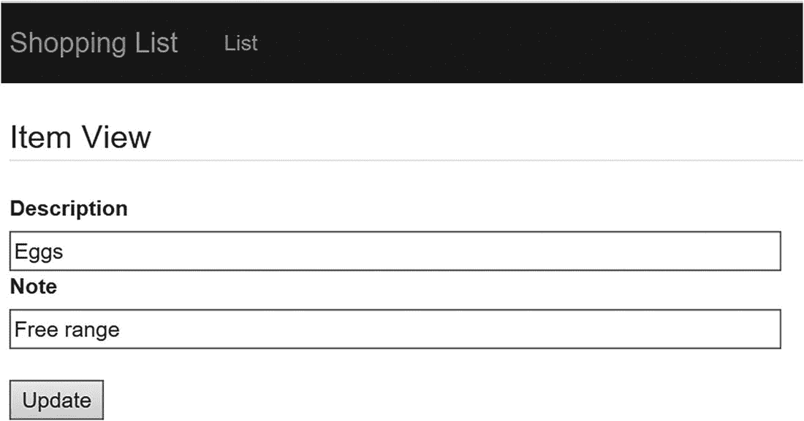
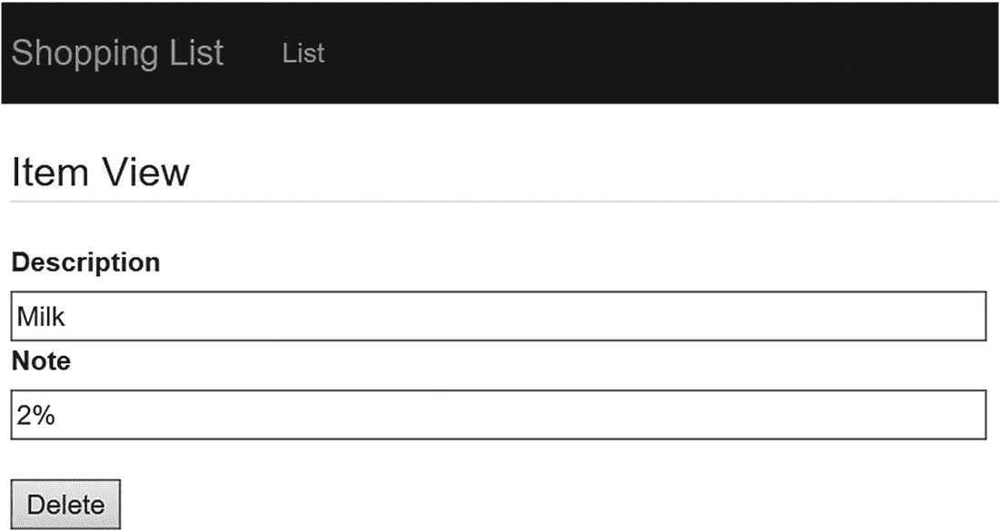
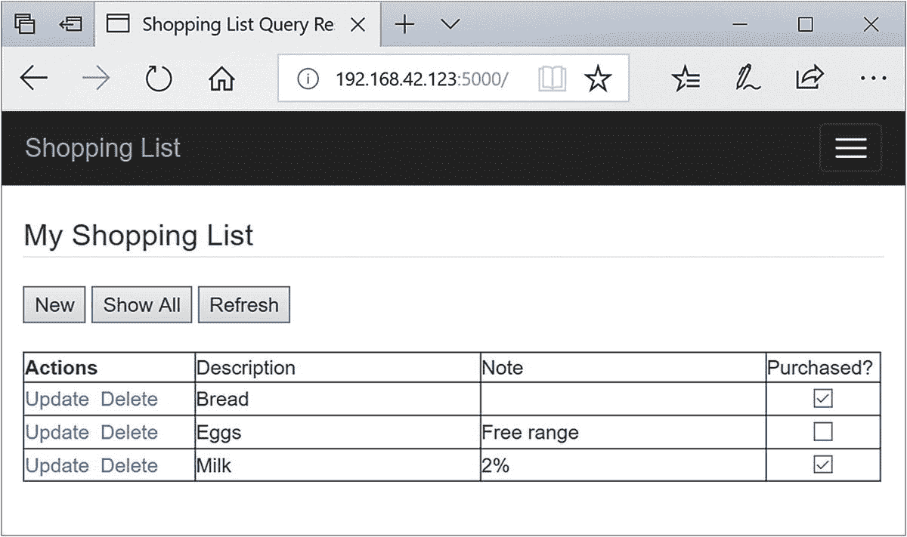
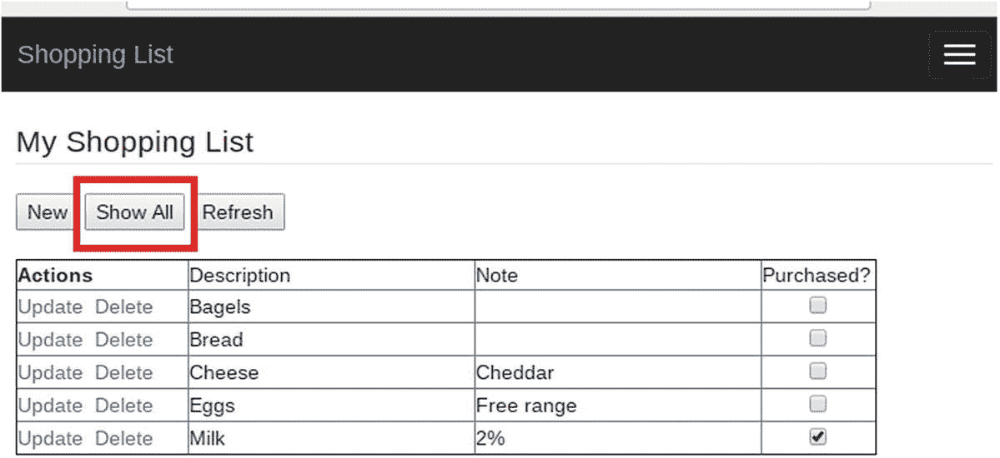

# 八、示例应用

现在，您已经学习了如何在一小组测试服务器上设置 InnoDB 集群，包括应用服务器和路由，您已经准备好使用一个示例应用来完成我们的演练。与其用第 7 章[的简单 Python 脚本来结束本教程，不如开发一个简单但功能齐全的高可用性应用来完成您的启蒙。编写该应用时，写请求将通过路由定向到当前的读/写服务器，读请求也将通过路由定向到只读服务器队列。](07.html)

虽然这看起来与普通应用可能做的事情没有太大区别，但是当您考虑到应用必须能够容忍集群中发生的故障时，这种区别就很明显了。请记住，路由将重新路由我们的连接，但我们必须重试任何打开的连接，以获得当前的活动连接(路由)。

在这一章中，你将看到如何开发一个高可用性的基于 web 的应用。我们将在应用中使用 Python，因为它简单易学，代码读起来比其他语言更清晰。但是如果你喜欢另一种语言，也不用担心。你可以很容易地用任何有 MySQL 数据库连接器的语言重写本章的代码。

让我们从这个示例应用将做什么以及它将如何工作的概述开始。幸运的是，所有的源代码都可以从 Apress book 网站下载，所以您不必手工输入代码。

### 小费

参见 [`www.apress.com/us/book/9781484238844`](http://www.apress.com/us/book/9781484238844) 下载本章的完整源代码。

首先，您必须了解示例应用是如何设计的以及它是如何工作的。毕竟，最好的例子应该是你可以在自己的环境中使用的东西；这个例子必须足够复杂和完整才有意义。

## 概观

我们将在本章中编写的示例应用是一个简单的杂货店或待办事项列表。它故意很小并且功能有限，因为我们希望专注于为 InnoDB Cluster 编写应用的基本机制，而不是花时间在编写用户界面或应用代码的巧妙或酷的方法上。例如，它是单用户应用，而高可用性应用是多用户的。移除多用户方面使应用更简单，更容易被更多的人使用。最后，错误处理代码是基本的。 <sup>[1](#Fn1)</sup>

这一点很重要，因为我们不需要一个非常复杂、功能全面的企业级应用来测试 MySQL InnoDB 集群，尤其是对于那些技术(或 MySQL)新手来说。有意保持应用简单(用户界面和功能)，意味着我们可以专注于高可用性应用的基本功能，因为它与数据库中的数据交互。

我们只需要考虑四个基本的数据函数；创建、读取、更新和删除(CRUD)。我们将使用 MySQL 连接器/Python 编写数据库代码来实现这些功能。事实上，我们将开发一个单独的模块来处理数据库代码，为用户界面提供一个代码模块(由几个相关文件组成)，为数据库代码提供一个代码模块。

应用会将一个项目列表(待办事项、购物项目等)作为默认视图(一个读取动作)呈现出来。然后，用户可以创建新项目以添加到列表中，或者在单独的详细视图中单击项目以更新或删除它。用户可以将项目标记为“完成”或“已购买”，并隐藏这些项目(或显示它们)。总而言之，这是一个管理列表的简单应用。

另一方面，用户界面使事情变得有点复杂。我们可以通过使用熟悉的用户界面设计来缓解这一问题。为此，我们将使用一个 web 应用。不幸的是，用纯 Python 编写 web 应用是乏味的，并且需要比我们在这种规模的工作中所能期望的更多的关于 web 应用工作方式的知识。

为了克服这个挑战，我们将使用一个流行的 Python web 应用框架。在这种情况下，我们将使用 Flask，包括入门、教程和用户界面代码的演练。正如您将看到的，Flask 也很容易学习，只有中等数量的细微差别和概念。Flask 最初是由阿明·罗纳彻开发的，已经被证明是 Python 最简单、最稳定的 web 平台之一。

因为这是一个简化的应用，所以在设计和实现中用户界面代码很少。精明的开发者可能会发现代码中需要改进的地方，以提供企业级服务，但同样，这不是像这样的实验所关心的。但是，如果你认为合适的话，可以随意修饰和改进应用。事实上，如果你选择扩展应用，本章末尾会有一些建议。

让我们从学习 Flask 的短暂旅程开始吧。

## 开始使用 Flask

如果您想继续并实现这个示例项目，您需要在您的计算机上安装一些东西。本节将帮助您为计算机准备所需的工具—您需要安装什么以及如何配置您的环境。您还将看到关于用户界面工具的简短介绍。

因为我们将开发在 Raspberry Pi 应用服务器(`cluster-rpi-app`)上运行的应用，所以我们将在该系统上安装我们需要的工具。如果您还没有这样做，请继续使用键盘、鼠标和显示器设置您的应用服务器，然后启动并登录。除非另有说明，否则所有命令都将从终端窗口运行。

### 设置您的环境

对你的环境的改变并不困难，也不漫长。我们将安装 Flask 和一些应用用户界面所需的扩展。Flask 是可以与 Python 一起使用的几个 web 库之一。这些 web 库使得用 Python 开发 web 应用比使用原始的 HTML 代码并为请求编写自己的处理程序和代码要容易得多。另外，Flask 并不难学。

表 [8-1](#Tab1) 列出了我们需要安装的库。该表列出了库/扩展的名称、简短描述以及产品文档的 URL。

表 8-1

必需的库

<colgroup><col class="tcol1 align-left"> <col class="tcol2 align-left"> <col class="tcol3 align-left"></colgroup> 
| 

库

 | 

描述

 | 

文件

 |
| --- | --- | --- |
| 瓶 | Python Web API | [T2`http://flask.pocoo.org/docs/0.12/installation/`](http://flask.pocoo.org/docs/0.12/installation/) |
| 烧瓶脚本 | Flask 的脚本支持 | [T2`https://flask-script.readthedocs.io/en/latest/`](https://flask-script.readthedocs.io/en/latest/) |
| 烧瓶自举 | 用户界面的改进和增强 | [T2`https://pythonhosted.org/Flask-Bootstrap/`](https://pythonhosted.org/Flask-Bootstrap/) |
| 烧瓶-WTF | WTForms 集成 | [T2`https://flask-wtf.readthedocs.io/en/latest/`](https://flask-wtf.readthedocs.io/en/latest/) |
| [T2`https://wtforms.readthedocs.io/en/latest/`](https://wtforms.readthedocs.io/en/latest/) |

当然，你应该已经在你的系统上安装了 Python，因为它附带了 Raspberry Pi 操作系统(回想一下， *Pi* 是 *Python* 的简称)。

要安装这些库，我们可以使用 Python 包管理器`pip3`，从命令行安装这些库。Raspberry Pi 中也包含了`pip3`实用程序，它被设计用来安装与 Python 版本 3 一起使用的包。

### 注意

如果您的系统上安装了多个版本的 Python，那么`pip`命令将安装到默认的 Python 版本环境中。要使用`pip`安装到特定版本，请使用`pipN`，其中`N`是版本。例如，`pip3`在 Python 3 环境中安装包。

`pip`命令非常方便，因为它使得安装注册的 Python 包(那些在 Python 包索引中注册的包，缩写为 PyPI<sup>[2](#Fn2)</sup>([`https://pypi.python.org/pypi`](https://pypi.python.org/pypi)))变得非常容易。`pip`命令将使用一个命令下载、解压和安装。让我们来看看如何安装我们需要的每个包。

清单 [8-1](#PC1) 展示了如何使用`pip3`命令为每个库(Flask、Flask-Script、Flask-Bootstrap 和 Flask-WTF)安装 Flask 和支持库。

```sql
$ sudo pip3 install Flask

Collecting Flask

  Downloading https://files.pythonhosted.org/packages/7f/e7/08578774ed4536d3242b14dacb4696386634607af824ea997202cd0edb4b/Flask-1.0.2-py2.py3-none-any.whl (91kB)
    100% |█████████████████| 92kB 1.6MB/s
Requirement already satisfied: click>=5.1 in /usr/lib/python3/dist-packages (from Flask)
Collecting Jinja2>=2.10 (from Flask)
  Downloading https://files.pythonhosted.org/packages/7f/ff/ae64bacdfc95f27a016a7bed8e8686763ba4d277a78ca76f32659220a731/Jinja2-2.10-py2.py3-none-any.whl (126kB)
    100% |█████████████████| 133kB 1.3MB/s
Requirement already satisfied: itsdangerous>=0.24 in /usr/lib/python3/dist-packages (from Flask)
Collecting Werkzeug>=0.14 (from Flask)
  Downloading https://files.pythonhosted.org/packages/20/c4/12e3e56473e52375aa29c4764e70d1b8f3efa6682bef8d0aae04fe335243/Werkzeug-0.14.1-py2.py3-none-any.whl (322kB)
    100% |█████████████████| 327kB 637kB/s
Requirement already satisfied: MarkupSafe>=0.23 in /usr/lib/python3/dist-packages (from Jinja2>=2.10->Flask)
Installing collected packages: Jinja2, Werkzeug, Flask
  Found existing installation: Jinja2 2.8
    Not uninstalling jinja2 at /usr/lib/python3/dist-packages, outside environment /usr
  Found existing installation: Werkzeug 0.11.15
    Not uninstalling werkzeug at /usr/lib/python3/dist-packages, outside environment /usr
Successfully installed Flask-1.0.2 Jinja2-2.10 Werkzeug-0.14.1

$ sudo pip3 install Flask-Script

Collecting Flask-Script
  Downloading https://www.piwheels.org/simple/flask-script/Flask_Script-2.0.6-py3-none-any.whl
Collecting Flask (from Flask-Script)
  Downloading https://files.pythonhosted.org/packages/7f/e7/08578774ed4536d3242b14dacb4696386634607af824ea997202cd0edb4b/Flask-1.0.2-py2.py3-none-any.whl (91kB)
    100% |█████████████████| 92kB 2.1MB/s
Collecting click>=5.1 (from Flask->Flask-Script)
  Downloading https://files.pythonhosted.org/packages/34/c1/8806f99713ddb993c5366c362b2f908f18269f8d792aff1abfd700775a77/click-6.7-py2.py3-none-any.whl (71kB)
    100% |█████████████████| 71kB 1.0MB/s

Installing collected packages: Flask-Script
Successfully installed Flask-Script-2.0.6

$ sudo pip3 install

Flask-Bootstrap

Collecting Flask-Bootstrap
  Downloading https://www.piwheels.org/simple/flask-bootstrap/Flask_Bootstrap-3.3.7.1-py3-none-any.whl (461kB)
    100% |█████████████████| 471kB 25kB/s
Collecting visitor (from Flask-Bootstrap)
  Downloading https://www.piwheels.org/simple/visitor/visitor-0.1.3-py3-none-any.whl
Collecting dominate (from Flask-Bootstrap)
  Downloading https://www.piwheels.org/simple/dominate/dominate-2.3.1-py3-none-any.whl
Requirement already satisfied: Flask>=0.8 in /usr/lib/python3/dist-packages (from Flask-Bootstrap)
Installing collected packages: visitor, dominate, Flask-Bootstrap
Successfully installed Flask-Bootstrap-3.3.7.1 dominate-2.3.1 visitor-0.1.3

$ sudo pip3 install

Flask-WTF

Collecting Flask-WTF
  Downloading https://files.pythonhosted.org/packages/60/3a/58c629472d10539ae5167dc7c1fecfa95dd7d0b7864623931e3776438a24/Flask_WTF-0.14.2-py2.py3-none-any.whl
Requirement already satisfied: Flask in /usr/lib/python3/dist-packages (from Flask-WTF)
Collecting WTForms (from Flask-WTF)
  Downloading https://www.piwheels.org/simple/wtforms/WTForms-2.1-py2.py3-none-any.whl (140kB)
    100% |█████████████████| 143kB 41kB/s
Installing collected packages: WTForms, Flask-WTF
Successfully installed Flask-WTF-0.14.2 WTForms-2.1

Listing 8-1
Installing Flask

```

请注意，该命令下载必要的组件，提取它们，然后运行每个组件的安装程序。在这种情况下，Flask 由几个组件组成，包括 Werkzeug、MarkupSafe 和 Jinja2。在接下来的“烧瓶初级读本”一节中，你将会学到更多。

您还应该安装 MySQL 连接器/Python 8.0.11 或更高版本的数据库连接器。如果您没有在第 [7](07.html) 章的演练中安装它，请参见该章中的“测试集群”一节，并安装数据库连接器。

现在我们的计算机已经安装好了，让我们上一堂关于 Flask 及其相关扩展的速成课。

## 弗拉斯克第一

Flask 是与 Python 一起使用的几个 web 应用库(有时称为*框架*或*应用编程接口*，或 API)之一。Flask 在众多选择中是独一无二的，因为它很小，而且在你熟悉它的工作原理之后，它很容易使用。编写初始化代码后，使用 Flask 的大部分工作将局限于创建网页、重定向响应和编写功能代码。

Flask 被认为是一个微框架，因为它小巧轻便，它不会强迫你进入一个盒子，专门编写代码来与框架交互。它提供了您需要的一切，没有什么是您不需要的，让您自己选择在代码中使用什么。

Flask 由提供其基本功能的两个主要组件组成:一个 Web 服务器网关接口(WSGI ),用于处理托管网页的所有工作；一个模板库，用于简化网页开发，减少学习 HTML 的需要，删除重复的结构，并为 HTML 代码提供脚本功能。WSGI 组件被命名为 *Werkzeug* ，大致翻译自德语，意思是*工作素材* ( [`http://werkzeug.pocoo.org`](http://werkzeug.pocoo.org) `/`)。模板组件被命名为 *Jinja2* ，并模仿 Django ( [`http://jinja.pocoo.org/docs/2.10/`](http://jinja.pocoo.org/docs/2.10/) )。两者都是由 Flask 的创始人开发和维护的。最后，当您安装 Flask 时，这两个组件都会被安装。

Flask 也是一个可扩展的库，允许其他开发者创建基本库的附件(扩展)来添加功能。在上一节中，您看到了如何安装 Flask 可用的一些扩展。我们将在本章中使用脚本、引导和 WTForms 扩展。能够挑选您想要的扩展意味着您可以保持您的应用尽可能小，只添加您需要的。

您可能认为 Flask“缺少”的组件之一是与其他服务(如数据库系统)交互的能力。这是一个有目的的设计，像这样的功能可以通过扩展来实现。事实上，Flask 有几个数据库扩展可用，包括那些允许您使用 MySQL 的扩展。但是，因为我们希望将应用与 InnoDB 集群一起使用，所以我们必须使用 Oracle 提供的连接器 MySQL Connector/Python。

Flask 和前面描述的扩展一起，提供了用 Python 制作 web 应用所需的所有连接和管道。它消除了编写 web 应用所需的几乎所有负担，例如解释客户机响应包、路由、HTML 表单处理等等。如果您曾经用 Python 编写过 web 应用，您将会体会到创建健壮的 web 页面的能力，而无需编写 HTML 和样式表的复杂性。一旦你熟悉如何使用 Flask，它将允许你专注于你的应用的代码，而不是花大量的时间编写用户界面。

现在，让我们开始学习 Flask！如果您不着急，尝试一下示例应用，您的第一个 Flask 应用将在第一次尝试时就能工作。学习 Flask 最难的部分已经过去了——安装 Flask 及其扩展。剩下的就是学习在 Flask 中编写应用的概念。在此之前，让我们了解一下 Flask 中的术语，以及如何设置我们将用来初始化本章中使用的应用实例的基本代码。

### 小费

如果你想进一步了解 Flask，可以考虑阅读在线文档、用户指南和位于 [`http://flask.pocoo.org/docs/0.12/`](http://flask.pocoo.org/docs/0.12/) 的示例。

### 术语

Flask 旨在减少编写 web 应用的繁琐。按照 Flask 的说法，使用代码的两个部分来呈现一个网页:一个在 HTML 文件中定义的*视图*，以及一个处理客户端请求的*路由*。回想一下，我们可以看到两个请求中的一个:一个是请求加载网页的`GET`请求(从客户端的角度读取)，另一个是从客户端通过网页向服务器发送数据的`POST`请求(从客户端的角度写入)。这两个请求都在 Flask 中通过使用您定义的函数来处理。

然后，这些函数呈现网页，并将其发送回客户端以满足请求。Flask 调用函数*视图函数*(或简称*视图*)。Flask 知道调用哪个方法的方式是使用识别 URL 路径的装饰器(在 Flask 中称为 *route* )。你可以用一条或多条路线来装饰一个功能，这样就可以提供多种到达视图的方式。用的装饰师是`@app.route(<path>)`。以下显示了查看功能的多条路线的示例:

```sql
@app.route('/list_item', methods=['GET', 'POST'])
@app.route('/list_item/<string:item_selected>', methods=['GET', 'POST'])
def list_view(isbn_selected=None):
    notes = None
    form = ListForm()
...
    if request.method == 'POST':
        pass
    return render_template("list.html", form=form)

```

注意这里有多个装饰者。第一个是`list`，它允许我们使用类似于`localhost:5000/list_item`的 URL，这使得 Flask 将执行路由到`list_view()`函数。第二个是`list_item/<item_selected>`，演示了如何使用变量向视图传递信息。在这种情况下，如果用户(应用)使用 URL `localhost:5000/list_item/9`，Flask 将值`9`放在`item_selected`变量中。这样，我们可以动态地将信息传递给我们的视图。

还要注意，路由指定了每条路由允许的方法。在这个应用中，我们可以为任何一个路由设置一个`GET`或`POST`。如果你不使用装饰器，默认设置是`GET`，使网页只读。

最后，请注意，在函数的末尾，我们通过调用`render_template()`函数(从 Flask 模块导入)返回，该函数告诉 Flask 返回(刷新)带有我们获取或分配的数据的网页。这个网页，`book.html`在 Flask 中被称为一个*窗体*。我们将使用这个概念从数据库中检索信息并将其发送给用户。我们可以返回一个简单的 HTML 字符串(或整个文件)或所谓的表单。因为我们使用 Flask-WTF 和 WTForms 扩展，所以我们可以返回一个呈现为表单类的模板。我们将在后面的章节中讨论表单、表单类以及章节项目的其他路径和视图。正如您将看到的，模板是另一个强大的功能，它使创建网页变得很容易。

### 什么是室内设计师？

在 Python 中，我们可以通过使用 decorators 来指定特殊的处理参数。装饰器只是改变函数行为的一种方式。例如，您可以使用 decorators 来添加更强的类型检查、定义宏以及在执行前后调用函数。在 Flask 中使用 decorator 进行路由是正确使用 decorator 的最好例子之一。要了解更多关于装修工的信息，请参见 [`www.python.org/dev/peps/pep-0318`](http://www.python.org/dev/peps/pep-0318) 。

Flask 构建了一个应用中所有路径的列表，使得应用在被请求时可以很容易地将执行路由到正确的函数。但是，如果请求了一条路线，但该路线在应用中不存在，会发生什么情况呢？默认情况下，您会得到类似于`Not Found. The requested URL was not found on the server`的一般错误消息。在后面的小节中，您将看到如何添加我们自己的自定义错误处理路由。

既然您已经了解了 Flask 中使用的术语以及它是如何与 web 页面一起工作的，那么让我们来看看一个典型的 Flask 应用的构造以及我们需要的扩展。

### 初始化和应用实例

Flask 及其扩展为您的 web 应用提供了入口点。Flask 会为您完成这些工作，而不是自己编写所有繁重的代码！我们将在本章使用的 Flask 扩展包括 Flask-Script、Flask-Bootstrap、Flask-WTF 和 WTForms。以下各节简要介绍了每一种方法。

#### 烧瓶脚本

*Flask-Script* 通过添加一个命令行解析器(显示为`manager`)来启用 Flask 应用中的脚本，您可以使用该解析器链接到您编写的函数。这可以通过用`@manager.command`修饰函数来实现。理解这为我们做了什么的最好方法是通过一个例子。

下面是一个基本的原始 Flask 应用，它什么也不做。它甚至不是一个“hello，world”示例，因为没有显示任何内容，也没有托管任何网页—它只是一个原始的 Flask 应用:

```sql
from flask import Flask      # import the Flask framework
app = Flask(__name__)        # initialize the application
if __name__ == "__main__":   # guard for running the code
    app.run()                # launch the application

```

注意这个`app.run()`调用。这被称为*服务器启动*，当我们使用 Python 解释器加载脚本时执行。当我们运行这段代码时，我们看到的只是来自 Flask 的默认消息:

```sql
$ python3 ./flask-ex.py --help
 * Running on http://127.0.0.1:5000/ (Press CTRL+C to quit)

```

请注意，我们无法查看帮助，因为没有这样的选项。代码通过使用 web 服务器的默认值启动(如果需要，我们可以在代码中更改)。例如，我们可以改变服务器监听的端口。

使用 Flask-Script，我们不仅添加了帮助选项，还添加了控制服务器的选项。下面的代码显示了添加语句来启用 Flask-Script 是多么容易。新语句以粗体突出显示:

```sql
from flask import Flask          # import the Flask framework

from flask_script import Manager # import the flask script manager class

app = Flask(__name__)            # initialize the application

manager = Manager(app)           # initialize the script manager class

# Sample method linked as a command-line option

@manager.command

def hello_world():

    """Print 'Hello, world!'"""
    print("Hello, world!")

if __name__ == "__main__":       # guard for running the code
    manager.run()                # launch the application via manager class

```

当这段代码运行时，我们可以看到额外的选项可用。请注意，文档字符串(紧跟在方法定义之后)显示为所添加命令的帮助文本:

```sql
$ python ./flask-script-ex.py --help
usage: flask-script-ex.py [-?] {hello_world,shell,runserver} ...

positional arguments:
  {hello_world,shell,runserver}
    hello_world         Print 'Hello, world!'
    shell               Runs a Python shell inside Flask application context.
    runserver           Runs the Flask development server i.e. app.run()

optional arguments:
  -?, --help            show this help message and exit

```

我们可以看到我们添加的命令行参数(命令)，`hello_world`，但是我们也可以看到 Flask-Script 提供的两个新参数:`shell`和`runserver`。启动服务器时，您必须选择其中一个命令。`shell`命令允许您在 Python 解释器或类似工具中使用代码，而`runserver`执行代码启动 web 服务器。

我们不仅可以获得关于命令和选项的帮助，而且 Flask-Script 还提供了从命令行对服务器的更多控制。事实上，通过添加`--help`选项，我们可以看到每个命令的所有选项:

```sql
$ python ./flask-script-ex.py runserver --help
usage: flask-script-ex.py runserver [-?] [-h HOST] [-p PORT] [--threaded]
                                    [--processes PROCESSES]
                                    [--passthrough-errors] [-d] [-D] [-r] [-R]
                                    [--ssl-crt SSL_CRT] [--ssl-key SSL_KEY]

Runs the Flask development server i.e. app.run()

optional arguments:
  -?, --help            show this help message and exit
  -h HOST, --host HOST
  -p PORT, --port PORT
  --threaded
  --processes PROCESSES
  --passthrough-errors
  -d, --debug           enable the Werkzeug debugger (DO NOT use in production
                        code)
  -D, --no-debug        disable the Werkzeug debugger
  -r, --reload          monitor Python files for changes (not 100% safe for
                        production use)
  -R, --no-reload       do not monitor Python files for changes
  --ssl-crt SSL_CRT     Path to ssl certificate
  --ssl-key SSL_KEY     Path to ssl key

```

在这里，我们可以控制服务器的所有方面，包括端口、主机，甚至它是如何执行的。

最后，我们可以执行我们装饰为命令行选项的方法:

```sql
$ python ./flask-script-ex.py hello_world
Hello, world!

```

Flask-Script 仅用几行代码就提供了一些强大的功能。你一定会喜欢的！

#### 烧瓶自举

Flask-Bootstrap 最初由 Twitter 开发，用于制作统一、好看的网络客户端。幸运的是，Twitter 将其扩展为 Flask，这样每个人都可以利用它的特性。Flask-Bootstrap 是一个独立的框架，它提供了更多的命令行控制和用户界面组件，以获得干净、漂亮的网页。它也兼容最新的网络浏览器。

该框架在幕后发挥其神奇的作用，作为级联样式表(CSS)和脚本的客户端库，这些样式表和脚本是从 Flask 中的 HTML 模板(通常称为 *HTML 文件*或*模板文件*)调用的。您将在后面的章节中了解更多关于模板的内容。因为应用是客户端的，所以在主应用中初始化它，我们不会看到太多。不管怎样，下面显示了如何将 Flask-Bootstrap 添加到我们的应用代码中。这里，我们有一个框架，其中初始化并配置了 Flask-Script 和 Flask-Bootstrap:

```sql
from flask import Flask          # import the Flask framework
from flask_script import Manager # import the flask script manager class
from flask_bootstrap import Bootstrap  # import the flask bootstrap extension

app = Flask(__name__)            # initialize the application
manager = Manager(app)           # initialize the script manager class
bootstrap = Bootstrap(app)       # initialize the bootstrap extension

if __name__ == "__main__":       # guard for running the code
    manager.run()                # launch the application via manager class

```

#### WTForms

为了支持 Flask-WTF 扩展，WTForms 是我们需要的一个组件。它提供了 Flask-WTF 组件所提供的大部分功能(因为 Flask-WTF 组件是 WTForms 的 Flask 特定包装器)。我们只需要安装它作为 Flask-WTF 的先决条件，我们将在 Flask-WTF 的上下文中讨论它。

### 注意

Flask-WTF 的一些包装装置可以包括 WTForms。

#### 烧瓶-WTF

*Flask-WTF* 扩展是一个有趣的组件，它提供了几个有用的附加功能——对于我们的目的来说，最显著的是与 WTForms(一个框架无关的组件)的集成，允许创建表单类，以及以跨站点请求伪造(CSRF)保护的形式提供额外的 web 安全性。这两个特性允许您将 web 应用提升到更高的复杂程度。

##### 表单类

*表单类*提供了一个类的层次结构，使得定义网页更加合理。使用 Flask-WTF，您可以用两段代码定义表单:一个从`Form`类(从 Flask 框架导入)派生的特殊类，用于使用一个或多个提供数据编程访问的附加类来定义字段，以及一个用于呈现网页的 HTML 文件(或模板)。这样，我们在 HTML 文件上看到了一个抽象层(表单类)。在下一节中，您将了解更多关于 HTML 文件的内容。

使用表单类，您可以定义一个或多个字段，比如文本的`TextField`，字符串的`StringField`，等等。更好的是，您可以定义允许您以编程方式描述数据的验证器。例如，您可以为文本字段定义最小和最大字符数。如果提交的字符数超出范围，将生成一条错误消息。是的，您可以定义错误消息！查看 [`http://wtforms.readthedocs.io/en/latest/validators.html`](http://wtforms.readthedocs.io/en/latest/validators.html) 获得验证器的完整列表。以下是一些可用的验证器:

*   `DataRequired`:判断输入栏是否为空

*   `Email`:确保该字段遵循电子邮件 ID 约定

*   `IPAddress`:验证 IP 地址

*   `Length`:确保文本长度在给定范围内

*   `NumberRange`:确保文本是数字，并且在给定的范围内

*   `URL`:验证 URL

为了形成类，我们必须导入类和任何我们想在应用的序言中使用的字段类。下面显示了一个导入表单类和表单域类的示例。在本例中，我们还导入了用于自动验证数据的验证器:

```sql
from flask_wtf import FlaskForm
from wtforms import (HiddenField, TextField, TextAreaField, SelectField,
                     SelectMultipleField, IntegerField, SubmitField)
from wtforms.validators import Required, Length

```

要定义一个表单类，我们必须从`FlaskForm`派生一个新类。从那里，我们可以构造我们想要的类，但是它允许您定义字段。`FlaskForm`父类包括 Flask 需要实例化和使用 form 类的所有必要代码。

让我们看一个简单的，假设的例子。下面显示了一个网页的 form 类，该网页显示作者的名和姓。在这个例子中，有一个名为`authors`的表，我们可以通过 view 函数将它链接到这个代码。`authors`表包含三个字段:自动增量字段(`authorid`)、作者的名字(`firstname`)和作者的姓氏(`lastname`)。因为用户不需要看到作者 ID 字段，所以我们隐藏了该字段，其他字段是`TextField()`类的派生。请注意这些是如何在清单中定义的，名称(标签)作为第一个参数:

```sql
class AuthorForm(FlaskForm):
    authorid = HiddenField('AuthorId')
    firstname = TextField('First name', validators=[
            Required(message=REQUIRED.format("Firstname")),
            Length(min=1, max=64, message=RANGE.format("Firstname", 1, 64))
        ])
    lastname = TextField( 'Last name', validators=[
            Required(message=REQUIRED.format("Lastname")),
            Length(min=1, max=64, message=RANGE.format("Lastname", 1, 64))
        ])
    create_button = SubmitField('Add')
    del_button = SubmitField('Delete')

```

还要注意，我们已经为字段定义了一组验证器，其形式为从 WTForms 组件导入的函数调用。在每一种情况下，我们都为消息使用字符串，以使代码更容易阅读，更统一。这些字符串包括以下内容:

```sql
REQUIRED = "{0} field is required."
RANGE = "{0} range is {1} to {2} characters."

```

我们使用`Required()`验证器来指示字段必须有一个值。我们用字段的名称增加了默认的错误消息，使用户更容易理解。我们还使用了一个`Length()`验证函数来定义字段数据的最小和最大长度。我们再次增加了默认的错误消息。验证器只应用于`POST`操作(当提交事件发生时)。

接下来，我们有两个`SubmitField()`实例:一个用于创建(添加)按钮，另一个用于删除按钮。正如您可能猜测的那样，按照 HTML 的说法，这些字段被呈现为类型为`submit`的`<input>`字段。

最后，为了使用一个表单类，我们在一个视图函数中实例化这个类。下面显示了作者视图函数的存根。我们实例化名为`AuthorForm()`的表单类，并将其赋给名为`form`的变量，该变量被传递给`render_template()`函数:

```sql
@app.route('/author', methods=['GET', 'POST'])
@app.route('/author/<int:author_id>', methods=['GET', 'POST'])
def author(author_id=None):
    form = AuthorForm()
    if request.method == 'POST':
        pass
    return render_template("author.html", form=form)

```

有几个字段类可供使用。表 [8-2](#Tab2) 显示了一个最常用的字段类的例子(也称为 *HTML 字段*)。您还可以从这些字段派生来创建自定义字段类，并为可以显示在字段旁边的标签提供文本(例如，作为按钮文本)。在后面的部分中，您将看到一个这样的例子。

表 8-2

WTForms 字段类

<colgroup><col class="tcol1 align-left"> <col class="tcol2 align-left"></colgroup> 
| 

字段类

 | 

描述

 |
| --- | --- |
| `BooleanField` | 具有真值和假值的复选框 |
| `DateField` | 接受日期值 |
| `DateTimeField` | 接受日期时间值 |
| `DecimalField` | 接受十进制值 |
| `FileField` | 文件上传字段 |
| `FloatField` | 接受浮点值 |
| `HiddenField` | 隐藏文本字段 |
| `IntegerField` | 接受整数值 |
| `PasswordField` | 密码(屏蔽)文本字段 |
| `RadioField` | 单选按钮列表 |
| `SelectField` | 下拉列表(选择一个) |
| `SelectMultipleField` | 下拉选项列表(选择一项或多项) |
| `StringField` | 接受简单文本 |
| `SubmitField` | 表单提交按钮 |
| `TextAreaField` | 多行文本字段 |

##### 跨站点请求伪造(CSRF)保护

跨站点请求伪造(CSRF)保护是一种允许开发者用加密密钥签署网页的技术，这使得黑客欺骗`GET`或`POST`请求更加困难。这是通过首先在应用代码中放置一个特殊的键，然后在每个 HTML 文件中引用这个键来实现的。下面显示了一个应用序言的示例。我们所需要做的就是用一个短语给`app.config`数组的`SECRET_KEY`索引赋值。这应该是一个不容易猜到的短语。

```sql
from flask import Flask          # import the Flask framework
from flask_script import Manager # import the flask script manager class
from flask_bootstrap import Bootstrap  # import the flask bootstrap extension

app = Flask(__name__)            # initialize the application

app.config['SECRET_KEY'] = "He says, he's already got one!"

manager = Manager(app)           # initialize the script manager class
bootstrap = Bootstrap(app)       # initialize the bootstrap extension

if __name__ == "__main__":       # guard for running the code
    manager.run()                # launch the application via manager class

```

要激活网页中的 CSRF，我们只需将`form.csrf_token`添加到 HTML 文件中。这是一个特殊的隐藏字段，Flask 使用它来验证请求。在后面的部分中，您将了解到更多关于在哪里放置它的信息。但首先，让我们看看 Flask 的一个很酷的功能，叫做 *flash* 。

#### 信息闪烁

Flask 有很多很酷的功能。Flask 的创建者和 Flask 扩展的创建者似乎考虑到了一切——甚至错误消息。考虑一个典型的 web 应用。你如何向用户传达错误？你是否重定向到一个新页面，<sup>[【3】](#Fn3)</sup>弹出一个， <sup>[4](#Fn4)</sup> 或者在页面上显示错误？Flask 有一个解决方案叫做*消息闪烁*。

消息闪烁是使用 Flask 框架中的`flash()`方法完成的。我们在代码的序言中导入它，当我们想要显示一条消息时，我们调用`flash()`函数，传入我们想要看到的错误消息。Flask 将在表单顶部的一个格式良好的框中显示错误。它不会取代表单，也不是弹出窗口，但是它允许用户关闭消息。您可以使用 flash messaging 向用户传达错误、警告甚至状态更改。

图 [8-1](#Fig1) 显示了一个闪光信息的例子。在本例中，两条 flash 消息演示了您可以同时显示多条消息。请注意用于消除图像的消息右侧的小 X。


图 8-1

示例简讯

在下一节中，您将看到一种将 flash 消息构建到我们所有网页中的机制。

### HTML 文件和模板

让我们回顾一下到目前为止的旅程。您已经了解了如何用各种组件初始化应用，并学习了 Flask 如何通过 decorators 使用路由来为应用创建一组 URLs 这些路由指向一个视图函数，该函数实例化了 form 类。难题的下一部分是将 HTML 网页链接到 form 类。

回想一下，这是通过`render_template()`函数完成的，在这里我们传入一个 HTML 文件的名称进行处理。名称中有*模板*的原因是我们可以使用 Jinja2 模板组件使编写网页更容易。更具体地说，HTML 文件包含 HTML 标记和 Jinja2 模板构造。

### 注意

所有 HTML 文件(模板)必须存储在与主应用代码相同的位置的`templates`文件夹中。例如，如果你的代码在一个名为`my-flask-app.py`的文件中，那么在与`my-flask-app.py`相同的文件夹中应该有一个`templates`文件夹。如果你把模板放在其他地方，Flask 将找不到 HTML 文件。

模板和表单类是设计用户界面的地方。简而言之，模板用于包含表示逻辑，HTML 文件用于包含表示数据。一些读者可能需要花一些时间来尝试如何使用模板。下面几节将简要介绍 Jinja2 模板，并演示如何在我们的 HTML 文件中使用它们。有关更多详细信息，请参见在线文档。

#### Jinja2 模板概述

Jinja2 模板，也就是*模板*，用于包含任何表示逻辑，例如循环遍历数据数组，决定显示什么，甚至选择格式和表示设置。如果您熟悉其他 web 开发环境，您可能已经看到过这种封装在脚本中或通过嵌入式脚本(如 JavaScript)实现的功能。

回想一下，我们在主代码中呈现了网页。这个函数告诉 Flask 读取指定的文件，并将模板结构转换(渲染)成 HTML。Flask 会将模板结构扩展并编译成 HTML，web 服务器可以将它呈现给客户机。

您可以使用几个模板构造来控制执行、循环甚至注释的流程。每当你想使用一个模板构造(想想*脚本语言*，你用前缀和后缀``把它括起来。这样做是为了让 Flask 框架将该构造识别为模板操作，而不是 HTML。

然而，看到模板结构与 HTML 标记混杂在一起并不罕见(也很正常)。事实上，这正是你应该做的。毕竟，您将创建的文件被命名为`.html`。它们只是碰巧包含模板构造。这是否意味着在使用 Flask 时只能使用模板？不，当然不是。如果你愿意，你可以渲染一个纯 HTML 文件！

起初，查看模板可能会令人望而生畏。但也没那么难。只需查看所有将``作为“代码”部分的行。 <sup>[5](#Fn5)</sup> 你也可以看到以`{# #}`前缀和后缀形式出现的评论。

### 警告

所有模板构造都要求在``之前有一个空格。

如果您查看模板，您会看到使用两个空格的缩进来格式化的构造和标记。缩进和一般的空白，在标签和构造之外无关紧要。然而，大多数开发者会使用某种形式的缩进来使文件更容易阅读。事实上，大多数编码指南都要求缩进。

模板除了构造之外的一个很酷的特性(想想*代码*)是创建模板层次结构的能力。这允许您创建一个其他模板可以使用的“基础”模板。例如，您可以创建一个模板构造和 HTML 标记的样板文件，这样您的所有网页看起来都一样。

回想一下 Flask-Bootstrap，Bootstrap 提供了几个很好的格式化特性。这些特性中的一个创建了一个看起来很不错的导航条。很自然，我们希望它出现在我们所有的网页上。我们可以通过在基本模板中定义它并在我们的其他模板(HTML)文件中扩展它来做到这一点。让我们看一下库应用的基本模板。清单 [8-2](#PC15) 显示了本章中示例应用的基础模板。为了便于讨论，添加了行号。

```sql
01 
02 ShoppingList
03 
04 <div class="navbar navbar-inverse" role="navigation">
05     <div class="container">
06         <div class="navbar-header">
07             <button type="button" class="navbar-toggle" data-toggle="collapse" data-target=".navbar-collapse">
08                 <span class="sr-only">Toggle navigation</span>
09                 <span class="icon-bar"></span>
10                 <span class="icon-bar"></span>
11                 <span class="icon-bar"></span>
12             </button>
13             <a class="navbar-brand" href="/">Shopping List</a>
14         </div>
15         <div class="navbar-collapse collapse">
16             <ul class="nav navbar-nav">
17                 <li><a href="/">List</a></li>
18             </ul>
19         </div>
20     </div>
21 </div>
22 
23
24 
25 <div class="container">
26     
27     <div class="alert alert-warning">
28         <button type="button" class="close" data-dismiss="alert">&times;</button>
29         {{ message }}
30     </div>
31     
32
33     
34 </div>
35 

Listing 8-2Sample Base Template

```

哇，这里发生了很多事情！注意第一行。这告诉我们，我们正在继承(扩展)另一个名为`bootstrap/base.html`的模板。这是在你安装 Flask-Bootstrap 时免费提供给你的，正是这个模板包含了对 Bootstrap 导航栏特性的支持。这是为 Flask 应用构建一组 HTML 文件的常用方法，您将在本节的后面看到。

让我们从鸟瞰图开始我们的旅行。请注意，有两个“模块”分别标有``和``(第 2、3、22、24、33 和 35 行)。这些是用于逻辑部分的，在这里我们可以将格式应用于块内的标记和构造。用编码术语来说，这就像一个代码块。第一个块定义了页面的标题——在本例中是`Shopping List`,这是库应用的可执行名称。

第二块定义了应用的导航栏(想想*菜单*)。在该部分中，第 5–21 行定义了简单的 HTML `<div>`标签，这些标签构成了导航栏上的项目。值得注意的是第 13 行，它指定了用作应用名称的文本，该文本出现在导航栏的左侧，类似于“home”链接。第 15–19 行定义了导航栏项目(提交按钮)，但是在这个应用中只有一个表单。还要注意关键字`collapse`。这表明可以折叠导航栏。

第 24–35 行的最后一个块定义了模板结构和 flash 消息的 HTML 标签。让我们更深入地看看这段代码(为了方便起见，这里重复了一遍):

```sql
24 
25 <div class="container">
26     
27     <div class="alert alert-warning">
28         <button type="button" class="close" data-dismiss="alert">&times;</button>
29         {{ message }}
30     </div>
31     
32
33     
34 </div>
35 

```

这里，我们看到另一个包含按钮的`<div>`标签。这是我们用来关闭简讯的按钮。注意，这个标签被放在一个用``指定的`for`循环中，并以``结束。在本例中，我们循环从`get_flashed_messages()`函数返回的消息，这些消息是由应用代码中的`flash()`函数收集的。这告诉我们几件事:我们可以在模板中使用循环，模板允许显示多个图像(您在前面已经看到了)，模板可以调用函数！这是模板威力的一个例子。

### 注意

模板不需要以任何方式格式化。空白在 HTML 标签或模板构造之外没有任何作用。

最后，注意我们在第 26 行的 for 循环中定义的变量。这个变量`message`被定义在它出现的块的本地(在本例中是`for`循环)，并且可以通过将它放在`{{ }}`中在任何时候被引用。例如，在第 29 行中，我们在`<div>`标签中使用了`{{ message }}`，这意味着该文本将出现在客户机上，由 Flask 就地呈现。当我们讨论如何用模板构建用户界面时，变量的使用将变得更加重要。

#### 模板语言结构

Jinja2 模板有很多特性，对所有特性的完整讨论超出了本书的范围。然而，快速参考 Jinja2 的主要结构是很方便的。下面是一些常用的构造，包括上一节中的一些(为了完整性)。每一个都有一个简短的例子来说明这个结构在模板中的出现方式。在本章后面探索库应用或编写自己的 Flask 应用时，请随意参考本节。

##### 评论

您可以在模板中嵌入自己的注释。您可能希望这样做，以确保您充分解释了您正在做的事情，并在以后重用代码时作为一个提醒。 <sup>[6](#Fn6)</sup> 下面是一个在模板中使用注释的例子。回想一下，注释以`{#`开始，以`#}`结束，可以跨多行。

```sql
{# This is a line comment written by Dr. Charles Bell on 25 May 2018\. #}

{#
  Introducing MySQL InnoDB Cluster

  This template defines the base template used for all of the HTML forms and responses in the MyLibrary application. It also defines the menu for the basic operations.

  Dr. Charles Bell, 2018
#}

```

##### 包括

如果您的模板文件增长了，并且您发现有些部分是可重用的，比如一个`<div>`标签，您可以将标签和模板构造保存在一个单独的文件中，并通过使用``构造将它包含在其他模板中。``构造将您想要包含的文件的名称作为参数。像模板一样，这些必须驻留在`templates`文件夹中。这样，我们避免了重复和维护重复代码的麻烦和容易出错的任务。

```sql
{# Include the utilities common tags for a list. #}


```

##### 宏指令

减少重复代码的另一种形式是创建一个宏在你的模板中使用(想想*函数*)。在这种情况下，我们使用``和``构造来定义一个宏，稍后我们可以在代码中调用(使用)它。下面显示了一个定义简单宏并在循环中使用它的示例。注意我们是如何将变量传递给宏来操作数据的。

```sql
{# Macro definition #}

    <b>{{ data }}</b>


{# Invoke the macro #}

    {{ bold_me(value) }}


```

##### 导入

使用宏的最好方法之一是将它们放在一个单独的代码文件中，从而进一步增强可重用性。为了使用一个单独文件中的宏，我们使用了``构造，提供了要导入的文件的名称。下面显示了一个在单独的文件中导入先前定义的宏的示例。和 include 一样，这个文件必须在`templates`文件夹中。请注意，我们可以使用别名，并通过使用点符号来引用宏。

```sql

...
{{ utils.bold_me(value) }}

```

##### 扩展(继承)

我们可以通过继承(扩展)模板来使用模板的层次结构。当我们检查一个基本模板时，您已经看到了这一点。在这种情况下，我们使用``构造，提供我们想要扩展的模板的名称。下面显示了上一个基本模板中的一个示例。

```sql


```

##### 阻碍

块用于隔离执行和范围(对于变量)。每当我们想要隔离一组模板构造时，我们就使用块(想想*代码块*)。``构造与``构造一起用于定义块。这些构件允许您命名块。下面是一个例子。

```sql

...


```

##### 环

循环是多次执行同一个块的一种方式。我们用``构造来做这件事。在这种情况下，循环将迭代数组，用数组的每个索引中的值替换`<variable>`中的值。这种结构非常适合遍历数组来创建表格、显示数据列表以及类似的演示活动。下面显示了一个用于构建表格的`for`循环。注意，我们使用了两个`for`循环:一个循环遍历名为`columns`的数组中的列，另一个循环遍历名为`rows`的数组中的行。

```sql
<table border="1" cellpadding="1" cellspacing="1">
  <tr>
    <td style="width:80px"><b>Action</b></td>
    
      {{ col|safe }}
    
  </tr>
  
    <tr>
      <td><a href="{{ '/%s/%s'%(kind,row[0]) }}">Modify</a></td>
      
        <td> {{ col }} </td>
      
    </tr>
  
</table>

```

此时，您可能想知道列和行中的数据是如何到达模板的。调用`render_template(`功能。如果想要将数据传递给模板，只需在呈现模板时将数据列在参数中。在这种情况下，我们将按如下方式传递列和行。在这种情况下，`row_data`和`col_data`是在视图函数中定义的变量，并通过赋值传递给模板中的`rows`和`columns`变量。酷吧。

```sql
render_template("list.html", form=form, rows=row_data, columns=col_data)

```

##### 条件式

条件语句或`if`语句(在 Jinja2 文档中称为*测试*)允许您在模板中做出决定。我们使用``构造，它以``构造结束。如果您想要一个“else”，您可以使用``构造。此外，你可以用``来连锁条件。您通常在条件中使用变量或表单元素，并且可以使用通用比较器(有关测试列表，请参见 [`http://jinja.pocoo.org/docs/2.10/templates/#builtin-tests`](http://jinja.pocoo.org/docs/2.10/templates/#builtin-tests) )。

例如，您可能希望根据特定事件更改提交字段的标签。您可能希望定义一个提交按钮来添加或更新数据；当网页用于添加新的数据项时，文本应该显示为“add”，但是当您使用相同的网页更新数据时，我们希望文本显示为“update”这是为`GET`和`POST`请求(读和写)重用模板的关键之一。下面显示了以这种方式使用的条件的一个示例。

```sql

  {{ form.new_note.label }}
  {{ form.new_note(rows='2',cols='100') }}



  {{ form.del_button }}


```

这个例子有两个条件。第一个示例演示如何检查窗体上标签的文本。注意，这里我们用`form.create_button`引用表单上的元素，这是我们在表单类中定义的字段类的名称，它在呈现模板之前被实例化(您将在后面的小节中看到如何做到这一点)。表单变量在`render_template("book.html", form=form)`调用中被传递给模板。在这种情况下，只有当按钮文本被设置为`Update`时，我们才显示`new_note`字段及其标签。

第二个例子显示了一个简单的测试，如果表单上的`delete_button`是活动的(没有隐藏或删除)，我们就显示它。这是一个如何显示可选提交字段的例子。

##### 变量和变量过滤器

变量是保存数据值供以后处理的一种方式。变量最常见的用途是引用从视图函数传递到模板的数据(通过`render_template()`函数)。我们还可以在模板中使用变量来保存数据，比如计数器、`for`循环数据值等等。回想一下，我们用花括号`{{ variable }}`来引用变量，或者在`for`循环的情况下，它是在`for`循环结构中定义的。请注意，当在 HTML 标记中引用时，构造中的空格将被忽略。

您还可以在模板中使用过滤器来更改变量中的值。变量筛选器是一种以编程方式更改值的方法，以便在表示逻辑中使用。您可以更改大小写，删除空白，甚至去掉 HTML 标签或直接使用原始文本。在最后一种情况下，我们使用`safe`过滤器，它告诉模板使用文本，即使它有 HTML 标签。这有点棘手，因为它可能会为攻击打开方便之门，但是如果您使用 WTForms 的特殊安全特性(在下一节中显示)，这样做通常是可以的，但是要谨慎。表 [8-3](#Tab3) 显示了常用的可变过滤器。

表 8-3

可变过滤器

<colgroup><col class="tcol1 align-left"> <col class="tcol2 align-left"></colgroup> 
| 

过滤器

 | 

描述

 |
| --- | --- |
| `capitalize` | 将文本的第一个字符转换为大写 |
| `lower` | 将文本转换为小写字符 |
| `safe` | 呈现文本，不转义特殊字符 |
| `striptags` | 从文本中删除 HTML 标签 |
| `title` | 将字符串中的每个单词大写 |
| `trim` | 删除前导和尾随空白 |
| `upper` | 将文本转换为大写 |

### 小费

要更深入地了解 Jinja2 模板构造，请参见 [`http://jinja.pocoo.org`](http://jinja.pocoo.org) `/`。

现在，您已经对模板的工作原理有了一个大致的了解，并且已经为库应用定义了一个基本模板，让我们看看如何使用这个基本模板来为我们的 web 页面形成 HTML 文件。正如你将看到的，它涉及到我们一直在讨论的三个概念；这些概念将结束我们关于 Flask 在构建网页并将其发送给客户端时的工作方式的讨论。在后面的小节中，您将看到如何从客户机获取数据。

#### 使用模板的 HTML 文件

现在，您已经准备好了解如何显示我们在表单类中定义的字段类。让我们从演示如何在示例应用中为 item detail 视图(data)显示数据开始。我们从定义给视图函数的表单类和字段类开始，它呈现模板，最后是模板本身。

回想一下，表单类是我们定义一个或多个表单字段的地方。我们将使用这些字段类实例来访问视图函数和模板中的数据。清单 [8-3](#PC26) 显示了项目细节视图的表单类。

```sql
class ItemForm(FlaskForm):
    row_id = HiddenField('Id')
    description = TextField('Description', validators=[
            Required(message=REQUIRED.format("Description")),
            Length(min=1, max=64, message=RANGE.format("Description", 1, 64))
        ])
    note = TextField( 'Note')
    create_button = SubmitField('Add')

Listing 8-3Item Form Class

```

form 类创建三个字段:一个用于隐藏字段(`id`)，一个用于项目描述(`description`)，另一个允许用户对项目进行注释(`notes`)。我们还有一个提交字段(`create_button`)用于提交(张贴)表单。

在视图函数中实例化表单数据之后，当呈现表单数据时，我们将表单数据传递给模板。清单 [8-4](#PC27) 显示了列表项数据的查看功能。这里，我们首先实例化列表视图表单类，然后将其传递给模板。为了简洁起见，省略了与数据库代码模块接口的代码。

```sql
@app.route('/item', methods=['GET', 'POST'])
def item_view(row_id=None):
    operation = request.args.get("operation", "Add")
    row_id = request.args.get("row_id")
    # Get data from the form if present
    form_row_id = form.row_id.data
    form_description = form.description.data
    form_note = form.note.data
    form.create_button.label.text = operation
    # If the route with the variable is called, retrieve the data item
    # and populate the form.
    if row_id:
        # Read data here
    if request.method == 'POST':
        # First, determine if we must create, update, or delete when form posts.
        if form.create_button.data:
            if form.create_button.label.text == "Update":
                operation = "Update"
            elif form.create_button.label.text == "Delete":
                operation = "Delete"
        if form.validate_on_submit():
            # Get the data from the form here
            if operation == "Add":
                # Add a new item here
            elif operation == "Update":
                # Update the data here
            else:
                # Delete the item here
            return redirect('/')
        else:
            flash_errors(form)
    return render_template("item.html", form=form)

Listing 8-4Item View Function

```

这里我们看到了我们为视图定义的路线。我们还为请求设置了包含`GET`和`POST`的方法。注意，我们可以检查请求是否是一个`POST`(数据提交)。在这种情况下，我们可以从 form 类实例中检索数据，并将其保存到数据库中。当我们添加数据库功能时，您会看到更多。

最后，请注意，我们实例化了 publisher form 类(form)的一个实例，然后将它作为参数传递给`render_template("item.html", form=form)`调用。在这种情况下，我们现在渲染存储在`templates`文件夹中的`item.html`模板。

好了，现在我们有了表单类和视图函数。现在的焦点是当我们呈现 HTML 模板文件时会发生什么。清单 [8-5](#PC28) 显示了列表项数据的 HTML 文件(模板)。

```sql

Shopping List

  <form method=post> {{ form.csrf_token }}
    <fieldset>
      <legend>Item View</legend>
      {{ form.hidden_tag() }}
      <div style=font-size:20pz; font-weight:bold; margin-left:150px;s>
        {{ form.description.label }} <br>
        {{ form.description(size=75) }} <br>
        {{ form.note.label }} <br>
        {{ form.note(size=75) }} <br><br>
        {{ form.create_button }}
      </div>
    </fieldset>
  </form>


Listing 8-5Item HTML File

```

模板从扩展(继承)我们之前讨论过的`base.html`模板文件开始。我们看到一个块定义了标题，另一个块定义了页面内容。在这个块中，我们看到如何定义页面上的字段，从表单类实例(`form`)中引用字段类实例。事实上，我们引用字段的标签以及数据。标签是在声明字段类时定义的，数据是存储值的地方。当我们想要填充一个表单(`GET`)时，我们将数据元素设置为值；当我们想要读取数据时(`POST`，我们引用数据元素。

还要注意，为了安全起见，我们添加了 CSRF 令牌，用`form.hidden_tag()`函数呈现隐藏字段，并包含提交字段(`create_button`)。

咻！这就是 Flask 呈现网页的方式。一旦您习惯了，这是一种很好的方式来分离几层功能，并使从用户那里获取数据或呈现给用户变得容易。如果您认为您只看到了示例应用的一小部分，那么您是对的。展示示例应用的这些部分是为了让您对未来有所了解。在本章的后面你会看到完整的应用代码。

现在，让我们看看如何在我们的应用中构建定制的错误处理程序，以及稍后如何将应用中的控制重定向到正确的视图函数。

### 错误处理程序

我提到过，可以为应用中的错误创建自己的错误处理机制。您应该考虑建立两个这样的错误机制:一个用于 404(未找到)错误，另一个用于 500(应用错误)。为了定义每一个，我们首先创建一个用`@app.errorhandler(num)`修饰的视图函数、一个视图函数和一个 HTML 文件。让我们看看每个例子。

#### 未找到(404)错误

为了处理 404(未找到)错误，我们创建了一个带有特殊错误处理程序路由函数的视图函数，该函数呈现 HTML 文件。Flask 会自动将所有未找到的错误条件定向到此视图。下面显示了 404 未找到错误处理程序的视图函数。如您所见，这很简单:

```sql
@app.errorhandler(404)
def page_not_found(e):
    return render_template('404.html'), 404

```

相关的错误处理程序 HTML 代码在名为`404.html`的文件中，如下所示:

```sql

MyLibrary ERROR: Page Not Found

<div class="page-header">
    <h1>Page not found.</h1>
</div>


```

我们从`base.html`文件继承而来，因此生成的网页看起来与应用中的任何其他网页一样，并包含来自引导组件的菜单。我们还可以定义错误消息的文本和标题。随意修饰你自己的错误处理程序，让你的用户更感兴趣。<sup>T2】7T4】</sup>

#### 应用(500)错误

为了处理 500 个(应用)错误，我们遵循与前面相同的模式。以下是应用错误的错误处理程序:

```sql
@app.errorhandler(500)
def internal_server_error(e):
    return render_template('500.html'), 500

```

相关的错误处理程序 HTML 代码在名为`500.html`的文件中，如下所示:

```sql

MyLibrary ERROR

<div class="page-header">
    <h1>OOPS! Application error.</h1>
</div>


```

我们从`base.html`文件继承而来，所以生成的 web 页面看起来和应用中的任何其他页面一样，包括来自 bootstrap 组件的菜单。

强烈建议所有 Flask 应用创建这些基本的错误处理程序。在开发应用时，您可能会发现应用错误处理程序非常有用。您甚至可以扩充代码，以提供要在网页中显示的调试信息。

### 重新寄送

此时，您可能想知道 Flask 应用如何以编程方式将执行从一个视图定向到另一个视图。答案是 Flask 中的另一个简单构造:重定向。我们使用带有 URL 的`redirect()`函数(从 Flask 模块导入)将控制重定向到另一个视图。例如，假设您有一个应用，根据用户点击的按钮(通过`POST`提交表单)，您希望显示不同的 web 页面。下面演示了如何使用`redirect()`功能来实现这一点:

```sql
if kind == 'book' or not kind:
    if request.method == 'POST':
        return redirect('book')
    return render_template("list.html", form=form, rows=rows,
                           columns=columns, kind=kind)
elif kind == 'author':
    if request.method == 'POST':
        return redirect('author')
    return render_template("list.html", form=form, rows=rows,
                           columns=columns, kind=kind)
elif kind == 'publisher':
    if request.method == 'POST':
        return redirect('publisher')
    return render_template("list.html", form=form, rows=rows,
                           columns=columns, kind=kind)

```

这里，我们在一个`POST`请求后有三个重定向。在每种情况下，我们都使用应用中定义的一个路由来告诉 Flask 调用相关的视图函数。这样，我们可以创建一个菜单或一系列提交字段，允许用户从一个页面移动到另一个页面。

`redirect()`函数需要一个有效的路径，在大多数情况下，它只是您在装饰器中提供的文本。但是，如果需要形成一个复杂的 URL 路径，可以在重定向之前使用`url_for()`函数来验证路由。如果您重组或更改路线，该功能还有助于避免断开链接。例如，您可以使用`redirect(url_for("author"))`来验证路线并为其形成一个 URL。

### 附加功能

Flask 的内容远不止你在这个速成班中看到的内容。以下是一些未讨论的主题，您可能有兴趣了解更多信息(这只是其中的一部分)。如果您对这些感兴趣，可以考虑在在线文档中查找它们。

*   *应用和请求上下文*:您可以使用变量来捕获应用上下文，比如会话、全局、请求等等。更多信息参见 [`http://flask.pocoo.org/docs/0.12/appcontext/`](http://flask.pocoo.org/docs/0.12/appcontext/) 。

*   *Cookies* :如果需要，你可以使用 Cookies。更多信息参见 [`http://flask.pocoo.org/docs/0.12/quickstart/#cookies`](http://flask.pocoo.org/docs/0.12/quickstart/#cookies) 。

*   *烧瓶时刻**—日期时间本地化*:如果需要进行日期时间本地化，请参见 [`https://github.com/miguelgrinberg/Flask-Moment`](https://github.com/miguelgrinberg/Flask-Moment) 的烧瓶时刻扩展。

### 烧瓶审查:样品应用

现在，您已经对 Flask 有了一个简单的了解，让我们在深入到示例应用之前看看所有这些是如何工作的。本节以典型 Flask web 应用的基本布局形式回顾了您所学到的内容。在本章的后面，您将使用它作为编写示例应用的指南。不要太担心这段代码的执行，因为它并没有做多少事情，只是作为章节项目的一个开始。但是，它确实演示了如何将您所学的所有部分组合在一起，使 Flask web 应用在没有定义表单的情况下运行。

清单 [8-6](#PC34) 显示了一个 Flask 应用的样例应用布局。花点时间通读一下。您应该可以找到我们到目前为止讨论过的所有主题，包括字段类、表单类和视图函数的占位符。

```sql
#
# Introducing MySQL InnoDB Cluster - Template
#
# This file contains a template for building Flask applications. No form
# classes, routes, or view functions are defined, but placeholders for each
# are defined in the comments.
#
# Dr. Charles Bell, 2018
#
from flask import Flask, render_template, request, redirect, flash
from flask_script import Manager
from flask_bootstrap import Bootstrap
from flask_wtf import FlaskForm
from wtforms import (HiddenField, TextField, TextAreaField, SelectField,
                     SelectMultipleField, IntegerField, SubmitField)
from wtforms.validators import Required, Length

#
# Set up Flask, Bootstrap, and security.
#
app = Flask(__name__)
app.config['SECRET_KEY'] = "He says, he's already got one!"
manager = Manager(app)
bootstrap = Bootstrap(app)

#
# Utility functions
#
def flash_errors(form):
    for error in form.errors:
        flash("{0} : {1}".format(error, ",".join(form.errors[error])))

#
# Customized fields for skipping prevalidation
#
<custom field classes go here>

#
# Form classes - the forms for the application
#
<form classes go here>

#
# Routing functions - the following defines the routing functions for the
# menu including the index or "home", book, author, and publisher.
#
<routing functions (view functions) go here>

#
# Error handling routes
#
@app.errorhandler(404)
def page_not_found(e):
    return render_template('404.html'), 404

@app.errorhandler(500)
def internal_server_error(e):
    return render_template('500.html'), 500

#
# Main entry
#
if __name__ == '__main__':
    manager.run()

Listing 8-6Sample Flask Application Template

```

请注意，在这个模板中有一样东西我们还没有谈到:效用函数。这些是你自己的函数来支持你的应用。您可以考虑在所有 Flask 应用中包含这样一个函数，它可以遍历表单上的错误，并在 flash 消息中显示它们。回想一下，flash 消息在网页上显示为弹出框。为了清楚起见，下面给出了效用函数。注意，我们使用了一个`for`循环来遍历表单实例的 errors 数组，闪烁每条消息。这允许您在网页上显示多条消息。

```sql
def flash_errors(form):
    for error in form.errors:
        flash("{0} : {1}".format(error, ",".join(form.errors[error])))

```

创建自己的 Flask 应用时，可以随意使用这个模板。我们还将在后面的部分中使用它来定义示例应用的用户界面。

### 小费

有关 Flask 以及如何使用它和它的相关包的更多信息，关于该主题的优秀参考是 Miguel Grinberg 的*Flask Web Development:Developing Web Applications with Python，Second Edition*(O ' Reilly Media 2018)。

既然您已经设置了 Flask 环境并发现了 Flask 及其扩展，那么让我们更详细地看看示例应用。

## 示例应用

因为我们想要测试我们部署的 InnoDB 集群，所以我们需要一个至少符合典型应用服务特征的应用。在这种情况下，我们将使用一个简单的 Python web 应用，该应用使用 Flask 来提供简单的数据。出于几个原因，我们尽可能保持简单。首先也是最重要的一点，这本书并没有探讨编写高可用性应用的每一个细节。相反，应用代码以简洁的快速入门指南的形式呈现。如果您需要帮助来使应用工作，并且上一节中提供的信息没有涵盖您的具体情况，请参考上一节中提供的 URL。

在本节中，我们将逐步介绍如何创建示例应用。我们将首先在集群上创建数据库，并创建一个库(代码模块)来对数据进行 CRUD 操作。然后，我们将继续讨论用户界面代码和使其工作的 HTML 文件。最后，我们用一个简短的执行示例来演示应用是如何工作的。

### 注意

您不需要理解这个应用的所有细微差别。在您建立了自己的开发环境之后，您可以用您的示例应用来代替这个环境。在任何情况下，应用连接参数都是相同或相似的。

但是，在开始之前，您需要启动并运行您的集群。如果将其关闭，请参见第 [7](07.html) 章的结尾，了解如何安全重启集群。如果您的集群处于离线状态，并且您不想启动它，您可以跳过下面的“数据库”部分，但是当集群处于在线状态并且准备就绪时，您需要返回到该部分。您还必须在应用服务器上安装、配置并运行路由，才能继续。

### 注意

要开发和使用示例应用，您必须运行集群，并在应用服务器上运行路由。

### 数据库ˌ资料库

我们将在应用中使用的数据库是一个简单的单个表，包含有限数量的列。再说一次，这不是一本关于数据库设计的书，所以我们宁可简单一些。精明的数据库开发者可能会找到改进设计的方法。除非这些欲望给你带来了一些困扰，否则我建议你在开始“修复”东西之前，坚持下去，看看应用是如何工作的。

让我们从在集群上创建数据库开始。

#### 创建数据库

对于这一步，我们将使用 MySQL Shell 并通过路由连接到我们的读/写服务器。回想一下，路由运行在应用服务器上(`cluster-rpi-app`)。以下命令是一个示例，您可以使用它通过路由连接到读/写服务器:

```sql
 $ mysqlsh --sql root@cluster-rpi-app

```

您可以使用应用服务器进行连接，也可以使用台式计算机，只要它与您的集群连接在同一个网络上。如果您使用 PC，您可能需要通过 IP 地址(例如，192.168.42.240)访问应用服务器。同样，回想一下路由使用端口 6446 进行读/写路由(连接)。在我们连接到读/写服务器之前，让我们看一下数据库设计。

我们将创建的数据是一个简单的购物清单。它有一个用于存储唯一 ID(自动递增)的列，一个用于描述商品的列，另一个用于添加注释的列，以及一个我们可以用来指示商品是否被购买的列(比如在列表上勾掉商品)。我们将数据库命名为`shopping`，表命名为`list`。下面显示了创建数据库和表所需的 SQL 命令:

```sql
CREATE DATABASE shopping;
CREATE TABLE shopping.list (
  id int AUTO_INCREMENT PRIMARY KEY,
  description char(200),
  notes char(100),
  ticked bool default FALSE
);

```

好了，现在我们准备好连接到读/写服务器并创建数据库。清单 [8-7](#PC38) 显示了运行前面的 SQL 命令来创建数据库的脚本。SQL 命令以粗体显示。

```sql
$ mysqlsh --sql root@cluster-rpi-app:6446
Creating a session to 'root@ cluster-rpi-app:6446'
Enter password: ****
Fetching schema names for autocompletion... Press ^C to stop.
Error during auto-completion cache update: The user specified as a definer ('mysql.infoschema'@'localhost') does not exist
Your MySQL connection id is 10 (X protocol)
Server version: 8.0.11 MySQL Community Server - GPL
No default schema selected; type \use <schema> to set one.
MySQL Shell 8.0.11

Copyright (c) 2016, 2018, Oracle and/or its affiliates. All rights reserved.

Oracle is a registered trademark of Oracle Corporation and/or its
affiliates. Other names may be trademarks of their respective
owners

.

Type '\help' or '\?' for help; '\quit' to exit.

 MySQL  localhost:33060+ ssl  SQL > CREATE DATABASE shopping;
Query OK, 1 row affected (0.0391 sec)

 MySQL  localhost:33060+ ssl  SQL > CREATE TABLE shopping.list (
                                   ...   id int AUTO_INCREMENT PRIMARY KEY,
                                   ...   description char(200),
                                   ...   notes char(100),
                                   ...   ticked bool default FALSE
                                   ... );
Query OK, 0 rows affected (0.0437 sec)

Listing 8-7
Creating the Shopping List Database

```

好了，现在我们已经创建了数据库，让我们添加一些数据。在这里，我们将添加一些简单的测试数据。下面显示了可用于创建一些数据来测试应用的示例 SQL 语句:

```sql
INSERT INTO shopping.list VALUES (NULL, "Bagels", "Plain, of course.", NULL);
INSERT INTO shopping.list VALUES (NULL, "Jelly", "Grape, please!", NULL);
INSERT INTO shopping.list VALUES (NULL, "Milk", "2%", True);
INSERT INTO shopping.list VALUES (NULL, "Lunch meat", "Suprise me.", NULL);
INSERT INTO shopping.list VALUES (NULL, "Paper towels", "", NULL);

```

当我们仍然连接到读/写服务器时，我们可以运行这些 SQL 命令。下面显示了运行前面的 SQL 命令向数据库添加示例数据的脚本。SQL 命令以粗体显示:

```sql
MySQL  localhost:33060+ ssl  SQL > INSERT INTO shopping.list VALUES (NULL, "Bagels", "Plain, of course.", NULL);
Query OK, 1 row affected (0.0570 sec)

 MySQL  localhost:33060+ ssl  SQL > INSERT INTO shopping.list VALUES (NULL, "Jelly", "Grape, please!", NULL);
Query OK, 1 row affected (0.0056 sec)

 MySQL  localhost:33060+ ssl  SQL > INSERT INTO shopping.list VALUES (NULL, "Milk", "2%", True);
Query OK, 1 row affected (0.0073 sec)

 MySQL  localhost:33060+ ssl  SQL > INSERT INTO shopping.list VALUES (NULL, "Lunch meat", "Suprise me.", NULL);
Query OK, 1 row affected (0.0056 sec)

 MySQL  localhost:33060+ ssl  SQL > INSERT INTO shopping.list VALUES (NULL, "Paper towels", "", NULL);
Query OK, 1 row affected (0.0055 sec)

```

当我们仍然连接时，让我们运行一个查询来检索数据，只是为了检查它。下面显示了运行一个`SELECT` SQL 命令来检索表中所有行的结果:

```sql
 MySQL  localhost:33060+ ssl  SQL > SELECT * FROM shopping.list;
+----+--------------+-------------------+--------+
| id | description  | notes             | ticked |
+----+--------------+-------------------+--------+
|  1 | Bagels       | Plain, of course. |   NULL |
|  2 | Jelly        | Grape, please!    |   NULL |
|  3 | Milk         | 2%                |      1 |
|  4 | Lunch meat   | Suprise me.       |   NULL |
|  5 | Paper towels |                   |   NULL |
+----+--------------+-------------------+--------+
5 rows in set (0.0009 sec)

```

现在我们有了一些样本数据，让我们编写一个代码模块来使用 Python 中的数据库。

#### 准备目录结构

在我们开始实现示例应用之前，我们需要创建几个文件夹(目录)。回想一下“Flask Primer”一节，我们需要文件夹来包含`.html`文件(表单模板)。我们还将把与 MySQL 接口的代码放在一个名为`database`的文件夹中。下面显示了建议的目录结构。您可以随意命名该根。例如，你可以把它命名为`shopping`。

```sql
root folder (e.g. shopping)
  |
  +-- database
  |
  +-- templates

```

#### 创建数据库库

常见的做法是创建一个单独的代码模块，其中包含与数据库(或任何此类数据存储)交互的代码。我们将为示例应用这样做。在这种情况下，我们将创建一个名为`shopping_lib.py`的文件，并将其放在名为`database`的文件夹中。

### 注意

您还需要创建一个名为`__init__.py`的空文件。这是 Python 在`database`目录中定位模块所必需的。

在这一节中，我们总结了类和方法，而不是详细解释库中的每一行代码，将代码本身的理解留在后面的练习中。然而，我们将检查处理高可用性方面的代码的一些关键部分。

让我们从课程开始。有两个类:一个名为`Library`的通用类和一个名为`ShoppingList`的通用类。`Library`类用于通过路由创建和管理读写连接。`ShoppingList`类实现了对数据库中数据的 CRUD 操作。我们使用`Library`类创建一个连接，并将其传递给`ShoppingList`类来访问数据。让我们看看每个类的方法。

表 [8-4](#Tab4) 显示了`Library`类的方法。这里不应该有任何意外，但是我们将在本节的后面讨论`connect()`方法和连接标准。

表 8-4

库类的方法

<colgroup><col class="tcol1 align-left"> <col class="tcol2 align-left"> <col class="tcol3 align-left"></colgroup> 
| 

方法

 | 

返回

 | 

描述

 |
| --- | --- | --- |
| `__init__(self)` |   | 构造函数。 |
| `connect(self, read_write=False)` |   | 通过路由建立连接。如果`read_write`设置为`True`，则默认使用读/写端口或只读端口。 |
| `get_connection(self)` | 连接类别 | 检索当前连接。 |
| `is_connected(self)` | 布尔代数学体系的 | 如果连接处于活动状态，则返回`True`。 |
| `disconnect(self)` |   | 断开与服务器的连接。 |
| `sql(self, query_str, fetch=True, buffered=False)` | 结果集或游标 | 执行查询并返回任何结果。 |
| `get_list(self, all=True)` | 结果集 | 检索表格中的所有行，或者如果`all`设置为`False`，则只检索那些未被选择的行。 |

表 [8-5](#Tab5) 显示了`ShoppingList`类的方法。同样，这里不应该有任何意外，因为这些方法对于实现 CRUD 操作的类来说是典型的。此外，每种方法都设计为连接到数据库，执行操作，然后断开连接。这有助于确保在 CRUD 操作请求之间发生故障转移事件时，我们能够获得有效的连接。

表 8-5

ShoppingList 类的方法

<colgroup><col class="tcol1 align-left"> <col class="tcol2 align-left"> <col class="tcol3 align-left"></colgroup> 
| 

方法

 | 

必需的参数

 | 

描述

 |
| --- | --- | --- |
| `def __init__(self, library)` | `library` | 构造函数。需要库类的实例。 |
| `create(self, description, note)` | `description` | 在表中创建一行。 |
| `read(self, rowid)` | `rowid` | 返回表中 id = rowid 的行。如果找不到匹配项，则返回 None。 |
| `update(self, rowid, description, note)` | `rowid, Description` | 更新用 id = rowid 指定的行的数据。 |
| `update_purchased(self, rowid, purchased=1)` | `rowid` | 为 id = rowid 的表中的行设置 Purchased 列。`True`是默认值，但是如果您为 purchase `d`传递 False，它将清除该行的 Purchased 列。 |
| `delete(self, rowid)` | `rowid` | 删除表中 id = rowid 的行。 |

您可能想知道我们如何提供连接信息，如用户 ID、密码和主机名。虽然这不是生产应用的推荐做法，但是我们将数据放在库代码中。在代码的顶部，我们为读/写端口和只读端口定义了常量。我们还定义了一个值，用于通过路由重新建立连接的最大重试次数。这是必要的，因为如果连接失败(集群中有故障转移事件)，我们必须在路由重新连接后重试连接以重新建立连接:

```sql
RW_PORT = 6446
RO_PORT = 6447
MAX_RETRY = 6

```

我们使用字典来存储用户 ID、密码和主机。我们将默认端口设置为只读端口。我们可以用`connect()`方法覆盖它。

```sql
self.config = {
    'user': 'root',
    'password': '<secret>',
    'host': 'cluster-rpi-app',
    'port': RO_PORT,
    'database': None,
}

```

我们来看一下`connect()`方法。下面显示了该方法的完整代码。请注意，我们有一个参数，如果没有提供，它将确保我们始终使用只读连接。如果我们通过`True`，该方法将连接到读/写连接。这是一个如何使用单一方法来有选择地选择连接路径的示例——写入数据或读取数据。

```sql
def connect(self, read_write=False):
    attempts = 0
    while attempts < MAX_RETRY:
        self.config['port'] = (RO_PORT, RW_PORT)[read_write]
        try:
            self.db_conn = mysql.connector.connect(**self.config)
            break
        except mysql.connector.Error as err:
            print("Connection failed. Error = {0} Retrying.".format(err))
        attempts += 1
        time.sleep(1)
    if attempts >= MAX_RETRY:
       self.db_conn = None
       raise mysql.connector.Error("Connection timeout reached.")

```

请注意，该方法还实现了一个用于重试连接的循环。我们通过在操作前后连接和断开`ShoppingList`类中的 CRUD 方法，减少了大量重试的需要。但是，在集群变得不可访问的情况下，这里仍然需要重试循环。

现在，让我们看看数据库库的完整代码。回想一下，我们将这段代码放在一个名为`shopping_lib.py`的文件中，该文件放在`database`文件夹中。数据库库是用模块顶部声明的 SQL 字符串编写的，后面是两个类。清单 [8-8](#PC46) 显示了购物清单数据库的完整代码。为了简洁起见，省略了注释。

```sql
import mysql.connector
import time

RW_PORT = 6446
RO_PORT = 6447
MAX_RETRY = 6  # Maximum times to attempt a reconnect should connection fail

ALL_ITEMS = """
    SELECT * FROM shopping.list
    ORDER BY description
"""
READ_ITEM = """
    SELECT * FROM shopping.list
    WHERE rowid = '{0}'
"""
UNCHECKED_ITEMS = """
    SELECT * FROM shopping.list
    WHERE purchased = 0
    ORDER BY description
"""
INSERT_ITEM = """
    INSERT INTO shopping.list (description, note) VALUES ('{0}','{1}')
"""
GET_LASTID = "SELECT @@last_insert_id"
UPDATE_ITEM = """
    UPDATE shopping.list
    SET description = '{1}', note = '{2}'
    WHERE rowid = '{0}'
"""
UPDATE_PURCHASED = """
    UPDATE shopping.list
    SET purchased = {1}
    WHERE rowid = '{0}'
"""
DELETE_ITEM = """
    DELETE FROM shopping.list WHERE rowid = '{0}'
"""

class ShoppingList(object):
    def __init__(self, library):
        self.library = library

    def create(self, description, note):
        assert description, "You must supply a description for a new item."
        self.library.connect(True)
        query_str = INSERT_ITEM
        last_id = None

        try:
            self.library.sql(query_str.format(description, note))
            last_id = self.library.sql(GET_LASTID)
            self.library.sql("COMMIT")
        except Exception as err:
            print("ERROR: Cannot add item: {0}".format(err))
        self.library.disconnect()
        return last_id

    def read(self, rowid):
        assert rowid, "You must supply a rowid."
        self.library.connect()
        query_str = READ_ITEM.format(rowid)
        results = self.library.sql(query_str)
        self.library.disconnect()
        return results

    def update(self, rowid, description, note):
        assert rowid, "You must supply a rowid."
        assert description, "You must supply a description for a new item."
        self.library.connect(True)
        query_str = UPDATE_ITEM
        try:
            self.library.sql(query_str.format(rowid, description, note))
            self.library.sql("COMMIT")
        except Exception as err:
            print("ERROR: Cannot update list item: {0}".format(err))
        self.library.disconnect()

    def update_purchased(self, rowid, Purchased=1):
        assert rowid, "You must supply a rowid."
        self.library.connect(True)
        query_str = UPDATE_PURCHASED
        try:
            self.library.sql(query_str.format(rowid, Purchased))
            self.library.sql("COMMIT")
        except Exception as err:
            print("ERROR: Cannot update list item: {0}".format(err))
        self.library.disconnect()

    def delete(self, rowid):
        assert rowid, "You must supply a rowid."
        self.library.connect(True)
        query_str = DELETE_ITEM.format(rowid)
        try:
            self.library.sql(query_str)
            self.library.sql("COMMIT")
        except Exception as err:
            print("ERROR: Cannot delete item: {0}".format(err))
        self.library.disconnect()

class Library(object):
    def __init__(self):
        self.config = {
            'user': 'root',
            'password': '<secret>',
            'host': 'cluster-rpi-app',
            'port': RO_PORT,
            'database': None,
        }

        self.db_conn = None

    def connect(self, read_write=False):
        attempts = 0
        while attempts < MAX_RETRY:
            self.config['port'] = (RO_PORT, RW_PORT)[read_write]
            try:
                self.db_conn = mysql.connector.connect(**self.config)
                break
            except mysql.connector.Error as err:
                print("Connection failed. Error = {0} Retrying.".format(err))
            attempts += 1
            time.sleep(1)
        if attempts >= MAX_RETRY:
           self.db_conn = None
           raise mysql.connector.Error("Connection timeout reached.")

    def get_connection(self):
        return self.db_conn

    def is_connected(self):
        return (self.db_conn and (self.db_conn.is_connected()))

    def disconnect(self):
        try:
            self.db_conn.disconnect()
        except:
            pass

    def sql(self, query_str, fetch=True, buffered=False):
        # If we are fetching all, we need to use a buffered
        if fetch:
            cur = self.db_conn.cursor(buffered=True)
        else:
            cur = self.db_conn.cursor(raw=True)

        try:
            cur.execute(query_str)
        except Exception as err:
            cur.close()
            print("Query error. Command: {0}:{1}".format(query_str, err))
            raise

        # Fetch rows (only if available or fetch = True).
        if cur.with_rows:
            if fetch:
                try:
                    results = cur.fetchall()
                except mysql.connector.Error as err:
                    print("Error fetching all query data: {0}".format(err))
                    raise
                finally:
                    cur.close()
                return results
            else:
                # Return cursor to fetch rows elsewhere (fetch = false).
                return cur
        else:
            return cur

    def get_list(self, all=True):
        self.connect()

        try:
            if all:
                results = self.sql(ALL_ITEMS)
            else:
                results = self.sql(UNCHECKED_ITEMS)
        except Exception as err:
            print("ERROR: {0}".format(err))
            raise
        self.disconnect()
        return results

Listing 8-8Shopping List Database Library

```

好了，现在让我们看看应用的用户界面。

### 用户界面

在深入研究代码之前，让我们看看 web 表单的呈现。默认视图显示表中的所有行，而不管商品是否被标记为已购买。图 [8-2](#Fig2) 显示了应用的主视图。该列表表示数据的读取操作。我们还将看到更新和删除操作的读取操作(我们在更新或删除之前读取数据并显示它)。


图 8-2

主表单-列表(默认)

该视图有三个按钮:“新建”向列表中添加一个新项目,“全部显示”显示表中的所有行,“刷新”隐藏表中选择了“已购买”列的行。在这个视图中，如果用户为几个项目选择了 Purchased 列，然后单击 Refresh，列表将更新为只显示未选中的行。单击“全部显示”按钮将显示所有行。还要注意，我们将更新和删除操作作为链接放在列表中每一行的旁边。这允许用户选择要更新或删除的行。

项目视图表单可重复用于创建、更新和删除操作。我们重用了同一个 HTML 文件，只改变了提交按钮的标签(以及操作)。具体来说，我们使用 New 创建行，Update 更新行，Delete 删除行。

当用户点击 New 按钮时，我们显示项目视图的新版本，如图 [8-3](#Fig3) 所示。该表单允许用户添加描述(必填)和注释(可选)，然后单击 add 将项目添加到列表中。添加(创建)项目后，视图返回到列表视图。


图 8-3

项目视图(新)

当用户点击列表中项目旁边的更新链接时，我们显示项目视图的更新版本，如图 [8-4](#Fig4) 所示。该表单允许用户更改描述(必填)和注释(可选)，然后单击更新来更改数据。更新(创建)项目后，视图返回到列表视图。



图 8-4

项目视图(更新)

当用户点击列表中项目旁边的删除链接时，我们显示项目视图的删除版本，如图 [8-5](#Fig5) 所示。该表单允许用户查看数据，然后单击删除来删除该行。移除项目后，视图返回到列表视图。



图 8-5

项目视图(更新)

在下面的部分中，您将发现用户界面元素的顺序与前面讨论的模板相同。唯一的例外是我们没有任何自定义字段类，所以我们将跳过这一部分。

如果您想跟随代码，打开一个名为`shopping_list.py`的文件，从文件的顶部开始，包含以下代码部分。将此文件保存在应用文件夹的根目录下(例如，`shopping`)。

### 注意

接下来的部分用一般的术语描述代码，但是不要绝望。如果您是 Python 编程的新手，请花点时间通读代码。除了导入部分，代码易于阅读和理解。

#### 进口科

文件的顶部是我们放置所有导入语句的地方。这允许 Python 找到并包含应用所需的库。在这种情况下，有一长串与烧瓶相关的进口产品。下面显示了示例应用所需的导入:

```sql
from flask import Flask, render_template, request, redirect, flash
from flask_script import Manager
from flask_bootstrap import Bootstrap
from flask_wtf import FlaskForm
from wtforms import (HiddenField, TextField, SelectField,
                     SelectMultipleField, IntegerField, SubmitField)
from wtforms.validators import Required, Length

```

接下来，我们导入之前创建的名为`Library()`的数据库库，并定义几个字符串来简化验证器的定义:

```sql
from database.shopping_lib import Library, ShoppingList

REQUIRED = "{0} field is required."
RANGE = "{0} range is {1} to {2} characters."

```

接下来是初始化部分。这里，我们初始化我们在教程中学到的 Flask 组件，包括`Manager()`和`Bootstrap()`库:

```sql
app = Flask(__name__)
app.config['SECRET_KEY'] = "He says, he's already got one!"
manager = Manager(app)
bootstrap = Bootstrap(app)

```

最后，我们可以添加一行代码来初始化数据库库:

```sql
library = Library()

```

#### 实用功能

我们需要的实用程序函数是前面描述的收集 Flask flash 错误的函数。下图显示了`flash_errors()`功能:

```sql
def flash_errors(form):
    for error in form.errors:
        flash("{0} : {1}".format(error, ",".join(form.errors[error])))

```

#### 表单类

在 form classes 部分，我们定义了用于将 HTML 文件中的控件与填充数据的视图函数链接起来的方法。回想一下用户界面的介绍，我们有两个表单:默认的列表视图和条目细节视图。让我们看看名为`ListForm()`的列表视图的表单类。这里，我们看到表单中添加了三个字段:`New`、`Show All`和`Refresh`。

```sql
class ListForm(FlaskForm):
    submit = SubmitField('New')
    show_all = SubmitField('Show All')
    hide_checked = SubmitField('Refresh')

```

接下来，我们看到名为`ItemForm()`的条目视图的表单类。这里，我们有一个隐藏字段`Id`，一个用于描述和注释的文本字段。最后，我们有一个名为`Add`的提交字段。回想一下，我们将在创建、更新和删除操作中重用这个表单。

```sql
class ItemForm(FlaskForm):
    row_id = HiddenField('Id')
    description = TextField('Description', validators=[
            Required(message=REQUIRED.format("Description")),
            Length(min=1, max=64, message=RANGE.format("Description", 1, 64))
        ])
    note = TextField( 'Note')
    create_button = SubmitField('Add')

```

#### 路由功能

路由功能是实现用户界面的流控制或执行路径的地方。回想一下，路由函数如此命名是因为我们在代码中定义了 Flask 将根据提交的 URL 重定向(路由)执行的位置。

路由功能通常会很快变得复杂。这是因为它们通常被编写为支持两个或更多操作以及`GET`和`POST`操作。因此，我们经常看到代码看起来杂乱无章。但是，如果仔细观察，您会看到一个守卫(`if`语句)，它重定向`POST`操作的执行。读取路由功能代码的方法是假设所有代码都用于`GET`操作(因为`GET`通常在`POST`之前或之后)，其中`POST`操作码与保护符分开。不用担心；这在你通读代码后会更清楚。

有两个主要的路由功能。一个是默认的，在这里我们显示总列表。另一个是 item view route，它为创建、更新和删除操作显示项目的详细信息。我们先来看列表路由函数。

列表路由函数被命名为`shopping_list()`。这段代码有点长，因为我们混合了几个操作。事实上，我们有所有四个 CRUD 操作，你会看到每个操作在代码中的位置。创建、更新和删除操作非常简单，因为每当用户单击这些按钮和链接时，我们都会将代码重定向(路由)到 item routing 函数。但是，如果单击了 Show All 或 Refresh 按钮，我们必须做更多的工作—要么显示(读取)所有行，要么只显示没有勾选 purchased 列的行。清单 [8-9](#PC54) 显示了列表视图路由功能的完整代码。

```sql
#
# Shopping List
#
# This is the default page for "home" and listing rows in the database.
#
@app.route('/', methods=['GET', 'POST'])
def shopping_list(row_id=None):
    rows = []
    columns = []
    form = ListForm()
    if request.method == 'POST':
        if form.submit.data:
            return redirect('item')
        elif form.hide_checked.data:
            # returns list of all checkboxes
            checkboxes = request.form.getlist('checkboxes')
            # returns a list of values that were checked
            list_row_ids = request.form.getlist('row_ids')
            for list_row_id in list_row_ids:
                shopping_list_db = ShoppingList(library)
                purchased_value = (0, 1)[list_row_id in checkboxes]
                shopping_list_db.update_purchased(list_row_id, purchased_value)
                print(">>> Setting purchased = {1} for rowid = {0}.".format(list_row_id, purchased_value))
            rows = library.get_list(False)
        else:
            rows = library.get_list()
    else:
        # Default is to get all items
        rows = library.get_list()
    columns = (
        '<td style="width:200px">Description</td>',
        '<td style="width:200px">Note</td>',
        '<td style="width:80px">Purchased?</td>',
    )
    return render_template("list.html", form=form, rows=rows,
                           columns=columns)

Listing 8-9List View Routing Function

```

需要特别注意的一点是列表中列的定义方式。注意，在代码中，我们使用 HTML 代码作为列列表中的字符串。这是我们在 Flask 应用中编写列表时可以使用的一个好技巧。花一些时间通读代码。再次强调，没有必要理解所有的细微差别；该示例仅用于测试集群，但是如果您想了解更多关于编写 Flask 的内容，该示例可以帮助您实现这一点。

另一个名为`item_view()`的路由函数用于条目视图，我们允许用户通过首先显示数据来创建一个新条目或者更新或删除一个现有条目。因为我们有三个操作要实现，所以这个函数的代码有点长。为清楚起见，添加了行号。

我们先讨论读操作。在函数的顶部，我们看到了建立数据库库类实例的代码(`ShoppingList`)。之后，我们捕获表单中已经存在的任何数据。如果 URL 包含表中某一行的 ID，我们就读取数据并在表单中显示出来。我们在第 14–20 行看到了这一点。

在下一段代码中，我们检查`POST`操作。这里，我们显示数据并等待提交操作。`POST`部分从第 21 行开始。我们做的第一件事是尝试确定我们将要允许哪些数据库操作。我们通过检查提交按钮的标签来了解这一点。回想一下，我们在视图函数中将标签设置为添加、更新或删除。默认值是 add，我们在第 03 行检查它是否保存到名为`operation`的变量中。我们检查提交按钮的标签，并将结果保存在第 23–27 行代码的`operation`变量中。

接下来，我们看到添加、更新和删除操作的代码，我们将在后面讨论。清单 [8-10](#PC55) 显示了项目视图功能的完整代码。

```sql
01 @app.route('/item', methods=['GET', 'POST'])
02 def item_view(row_id=None):
03     operation = request.args.get("operation", "Add")
04     row_id = request.args.get("row_id")
05     shopping_list_db = ShoppingList(library)
06     form = ItemForm()
07     # Get data from the form if present
08     form_row_id = form.row_id.data
09     form_description = form.description.data
10     form_note = form.note.data
11     form.create_button.label.text = operation
12     # If the route with the variable is called, retrieve the data item
13     # and populate the form.
14     if row_id:
15         data = shopping_list_db.read(row_id)
16         if data == []:
17             flash("Item not found!")
18         form.row_id.data = row_id
19         form.description.data = data[0][1]
20         form.note.data = data[0][2]
21     if request.method == 'POST':
22         # First, determine if we must create, update, or delete when form posts.
23         if form.create_button.data:
24             if form.create_button.label.text == "Update":
25                 operation = "Update"
26             elif form.create_button.label.text == "Delete":
27                 operation = "Delete"
28         if form.validate_on_submit():
29             # Get the data from the form here
30             if operation == "Add":
31                 try:
32                     shopping_list_db.create(form_description, form_note)
33                     flash("Added.")
34                 except Exception as err:
35                     flash(err)
36             elif operation == "Update":
37                 try:
38                     print(">>> {0}".format(form.row_id.data))
39                     shopping_list_db.update(form_row_id, form_description, form_note)
40                     flash("Updated.")
41                 except Exception as err:
42                     flash(err)
43             else:
44                 try:
45                     shopping_list_db.delete(form_row_id)
46                     flash("Deleted.")
47                 except Exception as err:
48                     flash(err)
49             return redirect('/')
50         else:
51             flash_errors(form)
52     return render_template("item.html", form=form)

Listing 8-10Item View Routing Function

```

第 30–35 行显示了添加操作。这里，我们从表单中检索数据，并使用`shopping_list_db.create()`方法将其保存到数据库中。注意，我们将代码放在了一个`try`块中，这允许我们捕捉任何错误。这是一种常见的做法，有助于捕捉错误并通过 Flask flash 机制显示出来。

第 36–42 行显示了更新操作。这里，我们从表单中获取数据，并使用`shopping_list_db.update()`方法更新数据库中的行。

第 44–48 行显示了删除操作。我们使用`shopping_list.delete()`方法从数据库中删除该行。

哇，对于这样一个简单的应用来说，代码太多了，不是吗？现在您明白了为什么我们让示例应用尽可能小了。即便如此，一个典型的基于 web 的应用(Flask 应用)需要的代码比您想象的要多一些。我们快完成了。让我们看看代码的其余部分。

#### 错误处理功能

下一节有两个额外的路由函数用于处理错误。我们有一个用于页面未找到错误，另一个用于应用的一般错误。下面显示了两条路由的代码:

```sql
@app.errorhandler(404)
def page_not_found(e):
    return render_template('404.html'), 404

@app.errorhandler(500)
def internal_server_error(e):
    return render_template('500.html'), 500

```

#### 主要著录

最后，我们实现主入口代码，它只是调用 Flask manager 类的`run()`方法。我们在它前面放置了一个保护(`if`语句)来确保它只执行一次，当代码作为主入口运行时(不是导入的)。下面显示了主入口部分的代码:

```sql
if __name__ == '__main__':
    manager.run()

```

这就是应用代码。现在，让我们通过查看所需的 HTML 文件来完成代码。

### HTML 文件

示例应用的 HTML 文件中没有秘密。下面列出了应用所需的 HTML 文件。我们已经看到了错误处理和基本 HTML 文件的内容。回想一下，我们将 HTML 文件放在名为`templates`的文件夹中:

*   `404.html`:未发现错误

*   `500.html`:一般应用错误

*   `base.html`:基础模板

*   `item.html`:物品详细信息

*   `list.html`:购物清单明细

因为这些文件是基本的 Flask 模板代码(Jinja2 ),所以我们不会详细研究它们。相反，我们展示它们是为了完成对代码的遍历，而将理解留给以后的练习。

我们先来看一下`list.html`文件。这个文件被`list_view()`函数用来呈现应用的默认视图。清单 [8-11](#PC58) 显示了列表 HTML 文件(模板)的代码。

```sql

Shopping List Query Results

  <legend>My Shopping List</legend>
  <form method=post> {{ form.csrf_token }}
    <fieldset>
      {{ form.submit }} {{ form.show_all }} {{ form.hide_checked }} <br><br>
    </fieldset>
    <table border="1" cellpadding="1" cellspacing="1">
      <tr>
        <td style="width:120px"><b>Actions</b></td>
        
          {{ col|safe }}
        
      </tr>
      
        <input type="hidden" name="row_ids" value="{{row[0]}}">
        <tr>
          <td>
            <a href="{{ '/item?operation=Update&row_id=%s'%(row[0]) }}">Update</a>
            <label>  </label>
            <a href="{{ '/item?operation=Delete&row_id=%s'%(row[0]) }}">Delete</a>
          </td>
          <td> {{ row[1] }} </td>
          <td> {{ row[2] }} </td>
          <td>
            <div align="center">
              
                <input type="checkbox" name="checkboxes" value="{{row[0]}}" checked >
              
                <input type="checkbox" name="checkboxes" value="{{row[0]}}" >
              
            </div>
          </td>
        </tr>
      
    </table>
  </form>
  <br>


Listing 8-11List HTML Template

```

模板中需要注意的一点是我们为更新和删除操作定义链接的方式。这是一个在列表视图中添加链接的便利技巧。很好。此外，请注意，代码的后面是一个如何在列表中添加和填充复选框的示例——知道这一点也很好。

另一个 HTML 文件是`item.html`文件。您在本章前面的“使用模板的 HTML 文件”一节中看到了这个文件。如果您想再次查看文件，请参考该部分。

就这样！这是示例应用的所有代码和支持文件。现在，让我们看看如何运行它并显示一些数据。

### 运行示例应用

要运行示例应用，必须将所有代码放在磁盘上的正确位置。请参考前面的“准备目录结构”一节，以确保您已经创建了正确的目录。如果您在启动应用时遇到问题，并且所有的 Flask 库都已正确安装，那么您可能在目录中放错了一个文件。

您还需要确保集群已经启动并正在运行，并且已经创建了数据库和样本数据。如果您一直在学习本章，您应该已经完成了这些任务。

当我们运行示例应用时，我们将从终端运行它，就像我们对 Flask primer 中的示例所做的那样。在这种情况下，我们传入选项`runserver`，并用选项`-h`将主机设置为应用服务器的 IP 地址。下面显示了如何启动应用的示例。注意，您需要在应用文件夹的根目录下运行这个命令(这个文件夹就是`shopping_list.py`所在的文件夹)。要停止 web 服务器，请在启动它的终端中按 Ctrl+C。

```sql
$ python3 ./shopping_list.py runserver -h 192.168.42.240

```

要连接到应用，请使用您的浏览器并在 URL 输入框中输入`http://<IP>:5000`(其中`<IP>`是您选择的 IP 地址)。注意，`:5000`是 Flask web 服务器的默认端口。这将引导您的浏览器到应用服务器上的 Flask web 服务器，并显示初始表单(列表视图)，如图 [8-6](#Fig6) 所示。在本例中，我们为应用服务器使用了 IP 地址 192.168.42.123。



图 8-6

通过应用服务器连接到应用

当您从终端启动应用时，您将看到一系列输出消息。每当浏览器连接到 web 服务器时，您都会看到一条消息以及诊断消息。下面显示了您应该在终端(控制台)中看到的内容的示例。请注意，Flask 中有一些消息解释了 web 服务器的情况，后面还有一些附加消息。

```sql
$python3 ./shopping_list.py runserver -h 192.168.42.240
 * Serving Flask app "shopping_list" (lazy loading)
 * Environment: production
   WARNING: Do not use the development server in a production environment.
   Use a production WSGI server instead.
 * Debug mode: off
 * Running on http://192.168.42.240:5000/ (Press CTRL+C to quit)
192.168.42.240 - - [27/May/2018 16:46:34] "GET / HTTP/1.1" 200 -
>>> Setting purchased = 1 for rowid = 2.
>>> Setting purchased = 0 for rowid = 3.
>>> Setting purchased = 1 for rowid = 1.
192.168.42.240 - - [27/May/2018 16:47:47] "POST / HTTP/1.1" 200 -
192.168.42.240 - - [27/May/2018 16:47:49] "GET /item?operation=Update&row_id=3 HTTP/1.1" 200 -
>>> 3
192.168.42.240 - - [27/May/2018 16:48:04] "POST /item?operation=Update&row_id=3 HTTP/1.1" 302 -
192.168.42.240 - - [27/May/2018 16:48:04] "GET / HTTP/1.1" 200 -
192.168.42.240 - - [27/May/2018 16:48:12] "POST / HTTP/1.1" 302 -
192.168.42.240 - - [27/May/2018 16:48:12] "GET /item HTTP/1.1" 200 -
192.168.42.240 - - [27/May/2018 16:48:48] "GET /item HTTP/1.1" 200 -
192.168.42.240 - - [27/May/2018 16:48:57] "POST /item HTTP/1.1" 302 -
192.168.42.240 - - [27/May/2018 16:48:57] "GET / HTTP/1.1" 200 -

```

还要注意，我们有几种类型的消息，包括来自代码本身的消息。例如，`Setting purchased`在`shopping_list()`路由函数中被写入日志。如果您想了解这是如何实现，请查看代码。

好了，现在我们已经让应用工作了，让我们做一些实验，看看当坏事情发生在我们集群中的服务器上时会发生什么。

## 使用应用测试集群

因此，让我们测试一下新的开发集群。让我们在模拟故障期间测试我们的应用。我们将模拟两种类型的故障:一种是读/写服务器(主服务器)离线；在另一种情况下，当前使用的只读服务器脱机。幸运的是，集群中任何服务器的丢失都是罕见的事件。尽管如此，看看 InnoDB 集群和应用如何处理事件还是很有趣的。我们将在本节中探讨这两种场景。

### 场景:读/写(主)离线

在这个场景中，我们通过在应用运行时断开以太网电缆来禁用读/写服务器；我们破坏了服务器的网络功能。如果您选择使用 Wi-Fi 而不是以太网，并且您想要运行这个场景，您可能需要关闭机器或者终止 MySQL 服务器进程。

那么，我们如何知道哪个服务器是读/写服务器呢？回想一下，我们可以通过 MySQL Shell 简单地使用这些命令来查找读/写服务器，这是首选方法:

```sql
 MySQL  cluster-rpi2:3306 ssl  Py > cluster = dba.get_cluster('RPI_Cluster')
 MySQL  cluster-rpi2:3306 ssl  Py > cluster.status()
...
            "cluster-rpi4:3306": {
                "address": "cluster-rpi4:3306",
                "mode": "R/W",
                "readReplicas": {},
                "role": "HA",
                "status": "ONLINE"
            }
...

```

这里，我们在这个例子中看到，`cluster-rpi4`是读/写服务器。准备就绪后，启动应用，然后拔下以太网电缆。

接下来，尝试在应用中添加一个新项目。当应用通过路由重试失败的连接时，您可能会看到轻微的延迟。当路由重新连接到新的读/写服务器时，应用操作将完成。那么，除了轻微的延迟，我们如何知道集群自愈了呢？

我们可以通过 shell 查看集群状态，但是当我们检查路由的日志时，可以清楚地看到事件已经发生。下面显示了一个示例摘录。请注意显示`cluster-rpi4`丢失并替换为作为读/写服务器的`cluster-rpi3`的事件。酷。

```sql
...
2018-05-14 21:28:28 metadata_cache INFO [72eff430] Metadata for cluster 'RPI_Cluster' has 1 replicasets:
2018-05-14 21:28:28 metadata_cache INFO [72eff430] 'default' (4 members, single-master)
2018-05-14 21:28:28 metadata_cache INFO [72eff430]     cluster-rpi1:3306 / 33060 - role=HA mode=n/a
2018-05-14 21:28:28 metadata_cache INFO [72eff430]     cluster-rpi2:3306 / 33060 - role=HA mode=RO
2018-05-14 21:28:28 metadata_cache INFO [72eff430]     cluster-rpi4:3306 / 33060 - role=HA mode=RW
2018-05-14 21:28:28 metadata_cache INFO [72eff430] Replicaset 'default' has a new Primary cluster-rpi4:3306
2018-05-14 21:28:28 metadata_cache INFO [72eff430]     cluster-rpi3:3306 / 33060 - role=HA mode=RO
2018-05-14 21:28:29 routing INFO [724ff430] Retrying connection for 'default' after possible failover
...

```

现在，插回以太网电缆，然后用 MySQL Shell 打开到活动服务器的连接，并发出`cluster.rejoin_instance()`方法。稍等片刻，然后检查状态以查看集群自我修复。下面显示了`cluster-rpi4`服务器的更新状态。请注意，它已作为只读服务器返回到群集。不错。

```sql
 MySQL  cluster-rpi2:3306 ssl  Py > cluster.rejoin_instance('root@cluster-rpi1:3306')
 MySQL  cluster-rpi2:3306 ssl  Py > cluster.status()
...
            "cluster-rpi4:3306": {
                "address": "cluster-rpi4:3306",
                "mode": "R/O",
                "readReplicas": {},
                "role": "HA",
                "status": "ONLINE"
            },
...

```

现在，让我们看看当我们失去一个只读服务器时会发生什么。

### 场景:只读(辅助)脱机

这个例子需要更多的工作。这里，我们需要找到路由要读取哪个服务器。这可能很棘手，取决于列表中的下一台机器是哪一台。为了简单起见，我们已经使用默认路由策略配置了路由，因此我们应该能够预测哪个服务器是读取队列中的“下一个”。我们将通过在数据库代码中添加一个`print()`语句来报告连接的主机名，从而稍微欺骗一下

这个场景的设置要求集群启动时所有四台服务器都在运行并加入集群。我们将使用应用服务器，因此您现在可以登录到该机器。如果路由正在运行，您可以停止它，因为我们将截断日志，以便更容易找到示例消息。

此外，在该场景的演示中，读/写服务器是`cluster-rpi1`。但是，您的集群可能为读/写服务器选择了不同的机器，您可能会在演示中看到略有不同的输出。

好了，让我们首先将下面一行代码(以粗体显示)添加到`database/shopping_lib.py`中`Library`类的`connect()`方法的末尾。这将打印出我们所连接的服务器的主机名。确保缩进与`if`语句匹配，而不是该方法的最后一行，如下所示:

```sql
...
if attempts >= MAX_RETRY:
   self.db_conn = None
   raise mysql.connector.Error("Connection timeout reached.")

print(">>> Hostname =", self.sql("SHOW VARIABLES LIKE 'report_host'")[0][1])

```

接下来，让我们截断路由日志。如果路由正在运行，您可以停止它。如果您从命令行启动它，您可以使用`ps a`命令找到进程 ID，然后用`sudo kill -9 <id>`终止它。这不会损坏路由。停止后，使用以下命令删除日志文件:

```sql
$ sudo rm /usr/local/mysql/var/log/mysqlrouter/mysqlrouter.log

```

接下来，我们可以用下面的命令启动我们的应用。让您用来运行此命令的终端保持打开状态，以便您可以看到显示的消息。

```sql
$ python ./shopping_list.py runserver -h 192.168.42.240

```

应用启动后，打开浏览器并通过 URL `http://192.168.42.240:5000`连接。你会看到应用默认页面，如图 [8-7](#Fig7) 所示。



图 8-7

购物清单应用

请注意“全部显示”按钮。我们将使用这个按钮来测试场景。该按钮将通过只读端口(6447)连接到路由，并从数据库中检索所有行。因为没有缓存任何东西，所以每次单击按钮时都会连接。

如果您现在使用以下命令查看路由日志，您将在顶部附近看到消息，路由在此连接到集群并建立了其连接队列。例如，下面显示了本演示中的集群将读/写服务器作为`cluster-rp1`，将只读服务器作为`cluster-rpi2-4`。您可能需要按几次空格键来查找数据。按 Q 退出`more`实用程序。

```sql
$ sudo more /usr/local/mysql/var/log/mysqlrouter/mysqlrouter.log
...
2018-05-28 18:46:07 metadata_cache INFO [75c40430]     cluster-rpi1:3306 / 33060 - role=HA mode=RW
2018-05-28 18:46:07 metadata_cache INFO [75c40430]     cluster-rpi2:3306 / 33060 - role=HA mode=RO
2018-05-28 18:46:07 metadata_cache INFO [75c40430]     cluster-rpi3:3306 / 33060 - role=HA mode=RO
2018-05-28 18:46:07 metadata_cache INFO [75c40430]     cluster-rpi4:3306 / 33060 - role=HA mode=RO

```

现在，请点击“全部显示”按钮三次。然后检查启动应用的终端窗口。您应该注意到，应用会报告每次单击按钮时所连接的主机。例如，下面显示了启动应用，然后单击按钮四次的结果:

```sql
* Running on http://192.168.42.240:5000/ (Press CTRL+C to quit)
('>>> Hostname =', u'cluster-rpi2')
192.168.42.240 - - [28/May/2018 18:46:21] "POST / HTTP/1.1" 200 -
('>>> Hostname =', u'cluster-rpi3')
192.168.42.240 - - [28/May/2018 18:46:22] "POST / HTTP/1.1" 200 -
('>>> Hostname =', u'cluster-rpi4')
192.168.42.240 - - [28/May/2018 18:46:23] "POST / HTTP/1.1" 200 -
('>>> Hostname =', u'cluster-rpi2')
192.168.42.240 - - [28/May/2018 18:46:24] "POST / HTTP/1.1" 200 -
('>>> Hostname =', u'cluster-rpi3')
192.168.42.240 - - [28/May/2018 18:46:25] "POST / HTTP/1.1" 200 –

```

我们在这里看到的是一些有趣的东西。路由将连接指向`cluster-rpi2`，然后是`cluster-rpi3`，然后是`cluster-rpi4`。然后它重复这个序列。为什么呢？因为默认情况下，路由使用循环策略在只读服务器之间分配读数。

现在，让我们来看看我们演示中的疯狂科学家部分。转到您的集群，断开`cluster-rpi2`的以太网电缆。等待大约 30 秒，然后再次检查路由日志。您应该会发现一条消息，说明路由检测到一个变化，并且它将`cluster-rpi2`的状态标记为`n/a`，因为它不再可用。如果您查看集群状态，您会看到机器被标记为`MISSING`。以下显示了路由日志中应包含的内容示例:

```sql
2018-05-28 18:47:03 metadata_cache INFO [72eff430] Changes detected in cluster 'RPI_Cluster' after metadata refresh
2018-05-28 18:47:03 metadata_cache INFO [72eff430] Metadata for cluster 'RPI_Cluster' has 1 replicasets:
2018-05-28 18:47:03 metadata_cache INFO [72eff430] 'default' (4 members, single-master)
2018-05-28 18:47:03 metadata_cache INFO [72eff430]     cluster-rpi1:3306 / 33060 - role=HA mode=RW
2018-05-28 18:47:03 metadata_cache INFO [72eff430]     cluster-rpi2:3306 / 33060 - role=HA mode=n/a
2018-05-28 18:47:03 metadata_cache INFO [72eff430]     cluster-rpi3:3306 / 33060 - role=HA mode=RO
2018-05-28 18:47:03 metadata_cache INFO [72eff430]     cluster-rpi4:3306 / 33060 - role=HA mode=RO

```

现在试试这个应用，点击几次 Show All 按钮。您应该在运行应用的终端上看到几个连接，但是您应该注意到`cluster-rpi2`不在其中。应用将继续运行，但是`cluster-rpi2`不会是您用来读取数据的机器之一。下面显示了一个输出示例:

```sql
('>>> Hostname =', u'cluster-rpi3')
192.168.42.240 - - [28/May/2018 18:47:10] "POST / HTTP/1.1" 200 -
('>>> Hostname =', u'cluster-rpi4')
192.168.42.240 - - [28/May/2018 18:47:17] "POST / HTTP/1.1" 200 -

```

现在，让我们更进一步。让我们断开`cluster-rpi4`的以太网电缆。如果查看路由日志，您会发现另一个元数据刷新事件，如下所示:

```sql
2018-05-28 18:47:36 metadata_cache INFO [72eff430] Changes detected in cluster 'RPI_Cluster' after metadata refresh
2018-05-28 18:47:36 metadata_cache INFO [72eff430] Metadata for cluster 'RPI_Cluster' has 1 replicasets:
2018-05-28 18:47:36 metadata_cache INFO [72eff430] 'default' (4 members, single-master)
2018-05-28 18:47:36 metadata_cache INFO [72eff430]     cluster-rpi1:3306 / 33060 - role=HA mode=RW
2018-05-28 18:47:36 metadata_cache INFO [72eff430] Replicaset 'default' has a new Primary cluster-rpi1:3306 [4127c169-520f-11e8-a834-b827ebcb9200].
2018-05-28 18:47:36 metadata_cache INFO [72eff430]     cluster-rpi2:3306 / 33060 - role=HA mode=n/a
2018-05-28 18:47:36 metadata_cache INFO [72eff430]     cluster-rpi3:3306 / 33060 - role=HA mode=RO
2018-05-28 18:47:36 metadata_cache INFO [72eff430]     cluster-rpi4:3306 / 33060 - role=HA mode=n/a

```

此时，如果您单击几次 Show All 按钮，您应该仍然会看到应用刷新，但是现在它只使用`cluster-rpi3`进行读取。如果您断开`cluster-rpi4`的以太网电缆并立即尝试应用，您可能会遇到应用捕获路由连接错误的情况。下面显示了您将在应用中看到的消息示例。回想一下，应用将重试，所以它将继续运行，因为从技术上讲，我们仍然有一个可行的只读服务器。下面显示了发生此事件时您应该看到的错误消息和恢复消息的示例(为简洁起见，删除了一些消息):

```sql
('>>> Hostname =', u'cluster-rpi4')
192.168.42.240 - - [28/May/2018 18:46:59] "POST / HTTP/1.1" 200 -
Connection failed. Error = 2003: Can't connect to remote MySQL server for client connected to '192.168.42.240:6447' Retrying.
('>>> Hostname =', u'cluster-rpi4')
192.168.42.240 - - [28/May/2018 18:47:20] "POST / HTTP/1.1" 200 -
----------------------------------------
Exception happened during processing of request from ('192.168.42.240', 37546)
..
error: [Errno 32] Broken pipe
----------------------------------------
('>>> Hostname =', u'cluster-rpi3')
192.168.42.240 - - [28/May/2018 18:47:20] "POST / HTTP/1.1" 200 -

```

如果这看起来像天书 Python 喷涌，那就 ok 了。它来自 Python，这是 Python 交流网络错误的正常方式。重要的消息是最后两行，它显示我们能够重新连接和检索数据。这是一个你可以在应用中改进的地方，如果你想扩展它的话。

所以现在我们的集群只剩下两台机器，这不是一个理想的状态。我们需要重新连接丢失的服务器。继续连接`cluster-rpi2`和`cluster-rpi4`的以太网电缆。给他们一些时间重新联系；然后启动 MySQL Shell，连接到`cluster-rpi1`。我们应该首先获取集群，然后显示状态，以验证两个服务器是否缺失。在状态中需要特别注意的是，集群报告`OK_NO_TOLERANCE`，这意味着它不能容忍另一个服务器出现故障。我们用`cluster.rejoin_instance()`方法重新加入服务器。清单 [8-12](#PC73) 显示了一段摘录，其中丢失的服务器被重新连接。

```sql
 MySQL  cluster-rpi1:3306 ssl  Py > cluster = dba.get_cluster()
 MySQL  cluster-rpi1:3306 ssl  Py > cluster.status()
{
    "clusterName": "RPI_Cluster",
    "defaultReplicaSet": {
        "name": "default",
        "primary": "cluster-rpi1:3306",
        "ssl": "REQUIRED",
        "status": "OK_NO_TOLERANCE",
        "statusText": "Cluster is NOT tolerant to any failures. 2 members are not active",
        "topology": {
            "cluster-rpi1:3306": {
                "address": "cluster-rpi1:3306",
                "mode": "R/W",
                "readReplicas": {},
                "role": "HA",
                "status": "ONLINE"
            },
            "cluster-rpi2:3306": {
                "address": "cluster-rpi2:3306",
                "mode": "R/O",
                "readReplicas": {},
                "role": "HA",
                "status": "(MISSING)"
            },
            "cluster-rpi3:3306": {
                "address": "cluster-rpi3:3306",
                "mode": "R/O",
                "readReplicas": {},
                "role": "HA",
                "status": "ONLINE"
            },
            "cluster-rpi4:3306": {
                "address": "cluster-rpi4:3306",
                "mode": "R/O",
                "readReplicas": {},
                "role": "HA",
                "status": "(MISSING)"
            }
        }

    },
    "groupInformationSourceMember": "mysql://root@cluster-rpi1:3306"
}

 MySQL  cluster-rpi1:3306 ssl  Py > cluster.rejoin_instance('root@cluster-rpi2:3306')
Rejoining the instance to the InnoDB cluster. Depending on the original
...
The instance 'cluster-rpi2:3306' was successfully rejoined on the cluster.
 MySQL  cluster-rpi1:3306 ssl  Py > cluster.rejoin_instance('root@cluster-rpi4:3306')
Rejoining the instance to the InnoDB cluster. Depending on the original
...
The instance 'cluster-rpi4:3306' was successfully rejoined on the cluster.
 MySQL  cluster-rpi1:3306 ssl  Py > cluster.status()
{
    "clusterName": "RPI_Cluster",
    "defaultReplicaSet": {
        "name": "default",
        "primary": "cluster-rpi1:3306",
        "ssl": "REQUIRED",
        "status": "OK",
        "statusText": "Cluster is ONLINE and can tolerate up to ONE failure.",
        "topology": {
            "cluster-rpi1:3306": {
                "address": "cluster-rpi1:3306",
                "mode": "R/W",
                "readReplicas": {},
                "role": "HA",
                "status": "ONLINE"
            }, 

            "cluster-rpi2:3306": {
                "address": "cluster-rpi2:3306",
                "mode": "R/O",
                "readReplicas": {},
                "role": "HA",
                "status": "ONLINE"
            },
            "cluster-rpi3:3306": {
                "address": "cluster-rpi3:3306",
                "mode": "R/O",
                "readReplicas": {},
                "role": "HA",
                "status": "ONLINE"
            },
            "cluster-rpi4:3306": {
                "address": "cluster-rpi4:3306",
                "mode": "R/O",
                "readReplicas": {},
                "role": "HA",
                "status": "ONLINE"
            }
        }
    },
    "groupInformationSourceMember": "mysql://root@cluster-rpi1:3306"
}

Listing 8-12Rejoining Instances to the Cluster

```

好了，集群恢复正常了。如果我们现在再单击几次按钮，我们会看到路由已经恢复了服务器，并且正在将连接重定向到这些服务器。以下是您在运行应用的终端中应该看到的内容的示例:

```sql
('>>> Hostname =', u'cluster-rpi2')
192.168.42.240 - - [28/May/2018 18:49:56] "POST / HTTP/1.1" 200 -
('>>> Hostname =', u'cluster-rpi3')
192.168.42.240 - - [28/May/2018 18:49:56] "POST / HTTP/1.1" 200 -
('>>> Hostname =', u'cluster-rpi4')
192.168.42.240 - - [28/May/2018 18:49:57] "POST / HTTP/1.1" 200 -

```

如果您现在查看路由日志，您将看到另一个元数据刷新事件，显示已修复的集群:

```sql
2018-05-28 18:49:44 metadata_cache INFO [72eff430]     cluster-rpi1:3306 / 33060 - role=HA mode=RW
2018-05-28 18:49:44 metadata_cache INFO [72eff430]     cluster-rpi2:3306 / 33060 - role=HA mode=RO
2018-05-28 18:49:44 metadata_cache INFO [72eff430]     cluster-rpi3:3306 / 33060 - role=HA mode=RO
2018-05-28 18:49:44 metadata_cache INFO [72eff430]     cluster-rpi4:3306 / 33060 - role=HA mode=RO

```

如果您曾经对路由以及只读服务器如何处理故障转移有任何疑问，这个演示应该可以打消这些疑问。

### 注意

如果我们禁用剩余的只读服务器，应用将会停止。尽管路由允许在读/写端口(6446)上进行读取，但应用被设计为仅连接到只读端口(6447)。因此，有可能建立一个最后的连接尝试，将读取重定向到读/写端口。但是，这不是最佳做法，因为我们通常将读取和写入分开。

## 扩展示例应用

就像一个努力在不使事情过于复杂的情况下交流关键方面的例子一样，本章中的示例高可用性应用在实际功能上是有限的。但是，如果您喜欢这个应用，或者看到可以用它做进一步实验的方法，您可能想探索一些东西。下面是您可能要考虑的示例应用改进建议的简短列表，按复杂性递增的顺序列出:

*   改进应用的错误处理。

*   尽管不是最佳实践，但是如果只读连接反复失败，可以将只读连接重定向到读/写服务器(通过路由的端口)。

*   添加通过电子邮件将列表发送给他人的功能。

*   添加处理多个列表的功能。

*   将列表转换为文档存储，允许您存储每个项目的附加信息。

*   修改应用以允许多个用户存储他们自己的列表。

*   在开发多用户功能时，允许用户对其他人进行只读访问。

*   结合扫描功能，读取产品上的 UPC 标签，以将项目添加到列表中或在列表上勾掉项目。

## 摘要

构建高可用性应用需要解决与典型的多用户应用相同的所有问题。让高可用性应用变得更加困难的是，当服务器离线时，必须处理故障。幸运的是，InnoDB 集群与 MySQL 路由的结合使这变得更加容易。事实上，最大的挑战是构建到数据库(集群)的连接，以便在出现错误时重试。精明的企业应用开发者会告诉你这是他们一直在做的事情。

在这一章中，我们使用 Flask 和 Python 开发了一个简单的基于 web 的高可用性示例应用。尽管该应用缺乏真正的多用户应用的复杂性，但该示例有助于测试 InnoDB Cluster 和试验 InnoDB Cluster(和路由)从故障转移事件中恢复的方式。

您看到了如何通过路由连接到集群，以及如何隔离我们的数据库连接，以便它们在出现错误时重试。您还看到了一种最小化连接保持打开时间的技术:我们只在需要执行操作时打开连接，然后在操作完成时关闭它(断开连接)。最后，您看到了一个来自路由的日志示例，此时读/写服务器出现故障，集群恢复。您已经看到了使用该应用进行的演示。

下一章将介绍保持 InnoDB 集群健康运行和高可用性所需的各种管理任务。正如你将看到的，不需要做太多，但是管理任务的简化并不意味着我们在维护时可以不小心！

<aside class="FootnoteSection" epub:type="footnotes">Footnotes [1](#Fn1_source)

有经验的开发者知道，错误处理代码通常比实现应用功能所需的代码要长。因为这是在受控情况下使用的示例，所以为了简洁起见，省略了错误处理。

  [2](#Fn2_source)

PyPI 也被称为奶酪店，这是对来自*巨蟒剧团* ( [`https://en.wikipedia.org/wiki/Cheese_Shop_sketch`](https://en.wikipedia.org/wiki/Cheese_Shop_sketch) )的奶酪店小品的引用。

  [3](#Fn3_source)

我发现在输入数据时重定向特别烦人，因为当你返回页面时它经常会丢失。请不要使用这种方法。

  [4](#Fn4_source)

如果您为了更好的安全性而锁定了浏览器，允许弹出窗口可能会有问题。

  [5](#Fn5_source)

很少有人会用“代码”这个词来描述模板构造，尽管这个词并不准确，但是如果有助于您学习如何使用 Jinja2 模板，那么将它们视为类似代码的组件是可以的。

  [6](#Fn6_source)

随着年龄的增长，你越来越经常地阅读代码并问:“这是谁写的？”可悲的是，往往是你自己的代码！这里或那里的一些评论将有助于记住你在做什么(以及为什么)。

  [7](#Fn7_source)

GitHub 上有一个很好的定制错误处理程序的例子。他们有一个自定义的背景和样式表，让其他网站无聊的 404 错误相形见绌。

  [8](#Fn8_source)

那些像我一样有强迫症的人知道这是什么感觉。

 </aside>