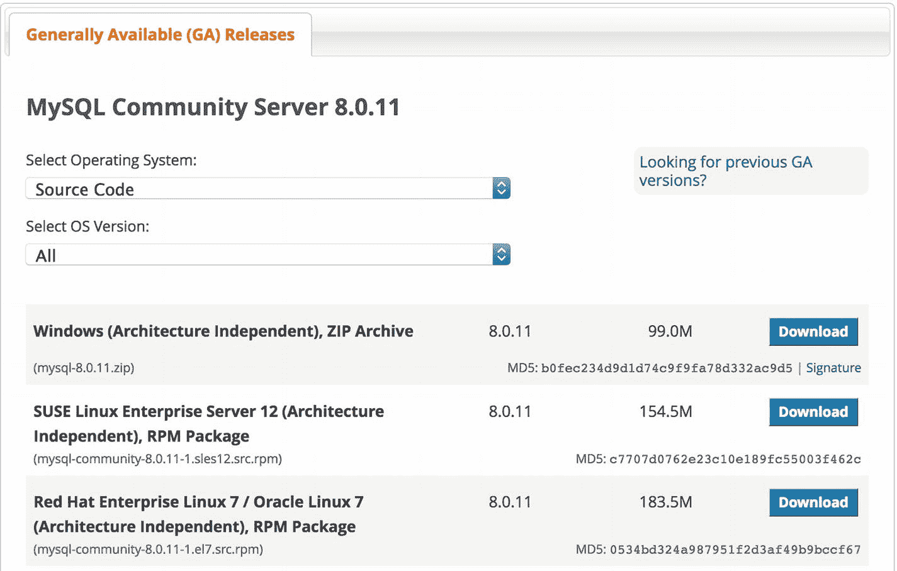

# 六、X 插件

X Dev API 是一种与 MySQL 交互的全新方式。正如我们所了解的，新的 NoSQL 机制建立在 X DevAPI、X 插件和 X 协议之上。您可能会有这样的印象，这些技术就在那里，一旦启用，就不再需要什么了。这在很大程度上是正确的，但是和所有好的特性一样，这个故事不仅仅是启用这个特性。

在这一章中，我们仔细看看 X 插件。正如您将看到的，它不仅仅是简单地打开它。事实上，它只是默认工作意味着它非常稳定，并适用于大多数情况。但是，您可以用几种方式来配置它，包括一个非常有趣的保护连接的选项。然而，在接下来的章节中会有更多关于这个甚至如何监控 X 插件的内容。

Note

我在这一章中使用术语“插件”来指代一般的插件，而“X 插件”来指代 X 插件的特定特性。

## 概观

回想一下第 2 章中的内容，X 插件是 MySQL 的一个单独编译的组件，可以在运行时加载和卸载。Oracle 将 X 插件命名为`mysqlx`,并在服务器中以该名称列出。一旦加载(安装)，插件将在每次服务器重启时自动启动。此外，回想一下 MySQL 中的插件特性是 Oracle 用来扩展服务器功能的主要机制，无需从头开始重新构建代码。尽管插件技术在 MySQL 中已经存在了一段时间，并且最初用于存储引擎，但它已经成为 Oracle 用来扩展和添加新功能到服务器的默认机制。

在这方面，X 插件是一个很好的例子，它展示了插件可以给服务器带来的强大力量。例如，默认情况下，服务器使用固定的协议与客户端通信，该协议通常称为 MySQL 客户端/服务器协议，简称为 MySQL 协议或旧协议。这个协议被内置到服务器中，除了在 MySQL 的生命周期中有一些小的变化；从 MySQL 4 开始就没有太大变化。x 代码库。在 X 插件出现之前，这是客户端与服务器通信的唯一方式。 [<sup>1</sup>](#Fn1) 现在，一旦你加载了 X 插件，它就为使用 X 协议的客户端和服务器启用了一个新的通信协议。

How Do MySQL Plugins Work?

在最一般的意义上，当插件被安装或在启动时启动时，服务器和插件使用特殊的插件 API 进行通信，该 API 允许插件将自己注册为服务器的一部分。例如，插件提供了处理状态变量的回调方法以及启用其功能的方法。这个协商过程就是插件如何扩展服务器的功能，而不必强制服务器重启，也不需要重新编译服务器。

也就是说，需要注意的是，插件是针对公共服务器库编译的，因此必须与特定版本和平台的服务器相匹配(例如，您不能使用针对 Windows 上的 Linux 编译的插件)。使用在插件启动期间检查的特殊版本控制机制来提供兼容性检测。大多数插件都清楚地列出了支持的服务器版本。当你决定使用一个新的插件时，一定要检查它是否与你的服务器版本兼容。有关插件的更多信息，请参见在线 MySQL 参考手册中的“MySQL 插件 API”一节。

### 特征

同样，X 插件的主要目的是支持与服务器通信的 X 协议，以启用 X DevAPI (NoSQL)接口。虽然这是它的主要关注点，但是有一些有趣的特性可以帮助您获得更好的体验。这些包括配置插件使用不同于服务器的安全套接字层(SSL)设置，以及使用系统变量更改插件的行为。我们将在下面几节中看到如何更改 SSL 设置以及如何更改默认端口。我们将在后面的章节中看到更多关于其他系统变量的内容。

Note

尽管文档和其他文本以大写字母显示了 X 插件的变量，但是变量在 SQL 结果中以小写字母显示。例如，您可能会看到前缀`Mysqlx_`，但是服务器的输出显示为`mysqlx_`。幸运的是，大多数平台上的大多数 SQL 命令都可以接受这两种版本。

#### 安全套接字层(SSL)连接

如果您在 MySQL 服务器上使用 SSL 连接，并希望对 X 插件(和您的 NoSQL 应用)使用安全连接，您可以设置 X 插件使用不同于服务器的 SSL 选项值。这意味着您可以设置 X 插件使用一个 SSL 证书，而服务器使用另一个证书。这非常有助于确保 NoSQL 应用的安全，而无需在客户机/服务器和 X 协议之间共享 SSL 数据。

您可以将系统变量及其值放在`my.cnf`文件中，或者通过服务器启动命令(命令行)传递系统变量。以这种方式使用时，系统变量通常被称为启动选项。使用以下命令可以列出系统变量及其当前值。注意，我使用 MySQL Shell 通过批处理模式获取信息。

```sql
$ mysqlsh -uroot -hlocalhost --sql -e "SHOW VARIABLES LIKE 'mysqlx_ssl%'"
Enter password:
+--------------------+-------+
| Variable_name      | Value |
+--------------------+-------+
| mysqlx_ssl_ca      |       |
| mysqlx_ssl_capath  |       |
| mysqlx_ssl_cert    |       |
| mysqlx_ssl_cipher  |       |
| mysqlx_ssl_crl     |       |
| mysqlx_ssl_crlpath |       |
| mysqlx_ssl_key     |       |
+--------------------+-------+

```

您可以在您的配置文件(`my.cnf`)中设置这些变量，方法是将它们放在名为`[msyqld]`的服务器部分，但是您应该省略破折号。下面的摘录展示了如何为服务器和 X 插件使用不同的 SSL 配置。

```sql
[mysqld]
...
ssl-ca=/my_ssl/certs/ca_server.pem
ssl-cert=/my_ssl/certs/server-cert.pem
ssl-key=/my_ssl/certs/server-key.pem
...
mysqlx-ssl-ca=/my_ssl/certs/ca_xplugin.pem
mysqlx-ssl-cert=/my_ssl/certs/xplugin-cert.pem
mysqlx-ssl-key=/my_ssl/certs/xplugin-key.pem
...

```

注意，我已经包含了两组 SSL 选项，只有 X 插件选项以前缀`mysqlx_`命名。

Note

一般来说，大多数系统变量都有相应的启动选项，并且在配置文件中以相同的名称使用，只是下划线改为了破折号。例如，mysqlx_ssl_ca 系统变量的启动选项是- mysqlx-ssl-ca。然而，`--mysqlx_ssl_ca`版本也适用于那些健忘的人。

要临时或作为 shell 或批处理文件的一部分更改这些值，可以在命令行上将系统变量指定为选项，如下所示。请注意，我们使用了与前面所示相同的值。

```sql
$ mysqld  ... --mysqlx-ssl-ca=/my_ssl/certs/ca_xplugin.pem --mysqlx-ssl-cert=/my_ssl/certs/xplugin-cert.pem \
                     --mysqlx-ssl-key=/my_ssl/certs/xplugin-key.pem

```

虽然您可以像这样使用命令行上的选项，但这不是最好的方法。这是因为，除非您在某个地方记录新的命令行，或者在 shell 或批处理命令中使用它(即使这样)，否则很容易忘记您使用了什么值，甚至是使用了哪些系统变量。因此，最好的方法是，始终将自定义系统变量更改放在 MySQL 配置文件中。

#### 更改默认端口

回想一下，X 插件使用与服务器不同的端口。默认端口是 33060。如果您想更改默认端口，可以使用`mysqlx_port`系统变量。与 SSL 选项一样，您可以将它放在`my.cnf`文件中，或者在服务器启动命令(命令行)上将它作为启动选项传递。您也可以使用以下命令检查默认端口。有效值范围是 1-65535。例如，您可以设置 X 插件使用端口 3307。

```sql
$ mysqlsh -uroot -hlocalhost --sql -e "SHOW VARIABLES LIKE 'mysqlx_port'"
Enter password:
+---------------+-------+
| Variable_name | Value |
+---------------+-------+
| mysqlx_port   |  3307 |
+---------------+-------+

```

因为`mysqlx_port`系统变量只在启动时读取(原因很明显)，所以更改该值需要重新启动以使用不同的端口。

与 SSL 选项一样，您可以在命令行上设置端口，如下所示。在这种情况下，我们在端口 3307 上启动服务器，X 插件在端口 3308 上监听。

```sql
$ mysqld  --port=3307 --datadir... --socket=...mysql.sock --mysqlx-port=3308 --mysqlx-socket=...mysqlx.sock

```

同样，这也不是推荐的方法，因为命令行选项如果不放在 shell 或批处理文件中，很容易被遗忘。

### 更深入——探索源代码

如果你想通过检查源代码来了解 X 插件是如何工作的，你可以从 [`http://dev.mysql.com/downloads/mysql/`](http://dev.mysql.com/downloads/mysql/) 下载源代码。要下载 MySQL 8 源代码，请从平台下拉框中选择源代码，并下载与您的平台匹配的文件。如果您没有看到与您的平台相匹配的版本，并且您只想研究源代码，那么请选择通用 Linux 选项。图 [6-1](#Fig1) 显示了网站的摘录，突出显示了选项卡和下拉框。



图 6-1

Downloading the MySQL 8 source code

下载完成后，你可以在`rapid/plugin/x`文件夹中找到 X 插件的源代码。您可以浏览源代码，看看它是如何工作的，甚至它是如何在启动时与服务器进行协商的。例如，要查看系统变量，打开`rapid/plugin/x/src`文件夹中的`xpl_plugin.cc`文件，向下滚动到大约第 240 行。你会发现一个类似清单 [6-1](#Par30) 中的例子的结构，它列出了插件支持的变量。

```sql
...
static struct st_mysql_sys_var* xpl_plugin_system_variables[]= {
  MYSQL_SYSVAR(port),
  MYSQL_SYSVAR(max_connections),
  MYSQL_SYSVAR(min_worker_threads),
  MYSQL_SYSVAR(idle_worker_thread_timeout),
  MYSQL_SYSVAR(max_allowed_packet),
  MYSQL_SYSVAR(connect_timeout),
  MYSQL_SYSVAR(ssl_key),
  MYSQL_SYSVAR(ssl_ca),
  MYSQL_SYSVAR(ssl_capath),
  MYSQL_SYSVAR(ssl_cert),
  MYSQL_SYSVAR(ssl_cipher),
  MYSQL_SYSVAR(ssl_crl),
  MYSQL_SYSVAR(ssl_crlpath),
  MYSQL_SYSVAR(socket),
  MYSQL_SYSVAR(bind_address),
  MYSQL_SYSVAR(port_open_timeout),
  MYSQL_SYSVAR(wait_timeout),
  MYSQL_SYSVAR(interactive_timeout),
  MYSQL_SYSVAR(read_timeout),
  MYSQL_SYSVAR(write_timeout),
  NULL
};
...
Listing 6-1System Variable Definition (X Plugin)

```

注意，有一个宏定义`MYSQL_SYSVAR`，用于定义系统变量。还有按名称列出的系统变量。一旦插件启动，您可以使用清单 [6-2](#Par32) 中的命令看到系统变量。请注意，这些变量以前缀`mysqlx_`命名，所有 14 个变量都存在(主机系统运行的是 MAC OS——您的结果可能会有所不同)。

```sql
MySQL  localhost:33060+ ssl  SQL > SHOW VARIABLES LIKE 'mysqlx_%';
+-----------------------------------+------------------+
| Variable_name                     | Value            |
+-----------------------------------+------------------+
| mysqlx_bind_address               | *                |
| mysqlx_connect_timeout            | 30               |
| mysqlx_idle_worker_thread_timeout | 60               |
| mysqlx_max_allowed_packet         | 1048576          |
| mysqlx_max_connections            | 100              |
| mysqlx_min_worker_threads         | 2                |
| mysqlx_port                       | 33060            |
| mysqlx_port_open_timeout          | 0                |
| mysqlx_socket                     | /tmp/mysqlx.sock |
| mysqlx_ssl_ca                     |                  |
| mysqlx_ssl_capath                 |                  |
| mysqlx_ssl_cert                   |                  |
| mysqlx_ssl_cipher                 |                  |
| mysqlx_ssl_crl                    |                  |
| mysqlx_ssl_crlpath                |                  |
| mysqlx_ssl_key                    |                  |
+-----------------------------------+------------------+
16 rows in set (0.00 sec)
Listing 6-2Listing the System Variables for the X Plugin

```

我们将在下一节中发现更多关于系统变量的内容。如果您喜欢冒险，请继续阅读该文件中的代码，以获得更多关于状态变量的线索。提示:看看名为`xpl_global_status_variables.h`的文件。

## 选项和变量

正如我们在上一节中看到的，X 插件有几个系统变量，可以在启动时在配置文件或服务器命令行中设置。可以控制的配置项目包括默认端口、配置连接参数和建立超时限制等项目。您还可以看到 X 插件报告的关于性能、统计数据等的几个状态变量。这些状态变量可以用来监控 X 插件，以帮助您调整它的选项来匹配您的环境。我将在下面几节中探讨常用的启动选项、系统变量和状态变量。

Note

我使用变量这个术语来描述启动选项、系统变量和状态变量共有的性质和特性。

变量可以有两个范围级别:适用于所有连接的全局和仅适用于当前连接(会话)的会话，即您当前正在使用的连接。没有从您当前未使用的其他会话中捕获数据的规定。

变量还可以支持可以在运行时设置的动态值和只能在启动时设置的值。尽管您可以查看任何变量的值，而不考虑范围，但是您只能在运行时为动态变量设置值。设置全局变量时必须小心，以免对其他连接产生负面影响。

### 如何查看变量的值

有几种方法可以查看变量的值。我们在上一节中看到，您可以使用 SQL 命令`SHOW VARIABLES`查看系统变量，使用`SHOW STATUS`命令查看状态变量的值。记住，启动选项与一个系统变量相关联，所以使用`SHOW VARIABLES`命令就可以看到这些选项。

您还可以通过使用特殊形式的`SELECT`命令来查看系统变量的值，使用特殊的符号或快捷方式，例如在全局范围内使用`@@GLOBAL`表示值，在会话范围内使用`@@SESSION`表示值。虽然 X 插件目前没有会话级系统变量，但下面显示了全局系统变量`mysqlx_connect_timeout`。

```sql
MySQL  localhost:33060+ ssl  SQL > SELECT @@GLOBAL.mysqlx_connect_timeout;
+---------------------------------+
| @@GLOBAL.mysqlx_connect_timeout |
+---------------------------------+
|                              30 |
+---------------------------------+
1 row in set (0.00 sec)

```

您还可以使用 PERFORMANCE_SCHEMA 表(视图)查看变量的值。在这种情况下，您可以通过会话或全局范围查看状态变量。或者您可以编写一个 SQL 查询来将数据与范围结合起来，如清单 [6-3](#Par42) 所示(您的结果可能会有所不同)。我格式化了下面的 SQL 语句，以便于阅读。

```sql
SELECT *, 'SESSION' as SCOPE FROM PERFORMANCE_SCHEMA.session_status
WHERE variable_name LIKE 'mysqlx_%'
UNION SELECT *, 'GLOBAL' as SCOPE FROM PERFORMANCE_SCHEMA.global_status
WHERE variable_name LIKE 'mysqlx_%'

```

```sql
MySQL  localhost:33060+ ssl  SQL > SELECT *, 'SESSION' as SCOPE FROM PERFORMANCE_SCHEMA.session_status WHERE variable_name LIKE 'mysqlx_%' UNION SELECT *, 'GLOBAL' as SCOPE FROM PERFORMANCE_SCHEMA.global_status WHERE variable_name LIKE 'mysqlx_%' \G
*************************** 1\. row ***************************
 VARIABLE_NAME: Mysqlx_address
VARIABLE_VALUE: ::
         SCOPE: SESSION
*************************** 2\. row ***************************
 VARIABLE_NAME: Mysqlx_bytes_received
VARIABLE_VALUE: 1002
         SCOPE: SESSION
*************************** 3\. row ***************************
 VARIABLE_NAME: Mysqlx_bytes_sent
VARIABLE_VALUE: 8851
         SCOPE: SESSION
*************************** 4\. row ***************************
 VARIABLE_NAME: Mysqlx_connection_accept_errors
VARIABLE_VALUE: 0
         SCOPE: SESSION
*************************** 5\. row ***************************
 VARIABLE_NAME: Mysqlx_connection_errors
VARIABLE_VALUE: 0
         SCOPE: SESSION
...
*************************** 119\. row ***************************
 VARIABLE_NAME: Mysqlx_worker_threads
VARIABLE_VALUE: 2
         SCOPE: GLOBAL
*************************** 120\. row ***************************
 VARIABLE_NAME: Mysqlx_worker_threads_active
VARIABLE_VALUE: 1
         SCOPE: GLOBAL
120 rows in set (0.00 sec)
Listing 6-3X Plugin Status Variables with Scope

```

请注意，我们看到了相同的变量及其范围。

Note

使用性能模式的完整描述和教程超出了本书的范围。有关性能模式的更多信息，请参见在线 MySQL 参考手册中的“MySQL 性能模式”一节。

您可能已经注意到，在前面的例子中，我使用了`SHOW` SQL 命令来查看变量的值。有两个`SHOW`命令:一个用于系统变量(`SHOW VARIABLES`，另一个用于状态变量(`SHOW STATUS`)。您可以使用 LIKE 子句来查找所有的 X 插件变量。`LIKE`子句允许您指定名称的一部分并使用通配符。例如，您可以使用以下两个命令找到 X 插件的所有系统和状态变量。

```sql
SHOW VARIABLES LIKE 'mysqlx_%';
SHOW STATUS LIKE 'mysqlx_%';

```

注意，我使用了使用`mysqlx_%`的`LIKE`子句。这将显示所有以`mysqlx_`开头的变量。因为所有的 X 插件变量都有这个前缀，所以我们看到了 X 插件的所有变量。

Tip

LIKE 子句在另一方面也非常方便。您可以使用它来搜索一个变量，您可能只是通过使用一个关键字就忘记了它的名称。例如，如果您想查看名称中包含`dir`的所有变量，请使用`LIKE '%dir%'`。

到目前为止，您可能认为我们正在使用大量的 SQL 命令。您可能想知道是否有办法使用 NoSQL 接口查看变量值。在撰写本文时，X DevAPI 或 MySQL Shell 的一部分中还没有可以用来获取变量及其值的信息的对象。 [<sup>2</sup>](#Fn2) 这就是我之前在书中提到的一些日常维护任务仍然需要 SQL 接口的原因。检查和设置变量是需要使用 SQL 命令的维护和配置任务之一。

What About Information_Schema?

如果您熟悉特殊的`INFORMATION_SCHEMA`数据库，您可能想知道使用 session_*和 global_*表(视图)来显示变量值发生了什么。从服务器版本 5.7.6 开始，这些表(视图)已被弃用。这是因为在`PERFORMANCE_SCHEMA`中它们被表格(视图)取代了。有关变更和迁移到`PERFORMANCE_SCHEMA`的更多信息，请参见在线 MySQL 参考手册中的“迁移到性能模式系统和状态变量表”一节。

### 如何设置变量的值

我们已经发现可以在配置文件中设置系统变量，并且可以使用启动选项来设置系统变量。这些方法用于只能在启动时设置的变量。但是，对于那些可以动态设置的变量，您可以使用 set 命令和前面显示的@@SESSION 和@@GLOBAL 符号来更改它们在会话或全局范围内的值。然而，因为目前没有会话变量，我们只能为全局变量设置值，如清单 [6-4](#Par54) 所示。

```sql
$ mysqlsh -uroot -hlocalhost --sql --json=pretty -e "SELECT @@GLOBAL.mysqlx_connect_timeout"
{
    "password": "Enter password: "
}

{
    "executionTime": "0.00 sec",
    "warningCount": 0,
    "warnings": [],
    "rows": [
        {
            "@@GLOBAL.mysqlx_connect_timeout": 30
        }
    ],
    "hasData": true,
    "affectedRowCount": 0,
    "autoIncrementValue": 0
}
$ mysqlsh -uroot -hlocalhost --sql --json=pretty -e "SET @@GLOBAL.mysqlx_connect_timeout = 90"
{
    "password": "Enter password: "
}

{
    "executionTime": "0.00 sec",
    "warningCount": 0,
    "warnings": [],
    "rows": [],
    "hasData": false,
    "affectedRowCount": 0,
    "autoIncrementValue": 0
}
$ mysqlsh -uroot -hlocalhost --sql --json=pretty -e "SELECT @@GLOBAL.mysqlx_connect_timeout"
{
    "password": "Enter password: "
}

{
    "executionTime": "0.00 sec",
    "warningCount": 0,
    "warnings": [],
    "rows": [
        {
            "@@GLOBAL.mysqlx_connect_timeout": 90
        }
    ],
    "hasData": true,
    "affectedRowCount": 0,
    "autoIncrementValue": 0
}

Listing 6-4Setting Global System Variables

```

如果引入了会话动态系统变量，可以用`SET @@SESSION.<variable_name>`命令设置它们的值。

Tip

可以在运行时更改的系统变量称为动态变量。这只适用于那些在 X 插件运行时可以改变的系统变量。

现在我们知道了更多关于变量以及如何查看和设置值的知识，让我们看看 X 插件的具体变量。让我们从那些可以放在配置文件中的系统变量开始。

### 系统变量和启动选项

回想一下，大多数系统变量都有一个相应的选项，可以用来在启动时配置系统。也就是说，我们称可以用这种方式设置的系统变量为启动选项。其他系统变量可以在运行时更改，通常称为动态系统变量。但是，有些变量只能在配置文件或命令行中使用。正如您所猜测的，一些变量可以用作启动选项。表 [6-1](#Tab1) 列出了那些可以用作 X 插件启动选项的系统变量(也是系统变量)。我还包括哪些变量可以动态设置，以及对每个变量的简短描述。

表 6-1

System Variables and Startup Options (X Plugin)

<colgroup><col align="left"> <col align="left"> <col align="left"> <col align="left"> <col align="left"></colgroup> 
| 名字 | 默认 | 系统瓦尔 | 动态的 | 描述 |
| :-- | :-- | :-- | :-- | :-- |
| `mysqlx_bind_address` | * | 是 | 不 | X 插件用于连接的网络地址。 |
| `mysqlx_connect_timeout` | Thirty | 是 | 是 | 等待从新连接的客户端接收第一个数据包的秒数 |
| `mysqlx_idle_worker_thread_timeout` | Sixty | 不 | 不 | 空闲工作线程终止之前的时间(秒) |
| `mysqlx_max_allowed_packet` | One million forty-eight thousand five hundred and seventy-six | 不 | 是 | X 插件可以处理的网络数据包的最大大小。 |
| `mysqlx_max_connections` | One hundred | 是 | 是 | X 插件可以接受的最大并发客户端连接数。 |
| `mysqlx_min_worker_threads` | Two | 不 | 是 | X 插件用于处理客户端请求的最小工作线程数。 |
| `mysqlx_` `port` | Thirty-three thousand and sixty | 是 | 不 | 指定 x 插件监听连接的端口 |
| `mysqlx_port_open_timeout` | Zero | 是 | 不 | X 插件等待 TCP/IP 端口空闲的时间(秒)。 |
| `mysqlx_socket` | 依赖于平台 | 是 | 不 | X 插件监听连接的套接字。 |
| `mysqlx_ssl_ca` |   | 是 | 不 | 包含可信 SSL CAs 列表的文件的路径。 |
| `mysqlx_ssl_capath` |   | 是 | 不 | 包含 PEM 格式的可信 SSL CA 证书的目录的路径。 |
| `mysqlx_ssl_cert` |   | 是 | 不 | 用于建立安全连接的 SSL 证书文件的名称。 |
| `mysqlx_ssl_cipher` |   | 不 | 不 | 允许用于 SSL 加密的密码列表。 |
| `mysqlx_ssl_crl` |   | 是 | 不 | 包含 PEM 格式的证书吊销列表的文件路径。 |
| `mysqlx_ssl_crl_path` |   | 是 | 不 | 包含文件的目录路径，这些文件包含 PEM 格式的证书吊销列表。 |
| `mysqlx_ssl_key` |   | 是 | 不 | 用于建立安全连接的 SSL 密钥文件的名称。 |

正如你所看到的，我们可以为 X 插件设置很多东西，包括设置 SSL 连接，调整 X 插件的最大连接数限制，最小工作线程数，甚至设置数据包的大小(一个数据包中可以通过网络发送多少数据)。当然，我们也可以改变 X 插件使用的端口。

### 状态变量

召回系统变量是那些只报告插件的统计数据和其他数据的变量。状态变量不能在运行时设置。但是，每当服务器重新启动时，大多数都会被重置。也就是说，计数器会在重新启动时重置。

X 插件有相当多的状态变量来报告 X 插件中的几个区域。我们不是单独查看状态变量(如果算上会话和全局范围，有 120 多个)，而是查看状态变量报告的组或区域。我们将在下一节看到更多关于特定状态变量的内容，在下一节我们将看到如何监控 X 插件。

下面列出了一些更常见的状态变量，并简要说明了为什么要检查这些值。符号`mysqlx_*`表示包含多个变量的区域的状态变量。比如`mysqlx_bytes_*`包括`mysqlx_bytes_sent`和`mysqlx_bytes_received`。

*   `mysqlx_connections_*`:接受、拒绝和关闭的连接数。
*   `mysqlx_sessions_*`:统计已接受、已关闭、已终止、已拒绝等会话。
*   `mysqlx_stmt_*`:集合的执行、删除、列表、创建统计。

您可能想要检查一些其他的离散状态变量，包括启动时的错误(`mysqlx_init_error`)和发送到客户端的行数(`mysqlx_rows_sent`)。关于 X 插件可用状态变量的完整列表，请参见在线 MySQL 参考手册中的“X 插件的状态变量”一节。

现在让我们简单地看看你可以监控 X 插件的一些方法，以及你为什么要这么做。

## 监控 X 插件

如果您想监控 X 插件以确保一切正常工作、诊断问题、验证配置或调整性能，您可以使用 X 插件的系统变量来监控 X 插件。这需要在特定时间或事件发生时读取值。回想一下，有些状态变量同时具有会话和全局作用域。因此，您可能希望使用前面讨论过的@@符号来查询会话或全局范围值。

您可以通过几种方式查看状态变量的值，包括使用`SHOW STATUS`命令以及从`PERFORMANCE_SCHEMA`数据库中读取表格(视图)。清单 [6-5](#Par70) 显示了可用于读取状态变量值的表格(视图)。

```sql
$ mysqlsh -uroot -hlocalhost --sql -e "SHOW TABLES FROM PERFORMANCE_SCHEMA LIKE '%status%'"
Enter password:
+-------------------------------------------+
| Tables_in_performance_schema (%status%)   |
+-------------------------------------------+
| global_status                             |
| replication_applier_status                |
| replication_applier_status_by_coordinator |
| replication_applier_status_by_worker      |
| replication_connection_status             |
| session_status                            |
| status_by_account                         |
| status_by_host                            |
| status_by_thread                          |
| status_by_user                            |
+-------------------------------------------+
Listing 6-5Performance Schema Views for Status Variables

```

请注意，有一些状态变量的表(视图),包括复制和按范围的表。只要记住在查询 X 插件的状态变量时使用`LIKE`子句。然而，正如我前面提到的，使用性能模式的完整教程超出了本书的范围。幸运的是，带有`@@`符号的`SHOW STATUS`和`SELECT`SQL 命令对于大多数应用来说足够好了。 [<sup>3</sup>](#Fn3)

尽管 X 插件有很多状态变量，但是状态变量可以组织在几个区域中。下面的列表总结了我定义的类别。

*   通信:关于发送和接收的消息和数据的信息。
*   连接:关于连接的信息，包括接受、拒绝和删除。
*   CRUD 操作:创建、读取、更新和删除操作的统计数据。
*   错误和警告:关于启动时或发送到客户端的错误或警告的信息。
*   会话:关于会话的信息，包括接受、拒绝和删除。
*   SSL:关于安全连接的信息。
*   语句:关于文档存储的执行、创建等的统计信息。
*   Worker threads:关于 X 插件中工作线程的信息。

以下部分更详细地描述了这八个方面，包括您可能希望使用变量执行的任务的建议。每个部分还包括相关状态变量的完整列表、它们的范围和简短描述。您可以在诊断过程中使用这些章节作为探索 X 插件的指南，或者只是出于好奇。

### 沟通

通信类别包括状态变量，这些变量报告发送到客户端或从客户端接收的信息。您可以观察网络上一个会话或全局的通信量，查看发送到客户端的会话和全局的行数，并检查 X 协议的期望块。

当管道中有可能失败的消息时，X 协议使用期望块机制来管理情况。即在块结束之前执行的其他相关任务。期望块是确保整个块安全、可靠地失败的一种方式(想想事务)。预期障碍有几个方面，不太可能要求你去监控它们。如果您想了解更多关于期望块的信息，请参见 [`https://dev.mysql.com/doc/internals/en/x-protocol-expect-expectations.html`](https://dev.mysql.com/doc/internals/en/x-protocol-expect-expectations.html) 。

表 [6-2](#Tab2) 列出了通信类别的所有状态变量。

表 6-2

Communication Status Variables (X Plugin)

<colgroup><col align="left"> <col align="left"> <col align="left"></colgroup> 
| 变量 | 范围 | 描述 |
| :-- | :-- | :-- |
| `mysqlx_bytes_received` | 两者 | 通过网络接收的字节数。 |
| `mysqlx_bytes_sent` | 两者 | 通过网络发送的字节数。 |
| `mysqlx_expect_close` | 两者 | 关闭的期望块数。 |
| `mysqlx_expect_open` | 两者 | 打开的期望块数。 |
| `mysqlx_rows_sent` | 两者 | 发送回客户端的行数。 |

您可能希望使用这些状态变量的任务类型包括观察发送和接收了多少数据，以及向客户端发送了多少行(在结果集中)。你也可以看到期望块数据，但是这可能比大多数监控 X 插件时需要的更高级。

### 连接

连接类别包括用于检查连接状态的状态变量。您可以使用连接错误变量来查看有多少连接出现了错误。这些变量同时具有会话和全局作用域，这使得它们对于诊断单个连接问题很有意义。您还可以看到接受(打开)、关闭和拒绝(由于登录失败、权限不足、密码错误等)的连接数的统计数据。).这些状态变量只有全局范围，因此它们只显示所有连接的聚合。表 [6-3](#Tab3) 列出了连接类别的所有状态变量。

表 6-3

Connection Status Variables (X Plugin)

<colgroup><col align="left"> <col align="left"> <col align="left"></colgroup> 
| 变量 | 范围 | 描述 |
| :-- | :-- | :-- |
| `mysqlx_connection_accept_errors` | 两者 | 导致接受错误的连接数。 |
| `mysqlx_connection_errors` | 两者 | 导致错误的连接数。 |
| `mysqlx_connections_accepted` | 全球的 | 已被接受的连接数。 |
| `mysqlx_connections_closed` | 全球的 | 已关闭的连接数。 |
| `mysqlx_connections_rejected` | 全球的 | 被拒绝的连接数。 |

您可能希望使用这些状态变量的任务类型包括监控连接错误状态变量，以防出现大量失败(错误)。这可能是简单的应用使用了错误的凭据，也可能是恶意的尝试发现登录帐户和密码。

还可以使用 accepted、closed 和 rejected 系统变量来监控使用的连接数。也就是说，如果使用您的应用的用户少于 10 个，您将会看到这些状态变量的值相当低。高数值可能表示应用连接和断开太频繁(不总是一件坏事),或者应用的实例比您想象的要多。

### CRUD 操作

CRUD 操作类别提供了文档存储上的创建、读取(查找)、更新和删除操作的统计信息。注意，这些是用于 X DevAPI 的计数器，而不是专门用于 SQL 语句执行的。您可以在会话或全局范围内看到每个 CRUD 操作的值。表 [6-4](#Tab4) 列出了 CRUD 操作类别的所有状态变量。

表 6-4

CRUD Status Variables (X Plugin)

<colgroup><col align="left"> <col align="left"> <col align="left"></colgroup> 
| 变量 | 范围 | 描述 |
| :-- | :-- | :-- |
| `mysqlx_crud_create_view` | 两者 | 收到的 create view 请求数。 |
| `mysqlx_crud_delete` | 两者 | 收到的删除请求数。 |
| `mysqlx_crud_drop_view` | 两者 | 收到的删除视图请求数。 |
| `mysqlx_crud_find` | 两者 | 收到的查找请求数。 |
| `mysqlx_crud_insert` | 两者 | 收到的插入请求数。 |
| `mysqlx_crud_modify_view` | 两者 | 收到的修改视图请求数。 |
| `mysqlx_crud_update` | 两者 | 收到的更新请求数。 |

您可能希望使用这些状态变量的任务类型包括监控文档存储应用的活动，例如发出了多少个删除请求、添加(插入)了多少个新数据项等等。因为状态变量具有会话和全局作用域，所以您可以看到特定会话的活动，并将其与全局作用域的值进行比较(总体统计)。

### 错误和警告

“错误和警告”类别提供了一种查看启动时发生的错误数量以及发送给客户端的通知或错误的方法。此类别中的所有状态变量都具有会话和全局范围，因此可用于检查单个连接(会话)的统计数据或所有会话的聚合值。

通知是 X 协议在会话或全局范围向客户机发送附加信息的一种方式。当在会话级别(在内部手册中称为本地)发送时，它们可以包括提交的事务标识符、事务状态更改、SQL 警告和变量更改的列表。在全局级别发送时，可能包括服务器关闭、组复制中的连接断开、表删除等。请记住，状态变量只是计数器，因此尽管您看不到消息(通知)本身，但您可以看到发送了多少消息，以及它们是信息性的(警告)还是对错误或其他严重事件的响应。有关 X 协议中通知的更多信息，请参见 [`http://dev.mysql.com/doc/internals/en/x-protocol-notices-notices.html`](http://dev.mysql.com/doc/internals/en/x-protocol-notices-notices.html) 。

表 [6-5](#Tab5) 列出了错误和警告类别的所有状态变量。

表 6-5

Errors and Warnings Status Variables (X Plugin)

<colgroup><col align="left"> <col align="left"> <col align="left"></colgroup> 
| 变量 | 范围 | 描述 |
| :-- | :-- | :-- |
| `mysqlx_errors_sent` | 两者 | 发送到客户端的错误数。 |
| `mysqlx_init_error` | 两者 | 初始化过程中的错误数。 |
| `mysqlx_notice_other_sent` | 两者 | 发送回客户端的其他类型通知的数量。 |
| `mysqlx_notice_warning_sent` | 两者 | 发送回客户端的警告通知的数量。 |

您可能希望使用这些状态变量的任务类型包括检查会话是否有过多的错误，这可能表明应用(或用户的使用)有问题。通知状态变量可能有助于收集数据，用于诊断发送给客户端的错误和警告。也就是说，它可能表示您可能希望在日志中查找其他数据。例如，这些变量在会话级别的高计数可能表明应用正在尝试做一些它不应该做的事情，或者执行操作过于频繁。

然而，当开始使用 X 插件或改变其配置时，这一类别中最重要的状态变量是`mysqlx_init_error`状态变量。检查这个变量以确保在启动(初始化)时没有错误，如果有问题，跟踪它们以确保所有的配置都是正确的。虽然有时一个错误可能是好的，但一般来说，您不应该看到任何为初始化而注册的错误。

### 会议

会话类别提供了一种方法来跟踪有多少会话已被创建(接受)、关闭、由于错误导致关闭、被随意终止或由于登录或建立会话时的其他错误而被拒绝。所有可用的状态变量都只有全局范围。表 [6-6](#Tab6) 列出了会话类别的所有状态变量。

表 6-6

Session Status Variables (X Plugin)

<colgroup><col align="left"> <col align="left"> <col align="left"></colgroup> 
| 变量 | 范围 | 描述 |
| :-- | :-- | :-- |
| `mysqlx_sessions` | 全球的 | 已打开的会话数。 |
| `mysqlx_sessions_accepted` | 全球的 | 已被接受的会话尝试次数。 |
| `mysqlx_sessions_closed` | 全球的 | 已关闭的会话数。 |
| `mysqlx_sessions_fatal_error` | 全球的 | 因致命错误而关闭的会话数。 |
| `mysqlx_sessions_killed` | 全球的 | 已被终止的会话数。 |
| `mysqlx_sessions_rejected` | 全球的 | 被拒绝的会话尝试次数。 |

您可能希望使用这些状态变量的任务类型包括检查有多少会话失败(`msyqlx_sessions_fatal_error`)、被管理员之类的人终止(`mysqlx_sessions_killed`)，以及有多少会话成功打开或关闭。与连接尝试一样，您可以使用该类别中的状态变量来监控创建和使用会话的频率和数量。太多可能意味着会话比您最初计划的要多，广泛使用增加了，等等。每当您发现或认为创建会话可能有问题时，或者当会话开始频繁失败时，请检查这些状态变量。

### 加密套接字协议层

SSL 类别是最大的类别之一，包括许多用于监控安全连接的状态变量。这一点非常重要，因为信息技术专家必须保持持续的警惕，以保护系统和数据不被意外使用、误用或利用。如果您决定使用 SSL 连接，您将需要检查这些状态变量，以确保您的 SSL 连接设置正常工作。您可以检查证书状态的有效性，查看密码列表、使用的 SSL 版本等等。表 [6-7](#Tab7) 列出了 SSL 类别的所有状态变量。

表 6-7

SSL Status Variables (X Plugin)

<colgroup><col align="left"> <col align="left"> <col align="left"></colgroup> 
| 变量 | 范围 | 描述 |
| :-- | :-- | :-- |
| `mysqlx_ssl_accepts` | 全球的 | 接受的 SSL 连接数 |
| `mysqlx_ssl_active` | 两者 | 如果 SSL 处于活动状态 |
| `mysqlx_ssl_cipher` | 两者 | 当前的 SSL 密码(对于非 SSL 连接为空) |
| `mysqlx_ssl_cipher_list` | 两者 | 可能的 SSL 密码列表(非 SSL 连接为空) |
| `mysqlx_ssl_ctx_verify_depth` | 两者 | ctx 中当前设置的证书验证深度限制 |
| `mysqlx_ssl_ctx_verify_mode` | 两者 | ctx 中当前设置的证书验证模式 |
| `mysqlx_ssl_finished_accepts` | 全球的 | 与服务器的成功 SSL 连接数 |
| `mysqlx_ssl_server_not_after` | 全球的 | SSL 证书有效的最后日期 |
| `mysqlx_ssl_server_not_before` | 全球的 | SSL 证书有效的第一个日期 |
| `mysqlx_ssl_verify_depth` | 全球的 | SSL 连接的证书验证深度 |
| `mysqlx_ssl_verify_mode` | 全球的 | SSL 连接的证书验证模式 |
| `mysqlx_ssl_version` | 两者 | 用于连接 ssl 的协议的名称 |

您可能希望使用这些状态变量的任务类型包括检查以确保为一个会话或所有会话打开 SSL(`mysqlx_ssl_active`)、查看接受的 SSL 连接数(`mysqlx_ssl_finished_accepts`)以及有效 SSL 证书的日期。这最后一个操作可以把你从一大堆兔子洞诊断 [<sup>4</sup>](#Fn4) 追着奇怪的错误信息中解救出来。

请注意，有些变量同时具有会话和全局作用域，因此您可以使用这些变量来帮助在会话级别诊断 SSL 连接问题。例如，如果客户端无法使用 SSL 正确连接到 X 插件，需要很长时间才能连接，或者在连接过程中出现错误。

有关这些状态变量的更多信息，可以参阅在线 MySQL 参考手册中的“使用安全连接”一节。因为这些状态变量中的大多数与服务器使用的相同，所以应用了相同的技术和描述。

### 声明

语句类别是一个非常有趣的类别，在诊断或观察与 X DevAPI 相关的操作时非常方便。特别是，有一些状态变量可以计算集合创建和删除的数量、集合索引、执行事件的数量、列出客户端的数量等等。

回想一下，在 X DevAPI 的说法中，语句是一个执行一个或多个 CRUD 操作的动作。尽管 CRUD 操作是这类状态变量的主要焦点，但我们也将该术语用于 SQL 命令，SQL 语句也有状态变量。可用的状态变量具有会话和全局作用域，因此它们可用于监控会话活动或聚合详细信息。表 [6-8](#Tab8) 列出了声明类别的所有状态变量。

表 6-8

Statement Status Variables (X Plugin)

<colgroup><col align="left"> <col align="left"> <col align="left"></colgroup> 
| 变量 | 范围 | 描述 |
| :-- | :-- | :-- |
| `mysqlx_stmt_create_collection` | 两者 | 收到的 create collection 语句数。 |
| `mysqlx_stmt_create_collection_index` | 两者 | 收到的 create collection index 语句的数目。 |
| `mysqlx_stmt_disable_notices` | 两者 | 收到的禁用通知语句的数量。 |
| `mysqlx_stmt_drop_collection` | 两者 | 收到的 drop collection 语句数。 |
| `mysqlx_stmt_drop_collection_index` | 两者 | 收到的删除集合索引语句的数目。 |
| `mysqlx_stmt_enable_notices` | 两者 | 收到的启用通知语句数。 |
| `mysqlx_stmt_ensure_collection` | 两者 | 收到的确保集合语句的数量。 |
| `mysqlx_stmt_execute_mysqlx` | 两者 | 命名空间设置为 mysqlx 时接收的 StmtExecute 消息数。 |
| `mysqlx_stmt_execute_sql` | 两者 | 为 SQL 命名空间接收的 StmtExecute 请求数。 |
| `mysqlx_stmt_execute_xplugin` | 两者 | 为 X 插件命名空间接收的 StmtExecute 请求数。 |
| `mysqlx_stmt_kill_client` | 两者 | 收到的 kill client 语句数。 |
| `mysqlx_stmt_list_clients` | 两者 | 收到的 list client 语句数。 |
| `mysqlx_stmt_list_notices` | 两者 | 收到的列表通知语句的数量。 |
| `mysqlx_stmt_list_objects` | 两者 | 收到的 list object 语句数。 |
| `mysqlx_stmt_ping` | 两者 | 收到的 ping 语句数。 |

您可能希望使用这些状态变量的任务类型包括监控文档存储以创建和删除集合及相关索引。如果您正在监控文档存储应用如何使用集合，这可能会有所帮助。也就是说，频繁的集合创建可能表明数据没有被经常保存或者是动态生成的。这可能会让您发现改进应用使用数据方式的方法。

其他任务包括监控通知(消息)、发送客户机终止请求的次数(不一定成功执行)，以及列出通知、客户机和对象。这些状态变量中的大多数都超出了正常监控的范围。事实上，这些状态变量中的一些只是在文档中被简单地引用，除了源代码本身，很少在其他地方被引用。

最后一个可能有用的状态变量是`mysqlx_stmt_ping`状态变量，用于查看客户机检查服务器的次数，以确定它是否处于活动状态。此处的高值可能表示潜在的网络连接问题。

### 工作线程

工作线程是 X 插件用来执行任务的线程。该类别中只有两个状态变量，允许您查看可用工作线程的总数(仅限全局)和当前活动线程的数量(也仅限全局)。您可以使用系统变量`mysqlx_min_worker_threads`增加工作线程的最小数量。表 [6-9](#Tab9) 列出了线程类别的所有状态变量。

表 6-9

Worker Threads Status Variables (X Plugin)

<colgroup><col align="left"> <col align="left"> <col align="left"></colgroup> 
| 变量 | 范围 | 描述 |
| :-- | :-- | :-- |
| `mysqlx_worker_threads` | 全球的 | 可用的工作线程数 |
| `mysqlx_worker_threads_active` | 全球的 | 当前使用的工作线程数。 |

您可能希望使用这些状态变量的任务类型包括当存在与较慢的执行有关的性能问题时。如果活动的工作线程数量超过了系统可以处理的数量，或者没有足够的工作线程用于所有连接和任务执行请求，就会发生这种情况。

随着 X 插件的成熟，可能会有更多的任务需要您去执行，比如诊断问题、调整性能，或者简单地配置插件。如果您对监控 X 插件感兴趣，请务必查看在线 MySQL 参考手册，因为 MySQL 8 的每个新版本都会发布状态变量的更新以及监控 X 插件的任务。

## 摘要

X 插件是 MySQL 服务器的扩展，可以动态加载。这非常重要，因为 X 插件启用了文档存储特性，允许存储和检索 JSON 文档。具体来说，X 插件允许服务器和客户机之间使用 X 协议进行通信，并与 X DevAPI 进行交互，以允许符合 ACID 的存储。此外，使用 X DevAPI，您可以使用类似 NoSQL 的语法对文档存储执行 CRUD 操作。正是 X 插件将所有的功能联系在一起，将 MySQL 服务器变成了一个文档库。

在这一章中，我们学习了更多关于 X 插件及其工作原理。特别是，我们看到了如何配置 X 插件，比如改变端口和通过 SSL 启用独立于服务器的安全连接。我们还发现了其他系统变量以及一长串状态变量，您可以用它们来监控 X 插件。最后，我们发现了一些关于 X 插件的有趣的内部事实，比如它是如何注册系统变量的。

如果您仍然对 X 插件及其内部工作方式感到好奇，那么没有比源代码本身更好的文档了。虽然对门外汉来说可能不太容易，但研究源代码就像阅读希腊原著一样。

在下一章中，我将仔细研究新的 X 协议是如何工作的，包括服务器如何与客户机交换数据包。正如您将看到的，它与旧协议有很大不同。这主要是由于用于设计和实现新协议的构件。

Footnotes [1](#Fn1_source)

应该注意的是，MySQL 复制使用了内置于原始协议中的扩展。

  [2](#Fn2_source)

如果我们有这样的对象，它将使与服务器的交互更加容易。

  [3](#Fn3_source)

有些人可能会说 SQL 命令更容易使用。

  [4](#Fn4_source)

我称之为兔子洞诊断，因为它经常令人沮丧，很少导致正确的诊断。SSL 证书过期就是其中一个原因。

  [5](#Fn5_source)

源代码是用 C++写的，而且是真正的 C++形式(可悲的是)代码几乎没有内联文档。