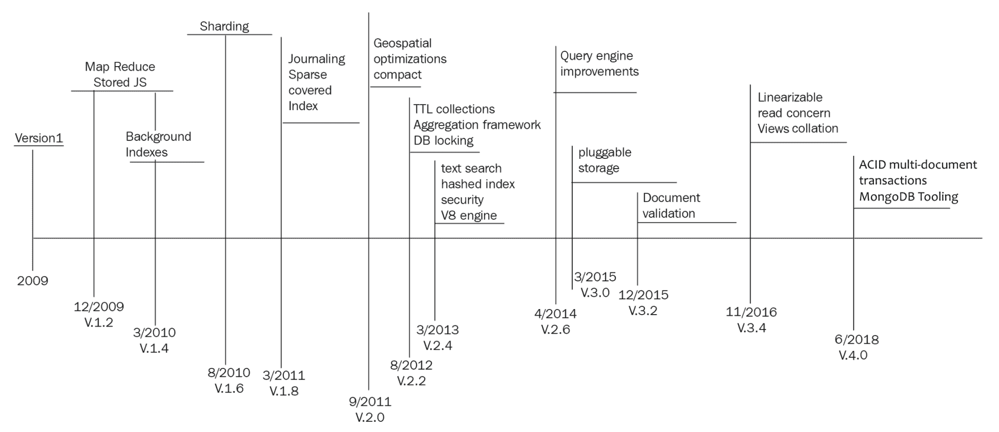

# 一、MongoDB——现代网络数据库

在本章中，我们将为理解 MongoDB 奠定基础，以及它如何声称是为现代 web 设计的数据库。首先，学习和知道如何学习一样重要。我们将为新用户和有经验的用户浏览有关 MongoDB 最新信息的参考资料。我们将介绍以下主题：

*   SQL 和 MongoDB 的历史和发展
*   从 SQL 和其他 NoSQL 技术用户的角度来看 MongoDB
*   MongoDB 的常见用例及其重要性
*   MongoDB 的配置和最佳实践

# 技术要求

您需要安装 MongoDB 版本 4+、Apache Kafka、Apache Spark 和 Apache Hadoop 才能顺利浏览本章。所有章节使用的代码可在以下位置找到：[https://github.com/PacktPublishing/Mastering-MongoDB-4.x-Second-Edition](https://github.com/PacktPublishing/Mastering-MongoDB-4.x-Second-Edition) 。

# SQL 和 NoSQL 的发展

**结构化查询语言**（**SQL**）甚至在 WWW.E.F.Codd 博士于 1970 年 6 月在**计算机机械协会**（**ACM**杂志**上发表论文*大型共享数据库的数据关系模型*之前就已经存在了 ACM**的通信。SQL 最初是在 IBM 由 Chamberlin 和 Boyce 于 1974 年开发的。关系软件（现在的 Oracle 公司）是第一个开发商用 SQL 实现的公司，目标是美国政府机构。

第一个**美国国家标准协会**（**ANSI**SQL 标准于 1986 年问世。自那时以来，共有八次修订，最近一次修订于 2016 年发布（SQL:2016）。

SQL 在 WWW 一开始并不特别流行。静态内容可以直接硬编码到 HTML 页面中，而无需太多麻烦。然而，随着网站功能的增长，网站管理员希望生成由脱机数据源驱动的网页内容，以便生成可以随时间变化而无需重新部署代码的内容。

**公共网关接口**（**CGI**）脚本，开发 Perl 或 Unix shell，推动了 Web 1.0 中早期数据库驱动的网站。在 Web2.0 中，Web 从直接将 SQL 结果注入浏览器发展到使用两层和三层体系结构，将视图与业务和模型逻辑分离，从而允许 SQL 查询模块化并与 Web 应用程序的其余部分隔离。

另一方面，**不仅仅是 SQL**（**NoSQL**）更为现代，并且伴随着 web 进化，与 web 2.0 技术同时兴起。Carlo Strozzi 在 1998 年首次提出了这个术语，因为他的开源数据库不遵循 SQL 标准，但仍然是关系数据库。

这不是我们目前对 NoSQL 数据库的期望。当时的 Last.fm 开发者 Johan Oskarsson 在 2009 年初重新引入了这个术语，以便对正在开发的一组分布式、非关系型数据存储进行分组。其中许多是基于谷歌的**Bigtable**和**MapReduce**文件，或者亚马逊的**DynamoDB**，一种基于键值的高可用存储系统。

NoSQL 的基础是宽松的**原子性、一致性、****隔离****和****耐久性****酸性**特性，这些特性保证了性能、可扩展性、灵活性和降低的复杂性。大多数 NoSQL 数据库都以这样或那样的方式提供了尽可能多的前面提到的质量，甚至为开发人员提供了可调整的保证。下图描述了 SQL 和 NoSQL 的发展：

# MongoDB 的演变

10gen 于 2007 年开始开发云计算堆栈，并很快意识到最重要的创新集中在他们为其提供支持而构建的面向文档的数据库，即 MongoDB。MongoDB 最初于 2009 年 8 月 27 日发布。

MongoDB 的第 1 版在功能、授权和 ACID 保证方面非常基本，但它通过性能和灵活性弥补了这些缺点。

在以下几节中，我们将重点介绍 MongoDB 的主要功能，以及引入这些功能的版本号。

# 版本 1.0 和 1.2 的主要功能集

版本 1.0 和 1.2 的不同功能如下：

*   基于文档的模型
*   全局锁（进程级）
*   集合上的索引
*   文件的 CRUD 操作
*   无身份验证（身份验证在服务器级别处理）
*   主从复制
*   `MapReduce`（在 v1.2 中引入）
*   存储的 JavaScript 函数（在 v1.2 中引入）

# 版本 2

2.0 版的不同功能如下：

*   创建背景索引（从 v1.4 开始）
*   切分（自 v1.6 起）
*   更多查询运算符（自 v1.6 起）
*   日志记录（自 v1.8 起）
*   稀疏索引和覆盖索引（自 v1.8 起）
*   压缩命令以减少磁盘使用
*   内存使用效率更高
*   并发性改进
*   索引性能增强

*   副本集现在更具可配置性和数据中心意识
*   `MapReduce`改进
*   身份验证（自 2.0 起，用于分片和大多数数据库命令）
*   介绍地理空间特征
*   聚合框架（自 v2.2 版起）和增强功能（自 v2.6 版起）
*   TTL 集合（自 v2.2 起）
*   并发性改进，其中包括 DB 级锁定（自 v2.2 以来）
*   文本搜索（自 v2.4 起）和集成（自 v2.6 起）
*   散列索引（自 v2.4 起）
*   安全增强和基于角色的访问（自 v2.4 起）
*   V8 JavaScript 引擎而不是 SpiderMonkey（从 v2.4 开始）
*   查询引擎改进（自 v2.6 起）
*   可插拔存储引擎 API
*   引入 WiredTiger 存储引擎，具有文档级锁定，而以前的存储引擎（现在称为**MMAPv1**支持收集级锁定

# 版本 3

3.0 版的不同功能如下：

*   复制和分片增强功能（从 v3.2 开始）
*   文档验证（从 v3.2 开始）
*   聚合框架增强的操作（从 v3.2 开始）
*   多个存储引擎（从 v3.2 开始，仅限企业版）
*   查询语言和索引排序规则（从 v3.4 开始）
*   只读数据库视图（从 v3.4 开始）
*   线性化读取问题（从 v3.4 开始）

# 版本 4

版本 4.0 的不同功能如下：

*   多文档 ACID 事务
*   换流
*   MongoDB 工具（Stitch、Mobile、Sync 和 Kubernetes 运营商）

下图显示了 MongoDB 的发展：

正如我们所观察到的，版本 1 非常基本，而版本 2 引入了当前版本中的大多数功能，如分片、可用和特殊索引、地理空间功能以及内存和并发性改进。

在从版本 2 到版本 3 的过程中，引入了聚合框架，主要是作为老化的补充（并且从来没有达到专用框架，例如 Hadoop）MapReduce 框架。然后，添加了文本搜索，该框架缓慢但肯定地提高了性能、稳定性和安全性，以适应使用 MongoDB 的客户不断增加的企业负载。

随着 WiredTiger 在版本 3 中的引入，锁定对于 MongoDB 来说不再是什么问题，因为它从流程（全局锁）降到了文档级别，几乎是最细粒度的级别。

版本 4 标志着一个重大的转变，通过引入多文档 ACID 事务，连接了 SQL 和 NoSQL 世界。这允许更广泛的应用程序使用 MongoDB，特别是需要强大实时一致性保证的应用程序。此外，变更流的引入使得使用 MongoDB 的实时应用程序能够更快地上市。还引入了一系列工具，以促进无服务器、移动和**物联网**（**物联网**的发展。

目前，MongoDB 是一个数据库，可以处理从启动 MVP 和 POC 到具有数百台服务器的企业应用程序的各种负载。

# 面向 SQL 开发人员的 MongoDB

MongoDB 是在 Web2.0 时代开发的。到那时，大多数开发人员已经从他们选择的语言中使用 SQL 或**对象关系映射**（**ORM**工具来访问 RDBMS 数据。因此，这些开发人员需要一种简单的方法从他们的关系背景中熟悉 MongoDB。

谢天谢地，已经有几次尝试制作 SQL 到 MongoDB 的备忘单，用 SQL 术语解释 MongoDB 术语。

在更高的层面上，我们有以下几点：

*   数据库和索引（SQL 数据库）
*   集合（SQL 表）
*   文档（SQL 行）
*   字段（SQL 列）
*   嵌入和链接文档（SQL 联接）

下表显示了更多常见操作的示例：

| **SQL** | **MongoDB** |
| 数据库 | 数据库 |
| 桌子 | 收集 |
| 指数 | 指数 |
| 一行 | 文件 |
| 柱 | 领域 |
| 加入 | 通过`DBRef`嵌入文档或链接 |
| `CREATE TABLE employee (name VARCHAR(100))` | `db.createCollection("employee")` |
| `INSERT INTO employees VALUES (Alex, 36)` | `db.employees.insert({name: "Alex", age: 36})` |
| `SELECT * FROM employees` | `db.employees.find()` |
| `SELECT * FROM employees LIMIT 1` | `db.employees.findOne()` |
| `SELECT DISTINCT name FROM employees` | `db.employees.distinct("name")` |
| `UPDATE employees SET age = 37 WHERE name = 'Alex'` | `db.employees.update({name: "Alex"}, {$set: {age: 37}}, {multi: true})` |
| `DELETE FROM employees WHERE name = 'Alex'` | `db.employees.remove({name: "Alex"})` |
| `CREATE INDEX ON employees (name ASC)` | `db.employees.ensureIndex({name: 1})`  |

常见操作的更多示例见[http://s3.amazonaws.com/info-mongodb-com/sql_to_mongo.pd](http://s3.amazonaws.com/info-mongodb-com/sql_to_mongo.pdf) [f](http://s3.amazonaws.com/info-mongodb-com/sql_to_mongo.pdf)[。](http://s3.amazonaws.com/info-mongodb-com/sql_to_mongo.pdf)

# 面向 NoSQL 开发人员的 MongoDB

随着 MongoDB 从一个利基数据库解决方案发展成为 NoSQL 技术的瑞士军刀，越来越多的开发人员也从 NoSQL 背景开始使用它。

撇开 SQL 和 NoSQL 之间的差异不谈，来自柱型数据库的用户面临的挑战最大。由于 Cassandra 和 HBase 是最流行的面向列的数据库管理系统，我们将研究它们之间的差异以及开发人员如何将系统迁移到 MongoDB。NoSQL 开发人员 MongoDB 的不同功能如下：

*   **灵活性**：MongoDB 关于可以包含嵌套在复杂层次结构中的子文档的文档的概念非常具有表现力和灵活性。这类似于 MongoDB 和 SQL 之间的比较，另外一个好处是 MongoDB 可以更容易地从任何编程语言映射到普通的旧对象，从而便于部署和维护。
*   **灵活查询模型**：用户可以有选择地对每个单据的某些部分进行索引；基于属性值、正则表达式或范围的查询；并根据应用层的需要为每个对象提供尽可能多的属性。主索引和辅助索引以及特殊类型的索引（如稀疏索引）可以极大地提高查询效率。使用带有 MapReduce 的 JavaScript shell，大多数开发人员（以及许多数据分析师）都可以很容易地快速查看数据并获得有价值的见解。
*   **原生聚合**：聚合框架提供**提取、转换、加载**（**ETL**）管道，供用户从 MongoDB 中提取和转换数据，并以新格式加载或从 MongoDB 导出到其他数据源。这也可以帮助数据分析师和科学家在进行数据争论的过程中获得所需的数据片段。
*   **无模式模型**：这是 MongoDB 设计理念的结果，它赋予应用程序解释集合文档中不同属性的权力和责任。与 Cassandra 或 HBase 基于模式的方法不同，在 MongoDB 中，开发人员可以存储和处理动态生成的属性。

# MongoDB 的关键特性和用例

在本节中，我们将分析 MongoDB 作为数据库的特性。了解 MongoDB 提供的特性可以帮助开发人员和架构师评估手头的需求，以及 MongoDB 如何帮助实现这些需求。此外，我们还将回顾 MongoDB，Inc.的一些常见用例，它们为用户提供了最佳结果。

# 主要特征

MongoDB 已经发展成为一个通用的 NoSQL 数据库，提供了 RDBMS 和 NoSQL 世界中最好的两个。一些关键特征如下：

*   **它是一个通用数据库**：与为特定目的而构建的其他 NoSQL 数据库（例如图形数据库）相比，MongoDB 可以在应用程序中服务异构负载和多种用途。在版本 4.0 引入多文档 ACID 事务后，这一点变得更加真实，进一步扩展了可以有效使用它的用例。
*   **灵活的模式设计**：面向文档的方法，具有可动态修改的未定义属性，是 MongoDB 和关系数据库之间的关键对比。
*   **它从一开始就具有高可用性**：在我们这个可用性为 5 个 9 的时代，这必须是一个给定的条件。再加上检测到服务器故障时的自动故障切换，这有助于实现较高的正常运行时间。
*   **功能丰富**：MongoDB 提供了与 SQL 等价的全套操作符，以及 MapReduce、聚合框架、生存时间和封顶集合以及二级索引等功能，无论需求多么多样化，MongoDB 都可以适应许多用例。
*   **可扩展性和负载平衡**：它是为纵向和（主要）横向扩展而构建的。使用分片，架构师可以在不同实例之间共享负载，并实现读写可伸缩性。数据平衡通过碎片平衡器自动进行（并且对用户透明）。
*   **聚合框架**：在数据库中构建 ETL 框架意味着开发人员可以在数据离开数据库之前执行大部分 ETL 逻辑，在许多情况下消除了对复杂数据管道的需要。

*   **本机复制**：数据将在副本集中复制，无需复杂的设置。
*   **安全特性**：同时考虑身份验证和授权，这样架构师就可以保护他们的 MongoDB 实例。
*   **用于存储和传输文档的 JSON（BSON 和二进制 JSON）对象**：JSON 在 web 上广泛用于前端和 API 通信，因此，当数据库使用相同的协议时更容易。
*   **MapReduce**：尽管 MapReduce 引擎没有专用框架中的那么先进，但它仍然是构建数据管道的绝佳工具。
*   **二维和三维查询和地理空间信息**：这对于许多应用程序来说可能并不重要，但如果是针对您的用例，那么能够使用相同的数据库进行地理空间计算和数据存储就非常方便了。
*   **多文档 ACID 事务**：从 4.0 版开始，MongoDB 支持跨多个文档的 ACID 事务。
*   **成熟的工具**：MongoDB 的工具已经演变为支持从 DBaaS 到同步、移动和无服务器（Stitch）

# MongoDB 的用例

由于 MongoDB 是一个非常流行的 NoSQL 数据库，因此有几个用例成功地支持了高质量的应用程序，并在市场上有很长的交付时间。

其许多最成功的用例都围绕以下领域：

*   集成孤立的数据，提供单一的数据视图
*   物联网
*   移动应用程序
*   实时分析
*   个性化
*   目录管理
*   内容管理

所有这些成功案例都有一些共同的特点。我们将尝试按照相对重要性的顺序对其进行细分：

*   模式灵活性可能是最重要的。能够在集合中存储具有不同属性的文档在开发阶段和从具有或不具有相同属性的异构源获取数据时都会有所帮助。这与 RDBMS 相反，RDBMS 需要预定义列，并且具有稀疏数据可能会受到惩罚。在 MongoDB 中，这是规范，也是大多数用例共享的特性。能够将属性深入嵌套到文档中，并将值数组添加到属性中，同时能够搜索和索引这些字段，这有助于应用程序开发人员利用 MongoDB 的无模式特性。
*   缩放和切分是 MongoDB 用例最常见的模式。使用内置分片和使用副本集进行数据复制并从读取负载中卸载主服务器，可以方便地扩展，这有助于开发人员有效地存储数据。
*   许多用例还使用 MongoDB 作为归档数据的方式。作为纯数据存储（不需要定义模式），使用 shell 或一些可以轻松与 MongoDB 集成的众多 BI 工具，将数据转储到 MongoDB 中供业务分析师稍后分析是相当容易的。根据时间上限或文档计数进一步细分数据，可以帮助从 RAM（MongoDB 最有效的用例）提供这些数据集。
*   将数据集保存在 RAM 中有助于提高性能，这就是为什么在实践中经常使用它。MongoDB 在大多数版本中使用 MMAP 存储（称为**MMAPv1**），直到最近的版本，这将数据映射委托给底层操作系统。这意味着大多数基于 GNU/Linux 的系统，使用可以存储在 RAM 中的集合，将显著提高性能。随着可插拔存储引擎（如 WiredTiger）的引入，这一问题就不那么严重了（在[第 8 章](10.html)、*监控、备份和安全*中将有更多内容）。
*   封顶集合也是许多用例中使用的特性。Capped collections 可以按计数或集合的总体大小限制集合中的文档。在后一种情况下，我们需要估计每个文档的大小，以便计算有多少文档适合我们的目标大小。Capped collections 是一种快速而肮脏的解决方案，可以回答诸如 g*之类的请求，让我看一下最后一个小时的日志概述*，而无需维护和运行异步后台作业来清理我们的集合。通常，这些可以用来快速建立和运行排队系统。开发人员可以使用集合来存储消息，然后使用 MongoDB 提供的本机可定制游标在结果堆积并提供给外部系统时迭代，而不是部署和维护专用队列系统（如 ActiveMQ）。
*   低操作开销也是许多用例中的常见模式。在敏捷团队中工作的开发人员可以操作和维护 MongoDB 服务器集群，而无需专门的 DBA。**MongoDB 管理服务**（**MMS**）可以极大地帮助减少管理开销，而 MongoDB，Inc.托管的解决方案 MongoDB Atlas 意味着开发人员无需处理操作上的难题。
*   就使用 MongoDB 的商业部门而言，几乎所有行业都有各种各样的产品。然而，似乎更具渗透性的情况是，必须在每个数据点处理大量业务价值相对较低的数据。物联网等领域可以利用一致性设计的可用性，以经济高效的方式存储来自传感器的大量数据，从而从中获益最大。另一方面，金融服务具有绝对严格的一致性要求，与适当的 ACID 特征相一致，这使得 MongoDB 更难适应。金融交易的规模可能很小，但影响却很大，这意味着我们无法在没有适当处理的情况下留下一条信息。
*   基于位置的数据也是 MongoDB 蓬勃发展的领域，Foursquare 是最著名的早期客户之一。MongoDB 围绕二维和三维地理定位数据提供了相当丰富的功能集，提供了诸如按距离搜索、地理围栏和地理区域之间的交叉点等功能。
*   总的来说，丰富的特性集是跨不同用例的通用模式。通过提供可用于许多不同行业和应用程序的功能，MongoDB 可以成为满足所有业务需求的统一解决方案，为用户提供最小化操作开销的能力，同时在产品开发中快速迭代。

# MongoDB 批评

MongoDB 的批评与以下几点有关：

*   多年来，MongoDB 一直受到批评。web 规模的主张遭到了许多开发人员的怀疑。相反的论点是，大多数时候不需要规模，重点应该放在其他设计考虑上。虽然有时这可能是真的，但这是一种错误的二分法，在理想世界中，我们将两者兼而有之。MongoDB 尽可能地将可伸缩性与功能、易用性和上市时间结合起来。
*   MongoDB 的无模式性也是争论的焦点。无模式在许多用例中都非常有用，因为它允许将异构数据转储到数据库中，而无需进行复杂的清理，也不会导致大量空列或文本块填充到单个列中。另一方面，这是一把双刃剑，因为开发人员可能会在一个集合中得到许多在其字段中具有松散语义的文档，并且在代码级别提取这些语义可能会变得非常困难。如果我们的模式设计不是最优的，我们可能最终会得到一个数据存储，而不是一个数据库。
*   缺乏适当的 ACID 保证是关系世界经常抱怨的问题。事实上，如果开发人员一次需要访问多个文档，那么保证 RDBMS 属性并不容易，因为没有事务。在 RDBMS 意义上，没有事务也意味着复杂的写操作需要有应用程序级逻辑才能回滚。如果您需要更新两个集合中的三个文档以标记应用程序级事务已完成，而第三个文档由于任何原因未得到更新，则应用程序将需要撤消前两次写入，这可能并不简单。
*   随着 4.0 版中多文档事务的引入，MongoDB 可以以牺牲速度为代价处理 ACID 事务。虽然这并不理想，而且事务并不适用于 MongoDB 中的每个 CRUD 操作，但它确实解决了批评的主要来源。
*   赞成设置 MongoDB 但不在生产环境中操作它的默认设置不被批准。多年来，默认的写入行为是**写入并忘记**；在尝试下一次写入之前，发送写入操作不会等待确认，这会导致在失败的情况下出现异常的写入速度和不良行为。身份验证也是一种事后考虑，使得公共互联网上数千个 MongoDB 数据库成为任何想要读取存储数据的人的猎物。尽管这些都是有意识的设计决策，但它们影响了开发人员对 MongoDB 的看法。

# MongoDB 配置和最佳实践

在本节中，我们将介绍有关操作、模式设计、耐久性、复制、分片和安全性的一些最佳实践。关于何时实施这些最佳实践的更多信息将在后面的章节中介绍。

# 业务最佳做法

作为一个数据库，MongoDB 是在考虑开发人员的情况下构建的，它是在 web 时代开发的，因此它不需要像传统 RDBMS 那样多的操作开销。也就是说，要做到积极主动并实现高可用性目标，需要遵循一些最佳实践。

按重要性顺序，最佳做法如下：

*   **默认情况下打开日志记录**：日志记录使用预写日志，以便在 MongoDB 服务器突然关闭时能够恢复。对于 MMAPv1 存储引擎，日志记录应始终处于启用状态。在 WiredTiger 存储引擎中，日志记录和检查点一起使用，以确保数据的持久性。在任何情况下，使用日志记录并微调日志的大小和检查点的频率都是一种很好的做法，以避免数据丢失的风险。在 MMAPv1 中，默认情况下，日志每 100 毫秒刷新一次到磁盘。如果 MongoDB 在确认写入操作之前正在等待日志，则日志将每隔 30 毫秒刷新到磁盘。
*   **您的工作集应该适合内存**：再次强调，尤其是在使用 MMAPv1 时，工作集最好小于底层机器或 VM 的 RAM。MMAPv1 使用来自底层操作系统的内存映射文件，如果 RAM 和磁盘之间没有太多交换，这将是一个巨大的好处。另一方面，WiredTiger 在使用内存方面效率更高，但仍然从相同的原理中获益匪浅。工作集是最大数据量，加上`db.stats()`报告的索引量。
*   **注意数据文件的位置**：使用`--dbpath`命令行选项，数据文件可以装载到任何地方。确保数据文件存储在具有足够磁盘空间的分区中非常重要，最好是 XFS，或者至少是**Ext4**。
*   **不断更新版本**：即使主要编号的版本也是稳定的版本。因此，3.2 是稳定的，而 3.3 不是。在本例中，3.3 是开发版本，最终将具体化为稳定版本 3.4。这是一个很好的做法，总是更新最新的安全更新版本（4.0.2，在写这本书的时候），并考虑一旦下一个稳定版本出来更新（4.2，在这个例子中）。
*   **使用 Mongo MMS 以图形方式监控您的服务**：免费的 MongoDB，Inc.监控服务是了解 MongoDB 群集概况、通知和警报以及主动预防潜在问题的绝佳工具。
*   **如果你的指标显示大量使用**则扩大规模：不要等到太晚了。CPU 或 RAM 的利用率超过 65%，或者开始注意到磁盘交换，都应该是开始考虑纵向（通过使用更大的机器）或横向（通过分片）扩展的门槛。
*   **切分时要小心**：切分是对切分密钥的坚定承诺。如果你做出了错误的决定，从运营角度来看，可能真的很难回头。在设计分片时，架构师需要深入考虑当前的工作负载（读/写）以及当前和预期的数据访问模式。
*   **使用 MongoDB 团队维护的应用程序驱动程序**：这些驱动程序都是受支持的，并且比没有官方支持的驱动程序更新得更快。如果 MongoDB 还不支持您正在使用的语言，请在 MongoDB 的 JIRA 跟踪系统中打开一张票据。
*   **计划定期备份**：无论您使用的是独立服务器、副本集还是分片，定期备份策略也应作为防止数据丢失的第二级保护措施。作为文件系统，XFS 是一个不错的选择，因为它可以执行快照备份。
*   **应避免手动备份**：如果可能，应使用定期自动备份。如果需要手动备份，则可以使用副本集中的隐藏成员进行备份。我们必须确保在这个成员上使用`db.fsyncwithlock`，以在这个节点上获得最大的一致性，同时打开日志记录。如果此卷位于 AWS 上，我们可以直接拍摄 EBS 快照。
*   **启用数据库访问控制**：永远不要在没有访问控制的情况下将数据库放入生产系统。访问控制应该在节点级通过适当的防火墙实现，防火墙只允许访问数据库的特定应用程序服务器，在数据库级通过使用内置角色或定义自定义角色来实现。这必须在启动时使用`--auth`命令行参数进行初始化，并且可以使用`admin`集合进行配置。
*   **使用真实数据**测试您的部署：因为 MongoDB 是一个无模式、面向文档的数据库，所以您可能有不同字段的文档。这意味着使用与生产数据尽可能相似的数据进行测试比使用 RDBMS 更重要。具有意外值的额外字段的文档可能会导致应用程序在运行时顺利运行或崩溃。尝试使用生产级数据部署登台服务器，或者至少使用适当的库（如 Faker for Ruby）在登台中伪造生产数据。

# 模式设计最佳实践

MongoDB 没有模式，您必须设计集合和索引以适应这一事实：

*   **尽早且经常索引**：使用 MMS、Compass GUI 或日志识别常见的查询模式，并在项目开始时使用尽可能多的索引对这些模式进行索引。
*   **消除不必要的索引**：与前面的建议有点反直觉，监控数据库以更改查询模式，并删除未使用的索引。索引将消耗 RAM 和 I/O，因为它需要与数据库中的文档一起存储和更新。使用聚合管道和`$indexStats`，开发人员可以识别很少使用的索引并消除它们。
*   **使用复合索引，而不是索引交叉点**：在大多数情况下，使用多个谓词（*a*和*B*、*C*或*D*和*E*等）进行查询比使用多个简单索引效果更好。此外，复合索引将按字段对其数据进行排序，我们可以在查询时利用这一点。字段*A*、*B*和*C*上的索引将用于查询*A*、*（A，B）*、*（A，B，C）*，但不用于查询*（B，C）*或*（C）*。
*   **低选择性索引**：例如，在统计上，对性别字段进行索引将返回我们一半的文档，而对姓氏进行索引将只返回少数具有相同姓氏的文档。
*   **使用正则表达式**：同样，由于索引是按值排序的，因此使用带前导通配符的正则表达式（即`/.*BASE/`）进行搜索将无法使用索引。只要表达式中有足够的区分大小写的字符，使用尾随通配符（即`/DATA.*/`）进行搜索是有效的。
*   **在查询中避免否定**：索引是索引值，而不是没有索引值。在查询中使用`NOT`会导致全表扫描，而不是使用索引。
*   **使用部分索引**：如果我们需要索引集合中文档的子集，部分索引可以帮助我们最小化索引集并提高性能。部分索引将包括我们在所需查询中使用的过滤器上的条件。
*   **使用文档验证**：使用文档验证监控文档中插入的新属性，并决定如何处理它们。通过将文档验证设置为警告，我们可以保留插入文档的日志，其中包含我们在设计阶段没有预料到的任意属性，并确定这是错误还是设计的一个功能。
*   **使用 MongoDB Compass**：MongoDB 的免费可视化工具非常适合快速了解我们的数据以及数据如何随时间增长。
*   **尊重 16MB 的最大文档大小**：MongoDB 的最大文档大小为 16MB。这是一个相当慷慨的限制，但在任何情况下都不应违反。允许文档无限增长不应该是一种选择，而且，尽管嵌入文档可能很有效，但我们应该始终记住，这应该得到控制。
*   **使用合适的存储引擎**：MongoDB 从 3.2 版开始引入了几个新的存储引擎。内存中的存储引擎应该用于实时工作负载，而当对数据安全有严格要求时，加密存储引擎应该是首选引擎。

# 写持久性的最佳实践

在 MongoDB 中可以微调写入耐久性，并且根据我们的应用程序设计，它应该尽可能严格，而不影响我们的性能目标。

微调数据并将其刷新到 WiredTiger 存储引擎中的磁盘间隔，默认情况下，在最后一个检查点后或写入 2 GB 数据后，每隔 60 秒将数据刷新到磁盘。这可以通过使用`--wiredTigerCheckpointDelaySecs`命令行选项进行更改。

在 MMAPv1 中，数据文件每 60 秒刷新一次到磁盘。这可以通过使用`--syncDelay`命令行选项进行更改。我们还可以执行各种任务，例如：

*   使用 WiredTiger，我们可以使用 XFS 文件系统进行多磁盘一致性快照
*   我们可以在数据卷中关闭`atime`和`diratime`
*   您可以确保有足够的交换空间（通常是内存大小的两倍）
*   如果在虚拟化环境中运行，则可以使用 NOOP 调度程序
*   我们可以将文件描述符限制提高到数万个
*   我们可以禁用透明的大页面，而启用标准的 4-KVM 页面
*   写安全性至少应该记录在日志中
*   SSD 预读默认值应设置为 16 块；硬盘应该是 32 块
*   我们可以在 BIOS 中关闭 NUMA
*   我们可以使用 RAID 10
*   您可以使用 NTP 在主机之间同步时间，特别是在分片环境中
*   仅使用 64 位版本进行生产；32 位版本已经过时，最多只能支持 2GB 内存

# 复制的最佳做法

副本集是 MongoDB 的机制，可以在适当的条件下提供冗余、高可用性和更高的读取吞吐量。在 MongoDB 中，复制很容易配置，而且在操作方面也很重要：

*   **始终使用副本集**：即使您的数据集目前很小，并且您不希望它以指数形式增长，您也永远不知道何时会发生这种情况。此外，拥有至少三台服务器的副本集有助于设计冗余，将工作负载在实时和分析（使用辅助服务器）之间分离，并从第一天开始构建数据冗余。
*   **使用副本集对您有利**：副本集不仅仅用于数据复制。我们可以（而且在大多数情况下应该）使用主服务器从其中一个辅助服务器进行写入和首选项读取，以减轻主服务器的负担。这可以通过为读取设置读取首选项以及正确的写入关注点来实现，以确保写入可以根据需要传播。
*   **在 MongoDB 副本集中使用奇数个副本**：如果一台服务器停机或与其他服务器失去连接（网络分区），其他服务器必须投票决定哪一台将被选为主服务器。如果我们有奇数个副本集成员，我们可以保证每个服务器子集都知道它们属于大多数还是少数副本集成员。如果我们不能拥有奇数个复制品，我们需要额外设置一个主机作为仲裁人，唯一目的是在选举过程中投票。即使是 EC2 中的一个微实例也可以达到这一目的。

# 切分的最佳实践

切分是 MongoDB 的水平缩放解决方案。在[第 8 章](10.html)*监控、备份和安全*中，我们将更详细地介绍它的用法，但以下是一些基于底层数据架构的最佳实践：

*   **考虑查询路由**：`mongos`查询路由器基于不同的分片密钥和技术，可以将查询定向到分片的部分（或全部）成员。在设计切分时，考虑我们的查询是很重要的，这样我们就不会最终导致查询命中所有切分。
*   **使用标记感知分片**：标记可以在我们的分片上提供更细粒度的数据分布。为每个碎片使用正确的标记集，我们可以确保数据子集存储在特定的碎片集中。这对于应用服务器、MongoDB 碎片和用户之间的数据接近非常有用。

# 安全方面的最佳做法

安全性始终是一个多层次的方法，而这几条建议并没有形成一个详尽的列表；它们只是需要在任何 MongoDB 数据库中完成的基本操作：

*   应禁用 HTTP 状态接口。
*   应禁用 RESTful API。
*   应该禁用 JSON API。
*   使用 SSL 连接到 MongoDB。
*   审核系统活动。
*   使用专用系统用户以适当的系统级访问权限访问 MongoDB。
*   如果不需要，请禁用服务器端脚本。这将影响 MapReduce、内置的`db.group()`命令和`$where`操作。如果代码库中没有使用这些脚本，那么最好在启动时使用`--noscripting`参数禁用服务器端脚本。

# AWS 的最佳实践

当我们使用 MongoDB 时，我们可以在数据中心使用我们自己的服务器，一个 MongoDB 托管的解决方案，如 MongoDB Atlas，或者我们可以使用 EC2 从 Amazon 获取实例。EC2 实例被虚拟化，并以透明的方式共享资源，在同一物理主机中配置虚拟机。因此，如果您要走这条路线，还需要考虑一些其他因素，如下所示：

*   使用 EBS 优化的 EC2 实例。
*   获取每秒配置的**I/O 操作**（**IOPS**）的 EBS 卷，以获得一致的性能。
*   使用 EBS 快照进行备份和恢复。
*   使用不同的可用性区域实现高可用性，使用不同的区域实现灾难恢复。在亚马逊提供的每个区域内使用不同的可用性区域可以保证我们的数据高度可用。不同的区域只应用于灾难恢复，以防灾难事件夺走整个区域。区域可以是 EU-West-2（伦敦），而可用区是区域内的一个细分区域；目前，伦敦有两个可用区。
*   全球部署；访问本地。
*   对于用户来自不同时区的真正全局应用程序，我们应该让不同地区的应用程序服务器使用每个服务器中正确的读取首选项配置来访问最接近它们的数据。

# 参考文献

读一本书很好（读这本书更棒），但持续学习是跟上 MongoDB 的唯一方法。在以下各节中，我们将重点介绍更新和开发/运营参考的地方。

# MongoDB 文档

在线文档可在[获取 https://docs.mongodb.com/manual/](https://docs.mongodb.com/manual/) 是每个开发者的起点，无论是新手还是老手。

JIRA tracker 是一个很好的地方，可以查看修复的 bug 和接下来要介绍的功能：[https://jira.mongodb.org/browse/SERVER/](https://jira.mongodb.org/browse/SERVER/) [。](https://jira.mongodb.org/browse/SERVER/)

# Packt 参考资料

其他一些关于 MongoDB 的好书如下：

*   *面向 Java 开发人员的 MongoDB*，作者 Francesco Marchioni
*   *MongoDB 数据建模*，作者：Wilson da Rocha França
*   有克里斯蒂娜·乔多罗的书吗

# 进一步阅读

MongoDB 用户组（[https://groups.google.com/forum/#！forum/mongodb 用户](https://groups.google.com/forum/#!forum/mongodb-user)拥有大量关于功能和长期存在的 bug 的用户问题档案。这是一个地方去时，有些事情不符合预期的工作。

在线论坛（Stack Overflow 和 Reddit 等）始终是知识的来源，但需要注意的是，某些内容可能在几年前发布，可能不再适用。尝试前一定要检查一下。

最后，MongoDB 大学是一个让您的技能保持最新并了解最新功能和新增功能的好地方：[https://university.mongodb.com/](https://university.mongodb.com/) 。

# 总结

在本章中，我们通过 web、SQL 和 NoSQL 技术开始了我们的旅程，从它们的诞生到目前的状态。我们确定了 MongoDB 多年来是如何塑造 NoSQL 数据库世界的，以及它是如何相对于其他 SQL 和 NoSQL 解决方案定位的。

我们探讨了 MongoDB 的关键特性，以及 MongoDB 是如何在生产部署中使用的。我们确定了设计、部署和操作 MongoDB 的最佳实践。

最初，我们通过查阅文档和在线资源确定了如何学习，这些文档和资源可用于了解最新的功能和开发。

在下一章中，我们将深入探讨模式设计和数据建模，研究如何通过使用官方驱动程序和**对象文档映射器**（**ODM**）连接到 MongoDB，后者是 NoSQL 数据库对象关系映射器的变体。