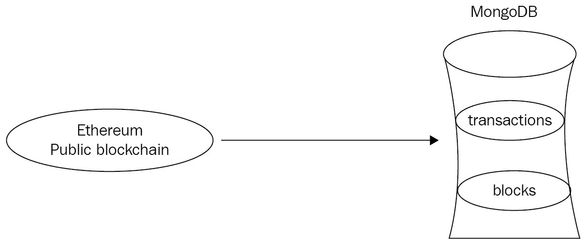

# 六、聚合

在[第 5 章](06.html)、*多维**o**文档酸事务*中，我们使用 Ruby 和 Python 代码研究了新事务功能的两个用例。在本章中，我们将深入研究聚合框架，学习它如何有用。我们还将介绍 MongoDB 支持的运营商。

为了了解这些信息，我们将使用聚合来处理来自以太坊区块链的交易数据。完整的源代码可在[获取 https://github.com/PacktPublishing/Mastering-MongoDB-4.x-Second-Edition](https://github.com/PacktPublishing/Mastering-MongoDB-4.x-Second-Edition) 。

在本章中，我们将介绍以下主题：

*   为什么是聚合？
*   不同的聚合运算符
*   局限性

# 为什么是聚合？

MongoDB 在版本 2.2（开发分支的版本 2.1）中引入了聚合框架。它可以作为 MapReduce 框架和直接查询数据库的替代方案。

使用聚合框架，我们可以在服务器上执行`GROUP BY`操作。因此，我们只能投影结果集中需要的字段。使用`$match`和`$project`操作符，我们可以减少通过管道的数据量，从而加快数据处理速度。

自连接（Self join）也就是说，连接同一集合中的数据也可以使用聚合框架来执行，我们将在用例中看到这一点。

当将聚合框架与简单地使用通过 shell 或各种其他驱动程序提供的查询进行比较时，重要的是要记住，两者都有一个用例。

对于选择和投影查询，使用简单查询几乎总是更好的，因为开发、测试和部署聚合框架操作的复杂性不可能轻易超过使用内置命令的简单性。查找带有`( db.books.find({price: 50} {price: 1, name: 1}) )`的文档，或者不带有`( db.books.find({price: 50}) )`的文档只突出部分字段，非常简单和快速，不需要使用聚合框架。

另一方面，如果我们想使用 MongoDB 执行`GROUP BY`和自连接操作，可能需要使用聚合框架。MongoDB shell 中的`group()`命令最重要的限制是，结果集必须适合文档，这意味着它的大小不能超过 16MB。此外，任何`group()`命令的结果不能超过 20000 个。最后，`group()`不适用于分片输入集合，这意味着当数据量增加时，我们必须重写查询。

与 MapReduce 相比，聚合框架在功能和灵活性方面更为有限。在聚合框架中，我们受到可用操作符的限制。另一方面，聚合框架的 API 比 MapReduce 更易于理解和使用。在性能方面，MyGoDB 的早期版本的聚合框架比 MapReduce 的速度快，但似乎与 MapReduce 在性能改进之后的最新版本相媲美。

最后，始终可以选择使用数据库作为数据存储，并使用应用程序执行复杂的操作。有时，这可能很快就会发展起来，但应该避免，因为这很可能会导致内存、网络以及最终的性能成本。

在下一节中，我们将在实际用例中使用可用的操作符之前描述它们。

# 聚合运算符

在本节中，我们将学习如何使用聚合运算符。聚合运算符分为两类。在每个阶段中，我们使用**表达式运算符**来比较和处理值。在不同的阶段之间，我们使用**聚合阶段操作符**来定义将从一个阶段传递到下一个阶段的数据，因为我们认为这些数据的格式相同。

# 聚合阶段运算符

聚合管道由不同的阶段组成。这些阶段在数组中声明并按顺序执行，每个阶段的输出都是下一个阶段的输入。

`$out`阶段必须是聚合管道中的最后阶段，通过替换或添加现有文档将数据输出到输出集合：

*   `$group`：最常用于按标识符表达式分组和应用累加器表达式。它为每个不同的组输出一个文档。
*   `$project`：用于单据转换，每输入一张单据输出一张单据。
*   `$match`：根据条件过滤输入的单据。
*   `$lookup`：用于过滤输入的单据。输入可以是由外部左联接选择的同一数据库中另一个集合中的文档。
*   `$out`：通过替换或添加到集合中已经存在的文档，将此管道阶段中的文档输出到输出集合。
*   `$limit`：根据预定义的标准限制传递到下一聚合阶段的文档数量。
*   `$count`：返回管道此阶段的文档数量计数。
*   `$skip`：这会跳过一定数量的文档，防止它们传递到管道的下一阶段。
*   `$sort`：根据条件对单据进行排序。
*   `$redact`：作为`$project`和`$match`的组合，这将编辑每个文档中选定的字段，并将其传递到管道的下一阶段。
*   `$unwind`：将*n*元素的数组转换为*n*文档，将每个文档映射到数组中的一个元素。这些文件随后被传递到管道的下一个阶段。
*   `$collStats`：返回视图或集合的统计信息。
*   `$indexStats`：返回集合索引的统计信息。
*   `$sample`：从输入中随机选择指定数量的文档。
*   `$facet`：将多个聚合管道组合在一个阶段中。
*   `$bucket`：根据预定义的选择标准和 bucket 边界将文档拆分为 bucket。
*   `$bucketAuto`：根据预定义的选择标准将文档拆分为多个存储桶，并尝试在存储桶之间均匀分布文档。
*   `$sortByCount`：根据表达式的值对传入文档进行分组，并计算每个 bucket 中的文档数。
*   `$addFields`：向文档添加新字段，并输出与添加字段输入相同数量的文档。
*   `$replaceRoot`：用指定字段替换输入文档的所有现有字段（包括`standard _id`字段）。
*   `$geoNear`：根据与指定字段的接近程度，返回有序的文档列表。输出文档包括一个计算的`distance`字段。
*   `$graphLookup`：递归搜索一个集合，并在每个输出文档中添加一个包含搜索结果的数组字段。

# 表达式运算符

在每个阶段中，我们都可以定义一个或多个表达式运算符来应用中间计算。本节将重点介绍这些表达式运算符。

# 表达式布尔运算符

布尔运算符用于将`true`或`false`值传递到聚合管道的下一阶段

我们可以选择传递原始的`integer`、`string`或任何其他类型的值。

我们可以使用`$and`、`$or`和`$not`操作符，就像我们在任何编程语言中使用它们一样。

# 表达式比较运算符

比较运算符可以与布尔运算符结合使用，以构造我们需要计算为`true`/`false`的表达式，用于管道阶段的输出。

最常用的运算符如下所示：

*   `$eq ( equal )`
*   `$ne ( not equal)`
*   `$gt (greater than)`
*   `$gte (greater than or equal)`
*   `$lt`
*   `$lte`

上述所有运算符都返回布尔值`true`或`false`。

唯一不返回布尔值的运算符是`$cmp`，如果两个参数相等，则返回`0`；如果第一个值大于第二个值，则返回`1`；如果第二个值大于第一个值，则返回`-1`。

# 集合表达式和数组运算符

与大多数编程语言一样，集合操作忽略重复条目和元素顺序，将它们视为集合。结果顺序未指定，重复项将在结果集中消除。集合表达式不递归地应用于集合的元素，而仅应用于顶层。这意味着，如果一个集合包含（例如）嵌套数组，则该数组可能包含也可能不包含重复的数组。

可用的集合运算符如下所示：

*   `$setEquals`：如果两组具有相同的不同元素，则为`true`
*   `$setIntersection`：返回所有输入集的交集（即所有输入集中出现的文档）
*   `$setUnion`：返回所有输入集的并集（即出现在至少一个输入集中的文档）
*   `$setDifference`：返回第一个输入集中出现的文档，而不是第二个输入集中出现的文档
*   `$setIsSubset`：如果第一组中的所有文档都出现在第二组中，即使两组文档完全相同，这也是`true`
*   `$anyElementTrue`：如果集合中的任何元素计算为`true`，则为`true`
*   `$allElementsTrue`：如果集合中的所有元素都计算为`true`，则为`true`

可用的数组运算符如下所示：

*   `$arrayElemAt`：返回数组索引位置的元素。
*   `$concatArrays`：返回一个串联数组。
*   `$filter`：根据指定的条件返回数组的子集。
*   `$indexOfArray`：返回满足搜索条件的数组索引。如果没有，则为`-1`。
*   `$isArray`：如果输入为数组，则返回`true`；否则返回`false`。
*   `$range`：根据用户定义的输入输出一个包含整数序列的数组。
*   `$reverseArray`：返回元素顺序相反的数组。
*   `$reduce`：根据指定的输入，将数组元素减少为单个值。
*   `$size`：返回数组中的项数。
*   `$slice`：返回数组的子集。
*   `$zip`：返回一个合并数组。
*   `$in`：如果指定值在数组中，则返回`true`；否则返回`false`。

# 表达式日期运算符

当我们希望使用管道根据周/月/年的日期计算统计数据时，日期运算符用于从日期字段提取日期信息：

*   `$dayOfYear`用于获取 1 到 366 范围内的一年中的日期（对于闰年）
*   `$dayOfMonth`用于获取 1 到 31 范围内的月份日期
*   `$dayOfWeek`用于获取 1 到 7 范围内的一周中的某一天，其中 1 为周日，7 为周六（使用英语中的一周中的某一天）
*   `$isoDayOfWeek`返回 ISO 8601 日期格式的工作日编号，范围为 1 到 7，其中 1 为周一，7 为周日
*   `$week`是介于 0 到 53 之间的周数，0 表示每年年初的部分周，对于闰周的年份为 53
*   `$isoWeek`返回 ISO 8601 日期格式的周数，范围在 1 到 53 之间，1 是一年中包含星期四的第一周，53 是闰周（如果相关年份中存在）
*   `$year`、`$month`、`$hour`、`$minute`、`$milliSecond`以零为基础返回日期的相关部分，但`$month`除外，它返回的值范围为 1 到 12
*   `$isoWeekYear`根据 ISO 8601 日期格式中最后一周结束的日期返回 ISO 8601 日期格式中的年份（例如，2016/1/1 仍将返回 2015 年）
*   `$second`在闰秒内返回 0 到 60（包括 60）
*   `$dateToString`将日期输入转换为字符串

# 表达式字符串运算符

与日期运算符一样，当我们希望将数据从管道的一个阶段转换到下一个阶段时，也会使用字符串运算符。潜在用例包括预处理文本字段，以提取相关信息，用于管道的后续阶段：

*   `$concat`：用于串接字符串。
*   `$split`：用于根据分隔符拆分字符串。如果未找到分隔符，则返回原始字符串。
*   `$strcasecmp`：用于不区分大小写的字符串比较。如果字符串相等，则返回`0`，如果第一个字符串较大，则返回`1`；否则返回`-1`。
*   `$toLower`/`$toUpper`：分别用于将字符串转换为全小写或全大写。
*   `$indexOfBytes`：返回字符串中第一个子字符串出现的字节。
*   `$strLenBytes`：输入字符串中的字节数。
*   `$substrBytes`：返回子字符串的指定字节。

代码点的等效方法（Unicode 中的值，无论其表示形式中的底层字节为何）如下所示：

*   `$indexOfCP`
*   `$strLenCP`
*   `$substrCP`

# 表达式算术运算符

在管道的每个阶段，我们可以应用一个或多个算术运算符来执行中间计算。这些运算符显示在以下列表中：

*   `$abs`：这是绝对值。
*   `$add`：可以在日期中添加数字或数字以获得新日期。
*   `$ceil`/`$floor`：分别为天花板和地板功能。
*   `$divide`：用于除以两个输入。
*   `$exp`：这将自然数*e*提升到指定的指数幂。
*   `$pow`：这会将一个数字提升到指定的指数幂。
*   `$ln`/`$log`/`$log10`：分别用于计算自然对数、自定义基数的对数或以 10 为基数的对数。
*   `$mod`：这是模块化值。
*   `$multiply`：用于与输入相乘。
*   `$sqrt`：这是输入的平方根。
*   `$subtract`：这是第一个值减去第二个值的结果。如果两个参数都是日期，则返回它们之间的差值。如果一个参数是日期（此参数必须是第一个参数），而另一个参数是数字，则返回结果日期。
*   `$trunc`：用于截断结果。

# 聚合累加器

累加器可能是使用最广泛的运算符，因为累加器允许我们对组中的每个成员进行求和、平均、获取标准偏差统计数据以及执行其他操作。以下是聚合累加器的列表：

*   `$sum`：这是数值的总和。它忽略非数值。
*   `$avg`：这是数值的平均值。它忽略非数值。
*   `$first`/`$last`：这是通过管道阶段的第一个也是最后一个值。它仅在小组阶段可用。
*   `$max`/`$min`：分别获得通过管道级的最大值和最小值。
*   `$push`：这将在输入数组的末尾添加一个新元素。它仅在小组阶段可用。
*   `$addToSet`：这将向数组中添加一个元素（仅当该元素不存在时），有效地将其视为一个集合。它仅在小组阶段可用。
*   `$stdDevPop`/`$stdDevSamp`：用于获取`$project`或`$match`阶段的总体/样本标准偏差。

除非另有说明，这些蓄能器可在集团或项目管道阶段使用。

# 条件表达式

表达式可用于根据布尔真值测试将不同数据输出到我们管道中的下一阶段：

```js
$cond
```

`$cond`短语将评估`if...then...else`格式的表达式，并根据`if`语句的结果返回`then`语句或`else`分支的值。输入可以是三个命名参数，也可以是有序列表中的三个表达式：

```js
$ifNull
```

`$ifNull`短语将对表达式求值，如果第一个表达式不为 null，则返回第一个表达式；如果第一个表达式为 null，则返回第二个表达式。Null 可以是缺少的字段，也可以是具有未定义值的字段：

```js
$switch
```

与编程语言的`switch`语句类似，`$switch`在计算结果为`true`时将执行指定的表达式，并中断控制流。

# 类型转换运算符

MongoDB 4.0 中引入了类型转换运算符，它允许我们将值转换为指定的类型。该命令的通用语法如下所示：

```js
{
   $convert:
      {
         input: <expression>,
         to: <type expression>,
         onError: <expression>,  // Optional.
         onNull: <expression>    // Optional.
      } }

```

在此语法中，`input`和`to`（唯一的强制参数）可以是任何有效的表达式。例如，在其最简单的形式中，我们可以有以下内容：

```js
$convert: { input: "true", to: "bool" } 
```

这会将值为`true`的字符串转换为布尔值`true`。

`onError`短语也可以是任何有效的表达式，并指定 MongoDB 在转换过程中遇到错误时将返回的值，包括不支持的类型转换。它的默认行为是抛出错误并停止处理。

`onNull`短语也可以是任何有效的表达式，并指定输入为 null 或缺失时 MongoDB 将返回的值。默认行为是返回 null。

MongoDB 还为最常见的`$convert`操作提供了一些帮助函数。这些功能如下：

*   `$toBool`
*   `$toDate`
*   `$toDecimal`
*   `$toDouble`
*   `$toInt`
*   `$toLong`
*   `$toObjectId`
*   `$toString`

使用起来更简单。我们可以将前面的示例改写为以下内容：

```js
{ $toBool: "true" }
```

# 其他操作员

有些操作符并不常用，但在特定于用例的情况下很有用。以下各节列出了其中最重要的部分。

# 文本搜索

`$meta`运算符用于访问文本搜索元数据。

# 变量

`$map`运算符将子表达式应用于数组的每个元素，并返回结果值的数组。它接受命名参数。

`$let`运算符定义在子表达式范围内使用的变量，并返回子表达式的结果。它接受命名参数。

# 字面意义的

`$literal`运算符将返回一个值，而不进行解析。它用于聚合管道可能解释为表达式的值。例如，您可以对以`$`开头的字符串应用`$literal`表达式，以避免解析为字段路径。

# 解析数据类型

`$type `运算符返回字段的`BSON`数据类型。

# 局限性

聚合管道可以通过以下三种不同的方式输出结果：

*   内联为包含结果集的文档
*   收藏
*   将光标返回到结果集

内联结果的文档最大大小为 16MB，这意味着只有在最终结果为固定大小时，我们才应该使用这个值。这方面的一个例子是从一个电子商务站点输出前五名订单最多的商品的`ObjectId`。

与此相反的一个例子是输出前 1000 个订单最多的项目，以及产品信息，包括描述和其他大小可变的字段。

如果我们想进一步处理数据，将结果输出到集合中是首选的解决方案。我们可以输出到新集合中，也可以替换现有集合的内容。聚合输出结果只有在聚合命令成功后才可见；否则，它将完全不可见。

The output collection cannot be a sharded or capped collection (as of v3.4). If the aggregation output violates indexes (including the built-in index on the unique `ObjectId` per document) or document validation rules, the aggregation will fail.

每个管道阶段可以有超过 16MB 限制的文档，因为这些文档由 MongoDB 内部处理。但是，每个管道阶段最多只能使用 100 MB 的内存。如果我们希望在我们的阶段中有更多的数据，我们应该将`allowDiskUse:`设置为`true`，以允许多余的数据溢出到磁盘，而牺牲性能。

`$graphLookup`操作员不支持超过 100 MB 的数据集，将忽略`allowDiskUse`上的任何设置。

# 聚合用例

在这相当长的一节中，我们将使用聚合框架来处理来自以太坊区块链的数据。

使用我们的 Python 代码，我们从以太坊提取了数据，并将其加载到 MongoDB 数据库中。区块链与我们数据库的关系如下图所示：



我们的数据位于两个集合中：**块**和**事务**。

示例块文档具有以下字段：

*   交易数量
*   合同规定的内部交易数量
*   块散列
*   父块散列
*   采矿困难
*   使用的气体
*   块高

以下代码显示了块的输出数据：

```js
> db.blocks.findOne()
{
"_id" : ObjectId("595368fbcedea89d3f4fb0ca"),
"number_transactions" : 28,
"timestamp" : NumberLong("1498324744877"),
"gas_used" : 4694483,
"number_internal_transactions" : 4,
"block_hash" : "0x89d235c4e2e4e4978440f3cc1966f1ffb343b9b5cfec9e5cebc331fb810bded3",
"difficulty" : NumberLong("882071747513072"),
"block_height" : 3923788
}
```

交易凭证示例包含以下字段：

*   事务哈希
*   它所属的块高度
*   来自散列地址
*   散列地址
*   交易价值
*   交易费

以下代码显示事务的输出数据：

```js
> db.transactions.findOne()
{
"_id" : ObjectId("59535748cedea89997e8385a"),
"from" : "0x3c540be890df69eca5f0099bbedd5d667bd693f3",
"txfee" : 28594,
"timestamp" : ISODate("2017-06-06T11:23:10Z"),
"value" : 0,
"to" : "0x4b9e0d224dabcc96191cace2d367a8d8b75c9c81",
"txhash" : "0xf205991d937bcb60955733e760356070319d95131a2d9643e3c48f2dfca39e77",
"block" : 3923794
}
```

我们数据库的样本数据可在 GitHub 上获得，网址为：[https://github.com/PacktPublishing/Mastering-MongoDB-4.x-Second-Edition](https://github.com/PacktPublishing/Mastering-MongoDB-4.x-Second-Edition) 。

作为使用这种新型区块链技术的好奇开发人员，我们希望分析以太坊交易。我们特别希望做到以下几点：

*   查找事务产生的前十个地址
*   查找事务结束时的前十个地址
*   找到每笔交易的平均值，以及有关偏差的统计信息
*   查找每笔交易所需的平均费用，并提供有关偏差的统计信息
*   根据交易的数量或价值，找出一天中网络更活跃的时间
*   根据交易的数量或价值，查找网络更活跃的一周中的哪一天

我们找到了事务产生的前十个地址。为了计算这个度量，我们首先用`1`计数来计算每个事件的发生次数，根据`from`字段的值将它们分组，并将它们输出到一个名为`count`的新字段中。

在此之后，我们按照`count`字段的值降序（`-1`顺序）进行排序，最后，`limit`将输出输出到通过管道的前十个文档。这些文件是我们正在寻找的十大地址。

以下是一些示例 Python 代码：

```js
   def top_ten_addresses_from(self):
       pipeline = [
           {"$group": {"_id": "$from", "count": {"$sum": 1}}},
           {"$sort": SON([("count", -1)])},
           {"$limit": 10},
       ]
       result = self.collection.aggregate(pipeline)
       for res in result:
           print(res)
```

上述代码的输出如下所示：

```js
{u'count': 38, u'_id': u'miningpoolhub_1'}
{u'count': 31, u'_id': u'Ethermine'}
{u'count': 30, u'_id': u'0x3c540be890df69eca5f0099bbedd5d667bd693f3'}
{u'count': 27, u'_id': u'0xb42b20ddbeabdc2a288be7ff847ff94fb48d2579'}
{u'count': 25, u'_id': u'ethfans.org'}
{u'count': 16, u'_id': u'Bittrex'}
{u'count': 8, u'_id': u'0x009735c1f7d06faaf9db5223c795e2d35080e826'}
{u'count': 8, u'_id': u'Oraclize'}
{u'count': 7, u'_id': u'0x1151314c646ce4e0efd76d1af4760ae66a9fe30f'}
{u'count': 7, u'_id': u'0x4d3ef0e8b49999de8fa4d531f07186cc3abe3d6e'}
```

现在我们找到了事务结束时的前十个地址。正如我们对`from`所做的一样，`to`地址的计算是完全相同的，只是使用`to`字段而不是`from`进行分组，如下代码所示：

```js
   def top_ten_addresses_to(self):
       pipeline = [
           {"$group": {"_id": "$to", "count": {"$sum": 1}}},
           {"$sort": SON([("count", -1)])},
           {"$limit": 10},
       ]
       result = self.collection.aggregate(pipeline)
       for res in result:
           print(res)
```

上述代码的输出如下所示：

```js
{u'count': 33, u'_id': u'0x6090a6e47849629b7245dfa1ca21d94cd15878ef'}
{u'count': 30, u'_id': u'0x4b9e0d224dabcc96191cace2d367a8d8b75c9c81'}
{u'count': 25, u'_id': u'0x69ea6b31ef305d6b99bb2d4c9d99456fa108b02a'}
{u'count': 23, u'_id': u'0xe94b04a0fed112f3664e45adb2b8915693dd5ff3'}
{u'count': 22, u'_id': u'0x8d12a197cb00d4747a1fe03395095ce2a5cc6819'}
{u'count': 18, u'_id': u'0x91337a300e0361bddb2e377dd4e88ccb7796663d'}
{u'count': 13, u'_id': u'0x1c3f580daeaac2f540c998c8ae3e4b18440f7c45'}
{u'count': 12, u'_id': u'0xeef274b28bd40b717f5fea9b806d1203daad0807'}
{u'count': 9, u'_id': u'0x96fc4553a00c117c5b0bed950dd625d1c16dc894'}
{u'count': 9, u'_id': u'0xd43d09ec1bc5e57c8f3d0c64020d403b04c7f783'}
```

让我们找出每笔交易的平均值，以及与标准偏差有关的统计数据。在本例中，我们使用`value`字段值的`$avg`和`$stdDevPop`运算符来计算该字段的统计信息。使用一个简单的`$group`操作，我们输出一个带有我们选择的 ID（此处为`value`和`averageValues`的文档，如下代码所示：

```js
   def average_value_per_transaction(self):
       pipeline = [
           {"$group": {"_id": "value", "averageValues": {"$avg": "$value"}, "stdDevValues": {"$stdDevPop": "$value"}}},
       ]
       result = self.collection.aggregate(pipeline)
       for res in result:
           print(res)
```

上述代码的输出如下所示：

```js
{u'averageValues': 5.227238976440972, u'_id': u'value', u'stdDevValues': 38.90322689649576}
```

让我们找到每笔交易所需的平均费用，返回有关偏差的统计信息。平均费用与平均值类似，将`$value`替换为`$txfee`，如下代码所示：

```js
   def average_fee_per_transaction(self):
       pipeline = [
           {"$group": {"_id": "value", "averageFees": {"$avg": "$txfee"}, "stdDevValues": {"$stdDevPop": "$txfee"}}},
       ]
       result = self.collection.aggregate(pipeline)
       for res in result:
           print(res)
```

前面代码段的输出如下所示：

```js
{u'_id': u'value', u'averageFees': 320842.0729166667, u'stdDevValues': 1798081.7305142984} 
```

根据特定时间的交易数量或交易价值，我们发现网络更活跃的时间。

为了找出交易最活跃的时间，我们使用`$hour`操作符从`ISODate()`字段中提取`hour`字段，我们在其中存储了`datetime`值并调用了`timestamp`，如下代码所示：

```js
   def active_hour_of_day_transactions(self):
       pipeline = [
           {"$group": {"_id": {"$hour": "$timestamp"}, "transactions": {"$sum": 1}}},
           {"$sort": SON([("transactions", -1)])},
           {"$limit": 1},
       ]
       result = self.collection.aggregate(pipeline)
       for res in result:
           print(res)
```

结果如下：

```js
{u'_id': 11, u'transactions': 34} 
```

以下代码将计算一天中最活跃小时的事务值总和：

```js
  def active_hour_of_day_values(self):
 pipeline = [
 {"$group": {"_id": {"$hour": "$timestamp"}, "transaction_values": {"$sum": "$value"}}},
 {"$sort": SON([("transactions", -1)])},
 {"$limit": 1},
 ]
 result = self.collection.aggregate(pipeline)
 for res in result:
 print(res)
```

上述代码的输出如下所示：

```js
{u'transaction_values': 33.17773841, u'_id': 20} 
```

让我们根据交易数量或交易价值，找出一周中网络更活跃的那一天。正如我们对一天中的小时所做的那样，我们使用`$dayOfWeek`操作符从`ISODate()`对象中提取一周中的一天，如下面的代码所示。根据美国公约，天数从周日的 1 天到周六的 7 天不等：

```js
   def active_day_of_week_transactions(self):
       pipeline = [
           {"$group": {"_id": {"$dayOfWeek": "$timestamp"}, "transactions": {"$sum": 1}}},
           {"$sort": SON([("transactions", -1)])},
           {"$limit": 1},
       ]
       result = self.collection.aggregate(pipeline)
       for res in result:
           print(res)

```

上述代码的输出如下所示：

```js
{u'_id': 3, u'transactions': 92} 
```

以下代码将计算一周中最活跃的一天的交易值之和：

```js
  def active_day_of_week_values(self):
       pipeline = [
           {"$group": {"_id": {"$dayOfWeek": "$timestamp"}, "transaction_values": {"$sum": "$value"}}},
           {"$sort": SON([("transactions", -1)])},
           {"$limit": 1},
       ]
```

```js
       result = self.collection.aggregate(pipeline)
 for res in result:
 print(res)
```

上述代码的输出如下所示：

```js

 {u'transaction_values': 547.62439312, u'_id': 2} 
```

我们计算的聚合可以在下图中描述：


关于区块，我们想了解以下内容：

*   总交易和总合同内部交易的每个区块的平均交易数。
*   每个区块使用的平均天然气。
*   区块每笔交易使用的平均天然气。是否有机会在一个街区内提交我的智能合同？
*   每个方块的平均难度和偏离程度。
*   每个区块的平均交易数量，包括总量和合同内部交易。

通过对`number_transactions`字段进行平均，我们可以得到每个块的事务数，如下代码所示：

```js
   def average_number_transactions_total_block(self):
       pipeline = [
           {"$group": {"_id": "average_transactions_per_block", "count": {"$avg": "$number_transactions"}}},
       ]
       result = self.collection.aggregate(pipeline)
       for res in result:
           print(res)
```

上述代码的输出如下所示：

```js
 {u'count': 39.458333333333336, u'_id': u'average_transactions_per_block'}

```

而使用以下代码，我们可以得到每个块的内部事务的平均数量：

```js
  def average_number_transactions_internal_block(self):
       pipeline = [
           {"$group": {"_id": "average_transactions_internal_per_block", "count": {"$avg": "$number_internal_transactions"}}},
       ]
       result = self.collection.aggregate(pipeline)
       for res in result:
           print(res)
```

上述代码的输出如下所示：

```js
{u'count': 8.0, u'_id': u'average_transactions_internal_per_block'}
```

**每个区块的平均用气量可通过以下方式获得：**

 **```js
def average_gas_block(self):
       pipeline = [
           {"$group": {"_id": "average_gas_used_per_block",
                       "count": {"$avg": "$gas_used"}}},
       ]
       result = self.collection.aggregate(pipeline)
       for res in result:
           print(res)
```

结果如下：

```js
{u'count': 2563647.9166666665, u'_id': u'average_gas_used_per_block'} 
```

每个方块的平均难度及其偏离方式可通过以下方式获得：

```js
  def average_difficulty_block(self):
       pipeline = [
           {"$group": {"_id": "average_difficulty_per_block",
                       "count": {"$avg": "$difficulty"}, "stddev": {"$stdDevPop": "$difficulty"}}},
       ]
       result = self.collection.aggregate(pipeline)
       for res in result:
           print(res)
```

结果如下：

```js
{u'count': 881676386932100.0, u'_id': u'average_difficulty_per_block', u'stddev': 446694674991.6385} 
```

我们的聚合在以下模式中描述：


现在，我们已经计算了基本的统计数据，我们希望升级我们的游戏，并了解有关我们交易的更多信息。通过我们先进的机器学习算法，我们已经识别出一些交易是欺诈或**首次硬币发行**（**ICO**），或者两者兼而有之。

在这些文档中，我们在一个名为`tags`的数组中标记了这些属性，如下所示：

```js
{
 "_id" : ObjectId("59554977cedea8f696a416dd"),
 "to" : "0x4b9e0d224dabcc96191cace2d367a8d8b75c9c81",
 "txhash" : "0xf205991d937bcb60955733e760356070319d95131a2d9643e3c48f2dfca39e77",
 "from" : "0x3c540be890df69eca5f0099bbedd5d667bd693f3",
 "block" : 3923794,
 "txfee" : 28594,
 "timestamp" : ISODate("2017-06-10T09:59:35Z"),
 "tags" : [
 "scam",
 "ico"
 ],
 "value" : 0
 }
```

现在我们希望从 2017 年 6 月开始获取交易，删除`_id`字段，并根据我们识别的标签生成不同的文档。因此，在我们的示例中，我们将输出新集合中的两个文档`scam_ico_documents`，用于单独处理。

通过聚合框架执行此操作的方法如以下代码所示：

```js
def scam_or_ico_aggregation(self):
 pipeline = [
 {"$match": {"timestamp": {"$gte": datetime.datetime(2017,6,1), "$lte": datetime.datetime(2017,7,1)}}},
 {"$project": {
 "to": 1,
 "txhash": 1,
 "from": 1,
 "block": 1,
 "txfee": 1,
 "tags": 1,
 "value": 1,
 "report_period": "June 2017",
 "_id": 0,
 }

 },
 {"$unwind": "$tags"},
 {"$out": "scam_ico_documents"}
 ]
 result = self.collection.aggregate(pipeline)
 for res in result:
 print(res)
```

这里，我们在聚合框架管道中有以下四个不同的步骤：

1.  使用`$match`，我们只提取`timestamp`字段值为 2017 年 6 月 1 日的文档。
2.  使用`$project`，我们添加了一个新的`report_period`字段，其值为`June 2017`，并通过将其值设置为`0`来删除`_id`字段。我们使用值`1`保持其余字段的完整性，如前面的代码所示。
3.  使用`$unwind`，我们在`$tags`数组中为每个标记输出一个新文档。
4.  最后，使用`$out`，我们将所有文档输出到一个新的`scam_ico_documents`集合。

因为我们使用了`$out`操作符，所以在命令行中不会得到任何结果。如果我们注释掉`{"$out": "scam_ico_documents"}`，我们会得到如下文档：

```js
{u'from': u'miningpoolhub_1', u'tags': u'scam', u'report_period': u'June 2017', u'value': 0.52415349, u'to': u'0xdaf112bcbd38d231b1be4ae92a72a41aa2bb231d', u'txhash': u'0xe11ea11df4190bf06cbdaf19ae88a707766b007b3d9f35270cde37ceccba9a5c', u'txfee': 21.0, u'block': 3923785}
```

数据库中的最终结果如下所示：

```js
{
 "_id" : ObjectId("5955533be9ec57bdb074074e"),
 "to" : "0x4b9e0d224dabcc96191cace2d367a8d8b75c9c81",
 "txhash" : "0xf205991d937bcb60955733e760356070319d95131a2d9643e3c48f2dfca39e77",
 "from" : "0x3c540be890df69eca5f0099bbedd5d667bd693f3",
 "block" : 3923794,
 "txfee" : 28594,
 "tags" : "scam",
 "value" : 0,
 "report_period" : "June 2017"
 }
```

现在我们有了在`scam_ico_documents`集合中清晰分离的文档，我们可以很容易地执行进一步的分析。这种分析的一个例子是附加更多关于这些骗子的信息。幸运的是，我们的数据科学家已经提出了一些额外的信息，我们已经将这些信息提取到一个新的集合`scam_details`，看起来如下：

```js
{
 "_id" : ObjectId("5955510e14ae9238fe76d7f0"),
 "scam_address" : "0x3c540be890df69eca5f0099bbedd5d667bd693f3",
 Email_address": example@scammer.com"
 }
```

我们现在可以创建一个新的聚合管道作业，将我们的`scam_ico_documents`与`scam_details`集合连接起来，并将这些扩展结果输出到一个名为`scam_ico_documents_extended`的新集合中，如下所示：

```js
def scam_add_information(self):
 client = MongoClient()
 db = client.mongo_book
 scam_collection = db.scam_ico_documents
 pipeline = [
 {"$lookup": {"from": "scam_details", "localField": "from", "foreignField": "scam_address", "as": "scam_details"}},
 {"$match": {"scam_details": { "$ne": [] }}},
 {"$out": "scam_ico_documents_extended"}
 ]
 result = scam_collection.aggregate(pipeline)
 for res in result:
 print(res)
```

这里，我们使用以下三步聚合管道：

1.  根据本地集合属性`from`中的值等于`scam_details`集合的`scam_address`字段中的值，使用`$lookup`命令将`scam_details`集合和`scam_address`字段中的数据与本地集合（`scam_ico_documents`中的数据连接起来。如果这些字段相等，则管道会向文档中添加一个名为`scam_details`的新字段。
2.  接下来，我们只匹配具有`scam_details`字段的文档和与查找聚合框架步骤匹配的文档。
3.  最后，我们将这些文档输出到一个名为`scam_ico_documents_extended`的新集合中。

这些文档现在将如下所示：

```js
> db.scam_ico_documents_extended.findOne()
 {
 "_id" : ObjectId("5955533be9ec57bdb074074e"),
 "to" : "0x4b9e0d224dabcc96191cace2d367a8d8b75c9c81",
 "txhash" : "0xf205991d937bcb60955733e760356070319d95131a2d9643e3c48f2dfca39e77",
 "from" : "0x3c540be890df69eca5f0099bbedd5d667bd693f3",
 "block" : 3923794,
 "txfee" : 28594,
 "tags" : "scam",
 "value" : 0,
 "report_period" : "June 2017",
 "scam_details_data" : [
 {
 "_id" : ObjectId("5955510e14ae9238fe76d7f0"),
 "scam_address" : "0x3c540be890df69eca5f0099bbedd5d667bd693f3",
 email_address": example@scammer.com"
 }]}
```

通过使用聚合框架，我们已经确定了我们的数据，并且可以快速高效地处理数据。

可以在下图中总结前面的步骤：


# 总结

在本章中，我们深入探讨了聚合框架。我们讨论了为什么以及何时应该使用聚合，而不是简单地使用 MapReduce 或查询数据库。我们浏览了大量用于聚合的选项和功能。

我们讨论了聚合阶段和各种运算符，例如布尔运算符、比较运算符、集合运算符、数组运算符、日期运算符、字符串运算符、表达式算术运算符、聚合累加器、条件表达式和变量，以及文本解析数据类型运算符。

使用以太坊用例，我们使用工作代码进行聚合，并学习如何解决工程问题。

最后，我们了解了聚合框架目前的局限性以及何时避免它。

在下一章中，我们将继续讨论索引主题，并学习如何为读写工作负载设计和实现性能索引。**