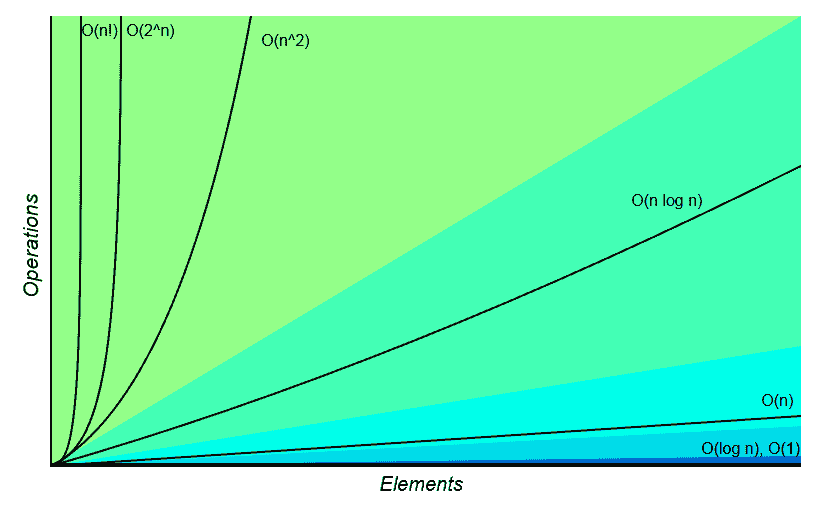
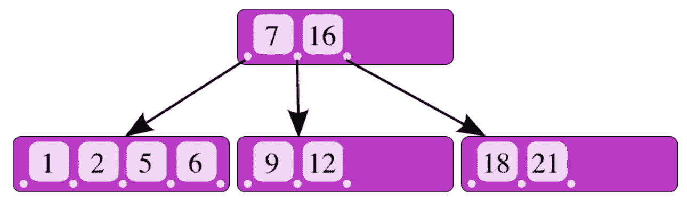
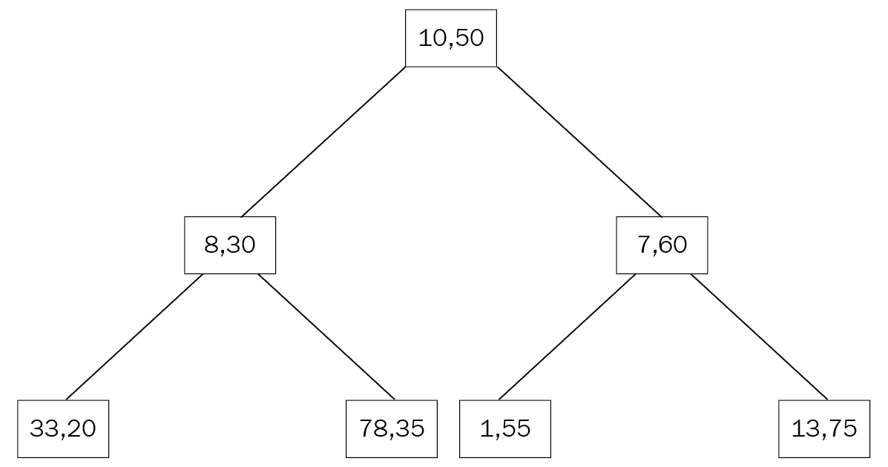

# 七、索引

本章将探讨任何数据库最重要的属性之一：索引。与图书索引类似，数据库索引允许更快的数据检索。在 RDBMS 世界中，索引被广泛使用（有时被滥用）以加速数据访问。在 MongoDB 中，索引在模式和查询设计中起着不可或缺的作用。MongoDB 支持大量索引，您将在本章中了解这些索引，包括单字段索引、复合索引、多键索引、地理空间索引、哈希索引、部分索引等。除了查看不同类型的索引外，我们还将向您展示如何为单服务器部署构建和管理索引，以及复杂的分片环境。

在本章中，我们将介绍以下主题：

*   索引内部构件
*   索引类型
*   建立和管理索引
*   索引的有效使用

# 索引内部构件

在大多数情况下，索引是 B 树数据结构的变体。由鲁道夫·拜尔（Rudolf Bayer）和埃德·麦克赖特（Ed McCreight）于 1971 年发明的**B 树**数据结构允许在对数时间内执行搜索、顺序访问、插入和删除。**对数时间**属性代表平均情况性能和可能的最差性能，当应用程序无法容忍性能行为的意外变化时，它是一个很好的属性。

为了进一步说明对数时间部分的重要性，我们将向您展示来自[的 Big-O 复杂度图 http://bigocheatsheet.com/](http://bigocheatsheet.com/) ：



在这张图中，您可以看到对数时间性能是一条平行于图的*x*轴的扁平线。随着元素数量的增加，恒定时间（**O（n）**算法的性能更差，而二次时间算法（**O（n^2）**则不在图表中。对于一种算法来说，时间性能是最重要的，我们依靠它来尽快将数据返回给我们。

B-树的另一个有趣特性是它是自平衡的，这意味着它将自我调整以始终保持这些特性。它的前身和最近的亲属是二叉搜索树，一种数据结构，每个父节点只允许两个子节点。

示意图上，B-树如下图所示，也可在[处看到 https://commons.wikimedia.org/w/index.php?curid=11701365](https://commons.wikimedia.org/w/index.php?curid=11701365) ：



在上图中，我们有一个值为**7**和 16 的父节点，指向三个子节点。

如果我们搜索值**9**，知道它大于**7**且小于**16**，我们将直接指向包含该值的中间子节点。

由于这种结构，我们每一步的搜索空间都会减少一半，最终的时间复杂度为*log n*。与顺序扫描每个元素相比，随着我们必须搜索的元素数量的增加，每一步将元素数量减半会以指数方式增加我们的收益。

# 索引类型

MongoDB 为不同的需求提供了大量的索引类型。在下面的部分中，我们将确定不同的类型，以及每种类型满足的需求

# 单字段索引

最常见和最简单的索引类型是单字段索引。单个字段和键索引的一个示例是`ObjectId`（`_id`上的索引），它默认在每个 MongoDB 集合中生成。`ObjectId`索引也是唯一的，防止第二个文档在集合中具有相同的`ObjectId`。

基于我们在前几章中使用的`mongo_book`数据库，单个字段上的索引定义如下：

```js
> db.books.createIndex( { price: 1 } )
```

这里，我们按照索引创建的升序在字段名上创建索引。对于降序，将按如下方式创建相同的索引：

```js
> db.books.createIndex( { price: -1 } )
```

如果我们希望查询支持存储在索引中的第一个文档上的值，那么索引创建的顺序很重要。然而，由于索引具有极其高效的时间复杂性，对于最常见的用例来说，这将不是一个考虑因素。

索引可用于字段值的精确匹配查询或范围查询。在前一种情况下，只要指针在*O（logn）*时间之后到达值，搜索就可以停止。

在范围查询中，由于我们在 B-树索引中按顺序存储值，一旦我们在 B-树的一个节点中找到范围查询的边界值，我们就会知道其子节点中的所有值都将是结果集的一部分，从而结束搜索。

这方面的示例如下所示：



# 删除索引

删除索引和创建索引一样简单。我们可以通过名称或由以下字段组成的字段引用索引：

```js
> db.books.dropIndex( { price: -1 } ) > db.books.dropIndex( "price_index" )
```

# 索引嵌入字段

作为一个文档数据库，MongoDB 支持在同一文档中嵌套复杂层次结构中嵌入字段和整个文档。当然，它也允许我们对这些字段进行索引。

在我们的`books`收集示例中，我们可以有如下文档：

```js
{
"_id" : ObjectId("5969ccb614ae9238fe76d7f1"),
"name" : "MongoDB Indexing Cookbook",
"isbn" : "1001",
"available" : 999,
"meta_data" : {
"page_count" : 256,
"average_customer_review" : 4.8
}
} 
```

这里，`meta_data`字段本身就是一个文档，有`page_count`和`average_customer_review`字段。同样，我们可以在`page_count`上创建一个索引，如下所示：

```js
db.books.createIndex( { "meta_data.page_count": 1 } )
```

这可以回答关于`meta_data.page_count`字段周围的相等性和范围比较的查询，如下所示：

```js
> db.books.find({"meta_data.page_count": { $gte: 200 } })
> db.books.find({"meta_data.page_count": 256 })
```

To access embedded fields, we use dot notation, and we need to include quotes (`""`) around the field's name.

# 索引嵌入文档

我们还可以将嵌入文档作为一个整体进行索引，类似于索引嵌入字段：

```js
> db.books.createIndex( { "meta_data": 1 } )
```

在这里，我们为整个文档编制索引，希望查询整个文档，如下所示：

```js
> db.books.find({"meta_data": {"page_count":256, "average_customer_review":4.8}})
```

关键区别在于，当我们索引嵌入字段时，我们可以使用索引对其执行范围查询，而当我们索引嵌入文档时，我们只能使用索引执行比较查询。

The `db.books.find({"meta_data.average_customer_review": { $gte: 4.8}, "meta_data.page_count": { $gte: 200 } })` command will not use our `meta_data` index, whereas `db.books.find({"meta_data": {"page_count":256, "average_customer_review":4.8}})` will use it.

# 背景索引

索引可以在前台创建，在构建之前阻止集合中的所有操作；也可以在后台创建，允许并发操作。通过传入`background: true`参数，在后台建立索引：

```js
> db.books.createIndex( { price: 1 }, { background: true } )
```

背景索引有一些局限性，我们将在本章最后一节*构建和管理索引*中重新讨论。

# 复合索引

复合索引是单键索引的泛化，允许在同一索引中包含多个字段。当我们希望查询跨越文档中的多个字段时，它们非常有用；当我们的集合中有太多字段时，它们也可以用于合并索引。

Compound indexes can have as many as 31 fields. They cannot have a hashed index type.

通过定义要索引的字段和索引顺序，复合索引的声明类似于单个索引：

```js
> db.books.createIndex({"name": 1, "isbn": 1})
```

# 用复合索引排序

索引顺序对于排序结果很有用。在单字段索引中，MongoDB 可以双向遍历索引，因此我们定义的顺序无关紧要。

但是，在多字段索引中，排序可以决定是否可以使用此索引进行排序。在前面的示例中，与索引创建的排序方向匹配的查询将使用我们的索引，如下所示：

```js
> db.books.find().sort( { "name": 1, "isbn": 1 })
```

它还将使用一个`sort`查询，所有的`sort`字段都是反向的：

```js
> db.books.find().sort( { "name": -1, "isbn": -1 })
```

在这个查询中，由于我们否定了这两个字段，所以 MongoDB 可以使用相同的索引，从头到尾遍历它。

其他两个排序顺序如下：

```js
> db.books.find().sort( { "name": -1, "isbn": 1 })
> db.books.find().sort( { "name": 1, "isbn": -1 })
```

它们不能使用索引进行遍历，因为我们想要的`sort`顺序不存在于索引的 B 树数据结构中。

# 重用复合索引

复合索引的一个重要属性是，它们可以用于对索引字段的前缀进行多个查询。当我们想要合并随时间积累在集合中的索引时，这非常有用。

考虑我们先前创建的化合物（多字段）索引：

```js
> db.books.createIndex({"name": 1, "isbn": 1})
```

可用于查询`name`或`{name, isbn}`：

```js
> db.books.find({"name":"MongoDB Indexing"})
> db.books.find({"isbn": "1001", "name":"MongoDB Indexing"})
```

查询中字段的顺序无关紧要；MongoDB 将重新排列字段以匹配我们的查询。

但是，索引中字段的顺序确实很重要。仅针对`isbn`字段的查询不能使用我们的索引：

```js
> db.books.find({"isbn": "1001"})
```

根本原因是我们字段的值以二级、三级等形式存储在索引中；每一个都嵌入到前一个里面，就像一个俄罗斯筑巢娃娃**matryoshka**。这意味着，当我们查询多字段索引的第一个字段时，我们可以使用最外层的玩偶来查找模式，而当我们搜索前两个字段时，我们可以匹配最外层玩偶上的模式，然后深入到内部玩偶。

这个概念被称为**前缀索引**，与索引交集一起，它是索引整合的最强大工具，您将在本章后面看到。

# 多键索引

标量（单个）值的索引在前面的章节中进行了解释。然而，使用 MongoDB 的一个优势是能够轻松地以数组的形式存储向量值。

在关系世界中，存储数组通常是不受欢迎的，因为它违反了正常形式。在面向文档的数据库（如 MongoDB）中，它通常是我们设计的一部分，因为我们可以轻松地存储和查询复杂的数据结构。

文档的索引数组是通过使用多键索引实现的。多键索引可以存储标量值数组和嵌套文档数组。

创建多键索引与创建常规索引相同：

```js
> db.books.createIndex({"tags":1})
```

假设我们使用以下命令在`books`集合中创建了一个文档：

```js
> db.books.insert({"name": "MongoDB Multikeys Cheatsheet", "isbn": "1002", "available": 1, "meta_data": {"page_count":128, "average_customer_review":3.9}, "tags": ["mongodb", "index","cheatsheet","new"] })
```

我们的新索引将是一个多键索引，允许我们查找包含存储在数组中的任何标记的文档：

```js
> db.books.find({tags:"new"})
{
"_id" : ObjectId("5969f4bc14ae9238fe76d7f2"),
"name" : "MongoDB Multikeys Cheatsheet",
"isbn" : "1002",
"available" : 1,
"meta_data" : {
"page_count" : 128,
"average_customer_review" : 3.9
},
"tags" : [
"mongodb",
"index",
"cheatsheet",
"new"
]
}
>
```

我们还可以使用多键索引创建复合索引，但在每个索引文档中最多只能有一个数组。在 MongoDB 中，我们没有指定每个字段的类型，这意味着在创建索引时使用两个或多个具有数组值的字段将失败，而在插入文档时尝试使用两个或多个字段作为数组将失败。

例如，如果我们的数据库中有以下文档，`tags``analytics_data`上的复合索引将无法创建：

```js
{
"_id" : ObjectId("5969f71314ae9238fe76d7f3"),
"name": "Mastering parallel arrays indexing",
"tags" : [
"A",
"B"
],
"analytics_data" : [
"1001",
"1002"
]
}

> db.books.createIndex({tags:1, analytics_data:1})
{
"ok" : 0,
"errmsg" : "cannot index parallel arrays [analytics_data] [tags]",
"code" : 171,
"codeName" : "CannotIndexParallelArrays"
}
```

因此，如果我们首先在空集合上创建索引并尝试插入此文档，则插入将失败，并出现以下错误：

```js
> db.books.find({isbn:"1001"}).hint("international_standard_book_number_index").explain()
{
 "queryPlanner" : {
 "plannerVersion" : 1,
 "namespace" : "mongo_book.books",
 "indexFilterSet" : false,
 "parsedQuery" : {
 "isbn" : {
 "$eq" : "1001"
 }
 },
 "winningPlan" : {
 "stage" : "FETCH",
 "inputStage" : {
 "stage" : "IXSCAN",
 "keyPattern" : {
 "isbn" : 1
 },
 "indexName" : "international_standard_book_numbe
r_index",
 "isMultiKey" : false,
 "multiKeyPaths" : {
 "isbn" : [ ]
 },
 "isUnique" : false,
 "isSparse" : false,
 "isPartial" : false,
 "indexVersion" : 2,
 "direction" : "forward",
 "indexBounds" : {
 "isbn" : [
 "[\"1001\", \"1001\"]"
 ]
 }
 }
 },
 "rejectedPlans" : [ ]
 },
 "serverInfo" : {
 "host" : "PPMUMCPU0142",
 "port" : 27017,
 "version" : "3.4.7",
 "gitVersion" : "cf38c1b8a0a8dca4a11737581beafef4fe120bcd"
 },
 "ok" : 1
```

Hashed indexes cannot be multikey indexes.

我们在尝试微调数据库时可能遇到的另一个限制是多键索引不能完全覆盖查询。使用索引覆盖查询意味着我们可以完全从索引获取结果数据，而无需访问数据库中的数据。这可以显著提高性能，因为索引最有可能存储在 RAM 中。

从索引的角度来看，查询多键索引中的多个值将导致一个两步过程。

在第一步中，索引将用于检索数组的第一个值，然后对数组中的其余元素进行顺序扫描；例如：

```js
> db.books.find({tags: [ "mongodb", "index", "cheatsheet", "new" ] })
```

这将首先搜索具有`mongodb`值的多键`index`标记中的所有条目，然后依次扫描它们以找到同样具有`index`、`cheatsheet`和`new`标记的条目。

A multikey index cannot be used as a shard key. However, if the shard key is a prefix index of a multikey index, it can be used. We will cover more on this in [Chapter 13](13.html), *Sharding*.

# 特殊类型的索引

除了通用索引之外，MongoDB 还支持特殊用例的索引。在本节中，我们将确定并探索如何使用它们。

# 文本索引

文本索引是字符串值字段上的特殊索引，用于支持文本搜索。本书基于文本索引功能的第 3 版，从 3.2 版开始提供。

通过将索引排序顺序（`-1`、`1`替换为单词`text`，可以类似于常规索引来指定文本索引，如下所示：

```js
> db.books.createIndex({"name": "text"})
```

A collection can have one text index, at the most. This text index can support multiple fields, text or not. It cannot support other special types, such as multikey or geospatial. Text indexes cannot be used for sorting results, even if they are only a part of a compound index.

因为每个集合只有一个文本索引，所以我们需要明智地选择字段。重建这个文本索引可能需要相当长的时间，而且每个集合只有一个索引会使维护变得相当棘手，正如您将在本章末尾看到的那样。

幸运的是，此索引也可以是复合索引：

```js
> db.books.createIndex( { "available": 1, "meta_data.page_count": 1,  "$**": "text" } )
```

带有`text`字段的复合索引遵循本章前面介绍的排序和前缀索引规则。我们可以使用这个索引来查询`available`，或者`available`和`meta_data.page_count`的组合，或者如果排序顺序允许在任何方向上遍历我们的索引，则可以对它们进行排序。

我们还可以盲目地将文档中包含字符串的每个字段索引为`text`：

```js
> db.books.createIndex( { "$**": "text" } )
```

这可能导致索引大小不受限制，应该避免；但是，如果我们有非结构化数据（例如，直接来自应用程序日志，我们不知道哪些字段可能有用，我们希望能够查询尽可能多的字段），那么它可能会很有用。

文本索引将应用词干（删除常见后缀，如英语单词的复数`s`/`es`），并从索引中删除停止词（`a`、`an`、`the`等）。

Text indexing supports more than 20 languages, including Spanish, Chinese, Urdu, Persian, and Arabic. Text indexes require special configurations to correctly index in languages other than English. Some interesting properties of text indexes are explained as follows:

*   **大小写不敏感和变音不敏感**：文本索引不区分大小写和变音。文本索引版本 3（版本 3.4 附带的版本）支持常见的*C*、简单的*S*和特殊的*T*大小写折叠，如**Unicode 字符数据库**（**UCD**8.0 大小写折叠所述。除了不区分大小写之外，文本索引的版本 3 还支持不区分重音。这扩大了对带有小写和大写字母重音的字符的不敏感性。例如，*e*、*è*、*è*、*è*、*ë*以及它们的大写字母对应项，在使用文本索引进行比较时，都可以得到相等的结果。在以前版本的文本索引中，这些字符串被视为不同的字符串。

*   **标记化分隔符：**文本索引版本 3 支持标记化分隔符，定义为`Dash`、`Hyphen`、`Pattern_Syntax`、`Quotation_Mark`、`Terminal_Punctuation`和`White_Space`，如 UCD 8.0 大小写折叠中所述。

# 散列索引

散列索引包含索引字段的`hashed`值：

```js
> db.books.createIndex( { name: "hashed" } )
```

这将在我们`books`收藏的每本书的名称上创建一个哈希索引。哈希索引非常适合相等匹配，但它不能用于范围查询。如果我们想对字段执行一系列查询，我们可以创建一个常规索引（或包含该字段的复合索引），还可以创建一个用于相等匹配的哈希索引。散列索引由 MongoDB 内部用于基于散列的分片，我们将在[第 13 章](13.html)、*分片*中讨论。散列索引将浮点字段截断为整数。尽可能避免散列字段使用浮点。

# 生存时间索引

**生存时间**（**TTL**索引用于在过期时间后自动删除文档。其语法如下：

```js
> db.books.createIndex( { "created_at_date": 1 }, { expireAfterSeconds: 86400 } )
```

`created_at_date`字段值必须是日期或日期数组（将使用最早的日期）。在本例中，文档将在`created_at_date`之后的一天（`86400`秒）被删除。

如果字段不存在或值不是日期，文档将不会过期。换句话说，TTL 索引以静默方式失败，失败时不返回任何错误。

数据被每 60 秒运行一次的后台作业删除。因此，没有明确的准确性保证文档将在过期日期后保留多长时间。

A TTL index is a regular single field index. It can be used for queries like a regular index. A TTL index cannot be a compound index, operate on a capped collection, or use the `_id` field. The `_id` field implicitly contains a timestamp of the created time for the document, but is not a `Date` field. If we want each document to expire at a different, custom date point, we have to set `{expireAfterSeconds: 0}`, and set the TTL index `Date` field manually to the date on which we want the document to expire.

# 部分索引

集合上的部分索引是仅适用于满足`partialFilterExpression`查询的文档的索引。

我们将使用我们熟悉的`books`系列，如下所示：

```js
> db.books.createIndex(
 { price: 1, name: 1 },
 { partialFilterExpression: { price: { $gt: 30 } } }
)
```

使用这个，我们可以为价格高于`30`的书籍建立索引。部分索引的优点是，它们在创建和维护方面更加轻量级，并且使用更少的存储。

`partialFilterExpression`过滤器支持以下操作：

*   相等表达式（即，`field: value`或使用`$eq`运算符）
*   `$exists: true`表达式
*   `$gt`、`$gte`、`$lt`和`$lte`表达式
*   `$type`表达
*   `$and`操作员，仅在顶层

只有当部分索引可以作为一个整体满足查询时，才会使用部分索引。

如果我们的查询匹配或比`partialFilterExpression`过滤器更严格，那么将使用部分索引。如果结果可能不包含在部分索引中，则该索引将被完全忽略。

`partialFilterExpression`不需要是稀疏索引字段的一部分。以下索引是有效的稀疏索引：

```js

 > db.books.createIndex({ name: 1 },{ partialFilterExpression: { price: { $gt: 30 } } })
```

然而，要使用这个部分索引，我们需要查询`name`和`price`是否等于或大于`30`。

Prefer partial indexes to sparse indexes. Sparse indexes offer a subset of the functionality offered by partial indexes. Partial indexes were introduced in MongoDB 3.2, so if you have sparse indexes from earlier versions, it may be a good idea to upgrade them. The `_id` field cannot be a part of a partial index. A shard key index cannot be a partial index. `partialFilterExpression` cannot be combined with the `sparse` option.

# 稀疏索引

稀疏索引类似于部分索引，在它之前几年（从 1.8 版开始提供）。

`sparse`索引仅对包含以下字段的值进行索引：

```js
> db.books.createIndex( { "price": 1 }, { sparse: true } )
```

它将只创建包含`price`字段的文档的索引。

由于某些索引的性质，它们总是稀疏的：

*   `2d`、`2dsphere`（第二版）
*   `geoHaystack`
*   `text`

稀疏且唯一的索引将允许多个文档缺少索引键。它不允许具有相同索引字段值的文档。具有地理空间索引（`2d`、`2dsphere`和`geoHaystack`的稀疏复合索引将索引文档，只要文档具有`geospatial`字段。

只要文档有`text`字段，带有`text`字段的稀疏复合索引就会对文档进行索引。只要文档至少有一个字段，没有上述两种情况的稀疏复合索引就会为文档编制索引。

避免在最新版本的 MongoDB 中创建新的稀疏索引；改为使用部分索引。

# 唯一索引

唯一索引类似于 RDBMS 唯一索引，禁止索引字段重复值。默认情况下，MongoDB 在`_id`字段为每个插入的文档创建唯一索引：

```js
> db.books.createIndex( { "name": 1 }, { unique: true } )
```

这将在一本书的`name`上创建一个`unique`索引。唯一索引也可以是复合嵌入字段或嵌入文档索引。

在复合索引中，唯一性在索引的所有字段中的值组合中强制执行；例如，以下内容不会违反唯一索引：

```js
> db.books.createIndex( { "name": 1, "isbn": 1 }, { unique: true } )
> db.books.insert({"name": "Mastering MongoDB", "isbn": "101"})
> db.books.insert({"name": "Mastering MongoDB", "isbn": "102"})
```

这是因为即使名称相同，我们的索引也在寻找`name`和`isbn`的唯一组合，而这两个条目在`isbn`中有所不同。

唯一索引不适用于哈希索引。如果集合已包含索引字段的重复值，则无法创建唯一索引。唯一索引不会阻止同一文档具有多个值。

如果文档缺少索引字段，将插入该文档。如果第二个文档缺少索引字段，则不会插入该文档。这是因为 MongoDB 将丢失的字段值存储为 null，只允许字段中丢失一个文档。

由 unique 和 partial 组合而成的索引仅在应用了部分索引后应用 unique 索引。这意味着如果多个文档不是部分筛选的一部分，则可能存在多个具有重复值的文档。

# 不区分大小写

区分大小写是索引的常见问题。我们可能以混合大写形式存储数据，在查找存储的数据时需要索引忽略大小写。在 3.4 版之前，这是在应用程序级别通过创建包含所有小写字符的重复字段并为所有小写字段编制索引以模拟不区分大小写的索引来解决的。

使用`collation`参数，我们可以创建不区分大小写的索引，甚至可以创建行为不区分大小写的集合。

通常，`collation`允许用户为字符串比较指定特定于语言的规则。一种可能（但不是唯一）的用法是用于不区分大小写的索引和查询。

使用我们熟悉的`books`集合，我们可以对名称创建不区分大小写的索引，如下所示：

```js
> db.books.createIndex( { "name" : 1 },
 { collation: {
 locale : 'en',
 strength : 1
 }
 } )
```

`strength`参数是排序参数之一：区分大小写比较的定义参数。强度等级遵循 Unicode（**ICU**的**国际组件比较等级。它接受的值如下所示：**

| **强度值** | **说明** |
| `1a` | 初级比较。基于字符串值的比较，忽略任何其他差异，例如大小写和变音符号。 |
| `2` | 二级比较，即基于一级的比较，如果二级比较相等，则比较变音符号（即重音）。 |
| `3`（默认） | 三级比较。与级别*2*相同，增加了案例和变体。 |
| `4` | 第四纪水平。限于特定用例，当水平 1-3 忽略标点符号或处理日语文本时考虑标点符号。 |
| `5` | 相同级别。仅限于特定的使用情况：一个连接断路器。 |

使用`collation`创建索引不足以返回不区分大小写的结果。我们需要在查询中指定`collation`，并且：

```js
> db.books.find( { name: "Mastering MongoDB" } ).collation( { locale: 'en', strength: 1 } )
```

如果我们在查询中指定与索引相同级别的`collation`，则将使用该索引。我们可以指定不同级别的`collation`，如下所示：

```js
> db.books.find( { name: "Mastering MongoDB" } ).collation( { locale: 'en', strength: 2 } )
```

在这里，我们不能使用索引，因为我们的索引有`collation`级别 1，并且我们的查询查找`collation`级别`2`。

如果我们在查询中不使用任何`collation`，我们将得到默认为 3 级的结果，即区分大小写。

使用不同于默认值的`collation`创建的集合中的索引将自动继承此`collation`级别。

假设我们创建一个具有`collation`级别 1 的集合，如下所示：

```js
> db.createCollection("case_sensitive_books", { collation: { locale: 'en_US', strength: 1 } } )
```

以下索引也将具有排序规则`name: 1`：

```js
> db.case_sensitive_books.createIndex( { name: 1 } )
```

对此集合的默认查询将是排序规则`strength: 1`，区分大小写。如果我们想在查询中覆盖它，我们需要在查询中指定不同级别的`collation`，或者完全忽略`strength`部分。以下两个查询将返回我们的`case_sensitive_books`集合中不区分大小写的默认`collation`级别的结果：

```js
> db.case_sensitive_books.find( { name: "Mastering MongoDB" } ).collation( { locale: 'en', strength: 3 } ) // default collation strength value
> db.case_sensitive_books.find( { name: "Mastering MongoDB" } ).collation( { locale: 'en'  } ) // no value for collation, will reset to global default (3) instead of default for case_sensitive_books collection (1)
```

排序规则在 MongoDB 中是一个非常强大且相对较新的概念，因此我们将在不同的章节中继续探讨它。

# 地理空间索引

地理空间索引很早就在 MongoDB 中引入，Foursquare 是 MongoDB（当时的 10gen Inc.）最早的客户和成功案例之一，这一事实可能并非巧合。我们将在本章中探讨三种不同类型的地理空间索引，它们将在以下章节中介绍。

# 二维地理空间索引

`2d`地理空间索引将地理空间数据存储为二维平面上的点。它主要是出于遗留原因而保留的，用于 MongoDB 2.2 之前创建的坐标对，并且在大多数情况下，它不应与最新版本一起使用。

# 2dsphere 地理空间索引

`2dsphere`地理空间索引支持查询计算类地球平面中的几何图形。它比简单的`2d`索引更精确，可以支持 GeoJSON 对象和坐标对作为输入。

自 MongoDB 3.2 以来，它的当前版本是版本 3。默认情况下，它是稀疏索引，仅索引具有`2dsphere`字段值的文档。假设我们在`books`集合中有一个位置字段，跟踪每本书主要作者的家庭地址，我们可以在该字段上创建一个索引，如下所示：

```js
> db.books.createIndex( { "location" : "2dsphere" } )
```

`location`字段必须是 GeoJSON 对象，如下所示：

```js
location : { type: "Point", coordinates: [ 51.5876, 0.1643 ] }
```

`2dsphere`索引也可以是复合索引的一部分，作为第一个字段或其他字段：

```js
> db.books.createIndex( { name: 1, location : "2dsphere" } )
```

# geoHaystack 索引

`geoHaystack`当我们需要在小范围内搜索基于地理位置的结果时，索引非常有用。就像大海捞针一样，通过`geoHaystack`索引，我们可以定义大量的地理定位点，并返回属于该区域的所有结果。

我们将创建一个`geoHaystack`索引，如下所示：

```js
> db.books.createIndex( { "location" : "geoHaystack" ,
 "name": 1 } ,
 { bucketSize: 2 } )
```

这将从每个文档中创建纬度或经度单位为`2`的文档桶。

这里，使用前面的示例`location`：

```js
location : { type: "Point", coordinates: [ 51.5876, 0.1643 ] }
```

基于`bucketSize: 2`，每个带有`location``[49.5876..53.5876, -2.1643..2.1643]`的文档都将与我们的位置属于同一个桶中。

一个文档可以出现在多个存储桶中。如果我们想使用球面几何，`2dsphere`是一个更好的解决方案。`geoHaystack`默认情况下，索引是稀疏的。

如果我们需要计算距离我们位置最近的文档，并且它在我们的`bucketSize`之外（即，在我们的示例中，大于 2 个纬度/经度单位），那么查询将效率低下，并且可能不准确。使用`2dsphere`索引进行此类查询。

# 建立和管理索引

可以使用 MongoDB shell 或任何可用的驱动程序构建索引。默认情况下，索引构建在前台，阻止数据库中的所有其他操作。这会更快，但通常不受欢迎，尤其是在生产实例中。

我们还可以通过在 shell 中的 index 命令中添加`{background: true}`参数，在后台构建索引。后台索引将仅阻止当前连接/线程。我们可以打开一个新的连接（即在命令行中使用`mongo`连接到同一个数据库）：

```js
> db.books.createIndex( { name: 1 }, { background: true } )
```

后台索引构建可能比前台索引构建花费更多的时间，尤其是在索引无法放入可用 RAM 的情况下。

尽早编制索引并定期重新访问索引以进行合并。查询将不会看到部分索引结果。只有在索引完全创建之后，查询才会开始从索引中获取结果。

不要使用主应用程序代码创建索引，因为它会造成不可预测的延迟。相反，从应用程序中获取索引列表，并将其标记为在维护窗口期间创建。

# 强制使用索引

我们可以通过应用`hint()`参数强制 MongoDB 使用索引：

```js
> db.books.createIndex( { isbn: 1 }, { background: true } )
{
"createdCollectionAutomatically" : false,
"numIndexesBefore" : 8,
"numIndexesAfter" : 9,
"ok" : 1
}
```

`createIndex`的输出通知我们已经创建了索引（`"ok" : 1`），没有作为索引创建的一部分自动创建集合（`"createdCollectionAutomatically" : false`），在创建索引之前的索引数量是`8`，现在这个集合总共有九个索引。

现在，如果我们尝试通过`isbn`搜索一本书，我们可以使用`explain()`命令查看`winningPlan`子文档，在那里我们可以找到使用了哪个查询计划：

```js
> db.books.find({isbn: "1001"}).explain()
…
"winningPlan" : {
"stage" : "FETCH",
"inputStage" : {
"stage" : "IXSCAN",
"keyPattern" : {
"isbn" : 1,
"name" : 1
},
"indexName" : "isbn_1_name_1",
...
```

这意味着使用了带有`isbn`的索引`1`和`name`的索引`1`，而不是我们新创建的索引。我们也可以在输出的`rejectedPlans`子文档中查看我们的索引，如下所示：

```js
…
"rejectedPlans" : [
{
"stage" : "FETCH",
"inputStage" : {
"stage" : "IXSCAN",
"keyPattern" : {
"isbn" : 1
},
"indexName" : "isbn_1",
...
```

事实上，这是正确的，因为 MongoDB 正试图重用一个比通用索引更具体的索引。

但我们可能无法确定我们的`isbn_1`指数是否比`isbn_1_name_1`指数表现更好。

我们可以强制 MongoDB 使用我们新创建的索引，如下所示：

```js
> db.books.find({isbn: "1001"}).hint("international_standard_book_number_index")
.explain()
{
...
 "winningPlan" : {
 "stage" : "FETCH",
 "inputStage" : {
 "stage" : "IXSCAN",
 "keyPattern" : {
 "isbn" : 1
 },
...
```

现在，`winningPlan`子文档包含我们的索引`isbn_1`，没有`rejectedPlans`元素。它是结果集中的一个空数组。

我们不能将`hint()`与特殊类型的文本索引一起使用。

# 提示和稀疏索引

根据设计，稀疏索引不包括索引中的某些文档，这取决于是否存在字段。可能包含索引中不存在的文档的查询将不会使用稀疏索引。

将`hint()`与稀疏索引一起使用可能会导致不正确的计数，因为这会迫使 MongoDB 使用可能不包含我们想要的所有结果的索引。

较旧版本的`2dsphere`、`2d`、`geoHaystack`和文本索引在默认情况下是稀疏的。在仔细考虑其影响后，应谨慎使用`hint()`。

# 在副本集上建立索引

在副本集中，如果我们发出`createIndex()`命令，则在主服务器完成创建索引后，辅助服务器将开始创建索引。类似地，在分片环境中，主分片将开始构建索引，而辅助分片将在完成每个分片的主分片之后开始。

建议在副本集中建立索引的方法如下：

*   从副本集中停止一个辅助副本
*   将其作为独立服务器重新启动到其他端口
*   从 shell 中构建索引作为独立索引
*   重新启动副本集中的辅助服务器
*   允许辅助系统赶上主系统

我们需要在主服务器中有足够大的 oplog 大小，以确保辅助服务器在重新连接后能够跟上。oplog 大小在配置中以 MB 为单位定义，它定义了主服务器的日志中将保留多少操作。如果 oplog 大小最多只能容纳主服务器中发生的最后 100 个操作，并且发生了 101 个或更多操作，这意味着辅助服务器将无法与主服务器同步。这是由于主服务器没有足够的内存来跟踪其操作并通知次服务器。在副本集中构建索引是一个手动过程，涉及每个主服务器和辅助服务器的几个步骤。

可以对副本集中的每个辅助服务器重复此方法。然后，对于主服务器，我们可以执行以下任一操作：

*   在后台构建索引
*   使用`rs.stepDown()`退出主服务器，并以服务器作为辅助服务器重复上述过程

使用第二种方法，当主要步骤停止时，我们的集群将有一段短暂的时间不进行任何写入。我们的应用程序不应该在此（通常少于）30-60 秒期间超时。

在主数据库的后台构建索引也会在后台为辅助数据库构建索引。在创建索引期间，这可能会影响服务器中的写入操作，但另一方面，它没有手动步骤。为了避免意外，最好有一个镜像生产的暂存环境，以及影响暂存中活动集群的干运行操作。

# 管理索引

在本节中，您将学习如何为索引指定人类友好的名称，以及索引时必须记住的一些特殊注意事项和限制。

# 命名索引

默认情况下，MongoDB 会根据索引字段和索引方向自动分配索引名（`1`、`-1`。如果我们想分配自己的`name`，我们可以在创建时分配：

```js
> db.books.createIndex( { isbn: 1 }, { name: "international_standard_book_number_index" } )
```

现在，我们有了一个名为`international_standard_book_number_index`的新索引，而不是 MongoDB 将其命名为`"isbn_1"`。

We can view all of the indexes in our `books` collection by using `db.books.getIndexes()`. A fully qualified index name has to be less than or equal to 128 characters. That also includes `database_name`, `collection_name`, and the dots separating them.

# 特别注意事项

以下是有关索引的一些限制：

*   索引项必须小于 1024 字节。这主要是内部考虑，但如果我们遇到索引问题，我们可以记住这一点。
*   一个集合最多可以有 64 个索引。
*   复合索引最多可以有 31 个字段。
*   特殊索引不能在查询中组合。这包括必须使用特殊索引的特殊查询运算符，例如用于文本索引的`$text`和用于地理空间索引的`$near`。这是因为 MongoDB 可以使用多个索引来完成一个查询，但不是在所有情况下都可以。在*索引交叉口*部分将有更多关于此问题的信息。
*   多键索引和地理空间索引不能覆盖查询。这意味着单靠索引数据不足以完成查询，底层文档需要由 MongoDB 处理才能返回完整的结果集。
*   索引对字段有唯一的约束。我们不能在同一字段上创建多个索引，只在选项上有所不同。这是对稀疏索引和部分索引的限制，因为我们无法创建这些索引的多个变体，这些变体仅在过滤查询中有所不同。

# 有效使用索引

创建索引是一个不应掉以轻心的决定。尽管通过 shell 创建索引很容易，但如果我们最终得到太多或效率不高的索引，它可能会带来问题。在本节中，您将了解如何度量现有索引的性能、提高性能的一些技巧，以及如何整合索引的数量，以获得性能更好的索引。

# 衡量绩效

学习如何使用`explain()`命令将有助于优化和理解索引的性能。与查询一起使用时，`explain()`命令将返回 MongoDB 将用于此查询的查询计划，而不是实际结果。

通过在查询结束时链接它来调用它，如下所示：

```js
> db.books.find().explain()
```

可以选择三个选项：`queryPlanner`（默认）、`executionStats`和`allPlansExecution`。

让我们使用最详细的输出`allPlansExecution`：

```js
> db.books.find().explain("allPlansExecution")
```

在这里，我们可以获得获胜查询计划的信息和有关查询计划的部分信息，这些信息在计划阶段被考虑过，但由于查询计划员认为它们速度较慢而被拒绝。不管怎样，`explain()`命令返回一个相当详细的输出，允许深入了解查询计划如何返回结果。

乍一看，我们需要关注应该使用的索引是否正在使用，以及扫描文档的数量是否与返回的文档的数量尽可能匹配。

对于第一个，我们可以检查`stage`字段并查找`IXSCAN`，这意味着使用了索引。然后，在 sibling`indexName`字段中，我们应该看到预期索引的名称。

对于第二个，我们需要将`keysExamined`与`nReturned`字段进行比较。理想情况下，我们希望索引对查询尽可能有选择性，这意味着要返回 100 个文档，这些文档将是索引检查的 100 个文档。

当然，这是一种折衷，因为索引在我们的集合中的数量和大小都在增加。每个集合可以有有限数量的索引，而且我们一定有有限数量的 RAM 来适应这些索引，因此我们必须在拥有最佳可用索引、这些索引不适合我们的内存和速度变慢之间进行权衡。

# 改进性能

一旦我们对用户最常见和最重要的查询的性能进行了测量，我们就可以开始尝试改进它们了。

一般的想法是，当我们期望（或已经有）开始缓慢运行的可重复查询时，我们需要索引。索引不是免费的，因为它们在创建和维护时会造成性能损失，但对于频繁的查询来说，它们是非常值得的，如果设计正确，可以降低数据库中的锁定百分比。

回顾上一节的建议，我们希望我们的索引能够做到以下几点：

*   装入柱塞
*   确保选择性
*   用于对查询结果进行排序
*   用于我们最常见和最重要的查询

通过在我们的集合中使用`getIndexes()`，并通过检查系统级可用 RAM 和是否使用交换来确保我们没有创建大型索引，可以确保 RAM 的适合性。

如前所述，通过在查询的每个`IXSCAN`阶段比较`nReturned`和`keysExamined`来确保选择性。我们希望这两个数字尽可能接近。

确保我们的索引用于对查询结果进行排序是使用复合索引（将作为一个整体使用，也用于任何基于前缀的查询）和声明索引方向与最常见查询一致的组合。

最后，将索引与我们的查询对齐是一个应用程序使用模式的问题，它可以发现大部分时间都在使用查询，然后在这些查询上使用`explain()`来识别每次使用的查询计划。

# 指数交点

索引交集是指使用多个索引来完成查询的概念。这是最近才添加的，还不完善；但是，我们可以利用它来合并索引。

We can verify whether an index intersection happened in a query by using `explain()` on the query and witnessing an `AND_SORTED` or `AND_HASH` stage in the executed query plan.

当我们使用`OR`（`$or`查询时，通过为每个`OR`子句使用不同的索引，可能会发生索引交叉。当我们使用`AND`查询时，可能会发生索引交叉，我们对每个`AND`子句都有完整的索引，或者对某些（或全部）子句有索引前缀。

例如，考虑对我们的 To.T0-集合的查询，如下：

```js
> db.books.find({ "isbn":"101", "price": { $gt: 20 }})
```

在这里，有两个索引（一个在`isbn`上，另一个在`price`上），MongoDB 可以使用每个索引获得相关的结果，然后在索引结果上相交得到结果集。

对于复合索引，正如您在本章前面所了解的，我们可以使用索引前缀来支持包含*n*字段复合索引的前*1…n-1*字段的查询。

复合索引不支持的是在复合索引中查找字段的查询，它缺少一个或多个以前定义的字段。

The order matters in compound indexes.

为了满足这些查询，我们可以在各个字段上创建索引，然后使用索引交集来满足我们的需要。这种方法的缺点是，随着字段数量（*n*的增加，我们必须创建的索引数量呈指数增长，从而增加了我们对存储和内存的需求。

索引交叉点与`sort()`不起作用。我们不能使用一个索引进行查询，而使用另一个索引将`sort()`应用于我们的结果。

但是，如果我们有一个索引可以完成整个查询的一部分和`sort()`字段，那么将使用该索引。

# 进一步阅读

您可以参考以下链接以获取更多参考：

*   [http://bigocheatsheet.com/](http://bigocheatsheet.com/)
*   [https://commons.wikimedia.org/](https://commons.wikimedia.org/)
*   [https://docs.mongodb.com/manual/core/index-intersection/](https://docs.mongodb.com/manual/core/index-intersection/)

# 总结

在本章中，您了解了索引的基础和索引内部结构。然后，我们探讨了如何使用 MongoDB 中可用的不同索引类型，如单字段、复合和多键，以及一些特殊类型，如文本、哈希、TTL、部分、解析、唯一、不区分大小写和地理空间。

在本章的下一部分中，您学习了如何使用 shell 构建和管理索引，shell 是管理和数据库管理的基本部分，即使对于 NoSQL 数据库也是如此。最后，我们讨论了如何在较高的级别上改进索引，以及如何在实践中使用索引交集，以整合索引的数量。

在下一章中，我们将讨论如何监控 MongoDB 集群并保持一致的备份。您还将学习如何在 MongoDB 中处理安全性。