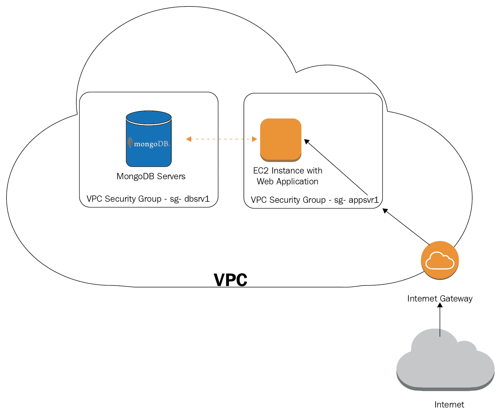

# 十四、容错和高可用性

在本章中，我们将尝试融入我们在前几章中没有讨论的信息，并将重点放在其他一些主题上。在前面的 13 章中，我们从基本概念到有效查询、管理和数据管理，再到可扩展性和高可用性概念，一路走来。

在本章中，我们将介绍以下主题：

*   我们将讨论我们的应用程序设计应该如何适应和主动满足我们的数据库需求。
*   日常运营是我们将讨论的另一个领域，包括可以帮助我们避免意外的提示和最佳实践。
*   鉴于勒索软件最近试图感染并劫持 MongoDB 服务器，我们将提供更多安全提示。
*   最后，我们将尝试总结在一系列检查表中给出的建议，这些检查表应被遵循，以确保正确设置和遵循最佳实践。

# 应用程序设计

在本节中，我们将介绍一些在前几章中没有充分介绍或强调的应用程序设计有用技巧。

# 少模式并不意味着少模式设计

MongoDB 的成功很大一部分归功于 ORM/ODMs 的日益普及。特别是使用 JavaScript 和 MEAN stack 等语言，开发人员可以从前端（Angular/Express）到后端（Node.js）再到数据库（MongoDB）使用 JavaScript。这经常与 ODM 结合在一起，ODM 抽象出数据库的内部，将集合映射到 Node.js 模型。

主要的优点是开发人员不需要修改数据库模式设计，因为这是由 ODM 自动提供的。缺点是数据库集合和模式设计由 ODM 负责，ODM 不具备不同领域和访问模式的业务领域知识。

在 MongoDB 和其他基于 NoSQL 的数据库的情况下，这归结为不仅根据眼前的需要，而且根据后续需要做出架构决策。在体系结构层面上，这可能意味着我们可以结合不同的数据库技术，而不是单一的方法，通过使用图形数据库进行图形相关查询，使用关系数据库进行分层、无界数据，使用 MongoDB 进行 JSON 检索、处理和存储，来满足我们多样化和不断发展的需求。

事实上，MongoDB 的许多成功用例都来自这样一个事实，即它并没有被用作一刀切的解决方案，而只是用于有意义的用例。

# 读性能优化

在本节中，我们将讨论一些优化读取性能的技巧。读取性能与查询的数量及其复杂性直接相关。在没有复杂嵌套数据结构和数组的模式中执行较少的查询通常会导致更好的读取性能。但是，很多时候，优化读性能可能意味着写性能会降低。这是我们在 MongoDB 中进行性能优化时需要记住并不断测量的内容。

# 合并读查询

我们的目标应该是尽可能少的询问。这可以通过将信息嵌入子文档而不是单独的实体来实现。这可能会导致写入负载增加，因为我们必须在多个文档中保留相同的数据点，并且当它们在一个地方发生更改时，必须在任何地方维护它们的值。

此处的设计考虑如下：

*   读取性能得益于数据复制/非规范化。
*   数据完整性得益于数据引用（`DBRef`或在应用程序代码中，使用属性作为外键）。

我们应该去规范化，特别是如果我们的读/写比率太高（我们的数据很少改变值，但在这两者之间会被访问几次），如果我们的数据能够在短时间内保持不一致，而且最重要的是，如果我们绝对需要我们的读取速度尽可能快，并且愿意为一致性/写入性能付出代价。

我们应该去规范化（嵌入）的字段最明显的候选者是依赖字段。如果我们有一个属性或文档结构，我们不打算单独查询，但只作为包含的属性/文档的一部分，那么将其嵌入，而不是将其放在单独的文档/集合中是有意义的。

使用我们的 MongoDB`books`示例，一本书可以有一个相关的数据结构，它引用了该书读者的评论。如果我们最常见的用例是显示一本书及其相关的评论，那么我们可以将评论嵌入到书文档中。

这种设计的缺点是，当我们希望由用户查找所有书评时，成本会很高，因为我们必须迭代所有书籍以获取相关的评论。非规范化用户和嵌入他们的评论可以解决这个问题。

反例是可以无限增长的数据。在我们的示例中，如果我们达到 16MB 文档大小限制，那么将评论与大量元数据一起嵌入可能会导致问题。一个解决方案是区分我们期望快速增长的数据结构和我们不期望快速增长的数据结构，并通过监控在非高峰时间查询实时数据集的过程和报告可能带来风险的属性来关注它们的大小。

Don't embed data that can grow unbounded.

当我们嵌入属性时，我们必须决定是使用子文档还是封闭数组。

当我们拥有访问子文档的唯一标识符时，我们应该将其作为子文档嵌入。如果我们不知道如何访问它，或者我们需要能够查询属性值的灵活性，那么我们应该将它嵌入到数组中。

例如，对于我们的`books`收藏，如果我们决定将评论嵌入到每个图书文档中，我们有以下两个设计选项：

*   带有数组的图书文档：

```js
{
Isbn: '1001',
Title: 'Mastering MongoDB',
Reviews: [
{ 'user_id': 1, text: 'great book', rating: 5 },
{ 'user_id': 2, text: 'not so bad book', rating: 3 },
]
}
```

*   包含嵌入式文档的书籍：

```js
{
Isbn: '1001',
Title: 'Mastering MongoDB',
Reviews:
{ 'user_id': 1, text: 'great book', rating: 5 },
{ 'user_id': 2, text: 'not so bad book', rating: 3 },
}
```

这种数组结构的优点是，我们可以通过嵌入的数组 reviews 直接查询 MongoDB 中`rating`大于`4`的所有评论。

另一方面，使用嵌入式文档结构，我们可以像使用数组一样检索所有评论，但是如果我们想过滤它们，就必须在应用程序端而不是数据库端进行。

# 防御编码

**防御性编码**更多的是一种通用原则，它指的是一组实践和软件设计，以确保在不可预见的情况下软件的持续功能。

它优先考虑代码质量、可读性和可预测性，这是 John F. Woods 在他的《T2L.Cop.Lang.C＋＋Ty3}邮报 1991 年 9 月 24 日的最佳解释：

"Always code as if the guy who ends up maintaining your code will be a violent psychopath who knows where you live. Code for readability."

我们的代码应该是可读和可理解的人，以及由机器。通过静态分析工具、代码审查和报告/解决的 bug 得出的代码质量指标，我们可以估计代码库的质量，并在每次冲刺或准备发布时设定一定的阈值。另一方面，代码的可预测性意味着我们应该总是期望在意外的输入和程序状态下得到结果。

这些原则适用于每个软件系统。在使用 MongoDB 进行系统编程的环境中，我们必须采取一些额外的步骤来确保代码的可预测性，以及随后的质量，都是通过产生的 bug 数量来衡量的。

应定期监控和评估会导致数据库功能丢失的 MongoDB 限制，如下所示：

*   **文档大小限制**：我们应该密切关注文档增长最快的集合，运行后台脚本检查文档大小，并在文档接近限制（16MB）时提醒我们，或者自上次检查以来平均大小是否显著增长。
*   **数据完整性检查**：如果我们使用非规范化进行读取优化，那么检查数据完整性是一个很好的做法。通过软件错误或数据库错误，我们可能会在集合之间产生不一致的重复数据。
*   **模式检查**：如果我们不想使用 MongoDB 的文档验证功能，而是想要一个宽松的文档模式，那么定期运行脚本来识别文档中存在的字段及其频率仍然是一个好主意。然后，结合相关的访问模式，我们可以确定这些字段是否可以被识别和合并。如果我们从另一个系统接收数据，其中数据输入会随时间变化，这可能会导致我们端的文档结构发生巨大变化，那么这一点非常有用。
*   **数据存储检查**：这主要适用于使用 MMAPv1 时，其中文档填充优化有助于提高性能。通过关注文档相对于其填充的大小，我们可以确保修改大小的更新不会导致文档在物理存储中移动。

这些是我们在为 MongoDB 应用程序进行防御性编码时应该实现的基本检查。除此之外，我们还需要防御性地编写应用程序级代码，以确保当 MongoDB 出现故障时，我们的应用程序将继续运行，性能可能会下降，但仍然可以运行。

副本集故障切换和回切就是一个例子。当我们的副本集主机出现故障时，有一段短时间来检测此故障，并选择、提升和运行新的主机。在这短暂的时间内，我们应该确保应用程序继续以只读模式运行，而不是抛出 500 个错误。在大多数情况下，选择一个新的主节点只需几秒钟，但在某些情况下，我们可能最终处于网络分区的少数端，并且在很长一段时间内无法联系主节点。类似地，一些辅助设备可能最终处于恢复状态（例如，如果它们在复制方面远远落后于主设备）；在这种情况下，我们的应用程序应该能够选择不同的二级。

设计二级访问是防御编码最有用的例子之一。我们的应用程序应该权衡只能由主服务器访问以确保数据一致性的字段和可以近实时（而不是实时）更新的字段，在这种情况下，我们可以从辅助服务器读取这些字段。通过使用自动化脚本跟踪我们的二级服务器的复制延迟，我们可以了解集群的负载以及启用此功能的安全性。

另一种防御性的编码实践是总是在日志记录的情况下执行写操作。日志记录有助于从服务器崩溃和电源故障中恢复。

最后，我们应该争取尽早使用副本集。除了性能和工作负载的改进之外，它们还帮助我们从服务器故障中恢复。

# 监控集成

所有这些加起来就意味着监控工具和服务的广泛采用。尽管我们可以编写其中一些脚本，但与云和内部监控工具的集成可以帮助我们在更短的时间内实现更多。

我们跟踪的指标应执行以下操作之一：

*   **检测故障**：故障检测是一个反应过程，我们应该制定明确的协议，以确定当每个故障检测标志熄灭时会发生什么。例如，如果丢失服务器、副本集或碎片，恢复步骤应该是什么？
*   **预防故障**：另一方面，故障预防是一个积极主动的过程，旨在帮助我们在问题成为未来潜在故障源之前发现问题。例如，应使用黄色和红色阈值积极监控 CPU/存储/内存使用情况，并应制定明确的流程，以确定在达到任一阈值时应采取的措施。

# 操作

在连接到生产 MongoDB 服务器时，我们希望确保我们的操作尽可能轻量级（当然是非破坏性的），并且不会在任何意义上改变数据库状态。

我们可以链接到查询的两个有用实用程序如下：

```js
> db.collection.find(query).maxTimeMS(999)
```

我们的`query`将只需要`999`毫秒，然后将返回一个超出时间限制的错误：

```js
> db.collection.find(query).maxScan(1000)
```

我们的`query`将最多检查`1000`文档，以查找结果，然后返回（无错误）。

只要有可能，我们就应该按时间或文档结果大小绑定查询，以避免运行可能影响生产数据库的意外长查询。访问生产数据库的一个常见原因是对降级的群集性能进行故障排除。这可以通过云监控工具进行调查，正如我们在前面的章节中所描述的。

通过 MongoDB shell 的`db.currentOp()`命令将为我们提供当前所有操作的列表。然后我们可以分离出那些具有大`.secs_running`值的，并通过`.query`字段识别它们。

如果我们想要终止一个需要很长时间的正在进行的操作，我们需要记录`.opid`字段的值并将其传递给`db.killOp(<opid>)`。

最后，重要的是要认识到（从操作的角度）一切都可能出错。我们必须制定一个备份战略，并始终如一地实施。最重要的是，我们应该练习从备份恢复，以确保它按预期工作。

# 安全

在最近一波勒索软件锁定不安全的 MongoDB 服务器、要求管理员以加密货币支付赎金以解锁 MongoDB 服务器之后，许多开发人员变得更加安全。安全性是清单上的一个项目，作为开发人员，我们可能没有对其进行足够高的优先级，因为我们乐观地认为它不会发生在我们身上。事实是，在现代互联网环境中，每个人都可能成为自动或定向攻击的目标，因此从设计的早期阶段到生产部署后，都应该始终考虑安全性。

# 默认情况下启用安全性

每个数据库（本地开发服务器除外）都应该在`mongod.conf`文件中设置以下内容：

```js
auth = true
```

SSL should always be enabled, as we described in the relevant [Chapter 8](08.html), *Monitoring, Backup, and Security*.

应通过在`mongod.conf`中添加以下行来禁用 REST 和 HTTP 状态接口：

```js
nohttpinterface = true
rest = false
```

访问应仅限于应用程序服务器和 MongoDB 服务器之间的通信，并且仅限于所需的接口。使用`bind_ip`，我们可以强制 MongoDB 监听特定的接口，而不是默认绑定到每个可用的接口行为：

```js
bind_ip = 10.10.0.10,10.10.0.20
```

# 隔离我们的服务器

我们应该使用 AWS VPC 或我们选择的云提供商提供的同等产品来保护我们的基础设施周边。作为额外的安全层，我们应该将我们的服务器隔离在自己的云中，只允许外部连接到达我们的应用程序服务器，而不允许它们直接连接到我们的 MongoDB 服务器：



我们应该投资于基于角色的授权。安全性不仅在于防止外部参与者造成的数据泄漏，还在于确保内部参与者具有适当级别的数据访问权限。在 MongoDB 级别使用基于角色的授权，我们可以确保用户具有适当的访问级别。

考虑企业版的大型部署。Enterprise Edition 提供了一些有关安全性的方便功能，更多地与知名工具集成，并且应针对大型部署进行评估，同时在我们从单一副本集过渡到企业复杂体系结构时，应着眼于不断变化的需求。

# 检查表

操作需要完成许多任务和复杂性。一个好的做法是保留一组检查表，其中包含需要执行的所有任务及其重要性顺序。这将确保我们不会漏掉任何东西。例如，部署和安全检查表可以如下所示：

*   **硬件**：
    *   **存储**：每个节点需要多少磁盘空间？增长率是多少？
    *   **存储技术**：我们需要 SSD 还是 HDD？我们存储的吞吐量是多少？
    *   **RAM**：预期的工作集是什么？我们能把它装进公羊里吗？如果不是，我们可以用 SSD 代替 HDD 吗？增长率是多少？
    *   **CPU**：MongoDB 通常不关心这一点，但如果我们计划在集群中运行 CPU 密集型作业（例如聚合或`MapReduce`），则可能会出现这种情况。
    *   **网络**：服务器之间的网络链接是什么？如果我们使用单个数据中心，这通常是微不足道的，但如果我们有多个数据中心和/或用于灾难恢复的异地服务器，这可能会变得复杂。
*   **安全**：
    *   启用身份验证。
    *   启用 SSL。
    *   禁用 REST/HTTP 接口。
    *   隔离我们的服务器（例如，VPC）。
    *   授权已启用。权力越大，责任越大。确保强大的用户是您信任的用户。不要给没有经验的用户潜在的破坏能力。

监测和操作清单可如下所示：

*   **监控**：
    *   硬件（CPU、内存、存储器和网络）的使用情况。
    *   运行状况检查，使用 Pingdom 或等效服务确保在某台服务器出现故障时收到通知。
    *   客户机性能监控：从端到端的角度，以手动或自动的方式集成定期神秘购物者测试，以了解其行为是否符合预期。我们不想从客户那里了解应用程序性能问题。
    *   使用 MongoDB 云管理器进行监控；它有一个免费的层，可以提供有用的指标，如果我们遇到问题并需要他们的帮助，特别是作为支持合同的一部分，MongoDB 工程师可以查看它。
*   **灾难恢复**：
    *   **评估风险**：从业务角度来看，丢失 MongoDB 数据的风险是什么？我们可以重新创建这个数据集吗？如果是，在时间和精力方面的成本是多少？
    *   **设计一个计划**：为每个故障场景制定一个计划，以及我们在发生事故时需要采取的确切步骤。
    *   **测试计划**：对每个恢复策略进行试运行与拥有一个恢复策略一样重要。灾难恢复过程中可能会出现很多问题，而不完整的计划（或每个目标都失败的计划）是我们在任何情况下都不应该允许发生的事情。
    *   **有一个计划的替代方案**：无论我们如何设计和测试一个计划，在计划、测试或执行过程中，任何事情都可能出错。我们需要为我们的计划制定一个备份计划，以防我们无法使用计划 a 恢复数据。这也被称为计划 B，或是最后的解决方案。它不一定要有效率，但它应该可以减轻任何商业信誉风险。
    *   **负载测试**：我们应该确保在部署应用程序之前对应用程序进行端到端的负载测试，并使用实际的负载。这是确保应用程序按预期运行的唯一方法。

# 进一步阅读

有关更多信息，请参阅以下链接：

*   [http://mo.github.io/2017/01/22/mongo-db-tips-and-tricks.html](http://mo.github.io/2017/01/22/mongo-db-tips-and-tricks.html)
*   [https://studio3t.com/whats-new/tips-for-sql-users-new-to-mongodb/](https://studio3t.com/whats-new/tips-for-sql-users-new-to-mongodb/)
*   [https://www.hostreview.com/blog/170327-top-7-mongodb-performance-tips-must-know](https://www.hostreview.com/blog/170327-top-7-mongodb-performance-tips-must-know)
*   [https://groups.google.com/forum/#!msg/comp.lang.c++/rYCO5yn4lXw/oITtSkZOtoUJ](https://groups.google.com/forum/#!msg/comp.lang.c++/rYCO5yn4lXw/oITtSkZOtoUJ)

# 总结

在本章中，我们讨论了前几章中未详细介绍的一些主题。根据我们的工作量要求应用最佳实践非常重要。阅读性能通常是我们想要优化的；这就是我们讨论合并查询和数据非规范化的原因。

从部署到确保集群的持续性能和可用性，操作也很重要。安全是一种我们通常在它影响到我们之前不会考虑的东西。这就是为什么我们应该提前投入时间进行规划，确保我们有足够安全的措施。

最后，我们引入了检查表的概念，以跟踪我们的任务，并确保在重大操作事件（部署、集群升级、从副本集移动到分片等）之前完成所有任务。