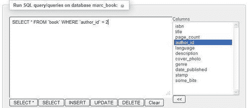
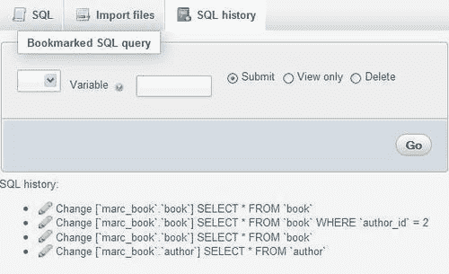
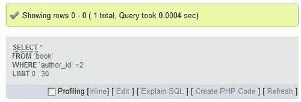
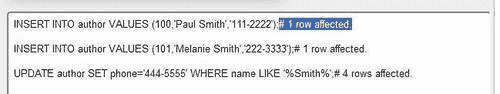
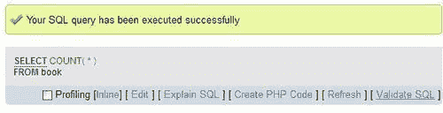
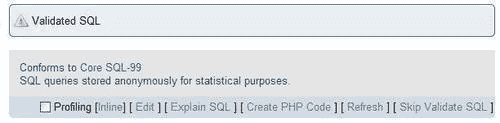

# 十一、输入 SQL 语句

本章介绍如何将自己的 SQL 语句（查询）输入到 phpMyAdmin 中，以及如何保存这些查询的历史记录。传统上，人们会通过“MySQL”命令行客户端与 MySQL 服务器交互，方法是输入 SQL 语句并观察服务器的响应。官方的 MySQL 培训仍然需要直接向这样的客户机输入语句。

# SQL 查询框

phpMyAdmin 允许我们通过其图形界面完成许多数据库操作。但是，有时我们必须依赖 SQL 查询输入来实现接口不直接支持的操作。以下是此类查询的两个示例：

```php
SELECT department, AVG(salary) FROM employees GROUP BY department HAVING years_experience > 10;
SELECT FROM_DAYS(TO_DAYS(CURDATE()) +30);

```

要输入此类查询，可以在 phpMyAdmin 中的多个位置使用 SQL 查询框。

## 数据库视图

在进入 `Database`视图中可用的**SQL**菜单时，我们遇到了第一个 SQL 查询框。


这个框很简单，我们输入一些有效（希望）的 MySQL 语句，然后点击**Go**。在查询文本区域下，有与书签相关的选项（稍后在[第 14 章](14.html "Chapter 14. Using Query Bookmarks")中解释）。通常，我们不必更改标准 SQL 分隔符，它是分号。但是，如果我们需要，会有一个**分隔符**对话框（请参阅[第 17 章）](17.html "Chapter 17. Supporting Features Added in MySQL 5")。

对于出现在此框中的默认查询，我们可以使用 `$cfg['DefaultQueryDatabase']`配置指令进行设置，该指令默认为空。我们可以在这个指令中放置一个查询，比如 `SHOW TABLES FROM @DATABASE@`。此查询中的 `@DATABASE@`占位符将被当前数据库名称替换，导致查询框中出现 `SHOW TABLES FROM `marc_book``。

## 桌面视图

在**SQL**菜单的 `book`表的 `Table`视图中有一个稍微不同的框。


如前一个屏幕截图所示，该框已具有默认查询。此默认查询由包含 `SELECT * FROM @TABLE@ WHERE 1`的 `$cfg['DefaultQueryTable']`配置指令生成。这里， `@TABLE@`被当前表名替换。 `$cfg['DefaultQueryTable']`中另一个可用的占位符是 `@FIELDS@`。此占位符将被该表的完整列列表替换，从而生成以下查询：

```php
SELECT `isbn`, `title`, `page_count`, `author_id`, `language`, `description`, `cover_photo`, `genre`, `date_published`, `stamp`, `some_bits` FROM `book` WHERE 1.

```

`WHERE 1`是一个永远正确的条件。因此，查询可以按原样执行。我们可以用所需的条件替换**1**，也可以键入完全不同的查询。

因为这个 SQL 框出现在 `Table`视图中，所以表名是已知的；因此，phpMyAdmin 在查询框下方显示按钮，允许快速创建包含此表名的公共 SQL 查询。这些按钮生成的大多数查询都包含完整的列列表。

### 列选择器

**列**选择器是一种加速查询生成的方法。通过选择一列并单击箭头**<<**，此列名将复制到查询框中当前光标位置。在这里，我们选择**作者 id**栏，删除数字**1**，点击**<<**。然后我们添加条件**=2**，如下图所示：



**在此处再次显示此查询**选项（默认选中）确保在执行查询后，如果我们仍在同一页面上，查询将保留在框中。对于像 `UPDATE`或 `DELETE`这样的查询，这更容易看到，它会影响表，但不会生成单独的结果页。

### 点击进入查询框

我们可能希望使用 `$cfg['TextareaAutoSelect']`配置指令更改查询框内的单击行为。其默认值为 `FALSE`，这意味着点击后不会自动选择内容。如果您将此指令更改为 `TRUE`，则此框内的第一次单击将选择其所有内容。（这是一种快速将内容复制到其他位置或从框中删除内容的方法。）下一次单击会将光标置于单击位置。

# 查询窗口

在[第 3 章](03.html "Chapter 3. Over Viewing the Interface")中，我们讨论了此窗口的用途，以及更改某些参数（如尺寸）的过程。使用**SQL**图标或**查询窗口**链接，可以从导航面板轻松打开此窗口，如下图所示，并且非常方便输入查询和测试：


以下屏幕截图显示了出现在主面板上的查询窗口：


屏幕截图中显示的窗口包含与 `Table`视图上下文中使用的相同的**列**选择器和**<<**按钮。此独特的查询窗口是仅在支持 JavaScript 的浏览器上支持的功能。

## 查询窗口选项

**SQL**选项卡是此窗口中的默认活动选项卡。这来自配置指令 `$cfg['QueryWindowDefTab']`，默认包含 `sql`。

如果我们希望另一个选项卡成为默认的活动选项卡，我们可以用 `files`或 `history`替换 `sql`。另一个值 `full`同时显示所有三个选项卡的内容。

在查询窗口中，我们看到一个复选框，用于选择**不要从窗口**之外覆盖此查询。通常，选中此复选框。如果取消选择它，则生成查询时所做的更改将反映在查询窗口中。这称为**同步**。例如，从导航或主面板中选择不同的数据库或表将相应地更新查询窗口。但是，如果我们开始直接在此窗口中键入查询，将选中该复选框以保护其内容并删除同步。这样，这里组成的查询将被锁定和保护。

## 基于会话的 SQL 历史记录

此功能收集我们作为 PHP 会话数据执行的所有成功 SQL 查询，并修改查询窗口使其可用。此默认历史类型是临时的，因为默认情况下 `$cfg['QueryHistoryDB']`设置为 `FALSE`。

## 基于数据库的 SQL 历史记录（永久）

当我们安装了 phpMyAdmin 配置存储（请参阅[第 1 章](01.html "Chapter 1. Getting Started with phpMyAdmin")时，可以使用更强大的历史机制。我们现在应该通过将 `$cfg['QueryHistoryDB']`设置为 `TRUE`来启用此机制。

在我们尝试从其中一个查询框中进行一些查询后，将生成一个历史记录，仅在查询窗口中可见，如以下屏幕截图所示：



我们看到（以相反的顺序）最后成功的查询以及进行查询的数据库。仅从查询框中键入的查询与由 phpMyAdmin 生成的查询（例如通过点击**浏览】**生成的查询）一起保留在此历史记录中。

可点击立即执行，**更改**图标可将记录的查询插入查询框进行编辑。

保留的查询数量由 `$cfg['QueryHistoryMax']`控制，默认设置为 `25`。保留此限制并非出于性能原因，而是为了实现视觉上无障碍的视图而作为实际限制。在传统上称为**垃圾收集**的过程中，在登录时消除了额外的查询。查询存储在 `$cfg['Servers'][$i]['history']`中配置的表中。

## 编辑查询

在成功查询的结果页面上，将显示包含已执行查询的标题，如以下屏幕截图所示：



点击**编辑**打开查询窗口的**SQL**页签，该查询可以修改。这是因为此参数的以下默认设置：

```php
$cfg['EditInWindow'] = TRUE;

```

设置为 `FALSE`时，点击**编辑**不会打开查询窗口；相反，查询将显示在**SQL**页面的查询框中。

点击**内联**将显示的查询替换为一个文本区域，在该文本区域可以编辑和提交此查询，而无需离开当前结果页面。

# 多语句查询

在 PHP 和 MySQL 编程中，使用 `mysql_query()`函数调用一次只能发送一个查询。phpMyAdmin 允许我们在一次传输中发送多个查询，使用分号作为分隔符。假设我们在查询框中键入以下查询：

```php
INSERT INTO author VALUES (100,'Paul Smith','111-2222');
INSERT INTO author VALUES (101,'Melanie Smith','222-3333');
UPDATE author SET phone='444-5555' WHERE name LIKE '%Smith%';

```

我们将在屏幕上收到以下结果：



我们通过注释看到受影响行的数量，因为 `$cfg['VerboseMultiSubmit']`设置为 `TRUE`。

让我们再次发送相同的查询列表并观察结果：


收到**重复输入**错误消息表示**100**值已经存在是正常的。我们看到了第一个**插入**语句的结果；但是下一个呢？执行在第一个错误时停止，因为 `$cfg['IgnoreMultiSubmitErrors']`被设置为 `FALSE`，告知 phpMyAdmin 不要忽略多个语句中的错误。如果设置为 `TRUE`，程序会依次尝试所有语句，我们会看到两个**重复条目**错误。

如果我们尝试了多个 `SELECT`语句，此功能将无法按预期工作。我们只会看到最后一个 `SELECT`语句的结果。

# 漂亮打印（语法高亮）

默认情况下，phpMyAdmin 解析并突出显示它处理的任何 MySQL 语句的各种元素。由 `$cfg['SQP']['fmtType']`控制，默认设置为`'html'`。此模式为每个不同的元素（保留字、变量、注释等）使用特定的颜色，如特定于主题的 `layout.inc.php`文件中的 `$cfg['SQP']['fmtColor']`数组中所述。

将 `fmtType`设置为`'text'`将删除所有颜色格式，在 MySQL 语句的逻辑点插入换行符。最后，将 `fmtType`设置为`'none'`将删除各种格式，使语法保持不变。

# SQL 验证程序

每次 phpMyAdmin 传输查询时，MySQL 服务器都会对其进行解释并提供反馈。查询的语法必须遵循与 SQL 标准不同的 MySQL 规则。然而，符合 SQL 标准可以确保我们的查询在其他 SQL 实现上可用。

我们可以使用免费的外部服务**Mimer SQL Validator**，这要感谢 Mimer Information Technology AB。它根据核心 SQL-99 规则验证我们的查询并生成报告。验证程序可直接从 phpMyAdmin 获得，其主页位于[http://developer.mimer.com/validator/index.htm](http://developer.mimer.com/validator/index.htm) 。

### 注

出于统计目的，此服务在其服务器上匿名存储它接收的查询。存储查询时，它会用通用名称替换数据库、表和列名。作为查询一部分的字符串和数字将替换为通用值，以保护原始信息。

## 系统要求

此验证器作为 SOAP 服务提供。我们的 PHP 服务器必须支持 XML、PCRE 和 SOAP。SOAP 支持由 PHP 扩展或 PEAR 模块提供。如果我们选择 PEAR 方式，以下命令（由系统管理员在服务器上执行）将安装我们需要的模块：

```php
pear install Net_Socket Net_URL HTTP_Request Mail_Mime Net_DIME SOAP 

```

如果由于某些模块处于 beta 状态而导致此命令出现问题，我们可以执行以下命令，安装 SOAP 和其他相关模块：

```php
pear -d preferred_state=beta install -a SOAP 

```

## 使验证器可用

某些参数必须在 `config.inc.php`中配置。将 `$cfg['SQLQuery']['Validate']`设置为 `TRUE`将启用**验证 SQL**链接。

我们还应该启用验证器本身（因为其他验证器可能在未来的 phpMyAdmin 版本上可用）。这是通过将 `$cfg['SQLValidator']['use']`设置为 `TRUE`来实现的。

默认情况下，使用匿名验证器帐户访问验证器，如使用以下命令配置的：

```php
$cfg['SQLValidator']['username'] = '';
$cfg['SQLValidator']['password'] = '';

```

相反，如果 Mimer Information Technology 为我们提供了一个帐户，我们可以在这里使用该帐户信息。

## 验证器结果

验证器返回两种报告：一种是查询符合标准，另一种是不符合标准。

### 符合标准的查询

我们将尝试一个简单的查询： `SELECT COUNT(*) FROM book`。像往常一样，我们在查询框中输入此查询并发送它。在结果页面上，我们现在看到一个额外的链接-**验证 SQL**，如以下屏幕截图所示：



点击**验证 SQL**生成如下屏幕截图所示的报告：



我们可以点击**跳过验证 SQL**查看原始查询。

### 不符合标准的查询

让我们尝试另一个在 MySQL 中正常工作的查询： `SELECT * FROM book WHERE language = 'en'`。将其发送到验证器会生成一个报告，如以下屏幕截图所示：


每次验证器发现问题时，它都会在错误点添加一条消息，如**{error:1}**，并在报告中添加一个脚注。在本次查询中，**语言**列名为非标准。因此，验证器告诉我们，此时它需要一个标识符。另一个非标准错误是关于使用由 phpMyAdmin 添加到查询中的 `LIMIT`子句的报告。

另一种情况是反向报价。如果我们只需点击**浏览**来查找 `book`表，phpMyAdmin 就会生成 `SELECT * FROM `book``，并用反引号括住表名。这是 MySQL 保护标识符的方法，标识符可能包含特殊字符，如空格、国际字符或保留字。但是，将此查询发送到验证器会显示反引号不符合标准 SQL。我们甚至可能会得到两个错误，一个是回报价。

# 总结

本章帮助我们理解了查询框的用途，并向我们展示了在哪里可以找到它们。它还概述了如何使用列选择器、查询窗口选项、如何获取类型化命令的历史记录、多语句查询，以及最后如何使用 SQL 验证器。

下一章将展示如何通过 phpMyAdmin 的查询生成器生成多表查询，而无需键入太多内容。