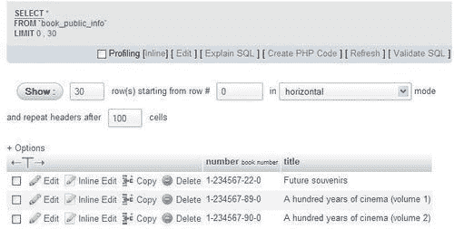
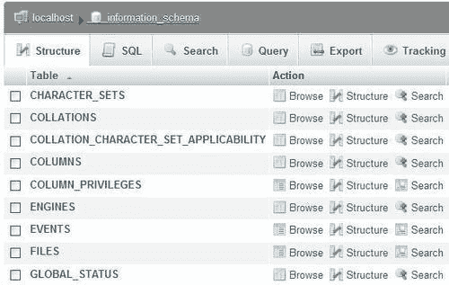
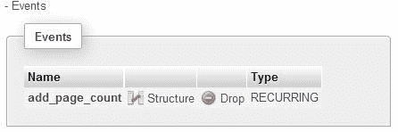

# 十七、MySQL 5 新增支持功能

MySQL 5.0 引入了许多新功能，平息了许多开发人员和行业观察家的情绪，他们声称 MySQL 不如竞争对手的产品。视图、存储过程、触发器、标准的 `information_schema`，以及（最近）一种分析机制现在都出现在 MySQL 中。本章将介绍这些功能。

在 MySQL 5.1 的新特性中，与 web 界面相关的特性（例如分区和事件）在 phpMyAdmin 中得到支持，本章也将介绍这些特性。

# 支持意见

MySQL 5.0 引入了对命名视图和可更新视图的支持（更多详细信息请参见[http://dev.mysql.com/doc/refman/5.5/en/views.html)](http://dev.mysql.com/doc/refman/5.5/en/views.html))。视图是一个派生表（将其视为虚拟表），其定义存储在数据库中。对一个或多个表（甚至视图）执行的 `SELECT`语句可以存储为视图，也可以查询。

视图可用于：

*   限制列的可见性（例如，不显示薪资信息）
*   限制行的可见性（例如，不显示特定世界区域的数据）
*   隐藏已更改的表结构（以便遗留应用程序可以继续工作）

与在许多表上定义繁琐的特定于列的权限不同，准备包含这些表中有限列集的视图更容易。然后，我们可以对整个视图授予权限。

要在从 5.0 之前的版本升级后激活对服务器上视图的支持，管理员必须执行 MySQL 手册（[中所述的 `mysql_upgrade`程序 http://dev.mysql.com/doc/refman/5.0/en/upgrading-from-previous-series.html](http://dev.mysql.com/doc/refman/5.0/en/upgrading-from-previous-series.html) 。

### 注

每个用户必须具有适当的 `SHOW_VIEW`或 `CREATE_VIEW`权限才能查看或操作视图。这些权限存在于全局（服务器）、数据库和表级别。

创建视图意味着用户对所涉及的表具有特权，或者至少对视图中提到的所有列具有特权，例如 `SELECT`或 `UPDATE`。

## 根据结果创建视图

我们可以利用 phpMyAdmin 的**搜索**（在表级别）或**查询**（在数据库级别）功能构建一个相当复杂的查询，执行它，然后根据结果轻松创建一个视图。我们将看看如何做到这一点。

我们提到视图可以用来限制列（实际上还有表）的可见性。假设一本书的页数是高度机密的信息。我们打开 `book`表，点击**搜索**，然后选择不包括**页面计数**列的列子集（我们可能需要打开**选项**滑块）。


点击**Go**生成一个结果页面，在**查询结果操作**部分我们看到一个**创建视图**链接。我们使用此链接访问视图创建面板，该面板在**AS**框中已经有了基础查询。我们需要为这个视图选择一个名称（这里，我们使用**book\u public\u info】**，并且我们可以选择为它设置不同的列名（这里，我们使用**编号、标题】**，如下图所示：


其他选项可能会影响视图的行为，MySQL 手册（[中对此进行了解释 http://dev.mysql.com/doc/refman/5.5/en/create-view.html](http://dev.mysql.com/doc/refman/5.5/en/create-view.html) 。 `LOCAL CHECK OPTION`子句影响可更新视图的行为（这在前面引用的 MySQL 手册中有解释）。

点击**Go**生成我们要求的视图。此时，视图已创建。如果我们刷新浏览器页面，然后访问 `marc_book`数据库，我们将看到以下屏幕截图：


在主面板中，我们可以看到关于新创建的视图的信息。视图的行数当前表示为**~0**（更多信息请参见本章后面的*控制行计数以提高性能*部分），并且**视图**在**类型**列中表示。没有与视图关联的排序规则或大小。

## 主面板和视图

由于视图与表有相似之处，所以它的名称可以和普通表的名称一起使用。单击视图名称时，将显示一个与表类似的面板，但菜单选项卡比普通表中的更少。事实上，某些操作在视图上没有意义，例如，**导入**。这是因为视图实际上并不包含数据。但是，其他操作，例如**浏览**是完全可以接受的。

让我们浏览以下屏幕截图所示的视图：



我们注意到，在生成的 SQL 查询中，我们没有看到原始的 `CREATE VIEW`语句。原因是我们使用 `SELECT`语句从视图中进行选择，隐藏了我们从视图中提取数据的事实。然而，导出视图的结构将显示 MySQL 如何在内部存储我们的视图：

```php
CREATE ALGORITHM=UNDEFINED DEFINER=`root`@`%` SQL SECURITY DEFINER VIEW `book_public_info` AS
select `book`.`isbn` AS `number`,`book`.`title` AS `title` from `book`;

```

主面板的菜单可能与桌子的菜单相似。但是，必要时，phpMyAdmin 会生成适当的语法来处理视图。

### 注

要对现有视图执行操作，用户需要在视图级别具有适当的权限，但不一定对该视图中涉及的表具有任何权限。这就是我们如何实现列和表隐藏的方法。

## 控制行计数以提高性能

phpMyAdmin 有一个配置参数 `$cfg['MaxExactCountViews']`，用于控制 phpMyAdmin 的行计数阶段。有时，一个视图包含许多巨大的表，浏览它会出现大量虚拟行。因此，此参数的默认值为 0 可确保视图不进行行计数。在这种情况下，我们在浏览视图时会看到非常奇怪的结果：**显示第 0-1 行（总共 0 行，查询耗时 0.0006 秒）**。这比降低服务器速度更容易接受。

尽管如此，如果我们希望查看更精确的视图行数，我们可以在该参数中设置更大的值，这将作为行数阶段的上限。

# 支持例程、存储过程和函数

phpMyAdmin 开始支持存储过程和函数需要一段时间。原因是这些代码块（像一个子程序）作为数据库的一部分保存。phpMyAdmin 作为一个 web 界面，更倾向于使用鼠标快速执行的操作。

尽管如此，phpMyAdmin 有一些特性，允许开发人员创建、保存、调用这些例程以进行一些修改和删除它们。

通过 `CALL`语句访问过程，我们可以向其传递参数（更多详细信息见[http://dev.mysql.com/doc/refman/5.5/en/call.html)](http://dev.mysql.com/doc/refman/5.5/en/call.html))。另一方面，函数是从 SQL 语句访问的（例如， `SELECT)`，与其他 MySQL 内部函数类似，因此返回一个值。

创建、查看和删除存储过程或函数需要有 `CREATE ROUTINE`和 `ALTER ROUTINE`权限。运行例程需要 `EXECUTE`权限，尽管该权限通常自动授予例程的创建者。

## 创建存储过程

我们将创建一个过程，通过添加特定的页数来更改特定书籍的页数。本书的 ISBN 和要添加的页数将作为此过程的输入参数。我们使用 SQL 查询框（参见[第 11 章）](11.html "Chapter 11. Entering SQL Statements")进入本程序。

### 更改分隔符

标准的 SQL 分隔符是分号，这个字符将在我们的过程中用于分隔 SQL 语句。然而， `CREATE PROCEDURE`语句本身就是 SQL 语句；因此，我们必须找到一种方法来向 MySQL 解析器指示该语句的结束位置。查询框有一个**分隔符**输入框，默认情况下包含分号。因此，我们将其更改为另一个字符串，按照惯例，它是一个双斜杠`"//"`。


### 进入程序

然后在主查询框中输入程序代码：

```php
CREATE PROCEDURE `add_page`(IN param_isbn VARCHAR(25),
IN param_pages INT, OUT param_message VARCHAR(100))
BEGIN
IF param_pages > 100 THEN
SET param_message = 'the number of pages is too big';
ELSE
UPDATE book SET page_count = page_count + param_pages WHERE
isbn=param_isbn;
SET param_message = 'success';
END IF;
END
//

```

点击**Go**按钮，如果语法正确，我们会收到一条成功消息。如果不是，那么是时候修改我们的打字能力或调试我们的语法了。不幸的是，MySQL 没有过程调试器。

## 测试程序

同样，在查询框中，我们通过输入以下语句来测试我们的过程。这里，我们使用一个 SQL 变量 `@message`，它将接收 `OUT`参数 `param_message:`的内容

```php
call add_page('1-234567-22-0', 4, @message);
SELECT @message;

```

如果一切顺利，我们应该看到**@message**变量包含**success**。

然后我们可以验证这本书的页数是否增加了。我们还需要测试有问题的案例：

```php
call add_page('1-234567-22-0', 101, @message);
SELECT @message;

```

现在可以使用 `mysqli`扩展从 PHP 脚本调用（例如）此过程，建议使用该扩展访问 MySQL 4.1 及更高版本提供的所有功能。

## 操作程序及功能

过程存储在数据库中，不绑定到特定的表。因此，可以在数据库级别的**例程**滑块下的**结构**页面上找到操作程序和功能的界面，如果已经定义了至少一个例程，就会出现该界面。


第一个图标将此过程的文本带到查询框中进行编辑。第二个图标将用于删除此过程。在编辑过程时，我们注意到文本已进行了一些修改。

```php
DROP PROCEDURE `add_page`//
CREATE DEFINER=`marc`@`%` PROCEDURE `add_page`(IN param_isbn VARCHAR(25), IN param_pages INT, OUT param_message VARCHAR(100))
BEGIN
IF param_pages > 100 THEN
SET param_message = 'the number of pages is too big';
ELSE
UPDATE book SET page_count = page_count + param_pages WHERE
isbn=param_isbn;
SET param_message = 'success';
END IF;
END

```

首先，出现一个 `DROP PROCEDURE`语句。这是正常的，因为 MySQL 不提供允许更改过程主体的语句。因此，每次要更改某个过程时，都必须将其删除。 `ALTER PROCEDURE`语句确实存在，但它只能更改过程的特征，例如，通过添加注释。然后，显示一个 `DEFINER`子句。它是在创建时生成的，并指示是谁创建了此过程。

此时，我们需要对代码进行任何更改，然后单击**Go**保存此过程。

### 注

打开**结构**页面上的 `book`表，查找操作该表的过程列表，比如我们的 `add_page()`过程，可能会很有诱惑力。但是，所有过程都存储在数据库级别，代码本身 `(UPDATE book)`与过程存储位置之间没有直接联系。

## 手动创建函数

函数类似于存储过程。然而，一个函数可能只返回一个值，而一个存储过程可以有多个 `OUT`参数。另一方面，在 `SELECT`语句中使用存储函数似乎更自然，因为它避免了需要中间 SQL 变量来保存 `OUT`参数的值。

功能的目标是什么？例如，可以使用函数计算订单的总成本，包括税和运费。将此逻辑放在数据库中而不是应用程序级别有助于记录应用程序数据库接口。它还避免了在每个需要处理此逻辑的应用程序中重复业务逻辑。

我们不应该将 MySQL 5.0 函数与 MySQL 5.0 之前存在的**UDF****（自定义函数）**混淆。UDF 由 C 或 C++编写的代码编译成一个共享对象，并用一个 Type T0}语句和 AuthT1 个关键字引用。

phpMyAdmin 对功能的处理在许多方面与我们在程序中所述的类似：

*   用于输入函数的查询框
*   分隔符的使用
*   操作已定义函数的机制

让我们定义一个函数，根据其代码检索国家名称。我更喜欢使用 `param_`前缀来清楚地标识函数定义中的参数，而使用 `var_`前缀来标识局部变量。我们将使用可靠的 SQL 查询框输入函数的代码，再次指示此框使用 `//`作为分隔符。

```php
CREATE FUNCTION get_country_name(param_country_code CHAR(2))
RETURNS VARCHAR(50)
READS SQL DATA
BEGIN
DECLARE var_country_name VARCHAR(50) DEFAULT 'not found';
SELECT description
FROM country
WHERE code = param_country_code
INTO var_country_name;
RETURN var_country_name;
END
//

```

我们应该注意，我们新创建的函数可以在数据库的**结构**页面上看到，还有它的朋友 `add_page`过程：


## 功能测试

要测试我们刚刚创建的函数，请在查询框中输入以下查询（请参阅[第 11 章）：](11.html "Chapter 11. Entering SQL Statements")

```php
SELECT CONCAT('ca->', get_country_name('ca'), ', zz->',
get_country_name('zz')) as test;

```

这将产生以下结果：

```php
ca->Canada, zz->not found

```

## 导出存储过程和函数

导出数据库时，SQL 导出中将显示过程和函数。这是因为在**导出**页面的**对象创建选项**对话框中，默认选中了**添加创建过程/功能/事件**复选框（可以在**自定义**导出模式下看到）。以下是导出文件中与程序和功能相关的部分：

```php
DELIMITER $$
--
-- Procedures
--
CREATE DEFINER=`marc`@`%` PROCEDURE `add_page`(IN param_isbn
VARCHAR(25), IN param_pages INT, OUT param_message VARCHAR(100))
BEGIN
IF param_pages > 100 THEN
SET param_message = 'the number of pages is too big';
ELSE
UPDATE book SET page_count = page_count + param_pages WHERE
isbn=param_isbn;
SET param_message = 'success';
END IF;
END$$
--
-- Functions
--
CREATE DEFINER=`marc`@`%` FUNCTION `get_country_name`
(param_country_code CHAR(2)) RETURNS varchar(50) CHARSET latin1
READS SQL DATA
BEGIN
DECLARE var_country_name VARCHAR(50) DEFAULT 'not found';
SELECT description into var_country_name FROM country WHERE
code = param_country_code;
RETURN var_country_name;
END$$
DELIMITER ;

```

# 使用触发器执行代码

**触发器**是我们在 `book`表中新的 `INSERT`语句之后，当某些动作发生时，与要执行的表关联的代码。该操作不需要在 phpMyAdmin 中发生。

与与整个数据库相关且在数据库的**结构**页面上可见的例程相反，每个表的触发器是从该特定表的**结构**页面访问的。

### 注

在 MySQL 5.1.6 之前，我们需要 `SUPER`权限来创建和删除触发器。在 5.1.6 版本中，在特权系统中添加了一个 `TRIGGER`表级特权。因此，用户不再需要强大的 `SUPER`权限来执行这些任务。

为了执行以下练习，我们需要在 `author`表中添加一个新的 `INT`列—`total_page_count`。

这里的想法是，每次创建一本书时，其页数都将添加到该作者的书籍总页数中。有些人可能会主张，最好不要在这里单独列出总数，而是在每次需要时计算总数。事实上，在处理现实世界中的这种情况时，必须做出设计决策。我们是否需要快速检索总页面数，例如，用于 web 目的？从具有数千行的生产表计算此值的响应时间是多少？无论如何，因为我需要它作为一个例子，所以这里的设计决策很容易做出。

让我们不要忘记，在将 `total_page_count`列添加到表的结构之后， `total_page_count`列最初应该使用正确的总数作为种子。（然而，这不是我们触发的目的。）

## 手动创建触发器

当前 phpMyAdmin 版本没有用于创建触发器的接口。因此，我们在查询框中输入触发器定义，特别注意在分隔符框中输入 `//`：

```php
CREATE TRIGGER after_book_insert AFTER INSERT ON book
FOR EACH ROW
BEGIN
UPDATE author
SET total_page_count = total_page_count + NEW.page_count
WHERE id = NEW.author_id;
END
//

```

稍后，我们的 `book`表的**结构**页面显示了一个新的**触发器**部分，该部分可以与例程相同的方式来编辑或删除触发器，如以下屏幕截图所示：


## 测试触发器

与测试存储过程或函数相反， `SELECT`语句中既没有 `CALL`序列也没有函数来执行触发器。任何时候定义的操作（一本书 `INSERT)`发生时，代码都会执行（在我们的例子中，插入之后）。因此，我们只需插入一本新书即可看到 `author.total_page_count`列被更新。

当然，此列的完全自动管理需要在 `book`表上创建 `AFTER UPDATE`和 `AFTER DELETE`触发器。

# 使用信息模式

在 SQL:2003 标准中，对数据字典（或数据库元数据）的访问由名为 `information_schema`的结构提供。由于这是标准的一部分，并且已经存在于其他数据库系统中，所以将此功能实现到 MySQL 中的决定非常好。

### 注

MySQL 添加了一些不属于标准的信息，例如， `INFORMATION_SCHEMA.COLUMNS.COLUMN_TYPE`。请注意，如果在软件项目中使用此信息，它可能无法移植到其他 SQL 实现。

phpMyAdmin 用户将 `information_schema`视为包含视图的普通数据库。这些视图描述了托管在此服务器上的数据库结构的许多方面。下面的屏幕截图显示了可以看到的部分（事实上，该数据库上唯一可能的操作是 `SELECT):`



在内部，phpMyAdmin 可以调用 `information_schema`，而不是相应的 `SHOW`语句来检索元数据。此行为由 `$cfg['Servers'][$i]['DisableIS']`指令控制。当服务器托管数百个数据库或表时，一些涉及 `information_schema`上 `WHERE`子句的 `SELECT`操作非常慢（等待时间很长），这有待 MySQL 团队解决；这就是为什么该指令默认设置为 `true`，从而避免使用 `information_schema`。

`$cfg['Servers'][$i]['hide_db']`参数可用于向用户隐藏此“数据库”，用户可能会对突然出现的数据库感到困惑，而他们对此一无所知。这可能取决于他们在 MySQL 方面的专业水平。在 phpMyAdmin 的多用户安装上，我们无法让每个人都满意此参数的值。

# 分割

自定义分区（参见[http://dev.mysql.com/doc/refman/5.1/en/partitioning.html MySQL 5.1 中提供了](http://dev.mysql.com/doc/refman/5.1/en/partitioning.html)。它允许我们“根据您可以根据需要设置的规则在文件系统中分布各个表的部分”。在 phpMyAdmin 中使用此功能需要了解其语法，因为有许多分区类型。此外，对于每种分区类型，分区的数量和与每个分区关联的值都是随机的，因此很难在 web 界面上表示。

## 创建带分区的表

让我们创建一个名为 `test`的表，其中有一列**id**。在表创建面板上，如果连接到 MySQL 5.1 服务器，phpMyAdmin 将显示一个**分区定义**对话框，如以下屏幕截图所示：


在这里，我们输入一个 `PARTITION BY RANGE`子句，它将在**id**列上创建分区：

```php
PARTITION BY RANGE (id) (
PARTITION p0 VALUES LESS THAN (1000),
PARTITION p1 VALUES LESS THAN (2000),
PARTITION p2 VALUES LESS THAN (30000)
);

```

## 维护分区

对于已经定义了分区的表，**操作**页面会显示一个**分区维护**对话框，我们可以在其中：

*   选择一个分区，然后请求一个操作，例如**重建**
*   删除分区


## 导出分区定义

最后，在 SQL 模式下导出这个 `test`表会生成带有嵌入注释的语句，MySQL 5.1 服务器会识别并解释这些语句，以便重新创建相同的分区：

```php
CREATE TABLE `test` (
`id` int(11) NOT NULL
) ENGINE=MyISAM DEFAULT CHARSET=latin1
/*!50100 PARTITION BY RANGE (id)
(PARTITION p0 VALUES LESS THAN (1000) ENGINE = MyISAM,
PARTITION p1 VALUES LESS THAN (2000) ENGINE = MyISAM,
PARTITION p2 VALUES LESS THAN (3000) ENGINE = MyISAM) */;

```

# 探索事件调度器

**事件调度程序**[http://dev.mysql.com/doc/refman/5.1/en/events.html](http://dev.mysql.com/doc/refman/5.1/en/events.html) ），MySQL 5.1 的另一个新特性，允许创建任务，这些任务将根据时间表自动运行。时间表非常灵活，例如，允许从 2011 年 5 月 18 日午夜开始每 10 秒运行一次语句。这些事件可以是一次性的，也可以是重复发生的。

## 激活调度程序

我们应该首先验证调度程序在服务器上是否处于活动状态。如果没有，我们需要激活它。否则，什么也不会发生！我们首先在查询框中输入以下语句：

```php
SHOW VARIABLES LIKE 'event%';

```

接下来，我们查看名为 `event_scheduler`的变量的结果。如果此变量设置为 `OFF`，则需要请求系统管理员（或具有 `SUPER`权限的人员）执行以下语句：

```php
SET GLOBAL event_scheduler = ON;

```

## 授予活动权限

每个想要创建或删除事件的用户都需要 `EVENT`权限，可以是全局权限，也可以是他或她计划添加事件的数据库权限。有关授予此类特权的详细信息，请参见[第 19 章](19.html "Chapter 19. Administrating the MySQL Server")。

## 创建事件

当前的 phpMyAdmin 版本没有一个接口，我们可以在该接口上选择 `CREATE EVENT`语句的各个部分。因此，剩下的唯一方法就是使用 SQL 查询框输入语句并理解其语法！在这里，我们将使用一个完全虚构的例子：

```php
CREATE EVENT add_page_count
ON SCHEDULE
EVERY 1 MINUTE
DO
UPDATE author set total_page_count = total_page_count + 1
WHERE id = 1;

```

你现在可以偶尔浏览一下 `author`表，看看 author1 的计数器是递增的。

## 操纵事件

事件与单个数据库相关，这就是为什么在 `marc_book`数据库的**结构**页面上会看到**事件**滑块的原因。激活它会显示以下面板：



事实上，这是一个反复发生的事件。我们可以使用第一个图标编辑事件（这将产生删除和重新创建事件的效果），使用第二个图标删除事件。

## 出口

通过选择**添加创建过程/函数/事件**选项，可以在 SQL 数据库导出文件的末尾生成与事件相关的语句。请记住，某些事件可能有过期时间。因此，它们可能在您创建它们和尝试导出它们之间消失，除非在创建事件时使用了 `ON COMPLETION PRESERVE`子句。

# 总结

MySQL 5.0 的新功能帮助产品符合标准。尽管 phpMyAdmin 对这些特性的支持有限（特别是缺少面向语法的编辑器），但它有一组基本的特性来处理视图、例程、触发器和 `information_schema`。phpMyAdmin 还支持 MySQL 5.1 分区和事件。

下一章将介绍跟踪功能的使用，该功能允许通过 phpMyAdmin 记录对 MySQL 数据库所做的更改。