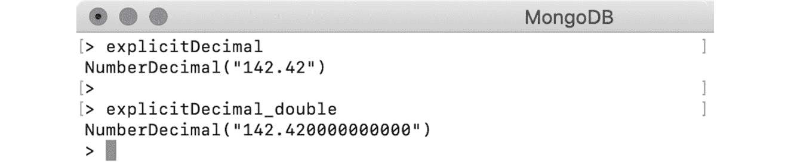
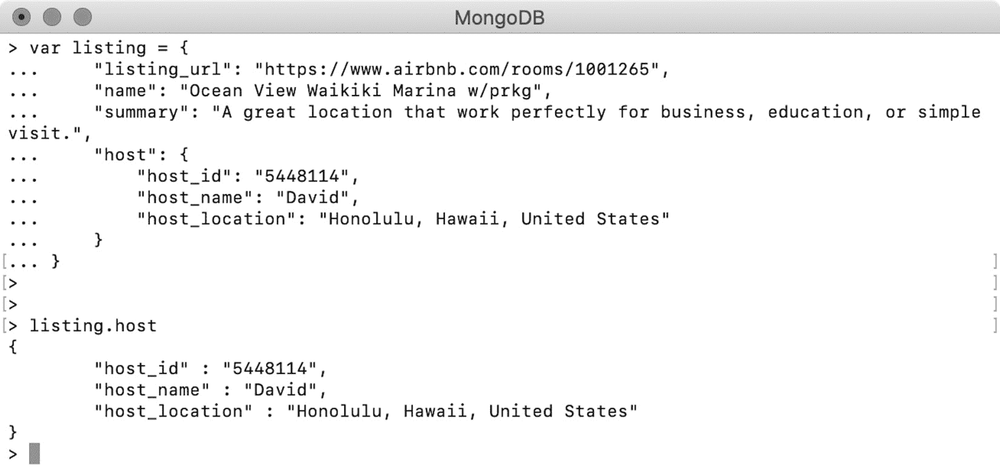
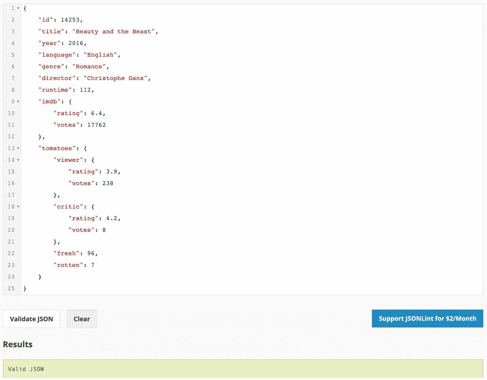
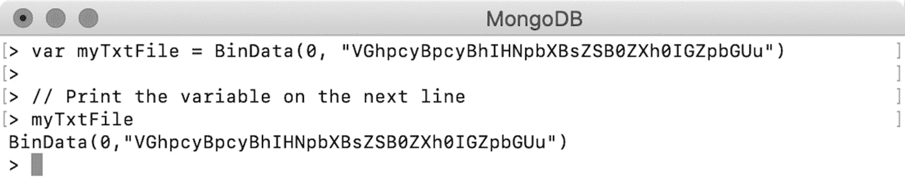
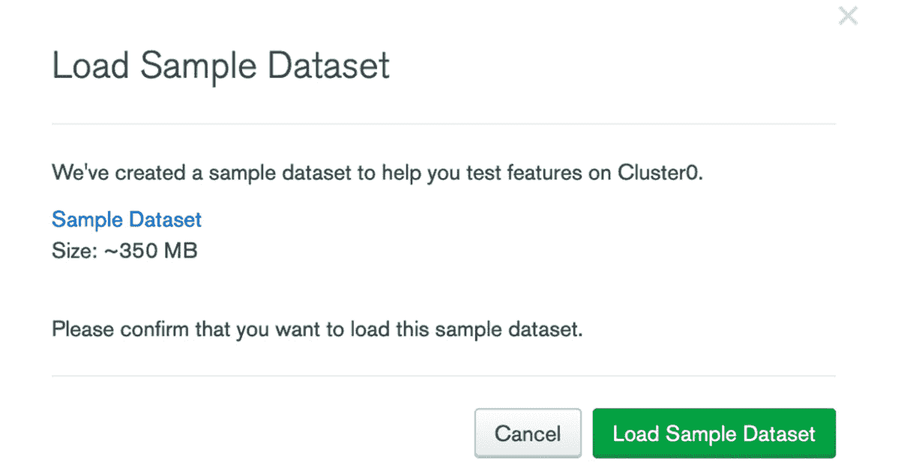
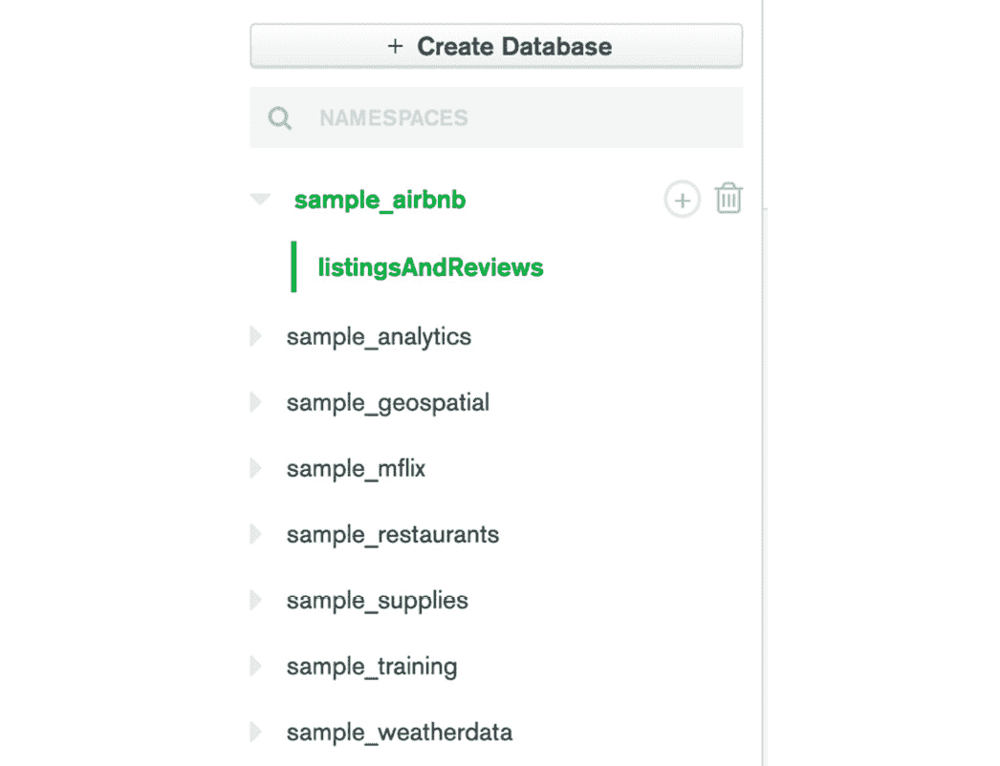
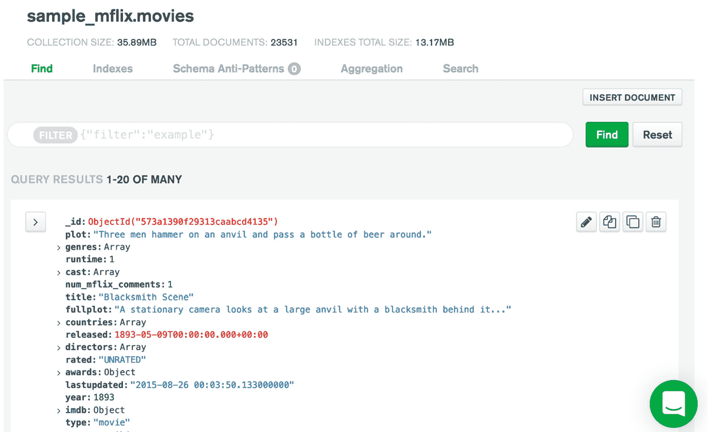

# 二、文件和数据类型

概述

本章向您介绍 MongoDB 文档、它们的结构和数据类型。对于那些不熟悉 JSON 模型的人，本章还将作为 JSON 的简短介绍。您将了解 JSON 文档的基本概念和数据类型，并将 MongoDB 基于文档的存储与关系数据库的表格存储进行比较。您将学习如何使用嵌入式对象和数组在 MongoDB 中表示复杂的数据结构。在本章结束时，您将了解对 MongoDB 文档进行预防性限制的必要性。

# 导言

在上一章中，我们了解了作为 NoSQL 数据库的 MongoDB 与传统关系数据库的区别。我们介绍了 MongoDB 的基本特性，包括其体系结构、不同版本和 MongoDB Atlas。

MongoDB 是为现代世界的应用而设计的。我们生活在一个需求变化迅速的世界。我们希望构建轻量级和灵活的应用程序，能够快速适应这些新需求，并尽快将其交付生产。我们希望我们的数据库变得灵活，以便它们能够适应我们应用程序不断变化的需求，减少停机时间，轻松扩展，并高效执行。MongoDB 非常适合所有这些需求。

使 MongoDB 成为敏捷数据库的主要因素之一是其基于文档的数据模型。文档作为一种灵活的信息传输方式被广泛接受。您可能遇到过许多以**JavaScript 对象表示法**（**JSON**文档）形式交换数据的应用程序。MongoDB 以二进制 JSON（BSON）格式存储数据，并以人类可读的 JSON 表示数据。这意味着当我们使用 MongoDB 时，我们可以看到 JSON 格式的数据。本章首先概述 JSON 和 BSON 格式，然后详细介绍 MongoDB 文档和数据类型。

# JSON 简介

JSON 是一种用于数据表示和传输的全文轻量级格式。JavaScript 对对象的简单表示催生了 JSON。Douglas Crockford 是 JavaScript 语言的开发人员之一，他提出了 JSON 规范的建议，定义了 JSON 语法的语法和数据类型。

JSON 规范在 2013 年成为标准。如果您已经开发应用程序一段时间了，您可能已经看到了应用程序从 XML 到 JSON 的转变。JSON 提供了一种可读的纯文本数据表示方式。与 XML 相比，JSON 提供了一种紧凑而自然的格式，您可以轻松地将注意力集中在信息上。XML 将信息包装在标记中，大量标记使其看起来很笨重。

为了读取或写入 JSON 或 XML 格式的信息，编程语言使用各自的解析器。由于 XML 文档由模式定义和标记库定义绑定，解析器需要做大量工作来读取和验证**XML 模式定义**（**XSD**）和**标记库描述符**（**TLD**）。

另一方面，JSON 没有任何模式定义，JSON 解析器只需要处理括号和冒号的开头和结尾。不同的编程语言有不同的方式来表示语言结构，例如对象、列表、数组、变量等等。当用两种不同的编程语言编写的两个系统想要交换数据时，它们需要有一个相互商定的表示信息的标准。JSON 以其轻量级格式提供了该标准。任何编程语言的对象、集合和变量都可以自然地融入 JSON 结构。大多数编程语言都有解析器，可以将自己的对象与 JSON 文档进行转换。

笔记

JSON 不会将 JavaScript 语言内部构件强加给其他语言。JSON 是独立于语言的数据表示的语法。定义 JSON 格式的语法源自 JavaScript 的语法。然而，要使用 JSON，程序员不需要了解 JavaScript 内部

## JSON 语法

JSON 文档或对象是由零个或多个键值对组成的纯文本集。键值对构成一个对象，如果该值是零个或多个值的集合，则它们构成一个数组。JSON 的结构非常简单，只需使用一组大括号（**{}**）、方括号（**【】**）、冒号（**：**）和逗号（**、**），就可以以紧凑的形式表示任何复杂的信息。

在 JSON 对象中，键值对用大括号括起来：**{}**。在对象中，键始终是字符串。但是，该值可以是 JSON 指定的任何类型。JSON 语法规范没有定义 JSON 字段的任何顺序，可以表示为：

```js
{
  key : value
}
```

前面的文档表示具有单个键值对的有效 JSON 对象。转到 JSON 数组，数组是一组包含在方括号内的零或多个值，**【】**，并用逗号分隔。虽然大多数编程语言都支持有序数组，但 JSON 规范没有指定数组元素的顺序。让我们来看一个示例数组，它有三个逗号分隔的字段：

```js
[
  value1,
  value2,
  value3
]
```

现在我们已经研究了 JSON 语法，让我们考虑一个包含公司基本信息的示例 JSON 文档。该示例演示了一段信息如何自然地以文档格式呈现，使其易于阅读：

```js
{
  "company_name" : "Sparter",
  "founded_year" : 2007,
  "twitter_username" : null,
  "address" : "15 East Street",
  "no_of_employees" : 7890,
  "revenue" : 879423000
}
```

从上述文件中，我们可以看到以下内容：

*   公司名称和地址，均为字符串字段
*   基金年、员工数量和收入作为数值字段
*   公司的 Twitter 用户名为空或无信息

## JSON 数据类型

与许多编程语言不同，JSON 支持有限的基本数据类型集，如下所示：

*   **字符串**：表示纯文本
*   **编号**：由所有数字字段组成
*   **布尔值**：由**真**或**假**组成
*   **对象**：其他嵌入式 JSON 对象
*   **数组**：字段集合
*   **空**：特殊值，表示没有任何值的字段

JSON 被广泛接受的主要原因之一是其独立于语言的格式。不同的语言有不同的数据类型。有些语言支持**静态类型变量**，有些语言支持**动态类型变量**。如果 JSON 有许多数据类型，那么它将更符合许多语言，但不是所有语言。

JSON 是一种数据交换格式。当应用程序通过线路传输一段信息时，该信息被序列化为普通字符串。然后，接收应用程序将信息反序列化为其对象，以便可以使用。JSON 提供的基本数据类型减少了此过程中的复杂性。

因此，JSON 使其在数据类型方面保持简单和最小化。特定于编程语言的 JSON 解析器可以轻松地将基本数据类型与该语言提供的最特定类型关联起来。

## JSON 和数字

根据 JSON 规范，数字只是一个数字序列。不区分**整数**、**浮点**或**长**等数字。此外，它还限制了数字的范围限制。这使得在传输或表示数据时具有更大的灵活性。

然而，也存在一些挑战。大多数编程语言以**整数**、**浮点**或**长**的形式表示数字。当一条信息以 JSON 表示时，解析器无法预测整个文档中数字字段的确切格式或范围。为避免数字格式损坏或数字字段精度损失，交换数据的双方应事先约定并遵守一定的合同。

例如，假设您正在读取 JSON 文档形式的电影记录集。当您查看第一条记录时，您会发现**收视率**字段是一个**整数**。但是，当你到达下一条记录时，你会意识到这是一个**浮动**：

```js
{audience_rating: 6}
{audience_rating: 7.6}
```

我们将在下一节*BSON*中探讨如何克服这个问题。

## 日期和日期

您可能已经注意到，JSON 文档不支持**日期**数据类型，所有日期都表示为普通字符串。让我们看几个 JSON 文档的示例，每个文档都有一个有效的日期表示：

```js
{"title": "A Swedish Love Story", released: "1970-04-24"}
{"title": "A Swedish Love Story", released: "24-04-1970"}
{"title": "A Swedish Love Story", released: "24th April 1970"}
{"title": "A Swedish Love Story", released: "Fri, 24 Apr 1970"}
```

尽管所有文件都代表同一日期，但它们的格式不同。不同的系统基于其本地标准，使用不同的格式来编写相同的日期和时间实例。

与 JSON 数字的示例一样，交换信息的各方需要在传输过程中标准化**日期**格式。

笔记

请记住，JSON 规范定义了数据表示的语法和语法。但是，如何读取数据取决于语言的口译员及其数据交换合同。

## 练习 2.01：创建自己的 JSON 文档

现在您已经学习了 JSON 语法的基础知识，是时候将这些知识付诸实践了。假设您的组织想要构建电影和系列的数据集，并且他们想要使用 MongoDB 来存储记录。作为概念证明，他们要求您选择一部随机电影，并用 JSON 格式表示。

在本练习中，您将从头开始编写第一个基本 JSON 文档，并验证它是否是语法有效的文档。对于这个练习，你会考虑一个样片电影，AutoT0.美女和野兽 Ty1，参考电影 ID，To.T3，To.T4 电影片名[OTT5]，Apple T6.发行年份 To.T7；运行时字段，包含以下信息：

```js
Movie Id = 14253
Movie Title = Beauty and the Beast
Release Year = 2016
Language = English
IMDb Rating = 6.4
Genre = Romance
Director = Christophe Gans
Runtime = 112
```

要为前面列出的字段成功创建 JSON 文档，请首先将每个字段区分为键值对。执行以下步骤以获得所需结果：

1.  打开 JSON 验证程序，例如，[https://jsonlint.com/](https://jsonlint.com/) 。
2.  Type the preceding information in JSON format, which looks as follows:

    ```js
    {
      "id" : 14253,
      "title" : "Beauty and the Beast",
      "year" : 2016,
      "language" : "English",
      "imdb_rating" : 6.4,
      "genre" : "Romance",
      "director" : "Christophe Gans",
      "runtime" : 112
    }
    ```

    记住，JSON 文档总是以**{**开头，以**}**结尾。每个元素用冒号（**：**分隔，键值对用逗号（**、**分隔）。

3.  Click on **Validate JSON** to validate the code. The following screenshot displays the expected output and validity of the JSON document:

    

图 2.1:JSON 文档及其有效性检查

在本练习中，您将电影记录建模为文档格式，并创建了语法有效的 JSON 对象。为了实践更多，你可以考虑任何一般的项目，比如你最近买的一本书或者你读的一本书，并把它建模为一个有效的 JSON 文档。在下一节中，我们将简要概述 MongoDB 的 BSON。

# BSON

当您使用数据库客户端（如 mongo shell、MongoDB Compass 或 mongo Atlas 中的 Collections 浏览器）使用 MongoDB 时，您总能看到人类可读的 JSON 格式的文档。但是，在内部，MongoDB 文档以称为 BSON 的二进制格式存储。BSON 文档不是人类可读的，您永远不必直接处理它们。在我们详细研究 MongoDB 文档之前，让我们快速概述一下 BSON 特性，这些特性有利于 MongoDB 文档结构。

与 JSON 一样，BSON 也是在 2009 年由 MongoDB 引入的。虽然它是由 MongoDB 发明的，但许多其他系统也使用它作为数据存储或传输的格式。BSON 规范主要基于 JSON，因为它们继承了 JSON 的所有优秀特性，例如语法和灵活性。它还提供了一些额外的特性，这些特性是专门为提高存储效率、简化遍历而设计的，并提供了一些数据类型增强功能，以避免我们在*JSON 简介*一节中看到的类型冲突。

由于我们已经详细介绍了 JSON 特性，让我们重点关注 BSON 提供的增强功能：

*   BSON 文档被设计为比 JSON 更高效，因为它们占用更少的空间并提供更快的遍历。
*   对于每个文档，BSON 存储一些**元信息**，例如字段的长度或子文档的长度。元信息使文档解析和遍历更快。
*   BSON 文档具有**有序数组**。数组中的每个元素都以其索引位置作为前缀，可以使用其索引号进行访问。
*   BSON provides many **additional data types**, such as dates, integers, doubles, byte arrays, and more. We will cover BSON data types later, in the next section.

    笔记

    由于二进制格式，BSON 文档本质上是紧凑的。但是，与具有相同信息的 JSON 文档相比，一些较小的文档最终会占用更多的空间。这是因为每个文档都添加了元信息。但是，对于大型文档，BSON 更节省空间。

现在我们已经完成了对 JSON 和 BSON 增强的详细介绍，现在让我们了解一下 MongoDB 文档。

# MongoDB 文件

MongoDB 数据库由集合和文档组成。一个数据库可以有一个或多个集合，每个集合可以存储一个或多个相关的 BSON 文档。与 RDBMS 相比，集合类似于表，文档类似于表中的行。但是，与表中的行相比，文档要灵活得多。

RDBMS 由一个由行和列组成的表格数据模型组成。但是，应用程序可能需要支持更复杂的数据结构，例如嵌套对象或对象集合。表格数据库限制了这种复杂数据结构的存储。在这种情况下，您必须将数据拆分为多个表，并相应地更改应用程序的对象结构。另一方面，MongoDB 基于文档的数据模型允许应用程序存储和检索更复杂的对象结构，因为文档的格式类似于 JSON。

以下列表详细介绍了 MongoDB 基于文档的数据模型的一些主要功能：

1.  这些文档提供了一种灵活自然的数据表示方式。数据可以按原样存储，而无需将其转换为数据库结构。
2.  文档中的对象、嵌套对象和数组很容易与编程语言的对象结构相关联。
3.  由于具有灵活模式的能力，文档在实践中是灵活的。它们不断地与应用程序更改和新功能集成，而无需任何重大模式更改或停机。
4.  文档是自包含的数据片段。它们避免了需要读取多个关系表和表联接来理解完整的信息单元。
5.  这些文档是可扩展的。您可以使用文档来存储整个对象结构，将其用作映射或字典，用作快速查找的键值对，或者具有类似关系表的平面结构。

## 文件和灵活性

如前所述，MongoDB 文档是一种灵活的数据存储方式。考虑下面的例子。假设您正在开发一个需要创建电影数据库的电影服务。简单 MongoDB 文档中的电影记录如下所示：

```js
{"title" : "A Swedish Love Story"}
```

但是，仅存储标题是不够的。你需要更多的领域。现在，让我们考虑几个基本的字段。通过 MongoDB 数据库中的电影列表，文档将如下所示：

```js
{
  "id" : 1122,
  "title" : "A Swedish Love Story",
  "release_date" : ISODate("1970-04-24T00:00:00Z"),
  "user_rating" : 6.7
}
{
  "id" : 1123,
  "title" : "The Stunt Man",
  "release_date" : ISODate("1980-06-26T00:00:00Z"),
  "user_rating" : 7.8
}
```

假设您使用的是 RDBMS 表。在 RDBMS 平台上，您需要在开始时定义模式，要做到这一点，首先必须考虑列和数据类型。然后您可能会提出如下的**创建表**查询：

```js
CREATE TABLE movies(
  id INT,
  title VARCHAR(250),
  release_date DATE,
  user_ratings FLOAT
);
```

这个查询清楚地表明，关系表由一个名为**模式定义**的定义绑定。但是，考虑到这些限制，您不能在**id**字段中分配浮点值，**用户评分**永远不能是字符串。

插入一些记录后，该表将如图 2.2 所示。此表与 MongoDB 文档一样好：


图 2.2：电影表

现在，假设您想将表中列出的每部电影的 IMDb 评级包括在内，接下来，所有电影的**IMDb_ 评级**都将包括在表中。对于现有的电影列表，**imdb_ 评级**可以设置为**空**：

为了满足此要求，您将在语法中包含一个**ALTER TABLE**查询：

```js
ALTER TABLE movies
ADD COLUMN imdb_ratings FLOAT default null;
```

查询是正确的，但有时表的更改可能会阻塞表一段时间，特别是对于大型数据集。当一个表被阻塞时，其他读写操作将不得不等待，直到该表被更改，这可能导致停机。现在，让我们看看如何在 MongoDB 中解决同样的问题。

MongoDB 支持灵活的模式，并且没有特定的模式定义。在不改变数据库或集合的任何内容的情况下，只需插入带有附加字段的新电影即可。该集合的行为将与修改后的电影表完全相同，其中最新的插入将具有**imdb_ 评级**，而之前的插入将返回**空**值。在 MongoDB 文档中，一个不存在的字段总是被视为**空**。

现在，整个集合将类似于下面的屏幕截图。您会注意到上一部电影有一个新字段，**imdb_ratings**：


图 2.3:movies collection 的 imdb_ 评级结果

前面的例子清楚地表明，与表格数据库相比，文档非常灵活。文档可以在不停机的情况下在移动中合并更改。

# MongoDB 数据类型

您已经了解了 MongoDB 如何存储类似 JSON 的文档。您还看到了各种文档，阅读了其中存储的信息，并了解了这些文档存储不同类型的数据结构的灵活性，而不考虑数据的复杂性。

在本节中，您将了解 MongoDB 的 BSON 文档支持的各种数据类型。在文档中使用正确的数据类型非常重要，因为正确的数据类型有助于更有效地使用数据库功能，避免数据损坏，并提高数据可用性。MongoDB 支持 JSON 和 BSON 中的所有数据类型。让我们通过示例详细了解每一项。

## 弦

字符串是一种基本数据类型，用于表示文档中基于文本的字段。这是一个简单的字符序列。在 MongoDB 中，字符串字段是 UTF-8 编码的，因此它们支持大多数国际字符。各种编程语言的 MongoDB 驱动程序在从集合读取或写入数据时将字符串字段转换为 UTF-8。

带有纯文本字符的字符串如下所示：

```js
{
  "name" : "Tom Walter"
}
```

带有随机字符和空格的字符串将显示如下：

```js
{
  "random_txt" : "a ! *& ) ( f s f @#$ s"
}
```

在 JSON 中，用双引号括起来的值被视为字符串。考虑下面的示例，其中有效的数字和日期被封装在双引号中，两者都形成字符串：

```js
{
  "number_txt" : "112.1"
}
{
  "date_txt" : "1929-12-31"
}
```

MongoDB 字符串字段的一个有趣的事实是，它们支持正则表达式的搜索功能。这意味着您可以通过提供文本字段的完整值或使用正则表达式仅提供部分字符串值来搜索文档。

## 数字

数字是 JSON 的基本数据类型。JSON 文档不指定数字是整数、浮点还是*长*：

```js
{
  "number_of_employees": 50342
}
{
  "pi": 3.14159265359
}
```

但是，MongoDB 支持以下类型的数字：

*   **双**：64 位浮点
*   **int**：32 位有符号整数
*   **长**：64 位无符号整数
*   **十进制**：128 位浮点–符合 IEE 754

使用编程语言时，不必担心这些数据类型。您可以简单地使用该语言的本机数据类型进行编程。各个语言的 MongoDB 驱动程序负责将特定于语言的数字编码为前面列出的数据类型之一。

如果您正在处理 mongo shell，则需要处理三个包装器：**整数**、**长**和**十进制**。Mongo shell 基于 JavaScript，因此所有文档都以 JSON 格式表示。默认情况下，它将任何数字视为 64 位浮点。但是，如果要显式使用其他类型，可以使用以下包装器。

**numberrint**：如果希望将数字保存为 32 位整数而不是 64 位浮点，则可以使用**numberrint**构造函数：

```js
> var plainNum = 1299
> var explicitInt = NumberInt("1299")
> var explicitInt_double = NumberInt(1299)
```

*   在前面的代码段中，第一个数字**plainNum**用一系列数字初始化，没有提及任何显式数据类型。因此，默认情况下，它将被视为一个*64 位浮点数*（也称为**双精度**。
*   然而，**explicitInt**是使用整数类型构造函数和数字的字符串表示进行初始化的，因此 MongoDB 将参数中的数字读取为*32 位整数*。
*   但是，在**explicitInt_double**初始化中，构造函数参数中提供的数字没有双引号。因此，它将被视为一个*64 位浮点*——即一个**双**——并用于形成一个*32 位整数*。但是，由于提供的数字符合整数范围，因此看不到任何变化。
*   打印上述数字时，它们的外观如下所示：


图 2.4:plainNum、explicitInt 和 explicitInt\u 双精度输出

**NumberLong**：**NumberLong**包装与**numberprint**类似。唯一的区别是它们存储为 64 位整数。让我们在外壳上试试：

```js
> var explicitLong = NumberLong("777888222116643")
> var explicitLong_double = NumberLong(444333222111242)
```

让我们在 shell 中打印文档：


图 2.5:MongoDB 外壳输出

**NumberDecimal**：此包装器将给定的数字存储为 128 位 IEEE 754 十进制格式。**NumberDecimal**构造函数接受数字的字符串和双精度表示：

```js
> var explicitDecimal = NumberDecimal("142.42")
> var explicitDecimal_double = NumberDecimal(142.42)
```

我们正在将十进制数的字符串表示形式传递给**显式小数**。但是，**明确指定的双精度**是使用**双精度**创建的。当我们打印结果时，它们的显示略有不同：



图 2.6:explicitDecimal 和 explicitDecimal_double 的输出

第二个数字后面加了零。这是因为数字的内部解析。当我们将一个双精度值传递给**NumberDecimal**时，参数被解析为 BSON 的双精度，然后转换为精度为 15 位的 128 位十进制。

在此转换过程中，十进制数被舍入，可能会失去精度。让我们看一下以下示例：

```js
> var dec = NumberDecimal("5999999999.99999999")
> var decDbl = NumberDecimal(5999999999.99999999)
```

让我们打印数字并检查输出：


图 2.7:dec 和 decDbl 的输出

很明显，当双精度传递给**NumberDecimal**时，有可能会丢失精度。因此，在使用**NumberDecimal**时，始终使用基于字符串的构造函数非常重要。

## 布尔人

布尔数据类型用于表示某个内容是真是假。因此，有效布尔字段的值为**真**或**假**：

```js
{
  "isMongoDBHard": false
}
{
  "amIEnjoying": true
}
```

这些值没有双引号。如果用双引号将它们括起来，它们将被视为字符串。

## 物体

对象字段用于表示嵌套或嵌入的文档，即值为另一个有效 JSON 文档的字段。

让我们看一下 Airbnb 数据集的以下示例：

```js
{
  "listing_url": "https://www.airbnb.com/rooms/1001265",
  "name": "Ocean View Waikiki Marina w/prkg",
  "summary": "A great location that work perfectly for business,     education, or simple visit.",
  "host":{
    "host_id": "5448114",
    "host_name": "David",
    "host_location": "Honolulu, Hawaii, United States"
  }
}
```

主机字段的值是另一个有效的 JSON。MongoDB 使用点符号（**.**）来访问嵌入式对象。要访问嵌入式文档，我们将在 mongo shell 上创建列表变量：

```js
> var listing = {
  "listing_url": "https://www.airbnb.com/rooms/1001265",
  "name": "Ocean View Waikiki Marina w/prkg",
  "summary": "A great location that work perfectly for business,     education, or simple visit.",
  "host": {
    "host_id": "5448114",
    "host_name": "David",
    "host_location": "Honolulu, Hawaii, United States"
  }
}
```

要仅打印主机详细信息，请使用点符号（**。**）获取嵌入对象，如下所示：



图 2.8：嵌入式对象的输出

使用类似的表示法，您还可以访问嵌入文档的特定字段，如下所示：

```js
> listing.host.host_name
David
```

嵌入文档中可以包含更多文档。嵌入文档使 MongoDB 文档成为一条自包含的信息。要在 RDBMS 数据库中记录相同的信息，必须将列表和主机创建为两个单独的表，中间有一个外键引用，并将两个表中的数据连接起来以获得一条信息。

除了嵌入式文档，MongoDB 还支持两个不同集合的文档之间的链接，这类似于具有外键引用。

## 练习 2.02：创建嵌套对象

到目前为止，您的组织对电影放映感到满意。现在，他们提出了一个要求，包括 IMDb 的评级和获得评级的票数。他们还希望加入 Tomotometer 评分，其中包括用户评分和评论评分以及新鲜和糟糕的分数。您的任务是修改文档以更新**imdb**字段以包含投票数，并添加一个名为**西红柿**的新字段，其中包含烂西红柿评级。

回想一下您在*练习 2.01**创建自己的 JSON 文档*中创建的示例电影记录的 JSON 文档：

```js
{
  "id": 14253,
  "title": "Beauty and the Beast",
  "year": 2016,
  "language": "English",
  "imdb_rating": 6.4,
  "genre": "Romance",
  "director": "Christophe Gans",
  "runtime": 112
}
```

以下步骤将有助于修改 IMDb 评级：

1.  现有的**imdb_rating**字段表示 imdb 评级分数，因此添加一个额外的字段来表示投票计数。但是，这两个字段彼此密切相关，并将始终一起使用。因此，将它们组合在一个文档中：

    ```js
    {
      "rating": 6.4, 
      "votes": "17762"
    }
    ```

2.  The preceding document with two fields represents the complete IMDb rating. Replace the current **imdb_rating** field with the one you just created:

    ```js
    {
      "id" : 14253,
      "Title" : "Beauty and the Beast",
      "year" : 2016,
      "language" : "English",
      "genre" : "Romance",
      "director" : "Christophe Gans",
      "runtime" : 112,
      "imdb" :
      {
        "rating": 6.4,
        "votes": "17762"
      }
    }
    ```

    此**imdb**字段及其嵌入对象的值表示 imdb 评级。现在，添加 Tomotometer 评分。

3.  如前所述，Tomotometer 评分包括观众评分和评论评分，以及新鲜评分和烂评分。与 IMDb 收视率一样，**观众收视率**和**评论家收视率**将有**收视率**字段和**投票率**字段。将这两个文件分开书写：

    ```js
    // Viewer Ratings
    {
      "rating" : 3.9,
      "votes" : 238
    }
    // Critic Ratings
    {
      "rating" : 4.2,
      "votes" : 8
    }
    ```

4.  由于两个评级都是相关的，所以将它们组合在一个文档中：

    ```js
    {
      "viewer" : {
        "rating" : 3.9,
        "votes" : 238
      },
      "critic" : {
        "rating" : 4.2,
        "votes" : 8
      }
    }
    ```

5.  Add the **fresh** and **rotten** scores as per the description:

    ```js
    {
      "viewer" : {
        "rating" : 3.9,
        "votes" : 238
      },
      "critic" : {
        "rating" : 4.2,
        "votes" : 8
      },
      "fresh" : 96,
      "rotten" : 7
    }
    ```

    以下输出表示我们电影记录中新的**西红柿**字段的 Tomotometer 评级：

    ```js
    {
        "id" : 14253,
        "Title" : "Beauty and the Beast",
        "year" : 2016,
        "language" : "English",
        "genre" : "Romance",
        "director" : "Christophe Gans",
        "runtime" : 112,
        "imdb" : {
            "rating": 6.4,
            "votes": "17762"
        },
        "tomatoes" : {
            "viewer" : {
                "rating" : 3.9,
                "votes" : 238
            },
            "critic" : {
                "rating" : 4.2,
                "votes" : 8
            },
           "fresh" : 96,
           "rotten" : 7
        }
    }
    ```

6.  Finally, validate your document with any online JSON validator (in our case, [https://jsonlint.com/](https://jsonlint.com/)). Click on **Validate JSON** to validate the code:

    

图 2.9:JSON 文档的验证

您的电影记录现在更新为详细的 IMBb 分级和新的**番茄**分级。在本练习中，您练习了创建两个嵌套文档来表示 IMDb 评级和 Tomometer 评级。既然我们已经介绍了嵌套或嵌入式对象，那么让我们来学习数组。

## 数组

具有**数组**类型的字段具有零个或多个值的集合。在 MongoDB 中，一个数组可以包含多少个元素，或者一个文档可以包含多少个数组，这是没有限制的。但是，总体文档大小不应超过 16MB。考虑下面的示例数组，包含四个数字：

```js
> var doc = {
  first_array: [
    4,
    3,
    2,
    1
  ]
}
```

数组中的每个元素都可以使用其索引位置进行访问。在访问特定索引位置上的元素时，索引号用方括号括起来。让我们打印数组中的第三个元素：

```js
> doc.first_array[3]
1
```

笔记

索引总是以零为基础的。索引位置**3**表示数组中的第四个元素。

使用索引位置，还可以向现有数组中添加新元素，如下例所示：

```js
> doc.first_array[4] = 99
```

打印数组后，您会看到第五个元素已正确添加，其中包含索引位置**4**：

```js
> doc.first_array
[ 4, 3, 2, 1, 99 ]
```

与具有嵌入式对象的对象一样，数组也可以具有嵌入式数组。以下语法将嵌入数组添加到第六个元素中：

```js
> doc.first_array[5] = [11, 12]
[ 11, 12 ]
```

如果打印数组，您将看到嵌入式数组，如下所示：

```js
> doc.first_array
[ 4, 3, 2, 1, 99, [11, 12]]
>
```

现在，您可以使用平方符号**【】**来访问嵌入数组中特定索引的元素，如下所示：

```js
> doc.first_array[5][1]
12
```

该数组可以包含任何 MongoDB 有效数据类型字段。这可以在以下代码段中看到：

```js
// array of strings
[ "this", "is", "a", "text" ] 
// array of doubles
[ 1.1, 3.2, 553.54 ]
// array of Json objects
[ { "a" : 1 }, { "a" : 2, "b" : 3 }, { "c" : 1 } ] 
// array of mixed elements
[ 12, "text", 4.35, [ 3, 2 ], { "type" : "object" } ]
```

## 练习 2.03：使用数组字段

为了为每部电影添加评论详细信息，您的组织希望您包括评论全文以及用户详细信息，如姓名、电子邮件和日期。您的任务是准备两个虚拟评论，并将它们添加到现有的电影记录中。在*练习 2.02**创建嵌套对象*中，您开发了一个文档格式的电影记录，如下所示：

```js
{
  "id" : 14253,
  "Title" : "Beauty and the Beast",
  "year" : 2016,
  "language" : "English",
  "genre" : "Romance",
  "director" : "Christophe Gans",
  "runtime" : 112,
  "imdb" : {
    "rating": 6.4,
    "votes": "17762"
  },
  "tomatoes" : {
    "viewer" : {
      "rating" : 3.9,
      "votes" : 238
    },
    "critic" : {
      "rating" : 4.2,
      "votes" : 8
    },
    "fresh" : 96,
    "rotten" : 7
  }
}
```

在本文档的基础上，通过执行以下步骤添加其他信息：

1.  创建两条评论并列出详细信息：

    ```js
    // Comment #1
    Name = Talisa Maegyr
    Email = oona_chaplin@gameofthron.es
    Text = Rem itaque ad sit rem voluptatibus. Ad fugiat...
    Date = 1998-08-22T11:45:03.000+00:00
    // Comment #2
    Name = Melisandre
    Email = carice_van_houten@gameofthron.es
    Text = Perspiciatis non debitis magnam. Voluptate...
    Date = 1974-06-22T07:31:47.000+00:00
    ```

2.  Split the two comments into separate documents as follows:

    笔记

    注释文本已被截断，以适合在一行中显示。

    ```js
    // Comment #1
    {
      "name" : "Talisa Maegyr",
      "email" : "oona_chaplin@gameofthron.es",
      "text" : "Rem itaque ad sit rem voluptatibus. Ad fugiat...",
      "date" : "1998-08-22T11:45:03.000+00:00"
    }
    // Comment #2
    {
      "name" : "Melisandre",
      "email" : "carice_van_houten@gameofthron.es",
      "text" : "Perspiciatis non debitis magnam. Voluptate...",
      "date" : "1974-06-22T07:31:47.000+00:00"
    }
    ```

    在两个单独的文档中有两个注释，您可以很容易地将它们放在电影记录中，如**注释 1**和**注释 2**。然而，随着评论数量的增加，很难统计它们的数量。为了克服这个问题，我们将使用一个数组，它隐式地为每个元素分配一个索引位置。

3.  Add both comments to an array as follows:

    ```js
    [
      {
        "name": "Talisa Maegyr",
        "email": "oona_chaplin@gameofthron.es",
        "text": "Rem itaque ad sit rem voluptatibus. Ad fugiat...",
        "date": "1998-08-22T11:45:03.000+00:00"
      },
      {
        "name": "Melisandre",
        "email": "carice_van_houten@gameofthron.es",
        "text": "Perspiciatis non debitis magnam. Voluptate...",
        "date": "1974-06-22T07:31:47.000+00:00"
      }
    ]
    ```

    数组为您提供了添加任意多条注释的机会。此外，由于隐式索引，您可以通过其专用索引位置自由访问任何注释。在电影录制中添加此数组后，输出将显示如下：

    ```js
    {
      "id": 14253,
      "Title": "Beauty and the Beast",
      "year": 2016,
      "language": "English",
      "genre": "Romance",
      "director": "Christophe Gans",
      "runtime": 112,
      "imdb": {
        "rating": 6.4,
        "votes": "17762"
      },
      "tomatoes": {
        "viewer": {
          "rating": 3.9,
          "votes": 238
        },
        "critic": {
          "rating": 4.2,
          "votes": 8
        },
        "fresh": 96,
        "rotten": 7
      },
      "comments": [{
        "name": "Talisa Maegyr",
        "email": "oona_chaplin@gameofthron.es",
        "text": "Rem itaque ad sit rem voluptatibus. Ad fugiat...",
        "date": "1998-08-22T11:45:03.000+00:00"
      }, {
        "name": "Melisandre",
        "email": "carice_van_houten@gameofthron.es",
        "text": "Perspiciatis non debitis magnam. Voluptate...",
        "date": "1974-06-22T07:31:47.000+00:00"
      }]
    }
    ```

4.  Now, validate the JSON document with an online validator (for example, [https://jsonlint.com/](https://jsonlint.com/)). Click **Validate JSON** to validate the code:

    

图 2.10:JSON 文档的验证

我们可以看到，我们的电影记录现在有用户评论。在本练习中，我们修改了电影记录以练习创建数组字段。现在是进入下一个数据类型的时候了，**null**。

## 无效

Null 是文档中的一种特殊数据类型，表示不包含值的字段。**空**字段只能有**空**作为值。您将在下面的示例中打印对象，这将导致**null**值：

```js
> var obj = null
>
> obj
Null
```

基于我们在*数组*部分中创建的数组：

```js
> doc.first_array
[ 4, 3, 2, 1, 99, [11, 12]]
```

现在，通过在下一个索引位置插入变量，创建一个新变量并将其初始化为**null**：

```js
> var nullField = null
> doc.first_array[6] = nullField
```

现在，打印此数组以查看**null**字段：

```js
> doc.first_array
[ 4, 3, 2, 1, 99, [11, 12], null]
```

## ObjectId

集合中的每个文档都必须有一个包含唯一值的**id**。此字段充当这些文档的*主键*。主键用于唯一标识文档，并且它们始终被索引。**\u id**字段的值在集合中必须是唯一的。使用任何数据集时，每个数据集都代表不同的上下文，并且可以根据上下文确定数据是否具有主键。例如，如果您正在处理用户的数据，则用户的电子邮件地址将始终是唯一的，并且可以被视为最合适的**\u id**字段。但是，对于一些没有唯一密钥的数据集，您可以简单地省略**\u id**字段。

如果插入的文档没有**\U id**字段，MongoDB 驱动程序将自动生成唯一 id 并将其添加到文档中。因此，当您检索插入的文档时，您会发现**是由一个唯一的随机文本值生成的。当驱动程序自动添加**字段时，使用**ObjectId**生成该值。****

 ******ObjectId**值旨在生成轻量级代码，该代码在不同的机器上是唯一的。它生成 12 个字节的唯一值，其中前 4 个字节表示时间戳，第 5 到 9 个字节表示随机值，最后 3 个字节表示增量计数器。创建并打印一个**ObjectId**值，如下所示：

```js
> var uniqueID = new ObjectId()
```

在下一行打印**唯一 ID**：

```js
> uniqueID
ObjectId("5dv.8ff48dd98e621357bd50")
```

MongoDB 支持一种称为分片的技术，其中数据集分布并存储在不同的机器上。当一个集合被切分时，它的文档实际位于不同的机器上。即使如此，**ObjectId**也可以确保这些值在不同机器的集合中是唯一的。如果使用**ObjectId**字段对集合进行排序，则顺序将基于文档创建时间。然而，**ObjectId**中的时间戳是基于到历元时间的秒数。因此，在同一秒钟内插入的文档可能以随机顺序出现。**ObjectId**上的**getTimestamp（）**方法告诉我们文档插入时间。

## 日期

JSON 规范不支持日期类型。JSON 文档中的所有日期都表示为纯字符串。日期的字符串表示很难解析、比较和操作。然而，MongoDB 的 BSON 格式明确支持**日期**类型。

MongoDB 日期自 Unix 纪元（1970 年 1 月 1 日）起以毫秒的形式存储。为了存储日期的毫秒表示形式，MongoDB 使用 64 位整数（**长**。因此，自 Unix 时代以来，日期字段的范围约为+/-2.9 亿年。需要注意的是，所有日期都存储在*UTC*中，并且没有与之相关联的*时区*。

在使用 mongo shell 时，您可以使用**日期（）**、**新日期（）**或**新 ISODate（）**创建**日期**实例：

笔记

使用新的**Date（）**构造函数或新的**ISODate（）**构造函数创建的日期始终为 UTC，使用**Date（）**构造函数创建的日期将位于本地时区。下面给出一个例子。

```js
var date = Date()// Sample output
Sat Sept 03 1989 07:28:46 GMT-0500 (CDT)
```

当使用**Date（）**类型来构造日期时，它使用 JavaScript 的日期表示形式，即普通字符串的形式。这些日期表示基于当前时区的日期和时间。但是，由于是字符串格式，它们对于比较或操作没有用处。

如果您将**新**关键字添加到**日期**构造函数中，您将获得包装在**ISODate（）**中的 BSON 日期，如下所示：

```js
> var date = new Date()
// Sample output
ISODate("1989-09-03T10:11:23.357Z")
```

您也可以直接使用**ISODate（）**构造函数创建**日期**对象，如下所示：

```js
> var isoDate = new ISODate()
// Sample output
ISODate("1989-09-03T11:13:26.442Z")
```

可以操纵、比较和搜索这些日期。

笔记

根据 MongoDB 文档，并非所有驱动程序都支持 64 位日期编码。但是，所有驱动程序都支持将日期编码为 0 到 9999 之间的年份。

## 时间戳

时间戳是日期和时间的 64 位表示形式。在 64 位中，前 32 位存储自 Unix 纪元时间（1970 年 1 月 1 日）以来的秒数。其他 32 位表示递增计数器。时间戳类型由 MongoDB 专门用于内部操作。

## 二进制数据

二进制数据，也称为**BinData**，是一种 BSON 数据类型，用于存储二进制格式的数据。这种数据类型使您能够在数据库中存储几乎任何内容，包括文本、视频、音乐等文件。**BinData**可以用编程语言中的二进制数组进行映射，如下所示：



图 2.11：二进制数组

**BinData**的第一个参数是一个二进制子类型，用于指示存储的信息类型。零值表示纯二进制数据，可用于文本或媒体文件。**BinData**的第二个参数是*base64*编码的文本文件。您可以在文档中使用二进制数据字段，如下所示：

```js
{
  "name" : "my_txt",
  "extension" : "txt",
  "content" : BinData(0,/
    "VGhpcyBpcyBhIHNpbXBsZSB0ZXh0IGZpbGUu")
}
```

我们将在下一节介绍 MongoDB 的文档大小限制。

# 文件的限制和限制

到目前为止，我们已经讨论了使用文档的重要性和好处。文档在构建高效的应用程序方面发挥着重要作用，它们提高了总体数据可用性。我们知道文档如何提供一种灵活的方式，以最自然的形式表示数据。它们通常是独立的，可以保存完整的信息单元。自包含来自嵌套对象和数组。

为了有效地使用任何数据库，拥有正确的数据结构非常重要。今天构建的不正确的数据结构可能会在将来带来很多痛苦。从长远来看，随着应用程序使用量的增加，数据量也会增加，最初看起来很小的问题会变得更加明显。然后是一个显而易见的问题：如何知道数据结构是否正确？

你的申请会告诉你答案。如果要访问某一信息，应用程序必须对数据库执行多个查询并合并所有结果以获得最终信息，则会降低总体吞吐量。相反，如果数据库上的单个查询在单个结果中返回太多信息，则应用程序必须扫描整个结果集并获取所需的信息。这将导致更高的内存消耗、过时的对象，最终导致性能降低。

因此，MongoDB 对文档进行了一些限制。需要注意的一点是，这些限制不是因为数据库的限制或缺点。添加这些限制是为了使整个数据库平台能够高效地执行。我们已经介绍了 MongoDB 文档提供的灵活性；现在了解这些限制很重要。

## 文件大小限制

信息太多的文档在许多方面都是不好的。因此，MongoDB 将集合中每个文档的大小限制为 16MB。16MB 的限制足以存储正确的信息。一个集合可以包含任意数量的文档。集合的大小没有限制。即使集合超出了基础系统的空间，也可以使用垂直或水平缩放来增加集合的容量。

文档的灵活性和自包含性可能会诱使开发人员输入太多信息并创建庞大的文档。尺寸过大的文件通常表明设计不好。大多数情况下，您的应用程序并不需要所有信息。一个好的数据库设计会考虑应用程序的需求。

假设您的应用程序是一个界面，提供来自不同商店的销售信息，用户可以在其中按商品类型或商店位置搜索和查找已售出商品。在大多数情况下，是您的应用程序将访问数据库，并且使用一组类似的查询也会访问数据库。因此，应用程序的需求在数据库设计中起着重要作用，特别是当用户群增长，并且应用程序在短时间内开始收到成千上万的请求时。您想要的只是更快的查询、更少的处理和更少的资源消耗。

超大文档在资源使用方面也很昂贵。当文件从系统中读取时，它们被保存在内存中，然后通过网络传输。电汇总是比较慢。然后，驱动程序将接收到的信息映射到编程语言的对象。较大的文档将导致太多笨重的对象。考虑来自虚拟销售记录的示例文档，如下：

```js
{
     «_id" : ObjectId("5bd761dcae323e45a93ccff4"),
     «saleDate" : ISODate("2014-08-18T10:42:13.935Z"),
     «items" : [
          {
               «name" : "backpack",
               «tags" : [
                    «school»,
                    «travel»,
                    «kids»
               ],
               «price" : NumberDecimal("187.16"),
               «quantity" : 2
          },
          {
               «name" : "printer paper",
               «tags" : [
                    «office»,
                    «stationary»
               ],
               «price" : NumberDecimal("20.61"),
               «quantity" : 10
          },
          {
               «name" : "notepad",
               «tags" : [
                    «office»,
                    «writing»,
                    «school»
               ],
               «price" : NumberDecimal("23.75"),
               «quantity" : 5
          },
          {
               «name" : "envelopes",
               «tags" : [
                    «stationary»,
                    «office»,
                    «general»
               ],
               «price" : NumberDecimal("9.44"),
               «quantity" : 5
          }
     ],
     «storeLocation" : "San Diego",
     «customer" : {
          «gender" : "F",
          «age" : 59,
          «email" : "la@cevam.tj",
          «satisfaction" : 4
     },
     «couponUsed" : false,
     «purchaseMethod" : "In store"
}
```

虽然本文档很好，但也有一些限制。**项**字段是**项**对象的数组。如果订单中的**项**过多，则数组的大小将增加，这将导致整个文档的大小增加。如果您的应用程序允许每个订单有多个项目，并且存储了数千个独特的项目，那么此文档很容易变得过大。处理此类复杂文档的最佳方法是将集合分成两部分，并在其中嵌入文档链接。

## 嵌套深度限制

MongoDB BSON 文档最多支持 100 层嵌套，这就足够了。嵌套文档是提供可读数据的好方法。它们一次性提供完整的信息，并避免多次查询以收集一条信息。

但是，随着嵌套级别的增加，会出现性能和内存消耗问题。例如，考虑将文档解析为对象结构的驱动程序。在扫描过程中，只要找到新的子文档，扫描仪就会递归地输入嵌套对象，同时保持已读取信息的堆栈。这会导致高内存利用率和低性能。

通过将嵌套限制设置为 100 个级别，MongoDB 避免了此类问题。但是，如果无法避免这种深度嵌套，可以考虑将集合拆分为两个或多个，并具有文档引用。

# 字段名称规则

MongoDB 有一些关于文档字段名的规则，如下所示：

1.  字段名不能包含**null**字符。
2.  只有数组或嵌入文档中的字段的名称才能以美元符号（**$**）开头。对于顶级字段，名称不能以美元（**$**符号开头。
3.  Documents with duplicate field names are not supported. According to the MongoDB documentation, when a document with duplicate field names is inserted, no error will be thrown, but the document won't be inserted. Even the drivers will drop the documents silently. On the mongo shell, however, if such a document is inserted, it gets inserted correctly. However, the resulting document will have only the second field. That means the second occurrence of the field overwrites the value of the first.

    笔记

    MongoDB（从版本 4.2.8 开始）不推荐以美元（**$**符号）或点（**符号）开头的字段名。MongoDB 查询语言可能无法正确处理此类字段。此外，驱动程序不支持它们。**

 **## 练习 2.04：将数据加载到 Atlas 集群

现在您已经了解了文档及其结构，您可以在业务用例上实现您的学习，并观察 MongoDB 文档。在*第一章**MongoDB*简介中，您创建了一个 MongoDB Atlas 账号，并在云上发起了集群。您将把示例数据集加载到此集群中。MongoDB Atlas 提供了示例数据集，可以通过执行几个简单的步骤将其加载到集群中。这些示例数据库是可用于实践的大型真实数据集。MongoDB Atlas 中的示例数据集具有以下数据库，其中每个数据库都有多个集合：

*   **样品**
*   **样本**
*   **样本【地理空间】**
*   **样品供应**
*   **样本【培训】样本**
*   **样本【天气数据**

在所有这些数据集中，您将在本书中处理的是**样本**数据集。这是一个巨大的数据库，有超过 23000 部电影和系列记录，以及它们的收视率、评论和其他细节。在了解数据库之前，请将数据库导入集群，并熟悉其结构和组件。

以下是为达到预期结果而执行的步骤：

1.  Visit [https://cloud.mongodb.com/](https://cloud.mongodb.com/) and click to log in to your account:

    

    图 2.12:Atlas 登录页面

    由于您已经在云上创建了一个集群，因此登录后，将出现以下显示集群详细信息的屏幕：

    

    图 2.13：集群视图

2.  Click on the (**…**) option available next to **COLLECTIONS**. A drop-down list displaying the following options will appear. Click **Load Sample Dataset**:

    

    图 2.14：加载样本数据集选项

    这将打开一个确认对话框，其中显示将加载到集群中的样本数据集的总大小：

    

    图 2.15：加载样本数据集确认

3.  Click **Load Sample Dataset**. You will see a message saying **Loading your sample dataset...** on the screen:

    

    图 2.16：加载示例数据集…窗口

    加载数据和重新部署集群实例可能需要几分钟的时间。

4.  Once the dataset has successfully loaded, you will see a success message saying **Sample dataset successfully loaded**:

    

    图 2.17：成功加载的示例数据集

    加载数据集时，您还可以看到图表，其中显示了有关对数据集执行的读写操作数、总连接数和数据集总大小的信息。

5.  Now, click **COLLECTIONS**. On the next screen, you will see the following list of available databases:

    

    图 2.18：示例数据库列表

6.  点击**样本**旁边的向下箭头。
7.  Select the **movies** collection.

    前 20 个文档的结果将显示如下：

    

图 2.19：集群上的电影集合

在本练习中，我们能够将**样本**数据库加载到集群中。现在，让我们执行一个简单的活动，帮助我们将本章所学内容的理解付诸实践。

## 活动 2.01：将 Tweet 建模为 JSON 文档

现在您已经了解了 JSON 文档、MongoDB 支持的数据类型以及基于文档的存储模型，现在是时候实践将真实实体建模为有效的 JSON 文档格式了。

您的任务是准备一个有效的 JSON 文档来表示 tweet 的数据。为此，使用此推文中的*图 2.20*所示的虚拟推文，识别您可以找到的所有信息，确定它们可以表示的字段名称和数据类型，准备一个包含所有字段的 JSON 文档，并验证您的文档：


图 2.20：示例推文

以下步骤将帮助您实现所需的结果：

1.  列出您在 tweet 中看到的所有对象，例如用户 ID、名称、个人资料图片、tweet 文本、标记和提及。
2.  确定可分组在一起的密切相关字段集。这些字段组可以作为嵌入对象或数组放置。
3.  创建 JSON 文档后，使用任何在线可用的 JSON 验证器（例如，[）对其进行验证 https://jsonlint.com/](https://jsonlint.com/) ）。

以下代码表示最终的 JSON 文档，只显示了几个字段：

```js
{
  "id": 1,
  "created_at": "Sun Apr 17 16:29:24 +0000 2011",
  "text": "Tweeps in the #north. The long nights are upon us..",
  ...,
  ...,
  ...
}
```

笔记

此活动的解决方案可通过[此链接](14.html#_idTextAnchor463)找到。

# 总结

在本章中，我们介绍了 MongoDB 文档和基于文档的模型的详细结构，这在我们在接下来的章节中深入研究更高级的概念之前非常重要。我们开始讨论以类似 JSON 的文档形式传输和存储信息，这些文档提供了灵活且独立于语言的格式。我们研究了 JSON 文档的概述、文档结构和基本数据类型，然后是 BSON 文档规范，并在各种参数上区分 BSON 和 JSON。

然后我们讨论了 MongoDB 文档，考虑到它们的灵活性、自包含性、相关性和敏捷性，以及 BSON 提供的各种数据类型。最后，我们记录了 MongoDB 的限制和对文档的限制，并了解了为什么要施加这些限制以及它们为什么很重要。

在下一章中，我们将使用 MongoShell 和 MongoCompass 连接到实际的 MongoDB 服务器，并管理用户身份验证和授权。******