# 四、查询文档

概述

本章讨论如何在 MongoDB 中准备和执行查询。您将学习如何从集合中查找文档并限制输出中显示的字段。您将在查询中使用各种条件运算符和逻辑运算符以及它们的组合，并使用正则表达式查找集合中的文档。到本章结束时，您将能够对数组和嵌套对象运行查询，以及对结果集中的记录进行限制、跳过和排序。

# 导言

在前面的章节中，我们介绍了 MongoDB 的基础知识、基于文档的数据模型、数据类型、客户机和 MongoDB 服务器。我们在云上创建了一个 Atlas 集群，加载了样本数据集，并使用不同的客户端进行连接。既然有了数据，我们就可以开始编写查询来从集合中检索文档了。查询用于从数据库中检索有意义的数据。我们将首先学习查询语法、如何使用运算符以及可以用来格式化结果集的技术。练习和掌握查询语言将帮助您快速高效地找到所需的文档。

对于任何数据库管理系统来说，拥有强大的查询语言与其存储模型或可伸缩性同等重要。考虑到您正在开发一个数据库平台，它提供了一个优秀的存储模型或一个性能极高的数据库引擎。但是，它的查询语言支持非常差，因此您无法轻松检索所需的信息。显然，这样一个数据库不会很有用。在数据库中存储信息的主要目的之一是能够在需要时检索信息。MongoDB 提供了一种轻量级查询语言，它与关系数据库中使用的 SQL 查询完全不同。让我们先看看它的查询结构。

# MongoDB 查询结构

MongoDB 查询基于 JSON 文档，您可以在其中以有效文档的形式编写条件。由于数据以类似 JSON 的文档的形式存储，查询看起来更自然、可读性更强。下图是一个简单的 MongoDB 查询示例，该查询查找**名称**字段包含值**David**的所有文档：

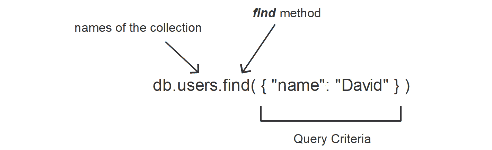

图 4.1:MongoDB 查询语法

为了与 SQL 进行比较，让我们用 SQL 格式重写相同的查询。此查询查找**用户**表中包含**名称**列的所有行，其中**名称**的值为**大卫**，如下所示：

```js
SELECT * FROM USERS WHERE name = 'David';
```

上述查询之间最显著的区别是 MongoDB 查询没有诸如**选择**、中的**和**中的**等关键字。因此，您不需要记住很多关键字及其用法。**

缺少关键字使得查询不那么冗长，因此更集中，更不容易出错。在阅读或编写 MongoDB 查询时，您可以轻松地关注查询中最重要的部分；即条件和逻辑。此外，由于关键字较少，引入语法错误的机会也较小。

由于查询是以文档格式表示的，因此可以很容易地与相应编程语言的对象结构进行映射。在应用程序中编写查询时，MongoDB 驱动程序将应用程序编程语言提供的对象映射到 MongoDB 查询中。因此，要构建 MongoDB 查询，只需准备一个表示查询条件的对象。

相反，SQL 查询是以普通字符串的形式编写的。要构建 SQL 查询，必须连接关键字、字段和表名。和变量一起组成一个字符串。这样的字符串连接容易出错。即使两个连接关键字之间缺少空格也会导致语法错误。既然我们已经了解了 MongoDB 查询结构的基本优点，那么让我们开始对集合编写和执行基本查询。

# 基本 MongoDB 查询

本节中的所有查询都是顶级查询；也就是说，它们基于文档中的顶级（也称为根级别）字段。我们将通过对根字段编写查询来了解基本查询运算符。

## 查找文件

MongoDB 中最基本的查询是通过集合上的**find（）**函数执行的。在没有任何参数的情况下执行此函数时，它将返回集合中的所有文档。例如，考虑下面的查询：

```js
db.comments.find()
```

此查询对名为**comments**的集合调用**find（）**函数。在 mongo shell 上执行时，它将返回集合中的所有文档。要仅返回特定文档，可以向**find（）**函数提供一个条件。完成此操作后，**find（）**函数根据集合中的每个文档对其进行评估，并返回符合条件的文档。

例如，考虑到不是检索所有注释，我们只想找到特定用户添加的注释，Lauren Carr。简言之，我们希望找到**名称**字段值为**Lauren Carr**的所有文档。我们将连接到 MongoDB Atlas 集群，并使用**样本库**数据库。查询应按如下方式编写：

```js
db.comments.find({"name" : "Lauren Carr"})
```

这将产生以下输出：

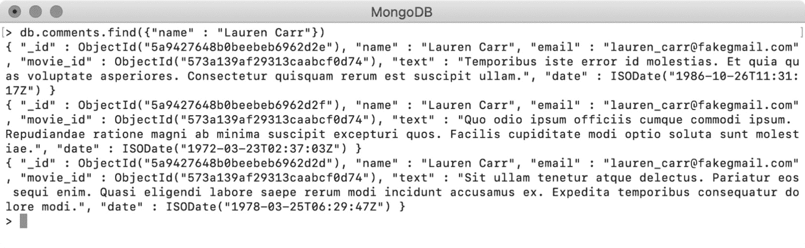

图 4.2：使用 find（）函数后产生的注释

该查询返回了三条由**Lauren Carr**添加的注释。然而，输出是未格式化的，这使得读取和解释变得困难。为了克服这个问题，可以使用**pretty（）**函数打印格式良好的结果，如下所示：

```js
db.comments.find({"name" : "Lauren Carr"}).pretty()
```

在 mongo shell 上执行此查询时，输出如下所示：

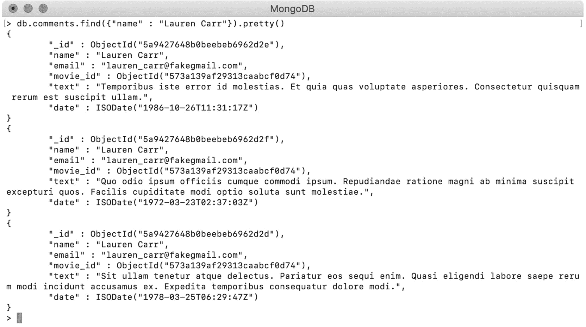

图 4.3：将 find（）与 pretty（）一起使用后的结构化结果

如您所见，输出与上一个示例中相同，但文档格式良好，易于阅读。

## 使用 findOne（）

MongoDB 提供了另一个名为**findOne（）**的函数，该函数只返回一条匹配记录。当您希望隔离特定记录时，此函数非常有用。此函数的语法与**find（）**函数的语法类似，如下所示：

```js
db.comments.findOne()
```

此查询不带任何条件执行，匹配**注释**集合中的所有文档，只返回第一个：


图 4.4：使用 findOne（）函数查找单个文档

正如您所看到的，**findOne（）**的输出总是格式良好的，因为它返回一个文档。将其与设计用于返回多个文档的**find（）**函数进行比较。**find（）**的结果包含在一个集合中，函数返回指向该集合的游标。游标是集合的迭代器，用于迭代或遍历集合的元素。

笔记

在 mongo shell 上执行**find（）**查询时，shell 会自动遍历光标并显示前 20 条记录。当您使用编程语言中的**find（）**时，您将始终需要自己迭代结果集。

在 mongo shell 上，您可以在变量中捕获**find（）**函数返回的光标。通过使用变量，我们可以遍历元素。在下面的代码段中，我们正在执行一个**find（）**查询，并将结果游标捕获到一个名为**comments**的变量中：

```js
var comments = db.comments.find({"name" : "Lauren Carr"})
```

您可以在光标上使用**next（）**函数，将光标移动到下一个索引位置并从那里返回文档。默认情况下，光标设置在集合的开头。第一次调用时，**next（）**函数将光标移动到集合中的第一个文档，并返回该文档。再次调用时，光标将移动到第二个位置，并返回第二个文档。下面是在注释游标上调用**next（）**函数的语法：

```js
comments.next()
```

当光标到达集合中的最后一个文档时，调用**next（）**将导致错误。为了避免这种情况，可以在调用**下一步（）**之前使用**hasNext（）**函数。如果集合在下一个索引位置有文档，**hasNext（）**函数返回**true**，否则返回 false。以下代码段显示了在光标上调用**hasNext（）**函数的语法：

```js
comments.hasNext()
```

以下屏幕截图显示了在 mongo shell 上使用此函数的结果：

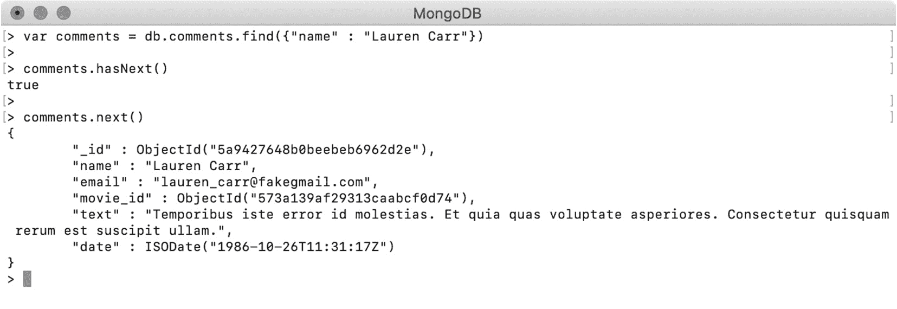

图 4.5：遍历光标

如我们所见，首先，我们在变量中捕获了光标。然后，我们验证光标是否在下一个位置有文档，这导致了**true**。最后，我们使用**next（）**函数打印第一个文档。

## 练习 4.01：无条件使用 find（）和 findOne（）

在本练习中，您将通过连接 MongoDB Atlas 上的**sample_mflix**数据库，在 mongo shell 上不带任何条件地使用**find（）**和**findOne（）**。遵循以下步骤：

1.  First, use **find()** without a condition. So, here, do not pass any document or pass an empty document to the **find()** function. We will also execute the **find()** function to query for a non-existent field in our documents. All the queries shown here have the same behavior:

    ```js
    // All of the queries have the same behavior
    db.comments.find()
    db.comments.find({})
    db.comments.find({"a_non_existent_field" : null})
    ```

    当执行这些查询中的任何一个时，所有文档都将被匹配并在游标中返回。下面的屏幕截图显示了 mongo shell 的前 20 个文档，并在最后打印了一个**类型的“it”，以获取更多**消息。每次输入**it**将返回下一组 20 个文档，直到集合包含更多元素：

    

    图 4.6:mongo shell 中的前 20 个文档

    笔记

    您是否想知道为什么**{“一个不存在的字段”：null}**匹配所有文档？

    这是因为在 MongoDB 中，不存在的字段总是被认为具有空值。**“不存在字段”**字段在我们收集的任何文档中都不存在。因此，字段的空检查对于所有文档都是正确的，并返回它们。

2.  接下来，在没有任何文档的情况下使用**findOne（）**函数，使用空文档，并在不存在的字段上查询文档：

    ```js
    // All of the queries have same behaviour
    db.comments.findOne()
    db.comments.findOne({})
    db.comments.findOne({"a_non_existent_field" : null})
    ```

与上一步类似，前面的所有查询都将具有相同的效果，除了**findOne（）**将只输出集合中的第一个文档。

在下一节中，我们将探讨如何在输出中只投影一些字段。

## 选择输出字段

到目前为止，我们已经观察到许多查询及其输出。您可能已经注意到，每次返回文档时，默认情况下它都包含所有字段。但是，在大多数实际应用程序中，您可能只需要结果文档中的几个字段。在 MongoDB 查询中，可以从结果中包括或排除特定字段。这种技术称为**投影**。投影表示为**find（）**或**findOne（）**函数的第二个参数。在投影表达式中，可以通过将字段设置为**0**来显式排除字段，也可以通过将字段设置为**1**来包含字段。

例如，用户**Lauren Carr**可能只想知道她发表评论的日期，可能对评论文本不感兴趣。以下查询查找用户发布的所有评论，只返回**名称**和**日期**字段：

```js
db.comments.find(
    {"name" : "Lauren Carr"},
    {"name" : 1, "date": 1}
) 
```

执行查询后，可以看到以下结果：

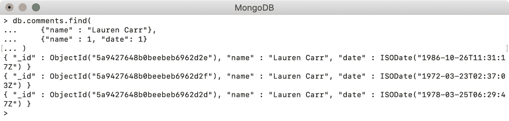

图 4.7：仅显示名称和日期字段的输出

这里，结果中只有特定字段。但是，**\u id**字段仍然可见，即使未指定。这是因为生成的文档中默认包含了**\u id**字段。如果不希望它出现在结果中，则必须明确排除它：

```js
db.comments.find(
    {"name" : "Lauren Carr"}, 
    {"name" : 1, "date": 1, "_id" : 0}
)
```

前面的查询指定从结果中排除**\u id**字段。在 mongo shell 上执行时，我们得到以下输出，这表明所有文档中都没有**\u id**字段：

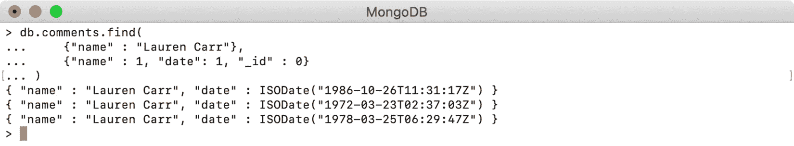

图 4.8：从输出中排除的\u id 字段

必须注意场投影的三种行为，如下所示：

*   除非明确排除，否则将始终包括**【U id】**字段
*   当显式包括一个或多个字段时，其他字段（除**\U id】**外）将自动排除
*   Explicitly excluding one or more fields will automatically include the rest of the fields, along with **_id**

    笔记

    投影有助于压缩结果集并聚焦于特定字段。我们要查询的**样本**集合中的文档相当大。因此，对于大多数示例输出，我们将使用投影仅包括文档的特定字段，这些字段是演示查询行为所必需的。

## 寻找不同的字段

**distinct（）**函数用于获取有无查询条件的字段的不同或唯一值。在本例中，我们将使用**电影**集合。根据内容和观众年龄，为每部电影分配一个观众适合度评级。让我们通过以下查询查找我们收藏中存在的唯一评级：

```js
db.movies.distinct("rated")
```

执行前面的查询将为我们提供**电影**系列中的所有唯一评级：

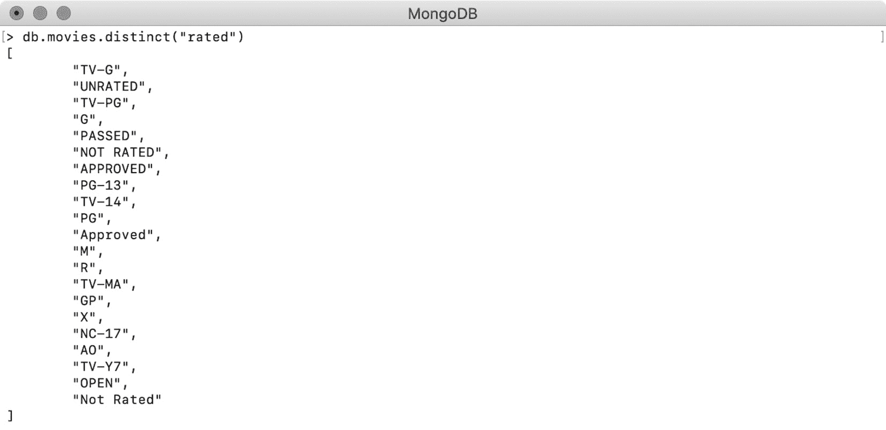

图 4.9：所有电影分级列表

**distinct（）**函数也可以与查询条件一起使用。以下示例显示了 1994 年发行的电影获得的所有独特评级：

```js
db.movies.distinct("rated", {"year" : 1994})
```

函数的第一个参数是必填字段的名称，第二个参数是以文档格式表示的查询。执行查询后，我们得到以下输出：

```js
db.movies.distinct("rated", {"year" : 1994}) 
> [ "R", "G", "PG", "UNRATED", "PG-13", "TV-14", "TV-PG", "NOT RATED" ]
```

需要注意的是，**distinct**的结果始终作为数组返回。

## 清点文件

在某些情况下，我们可能对实际文档不感兴趣，而只对集合中的文档数或与某些查询条件匹配的文档数感兴趣。MongoDB 集合有三个函数返回集合中文档的计数。让我们一个一个地看一看。

### 计数（）

此函数用于返回集合中的文档计数或与给定查询匹配的文档计数。在没有任何查询参数的情况下执行时，它返回集合中文档的总数，如下所示：

```js
// Count of all movies
db.movies.count()
> 23539
```

如果没有查询，此函数将不会对文档进行物理计数。相反，它将读取集合的元数据并返回计数。MongoDB 规范并不保证元数据计数总是准确的。数据库突然关闭或分片集合中的块迁移不完整等情况都可能导致这种不准确。MongoDB 中的分片集合被分区并分布在数据库的不同节点上。我们将不在这里详细讨论，因为这超出了本书的范围。

当函数提供查询时，将返回与给定查询匹配的文档计数。例如，以下查询将返回正好有六条注释的电影计数：

```js
// Counting movies that have 6 comments
> db.movies.count({"num_mflix_comments" : 6})
17
```

执行此查询时，通过使用同一查询执行聚合管道，在内部计算文档的实际计数。您将在*第 7 章*、*聚合*中了解更多关于聚合管道的信息。

在 MongoDB v4.0 中，这两种行为被分为不同的函数：**countDocuments（）**和**estimatedDocumentCount（）**。

### 文件（）

此函数返回与给定条件匹配的文档计数。以下是一个示例查询，返回 1999 年发布的电影计数：

```js
> db.movies.countDocuments({"year": 1999})
542
```

与**count（）**函数不同，**countDocuments（）**必须使用查询参数。因此，以下查询无效，将失败：

```js
db.movies.countDocuments()
```

要统计集合中的所有文档，我们可以向函数传递一个空查询，如下所示：

```js
> db.movies.countDocuments({})
23539
```

关于**countDocuments（）**需要注意的一点是，它从不使用集合元数据来查找计数。它对集合执行给定的查询，并计算匹配文档的计数。这提供了准确的结果，但可能需要比基于元数据的计数更长的时间。即使提供了空查询，也会与所有文档进行匹配。

### 估计文档数（）

此函数用于返回集合中文档的大致计数或估计计数。它不接受任何查询，并始终返回集合中所有文档的计数。计数始终基于集合的元数据。其语法如下所示：

```js
> db.movies.estimatedDocumentCount()
23539
```

由于计数是基于元数据的，因此结果不太准确，但性能更好。当性能比准确性更重要时，应使用该功能。

# 条件运算符

现在您已经了解了如何查询 MongoDB 集合，以及如何使用投影仅返回输出中的特定字段，现在是学习更高级查询方法的时候了。到目前为止，您已经尝试使用字段的值查询**注释**集合。但是，有更多的方法可以查询文档。MongoDB 提供了条件运算符，可用于表示各种条件，例如相等，以及值是否小于或大于某个指定值。在本节中，我们将探讨这些运算符，并学习如何在查询中使用它们。

## 等于（$eq）

在上一节中，您看到了等式检查的示例，其中查询使用了键值对。但是，查询也可以使用专用运算符（**$eq**）来查找字段与给定值匹配的文档。例如，以下查询查找并返回正好有**5**注释的电影。两个查询具有相同的效果：

```js
db.movies.find({"num_mflix_comments" : 5})
db.movies.find({ "num_mflix_comments" : {$eq : 5 }})
```

## 不等于（$ne）

此运算符表示**不等于**，具有使用相等检查的相反效果。它选择字段值与给定值不匹配的所有文档。例如，以下查询可用于返回评论计数不等于 5 的电影：

```js
db.movies.find(
    { "num_mflix_comments" : 
        {$ne : 5 }
    }
)
```

## 大于（$gt）且大于或等于（$gte）

**$gt**关键字可用于查找字段值大于查询值的单据。类似地，**$gte**关键字用于查找字段值等于或大于给定值的文档。我们来看看 2015 年**之后**上映的电影数量：

```js
> db.movies.find(
    {year : {$gt : 2015}}
).count()
1
```

要查找在**2015**期间或之后发行的电影，可以使用以下代码行：

```js
> db.movies.find(
    {year : {$gte : 2015}}
).count()
485
```

有了这些运营商，我们还可以统计 21 世纪发行的电影。对于这个查询，我们还想包括 2000 年 1 月 1 日以来发行的电影，所以我们将使用**$gte**，如下所示：

```js
// On or After 2000-01-01
> db.movies.find(
    {"released" : 
        {$gte: new Date('2000-01-01')}
    }
).count()
13767
```

## 小于（$lt）且小于或等于（$lte）

**$lt**运算符将文档与小于给定值的字段值相匹配。类似地，**$lte**运营商选择字段值等于或小于给定值的文档。

要查找少于两条评论的电影数量，请输入以下查询：

```js
> db.movies.find(
    {"num_mflix_comments" : 
        {$lt : 2}
    }
).count()
8514
```

类似地，要查找最多有两条评论的电影数量，请输入以下查询：

```js
> db.movies.find(
    {"num_mflix_comments" : 
        {$lte : 2}
    }
).count()
13185
```

同样，要计算上个世纪发行的电影数量，只需使用**$lt**：

```js
// Before 2000-01-01
> db.movies.find(
    {"released" : 
        {$lt : new Date('2000-01-01')}
    }
).count()
9268
```

## 在（$In）中，而不是在（$nin）中

如果用户想要一份分级为 G、PG 或 PG-13 的所有电影的列表，该怎么办？在这种情况下，我们可以使用运算符中的**$以及以数组形式给出的多个值。此类查询查找字段值至少与一个给定值匹配的所有文档。准备一个查询，通过输入以下内容返回分级为 G、PG 或 PG-13 的电影：**

```js
db.movies.find(
    {"rated" : 
        {$in : ["G", "PG", "PG-13"]}
    }
)
```

**$nin**运算符代表中的**Not，并匹配字段值与任何数组元素不匹配的所有文档：**

```js
db.movies.find(
    {"rated" : 
        {$nin : ["G", "PG", "PG-13"]}
    }
)
```

前面的查询返回未分级为**G**、**PG**或**PG-13**的电影，包括没有**分级**字段的电影。

若要查看在不存在字段的情况下使用**$nin**时会发生什么，请首先查找您拥有的全部文档，如下所示：

```js
> db.movies.countDocuments({})
23539
```

现在，在一个不存在的对象上使用**$nin**和一些值（null 除外）。这意味着所有文档都是匹配的，如以下代码段所示：

```js
> db.movies.countDocuments(
    {"nef" : 
        {$nin : ["a value", "another value"]} 
    }
)
23539
```

在下面的示例中，将一个**null**值添加到**$nin**数组中：

```js
> db.movies.countDocuments( 
    {"nef" : 
        {$nin : ["a value", "another value", null ]} 
    }
)
0
```

这一次，它与任何文档都不匹配。这是因为，在 MongoDB 中，一个不存在的字段总是有一个 null 值，因此**$nin**条件对于任何文档都不成立。

## 练习 4.02：查询演员的电影

想象一下，你正在为一本流行的娱乐杂志工作，他们即将出版的一期是献给莱昂纳多·迪卡普里奥的。这期杂志将包含一篇特别的文章，你很快就会需要一些数据，比如他出演的电影数量、每部电影的类型等等。在本练习中，您将编写查询以按给定条件计算文档数，查找不同的文档，并在文档中投影不同的字段。查询**样本 _mflix**电影集合中的以下内容：

*   该演员出演的电影数量
*   这些电影的类型
*   电影名称及其发行年份
*   他执导的电影数量

1.  Find the movies in which Leonardo DiCaprio appears by using the **cast** field. Enter the following query to do so:

    ```js
    db.movies.countDocuments({"cast" : "Leonardo DiCaprio"})
    ```

    以下输出说明莱昂纳多曾出演过 25 部电影：

    ```js
    > db.movies.countDocuments({"cast" : "Leonardo DiCaprio"})
    25
    ```

2.  The genres of the movies in the collection are represented by the **genres** field. Use the **distinct()** function to find the unique genres:

    ```js
    db.movies.distinct("genres", {"cast" : "Leonardo DiCaprio"})
    ```

    执行上述代码后，您将收到以下输出。我们可以看到，他曾在 14 种不同类型的电影中演出：

    

    图 4.10：莱昂纳多·迪卡普里奥主演的电影类型

3.  Using movie titles, you can now find the year of release for each of the actor's movies. As you are only interested in the titles and release years of his movies, add a projection clause to the query:

    ```js
    db.movies.find(
        {"cast" : "Leonardo DiCaprio"},
        {"title":1, "year":1, "_id":0}
    )
    ```

    输出将按如下方式生成：

    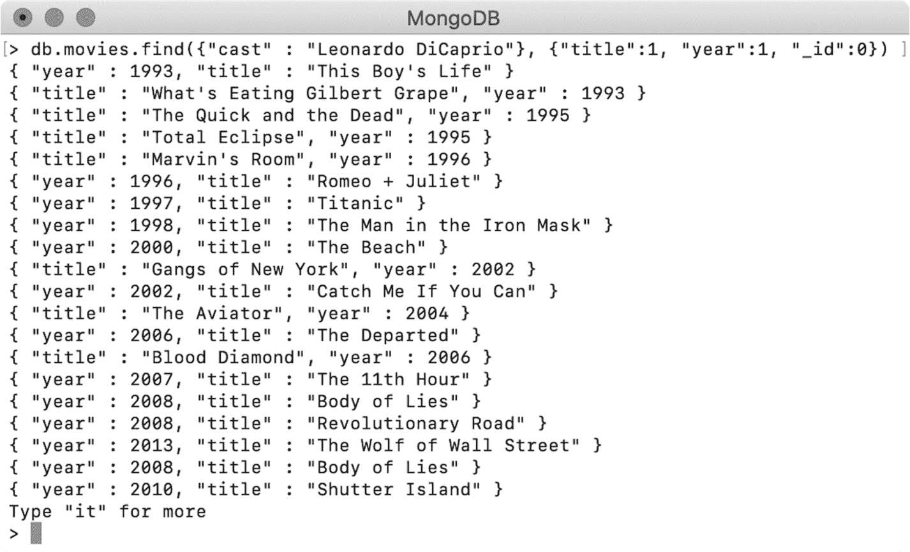

    图 4.11：莱昂纳多·迪卡普里奥电影的片名和发行年份

4.  接下来，你需要找到莱昂纳多执导的电影数量。要收集这些信息，请再次计算他导演的电影数量，这次使用导演字段而不是演员字段。该问题的查询单据如下：

    ```js
    {"directors": "Leonardo DiCaprio"}
    ```

5.  Write a query that counts the movies that match the preceding query:

    ```js
    db.movies.countDocuments({"directors" : "Leonardo DiCaprio"})
    ```

    执行查询。这表明莱昂纳多·迪卡普里奥导演了**0**部电影：

    ```js
    > db.movies.countDocuments({"directors" : "Leonardo DiCaprio"})
    0
    ```

在本练习中，您根据某些条件查找和计算文档，找到字段的不同值，并在输出中投影特定字段。在下一节中，我们将学习逻辑运算符。

# 逻辑运算符

到目前为止，我们已经了解了用于编写基于比较的查询的各种运算符。到目前为止，我们编写的查询一次只有一个标准。但在实际场景中，您可能需要编写更复杂的查询。MongoDB 提供了四个逻辑运算符，帮助您在同一查询中构建多个条件的逻辑组合。我们来看看。

## $和操作员

使用**$和**操作符，您可以将任意数量的条件包装在一个数组中，并且操作符将只返回满足所有条件的文档。当文档未通过条件检查时，将跳过下一个条件。这就是为什么操作员被称为短路操作员。例如，假设您想确定 2008 年发行的未评级电影的数量。此查询必须具有两个条件：

*   额定字段的值应为**未额定**
*   字段年份必须等于**2008**

在文档格式中，两个查询都可以写为**{“评级”：“未评级”}**和**{“年份”：2008}**。使用**$和**操作符将它们放入一个数组中：

```js
> db.movies.countDocuments (
    {$and : 
        [{"rated" : "UNRATED"}, {"year" : 2008}]
    }
)
37
```

之前的结果显示，2008 年，有 37 部未评级的电影。在 MongoDB 查询中，**$和**操作符是隐式的，如果查询文档有多个条件，则默认包含。例如，可以不使用**$和**运算符重写以下查询，并给出相同的结果：

```js
> db.movies.countDocuments (
    {"rated": "UNRATED", "year" : 2008}
)
37
```

输出完全相同，因此不必显式使用**$和**运算符，除非您希望使代码更具可读性。

## $或操作员

使用**$或**操作符，您可以传递包装在一个数组中的多个条件，满足其中任一条件的文档将被返回。当我们有多个条件并且希望查找至少与一个条件匹配的文档时，使用此运算符。

在我们在（$In）和（$nin）部分的*中使用的示例中，您编写了一个查询来统计分级为 G、PG 或 PG-13 的电影。使用**$或**运算符重写相同的查询，如下所示：*

```js
db.movies.find(
    { $or : [
        {"rated" : "G"}, 
        {"rated" : "PG"}, 
        {"rated" : "PG-13"}
    ]}
)
```

这两个操作符不同，用于不同的场景。运算符中的**$用于确定给定字段是否具有数组中提供的至少一个值，而**或**运算符不绑定到任何特定字段，并接受多个表达式。为了更好地理解这一点，请编写一个查询，以查找评级为**G**、在**2005**发行的电影，或者至少有**5**评论的电影。此查询中有三个条件，如下所示：**

*   **{“额定”：“G”}**
*   **{“年份”：2005}**
*   **{“num_mflix_comments”：{$gte:5}}**

要在**$或**查询中使用这些表达式，请将这些表达式组合到一个数组中：

```js
db.movies.find(
    {$or:[
        {"rated" : "G"},
        {"year" : 2005},
        {"num_mflix_comments" : {$gte : 5}}
   ]}
)
```

## $nor 操作员

**$nor**运算符在语法上类似于**$或**，但行为方式相反。**$nor**运算符接受数组形式的多个条件表达式，并返回不满足任何给定条件的文档。

以下是您在上一节中编写的相同查询，只是将**$或**运算符替换为**$或**：

```js
db.movies.find(
    {$nor:[
        {"rated" : "G"},
        {"year" : 2005},
        {"num_mflix_comments" : {$gte : 5}}
    ]}
)
```

此查询将匹配并返回所有未评级为**G**、未在**2005**中发布且评论数不超过**5**的电影。

## $非操作员

**$not**运算符表示否定给定条件的逻辑 not 操作。简单地说，**$not**操作符接受一个条件表达式并匹配所有不满足它的文档。

以下查询查找具有**5**或更多评论的电影：

```js
db.movies.find(
    {"num_mflix_comments" : 
        {$gte : 5}
    }
)
```

在同一查询中使用**$not**运算符，并对给定条件求反：

```js
db.movies.find(
    {"num_mflix_comments" : 
        {$not : {$gte : 5} }
    }
)
```

此查询将返回所有没有 5 条或更多评论的电影以及不包含**num_mflix_comments**字段的电影。现在，您将在一个简单的练习中使用到目前为止所学的运算符。

## 练习 4.03：组合多个查询

即将出版的杂志特别关注莱昂纳多与导演马丁·斯科塞斯的合作。本练习的任务是找出莱昂纳多·迪卡普里奥和马丁·斯科塞斯合作制作的戏剧或犯罪电影的片名和发行年份。要完成此练习，您需要使用多个查询的组合，如以下步骤所述：

1.  第一个条件是莱昂纳多·迪卡普里奥必须是演员之一，马丁·斯科塞斯必须是导演。所以，有两个条件需要有*和*关系。如前所述，*和*关系是组合两个查询时的默认关系。输入以下查询：

    ```js
    db.movies.find(
        {
          "cast": "Leonardo DiCaprio",
          "directors" : "Martin Scorsese"
        }
    )
    ```

2.  现在，还有一个*和*条件需要添加，那就是电影应该是戏剧或犯罪类型。您可以很容易地为类型字段准备两个过滤器：**{“类型”：“戏剧”}**和**{“类型”：“犯罪”}**。以*或*关系将他们聚在一起，如下所示：

    ```js
    "$or" : [{"genres" : "Drama"}, {"genres": "Crime"}]
    ```

3.  将流派过滤器添加到主查询：

    ```js
    db.movies.find(
        {
          "cast": "Leonardo DiCaprio", 
          "directors" : "Martin Scorsese",
          "$or" : [{"genres" : "Drama"}, {"genres": "Crime"}]
        }
    )
    ```

4.  前面的查询包含所有预期条件，但您只对标题和发布年份感兴趣。为此，添加投影部分：

    ```js
    db.movies.find(
        {
          "cast": "Leonardo DiCaprio",
          "directors" : "Martin Scorsese",
          "$or" : [{"genres" : "Drama"}, {"genres": "Crime"}]
        },
        {
          "title" : 1, "year" : 1, "_id" : 0
        }
    )
    ```

5.  Execute the query on a mongo shell. The output should look as follows:

    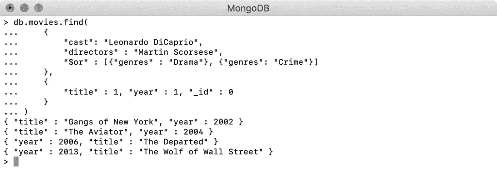

图 4.12：莱昂纳多·迪卡普里奥和马丁·斯科塞斯合作的电影

该输出提供了所需的信息；有四部电影符合我们的标准。这位演员和导演上一次合作是在 2013 年的电影《华尔街的狼》中。至此，您已经练习了使用多个查询条件以及不同的逻辑关系。在下一节中，您将学习如何使用正则表达式查询文本字段。

# 正则表达式

在现实世界的电影服务中，您将希望提供自动完成搜索框，在该搜索框中，只要用户键入电影标题的几个字符，搜索框就会建议其标题与键入的字符序列匹配的所有电影。这是使用正则表达式实现的。正则表达式是定义字符模式的特殊字符串。当使用此类正则表达式查找字符串字段时，将找到并返回具有匹配模式的所有字符串。

在 MongoDB 查询中，正则表达式可以与**$regex**运算符一起使用。假设您在搜索框中输入了单词**Opera**，并希望找到所有标题包含此角色模式的电影。对此的正则表达式查询如下所示：

```js
db.movies.find(
    {"title" : {$regex :"Opera"}}
)
```

执行此查询并使用投影仅打印标题后，结果将显示如下：

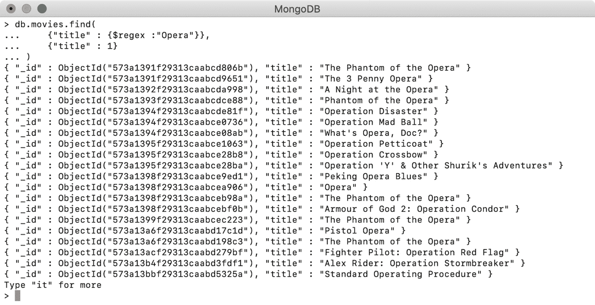

图 4.13：标题包含“歌剧”一词的电影

mongo shell 的输出表明正则表达式正确返回了标题包含单词**Opera**的电影。

### 使用插入符号（^）运算符

在前面的正则表达式示例中，输出中的标题在任何位置都包含给定的单词**Opera**。要仅查找以给定正则表达式开头的字符串，可以使用插入符号运算符（**^**）。在下面的示例中，您使用它仅查找标题以单词**Opera**开头的电影：

```js
db.movies.find(
    {"title" : {$regex :"^Opera"}}
)
```

当您执行前面的查询并投射**title**字段时，您将得到以下输出：


图 4.14：仅投影前面查询的标题字段

前面 Mongo shell 的输出显示，只返回以“Opera”开头的电影标题。

### 使用美元（$）运算符

与插入符号运算符类似，还可以匹配以给定正则表达式结尾的字符串。为此，请使用美元运算符（**$**）。在以下示例中，您尝试查找以“Opera”结尾的电影标题：

```js
db.movies.find(
    {"title" : {$regex :"Opera$"}}
)
```

前面的查询在正则表达式文本之后使用了 dollar（**$**）运算符。执行并投影标题字段时，您将收到以下输出：


图 4.15：标题以“歌剧”结尾的电影

因此，通过使用 dollar（**）操作符，我们找到了所有以**Opera**结尾的电影标题。**

 **### 不区分大小写的搜索

默认情况下，使用正则表达式搜索区分大小写。提供的搜索模式中的字符大小写完全匹配。但是，经常需要为正则表达式提供一个单词或模式，并查找文档，而不考虑其大小写。MongoDB 为此提供了**$options**运算符，可用于不区分大小写的正则表达式搜索。例如，假设您想查找所有标题包含单词“the”的电影，首先是区分大小写的，然后是不区分大小写的。

以下查询以小写形式检索包含单词**和**的标题：

```js
db.movies.find(
    {"title" : {"$regex" : "the"}}
)
```

mongo shell 中的以下输出显示，此查询返回包含单词**和**的小写标题：


图 4.16：包含小写“the”一词的标题

现在，使用不区分大小写的搜索尝试相同的查询。为此，请为**$options**参数提供一个值**i**，其中**i**表示不区分大小写：

```js
db.movies.find(
    {"title" : 
        {"$regex" : "the", $options: "i"}
    }
)
```

前面的查询使用相同的正则表达式模式（**和**），但有一个附加参数；也就是说，**$期权**。在**标题**字段上执行查询和投影：


图 4.17：查询不区分大小写的结果

执行查询并打印标题表明正则表达式是匹配的，与大小写无关。到目前为止，我们已经了解了如何查询基本对象。在下一节中，我们将学习如何查询数组和嵌入文档。

# 查询数组和嵌套文档

在*第 2 章*、*文档和数据类型*中，我们了解到 MongoDB 文档支持复杂的对象结构，如数组、嵌套对象、对象数组等。数组和嵌套文档有助于存储自包含的信息。拥有一种能够轻松搜索和检索存储在这种复杂结构中的信息的机制是极其重要的。MongoDB 查询语言允许我们以最直观的方式查询这种复杂的结构。首先，我们将学习如何在数组元素上运行查询，然后我们将学习如何在嵌套对象字段上运行查询。

## 通过元素查找数组

通过数组进行查询类似于查询任何其他字段。在**电影**系列中，有几个数组，**演员**场就是其中之一。想想看，在你的电影服务中，用户想找主角查理·卓别林。要为此搜索创建查询，请对字段使用相等检查，如下所示：

```js
db.movies.find({"cast" : "Charles Chaplin"})
```

当您执行此查询并仅投影**cast**字段时，您将获得以下输出：


图 4.18：寻找查尔斯·卓别林主演的电影

现在，假设用户想要搜索演员查尔斯·卓别林和埃德娜·普维安斯一起拍摄的电影。对于此查询，您将使用**$和**运算符：

```js
db.movies.find(
    {$and :[
        {"cast" : "Charles Chaplin"},
        {"cast": "Edna Purviance"}
    ]}
)
```

仅执行和投影数组字段会产生以下输出：


图 4.19：寻找查尔斯·卓别林和埃德娜·普维安斯主演的电影

我们可以得出结论，当使用值查询数组字段时，如果数组字段至少包含一个满足查询的元素，则返回所有这些文档。

## 通过数组查找数组

在前面的示例中，我们使用元素的值搜索数组。同样，也可以使用数组值搜索数组字段。但是，当使用数组值搜索数组字段时，元素及其顺序必须匹配。让我们尝试几个例子来说明这一点。

**电影**收藏中的文档有一个数组，表示电影有多少种语言。假设您的用户希望找到同时有**英语**和**德语**版本的电影。准备两个值的数组并查询**语言**字段：

```js
db.movies.find(
    {"languages" : ["English", "German"]}
)
```

在投影**语言**和**id**字段时打印结果：


图 4.20：英语和德语电影

前面的输出显示，当我们使用数组进行搜索时，值是完全匹配的。

现在，让我们更改数组元素的顺序并再次搜索：

```js
db.movies.find(
    {"languages" : ["German", "English"]}
)
```

请注意，此查询与上一个查询相同，只是数组元素的顺序相反。您应该看到以下输出：

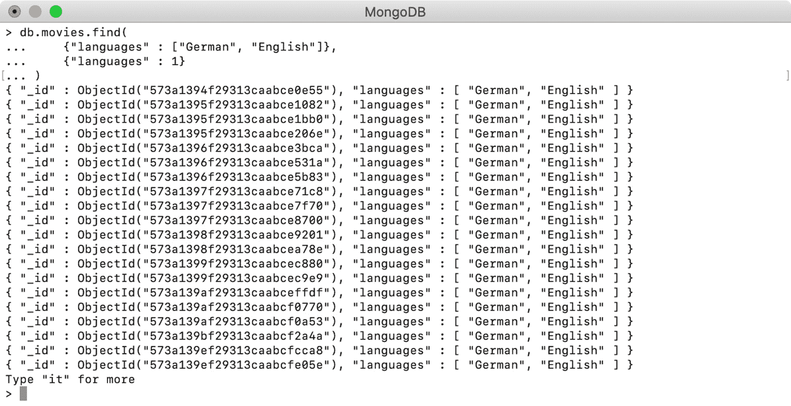

图 4.21：显示数组元素顺序影响的查询

前面的输出显示，通过更改数组中元素的顺序，不同的记录已匹配。

发生这种情况的原因是，当使用数组值搜索数组字段时，使用相等检查匹配该值。任何两个数组只有在具有相同顺序的相同元素时才能通过相等性检查。因此，以下两个查询不同，将返回不同的结果：

```js
// Find movies languages by [ "English", "French", "Cantonese", "German"]
db.movies.find(
    {"languages": [ "English", "French", "Cantonese", "German"]}
)
// Find movies languages by ["English", "French", "Cantonese"]
db.movies.find(
    {"languages": ["English", "French", "Cantonese"]}
)
```

这两个查询之间的唯一区别是第二个查询不包含最后一个元素；也就是说，**德语**。现在，在 mongo shell 中执行这两个查询并查看输出：


图 4.22：显示数组值完全匹配的不同查询

前面的输出显示了一个接一个执行的两个查询，并证明数组值完全匹配。

### 使用$all 运算符搜索数组

**$all**运算符查找字段值包含所有元素的所有文档，无论其顺序或大小：

```js
db.movies.find(
    {"languages":{ 
        "$all" :[ "English", "French", "Cantonese"]
    }}
)
```

前面的查询使用**$all**查找所有可用的电影，包括**英语**、**法语**和**粤语**。您将执行此查询以及投影，以仅显示**语言**字段：

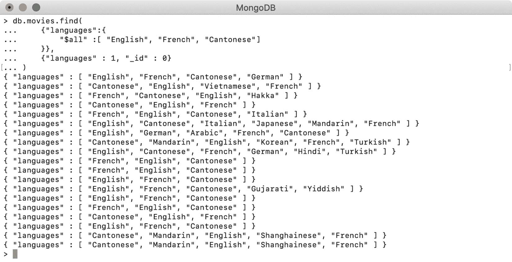

图 4.23：在 languages 字段上使用$all 运算符进行查询

前面的输出表明，**$all**运算符具有匹配的数组，而与元素的顺序和大小无关。

## 投影阵元

到目前为止，我们已经看到，无论何时搜索数组字段，输出总是包含完整的数组。有几种方法可以限制查询输出中返回的数组元素数。我们已经在生成的文档中练习了投影字段。与此类似，也可以投影数组中的元素。在本节中，我们将学习如何在使用数组字段搜索时限制结果集。在此之后，我们将学习如何根据索引位置从数组返回特定元素。

### 使用（$）投影匹配元素

您可以通过元素值搜索数组，并使用**$**运算符使用投影排除数组中除第一个匹配元素以外的所有元素。要执行此操作，请先在不使用**$**运算符的情况下执行查询，然后使用此运算符执行查询。准备一个简单的元素搜索查询，如下所示：

```js
db.movies.find(
    {"languages" : "Syriac"}, 
    {"languages" :1}
)
```

此查询使用**语言**数组上的元素搜索，并投影字段以产生以下输出：

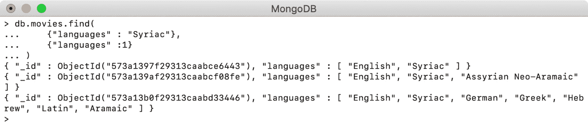

图 4.24：可用的叙利亚语电影

尽管该查询旨在查找叙利亚语电影，但输出数组也包含其他语言。现在，看看当您使用**$**操作符时会发生什么：

```js
db.movies.find(
    {"languages" : "Syriac"}, 
    {"languages.$" :1}
)
```

您已经修改了查询，在投影部分添加了**$**操作符。现在，执行查询，如下所示：


图 4.25：只有叙利亚语的电影

输出中的数组字段仅包含匹配元素；其余的元素将被跳过。因此，输出中的**语言**数组只包含**叙利亚语**元素。要记住的最重要的一点是，如果匹配了多个元素，**$**操作符只投影第一个匹配元素。

### 通过索引位置投影匹配元素（$slice）

**$slice**操作符用于根据数组元素的索引位置限制数组元素。此运算符可用于任何数组字段，无论是否查询字段。这意味着您可以查询其他字段，但仍可以使用此运算符限制数组字段的元素。

为了了解这一点，我们将以电影**Youth With Youth**为例，它在**语言**数组中有 11 个元素。mongo shell 的以下输出显示了电影记录中的数组字段的外观：

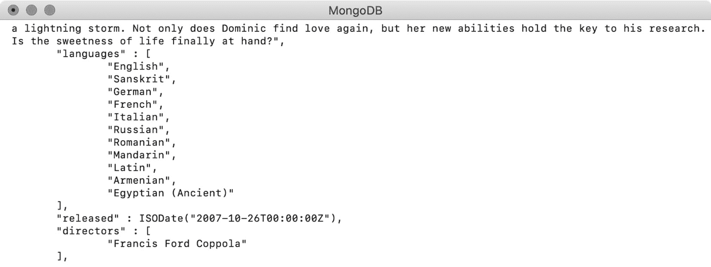

图 4.26：电影《没有青春的青春》的语言列表

在下面的查询中，使用**$slice**只打印数组的前三个元素：

```js
db.movies.find(
    {"title" : "Youth Without Youth"}, 
    {"languages" : {$slice : 3}}
).pretty()
```

前面查询的输出显示**语言**字段仅包含前三个元素，如下所示：

```js
    "languages" : [
            "English",
            "Sanskrit",
            "German"
    ]
    "released" : ISODate("2007-10-26T00:00:00Z"),
    "directors" : [
```

**$slice**操作符可以以多种方式使用。以下投影表达式将返回数组的最后两个元素：

```js
{"languages" : {$slice : -2}}
```

以下输出显示数组仅被切片到最后两个元素：

```js
    "languages" : [
            "Armenian",
            "Egyptian (Ancient)",
    ]
    "released" : ISODate("2007-10-26T00:00:00Z"),
```

**$slice**运算符也可以通过两个参数传递，其中第一个参数表示要跳过的元素数，第二个参数表示要返回的元素数。例如，以下投影表达式将跳过数组的前两个元素，并返回其后的四个元素：

```js
{"languages" : {$slice : [2, 4]}}
```

执行此查询时，我们会得到以下输出：

```js
    "languages" : [
            "German",
            "French",
            "Italian"
            "Russian"
    ]
    "released" : ISODate("2007-10-26T00:00:00Z"),
    "directors" : [
```

两个参数的切片也可以与 skip 的负值一起使用。例如，在下面的投影表达式中，第一个数字是负数。如果 skip 的值为负值，则计数从末尾开始。因此，在下面的表达式中，将跳过从最后一个索引开始计数的五个元素，并返回从该索引开始的四个元素：

```js
{"languages" : {$slice : [-5, 4]}}
```

请注意，由于跳过值为负值，跳过索引将从最后一个索引计算。跳过最后一个索引中的五个元素，我们将得到**罗马尼亚语**，然后从这个索引位置返回接下来的四个元素，如下所示：

```js
    "languages" : [
            "Romanian",
            "Mandarin",
            "Latin"
            "Armenian"
    ]
    "released" : ISODate("2007-10-26T00:00:00Z"),
```

在本节中，我们介绍了如何查询数组字段以及如何以各种方式投影结果。在下一节中，我们将学习如何查询嵌套对象。

## 查询嵌套对象

与数组类似，嵌套或嵌入的对象也可以表示为字段的值。因此，可以使用完整对象作为值来搜索具有其他对象作为其值的字段。在**电影**集合中，有一个名为**awards**的字段，其值为嵌套对象。以下片段显示了收藏中随机电影的**奖励**对象：

```js
    "rated" : "TV-G",
    "awards"  :  {
             "wins" : 1,
             "nominations" : 0,
             "text" : "1 win."
    }
```

以下查询通过提供完整对象作为其值来查找**奖励**对象：

```js
db.movies.find(
    {"awards": 
        {"wins": 1, "nominations": 0, "text": "1 win."}
    }
)
```

以下输出显示有几部电影的**奖项**字段的精确值为**{“wins”：1，“提名”：0，“文本”：“1 win”。}**：

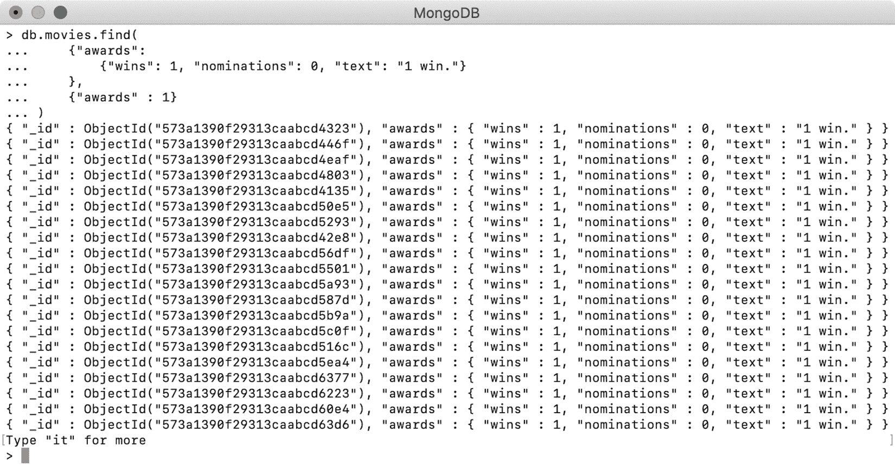

图 4.27：未获得提名和奖项的电影列表

使用对象值搜索嵌套对象字段时，必须存在精确匹配。这意味着所有字段值对以及字段顺序必须完全匹配。例如，考虑下面的查询：

```js
db.movies.find(
    {"awards": 
        {"nominations": 0, "wins": 1, "text": "1 win."}
    }
)
```

此查询在查询对象的顺序上有变化；因此，它将返回一个空结果。

## 查询嵌套对象字段

在*第 2 章*、*文档和数据类型*中，我们看到可以使用点（**、**符号）访问嵌套对象的字段。类似地，点表示法可以通过提供嵌套对象字段的值来搜索嵌套对象。例如，要查找获得四项大奖的电影，可以使用点符号，如下所示：

```js
db.movies.find(
    {"awards.wins" : 4}
)
```

前面的查询在**奖励**字段上使用点（**符号），并引用名为**wins**的嵌套字段。当您执行查询并仅投影**奖励**字段时，您将获得以下输出：**

 **

图 4.28：仅投影前面代码段的奖励字段

前面的输出表明过滤器已正确应用于**赢**并且返回了所有正好有四个奖项的电影。

嵌套字段搜索在给定字段上独立执行，与元素的顺序无关。您可以按多个字段搜索，并使用任何条件或逻辑查询运算符。例如，请参考以下查询：

```js
db.movies.find(
    {
        "awards.wins" : {$gte : 5}, 
        "awards.nominations" : 6
    }
)
```

此查询在两个不同的嵌套字段上使用两个条件的组合。在排除其余字段的情况下执行查询时，您应该会看到以下输出：

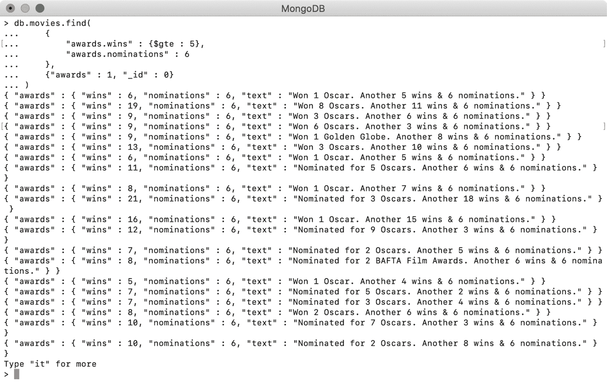

图 4.29：获得六项提名和至少五项奖项的电影

此查询使用条件运算符在两个字段上执行搜索，并返回获得六项提名且至少获得五项奖项的电影。与数组元素或文档中的任何字段一样，嵌套对象字段也可以根据需要进行投影。我们将在下一个练习中详细探讨这一点。

## 练习 4.04：投影嵌套对象字段

在本练习中，您将学习如何仅从嵌套对象投影某些字段。以下步骤将帮助您实施此练习：

1.  Open a mongo shell and connect to the **sample_mflix** database on Mongo Atlas. Enter the following query to return all the records and project only the **awards** field, which is an embedded object:

    ```js
    db.movies.find(
        {}, 
        {
            "awards" :1, 
            "_id":0
        }
    )
    ```

    下面的输出显示结果中只包含了**奖励**字段，而其余字段（包括**id**）被排除在外：

    

    图 4.30：仅为查询投影奖励字段

2.  To project only specific fields from embedded objects, you can refer to a field of an embedded object using dot notation. Type in the following query:

    ```js
    db.movies.find(
        {}, 
        {
            "awards.wins" :1, 
            "awards.nominations" : 1,  
            "_id":0
        }
    )
    ```

    在 mongo shell 上执行此查询时，输出如下所示：

    

图 4.31：仅投影奖励对象，不投影文本字段

前面的输出显示响应中只包含两个嵌套字段。输出中的**奖励**对象仍然是嵌套对象，但**文本**字段已被排除。

到目前为止，我们已经了解了嵌套对象及其字段在输出中是如何受到限制的。我们关于在 MongoDB 中查询数组和嵌套对象的讨论到此结束。在下一节中，我们将学习如何跳过、限制和排序文档。

# 限制、跳过和排序文档

到目前为止，我们已经学习了如何编写基本和复杂的查询，以及如何在生成的文档中投影字段。在本节中，您将学习如何控制查询返回的文档的数量和顺序。

让我们谈谈为什么需要控制查询返回的数据量。在大多数实际情况下，您不会使用与查询匹配的所有文档。想象一下，我们电影服务的一位用户计划今晚观看一部戏剧电影。他们将参观电影商店，搜索戏剧电影，发现藏品中有 13000 多部戏剧电影。有了这么大的搜索结果，他们可能整晚都在浏览各种电影，决定看哪一部。

为了获得更好的用户体验，您可能希望一次放映戏剧类别中最受欢迎的 10 部电影，然后依次放映序列中的下 10 部电影，以此类推。这种服务数据的技术称为分页。在这种情况下，一个大的结果被分成小的块（也称为页面），一次只提供一个页面。分页不仅可以改善用户体验，还可以提高系统的整体性能，并减少数据库、网络、用户浏览器或移动应用程序的开销。要实现分页，您必须能够限制结果的大小，跳过已送达的记录，并以确定的顺序送达它们。在本节中，我们将练习这三种技术。

## 限制结果

为了限制查询返回的记录数，结果游标提供了一个名为**limit（）**的函数。此函数接受整数并返回相同数量的记录（如果可用）。MongoDB 建议使用此函数，因为它可以减少光标产生的记录数并提高速度。

要打印由**查尔斯·卓别林**主演的电影的片名，请输入以下查询，在**演员阵容**字段中查找演员姓名：

```js
db.movies.find(
    {"cast" : "Charles Chaplin"}, 
    {"title": 1, "_id" :0}
)
```

该查询还在**标题**字段中添加投影。执行查询时，您将看到以下输出：


图 4.32：查尔斯·卓别林主演电影的输出

可以看出，查尔斯·卓别林总共出演了八部电影。接下来，您将使用限制功能将结果大小限制为**3**，如下所示：

```js
db.movies.find(
    {"cast" : "Charles Chaplin"}, 
    {"title": 1, "_id" :0}
).limit(3)
```

执行此查询时，仅返回三条记录：

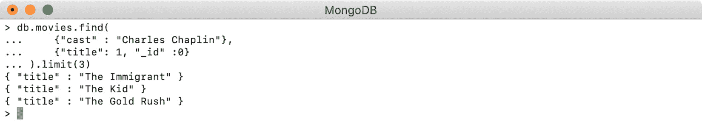

图 4.33：使用 limit（）仅显示查尔斯·卓别林主演的三部电影

让我们看看**limit（）**函数与不同值一起使用时的行为。

当限制大小大于光标内的实际记录时，将返回所有记录，而与设置的限制无关。例如，以下查询将返回**8**条记录，即使限制设置为**14**，因为光标中只有**8**条记录：

```js
db.movies.find(
    {"cast" : "Charles Chaplin"}, 
    {"title": 1, "_id" :0}
).limit(14)
```

前面的查询产生以下输出，显示查询已返回所有八条记录：


图 4.34：限制设置为 14 时的输出

请注意，将限制设置为零相当于根本不设置任何限制。因此，以下查询将返回与条件匹配的所有八条记录：

```js
db.movies.find(
    {"cast" : "Charles Chaplin"}, 
    {"title": 1, "_id" :0}
).limit(0)
```

前面查询的输出如下所示：


图 4.35：限制设置为 0 时的输出

现在，您想知道如果限制大小设置为负数会发生什么吗？对于返回较小记录的查询，如在我们的示例中，负的大小限制被认为等同于正数的限制。以下查询演示了这一点：

```js
db.movies.find(
    {"cast" : "Charles Chaplin"}, 
    {"title": 1, "_id" :0}
).limit(-2)
```

当您执行此查询（mongo shell 上的负限制为-**2**时），您应该会得到以下输出：


图 4.36：极限为-2 时的输出

输出显示查询返回了两个文档，行为相当于使用大小为**2**的**limit**。但是，结果集的批大小可能会影响此行为。下一节将详细探讨这一点。

## 限制和批量

在 MongoDB 中执行查询时，将以一个或多个批的形式处理和返回结果。批次在内部分配，结果将一次全部显示。批处理的主要目的之一是避免在处理大量记录集时可能出现的高资源利用率。

此外，它还保持客户端和服务器之间的连接处于活动状态，从而避免了超时错误。对于大型查询，当数据库查找和返回结果所需的时间较长时，客户机将继续等待。达到某个等待阈值后，客户端和服务器之间的连接断开，查询失败，出现超时异常。使用批处理可以避免这样的超时，因为服务器会不断地重新调整各个批处理。

不同的 MongoDB 驱动程序可以有不同的批量大小。但是，对于单个查询，可以设置批次大小，如以下代码段所示：

```js
db.movies.find(
    {"cast" : "Charles Chaplin"}, 
    {"title": 1, "_id" :0}
).batchSize(5)
```

此查询使用光标上的**batchSize（）**函数提供**5**的批次大小。执行此查询的输出如下所示：


图 4.37：批量大小为 5 时的输出

前面输出中的查询添加了一个批量大小为**5**，但对输出没有影响。然而，内部准备结果的方式有所不同。

### 批量大小的正限值

当执行前面的查询时，指定批次大小为**5**，数据库开始查找与给定条件匹配的文档。一旦找到前五份文件，它们将作为第一批文件返回给客户。接下来，找到其余三条记录并作为下一批返回。但是，对于用户来说，结果会立即打印出来，并且变化是不可见的。

当以大于批大小的正限制执行查询，并且在内部以多个批获取记录时，也会发生同样的情况：

```js
db.movies.find(
    {"cast" : "Charles Chaplin"}, 
    {"title": 1, "_id" :0}
).limit(7).batchSize(5)
```

此查询使用的限制为**7**，大于提供的批次大小**5**。执行查询时，我们得到了预期的**7**记录，没有任何明显的变化。以下屏幕截图显示了输出：


图 4.38：限值为 7 且批量为 5 时的输出

到目前为止，我们已经了解了如何在不指定限制的情况下执行批处理，然后再指定正限制值。现在，我们将看到当我们使用一个负的极限值时会发生什么，它的正等价物大于给定的批量大小。

### 负限值和批量

正如我们在前面的示例中了解到的，如果结果中的记录总数超过批大小，MongoDB 将使用批。但是，当我们使用负数指定限制大小时，只返回第一批，而下一批（即使需要）也不会被处理。

我们将使用以下查询来演示这一点：

```js
db.movies.find(
    {"cast" : "Charles Chaplin"}, 
    {"title": 1, "_id" :0}
).limit(-7).batchSize(5)
```

此查询使用负**7**和批次**5**的限制，这意味着需要两个批次才能返回结果。要观察此行为，请在 mongo shell 上执行此查询：

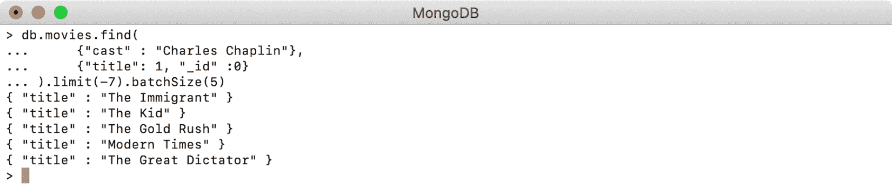

图 4.39：限值为-7 且批量为 5 时的输出

输出表明查询只返回前五条记录，而不是预期的七条记录。这是因为数据库仅返回第一批，而未处理下一批。

这证明了负极限并不完全等同于以正形式提供数字。如果查询返回的记录数小于指定的批大小，则结果将相同。一般来说，应该避免使用负限制，但如果使用负限制，请确保使用适当的批处理大小，以便避免此类情况。

## 跳过文档

跳过用于排除结果集中的某些文档并返回其余文档。MongoDB 游标提供了**skip（）**函数，该函数接受一个整数，并从游标中跳过指定数量的文档，返回其余的文档。在前面的示例中，您准备了查询以查找查尔斯·卓别林主演的电影的标题。以下示例使用与**skip（）**函数相同的查询：

```js
db.movies.find(
    {"cast" : "Charles Chaplin"}, 
    {"title": 1, "_id" :0}
).skip(2)
```

由于**skip（）**函数已提供值**2**，因此前两张单据将被排除在输出之外，如下图所示：


图 4.40：跳过值为 2 的输出

与**limit（）**类似，将零传递给**skip（）**相当于根本不调用该函数，并返回整个结果集。然而，**skip（）**对于负数有不同的行为；它不允许使用负数。因此，以下查询无效：

```js
db.movies.find(
    {"cast" : "Charles Chaplin"}, 
    {"title": 1, "_id" :0}
).skip(-3)
```

执行此查询时，将出现错误，如以下屏幕截图所示：

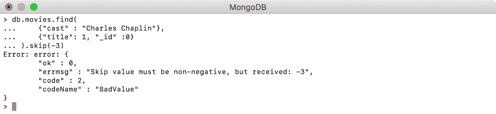

图 4.41：跳过值为-3 的输出

**skip（）**操作没有使用任何索引，因此它在较小的集合上运行良好，但在较大的集合上可能会明显滞后。我们将在*第 9 章*、*性能*中详细介绍索引主题。

## 文件分拣

排序用于按指定顺序返回文档。如果不使用显式排序，MongoDB 不保证返回文档的顺序，即使同一查询执行了两次，也可能会有所不同。具有特定的排序顺序非常重要，尤其是在分页期间。在分页期间，我们使用指定的限制和服务执行查询。对于下一个查询，将跳过以前的记录，并返回下一个限制。在此过程中，如果记录的顺序发生变化，一些电影可能会出现在多个页面上，而一些电影可能根本不会出现。

MongoDB 游标提供了一个**sort（）**函数，该函数接受文档类型的参数，其中文档定义了特定字段的排序顺序。请参阅以下查询，该查询使用排序选项打印查尔斯·卓别林的电影标题：

```js
db.movies.find(
    {"cast" : "Charles Chaplin"}, 
    {"title" : 1, "_id" :0}
).sort({"title" : 1})
```

在前面的查询中，您正在对结果游标调用**sort（）**函数。函数的参数是一个文档，**标题**字段的值为**1**。这指定给定字段应按升序排序。在排序后执行查询时，结果很明显，如下所示：

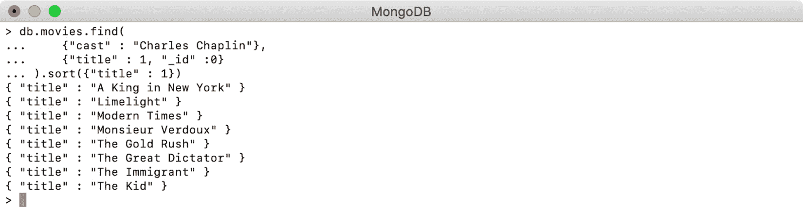

图 4.42：按升序排序

现在，将**-1**传递给**sort**参数，该参数表示按降序排序：

```js
db.movies.find(
    {"cast" : "Charles Chaplin"}, 
    {"title" : 1, "_id" :0}
).sort({"title" : -1})
```

其输出如下所示：

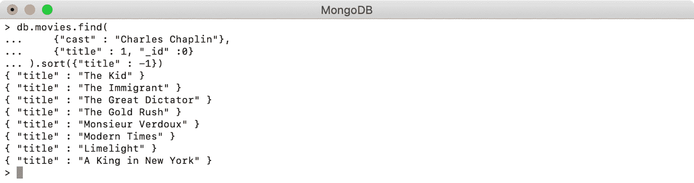

图 4.43：按降序排序

可以对多个字段执行排序，每个字段可以有不同的排序顺序。让我们看一个例子，它按降序排列电影的 IMDb 评级，并按升序排列年份。查询应返回 50 部电影，其中 IMDb 评级最高的电影出现在顶部。如果两部电影的收视率相同，则应以老电影为准。以下查询可用于实现此功能：

```js
db.movies.find()
    .limit(50)
    .sort({"imdb.rating": -1, "year" : 1})
```

在结束本节之前，值得注意的是，除正整数或负整数以外的任何数字（包括零）在 MongoDB 中被视为无效排序。如果使用该值，则查询失败，我们会看到消息**“坏排序规范错误”**，如下所示：

```js
Error: error: {
        "ok" : 0,
        "errmsg" : "bad sort specification",
        "code" : 2,
        "codeName" : "BadValue"
}
```

在下一个活动中，我们将使用本章所学的所有知识为基于类型的电影搜索实现分页。

## 活动 4.01：按类型和分页结果查找电影

您的组织正计划向其用户提供一项新功能，用户可以在其中找到他们喜欢的类型的电影。由于电影数据库非常庞大，每种类型都有很多电影，返回所有匹配的电影标题不是很有用。要求将结果分成小块提供。

此活动的任务是在 mongo shell 上创建 JavaScript 函数。该功能应接受用户选择的类型，并打印所有匹配的标题，其中 IMDb 评级最高的标题应显示在顶部。除了流派之外，该函数还将接受另外两个参数，即页面大小和页码。页面大小定义一页上需要显示多少条记录，而页码指示用户当前所在的页面。以下步骤将帮助您完成此活动：

1.  编写一个接受三个参数的**FindMoviesByGene**函数：**流派**、**页码**和**页面大小**：

    ```js
       var findMoviesByGenre = function(genre, pageNumber, pageSize){
          …
       }
    ```

2.  编写一个查询，根据**体裁**过滤结果并返回标题。
3.  对结果进行排序，以在顶部显示收视率最高的电影。
4.  使用**pageNumber**和**pageSize**参数跳过和限制结果的逻辑。
5.  使用**toArray（）**方法将结果光标转换为数组。
6.  迭代生成的数组并打印所有标题。
7.  通过复制并粘贴到 shell 中并执行，在 mongo shell 中创建函数。

考虑用户提供的体裁是动作 T1。在这里，如以下输出所示，将执行该函数并显示结果的第一页，其中显示了前五部动作电影：


图 4.44：显示前五大动作电影的第一页

类似地，以下输出显示返回五部动作电影的第二页的函数：


图 4.45：动作片第二页

笔记

此活动的解决方案可通过[此链接](14.html#_idTextAnchor467)找到。

# 总结

本章开始时，我们详细研究了 MongoDB 查询的结构以及它们与 SQL 查询的区别。然后，我们使用各种示例实现这些查询以查找和统计文档，并限制结果中返回的字段数。我们还学习了各种条件运算符和逻辑运算符，并练习将它们组合使用以注意结果的差异。

然后，我们学习了如何使用正则表达式提供文本模式来过滤搜索结果，并介绍了如何查询数组和嵌套对象，以及如何在结果中包含它们的特定字段。最后，我们学习了如何通过对结果中的文档进行限制、排序和跳过来对大型结果集进行分页。

在下一章中，我们将学习如何插入、更新和删除 MongoDB 集合中的文档。****