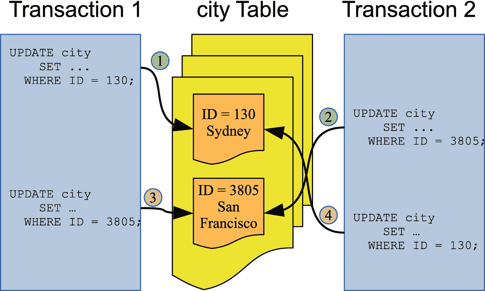
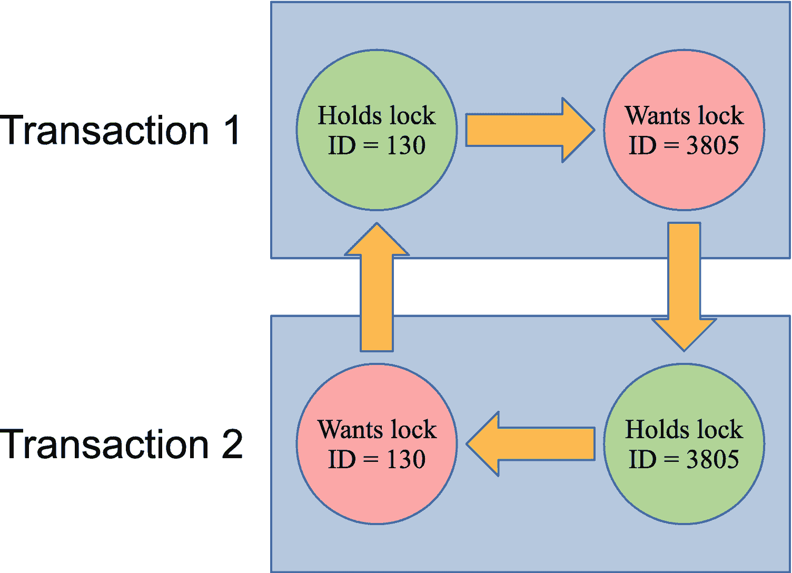

# 八、处理锁冲突

锁的整体思想是限制对对象或记录的访问，以避免冲突的操作，从而以安全的方式同时访问对象或记录。这意味着，有时锁不能被授予。那种情况下会发生什么？这取决于请求的锁和环境。元数据(包括显式请求的表锁)和 InnoDB 锁在超时的情况下运行，对于某些锁情况，存在显式死锁检测。

使用数据库时，无法获得锁是不可避免的，理解这一点很重要。原则上，您可以使用非常粗粒度的锁并避免失败的锁，除非超时——这就是 MyISAM 存储引擎在写入并发性非常差的情况下所做的事情。然而，在实践中，为了允许写工作负载的高并发性，优选细粒度锁，这也引入了死锁的可能性。

结论是，您应该始终让您的应用准备好重试获取锁或优雅地失败。无论是显式锁还是隐式锁，这都适用。

Tip

总是准备好处理失败以获得锁。无法获得锁并不是一个灾难性的错误，通常不应该被认为是一个 bug。也就是说，正如第 [9](09.html) 章“减少锁定问题”中所讨论的，在开发应用时，有一些减少锁争用的技术值得考虑。

本章的其余部分将讨论当有多个对同一数据锁的请求时，InnoDB 如何选择哪个事务应该首先被授予锁请求，InnoDB 数据锁的兼容性，以及表级超时、记录级超时、InnoDB 死锁、InnoDB 互斥和信号量等待的细节。

## 竞争感知事务调度(CATS)

当对同一个锁有多个请求时，一个重要的决策是决定应该以什么顺序授予锁。最简单的解决方案，也是数据库中最常用的解决方案，是维护一个队列，并根据先进先出(FIFO)原则来处理请求。这也是 MySQL 5.7 及更早版本中锁的授予方式；然而在 MySQL 8 中，实现了一个新的调度算法。

新的实现基于竞争感知事务调度(CATS)算法，该算法由密歇根大学的巴尔赞·莫扎法里教授的团队开发，并由桑尼·贝恩斯与莫扎法里教授的团队(尤其是黄嘉敏)合作在 MySQL 中实现。

Tip

如果你想了解更多关于 CATS 算法的知识，那么 [`https://mysqlserverteam.com/contention-aware-transaction-scheduling-arriving-in-innodb-to-boost-performance/`](https://mysqlserverteam.com/contention-aware-transaction-scheduling-arriving-in-innodb-to-boost-performance/) 是一个很好的起点，评论中有两篇研究论文的链接——主要论文是 [`http://web.eecs.umich.edu/~mozafari/php/data/uploads/pvldb_2018_sched.pdf`](http://web.eecs.umich.edu/%257Emozafari/php/data/uploads/pvldb_2018_sched.pdf) 。另一个来源是参考手册中的 [`https://dev.mysql.com/doc/refman/en/innodb-transaction-scheduling.html`](https://dev.mysql.com/doc/refman/en/innodb-transaction-scheduling.html) 。

CATS 算法的工作原理是，已经持有大量锁的事务对于完成最重要，因此为了所有事务的利益，可以尽快释放它们的锁。这种方法的一个潜在缺点是，如果不断有具有许多现有锁的事务等待给定的锁，那么它们可能会使具有很少锁的事务永远得不到锁。为了防止这种情况，算法有防止饥饿的安全措施。这种保护的工作方式是在当前锁请求队列的末尾添加一个屏障，在屏障前面的所有请求都得到处理，然后再考虑后面到达的请求。

CATS 算法的主要优点是在高并发工作负载下，直到 MySQL 8.0.20，它只在 InnoDB 检测到大量锁争用时使用。在 8.0.20 中对算法进行了改进，提高了可扩展性，在`information_schema.INNODB_TRX`中增加了`trx_schedule_weight`列，这样就可以根据 CATS 算法查询一个处于`LOCK WAIT`状态的事务当前拥有的权重。与此同时，它被改变了，所以 CATS 算法总是被使用，FIFO 算法已经退休。

## InnoDB 数据锁兼容性

记住，在讨论锁访问级别兼容性时，规则相对简单。然而，确定两个 InnoDB 数据锁是否相互兼容是非常复杂的。这变得特别有趣，因为这种关系是不对称的，也就是说，一个锁可以在另一个锁存在时被允许，但反之则不行。例如，插入意图锁必须等待间隙锁，但是间隙锁不必等待插入意图锁。另一个例子(缺乏传递性)是间隙加记录锁必须等待仅记录锁，插入意图锁必须等待间隙加记录锁，但是插入意图锁不需要等待仅记录锁。

这对你意味着什么？这意味着当您调查锁争用问题时，您需要意识到锁的顺序非常重要，因此在重现该问题时，所有锁必须以相同的顺序获得。

关于 InnoDB 算法处理锁争用背后的理论以及可能导致锁不被授予的原因已经讲得够多了。当锁不能被授予时会发生什么是下一个要讨论的主题。

## 元数据和备份锁等待超时

当您请求刷新、元数据或备份锁时，获取锁的尝试将在`lock_wait_timeout`秒后超时。默认超时为 31，536，000 秒(365 天)。您可以在全局和会话范围内动态设置`lock_wait_timeout`选项，这允许您根据给定流程的特定需求调整超时。

当超时发生时，语句失败，出现一个`ER_LOCK_WAIT_TIMEOUT`(错误号 1205)错误，如清单 [8-1](#PC1) 所示。

```sql
-- Connection   Processlist ID   Thread ID   Event ID
-- --------------------------------------------------
--          1              647        1075          6
--          2              648        1076          6

-- Connection 1
Connection 1> LOCK TABLES world.city WRITE;
Query OK, 0 rows affected (0.0015 sec)

-- Connection 2
Connection 2> SET SESSION lock_wait_timeout = 5;
Query OK, 0 rows affected (0.0003 sec)

Connection 2> LOCK TABLES world.city WRITE;
ERROR: 1205: Lock wait timeout exceeded; try restarting transaction

-- Connection 1
Connection 1> UNLOCK TABLES;
Query OK, 0 rows affected (0.0003 sec)

Listing 8-1Lock wait timeout for table lock request

```

`lock_wait_timeout`的会话值设置为 5 秒，以减少连接 2 在试图获取`world.city`表上的写锁时阻塞的时间。等待 5 秒钟后，返回错误，错误号设置为 1205。

`lock_wait_timeout`选项的推荐设置取决于应用的要求。使用较小的值来防止锁请求长时间阻塞其他查询可能是一个优势。这通常需要您实现对锁请求失败的处理，例如，通过重试该语句。另一方面，较大的值有助于避免重试该语句。

对于`FLUSH TABLES`语句，还要记住它与低级表定义缓存(TDC)版本锁交互，这可能意味着放弃该语句不允许后续查询继续进行。在这种情况下，`lock_wait_timeout`的值越大越好，这样可以更清楚地了解锁的关系。

## InnoDB 锁等待超时

当查询请求 InnoDB 中的记录级锁时，它会超时，类似于刷新、元数据和备份锁的超时。由于记录级锁争用比表级锁争用更常见，并且记录级锁增加了死锁的可能性，因此超时默认为 50 秒。它可以使用`innodb_lock_wait_timeout`选项进行设置，该选项可以针对全局和会话范围进行设置。

当超时发生时，查询失败，并出现`ER_LOCK_WAIT_TIMEOUT`错误(错误号 1205 ),就像表级锁超时一样。清单 [8-2](#PC2) 展示了一个发生 InnoDB 锁等待超时的例子。

```sql
-- Connection   Processlist ID   Thread ID   Event ID
-- --------------------------------------------------
--          1              656        1087          6
--          2              657        1088          6

-- Connection 1
Connection 1> START TRANSACTION;
Query OK, 0 rows affected (0.0002 sec)

Connection 1> UPDATE world.city
                 SET Population = Population + 1
               WHERE ID = 130;
Query OK, 1 row affected (0.0006 sec)

Rows matched: 1  Changed: 1  Warnings: 0

-- Connection 2
Connection 2> SET SESSION innodb_lock_wait_timeout = 3;
Query OK, 0 rows affected (0.2621 sec)

Connection 2> UPDATE world.city
                 SET Population = Population + 1
               WHERE ID = 130;
ERROR: 1205: Lock wait timeout exceeded; try restarting transaction

-- Connection 1
Connection 1> ROLLBACK;
Query OK, 0 rows affected (0.0751 sec)

Listing 8-2Example of an InnoDB lock wait timeout

```

在本例中，连接 2 的锁等待超时设置为 3 秒，因此没有必要等待通常的 50 秒超时。

当超时发生时，`innodb_rollback_on_timeout`选项定义了事务完成的工作有多少被回滚。当`innodb_rollback_on_timeout`被禁用时(默认)，只有触发超时的语句被回滚。启用该选项后，整个事务将回滚。`innodb_rollback_on_timeout`选项只能在全局级别配置，并且需要重启才能更改值。

Caution

处理锁等待超时是非常重要的，否则它可能会使事务带有未释放的锁。如果发生这种情况，其他事务可能无法获得它们需要的锁。因此，您需要确保重试事务的剩余部分，显式回滚事务，或者启用`innodb_rollback_on_timeout`在锁等待超时时自动回滚事务。

一般情况下，建议将 InnoDB 记录级锁的超时值保持在较低水平。通常，最好降低默认值 50 秒。允许查询等待锁的时间越长，其他锁请求受影响的可能性就越大，这也可能导致其他查询停止。这也使得死锁更有可能发生。如果您禁用死锁检测(接下来将讨论)，您应该为`innodb_lock_wait_timeout`使用一个非常小的值，比如 1 秒或 2 秒，因为您将使用超时来检测死锁。如果没有死锁检测，也建议启用`innodb_rollback_on_timeout`选项。

## 僵局

死锁听起来是一个非常可怕的概念，但是你不应该让这个名字吓住你。就像锁等待超时一样，死锁是高并发数据库世界中的现实。它真正的意思是锁请求之间有一个循环关系，如图 [8-1](#Fig1) 中的交通阻塞所示。解决僵局的唯一方法是强制放弃其中一个请求。从这个意义上说，死锁与锁等待超时没有什么不同。事实上，您可以禁用死锁检测，在这种情况下，其中一个锁将以锁等待超时结束。


图 8-1

交通堵塞

那么，如果不是真正需要的话，为什么会有死锁呢？因为当锁请求之间存在循环关系时会出现死锁，所以 InnoDB 可以在循环完成后立即检测到死锁。这允许 InnoDB 立即告诉用户发生了死锁，而不必等待锁等待超时。告知发生了死锁也是有用的，因为这通常提供了改进应用中数据访问的机会。因此，您应该将死锁视为朋友，而不是敌人。图 [8-2](#Fig2) 显示了两个事务查询一个导致死锁的表的例子。



图 8-2

导致死锁的两个事务的示例

在本例中，事务 1 首先用`ID = 130`更新行，然后用`ID = 3805`更新行。在此期间，事务 2 首先用`ID = 3805`更新行，然后用`ID = 130`更新行。这意味着当事务 1 试图更新`ID = 3805`时，事务 2 已经锁定了该行。事务 2 也无法继续，因为它无法锁定`ID = 130`，因为事务 1 已经持有该锁。这是一个简单死锁的典型例子。环锁关系也如图 [8-3](#Fig3) 所示。



图 8-3

导致死锁的锁的循环关系

在该图中，事务 1 和事务 2 持有哪个锁，请求哪个锁，以及如果没有干预，冲突如何永远无法解决，这一点很清楚。这使得它有资格成为一个僵局。

在现实世界中，死锁往往更加复杂。在这里讨论的例子中，只涉及到主键记录锁。一般来说，通常还包括二级钥匙、间隙锁和其他可能的锁类型。也可能涉及两个以上的事务。然而，原则是一样的。

Note

对于两个事务中的每一个，即使只有一个查询，也会发生死锁。如果一个查询按升序读取记录，而另一个按降序读取记录，则可能会出现死锁。

当死锁发生时，InnoDB 选择“工作最少”的事务成为受害者。这类似于在一些高可用性解决方案(如 MySQL NDB 集群)中使用的“射中另一个节点的头部”(STONITH)方法，只是这里是一个事务被“射中头部”您可以检查`information_schema.INNODB_TRX`视图中的`trx_weight`列，查看 InnoDB 使用的权重(完成的工作越多，权重越高)。实际上，这意味着持有最少锁的事务将被回滚。当这种情况发生时，事务中被选作牺牲品的查询失败，并返回错误`ER_LOCK_DEADLOCK`(错误代码 1213)，事务被回滚以释放尽可能多的锁。清单 [8-3](#PC3) 中显示了一个发生死锁的例子。

```sql
-- Connection   Processlist ID   Thread ID   Event ID
-- --------------------------------------------------
--          1              659        1093          6
--          2              660        1094          6

-- Connection 1
Connection 1> START TRANSACTION;
Query OK, 0 rows affected (0.0002 sec)

Connection 1> UPDATE world.city
                 SET Population = Population + 1
               WHERE ID = 130;
Query OK, 1 row affected (0.0098 sec)

Rows matched: 1  Changed: 1  Warnings: 0

-- Connection 2
Connection 2> START TRANSACTION;
Query OK, 0 rows affected (0.0003 sec)

Connection 2> UPDATE world.city
                 SET Population = Population + 1
               WHERE ID = 3805;
Query OK, 1 row affected (0.0009 sec)

Rows matched: 1  Changed: 1  Warnings: 0

Connection 2> UPDATE world.city
                 SET Population = Population + 1
               WHERE ID = 130;

-- Connection 1
Connection 1> UPDATE world.city
                 SET Population = Population + 1
               WHERE ID = 3805;
ERROR: 1213: Deadlock found when trying to get lock; try restarting transaction

-- Connection 2
Query OK, 1 row affected (0.1019 sec)

Rows matched: 1  Changed: 1  Warnings: 0

-- Connection 1
Connection 1> ROLLBACK;
Query OK, 0 rows affected (0.0002 sec)

-- Connection 2
Connection 2> ROLLBACK;
Query OK, 0 rows affected (0.0293 sec)

Listing 8-3Example of a deadlock

```

死锁甚至可以比本例中的更简单(尽管这种情况很少见，除非您显式地使用锁定`SELECT`语句或者使用`SERIALIZABLE`事务隔离级别)。清单 [8-4](#PC4) 显示了仅使用一行就发生的死锁。

```sql
-- Connection   Processlist ID   Thread ID   Event ID
-- --------------------------------------------------
--          1              663        1097          6
--          2              664        1098          6

-- Connection 1
Connection 1> START TRANSACTION;
Query OK, 0 rows affected (0.0004 sec)

Connection 1> SELECT * FROM world.city WHERE ID = 130 FOR SHARE;
+-----+--------+-------------+-----------------+------------+
| ID  | Name   | CountryCode | District        | Population |
+-----+--------+-------------+-----------------+------------+
| 130 | Sydney | AUS         | New South Wales |    3276207 |
+-----+--------+-------------+-----------------+------------+
1 row in set (0.0005 sec)

-- Connection 2
Connection 2> START TRANSACTION;
Query OK, 0 rows affected (0.0002 sec)

Connection 2> UPDATE world.city
                 SET Population = Population + 1
               WHERE ID = 130;

-- Connection 1
Connection 1> UPDATE world.city
                 SET Population = Population + 1
               WHERE ID = 130;
Query OK, 1 row affected (0.0447 sec)

Rows matched: 1  Changed: 1  Warnings: 0

-- Connection 2
ERROR: 1213: Deadlock found when trying to get lock; try restarting transaction

-- Connection 1
Connection 1> ROLLBACK;
Query OK, 0 rows affected (0.0280 sec)

-- Connection 2
Connection 2> ROLLBACK;
Query OK, 0 rows affected (0.0003 sec)

Listing 8-4A single row deadlock

```

在这种情况下，连接 2 成为死锁的受害者，而没有被授予记录锁。发生这种死锁是因为 InnoDB 当前不允许将连接 1 中的共享锁升级为独占锁的请求跳到连接 2 的锁请求之前。这是有可能实现的，但是因为这些场景相对较少，所以还没有实现。也就是说，如果您有外键，DML 语句可能会在外键关系中的另一个表上获取一个共享锁(另请参见第 [10 章](10.html))，因此，如果同一事务中的后续语句试图升级该共享锁，那么您会看到与本例中相同类型的死锁。

在大多数情况下，自动死锁检测对于避免查询延迟过长时间是非常有用的。不过死锁检测不是免费的。对于具有非常高的查询并发性的 MySQL 实例，查找死锁的成本会变得很高，您最好禁用死锁检测，这是通过将`innodb_deadlock_detect`选项设置为`OFF`来完成的。也就是说，在 MySQL 8.0.18 和更高版本中，死锁检测被移到了一个专用的后台线程中，从而提高了性能。

如果禁用死锁检测，建议将`innodb_lock_wait_timeout`设置为一个非常低的值，比如 1 秒，以快速检测锁争用。此外，启用`innodb_rollback_on_timeout`选项以确保锁被释放。

最后一种锁冲突处理发生在 InnoDB 互斥体和信号量中。

## InnoDB 互斥和信号量等待

当 InnoDB 请求一个互斥或 rw 锁信号量并且不能立即获得时，它将不得不等待。因为等待发生在比数据锁更低的级别，InnoDB 将在等待时采用两种方法中的一种。它可以进入一个循环并轮询锁是否可用，或者它可以挂起线程并使其可用于其他任务。

轮询允许更快地获得锁，但它会使 CPU 线程忙碌，并且轮询会导致其他线程的 CPU 缓存失效。有三个配置选项可用于控制行为:

*   `innodb_spin_wait_delay` **:** 轮询时，InnoDB 会计算一个介于零和`innodb_spin_wait_delay`之间的随机数。这与`innodb_spin_wait_pause_multiplier`相乘，以确定轮询循环中出现的`PAUSE`指令的数量。`PAUSE`事件的随机数用于降低缓存失效的影响。较小的值(甚至 0)可能会对具有单个共享 fast CPU 缓存的系统有所帮助。较大的值可以降低缓存失效的影响，尤其是在多 CPU 系统上。

*   `innodb_spin_wait_pause_multiplier` **:** 与旋转等待延迟一起使用的乘数。这个选项是 MySQL 8.0.16 中新增的，是为了适应 Skylake 一代处理器中引入的`PAUSE`指令的持续时间的变化而引入的。更改该值的主要用途是在与 Skylake 之前的 x86/x86-64 相比，`PAUSE`指令持续时间不同的架构上使用 MySQL。在早期版本中，乘数被硬编码为 50，这也是`innodb_spin_wait_pause_multiplier`的默认值。

*   `innodb_sync_spin_loops` **:** 暂停线程前要执行的旋转循环次数。该值越低，CPU 线程可用于其他任务的速度就越快，代价是更多的上下文切换。当超过自旋循环时，操作系统等待 rw 锁计数器递增。该值越高，获得锁的速度就越快，但代价是 CPU 使用率更高。默认值为 30。

您很少需要调整这些设置；然而，在极少数情况下，它们可以在某种程度上提高性能。也就是说，如果您使用的不是最新的 MySQL 版本，升级比调整这些选项更能减少互斥/信号量争用。在所有情况下，如果您决定更改这些设置，请确保在与您的生产系统相同的体系结构和硬件配置上彻底测试性能，并且工作负载能够很好地代表您的生产工作负载。

如果不能立即获得 InnoDB 互斥或 rw 锁信号量等待，InnoDB 也会在内部注册。通过`SHOW ENGINE INNODB MUTEX`显示的相关计数器将增加(虽然只显示至少有一个操作系统等待的互斥体和读写锁)，如果您在等待过程中生成 InnoDB monitor 报告，它将包含在报告的`SEMAPHORES`等待部分。如果等待持续超过 240 秒而没有检测到进度，InnoDB 将自动启用 InnoDB 监控器并将输出写入错误日志，以便您可以调查问题。如果在接下来的 600 秒内没有检测到任何进展，InnoDB 将关闭 MySQL 作为预防措施，因为它假设出现了无法解决的情况。在这种情况下，您将看到一个解释关闭原因的错误，例如(是的，打印的持续时间有些误导，因为它是自 240 秒触发“长信号量等待”条件以来的时间)

```sql
2020-07-05T09:30:24.151782Z 0 [ERROR] [MY-012872] [InnoDB] Semaphore wait has lasted > 600 seconds. We intentionally crash the server because it appears to be hung.

```

通过使服务器崩溃，InnoDB 确保了如果遇到 InnoDB 内部的错误，情况会得到解决，但代价是 MySQL 将不得不重新启动并进行崩溃恢复。由于这个原因，它被认为是最后的手段，目前，超时是不可配置的。

Note

执行`CHECK TABLE`时，超时阈值增加到 7200 秒(2 小时)。

像这样的关机通常有两个原因:

*   有一个硬件或操作系统问题阻碍了 InnoDB 的进展。

*   InnoDB 中有一个错误，例如，检测不到缓慢操作的进度，或者在获取互斥体或信号量时出现死锁。

如果您遇到类似这样的关闭，请从错误日志中的 InnoDB monitor 输出中验证发生等待的位置。在某些情况下，您可以使用线程 id 来确定哪个查询导致了等待。您还应该检查系统日志，以验证硬件的健康状况，以及是否有任何操作系统级别的问题迹象。

## 摘要

本章概述了当不能立即获得锁时会发生什么。首先，描述了竞争感知事务调度(CATS)算法。这在 MySQL 8 中使用，允许已经持有许多锁的事务更快地获得锁请求，因此它们的锁也可以更快地再次释放。

其次，讨论了 InnoDB 数据锁的兼容性是一个非常复杂的问题，这意味着在试图重现问题时必须考虑锁的顺序。

本章的其余部分介绍了元数据、备份、InnoDB 锁等待超时、死锁、InnoDB 互斥和 rw 锁信号量等待。锁等待和死锁在高并发系统中是自然发生的，它们本身不应该成为警报的原因。主要问题是它们何时变得频繁。默认的锁等待超时也可能太长，因此减少它们并处理超时可能是一个选项。

现在您已经了解了锁是如何工作的，以及锁请求是如何失败的，您需要考虑如何减少锁定的影响，这是下一章的主题。