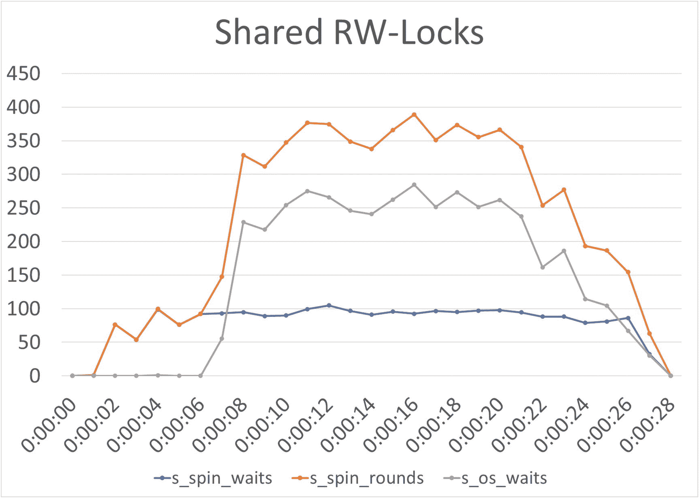
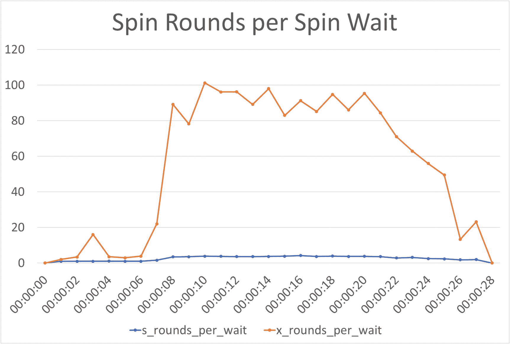
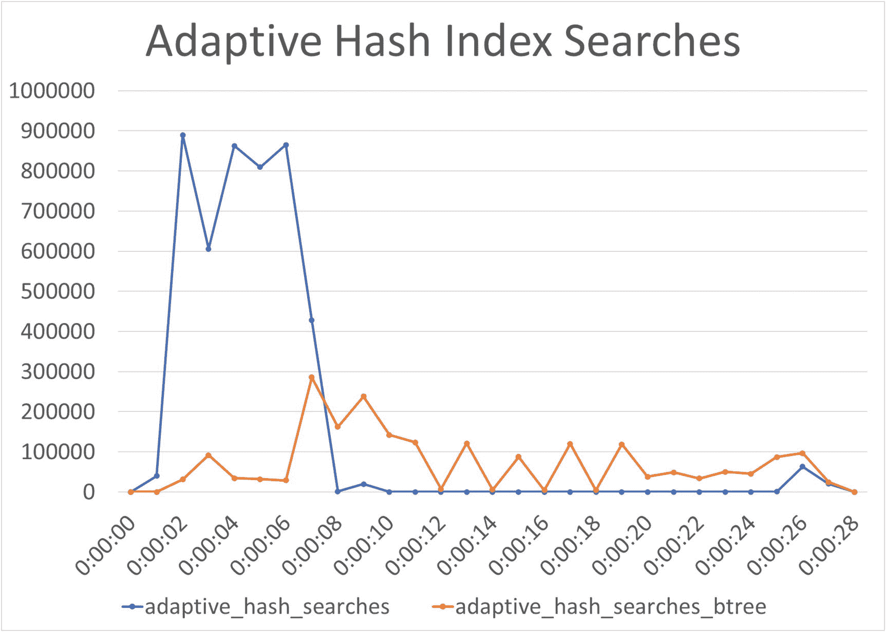

# 十八、案例研究：信号量

互斥和信号量争用是您可能遇到的最难以捉摸的争用类型之一，因为除了极端情况，您不会直接注意到任何问题。相反，这种争用往往会导致整体延迟增加和吞吐量降低，很难确定具体原因。然后，出乎意料的是，您可能已经超过了一个负载阈值，这种争用导致您的服务器突然停止工作。

本章通过一个案例来研究自适应散列索引 rw-semaphore 上的争用。但是，请注意，信号量争用根据发生争用的互斥体或信号量的不同而不同，解决它所需的调查也不同。在高严重性的情况下，您可能还会发现多个信号量等待同时发生争用。

## 症状

注意到 InnoDB 互斥体或信号量存在争用的两种最常见的方法是通过 InnoDB monitor 和`innodb_rwlock_%` InnoDB metrics。

例如，在 InnoDB monitor 输出中，您会在靠近输出顶部的`SEMAPHORES`部分看到正在进行的等待

```sql
----------
SEMAPHORES
----------
OS WAIT ARRAY INFO: reservation count 77606
--Thread 19304 has waited at btr0sea.ic line 122 for 0 seconds the semaphore:
S-lock on RW-latch at 00000215E6DC12F8 created in file btr0sea.cc line 202
a writer (thread id 11100) has reserved it in mode exclusive
number of readers 0, waiters flag 1, lock_word: 0
Last time read locked in file btr0sea.ic line 122
Last time write locked in file G:\ade\build\sb_0-39697839-1592332179.68\mysql-8.0.21\storage\innobase\btr\btr0sea.cc line 1197
--Thread 26128 has waited at btr0sea.ic line 92 for 0 seconds the semaphore:
X-lock on RW-latch at 00000215E6DC12F8 created in file btr0sea.cc line 202
a writer (thread id 11100) has reserved it in mode exclusive
number of readers 0, waiters flag 1, lock_word: 0
Last time read locked in file btr0sea.ic line 122
Last time write locked in file G:\ade\build\sb_0-39697839-1592332179.68\mysql-8.0.21\storage\innobase\btr\btr0sea.cc line 1197
OS WAIT ARRAY INFO: signal count 93040
RW-shared spins 18200, rounds 38449, OS waits 20044
RW-excl spins 22345, rounds 1121445, OS waits 38469
RW-sx spins 3684, rounds 100410, OS waits 2886
Spin rounds per wait: 2.11 RW-shared, 50.19 RW-excl, 27.26 RW-sx

```

等待的时间越长，问题就越严重。

您可能还会在监控中注意到，rw-lock 等待的次数很高，在高负载时可能会达到峰值。在一个真实的例子中，自适应散列索引存在严重的争用，在很长一段时间内，每秒钟有数万次操作系统等待。

## 原因

问题是对共享资源的请求，比如对自适应散列索引的访问，到达的速度比它们能够被处理的速度要快。这些资源在源代码中使用互斥锁和读写锁进行保护。争用表明要么您已经达到了您的工作负载所使用的 MySQL 版本的并发限制，要么您需要将资源分成更多的部分或类似的部分。

## 设置

随意再现信号量争用可能很难做到。系统中可用的 CPU 越多，就越有可能产生遇到信号量等待的工作负载。

本章讨论的输出是在带有八个 CPU 的笔记本电脑上使用`Listing` [`8-1`](08.html#PC1) 工作负载生成的，缓冲池的默认大小设置为 128 MiB。如果您试图重现这种情况，那么您可能需要试验连接的数量。该脚本提示您将这些默认设置为 1 个读写线程，并将每个剩余 CPU 的一个连接用于只读连接。

Note

MySQL Shell 的会话对象并不完全是线程安全的，即使每个线程都有自己的会话。因此，有必要尝试几次测试。该问题在具有多个读写连接的 Microsoft Windows 上尤其明显。

您还可以尝试更改缓冲池的大小。还有一个选项是在提交事务时减少刷新，如果您的磁盘刷新性能较差，这尤其有用:

```sql
SET GLOBAL innodb_flush_log_at_trx_commit = 0,
    GLOBAL sync_binlog = 0;

```

Caution

减少刷新在测试系统上是没问题的，但是您不应该在生产系统上这样做，因为您可能会在崩溃的情况下丢失提交的事务。

运行更长时间也可以增加至少看到一次争用的机会。

测试还允许您在测试之前请求重新启动 MySQL，并且您可以选择是否删除测试创建的索引。重新启动 MySQL 可以让您看到从一个冷的 InnoDB 缓冲池开始的区别(尽管工作负载确实会自己预热缓冲池)。

Note

从测试中重新启动 MySQL 只有在您已经在管理进程下启动 MySQL 的情况下才有效。例如，当您在 Microsoft Windows 上使用`mysqld_safe`或在 Linux 上通过`systemd`将 MySQL 作为一项服务启动时，就会发生这种情况。

如果您想要多次运行测试，告诉测试不要删除它的索引可能是一个优势，因为这允许测试在下一次执行时跳过创建。

清单 [18-1](#PC3) 中显示了一个执行测试用例的例子。执行的完整输出包含在文件`listing_18-1.txt`中，该文件可从本书的 GitHub 存储库中获得。

```sql
Specify the number of read-write connections (0-31) [1]:
Specify the number of read-only connections (1-31) [7]:
Specify the number of seconds to run for (1-3600) [10]:
Restart MySQL before executing the test? (Y|Yes|N|No) [No]:
Delete the test specific indexes after executing the test? (Y|Yes|N|No) [Yes]:

2020-07-25 15:56:33.928772  0 [INFO] Adding 1 index to the dept_emp table
2020-07-25 15:56:43.238872  0 [INFO] Adding 1 index to the employees table
2020-07-25 15:56:54.202735  0 [INFO] Adding 1 index to the salaries table
2020-07-25 15:57:47.050114  0 [INFO] Warming up the InnoDB buffer pool.
2020-07-25 15:58:04.543354  0 [INFO] Waiting 2 seconds to let the monitoring collect some information before starting the test.
2020-07-25 15:58:06.544765  0 [INFO] Starting the work connections.
2020-07-25 15:58:07.556126  0 [INFO] Completed  10%
…

-- Total mutex and rw-semaphore waits during test:
+----------------+-------+
| File:Line      | Waits |
+----------------+-------+
| btr0sea.cc:202 | 13368 |
+----------------+-------+

-- Total execution time: 25.685603 seconds

2020-07-25 15:58:34.374196  0 [INFO] Dropping indexes on the dept_emp table.
2020-07-25 15:58:35.651209  0 [INFO] Dropping indexes on the employees table.
2020-07-25 15:58:36.344171  0 [INFO] Dropping indexes on the salaries table.

Listing 18-1Semaphore waits

```

注意，在这个例子的开始，有五个关于如何运行测试的信息提示。

当测试重现该问题时，您将从 InnoDB monitor 输出中看到一个或多个`SEMAPHORES`部分的输出，最后会生成一些诊断数据。这些数据包括

*   测试期间每秒收集的 RW-lock 指标。这是以 CSV 格式打印的，因此您可以将其复制到电子表格中并绘制出来。

*   测试期间每秒收集的自适应哈希索引指标。这也是以 CSV 格式打印的。

*   InnoDB 缓冲池中的总页数以及年轻或不年轻的比率。

*   测试结束时的`INSERT BUFFER AND ADAPTIVE HASH INDEX`部分。

*   测试期间互斥和 rw 信号量等待的总数。

只读工作负载由`employees`数据库中三个表之间的连接组成，其中包括大量的二级索引查找:

```sql
SELECT dept_name, MIN(salary) min_salary,
       AVG(salary) AS avg_salary, MAX(salary) AS max_salary
  FROM employees.departments
       INNER JOIN employees.dept_emp USING (dept_no)
       INNER JOIN employees.salaries USING (emp_no)
 WHERE dept_emp.to_date = '9999-01-01'
       AND salaries.to_date = '9999-01-01'
 GROUP BY dept_no
 ORDER BY dept_name;

```

读写工作负载从`employees.employees`表中随机选择一个姓氏，并给所有姓该姓氏的员工加薪。对于占位符，步骤如下

```sql
SELECT last_name
  FROM employees.employees
 WHERE emp_no = ?;

SELECT emp_no, salary, from_date + INTERVAL 1 DAY
  FROM employees.employees
       INNER JOIN employees.salaries USING (emp_no)
 WHERE employees.last_name = ?
       AND to_date = '9999-01-01';

# For each employee found in the previous query,
# execute the insert and update:
INSERT INTO employees.salaries
VALUES (?, ?, ?, '9999-01-01');

UPDATE employees.salaries
   SET to_date = ?
 WHERE emp_no = ? AND to_date = '9999-01-01';

```

这意味着`employees`数据库中的数据被修改。您不需要在每次测试之间重新加载数据，但是如果您希望返回原始数据，您可能希望在完成测试后重置它。

表中添加了三个索引，以确保存在导致争用的必要辅助索引(请记住，自适应散列索引仅用于辅助索引):

```sql
ALTER TABLE employees.dept_emp
  ADD INDEX idx_concurrency_book_0 (dept_no, to_date);

ALTER TABLE employees.employees
  ADD INDEX idx_concurrency_book_1 (last_name, first_name);

ALTER TABLE employees.salaries
  ADD INDEX idx_concurrency_book_2 (emp_no, to_date, salary);

```

除非您请求保留索引，否则在测试结束时会再次删除索引。

最后，为了避免在测试期间过早驱逐读入缓冲池的页面，在测试期间，旧块时间被设置为 0:

```sql
SET GLOBAL innodb_old_blocks_time = 0;

```

这有助于将缓冲池置于比其他情况下更高的压力之下，从而更有可能再现争用。测试结束时，变量被设置回 1000(默认值)。

Note

测试将花费比您指定的运行时间更长的时间，因为运行时间只在每个查询循环开始时检查。因此，循环中所有挂起的查询都将完成。

现在已经确定了导致问题的工作负载，是时候开始调查了。

## 调查

当您遇到信号量争用时，第一个访问的端口通常是您的监控系统，在那里您可以获得争用的概况。虽然您可以自己查询指标，但是信号量等待往往是波动的，您很可能会在没有争用的时段看到问题，并且只在最繁忙的时段或执行特定工作负载时看到问题。通过查看图表中的指标，可以更容易地确定何时发生争用。

本节讨论如何监控`innodb_rwlock_%`指标、InnoDB 监控器的`SEMAPHORES`部分、InnoDB 互斥监控器，以及如何确定工作负载。

### InnoDB 读写锁指标

一种选择是从查看来自`information_schema.INNODB_METRICS`或`sys.metrics`的`innodb_rwlock_%`指标开始调查。有三组指标:共享、共享独占和独占读写锁。每个组有三个指标:旋转等待数、旋转轮数和操作系统等待数。测试结束时的 CSV 输出包括共享组和独占组的指标。(本研究对共享独占读写锁不感兴趣。)图 [18-1](#Fig1) 显示了一个共享读写锁的度量标准示例，该示例在 x 轴上绘制了进入测试的时间。



图 18-1

共享读写锁的等待和旋转次数

在这里，旋转等待的次数在测试过程中几乎是恒定的，但是旋转循环的次数(图中的顶线)在测试进行到大约 7 秒时显著增加。这也会导致操作系统等待的次数增加。操作系统等待跳转意味着旋转等待的旋转圈数超过`innodb_sync_spin_loops`(默认为 30)。

专用 rw 锁的图片与此类似，只是旋转圈数要高得多，如图 [18-2](#Fig2) 所示。


图 18-2

独占读写锁的等待和旋转次数

虽然很难看出，因为旋转轮的数量使旋转和操作系统等待相形见绌，但它们确实遵循与共享读写锁相同的模式，等待的绝对数量大约是共享锁的两倍。引起关注的等待次数取决于您的工作负载，您的并发查询越多，通常等待次数就越多。您应该特别注意操作系统等待，因为当等待时间太长以至于线程被挂起时，操作系统等待会增加。

### InnoDB 监控器和互斥监控器

当您确定发生争用的时间后，您需要确定争用是针对哪个读写锁(可能有多个读写锁)。有两个主要工具可以确定发生争用的位置，其中第一个工具是 InnoDB monitor。除非您已经启用了它，所以它会自动输出到错误日志，或者争用非常严重，以至于信号量等待时间超过了 240 秒，否则您需要在遇到争用时捕获您的系统。清单 [18-2](#PC8) 显示了测试中 InnoDB 监控器输出的`SEMAPHORES`部分的示例。

```sql
mysql> SHOW ENGINE INNODB STATUS\G
...
----------
SEMAPHORES
----------
OS WAIT ARRAY INFO: reservation count 36040
--Thread 35592 has waited at btr0sea.ic line 92 for 0 seconds the semaphore:
X-lock on RW-latch at 000001BD277CCFF8 created in file btr0sea.cc line 202
a writer (thread id 25492) has reserved it in mode exclusive
number of readers 0, waiters flag 1, lock_word: 0
Last time read locked in file btr0sea.ic line 122
Last time write locked in file G:\ade\build\sb_0-39697839-1592332179.68\mysql-8.0.21\storage\innobase\include\btr0sea.ic line 92
--Thread 27836 has waited at btr0sea.ic line 92 for 0 seconds the semaphore:
X-lock on RW-latch at 000001BD277CCFF8 created in file btr0sea.cc line 202
a writer (thread id 25492) has reserved it in mode exclusive
number of readers 0, waiters flag 1, lock_word: 0
Last time read locked in file btr0sea.ic line 122
Last time write locked in file G:\ade\build\sb_0-39697839-1592332179.68\mysql-8.0.21\storage\innobase\include\btr0sea.ic line 92
--Thread 25132 has waited at btr0sea.ic line 92 for 0 seconds the semaphore:
X-lock on RW-latch at 000001BD277CCFF8 created in file btr0sea.cc line 202
a writer (thread id 25492) has reserved it in mode exclusive
number of readers 0, waiters flag 1, lock_word: 0
Last time read locked in file btr0sea.ic line 122
Last time write locked in file G:\ade\build\sb_0-39697839-1592332179.68\mysql-8.0.21\storage\innobase\include\btr0sea.ic line 92
--Thread 22512 has waited at btr0sea.ic line 92 for 0 seconds the semaphore:
X-lock on RW-latch at 000001BD277CCFF8 created in file btr0sea.cc line 202
a writer (thread id 25492) has reserved it in mode exclusive
number of readers 0, waiters flag 1, lock_word: 0
Last time read locked in file btr0sea.ic line 122
Last time write locked in file G:\ade\build\sb_0-39697839-1592332179.68\mysql-8.0.21\storage\innobase\include\btr0sea.ic line 92
--Thread 22184 has waited at btr0sea.ic line 122 for 0 seconds the semaphore:
S-lock on RW-latch at 000001BD277CCFF8 created in file btr0sea.cc line 202
a writer (thread id 25492) has reserved it in mode exclusive
number of readers 0, waiters flag 1, lock_word: 0
Last time read locked in file btr0sea.ic line 122
Last time write locked in file G:\ade\build\sb_0-39697839-1592332179.68\mysql-8.0.21\storage\innobase\include\btr0sea.ic line 92
--Thread 32236 has waited at btr0sea.ic line 92 for 0 seconds the semaphore:
X-lock on RW-latch at 000001BD277CCFF8 created in file btr0sea.cc line 202
a writer (thread id 25492) has reserved it in mode exclusive
number of readers 0, waiters flag 1, lock_word: 0

Last time read locked in file btr0sea.ic line 122
Last time write locked in file G:\ade\build\sb_0-39697839-1592332179.68\mysql-8.0.21\storage\innobase\include\btr0sea.ic line 92
OS WAIT ARRAY INFO: signal count 68351
RW-shared spins 9768, rounds 21093, OS waits 11109
RW-excl spins 13012, rounds 669111, OS waits 24669
RW-sx spins 16, rounds 454, OS waits 15
Spin rounds per wait: 2.16 RW-shared, 51.42 RW-excl, 28.38 RW-sx
...

Listing 18-2The SEMAPHORES section of the InnoDB monitor

```

在这个例子中，所有的等待都是在`btr0sea.cc`的第 202 行中创建的信号量(行号可能会根据平台和 MySQL 版本的不同而不同，例如，在 Linux 上，8.0.21 的行号是 201)。如果您查看文件`storage/innobase/btr/btr0sea.cc`中 MySQL 8.0.21 的源代码，那么第 202 行的代码是

```sql
 186 /** Creates and initializes the adaptive search system at a database start.
 187 @param[in]      hash_size       hash table size. */
 188 void btr_search_sys_create(ulint hash_size) {
 189   /* Search System is divided into n parts.
 190   Each part controls access to distinct set of hash buckets from
 191   hash table through its own latch. */
 192
 193   /* Step-1: Allocate latches (1 per part). */
 194   btr_search_latches = reinterpret_cast<rw_lock_t **>(
 195       ut_malloc(sizeof(rw_lock_t *) * btr_ahi_parts, mem_key_ahi));
 196
 197   for (ulint i = 0; i < btr_ahi_parts; ++i) {
 198     btr_search_latches[i] = reinterpret_cast<rw_lock_t *>(
 199         ut_malloc(sizeof(rw_lock_t), mem_key_ahi));
 200
 201     rw_lock_create(btr_search_latch_key, btr_search_latches[i],
 202                    SYNC_SEARCH_SYS);
 203   }
 ...

```

这是自适应散列索引的代码，因此这证明了自适应散列索引就是争用的地方。(它还显示了第 201 行和第 202 行是针对同一条语句的，因此 Microsoft Windows 和 Linux 之间的行号差异在于选择语句的第一行还是最后一行作为 rw 锁的创建。)

您还可以使用互斥监控器来统计哪些锁是最常经历等待的锁。测试结束时互斥监控器的输出示例如下

```sql
mysql> SHOW ENGINE INNODB MUTEX;
+--------+----------------------------+-------------+
| Type   | Name                       | Status      |
+--------+----------------------------+-------------+
| InnoDB | rwlock: fil0fil.cc:3206    | waits=11    |
| InnoDB | rwlock: dict0dict.cc:1035  | waits=12    |
| InnoDB | rwlock: btr0sea.cc:202     | waits=7730  |
| InnoDB | rwlock: btr0sea.cc:202     | waits=934   |
| InnoDB | rwlock: btr0sea.cc:202     | waits=5445  |
| InnoDB | rwlock: btr0sea.cc:202     | waits=889   |
| InnoDB | rwlock: btr0sea.cc:202     | waits=9076  |
| InnoDB | rwlock: btr0sea.cc:202     | waits=13608 |
| InnoDB | rwlock: btr0sea.cc:202     | waits=1050  |
| InnoDB | rwlock: hash0hash.cc:171   | waits=4     |
| InnoDB | sum rwlock: buf0buf.cc:778 | waits=86    |
+--------+----------------------------+-------------+
11 rows in set (0.0008 sec)

```

如果您定期创建 mutex monitor 报告，您可以对等待进行汇总，并按文件和行号进行分组，然后监控等待发生的时间和地点的差异。(本书作者不知道有任何现成的监控解决方案可以做到这一点。)对于这个例子，测试本身计算每个文件的等待次数和行号，这将主要显示对第 202 行`btr0sea.cc`的等待(记住行号取决于确切的版本和编译器/平台):

```sql
-- Total mutex and rw-semaphore waits during test:
+----------------+-------+
| File:Line      | Waits |
+----------------+-------+
| btr0sea.cc:202 | 13368 |
+----------------+-------+

```

您将看到的最有可能的其他文件和行是`hash0hash:171`(对于 Windows 上的 8.0.21 或 Linux 上的 8.0.21 的第 170 行)，它与 InnoDB 的散列表实现相关。这表明 InnoDB monitor 输出中的信号量等待都是针对第 202 行`btr0sea.cc`的，这不是巧合。

### 确定工作量

调查的最后一步是确定导致争用的工作负载。这也是最困难的任务。最好是您有一个监控解决方案，它收集关于执行的查询的信息，并为它们聚集统计数据。通过这样的监控，您可以直接看到执行了哪些查询，这可以帮助您确定是什么导致了争用。如果您没有在争用期间执行的查询的访问监控数据，您可以尝试使用`sys.session`或带有语句信息的性能模式表(`threads`、`events_statements_current`、`events_statements_history`和`events_statements_history_long`)来监控查询。还有一个选项是使用`sys`模式中的`statement_performance_analyzer()`过程，它获取`events_statements_summary_by_digest`表的两个快照并计算差异，然后返回一个或多个报告，显示关于在两个快照之间执行的查询的信息。

Tip

`sys`模式中的`statement_performance_analyzer()`过程可以用来生成一个“穷人的查询分析器”,在两个快照之间执行查询。文档和示例见 [`https://dev.mysql.com/doc/refman/en/sys-statement-performance-analyzer.html`](https://dev.mysql.com/doc/refman/en/sys-statement-performance-analyzer.html) 。

这听起来很容易，但实际操作起来，并不那么简单。即使有良好的监控，也几乎不可能确定哪些查询是问题所在。在真实的生产系统中，峰值可能超过每秒 100000 个查询，每分钟超过 10000 个唯一查询摘要。试图找到引起这些冲突的查询组合就像大海捞针一样容易。

如果幸运的话，您可以根据满意的互斥体和信号量来猜测您正在寻找哪种查询。在这种情况下，争用的是专用于辅助索引的自适应哈希索引。因此，您知道感兴趣的查询必须使用辅助索引，并且查询执行的索引查找和索引修改次数越多，它就越有可能成为问题的一部分。在这种情况下，只读查询使用了两个辅助索引，这可以从清单 [18-3](#PC12) 所示的查询计划中看出。

```sql
EXPLAIN
 SELECT dept_name, MIN(salary) min_salary,
        AVG(salary) AS avg_salary, MAX(salary) AS max_salary
   FROM employees.departments
        INNER JOIN employees.dept_emp USING (dept_no)
        INNER JOIN employees.salaries USING (emp_no)
  WHERE dept_emp.to_date = '9999-01-01'
        AND salaries.to_date = '9999-01-01'
  GROUP BY dept_no
  ORDER BY dept_name
*************************** 1\. row ***************************
           id: 1
  select_type: SIMPLE
        table: departments
   partitions: NULL
         type: index
possible_keys: PRIMARY,dept_name
          key: PRIMARY
      key_len: 16
          ref: NULL
         rows: 9
     filtered: 100
        Extra: Using temporary; Using filesort
*************************** 2\. row ***************************
           id: 1
  select_type: SIMPLE
        table: dept_emp
   partitions: NULL
         type: ref
possible_keys: PRIMARY,dept_no,idx_concurrency_book_0
          key: idx_concurrency_book_0
      key_len: 19
          ref: employees.departments.dept_no,const
         rows: 9
     filtered: 100
        Extra: Using index
*************************** 3\. row ***************************
           id: 1
  select_type: SIMPLE
        table: salaries
   partitions: NULL
         type: ref
possible_keys: PRIMARY,idx_concurrency_book_2
          key: idx_concurrency_book_2
      key_len: 7
          ref: employees.dept_emp.emp_no,const
         rows: 1
     filtered: 100
        Extra: Using index
3 rows in set, 1 warning (0.0009 sec)

Listing 18-3The query plan for the read-only query in the test

```

`dept_emp`和`salaries`表上的连接都是分别使用二级索引`idx_concurrency_book_0`和`idx_concurrency_book_2`来执行的。同样，读写连接执行的查询使用辅助索引；这是留给读者验证的一个练习。

调查完成后，您需要决定如何处理争议。

## 解决方案和预防措施

与之前的案例研究不同，通常没有直接的方法来解决和预防该问题。相反，您需要测试和验证各种可能的系统更改的效果。因此，解决方案和预防措施部分合并在一起。

*   完全禁用自适应哈希索引

*   增加分区的数量

*   在挂起线程之前增加旋转圈数

*   将工作负载拆分到不同的副本

这些选项将在本节的剩余部分讨论。

### 禁用自适应哈希索引

对于自适应散列索引的争用，最直接的解决方案是禁用该特性。在这样做之前，您需要考虑报告的争用是否真的是一个性能问题。记住，互斥和信号量等待本身并不是问题的标志；事实上，它们是 MySQL 的自然组成部分。一旦不能立即满足请求，自旋等待计数器就增加。如果查询在请求完成之前只等待几轮，这不一定是个问题。您可以查看每次等待的平均旋转次数，并使用它来估计等待时间。如图 [18-3](#Fig3) 所示。



图 18-3

共享和独占读写锁的平均每次等待旋转次数

该图显示，对于独占锁，平均而言，每次等待花费 80 到 100 轮等待。这很重要，因为每次轮询之间都有延迟(选项`innodb_spin_wait_delay`和`innodb_spin_wait_pause_multiplier`)。此外，默认情况下，在 30 轮之后(`innodb_sync_spin_loops`选项)，InnoDB 会暂停线程，使其可用于其他目的，这使得再次唤醒查询的成本更高。对于共享锁，平均不到五个，因此更易于管理。

您还应该考虑使用自适应散列索引查找行和保存 B 树搜索的频率。与 B 树搜索相比，哈希索引查找速度更快，因此自适应哈希索引可以完成的搜索越多，开销就越大。InnoDB 有两个指标来跟踪 hash 索引的使用频率和 B 树的访问频率。此外，还有其他六个与自适应哈希索引相关的指标，但这些指标在默认情况下是禁用的(这些值包括测试之前完成的工作，因此会有所不同):

```sql
mysql> SELECT variable_name, variable_value AS value, enabled
                FROM sys.metrics
               WHERE type = 'InnoDB Metrics - adaptive_hash_index'
               ORDER BY variable_name;
+------------------------------------------+----------+---------+
| variable_name                            | value    | enabled |
+------------------------------------------+----------+---------+
| adaptive_hash_pages_added                | 0        | NO      |
| adaptive_hash_pages_removed              | 0        | NO      |
| adaptive_hash_rows_added                 | 0        | NO      |
| adaptive_hash_rows_deleted_no_hash_entry | 0        | NO      |
| adaptive_hash_rows_removed               | 0        | NO      |
| adaptive_hash_rows_updated               | 0        | NO      |
| adaptive_hash_searches                   | 51488882 | YES     |
| adaptive_hash_searches_btree             | 10904682 | YES     |
+------------------------------------------+----------+---------+
8 rows in set (0.0097 sec)

```

这表明散列索引已经完成了超过 5100 万次搜索(`adaptive_hash_searches`)，而使用 B 树需要的搜索不到 1100 万次。这给出了一个命中率


82.5%的命中率可能看起来不错，但是对于自适应散列索引来说，这可能(取决于工作负载)偏低。请记住，散列索引还会占用缓冲池中的内存。如果禁用自适应散列索引，该内存可用于缓存 B 树索引。您还需要考虑指标覆盖多长时间，以及散列索引的有用性是否有波动。对于后者，监控软件中的图表是查看一段时间内数据的好方法。图 [18-4](#Fig4) 显示了一个基于测试期间收集的指标的示例。



图 18-4

测试期间的自适应散列索引搜索指标

这里您可以看到，最初，自适应散列索引是有效的，大多数搜索都是使用散列索引完成的。然而，在测试的第 6 秒，`adaptive_hash_searches`指标开始直线下降，在 9 秒标记之后，直到测试接近结束，它没有超过每秒 250 个匹配。您还可以看到，这两者的总和在这段时间内比开始时低得多，这可能是由于争用导致整体查询性能下降。但是，您需要使用其他来源来确认是否是这种情况；这是作为练习留下的。

或者，您可以直接绘制命中率，如图 [18-5](#Fig5) 所示。


图 18-5

测试期间的自适应哈希索引命中率

这清楚地表明，最初，自适应散列索引非常有效，但随后就变得无用了。基于此，似乎有必要禁用自适应散列索引，例如，可以通过将`innodb_adaptive_hash_index`设置为`OFF`或`0`来做到这一点

```sql
SET GLOBAL innodb_adaptive_hash_index = OFF;
Query OK, 0 rows affected (0.1182 sec)

```

虽然您可以测试动态禁用散列索引，但是请注意，一旦您这样做，缓冲池中的散列索引就会被清除，因此如果您稍后重新启用该特性，您将需要重新构建散列。对于大型实例，自适应散列索引可能会使用 25 GiB 或更多内存，因此需要一段时间来重建。因此，当您在生产系统中禁用自适应散列索引时，您可能希望保持副本处于启用状态，这样，如果禁用`innodb_adaptive_hash_index`导致性能下降，您可以故障切换到副本。

Tip

最后，对于信号量争用问题，您将需要使用基准或在类似生产的环境中测试，或者通过使用不同设置的副本来验证您的更改的效果。虽然可以像在本讨论中一样对影响进行一些估计，但是相关部分之间的相互作用是复杂的，在测量之前，您无法确定总体影响。

虽然禁用自适应哈希索引是一个简单的解决方案，但是您可以考虑其他一些更改，这些更改可能允许您至少部分地继续使用自适应哈希索引。

### 增加哈希索引部分的数量

如果争用是由太多的连接命中同一个散列分区引起的，那么一个选项是增加自适应散列索引被分割成的部分的数量。这是通过`innodb_adaptive_hash_index_parts`选项完成的。没有直接的方法来确定增加散列索引部分的数量是否有帮助，尽管您可以查看 InnoDB monitor 输出中的`INSERT BUFFER AND ADAPTIVE HASH INDEX`部分，并查看每个部分中缓冲区的大小和数量，例如

```sql
mysql> SHOW ENGINE INNODB STATUS\G
...
-------------------------------------
INSERT BUFFER AND ADAPTIVE HASH INDEX
-------------------------------------
Ibuf: size 1, free list len 13, seg size 15, 0 merges
merged operations:
 insert 0, delete mark 0, delete 0
discarded operations:
 insert 0, delete mark 0, delete 0
Hash table size 34679, node heap has 1 buffer(s)
Hash table size 34679, node heap has 3880 buffer(s)
Hash table size 34679, node heap has 1 buffer(s)
Hash table size 34679, node heap has 1 buffer(s)
Hash table size 34679, node heap has 1 buffer(s)
Hash table size 34679, node heap has 1 buffer(s)
Hash table size 34679, node heap has 1 buffer(s)
Hash table size 34679, node heap has 1 buffer(s)
0.00 hash searches/s, 0.00 non-hash searches/s
...

```

这是测试结束时的输出，您可以看到它主要是正在使用的部件之一(哪个部件可能会因您而异)。因此，在这种情况下，添加更多的散列索引部分可能没有帮助。在具有许多索引的更实际的生产使用中，您更有可能从更多的部件中受益。

### 其他解决方案

本节前面已经讨论过，这是一个问题，因此许多自旋等待被转换为操作系统等待。特别是如果您没有使用所有的 CPU，您可以考虑增加`innodb_sync_spin_loops`选项的值，以允许 InnoDB 持续轮询 rw 锁是否可用。这可以减少上下文切换的次数和总等待时间。

最后，您可以考虑将查询分为受益于自适应散列索引的查询和没有受益于自适应散列索引的查询，并将每组查询指向不同的副本。这样，您可以在启用了自适应哈希索引功能的副本上执行受益于该功能的查询，而在禁用了自适应哈希索引功能的副本上执行那些没有受益的查询。这显然主要是针对只读任务的解决方案。

## 摘要

本案例研究调查了自适应散列索引上信号量争用的一个例子。症状包括由 InnoDB monitor 的`innodb_rwlock_%` InnoDB metrics 和`SEMAPHORES`部分报告的等待次数增加，这是由于太多的查询需要对相同闩锁进行冲突访问。

与之前的大多数案例研究相比，本案例研究的设置更加复杂，并且使用 MySQL Shell 的`concurrency_book`模块可以轻松再现。本章的工作负载提示测试的各种设置，因此您可以尝试为您的系统调整测试。

调查开始时使用`innodb_rwlock_%`指标来确定争用何时成为问题。您可以查看原始指标和每次旋转等待的旋转圈数。然后使用 InnoDB 监控器和 mutex 监控器来确定自适应散列索引上的争用位置。最后，讨论了如何确定导致争用的工作负载。

当处理互斥和信号量争用时，解决方案通常不简单且不确定。对于自适应散列索引，最直接的选择是禁用它，但是在这之前，您需要考虑该特性的整体有效性，包括命中率。一种替代方法是将散列索引分成更多部分；然而，这只有在争用影响到几个现有分区时才有效。其他解决方案包括增加允许的旋转循环数量，以减少 InnoDB 暂停轮询的频率，以及使用具有不同配置的多个读取副本。

这就结束了 MySQL 并发世界的旅程，重点是锁和事务。请记住，熟能生巧，对于本书中讨论的话题来说尤其如此。本书的其余部分由两个附录组成，其中附录 A 包含性能模式表、InnoDB monitor 等的各种参考。附录 B 是 MySQL Shell 的`concurrency_book`模块的参考。

祝您继续 MySQL 并发性能之旅好运。