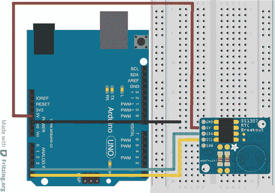
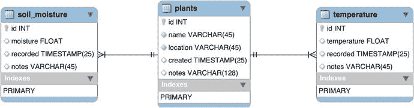

# 四、数据转换

Electronic supplementary material The online version of this chapter (doi:[10.​1007/​978-1-4842-1293-6_​4](http://dx.doi.org/10.1007/978-1-4842-1293-6_4)) contains supplementary material, which is available to authorized users.

无论您有一个现有的 IOT 解决方案，您正在开发一个新的 IOT 解决方案的想法，或者您正在完善一个现有的 IOT 解决方案，数据在某些时候将是一个主要焦点。拥有一个拥有近乎完美的硬件、通信甚至显示能力的优秀 IOT 解决方案，并不能保证数据不会存储不当或处理不当。获得正确的数据可能是最困难的任务。事实上，我见过 IOT 的解决方案很好，但却悲惨地失败了，因为数据要么不容易呈现、理解，要么不完整。

当您考虑正在生成的数据类型以及如何解释这些数据时，问题就来了。由于大多数 IOT 解决方案都是为了观察我们周围的世界而设计的，因此很自然地，生成的大多数数据都是某种形式的传感器数据。当然，可能还有其他数据，如来自相机的图像或视频、用户输入，甚至来自社交媒体应用的数据。幸运的是，这些数据很容易理解。存储可能仍然是一个挑战，但通常很容易解决。

然而，传感器数据可能更难得到正确的。这是因为，正如你在[第 2 章](2.html)中看到的，传感器可以产生模拟(例如电压)或数字值，这些值代表观察值。例如，您可能会发现想要使用的传感器产生-5.0 到+5.0 之间的值。但传感器可能测量的是通过管道(软管)的流量，您可能希望看到的是升或加仑每分钟。诀窍是将传感器的值转换成预期的速率。

您可能需要对数据进行两类转换。您可能需要添加额外的信息，如测量单位、事件注释、日期或时间等。这些附加数据是一种注释形式。您可能还需要对数据执行更大规模的操作，将来自多个来源(传感器)甚至多个节点的数据进行组合。这些操作是数据的聚合，可能需要更多的工作来实现。

在本章中，您将发现许多处理这些和类似转换的技术。这些示例从两个角度展示:用于低成本计算机节点的 Arduino 或 Python 脚本草图的代码摘录，以及如何在数据库中实现该技术的建议。提供内部和外部使用的两种技术 [1](#Fn1) 数据库服务器为您提供更广泛的知识，从而为您开发 IOT 解决方案提供更多工具。

数据库示例将提供建议，而不是具体的示例。重点是展示它是如何在代码中完成的，然后是数据库实现的建议，这样当您阅读接下来的两章时，您将看到如何实现其中的一些建议。我将在第 8 章中更详细地介绍这些建议。接下来，您将看到使用数据库服务器可以获得多大的能力。

Note

一些示例可能没有数据库替代方案。在这些情况下，我提到了存储数据的注意事项。此外，一些例子使用了我们已经讨论过的技术。对于这些例子，重点应该放在所说明的概念上。

我们首先简要讨论和回顾什么是 IOT 数据以及理解数据的策略，即从数据中获取知识。

## 理解 IOT 数据

在我们进入如何实现数据的注释和聚集的例子之前，让我们讨论和回顾一些理解数据的策略。关注这个主题非常重要，这样我们才能了解如何成功设计我们的数据存储。在接下来的几节中，我会以数据库设计过程中应该问的问题的形式介绍一些重要的概念。

### 观察到了什么？

首先要考虑的是你在观察什么。不要专注于传感器产生的数据(这也很重要)，但是知道你在观察什么可以让你计划如何使用数据。我喜欢从问题的角度或在考虑传感器本身时，列出我想观察的事情。也就是说，如果我使用气体探测器，我会列出它可以测量的气体，并考虑如何使用这些观察结果。虽然数据的形式(来自传感器的数据类型)可能需要转换，但更重要的是专注于您正在观察的内容。有时候这并不明显。

例如，如果您使用传感器监控敏感设备 Shell 内的温度，温度会告诉您什么？假设您决定使用传感器来捕捉温度何时达到某个阈值，因为您知道设备无法承受超过该阈值的温度。因此，通过保存测量的温度以及事件的时间和日期来存储这些事件似乎是很自然的。

但是，如果您想知道其他温度范围是否会影响器件，该怎么办呢？在这种情况下，如果设备在某个温度下运行一段时间，该温度可能对设备有害。那么，仅仅存储温度并在温度达到初始阈值时发出信号或发出警报是否足够？可能不是。一段时间后，您可能会发现某些温度会对设备的功能或精度产生负面影响。如果这是真的，记录超过阈值的事件是不够的，因为数据(随时间变化的温度)已经丢失，有利于存储事件。

因此，你不仅要考虑你正在观察的东西，还要考虑观察结果可以被解读的任何其他方式，并计划好你需要为这些用途储存什么。例如，您可能会发现记录某个事件对于一些使用观察来说已经足够了，但是您可能会从一段时间内收集的数据中学到比单个事件更多的东西。

### 有没有另一种观察方法？

与你期望观察的密切相关的是如何进行观察。有时用某些传感器进行直接观察是不可能的(或者成本太高)。例如，假设您有一个花园池塘，并想确定过滤器何时需要清洗。

在一些花园池塘中，过滤器用于去除水中漂浮的碎片(如树叶、废物等)。随着时间的推移，这些过滤器可能会充满碎屑，从而失去水流过过滤器的能力。此外，让我们假设没有简单的机制来测量通过过滤器的水流量。也就是说，过滤器在容纳泵的 Shell 内，因此过滤器在水流入泵井之前净化水。此外，没有设计传感器来测量 Shell 中过滤器的流速。你如何观察到过滤器需要清洗？

如果你拥有并维护了一个使用这种过滤系统的花园池塘，你会知道有一个因果关系，你可以观察到，以确定过滤器是否需要清洗。更具体地说，随着过滤器充满碎屑，泵井中的水降低(流量降低，蓄水池中的水减少)。因此，您可以确定当泵井中的水位降低到一定水平时，过滤器需要清洗。

然而，这种观察结果并不理想，因为如果池塘出现渗漏或出现大量蒸发，抽水井中的水位也可能会变低。因此，我们必须把这些事件加入到我们从观察中可能学到的东西的列表中。在这种情况下，我们有一个主要的和两个次要的事情可以从抽水井水位的观察中得知。

Know Your Domain

这提出了一个很好的观点。如果你被要求为一个花园池塘制作一个 IOT 解决方案，但你不知道或没有任何相关的经验，你可能无法理解如何观察过滤器的状态。因此，了解或研究你工作的领域是很重要的，这样你就可以探索观察的替代方法。

Tip

你应该考虑观察的替代方法，包括观察因果事件，而不是实际或物理现象。

### 你需要多久记录一次观察结果？

您还应该考虑您想要记录观察值的频率，也就是说，您想要记录多少次来自传感器的值。一些传感器可能具有计时器电路或最小阈值，用于何时可以进行测量。开关等简单传感器可以是瞬时的，而气体、水的盐度或氧气等传感器可能具有显著的阈值，从而减少了在给定时间框架内可以进行的观察次数。

也有可能观察的频率与你期望获得的知识没有什么关系。例如，如果我们想测量建筑物或房间的温度，如果每三秒钟记录一次温度值，我们能学到什么吗？一分钟两次怎么样？一小时一次或者六小时一次怎么样？

答案取决于我们想学什么。是的，我们又回到那个话题了。更具体地说，我们是否希望能够跟踪温度何时变化到一天中特定的分钟、小时或时间？此外，我们是否想对变化率进行分析？

例如，如果我们在一个没有受控气候的建筑或房间(例如，谷仓或廊桥)中测量温度，我们是否有兴趣了解温度如何随时间变化？如果是，我们希望数据有多精确？也就是说，我们希望能够检测到温度变化有多快吗？如果我们这样做了，存储更频繁地进行的测量可以允许更准确地检测这些变化以及更准确的变化率。另一方面，如果我们只想能够确定一天中不同时段(例如，早晨、中午、晚上)的平均温度，每隔几个小时进行一次测量可能就足够了。

因此，我们必须考虑我们想要观察什么，以及随着时间的推移变化是否有益。也就是说，使用短时间间隔进行的测量可以比以更长时间间隔进行的测量更准确地检测变化和趋势。事实上，如果间隔足够大，测量中的波动可能会被忽略。

Tip

根据您可能从一段时间的变化中学到的东西，考虑您希望记录观察结果的频率。

### 传感器产生什么类型的数据？

接下来要考虑的是传感器产生的数据类型。抵制跳到如何解释数据的诱惑——我们接下来会这么做。现在，记下数据类型，以便在实现解决方案时可以引用它。

来自传感器的数据的数据类型可能与我们观察到的完全不同。对于以电压形式产生模拟数据的传感器，我们已经看到了这一点。电压的正负可能并不清楚它所代表的意义。记下每个传感器产生的数据将有助于您编写代码来读取、分析和存储观察结果。

Tip

列出传感器产生的数据类型。设计解决方案时，请将此列表放在手边。

### 观察数据需要解释吗？

一旦我们知道了我们在观察什么，我们能从观察中学到什么，我们需要多频繁地进行观察，以及数据类型是什么，我们现在必须考虑是否有任何需要进行的解释。

回到模拟传感器的讨论，大多数模拟传感器都有特定的解释，而且这些解释确实是有文档记录的。也就是说，传感器的文档将告诉您如何解释产生的值。这是通过一种称为数据手册的通用机制呈现的。

Read The Data Sheet

关于如何解读传感器数据手册中的数据，您可以找到更多信息。大多数制造商都会对其设备进行简短描述，包括工作参数(电压、电流等)以及传感器产生的数据类型和如何解释这些数据。如果您不熟悉传感器或其分立元件，请参考数据手册。

一旦理解了数据类型是如何解释的，就要记下如何执行解释。我喜欢把这些数据和伪代码一起记在笔记本上，以便进行观察。它不仅可以帮助您编写代码来解释数据，还可以帮助您考虑将解释包含在数据库中。

此外，您还应该考虑如何呈现数据，也就是说，您希望如何向用户显示数据。例如，读取-4.12 伏的值对用户没有帮助，但是如果该值被表示为诸如“正常”、“潮湿”或“干燥”的类别，则对用户有帮助

Tip

为如何解释和展示数据制定一个计划。把它记录在笔记本上以供参考。

### 你需要什么样的精确度？

这可能有些令人惊讶，但传感器并不总是 100%准确。事实上，大多数面向业余爱好者和发烧友的传感器只有 90%到 95%的精确度。也就是说，100 次中有 5 到 10 次，传感器不会产生准确的值。

如果你的传感器只有 95%的准确性，你只能期望你的数据是相同的。因此，在选择或分析传感器数据时，必须确定解决方案所需的精度。幸运的是，如果您需要更高的精度，通常可以找到符合您期望的传感器。然而，根据我的经验，传感器越精确，它们就越贵。

Tip

平衡传感器的精确度和数据的预期精确度。

### 数据的生命周期有多长？

最后，考虑您希望或需要保留数据多长时间。一些 IOT 解决方案，尤其是那些使用云的解决方案， [2](#Fn2) 似乎只保留数据几个小时、几天或几周。这不仅显得武断，而且还确保您可能永远无法对历史数据执行任何数据分析。也就是说，你可能会因为样本集太小而丢失知识。

在考虑数据的生命周期时，您应该考虑前面的所有问题，并为您希望保留数据的时间制定计划，更具体地说，对更长时间内的数据进行数据分析是否有益。

要考虑的一个因素是大量数据是否会影响解决方案的效率。在这种情况下，更多的数据会使搜索甚至某些代码功能变慢，因为它必须花更多的时间来读取和比较数据。也有可能是您的存储解决方案对可以存储的数据量有限制。因此，在确定数据生命周期时，您应该考虑硬件和软件的限制。

一旦确定了数据的生命周期，就应该确定是否需要数据可访问。如果您不需要从您的解决方案或其应用中访问它，您可以考虑删除旧数据以便安全保存，如文件存档或备份。如果它仍然必须是可访问的，您可能要考虑使用替代或补充的存储机制。例如，如果您将数据存储在一个文件中，您可以简单地打开一个新文件。

Archive, Don’T Delete

如果您确定可以清除某个日期之前的数据，请不要删除该数据。取而代之的是，将它存档，以便在需要访问旧数据时可以使用。对于数据库，数据库备份可能就足够了，或者您可以使用相同模式的表来存储较旧的数据。对于基于文件的存储，请在可移动媒体或其他设备上制作文件的副本。

一旦您对数据的生命周期以及如何处理旧数据有了计划，请将此计划记录在笔记本上，以便您可以编写代码或实施正确的流程来定期清除数据。

Tip

为您希望存储数据的时间制定一个计划。将任何清除事件实施为备份或存档，而不是删除。

现在我们已经看到了理解数据需要考虑的一些事情，让我们从注释开始，看看实现这些策略的几种技术。

以下部分中的一些代码示例是为基于文件的存储而编写的。其他介质形式类似，但实际写入方法可能不同。我还模拟从传感器收集数据。您通常会使用以类似方式编写的方法来检索数据。

我还介绍了使用数据库添加注释或实现聚合的注意事项。我用这几节来介绍数据库概念，为您在本书的其余部分学习更深入的 MySQL 教程做准备。

让我们先来看看您可能想要做的一些更常见的注释。

## 注释

为您的 IOT 解决方案注记数据只是您添加、组合或计算数据的任何附加数据。例如，您可能希望存储一个字符串来描述事件、传感器、节点等。或者，您可能希望对数据执行一些转换，并将其与原始数据一起保存。

Tip

保存原始值始终是一个好的做法。

我在本章中演示了其中的一些转换，提供了一个代码示例，您可以在您的数据聚合器或数据节点上使用它，例如 Arduino、Raspberry Pi 或类似的低成本计算机节点上托管的数据聚合器或数据节点。因此，在适当的地方，我会给出一个 Arduino 草图摘录和一个使用 Python 的例子。虽然您可能不熟悉这两种语言，但是您可以使用这些示例来帮助指导您使用您选择的语言进行写作。

Can You Have Too Much Annotation?

注释应该是为了用户的利益，或者使数据更具信息性。因此，您必须考虑注释是否会添加任何内容，但更重要的是，注释不应该使数据复杂化或模糊化。本章中的一些例子接近于利益与损害的界限，但这是为了说明的目的。使用您自己的判断，多少注释足够满足您的需求。太多会有模糊知识的风险，太少会使数据更难使用。

现在您知道了什么是注释，让我们看几个例子，从最简单的转换形式开始——添加文本和记录注释。

Note

下面的代码示例是为了简洁而摘录的。完整的草图或脚本可以从书籍源代码下载网站获得。

### 记录传感器名称或添加注释

最简单的注释形式是向存储的数据添加一个短字符串。您可能希望这样做，以确保所存储的值能够被理解，例如正在观察什么事件，或者哪个数据收集器(传感器)生成了数据。您可能还想为存储的数据添加任何注释，比如用户输入或者主观观察，比如“猫睡在花盆里”添加的数据在以后读取数据时会很有帮助，特别是当您将数据作为日志或数据存储写入文件时。

但是，您必须小心使用这项技术。添加过多的文本可能会使数据更难解释，或者在将来需要时更难解析。因为添加字符串很容易，所以我将给出一些例子和简短的解释。

#### 代码实现

向存储在文件中的数据添加文本并不困难。清单 [4-1](#FPar14) 展示了如何在 Arduino 草图中将文本添加到一行数据中。在这种情况下，我添加了来自两个(模拟的)传感器读数的数据以及对每个数据的解释。我还添加了用于调试的语句(`Serial.print`语句)。

Listing 4-1.Simple Annotation (Arduino)

`/**`

`Example of simple annotation.`

`This project demonstrates how to save data to a`

`microSD card as a log file with sting annotation.`

`*/`

`#include <SPI.h>`

`#include <SD.h>`

`#include <String.h>`

`// Pin assignment for Arduino Ethernet shield`

`//#define SD_PIN 4`

`// Pin assignment for Sparkfun microSD shield`

`#define SD_PIN 8`

`// Pin assignment for Adafruit Data Logging shield`

`//#define SD_PIN 10`

`File log_file;   // file handle`

`String strData;  // storage for string`

`// Simulated sensor reading method`

`float read_sensor(int sensor_num) {`

`if (sensor_num == 1) {`

`return 90.125 + random(20)/10.00;       // sensor #1`

`} else if (sensor_num == 2) {`

`return 14.512313 + random(100)/100.00;  // sensor #2`

`} else {`

`if (random(25) >= 5) {`

`return (float)random(14)/10.00;`

`} else {`

`return -(float)random(14)/10.00;`

`}`

`}`

`}`

`void setup() {`

`Serial.begin(115200);`

`while (!Serial);`

`Serial.print("Initializing SD card...");`

`if (!SD.begin(SD_PIN)) {`

`Serial.println("ERROR!");`

`return;`

`}`

`Serial.println("ready.");`

`if (SD.remove("data_log.txt")) {`

`Serial.println("file removed");`

`}`

`// initiate random seed`

`randomSeed(analogRead(0));`

`}`

`void loop() {`

`delay(2000);`

`log_file = SD.open("data_log.txt", FILE_WRITE);`

`if (log_file) {`

`Serial.println("Log file open.");`

`strData = String("Temperature sensor: ");`

`strData += read_sensor(1);`

`strData += " ";`

`delay(1000);`

`strData += ", Barometric sensor: ";`

`strData += read_sensor(2);`

`log_file.println(strData);`

`Serial.print("Data written: ");`

`Serial.println(strData);`

`log_file.close();`

`Serial.println("Log file closed.");`

`} else {`

`Serial.println("ERROR: Cannot open file for reading.");`

`}`

`}`

在这个例子中，我使用`String`类将字符串与传感器读数连接起来。虽然还有其他方法，但这种方法似乎更清楚地展示了注释。请注意，我在第二个传感器之前的字符串中放置了一个逗号。这个逗号可以用来帮助解析数据，如果您将来需要这样做的话。例如，您可以拆分逗号上的数据，然后将数据值放在冒号后的字符串末尾。以下是输出示例，或者说是日志文件的摘录:

`Temperature sensor: 90.82, Barometric sensor: 15.00`

`Temperature sensor: 91.43, Barometric sensor: 15.09`

`Temperature sensor: 91.13, Barometric sensor: 15.23`

虽然本例显示了如何将传感器名称与数据一起保存，但是通过简单地附加字符串，在输出行的末尾添加更多的文本也同样容易。例如，您可以在字符串末尾添加一个注释，如下所示。这里我添加了一个方法，它从提示(或 web 表单)返回用户的输入。

`...`

`strData += ", Barometric sensor: ";`

`strData += read_sensor(2);`

`strData += " Notes: ";`

`strData += read_user_input();`

`log_file.println(strData);`

要在 Python 中实现类似的注释，可以使用清单 [4-2](#FPar15) 中所示的代码。在这里，我重现了 Arduino 代码生成的结果。也就是说，我写的是同样的数据，但是我用的是完全不同的方法。为了帮助理解一些格式，我包含了整个代码。

Listing 4-2.Simple Annotation (Python)

`from random import random, randint`

`import string`

`def read_sensor(sensor_num):`

`if (sensor_num == 1):`

`return 90.125 + random()*10  # sensor #1`

`elif (sensor_num == 2):`

`return 14.512313 + random()  # sensor #2`

`else:`

`if (randint(0,25) >= 5):`

`return randint(0,14)/10.00`

`else:`

`return -randint(0,14)/10.00`

`strData = "Temperature sensor: {0:.2f}, Barometric sensor: {1:.2f}\n"`

`file_log = open("data_log_python.txt", 'a')`

`file_log.write(strData.format(read_sensor(1), read_sensor(2)))`

`file_log.close()`

这里你可以看到一个使用`format()`方法格式化字符串的例子。注意我是如何使用名为`strData`的字符串中的格式化代码将输出限制为两个小数点，比如`{0:.2f}`和`{1:.2f}`。这些代码告诉`format()`方法替换第一个和第二个参数(`read_sensor(1)`和`read_sensor(2)`)，将数据格式化为带两位小数的浮点数。

虽然这个例子是基本的，只是一个例子，但是大多数开发者可能不会保存每行的事件或传感器的名称。更有可能的是，您将传感器的名称作为标题行写在文件的开头。这样，您总是知道数据列的含义。事实上，这正是您在数据库解决方案中使用这样的注释的方式。

#### 数据库注意事项

在数据库中用文本进行注释很容易。如果我们想要包括传感器的名称或类型，我们可以简单地相应地命名表格的列。这样，列名描述了数据。例如，如果我们有一个表来存储本节示例中的行，该表可能类似于清单 [4-3](#FPar16) 。不要担心知道命令的所有部分是什么；只关注例子的可读性。

简而言之，表是我们用来存储数据的数据库结构。它形成了数据的布局。我们将在下一章学习更多关于创建表格的知识。现在，请注意这些列。这里我们看到有两列的名称与我们正在收集的数据相对应。事实上，如果我们输入前面例子中的数据，它看起来会像清单末尾的结果。我使用一个`SELECT`语句(从数据库中检索行的方法)来显示示例条目。

Listing 4-3.Sample Database Table and Sample Results

`CREATE TABLE `simple_annotation_test` (`

``id` int(11) NOT NULL AUTO_INCREMENT,`

``temperature` float NOT NULL,`

``barometric` float NOT NULL,`

``notes` char(128) DEFAULT NULL,`

`PRIMARY KEY (`id`)`

`) ENGINE=InnoDB DEFAULT CHARSET=latin1;`

`mysql> SELECT * FROM simple_annotation_test;`

`+----+-------------+------------+-------+`

`| id | temperature | barometric | notes |`

`+----+-------------+------------+-------+`

`|  1 |       90.82 |         15 | NULL  |`

`|  2 |       91.43 |      15.09 | NULL  |`

`|  3 |       91.13 |      15.23 | NULL  |`

`+----+-------------+------------+-------+`

`3 rows in set (0.01 sec)`

请注意，还有一个注释栏。这表明我们还可以处理保存任何额外的注释或用户输入以及采集的样本。为此，我们在保存数据时将其包括在内。

Descriptive Column Names

对于糟糕的数据库设计习惯，这是我最讨厌的事情之一。也就是说，在命名对象(表)、列、索引等时，应该始终使用描述性名称。这并不意味着您需要为每个列名使用 200 个字符(那将是荒谬的)，但是您应该避免使用单个字符名称的诱惑，例如`a`、`b`、`c`等等。

如您所见，数据库中数据的注释是通过命名列、创建存储文本的列，甚至创建特殊的数据类型来帮助注释数据来完成的。例如，您可以定义一个包含一组值(称为枚举)的列，这样我们就可以在保存数据时指定枚举的数值。事实上，我们有很多方法可以在数据库中进行注释。我们将在后面的章节中看到更多的例子。

### 记录日期和时间

除了以列名、注释等形式向数据添加文本之外，我们经常需要存储观察到一个事件或一系列事件的日期和时间。也就是说，我们希望保存传感器被读取的时间。然而，大多数微控制器板甚至一些低成本计算机板都没有实时时钟(RTC)电路。例如，Arduino 没有 RTC，也没有 Raspberry Pi。

需要 RTC 来确保精确的时间保持，因为用于在处理器(微控制器)中推进指令的时钟(产生脉冲的特殊晶体或类似机制)不会以可用于精确计算时间的频率脉动或循环。此外，RTC 电路具有为少量存储器供电的电池，以存储时间值(有时是从特定时期开始的秒)。因此，没有 RTC 的电路板必须被编程为具有开始日期和时间，或者被指示从互联网上的时间服务器获取日期和时间。

幸运的是，有几款出色的产品性能良好，包括一个板载电池，即使在电路板掉电时也能为时钟供电。Adafruit 的 DS1307 实时时钟分线板套件( [`www.adafruit.com/products/264`](http://www.adafruit.com/products/264) )是添加到您的项目中的优秀模块。Sparkfun 还有一个名为实时时钟模块( [`www.sparkfun.com/products/99`](http://www.sparkfun.com/products/99) )的产品，它使用与 Adafruit 产品相同的 DS1307 芯片和接口。您可以配合 Arduino、Raspberry Pi 或任何具有 IC2 接口的主板使用。

#### 使用实时时钟模块

RTC 模块使用易于连接到 Arduino 的 I2C 接口。只需将 5V 电源连接到 5V 引脚，将 GND 引脚接地，将 Arduino 上的 SDA 引脚连接到引脚 4，将 Arduino 上的 SCL 引脚连接到引脚 5。图 [4-1](#Fig1) 显示了将 RTC 模块连接到 Arduino 的接线图。

图 4-1。

Arduino with an Ethernet shield and RTC module Note

如果您使用的是莱昂纳多板，您必须使用新的 SCL/SCA 引脚旁边的 AREF，GND，和引脚 13 最接近 USB 连接器。

初始化 RTC 需要一点代码，但并不困难。首先，我们必须下载 RTC 库。你可以在 [`https://github.com/adafruit/RTClib`](https://github.com/adafruit/RTClib) 找到一个优秀的库使用。通过单击 Download Zip 按钮下载库，解压缩归档文件，然后将文件夹复制到您的`Arduino/Library`文件夹中。您可能需要重命名该文件夹。我推荐使用`RTCLib`作为文件夹名。

Tip

如果您在 Arduino IDE 打开时复制了该库，您可能需要重新启动 IDE 以识别该库。

一旦库准备好了，我们就可以添加代码来使用库了。我们需要包含库头并定义 RTC 类的一个实例。以下是所需的代码行:

`#include "RTClib.h"`

`...`

`RTC_DS1307 rtc;  // real time clock`

接下来，我们需要用`begin()`方法初始化 RTC 类，如果模块之前没有用过或者你换了电池，我们还需要用`adjust()`方法设置时间。以下是可用于完成这两项任务的代码:

`...`

`rtc.begin();`

`if (!rtc.begin()) {`

`Serial.println("Couldn't find the RTC module.");`

`while (1);`

`}`

`if (!rtc.isrunning()) {`

`Serial.println("ERROR: The RTC module is not working.");`

`} else {`

`// Comment out this line after the first run, it is only needed for setting`

`// the date and time for the first time.`

`rtc.adjust(DateTime(F(__DATE__), F(__TIME__)));`

`}`

注意传递给方法`rtc.adjust()`的参数。这将当前日期和时间的值转换为一个`DateTime`类，该方法需要用它来为模块设置日期和时间。`__DATE__`和`__TIME__`是编译草图时从系统中检索日期和时间的宏。因此，只有在第一次开始使用 RTC 时，才需要调用这个方法。您不需要每次运行草图时都调用它。如果这样做，您将每次都将 RTC 设置为相同的值。这不是你想要的。因此，我编写了代码，以便您可以在第一次编译后注释掉该方法。

现在让我们看看如何在草图中使用 RTC 来捕捉 Arduino 上的日期和时间。

#### 代码实现

将日期和时间添加到写入文件的行中的代码所需的工作可能比您预期的要多一些。RTC 模块提供了获取日期和时间的独立元素(如月、年、小时等)的原语。因此，我们需要获取这些值，并将它们组合成我们期望看到的格式。在这种情况下，我们希望看到月/日/年小时:分钟:秒的格式。清单 [4-4](#FPar20) 显示了获取和格式化日期和时间的代码。

Listing 4-4.Date and Time Annotation (Arduino)

`String get_datetime() {`

`DateTime now = rtc.now();`

`String dateStr = String(now.day());`

`dateStr += "/";`

`dateStr += now.month();`

`dateStr += "/";`

`dateStr += now.year();`

`dateStr += " ";`

`dateStr += String(now.hour());`

`dateStr += ":";`

`dateStr += String(now.minute());`

`dateStr += ":";`

`dateStr += String(now.second());`

`return dateStr;`

`}`

`void loop() {`

`delay(2000);`

`log_file = SD.open("data_log.txt", FILE_WRITE);`

`if (log_file) {`

`Serial.println("Log file open.");`

`strData = String("Temperature sensor: ");`

`strData += read_sensor(1);`

`strData += " ";`

`delay(1000);`

`strData += ", Barometric sensor: ";`

`strData += read_sensor(2);`

`strData += " ";`

`strData += get_datetime();`

`log_file.println(strData);`

`Serial.print("Data written: ");`

`Serial.println(strData);`

`log_file.close();`

`Serial.println("Log file closed.");`

`delay(2000);`

`} else {`

`Serial.println("ERROR: Cannot open file for reading.");`

`}`

`}`

如您所见，代码与前面的示例几乎相同。唯一的区别是添加了名为`get_datetime()`的方法来获取并格式化日期和时间，返回一个字符串，然后我们将该字符串追加到正在写入文件的行中。此代码中的示例行如下所示:

`Temperature sensor: 92.33, Barometric sensor: 15.23 Datetime: 11/07/2015 22:36:32`

`Temperature sensor: 90.72, Barometric sensor: 15.32 Datetime: 11/07/2015 22:36:48`

`Temperature sensor: 94.38, Barometric sensor: 15.13 Datetime: 11/07/2015 22:36:50`

`Temperature sensor: 96.74, Barometric sensor: 14.95 Datetime: 11/07/2015 22:36:50`

如果您想用 Python 做类似的事情，并且您的平台上有一个 RTC，那么代码相当容易。您只需添加日期和时间，如清单 [4-5](#FPar21) 所示。我在这里包含了完整的代码，这样您就可以看到读取日期和时间的支持代码。

Listing 4-5.Date and Time Annotation (Python)

`from datetime import datetime`

`from random import random, randint`

`import string`

`def read_sensor(sensor_num):`

`if (sensor_num == 1):`

`return 90.125 + random()*10  # sensor #1`

`elif (sensor_num == 2):`

`return 14.512313 + random()  # sensor #2`

`else:`

`if (randint(0,25) >= 5):`

`return randint(0,14)/10.00`

`else:`

`return -randint(0,14)/10.00`

`def get_datetime():`

`return datetime.strftime(datetime.now(), "%m/%d/%Y %H:%M:%S")`

`strData = "Temperature sensor: {0:.2f}, Barometric sensor: {1:.2f} Datetime: {2}\n"`

`file_log = open("data_log_python.txt", 'a')`

`file_log.write(strData.format(read_sensor(1), read_sensor(2), get_datetime()))`

`file_log.close()`

请注意，我们使用了一种方法来获取和格式化日期和时间，其方式与我们在 Arduino 代码中所做的类似。然而，Python 有更高级的方法(当然是从 C 语言借鉴来的)，我们可以使用包含格式代码的字符串来格式化日期和时间。注意`get_datetime()`方法。我们使用来自名为`strftime()`的`datetime`类的方法，通过`datetime.now()`方法从当前日期和时间创建一个字符串。然后格式字符串被`strftime()`方法使用。这段代码的输出类似于 Arduino 代码。

`Temperature sensor: 92.33, Barometric sensor: 15.23 Datetime: 11/07/2015 22:36:32`

`Temperature sensor: 90.72, Barometric sensor: 15.32 Datetime: 11/07/2015 22:36:48`

`Temperature sensor: 94.38, Barometric sensor: 15.13 Datetime: 11/07/2015 22:36:50`

`Temperature sensor: 96.74, Barometric sensor: 14.95 Datetime: 11/07/2015 22:36:50`

如果您的低成本计算机主板没有 RTC，您可以添加一个，如果主板有 I2C 接口，并且操作系统对 RTC 有足够的支持。例如，您可以向 Raspberry Pi 添加 RTC。Adafruit 在 [`https://learn.adafruit.com/adding-a-real-time-clock-to-raspberry-pi/overview`](https://learn.adafruit.com/adding-a-real-time-clock-to-raspberry-pi/overview) 有一个很好的教程。一旦添加了时钟，Python(或其他语言)脚本将从操作系统原语中获得正确的日期和时间。

#### 数据库注意事项

有两种方法可以保存数据库行中的日期和时间:您可以向类型为`datetime`的表中添加一列，并在与数据库服务器通信的代码中提供日期和时间(您发出一个`INSERT`语句向表中添加数据)，或者您可以使用一个`timestamp`列，这是一个特殊的列，当行被插入时，数据库服务器会为您填充该列。让我们来看看这些选项中的每一个。

您可以通过指定`datetime`数据类型向表中添加日期和时间列。像添加或更新任何其他列一样，添加或更新该值。清单 [4-6](#FPar22) 展示了一个包含一个日期和时间列的示例表模式。为了便于阅读，我突出显示了该列。

Listing 4-6.Database Table with a datetime Column

`CREATE TABLE `date_annotation_test` (`

``id` int(11) NOT NULL AUTO_INCREMENT,`

``temperature` float NOT NULL,`

``barometric` float DEFAULT NULL,`

``date_saved` datetime DEFAULT NULL,`

``notes` char(128) DEFAULT NULL,`

`PRIMARY KEY (`id`)`

`) ENGINE=InnoDB AUTO_INCREMENT=2 DEFAULT CHARSET=latin1`

使用`datetime`列要求您以与 MySQL 兼容的格式提供值。幸运的是，我们到目前为止使用的相同格式工作得很好(其他人也一样——参见 MySQL 在线参考手册以获得更多示例)。下面显示了如何将一行保存到表中，为新列提供日期和时间值。

`INSERT INTO date_annotation_test VALUES (null, 91.34,15.04,``'11/7/15 23:16:30'`T2】

现在让我们看一个添加了示例数据的表的输出示例。在本例中，我添加了几行，为每一行指定日期和时间。

`mysql> SELECT * FROM  date_annotation_test;`

`+----+-------------+------------+---------------------+----------------+`

`| id | temperature | barometric | date_saved          | notes          |`

`+----+-------------+------------+---------------------+----------------+`

`|  1 |       90.82 |         15 | 2011-07-15 23:15:10 | NULL           |`

`|  2 |       91.34 |      15.04 | 2011-07-15 23:16:30 | Test datetime. |`

`+----+-------------+------------+---------------------+----------------+`

`2 rows in set (0.00 sec)`

添加日期和时间注释的另一种形式是使用一个`timestamp`列。这是一种特殊的数据类型，由数据库服务器自动更新。每个表我们只能使用一个`timestamp`列。下面显示的是摘自一张`CREATE`声明的表格。我用下面的`ALTER`语句将这个列添加到前面的例子中。

`ALTER TABLE date_annotation_test ADD COLUMN data_changed TIMESTAMP AFTER notes;`

注意`DEFAULT`选项后的附加选项。这些是默认添加的，它显示每当行被创建或更新时，该值都被更改。所以，是的，一旦设置了时间戳列，它就不是固定的。让我们看一个用新列添加行的例子。

`INSERT INTO date_annotation_test VALUES (null, 91.34,15.04, null, 'Test timestamp.',null);`

这里我传入了`NULL`值，它告诉数据库服务器使用默认值，正如我们在前面的列定义中看到的，这是对列的更新。还要注意，我将日期和时间列(`date_saved`)留空，这意味着不要更新该列。因此，该行不应该显示日期和时间列的值，而应该显示为`timestamp`列(`data_changed`)插入该行的日期和时间。下表显示了累积数据:

`mysql> SELECT * FROM  date_annotation_test;`

`+----+-------------+------------+---------------------+-----------------+---------------------+`

`| id | temperature | barometric | date_saved          | notes           | data_changed        |`

`+----+-------------+------------+---------------------+-----------------+---------------------+`

`|  1 |       90.82 |         15 | 2011-07-15 23:15:10 | NULL            | 2015-11-08 15:55:50 |`

`|  2 |       91.34 |      15.04 | 2011-07-15 23:16:30 | Test datetime.  | 2015-11-08 15:55:50 |`

`|  3 |       91.34 |      15.04 | NULL                | Test timestamp. | 2015-11-08 15:57:27 |`

`+----+-------------+------------+---------------------+-----------------+---------------------+`

`3 rows in set (0.00 sec)`

注意最后两行有相同的数据。我故意这样做，这样您就可以看出添加带有`datetime`列的行和添加带有`timestamp`列的行之间的区别。

因此，使用`timestamp`列意味着数据库为您完成了工作，因此您可以跟踪数据是何时添加或更改的。但是，使用 timestamp 数据类型有一些限制。首先，每张桌子只能有一个。其次，对行的任何更改都会覆盖这些值。因此，如果您想要保存一个特定的日期和时间，但是稍后想要更新该行(比如添加注释)，您可能想要重新考虑使用`timestamp`或者添加一个或多个`datetime`列来存储静态日期和时间值。

但是等等，为什么前两行的`data_changed`值是一样的？您可能已经注意到前两行的`data_changed`列具有相同的值。这是因为我将新列添加到了一个现有的表中。在内部，数据库服务器必须更新所有行以适应这种变化，因此表中已经存在的每一行都会发生变化；由于该列使用了`ON UPDATE CURRENT TIMESTAMP`(默认情况下)，新列被更新。在更改现有表的模式时，请记住这一点。

Tip

您应该考虑向现有表中添加时间戳列的影响，以及如何更新时间戳列，以确保保存您想要的数据。

### 数据类型转换

更改数据元素的类型是您应该花些时间仔细考虑和计划的事情。这是因为如果没有正确执行转换，很容易丢失数据。这不仅仅是将一个浮点数转换成一个字符串，然后再转换回来(尽管如果去掉太多的小数，也会有问题)。您必须考虑所需的存储量以及值的范围。例如，整数和无符号整数可能大小相同[【3】](#Fn3)(2 字节)，但是值的范围不同，因为整数允许将值的符号限制(+/-)到范围-32768 到 32767，而无符号整数存储范围 0 到 65535 的值。

您还需要考虑数据的精度。浮点数是有若干小数的实数。大多数平台都非常明确地声明浮点数据类型是估计的，并不是精确的——同样是因为小数部分。因此，在转换数据类型时，您必须考虑这一点。例如，如果将浮点数更改为整数，可能会出现舍入问题。当然，将整数改为浮点数也可能会引入舍入问题。类似地，将类型从较大的存储空间(字节数)更改为较小的存储空间(字节数)，会有使目标内存溢出并生成无效值的风险。

另一个考虑是执行算术。也就是说，结果值或中间值必须“适合”该数据类型的值范围。例如，如果将两个无符号整数相加，并将结果赋给另一个无符号整数，则必须确保该值在 0 到 65535 的范围内。否则，该值可能溢出并导致许多问题，最明显的是不正确的值。

Note

一些编程语言有严格的类型检查，并且可以在可能溢出时检测或警告，但是这不能代替谨慎的编程(使用正确的数据类型)。

你可能想知道溢出是什么。观察以下简短的 Arduino 草图。这里有两个变量，一个长整型和一个以 65535 开始的无符号整数。看看会发生什么。

`void setup() {`

`unsigned int uint_val = 65535;`

`long long_val = 65535;`

`Serial.begin(9600);`

`while (!Serial); // Wait until Serial is ready - Leonardo`

`Serial.print("1> ");`

`Serial.print(uint_val);`

`Serial.print(" ");`

`Serial.println(long_val);`

`Serial.print("2> ");`

`uint_val++;`

`long_val++;`

`Serial.print(uint_val);`

`Serial.print(" ");`

`Serial.println(long_val);`

`Serial.print("3> ");`

`uint_val++;`

`long_val++;`

`Serial.print(uint_val);`

`Serial.print(" ");`

`Serial.println(long_val);`

`}`

`void loop() {`

`}`

以下是输出(来自串行监控器):

`1> 65535 65535`

`2> 0 65536`

`3> 1 65537`

我将输出的值打印在第一行，然后给每一行加一，再打印在第二行。注意当我给变量加 1 并打印它们时会发生什么。您可能希望无符号整数是 65536，但它是 0，因为表示该数字的位数超过了变量的最大大小(2 个字节)，所以出现了溢出。65536 的值需要 17 位(10000000000000000)，两个字节中只有 16 位，前 16 位从右边开始取(00000000000000)。似乎令人担忧的是，没有任何溢出的警告。第三行显示了当我再次添加 1 时发生的情况，但是我们看到无符号整数变量已经重置。

因此，您应该努力使用尽可能最小的数据类型，尤其是在使用微控制器或其他内存有限的设备时。要练习这种做法，您需要了解每种数据类型可以安全存储的值的范围。为了了解它对 Arduino 平台的意义，表 [4-1](#Tab1) 列出了一些常见的数据类型、内存大小和值的范围。注意浮点变量比整数大多少。

表 4-1。

Arduino Data Types

<colgroup><col> <col> <col></colgroup> 
| 数据类型 | 以字节为单位 | 值的范围 |
| --- | --- | --- |
| `boolean` | one | 逻辑真/假 |
| `byte` | one | 从 0 到 255 的无符号数 |
| `char` | one | 从-128 到 127 的有符号数字，通常是 ASCII 字符 |
| `unsigned char` | one | 字符值 0 到 255 |
| `word` | Two | 从 0 到 65535 的无符号数 |
| `unsigned int` | Two | 从 0 到 65535 的无符号数 |
| `int` | Two | 从-32768 到 32767 的签名号码 |
| `unsigned long` | four | 0-4，294，967，295 之间的无符号数 |
| `long` | four | 签名号码从-2，147，483，648 到 2，147，483，647 |
| `float` | four | 从-3.4028235E+38 到 3.4028235E+38 的有符号数字 |

尽可能使用最小的数据类型还有一个好处。某些数据类型会导致草图运行速度变慢。例如，在算术运算中使用浮点数可能比使用整数慢 16 倍。如果精度不是问题，而性能是问题，您可能需要考虑将浮点值舍入到整数(提示:乘以 100 以在转换前保留 2 个小数点)。请确保使用尽可能大的整数。

下一节不是给出一组代码示例，而是讨论转换和使用数据类型的一些细节。

#### 代码实现

虽然大多数有经验的程序员会告诫不要转换数据类型，除非绝对必要，但是在一些情况下，如果小心行事，是有可能证明这一点的。例如，如果您正在使用一种具有松散类型检查的语言，并且希望进行一些算术运算来产生浮点值，但是无意中在公式中使用了整数，则您可能会得到整数结果。为了克服这一点，您可能需要使用一种称为强制转换(也称为造型)的特殊操作将整数转换为浮点数。Arduino C 中的强制转换是通过将新的数据类型放在括号中实现的。这里显示了一个示例:

`int shift_value = 100;`

`val_shifted = (float)shift_value * 95.0675;`

使用某些数据类型转换的另一个理由是节省内存。这在处理微控制器和其他对变量的内存有限的处理器时最为常见。那些刚接触内存有限的设备的人可能不认为在这里或那里保存一个字节会有什么不同，但它确实会产生巨大的影响。

例如，如果您的草图使用大量变量进行计算，您可能需要考虑减少变量的类型和大小。例如，考虑一下，如果每个单元都是双精度的，那么一个相对较小的 20×20 值的矩阵将消耗多少字节。对，就是 20×20×4 = 1600 字节。如果你的 Arduino 只有 2Kb 的内存，你可能会遇到问题。

如果您遇到类似这样的问题，并且您正在处理的值的范围小于您选择的数据类型，您可以转换它们。例如，如果矩阵中的值从未超过+/-320，并且精度只允许使用两位小数，则可以将这些值转换为整数，如下所示:

`int new_val;`

`new_val = (int)(orig_val * 100.00);`

这段代码产生一个值，比如 222.66 到 22266，这个值足够小，适合一个整数数据类型，因此可以在内存中节省 800 个字节。对于旧的 Arduino 主板来说，这是相当大的节省！但是，我应该注意，这些值将被截断，而不是四舍五入。因此，虽然您可以通过除以 100 将数据恢复为浮点型，但您不会恢复原始值的任何额外精度。

您可能遇到的另一种可能的数据类型转换是将字节转换为字符，或者从一系列字节中检索更大的数值。这很可能在设备之间通信时发生。也就是说，大多数通信机制以字节流的形式发送数据。在这种情况下，我们可能需要从字节流中提取整数、浮点数甚至字符串(文本)等数据。

将字节转换成字符很简单，因为它们在代码中被视为相同的(每个都是一个字节)。然而，它们可以有不同的解释。例如，一个 ASCII 字符只使用前七位，而一个字节被视为八位。

如果您必须从字节流中提取数字，您将需要知道这些值是如何编码的。例如，一个适合一个字节的小值将需要一个字节。较大的值可能是一个整数，需要两个字节，长整数可能需要四个字节。除了字节数，您还必须知道各个字节的存储顺序。大多数微处理器和微控制器平台首先用最小的字节存储它们。 [5](#Fn5)

因此，要从字节流中检索一个值，您必须一次读取一个字节，并将每个字节移位。也就是说，先读取第一个字节，然后读取第二个字节，将其向左移位，并添加第一个字节。可以这样想:一个整数有两个字节，你要把它们分开。要重建整数，必须取第一个字节(最左边的位)并将其左移 8 位。这使得最右边的字节为空。下面是一个例子。我使用十六进制值来使这个例子易于阅读。

`Integer: 0x5AFE`

`Left-most byte: 0x5A`

`Right-most byte: 0xFE`

`Left-most byte shifted: 0x5A << 8 = 0x5A00`

`Adding in the right most byte: 0x5A00 + 0x00FE = 0x5AFE`

类似地，存储整数需要将最左边的字节向右移动以保留值。我把这个留给你作为练习来探索。清单 [4-7](#FPar26) 显示了在字节缓冲区中读取和存储整数值的两种方法。如果您需要在字节流中读取或存储整数，请花些时间通读这些内容。

Listing 4-7.Reading and Storing Integers in a Byte Array

`/**`

`* get_lcb_len - Retrieves the length of a length coded binary value`

`*`

`* This reads the first byte from the offset into the buffer and returns`

`* the number of bytes (size) that the integer consumes. It is used in`

`* conjunction with read_int() to read``length`T2】

`* from the buffer.`

`*`

`* Returns integer - number of bytes integer consumes`

`*/`

`int get_lcb_len(byte buffer[], int offset) {`

`int read_len = buffer[offset];`

`if (read_len > 250) {`

`// read type:`

`byte type = buffer[offset+1];`

`if (type == 0xfc)`

`read_len = 2;`

`else if (type == 0xfd)`

`read_len = 3;`

`else if (type == 0xfe)`

`read_len = 8;`

`}`

`return 1;`

`}`

`/**`

`* read_int - Retrieve an integer from the buffer in size bytes.`

`*`

`* This reads an integer from the buffer at offset position indicated for`

`* the number of bytes specified (size).`

`*`

`* buffer[in]      byte stream in memory`

`* offset[in]      offset from start of buffer`

`* size[in]        number of bytes to use to store the integer`

`*`

`* Returns integer - integer from the buffer`

`*/`

`int read_int(byte buffer[], int offset, int size) {`

`int value = 0;`

`int new_size = 0;`

`if (size == 0)`

`new_size = get_lcb_len(offset);`

`if (size == 1)`

`return buffer[offset];`

`new_size = size;`

`int shifter = (new_size - 1) * 8;`

`for (int i = new_size; i > 0; i--) {`

`value += (byte)(buffer[i-1] << shifter);`

`shifter -= 8;`

`}`

`return value;`

`}`

`/**`

`* store_int - Store an integer value into a byte array of size bytes.`

`*`

`* This writes an integer into the``buffer`T2】

`* buffer. It will transform an integer of size to a length coded binary`

`* form where 1-3 bytes are used to store the value (set by size).`

`*`

`* buff[in]        pointer to location in internal buffer where the`

`*                 integer will be stored`

`* value[in]       integer value to be stored`

`* size[in]        number of bytes to use to store the integer`

`*/`

`void store_int(byte *buff, long value, int size) {`

`memset(buff, 0, size);`

`if (value < 0xff)`

`buff[0] = (byte)value;`

`else if (value < 0xffff) {`

`buff[0] = (byte)value;`

`buff[1] = (byte)(value >> 8);`

`} else if (value < 0xffffff) {`

`buff[0] = (byte)value;`

`buff[1] = (byte)(value >> 8);`

`buff[2] = (byte)(value >> 16);`

`} else if (value < 0xffffff) {`

`buff[0] = (byte)value;`

`buff[1] = (byte)(value >> 8);`

`buff[2] = (byte)(value >> 16);`

`buff[3] = (byte)(value >> 24);`

`}`

`}`

Note

这段代码是如何编码和解码的一个例子。如果您想在自己的解决方案中使用它，您可能需要修改它以适合您的代码。

注意，一种方法使用循环来遍历字节，而另一种方法使用更常见的方法，即使用条件语句。我两者都包括，但是你可以使用最容易理解的。请注意，这两种方法都需要整数的大小。这是必要的，因为整数的长度可以是 1、2 或 4 个字节。

数据类型用法的另一个概念涉及从不改变的值。在这种情况下，您可以将变量声明为常量，这将告诉编译器用常量值替换变量，从而节省一点内存。对于较大的数据类型，这样做可以节省大量内存。考虑下面的代码片段。第一行代码使用 2 个字节，而第二行代码强制编译器在变量出现的任何地方替换为 10。

`int multiplier = 10;`

`const int multiplier = 10;`

处理数据类型有相当多的技巧和技术——如此之多，以至于已经写了整本多卷的书来探索每种可能的技术的细微差别和优缺点。如果您在您的 IOT 解决方案中使用 Arduino，并希望确保尽可能小心高效地对其进行编程，请参阅 Simon Monk 博士的著作《Arduino 后续步骤编程》(McGraw Hill，2014)。

如果您正在用 Python 编写低成本的计算机主板，这些技术中有许多是相同的或者有类似的应用。Wolfram Donat 的书《用 Python 学习 Raspberry Pi 编程》(Apress，2014)是一本关于在 Raspberry Pi 上进行高效 Python 编程的优秀书籍。如果你想超越 Python 编程的基础，可以看看 J. Burton Browning 和 Marty Alchin 的书 Pro Python (Apress，2014)。

#### 数据库注意事项

幸运的是，在数据库中存储数据时，您不太可能遇到与微控制器或类似的小内存设备相同的内存限制。这是因为数据库擅长以特定格式存储数据，并且在某些情况下可以优化所使用的存储(尤其是文本)。也许更重要的是，数据库服务器比微控制器有更多的存储空间。

因此，对于一个数据库来说，以正确的类型存储数据确实没有问题，只是有一些小的例外。也就是说，在一些可能的边界情况下，复杂的数据类型可能在数据库服务器上不可用，但是肯定有足够的原语，您可以保存您需要的任何类型。

Note

MySQL 支持许多数据类型。有关更多详细信息，请参见 MySQL 在线参考手册中标题为“数据类型”的部分( [`http://dev.mysql.com/doc/refman/5.7/en/`](http://dev.mysql.com/doc/refman/5.7/en/) )。

此外，处理规模的问题不是存储数据的问题。这是因为，再一次，数据库真的很擅长这个。因此，浮点数的舍入或限制小数更多的是表示，而不是其他。但是，如果你需要做这样的事情，你可以在数据库服务器。

例如，MySQL 为浮点数据类型提供了额外的控件。也就是说，您可以设置整数位数和小数位数。您可以使用`float(m,d)`语法来实现这一点，其中`m`是最大位数，`d`是小数位数。当您需要限制 MySQL 中浮点数的大小或显示时，请使用此语法。

### 添加导出或计算的数据

另一个常见的注释是向行中添加额外的数据，这些数据是原始值的派生或计算。这包括转换以更改度量单位(华氏温度到摄氏温度)的值、基于范围的枚举或以某种方式(小数位数、精度)转置的枚举，或者结果有意义的计算列(算术运算)。

例如，可能存在为一组事件或传感器生成的传感器数据，这些数据与其他传感器一起使用以提供结果，或者可能存在您想要缩放、分割、将数据转换为新的测量单位或修改值的情况。在这些情况下，我们将新的派生或计算数据添加到行中。假设您有一个以英寸为单位测量距离的传感器，但您需要以毫米为单位的数据。 [6](#Fn6) 你可以用下面的公式轻松地将数据转换成英寸: [7](#Fn7)

`value_millimeters = value_inches * 25.4;`

回想一下，我们从不想丢弃原始值，所以我们会保存以英寸为单位的值以及派生值。因此，我们将在现在熟悉的 Python 脚本摘录中编写如下数据:

`strData = "Distance milimeters: {0:.2f}, Distance inches: {1:.2f} Datetime: {2}\n"`

`file_log = open("data_log_python.txt", 'a')`

`dist_inches = read_sensor(1);`

`dist_mm = dist_inches * 25.4;`

`file_log.write(strData.format(dist_mm, dist_inches))`

`file_log.close()`

另一个常见的派生列是使用一个列来存储自上次读取以来值的变化量。虽然可以从保存的数据中计算出这个值，但是添加一个额外的列来存储该值可以使读取和理解数据更加容易。为此，我们必须保存旧值，并通过从新值中减去旧值来计算变化。一个积极的结果是价值增加的数量；负值是值减少的量。

让我们仔细看看一个常见的派生列和计算列的示例。

#### 代码实现

派生和计算的数据(列)将以特定的方式实现。也就是会有一个精确的公式或者翻译需要进行。在下面的示例中，我们将看到我在自己和他人的 IOT 解决方案中遇到的三个派生和计算列的示例。

第一个是校准的推导。有时，传感器需要校准，校准结果将决定一个值(如果差值不是线性的，有时是一个公式)，必须加上或减去该值才能获得更精确的值。

第二个例子是一个简单的计算，我们有一个传感器，可以测量盘子或浅盘上许多物体的重量。在本例中，对象的数量是固定的，但在大多数情况下，这也是一个变量。精明的 IOT 爱好者和爱好者会注意到计算不规则物体的平均重量可能并不有趣，所以我们假设这个例子中的物体在大小和组成上都是相似的。

第三个是派生值的另一个例子，我们希望存储从上一次读取的值中读取的值的差异。这代表了大量的注释，包括平均值、运行总数等等，以及数字数据。

虽然所有这些都是技术上的变化或添加新数据，但我们保留原始值，以确保我们可以从推导或计算中的任何变化中恢复。此外，我们存储这些值以使读取和处理数据更容易。

清单 [4-8](#FPar29) 显示了一个 Arduino 草图的摘录，该草图模拟并实现了三个传感器的读数:一个需要校准的血氧传感器、[T3】8T5】一个测量几个物体重量的重量传感器，以及一个我们用来保存自上次读数以来的差值的电压传感器。](#Fn8)

Listing 4-8.Derived and Calculated Annotations (Arduino)

`/**`

`Example of derived or calculated columns annotation.`

`This project demonstrates how to save data to a`

`microSD card as a log file with additional column annotation.`

`*/`

`#include <SPI.h>`

`#include <SD.h>`

`#include <String.h>`

`// Pin assignment for Arduino Ethernet shield`

`//#define SD_PIN 4`

`// Pin assignment for Sparkfun microSD shield`

`#define SD_PIN 8`

`// Pin assignment for Adafruit Data Logging shield`

`//#define SD_PIN 10`

`File log_file;   // file handle`

`String strData;  // storage for string`

`float blood_oxygen;`

`// Simulated sensor reading method`

`float read_sensor(int sensor_num) {`

`if (sensor_num == 1) {`

`return 90.125 + random(20)/10.00;       // sensor #1`

`} else if (sensor_num == 2) {`

`return 94.512313 + random(100)/100.00;  // sensor #2`

`} else if (sensor_num == 3) {`

`return 45.6675 + random(100)/100.00;    // sensor #3`

`} else {`

`if (random(25) >= 5) {`

`return (float)random(14)/10.00;`

`} else {`

`return -(float)random(14)/10.00;`

`}`

`}`

`}`

`void setup() {`

`Serial.begin(115200);`

`while (!Serial);`

`Serial.print("Initializing SD card...");`

`if (!SD.begin(SD_PIN)) {`

`Serial.println("ERROR!");`

`return;`

`}`

`Serial.println("ready.");`

`if (SD.remove("data_log.txt")) {`

`Serial.println("file removed");`

`}`

`// initiate random seed`

`randomSeed(analogRead(0));`

`}`

`float oldVal = 67.123;`

`float newVal = 0.00;`

`float weight = 0.00;`

`void loop() {`

`delay(2000);`

`log_file = SD.open("data_log.txt", FILE_WRITE);`

`if (log_file) {`

`strData = String("Blood oxygen: ");`

`blood_oxygen = read_sensor(2);`

`strData += blood_oxygen;`

`strData += ", Calibrated: ";`

`// calculated column adjusting for calibration`

`strData += String(blood_oxygen + 0.785, 2);`

`strData += ", Weight: ";`

`weight = read_sensor(3);`

`strData += weight;`

`// calculated column for number of objects`

`strData += ", Avg weight: ";`

`strData += String((weight/4.0), 4);`

`// Calculating change since last read`

`strData += ", Volts: ";`

`newVal = oldVal+read_sensor(4);`

`strData += String(newVal, 2);`

`strData += ", Delta: ";`

`strData += String(newVal-oldVal,3);`

`oldVal = newVal;`

`log_file.println(strData);`

`log_file.close();`

`} else {`

`Serial.println("Cannot open file for reading.");`

`}`

`}`

Note

以下代码不代表实际的解决方案；相反，它旨在展示生成派生列和计算列的概念。

请注意，我们再次添加新数据作为列，用逗号分隔它们。下面显示了此代码中的一组示例行:

`Blood oxygen: 94.88, Calibrated: 95.67, Weight: 46.07, Avg weight: 11.5169, Volts: 68.42, Delta: 1.300`

`Blood oxygen: 95.23, Calibrated: 96.02, Weight: 46.56, Avg weight: 11.6394, Volts: 68.52, Delta: 0.100`

`Blood oxygen: 94.97, Calibrated: 95.76, Weight: 46.42, Avg weight: 11.6044, Volts: 68.62, Delta: 0.100`

`Blood oxygen: 95.46, Calibrated: 96.25, Weight: 46.49, Avg weight: 11.6219, Volts: 69.62, Delta: 1.000`

`Blood oxygen: 94.96, Calibrated: 95.75, Weight: 46.18, Avg weight: 11.5444, Volts: 70.12, Delta: 0.500`

`Blood oxygen: 94.62, Calibrated: 95.41, Weight: 46.11, Avg weight: 11.5269, Volts: 70.52, Delta: 0.400`

请注意，这里我们看到的是血氧传感器，其校准值与四个物体的重量和平均重量一起存储，然后存储电压和自上次读取值以来的变化。现在让我们看看数据库服务器如何使这些注释变得更容易。

#### 数据库注意事项

到目前为止，您应该认为数据库服务器是一个强大的工具，事实也的确如此。事实上，它非常擅长像前面展示的那样进行推导和计算。此外，根据所需的计算，对于如何实现推导或计算，您有几种选择。本节讨论三种常见的替代方法。还有其他的选择， [9](#Fn9) 但这些都是最常见的方法。

您可以添加一个触发器，这是一个在添加数据时执行(触发)的特殊过程；要在一个特殊的列中添加新数据，您可以将计算放在`SELECT`语句(检索行的方法)中，这样新数据就可以动态生成；或者您可以将计算放在`INSERT`语句中(保存数据的方法)。让我们从为什么你会选择一个而不是另一个开始来看看每一个。

您应该考虑的第一件事是，是动态地生成新数据，还是以列的形式存储在表中。动态生成新值将意味着使用更少的存储，但在检索行时可能会带来额外的好处。也就是说，检索大量的行可能需要更长的时间，因为计算被推迟并一次完成。因此，在表中保存新数据意味着检索行花费的时间更少，但是需要更多的存储空间。幸运的是，存储空间通常不是问题。请注意，`SELECT`语句中指定的计算仍然在数据库服务器上执行，尽管在检索每一行时只执行一次。

至于是使用触发器还是作为`INSERT`语句的一部分在数据库中生成数据，我们应该考虑希望在哪里执行计算。如果放在触发器中，计算将在数据库服务器上执行。但是如果放在`INSERT`语句中，计算是在客户机(发送数据的那个)上执行的。因此，如果您有复杂的计算或有限的处理能力，您可能希望选择触发器选项。

在我们查看数据库示例之前，下面显示了执行示例所需的表。我在这里包括它，以便您可以自己测试这些示例，并且您可以看到唯一添加的新列是 calibrated 列，它由触发器示例使用。清单 [4-9](#FPar30) 显示了测试表。

Listing 4-9.Table Schema for Derived and Calculated Columns Example

`CREATE TABLE `derived_annotation_test` (`

``id` int(11) NOT NULL AUTO_INCREMENT,`

``blood_oxygen` float NOT NULL,`

``blood_oxygen_corrected` float DEFAULT NULL,`

``weight` float DEFAULT NULL,`

``volts` float DEFAULT NULL,`

`PRIMARY KEY (`id`)`

`) ENGINE=InnoDB AUTO_INCREMENT=1 DEFAULT CHARSET=latin1`

请注意，我们添加了一列用于血氧示例的校准，但没有添加其他两个值的校准。那些我们将在运行中生成的。现在让我们看看如何用代码实现这三个选项。

##### 使用触发器的派生列和计算列

触发器是对数据库进行编程以填充列的好方法。在这种情况下，我们希望编写一个触发器，在每次向表中添加一行时执行，并在添加时使用一个简单的公式计算校准值。触发器可以以多种方式执行(或触发)，例如在插入或删除之前或之后。一个触发器与一个特定的表相关联，但是一个表可以有多个触发器。我们将在第 5 章中更详细地讨论触发器，但现在观察以下内容:

`CREATE TRIGGER calibrate_blood_oyxgen BEFORE INSERT ON derived_annotation_test`

`FOR EACH ROW SET NEW.blood_oxygen_corrected = NEW.blood_oxygen + 0.785;`

我们在这里看到的是一个触发器，设置为在名为`derived_annotation_tes` t 的样本表的插入之前执行。注意，第二行非常清楚地显示，将用`blood_oxygen`值加上`0.785`的值为`blood_oxygen_corrected`列设置一个新值。

现在让我们看看当我们插入一行时会发生什么。以下代码在表格中插入一行。注意，我指定了一个列列表，后跟一个值列表。如果不指定列列表，则必须为表中的所有列提供值。

`INSERT INTO derived_annotation_test (blood_oxygen, weight, volts) VALUES (94.88, 46.07, 68.42);`

现在让我们看看数据是什么样的。回想一下，为了从表中获取数据，我们使用如下的`SELECT`命令:

`mysql> SELECT * FROM  derived_annotation_test;`

`+----+--------------+------------------------+--------+-------+`

`| id | blood_oxygen | blood_oxygen_corrected | weight | volts |`

`+----+--------------+------------------------+--------+-------+`

`|  5 |        94.88 |                 95.665 |  46.07 | 68.42 |`

`+----+--------------+------------------------+--------+-------+`

`1 row in set (0.00 sec)`

在这里，我们看到修正值已保存在`blood_oxygen_corrected`栏中。最棒的是，我们添加数据时什么都不用做。事实上，触发器的美妙之处在于，你设置一次，它就能对所有插入的数据起作用。

Note

一些 Python 代码示例使用一个称为数据库连接器的特殊库来连接 MySQL。在本例中，它是来自 Oracle 的连接器/Python 连接器库( [`http://dev.mysql.com/downloads/connector/python/`](http://dev.mysql.com/downloads/connector/python/) )。你会在第 6 章和第 8 章中看到这个连接器的更多细节。

##### 使用 SELECT 语句的派生列和计算列

回想一下，我们还可以在读取数据时动态生成派生列或计算列。更具体地说，我们将该操作作为`SELECT`语句的一部分。让我们插入一些数据来看看这是如何做到的。在这个例子中，我们将展示如何计算从最后一次读取`volts`列的值以来的差值。回想一下示例表，我们没有存储增量的列。下面显示了一个插入多行的示例`INSERT`。这也称为大容量插入。

`INSERT INTO derived_annotation_test (blood_oxygen, weight, volts)`

`VALUES (94.88, 46.07, 68.42), (95.23, 46.56, 68.52), (94.97, 46.42, 68.62);`

注意，我们只是提供了一个逗号分隔的值列表，每个值代表一个新的数据行。在这种情况下，我们使用与之前 Arduino 草图中所示相同的数据。插入数据后，我们可以按如下方式查看它:

`mysql> SELECT * FROM derived_annotation_test;`

`+----+--------------+------------------------+--------+-------+`

`| id | blood_oxygen | blood_oxygen_corrected | weight | volts |`

`+----+--------------+------------------------+--------+-------+`

`|  5 |        94.88 |                 95.665 |  46.07 | 68.42 |`

`|  7 |        94.88 |                 95.665 |  46.07 | 68.42 |`

`|  8 |        95.23 |                 96.015 |  46.56 | 68.52 |`

`|  9 |        94.97 |                 95.755 |  46.42 | 68.62 |`

`+----+--------------+------------------------+--------+-------+`

`4 rows in set (0.00 sec)`

为了计算增量，我们编写一个 Python 脚本来连接数据库并从表中检索行。我们首先保存读取的第一个值的值，然后在后续行中进行比较，计算自读取最后一个值以来的变化。清单 [4-10](#FPar32) 显示了一个使用 MySQL 连接器/Python 库从服务器读取数据的 Python 脚本。

Listing 4-10.Calculated Columns Using `SELECT` (Python)

`import mysql.connector;`

`cnx = mysql.connector.connect(user="root", password="SECRET")`

`cur = cnx.cursor()`

`cur.execute("SELECT * FROM test.derived_annotation_test")`

`old_value = 0;`

`for row in cur.fetchall():`

`if old_value > 0:`

`print "{0}, {1}, {2}, {3}, {4}".format(row[1], row[2], row[3], row[4], row[4] - old_value)`

`else:`

`print "{0}, {1}, {2}, {3}".format(row[1], row[2], row[3], row[4])`

`old_value = row[4]`

虽然可能有更有效的方法来读取列值，但我编写了代码来访问行中的每一列，以向您展示结果如何作为列表返回(就像数组一样)。我只需访问从 0 开始的列号，就可以得到该列的值。注意，`volts`列的值是表中的第五列，因此用`[4]`来引用。下面显示了运行该脚本的输出:

`$ python ./derived_select_example.py`

`94.88, 95.665, 46.07, 68.42,`

`94.88, 95.665, 46.07, 68.42, 0.0`

`95.23, 96.015, 46.56, 68.52, 0.1`

`94.97, 95.755, 46.42, 68.62, 0.1`

这里我们看到代码打印出了`blood_oxygen`、`blood_oxygen_corrected`、`weight`和`volts`的数据。第一行没有值，因为我们没有以前的值来计算增量。剩余的行将最后一个值之后的增量或变化显示为第五个值。

##### 使用 INSERT 语句的派生列和计算列

现在我们来看一下`INSERT`方法。我们将使用先前获得的电压数据。在这种情况下，我们已经在代码中的某个地方存储了旧值，这样当我们保存新值时，我们就包括了那里的计算。下面的代码是一个例子，说明如何形成包含计算的`INSERT`语句。虽然公式很简单，但该示例显示了在插入数据时如何填充派生列或计算列。

回想一下，计算是在客户机上执行的，而触发器示例是在服务器上执行的。我离开去做一个练习，把这个例子转换成一个触发器。在我们看到 SQL 代码之前，让我们将计算列添加到表中。有一个名为`ALTER TABLE`的强大命令，可以用来添加或删除列，等等。我们使用它来添加新列，如下所示:

`ALTER TABLE derived_annotation_test ADD COLUMN avg_weight float AFTER weight;`

现在我们添加新数据。回想一下 Arduino 示例，我们想简单地将重量值除以 4，得到传感器测得的每件物品的平均重量。下面是另一个 bulk insert 语句。请注意，我们只是在“平均体重”栏的空白处加入了这个公式。

`INSERT INTO derived_annotation_test (blood_oxygen, weight, avg_weight, volts)`

`VALUES (95.46, 46.49, (46.49/4.00), 69.62), (94.96, 46.18, (46.18/4.00), 70.12),`

`(94.62, 46.11, (46.11/4.00), 70.52);`

快速检查表中的数据，确认行中插入了正确的值。

`mysql> SELECT * FROM derived_annotation_test;`

`+----+--------------+------------------------+--------+------------+-------+`

`| id | blood_oxygen | blood_oxygen_corrected | weight | avg_weight | volts |`

`+----+--------------+------------------------+--------+------------+-------+`

`|  5 |        94.88 |                 95.665 |  46.07 |       NULL | 68.42 |`

`|  7 |        94.88 |                 95.665 |  46.07 |       NULL | 68.42 |`

`|  8 |        95.23 |                 96.015 |  46.56 |       NULL | 68.52 |`

`|  9 |        94.97 |                 95.755 |  46.42 |       NULL | 68.62 |`

`| 10 |        95.46 |                 96.245 |  46.49 |    11.6225 | 69.62 |`

`| 11 |        94.96 |                 95.745 |  46.18 |     11.545 | 70.12 |`

`| 12 |        94.62 |                 95.405 |  46.11 |    11.5275 | 70.52 |`

`+----+--------------+------------------------+--------+------------+-------+`

`7 rows in set (0.00 sec)`

这里我们看到只有最后三行有平均重量列。回想一下，我们将新列添加到已经包含数据的表中。除非添加了触发器，否则现有行的新列的值将保持为空(技术上来说是`NULL`)。

### 数据解释

有时数据以不可用的形式生成，或者需要一些翻译或解释才能使用。我们已经看到了一个数据解释的例子。回想一下第 1 章中的工厂监控示例，我们有一个传感器，根据产生的值，它可以指示几种状态中的一种。因此，我们可以将数据值解释为这些状态之一，并因此存储该状态。在这种情况下，我们从一系列值中创建一个值，而不是计算一个新值。

让我们看一个类似的例子，但这次我们将看到从不同类型的传感器生成的数据。在这种情况下，被模拟的传感器是诸如由 Sparkfun ( [`http://sparkfun.com/products/10221`](http://sparkfun.com/products/10221) )出售的液位传感器。这是一种测量电阻的传感器，可用于确定从传感器顶部到液体表面的距离。更具体地说，输出与液位成反比。液体越低，测得的电阻越高。液体越低，测得的电阻越小。

现在，假设我们在一个池塘监控解决方案中使用这种传感器，想要测量过滤池内的水位。此外，我们从经验和观察中得知，根据水位的不同，池塘的状态会发生如下变化:

*   如果水位低至 6 英寸或低于固定点，过滤器可能需要清洗。
*   如果水位在 3-6 英寸之间，则池塘水位较低。
*   如果水位在 1-3”之间，则池塘处于正常状态。
*   如果水位高于 1 英寸，则说明池塘中的水过多，水溢出了过滤元件。

因此，我们需要检查特定范围内的电阻值，并存储该范围的枚举值。我们将命名范围(`CLEAN`、`LOW`、`NORMAL`、`HIGH`)。现在让我们看看如何使用 Python 脚本存储一行数据。请记住，我们总是希望存储原始值，这样，如果枚举需要调整(范围改变)，我们可以改变现有的数据，而不会使其不可用。

#### 代码实现

在这个例子中，我们使用 Python 代码来确定使用哪个枚举。以下代码节选自另一个使用连接器/Python 库的 Python 脚本。不要太担心库的机制；相反，请注意我是如何使用 Python 代码来实现枚举的。

从传感器读取的值以欧姆为单位，在 300 到 1500 +/-10%的范围内。那么我们如何知道使用什么范围呢？我们安装传感器并进行一些测量吗？我们可以这么做。事实上，我们可以使用一个高容器，慢慢地往里面注水，同时观察传感器的数值。这是一种有效的测试传感器的好方法，但是还有一种更快的方法。

大多数制造商提供所谓的数据表来描述设备的性能。在这种情况下，制造商会提供一个图表，指示特定液位的预期值( [`http://cdn.sparkfun.com/datasheets/Sensors/ForceFlex/eTape%20Datasheet%2012110215TC-8_040213.pdf`](http://cdn.sparkfun.com/datasheets/Sensors/ForceFlex/eTape%20Datasheet%2012110215TC-8_040213.pdf) )。根据这些数据，我们可以确定以下范围与观察到的水位相对应。表 [4-2](#Tab2) 显示了完整的数据。

表 4-2。

Liquid-Level Enumerated Values for Pond Monitoring

<colgroup><col> <col> <col></colgroup> 
| 传感器顶部的深度，单位为英寸 | 值范围 | 结果 |
| --- | --- | --- |
| 0 < 1 | 1500 及以上 | 高的 |
| 1 < n < 3 | 1150 到 1500 | 标准 |
| 3 < n < 6 | 1150 到 700 | 低的 |
| 6 < n | 700 及以下 | 干净的 |

请注意一些范围是如何重叠的。只有使用或实验才能确定实际值，但这应该是一个良好的开端。现在让我们看看 Python 代码(参见清单 [4-11](#FPar33) )。这里我们正在构建一个`INSERT`语句，它包含了从执行`INSERT`语句之前的代码中得到的数据。

Listing 4-11.Derived Values Example (Python)

`import mysql.connector;`

`from random import random, randint`

`def read_sensor():`

`return 500 + randint(0,1500)`

`strInsert = "INSERT INTO pond VALUES (null, {0}, '{1}')"`

`cnx = mysql.connector.connect(user="root", password="SECRET", database="test")`

`cur = cnx.cursor()`

`# Calculate enumerated value for sensor.`

`water_level = read_sensor()`

`if water_level > 1500:`

`state = 'CLEAN'`

`elif water_level > 1150:`

`state = 'LOW'`

`elif water_level > 700:`

`state = 'NORMAL'`

`else:`

`state = 'HIGH'`

`cur.execute(strInsert.format(water_level, state))`

`cnx.commit()`

`cur.close()`

`cnx.close()`

花点时间通读代码。不要太担心连接器库。相反，请关注用于设置状态值的代码。这相当简单，确定的值通过参数替换用于`INSERT`语句。

为了测试代码，我们需要创建一个测试表，如下所示。注意，我添加了我们将需要的两列以及一个自动递增的列，以便于识别行。

`CREATE TABLE `pond` (`

``id` int(11) NOT NULL AUTO_INCREMENT,`

``water_level` int NOT NULL,`

``state` char(12) DEFAULT NULL,`

`PRIMARY KEY (`id`)`

`) ENGINE=InnoDB AUTO_INCREMENT=1 DEFAULT CHARSET=latin1;`

接下来，我们可以多次运行脚本来创建几行。精明的 Python 开发者会看到，我用随机生成的值模拟了传感器读取代码。显然，这将创建相当多的值变化很大的行。也就是说，在实际的池塘中，水位不会从一个时刻到另一个时刻如此剧烈地波动。然而，代码足以测试和演示枚举值的技术。插入几行后，我们可以看到如下结果:

`mysql> SELECT * FROM pond;`

`+----+-------------+--------+`

`| id | water_level | state  |`

`+----+-------------+--------+`

`|  8 |        1054 | NORMAL |`

`| 10 |        1117 | NORMAL |`

`| 11 |        1278 | LOW    |`

`| 12 |        1316 | LOW    |`

`| 13 |        1451 | LOW    |`

`| 14 |        1688 | CLEAN  |`

`+----+-------------+--------+`

`6 rows in set (0.00 sec)`

花点时间确保这些值与基于表 [4-2](#Tab2) 中数据的枚举值相匹配。我鼓励您多次运行该脚本，直到您看到每个州的示例。提示:您可能希望修改`read_sensor()`方法，为每个范围返回一个随机数，而不是从 0 到 1500 的范围。

#### 数据库注意事项

有几种方法可以处理数据库中的数据解释。我将讨论两种这样的方法:在保存数据时使用枚举值来确定状态(仍然需要一点代码)，以及在保存或更新数据时使用一种高级技术来自动确定状态。是的，另一个触发器！

到目前为止，我们知道触发器是非常强大的，在这种情况下，我们可以包含一组类似的代码来确定来自传感器的状态值。事实上，它类似于 Python 的例子。让我们看看触发器内部的代码，重点看解释是如何完成的。下面显示了触发代码:

`DELIMITER //`

`CREATE TRIGGER set_pond_state BEFORE INSERT ON pond FOR EACH ROW`

`BEGIN`

`IF NEW.water_level > 1500 THEN`

`SET NEW.state = 'CLEAN'`

`ELSEIF NEW.water_level > 1150 THEN`

`SET NEW.state = 'LOW'`

`ELSEIF NEW.water_level > 700 THEN`

`SET NEW.state = 'NORMAL'`

`ELSE`

`SET NEW.state = 'HIGH'`

`END IF;`

`END //`

`DELIMITER ;`

现在让我们使用批量插入测试触发器。这里，我们将插入四个新行，它们的值是专门为产生四种状态之一而选择的。

`INSERT INTO pond VALUES (null, 1501, null), (null, 1151, null), (null, 701, null), (null, 600, null);`

MySQL 中有一个有趣的系统变量。它被命名为`last_insert_id`，存储自动递增字段使用的最后一个值。如果您练习了 Python 示例，您将已经创建了表并插入了几行。我们可以使用`last_insert_id`来查找自动递增机制的最后一个值，而不是显示(返回)所有的行。在这种情况下，该值是最后一次插入所使用的最后一个值，但是由于这是一次大容量插入，因此该值是大容量插入中的第一个值(在这种情况下为 15)。你自己试试。

`mysql> select @@last_insert_id;`

`+------------------+`

`| @@last_insert_id |`

`+------------------+`

`|               15 |`

`+------------------+`

`1 row in set (0.00 sec)`

下面显示了插入的行:

`mysql> SELECT * FROM pond WHERE id >= 15;`

`+----+-------------+--------+`

`| id | water_level | state  |`

`+----+-------------+--------+`

`| 15 |        1501 | CLEAN  |`

`| 16 |        1151 | LOW    |`

`| 17 |         701 | NORMAL |`

`| 18 |         600 | HIGH   |`

`+----+-------------+--------+`

`4 rows in set (0.01 sec)`

请注意，我们看到插入的四行，并且已经选择了正确的枚举值。在这一点上，我还应该注意到有一个名为`enum`的数据类型，您可以使用它来存储表本身中值的字符串。我们将在第 5 章的[中看到这个选项的实际应用；但是，如果您熟悉使用`enum`，我鼓励您更改前面显示的表格和触发器，使用`enum`代替字符串。](5.html)

现在，您已经看到了几个注释示例，让我们讨论一个更复杂的聚合来自多个传感器或节点的数据的应用，以及您可能希望在 IOT 解决方案中实现的聚合操作类型。

## 聚合

为您的 IOT 解决方案聚合数据可能比标注数据更复杂。聚合可以有几种形式。最容易实现的形式是聚合来自多个传感器的数据。从多个节点(其他数据收集器)聚合数据在概念上相似，但在实现上有很大不同。最后，更复杂的聚合形式是对数据集执行操作，如统计或计数函数。

在本节中，我们将从较高的层次来探讨这些聚合形式。因为每一个的实现都可能很复杂，所以我只给出一般的概述，而不是具体的代码解决方案。也就是说，我们将在第 8 章中看到这些聚合形式的实现。因此，以下部分讨论了每种形式的策略、实践和一般描述。

### 来自多个传感器的数据

IOT 解决方案从多个来源或传感器收集数据是正常的。有时，传感器用于观察不同的事物(事件、物体等)，但大多数情况下，几个源或传感器用于观察单个事物或对象。也就是说，您可能有一个 Arduino 板形式的数据收集节点，从几个监控某些东西的传感器读取数据。或者，您可能有一个 Arduino 读取多个传感器来监控多个对象。

接下来的问题是如何存储这些数据？您应该像在本章前面的示例中看到的那样将传感器值存储为一个集合，还是应该单独存储这些值？有两种方法:基于传感器定时存储数据和基于特定时间段存储数据。

#### 传感器驱动的数据

基于传感器读取时间生成的数据意味着数据以数据可用性所决定的时间间隔存储。此外，在收集数据时，独立地使用数据(显示、列表或挖掘信息等)。也就是说，使用数据的时间对数据没有意义。

虽然存储一组对应于单个对象的传感器值是很自然的，但是如果传感器以不同的时间间隔产生值，您可能必须考虑一次存储一个值，而不是等待所有传感器报告。事实上，不同的传感器在不同的时间间隔被读取并不罕见。这可能是因为你所观察的事物的性质，以及观察的时机有助于产生知识。

例如，考虑工厂监控解决方案。您可能希望每小时读取一次温度(甚至更频繁)，因为室外温度在一小时内可能会在某些区域快速变化，或者您可能希望在室内受控环境中每隔几小时读取一次温度。然而，对于土壤湿度，您可能希望每天读取两次数值，因为土壤湿度可能不会快速变化，尤其是在受控气候下。

假设您决定每小时读取一次温度值，每六小时读取一次土壤湿度值。给定这些时间间隔，你如何处理这六个温度值？每个土壤湿度值有六个温度值。你是平均温度值还是扔掉其中的五个？

显然，丢弃五个传感器读数是潜在的信息损失。在这种情况下，您可能会丢失温度变化的数据。例如，如果温度在第一个小时变化了 4 度(在我所在的地区并不罕见)，但在接下来的五个小时内只变化了 1 度，保存最后一个值会模糊温度变化的时间，更重要的是会丢失温度快速变化的时间事件。即使取平均值也会丢失数据和模糊知识。知识的丧失可能不明显，需要一点思考。表 [4-3](#Tab3) 显示了我们可以收集的数据类型示例。

表 4-3。

Sensor Data Frequency and Loss of Knowledge

<colgroup><col> <col> <col></colgroup> 
| 小时 | 温度 | 土壤湿度 |
| --- | --- | --- |
| one | Twenty-four point five |   |
| Two | Twenty-four point seven |   |
| three | Twenty-four point nine |   |
| four | Twenty-five point two |   |
| five | Twenty-five point four |   |
| six | Twenty-five point six | Four hundred and twenty-six |
| seven | Twenty-five point eight |   |
| eight | Twenty-seven point nine |   |
| nine | Thirty point one |   |
| Ten | Twenty-nine point three |   |
| Eleven | Twenty-eight point nine |   |
| Twelve | Twenty-eight point six | Four hundred and ten |

请注意，这里我们看到的是温度值(以摄氏度为单位)，但每六小时只有一个土壤湿度值。如果我们只在读取土壤湿度时存储温度读数，我们将会看到数值的巨大变化，并且不知道温度何时变化——只知道自六小时前最后一次读取温度以来温度发生了变化。

例如，注意第 6 小时的温度和土壤湿度。这里我们看到我们分别存储了值(25.6，426)。请注意第 12 小时的值。这里我们存储了值(28.9，410)。虽然土壤湿度没有太大变化，但我们看到温度发生了变化(28.9–25.6 = 3.0)。然而，我们已经失去了在第 7 小时和第 10 小时之间温度变化最大的时刻，甚至失去了第 9 小时温度最高的事实。

相反，如果我们对读取的温度值进行平均，我们将保存第 6 小时(25.05，426)和第 12 小时(28.43，410)的数据。虽然随着时间的推移，我们已经考虑了这些价值，但我们并没有获得更多的信息。是的，我们仍然能探测到间隔期间温度上升的趋势，但是温度最高的那个小时仍然不知道。你也可以说我们已经失去了变化率的知识，甚至失去了准确性，因为我们存储的温度值在读取值时是不准确的。

当您遇到将传感器数据存储为单行会模糊知识的情况时，您需要将数据划分到两个表中，而不是一个表中。图 [4-2](#Fig2) 显示了一个解决方案的示例，我们可以以不同的速率保存传感器数据，但仍将其与单一事物相关联。

图 4-2。

Collecting data from multiple sensors at different rates

注意这里我们有三张桌子。基表或包含核心信息的表被命名为`plants`。我们看到一个单独的表存储土壤湿度数据，另一个存储温度。这些表共享一个公共列`id`，用于唯一识别读取传感器数据的工厂。也就是说，我们可以检索给定植物的所有温度或土壤湿度值(列`id`是`temperature`和`soil_moisture`表的外键)。请注意，我们还为每一行存储了时间戳，因此我们知道传感器数据是何时存储的，因此可以绘制一段时间内的数据或确定变化率。

Note

图 [4-2](#Fig2) 中的图取自 MySQL Workbench 中的可视化数据库编辑器( [`http://dev.mysql.com/downloads/workbench/`](http://dev.mysql.com/downloads/workbench/) )。

通过制作三个表而不是一个表，我们保留了从数据中获取知识的潜力，这些数据在不同的时间间隔被读取。事实上，这个例子显示了数据库的强大。当然，您可以在基于文件的解决方案中实现这个解决方案，但是数据库使它更容易查看，甚至更容易设置。

#### 区间驱动数据

在一些解决方案中，以固定或特定的时间间隔存储数据更为重要。在这些解决方案中，重点是收集在特定时间使用的数据。因此，该解决方案很可能不会存储数据，除非或直到数据被请求。一些解决方案使数据动态可用，但是通常直到用户或一些其他机制发起请求时才存储数据。

例如，考虑一个气象站。如果您自己正在构建一个气象站，您可能会加入一个显示元素来实时显示天气观测的当前值，如温度、气压等。在这种情况下，来自传感器的数据被频繁读取，并且显示元素(例如，仪表)被频繁更新。然而，这些值的数据不太可能被存储。

相反，对于气象站来说，保存的数据通常是特定时间段的一组观测数据。你可能会看到气象站每小时存储一次数据，甚至每小时存储几次。这是因为观测有一个共同的数据元素——收集时间。因此，间隔驱动数据可能需要您构建解决方案，以特定的间隔存储大量数据，而不是以特定传感器或事件的间隔存储。

对于这些解决方案，我们通常将信息存储为一个条目(行)。然而，没有任何东西说我们必须这样做。如果有必要，我们可能仍然希望将数据存储在单独的表(文件)中，但是通常不会出现与获得的数据或知识相关的问题。同样，这是因为数据保存为传感器之间的特定间隔，而不是在传感器数据可用时驱动。

### 来自多个节点的数据

与来自多个传感器的数据密切相关的是从几个节点收集的数据。该节点不是直接读取传感器，而是从其他设备获取数据。例如，您可能使用 XBee 模块将一个 Arduino 无线连接到几个模块。因为 XBee 模块只能发送数据，所以您需要 Arduino 节点来收集数据并将其存储在本地文件或数据库中。

同样的考虑适用于我们从多个传感器发现的数据。很可能每个 XBee 模块都定期发送数据，并且可能包括多条数据(多个传感器数据)。因此，如何保存数据具有相同的含义——将数据作为一行存储在一起，还是分别存储数据。

到目前为止，原则上与上一种形式没有什么不同。然而，从多个节点收集数据还有另一个可以利用的功能——批量保存数据。回想一下前面的例子，MySQL `INSERT` SQL 语句允许在一个命令中存储多行数据。通过从多个节点收集数据，我们可以轻松地构建这样的语句。

清单 [4-12](#FPar36) 显示了一个 Arduino 草图的摘录，该草图从多个 XBee 模块获取数据并将数据保存在 MySQL 数据库中。 [10](#Fn10) 在这个例子中，我让事情变得相当简单，我们读取从多个数据节点生成的传感器数据，这些数据节点被表示为带有温度传感器的 XBee 模块。该代码旨在向数据库中批量插入数据。我已经将包含的行数设置为 3，但是您可以很容易地将这段代码扩展到您有多少内存来存储数据就有多少行。

那么我们如何知道哪个 XBee 被读取了呢？我们保存模块的地址——所有 XBee 模块都有唯一的地址，因此我们知道温度数据的来源。我们还看到一个在数据节点上执行计算的例子，其中我们以原始传感器形式以及摄氏度和华氏度存储温度。我还应该注意，在连接多个 XBee 模块的情况下，根据 XBee 模块发送数据的时间，可以从同一个模块收集两次数据。

Listing 4-12.Getting Data from Multiple Nodes (Arduino)

`String get_data(ZBRxIoSampleResponse *ioSample) {`

`// Received data from address of data node`

`int address = (ioSample->getRemoteAddress64().getMsb() << 8) +`

`ioSample->getRemoteAddress64().getLsb();`

`// Get and calculate the temperature in C and F`

`float temp_raw = ioSample->getAnalog(3);`

`float temp_c = ((temp_raw * 1200.0 / 1024.0) - 500.0) / 10.0;`

`float temp_f = ((temp_c * 9.0)/5.0) + 32.0;`

`String strRow = String("(");`

`strRow += String(address);`

`strRow += ",";`

`strRow += String(temp_raw);`

`strRow += ",";`

`strRow += String(temp_c);`

`strRow += ",";`

`strRow += String(temp_f);`

`strRow += ")";`

`return strRow;`

`}`

`...`

`void loop() {`

`String row[3];`

`int i;`

`i = 0;`

`//attempt to read a packet`

`xbee.readPacket();`

`if (xbee.getResponse().isAvailable()) {`

`// XBee module is communicating, check for IO packet`

`if (xbee.getResponse().getApiId() == ZB_IO_SAMPLE_RESPONSE) {`

`// Get the packet`

`xbee.getResponse().getZBRxIoSampleResponse(ioSample);`

`row[i] = get_data(``&`T2】

`i++;`

`}`

`else {`

`Serial.print("Expected I/O Sample, but got ");`

`Serial.print(xbee.getResponse().getApiId(), HEX);`

`}`

`} else if (xbee.getResponse().isError()) {`

`Serial.print("Error reading packet.  Error code: ");`

`Serial.println(xbee.getResponse().getErrorCode());`

`}`

`// Store the data once 3 entries are retrieved.`

`if (i == 3) {`

`i = 0;`

`String strINSERT = String("INSERT INTO test.room_temperatures VALUES ");`

`strINSERT += row[0];`

`strINSERT += ",";`

`strINSERT += row[1];`

`strINSERT += ",";`

`strINSERT += row[2];`

`Serial.println(strINSERT);`

`// Create an instance of the cursor passing in the connection`

`MySQL_Cursor *cur = new MySQL_Cursor(``&`T2】

`cur->execute(strINSERT.c_str());`

`delete cur;`

`}`

`}`

哇，这么多代码，而且只是节选！我将代码的三个部分加粗，以突出我所演示的概念。注意`get_data()`方法。这里我们看到了从通信包中读取数据并产生一个形式为`(N,F,F,F)`的字符串的代码，其中`N`是一个整数，`F`是一个浮点数。我们将在后面的代码中使用这个字符串。第二部分是对`get_data()`的调用，在这里我们保存在数组中创建的字符串。在前面的部分中，我们检测到三个数据收集器已经发送了数据，我们用一个`INSERT`语句将信息保存到数据库中。

有一点，使用这样的数据聚合器会使事情变得更复杂。回想一下，有时我们希望存储数据被读取的日期和时间。如果我们实现一个像前面所示的数据聚合器，其中我们不捕获读取值的日期和时间，那么在数据库中设置时间戳列可能会导致日期和时间值不准确。

例如，如果读取所有三组数据需要 10 秒，那么时间戳值不仅会延迟大约 10 秒，而且这三行的时间戳几乎相同。对于某些解决方案来说，这可能没问题，但如果延迟更像是 10 分钟甚至一个小时，这种延迟可能是不可接受的。

因此，如果您想要为数据收集器存储日期和时间信息，您将必须在传感器被数据收集器读取或被数据收集器在接收数据时设置时收集数据。

### 汇总计算

您可能遇到的最后一种聚合形式包括需要对一组数据进行一些计算的情况。这可以简单到计算总和的平均值，找到最小和最大值，或者执行任何这样的公式或运算。您可以编写代码来处理这些操作，这是一个有效的解决方案。然而，这是数据库服务器擅长的另一个领域。

例如，考虑清单 [4-13](#FPar37) 中所示的 Python 脚本的代码摘录。这里我们看到了从包含多列数据的文件中读取多行的代码。我们使用 Python 的能力来解密文件，然后对数据执行操作。

Listing 4-13.Aggregate Calculations (Python)

`file_log = open("data_log_python.txt", 'a')`

`temp_tot = 0;`

`temp_min = 999;`

`temp_max = 0;`

`for i in range(0,20):`

`# read sensors`

`temp = read_sensor(1)`

`baro = read_sensor(2)`

`# add to total`

`temp_tot = temp_tot + temp`

`# find min/max`

`if (temp < temp_min):`

`temp_min = temp`

`if (temp > temp_max):`

`temp_max = temp`

`print(temp, baro)`

`file_log.write(strData.format(temp, baro))`

`# display aggregate values`

`print "Average Temperature:", temp_tot/20.00`

`print "Min Temperature:", temp_min`

`print "Max Temperature:", temp_max`

`file_log.close()`

请注意，我们计算读取值的平均值(20)以及最小值和最大值。除了我们必须计数、合计和检测最小值/最大值之外，代码中没有任何神奇之处。虽然代码并不复杂，但它远不止一行代码。这里显示了一个输出示例:

`Average Temperature: 94.0704303696`

`Min Temperature: 90.2774251101`

`Max Temperature: 99.8600782018`

现在让我们看看如何使用一个叫做函数的 MySQL 特性在数据库中进行同样的操作。在本例中，我对前面显示的 Python 代码使用了相同的数据，将其存储在一个简单的表中。正如您将看到的，对数据库中的数据进行聚合操作很容易。

清单 [4-14](#FPar38) 显示了特殊函数的用法，您可以在`SELECT`语句中使用`AVG`、`MIN`和`MAX`函数。这些函数完全符合您的预期。这样的功能还有很多。有关可用函数的完整列表，请参见在线 MySQL 参考手册( [`http://dev.mysql.com/doc/refman/5.7/en/func-op-summary-ref.html`](http://dev.mysql.com/doc/refman/5.7/en/func-op-summary-ref.html) )。

Listing 4-14.Aggregate Calculations (SQL)

`mysql> SELECT AVG(temperature), MIN(temperature), MAX(temperature) FROM aggregation_test;`

`+------------------+-------------------+-------------------+`

`| AVG(temperature) | MIN(temperature)  | MAX(temperature)  |`

`+------------------+-------------------+-------------------+`

`| 94.0704303741455 | 90.27742767333984 | 99.86007690429688 |`

`+------------------+-------------------+-------------------+`

`1 row in set (0.00 sec)`

请注意，我们使用了一个命令来获取这些数据。还有什么比这更简单的呢？另请注意，最终值与 Python 示例输出略有不同。这是因为浮点值的舍入不完美，从更高精度的小数中可以看出这一点。例如，如果我们只想显示两个十进制值，Python 和数据库的结果将是相同的:分别是 94.07、90.28 和 99.86。

显然，数据库中的语句更容易阅读和使用。您所要做的就是用正确的函数形成查询。在接下来的两章中，你会看到更多关于这些陈述的内容。

## 摘要

数据转换不仅仅是将一种数据类型转换成另一种数据类型。正如您在本章中看到的，在决定如何进行转换之前，您需要考虑许多事情。我们不仅需要考虑我们正在观察的东西，还需要考虑我们期望学到的东西，以及如何解释这些数据以获得进一步的知识。我们需要考虑原始数据以及使数据更具信息性和相关性所需的任何转换。

解释数据之外的另一个考虑是如何注释数据。过多的注释会掩盖我们想要学习的东西，过少的注释会产生错误的解释或导致错过获取知识的机会。类似地，如果我们需要组合来自多个传感器或多个数据收集器的数据，或者需要对数据执行统计或计数操作，那么数据的聚合可能很重要。

在本章中，我们学习了在考虑数据时要问的几个实际问题，以及在 Arduino 和 Python 代码中注释和聚合的几个例子。本章还介绍了在数据库中存储 IOT 数据的注意事项。事实上，我们看到许多示例注释和聚合在数据库中比在代码中更容易实现。

在下一章，我们将深入探讨 MySQL 的数据库存储。您将了解什么是 MySQL，如何安装它，以及如何开始为您的 IOT 数据构建数据库。

Footnotes [1](#Fn1_source)

数据库存储前和数据库存储期间。

  [2](#Fn2_source)

并非总是如此，但这是我注意到的一种趋势。

  [3](#Fn3_source)

我说可能是相同的大小，因为可变的大小取决于处理器和平台。在考虑数据类型的内存分配之前，最好查阅您的平台的文档。

  [4](#Fn4_source)

我自己的经验和训练迫使我保持严格的类型坚持，但我也承认在某些情况下这可能是必要的。即超越琐碎。

  [5](#Fn5_source)

叫做小端。参见 [`https://en.wikipedia.org/wiki/Endianness`](https://en.wikipedia.org/wiki/Endianness) 。

  [6](#Fn6_source)

或者更可能是几英寸到几厘米。

  [7](#Fn7_source)

我避免了古怪但过度使用的温度例子。不客气

  [8](#Fn8_source)

在这种情况下，我使用一种简单的校准方法，将值移动一个固定的增量。这种性质的校准很少。校准可能基于线性标度(随着数值的增加，误差变得更大或更小)，或者可能需要更复杂的公式来校正数值。

  [9](#Fn9_source)

例如存储事件、存储过程等等。

  [10](#Fn10_source)

是的，你可以用 Arduino 做到这一点！