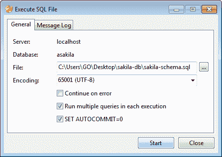
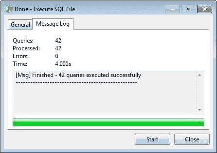

# 三、将 Navicat 用于数据管理

在过去，我们中的一些人会很难处理数据库及其内容，在控制台窗口中键入命令或使用功能有限的原始 GUI 工具。当涉及到将数据库从一台服务器迁移到另一台服务器，甚至是从备份进行简单的恢复时，这些特技可能会变成乏味的任务。在本章中，我们将看到使用 Navicat 执行所有这些任务是多么简单和省时。

此外，我们将使用 Navicat 的复杂工具处理大块数据，您将学习如何：

*   使用多种格式导入和导出数据，如 XML、Excel 文件、`.csv`和`.sql`
*   不同数据库之间的直接数据传输
*   同步数据和结构
*   备份数据库以便以后恢复
*   创建和计划批处理作业

# 使用现有数据库

从现在开始，我们将使用一个名为 Sakila的现有示例数据库。除了在 MySQL 徽标中是海豚的名字外，Sakila 是 Mike Hillyer 开发的电影数据库的一个例子，Mike Hillyer 是 MySQL AB 文档团队的前成员，旨在提供一个可以在书籍、教程和文章中使用的标准模式。它还用于突出 MySQL 5.x 中引入的特性，包括视图、存储过程和触发器。MySQL 5.5 Community Edition 的默认安装包括一个 Sakila 副本和另一个名为 World 的示例数据库。如果您的计算机上已经安装了 MySQL 服务器的一个版本（早于 5.5），并且由于特定原因不想升级，我们在本书的示例代码中包含了 Sakila 数据库的转储文件副本。您也可以从[下载 http://dev.mysql.com/doc/index-other.html](http://dev.mysql.com/doc/index-other.html) 。到达页面后，选择**其他文档**选项卡并查看**示例数据库**部分。在那里，您还可以找到其他示例数据库，通过这些数据库，您可以试验并应用本章学到的知识，如以下屏幕截图所示：

下载 Sakila 的压缩档案（以`.zip`或`.tgz`格式）并提取其内容后，您将在名为`sakila-db`的文件夹中找到三个名为 SQL 转储文件的文件。我们只需要其中两个-`sakila-schema.sql`和`sakila-data.sql`。我们将使用`sakila-schema.sql`在 MySQL 服务器上生成 Sakila 数据库；将创建构成数据库结构的所有表、视图、函数和存储过程。另一个文件`sakila-data.sql`将填充 Sakila 数据库的数据。

## 从 SQL 转储文件创建数据库架构

现在，要在您的服务器上生成 Sakila 数据库，我需要您从 Navicat 主窗口的**连接**窗格右键单击**本地主机**（或您为其定义连接的任何服务器），并按照以下步骤操作：

1.  Select **Execute SQL file...** from the contextual menu that pops up, as shown in the following screenshot:

    

2.  然后将打开一个新的、更小的窗口，其中有两个选项卡，您将在其中指定要执行操作查询的 SQL 文件（在本例中为 SQL 命令），以创建数据库及其对象。在**执行 SQL 文件**窗口的**常规**选项卡下，点击**文件**字段右端的小方形按钮，点击选择`sakila-schema.sql`。
3.  If the other settings in this window look like what you see in the screenshot, such as the **Encoding** which should be **65001 (UTF-8)**, you can directly proceed to click on the **Start** button.

    或者，您可以取消选中**继续错误**，以确保在机器上生成 Sakila 之前，您的设置正确无误；如果没有，操作将被中断，您将提前知道需要重新检查有关数据库服务器安装和连接属性的设置。换句话说，默认设置的操作应该很好，但是如果查询执行过程中出现任何错误，可能是由于配置错误造成的，最好停止创建数据库，并参考上一章修改设置。

    或者，您可以选中**继续出错**选项，并执行 SQL 文件中的所有查询。如果出现任何错误，您可以参考窗口第二个选项卡下的**消息日志**。请参阅以下屏幕截图：

    

4.  After you finish executing the SQL file, you will automatically be switched to the **Message Log** tab, as shown in the following screenshot:

    

5.  在此阶段，可以通过再次点击**开始**按钮或关闭窗口重新开始。
6.  Going back to Navicat's main window, there appears to be no change. Now what? Nothing to worry about; we just need to refresh the view to see our newly created Sakila database and its objects. Right-click on **localhost** again, and select **Refresh** from the pop-up menu (On the Mac, it's labeled as **Refresh Connection**).

    这是 Navicat 最强大的功能之一。在短短几秒钟内，我们执行了一个 SQL 转储文件来重新创建数据库，而无需在控制台窗口中键入命令，也无需在复杂的屏幕中进行，如以下屏幕截图所示：

    

所有的**表**、**视图**、**函数**和存储过程现在都列在主窗口中。点击**表格**查看我们得到了什么。在典型的关系电影数据库中，我们几乎可以找到所有元素，比如电影、演员、类别、职员，以及一些关联表，它们也被称为连接表，比如**电影演员**和**电影类别**。双击其中一些，查看它们在 Navicat 中的外观。还有一些自定义视图，例如**更好但更慢的电影列表**和**按电影类别划分的销售额**。

然而，您会注意到的第一件事是，这些**表**和**视图**都是空的，没有数据。这是因为我们执行的`.sql`文件只包含数据库结构。因此，我们只创建了空白数据库模式，并且需要在本节的开始重复步骤来执行另一个称为“OutT1”的 SQL 转储文件，该文件包含填充数据库的数据。

现在我们有了完整的数据库，有了一个完整的结构，可以随意使用了，是时候用一些数据来填充它了。

右键点击左窗格树状视图中的**sakila**数据库，通过验证其小圆柱体图标是否为绿色来确认其已连接，然后从弹出菜单中选择**执行 SQL 文件**。这一次，选择`sakila-data.sql`并点击**开始**。辅助窗口的标题应为类似于**执行 SQL 文件**的内容，**消息日志**页签应为**【Msg】完成-56 个查询成功执行**。

# 数据导入导出

在上一节中，我们实际上已经使用 SQL 转储文件导入了**sakila**数据库。在本节中，我们将更详细地介绍 Navicat 的导入/导出功能。

作为我们的第一个练习，我们将把我们在[第 2 章](2.html "Chapter 2. Working with Databases")*中创建的**我们的【UFirst】数据库**导出到一个`.sql`文件中，这样它就可以在另一台 MySQL 服务器上重新生成，或者作为同一台服务器上数据库的另一个实例重新生成。要导出**我们的【首个】db**，请执行以下步骤：*

1.  右键点击**我们的【第一个】数据库**并选择**转储 SQL 文件。。。从弹出菜单中选择**。（如果该菜单项变暗，因此处于非活动状态，您可以首先从同一弹出菜单中选择**打开数据库**，然后再次右键单击该菜单项，继续执行预期步骤。）
2.  Finally, indicate the path where you want the SQL dump file to be created and by what name you want it to be saved in the **Save as** dialog box, and click on **Save**. Your database will be exported or dumped into a `.sql` file, which, when executed as described in the previous section, will be regenerated exactly with the same structure and data you created, as shown in the following screenshot:

    

前面的过程距离导出整个数据库仅一步之遥，尽管 Navicat 中还有其他数据导出方法的变体，本章稍后将介绍这些方法。例如，**sakila**数据库有两个独立的`.sql`文件，一个用于模式，另一个用于数据。如果您使用相同的方法导出**sakila**，即通过运行**转储 SQL 文件**命令，Navicat 将在单个转储文件中导出整个数据库。

关于 Navicat 导出 SQL 转储文件的方法，需要了解的一点是，Navicat 在文件中不包含创建数据库的命令，例如`CREATE``DATABASE``db_name`。

因此，在执行由 Navicat 创建的转储文件之前，应首先选择一个数据库或创建一个新数据库，然后继续执行以生成架构并填充数据（如果有）。

如果要在不同的管理工具（如 phpMyAdmin 或 MySQL Workbench）中使用导出的`.sql`转储文件，则应手动添加创建数据库的 SQL 命令。例如，您可以使用文本编辑器在文件开头添加一行代码`CREATE``DATABASE``our_first_db`。

Navicat 另一个最受欢迎的功能是能够将数据导出为多种格式。一些主要问题将在稍后讨论。

## 详细出口

如果您是数据库管理员或某种 IT 分析师，您可能会经常收到业务请求，要求向客户提供来自公司内部网上数据库的表或查询的输出，通常采用 Microsoft Excel 格式。在这种情况下，Navicat 可以非常方便地导出所需的数据和各种导出选项。

您可以打开任意**表**、**视图**或**查询**，然后点击窗口工具栏上的**导出向导**按钮。执行此操作时，Navicat 会询问您是否要导出表中的所有数据（在 Windows 版本中）。

现在这部分有点棘手。首先，*表达式**中的表***表中的所有数据都是指您正在处理的数据库对象的类型。导出**视图**或**查询**的结果时，**导出表中的所有数据**表示您一直在处理的**视图**或**查询**的结果列表中的所有数据。其次，**所有数据**表示数据库表中的所有记录，即使显示的数据量有限。请注意，Navicat 在显示**表**、**视图**或**查询**的内容时，默认最多显示 1000 行，以避免数据库服务器上的繁重工作负载。

单击结果窗口右下角的一个小工具集图标可以更改或删除此限制，如以下屏幕截图所示：

要查看此操作，请执行以下步骤：

1.  进入**sakila**数据库中的**表**，双击名为**film**的表。您应该可以看到一个电影列表，其中包含详细信息，如**片名**、**描述**、**上映**等。
2.  单击右下角的工具集图标，设置上一个屏幕截图中显示的结果数量的限制。数据库**sakila**在 films 表中包含一千个标题，因此在测试下一步将导出多少行之前，请将限制设置为`500`。
3.  Now, click on the **Export Wizard** button on the toolbar (alternatively an **Export Wizard** command is also available in the **File** menu), and then click on **Yes** when you are prompted with **Do you want to export all data in the table?**.

    您将看到**导出向导**窗口，在该窗口中，您需要指定导出文件格式，选项范围从**数据库**文件格式到**MS Access 数据库**或**Excel 电子表格**到**XML**不等。

    虽然 Windows 版本的 Navicat 提供了过多的文件格式选项可供选择，但 Mac 版本的导出文件格式选项较少（这解释了 Mac 版本稍微便宜的原因）。具体来说，CSV、纯文本、XML、Dbase 文件（`.dbf`）和 Excel 格式是文件格式。您可以参考以下屏幕截图，其中包含 Mac 和 Windows 版本的 Navicat 的屏幕截图。此屏幕截图比较了用户界面元素的差异，如工具栏和图标以及文件导出选项：

    

    导出到 Excel 时需要注意的另一点是，将创建的电子表格版本取决于计算机上安装的 Microsoft Excel 版本。

4.  After you select the desired output file format, you can click on **Next** in Windows (or simply the **Continue** button in the Mac version) for the next step, where you will be setting the destination filename, the encoding, and a few more options.

    即使您在单个表输出上启动了导出操作，此步骤也允许您选择数据库中的其他表导出到单独的文件（除非在提示导出所有数据时单击**否**，；也就是说，您可以将每个表导出到单独的文件中，如以下屏幕截图所示：

    

    更重要的是，您甚至可以将多个表（或全部）导出到单个文件中。只需在**导出到**列下的相应字段中为每个源表指定相同的文件名（和路径）即可。这种方法会产生不同的后果，具体取决于您首先选择的文件格式。例如，如果选择将两个或多个表导出到单个 Excel 文件（`.xlsx`，则每个表都将是同一文件中的单独电子表格。

    要设置要导出的文件的编码，请单击**高级**按钮以显示一个小的弹出对话框窗口。默认的**编码**对应于**65001（UTF-8）**，您可以从下拉列表中进行更改。

    在**编码**选择框下，还有一个复选框，用于向导出的文件名添加时间戳作为后缀。如果您经常执行此任务，并且最终在文件夹中以相同的名称累积了一堆导出的文件，那么这对于区分这些文件非常有用。您甚至可以选择不同的日期模式，例如时间戳的**YYYY-MM-DD-HHNNSS**和**MM-DD-YYYY**，这将为输出文件名添加后缀。

    ### 注

    在 Windows 版本的 Navicat 中，有两个导出到 Excel 的选项。其中之一是**Excel 电子表格（*.xls）**，这也是 Mac 版本中唯一可用的选项。第二个是**Excel 文件（2007 或更高版本）（*.xlsx）**。使用前一个选项，您无法成功地将多个源表导出到单个目标文件中，而使用后一个选项，您可以实现这一点，因为它使用安装了 Microsoft Office 的计算机上的某些组件。使用此选项导出的 Excel 文件创建速度较慢，但其版本与电脑上安装的 Office 版本完全匹配。

5.  The next step is selecting the columns (or fields) for exporting by checking all the checkboxes of table, view, or query, by default. In order to omit some of them, simply uncheck **All Fields** first, and then uncheck the (un)desired fields listed under **Available Fields**.

    如果您要导出多个表，并且希望为每个表指定不同的列选择，则需要为要导出的每个表重复此步骤，方法是从标记为**源表**的下拉列表中进行选择，然后选中/取消选中其下方列表中的字段名，在表之间切换时会自动更新。

6.  In the next screen, you can specify whether or not you want an additional row at the top of the exported file containing the column titles. Also, you can opt to append exported records to an existing file. Also, you can check the option **Continue on error**, which will prevent the operation from halting in the event of an error.

    如果要导出其他文件格式，例如 XML 或文本文件，则可能会显示其他选项，例如，在其中指定设置，例如行和字段分隔符、文本限定符以及日期、时间和数字的格式。

    ### 注

    在 MySQL 和 Oracle 或 Microsoft SQL 数据库之间传输或交换数据的最佳且简单的方法之一是在从表导出数据时使用 XML 格式。

7.  完成后，点击**下一步**进入最后一步，开始导出流程。如果您选择了`.xls`格式而不是`.xlsx`，则导出应在几秒钟内完成。操作完成后，您可以从进度条和消息日志中看到。

## 将文件导入到表中

导出**表**、**视图**或**查询**的文件格式同样适用于将数据导入表中。Excel 电子表格、XML 和 CSV 文件是用作数据源的最流行的文件格式之一。

业务部门定期向 IT 部门发送 Excel 电子表格，并请求使用其内容中的信息更新公司数据库，这是工作中最常见的场景之一。在某些情况下，制作电子表格的人往往忽略保持列名的一致性，例如，SALES_REP 可以在下一次成为 SALES_person，而 SALES_REP_ 则在另一次成为 SALES_REP_NAME。幸运的是，Navicat 会提示您将源列与目标字段相匹配，这也使您可以灵活地省略一些或添加其他字段。

从 Excel 或 CSV 文件导入数据时，请记住正确设置字段名行和第一个数据行，通常不应相同。

在屏幕截图中给出的示例中，您可以看到从 Excel 文件将其他演员导入演员表的方式，但是一些列名必须是手动匹配的以获得命名差异，例如**演员 id**-**演员编号**和**名字**-**名称**：

除了前面提到的流行数据格式外，还可以在 Windows 版本的 Navicat 中从 ODBC 数据源导入数据。这需要一些 ODBC 设置知识，以便能够指定连接参数。您可以在 Navicat 的官方手册中找到有关 ODBC 导入的详细信息。

# 两个数据库之间的直接数据传输

Navicat 的另一个旗舰功能是能够将数据库对象（**表**、**视图**、**函数**和**事件**从一个数据库传输到另一个数据库，或传输到 SQL 转储文件。目标数据库可以在同一台服务器上，也可以在另一台服务器上。您所需要做的就是按照[第 1 章](1.html "Chapter 1. Getting Started")*入门*中的描述定义与它的连接。数据传输设置也可以保存为配置文件以供以后检索，也可以安排为作业。

您可以通过选择**数据传输。。。从主菜单栏中的**工具**中选择**，或者右键单击左侧导航窗格中的数据库并选择**数据传输。。。**。启动后，您可以在**数据传输**窗口中开始指定设置，如下图所示：

虽然这里的界面相当直观，在**常规**选项卡下有两个主要区域，分类为**源**和**目标**，让您选择要将哪些对象传输到哪里，但在开始之前，有几点需要了解，除非你想通过艰难的尝试和错误来学习如何使用它。首先，您需要事先准备好目标数据库，这意味着您至少需要创建一个空白数据库作为接收数据库对象的目标，因为 Navicat（在编写本文时）并不创建数据库本身，而是将对象复制到指定的目标。您也可以选择传输到已包含某些对象的现有数据库，但在这种情况下，您可能希望确保这些对象的名称与源中的对象的名称不同，除非您希望覆盖或跳过它们。

其次，您可以选择导出到 SQL 转储文件，这在某种程度上类似于我在本章开头介绍的内容，只是在这个屏幕上，您可以通过文件编码指定从 MySQL 3.23 到 6.0 的 SQL 格式。

如果目标服务器版本与源服务器版本不同，则直接传输可能会失败，您可能必须以这种方式导出 SQL 文件。

在**高级**选项卡中，您可以指定一些附加设置，例如继续出错和在创建前删除目标对象。这意味着源中任何具有相同名称的现有文件都将被覆盖。

与 Navicat 的所有其他实用程序窗口一样，完成设置配置后，单击**开始**开始该过程。根据数据库的大小、数据量、两台服务器之间的距离以及您的连接速度，该过程可能持续数秒到数分钟，甚至数小时。我个人通常不需要等待很长时间，就可以将我的博客数据库从位于另一个大陆的网络托管公司的服务器上转移过来，我的博客上有大约 2860 条帖子，包括评论。

# 数据与结构同步

如果在不同的服务器上有多个数据库实例，例如，一个用于开发，一个用于测试，另一个用于生产，那么为了保持一致性，有时在一个服务器上进行更改（很可能在开发中）需要将完全相同的更改应用于其他服务器，这可能是一个挑战。作为人类，我们经常犯忽略所有服务器上的一个或多个更改的错误，并在部署后导致意外错误。

Navicat 也在这一地区展开救援，其结构和数据同步向导可从**工具**菜单访问。

同步工具可能有用的另一种情况是，以前执行的数据传输操作未成功完成。之后可以使用结构和数据同步对目标数据库进行修饰。

这两种工具的使用或多或少与**数据传输**接口相同，在该接口中，您可以完全指定要比较的源和目标数据库对象以及详细信息。例如，在**结构同步**中，您可以选择将表与主键、外键、索引进行比较，也可以选择排除**常规**（**Mac 上的常规设置**页签下的触发器、字符集和自增值。因此，您可以通过单击相应的复选框来指定要执行的 SQL命令类型的选择，您可以从中选择 CREATE、ALTER 和 DROP。您甚至可以选中一个选项，以便在流程执行后再次进行比较。在 Navicat 的 Windows 版本中，在窗口的右下角有一个标记为**比较**的按钮。在 Mac 版本中，按钮位于窗口工具栏的左上角，带有缩放图标。单击它开始比较源数据库和目标数据库的结构。请参阅以下屏幕截图：

接下来，我们需要转到第二个选项卡**比较**（**比较结果**在 Mac 上），这将给我们一种预览源和目标之间存在哪些差异的方式，并且同步的 SQL 查询将根据需要的修改在窗口的后半部分列出。您可以通过单击相应的复选框来单独选择要执行的查询，或者单击列表中的任意位置以显示弹出菜单，该菜单将允许您选择/取消选择全部，以及复制 SQL 语法。

完成后，单击**运行查询**继续。然后，您可以查看**消息日志**以查看结果。

**数据同步**稍微简单一些，只需选择源数据库和目标数据库即可。Navicat 会自动列出并匹配两侧的表，以便您可以验证两侧的每个表是否对应。在**高级**选项卡下，您可以指定是否要：

*   使用事务
*   显示同步细节
*   插入记录
*   删除记录
*   更新记录

最后，您可以点击**预览**查看数据将如何同步，然后点击**启动**按钮让它实际发生，并在**消息日志**中查看执行的命令。

# 备份和恢复

在发生灾难时，无论是停电导致磁盘故障导致数据库损坏，还是仅仅是用户删除错误对象或数据行导致数据丢失的错误，备份数据库都至关重要。Navicat 允许您备份数据库的所有**表**（及其记录）、**视图**、**函数**和**事件**，以便稍后恢复。

Navicat 主窗口的工具栏上有一个带盒式磁带图标的大**备份**按钮，它将带您进入一个管理备份的特殊视图，其中主工具栏下会出现一个较小的工具栏。这个较小的工具栏具有用于创建新备份、还原备份或删除备份的较小按钮，以及用于从备份中提取 SQL 的按钮。

要创建新备份，请执行以下步骤：

1.  单击对象窗格工具栏（Windows 版本）中的**新建备份**按钮，或右键单击对象窗格本身的任意位置，从弹出菜单（Windows&Mac）中选择**新建备份**。
2.  在出现的窗口中，输入要进行的备份的属性，例如您自己对备份的注释以及要包含在备份中的对象。（默认情况下，所有对象都处于选中状态。）
3.  然后点击**开始**以指定的设置进行备份。

Navicat 在这里还提供了一些高级选项，例如压缩、表锁定，以及对 InnoDB 表使用单个事务的能力。

### 注

如果您选择在**高级**选项卡中使用压缩，将创建扩展名为`.psc`或`.psb`的备份文件。

右键单击备份并从弹出菜单中选择**对象信息**，将在窗口底部打开另一个窗格，您可以看到文件的大小和完整路径，以及上次修改日期。默认情况下，备份保存为**我的文档**下的子文件夹层次结构中的单个文件。例如，我的备份存储在`C:\Users\GO\Documents\Navicat\MySQL\servers\localhost\sakila\sakila_bu.psc`中。您可以将`.psc`或`.psb`格式的备份文件复制或移动到另一台计算机，就像在 Windows 资源管理器或 Macintosh Finder 上处理任何其他文件一样。

恢复备份更简单。您可以右键单击备份列表中的备份，然后从弹出菜单中单击**恢复备份**。要恢复在另一台计算机上创建并复制到您正在使用的计算机上的备份，请单击工具栏上的**恢复备份**按钮。否则，右键单击对象窗格的空白区域，从弹出菜单中选择**恢复备份**，并使用“打开文件”对话框选择备份文件。确保您拥有创建、删除和插入操作所需的权限，除非您是使用**root**用户连接到数据库的。

要删除不需要的备份，您也可以右键单击它并选择**删除**。

还可以从运行以下命令的命令行界面创建备份：

<colgroup><col style="text-align: left"> <col style="text-align: left"> <col style="text-align: left"></colgroup> 
| 

Navicat 对象

 | 

命令和参数

 | 

文件扩展名

 |
| --- | --- | --- |
| 备份 | `Navicat.exe /backup ConnectionName DatabaseName` | `.psc`（压缩）/`.psb`（未压缩） |
| 备份服务器 | `Navicat.exe /backupserver ConnectionName` |
| 备份数据库 | `Navicat.exe /backupdatabase ConnectionName DatabaseName` |

# 创建和调度批处理作业

在没有人工干预的情况下在计算机或服务器上执行一系列任务被称为**批处理**，这是大多数 DBA 每天都要做的事情，如果不是一直做的话。这些任务称为**作业**，设置为在后台无人值守运行，通过脚本或命令行参数预选所有输入数据。

Navicat 提供了类似的功能，允许您创建批处理作业和设置计划，这些作业可以按定义的时间间隔或特定的日期和时间执行，也可以同时执行。

可以为查询、报表打印、备份、数据传输、数据同步以及数据导入和导出创建批处理作业。您可以定义要在单个批处理作业中执行的操作列表，这些操作可以随意手动运行，也可以计划在指定时间甚至定期运行。

通过从菜单栏中选择**查看****日程安排**或按下主工具栏上的日历图标按钮，可以切换到与批处理作业和日程安排相关的视图。

要创建新的批处理作业，请执行以下步骤：

1.  单击对象窗格中的空白区域。
2.  单击鼠标右键，从弹出菜单中选择**新建批量作业**，或单击对象窗格工具栏中的**新建批量作业**按钮。
3.  Enter the properties for the job that basically consists of selecting the actions to be performed, by selecting them from available jobs, putting them in the desired order, and specifying some advanced settings such as configuring e-mail notification, as shown in the following screenshot:

    

您可以通过按工具栏上的**设置任务计划**按钮来设置此作业的执行时间。这将带来另一个弹出窗口，在该窗口中，您可以在**计划**选项卡下设置作业的周期或频率，或者指定开始日期和可选结束日期以及重复次数。

**高级**选项卡允许您配置电子邮件，以便自动运行批处理作业后，可以将结果通知用户或一组用户。甚至可以通过自动生成和发送的电子邮件附加导出向导或数据传输的文件输出。

要基于现有作业创建批处理作业，请选择一个作业，然后单击对象窗格工具栏上的**设计批处理作业**，或者从右键单击作业触发的弹出菜单中选择该作业。完成修改后，您可以点击编辑器窗口工具栏上的**另存为**按钮或选择**文件****另存为。。。从菜单栏中选择**。

实现相同结果的另一种快速简便的方法是，在选择作业后简单地复制和粘贴作业，然后对复制的作业执行所需的修改。

# 总结

在本章中，我们讨论了不同的数据处理技术，将数据从一个数据库传输到另一个数据库，并将其转换为不同的文件格式。

您还学习了通过结构和数据同步数据库的两个实例。

备份和恢复操作以及批量作业创建和调度在数据库的生命周期（以及 DBA 的生命周期）中也是必不可少的，您已经学会了如何使用 Navicat 提供的快速简便的工具来完成这些任务。

在下一章中，您将使用 Navicat 进行数据建模。