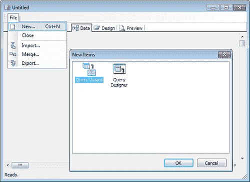
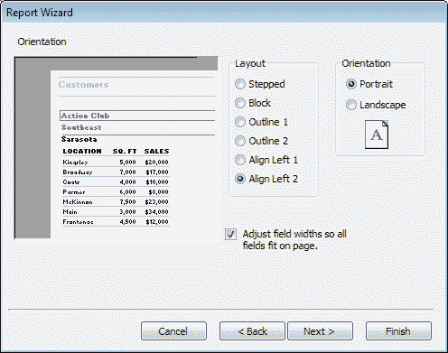
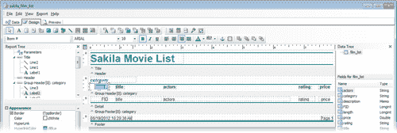
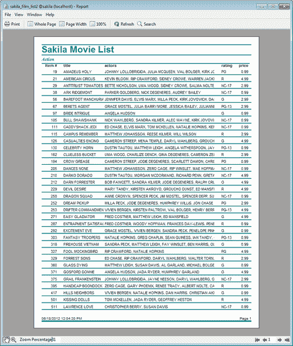

# 六、使用 Navicat 设计报告

在编写本书时，Windows 版本的 Navicat 版本 10 附带了一个功能强大的**报表生成器**，且仅在其企业版中提供。使用 Navicat 的报表生成器，您可以在各种报表中显示 MySQL 数据库中的数据，例如发票、销售数据、订单摘要、甚至表单和邮件标签（也称为邮件合并。您甚至可以设置一个调度程序（参见[第 3 章](3.html "Chapter 3. Data Management with Navicat")、*使用 Navicat*进行数据管理），以便在特定时间和/或规定的时间间隔自动交付报告。

正如您将在下一节中看到的，Navicat 的**报表设计器**在许多方面与 Microsoft Access 的**报表模块**相似。

为了能够遵循本章中的教程，您需要导入[第 3 章](3.html "Chapter 3. Data Management with Navicat")、*中介绍的使用 Navicat*进行数据管理的 Sakila 示例数据库。

从 Navicat Premium 和 Navicat for MySQL 的第 10 版开始，Windows 企业版中包含了一个功能强大的报表生成器工具。本章将培训您发展技能，例如：

*   通过在 GUI 中设计报表查询来准备数据集
*   使用向导设计报告
*   自定义报表设计
*   以多种格式打印到纸张或文件

# 首次接触刀具

要访问 Navicat 的**报表管理器**，只需从左侧导航窗格中选择服务器和数据库，然后单击 Navicat 主窗口工具栏上的**报表**大按钮。或者，您可以从主菜单栏中选择**查看**|**报告**。进入**报告**（管理器）上下文后，您可以使用辅助工具栏上的按钮创建、编辑或删除报告，或右键单击对象窗格中的任意位置以调用弹出菜单，该菜单将允许您执行相同的操作，如以下屏幕截图所示：

现在，让我们根据**sakila**数据库中名为**film_list**的视图设计一个简单的报告。

使用前面描述的方法之一创建新报告。将出现一个新的、更大的**无标题**窗口，默认情况下其**设计**选项卡处于活动状态。您还将注意到，此窗口的用户界面可能是 Navicat 功能的所有其他工具中最复杂的，因为 Navicat 的报表设计器是一个成熟的报表生成应用程序。

对于空白报告，我们首先需要做的是选择一个数据集，我们将使用该数据集填充报告。因此，我们需要切换到此窗口的**数据**页签来指定报表数据的来源。

# 使用查询向导准备数据

第一次打开**数据**页签时会出现一个空白页。很难想象下一步会是什么。请参阅以下屏幕截图：

在这一点上指定一些数据源有点令人沮丧，因为右键单击空白区域不会产生任何结果，而且在**数据**选项卡下也没有工具栏。相反，您需要转到菜单栏的**文件**菜单并选择**新建。。。**。这将弹出一个小的模式对话框，要求您运行**查询向导**或**查询设计器**，如下图所示：

此时我们将使用**查询向导**，确保其图标高亮显示，然后点击**确定**。**查询向导**窗口显示两个可滚动的列表框（并排），一些程序员也将其称为穿梭列表。左侧标题为**Available Tables**的列表框包含我们**sakila**数据库中所有**表**和**视图**的名称，右侧标题为**Selected Tables**的列表框指示我们从可用项目中选择的项目。

您必须单击并从左侧列表中选择一个或多个项目，只要您按下**>**按钮，这些项目就会转移到右侧列表中。

为了我们的简单教程，我们只需要**胶片列表**视图。只需点击其名称将其选中，并将其移动到名为**Selected Tables**的列表框中，然后点击**Next**。**查询向导**窗口截图如下：

您只需再次点击**下一个**即可跳过下一个屏幕，因为我们需要选择的数据库视图中的所有字段，并且默认情况下，此选项已在该屏幕中选中。

在显示的屏幕中，如果我们想**将计算字段添加到查询**，我们将再次跳过它，方法是点击**无计算**，然后再次点击**下一步**。

现在我们看到了**根据公共字段值**将行分组的选项，我们还想通过点击**不分组**并再次点击**下一步**来传递该选项。

至于**限制返回的行数**画面，我们这里不想限制，所以将**所有行**都选择而不做任何更改，再次点击**下一步**。单击**下一步**后，显示的窗口将类似于以下屏幕截图：

这里，我们将被问及所选数据集的行的排序方式。默认选项为**自然顺序**，这将按照**视图**中显示的相同顺序将结果带到报告中（最有可能按照 ID 对项目进行排序）。然而，我认为在我们的报告中，按类别和电影名称对它们进行分类是一个好主意。因此，选择**设置顺序**，然后将**胶片列表类别**移动到标题为**选定字段**的列表框中，然后对**胶片列表标题**执行相同操作，最后一次点击**下一步**。

最后一步将要求我们为查询提供一个我们选择的名称，在我们最终点击**Finish**之前，我们可以指出我们的偏好是**返回数据工作区**、**预览查询**还是**修改查询的设计**。使用第一个选项，这是默认的。因此，当我们完成后，我们的数据工作区现在将包含**电影列表**视图，如以下屏幕截图所示：

现在，为了了解我们刚刚准备的数据集，点击**电影列表**窗口工具栏上的第一个小按钮，将弹出一个名为**预览数据–电影列表**的弹出窗口，显示我们刚刚创建的查询中的电影记录。您可能需要放大窗口并手动调整列长度，方法是将鼠标箭头悬停在列标题边框上，然后单击并将列拖动到所需的长度，如以下屏幕截图所示：

预览完查询结果后，只需点击此窗口右下角的**确定**。

工具栏上的其他七个按钮帮助我们打开报表的**查询设计器**窗口，该窗口允许您通过选择表和字段、定义过滤条件、分组字段等方式修改查询。

现在，您可以点击**film_list**表工具栏上的第二个按钮，在**Tables**选项卡处于活动状态的情况下，调用**查询设计器**，将更多的表或视图加入到查询中。同样，第三个按钮将帮助您打开**查询设计器**，其**字段**选项卡处于活动状态，以修改我们首先使用**查询向导**指定的所选字段，如下图所示：

**查询设计器**有一些高级功能，这里只简单介绍，不做详细介绍。

例如，在**Calcs**选项卡中，您可以使用聚合函数定义一些动态字段，例如`sum()`、`avg()`、`min()`、`max()`、`count()`，或者任何可以用作 MySQL 支持的函数的 SQL 表达式。

另一个例子是**搜索**页签，您可以在其中定义一些预过滤条件，这些条件将作为`WHERE`条件添加到 SQL 查询中。

为了这个简单的报表，我们暂时离开**查询设计器**，切换到报表生成器的**设计**选项卡，最终开始处理报表的布局。当我们回到**设计**选项卡时，会提醒我们，被划分为三个区域的画布，如**页眉**、**细节**、**页脚**（也如左上角标题为**报表树的窗格**中所示）仍然为空。然而，在窗口的右侧，我们现在可以看到**数据树**下的**胶片列表**，以及其下方的**胶片列表**字段。

# 设计报告

虽然我们可以通过单击右侧列出的字段并将其拖动到画布上并根据需要对齐来设计报表的布局，但通常情况下，在没有向导的情况下，报表就是这样设计的。这可能会变得相当复杂，因此我将向您展示一种更简单的方法，这将有助于在短时间内完成此报告。

进入**文件**菜单，选择**新建。。。**。一个名为**新项目**的新对话框将弹出，并显示四个按钮，分别为标记为**报表向导**、**报表**、**标签模板**和**交叉选项卡向导**的图标。我答应了更简单的方法，所以我们需要**报告向导**来实现这一点。默认情况下应高亮显示，但请确保选中了。然后点击**确定**，如下图所示：

现在，我们应该看到一个名为**报告向导**的模式窗口，它与其他应用程序（如 Microsoft Access）中的向导非常相似。此向导的使用非常直观，因为每个步骤都包含可理解的解释和用户界面元素。在**报告向导**的第一个屏幕上，您将被要求选择需要显示在报告上的数据集及其字段。

对于本报告，将**FID**、**title**、**category**、**actors**、**rating**和**price**按此顺序添加到所选字段，然后单击**Next**。

**报告向导**的下一个屏幕是我们可以指定所选数据可能分类的组。点击**可用字段**中的**类别**，按下两个列表框之间对应的向下箭头，将其移动到**组**列表框。执行此操作时，还应注意报告布局预览将通过反映此更改进行更新，如以下屏幕截图所示：

点击**下一步**进入屏幕，我们将选择**布局**样式，并选择（默认）页面打印**方向**。现在，因为我们选择了按类别对报告输出进行分组，所以这里总共显示了六个**布局**样式的选项。在另一种情况下，我们只有两种布局可供选择-**垂直**（打印标签或卡片样式）或普通**表格**。

在本例中，我们拥有的**布局**样式选项为：

*   **步进**
*   **块**
*   **提纲 1**
*   **提纲 2**
*   **左对齐 1**
*   **Align Left 2**

    

至于**方向**选项，它们只是由**纵向**和**横向**组成，您应该非常熟悉您每天使用的其他程序中的打印选项。

对于我们的报告，我将敦促您选择**左对齐 2**作为**布局**样式，页面（打印）**方向**选项作为**肖像**，这是默认设置。除非您希望以后手动调整报告布局上的列宽，否则您应该保留选项**调整字段宽度，以便所有字段都适合页面**选中。

完成后，单击**下一步**。请参阅以下屏幕截图：

**报告向导**窗口将要求您从现成报告设计或模板的选择列表中选择主题样式，您可以选择以下选项：

*   **粗体**
*   **休闲**
*   **紧凑型**
*   **法人**
*   **正式**
*   **软灰色**

尽管如此，在单击每个选项的左侧设计预览中，它会动态更新，让您了解报表的外观。尽可能多地尝试这一点可能是一个好主意，这样您就可以熟悉报告中反映的每种样式。

我个人最喜欢的是**休闲版**，从本章的这一点开始，您将在报告设计和预览的屏幕截图中看到。

当您点击**下一步**时，您将感谢到目前为止已经提供了创建报告所需的所有信息，并且您将获得立即预览报告或直接修改报告设计的选项。

首先，在预览报告之前，让我们做一些最后的润色，所以在点击**完成**之前，请选中第二个选项。

当我们回到报告设计时，我们会高兴地注意到画布不再是空白的。另外，**标题**、**页眉**、**细节**和**页脚**都有点奇怪，因为它们都填充了我们在**报表向导**中定义的标签和数据占位符，但看起来还是很小。

为了使报告看起来更“人性化”，我们可以先将标题更改为更自然的内容，例如`Sakila Movie List`，然后通过给列标题标签起更好的名字来修改它们。例如，将其命名为`Item #`而不是**FID**（表示胶片 ID）。请参阅以下屏幕截图：

您还需要调整列宽以有效地使用空间。例如，您会特别注意到**评级**、**价格**和**类别**列的宽度超出了应有的范围。因此，您可以将其向右移动并减小其宽度。然后，增加**演员**和**标题**的宽度。请记住将列名和数据字段（数据的占位符）垂直对齐，这两个字段分别放置在标题和详细信息区域中。

另外，强烈建议调整**类别**字段的外观，这将极大地影响报告的外观和感觉，使其看起来更美观。

# 切换到预览页签

现在，我们应该切换到**预览**选项卡，看看我们的报告及其输出是什么样子。

在报表预览中，您可以尝试使用工具栏上的按钮来调整查看设置，例如选择如何使报表数据适合页面、打印选项以及报表输出上的文本搜索。您还可以使用箭头形状的小按钮在报告页面之间导航。请参阅以下屏幕截图：

如果尚未保存报告，现在是保存报告的好时机。Navicat 在保存报告方面有一些特殊性，这与它处理其他对象的方式不同，例如**查询**、**事件**和**模型**。首先，要保存您的报告，您需要进入菜单栏并选择**文件****保存**。当您第一次保存报告时，系统会提示您使用标准的**另存为**对话框。然后，为报告指定一个名称，该名称将以文件扩展名`.rtm`作为后缀，并在文件系统中指定一个位置，这表明您可以将报告存储在驱动器上的任何位置。但是，当您单击对话框的**保存**按钮时，Navicat 将提示您确认警报，警告您，如果您将报告保存在 Navicat 的默认报告目录之外，您的报告将在程序内的**报告**视图中不可见（在这种情况下，每次需要在 Navicat 中访问报告时，都必须使用**打开文件**对话框来定位报告）。请参阅以下屏幕截图：

即使您希望将报告文件保存在文件中的特定文件夹中，也最好保存到默认位置，您可以通过以下路径在 Windows 资源管理器中访问该位置：

`\Users\<user_name>\Documents\Navicat\MySQL\servers\localhost\sakila`

保存报表并退出**报表设计器**后，需要在**报表**视图中右键点击其名称，从弹出菜单中选择**设计报表**。双击已保存的报告直接进入报告输出窗口（与设计器的**预览**选项卡非常类似），您可以从中打印报告或仅查看屏幕上的内容。

您不仅可以在纸上打印报告，还可以生成各种格式的输出，包括 PDF、Excel、文本和 HTML。您可以在**打印**对话框中动态指定此选项。

如果您的目标是基于文本的输出，您可能需要通过选择**文件****打印到文件设置来调整更多设置。。。**并指定一些参数，例如列分隔符和要包含在输出中的字段。

Navicat 的报告构建和管理比本章讨论的内容和本介绍性书籍范围之外的内容做得更多。但是，您可以通过自己的实验，也可以参考 Navicat 网站上的手册，深入探索这些功能。在那里，您还可以找到更多分步和逐屏教程，这些教程可以教您如何创建更高级的报告，例如发票、详细订单摘要、销售统计、交叉表报告、邮寄标签，甚至相册。

# 总结

在 Navicat 中构建报告包括两个主要阶段：准备数据和基于数据设计报告。

在本章中，我们了解了 Navicat 的报表构建和管理工具，以及通过简单教程设计报表的基础知识，这也有助于了解一些可用于更高级目的的工具。

我们还看到了如何将报告打印在纸上以及导出为各种流行的文件格式。