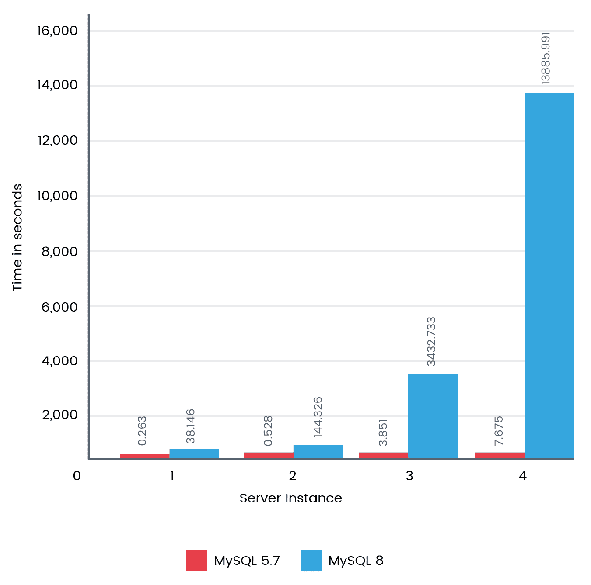
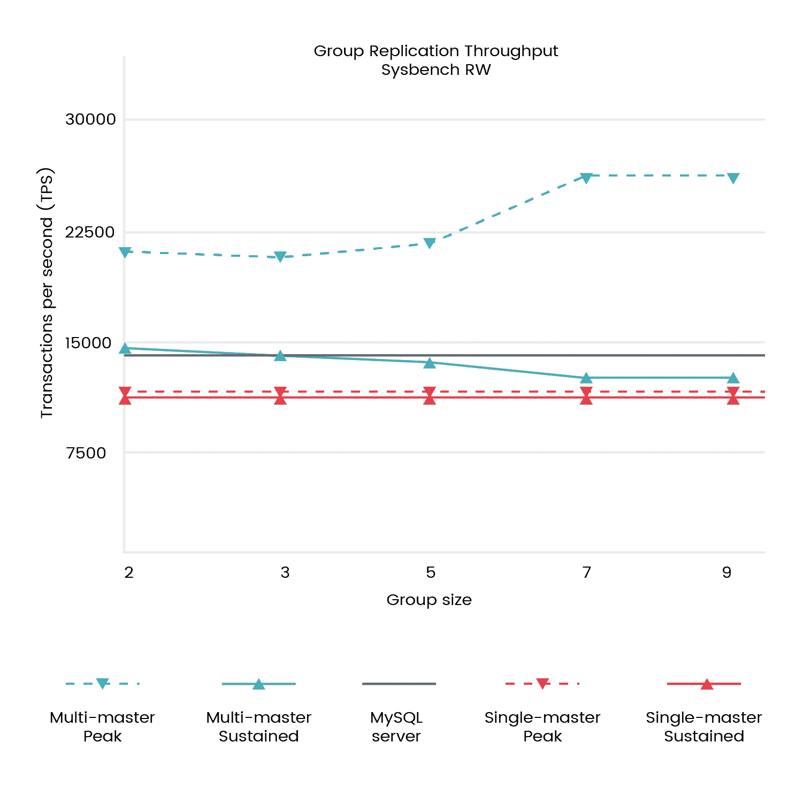

# 十四、MySQL 8 最佳实践和基准测试

在上一章中，您学习了如何扩展 MySQL 8。它涵盖了许多有趣的方面，比如在 MySQL 8 中使用服务扩展插件并调用它们，在 MySQL 8 中添加和调试新功能，等等。在本章中，我们将介绍 MySQL 8 的最佳实践，这是一个备受期待的版本，承诺解决以前版本的许多不足，并具有令人兴奋的新特性。MySQL 8 承诺不仅仅是一个独立的数据库，它还将在各个领域发挥重要作用，包括大数据解决方案。我们将学习如何实现最佳实践，以优化 MySQL 8 中的功能。基准测试将进一步增强我们的理解。

本章将介绍以下主题：

*   MySQL 基准测试和工具
*   memcached 应用程序的最佳实践
*   复制的最佳做法
*   数据分区的最佳实践
*   查询和索引的最佳实践

由于显著的优化和更改，MySQL8 直接从 MySQL5.7 版本升级。MySQL 8 将不受文件的限制，这以前限制了您可以拥有的数据库数量。还有更多令人兴奋的特性，我们已经在[第 1 章](01.html)、*MySQL 8*简介中介绍过。MySQL 8 现在可以在数据库中存储数百万个表。它还将迅速修改表格。

我很高兴能读完这一章，因为 MySQL 8 最佳实践不仅会影响数据库的性能、可伸缩性、安全性和可用性，而且从总体上讲，还会向最终用户展示系统的性能。这是我们的最终目标，不是吗？让我们看看在我们的测试实验室中衍生出的一些基准测试，它们肯定会让您大吃一惊：


# MySQL 基准测试和工具

在 MySQL 8 中，我们经历了各种新特性和改进。这让我们更加兴奋，因为我们总是渴望表现。由于 MySQL 8 还没有正式上市，Oracle 还没有公布其基准测试结果。我们没有等它这么做，而是在几个领域进行了我们自己的分析。

MySQL 的配置最佳实践是蛋糕上的樱桃；没有樱桃，蛋糕似乎不完整。除了配置之外，基准测试还帮助我们验证和发现瓶颈并解决它们。让我们看几个特定领域，它们将帮助我们了解配置和性能基准测试的最佳实践。

# 资源利用

IO 活动、CPU 和内存使用率是您不应该错过的。这些指标帮助我们了解在进行基准测试和扩展时系统的性能。它还帮助我们得出每笔交易的影响。

# 延长您的基准时间线

我们可能经常喜欢快速浏览性能指标；然而，确保 MySQL 在更长的测试时间内以相同的方式运行也是一个关键因素。当您延长基准时间线时，有一些基本因素可能会影响性能，例如内存碎片、IO 降级、数据累积后的影响、缓存管理等。

我们不希望重新启动数据库只是为了清理垃圾项目，对吗？因此，建议长时间运行基准测试，以进行稳定性和性能验证。

# 复制生产设置

让我们在生产复制环境中进行基准测试。等待在完成基准测试之前，让我们禁用副本环境中的数据库复制。明白了！我们有一些好数字！

通常情况下，我们不会完全模拟生产环境中要配置的所有内容。它可能会被证明是昂贵的，因为我们可能无意中在生产环境中对某些东西进行基准测试，这可能会产生不利影响。在执行基准测试时，在复制的环境中复制生产设置、数据、工作负载等。

# 吞吐量和延迟的一致性

吞吐量和延迟是齐头并进的。重要的是让你的眼睛主要集中在吞吐量上；然而，随着时间的推移，延迟可能是需要注意的。在`InnoDB`早期，人们注意到性能下降、缓慢或停滞。从那以后，它有了很大的改进，但由于可能会有其他情况取决于您的工作负载，所以最好关注吞吐量和延迟。

# Sysbench 可以做得更多

Sysbench 是一个极好的工具，可以模拟您的工作负载，无论是数千个表、事务密集型、内存中的数据，等等。这是一个极好的工具来模拟和给你很好的表现。

# 虚拟世界

我想保持这个简单；裸机与虚拟化不同。因此，在进行基准测试时，要根据您的环境来衡量您的资源。如果将两者进行比较，您可能会惊讶地发现结果的差异。

# 并发性

大数据位于繁重的数据工作负载上；高并发性很重要。MySQL 8 在每一个新版本中都在扩展其最大的 CPU 核心支持，根据您的需求优化并发性，并且应该考虑硬件资源。

# 隐藏的工作负载

不要错过在后台运行的因素，如大数据分析报告、备份和基准测试时的动态操作。这些隐藏的工作负载或过时的基准测试工作负载的影响会让你的白天（和晚上）痛苦不堪。

# 你质疑的神经

哎呀！我们错过了优化器吗？还没有。优化器是一个强大的工具，它可以读取查询的神经并提供建议。这是我在生产中更改查询之前使用的工具。当您需要优化复杂的查询时，它是一个救世主。

这些是我们应该注意的几个方面。现在让我们看看我们在 MySQL 8 上做的一些基准测试，并将它们与 MySQL 5.7 上的基准测试进行比较。

# 基准

首先，让我们从所有`InnoDB`表中获取所有列名。以下是我们执行的查询：

```sql
SELECT t.table_schema, t.table_name, c.column_name
FROM information_schema.tables t,
information_schema.columns c
WHERE t.table_schema = c.table_schema
AND t.table_name = c.table_name
AND t.engine='InnoDB';
```

下图显示了 MySQL 8 在拥有四个实例时的执行速度是原来的一千倍：



接下来，我们还执行了一个基准测试来查找静态表元数据。以下是我们执行的查询：

```sql
SELECT TABLE_SCHEMA, TABLE_NAME, TABLE_TYPE, ENGINE, ROW_FORMAT 
FROM INFORMATION_SCHEMA.TABLES
WHERE TABLE_SCHEMA LIKE 'chintan%';
```

下图显示了 MySQL 8 的运行速度是 MySQL 5.7 的 30 倍左右：


这使我们急切地想更详细地谈一谈。因此，我们考虑做最后一个测试来查找动态表元数据。

以下是我们执行的查询：

```sql
SELECT TABLE_ROWS
FROM INFORMATION_SCHEMA.TABLES
WHERE TABLE_SCHEMA LIKE 'chintan%';
```

下图显示了 MySQL 8 的运行速度是 MySQL 5.7 的 30 倍左右：


MySQL 8.0 为表带来了巨大的性能改进。扩展到一百万个表，这是许多大数据需求的需要，现在是可以实现的。一旦 MySQL 8 可用于一般用途，我们期待更多的基准测试正式发布。

现在让我们来看下一个主题，它将使您的生活更轻松。这一切都是为了考虑 memcached 的最佳实践。

# memcached 的最佳实践

使用`InnoDB`memcached 插件，现在可以进行多个`get`操作，这将真正有助于提高读取性能。现在，可以在单个 memcached 查询中获取多个键值对。频繁的通信流量也被最小化，因为我们可以在一次拍摄中获得多个数据。

您应该考虑的最重要的外型是我们将要经历的。

# 资源分配

memcached 的内存分配不应在可用物理内存上进行，也不应在不考虑其他可能使用内存的资源的情况下进行。如果我们过度分配内存，memcached 很有可能从交换空间分配内存。这可能会导致插入或获取值时出现延迟，因为交换空间存储在磁盘上，比内存中慢。

# 操作系统架构

由于操作系统架构有 32 位，因此需要谨慎。正如我们所知，在 32 位操作系统体系结构中提供资源是有限制的。

类似地，具有 32 位操作系统体系结构的 4 GB RAM 的 memcached 不应设置为超过 3.5 GB 的 RAM，因为它可能在性能上表现异常，也可能导致崩溃。

# 默认配置

一些关键的默认配置参数应始终根据您的需要进行微调：

*   **内存分配**：默认为 64MB；相反，它应该根据您的需求和测试重新配置
*   **连接**：默认为 1024 个并发连接；相反，它应该根据您的需求和测试重新配置
*   **端口**：默认监听端口`11211`；相反，为了安全起见，它应该侦听另一个端口
*   **网络接口**：默认接受所有网络接口的连接；相反，出于安全目的，它应该受到限制

# 最大对象大小

您应该查看配置最大对象大小，默认情况下为 1MB。但是，它可以被提升到 128MB。它完全基于要存储的数据类型以及相应的最大对象大小。允许开销数据存储在 memcached 中可能会产生不利影响，因为可能有更多的数据需要检索，这可能会导致失败。

# 待办事项队列限制

backlog 队列限制是指当 memcached 达到允许的连接限制时，应该保留在队列中的 memcached 连接数。理想情况下，您允许的连接数应该以满足大多数需求的方式进行配置。当 memcached 上出现意外的峰值负载时，backlog 队列限制会很有帮助。理想情况下，它不应超过总连接数的 20%，否则会由于严重延迟而影响系统从 memcached 获取信息的体验。

# 大页面支持

在支持大内存页的系统上，应该启用 memcached 来利用它们。大页面支持有助于分配一个大数据块来存储数据，并使用此功能减少缓存未接来电的数量。

# 敏感数据

在 memcached 中存储敏感数据可能会带来安全威胁，因为有权访问 memcached 的人可能会查看敏感信息。显然，您应该采取预防措施来限制 memcached 的暴露。您还可以在将敏感信息存储到 memcached 之前对其进行加密。

# 限制曝光

Memcached 没有很多内置的安全功能。一项措施涉及在所需边界内公开 memcached 访问。如果您的应用程序服务器需要与 memcached 通信，那么它只允许在系统防火墙规则（如 IP 表或类似技术）的帮助下从该服务器访问 memcached。

# 故障转移

Memcached 没有很好的故障切换技术。建议您将应用程序配置为故障切换到不可用的节点，并将数据重新生成到另一个实例中。最好至少配置两个 memcached，以避免由于实例不可用而导致的故障。

# 名称空间

您可以利用 memcached 提供的名称空间，它基本上是在将数据存储到 memcached 之前为数据添加前缀。当您有多个应用程序与 memcached 通信时，它会有所帮助。这很有帮助，使用命名约定的一些基本原则，您可以导出一个解决方案。如果有存储名字和姓氏的数据，则可以分别使用前缀，例如 FN 和 LN。这将帮助您轻松地从应用程序中识别和检索数据。

# 缓存机制

开始利用 memcached 中的缓存的最简单方法之一是使用两列表；您可以利用 memcached 提供的名称空间，它基本上添加了前缀。第一列是主键，数据库模式应该是唯一标识符的地址要求，并借助主键映射和唯一约束。如果希望通过组合多个列值来获得单个项值，则应确保选择适当的数据类型。

在查询本身中使用`=`或`IN`运算符时，使用单个`WHERE`子句的查询可以很容易地映射到 memcached 查找。在使用多个`WHERE`子句或解析复杂操作的情况下，例如`<`、`>`、`LIKE`和`BETWEEN`，memcached 将帮助您克服挑战。建议您使用添加到数据库中的传统 SQL 查询进行如此复杂的操作。

将整个对象缓存在 memcached 中，而不是选择缓存 MySQL 8 中的单个行，这将是有益的。例如，对于博客网站，您应该将博客端口的整个对象缓存在 memcached 中。

# Memcached 一般统计

为了帮助您更好地了解 memcached 的统计信息，我们将提供运行状况和性能的概述。memcached 返回的统计信息及其含义如下表所示：

用于定义每个统计值的术语包括：

*   **32u**：32 位无符号整数
*   **64u**：64 位无符号整数
*   **32u:32u**：两个由冒号分隔的 32 位无符号整数
*   **字符串**：字符串

| **统计** | **数据类型** | **说明** |
| --- | --- | --- |
| `pid` | 32u | memcached 实例的进程 ID。 |
| `uptime` | 32u | 此 memcached 实例的正常运行时间（秒）。 |
| `time` | 32u | 当前时间（作为历元）。 |
| `version` | 一串 | 此实例的版本字符串。 |
| `pointer_size` | 一串 | 此主机的指针大小以位（32 或 64）指定。 |
| `rusage_user` | 32u:32u | 此实例的总用户时间（秒：微秒）。 |
| `rusage_system` | 32u:32u | 此实例的总系统时间（秒：微秒）。 |
| `curr_items` | 32u | 此实例存储的当前项数。 |
| `total_items` | 32u | 此实例生命期内存储的项目总数。 |
| `bytes` | 64u | 此服务器用于存储项目的当前字节数。 |
| `curr_connections` | 32u | 当前打开的连接数。 |
| `total_connections` | 32u | 自服务器开始运行以来打开的连接总数。 |
| `connection_structures` | 32u | 服务器分配的连接结构数。 |
| `cmd_get` | 64u | 检索请求的总数（`get`操作）。 |
| `cmd_set` | 64u | 存储请求总数（`set`操作）。 |
| `get_hits` | 64u | 已请求并发现存在的密钥数。 |
| `get_misses` | 64u | 已请求但未找到的项目数。 |
| `delete_hits` | 64u | 已删除并发现存在的密钥数。 |
| `delete_misses` | 64u | 已删除但未找到的项目数。 |
| `incr_hits` | 64u | 已递增并发现存在的密钥数。 |
| `incr_misses` | 64u | 已递增但未找到的项目数。 |
| `decr_hits` | 64u | 已递减并发现存在的密钥数。 |
| `decr_misses` | 64u | 已递减但未找到的项目数。 |
| `cas_hits` | 64u | 已比较、交换并发现存在的密钥数。 |
| `cas_misses` | 64u | 已比较和交换但未找到的项目数。 |
| `cas_badvalue` | 64u | 已比较和交换但比较（原始）值与提供的值不匹配的密钥数。 |
| `evictions` | 64u | 从缓存中删除以释放新项目内存的有效项目数。 |
| `bytes_read` | 64u | 此服务器从网络读取的总字节数。 |
| `bytes_written` | 64u | 此服务器发送到网络的总字节数。 |
| `limit_maxbytes` | 32u | 允许此服务器用于存储的字节数。 |
| `threads` | 32u | 请求的工作线程数。 |
| `conn_yields` | 64u | 连接的收益数（与-R 选项相关）。 |

Reference: [https://dev.mysql.com/doc/refman/8.0/en/ha-memcached-stats-general.html](https://dev.mysql.com/doc/refman/8.0/en/ha-memcached-stats-general.html)

这些是一些有用的项目，对于 memcached 的最佳实践来说应该放在手边。现在是我们向前迈进并研究复制最佳实践的时候了。

# 复制的最佳做法

MySQL 8 在复制方面做了一些很大的改进。MySQL 8 是一个具有最大数据完整性的可伸缩性、性能和安全性的系统，预计它也将成为大数据领域的游戏规则改变者。

# 组复制中的吞吐量

组复制基本上负责在组复制中的大多数成员确认并发接收的事务后提交事务。如果写入的总次数不超过组复制中成员的容量，则这将产生更好的吞吐量。如果出现容量规划不当的情况，您会注意到与组中的其他成员相比，受影响成员的容量滞后。

# 基础设施规模

基础架构规模是衡量性能和最佳实践清单的常见成功因素。如果在组复制中，基础结构大小调整不正确或跨节点不均匀，则可能会对复制基础结构拓扑产生不利影响。在考虑组件所需的吞吐量时，应考虑每个组件。

# 恒定吞吐量

实现恒定吞吐量是一个很好的成功因素。如果您的工作负载开始影响组复制中的其他成员，该怎么办？在这种情况下，您的主机可能会继续接受额外的工作负载，并落后于您的主机，在此之后，主机可能会在耗尽所有资源之前恢复到可接受的水平。此外，您还可以实现一种排队方法，它可以防止您消耗资源，并且只允许您将基于容量预定义的工作负载传递给成员。

在考虑排队方法时，不能允许队列呈指数增长。这将影响最终用户，因为更新的数据会出现延迟。但是，您需要根据需要和业务需求做出决定，以实现整个系统的恒定吞吐量。

# 矛盾的工作量

从根本上说，组复制旨在允许组中任何成员进行更新。针对每个事务检查基于行重叠的事务回滚；其余的将提交并发送给组中的其他成员进行更新。如果同一行上经常发生多个更新，则可能会导致多次回滚。您可能会遇到这样的循环情况：一台服务器进行更新，请求其他服务器进行更新，同时，另一台服务器已经对同一行进行了更新。这将导致回滚。

为了防止出现这种情况，您可以让组中的最后一个成员应用更新，然后继续执行另一个更新。您可以仅从执行早期更新的同一节点路由类似的更新，以防止出现循环回滚情况。

# 写可伸缩性

通过共享写操作来分配写工作负载，这可能会提高吞吐量和写性能的可伸缩性。这将取决于系统中预期的相互矛盾的工作负载。当执行的峰值工作负载可以共享负载时，这会很有帮助。在常见情况下，如果您在写可伸缩性方面做了良好的容量规划，您将看到微不足道的改进。

请参阅描述此情况的下图：



您会注意到，在多个主机的帮助下，您的负载具有更好的吞吐量。它还考虑了多主机配置中的组大小。

# 数据分区的最佳实践

一般来说，分区是在逻辑上将任何东西划分为多个子组，这样每个子组都可以独立识别，并且可以组合成单个分区

现在让我们学习不同的分区方法，以及分区如何在存在大型数据表的情况下发挥作用。

对于任何组织来说，以数据库提供可伸缩性、性能、可用性和安全性的方式存储数据都非常重要。例如，在一个高度访问的电子商务商店中，有成千上万甚至更多的订单频繁下发。因此，为了维护显示当前订单仪表板的日常订单交付，需要查询显示过去五年订单的表；使用当前数据执行该过程需要很长时间。在这里，需要历史订单数据来分析用户行为或趋势，但这需要在有限的数据集上执行。

有多种方法可以实现高可用性、可扩展性和高性能体系结构的最佳解决方案；关键因素是分区。在数据库中，每个表中的数据都存储在物理文件组中。因此，通过将此数据表从单个文件组划分为多个文件组，可以减少文件大小，并帮助我们创建可扩展的高性能数据库。

以下是在数据库中使用分区的主要好处：

*   **可扩展性**：由于数据将在多个分区之间共享，服务器可以配置为使用多个节点，分区可以在多个节点之间配置。这样做将消除任何硬件限制，并允许数据库在很大程度上扩展以容纳大量数据。
*   **高性能**：由于数据存储在多个分区中，每个查询都会在一小部分数据上执行。例如，在订单历史记录超过两年的电子商务商店中，要获取当月下的订单列表，只需要检查单个分区，而不需要检查整个订单历史记录，从而减少查询执行时间。为了在多个分区上获取查询，我们还可以并行运行，从而减少从数据库获取数据的总时间。
*   **高可用性**：在分区中，数据被划分为多个文件组。每个文件组都有逻辑连接，但可以独立访问和处理。因此，如果其中一个文件组或分区损坏，或者服务器中的一个节点出现故障，那么我们不会失去对整个表的访问，但只有数据库的一部分不可用，从而消除了系统故障的可能性，并使您的系统高度可用。
*   **安全**：可能是表中的某些数据需要高安全性措施，以避免数据被盗或数据泄漏。通过分区，您可以为一个或多个分区提供额外的安全性，以避免任何安全问题，从而通过数据安全性提高数据的可访问性。

一般来说，分区是在逻辑上将任何东西划分为多个子组，这样每个子组都可以独立识别，并且可以组合成单个分区。让我们了解一下分区在 RDBMS 中的含义。

分区通常用于将数据划分为多个逻辑文件组，以实现性能、可用性和可管理性。在处理大数据时，数据的正常趋势是数十亿条记录。所以，为了提高数据库的性能，最好将数据划分到多个文件组中。这些文件组可以位于一台计算机上，也可以跨多台计算机共享，并由密钥标识。这些文件组称为分区数据。

表中的数据可以通过两种方式进行分区：

*   水平分割
*   垂直分割

# 水平分割

当表中的行数非常大时，可以将表划分为多个分区；这被称为**水平分区**。使用水平分区时，表的每个分区包含相同数量的列。可以一次访问所有分区，也可以单独访问每个分区。

# 垂直分割

在垂直分区中，表的列被分区以实现性能和更好的数据库管理。垂直分区可以通过两种方式实现。第一种方法是对表进行规范化。表中的列不是太多，而是可以通过分割数据将列划分为多个表。第二种方法是为表中定义的列创建单独的物理文件组。MySQL 8 目前不支持垂直分区。

让我们看看与分区相关的一些好处：

*   如果表包含历史数据，例如应用程序的日志，则超过六个月的数据对要激活的应用程序没有任何意义。如果分区是基于月份创建的，则可以轻松删除其中一个分区。
*   在前面相同的日志案例中，如果我们想要过滤两个日期之间的数据，MySQL 优化器可以识别特定的分区，在那里可以找到过滤后的记录，这可以导致更快的查询结果，因为要检查的行数大大减少。
*   MySQL 8 还支持查询特定分区上的数据。当您知道需要查询所需数据的分区时，它可以减少要检查的记录数。

# MySQL 中的分区修剪

剪枝是对数据的选择性提取。因为我们有多个分区，所以在检索过程中它会遍历每个分区，这非常耗时，并且会影响性能。当请求的数据在该分区内不可用时，一些分区也将包括在搜索中，这是一个开销过程。剪枝在这里有助于只搜索那些具有相关数据的分区，这将避免在检索过程中不必要地包含这些分区。

这种避免扫描没有匹配值的分区的优化称为分区的**修剪**。在分区修剪中，优化器分析 SQL 语句中的`FROM`和`WHERE`子句以消除不需要的分区，并扫描与 SQL 语句相关的数据库分区。

# 查询和索引的最佳实践

编写最佳查询以供参考和重用是很困难的。它总是根据应用程序的性质、体系结构、设计、表结构等而有所不同。但是，在编写 MySQL 查询时可以采取预防措施，以获得更好的性能、可伸缩性和完整性。

让我们来看一下在设计或编写 MySQL 查询时应该牢记的一些最佳实践。

# 数据类型

数据库表可以由多个数据类型的列组成，例如数字或字符串。MySQL 8 提供各种数据类型，而不仅仅限于数字或字符串：

*   小就是好。当 MySQL 在内存中加载数据时，较大的数据量会对其性能产生不利影响。较小的集合可以在内存中容纳更多的数据，并减少资源利用的开销。
*   定好你的长度。如果不修改数据类型的长度，它将不得不在每次需要时获取所需的信息。因此，只要有可能，就可以通过使用 char 数据类型来限制数据长度。

# 非空

非空数据是 MySQL 不太喜欢的。NOTNULL 列使用更多存储空间，影响性能，并且需要在 MySQL 中进行额外处理。

优化此类引用空数据的查询也很困难。为空数据列编制索引时，它会为每个条目使用额外的字节。

# 索引

索引很重要，因为它可以提高设计糟糕的查询和表结构的性能，甚至可以将设计良好的查询变成糟糕的查询，这也会影响性能。

# 搜索字段索引

通常，我们对 MySQL 查询中用作过滤器的字段进行索引。它显然有助于加快阅读速度，但可能会对写入/更新产生负面影响，因此，只为您需要的内容编制索引将是一个明智的决定。

# 数据类型和联接

MySQL 可以对不同的数据类型进行连接，但如果要求 MySQL 对连接字段使用不同的数据类型，性能可能会受到影响，因为它必须为每一行从一种数据类型转换为另一种数据类型。

# 复合指数

如果一个查询应该引用一个表的多个列，那么为这些列创建一个复合索引可能会有所帮助。复合索引引用第一列、第二列等结果集中的列。

列的顺序对查询的性能起着重要作用，因此在设计表结构和索引时，需要有效地使用它。

# 缩短主键

小键盘也适用于主键。缩短主键将类似于我们讨论数据类型的方式。由于主键更小，索引的大小也会更小，因此缓存的使用也会更少，因此它可以在内存中容纳更多的数据。

最好使用数字类型，因为这些类型比字符小得多，以达到缩短主键的目的。在进行连接时，它会很有帮助，因为通常连接时会引用主键。

# 索引所有内容

索引所有内容是一个好主意；然而，MySQL 不会这样做。您知道吗，如果 MySQL 应该扫描高于 30%的索引，它将执行完整表扫描？不要索引不需要索引的值。

我们需要记住，如果在获取数据时做得正确，索引有助于提高效率；但是，在写入/更新数据时，这是一项开销。

# 获取所有数据

`select *...`-啊！除非确实需要，否则不要使用它。到目前为止，我的经验并不需要这些。获取所有数据将降低执行时间，并严重影响 MySQL 服务器的资源利用率。您需要提供特定的列名或适当的条件。

# 让应用程序完成这项工作

让应用程序也为 MySQL 做这项工作。通过让应用程序进行排序，您可以避免使用诸如`order by`之类的子句。在 MySQL 中进行排序要比在应用程序中慢得多。您可以确定应该由应用程序处理的查询。

# 数据的存在

借助于`EXISTS`子句检查数据的存在性要快得多。`EXISTS`子句从提取的数据中提取第一行后，将立即返回输出。

# 限制自己

将自己限制在需要获取的数据范围内。始终确保在提取数据时使用适当的限制，因为提取的不需要的数据不会有用，并且会影响性能。在 SQL 查询中使用`LIMIT`子句。

# 分析慢速查询

这是一个值得遵循的良好实践。随着数据的增长，我们可能会错过进行优化或实现具有不利影响的查询。您可能会更改要获取的数据的要求，而我们可能会忽略查询的影响。始终监视可以在 MySQL 中配置的慢速查询并对其进行优化是很好的。

# 查询成本

您查询的成本是多少？解释是正确的答案。使用`explain`查询参数了解什么会影响您的查询，无论是完整表扫描、索引扫描、范围访问等等。明智地使用 explain 提供的信息，进一步优化查询。它是 MySQL 的一个很棒的、快速便捷的工具。如果您知道自己已经尽了最大的努力，那么索引可以作为救世主，根据您的需要进一步优化它。

编写查询时的最佳实践从需求、设计、实现和持续维护开始。这是一个完整的生命周期，我们不能多样化。理解模式、索引和分析起着重要作用。对我们来说，重要的是响应时间和最佳资源利用率。

我个人喜欢深入探讨这一点，这是一个关系的世界，比我们在这里提到的要多得多！您的查询将遇到一个表的行或列，或与另一个表联接。最重要的是，如果您做得不好，您将试图从不需要的子集中找到一个关系。如果使用得当，我们如何忘记作为救世主的索引？所有这些都将表明我们之间的关系，并将迅速回应要求的询问。

# 总结

我确信，在阅读本章时，如果 MySQL 8 实现中缺少任何东西，您已经记住了需要注意或回忆的事情。在这一章中，我们讨论了 MySQL 8 的最佳实践，这些实践在各个阶段都会有所帮助，例如实现、使用、管理和故障排除，并将作为 MySQL 8 最佳实践的指针；这些可能根据不同的用例而有所不同。适当的测试和核查将有助于确认实施最佳做法的好处。

我们已经广泛地讨论了一些关于 MySQL 8 基准测试和一些配置参数以及 memcached 的最佳实践的激动人心的话题。我们讨论了 MySQL 复制的最佳实践，其中讨论了几个关键要点。最后，还讨论了 MySQL 查询和索引指针以及数据分区的最佳实践。本章中所写的内容将更少，但提供的指针是必要的。

现在，我们应该对 MySQL 8 有了很好的了解；现在是解决问题的时候了。

现在让我们进入下一章，看看我们如何遇到许多常见问题，识别错误代码以及解决 MySQL 8 故障的实际场景