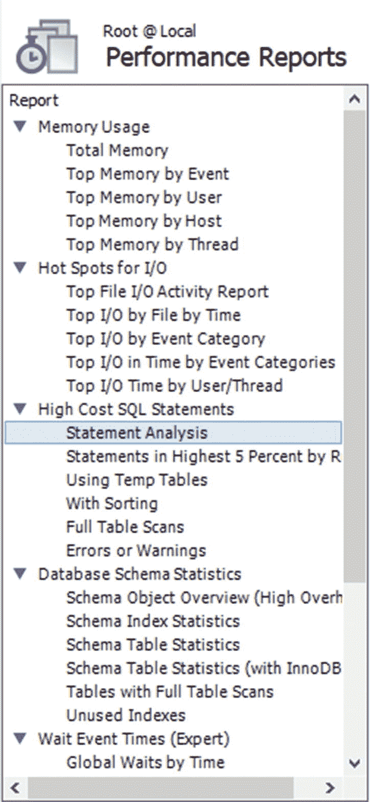
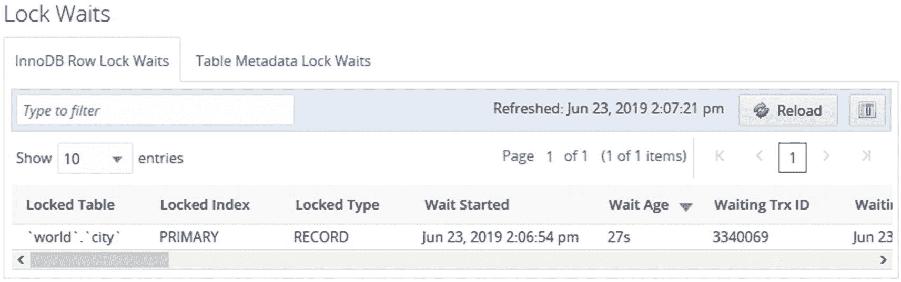
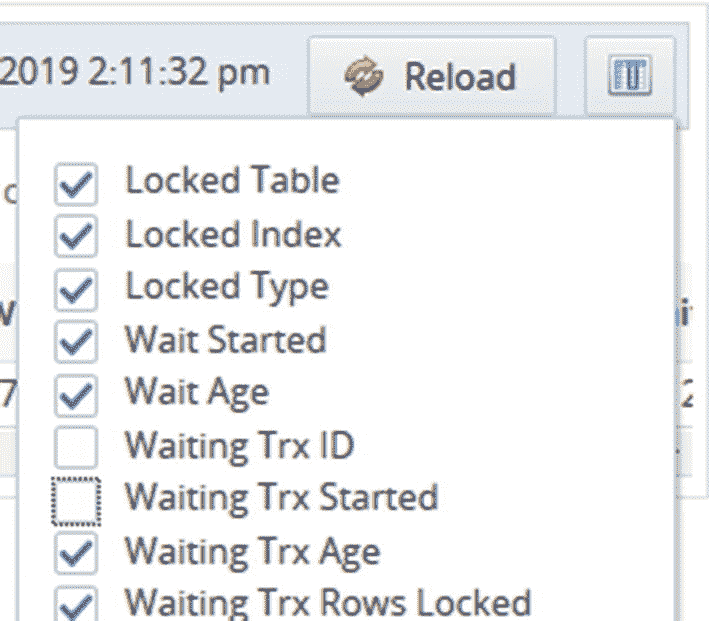

# 十九、为优化寻找候选查询

当您遇到性能问题时，第一步是确定是什么导致了它。表现差可能有几个原因，所以在寻找原因时要保持开放的心态。本章的重点是找到可能导致性能下降的查询，或者在将来负载和数据量增加时可能成为问题的查询。尽管如此，正如在第 [1](01.html) 章中所讨论的，你需要考虑你的系统的所有方面，通常它可能是导致问题的因素的组合。

本章介绍了查询性能相关信息的各种来源。首先，将讨论性能模式。性能模式是本章中讨论的许多其他特性的基础。其次，`sys`模式的视图以及语句性能分析器特性都包括在内。第三，展示了如何使用 MySQL Workbench 为前两节中讨论的几个报告获得图形用户界面。第四，讨论了监控对于寻找优化候选的重要性。虽然本节使用 MySQL Enterprise Monitor 作为讨论的基础，但是这些原则适用于一般的监控，因此即使您使用不同的监控解决方案，也鼓励您阅读本节。第五个也是最后一个是慢速查询日志，它是查找慢速查询的传统工具。

Note

本章包括几个带有输出的例子。通常，对于包含计时和其他不确定数据的值，相同示例的输出会有所不同。

由于锁争用而性能不佳的查询将不包括在内；相反，第 [22](22.html) 章详细介绍了如何调查锁问题。事务包含在第 [21 章](21.html)中。

## 性能模式

性能模式是查询性能信息的金矿。这使得在讨论如何找到作为优化候选的查询时，它成为显而易见的起点。您可能最终会使用一些构建在性能模式之上的方法，但是仍然鼓励您很好地理解底层的表，这样您就知道如何访问原始数据并生成您自己的定制报告。

本节将首先讨论如何获取有关语句和预准备语句的信息，然后讨论表和文件 I/O，最后展示如何找出导致错误的原因和错误。

### 语句事件表

使用基于语句事件的性能模式表是寻找优化候选查询的最直接的方法。这些表将允许您获得关于在实例上执行的查询的非常详细的信息。需要注意的一点是，作为预处理语句执行的查询不包括在语句表中。

有几个包含语句信息的表。这些是

*   `events_statements_current` **:** 当前正在执行的语句或对空闲连接最新执行的查询。执行存储程序时，每个连接可能有多行。

*   `events_statements_history` **:** 每个连接的最后语句。每个连接的语句数量上限为`performance_schema_events_statements_history_size`(默认为 10)。当连接关闭时，连接的语句将被删除。

*   `events_statements_history_long` **:** 对实例的最新查询，不管是哪个连接执行的。该表还包括来自已关闭连接的语句。默认情况下，此表的使用者是禁用的。行数上限为`performance_schema_events_statements_history_long_size`(默认为 10000)。

*   `events_statements_summary_by_digest` **:** 将报表统计按默认模式分组并摘要。稍后将详细讨论该表。

*   `events_statements_summary_by_account_by_event_name` **:** 按账户和事件名称分组的报表统计。事件名显示执行的是哪种语句，例如，`statement/sql/select`表示直接执行的`SELECT`语句(不通过存储程序执行)。

*   `events_statements_summary_by_host_by_event_name` **:** 按账户主机名和事件名分组的报表统计。

*   `events_statements_summary_by_program` **:** 按执行语句的存储程序(事件、函数、过程、表或触发器)分组的语句统计信息。这有助于找到执行最多工作的存储程序。

*   `events_statements_summary_by_thread_by_event_name` **:** 按线程和事件名称分组的语句统计。仅包括当前连接的线程。

*   `events_statements_summary_by_user_by_event_name` **:** 按账户用户名和事件名称分组的报表统计。

*   `events_statements_summary_global_by_event_name` **:** 按事件名称分组的报表统计。

*   `events_statements_histogram_by_digest` **:** 按默认模式分组的直方图统计和摘要。

*   `events_statements_histogram_global` **:** 直方图统计，其中所有查询都聚集在一个直方图中。

*   `threads` **:** 实例中所有线程的信息，包括后台线程和前台线程。您可以使用此表代替`SHOW PROCESSLIST`命令。除了进程列表信息之外，还有显示线程是否被检测、操作系统线程 id 等等的列。

除了两个直方图表和`threads`表，所有列出的表都有相似的列。最常使用的表是`events_statements_summary_by_digest`，所以它将作为讨论的基础。`events_statements_summary_by_digest`表实质上是一份报告，报告了自从上次重置该表(通常是在重启 MySQL 时)以来在实例上执行的所有查询。查询按其摘要和执行时使用的默认模式进行分组。表中各列汇总在表 [19-1](#Tab1) 中。

表 19-1

`events_statements_summary_by_digest`表中的列

<colgroup><col class="tcol1 align-left"> <col class="tcol2 align-left"></colgroup> 
| 

列名

 | 

描述

 |
| --- | --- |
| `SCHEMA_NAME` | 执行查询时作为默认架构的架构。如果没有默认模式，则值为`NULL`。 |
| `DIGEST` | 规范化查询的摘要。在 MySQL 8 中，这是一个 sha256 哈希。 |
| `DIGEST_TEXT` | 规范化的查询。 |
| `COUNT_STAR` | 查询已执行的次数。 |
| `SUM_TIMER_WAIT` | 执行查询所花费的总时间。请注意，在执行 30 周多一点的时间后，该值会溢出。 |
| `MIN_TIMER_WAIT` | 执行查询的最快速度。 |
| `AVG_TIMER_WAIT` | 平均执行时间。这与`SUM_TIMER_WAIT/COUNT_STAR`相同，除非`SUM_TIMER_WAIT`已经溢出。 |
| `MAX_TIMER_WAIT` | 执行查询的最慢速度。 |
| `SUM_LOCK_TIME` | 等待表锁所花费的总时间。 |
| `SUM_ERRORS` | 执行查询时遇到的错误总数。 |
| `SUM_WARNINGS` | 执行查询时遇到的警告总数。 |
| `SUM_ROWS_AFFECTED` | 查询已修改的总行数。 |
| `SUM_ROWS_SENT` | 已返回(发送)到客户端的总行数。 |
| `SUM_ROWS_EXAMINED` | 查询已检查的总行数。 |
| `SUM_CREATED_TMP_DISK_TABLES` | 查询已创建的磁盘上内部临时表的总数。 |
| `SUM_CREATED_TMP_TABLES` | 由查询创建的内部临时表(无论是在内存中还是在磁盘上创建的)的总数。 |
| `SUM_SELECT_FULL_JOIN` | 由于没有联接条件的索引或联接条件，已执行全表扫描的联接总数。这与增加`Select_full_join`状态变量是一样的。 |
| `SUM_SELECT_FULL_RANGE_JOIN` | 使用全范围搜索的联接总数。这与增加`Select_full_range_join`状态变量是一样的。 |
| `SUM_SELECT_RANGE` | 查询使用范围搜索的总次数。这与增加`Select_range`状态变量是一样的。 |
| `SUM_SELECT_RANGE_CHECK` | 查询的联接总数，其中联接没有在每行之后检查索引使用情况的索引。这与增加`Select_range_check`状态变量是一样的。 |
| `SUM_SELECT_SCAN` | 查询对联接中的第一个表执行全表扫描的总次数。这与增加`Select_scan`状态变量是一样的。 |
| `SUM_SORT_MERGE_PASSES` | 为对查询结果进行排序而完成的排序合并传递的总数。这与增加`Sort_merge_passes`状态变量是一样的。 |
| `SUM_SORT_RANGE` | 使用范围进行排序的总次数。这与增加`Sort_range`状态变量是一样的。 |
| `SUM_SORT_ROWS` | 已排序的总行数。这与增加`Sort_rows`状态变量是一样的。 |
| `SUM_SORT_SCAN` | 通过扫描表进行排序的总次数。这与增加`Sort_scan`状态变量是一样的。 |
| `SUM_NO_INDEX_USED` | 未使用索引来执行查询的总次数。 |
| `SUM_NO_GOOD_INDEX_USED` | 使用无效索引的总次数。这意味着`EXPLAIN`输出中的`Extra`列包含“为每个记录检查的范围” |
| `FIRST_SEEN` | 查询第一次出现的时间。当表被截断时，第一个看到的值也被重置。 |
| `LAST_SEEN` | 上次看到查询的时间。 |
| `QUANTILE_95` | 查询延迟的第 95 个百分位数。也就是说，95%的查询在给定的时间或更短的时间内完成。 |
| `QUANTILE_99` | 查询延迟的第 99 个百分位数。 |
| `QUANTILE_999` | 查询延迟的第 99.9 个百分点。 |
| `QUERY_SAMPLE_TEXT` | 规范化前的查询示例。您可以使用它来获取查询的查询执行计划。 |
| `QUERY_SAMPLE_SEEN` | 看到示例查询的时间。 |
| `QUERY_SAMPLE_TIMER_WAIT` | 示例查询的执行时间。 |

(`SCHEMA_NAME`，`DIGEST`)上有一个唯一的索引，用于对数据进行分组。表中最多可以有`performance_schema_digests_size`(动态调整大小，但通常默认为 10000)行。当插入最后一行时，schema 和 digest 都被设置为`NULL`，并且该行被用作一个总括行。每次使用捕获所有行时，`Performance_schema_digest_lost`状态变量就会递增。使用`events_statements_current`、`events_statements_history`和`events_statements_history_long`表，该表中汇总的信息也可用于单个查询。

Tip

由于数据是按`SCHEMA_NAME`、`DIGEST`分组的，所以当应用一致地设置默认模式(例如，MySQL Shell 中的`\use world`或`--schema`命令行选项，或者您使用的客户端/连接器中的等效选项)时，您可以充分利用`events_statements_summary_by_digest`表。要么永远设置，要么永远不设置。同样，如果在引用表时有时包含模式名，有时不包含，那么相同的查询将被视为两个不同的摘要。

两组列需要更多的解释，分位数列和查询样本列。分位数列的值是基于摘要的直方图统计确定的。基本上，如果您获取给定摘要和默认模式的`events_statements_histogram_by_digest`表，并转到具有 95%查询执行的存储桶，那么该存储桶用于确定第 95 个百分位数。直方图表格将在稍后讨论。

对于样本查询信息，如果满足三个条件中的至少一个，则样本查询被替换:

*   对于给定的默认模式，这是第一次遇到摘要。

*   摘要和模式的新出现具有比当前用作样本查询的查询更高的`TIMER_WAIT`值(即，它更慢)。

*   如果`performance_schema_max_digest_sample_age`选项的值大于 0，并且当前样本查询超过了`performance_schema_max_digest_sample_age`秒。

`performance_schema_max_digest_sample_age`的值默认为 60 秒，如果您每分钟都监控`events_statements_summary_by_digest`表，这就很好了。这样，监控代理将能够在每一分钟的时间间隔内获得最慢的查询，并获得最慢查询的完整历史记录。如果您的监控间隔更长，请考虑增加`performance_schema_max_digest_sample_age`的值。

从列的列表中可以看出，有很多机会可以查询满足某些要求的语句。诀窍是查询重要的东西。什么是重要取决于具体情况，因此不可能给出适用于所有情况的具体问题。例如，如果您从监控中知道大量内部临时表使用内存或磁盘存在问题，那么`SUM_CREATED_TMP_DISK_TABLES`和`SUM_CREATED_TMP_TABLES`列是过滤的良好候选。

一些条件是普遍感兴趣的。可能需要进一步调查的一些情况包括

*   与发送回客户端的行数或被修改的行数相比，检查的行数较多。这可能表明索引使用不当。

*   没有使用索引或没有使用好的索引的总和很高。这可能意味着查询可以从新索引或重写查询中受益。

*   完全连接的数量很大。这表明要么需要一个索引，要么缺少一个连接条件。

*   范围检查的次数很多。这可能意味着您需要更改查询中表的索引。

*   如果分位数延迟在接近更高的分位数时表现出严重的下降，这可能表明您有时在及时解决查询方面存在问题。这可能是由于实例通常过载、锁问题、某些条件触发了不良查询计划或其他原因。

*   在磁盘中创建的内部临时表的数量很大。这可能意味着您需要考虑哪些索引用于排序和分组，内部临时表允许的内存量，或者其他可能会阻止将内部临时表写入磁盘或首先创建内部临时表的更改。

*   排序合并的数量很大。这可能意味着该查询可以受益于更大的排序缓冲区。

*   执行死刑的数量很大。这并不意味着查询有任何问题，但是查询执行得越频繁，查询的改进效果就越好。在某些情况下，高执行计数也可能是由不必要的查询执行造成的。

*   错误或警告的数量很高。虽然这可能不会影响性能，但它表明有问题。请注意，有些查询总是会生成警告，例如,`EXPLAIN`,因为它使用警告来返回附加信息。

Caution

如果您仍在使用 MySQL 5.7，请小心增加`sort_buffer_size`的值，因为即使它减少了排序合并的次数，也会降低性能。在 MySQL 8 中，排序缓冲区得到了改进，更大的缓冲区的性能下降要少得多。不过，不要增加超过你需要的大小。

您应该知道，仅仅因为一个查询满足这些条件中的一个，并不意味着有什么要改变的。例如，考虑一个从表中聚合数据的查询。该查询可能会检查表的大部分，但只返回几行。在没有有意义的索引可以帮助的情况下，它甚至可能需要全表扫描。从检查的行数和发送的行数之比的角度来看，该查询的性能会很差，并且可能 no 索引计数器正在递增。然而，查询可以很好地完成返回所需结果所需的最少量的工作。如果您确定查询是一个性能问题，您将需要找到一个不同于添加索引的解决方案；例如，您可以在非高峰时段执行查询并缓存结果，或者您可以有一个单独的实例来执行类似这样的查询。

清单 [19-1](#PC1) 展示了一个例子，它找到了默认模式和语句摘要的组合，这种组合在`events_statements_summary_by_digest`表被最后一次重置后被执行了最多次。

```sql
mysql> SELECT ∗
         FROM performance_schema.events_statements_summary_by_digest
        ORDER BY COUNT_STAR DESC
        LIMIT 1\G
∗∗∗∗∗∗∗∗∗∗∗∗∗∗∗∗∗∗∗∗∗∗∗∗∗∗∗ 1\. row ∗∗∗∗∗∗∗∗∗∗∗∗∗∗∗∗∗∗∗∗∗∗∗∗∗∗∗
                SCHEMA_NAME: world
                     DIGEST: b49cb8f3db720a96fb29da86437bd7809ef30463fac88e85ed4f851f96dcaa30
                DIGEST_TEXT: SELECT ∗ FROM `city` WHERE NAME = ?
                 COUNT_STAR: 102349
             SUM_TIMER_WAIT: 138758688272512
             MIN_TIMER_WAIT: 1098756736
             AVG_TIMER_WAIT: 1355485824
             MAX_TIMER_WAIT: 19321416576
              SUM_LOCK_TIME: 5125624000000
                 SUM_ERRORS: 0
               SUM_WARNINGS: 0
          SUM_ROWS_AFFECTED: 0
              SUM_ROWS_SENT: 132349
          SUM_ROWS_EXAMINED: 417481571
SUM_CREATED_TMP_DISK_TABLES: 0
     SUM_CREATED_TMP_TABLES: 0
       SUM_SELECT_FULL_JOIN: 0
 SUM_SELECT_FULL_RANGE_JOIN: 0
           SUM_SELECT_RANGE: 0
     SUM_SELECT_RANGE_CHECK: 0
            SUM_SELECT_SCAN: 102349
      SUM_SORT_MERGE_PASSES: 0
             SUM_SORT_RANGE: 0
              SUM_SORT_ROWS: 0
              SUM_SORT_SCAN: 0
          SUM_NO_INDEX_USED: 102349
     SUM_NO_GOOD_INDEX_USED: 0
                 FIRST_SEEN: 2019-06-22 10:25:18.260657
                  LAST_SEEN: 2019-06-22 10:30:12.225425
                QUANTILE_95: 2089296130
                QUANTILE_99: 2884031503
               QUANTILE_999: 3630780547
          QUERY_SAMPLE_TEXT: SELECT ∗ FROM city WHERE Name = 'San José'
          QUERY_SAMPLE_SEEN: 2019-06-22 10:29:56.81501
    QUERY_SAMPLE_TIMER_WAIT: 19321416576
1 row in set (0.0019 sec)

Listing 19-1Using the events_statements_summary_by_digest table

```

输出显示，按名称查询`world`模式中的`city`表是执行次数最多的查询。您应该将值`COUNT_STAR`与其他查询进行比较，以了解与其他查询相比，该查询的执行频率。在这个例子中，您可以看到查询平均每次执行返回 1.3 行，但是检查了 4079 行。这意味着查询对返回的每一行检查 3000 多行。由于这是一个经常执行的查询，这表明用于过滤的`Name`列需要一个索引。输出的底部显示了一个查询的实例，您可以使用下一章中描述的`EXPLAIN`来分析查询执行计划。

如上所述，MySQL 还维护语句的直方图统计。有两种直方图表格可用:`events_statements_histogram_by_digest`和`events_statements_histogram_global`。两者的区别在于，前者将直方图信息按默认模式和摘要进行分组，而后者包含分组在一起的所有查询信息。直方图信息有助于确定查询延迟的分布，类似于针对`events_statements_summary_by_digest`表中的分位数列所讨论的信息，但粒度更细。这些表是自动管理的。

如前所述，预处理语句不包括在语句事件表中。相反，你需要使用`prepared_statements_instances`表。

### 准备好的发言摘要

准备好的语句有助于加速在连接中重用的查询的执行。例如，如果您的应用一直使用相同的连接，那么您可以准备应用使用的语句，然后在需要时执行准备好的语句。

准备好的语句使用占位符，因此您只需在准备查询时提交查询的模板。这样，您可以为每次执行提交不同的参数。当以这种方式使用时，准备好的语句充当应用可以使用给定执行所需的参数的语句目录。

清单 [19-2](#PC2) 显示了一个通过 SQL 接口使用准备好的语句的简单例子。在应用中，您通常会使用一个以更透明的方式处理准备好的语句的连接器。例如，对于 MySQL 连接器/Python，您告诉它您想要使用准备好的语句，连接器会在您第一次执行它时自动为您准备好语句。尽管基本原理是相同的。

```sql
mysql> SET @sql = 'SELECT ∗ FROM world.city WHERE ID = ?';
Query OK, 0 rows affected (0.0002 sec)

mysql> PREPARE stmt FROM @sql;
Query OK, 0 rows affected (0.0080 sec)

Statement prepared

mysql> SET @val = 130;
Query OK, 0 rows affected (0.0003 sec)

mysql> EXECUTE stmt USING @val\G
∗∗∗∗∗∗∗∗∗∗∗∗∗∗∗∗∗∗∗∗∗∗∗∗∗∗∗ 1\. row ∗∗∗∗∗∗∗∗∗∗∗∗∗∗∗∗∗∗∗∗∗∗∗∗∗∗∗
         ID: 130
       Name: Sydney
CountryCode: AUS
   District: New South Wales
 Population: 3276207
1 row in set (0.0023 sec)

mysql> SET @val = 3805;
Query OK, 0 rows affected (0.0003 sec)

mysql> EXECUTE stmt USING @val\G
∗∗∗∗∗∗∗∗∗∗∗∗∗∗∗∗∗∗∗∗∗∗∗∗∗∗∗ 1\. row ∗∗∗∗∗∗∗∗∗∗∗∗∗∗∗∗∗∗∗∗∗∗∗∗∗∗∗
         ID: 3805
       Name: San Francisco
CountryCode: USA
   District: California
 Population: 776733
1 row in set (0.0004 sec)

mysql> DEALLOCATE PREPARE stmt;
Query OK, 0 rows affected (0.0003 sec)

Listing 19-2Example of using prepared statements

```

SQL 接口使用用户变量将语句和值传递给 MySQL。第一步，准备报表；然后可以根据需要多次使用它来传递查询所需的参数。最后，释放准备好的语句。

当您想调查预准备语句的性能时，可以使用`prepared_statements_instances`表。该信息类似于`events_statements_summary_by_digest`表中的信息。清单 [19-3](#PC3) 显示了清单 [19-2](#PC2) 中使用的预准备语句的输出示例。

```sql
mysql> SELECT ∗
         FROM performance_schema.prepared_statements_instances\G
∗∗∗∗∗∗∗∗∗∗∗∗∗∗∗∗∗∗∗∗∗∗∗∗∗∗∗ 1\. row ∗∗∗∗∗∗∗∗∗∗∗∗∗∗∗∗∗∗∗∗∗∗∗∗∗∗∗
      OBJECT_INSTANCE_BEGIN: 1999818114352
               STATEMENT_ID: 1
             STATEMENT_NAME: stmt
                   SQL_TEXT: SELECT ∗ FROM world.city WHERE ID = ?
            OWNER_THREAD_ID: 87543
             OWNER_EVENT_ID: 20012
          OWNER_OBJECT_TYPE: NULL
        OWNER_OBJECT_SCHEMA: NULL
          OWNER_OBJECT_NAME: NULL
              TIMER_PREPARE: 369412736
            COUNT_REPREPARE: 0
              COUNT_EXECUTE: 2
          SUM_TIMER_EXECUTE: 521116288
          MIN_TIMER_EXECUTE: 247612288
          AVG_TIMER_EXECUTE: 260375808
          MAX_TIMER_EXECUTE: 273504000
              SUM_LOCK_TIME: 163000000
                 SUM_ERRORS: 0
               SUM_WARNINGS: 0
          SUM_ROWS_AFFECTED: 0
              SUM_ROWS_SENT: 2
          SUM_ROWS_EXAMINED: 2
SUM_CREATED_TMP_DISK_TABLES: 0
     SUM_CREATED_TMP_TABLES: 0
       SUM_SELECT_FULL_JOIN: 0
 SUM_SELECT_FULL_RANGE_JOIN: 0
           SUM_SELECT_RANGE: 0
     SUM_SELECT_RANGE_CHECK: 0
            SUM_SELECT_SCAN: 0
      SUM_SORT_MERGE_PASSES: 0
             SUM_SORT_RANGE: 0
              SUM_SORT_ROWS: 0
              SUM_SORT_SCAN: 0
          SUM_NO_INDEX_USED: 0
     SUM_NO_GOOD_INDEX_USED: 0
1 row in set (0.0008 sec)

Listing 19-3Using the prepared_statements_instances table

```

与 events 语句表的主要区别在于，没有分位数统计和查询示例，主键是`OBJECT_INSTANCE_BEGIN`——即准备好的语句的内存地址，而不是默认模式和摘要中的唯一键。事实上，`prepared_statements_instances`表中甚至没有提到默认模式和摘要。

正如主键是预准备语句的内存地址所暗示的那样，只有当预准备语句存在时，才维护预准备语句统计信息。因此，当由于连接关闭而显式或隐式释放语句时，统计信息将被清除。

对语句统计的讨论到此结束。还有更高级别的统计信息，如表 I/O 摘要。

### 表 I/O 摘要

性能模式中的表 I/O 信息经常被误解。表 I/O 摘要中提到的 I/O 是与表相关的输入输出的一般概念。因此，它不是指磁盘 I/O。相反，它是衡量表有多忙的一个通用指标。也就是说，一个表的磁盘 I/O 越多，花在表 I/O 上的时间也就越多。

有两个性能模式表包含表 I/O 的延迟统计信息:

*   `table_io_waits_summary_by_table` **:** 包含读取、写入、提取、插入和更新 I/O 详细信息的表的聚集信息

*   `table_io_waits_summary_by_index_usage` **:** 与`table_io_waits_summary_by_table`表中的信息相同，除了统计数据是按索引或无索引。

这些表格允许您详细了解表格的使用情况以及各种操作所用的时间。有七组活动，它们都有总延迟、最小延迟、平均延迟和最大延迟以及操作数。表 [19-2](#Tab2) 显示了基于列名的组。

表 19-2

表和索引 I/O 统计信息的延迟组

<colgroup><col class="tcol1 align-left"> <col class="tcol2 align-left"> <col class="tcol3 align-left"></colgroup> 
| 

组

 | 

列

 | 

描述

 |
| --- | --- | --- |
| 全部的 | `COUNT_STAR``SUM_TIMER_WAIT``MIN_TIMER_WAIT``AVG_TIMER_WAIT``MAX_TIMER_WAIT` | 整个表或索引的统计信息。 |
| 读 | `COUNT_READ``SUM_TIMER_READ``MIN_TIMER_READ``AVG_TIMER_READ``MAX_TIMER_READ` | 所有读取操作的聚合统计信息。目前只有一个读取操作 fetch，因此读取统计信息将与读取统计信息相同。 |
| 写 | `COUNT_WRITE``SUM_TIMER_WRITE``MIN_TIMER_WRITE``AVG_TIMER_WRITE``MAX_TIMER_WRITE` | 所有写操作的聚合统计信息。写操作是插入、更新和删除。 |
| 取得 | `COUNT_FETCH``SUM_TIMER_FETCH``MIN_TIMER_FETCH``AVG_TIMER_FETCH``MAX_TIMER_FETCH` | 获取记录的统计数据。这不被称为“select”的原因是记录可能被提取用于其他目的，而不是用于`SELECT`语句。 |
| 插入 | `COUNT_INSERT``SUM_TIMER_INSERT``MIN_TIMER_INSERT``AVG_TIMER_INSERT``MAX_TIMER_INSERT` | 插入记录的统计数据。 |
| 更新 | `COUNT_UPDATE``SUM_TIMER_UPDATE``MIN_TIMER_UPDATE``AVG_TIMER_UPDATE``MAX_TIMER_UPDATE` | 更新记录的统计数据。 |
| 删除 | `COUNT_DELETE``SUM_TIMER_DELETE``MIN_TIMER_DELETE``AVG_TIMER_DELETE``MAX_TIMER_DELETE` | 删除记录的统计数据。 |

在列表 [19-4](#PC4) 中可以看到`table_io_waits_summary_by_table`表中这些列的信息示例。

```sql
mysql> SELECT ∗
         FROM performance_schema.table_io_waits_summary_by_table
        WHERE OBJECT_SCHEMA = 'world'
              AND OBJECT_NAME = 'city'\G
∗∗∗∗∗∗∗∗∗∗∗∗∗∗∗∗∗∗∗∗∗∗∗∗∗∗∗ 1\. row ∗∗∗∗∗∗∗∗∗∗∗∗∗∗∗∗∗∗∗∗∗∗∗∗∗∗∗
     OBJECT_TYPE: TABLE
   OBJECT_SCHEMA: world
     OBJECT_NAME: city
      COUNT_STAR: 418058733
  SUM_TIMER_WAIT: 125987200409940
  MIN_TIMER_WAIT: 1082952
  AVG_TIMER_WAIT: 301176
  MAX_TIMER_WAIT: 43045491156
      COUNT_READ: 417770654
  SUM_TIMER_READ: 122703207563448
  MIN_TIMER_READ: 1082952
  AVG_TIMER_READ: 293700
  MAX_TIMER_READ: 19644079288
     COUNT_WRITE: 288079
 SUM_TIMER_WRITE: 3283992846492
 MIN_TIMER_WRITE: 1937352
 AVG_TIMER_WRITE: 11399476
 MAX_TIMER_WRITE: 43045491156

     COUNT_FETCH: 417770654
 SUM_TIMER_FETCH: 122703207563448
 MIN_TIMER_FETCH: 1082952
 AVG_TIMER_FETCH: 293700
 MAX_TIMER_FETCH: 19644079288
    COUNT_INSERT: 4079
SUM_TIMER_INSERT: 209027413892
MIN_TIMER_INSERT: 10467468
AVG_TIMER_INSERT: 51244420
MAX_TIMER_INSERT: 31759300408
    COUNT_UPDATE: 284000
SUM_TIMER_UPDATE: 3074965432600
MIN_TIMER_UPDATE: 1937352
AVG_TIMER_UPDATE: 10827028
MAX_TIMER_UPDATE: 43045491156
    COUNT_DELETE: 0
SUM_TIMER_DELETE: 0
MIN_TIMER_DELETE: 0
AVG_TIMER_DELETE: 0
MAX_TIMER_DELETE: 0
1 row in set (0.0015 sec)

Listing 19-4Example of using the table_io_waits_summary_by_table table

```

在此输出中，除了没有删除行之外，该表有广泛的用途。还可以看出，大部分时间花在读取数据上(总共 125987200409940 皮秒中的 122703207563448 皮秒——或 97%)。

清单 [19-5](#PC5) 显示了同一个表的输出，但是使用了`table_io_waits_summary_by_index_usage`表。usage 列与`table_io_waits_summary_by_table`表中的相同，在本例中已经被省略了，以强调两个表之间的区别。如果前面的例子中有任何额外的索引，那么将会返回更多的行。

```sql
mysql> SELECT OBJECT_TYPE, OBJECT_SCHEMA,
              OBJECT_NAME, INDEX_NAME,
              COUNT_STAR
         FROM performance_schema.table_io_waits_summary_by_index_usage
        WHERE OBJECT_SCHEMA = 'world'
              AND OBJECT_NAME = 'city'\G
∗∗∗∗∗∗∗∗∗∗∗∗∗∗∗∗∗∗∗∗∗∗∗∗∗∗∗ 1\. row ∗∗∗∗∗∗∗∗∗∗∗∗∗∗∗∗∗∗∗∗∗∗∗∗∗∗∗
  OBJECT_TYPE: TABLE
OBJECT_SCHEMA: world
  OBJECT_NAME: city
   INDEX_NAME: PRIMARY
   COUNT_STAR: 20004
∗∗∗∗∗∗∗∗∗∗∗∗∗∗∗∗∗∗∗∗∗∗∗∗∗∗∗ 2\. row ∗∗∗∗∗∗∗∗∗∗∗∗∗∗∗∗∗∗∗∗∗∗∗∗∗∗∗
  OBJECT_TYPE: TABLE
OBJECT_SCHEMA: world
  OBJECT_NAME: city
   INDEX_NAME: CountryCode
   COUNT_STAR: 549000
∗∗∗∗∗∗∗∗∗∗∗∗∗∗∗∗∗∗∗∗∗∗∗∗∗∗∗ 3\. row ∗∗∗∗∗∗∗∗∗∗∗∗∗∗∗∗∗∗∗∗∗∗∗∗∗∗∗
  OBJECT_TYPE: TABLE
OBJECT_SCHEMA: world
  OBJECT_NAME: city
   INDEX_NAME: NULL
   COUNT_STAR: 417489729
3 rows in set (0.0017 sec)

Listing 19-5Example of using the table_io_waits_summary_by_index_usage table

```

考虑一下`COUNT_STAR`的三个值。如果您将这些相加，20004+549000+417489729 = 418058733，您将得到与`table_io_waits_summary_by_table`表中的`COUNT_STAR`相同的值。这个例子显示了相同的数据，但是分布在`city`表上的两个索引和`NULL`索引中，这意味着没有使用任何索引。这使得`table_io_waits_summary_by_index_usage`表对于估计索引的有用性以及是否对表执行表扫描非常有用。

花一分钟时间考虑获取、插入、更新和删除计数器何时增加以及针对哪些索引是有用的。考虑一下`world.city`表，它在`ID`列中有一个主键，在`CountryCode`列中有一个辅助索引。这意味着您可以根据使用的索引或缺少的索引设置三种类型的过滤器:

*   **按主键:**使用主键定位行，例如`WHERE ID = 130`

*   **通过二级索引:**使用`CountryCode`索引定位行，例如`WHERE CountryCode = 'AUS'`

*   **无索引:**使用全表扫描来定位行，例如`WHERE Name = 'Sydney'`

表 [19-3](#Tab3) 显示了将三个示例`WHERE`子句中的每一个与`SELECT`、`UPDATE`或`DELETE`语句一起使用以及执行`INSERT`语句的矩阵。`INSERT`语句没有`WHERE`子句，所以有点不同。对于每个受影响的索引，都会列出读取和写入的次数。*行*列显示每个语句返回或受影响的行数。

表 19-3

各种查询对表 I/O 计数器的影响

<colgroup><col class="tcol1 align-left"> <col class="tcol2 align-left"> <col class="tcol3 align-left"> <col class="tcol4 align-left"></colgroup> 
| 

查询/索引

 | 

行

 | 

读

 | 

写

 |
| --- | --- | --- | --- |
| `SELECT`按主键`PRIMARY` | one | `FETCH: 1` |   |
| `SELECT`按二级指标`CountryCode` | Fourteen | `FETCH: 14` |   |
| `SELECT`按无索引`NULL` | one | `FETCH: 4079` |   |
| `UPDATE`按主键`PRIMARY` | one | `FETCH: 1` | `UPDATE: 1` |
| `UPDATE`按二级指标`CountryCode` | Fourteen | `FETCH: 15` | `UPDATE: 14` |
| `UPDATE`按无索引`PRIMARY``NULL` | one | `FETCH: 4080` | `UPDATE: 1` |
| `DELETE`按主键`PRIMARY` | one | `FETCH: 1` | `DELETE: 1` |
| `DELETE`按二级指标`CountryCode` | Fourteen | `FETCH: 15` | `DELETE: 14` |
| `DELETE`按无索引`PRIMARY``NULL` | one | `FETCH: 4080` | `DELETE: 1` |
| `INSERT``NULL` | one |   | `INSERT: 1` |

从该表中可以看出，对于`UPDATE`和`DELETE`语句，即使它们是写语句，仍然存在读。原因是，在更改行之前，仍然必须定位这些行。另一个观察结果是，当使用辅助索引或无索引来更新或删除行时，读取的记录会比符合条件的记录多一条。最后，插入一行算作非索引操作。

What to Make of the I/O Latencies?

当您看到一个显示 I/O 延迟峰值的监控图时——无论是表 I/O 还是文件 I/O——很容易得出存在问题的结论。在你这样做之前，后退一步，考虑一下这些数据意味着什么。

从性能模式来看，I/O 延迟的增加既不是好事，也不是坏事。这是事实。这意味着有东西在做 I/O，如果有一个峰值，这意味着在此期间有比平常更多的 I/O，否则你不能从事件本身得出结论。

使用这些数据的一个更有用的方法是万一报告了一个问题。这可能是系统管理员报告磁盘利用率为 100%,或者终端用户报告系统运行缓慢。然后，你可以去看看发生了什么。如果磁盘 I/O 在那个时间点异常高，那么这可能是相关的，您可以从那里继续您的调查。另一方面，如果 I/O 正常，那么高利用率可能是由 MySQL 之外的另一个进程引起的，或者磁盘阵列中的一个磁盘正在重建，或者类似的情况。

使用`table_io_waits_summary_by_table`和`table_io_waits_summary_by_index_usage`表中的信息，您可以确定哪些表最常用于各种工作负载。例如，如果您有一个写操作特别繁忙的表，您可能想考虑将其表空间移动到一个更快的磁盘上。在做出这样的决定之前，您还应该考虑实际的文件 I/O。

### 文件输入输出

与刚才讨论的表 I/O 不同，文件 I/O 统计是针对 MySQL 使用的各种文件所涉及的实际磁盘 I/O 的。这是对表 I/O 信息的很好补充。

有三个性能模式表可用于获取 MySQL 实例的文件 I/O 信息:

*   `events_waits_summary_global_by_event_name` **:** 这是按事件名称分组的汇总表。通过查询以`wait/io/file/`开头的事件名称，您可以获得按 I/O 类型分组的 I/O 统计信息。例如，读写二进制日志文件导致的 I/O 使用单个事件(`wait/io/file/sql/binlog`)。注意，设置为`wait/io/table/sql/handler`的事件对应于刚刚讨论过的表 I/O；通过包含表 I/O，您可以很容易地比较花在文件 I/O 上的时间和花在表 I/O 上的时间

*   `file_summary_by_event_name` **:** 这类似于`events_waits_summary_global_by_event_name`表，但是只包括文件 I/O，并且事件分为读取、写入和其他。

*   `file_summary_by_instance` **:** 这是一个按实际文件分组的汇总表，事件分为读取、写入和杂项。例如，对于二进制日志，每个二进制日志文件有一行。

这三个表都很有用，您需要根据您要查找的信息在它们之间进行选择。例如，如果您想要文件类型的集合，`events_waits_summary_global_by_event_name`和`file_summary_by_event_name`表是更好的选择，而研究单个文件的 I/O，`file_summary_by_instance`表更有用。

`file_summary_by_event_name`和`file_summary_by_instance`表将事件分为读取、写入和其他事件。读和写很容易理解。杂项 I/O 是指所有不读写的东西。这包括但不限于创建、打开、关闭、删除、刷新和获取文件的元数据。所有杂项操作都不涉及数据传输，因此没有杂项字节计数器。

清单 [19-6](#PC6) 显示了`events_waits_summary_global_by_event_name`表中可用数据的一个例子。该查询查找花费在 I/O 上的总时间最多的事件

```sql
mysql> SELECT ∗
         FROM performance_schema.events_waits_summary_global_by_event_name
        WHERE EVENT_NAME LIKE 'wait/io/file/%'
        ORDER BY SUM_TIMER_WAIT DESC
        LIMIT 1\G
∗∗∗∗∗∗∗∗∗∗∗∗∗∗∗∗∗∗∗∗∗∗∗∗∗∗∗ 1\. row ∗∗∗∗∗∗∗∗∗∗∗∗∗∗∗∗∗∗∗∗∗∗∗∗∗∗∗
    EVENT_NAME: wait/io/file/innodb/innodb_log_file
    COUNT_STAR: 58175
SUM_TIMER_WAIT: 20199487047180
MIN_TIMER_WAIT: 5341780
AVG_TIMER_WAIT: 347219260
MAX_TIMER_WAIT: 18754862132
1 row in set (0.0031 sec)

Listing 19-6The file I/O event spending the most time overall

```

这表明对于这个实例，最活跃的事件是 InnoDB 重做日志文件。这是一个非常典型的结果。每个事件都有相应的乐器。默认情况下，所有文件等待 I/O 事件都是启用的。一个特别有趣的事件是针对 InnoDB 表空间文件的 I/O 的`wait/io/file/innodb/innodb_data_file`。

`events_waits_summary_global_by_event_name`表的一个缺点是所有花费在 I/O 上的时间都被聚集到总计数器中，而不是读取和写入中。也只有计时可用。如果您使用`file_summary_by_event_name`表，您可以获得更多的细节。

清单 [19-7](#PC7) 显示了在前面的例子中找到的 InnoDB 重做日志 I/O 事件的`file_summary_by_event_name`表的例子。

```sql
mysql> SELECT ∗
         FROM performance_schema.file_summary_by_event_name
        WHERE EVENT_NAME =
                  'wait/io/file/innodb/innodb_log_file'\G
∗∗∗∗∗∗∗∗∗∗∗∗∗∗∗∗∗∗∗∗∗∗∗∗∗∗∗ 1\. row ∗∗∗∗∗∗∗∗∗∗∗∗∗∗∗∗∗∗∗∗∗∗∗∗∗∗∗
               EVENT_NAME: wait/io/file/innodb/innodb_log_file
               COUNT_STAR: 58175
           SUM_TIMER_WAIT: 20199487047180
           MIN_TIMER_WAIT: 5341780
           AVG_TIMER_WAIT: 347219260
           MAX_TIMER_WAIT: 18754862132
               COUNT_READ: 8
           SUM_TIMER_READ: 778174704
           MIN_TIMER_READ: 5341780
           AVG_TIMER_READ: 97271660
           MAX_TIMER_READ: 409998080
 SUM_NUMBER_OF_BYTES_READ: 70656
              COUNT_WRITE: 33672
          SUM_TIMER_WRITE: 870804229376
          MIN_TIMER_WRITE: 7867956
          AVG_TIMER_WRITE: 25861264
          MAX_TIMER_WRITE: 14021439496
SUM_NUMBER_OF_BYTES_WRITE: 61617664
               COUNT_MISC: 24495
           SUM_TIMER_MISC: 19327904643100
           MIN_TIMER_MISC: 12479224
           AVG_TIMER_MISC: 789054776
           MAX_TIMER_MISC: 18754862132
1 row in set (0.0005 sec)

Listing 19-7The I/O statistics for the InnoDB redo log

```

请注意，当查询`events_waits_summary_global_by_event_name`表时，`SUM_TIMER_WAIT`和具有总聚集的其他列具有相同的值。(因为 I/O 经常在后台发生，所以即使在比较两个表之间不执行查询，情况也不会总是这样。)通过将 I/O 分为读取、写入和杂项，您可以更好地了解实例上的 I/O 工作负载。

如果您想要单个文件的统计数据，您需要使用`file_summary_by_instance`表。清单 [19-8](#PC8) 显示了微软 Windows 上`world.city`表的表空间文件的一个例子。请注意，有四个反斜杠表示路径中的一个反斜杠。

```sql
mysql> SELECT ∗
         FROM performance_schema.file_summary_by_instance
        WHERE FILE_NAME LIKE '%\\\\world\\\\city.ibd'\G
∗∗∗∗∗∗∗∗∗∗∗∗∗∗∗∗∗∗∗∗∗∗∗∗∗∗∗ 1\. row ∗∗∗∗∗∗∗∗∗∗∗∗∗∗∗∗∗∗∗∗∗∗∗∗∗∗∗
                FILE_NAME: C:\ProgramData\MySQL\MySQL Server 8.0\Data\world\city.ibd
               EVENT_NAME: wait/io/file/innodb/innodb_data_file
    OBJECT_INSTANCE_BEGIN: 1999746796608
               COUNT_STAR: 380
           SUM_TIMER_WAIT: 325377148780
           MIN_TIMER_WAIT: 12277372
           AVG_TIMER_WAIT: 856255472
           MAX_TIMER_WAIT: 10778110040
               COUNT_READ: 147
           SUM_TIMER_READ: 144057058960
           MIN_TIMER_READ: 85527220
           AVG_TIMER_READ: 979979712
           MAX_TIMER_READ: 7624205292
 SUM_NUMBER_OF_BYTES_READ: 2408448
              COUNT_WRITE: 125
          SUM_TIMER_WRITE: 21938183516
          MIN_TIMER_WRITE: 12277372
          AVG_TIMER_WRITE: 175505152
          MAX_TIMER_WRITE: 5113313440
SUM_NUMBER_OF_BYTES_WRITE: 2146304
               COUNT_MISC: 108
           SUM_TIMER_MISC: 159381906304
           MIN_TIMER_MISC: 160612960
           AVG_TIMER_MISC: 1475758128
           MAX_TIMER_MISC: 10778110040
1 row in set (0.0007 sec)

Listing 19-8The file I/O for the world.city tablespace file

```

您可以看到，事件名称表明它是一个 InnoDB 表空间文件，I/O 被分为读取、写入和杂项。对于读取和写入，还包括总字节数。

要考虑的最后一组性能模式表是错误汇总表。

### 错误汇总表

虽然错误与查询调优没有直接关系，但错误确实表明有问题。导致错误的查询仍然会使用资源，但是当错误发生时，这一切都是徒劳的。因此，错误会给系统增加不必要的负载，从而间接影响查询性能。还有一些与性能更直接相关的错误，比如由于未能获得锁而导致的错误。

性能模式中有五个表，对不同分组遇到的错误进行分组。这些桌子是

*   `events_errors_summary_by_account_by_error`

*   `events_errors_summary_by_host_by_error`

*   `events_errors_summary_by_thread_by_error`

*   `events_errors_summary_by_user_by_error`

*   `events_errors_summary_global_by_error`

表名是不言自明的。您可以使用这些表来确定是谁在执行触发错误的查询，并将其与语句事件表(例如`events_statements_summary_by_digest`)结合起来，以了解是谁触发了错误以及错误是针对哪些语句的。清单 [19-9](#PC9) 显示了一个按账户分组查询死锁发生次数的例子。

```sql
mysql> SELECT ∗
         FROM performance_schema.events_errors_summary_by_account_by_error
        WHERE ERROR_NAME = 'ER_LOCK_DEADLOCK'\G
∗∗∗∗∗∗∗∗∗∗∗∗∗∗∗∗∗∗∗∗∗∗∗∗∗∗∗ 1\. row ∗∗∗∗∗∗∗∗∗∗∗∗∗∗∗∗∗∗∗∗∗∗∗∗∗∗∗
             USER: NULL
             HOST: NULL
     ERROR_NUMBER: 1213
       ERROR_NAME: ER_LOCK_DEADLOCK
        SQL_STATE: 40001
 SUM_ERROR_RAISED: 0
SUM_ERROR_HANDLED: 0
       FIRST_SEEN: NULL
        LAST_SEEN: NULL
∗∗∗∗∗∗∗∗∗∗∗∗∗∗∗∗∗∗∗∗∗∗∗∗∗∗∗ 2\. row ∗∗∗∗∗∗∗∗∗∗∗∗∗∗∗∗∗∗∗∗∗∗∗∗∗∗∗
             USER: root
             HOST: localhost
     ERROR_NUMBER: 1213
       ERROR_NAME: ER_LOCK_DEADLOCK
        SQL_STATE: 40001
 SUM_ERROR_RAISED: 2
SUM_ERROR_HANDLED: 0
       FIRST_SEEN: 2019-06-16 10:58:05
        LAST_SEEN: 2019-06-16 11:07:29
2 rows in set (0.0105 sec)

Listing 19-9Using the events_errors_summary_by_account_by_error table

```

这表明`root@localhost`帐户出现了两次死锁，但都没有得到处理。用户和主机为`NULL`的第一行代表后台线程。

Tip

你可以在 [`https://dev.mysql.com/doc/refman/en/server-error-reference.html`](https://dev.mysql.com/doc/refman/en/server-error-reference.html) 从 MySQL 参考手册中获得错误号和名称以及 SQL 状态。

性能模式的讨论到此结束。如果您觉得性能模式表太多了，尝试使用它们是一个好主意，例如，在一个空闲的测试系统上执行一些查询，这样您就知道会发生什么。另一个选择是使用`sys`模式，这使得基于性能模式的报告更容易开始。

## sys 架构

`sys`模式的主要目标之一是简化基于性能模式的报告创建。这包括可用于寻找优化候选的报告。本节中讨论的所有报告都可以通过直接查询性能模式表来生成；然而,`sys`模式提供了可以随意使用的报告，并设置了格式，使人们更容易阅读数据。

本节中讨论的报告是使用性能模式表作为视图创建的，本章前面已经介绍了其中的大部分内容。根据视图是否可用于查找语句或什么使用 I/O，将视图分为不同的类别。本节的最后部分将展示如何使用`statement_performance_analyzer()`过程来查找在监控窗口期间执行的语句。

### 语句视图

语句视图使查询按主机或用户分组的语句变得简单，并且可以找到匹配某些条件的语句，例如它使用全表扫描。除非另有说明，视图使用`events_statements_summary_by_digest`性能模式表。表 [19-4](#Tab4) 中列出了可用的视图。

表 19-4

该语句视图

<colgroup><col class="tcol1 align-left"> <col class="tcol2 align-left"></colgroup> 
| 

视角

 | 

描述

 |
| --- | --- |
| `host_summary_by_statement_latency` | 这个视图使用`events_statements_summary_by_host_by_event_name`表为每个主机名返回一行，为后台线程返回一行。每一行都包含语句的高级统计信息，如总延迟、发送的行数等。这些行按总等待时间降序排列。 |
| `host_summary_by_statement_type` | 这个视图使用与`host_summary_by_statement_latency`视图相同的性能模式表，但是除了主机名之外，它还包括语句类型。这些行首先按主机名升序排序，然后按总延迟降序排序。 |
| `innodb_lock_waits` | 该视图显示正在进行的 InnoDB 行锁等待。它使用`data_locks`和`data_lock_waits`表格。该视图在第 [22](22.html) 章中用于调查锁定问题。 |
| `schema_table_lock_waits` | 该视图显示正在进行的元数据和用户锁等待。它使用`metadata_locks`表。该视图在第 [22 章](22.html)中用于调查锁定问题。 |
| `session` | 该视图返回一个基于`threads`和`events_statements_current`表的高级进程列表，以及来自其他性能模式表的一些附加信息。该视图包括活动连接的当前语句和空闲连接的最后执行的语句。根据进程列表时间和前一条语句的持续时间，以降序返回这些行。`session`的观点对于理解现在正在发生的事情特别有用。 |
| `statement_analysis` | 该视图是按总延迟降序排序的`events_statements_summary_by_digest`表的格式化版本。 |
| `statements_with_errors_or_warnings` | 该视图返回导致错误或警告的语句。这些行按错误数和警告数降序排列。 |
| `statements_with_full_table_scans` | 该视图返回包含全表扫描的语句。这些行首先按未使用索引的次数百分比排序，然后按总延迟排序，两者都按降序排序。 |
| `statements_with_runtimes_in_95th_percentile` | 该视图返回位于`events_statements_summary_by_digest`表中所有查询的第 95 个百分位数的语句。这些行按平均延迟降序排列。 |
| `statements_with_sorting` | 该视图返回对结果中的行进行排序的语句。这些行按总等待时间降序排列。 |
| `statements_with_temp_tables` | 该视图返回使用内部临时表的语句。这些行按磁盘上内部临时表和内存中内部临时表的数量降序排列。 |
| `user_summary_by_statement_latency` | 这个视图类似于`host_summary_by_statement_latency`视图，只是它按用户名分组。该视图基于`events_statements_summary_by_user_by_event_name`表。 |
| `user_summary_by_statement_type` | 该视图与`user_summary_by_statement_latency`视图相同，除了还包括语句类型。 |

查询视图和直接使用底层性能模式表之间的主要区别在于，您不需要添加过滤器，并且数据被格式化以使人们更容易阅读。这使得在调查性能问题时使用`sys`模式视图作为特别报告变得很容易。

Tip

请记住，这些视图也可以带有前缀`x$`，例如`x$statement_analysis`。如果您想要在格式化的列上添加额外的过滤器，改变排序，或者类似的事情，带有`x$`前缀的视图不会添加使它们变得更好的格式。

在清单 [19-10](#PC10) 中可以看到一个使用视图的例子，其中`statement_analysis`视图用于查找自从性能模式表上次重置以来总体使用时间最多的语句。

```sql
mysql> SELECT ∗
         FROM sys.statement_analysis
        LIMIT 1\G
∗∗∗∗∗∗∗∗∗∗∗∗∗∗∗∗∗∗∗∗∗∗∗∗∗∗∗ 1\. row ∗∗∗∗∗∗∗∗∗∗∗∗∗∗∗∗∗∗∗∗∗∗∗∗∗∗∗
            query: UPDATE `world` . `city` SET `Population` = ? WHERE `ID` = ?
               db: world
        full_scan:
       exec_count: 3744
        err_count: 3
       warn_count: 0
    total_latency: 9.70 m
      max_latency: 51.53 s
      avg_latency: 155.46 ms
     lock_latency: 599.31 ms
        rows_sent: 0
    rows_sent_avg: 0
    rows_examined: 3741
rows_examined_avg: 1
    rows_affected: 3741
rows_affected_avg: 1
       tmp_tables: 0
  tmp_disk_tables: 0
      rows_sorted: 0
sort_merge_passes: 0
           digest: 8f3799ba6b1f47fc2d76f018eaafb6ef8a9d743a7dbe5e558e37371408a1ad5e
       first_seen: 2019-06-15 17:30:13.674383
        last_seen: 2019-06-15 17:52:42.881701
1 row in set (0.0028 sec)

Listing 19-10Finding the query using the most time executing

```

视图已经按总延迟降序排序，因此没有必要向查询添加任何排序。如果您回想一下本章前面使用`events_statements_summary_by_digest`性能模式表的示例，返回的信息是相似的，但是延迟更容易阅读，因为以皮秒为单位的值已经转换为 0 到 1000 之间的值。摘要也包括在内，因此如果需要，您可以使用它来查找关于该语句的更多信息。

其他视图也包含有用的信息。这是留给读者的一个练习，让他们查询系统上的视图并探索结果。

### 表 I/O 视图

表 I/O 的`sys`模式视图可用于查找关于表和索引使用情况的信息。这包括查找未使用的索引和执行全表扫描的表。

基于表 I/O 的视图都以`schema_`作为名称前缀。这些视图包括表 [19-5](#Tab5) 中汇总的视图。

表 19-5

表 I/O 视图

<colgroup><col class="tcol1 align-left"> <col class="tcol2 align-left"></colgroup> 
| 

视角

 | 

描述

 |
| --- | --- |
| `schema_index_statistics` | 该视图包括索引名不是`NULL`的`table_io_waits_summary_by_index_usage`表的所有行。这些行按总等待时间降序排列。该视图显示了每个索引用于选择、插入、更新和删除数据的量。 |
| `schema_table_statistics` | 该视图结合了来自`table_io_waits_summary_by_table`和`file_summary_by_instance`表的数据，以返回表 I/O 和与表相关的文件 I/O。文件 I/O 统计信息只包括它们自己的表空间中的表。这些行按总表 I/O 延迟降序排列。 |
| `schema_table_statistics_with_buffer` | 该视图与`schema_table_statistics`视图相同，除了它还包括来自`innodb_buffer_page`信息模式表的缓冲池使用信息。要知道查询`innodb_buffer_page`表会有很大的开销，最好用在测试系统上。 |
| `schema_tables_with_full_table_scans` | 该视图在`table_io_waits_summary_by_index_usage`表中查询索引名为`NULL`的行，即没有使用索引的行，并包括读取计数大于 0 的行。在这些表中，有些行是在不使用索引的情况下读取的，即通过全表扫描。这些行按读取的总行数降序排列。 |
| `schema_unused_indexes` | 这个视图也使用了`table_io_waits_summary_by_index_usage`表，但是包含了没有被索引读取的行，并且该索引不是主键或者唯一索引。`mysql`模式中的表被排除在外，因为您不应该更改任何这些表的定义。这些表根据模式和表名按字母顺序排序。 |

通常这些视图与其他视图和表格结合使用。例如，您可能会发现 CPU 使用率非常高。高 CPU 使用率的一个典型原因是大型表扫描，因此您可能会查看`schema_tables_with_full_table_scans`视图，发现一个或多个表通过表扫描返回了大量的行。然后继续查询`statements_with_full_table_scans`视图，查找使用该表而不使用索引的语句。

如前所述，`schema_table_statistics`视图结合了表 I/O 统计和文件 I/O 统计。也有纯粹看文件 I/O 的视图。

### 文件 I/O 视图

探索文件 I/O 使用情况的视图遵循与按主机名或用户名分组的语句视图相同的模式。一旦确定磁盘 I/O 是一个瓶颈，这些视图最适合用来确定是什么导致了 I/O。然后，您可以向后查找相关的表。从这里，您可以确定是否可以使用表来优化查询，或者是否需要增加 I/O 容量。

文件 I/O 包括表 [19-6](#Tab6) 中的视图。

表 19-6

文件 I/O 视图

<colgroup><col class="tcol1 align-left"> <col class="tcol2 align-left"></colgroup> 
| 

视角

 | 

描述

 |
| --- | --- |
| `host_summary_by_file_io` | 该视图使用`events_waits_summary_by_host_by_event_name`表，并按帐户主机名对文件 I/O 等待事件进行分组。这些行按总等待时间降序排列。 |
| `host_summary_by_file_io_type` | 该视图与`host_summary_by_file_io`视图相同，只是它还包括文件 I/O 的事件名称。各行按主机名排序，然后按总延迟降序排序。 |
| `io_by_thread_by_latency` | 该视图使用`events_waits_summary_by_thread_by_event_name`表返回按线程分组的文件 I/O 统计信息，其中的行按总延迟降序排列。线程包括后台线程，后台线程是导致大部分写 I/O 的线程。 |
| `io_global_by_file_by_bytes` | 该视图使用`file_summary_by_instance`表返回每个文件的读写操作次数和 I/O 量(以字节为单位)。这些行按读取和写入 I/O 的总量(以字节为单位)降序排列。 |
| `io_global_by_file_by_latency` | 该视图与`io_global_by_file_by_bytes`视图相同，只是它报告了 I/O 延迟。 |
| `io_global_by_wait_by_bytes` | 该视图类似于`io_global_by_file_by_bytes`视图，除了它按 I/O 事件名称而不是文件名分组，并且它使用`file_summary_by_event_name`表。 |
| `io_global_by_wait_by_latency` | 该视图与`io_global_by_wait_by_bytes`视图相同，只是它报告了 I/O 延迟。 |
| `user_summary_by_file_io` | 该视图与`host_summary_by_file_io`视图相同，只是它使用了`events_waits_summary_by_user_by_event_name`表，并按用户名而不是主机名分组。 |
| `user_summary_by_file_io_type` | 该视图与`user_summary_by_file_io`视图相同，只是它还包括文件 I/O 的事件名称。各行按用户名排序，然后按总延迟降序排序。 |

这些视图使用起来很简单，但是仍然值得看几个例子来展示与它们相关的一些细节。清单 [19-11](#PC11) 显示了一个背景和前景线程的`io_by_thread_by_latency`视图的例子。基于测试系统上可用的线程来选择线程 id。

```sql
mysql> SELECT ∗
         FROM sys.io_by_thread_by_latency
        WHERE THREAD_ID IN (19, 87543)\G
∗∗∗∗∗∗∗∗∗∗∗∗∗∗∗∗∗∗∗∗∗∗∗∗∗∗∗ 1\. row ∗∗∗∗∗∗∗∗∗∗∗∗∗∗∗∗∗∗∗∗∗∗∗∗∗∗∗
          user: log_flusher_thread
         total: 24489
 total_latency: 19.33 s
   min_latency: 56.39 us
   avg_latency: 789.23 us
   max_latency: 18.75 ms
     thread_id: 19
processlist_id: NULL
∗∗∗∗∗∗∗∗∗∗∗∗∗∗∗∗∗∗∗∗∗∗∗∗∗∗∗ 2\. row ∗∗∗∗∗∗∗∗∗∗∗∗∗∗∗∗∗∗∗∗∗∗∗∗∗∗∗
          user: root@localhost
         total: 40683
 total_latency: 15.48 s
   min_latency: 5.27 us
   avg_latency: 353.57 us
   max_latency: 262.23 ms
     thread_id: 87543
processlist_id: 87542
2 rows in set (0.0066 sec)

Listing 19-11Example of using the io_by_thread_by_latency view

```

示例中需要注意的主要事情是用户名。在第 1 行中，有一个后台线程的例子，在这种情况下，线程名称的最后一部分(使用/作为分隔符)被用作用户名。在第 2 行中，它是一个前台线程，用户是帐户的用户名和主机名，它们之间有一个@符号。这些行还包括有关性能模式线程 id 和进程列表 id(连接 id)的信息，因此您可以使用它们来查找有关线程的更多信息。

另一个例子如清单 [19-12](#PC12) 所示，用于`io_global_by_file_by_bytes`视图。

```sql
mysql> SELECT ∗
         FROM sys.io_global_by_file_by_bytes
        LIMIT 1\G
∗∗∗∗∗∗∗∗∗∗∗∗∗∗∗∗∗∗∗∗∗∗∗∗∗∗∗ 1\. row ∗∗∗∗∗∗∗∗∗∗∗∗∗∗∗∗∗∗∗∗∗∗∗∗∗∗∗
         file: @@datadir\undo_001
   count_read: 15889
   total_read: 248.31 MiB
     avg_read: 16.00 KiB
  count_write: 15149
total_written: 236.70 MiB
    avg_write: 16.00 KiB
        total: 485.02 MiB
    write_pct: 48.80
1 row in set (0.0028 sec)

Listing 19-12Example of using the io_global_by_file_by_bytes view

```

注意这里文件名的路径是如何使用`@@datadir`的。这是格式的一部分，`sys`模式使用它来使文件的位置一目了然。数据量也被缩放。

到目前为止已经讨论过的`sys`模式视图都报告了自从相应的性能模式表最后一次重置以来记录的统计数据。通常，性能问题只是间歇性地出现，在这种情况下，您需要确定在此期间发生了什么。这就是您需要语句性能分析器的地方。

### 语句性能分析器

语句性能分析器允许您获取`events_statements_summary_by_digest`表的两个快照，并在一个通常直接使用`events_statements_summary_by_digest`表的视图中使用这两个快照之间的增量。例如，这对于确定在高峰负载期间执行哪些查询非常有用。

使用`statement_performance_analyzer()`程序创建快照并执行分析。它需要三个参数，如表 [19-7](#Tab7) 所示。

表 19-7

语句性能分析器()过程的参数

<colgroup><col class="tcol1 align-left"> <col class="tcol2 align-left"> <col class="tcol3 align-left"></colgroup> 
| 

争吵

 | 

有效值

 | 

描述

 |
| --- | --- | --- |
| `action` | `Snapshot``Overall``Delta``create_tmp``create_table``save``cleanup` | 您希望过程执行的操作。稍后将更详细地讨论这些操作。 |
| `table` | `<schema>.<table>` | 此参数用于需要表名的操作。格式必须是`schema.table`或表格名称本身。无论哪种情况，都不要使用反斜线。架构或表名中不允许有点。 |
| `views` | `with_runtimes_in_95th_percentile``analysis``with_errors_or_warnings``with_full_table_scans``with_sorting``with_temp_tables`习俗 | 用于生成报告的视图名称。允许指定多个视图。除了自定义视图之外的所有视图都在使用`sys`模式中的一个语句视图。对于定制视图，定制视图的视图名称是使用`statement_performance_analyzer.view sys`模式配置选项指定的。 |

该操作指定您希望该过程执行的操作。在生成语句执行报告的工作流程的不同阶段使用不同的操作。支持的动作在表 [19-8](#Tab8) 中列出。

表 19-8

语句性能分析器()过程的操作

<colgroup><col class="tcol1 align-left"> <col class="tcol2 align-left"></colgroup> 
| 

行动

 | 

描述

 |
| --- | --- |
| `snapshot` | 这将创建一个`events_statements_summary_by_digest`表的快照，除非给出了`table`参数，在这种情况下，所提供的表的内容将被用作快照。快照存储在`sys`模式中一个名为`tmp_digests`的临时表中。 |
| `overall` | 这将基于带有`table`参数的表中的内容创建一个报告。如果将 table 参数设置为`NOW()`，则摘要表的当前内容将用于创建新的快照。如果将表参数设置为`NULL`，将使用当前快照。 |
| `delta` | 这将使用带有`table`参数的表和现有快照，基于两个快照之间的差异创建一个报告。这个操作创建了一个临时表`sys.tmp_digests_delta`。本节稍后将展示此操作的一个示例。 |
| `create_table` | 用`table`参数给出的名称创建一个常规用户表。该表可用于存储使用`save`动作的快照。 |
| `create_tmp` | 用参数`table`给出的名称创建一个临时表。该表可用于存储使用`save`动作的快照。 |
| `save` | 将现有快照保存到由`table`参数指定的表中。 |
| `cleanup` | 删除已用于快照和增量计算的临时表。使用`create_table`和`create_tmp`动作创建的表格不会被删除。 |

该过程对于创建两个快照并计算它们之间的增量特别有用。执行增量分析的工作流程如下:

1.  创建一个临时表来存储初始快照。这是通过使用`create_tmp`动作来完成的。

2.  使用`snapshot`动作创建初始快照。

3.  使用`save`动作将第 1 步中的初始快照保存到临时表中。

4.  等待应该收集数据的持续时间。

5.  使用`snapshot`动作创建新的快照。

6.  使用带有一个或多个视图的`delta`动作来生成报告。

7.  使用`cleanup`动作进行清理。

在您知道哪些查询已经执行的受控环境中尝试该过程会很有用。这样，您就知道生成的输出中会出现什么。该示例将使用一个名为`monitor`的模式来存储初始快照:

```sql
mysql> CREATE SCHEMA monitor;

```

当在第二个连接中进行监控时，您将需要执行一些查询。我们鼓励您尝试一些自己的查询。如果您想重现示例中的输出，您可以使用 MySQL Shell 并开始(在开始监控之前)将语言模式更改为 Python，并将默认模式设置为`world`:

```sql
\py
\use world

```

清单 [19-13](#PC15) 中显示了将执行该示例的九个查询的 Python 代码。您可以在 MySQL Shell 中执行代码。该代码也可以从本书的 GitHub 库中的文件`listing_19_13.py`中获得。

```sql
queries = [
    ("SELECT * FROM `city` WHERE `ID` = ?", [130, 3805]),
    ("SELECT * FROM `city` WHERE `CountryCode` = ?", ['AUS', 'CHN', 'IND']),
    ("SELECT * FROM `country` WHERE CODE = ?", ['DEU', 'GBR', 'BRA', 'USA']),
]

for query in queries:
    sql = query[0]
    parameters = query[1]
    for param in parameters:
        result = session.run_sql(sql, (param,))

Listing 19-13Python code for example queries for statement analysis

```

具有占位符的查询被定义为元组的列表，该列表具有用于该查询的值，作为元组中的第二个元素。如果您想执行更多的查询，这允许您快速添加更多的查询和值。查询在查询和参数的双循环中执行。当您将代码粘贴到 MySQL Shell 中时，用两行新代码来结束它，告诉 MySQL Shell 多行代码块已经完成。

清单 [19-14](#PC16) 展示了在两个快照之间创建一个大约一分钟的报告的例子。该示例使用基于报告的`sys.statement_analysis`的`analysis`视图。由于这本书的页数限制，不允许报告被很好地显示，步骤和报告的完整输出可以在这本书的 GitHub 库的`listing_19_14_statement_analysis.txt`文件中找到。报告中查询的顺序可能会有所不同，因为这取决于执行查询所需的时间，并且统计数据也会有所不同。

```sql
mysql> CALL sys.ps_setup_disable_thread(CONNECTION_ID());
+-------------------+
| summary           |
+-------------------+
| Disabled 1 thread |
+-------------------+
1 row in set (0.0012 sec)

Query OK, 0 rows affected (0.0012 sec)

mysql> CALL sys.statement_performance_analyzer(
              'create_tmp', 'monitor._tmp_ini', NULL);
Query OK, 0 rows affected (0.0028 sec)

mysql> CALL sys.statement_performance_analyzer(
              'snapshot', NULL, NULL);
Query OK, 0 rows affected (0.0065 sec)

mysql> CALL sys.statement_performance_analyzer(
              'save', 'monitor._tmp_ini', NULL);
Query OK, 0 rows affected (0.0017 sec)

-- Execute your queries or the Python code in Listing 19-13
-- in a second connection while the SLEEP(60) is executing.
mysql> DO SLEEP(60);
Query OK, 0 rows affected (1 min 0.0064 sec)

mysql> CALL sys.statement_performance_analyzer(
              'snapshot', NULL, NULL);
Query OK, 0 rows affected (0.0041 sec)

mysql> CALL sys.statement_performance_analyzer(
              'delta', 'monitor._tmp_ini',
              'analysis');
+------------------------------------------+
| Next Output                              |
+------------------------------------------+
| Top 100 Queries Ordered by Total Latency |
+------------------------------------------+
1 row in set (0.0049 sec)

+----------------------------------------------+-------+...
| query                                        | db    |...
+----------------------------------------------+-------+...
| SELECT * FROM `city` WHERE `CountryCode` = ? | world |...
| SELECT * FROM `country` WHERE CODE = ?       | world |...
| SELECT * FROM `city` WHERE `ID` = ?          | world |...
+----------------------------------------------+-------+...
3 rows in set (0.0049 sec)

Query OK, 0 rows affected (0.0049 sec)

mysql> CALL sys.statement_performance_analyzer(
              'cleanup', NULL, NULL);
Query OK, 0 rows affected (0.0018 sec)

mysql> DROP TEMPORARY TABLE monitor._tmp_ini;
Query OK, 0 rows affected (0.0007 sec)

mysql> CALL sys.ps_setup_enable_thread(CONNECTION_ID());
+------------------+
| summary          |

+------------------+
| Enabled 1 thread |
+------------------+
1 row in set (0.0015 sec)

Query OK, 0 rows affected (0.0015 sec)

Listing 19-14Using the statement_performance_analyzer() procedure

```

在示例的开头和结尾使用`ps_setup_disable_thread()`和`ps_setup_enable_thread()`过程是为了禁用执行分析的线程的性能模式检测，然后在分析完成时启用检测。通过禁用检测，分析执行的查询不会包含在报告中。这在一个繁忙的系统上并不重要，但是在只有几个查询的测试中非常有用。

对于分析本身，会创建一个临时表，以便创建快照并保存到其中。之后，收集数据一分钟，然后创建新的快照，并生成报告。最后的步骤是清理用于分析的临时表。注意，临时表`monitor._tmp_ini`并没有被`cleanup`动作清理，因为它是由`create_tmp`动作显式创建的。

报告输出显示在监控期间执行了三条语句。在现实世界中，通常会有更多的查询，默认情况下，报告仅限于前 100 个查询。您可以配置报告中可以包含多少个查询以及一些其他设置。这是通过使用支持以下设置的`sys`模式配置机制来完成的:

*   `debug` **:** 当选项设置为`ON`时，产生调试输出。默认是`OFF`。

*   `statement_performance_analyzer.limit` **:** 报表中包含的最大报表数。默认值为 100。

*   `statement_performance_analyzer.view` **:与`custom`视图一起使用的**视图。

Tip

`sys`模式选项既可以在`sys.sys_config`表中设置，也可以通过在选项名称前添加`@sys.`作为用户变量。比如`debug`变成了`@sys.debug`。

到目前为止，一直假设通过显式地对模式视图执行查询来直接使用`sys`模式视图。但是这并不是你使用它们的唯一方式；这些视图也可以通过 MySQL Workbench 获得。

## MySQL 工作台

如果您更喜欢使用图形用户界面而不是命令行界面，MySQL Workbench 是很好的选择。MySQL Workbench 不仅允许您执行自己的查询；它还附带了几个特性来帮助您管理和监控实例。出于讨论的目的，主要关注的是*性能报告*和*客户端连接*报告。

这两个报告都可以通过 MySQL Workbench 窗口左侧的导航器来访问。一旦连接到 MySQL，导航器就可用了。图 [19-1](#Fig1) 突出显示了这些报告。


图 19-1

访问客户端连接和性能报告

本节的其余部分将更详细地讨论这两种类型的报告。

### 绩效报告

MySQL Workbench 中的性能报告是研究实例中发生的事情的一个很好的方式。因为性能报告是基于`sys`模式视图的，所以可用的信息将与通过`sys`模式视图时讨论的信息相同。

通过连接到您想要调查的实例并从导航器的 *PERFORMANCE* 部分选择 *Performance Reports* ，您可以获得性能报告。您可以访问大多数报告，这些报告也可以使用`sys`模式直接生成。图 [19-2](#Fig2) 显示了如何选择您感兴趣的报告。



图 19-2

选择性能报告

报表示例如图 [19-3](#Fig3) 所示，其中已经执行了报表统计报表。这与您使用`sys.statement_analysis`视图得到的报告相同。在本书的 GitHub 存储库中的文件`figure_19_3_performance_report.png`中可以看到包含所有列的报告示例。


图 19-3

报表统计性能报告

性能报告的一个优点是它们使用无格式的视图定义，因此您可以使用 GUI 更改排序。通过单击要作为排序依据的列的列标题，可以更改排序。每次单击列标题时，顺序都会在升序和降序之间切换。

在报告的底部，有一些按钮可以帮助您使用报告。*导出…* 按钮允许您将报告结果保存为 CSV 文件。*复制选中的*按钮将标题和选中的行以 CSV 格式复制到内存中。*复制查询*按钮复制用于报告的查询。这允许您编辑查询并手动执行它。对于图 [19-3](#Fig3) 中的报表，返回的查询是`select ∗ from sys.`x$statement_analysis``。最后一个按钮是右侧的*刷新*按钮，再次执行报告。

没有基于`sys.session`视图的性能报告。相反，您需要使用客户端连接报告。

### 客户端连接报告

如果您想要获得当前连接到实例的连接列表，您需要使用客户端连接报告。它不像`sys.session`视图包含那么多信息，但是它包含了最基本的数据。该报告基于性能模式中的`threads`表，此外，如果可能的话，还包括程序名。

图 [19-4](#Fig4) 显示了报告最左边栏的例子。要查看专栏的完整列表，请查看该书的 GitHub 资源库中的文件`figure_19_4_client_connections.png`。


图 19-4

客户端连接报告

如果您已经打开了客户端连接报告或其中一个性能报告，您可以重新使用该连接来获取客户端连接报告。如果所有的连接都用完了，并且您需要得到一个关于连接正在做什么的报告，那么这将是非常有用的。客户端连接报告还允许您通过选择查询并使用报告右下角的一个终止按钮来终止查询或连接。

虽然 MySQL Workbench 对于调查性能问题非常有用，但它主要是针对特定的调查。为了进行适当的监控，您需要一个完整的监控解决方案。

## MySQL 企业监控器

当您需要调查性能问题时，无论您是对用户投诉做出反应还是主动寻求改进，都没有什么可以替代功能齐全的监控解决方案。本节将基于 MySQL 企业监控器(MEM)进行讨论。其他监控解决方案可能提供类似的功能。

本节将讨论三个特性。第一个是查询分析器，然后是时间序列图，最后是临时报告，如进程和锁等待报告。在调查问题时，您应该结合使用各种指标。例如，如果您有一个高磁盘 I/O 使用率的报告，那么可以找到显示磁盘 I/O 的时间序列图，并确定 I/O 是如何以及何时发展的。然后，您可以使用查询分析器来调查在此期间执行了哪些查询。如果问题仍然存在，可以使用诸如进程报告或其他临时报告之类的报告来查看发生了什么。

### 查询分析器

当您需要调查性能问题时，MySQL Enterprise Monitor 中的查询分析器是最重要的地方之一。MySQL Enterprise Monitor 使用性能模式中的`events_statements_summary_by_digest`表定期收集已经执行的查询。然后，它比较连续的输出，以确定自上次数据收集以来的统计数据。这与您在使用`sys`模式中的语句性能分析器的示例中看到的类似，只是这是自动发生的，并且与收集的其余数据集成在一起。

通过选择左侧菜单中的*查询*选项，进入查询分析器，如图 [19-5](#Fig5) 所示。


图 19-5

访问查询分析器

打开查询分析器后，默认情况下，查询响应时间索引(QRTi)图位于顶部，查询列表位于下方。默认时间范围是过去的一个小时。您可以选择显示另一个图形或更改图形的数量。带有查询响应时间索引的默认图表值得考虑。

查询响应时间索引是衡量单个查询或一组查询性能的指标。它是使用 Apdex(应用性能索引)公式计算的。 <sup>[1](#Fn1)</sup>

*   **最优:**当查询的执行时间少于为定义最优性能而设置的阈值时。默认阈值为 100 ms，该阈值可以配置。绿色用于最佳时间范围。

*   **可接受:**当查询的执行时间超过最佳时间范围的阈值，但小于阈值的四倍时。这个框架使用黄色。

*   **不可接受:**当查询比最优阈值的阈值慢四倍时。这个框架使用红色。

查询响应时间索引并不能完美地衡量实例的执行情况，但是对于各种查询的响应时间间隔大致相同的系统，它可以很好地反映系统或查询在不同时间的执行情况。如果您混合了非常快速的 OLTP 查询和慢速的 OLAP 查询，那么这不是一个很好的性能指标。

如果您在图中发现了一些有趣的东西，您可以选择该时间段，并将其用作过滤查询的新时间范围。图形右上角还有*配置视图*按钮，可用于设置图形和查询的时间范围、显示哪些图形、查询的过滤器等等。

查询列表是您需要用来查看实际查询的。查询示例如图 [19-6](#Fig6) 所示。


图 19-6

查询分析器中查询的概述

这些信息是高层次的，旨在帮助您缩小在给定时间段内需要仔细查看的候选查询的范围。在这个例子中，您可以看到按名称查找城市的查询已经执行了将近 160，000 次。您应该问的第一个问题是，执行这个查询的次数是否合理。这可能是意料之中的，但是高执行计数也可能是 runway 进程不断重复执行相同查询的标志，或者是您需要为查询实现缓存的标志。您还可以从绿色的圆环图中看到，所有执行都处于查询响应时间索引的最佳时间范围内。

查询区域右上角的图标，就在三个垂直点的左边，显示 MySQL Enterprise Monitor 已经标记了这个查询。要了解图标的含义，请将鼠标悬停在图标上。本例中的图标表示查询正在进行全表扫描。因此，尽管查询响应时间索引对于查询来说看起来不错，但还是值得更仔细地研究一下查询。是否可以接受进行全表扫描取决于几个因素，例如表中的行数和查询的执行频率。您还可以看到，查询延迟图在图的右端显示延迟增加，表明性能正在下降。

如果您想要更详细地调查某个查询，请单击查询区域右上角的三个垂直点，这将允许您转到该查询的详细信息屏幕。图 [19-7](#Fig7) 显示了一个查询细节的例子。该书的 GitHub 知识库中的文件`figure_19_7_mem_query_details.png`中提供了全尺寸截图。


图 19-7

来自查询分析器的查询详细信息

详细信息包括性能模式摘要中可用的指标。在这里，您可以看到检查的行数确实比返回的行数多得多，因此值得进一步研究是否需要索引。这些图表展示了查询执行随时间的发展。

底部是实际查询执行延迟的示例。在这种情况下，包括两个执行。第一个是图表左边的红圈。第二个是右下角的蓝绿色标记。颜色象征每次执行的查询响应时间索引。此图仅在`events_statements_history_long`消费者启用时可用。

查询分析器非常适合研究查询，但是要获得活动的更高层次的摘要，您需要使用时间序列图。

### 时间序列图表

当谈到监控系统时，人们通常会想到时间序列图。它们对于理解系统的整体负载和发现随时间的变化非常重要。然而，他们通常不善于找到问题的根本原因。为此，您需要分析查询或生成临时报告来查看问题的发生。

当您查看时间序列图时，您需要考虑一些事情；否则，你可能会得出错误的结论，并在没有问题的时候宣布进入紧急状态。首先，您需要知道图中的指标意味着什么，就像本章前面讨论的 I/O 延迟意味着什么一样。其次，请记住，指标的变化本身并不意味着有问题。这只是意味着活动发生了变化。如果您开始执行更多的查询，因为您进入了一天或一年中的高峰期，数据库活动增加是很自然的事情，反之亦然。类似地，如果您实现了一个新特性，比如在应用的开始屏幕上添加一个元素，那么预计也会增加所执行的工作量。第三，注意不要只考虑单一的图形。如果你只看监测数据而不考虑其他数据，很容易得出错误的结论。

如果你看一下图 [19-8](#Fig8) ，这里有一个数据库和系统利用率变化的一段时间内的几个时间序列图的例子。


图 19-8

时间序列图表

如果您查看这些图表，可以看到最上面的图表中的 CPU 利用率突然增加，并在 80%以上达到峰值。为什么会这样，这是一件坏事吗？数据库查询图显示每秒钟的语句数同时增加，InnoDB 行细节图中读取的行数也增加。所以 CPU 使用率很可能是由查询活动增加引起的。从那里，您可以转到查询分析器并调查哪些查询正在运行。

可以从图表中去掉几个其他的点。如果你看一下 x 轴，这个图表只覆盖了六分钟的数据。注意不要在很短的时间内得出结论，因为这可能不代表系统的真实状态。另外就是记得看数据的尺度。是的，CPU 使用率和 InnoDB 事务锁内存会突然增加，但这是从 0 开始的。系统有多少个 CPU？如果您有 96 个 CPU，那么使用一个 CPU 的 80%真的不算什么，但是如果您在一个单 CPU 虚拟机上，那么您的扩展空间就更少了。对于事务锁内存，如果将 y 轴考虑在内，您可以看到“峰值”仅为锁内存的 1 KiB——因此不必担心。

有时您需要调查正在发生的问题，在这种情况下，时间序列图和查询分析器可能无法提供您需要的信息。在这种情况下，您需要特别报告。

### 临时报告

MySQL Enterprise Monitor 中提供了几个特别报告。其他监控解决方案可能有类似的或其他的报告。这些报告类似于本章前面讨论的`sys`模式报告中的信息。通过监控解决方案访问即席报告的一个优点是，如果应用使用了所有可用的连接，您可以重用这些连接，并且它提供了一个图形用户界面来操作报告。

这些报告包括获取进程列表、锁信息、模式统计信息等等的能力。每个视图相当于一个`sys`模式视图。在编写本报告时，存在以下报告:

*   **表统计:**该报告根据总延迟、提取的行数、更新的行数等显示每个表的使用量。它相当于`schema_table_statistics`视图。

*   **用户统计:**该报告显示每个用户名的活动。它相当于`user_summary`视图。

*   **内存使用:**该报告显示每种内存类型的内存使用情况。它相当于`memory_global_by_current_bytes`视图。

*   **数据库文件 I/O:** 该报告显示磁盘 I/O 使用情况。报告有三个选项:按文件分组，相当于`io_global_by_file_by_latency`视图；按等待(I/O)类型分组，相当于`io_global_by_wait_by_latency`视图；按线程分组，相当于`io_by_thread_by_latency`视图。按等待类型分组增加了与 I/O 相关的时间序列图。

*   **InnoDB 缓冲池:**该报告显示了哪些数据存储在 InnoDB 缓冲池中。它基于`innodb_buffer_page`信息模式表。由于查询该报告的信息会有很大的开销，所以建议只在测试系统上使用该报告。

*   **进程:**该报告显示了 MySQL 中当前存在的前台和后台线程。它使用与`session`视图相同的`sys.processlist`视图，除了它还包括后台线程。

*   **锁等待:**该报告有两个选项。您可以获得 InnoDB 锁等待(`innodb_lock_waits`视图)或元数据锁(`schema_table_lock_waits`视图)的报告。

使用报告的原理是相同的，因此只显示两个示例。第一个在图 [19-9](#Fig9) 中，InnoDB 锁等待情况显示在锁等待报告中。



图 19-9

InnoDB 行锁等待报告

报告以分页模式显示行，您可以通过单击列标题来更改排序。更改顺序不会重新加载数据。如果需要重新加载数据，使用截图顶部的*重新加载*按钮。

您还可以操作报告中可用的列。右上角有一个按钮，用于选择您希望在报告中显示的列。图 [19-10](#Fig10) 中的截图显示了一个如何选择要显示的列的例子。



图 19-10

选择要包含在报告中的列

当您切换是否包括列时，报告会立即更新，而无需重新加载报告。这意味着对于像锁等待这样的间歇性问题，您可以在不丢失正在查看的数据的情况下操作报告。如果通过拖动列标题来更改列的顺序，情况也是如此。

有几个报告可以在标准的基于列的输出和树形视图之间进行选择。对于 InnoDB 缓冲池报告，treemap 视图是唯一支持的格式。treemap 输出使用面积基于值的矩形，因此如果一个矩形的面积是另一个矩形的两倍，这意味着值也是两倍大。这有助于可视化数据。

图 [19-11](#Fig11) 显示了数据库中表的总插入延迟的树形视图示例。在这个例子中，只有三个表具有足够大的总插入延迟部分来绘制矩形。


图 19-11

总插入延迟的树形视图

当您查看 treemap 视图时，您可以立即看到将数据插入到`city`表所花费的时间比其他表要多得多。

即席查询都处理报告执行时的状态。另一方面，查询分析器和时间序列图处理过去发生的事情。另一个显示过去发生了什么的工具是慢速查询日志。

## 慢速查询日志

慢速查询日志是一个可靠的旧工具，用于查找性能不佳的查询和调查 MySQL 中过去的问题。在性能模式有如此多的选项来查询速度慢、不使用索引或满足其他标准的语句的今天，这似乎是不必要的。然而，慢速查询日志有一个主要优点，那就是它是持久化的，所以即使在 MySQL 重新启动后，您也可以回过头来使用它。

Tip

默认情况下，不启用慢速查询日志。您可以使用`slow_query_log`选项启用和禁用它。该日志还可以在不重启 MySQL 的情况下动态启用和禁用。

使用慢速查询日志有两种基本模式。如果您知道问题是何时发生的，那么您可以检查日志中当时的慢速查询。一种情况是，由于锁问题，查询堆积如山，而您知道问题何时结束。然后，您可以在日志中找到该时间，并查找第一个执行时间足够长的查询，这是堆积问题的一部分；该查询很可能导致与在该时间点前后完成的其他一些查询的堆积。

另一种使用模式是使用`mysqldumpslow`实用程序来创建慢速查询的集合。这使查询正常化，类似于性能模式所做的，因此相似的查询将聚集它们的统计信息。这种模式非常适合查找可能导致系统繁忙的查询。

您可以使用`-s`选项选择聚合查询的排序依据。您可以使用总计数(`c`排序值)来查找执行次数最多的查询。查询执行得越频繁，优化查询就越有好处。您可以以类似的方式使用总执行时间(`t`)。如果用户抱怨响应时间慢，平均执行时间(`at`)对排序很有用。如果您怀疑某些查询因为缺少筛选条件而返回过多的行，您可以根据它们返回的行数对查询进行排序(`r`表示总行数，`ar`表示平均行数)。通常，将排序选项与`-r`选项结合起来以颠倒顺序，而将`-t`选项结合起来以只包含前 N 个查询是很有用的。这样，就可以更容易地关注影响最大的查询。

您还需要记住，默认情况下，慢速查询日志不会记录所有查询，因此您无法像使用性能模式那样深入了解工作负载。您需要通过更改`long_query_time`配置选项来调整认为查询缓慢的阈值。可以为会话更改该选项，因此，如果预期执行时间有显著变化，可以设置全局值以匹配大多数查询，并为执行偏离正常查询的连接更改每个会话的值。如果您需要调查涉及 DDL 语句的问题，您需要确保启用了`log_slow_admin_statements`选项。

Caution

慢速查询日志的开销比性能模式大。当只记录几个缓慢的查询时，开销通常可以忽略不计，但是如果记录许多查询，开销可能会很大。不要通过将`long_query_time`设置为 0 来记录所有查询，除非是在测试系统上或在一段短时间内。

您分析`mysqldumpslow`报告的方式与分析性能模式和`sys`模式的方式非常相似，因此它将留给读者一个练习，让读者从您的系统中生成报告，并使用它们来查找候选查询以进行进一步优化。

## 摘要

本章探讨了可用于查找要优化的候选查询的资源。还讨论了如何寻找资源利用率，以了解在什么时间有工作负载将系统推向极限。最需要关注的是当时正在运行的查询，尽管您应该注意那些做了过多工作的查询。

讨论从性能模式开始，并考虑了哪些信息是可用的以及如何使用它。特别是在寻找可能有性能问题的查询时，`events_statements_summary_by_digest`表是一座金矿。然而，你不应该仅仅局限于查询。您还应该考虑表和文件 I/O，以及查询是否会导致错误。这些错误可能包括锁等待超时和死锁。

`sys`模式提供了一系列现成的报告，可以用来查找信息。这些报告基于性能模式，但它们包括过滤器、排序和格式，使报告易于使用，特别是在调查问题时作为临时报告。还展示了如何使用语句性能分析器来创建在感兴趣的时间段内运行的查询的报告。

MySQL Workbench 提供了基于`sys`模式视图的性能报告和基于性能模式中的`threads`表的客户端连接报告。这些功能允许您通过图形用户界面制作临时报告，从而可以轻松地更改数据的排序和导航报告。

监控是保持系统良好运行和调查性能问题的最重要工具之一。MySQL Enterprise Monitor 被用作监控讨论的基础。特别是查询分析器功能对于确定哪些查询对系统影响最大非常有用，但它应该与时间序列图结合使用，以了解系统的整体状态。您还可以创建即席查询，例如，用于调查正在发生的问题。

最后，您不应该忘记慢速查询日志，它比性能模式语句表有优势，因为它保存了慢速查询的记录。这使得调查重启前发生的问题成为可能。慢速查询日志还记录查询完成的时间，这在用户报告系统在某个时间很慢时很有用。

当您找到一个想要进一步研究的查询时，您会怎么做？第一步是分析它，这将在下一章讨论。

<aside aria-label="Footnotes" class="FootnoteSection" epub:type="footnotes">Footnotes [1](#Fn1_source)

[T2`https://en.wikipedia.org/wiki/Apdex`](https://en.wikipedia.org/wiki/Apdex)

 </aside>