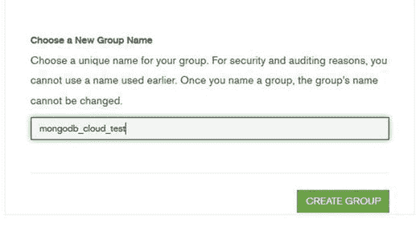
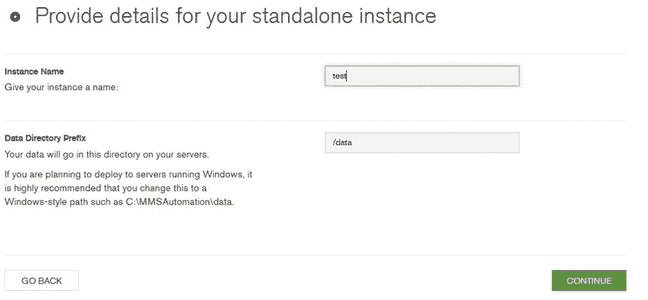
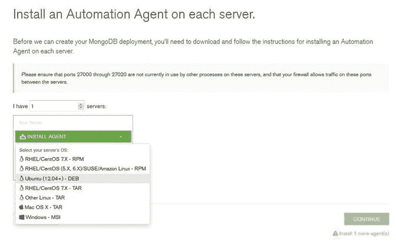
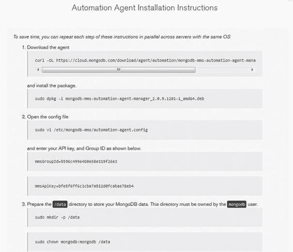
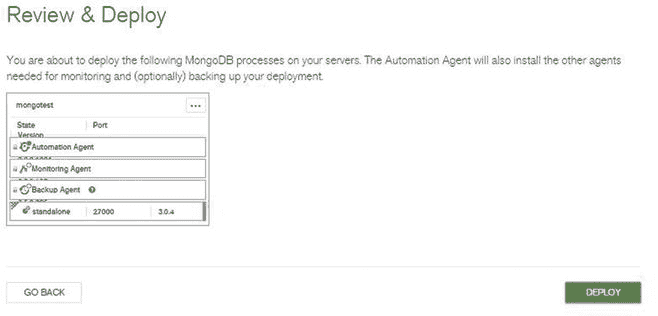

# 五、MongoDB 安装和配置

> "MongoDB is a cross-platform database."

在本章中，您将了解在 Windows 和 Linux 上安装 MongoDB 的过程。

## 5.1 选择您的版本

MongoDB 运行在大多数平台上。MongoDB 下载页面上的 [`www.mongodb.org/downloads`](http://www.mongodb.org/downloads) 提供了所有可用包的列表。

适合您环境的正确版本将取决于服务器的操作系统和处理器的种类。MongoDB 支持 32 位和 64 位架构，但是建议在您的生产环境中使用 64 位架构。

32-bit limitation

这是因为在 MongoDB 中使用了内存映射文件。这将 32 位版本的数据限制在 2GB 左右。出于性能原因，建议在生产环境中使用 64 位版本。

在撰写本书时，最新的 MongoDB 生产版本是 3.0.4。MongoDB 的下载适用于 Linux、Windows、Solaris 和 Mac OS X。

MongoDB 下载页面分为以下几个部分:

*   当前稳定版本(3 . 0 . 4)–2015 年 6 月 16 日
*   以前的版本(稳定)
*   开发版本(不稳定)

当前版本是目前最稳定的最新版本，在撰写本书时是 3.0.4。当一个新版本发布时，先前的稳定版本被移到先前版本部分。

开发版本，顾名思义，是仍在开发中的版本，因此被标记为不稳定。这些版本可以有额外的功能，但它们可能不稳定，因为它们仍处于开发阶段。您可以使用开发版本来尝试新功能，并向 10gen 提供有关功能和面临的问题的反馈。

## 5.2 在 Linux 上安装 MongoDB

本节介绍在 LINUX 系统上安装 MongoDB。在下面的演示中，我们将使用 Ubuntu Linux 发行版。您可以手动或通过存储库安装 MongoDB。我们将向您介绍这两个选项。

### 5.2.1 使用资料库安装

在 LINUX 中，存储库是包含软件的在线目录。Aptitude 是用来在 Ubuntu 上安装软件的程序。尽管 MongoDB 可能存在于默认的存储库中，但也有可能是过时的版本，所以第一步是配置 Aptitude 来查看定制的存储库。

Issue the following to import the `public.GPG` key for MongoDB: `sudo apt-key adv --keyserver hkp://keyserver.ubuntu.com:80 --recv 7F0CEB10`   Next, use the following command to create the `/etc/apt/sources.list.d/mongodb-org-3.0.list` file: `echo "deb` [`http://repo.mongodb.org/apt/ubuntu`](http://repo.mongodb.org/apt/ubuntu) `"$(lsb_release -sc)"/mongodb-org/3.0 multiverse" | sudo tee /etc/apt/sources.list.d/mongodb-org-3.0.list`   Finally, use the following command to reload the repository: `sudo apt-get update` Now Aptitude is aware of the manually added repository.   Next, you need to install the software. The following command should be issued in the shell to install MongoDB’s current stable version: `sudo apt-get install -y mongodb-org`  

您已经成功安装了 MongoDB，这就是它的全部内容。

### 手动安装

在本节中，您将看到如何手动安装 MongoDB。这一知识在以下情况下很重要:

*   当 Linux 发行版不使用 Aptitude 时。
*   当您需要的版本无法通过存储库获得或者不属于存储库时。
*   当你需要同时运行多个 MongoDB 版本时。

手动安装的第一步是决定要使用的 MongoDB 版本，然后从站点下载。接下来，需要使用以下命令提取包:

`$ tar -xvf mongodb-linux-x86_64-3.0.4.tgz`

`mongodb-linux-i686-3.0.4/THIRD-PARTY-NOTICES`

`mongodb-linux-i686-3.0.4/GNU-AGPL-3.0`

`mongodb-linux-i686-3.0.4/bin/mongodump`

`............`

`mongodb-linux-i686-3.0.4/bin/mongosniff`

`mongodb-linux-i686-3.0.4/bin/mongod`

`mongodb-linux-i686-3.0.4/bin/mongos`

`mongodb-linux-i686-3.0.4/bin/mongo`

这会将包内容提取到一个新目录中，即`mongodb-linux-x86_64-3.0.4`(位于当前目录下)。该目录包含许多子目录和文件。主可执行文件在子目录`bin`下。

这就成功完成了 MongoDB 的安装。

## 5.3 在 Windows 上安装 MongoDB

在 Windows 上安装 MongoDB 很简单，只需下载所选 Windows 版本的 msi 文件并运行安装程序。

安装程序将引导您完成 MongoDB 的安装。

按照向导，您将到达选择安装类型屏幕。有两种安装类型可供您自定义安装。在本例中，选择“自定义”安装类型。

选择自定义时需要指定安装目录，所以将目录指定到`C:\PracticalMongoDB`。

注意，MongoDB 可以从用户选择的任何文件夹中运行，因为它是自包含的，不依赖于系统。如果选择了完整的设置类型，则默认选择的文件夹是`C:\Program Files\MongoDB`。

单击“下一步”将带您进入“准备安装”屏幕。单击安装。

这将开始安装，并在屏幕上显示进度。安装完成后，向导将带您进入完成屏幕。

单击“完成”完成设置。成功完成上述步骤后，您就有了一个名为`C:\PracticalMongoDB`的目录，在`bin`文件夹中有所有相关的应用。这就是全部了。

## 5.4 运行 MongoDB

让我们看看如何开始运行和使用 MongoDB。

### 先决条件

存储文件需要一个数据文件夹。这在 Windows 中默认为`C:\data\db`，在 LINUX 系统中默认为`/data/db`。

这些数据目录不是由 MongoDB 创建的，因此在启动 MongoDB 之前，需要手动创建数据目录，并且您需要确保设置了适当的权限(例如 MongoDB 具有读、写和目录创建权限)。

如果在创建文件夹之前启动 MongoDB，它将抛出一条错误消息，并且无法运行。

### 5.4.2 启动服务

一旦创建了目录并获得了权限，就执行 mongod 应用(位于`bin`目录下)来启动 MongoDB 核心数据库服务。

继续上述安装，可以通过在 Windows 中打开命令提示符(需要以管理员身份运行)并执行以下命令来启动:

`c:\>` `c:\practicalmongodb\bin\mongod.exe`

对于 Linux，mongod 进程是在 shell 中启动的。

这将在本地主机界面上启动 MongoDB 数据库。它将在端口 27017 上侦听来自 mongo shell 的连接。

如上所述，需要在启动数据库之前创建文件夹路径，默认情况下是`c:\data\db`。使用–dbpath 参数启动数据库服务时，也可以提供备用路径。

`C``:\>``C:\``practicalmongodb`T4】

`C:\NewDBPath\DBContents`

## 5.5 验证安装

相关的可执行文件将出现在子目录`bin`下。为了检查安装步骤是否成功，可以在`bin`目录下检查以下内容:

*   Mongod:核心数据库服务器
*   Mongo:数据库 Shell
*   Mongos:自动分片过程
*   Mongoexport:导出实用程序
*   Mongoimport:导入实用程序

除此之外，`bin`文件夹中还有其他应用。

mongo 应用启动 mongo shell，它提供对数据库内容的访问，并允许您对 MongoDB 中的数据执行选择性查询或聚合。

如上所述，mongod 应用用于启动数据库服务或守护进程。

启动应用时，可以设置多个标志。例如，`–dbpath`可用于指定存储数据库文件的替代路径。要获得所有可用选项的列表，请在启动服务时包含`--help`标志。

## 5.6 蒙戈布 Shell

mongo shell 是 MongoDB 标准发行版的一部分。shell 为 MongoDB 提供了一个完整的数据库接口，使您能够使用 JavaScript 环境处理存储在 MongoDB 中的数据，该环境可以完全访问该语言和所有标准函数。

一旦数据库服务启动，您就可以启动 mongo shell 并开始使用 MongoDB。这可以使用 Linux 中的 Shell 或 Windows 中的命令提示符来完成(以管理员身份运行)。

您必须指出可执行文件的确切位置，例如在 Windows 环境中的`C:\practicalmongodb\bin\`文件夹中。

打开命令提示符(以管理员身份运行)并键入`mongo.exe`。按回车键。这将启动 mongo shell。

`C:\>` `C:\practicalmongodb\bin\mongo.exe`

`MongoDB shell version: 3.0.4`

`connecting to: test`

`>`

如果在启动服务时没有指定参数，它将连接到 localhost 实例上名为`test`的默认数据库。

当连接到数据库时，将自动创建数据库。如果试图访问一个不存在的数据库，MongoDB 提供了自动创建数据库的特性。

下一章提供了更多关于使用 mongo shell 的信息。

## 5.7 保护部署

您知道如何通过默认配置安装和开始使用 MongoDB。接下来，您需要确保存储在数据库中的数据在各个方面都是安全的。

在本节中，您将了解如何保护您的数据。您将更改默认安装的配置，以确保您的数据库更加安全。

### 5.7.1 使用认证和授权

身份验证验证用户的身份，而授权确定用户可以对经过身份验证的数据库执行的操作级别。

这意味着用户只有在使用有权访问数据库的凭证登录时才能访问数据库。这将禁用对数据库的匿名访问。用户通过身份验证后，可以使用授权来确保用户只拥有完成手头任务所需的访问权限。

身份验证和授权都存在于每个数据库级别。用户存在于单个逻辑数据库的上下文中。

用户信息保存在 admin 数据库中的一个名为`system.users`的集合中。该集合维护对用户进行身份验证所需的凭证，其中存储了用户 id、密码和创建该集合所依据的数据库，以及授权用户所需的特权。

MongoDB 使用基于角色的方法进行授权(read、readWrite、readAnyDatabase 等角色)。).如果需要，用户管理员可以创建自定义角色。

`system.users`集合中的特权文档用于存储每个用户角色。同一文档维护经过身份验证的用户的凭证。

`system.users`集合中的文档示例如下:

`{`

`_id : "practicaldb.Shaks",`

`user : "Shaks",`

`db : "practicaldb",`

`credentials : {.......},`

`roles : [`

`{ role: "read", db: "practicaldb" },`

`{ role: "readWrite", db: "MyDB" }`

`],`

`......`

`}`

这个文档告诉我们，用户 Shaks 与数据库`practicaldb`相关联，它在`practicaldb`数据库中有读取角色，在`MyDB`数据库中有读写角色。请注意，用户名和关联的数据库唯一地标识了 MongoDB 中的一个用户，因此，如果有两个同名的用户，但是他们与不同的数据库相关联，那么他们将被视为两个唯一的用户。因此，一个用户可以在不同的数据库上拥有多个具有不同授权级别的角色。

可用的角色有

*   read:这提供了对指定数据库的所有集合的只读访问。
*   readWrite:这提供了对指定数据库中任何集合的读写访问。
*   dbAdmin:这使用户能够在指定的数据库中执行管理操作，例如使用 ensureIndex、dropIndexes、reIndex、indexStats 进行索引管理、重命名集合、创建集合等。
*   userAdmin:这使用户能够对指定数据库的`system.users`集合执行读写操作。它还支持更改现有用户的权限或创建新用户。这实际上是指定数据库的超级用户角色。
*   clusterAdmin:该角色使用户能够授予更改或显示整个系统信息的管理操作的访问权限。clusterAdmin 仅适用于管理数据库。
*   readAnyDatabase:该角色使用户能够读取 MongoDB 环境中的任何数据库。
*   readWriteAnyDatabase:这个角色类似于 readWrite，只是它适用于所有数据库。
*   userAdminAnyDatabase:该角色类似于 userAdmin 角色，只是它适用于所有数据库。
*   dbAdminAnyDatabase:该角色与 dbAdmin 相同，只是它适用于所有数据库。
*   从 2.6 版开始，用户管理员还可以创建用户定义的角色，通过提供集合级别和命令级别的访问权限来遵守最低权限策略。用户定义角色的范围是创建它的数据库，并且由数据库和角色名称的组合唯一标识。所有用户定义的角色都存储在`system.roles`集合中。

#### 5.7.1.1 启用身份验证

默认情况下，身份验证是禁用的，因此使用`--auth`来启用身份验证。启动 mongod 的同时，使用`mongod --auth`。在启用身份验证之前，您需要至少有一个管理员用户。如上所述，管理员用户是负责创建和管理其他用户的用户。

建议在生产部署中，此类用户仅用于管理用户，不应用于任何其他角色。在 MongoDB 部署中，这个用户是需要创建的第一个用户；该用户可以创建系统的其他用户。

管理员用户可以通过两种方式创建:在启用身份验证之前或之后。

在本例中，您将首先创建 admin 用户，然后启用 auth 设置。以下步骤应在 Windows 平台上执行。

使用默认设置启动 mongod:

`C:\>C:\practicalmongodb\bin\mongod.exe`

`C:\practicalmongodb\bin\mongod.exe --help for help and startup options`

`2015-07-03T23:11:10.716-0700 I CONTROL Hotfix KB2731284 or later update is installed, no need to zero out data files`

`2015-07-03T23:11:10.716-0700 I JOURNAL [initandlisten] journal dir=C:\data\db\journal`

`...................................................`

`2015-07-03T23:11:10.763-0700 I CONTROL [initandlisten] MongoDB starting : pid=2776 port=27017 dbpath=C:\data\db\ 64-bit host=ANOC9`

`2015-07-03T23:11:10.763-0700 I CONTROL [initandlisten] targetMinOS: Windows 7/W`

`indows Server 2008 R2`

`2015-07-03T23:11:10.763-0700 I CONTROL [initandlisten] db version v3.0.4`

`2015-07-03T23:11:10.764-0700 I CONTROL [initandlisten] OpenSSL version: OpenSSL 1.0.1j-fips 19 Mar 2015`

`2015-07-03T23:11:10.764-0700 I CONTROL [initandlisten] build info: windows sys. getwindowsversion(major=6, minor=1, build=7601, platform=2, service_pack='Service Pack 1') BOOST_LIB_VERSION=1_49`

`2015-07-03T23:11:10.771-0700 I NETWORK [initandlisten] waiting for connections`

`on port 27017`

#### 5.7.1.2 创建管理员用户

以管理员身份运行命令提示符的另一个实例，并执行 mongo 应用:

`C:\>` `C:\practicalmongodb\bin\mongo.exe`

`MongoDB shell version: 3.0.4`

`connecting to: test`

`>`

##### 切换到管理数据库

Note

admin db 是一个特权数据库，用户需要访问它才能执行某些管理命令，比如创建 admin 用户。

`>` `db = db.getSiblingDB('admin')`

##### 管理

需要使用以下角色之一创建用户:userAdminAnyDatabase 或 userAdmin:

`>db.createUser({user: "AdminUser", pwd: "password", roles:["userAdminAnyDatabase"]})`

`Successfully added user: { "user" : "AdminUser", "roles" : [ "userAdminAnyDatabase" ] }`

接下来，使用该用户进行身份验证。使用`auth`设置重启 mongod:

`C:\>` `C:\practicalmongodb\bin\mongod.exe -auth`

`C:\practicalmongodb\bin\mongod.exe --help for help and startup options`

`2015-07-03T23:11:10.716-0700 I CONTROL Hotfix KB2731284 or later update is installed, no need to zero out data files`

`2015-07-03T23:11:10.716-0700 I JOURNAL [initandlisten] journal dir=C:\data\db\journal`

`...................................................`

`2015-07-03T23:11:10.763-0700 I CONTROL [initandlisten] MongoDB starting : pid=2776 port=27017 dbpath=C:\data\db\ 64-bit host=ANOC9`

`2015-07-03T23:11:10.763-0700 I CONTROL [initandlisten] targetMinOS: Windows 7/W`

`indows Server 2008 R2`

`2015-07-03T23:11:10.763-0700 I CONTROL [initandlisten] db version v3.0.4`

`2015-07-03T23:11:10.764-0700 I CONTROL [initandlisten] OpenSSL version: OpenSSL 1.0.1j-fips 19 Mar 2015`

`2015-07-03T23:11:10.764-0700 I CONTROL [initandlisten] build info: windows sys. getwindowsversion(major=6, minor=1, build=7601, platform=2, service_pack='Service Pack 1') BOOST_LIB_VERSION=1_49`

`2015-07-03T23:11:10.771-0700 I NETWORK [initandlisten] waiting for connections`

`on port 27017`

启动 mongo 控制台，使用上面创建的 AdminUser 用户对管理数据库进行身份验证:

`C:\>c:\practicalmongodb\bin\mongo.exe`

`MongoDB shell version: 3.0.4`

`connecting to: test`

`>use admin`

`switched to db admin`

`>db.auth("AdminUser", "password")`

`1`

`>`

#### 5.7.1.3 创建用户并启用授权

在本节中，您将创建一个用户，并为新创建的用户分配一个角色。您已经使用 admin 用户进行了身份验证，如下所示:

`C:\>c:\practicalmongodb\bin\mongo.exe`

`MongoDB shell version: 3.0.4`

`connecting to: test`

`>use admin`

`switched to db admin`

`>db.auth("AdminUser", "password")`

`1`

`>`

切换到`Product`数据库，创建用户 Alice，并分配对产品数据库的读取权限，如下所示:

`>` `use product`

`switched to db product`

`>db.createUser({user: "Alice"`

`... , pwd:"Moon1234"`

`... , roles: ["read"]`

`... }`

`... )`

`Successfully added user: { "user" : "Alice", "roles" : [ "read" ] }`

接下来，验证用户对数据库具有只读访问权限:

`>db`

`product`

`>show users`

`{`

`"_id" : "product.Alice",`

`"user" : "Alice",`

`"db" : "product",`

`"roles" : [`

`{`

`"role" : "read",`

`"db" : "product"`

`}`

`]`

`}`

接下来，连接到一个新的 mongo 控制台，以 Alice 的身份登录到`Products`数据库，发出只读命令:

`C:\>` `c:\practicalmongodb\bin\mongo.exe -u Alice -p Moon1234 product`

`2015-07-03T23:11:10.716-0700 I CONTROL Hotfix KB2731284 or later update is installed, no need to zero-out data files`

`MongoDB shell version: 3.0.4`

`connecting to: products`

`Post successful authentication the following entry will be seen on the mongod console.`

`2015-07-03T23:11:26.742-0700 I ACCESS [conn2] Successfully authenticated as principal Alice on product`

### 控制对网络的访问

默认情况下，mongod 和 mongos 绑定到系统上所有可用的 IP 地址。在本节中，您将了解用于限制网络暴露的配置选项。以下代码在 Windows 平台上执行:

`C:\>` `c:\practicalmongodb\bin\mongod.exe --bind_ip 127.0.0.1 --port 27017 --rest`

`2015-07-03T00:33:49.929-0700 I CONTROL Hotfix KB2731284 or later update is installed, no need to zero out data files`

`2015-07-03T00:33:49.946-0700 I JOURNAL [initandlisten] journal dir=C:\data\db\journal`

`2015-07-03T00:33:49.980-0700 I CONTROL [initandlisten] MongoDB starting : pid=1144 port=27017 dbpath=C:\data\db\ 64-bit host=ANOC9`

`2015-07-03T00:33:49.980-0700 I CONTROL [initandlisten] targetMinOS: Windows 7/Windows Server 2008 R2`

`2015-07-03T00:33:49.980-0700 I CONTROL [initandlisten] db version v3.0.4`

`2015-07-03T00:33:49.980-0700 I CONTROL [initandlisten] OpenSSL version: OpenSSL1.0.1j-fips 19 Mar 2015`

`2015-07-03T00:33:49.980-0700 I CONTROL [initandlisten] build info: windows sys.getwindowsversion(major=6, minor=1, build=7601, platform=2, service_pack='Service Pack 1') BOOST_LIB_VERSION=1_49`

`2015-07-03T00:33:49.981-0700 I CONTROL [initandlisten] allocator: system`

`2015-07-03T00:33:49.981-0700 I CONTROL [initandlisten] options: { net: { bindIp: "127.0.0.1", http: { RESTInterfaceEnabled: true, enabled: true }, port: 27017} }`

`2015-07-03T00:33:49.990-0700 I NETWORK [initandlisten] waiting for connections on port 27017`

`2015-07-03T00:33:49.990-0700 I NETWORK [websvr] admin web console waiting for connections on port 28017`

`2015-07-03T00:34:22.277-0700 I NETWORK [initandlisten] connection accepted from 127.0.0.1:49164 #1 (1 connection now open)`

您已经用`bind_ip`启动了服务器，它有一个值设置为 127.0.0.1，这是 localhost 接口。

`bind_ip`限制程序将监听的输入连接的网络接口。可以指定逗号分隔的 IP 地址。在您的例子中，您已经将 mongod 限制为只监听 localhost 接口。

当 mongod 实例启动时，默认情况下，它会在端口 27017 上等待任何传入的连接。您可以使用`–port`进行更改。

仅仅改变端口并不能降低太多风险。为了完全保护环境，您需要仅允许受信任的客户端使用防火墙设置连接到端口。

更改此端口也会更改 HTTP 状态接口端口，默认端口为 28017。此端口在 X+1000 端口上可用，其中 X 代表连接端口。

此网页公开了诊断和监控信息，其中包括运行数据、各种日志和有关数据库实例的状态报告。它提供可用于管理目的的管理级统计数据。默认情况下，此页面是只读的；为了使它完全交互，您将使用 REST 设置。这种配置使页面具有充分的交互性，有助于管理员解决任何性能问题。使用防火墙时，应该只允许可信客户端访问此端口。

建议在生产环境中禁用 HTTP 状态页面以及 REST 配置。

#### 5.7.2.1 使用防火墙

防火墙用于控制网络中的访问。它们可用于允许从特定 IP 地址到特定 IP 端口的访问，或阻止来自任何不受信任主机的任何访问。它们可以用来为 mongod 实例创建一个可信的环境，在这个环境中，您可以指定哪些 IP 地址或主机可以连接到 mongod 的哪些端口或接口。

在 Windows 平台上，使用`netsh`为端口 27017 配置传入流量:

`C:\>` `netsh advfirewall firewall add rule name="Open mongod port 27017" dir=in action=allow protocol=TCP localport=27017`

`Ok.`

`C:\>`

这段代码说明所有的传入流量都允许通过端口 27017，因此任何应用服务器都可以连接到 mongod。

#### 5.7.2.2 加密数据

您已经看到 MongoDB 将其所有数据存储在一个数据目录中，该目录在 Windows 中默认为`C:\data\db`和`/data/db`。文件以不加密的方式存储在目录中，因为在 Mongo 中没有提供自动加密文件的方法。任何具有文件系统访问权限的攻击者都可以读取文件中存储的数据。应用有责任确保敏感信息在写入数据库之前被加密。

此外，应实施操作系统级机制，如文件系统级加密和权限，以防止对文件的未授权访问。

#### 5.7.2.3 加密通信

通常要求 mongod 和客户机(例如 mongo shell)之间的通信是加密的。在这个设置中，您将看到如何通过配置 SSL 为上述安装增加一个安全级别，以便 mongod 和 mongo shell(客户机)之间的通信使用 SSL 证书和密钥。

建议使用 SSL 进行服务器和客户端之间的通信。

从版本 3.0 开始，大多数 MongoDB 发行版现在都支持 SSL。以下命令在 Windows 平台上执行。

第一步是生成包含公钥证书和私钥的`.pem`文件。MongoDB 可以使用自签名证书或由证书颁发机构颁发的任何有效证书。

在本书中，您将使用以下命令来生成自签名证书和私钥。

Install OpenSSL and Microsoft Visual C++ 2008 redistributable as per the MongoDB distribution and the Windows platform. In this book, you have installed the 64-bit version.   Run the following command to create a public key certificate and a private key: `C:\> cd c:\OpenSSL-Win64\bin` `C:\OpenSSL-Win64\bin\>openssl` This opens the OpenSSL shell where you need to enter the following command: `OpenSSL>req -new -x509 -days 365 -nodes -out C:\practicalmongodb\mongodb-cert.crt -keyout C:\practicalmongodb\mongodb-cert.key` The above step generates a certificate key named `mongodb-cert.key` and places it in the `C:\practicalmongodb` folder.   Next, you need to concatenate the certificate and the private key to the `.pem` file. In order to achieve this, run the following commands at the command prompt: `C:\> more C:\practicalmongodb\mongodb-cert.key > temp` `C:\> copy \b temp C:\practicalmongodb\mongodb-cert.crt > C:\practicalmongodb\mongodb.pem`  

现在你有了一个`.pem`文件。启动 mongod 时使用以下运行时选项:

`C:\> C:\practicalmongodb\bin\mongod –sslMode requireSSL --sslPEMKeyFile C:\practicalmongodb\mongodb.pem`

`2015-07-03T03:45:33.248-0700 I CONTROL Hotfix KB2731284 or later update is installed, no need to zero-out data files`

`2015-07-03T02:54:30.630-0700 I JOURNAL [initandlisten] journal dir=C:\data\db\journal`

`2015-07-03T02:54:30.670-0700 I CONTROL [initandlisten] MongoDB starting : pid=2`

`816 port=27017 dbpath=C:\data\db\ 64-bit host=ANOC9`

`2015-07-03T02:54:30.670-0700 I CONTROL [initandlisten] targetMinOS: Windows 7/Windows Server 2008 R2`

`2015-07-03T02:54:30.670-0700 I CONTROL [initandlisten] db version v3.0.4`

`2015-07-03T02:54:30.670-0700 I CONTROL [initandlisten] OpenSSL version: OpenSSL1.0.1j-fips 19 Mar 2015`

`2015-07-03T02:54:30.670-0700 I CONTROL [initandlisten] build info: windows sys. getwindowsversion(major=6, minor=1, build=7601, platform=2, service_pack='Service Pack 1') BOOST_LIB_VERSION=1_49`

`2015-07-03T02:54:30.671-0700 I CONTROL [initandlisten] allocator: system`

`2015-07-03T02:54:30.671-0700 I CONTROL [initandlisten] options: { net: { ssl: {`

`PEMKeyFile: "c:\practicalmongodb\mongodb.pem", mode: "requireSSL" } } }`

`2015-07-03T02:54:30.680-0700 I NETWORK [initandlisten] waiting for connections`

`on port 27017 ssl`

`2015-07-03T03:33:43.708-0700 I NETWORK [initandlisten] connection accepted from`

`127.0.0.1:49194 #2 (1 connection now open)`

Note

不建议在生产环境中使用自签名证书，除非它是一个受信任的网络，因为它会使您容易受到中间人攻击。

接下来，您将使用 mongo shell 连接到上面的 mongod。当您使用`–ssl`选项运行 mongo 时，您需要指定`–sslAllowInvalidCertificates`或`–sslCAFile`。还是用`–sslAllowInvalidCertificates`吧。

打开终端窗口，输入以下内容:

`C:\>` `C:\practicalmongodb\bin>mongo --ssl --sslAllowInvalidCertificates`

`2015-07-03T02:30:10.774-0700 I CONTROL Hotfix KB2731284 or later update is installed, no need to zero-out data files`

`MongoDB shell version: 3.0.4`

`connecting to: test`

## 5.8 使用 MongoDB 云管理器进行配置

在本章的开始，您学习了如何使用 Windows 和 Linux 安装和配置 MongoDB。在本章的这一部分，你将看到如何使用 MongoDB 云管理器。

Mongo DBCloud Manager 是数据库开发者内置的一个监控解决方案。在 2.6 版之前，MongoDB 云管理器(以前称为 MongoDB 监控服务或 MMS)仅用于监控和管理 MongoDB。从 2.6 版开始，MongoDB Cloud Manager 引入了一些重要的增强功能，包括备份、时间点恢复和自动化特性，使得操作 MongoDB 的任务比以前更简单。自动化特性为管理员提供了强大的功能，只需点击几下鼠标就可以快速创建、升级、扩展或关闭 MongoDB 实例。

在本书的这一部分，您将看到如何开始使用 MongoDB 云管理器。您将使用 MongoDB 云管理器在 AWS 上部署一个独立的 MongoDB 实例。

当您启动 MongoDB 云管理器时，它会要求在每台服务器上安装一个自动化代理，然后由 MongoDB 云管理器用来与服务器通信。

为了开始供应，您首先需要在 MongoDB Cloud Manager 上创建您的配置文件。

输入以下网址: [`https://cloud.mongodb.com`](https://cloud.mongodb.com/) 。根据您是否拥有帐户，点按“登录”或“免费注册”按钮。

由于您是第一次开始，请单击“注册免费”按钮。这将使您进入图 [5-1](#Fig1) 所示的页面。

图 5-1。

Account Profile

您将创建一个新的个人资料。然而，MongoDB 提供了作为现有云管理器组加入的选项。

输入所有相关细节，如图 [5-1](#Fig1) 所示，点击继续。这会将您转到提供公司信息的页面。完成个人资料和公司信息后，接受条款并单击创建帐户按钮。这就完成了概要文件的创建。下一步是创建一个组(图 [5-2](#Fig2) )。

图 5-2。

Create Group

为该组提供一个唯一的名称，然后单击创建组。接下来是部署选择页面，如图 [5-3](#Fig3) 所示，您可以选择构建新的部署或管理现有的部署。

图 5-3。

Deployment

选择以构建新部署。接下来，将提示您构建部署的位置(即本地、AWS 或其他远程环境)。在本例中，选择 AWS。单击“在 AWS 中部署”选项将引导您在自行调配和使用 Cloud Manager 进行调配之间进行选择。

选择“I will Provision”选项，这意味着您将使用已经在 AWS 上提供给您的机器。

下一个屏幕提供了部署类型的选项(即独立、副本集或分片集群)。您正在进行独立部署，因此请单击“创建独立”框。这将使您进入图 [5-4](#Fig4) 所示的屏幕。

图 5-4。

Details for a standalone instance

提供实例名和数据目录前缀，然后单击继续。接下来是如图 [5-5](#Fig5) 所示的屏幕，它提示您在每台服务器上安装一个自动化代理

图 5-5。

Installing an automation agent

该屏幕有一个指定服务器数量的选项。在本例中，您指定 1。

接下来，您需要指定平台。选择 Ubuntu。然后出现图 [5-6](#Fig6) 中的屏幕。

图 5-6。

Automation agent installation instructions

按照步骤操作。

在实现启动代理的步骤之前，需要确保所有相关端口都是打开的(443、4949、27000 到 27018)。

完成所有步骤后，单击“验证代理”按钮。验证后，如果一切正常，您会看到一个继续按钮。

当您单击 Continue 时，您将转到图 [5-7](#Fig7) 所示的审查和部署页面，在这里您可以看到将要部署的所有流程。在这里，自动化代理下载并安装监控和备份代理。

图 5-7。

Review and deploy

单击 Deploy 按钮将转到 deployment 页面，部署更改状态为“正在进行”安装完成后，部署状态将变为“目标状态”,配置的服务器将出现在拓扑视图中。

如果您的部署支持 SSL 或使用任何身份验证机制，您需要手动下载并安装监控代理。

为了检查所有代理是否正常工作，您可以单击控制台上的管理选项卡。

云管理器可以在任何连接互联网的服务器上部署 MongoDB 副本集、分片集群和独立服务器。服务器只需要能够与云管理器建立出站 TCP 连接。

## 5.9 总结

在本章中，您学习了如何在 Windows 和 Linux 平台上安装 MongoDB。您还了解了一些重要的配置，这些配置对于确保数据库的安全使用是必要的。您通过使用 MongoDB 云管理器进行配置结束了这一章。

在下一章中，您将开始使用 MongoDB Shell。