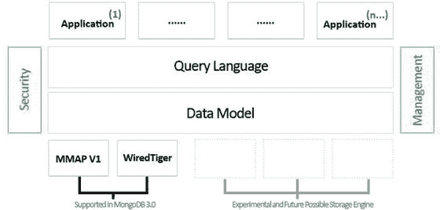
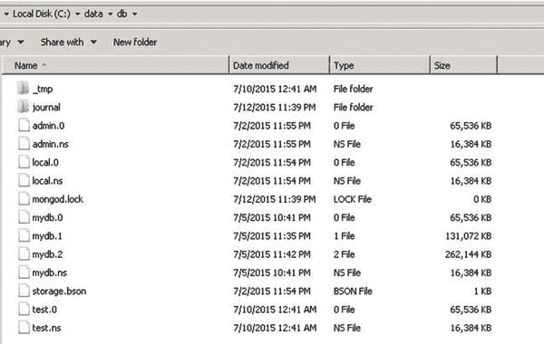
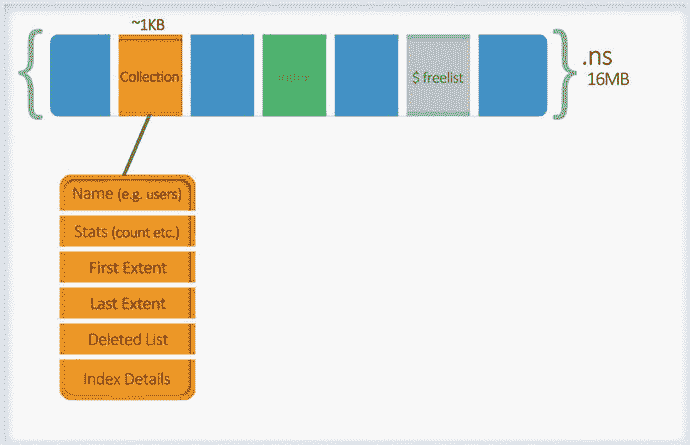
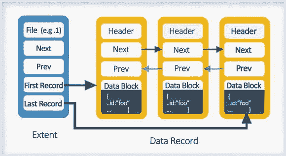
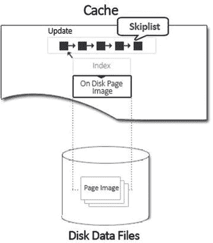
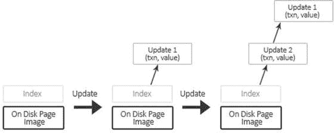
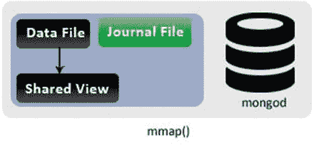
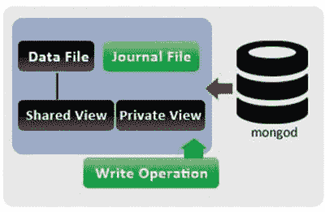
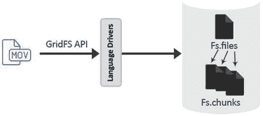

# 八、MongoDB 解释

“MongoDB explained 涵盖了 MongoDB 的深层概念。”

在这一章中，你将学习如何在 MongoDB 中存储数据，以及如何使用日志进行写操作。最后，您将了解 GridFS 和 MongoDB 中可用的不同类型的索引。

## 8.1 数据存储引擎

在前一章中，您查看了作为 MongoDB 的一部分部署的核心服务；您还了解了副本集和分片。在本节中，我们将讨论数据存储引擎。

MongoDB 使用 MMAP 作为默认的存储引擎。该引擎处理内存映射文件。内存映射文件是操作系统使用`mmap()`系统调用放置在内存中的数据文件。mmap 是 OS 的一个特性，它将磁盘上的文件映射到虚拟内存中。

虚拟内存不等同于物理内存。虚拟内存是计算机硬盘上与物理 RAM 一起使用的空间。

MongoDB 将内存映射文件用于任何数据交互或数据管理活动。当文档被访问时，数据文件被存储器映射到存储器。MongoDB 允许操作系统控制内存映射并分配最大数量的 RAM。这样做的结果是 MongoDB 级别的工作和编码最少。缓存是基于 LRU 行为完成的，其中最近最少使用的文件从工作集中移到磁盘，为最近使用和经常使用的新页面腾出空间。

然而，这种方法有其自身的缺点。例如，MongoDB 无法控制哪些数据应该保留在内存中，哪些应该删除。因此，每次服务器重启都会导致页面错误，因为被访问的每个页面在工作集中都不可用，从而导致很长的数据检索时间。

MongoDB 也无法控制内存内容的优先级。在撤离的情况下，它可以指出哪些内容需要保留在缓存中，哪些内容可以删除。例如，如果对未编制索引的大型集合进行读取，可能会导致将整个集合加载到内存中，这可能会导致清空 RAM 内容，包括删除可能非常重要的其他集合的索引。当 MongoDB 之外的任何外部进程试图访问大部分内存时，这种缺乏控制也可能导致分配给 MongoDB 的缓存收缩；这最终会导致 MongoDB 响应缓慢。

随着 3.0 版的发布，MongoDB 附带了一个可插拔的存储引擎 API，它使您能够根据工作负载、应用需求和可用的基础设施在存储引擎之间进行选择。

可插拔存储引擎层背后的愿景是拥有一个数据模型、一种查询语言和一组操作关注点，但在幕后有许多针对不同用例优化的存储引擎选项，如图 [8-1](#Fig1) 所示。

图 8-1。

Pluggable storage engine API

可插拔存储引擎功能还在部署方面提供了灵活性，其中多种类型的存储引擎可以在同一部署中共存。

MongoDB 版附带了两个存储引擎。

默认的 MMAPv1 是以前版本中使用的 MMAP 引擎的改进版本。更新后的 MongoDB MMAPv1 存储引擎实现了集合级并发控制。该存储引擎擅长处理大量读取、插入和就地更新的工作负载。

新的 WiredTiger 存储引擎是由世界上部署最广泛的嵌入式数据管理软件 Berkeley DB 的架构师开发的。WiredTiger 在现代多 CPU 架构上扩展。它旨在利用具有多核 CPU 和更多 RAM 的现代硬件。

WIredTiger 将数据以压缩格式存储在磁盘上。根据所使用的压缩算法，压缩可将数据大小减少 70%(仅磁盘)，将索引大小减少 50%(磁盘和内存)。除了减少存储空间之外，压缩还支持更高的 I/O 可扩展性，因为从磁盘读取的位更少。它在更高的硬件利用率、更低的存储成本和更可预测的性能方面提供了显著的优势。

以下压缩算法可供选择:

*   Snappy 是默认设置，用于文档和日志。它以很少的 CPU 开销提供了很好的压缩率。根据数据类型的不同，压缩率在 70%左右。
*   zlib 提供了非常好的压缩，但代价是额外的 CPU 开销。
*   前缀压缩是索引的默认使用方式，它将索引存储的内存占用减少了大约 50%(取决于工作负载)，并为频繁访问的文档释放了更多的工作集。

管理员可以修改所有集合和索引的默认压缩设置。在集合和索引创建期间，还可以基于每个集合和每个索引来配置压缩。

WiredTiger 还提供细粒度的文档级并发。写操作不再被其他写操作阻塞，除非它们正在访问同一个文档。因此，它支持读者和作者同时访问集合中的文档。客户端可以在写操作进行的同时读取文档，多个线程可以同时修改集合中的不同文档。因此，它非常适合写入密集型工作负载(写入性能提高 7-10 倍)。

更高的并发性也推动了基础设施的简化。应用可以充分利用可用的服务器资源，简化满足性能 SLA 所需的架构。使用前几代 MongoDB 的更粗粒度的数据库级锁定，用户经常必须实现分片，以便扩展由于对数据库的单个写锁定而停止的工作负载，即使主机系统中仍然有足够的内存、I/O 带宽和磁盘容量可用。通过细粒度并发实现的更高系统利用率降低了这一开销，消除了不必要的成本和管理负载。

这个存储引擎为您提供了对每个索引级别的每个集合的控制，以决定压缩什么和不压缩什么。

WiredTiger 存储引擎仅适用于 64 位 MongoDB。

WiredTiger 通过其缓存管理数据。WiredTiger 存储引擎允许您配置分配给 WiredTiger 缓存的 RAM 大小，默认为 1GB 或 50%的可用内存，以较大者为准，从而提供更多的内存控制。

接下来，您将简要了解数据是如何存储在磁盘上的。

## 8.2 数据文件(与 MMAPv1 相关)

首先，让我们检查数据文件。如您所见，在核心服务下，mongod 使用的默认数据目录是`/data/db/`。

在这个目录下，每个数据库都有单独的文件。每个数据库都有一个`.ns`文件和多个数据文件，这些文件的扩展名都是单调递增的数字。

比如你创建了一个名为`mydbpoc`的数据库，它会被存储在以下文件中:`mydb.ns`、`mydb.1`、`mydb.2`等等，如图 [8-2](#Fig2) 。

图 8-2。

Data files

对于数据库的每个新数字数据文件，其大小将是前一个数字数据文件大小的两倍。文件大小的限制是 2GB。如果文件大小已达到 2GB，所有后续编号的文件将保持 2GB 大小。这种行为是故意的。这种行为确保小型数据库不会浪费太多的磁盘空间，而大型数据库大多保存在磁盘上的连续区域中。

注意，为了确保一致的性能，MongoDB 会预分配数据文件。预分配在后台进行，并在每次填充数据文件时启动。这意味着 MongoDB 服务器总是试图为每个数据库保留一个额外的空数据文件，以避免阻塞文件分配。

如果磁盘上存在多个小型数据库，使用`storage.mmapv1.smallFiles`选项将减小这些文件的大小。

接下来，您将看到数据实际上是如何存储的。双向链表是用于存储数据的关键数据结构。

### 8.2.1 命名空间(。ns 文件)

在数据文件中，数据空间被划分为名称空间，其中名称空间可以对应于一个集合或一个索引。

这些名称空间的元数据存储在`.ns`文件中。如果您检查您的数据目录，您会发现一个名为`[dbname].ns`的文件。

用于存储元数据的`.ns`文件的大小是 16MB。这个文件可以被认为是一个大的哈希表，它被划分成小的存储桶，大小大约为 1KB。

每个桶存储特定于名称空间的元数据(图 [8-3](#Fig3) )。

图 8-3。

Namespace data structure

#### 8.2.1.1 集合命名空间

如图 [8-4](#Fig4) 所示，集合命名空间桶包含元数据，如

图 8-4。

Collection namespace details

*   集合的名称
*   收集的一些统计数据，如计数、大小等。(这就是为什么每当对集合发出计数时，它都返回快速响应。)
*   索引详细信息，因此它可以维护到每个创建的索引的链接
*   删除的列表
*   存储盘区细节的双向链表(它存储指向第一个和最后一个盘区的指针)

##### 程度

范围是索引据文件中的一组数据记录，因此一组范围构成了一个名称空间的完整数据。扩展区使用磁盘位置来引用数据在磁盘上实际驻留的位置。它由两部分组成:文件号和偏移量。

文件号指定了它所指向的数据文件(0，1，等等。).

Offset 是文件中的位置(您需要在文件中寻找数据的深度)。偏移大小为 4KB。因此，偏移量的最大值可以达到 2 31 -1，这是数据文件可以增长到的最大文件大小(2048MB 或 2 GB)。

如图 [8-5](#Fig5) 所示，范围数据结构由以下内容组成:

图 8-5。

Extent

*   磁盘上的位置，也就是它所指向的文件号。
*   因为一个范围被存储为一个双向链表元素，所以它有一个指向下一个和上一个范围的指针。
*   一旦它有了它所引用的文件号，它所指向的文件中的数据记录组就被进一步存储为双向链表。因此，它维护了一个指向它所指向的数据块的第一个数据记录和最后一个数据记录的指针，它们只不过是文件内的偏移量(数据在文件内存储的深度)。

##### 数据记录

接下来，您将看到数据记录结构。数据结构由以下细节组成:

*   因为数据记录结构是区的双向链表的一个元素，所以它存储前一个和下一个记录的信息。
*   它有带标题的长度。
*   数据块。

数据块可以有一个 BTree 桶(在索引命名空间的情况下)或一个 BSON 对象。一会儿你会看到 BTree 结构。

BSON 对象对应于集合的实际数据。BSON 对象的大小不需要与数据块相同。默认情况下使用 2 次方大小的分配，这样每个文档都存储在一个包含该文档加上额外空间或填充的空间中。每当更新导致对象大小改变时，这种设计决策有助于避免对象从一个块移动到另一个块。

MongoDB 支持多种分配策略，这些策略决定了如何给文档添加填充(图 [8-6](#Fig6) )。由于就地更新比重定位更有效，所有填充策略都以额外的空间换取效率的提高和碎片的减少。不同的策略支持不同的工作负载。例如，精确匹配分配非常适合于具有仅插入工作负载的集合，其中大小是固定的并且从不变化，而 2 的幂分配对于插入/更新/删除工作负载是有效的。

图 8-6。

Record data structure

##### 已删除列表

删除列表存储其数据已被删除或移动的盘区的详细信息(每当更新导致大小改变时的移动，导致数据不适合分配的空间)。

记录的大小决定了需要放置空闲区的桶。基本上这些都是分桶的单链表。当需要新的盘区来适应命名空间的数据时，它将首先搜索空闲列表，以检查是否有任何适当大小的盘区可用。

##### 概括起来

因此，您可以假设数据文件(带有数字扩展名的文件)被划分到不同的集合名称空间，其中名称空间的范围指定了属于相应集合的数据文件的数据范围。

了解了数据是如何存储的，现在让我们看看`db.users.find()`是如何工作的。

它将首先检查`mydbpoc.ns`文件以到达`users`名称空间，并找出它所指向的第一个范围。它将跟随第一个区段链接到第一条记录，并跟随下一条记录指针，它将读取第一个区段的数据记录，直到到达最后一条记录。那么它将跟随下一个盘区指针，以类似的方式读取其数据记录。遵循这种模式，直到读取最后一个盘区数据记录。

#### 8.2.1.2 $免费列表

对于扩展区，`.ns`文件有一个名为`$freelist`的特殊名称空间。`$freelist`跟踪不再使用的范围，比如被删除的索引或集合的范围。

#### 8.2.1.3 索引树

现在让我们看看索引是如何存储的。BTree 结构用于存储索引。BTree 如图 [8-7](#Fig7) 所示。

图 8-7。

BTree

在 BTree 的标准实现中，每当一个新的键被插入 BTree 时，默认行为如图 [8-8](#Fig8) 所示。

图 8-8。

B-Tree standard implementation

MongoDB 实现 BTree 的方式略有不同。

在上面的场景中，如果您有 Timestamp、ObjectID 或一个递增数字之类的键，那么存储桶将总是半满的，导致大量空间浪费。

为了克服这一点，MongoDB 对此进行了小幅修改。每当它识别出索引键是递增键时，它不是进行 50/50 分割，而是进行 90/10 分割，如图 [8-9](#Fig9) 所示。

图 8-9。

MongoDB’s B-Tree 90/10 split

图 [8-10](#Fig10) 为铲斗结构示意图。BTree 的每个桶是 8KB。

图 8-10。

BTree bucket data structure

铲斗由以下部分组成:

*   指向父节点的指针
*   指向正确子节点的指针
*   指向关键节点的指针
*   关键对象的列表(这些对象具有不同的大小，并且以未排序的方式存储；这些对象实际上是索引键的值)

##### 关键节点

关键节点是固定大小的节点，并且以排序的方式存储。它们支持在 BTree 的不同节点之间轻松拆分和移动元素。

关键节点包含以下内容:

*   指向左边子节点的指针
*   索引键所属的数据记录
*   键偏移量(键对象的偏移量，它基本上告诉我们键值存储在桶中的什么位置)

## 8.3 数据文件(与 WiredTiger 相关)

在这一节中，您将看到用 WiredTiger 存储引擎启动 mongod 时数据目录的内容。

当选择的存储选项是 WiredTiger 时，数据、日志和索引在磁盘上被压缩。压缩是基于启动 mongod 时指定的压缩算法完成的。

Snappy 是默认的压缩选项。

在数据目录下，有对应于每个集合和索引的单独的压缩 wt 文件。日志在数据目录下有自己的文件夹。

压缩文件实际上是在数据插入集合时创建的(文件是在写入时分配的，没有预分配)。

例如，如果您创建一个名为`users`的集合，它将被存储在`collection-0—2259994602858926461`文件中，而相关的索引将被存储在`index-1—2259994602858926461`、`index-2—2259994602858926461`中，以此类推。

除了集合和索引压缩文件之外，还有一个`_mdb_catalog`文件，它存储将集合和索引映射到数据目录中的文件的元数据。在上面的例子中，它将存储集合用户到 wt 文件`collection-0—2259994602858926461`的映射。见图 [8-11](#Fig11) 。

图 8-11。

WiredTiger Data folder

可以指定单独的卷来存储索引。

在指定 DBPath 时，您需要确保该目录对应于存储引擎，这是在启动 mongod 时使用`–storageEngine`选项指定的。如果 dbpath 包含由存储引擎而不是使用`–storageEngine`选项指定的存储引擎创建的文件，mongod 将无法启动。所以如果在 DBPath 中找到 MMAPv1 文件，那么 WT 将无法启动。

在内部，WiredTiger 使用传统的 B+树结构来存储和管理数据，但这是相似性的终点。与 B+ tree 不同，它不支持就地更新。

WiredTiger 缓存用于对数据的任何读/写操作。缓存中的树针对内存访问进行了优化。

## 8.4 读写

您将简要了解读写是如何发生的。如前所述，当 MongoDB 更新和读取数据库时，它实际上是读取和写入内存。

如果 MongoDB MMAPv1 存储引擎中的修改操作增加的记录大小大于为其分配的空间，那么整个记录将被移动到一个更大的空间，并带有额外的填充字节。默认情况下，MongoDB 使用 2 次方的分配，因此 MongoDB 中的每个文档都存储在包含文档本身和额外空间(填充)的记录中。填充允许文档随着更新而增长，同时最小化重新分配的可能性。一旦记录被移动，最初被占用的空间将被释放，并将作为不同大小的空闲列表被跟踪。如前所述，它是`.ns`文件中的`$freelist`名称空间。

在 MMAPv1 存储引擎中，随着对象的删除、修改或创建，随着时间的推移会出现碎片，这会影响性能。应该执行`compact`命令将碎片数据移动到连续的空间中。

RAM 中的文件每 60 秒刷新到磁盘。为了防止断电时数据丢失，默认设置是打开日志记录运行。日志的行为取决于配置的存储引擎。

MMAPv1 日志文件每 100ms 刷新到磁盘，如果断电，它用于将数据库恢复到一致状态。

在 WiredTiger 中，缓存中的数据存储在 B+树结构中，该结构针对内存进行了优化。高速缓存维护一个与索引相关联的磁盘页面映像，该映像用于识别被请求的数据实际驻留在页面中的什么位置(参见图 [8-12](#Fig12) )。

图 8-12。

WiredTiger cache

WiredTiger 中的写操作从不就地更新。

每当向 WiredTiger 发出一个操作时，它在内部被分解成多个事务，其中每个事务都在内存快照的上下文中工作。快照是事务开始之前提交的版本。作者可以与读者同时创作新版本。

写操作不改变页面；相反，更新是分层在页面的顶部。skipList 数据结构用于维护所有更新，其中最新的更新位于顶部。因此，每当用户读取/写入数据时，索引都会检查 skiplist 是否存在。如果没有 skiplist，它将从磁盘上的页面映像返回数据。如果 skiplist 存在，列表头部的数据将返回给线程，然后线程更新数据。一旦执行了提交，更新的数据就被添加到列表的头部，指针也相应地被调整。这样，多个用户可以同时访问数据，而不会发生任何冲突。只有当多个线程试图更新同一个记录时，才会发生冲突。在这种情况下，一个更新成功，另一个并发更新需要重试。

由于更新而导致的树结构的任何变化，例如，如果页面大小增加，则拆分数据，重新定位等。，稍后由后台进程进行协调。这说明了 WiredTiger 引擎的快速写操作；数据整理的任务留给后台进程。参见图 [8-13](#Fig13) 。

图 8-13。

SkipList

WiredTiger 使用 MVCC 方法来确保并发控制，其中维护多个版本的数据。它还确保每个试图访问数据的线程都看到最一致的数据版本。如你所见，写得不到位；相反，它们被附加在 skipList 数据结构中的数据的顶部，最新的更新在顶部。访问数据的线程获得最新的副本，并且它们继续不间断地使用该副本，直到提交为止。一旦提交，更新将被附加到列表的顶部，此后任何访问数据的线程都将看到最新的更新。

这使得多个线程可以同时访问相同的数据，而不会发生任何锁定或争用。这也使得作者能够与读者同时创建新版本。只有当多个线程试图更新同一个记录时，才会发生冲突。在这种情况下，一个更新成功，另一个并发更新需要重试。

图 [8-14](#Fig14) 描绘了运行中的 MVCC。

图 8-14。

Update in action

WiredTiger 日志确保写操作在检查点之间被持久化到磁盘上。默认情况下，WiredTiger 每 60 秒或在写入 2GB 数据后使用检查点将数据刷新到磁盘。因此，默认情况下，如果在没有日志记录的情况下运行，WiredTiger 可能会丢失长达 60 秒的写入，尽管如果使用复制来保证持久性，这种丢失的风险通常会小得多。WiredTiger 事务日志不需要在非正常关闭的情况下保持数据文件的一致状态，因此在不启用日志记录的情况下运行是安全的，尽管为了确保持久性，应该配置“副本安全”写问题。WiredTiger 存储引擎的另一个特性是能够压缩磁盘上的日志，从而减少存储空间。

## 8.5 如何使用日志记录写入数据

在本节中，您将简要了解如何使用日志记录来执行写操作。

MongoDB 磁盘写入是懒惰的，这意味着如果一秒钟内有 1000 个增量，它将只写入一次。物理写入发生在操作后几秒钟。

现在您将看到 mongod 中的更新是如何发生的。

如您所知，在 MongoDB 系统中，mongod 是主要的守护进程。所以磁盘有数据文件和日志文件。参见图 [8-15](#Fig15) 。

图 8-15。

mongod

当 mongod 启动时，数据文件被映射到一个共享视图。换句话说，数据文件被映射到一个虚拟地址空间。参见图 [8-16](#Fig16) 。

图 8-16。

maps to shared view

基本上，操作系统识别出您的数据文件在磁盘上是 2000 字节，所以它将它映射到内存地址 1，000，000–1，002，000。请注意，数据在被访问之前不会被真正加载；操作系统只是映射并保存它。

直到现在，你仍然有备份内存的文件。因此，操作系统会将内存中的任何更改刷新到底层文件中。

当没有启用日志记录时，mongod 就是这样工作的。操作系统每 60 秒刷新一次内存中的更改。

在这种情况下，让我们看看启用了日志记录的写入。当启用日志记录时，mongod 会对私有视图进行第二次映射。

这就是为什么当启用日志记录时，mongod 使用的虚拟内存量会翻倍。参见图 [8-17](#Fig17) 。

图 8-17。

maps to private view

您可以在图 [8-17](#Fig17) 中看到数据文件如何不直接连接到私有视图，因此操作系统不会将私有视图中的更改刷新到磁盘。

让我们来看看启动写操作时会发生什么样的事件序列。当启动写操作时，它首先写入私有视图(图 [8-18](#Fig18) )。

图 8-18。

Initiated write operation

接下来，将更改写入日志文件，附加文件中更改内容的简要描述(图 [8-19](#Fig19) )。

图 8-19。

Updating the journal file

当日志获得更改时，它会不断追加更改描述。如果 mongod 在这一点上失败了，那么即使数据文件还没有被修改，日志也可以重放所有的更改，从而使写操作在这一点上是安全的。

日志现在将在共享视图上重放记录的更改(图 [8-20](#Fig20) )。

图 8-20。

Updating the shared view

最后，以非常快的速度将更改写入磁盘。默认情况下，mongod 要求操作系统每 60 秒执行一次(图 [8-21](#Fig21) )。

图 8-21。

Updating the data file

最后一步，mongod 将共享视图重新映射到私有视图。这样做是为了防止私人视图变得太脏(图 [8-22](#Fig22) )。

图 8-22。

Remapping

## 8.6 grid fs–MongoDB 文件系统

你看到了引擎盖下发生的事情。您看到了 MongoDB 将数据存储在 BSON 文档中。BSON 文档的文档大小限制为 16MB。

GridFS 是 MongoDB 处理超过 BSON 文档大小限制的大文件的规范。本节将简要介绍 GridFS。

这里的“规范”是指它本身不是 MongoDB 的特性，所以 MongoDB 中没有实现它的代码。它只是指定需要处理多大的文件。PHP、Python 等语言驱动。实现该规范并向该驱动程序的用户公开一个 API，使他们能够在 MongoDB 中存储/检索大文件。

### 8 . 6 . 1 grid fs 的基本原理

按照设计，MongoDB 文档(即 BSON 对象)不能大于 16MB。这是为了将性能保持在最佳水平，并且大小非常适合我们的需求。例如，4MB 的空间可能足以存储声音剪辑或个人资料图片。但是，如果需要存储高质量的音频或电影剪辑，甚至是超过几百兆字节大小的文件，MongoDB 可以通过使用 GridFS 满足您的需求。

GridFS 指定了一种在多个文档中划分大文件的机制。实现它的语言驱动程序，例如 PHP 驱动程序，负责存储文件的拆分(或者在检索文件时合并拆分的块)。使用驱动程序的开发者不需要知道这些内部细节。这样，GridFS 允许开发者以透明和高效的方式存储和操作文件。

GridFS 使用两个集合来存储文件。一个集合维护文件的元数据，另一个集合通过将文件分成称为块的小块来存储文件的数据。这意味着文件被分成更小的块，每个块存储为一个单独的文档。默认情况下，块大小限制为 255KB。

这种方法不仅使数据的存储变得可伸缩和容易，而且当检索文件的特定部分时，使范围查询更容易使用。

每当在 GridFS 中查询一个文件时，数据块都会按照客户机的要求重新组合。这也为用户提供了访问文件任意部分的能力。例如，用户可以直接移动到视频文件的中间。

GridFS 规范在文件大小超过 MongoDB BSON 文档默认的 16MB 限制的情况下非常有用。它还用于存储您需要访问的文件，而无需将整个文件加载到内存中。

### 8.6.2 发动机罩下的格栅

GridFS 是一种用于存储文件的轻量级规范。

对于 GridFS 请求，在 MongoDB 服务器上没有“特殊情况”处理。所有的工作都在客户端完成。

GridFS 使您能够通过将大文件分割成较小的块并将每个块存储为单独的文档来存储大文件。除了这些块之外，还有一个包含文件元数据的文档。使用这些元数据信息，块被分组在一起，形成完整的文件。

块的存储开销可以保持最小，因为 MongoDB 支持在文档中存储二进制数据。

GridFS 用于存储大文件的两个集合默认命名为`fs.files`和`fs.chunks`，尽管可以选择不同于`fs`的桶名。

默认情况下，块存储在`fs.chunks`集合中。如果需要，这可以被覆盖。因此，所有数据都包含在`fs.chunks`集合中。

chunks 集合中各个文档的结构非常简单:

`{`

`"_id" : ObjectId("..."),"n" : 0,"data" : BinData("..."),`

`"files_id" : ObjectId("...")`

`}`

chunk 文档有以下重要的键。

*   `"_id"`:这是唯一的标识符。
*   `"files_id"`:这是包含与块相关的元数据的文档的唯一标识符。
*   `"n"`:这基本上描述了块在原始文件中的位置。
*   `"data"`:这是构成这个块的实际二进制数据。

`fs.files`集合存储每个文件的元数据。这个集合中的每个文档代表 GridFS 中的一个文件。除了常规元数据信息之外，集合中的每个文档都可以包含特定于它所代表的文件的自定义元数据。

以下是 GridFS 规范规定的键:

*   `_id`:这是文件的唯一标识符。
*   `Length`:描述了组成文件完整内容的总字节数。
*   `chunkSize`:这是文件的块大小，以字节为单位。默认情况下，它是 255KB，但如果需要，这可以调整。
*   `uploadDate`:这是文件存储在 GridFS 中的时间戳。
*   `md5`:在服务器端生成，是文件内容的 md5 校验和。MongoDB 服务器通过使用`filemd5`命令生成它的值，该命令计算上传块的 md5 校验和。这意味着用户可以检查该值以确保文件被正确上传。

典型的`fs.files`文件如下所示(参见图 [8-23](#Fig23) ):

图 8-23。

GridFS

`{`

`"_id" : ObjectId("..."), "length" : data_number,`

`"chunkSize" : data_number,`

`"uploadDate" : data_date,`

`"md5" : data_string`

`}`

### 使用 GridFS

在本节中，您将使用 PyMongo 驱动程序来了解如何开始使用 GridFS。

添加对文件系统的引用

首先需要的是对 GridFS 文件系统的引用:

`>>> import pymongo`

`>>> import gridfs`

`>>>myconn=pymongo.Connection()`

`>>>mydb=myconn.gridfstest`

`>>>myfs=gridfs.GridFS(db)`

写( )

接下来，您将执行一个基本写操作:

`>>> with myfs.new_file() as myfp:`

`myfp.write('This is my new sample file. It is just grand!')`

查找( )

使用 mongo shell，让我们看看底层集合包含什么:

`>>> list(mydb.myfs.files.find())`

`[{u'length': 38, u'_id': ObjectId('52fdd6189cd2fd08288d5f5c'), u'uploadDate': datetime.datetime(2014, 11, 04, 4, 20, 41, 800000), u'md5': u'332de5ca08b73218a8777da69293576a', u'chunkSize': 262144}]`

`>>> list(mydb.myfs.chunks.find())`

`[{u'files_id': ObjectId('52fdd6189cd2fd08288d5f5c'), u'_id': ObjectId('52fdd6189cd2fd08288d5f5d'), u'data': Binary('This is my new sample file. It is just grand!', 0), u'n': 0}]`

强制分割文件

让我们强制分割文件。这是通过在创建文件时指定一个小的 chunkSize 来实现的，如下所示:

`>>> with myfs.new_file(chunkSize=10) as myfp:`

`myfp.write('This is second file. I am assuming it will be split into various chunks')`

`>>>`

`>>>myfp`

`<gridfs.grid_file.GridIn object at 0x0000000002AC79B0>`

`>>>myfp._id`

`ObjectId('52fdd76e9cd2fd08288d5f5e')`

`>>> list(mydb.myfs.chunks.find(dict(files_id=myfp._id)))`

`.................`

`ObjectId('52fdd76e9cd2fd08288d5f65'), u'data': Binary('s', 0), u'n': 6}]`

阅读( )

您现在知道了文件实际上是如何存储在数据库中的。接下来，使用客户端驱动程序，您现在将读取该文件:

`>>> with myfs.get(myfp._id) as myfp_read:`

`print myfp_read.read()`

“这是第二份文件。我假设它会被分成不同的块。”

用户根本不需要知道组块。您需要使用客户端公开的 API 从 GridFS 中读取和写入文件。

#### 8.6.3.1 把 GridFS 看得更像一个文件系统

new_file( ) -在 GridFS 中创建新文件

您可以将任意数量的关键字作为参数传递给`new_file()`。这将被添加到`fs.files`文档中:

`>>> with myfs.new_file(`

`filename='practicalfile.txt',`

`content_type='text/plain',`

`my_other_attribute=42) as myfp:`

`myfp.write('My New file')`

`>>>myfp`

`<gridfs.grid_file.GridIn object at 0x0000000002AC7AC8>`

`>>> db.myfs.files.find_one(dict(_id=myfp._id))`

`{u'contentType': u'text/plain', u'chunkSize': 262144, u'my_other_attribute': 42, u'filename': u'practicalfile.txt', u'length': 8, u'uploadDate': datetime.datetime(2014, 11, 04, 9, 01, 32, 800000), u'_id': ObjectId('52fdd8db9cd2fd08288d5f66'), u'md5': u'681e10aecbafd7dd385fa51798ca0fd6'}`

`>>>`

可以使用文件名覆盖文件。由于`_id`用于索引 GridFS 中的文件，旧文件不会被删除。只维护一个文件版本。

`>>> with myfs.new_file(filename='practicalfile.txt', content_type='text/plain') as myfp:`

`myfp.write('Overwriting the "My New file"')`

get_version( )/get_last_version()

在上述情况下，可以使用`get_version`或`get_last_version`来检索带有文件名的文件。

`>>>myfs.get_last_version('practicalfile.txt').read()`

`'Overwriting the "My New file"'`

`>>>myfs.get_version('practicalfile.txt',0).read()`

`'My New file'`

您还可以在 GridFS 中列出文件:

`>>>myfs.list()`

`[u'practicalfile.txt', u'practicalfile2.txt']`

删除( )

也可以删除文件:

`>>>myfp=myfs.get_last_version('practicalfile.txt')`

`>>>myfs.delete(myfp._id)`

`>>>myfs.list()`

`[u'practicalfile.txt', u'practicalfile2.txt']`

`>>>myfs.get_last_version('practicalfile.txt').read()`

`'My New file'`

`>>>`

请注意，只有一个版本的`practicalfile.txt`被删除。文件系统中仍然有一个名为`practicalfile.txt`的文件。

exists()和 put()

接下来，您将使用`exists()`检查文件是否存在，并使用`put()`将一个短文件快速写入 GridFS:

`>>>myfs.exists(myfp._id)`

`False`

`>>>myfs.exists(filename='practicalfile.txt')`

`True`

`>>>myfs.exists({'filename':'practicalfile.txt'}) # equivalent to above`

`True`

`>>>myfs.put('The red fish', filename='typingtest.txt')`

`ObjectId('52fddbc69cd2fd08288d5f6a')`

`>>>myfs.get_last_version('typingtest.txt').read()`

`'The red fish'`

`>>>`

## 8.7 索引

在本书的这一部分中，您将简要地研究一下什么是 MongoDB 上下文中的索引。接下来，我们将强调 MongoDB 中可用的各种类型的索引，通过强调行为和限制来结束本节。

索引是一种加速读取操作的数据结构。通俗地说，它相当于书籍索引，通过在索引中查找章节并直接跳转到页码，而不是扫描整本书来找到章节，如果没有索引，就会出现这种情况。

类似地，在字段上定义索引，这可以帮助以更好和更有效的方式搜索信息。

和其他数据库一样，在 MongoDB 中也有类似的感觉(用于加速`find ()`操作)。您运行的查询类型有助于为数据库创建有效的索引。例如，如果大多数查询使用日期字段，那么在日期字段上创建索引将会很有好处。确定哪个索引最适合您的查询可能很棘手，但值得一试，因为如果有合适的索引，否则需要几分钟的查询将立即返回结果。

在 MongoDB 中，可以在文档的任何字段或子字段上创建索引。在查看可以在 MongoDB 中创建的各种类型的索引之前，让我们列出一些索引的核心特性:

*   索引是在每个集合级别定义的。对于每个集合，都有不同的索引集。
*   与 SQL 索引一样，MongoDB 索引也可以在单个字段或一组字段上创建。
*   在 SQL 中，尽管索引提高了查询性能，但是每次写操作都会产生开销。因此，在创建任何索引之前，都要考虑查询的类型、频率、工作负载的大小、插入负载以及应用需求。
*   所有 MongoDB 索引都使用 BTree 数据结构。
*   每个使用更新操作的查询只使用一个索引，这是由查询优化器决定的。这可以通过使用提示来覆盖。
*   如果所有字段都是索引的一部分，则称查询被索引覆盖，而不管它是用于查询还是用于投影。
*   覆盖索引最大化了 MongoDB 的性能和吞吐量，因为只使用索引就可以满足查询，而无需在内存中加载完整的文档。
*   只有在创建索引的字段发生变化时，索引才会更新。并非所有对文档的更新操作都会导致索引发生变化。只有当关联字段受到影响时，它才会被更改。

### 索引的类型

在这一节中，您将看到 MongoDB 中可用的不同类型的索引。

#### 8.7.1.1 _ id 索引

这是在`_id`字段上创建的默认索引。无法删除该索引。

#### 8.7.1.2 二级索引

用户在 MongoDB 中使用`ensureIndex()`创建的所有索引都被称为二级索引。

These indexes can be created on any field in the document or the sub document. Let’s consider the following document: `{"_id": ObjectId(...), "name": "Practical User", "address": {"zipcode": 201301, "state": "UP"}}` In this document, an index can be created on the `name` field as well as the `state` field.   These indexes can be created on a field that is holding a sub-document. If you consider the above document where `address` is holding a sub-document, in that case an index can be created on the `address` field as well.   These indexes can either be created on a single field or a set of fields. When created with set of fields, it’s also termed a compound index. To explain it a bit further, let’s consider a products collection that holds documents of the following format: `{ "_id": ObjectId(...),"category": ["food", "grocery"], "item": "Apple", "location": "16` `th` `Floor Store", "arrival": Date(...)}` If the maximum of the queries use the fields `Item` and `Location`, then the following compound index can be created: `db.products.ensureIndex ({"item": 1, "location": 1})` In addition to the query that is referring to all the fields of the compound index, the above compound index can also support queries that are using any of the index prefixes (i.e. it can also support queries that are using only the `item` field).   If the index is created on a field that holds an array as its value, then a multikey index is used for indexing each value of the array separately. Consider the following document: `{ "_id" : ObjectId("..."),"tags" : [ "food", "hot", "pizza", "may" ] }` An index on `tags` is a multikey index, and it will have the following entries: `{ tags: "food" }` `{ tags: "hot" }` `{ tags: "pizza" }` `{ tags: "may" }`   Multikey compound indexes can also be created. However, at any point, only one field of the compound index can be of the array type. If you create a compound index of `{a1: 1, b1: 1}`, the permissible documents are as follows: `{a1: [1, 2], b1: 1}` `{a1: 1, b1: [1, 2]}` The following document is not permissible; in fact, MongoDB won’t be even able to insert this document: `{a1: [21, 22], b1: [11, 12]}` If an attempt is made to insert such a document, the insertion will be rejected and the following error results will be produced: “cannot index parallel arrays”.  

接下来，您将看到在创建索引时可能有用的各种选项/属性。

带有键排序的索引

MongoDB 索引维护对字段的引用。引用以升序或降序维护。这是通过在创建索引时用键指定一个数字来实现的。该数字表示索引方向。可能的选项有 1 和-1，其中 1 代表升序，-1 代表降序。

在单个键索引中，它可能不太重要；但是，方向在复合索引中非常重要。

考虑一个包含了`username`和`timestamp`的`Events`集合。您的查询是首先返回按`username`排序的事件，然后首先返回最近的事件。将使用以下索引:

`db.events.ensureIndex({ "username" : 1, "timestamp" : -1 })`

该索引包含对按以下方式排序的文档的引用:

First by the `username` field in ascending order.   Then for each `username` sorted by the `timestamp` field in the descending order.  

唯一索引

创建索引时，需要确保存储在索引字段中的值的唯一性。在这种情况下，您可以将`Unique`属性设置为 true(默认为 false)来创建索引。

说你想要一个`unique_index`在`userid`场上。可以运行以下命令来创建唯一索引:

`db.payroll.ensureIndex( { "userid": 1 }, { unique: true } )`

该命令确保在`user_id`字段中有唯一的值。对于唯一性约束，您需要注意以下几点

*   如果在这种情况下对复合索引使用 unique 约束，则值的组合必须具有唯一性。
*   如果没有为唯一索引的字段指定值，则存储空值。
*   在任何时候，只允许一个没有唯一值的文档。

dropDups

如果您正在已有文档的集合上创建唯一索引，创建可能会失败，因为您可能有一些文档在索引字段中包含重复值。在这种情况下，`dropDups`选项可用于强制创建唯一索引。这是通过保留第一次出现的键值并删除所有后续值来实现的。默认情况下`dropDups`为假。

稀疏索引

稀疏索引是保存集合中文档条目的索引，该集合具有创建索引的字段。如果您想要在`User`集合的`LastName`字段上创建一个稀疏索引，可以发出以下命令:

`db.User.ensureIndex( { "LastName": 1 }, { sparse: true } )`

该索引将包含以下文档

`{FirstName: Test, LastName: User}`

`or`

`{FirstName: Test2, LastName: }`

但是，以下文档将不属于稀疏索引:

`{FirstName: Test1}`

之所以说索引是稀疏的，是因为它只包含带有索引字段的文档，并且当字段丢失时会丢失文档。由于这一特性，稀疏索引可以显著节省空间。

相反，非稀疏索引包括所有文档，而不管索引字段在文档中是否可用。如果字段丢失，则存储空值。

TTL 索引(生存时间)

版本 2.2 中引入了一个新的 index 属性，使您能够在指定的时间段过后自动从集合中删除文档。该属性非常适合于日志、会话信息和机器生成的事件数据等场景，在这些场景中，数据只需要在有限的时间内保持持久。

如果您想在集合`logs`上设置一个小时的 TTL，可以使用以下命令:

`db.Logs.ensureIndex( { "Sample_Time": 1 }, { expireAfterSeconds: 3600} )`

但是，您需要注意以下限制:

*   创建索引的字段只能是日期类型。在上面的例子中，字段`sample_time`必须保存日期值。
*   它不支持复合索引。
*   如果被索引的字段包含具有多个日期的数组，则当数组中最小的日期与过期阈值匹配时，文档过期。
*   不能在已经创建了索引的字段上创建它。
*   无法在上限集合上创建此索引。
*   TTL 索引使用后台任务使数据过期，该任务每分钟运行一次，以删除过期的文档。因此您不能保证过期的文档不再存在于集合中。

地理空间索引

随着智能手机的兴起，查询当前位置附近的事物变得越来越常见。为了支持这种基于位置的查询，MongoDB 提供了地理空间索引。

要创建地理空间索引，文档中必须存在以下形式的坐标对:

*   要么是包含两个元素的数组
*   或者具有两个密钥的嵌入式文档(密钥名称可以是任何名称)。

以下是有效的例子:

`{ "userloc" : [ 0, 90 ] }`

`{ "loc" : { "x" : 30, "y" : -30 } }`

`{ "loc" : { "latitude" : -30, "longitude" : 180 } }`

`{"loc" : {"a1" : 0, "b1" : 1}}.`

以下内容可用于在`userloc`字段创建地理空间索引:

`db.userplaces.ensureIndex( { userloc : "2d" } )`

默认情况下，地理空间索引假定值的范围为-180 到 180。如果需要更改，可与`ensureIndex`一起指定，如下所示:

`db.userplaces.ensureIndex({"userloc" : "2d"}, {"min" : -1000, "max" : 1000})`

任何超过最大值和最小值的文档都将被拒绝。您还可以创建复合地理空间索引。

让我们用一个例子来理解这个索引是如何工作的。假设您有以下类型的文档:

`{"loc":[0,100], "desc":"coffeeshop"}`

`{"loc":[0,1], "desc":"pizzashop"}`

如果用户的查询是找到她所在位置附近的所有咖啡店，下面的复合索引会有所帮助:

`db.ensureIndex({"userloc" : "2d", "desc" : 1})`

地质干草堆索引

Geohaystack 索引是基于桶的地理空间索引(也称为地理空间 haystack 索引)。它们对于需要找出小区域内的位置并且还需要沿着另一个维度进行过滤的查询非常有用，例如查找坐标在 10 英里以内并且类型字段值为`restaurant`的文档。

在定义索引时，必须指定`bucketSize`参数，因为它决定了 haystack 索引的粒度。例如，

`db.userplaces.ensureIndex({ userpos : "geoHaystack", type : 1 }, { bucketSize : 1 })`

这个例子创建了一个索引，其中纬度或经度 1 个单位内的关键字一起存储在同一个桶中。您还可以在索引中包含一个附加类别，这意味着在查找位置详细信息的同时将查找信息。

如果您的用例通常搜索“附近”的位置(即“25 英里内的餐馆”)，那么干草堆索引可能更有效。

可以在每个桶中找到并计算附加索引字段(例如类别)的匹配。

相反，如果您正在搜索“最近的餐馆”，并且希望不管距离远近都返回结果，那么普通的 2d 索引会更有效。

目前(从 MongoDB 2.2.0 开始)对 haystack 索引有一些限制:

*   干草堆索引中只能包含一个附加字段。
*   附加索引字段必须是单个值，而不是数组。
*   不支持空的经度/纬度值。

除了上面提到的类型，2.4 版中还引入了一种新的索引类型，它支持对集合进行文本搜索。

之前在 beta 中，在 2.6 版本中，文本搜索是一个内置的特性。它包括 15 种语言的搜索选项和一个聚合选项，可用于在电子商务网站上按产品或颜色设置分面导航。

#### 8.7.1.3 索引交叉点

版本 2.6 中引入了索引交集，其中多个索引可以相交以满足一个查询。为了进一步解释，让我们考虑一个包含以下格式文档的产品集合

`{ "_id": ObjectId(...),"category": ["food", "grocery"], "item": "Apple", "location": "16``th`T2】

让我们进一步假设这个集合有以下两个索引:

`{ "item": 1 }.`

`{ "location": 1 }.`

以上两个索引的交集可用于以下查询:

`db.products.find ({"item": "xyz", "location": "abc"})`

您可以运行`explain()`来确定索引交集是否用于上述查询。解释输出将包括以下阶段之一:AND_SORTED 或 AND_HASH。进行索引交集时，可以使用整个索引，也可以只使用索引前缀。

接下来您需要理解这个索引交集特性如何影响复合索引的创建。

创建复合索引时，索引中键的排列顺序和排序顺序(升序和降序)都很重要。因此，复合索引可能不支持没有索引前缀或具有不同排序顺序的键的查询。

为了进一步解释，让我们考虑一个具有以下复合索引的产品集合:

`db.products.ensureIndex ({"item": 1, "location": 1})`

除了引用复合索引的所有字段的查询之外，上述复合索引还可以支持使用任何索引前缀的查询(它还可以支持仅使用 item 字段的查询)。但是它不能支持只使用位置字段或者使用具有不同排序顺序的项目关键字的查询。

相反，如果您创建两个单独的索引，一个关于项目，另一个关于位置，这两个索引可以单独或通过交叉支持上面提到的四个查询。因此，是创建复合索引还是依赖索引交集的选择取决于系统的需求。

注意，当`sort()`操作需要一个完全独立于查询谓词的索引时，索引交集将不适用。

例如，假设产品集合有以下索引:

`{ "item": 1 }.`

`{ "location": 1 }.`

`{ "location": 1, "arrival_date":-1 }.`

`{ "arrival_date": -1 }.`

索引交集将不会用于以下查询:

`db.products.find( { item: "xyz"} ).sort( { location: 1 } )`

也就是说，MongoDBwill 不会使用`{ item: 1 }`索引进行查询，而使用单独的`{ location: 1 }`或`{ location: 1, arrival_date: -1 }`索引进行排序。

但是，索引交集可以用于以下查询，因为索引`{location: 1,arrival_date: -1 }`可以满足部分查询谓词:

`db.products.find( { item: { "xyz"} , location: "A" } ).sort( { arrival_date: -1 } )`

### 行为和限制

最后，以下是您需要了解的一些行为和限制:

*   集合中不允许超过 64 个索引。
*   索引键不能大于 [1024 字节](http://docs.mongodb.org/manual/reference/limits/#limit-index-size)。
*   如果文档的字段值大于此大小，则无法对文档进行索引。
*   以下命令可用于查询太大而无法索引的文档:

`db.practicalCollection.find({<key>: <too large to index>}).hint({$natural: 1})`

*   索引名(包括名称空间)必须少于 [128 个字符](http://docs.mongodb.org/manual/reference/limits/#limit-index-name-length)。
*   插入/更新速度在一定程度上受到索引的影响。
*   不要维护没有使用或不会使用的索引。
*   由于 [`$or`](http://docs.mongodb.org/manual/reference/operator/or/#_S_or%23%24or) 查询的每个子句并行执行，每个子句可以使用不同的索引。
*   使用 [`sort`](http://docs.mongodb.org/manual/reference/method/cursor.sort/#cursor.sort%23cursor.sort) `()`方法和 [`$or`](http://docs.mongodb.org/manual/reference/operator/or/#_S_or%23%24or) 运算符的查询将无法使用 [`$or`](http://docs.mongodb.org/manual/reference/operator/or/#_S_or%23%24or) 字段上的索引。
*   第二个[地理空间查询](http://docs.mongodb.org/manual/core/geospatial-indexes/)不支持使用`$or`运算符的查询。

## 8.8 摘要

在这一章中，你讲述了数据是如何存储的，以及写操作是如何使用日志的。您还了解了 GridFS 和 MongoDB 中可用的不同类型的索引。

在下一章中，您将从管理的角度来看 MongoDB。