# 二、Azure Cosmos DB 概述

NoSQL 旨在解决与可伸缩性、耐用性和性能相关的问题。然而，即使是高性能系统也会受到本地机器或云中虚拟机的计算能力的限制。在云中，拥有大规模计算能力的 PaaS 是最理想的选择，因为在这种情况下，人们不必担心可伸缩性、性能和可用性。所有这些都将由云服务提供商提供。

Cosmos DB 是 Azure 中众多 PaaS 服务之一，Azure 是微软公共云产品的名称。它旨在考虑六个关键方面:全球分布、弹性规模、吞吐量、定义良好的一致性模型、可用性、有保证的低延迟和性能，以及轻松的迁移。

让我们详细地看一下每个方面。

## 数据模型概述

Azure Cosmos DB 的数据模型和 MongoDB 没什么区别。有一个例外，在 MongoDB 中，父级是 MongoDB 实例，而在 Azure Cosmos DB 中，它被称为 Azure Cosmos DB account，是数据库的父实体。每个帐户可以有一个或多个数据库；每个数据库可以有一个或多个集合；并且每个集合都可以存储 JSON 文档。图 [2-1](#Fig1) 展示了 Azure Cosmos DB 数据模型。

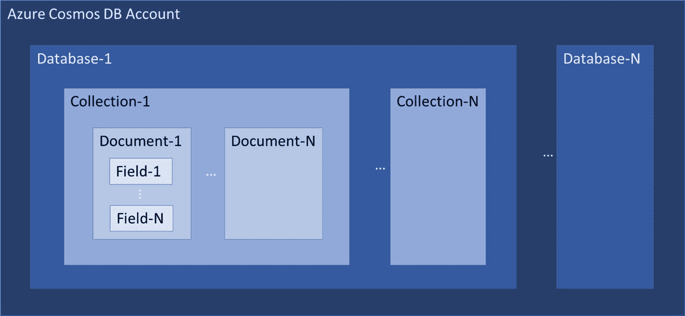

图 2-1

Overview of the Azure Cosmos DB data model

## 设置 Azure Cosmos DB

要提供 Azure Cosmos DB 帐户，请导航到 [`https://portal.azure.com`](https://portal.azure.com) ，然后单击创建资源，如图 [2-2](#Fig2) 所示。

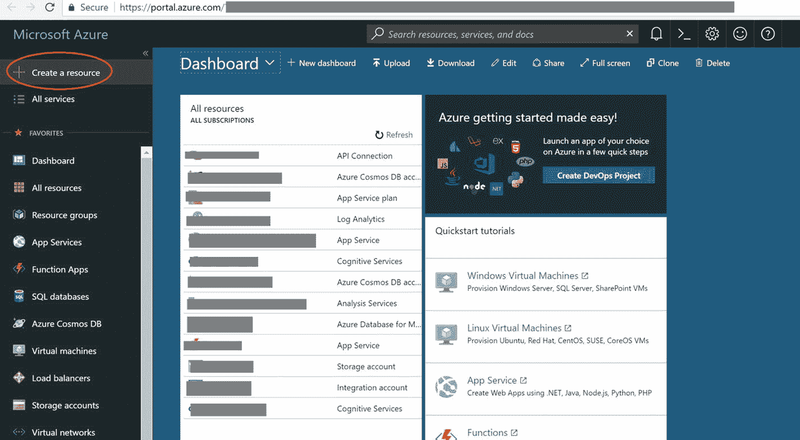

图 2-2

Click the Create a resource link (circled in red)

点击数据库➤宇宙数据库(图 [2-3](#Fig3) )。


图 2-3

Select Azure Cosmos DB from the list of popular services, or search for Cosmos DB

现在，将出现一个包含以下字段的表单:

*   ID:该字段要求您为您的 Cosmos DB 帐户指定唯一的标识符。该 ID 将作为您的 Cosmos DB 帐户的 URI 的前缀，即`<ID>.documents.azure.com`。一些约束条件适用于此输入字段，包括:
    *   允许最少三个字符，最多三十个字符。
    *   不允许使用特殊字符，除了连字符(-)。
    *   只允许小写输入。这种约束有助于确保 URI 的有效性。
*   API:该字段要求您指定要创建的帐户类型。它总共提供了五个 API 选项，如下所示(对于本书，请选择 MongoDB，但是您当然可以使用其他 API):
    *   结构化查询语言
    *   MongoDB
    *   卡桑德拉
    *   表格存储
    *   Gremlin(图形)
*   订阅:此字段要求您指定将在其下创建帐户的 Azure 订阅 ID。
*   资源组:该字段要求您指定现有的或新的资源组名称。资源组帮助您对 Azure 服务实例进行逻辑分组，例如，一个暂存资源组可以包含暂存所需的所有资源，其中可能包括虚拟机、虚拟网络、Azure Cosmos DB 帐户、Azure Redis 缓存等。
*   位置:在此字段中，选择离您的用户最近的 Azure 区域。作为 Ring 0 服务，这使得所有公开可用的 Azure 区域可用。你会发现很多选择。
*   启用地理冗余:如果选中该复选框，将在成对区域内创建一个复本。不用担心；您也可以在以后添加更多的副本区域。您可能想知道什么是成对区域。我来总结一下。每个 Azure 区域与同一地理区域内的另一个区域配对以形成区域对。Azure 确保更新补丁不会同时应用于一对中的所有 Azure 区域。一旦第一个区域升级，第二个区域也将升级。在全局中断的情况下，Azure systems 确保优先处理一对区域中的一个区域，这样至少有一个区域可以正常运行。
*   Pin to dashboard:正如 Windows dashboard 上有快捷方式一样，Azure Portal dashboard 上也有快捷方式，用于快速访问。请选中此框。

现在点击 Create 按钮，提交请求以提供您的 Azure Cosmos DB 帐户(图 [2-4](#Fig4) )。


图 2-4

Input form for provisioning an Azure Cosmos DB account

一旦 Azure Cosmos DB 帐户被提供，只需通过点击仪表板上的服务图标打开概述页面(假设表单上的 Pin to dashboard 选项被选中)。概览页面将具有关于服务端点的各种细节，包括 URI、读取位置、写入位置等。(图 [2-5](#Fig5) )。


图 2-5

Overview of an Azure Cosmos DB account

现在，让我们创建一个数据库和集合来存放文档。这可以通过使用数据浏览器来实现。您将在屏幕左侧的可用选项列表中看到一个名为 Data Explorer 的选项。点击它打开数据浏览器，然后点击新建集合(参见图 [2-6](#Fig6) )。

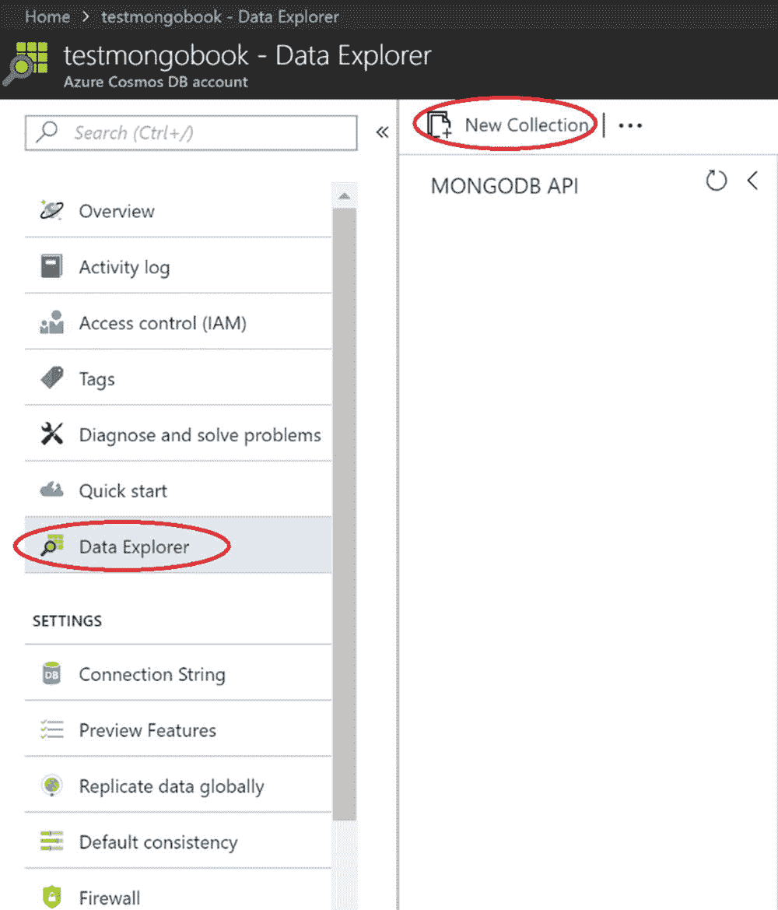

图 2-6

Data Explorer view

将出现一个用于添加集合的表单，包含以下字段:


图 2-7

Form to create a collection and database (with the Unlimited option)

*   数据库 ID:指定数据库的名称或选择一个现有的名称。
*   集合 ID:为集合指定一个唯一的名称(唯一性的范围是数据库)。
*   存储容量:有两种选择:固定和无限。对于固定的存储容量，集合的大小不能超过 10GB。如果您有精简的集合，并希望支付更少的费用，建议您选择此选项。通常，这意味着一个分区(参考 MongoDB shard)，并且最大吞吐量(根据请求单元指定(参见第 [7](7.html) 章了解关于请求单元[ru]的更多信息))在这种情况下也将受到限制(参考下面的字段)。要详细了解分区，请参见第 [5](5.html) 章。第二个存储容量选项是无限的，因此存储可以根据需要扩展，并具有更大范围的请求单元。这是因为，在后台创建了多个分区，以满足您的扩展需求。
*   碎片键:如果选择了无限存储选项，该字段将变得可见(见图 [2-7](#Fig7) )。对于无限制的存储，Azure Cosmos DB 执行水平扩展，这意味着它将在后台拥有多个分区(MongoDB 中的碎片)。这里，Azure Cosmos DB 期望一个分区键，它应该在所有记录中，并且不应该将`\ & *`作为键的一部分。碎片键应该是字段名，例如城市或客户地址(对于嵌套文档)等。
*   吞吐量:该字段用于指定 ru 的初始分配，ru 是计算+内存+ IOPS 的组合。如果您选择了固定存储选项，范围是从 400 到 10，000 个 RUs，不能扩展。使用无限存储选项，范围从 1000 RUs 到 100，000 RUs，可以通过拨打 Azure 支持电话进一步扩展。
*   惟一键:这个特性相当于 MongoDB 的惟一索引，在惟一索引中，您可以使用一个分片键将一个或多个字段定义为惟一的。例如，如果要求雇员的姓名是唯一的，请指定 employeeName。如果需要唯一的员工姓名和电子邮件地址，请指定员工姓名、电子邮件等。(有关步进的详细信息，请参见第 [4](4.html) 章)。请注意，它可以像 MongoDB 一样在创建集合后创建。

现在是查看文档的时候了。单击数据库名称旁边的箭头展开➤单击集合名称旁边的箭头展开➤单击文档，查看文档列表。由于目前还没有文档(见图 [2-8](#Fig8) )，我们通过点击新建文档创建一个文档，提交清单 [2-1](#Par34) 中给出的样本 JSON，(可以随意修改)。

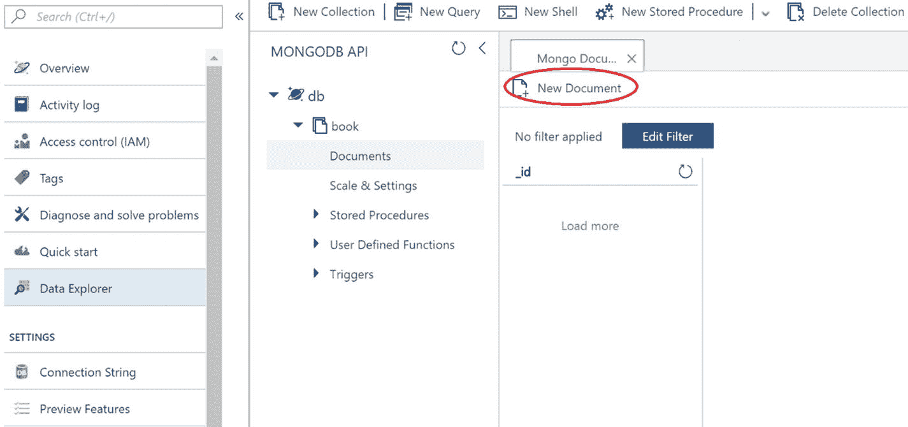

图 2-8

Data Explorer, shown with Document View and New Document button (circled in red)

```js
{
        "_id" : "test",
        "chapters" : {
                "tags" : [
                        "mongodb",
                        "CosmosDB"
                ]
        }
}

Listing 2-1Sample JSON Document

```

现在，单击 Save 按钮，这会将请求发送到 Azure Cosmos DB 以创建文档。一旦创建了文档，就可以在数据浏览器中对其进行管理(参见图 [2-9](#Fig9) ，该图提供了特定文档的视图)。

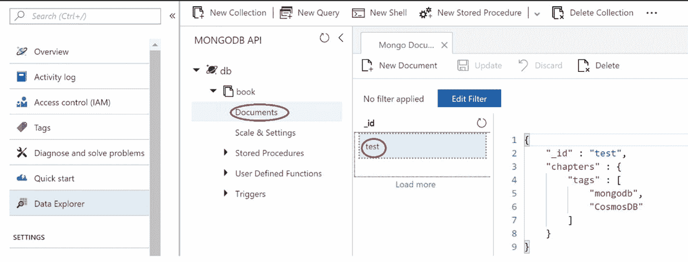

图 2-9

Data Explorer with Document View (the Documents option and a “test” document are circled in red)

可以使用一个选项来构建 MongoDB shell。通过单击 New Shell 按钮，它将出现在一个窗口中，从该窗口中您可以执行大多数 MongoDB 查询(参见图 [2-10](#Fig10) )。


图 2-10

Data Explorer with Shell View

也可以使用自己喜欢的 MongoDB 控制台。在屏幕左侧的选项列表中导航到 Quick start，然后单击 MongoDB Shell，这将显示自动生成的 connect 命令。点击字符串旁边的复制按钮复制该命令(参见图 [2-11](#Fig11) ，然后打开 Linux/Windows 命令提示符并执行该命令。(对于 Linux，在命令提示符下将`mongo.exe`改为`mongo`；见图 [2-12](#Fig12) 。)

现在，我们可以尝试运行相同的命令，并比较结果(应该是相同的)，参见图 [2-13](#Fig13) 和 [2-14](#Fig14) 。

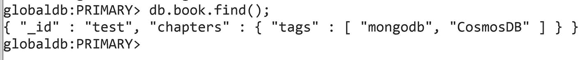

图 2-14

Running a command against Azure Cosmos DB in MongoDB shell

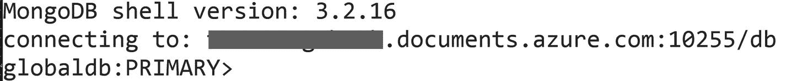

图 2-13

Connection to Azure Cosmos DB from MongoDB console

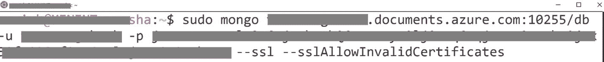

图 2-12

Command pasted onto Linux console

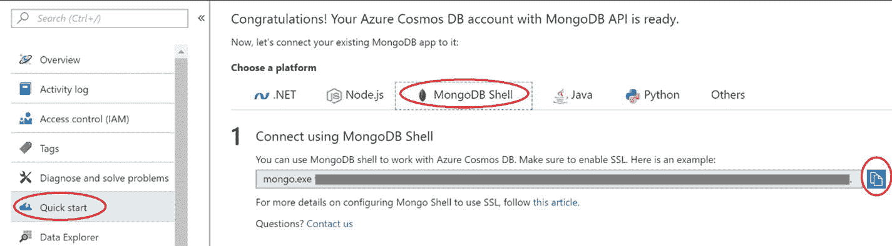

图 2-11

Quick start for the MongoDB Shell’s auto-generated connect command Note

在写这本书的时候，shell 特性还在开发中。因此，尝试使用 MongoDB shell 来执行您的查询。

现在，让我们看看 Azure Cosmos DB 的关键特性。

## 交钥匙全球分销

地理复制是任何多租户应用程序的一个重要方面。考虑到业界对扩展云足迹的关注，现在在离用户地理位置更近的地方部署应用程序是可行的，但这并不是一件容易的事情。在实施之前，必须考虑各方面的问题。即使在 NoSQL 世界，这也可能是一场噩梦。

假设一个应用程序部署在澳大利亚，用户从美国访问它。用户将在每个请求中遇到巨大的延迟—每个请求大约 300 毫秒到 400 毫秒。您可能想知道延迟，简单的回答是，延迟是光速的函数，它必须通过多跳路由，包括路由器/交换机，然后，在我们的情况下，必须通过海底电缆传输很长的距离，以满足一个请求。在我们的示例中，从澳大利亚东部到美国西海岸的单程大约为 150 毫秒，当您访问数据时，您会有两次大约 150 毫秒延迟内的请求和响应，这导致了大约 300 毫秒的延迟。这意味着，如果应用程序页面在加载时必须向服务器发送 5 个请求，那么 5 个请求(大约 400 毫秒/请求× 5 个请求/页面)将被计算为 2000 毫秒= 2 秒的延迟，这显然太多了。

现在，在澳大利亚和美国部署应用程序的单个实例怎么样？用户在访问应用程序时将获得最小的延迟，但是在远程区域部署数据库将导致巨大的延迟。对于每个应用程序请求，可能必须执行多次数据库往返，并且每次往返都将累积延迟，这意味着来自应用程序的响应将是所有数据库往返的累积。为了减少这种延迟，数据库还必须部署在靠近应用程序的区域，在这种情况下，需要两个实例:一个用于澳大利亚，另一个用于美国。(参见图 [2-15](#Fig15) 和 [2-16](#Fig16) 。)


图 2-16

Multi-geo deployment of application and database


图 2-15

Multi-geo deployment of only application (with a single roundtrip to the database)

现在噩梦开始了。在每个区域中，我们必须有两个数据库的副本实例(假设两端都具有高可用性)，这意味着每个区域至少有两个副本。同步多个副本将是一项艰巨的工作，需要大量的管理和监控工作。

Azure Cosmos DB 已经预先解决了这种情况(嵌入到其设计中)，其中通过单个实例，您可以实现高可用性，并且只需单击一下就可以创建地理副本。(参见图 [2-17](#Fig17) 。)所有复制方面的担忧都会被 Azure Cosmos DB 搞定。


图 2-17

Geo-replication with Azure Cosmos DB

但是，对于地理复制，必须考虑多个方面。


图 2-18

Impact of adding new region

1.  Azure 发展迅速，并尽可能快地扩大其覆盖范围。Azure Cosmos DB 作为最优先的服务之一，被指定为 Ring 0 服务，这意味着一旦新添加的 Azure 区域准备好业务，Azure Cosmos DB 应该可以在该区域使用。这有助于确保任何地理复制场景的最大地理分布。
2.  在 Azure Cosmos DB 中，添加的区域数量没有限制。它将只受到 Azure 在给定时间点的区域数量的限制。
3.  用户可以在运行时以编程方式添加或移除地理复制区域。Azure Cosmos DB 确保无论何时选择一个新区域，数据都将被复制(在 60 分钟内，如服务级别协议[SLA]中所定义的)参见图 [2-18](#Fig18) 。
    *   当您添加至少一个副本时，您将自动从常规的 99.99%可用性 SLA 获得 99.999%可用性 SLA。此外，您还可以进行故障转移。Azure Cosmos DB 具有手动和自动故障转移功能。在自动故障切换的情况下，您可以设置故障切换区域的优先级。在手动故障转移的情况下，Azure Cosmos DB 保证零数据丢失。 
4.  即使在地理分布的情况下，Azure Cosmos DB 也有关于自动或手动故障转移时数据丢失的保证，这包含在 SLA 中。

### 潜伏

任何数据库最重要的方面是延迟。Azure Cosmos DB 确保了尽可能低的延迟，这种延迟受到光速和网络可靠性的制约。更强的一致性级别具有更高的延迟和 99.99%的可用性。宽松的一致性将为多区域实例提供更低的延迟和 99.999%的可用性。与其他数据库不同，Azure Cosmos DB 不会要求你选择延迟而不是可用性。它符合这两个标准，并根据所提供的吞吐量进行交付。

### 一致性

这是数据库的一个非常重要的方面，会影响数据库的质量。比方说，如果一个人已经选择了某种程度的一致性并启用了地理复制，那么可能会有人担心 Azure Cosmos DB 将如何保证这一点。为了解决这个问题，让我们仔细看看实现。CAP 定理证明，系统不可能在出现故障的情况下保持一致性和可用性。因此，系统可以是 CP(一致性和分区容错)或 AP(可用性和分区容错)。Azure Cosmos DB 坚持一致性，这使得它成为 CP。

### 生产能力

Azure Cosmos DB 可以无限扩展，并确保可预测的吞吐量。要扩展它，需要一个分区键，将数据隔离到一个逻辑/物理分区，这完全由 Azure Cosmos DB 管理。基于一致性级别分区集，它将使用不同的拓扑(例如，开始、菊花链、树等)进行动态配置。).在地理复制的情况下，分区键起着主要作用，因为每个分区集将分布在多个区域。

### 有效

Azure Cosmos DB 为单个区域提供 99.99%的可用性(一年可能不可用 52 分钟 35.7 秒)，为多个区域提供 99.999%的可用性(一年可能不可用 5 分钟 15.6 秒)。它通过考虑每个操作的延迟上限来确保可用性，当您添加新副本或拥有许多副本时，延迟上限不会改变。无论是应用手动故障转移还是调用自动故障转移，都无关紧要。术语多宿主 API(应用程序编程接口)描述了对应用程序透明的故障转移，在故障转移发生后，不需要重新部署或配置应用程序。

### 可靠性

Azure Cosmos DB 确保每个分区都被复制，并且副本分布在至少 10 到 20 个容错域中。在回复到成功响应之前，每次写入都将由多数复制副本同步且持久地提交。那么异步复制将跨多个区域发生。这确保了在手动故障切换的情况下没有数据丢失，而在自动故障切换的情况下，有限陈旧性的上限将是数据丢失的最大窗口，这也包括在 SLA 中。您可以从门户网站监控 SLA 中涵盖的每个指标，请参考图 [2-19](#Fig19) 。


图 2-19

Viewing key monitoring metrics for Azure Cosmos DB

## 协议支持和多模式 API

Azure Cosmos DB 提供多模态 API，帮助开发人员从各种 NoSQL 数据库迁移到 Azure Cosmos DB，而无需更改他们的应用程序代码。目前，Cosmos DB 支持 SQL API、MongoDB、Cassandra、Gremlin 和 Azure 表存储 API。

除了 API 支持，Azure Cosmos DB 还提供多模型实现。这意味着您可以用各种结构存储数据，即文档、键值、柱形图和图表。

### 表存储 API

Azure 表存储基于最简单的数据模型，即键-值对。表将数据存储为实体的集合。实体就像一行，每个实体都有一个主键和一组属性。属性是名称和类型值对，如列。首先，单击创建资源➤数据库➤宇宙数据库，然后填写表单并点击创建。对于表存储，您必须创建一个数据库和表，这将产生多个基于键值对的实体。(样表存放结构见图 [2-20](#Fig20) 。)

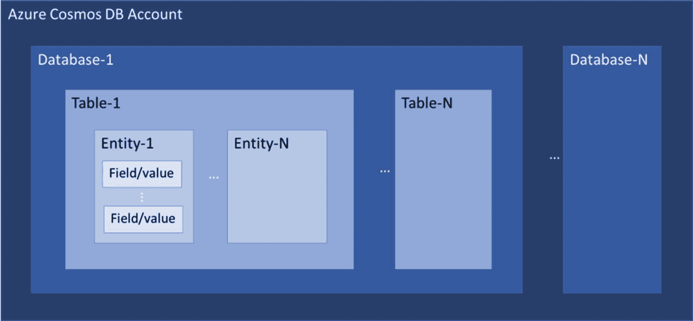

图 2-20

Table storage structure

要添加一个实体，点击 tablesdb 前面的箭头，点击所需表格➤前面的箭头，点击实体，然后点击添加实体(见图 [2-21](#Fig21) )。


图 2-21

Data Explorer for table storage (selected operations are circled)

有两个强制属性将始终是实体的一部分:`RowKey` & `PartitionKey`(见图 [2-22](#Fig22) )。`PartitionKey`要求将数据平衡到多个分区中。`RowKey`有助于唯一地标识行，如果在查询中作为标准的一部分使用，这将非常有效。`TimeStamp`，不可编辑，总是最后修改服务器的日期时间。

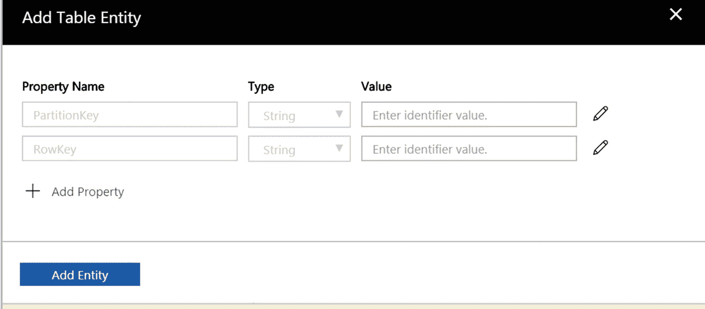

图 2-22

Adding an entity in table storage

也可以使用。NET、JAVA、NodeJs、Python、F#、C++、Ruby 或 REST API 与 TableStorage API 交互。

### SQL (DocumentDB) API

Azure Cosmos DB 从基于文档的数据模型开始，使用文档 SQL 进行查询交互。文档模型将定义存储的数据以 JSON 文档的形式交付(根据请求)。(图 [2-23](#Fig23) 展示了一个面向文档的结构示例。)这有助于缩短学习曲线，如果你对 SQL 有所了解的话。


图 2-23

Document-oriented structure

查询的结构应该是

```js
SELECT <select_list/comma separated list of fields>
[FROM <from_specification>]
[WHERE <filter_condition>]
[ORDER BY <sort_specification]

```

#### FROM 子句

此子句的目的是指定来源，它可以是整个集合或一个集合的子集。一些典型的例子是“从书中选择名称”、“从书中选择名称、isbn”等。可以在`FROM`子句中使用“AS”作为别名，这是一个可选的关键字。您也可以选择没有别名的别名，例如，“从 book 中选择 b.name 作为 b”，“从 book b 中选择 b.name”。一旦使用了别名，则所有投影/引用列都应该通过别名引用来指定它，以避免不明确的引用。因此，示例“从书 b 中选择姓名”是不正确的。相反，应该是“从图书 b 中选择 b.name”

如果您不想在`FROM`子句中指定集合的名称，您可以使用一个名为`ROOT`的特殊标识符来引用集合，例如，“从根 b 中选择 b.name”

#### WHERE 子句

使用这个子句，可以在源上指定过滤标准，该标准将根据来自源的 JSON 文档进行评估。它必须被评估为 true，才能成为结果集的一部分。通常，索引层使用它来捕获匹配的结果集，以获得最佳性能。例如，“从 ISBN='XXX-XX-XXX-XXX-X '的图书中选择名称”，使用别名“从 ISBN = ' XXX-XX-XXX-X '的图书中选择 b.name”

#### 选择子句

这是一个强制子句，定义了从源中筛选出的 JSON 值的投影，例如，“从图书中选择 isbn”、“从图书 b 中选择 b.isbn”，或者您可以选择嵌套值:“从图书 b 中选择 b.chapter.title”。您还可以将投影自定义为“从图书 b 中选择{"BookIdentifier" : b.isbn}，”或者，对于多个值，“从图书 b 中选择{"BookIdentifier" : b.isbn，" BookTitle" : b.Title}。”

#### ORDER BY 子句

这是一个可选子句，在您想要对结果进行排序时使用。您可以指定 ASC/DESC 关键字，默认情况下使用 ASC(升序)。例如，“从图书 b 中选择 b.isbn，b . Title order by b . Title”或“从图书 b 中选择 b.isbn，b . Title order by b . Title ASC”将得到相同的结果，而“从图书 b 中选择 b.isbn，b . Title order by b . Title desc”将按降序对结果进行排序。

#### 查询示例

让我们考虑一个例子来详细理解前面的内容。假设我们有一个图书库存，并希望将图书信息存储在 Cosmos DB–document DB 中。

示例记录可能如下所示:

```js
{
    "id": "test",
    "isbn": "0312577XXX",
    "title": "Cosmos DB",
    "price": "200.22",
    "author": "David C",
    "chapters": {
        "chapterno": "1",
        "chaptertitle": "Overview",
        "tags": [
            "CosmosDB",
            "Azure Cosmos DB",
            "DocumentDB"
        ]
    }
}

```

使用`id`获取文档的查询如下:

```js
SELECT * FROM ROOT c where c.id="test"

```

答案会是

```js
[
    {
        "id": "test",
        "isbn": "0312577XXX",
        "title": "Cosmos DB",
        "price": "200.22",
        "author": "David C",
        "chapters": {
            "chapterno": "1",
            "chaptertitle": "Overview",
            "tags": [
                "CosmosDB",
                "Azure Cosmos DB",
                "DocumentDB"
            ]
        },
        "_rid": "aXQ1ANuRMAABAAAAAAAAAA==",
        "_self": "dbs/aXQ1AA==/colls/aXQ1ANuRMAA=/docs/aXQ1ANuRMAABAAAAAAAAAA==/",
        "_etag": "\"0100191a-0000-0000-0000-5a7d3fbf0000\"",
        "_attachments": "attachments/",
        "_ts": 1518157759
    }
]

```

### 蒙戈布蜜蜂

Azure Cosmos DB 通过协议支持来支持 MongoDB，这简化了从 MongoDB 到 Azure Cosmos DB 的迁移，因为不需要代码更改迁移。让我们看一下我们已经考虑过的演示 DocumentDB 的例子。

让我们打开 MongoDB shell，连接 Azure Cosmos DB。执行以下命令:

```js
mongo <instancename>.documents.azure.com:10255/<databasename> -u <instancename> -p <accesskey> --ssl
use <collectionname>

```

请注意，`use`命令的默认行为是创建一个集合(如果不存在的话),但是它最终会创建一个固定的集合。因此，建议您使用现有的集合。

以下是一个示例记录:

```js
{
    "id": "test",
    "isbn": "0312577XXX",
    "title": "Cosmos DB",
    "price": "200.22",
    "author": "David C",
    "chapters": {
        "chapterno": "1",
        "chaptertitle": "Overview",
        "tags": [
            "CosmosDB",
            "Azure Cosmos DB",
            "DocumentDB"
        ]
    }
}

```

查询如下:

```js
db.book.find({});

```

回应:

```js
{
        "_id" : ObjectId("5a7d59b6d59b290864058b16"),
        "id" : "test",
        "isbn" : "0312577XXX",
        "title" : "Cosmos DB",
        "price" : "200.22",
        "author" : "David C",
        "chapters" : {
                "chapterno" : "1",
                "chaptertitle" : "Overview",
                "tags" : [
                        "CosmosDB",
                        "Azure Cosmos DB",
                        "DocumentDB"
                ]
        }
}

```

请注意`_id`是系统生成的字段，不可更改，可用于记录的快速检索。

使用`chapterno`获取数据。

```js
db.book.find({"chapters":{"chapterno":"1"}})

```

答复如下:

```js
{
  "_id": "ObjectId(\"5a7d59b6d59b290864058b16\")",
  "id": "test",
  "isbn": "0312577XXX",
  "title": "Cosmos DB",
  "price": "200.22",
  "author": "David C",
  "chapters": {
    "chapterno": "1",
    "chaptertitle": "Overview",
    "tags": [ "CosmosDB", "Azure Cosmos DB", "DocumentDB" ]
  }
}

```

使用嵌套字段`tag`获取数据。

```js
Query: db.book.find({"chapters.tags": { $in: [ "CosmosDB" ] }},{"chapters.tags":1, "_id": 0})

```

答复如下:

```js
{
  "chapters": {
    "tags": [ "CosmosDB", "Azure Cosmos DB", "DocumentDB" ]
  }
}

```

使用嵌套字段`tag`汇总数据。

```js
db.book.aggregate({$project: { count: {$size:"$chapters.tags" }}})

```

答复如下:

```js
{
  "_t": "AggregationPipelineResponse",
  "ok": 1,
  "waitedMS": "NumberLong(0)",
  "result": [
    {
      "_id": "ObjectId(\"5a7d59b6d59b290864058b16\")",
      "count": 3
    }
  ]
}

```

另一个查询如下:

```js
db.book.find({},{"price":1,"_id":0}).limit(1).sort({price: -1});

```

答复如下:

```js
{
  "price" : "200.22"
}

```

### 图形应用编程接口

Azure Cosmos DB 的 Graph API 是基于 Apache TinkerPop 规范开发的，任何使用 Gremlin 的人都可以快速迁移到 Azure Cosmos DB，无需更改代码。对于那些不熟悉图形数据库结构的人来说，它是由节点和边组成的。节点是称为顶点的实体，边代表顶点之间的关系。两者都可以有任意数量的表示元信息的属性，称为属性图。许多社交网站使用这种类型的数据结构来定义两个实体(顶点)之间的关系。例如，如果人 A 认识人 B，其中人 A 和人 B 是顶点，关系“认识”将是边。人物 A 可以有姓名、年龄、地址作为属性，边可以有`commonInterest`等属性。

Azure Cosmos DB Graph API 使用 GraphSON 格式返回结果。它是标准的 Gremlin 格式，使用 JSON 来表示顶点、边和属性。

要为 Graph API 提供 Azure Cosmos DB 帐户，请单击“创建资源”按钮➤数据库➤ Cosmos DB，然后填写表单并将 Graph 指定为 API。接下来，打开数据浏览器并单击新建图表。指定数据库 ID、图形 ID、存储容量和吞吐量，然后单击“确定”进行创建。(如果选择无限存储容量，则必须指定分区键。)现在，你必须展开数据库，通过点击数据库名称➤旁边的箭头展开图形，通过点击图形名称旁边的箭头，然后点击图形(见图 [2-24](#Fig24) )。现在，您将获得一个成熟的用户界面来执行您的 Gremlin 查询。

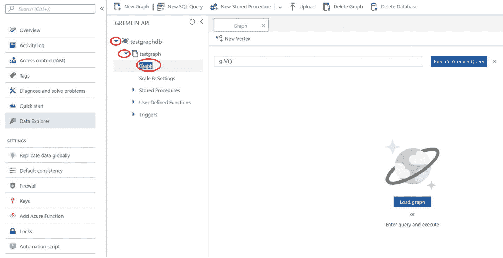

图 2-24

Data Explorer view for Graph (expansion is indicated by items circled in red)

现在，让我们执行一些查询。替换执行 Gremlin 查询文本框中的`g.V()`,并指定以下内容:

```js
g.addV('John').property('id','person-a').property('name','John Shamuel')

```

前面将添加一个名为 John Shamuel 的人。接下来，点击执行 Gremlin 查询(见图 [2-25](#Fig25) )。


图 2-25

Adding a vertex with some new properties

执行相同的操作，添加人员 Chris Shamuel(先生)、Laura Shamuel(夫人)和 Cartel Shamuel(桅杆。).为了搜索这些，您可以简单地包括`g.V()`，这意味着“获取所有记录”，或者您可以执行`g.V(<id>)`，搜索顶点的 ID，或者搜索任何属性，如`g.V().has('label', 'John')`。(参见图 [2-26](#Fig26) 。)

现在，让我们添加顶点之间的边缘(约翰➤克里斯)。

```js
g.V().has('label','John').addE('knows').property('relation','brother').to(g.V('Chris'))

```

这将界定从约翰到克里斯作为兄弟的优势。你也可以定义相反的反向遍历。


图 2-26

Adding edge and its result

要详细了解该查询，请参见图 [2-27](#Fig27) 。

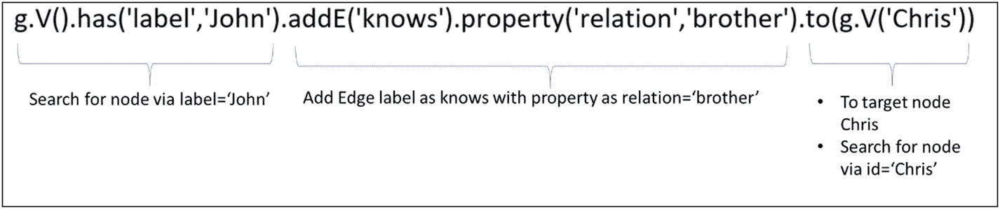

图 2-27

Query breakdown

对整个顶点执行上述查询，并定义族。数据浏览器可以用图形可视化表示数据(见图 [2-28](#Fig28) )。要在 Graph Visual 中查看它，请删除查询并执行查询`g.V()`。


图 2-28

Data visualization in Graph Visual

现在，你可以定义所有顶点之间的边来形成一个家谱，看起来如图 [2-29](#Fig29) 。

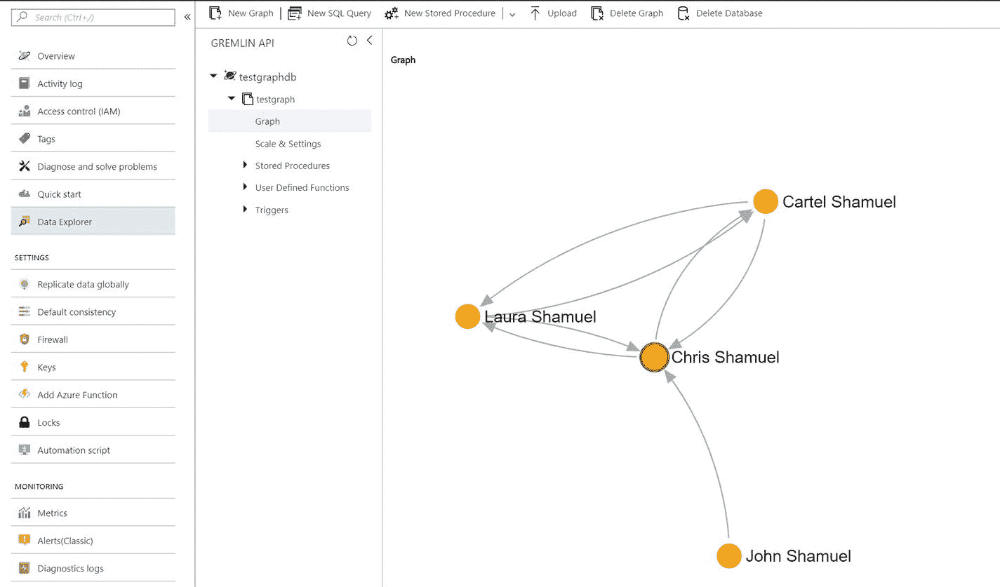

图 2-29

Family tree visualization using Graph Visual in Data Explorer

您也可以使用 Apache TinkerPop Gremlin 控制台。从 [`http://tinkerpop.apache.org/`](http://tinkerpop.apache.org/) 下载就行了。现在导航到`apache-tinkerpop-gremlin-console-3.2.5/conf`并打开`remote-secure.yaml`，然后按照清单 [2-2](#Par119) 替换全部内容，如下所示:

```js
hosts: [<Cosmos DB account name>.gremlin.cosmosdb.azure.com]
port: 443
username: /dbs/<database name>/colls/<collection name>
password: <access key>
connectionPool: {
  enableSsl: true
}
serializer: { className: org.apache.tinkerpop.gremlin.driver.ser.GraphSONMessageSerializerV1d0, config: { serializeResultToString: true }}  

Listing 2-2Configuration for remote-secure.yaml

```

您必须用 Azure Cosmos DB 帐户名替换`<Cosmos DB account name>`。将`<databaseID>`替换为 Azure Cosmos DB 的数据库 ID，将`<GraphID>`替换为 Azure Cosmos DB 的图形 ID，如图 [2-30](#Fig30) 中用红色圈出的内容。

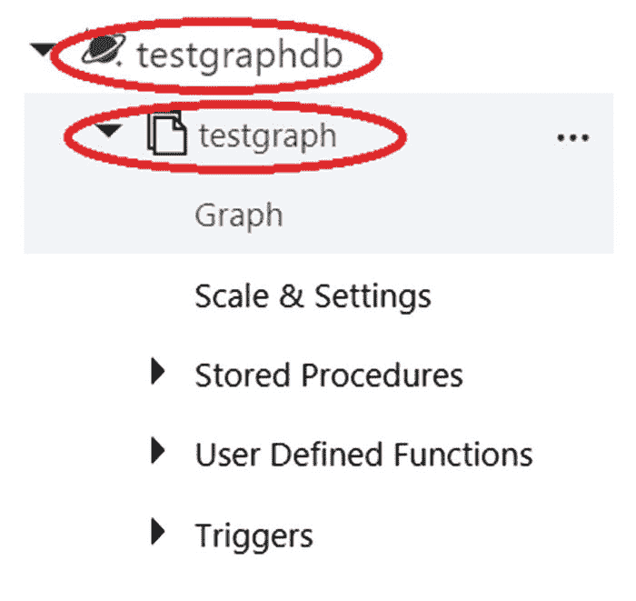

图 2-30

Database ID and graph ID are circled in red

此外，您必须用 Azure Cosmos DB 帐户主键替换`<primaryKey>`，该主键位于屏幕左侧菜单中的密钥选项下(参见图 [2-31](#Fig31) )。


图 2-31

Primary key location circled in red

最后，保存并关闭文件，执行`bin/gremlin.bat`或`bin/gremlin.sh`，然后执行以下命令(输出见图 [2-32](#Fig32) ):


图 2-32

Gremlin console connected to Azure Cosmos DB–GraphDB API account

```js
:remote connect tinkerpop.server conf/remote-secure.yaml

```

在这个阶段，您已经为执行 Gremlin 查询做好了准备，您可以在这里期待相同的输出(图 [2-33](#Fig33) )。

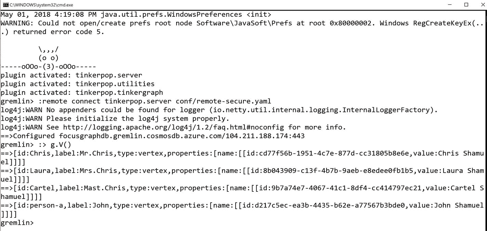

图 2-33

Execution of the Gremlin queries against the Azure Cosmos DB–GraphDB API account

为了给你更多的实践经验，下面是 Gremlin 控制台中的一些示例查询(如果在 Azure Cosmos DB 的数据浏览器中执行，请删除`:>`):

1.  使用姓名搜索特定的人。

    ```js
    Query:
    :> g.V().haslabel('name', 'Chris Shamuel')

    ```

2.  遍历第一层，找出所有与该顶点相关的人。

    ```js
    Query:
    :> g.V().has('name', 'Chris Shamuel').outE('child')

    ```

3.  在关系的基础上遍历多个层次。

    ```js
    Query:
    :> g.V().has('name', 'Chris Shamuel').as('x').both('husband').dedup()

    ```

### 卡珊德拉蜜蜂

这是 Azure Cosmos DB 中的最新介绍，它还支持使用 Cassandra wire 协议的 Cassandra API。这意味着，如果应用程序使用符合 CQL v4(Cassandra Query Language(CQL)第 4 版)的驱动程序，应用程序只需很少或不需要代码更改就可以迁移到 Azure Cosmos DB。

对于那些不熟悉 Cassandra 的人来说，这是另一种类型的 NoSQL，其目标是在没有单点故障转移的情况下使数据库高度可用。它没有主/辅助服务器角色。相反，每台服务器都是等效的，能够在运行时添加或删除节点。在写这本书的时候，这个 API 刚刚发布，还没有公开。

## 弹性标度

Azure Cosmos DB 是无限可扩展的，不会丢失延迟。扩展有两个变量:吞吐量和存储。Cosmos DB 可以使用这两者进行扩展，最好的一点是不需要将它们组合在一起，因此可以独立于其他参数进行扩展。

### 生产能力

增加计算吞吐量很容易。人们可以导航到 Azure 门户并增加请求单元(RUs ),或者使用 CLI 在不停机的情况下做到这一点。如果需要更高的计算吞吐量，用户可以在不停机的情况下扩大或缩小规模，如果需要更低的吞吐量。

以下是可用于扩展吞吐量的 Azure CLI 命令:

```js
az cosmosdb collection update --collection-name $collectionName --name $instanceName --db-name $databaseName --resource-group $resourceGroupName --throughput $newThroughput

```

### 仓库

Azure Cosmos DB 提供了两个选项来配置集合。一个是有限的存储空间(高达 10GB)。另一个是无限存储。在无限存储的情况下，数据的分布取决于所提供的分片密钥。我将在第 3 章中详细讨论分区。

以下是可用于创建无限存储集合的 Azure CLI 命令:

```js
az cosmosdb collection create --collection-name 'mycollection --name 'mycosmosdb' --db-name 'mydb' --resource-group 'samplerg' --throughput 11000 --partition-key-path '/pkey'

```

## 一致性

Azure Cosmos DB 提供了五个级别的一致性:强的、有界的陈旧性、会话、一致的前缀和最终的。

### 强烈的

这种级别的一致性保证了写操作只有在被多数复制副本仲裁持久提交后才可见。请注意，由于强一致性的性质，它比其他一致性级别需要更多的请求单元。要在门户中进行配置，请参见图 [2-34](#Fig34) 。

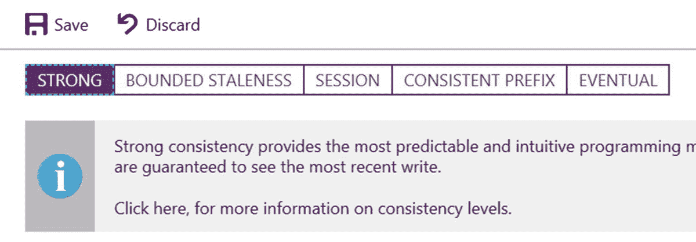

图 2-34

Setting strong consistency as the default consistency in Azure Portal

#### 有限的陈旧

这是比会话、一致前缀和最终一致性更强的一致性。这种级别的一致性保证了读取可能滞后于写入，滞后的时间是项目或时间间隔的配置版本或前缀。因此，您可以用两种方式配置陈旧性:读取滞后于写入的项目版本数，或者时间间隔。

配置了有限陈旧一致性的 Azure Cosmos DB 帐户可以将任意数量的 Azure 区域与其 Azure Cosmos DB 帐户相关联。这种一致性也使用相似的 RUs 作为强一致性，它大于其他宽松的一致性级别。要在门户中进行配置，请参见图 [2-35](#Fig35) 。


图 2-35

Setting bounded staleness as the default consistency in the portal

#### 会议

会话一致性仅限于客户端会话，最适合需要设备/用户会话的应用程序。它保证单调读取、写入和读取您自己的写入，并提供最大的读取吞吐量，同时提供最低延迟的写入和读取。例如，当你在社交媒体上发帖时，你使用最终一致性而不是会话一致性，你可以共享你的帖子，但在新闻订阅页面刷新后，不能保证你可以看到你的帖子，这导致你再次发帖，也许再次发帖，并引入重复的可能性。应用程序的开发人员必须构建一个解决方案来处理这一问题，这并不容易。当你使用会话一致性时，你会立即看到你自己的帖子，开发者不需要做任何事情。Cosmos DB 会为您处理这些。要在门户中进行配置，请参见图 [2-36](#Fig36) 。

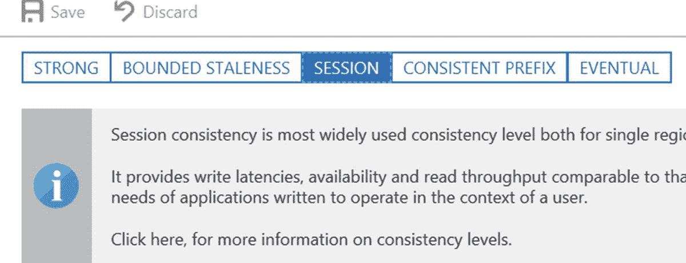

图 2-36

Setting session as the default consistency in the portal

#### 一致前缀

这提供了组级别的一致性。让我们假设在某个时间段正在执行多个写入，然后，它不是立即复制并聚合它们，而是等待，直到有更多的写入，然后一次性聚合数据。这保证了读操作不会看到乱序的写操作。例如，一个人正在写 A、B 和 C，因此客户将得到 A；甲、乙；或者 A，B，C；等等。但绝不是 C，A；甲、丙、乙；或者 B，A；等等。

配置了一致前缀一致性的 Azure Cosmos DB 帐户可以将任意数量的 Azure 区域与其 Azure Cosmos DB 实例相关联。与更强的一致性级别相比，这会消耗更少的 ru。要在门户中进行配置，请参见图 [2-37](#Fig37) 。


图 2-37

Setting consistent prefix as the default consistency in the portal

#### 可能的

这种最弱的一致性形式有助于实现最低的读写延迟。它确保在没有任何进一步写入的情况下，组内的副本最终会收敛。

配置了最终一致性的 Azure Cosmos DB 帐户可以将任意数量的 Azure 区域与其 Azure Cosmos DB 相关联。要在门户中进行配置，请参见图 [2-38](#Fig38) 。

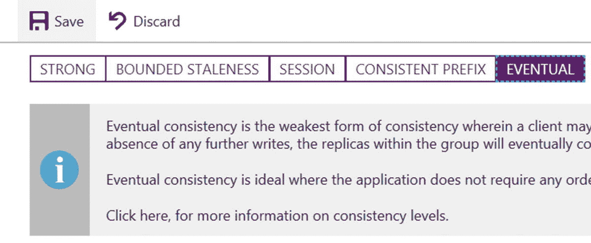

图 2-38

Setting eventual prefix as the default consistency in the portal

在 MongoDB 3.4 之前，只支持强一致性和最终一致性。因此，Azure Cosmos DB 也是如此。MongoDB API 目前支持这两者。MongoDB 3.6 中现在提供了会话一致性。

### 表演

预定义的性能是任何 NoSQL 数据库的最高要求，Azure Cosmos DB 可以确保这一点。在 Azure Cosmos DB 中，操作延迟被认为是性能的主要因素。Azure Cosmos DB 的 SLA 保证在第 99 百分位的相同 Azure 区域中，对文档大小的 1KB 进行 10ms 读取和 15ms 写入。实际上，根据我的经验，在第 99 百分位的 Azure 区域中，1KB 大小的文档不会超过 2-5 毫秒。承诺的延迟级别可以通过 Azure Monitor 指标进行验证。

有一个专门衡量延迟的指标。要访问它，导航到 Metrics(从屏幕左侧的菜单中)并单击 Latency 选项卡(参见图 [2-39](#Fig39) )。指标中显示的数据是针对图数据库执行的查询(在前面的“Graph API”一节中有详细描述)，在 SLA 和实际数据之间存在巨大的差距(尽管可能是正面的)。SLA 中的值要高得多，而实际值要低三倍。我强烈建议您亲自进行测试，并比较结果。


图 2-39

Outcome of 99th percentile latency test

如果这样做，您会注意到 P99 级别的示例，我们会收到承诺级别下的延迟。

## 服务水平协议

Azure Cosmos DB 是一个企业级 NoSQL 数据库。在金融支持的 SLA 中，它涵盖了我到目前为止解释的所有方面。服务水平协议分类如下。

### 可用性 SLA

如果没有配置地理复制，Azure Cosmos DB 提供 99.99%的可用性，如果配置了至少一个额外的 Azure 区域，则提供 99.999%。如果读取区域出现问题，将不会影响其他区域，也不会丢失任何其他区域中的可用数据。但是，如果写入区域出现问题，将有两种故障转移选项:手动故障转移和自动故障转移。在手动故障转移的情况下，数据丢失的保证是 100%，这意味着没有数据丢失。对于自动故障切换，数据丢失是有限陈旧性的上限，这意味着数据写入组并且在灾难发生时不会复制。您可以通过一个称为可用性的指标来监控可用性(参见图 [2-40](#Fig40) )。

为了确保 Azure Cosmos DB 的每个实例的持久性，每个分区将跨至少 10-20 个容错域进行复制。我将在第 [3](3.html) 章中讨论如何确保应用程序中的影响最小或没有影响。

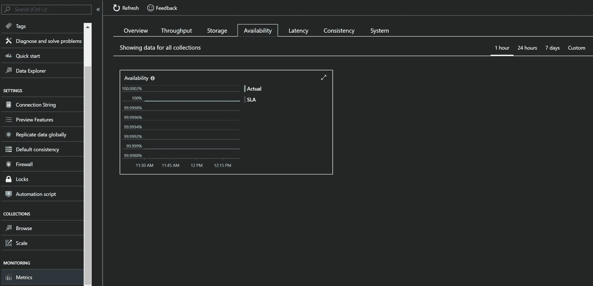

图 2-40

Azure Cosmos DB monitoring metrics for Availability

### 吞吐量 SLA

当计算单元消耗到配置的最大值时，Azure Cosmos DB 生成错误“吞吐量失败的请求”。如果在任何情况下，它在没有达到上限的情况下生成此错误，它将被视为错误率，并根据每小时间隔内发出的请求数进行计算。这种情况不发生的保证是 99.99%。要监控 Azure Portal 中的吞吐量，请导航到度量➤吞吐量选项卡，请参考图 [2-41](#Fig41) 。

我将在第 [7](7.html) 章中讨论规模和计算单元策略，这将有助于确保不发生此类错误，如果发生，如何避免它们。


图 2-41

Azure Cosmos DB monitoring metrics to monitor the throughput

### 一致性 SLA

这是 SLA 中最容易理解的一类。假设您选择了强一致性，并且收到了幻影行(未提交的行)，这将违反此类别。Azure Cosmos DB 通过一致性违反率来考虑这种情况，根据一致性违反率，成功的请求不符合配置的一致性，这将除以发出的请求总数。此类案件不发生的保证率为 99.99%。要在 Azure Portal 中监控它，请导航到度量➤一致性，请参考图 [2-42](#Fig42) 。

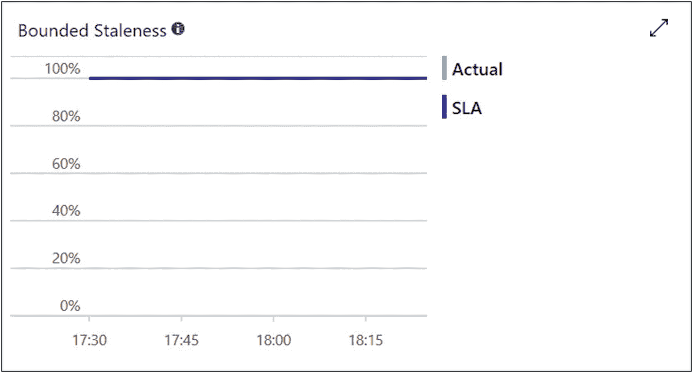

图 2-42

Azure Cosmos DB monitoring metrics to monitor the consistency on the portal

### 延迟 SLA

这就是延迟如何应用于应用程序，使用 Azure Cosmos DB SDK 和 TCP 连接。如果 Azure Cosmos DB 不满足指定的延迟，它会认为这样的响应实例包含在“过度延迟时间”中 SLA 承诺 99.99%的额外延迟小时-免费响应。获得读取的保证是<10ms and <15ms for writes. To monitor Latency metrics on Azure Portal, navigate to Metrics ➤ Latency, refer Figure [2-43](#Fig43) 。

我将在第 [7](7.html) 章讨论性能最佳实践。


图 2-43

Azure Cosmos DB monitoring metrics to monitor the latency on the portal

## 结论

Azure Cosmos DB 是全球分布式多模型数据库。它可以在 Azure 的任意地理区域内(独立地)弹性扩展吞吐量和存储。它还以最低的总拥有成本(TCO)通过全面的 SLA 提供吞吐量、延迟、可用性和一致性保证。我将在随后的章节中详细介绍每个功能。