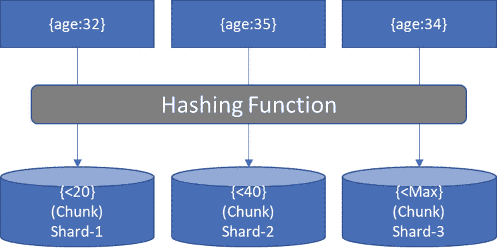
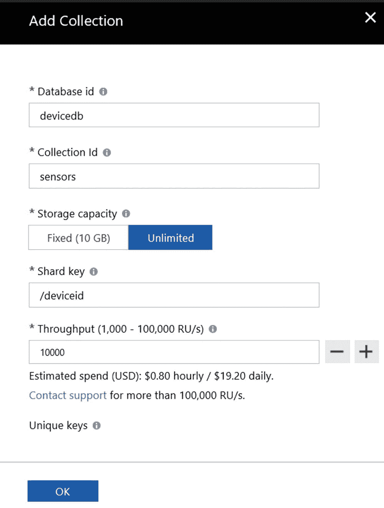
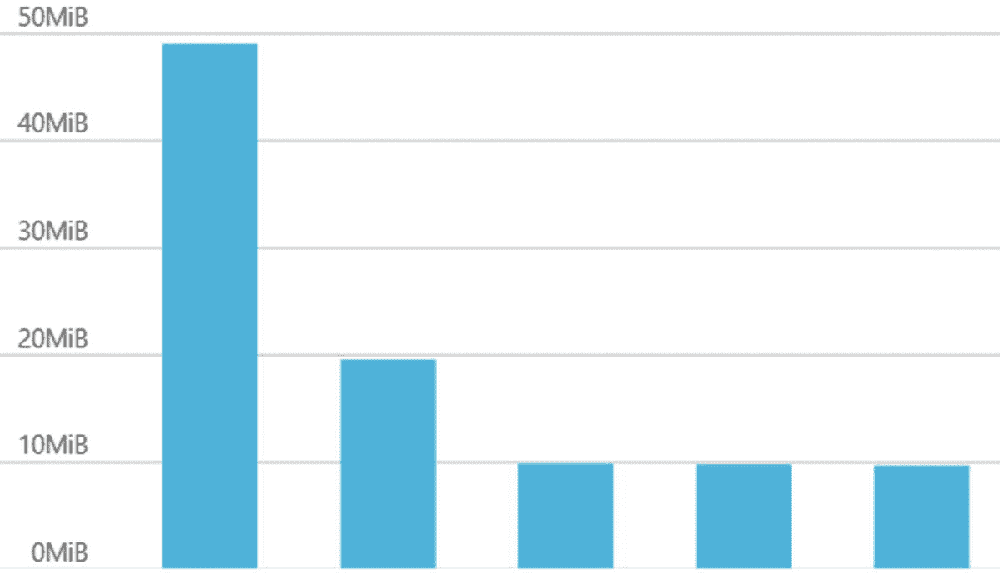
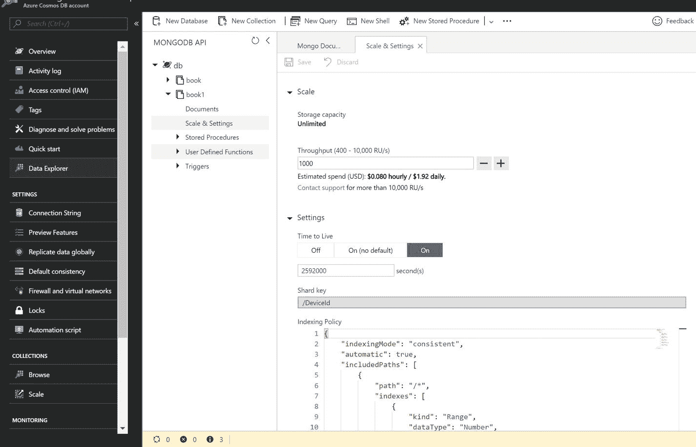
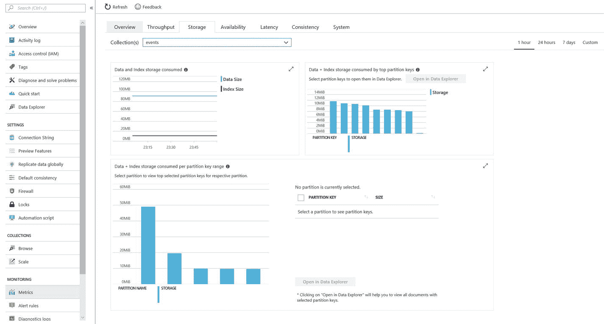
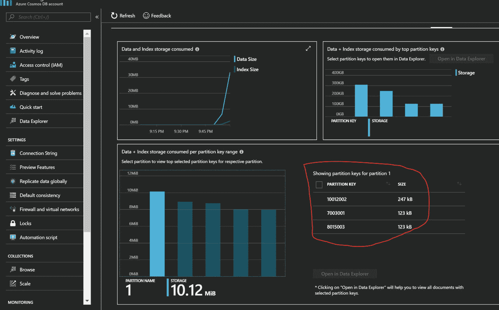

# 5.分割

规模、规模、规模……在数据库架构师的大部分职业生涯中，每当开发新的应用程序时，这些词语都会回响。最困难的挑战是以弹性模式设计数据库。在关系数据库管理系统(RDBMSs)的世界中，这有时会是一场噩梦，在 NoSQL 的领域中也是一项艰巨的任务。在这一章，你将学习如何使用分区，Azure Cosmos DB 扩展数据库。

## 碎片

在 MongoDB 中，缩放是通过一个称为分片的过程来处理的。这是一个手动配置过程，通过添加更多的计算和存储来帮助扩展 MongoDB 实例。MongoDB 在集合级别执行数据分片；因此，每个集合被分散到多个碎片，参见图 [5-1](#Fig1) 。


图 5-1

Sharding in MongoDB

存在三类组件来构成分片集群。

*   Mongos:它们的行为类似于查询路由器(用于读取和写入),帮助将查询路由到 MongoDB Shard 实例。Mongos 将试图通过保存碎片的元数据来抽象碎片，因为它们知道所需数据的位置。
*   配置服务器:这些服务器存储每个分片的配置设置和元数据。它们必须部署为`ReplicaSet`。
*   碎片:这些是保存数据子集的实际数据节点。

MongoDB 将数据分片，然后使用分片集群负载平衡器在物理分片中进行负载平衡。

使用`shardKey`选项进行数据分割，选择`shardKey`对于在运行时提供最佳查询性能非常重要。`shardKey`有三种类型:

*   Range key: A range-based shard key is the default sharding methodology if neither zones nor hashing is specified. In such a case, data will be divided into sets of key ranges. This works best when there is large cardinality, low frequency, and changes occur non-monotonically. Let us consider an example in which we have a field named age, have 10, 35, and 60 as values, and are using a range key methodology. A value will be stored in the shard having that range (see Figure [5-2](#Fig2)).

    

    图 5-2

    Sharding based on a range key methodology
*   Hashed key: According to this method, the shard key is hashed using a `hash` function and distributed to a data node in the form of ranges. This type of distribution is even and best suited for changing keys monotonically. Make sure to use a field that has a maximum number of unique values. This will result in better distribution. Also, do not use a floating-point data type for hashing. This will create issues with decimal points. E.g., in terms of the hashing function, 5.1 and 5.6 are the same; therefore, it won’t be possible to distinguish them uniquely. Let’s consider an example in which age is the key field, with the values 32, 35, and 34\. These values will be hashed and stored in the chunk according to the hashed value (see Figure [5-3](#Fig3)).

    

    图 5-3

    Sharding based on hashed key methodology
*   Zones: This is a subgrouping of shards that can be based on geography, specific hardware cluster, or data isolation, owing to data residency issues. Let’s say we have Shard-1, Shard-2, and Shard-3\. We can store Shard-1 and Shard-2 in Zone-A, whose physical location is in Germany, whereas Shard-3 can be stored in France, for issues related to data residency. This could be due to variations in the hardware cluster, for which you would like better hardware for premium customers, etc. Please note that the chunks will be load-balanced within their zone, and shards can be overlapped in multiple zones.

    

    图 5-4

    Sharding based on zone

选择一个最佳的分片密钥非常重要，它将是整个集群实现的读写性能的基础。一旦选择了一个键，就不可能修改它，除非重新创建集合。请注意:为了从分片环境中获得最佳性能，请在查询的过滤标准中使用 shard 键，这将有助于到达特定的分区。否则，它将被迫执行成本高昂且会导致大量延迟的广播操作。

分片的优势包括扩展存储和增加计算以获得更多吞吐量的可能性。为了实现高可用性(HA)，您必须为整个分片集群创建一个`ReplicaSet`。

## Azure Cosmos DB 中的分区

首先，注意术语的变化。分片在这里被称为分区。(在用户界面[UI]中，术语被改为 shard，专门用于 Mongo API)。在 Azure Cosmos DB 中，分区要简单得多。所有的分区管理都是由 Azure Cosmos DB 引擎处理的，像 MongoDB 一样，人们只需要关心分区键。错误的分区键会增加成本并降低性能，这可能会导致糟糕的整体用户体验。

像 MongoDB 一样，分区是可选的，如果创建了固定集合，它不需要分区键，参见图 [5-5](#Fig5) 。它不会跨越一个物理分区，因为它不会将数据分散到多个单元中。它提供有限的吞吐量(10k RU)和存储(10GB)，不会超过指定的限制。你可能想知道 RU 是什么？计算、内存和每秒输入/输出操作(IOPS)的结合有助于为最终用户创造可预测的性能体验。与此相关的更多细节在第 [7](7.html) 章提供。


图 5-5

Provisioning of a fixed collection

对于无限制的集合，分区实例的数量没有硬性限制。但是，一个分区的限制(10k RUs(请求单元)和 10GB 存储)也适用于此，参见图 [5-6](#Fig6) 。因此，请确保尝试在分区键范围内分配负载，并避免热路径。一旦你创建了一个无限的集合，默认情况下，Azure Cosmos DB 将创建物理分区，并根据指定的 ru 将 ru 平均分配给每个分区。例如，如果为无限集合指定 50k RUs，则将创建五个分区，并且每个分区将具有 10k RUs。如果物理分区发生变化，Azure Cosmos DB 将保持逻辑分区到物理分区的平衡以及 ru 的分布。

Note

在 Azure 中，默认情况下，通过软限制(配额)来保护支出，这可以通过提高 Azure 支持票来撤销。


图 5-6

Screenshot of the provisioning of an unlimited collection

一旦选择了无限存储容量选项，表单将自动要求您输入一个分片密钥，该密钥可以是主文档字段或子文档字段中的任何密钥，参见图 [5-7](#Fig7) 。除了`_id`字段之外，每个文档中必须有指定的键。像 chunks 一样，Azure Cosmos DB 也将有基于指定分区键的逻辑分区，并且它将基于它们对物理分区的适用性来平衡这些分区。物理分区的存储大小限制为 10GB，计算容量限制为 10k RUs，因此请确保您的任何分区键都不会预期超过 10GB 的数据或超过 10k RUs 的处理要求。如果他们这样做了，你的请求将相应地受到限制。为了详细理解这一点，让我们以清单 [5-1](#Par19) 中的以下数据为例:

```js
{
    "_id" : ObjectId("5aae21802a90b85160a6c1f1"),
    "SiteId" : 0,
    "DeviceId" : 0,
    "SensorId" : 0,
    "Temperature" : "20.9",
    "TestStatus" : "Pass",
    "TimeStamp" : {
            "$date" : 1520929246056
    }
}

Listing 5-1JSON Structure of Sensor Data

```

假设每个设备都有传感器，传感器可以以每秒一条消息的频率发射前面结构中定义的消息，这意味着 60 秒× 60 分钟× 24 小时=每天 86，400 条消息。如果我们的消息大小为每条消息 300B，那么我们最终得到的数据大小等于每个传感器/天 24.72MB。一个拥有 10 个传感器的设备将拥有高达 247 MB/天的容量。因此，一个物理分区可以存储 41 个设备生成的消息(< 10GB)，一旦第 42 个设备开始生成消息，并试图获取大于 10GB 的额外空间，Azure Cosmos DB 分区引擎将被触发，以将该逻辑分区移动到另一个物理分区。现在，添加另一个分区将触发重新平衡 RUs 的尝试。



图 5-7

`DeviceID` is defined as a partition key

你认为这是一个正确的策略吗？如果答案是否定的，我们同意，可以随意跳过下面几行。如果你仍然想知道为什么答案是否定的，让我们仔细看看。我们讨论的是传感器生成的数据，这些数据是使用设备分发的，这意味着如果我们必须将每个设备的数据(给定前面的场景)存储 42 天以上(累积超过 10GB)，那么我们就遇到了瓶颈，因为一个设备 42 天的数据将累积到 10GB，这是物理分区限制，并且数据库引擎无法进一步分割数据，请参见图 [5-8](#Fig8) 。



图 5-8

`DeviceID` is a bad partition key choice

那么，哪个是正确的分区键呢？让我们再试一次。D `eviceID`和`Day`作为分区键怎么样(见图 [5-9](#Fig9) )。在这种情况下，数据将有更多的逻辑变化，Azure Cosmos DB 将能够将它们分布到多个物理分区。


图 5-9

`DeviceID` and `Day` as partition key

在这种情况下，如果通过同时应用`DeviceID`和`Day`作为标准来执行查询，性能将是最佳的；否则，它将扇出到所有分区(MongoDB 中的`Broadcast`)。然而，在写这本书的时候，Azure Cosmos DB 不支持复合分区键。因此，必须创建一个新字段并将两个必填字段的数据合并，以便将两个字段用作一个分区键。相关代码包含在清单 [5-2](#Par24) 中。

```js
{
    "_id" : ObjectId("5ab14e342a90b844e07fc060"),
    "SiteId" : 0,
    "DeviceId" : 998,
    "SensorId" : 0,
    "Temperature" : "20.9",
    "TestStatus" : "Pass",
    "TimeStamp" : 1518977329628
}

Listing 5-2Document with New Field DeviceID and Day

```

让我们在 MongoDB shell 中执行一个简单的`find`语句(见图 [5-10](#Fig10) )。


图 5-10

Query using clubbed field as a partition key

如果数据不需要存储超过 30 天，超过 30 天后就会过期，使用 TTL(生存时间)限制，`DeviceID`最适合作为分区，那些对之前的查询回答“是”的读者现在有了正确的答案，请参考图 [5-11](#Fig11) 。



图 5-11

Setting up TTL

如果指定了分区的地理复制(见图 [5-12](#Fig12) )，物理分区将被并行复制，并且在分区之间是独立的。


图 5-12

Geo-replication of partitions

适用于 MongoDB 分片的大多数限制也适用于 Azure Cosmos DB。例如，一旦指定了分区键，就不可能更改它。为此，您必须重新创建集合。分区发生在集合级，文档需要有一个分区键。

## 最佳化

以下是一些简单且易于采用的优化技巧。

*   Strictly use partition keys in query criteria: The compute cost is also a major factor in selecting a partition key. If you specify a partition key that is rarely used in query criteria, the query will fan out across partitions to serve the result. Therefore, the cost of the query will become higher and cause a great amount of latency as well. Assuming `deviceidday` as the partition key, refer to Figure [5-13](#Fig13) to compare the costs associated with a query, with and without the use of a partition key.

    

    图 5-13

    Query cost: on the left is the query without a partition key (RU consumed = 18.43), and on the right is the query with a partition key (RU consumed = 7.66). The partition key used is `deviceidday`.
*   Variable number of documents across partition key: Spread of a partition key should not be variable to the extent that the metrics of a partition graph indicate storage of logical partition with too much zigzag (see Figure [5-14](#Fig14)). The line-of-distribution graph should be as close to straight as possible. Eventually, storage will be load-balanced upon physical partition, which achieves the ripple effect of un-optimized consumption of RUs. In such cases, RUs allocated to other partitions will be wasted.

    

    图 5-14

    Zigzag pattern in storage of logical partition (un-optimized)
*   避免分区键中的唯一值:例如，如果我们假设一个唯一的分区键值等于 U，并且记录的数量是 N，那么在基于非键值对的结构中，我们不应该有 U = N。在基于键值对的数据结构中，这是存储数据的最佳方式。
*   Keep tabs on storage per partition: Under its Metrics blade (see Figure [5-15](#Fig15)), Azure Cosmos DB has an option to monitor storage as a separate tab, and alerts can be set up at the highest possible threshold so that preventive action can be taken before insufficient storage is generated.

    

    图 5-15

    Storage metric
*   存储相关时间段的文档:如果某个文档在某个时间间隔后不需要被查询，最好通过指定 TTL 限制来使其过期。这可以在集合级别指定，并且在文档过期时不会消耗 RUs。文档的计量表到期时间戳将被硬删除，且无法回滚。因此，如果需要时间戳来归档数据，请将其存储在更便宜的持久存储中，如 Azure Blob 存储。以下代码在文档的集合级别指定 TTL，请参考清单 [5-3a](#Par35) 和 [5-3b](#Par37) 。

    ```js
    globaldb:PRIMARY>  db.sensor.createIndex( { "_ts": 1 }, { expireAfterSeconds: 3600 } )

    Listing 5-3aSpecifying TTL at collection level

    ```

下面是前面代码的输出(清单 [5-3](#Par37) ):

```js
{
    "_t" : "CreateIndexesResponse",

    "ok" : 1,
    "createdCollectionAutomatically" : false,
    "numIndexesBefore" : 3,
    "numIndexesAfter" : 4
}

Listing 5-3bSpecifying TTL at the Collection Level via Code

```

## 选择分区键

到目前为止，我们已经讨论了 Azure Cosmos DB 对分区键的基本原理和处理。现在，让我们看一个例子。

### 用例

一家消防安全公司希望从其尖端设备中分析实时数据。每个设备都像一个集线器，接收来自多个传感器的信息，这些信息将发送传感器的状态、温度等信息。该解决方案主要适用于高层公寓建筑，因为消防安全设备至关重要。将会有一个称为站点的字段来表示塔的编号。每个站点将有设备安装在塔内的公寓上，每个设备将有传感器安装在公寓的每个房间里。

现在，客户的要求是将消息推送到云，以便进行分析和实时处理。大多数时候，客户对在设备级别执行分析感兴趣。参见清单 [5-4](#Par41) 获取消息的示例结构。

```js
{
    "_id" : ObjectId("5ab14e342a90b844e07fc060"),
    "SiteId" : 0,
    "DeviceId" : 0,
    "SensorId" : 0,
    "Temperature" : "20.9",
    "TestStatus" : "Pass",
    "TimeStamp" : 1518977329628
}

Listing 5-4Sample Message Structure

```

### 将每个字段评估为潜在的分区键

假设消息大小为 1KB，每个传感器每秒生成数据，将有 10 个站点，每个站点有 15 个公寓，每个公寓有 4 个房间。因此，总的硬件要求如下:站点= 10(唯一键= 10)，每个站点需要的设备= 15(唯一键= 15 × 10 = 150)，每个设备需要的传感器= 4(唯一键= 150 × 4 = 600)。这意味着每秒将产生总共 600 条消息(msg ),相当于每天 600 条 msg× 60 秒×60 分钟× 24 小时× 30 天= 15.552 亿条消息。传感器级别的存储大小将为 1483/GB/MO(大约。).如前所述，物理分区大小将有 10GB 的限制；因此，至少需要 149 个物理分区，这需要至少 149 个物理分区键。因此，只有设备和传感器字段可以成为分区键。

### 分区键的选择

有两个重要的注意事项要记住。一个是查询模式。如果不将分区键指定为标准之一，数据库引擎将最终执行扫描，这将显著增加 RUs 的消耗。您可能还会受到分配给 Azure Cosmos DB 实例的大量 ru 的限制。在我们的示例中，分析是在设备级别执行的，因此将其视为分区键会有所帮助。

第二个要考虑的是扩展的可能性。如您所见，传感器可能有 600 个键，这意味着我们可以扩展到 600 个分区(最多)，而设备也有 150 个键，这也符合我们的要求。就像前面一个一样，如果我们确定我们的需求，并且我们不期望在我们的用例中有可变性，那么 device 字段将适合成为一个分区键，它将在查询数据时有效地使用 ru，并为分区的数量提供足够的键。

让我们把手弄脏吧。参考第 [3](3.html) 章介绍的样本，创建一个分区键为`DeviceId`的新集合(见图 [5-16](#Fig16) )。从第 [3](3.html) 章中引用的示例代码中打开`program.cs`文件，并更改 main 方法，以添加更多的复杂性并遵守所提到的用例(参见清单 [5-5](#Par46) )。


图 5-16

Creating a collection with `DeviceId` as partition key

```js
static void Main(string[] args)
    {
        ///Get the connectionstring, name of database & collection name from App.config
        string connectionString = ConfigurationManager.AppSettings["ConnectionString"];
        string databaseName = ConfigurationManager.AppSettings["DatabaseName"];
        string collectionName = ConfigurationManager.AppSettings["CollectionName"];
        //Connect to the Azure Cosmos DB using MongoClient
        MongoClient client = new MongoClient(connectionString);
        IMongoDatabase database = client.GetDatabase(databaseName);
        IMongoCollection<EventModel> sampleCollection
            = database.GetCollection<EventModel>(collectionName);

        //This will hold list of object needs to insert together
        List<EventModel> objList = new List<EventModel>();
        //Loop through Days, right now I am considering only 1 day but feel free to change
        for (int day = 1; day >= 1; day--)
        {
            //loop through the hour
            for (int hour = 1; hour <= 24; hour++)

            {
                //loop through the minute
                for (int minute = 1; minute <= 60; minute++)
                {
                    //loop through the seconds
                    for (int second = 1; second <= 60; second++)
                    {
                        //Loop through the sites
                        for (int site = 1; site <= 10; site++)
                        {
                            //Loop through the Devices
                            for (int device = 1; device <= 15; device++)
                            {
                                //Loop through the sensors
                                for (int sensor = 1; sensor <= 4; sensor++)
                                {
                                    //initialize the message object
                                    var obj = new EventModel()
                                    {
                                        _id = new BsonObjectId(new ObjectId()),
                                        SiteId = site,
                                        //It will help uniquely generating DeviceId basis the site
                                        DeviceId = device + site * 1000,
                                        //This will help uniquely generating SensorId basis the Device
                                        SensorId = sensor + ((device + site * 1000) * 1000),
                                        TimeStamp = DateTime.Now,
                                        Temperature = 20.9M,
                                        TestStatus = "Pass",
                                        deviceidday = device.ToString() + DateTime.Now.ToShortDateString()
                                    };
                                    //add into the list
                                    objList.Add(obj);
                                }
                            }
                            //indicate Site's messages are added
                            Console.WriteLine("site:" + site);
                        }
                        //indicate the second roll over completed
                        Console.WriteLine("second" + second);
                        //inserting the messages collected in one minute interval
                        sampleCollection.InsertMany(objList);
                        //clear the list to get ready for next minute sequence
                        objList.Clear();
                    }
                    //indicate the minute roll over completed
                    Console.WriteLine("minute" + minute);
                }
                //indicate the hour roll over completed
                Console.WriteLine("hour" + hour);
            }
            //indicate the Day roll over completed
            Console.WriteLine("day" + day);
        }
    }

Listing 5-5Replacing This Code with the program.cs Code Mentioned in the Sample in Chapter 3

```

图 [5-17](#Fig17) 显示每个分区键都可以处理大量数据，并在需要时给 Azure Cosmos DB 的引擎提供负载平衡的机会。


图 5-17

Storage metric depicting partition keys for the `DeviceId` field

现在，让我们考虑将`SensorId`字段作为分区键并进行评估，参考图 [5-18](#Fig18) 和 [5-19](#Fig19) 。



图 5-19

Storage metric depicting a greater number of keys when the `SensorId` field is selected as the partition key


图 5-18

Creating a collection with the `SensorId` field as partition key

您可以看到`SensorId`提供了更多的键，但是每个键的数据量更少。此外，在我们的目的中，我们必须使用`DeviceId`，而不是`SensorId`，作为大多数查询的标准。因此，我们选择的`DeviceId`对于我们的用例来说是最佳的。

## 结论

在本章中，我们讨论了 Azure Cosmos DB 的存储如何扩展，以及如何通过文档中的候选字段获得最佳分区。与 MongoDB 相比，通过从第一天开始的分区，在 Azure Cosmos DB 中实现规模和管理它要容易得多。在第 [7](7.html) 章中，我们将讨论规模调整以及分区对规模调整计算的影响。