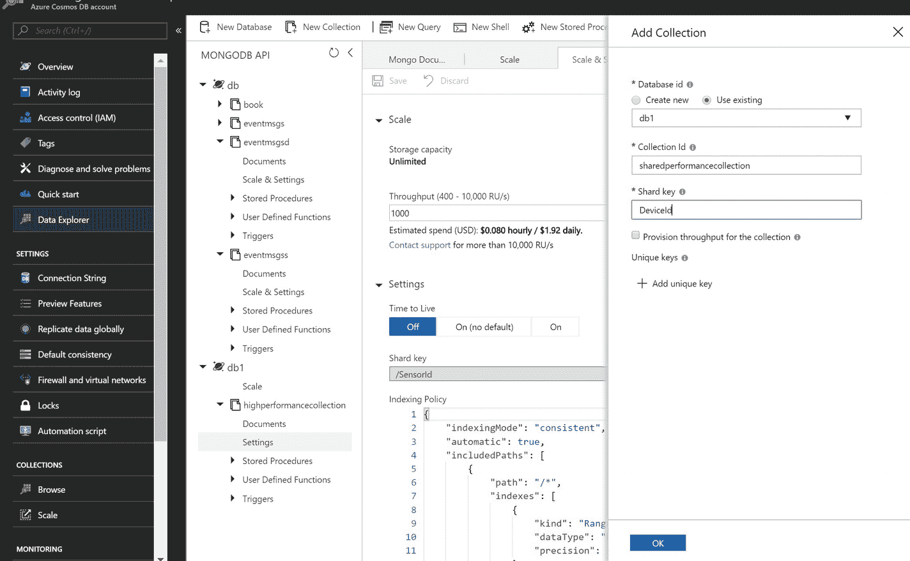
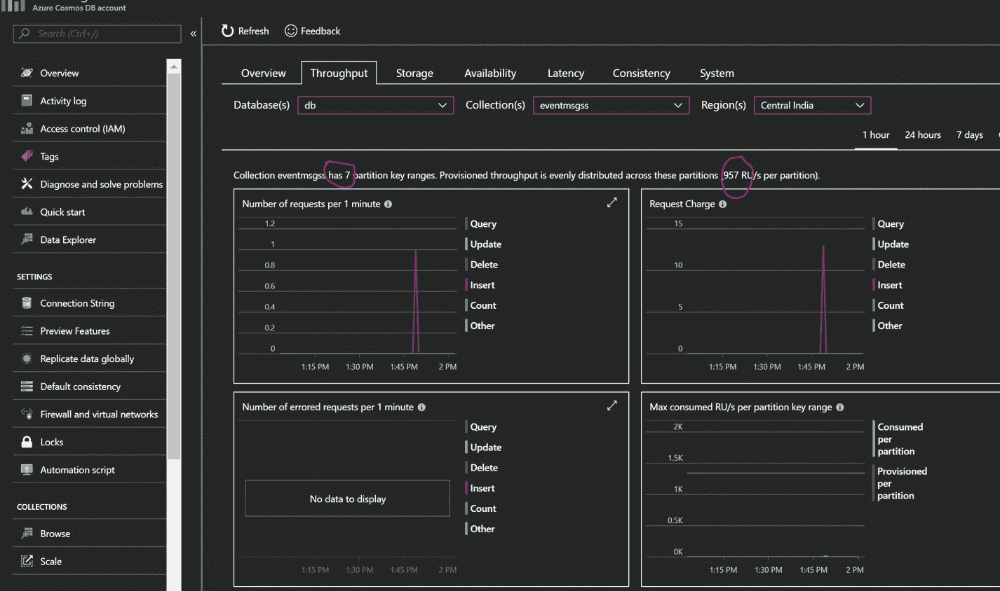
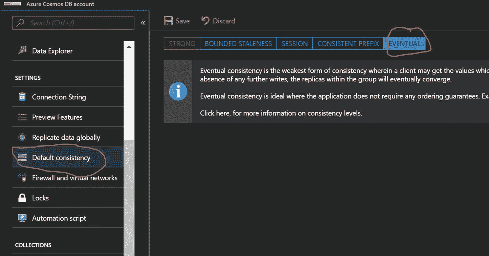

# 7.胶料

到目前为止，我已经从使用角度介绍了 Azure Cosmos DB 的各个方面。在这一章中，我将解释 Azure Cosmos DB 的规模方面。

与任何传统的实现不同，Azure Cosmos DB 并不要求开发人员成为硬件工程师，也不要求数据库架构师无所不知。坦率地说，仅仅基于开发商/建筑师的经验是不可能获得准确的评估的。Azure Cosmos DB 完美地解决了这个问题，并提供了一种基于以下参数配置数据库的自然方式:

*   文档的大小
*   文件数量
*   CRUD(创建、读取、更新和删除)操作的数量

## 请求单位(RUs)

Azure Cosmos DB 是为高吞吐量和预测性能而设计的，这意味着它必须预留资源。然而，它提供了动态增加和减少预留资源的灵活性。保留资源被定义为每秒的请求单位。它是处理每个 CRUD 操作所需的资源的组合，包括 CPU、内存和 IOPS(每秒输入/输出操作数)。Azure Cosmos DB 将 ru 平均分配给分区。因此，如果您在容器级别有 10k RUs，对于五个物理分区，每个分区将接收 2k RUs。

## RUs 的分配

在前一节的最后一行，我使用了术语容器，您可能想知道这是什么。这是一个用来指数据库或集合的术语——无论您想在哪里分配 ru。如果您有多个集合，并且您不想为每个集合分配专用的 ru，那么在集合时分配 ru 将是正确的选择。否则，您可以在收集时分配 ru。你也可以两者兼得。一旦在数据库级分配了 RUs，在给定的数据库中提供一个集合时，您有两种选择。一种是不将 RU 分配给被供应的集合，而是从数据库中取出 RU(直到数据库 RU 的最大值)。另一种是将 ru 分配给一个集合，该集合将专用于该集合，并且属于同一数据库的任何其他集合都不能消费它们。请注意，明确分配给集合的 ru 将是您分配给数据库的 ru 之外的 ru。例如，如果我们向一个数据库分配了 50k ru，然后向其中添加了 5 个集合，那么您将被收取 50k ru 的费用，而不管您添加了多少个集合，并且任何集合都可能占用 50k ru。请注意，由于达到了各自使用的峰值，它们可能不得不争夺 RUs。如果我们添加第 6 个集合，并在同一个数据库中为该集合提供 10k ru，我们将总共被收取 50k ru+10k ru = 60k ru，并且我们新添加的集合将享受专用性能。

要在数据库级别添加 ru，通过导航到 Azure Cosmos DB Account ➤数据浏览器➤新数据库创建一个新数据库，然后勾选 Provision Throughput 并填写表单，如图 [7-1](#Fig1) 所示。图 [7-2](#Fig2) 到 [7-5](#Fig5) ，说明了在数据库和收集级别的 ru 分配。


图 7-5

There are no scale options for collections using RUs from a database



图 7-4

Adding RUs to the database from the collection


图 7-3

Allocating RUs at the collection level


图 7-2

Option to scale will appear on the database (continuation of Figure [7-1](#Fig1))


图 7-1

Allocating RUs at the database level

现在，在数据库级别分配 ru 有助于在您有多个集合的情况下，通过降低成本和使它们共享相同数量的 ru。假设您有 80 个收藏，并且所有收藏都属于无限存储。开始时，您至少需要 80k RUs，但是在数据库级别进行分配时，您可以添加一个具有 50k RUs 的数据库，这样您就完成了排序。在这种情况下，最大限制将是 50k。

请注意，一旦在数据库级别选择了 RU 分配，就必须在预配集合时强制选择分区键。

## 计算 RUs

为了理解 RUs 的计算，让我们考虑一个例子。清单 [7-1](#Par12) 中提供了相关 JSON 文档的代码。

```js
{ "_id" : "469", "SiteId" : 0, "DeviceId" : 0, "SensorId" : 0, "Temperature" : "20.9", "TestStatus" : "Pass", "deviceidday" : "03/10/2018" }

Listing 7-1JSON Document

```

以下是其他统计数据:

*   一个文档的大小= 231 字节
*   文档数量= 300，000，000
*   写操作次数= 200
*   读取操作次数= 400

让我们执行一些查询来确定我们需要多少个 ru。

```js
globaldb:PRIMARY> db.eventmsgss.find({SensorId: 1001001}).limit(1);
globaldb:PRIMARY> db.runCommand({getLastRequestStatistics:1})
{
        "_t" : "GetRequestStatisticsResponse",
        "ok" : 1,
        "CommandName" : "OP_QUERY",
        "RequestCharge" : 3.49,
        "RequestDurationInMilliSeconds" : NumberLong(4)
}

```

前面的 read 查询使用 S `ensorId`作为一个标准，其中我们将它视为一个分区键，并且只取 1 条记录，大小为 231 字节。

```js
globaldb:PRIMARY> db.eventmsgss.insertOne({ "_id" : ObjectId(), "SiteId" : 1, "DeviceId" : 1001, "SensorId" : 1001999, "Temperature" : "20.9", "TestStatus" : "Pass", "TimeStamp" : ISODate("2018-05-21T16:23:32.256Z"), "deviceidday" : "15/21/2018" })
globaldb:PRIMARY> db.runCommand({getLastRequestStatistics:1})
{
        "_t" : "GetRequestStatisticsResponse",
        "ok" : 1,
        "CommandName" : "insert",
        "RequestCharge" : 13.14,
        "RequestDurationInMilliSeconds" : NumberLong(33)
}

```

前面的插入查询对于 231 字节的一次写入需要 13.14 RUs。有了这些结果，下面将是典型的结果:

*   总文档大小= 65GB(大约。)
*   保持以上大小所需的分区数量= 7 个物理分区(10GB/分区)
*   写操作所需的 ru 数= 5256 RUs
*   读取操作所需的 ru 数量= 1396 个 ru
*   操作所需的 ru 总数= 6700 RUs(最接近 100，精确值为 6652 RUs)

Azure Cosmos DB RU 的价格是每 100 RUs，也就是说价格表中提到的价格必须乘以(6700/100) ×每 100 RUs 的价格。对于前面的图，我通过假设负载将分布在所有分区上来考虑这一点。因此，在实践中，每个分区有 6700 个 ru，我们可以预期有 957 个 ru(大约。).(见图 [7-6](#Fig6) 。)



图 7-6

Equal distribution of RUs in partitions

每个地理复制区域将花费独立实例的成本，与您在 Azure Cosmos DB 中配置的实例的成本完全相等。也就是说，如果你在美国西部配置了一个 Azure Cosmos DB 实例，并创建了三个副本，就会产生 3 + 1 = 4 的费用。在 Azure Cosmos DB 被地理复制的情况下，计算必须考虑区域的数量，如下所示:

*   区域数量= 1 个写区域+ 3 个读区域，这意味着 4 个区域
*   ru 总数= 6700×4 = 26800 ru
*   对于价格计算= (26，800/100) ×每 100 RU 的价格

让我们看另一个例子。

*   一个文档的大小= 4KB
*   文档数量= 1600 万
*   写操作次数= 400
*   读取操作次数= 200

平均而言，1 次读取大小最大为 4KB = 4.5 RUs 的文档(约)，并写入大小为 4KB = 7 RUs 的文档。典型结果如下:

*   总文档大小= 61GB(大约。)
*   保持上述大小所需的分区数量= 7 个分区(10GB/分区)
*   写操作所需的 ru 数= 6028 RUs
*   读取操作所需的 ru 数量= 1800 RUs
*   操作所需的 ru 总数= 7828 RUs

Azure Cosmos DB RUs 的价格是每 100 RUs，也就是说价格表中提到的价格必须计算为(7900/100) ×每 100 RUs 的价格。

在 Azure Cosmos DB 被地理复制的情况下，计算还应该包括区域的数量。

*   区域数量= 1 个写区域+ 3 个读区域，这意味着 4 个区域
*   ru 总数= 7900×4 = 31600 ru
*   对于价格计算= (31，600/100) ×每 100 个俄罗斯单位的价格

为了便于参考，Azure Cosmos DB 在 [`www.documentdb.com/capacityplanner`](http://www.documentdb.com/capacityplanner) 提供了一个容量规划器。

该计划程序要求您上传一个样本文档，并根据每种操作类型、文档数量等指定值。一旦完成，您必须点击计算按钮，这将在右侧反映计算结果(参见图 [7-7](#Fig7) )。


图 7-7

Azure Cosmos DB capacity planner

请注意，本章中提到的计算和容量规划器中提到的计算是任何特定应用的标准。我建议您使用门户中的查询指标和监控指标。

## 优化 RU 消耗

RU 是这里的货币。所以优化越好，RUs 烧的越少。有一些技巧可以与其他技巧结合使用，以提高优化。

以下是影响 RUs 优化的一些因素。

### 文档大小和复杂性

这是计算 RU 消耗的一个关键因素。如果您有较小的文档，消耗的 ru 数量将远远少于较大的文档。更多的字段会增加索引的开销。文档的复杂性也起着重要的作用。如果您有一个包含多个嵌入文档的文档，则一次写入的成本将消耗更高的 ru。该因素会影响读取和写入过程中 ru 的消耗。让我们看一些例子。

插入以下文件(清单 [7-2](#Par56) )，将收取 31.32 RUs 的费用:

```js
db.customer.insertOne( {
  "CustomerKey": 1122,
  "Title": "Mr.",
  "FirstName": "Brian",
  "LastName": "Moore",
  "MaritalStatus": "Single",
  "Gender": "Male",
  "EmailAddress": "xxx@xxx.com",
  "YearlyIncome": 100000,
  "TotalChildren": 2,
  "Education": "Graduate",
  "NumberCarsOwned": 4,
  "AddressLine1": "House no. 4455, First Floor,",
  "AddressLine2": "Sector Zeta A, Delwara, US",

  "Phone": "xxx-xxx-xxx",
  "CustomerType": "New",
  "CompanyName": "Tingo"
});
globaldb:PRIMARY> db.runCommand({getLastRequestStatistics:1})
{
        "_t" : "GetRequestStatisticsResponse",
        "ok" : 1,
        "CommandName" : "insert",
        "RequestCharge" : 31.32,
        "RequestDurationInMilliSeconds" : NumberLong(3018)
}

Listing 7-2Inserting a Large-Sized Document

```

如果我们缩小字段名(参见清单 [7-3](#Par58) ，RUs 将被优化为 21.71 RUs。

```js
db.customer.insertOne( {
  "ck": 1122,
  "ttl": "Mr.",
  "fn": "Brian",
  "ln": "Moore",
  "ms": "Single",
  "gn": "Male",
  "ea": "xxx@xxx.com",
  "yi": 100000,
  "tc": 2,
  "edu": "Graduate",
  "nco": 4,
  "add1": "House no. 4455, First Floor,",
  "add2": "Sector Zeta A, Delwara, US",
  "ph": "xxx-xxx-xxx",
  "ct": "New",
  "cn": "Tingo"
});
globaldb:PRIMARY> db.runCommand({getLastRequestStatistics:1})
{
        "_t" : "GetRequestStatisticsResponse",
        "ok" : 1,
        "CommandName" : "insert",
        "RequestCharge" : 21.71,
        "RequestDurationInMilliSeconds" : NumberLong(31)
}

Listing 7-3Minification of Field Names

```

如果我们删除我们用例中可能不需要的两个属性，即`yi` ( `YearlyIncome`)和`tc` ( `TotalChildren`)，那么被消耗的 ru 的数量将是 19.81(参见清单 [7-4](#Par60) )。

```js
globaldb:PRIMARY> db.customer.insertOne( {
...   "ck": 1122,
...   "ttl": "Mr.",
...   "fn": "Brian",
...   "ln": "Moore",
...   "ms": "Single",
...   "gn": "Male",
...   "ea": "xxx@xxx.com",
...   "edu": "Graduate",
...   "nco": 4,
...   "add1": "House no. 4455, First Floor,",
...   "add2": "Sector Zeta A, Delwara, US",
...   "ph": "xxx-xxx-xxx",
...   "ct": "New",
...   "cn": "Tingo"
...
... });
globaldb:PRIMARY> db.runCommand({getLastRequestStatistics:1})
{
        "_t" : "GetRequestStatisticsResponse",
        "ok" : 1,
        "CommandName" : "insert",
        "RequestCharge" : 19.81,
        "RequestDurationInMilliSeconds" : NumberLong(24)

}

Listing 7-4RUs Consumed with Fewer Fields

```

### 数据一致性

该因素主要增加或减少读取期间的 RU 消耗。更强的一致性成本更高，更弱的一致性成本更低(参见第 [6](6.html) 章了解更多关于一致性的细节)。让我们看一些例子。

首先，将一致性设置为强，导航到 Azure Cosmos DB Account ➤默认一致性，并设置最终一致性(见图 [7-8](#Fig8) )。



图 7-8

Changing the default consistency in the portal to Eventual

接下来，执行以下代码:

```js
globaldb:PRIMARY> db.customer.insertOne( {
...   "ck": 1122,
...   "ttl": "Mr.",
...   "fn": "Brian",
...   "ln": "Moore",
...   "ms": "Single",
...   "gn": "Male",
...   "ea": "xxx@xxx.com",
...   "edu": "Graduate",

...   "nco": 4,
...   "add1": "House no. 4455, First Floor,",
...   "add2": "Sector Zeta A, Delwara, US",
...   "ph": "xxx-xxx-xxx",
...   "ct": "New",
...   "cn": "Tingo"
...
... });
globaldb:PRIMARY> db.runCommand({getLastRequestStatistics:1})
{
        "_t" : "GetRequestStatisticsResponse",
        "ok" : 1,
        "CommandName" : "insert",
        "RequestCharge" : 19.81,
        "RequestDurationInMilliSeconds" : NumberLong(24)
}

```

现在，让我们检索相关的记录(参见清单 [7-5](#Par66) )。将使用 2.35 RUs 检索记录，最终保持一致。

```js
globaldb:PRIMARY> db.customer.find({}).limit(1);
globaldb:PRIMARY> db.runCommand({getLastRequestStatistics:1})
{
        "_t" : "GetRequestStatisticsResponse",
        "ok" : 1,
        "CommandName" : "OP_QUERY",
        "RequestCharge" : 2.35,
        "RequestDurationInMilliSeconds" : NumberLong(4)
}

Listing 7-5Retrieving the Record

```

我们把一致性改成强(见图 [7-9](#Fig9) )。


图 7-9

Changing the default consistency in the portal to strong

现在，如果我们执行相同的查询，消耗的 ru 数量将会增加。注意，对于强一致性，相同的查询将花费 4.7 RUs(参见清单 [7-6](#Par69) )。

```js
globaldb:PRIMARY> db.customer.find({}).limit(1);
globaldb:PRIMARY> db.runCommand({getLastRequestStatistics:1})
{
        "_t" : "GetRequestStatisticsResponse",
        "ok" : 1,
        "CommandName" : "OP_QUERY",
        "RequestCharge" : 4.7,
        "RequestDurationInMilliSeconds" : NumberLong(4)
}

Listing 7-6Cost of Query with Strong Consistency

```

### 索引

默认情况下，Azure Cosmos DB 支持文档的自动索引，这是为读取而优化的，但写入会更昂贵。如果您需要大量的写操作和少量的读操作，可以随意关闭索引。这将有助于减少写入期间的 RU 消耗。让我们看一些例子。

关闭自动索引并打开自定义索引。将索引的一致性更改为 lazy，并使用`excludedPaths`来排除被索引的属性。(有关步进的更多信息，请参考第 [4 章](4.html)。)

让我们看一个样本文档。

```js
{ "_id" : "469", "SiteId" : 0, "DeviceId" : 0, "SensorId" : 0, "Temperature" : "20.9", "TestStatus" : "Pass", "deviceidday" : "03/10/2018" }

```

在默认情况下，注意以下索引设置(列表 [7-7](#Par75) ):

```js
{
    "indexingMode": "consistent",
    "automatic": true,
    "includedPaths": [
        {
            "path": "/*",
            "indexes": [
                {
                    "kind": "Range",
                    "dataType": "Number",
                    "precision": -1
                },
                {
                    "kind": "Range",
                    "dataType": "String",
                    "precision": -1
                },
                {
                    "kind": "Spatial",
                    "dataType": "Point"
                },
                {
                    "kind": "Spatial",
                    "dataType": "LineString"
                },
                {
                    "kind": "Spatial",
                    "dataType": "Polygon"
                }
            ]
        }
    ],
    "excludedPaths": []
}

Listing 7-7Default Index Settings

```

接下来(列表 [7-8](#Par77) )是用于插入的 RU 消耗，花费了 12.9 RUs，延迟相当于 6ms。

```js
db.coll.insert({ "_id" : "469", "SiteId" : 0, "DeviceId" : 0, "SensorId" : 0, "Temperature" : "20.9", "TestStatus" : "Pass", "deviceidday" : "03/10/2018" });
db.runCommand({getLastRequestStatistics: 1});
{
        "_t" : "GetRequestStatisticsResponse",
        "ok" : 1,
        "CommandName" : "insert",
        "RequestCharge" : 12.9,
        "RequestDurationInMilliSeconds" : NumberLong(6)
}

Listing 7-8RU Consumption for Insertion

```

以下(列表 [7-9](#Par79) )是读取文档时的 RU 消耗。读取请求的请求费用将为 3.48 RUs，延迟为 5ms。

```js
db.coll.find({_id:ObjectId("5b0546a8512d8c81c1e6bf95")});
db.runCommand({getLastRequestStatistics: 1});
{
        "_t" : "GetRequestStatisticsResponse",
        "ok" : 1,
        "CommandName" : "OP_QUERY",
        "RequestCharge" : 3.48,
        "RequestDurationInMilliSeconds" : NumberLong(5)
}

Listing 7-9RU Consumption While Reading the Document

```

现在，让我们执行自定义索引。索引设置将类似于清单 [7-10](#Par81) 。

```js
{
    "indexingMode": "lazy",
    "automatic": true,
    "includedPaths": [
        {
            "path": "/*",
            "indexes": [
                {
                    "kind": "Range",
                    "dataType": "Number",
                    "precision": -1
                },
                {
                    "kind": "Range",
                    "dataType": "String",
                    "precision": -1
                },
                {
                    "kind": "Spatial",
                    "dataType": "Point"
                },
                {
                    "kind": "Spatial",
                    "dataType": "LineString"
                },
                {
                    "kind": "Spatial",
                    "dataType": "Polygon"
                }
            ]
        }
    ],
    "excludedPaths": [
        {
            "path": "/SiteId/?"
        },
        {
            "path": "/DeviceId/?"
        },
        {
            "path": "/Temperature/?"
        },
        {
            "path": "/TestStatus/?"
        },
        {
            "path": "/TimeStamp/?"
        },
        {
            "path": "/deviceidday/?"
        }
    ]
}

Listing 7-10Custom Index Settings

```

清单 [7-11](#Par83) 计算了插入的 RU 消耗，花费了 4.95 RUs，延迟相当于 7ms。

```js
db.coll.insert({ "_id" : ObjectId(), "SiteId" : 2, "DeviceId" : 0, "SensorId" : 0, "Temperature" : "20.9", "TestStatus" : "Pass", "deviceidday" : "03/10/2018" });
db.runCommand({getLastRequestStatistics:1})
{
        "_t" : "GetRequestStatisticsResponse",
        "ok" : 1,
        "CommandName" : "insert",
        "RequestCharge" : 4.95,
        "RequestDurationInMilliSeconds" : NumberLong(7)
}

Listing 7-11RU Consumption for Insertion

```

以下(列表 [7-12](#Par85) )是读取时的 RU 消耗。读请求的请求费用为 3.48 RUs，延迟为 4 ms

```js
globaldb:PRIMARY> db.coll.find({_id:ObjectId("5b0546a8512d8c81c1e6bf95")})
{
        "_t" : "GetRequestStatisticsResponse",
        "ok" : 1,
        "CommandName" : "OP_QUERY",
        "RequestCharge" : 3.48,
        "RequestDurationInMilliSeconds" : NumberLong(4)
}

Listing 7-12RU Consumption While Reading

```

请注意，在插入文档时，RU 消耗显著减少，但 read 保持不变。

### 查询模式

查询的复杂性在这里扮演着重要的角色。如果您使用了索引属性，RU 消耗将得到优化。但是，这在非分区集合中是有效的。在分区集合中，使用`PartitionKey`值很重要，可以帮助您优化 ru。如果同时使用`PartitionKey`和索引属性，这将提高 RU 消耗的效率。让我们看一些例子。

假设`PartitionKey`在`SensorId`上，执行只有一条记录的查询，如下所示:

```js
globaldb:PRIMARY> db.eventmsgss.find({SensorId:8010003}).limit(1);
globaldb:PRIMARY> db.runCommand({getLastRequestStatistics:1})
{
        "_t" : "GetRequestStatisticsResponse",
        "ok" : 1,
        "CommandName" : "OP_QUERY",
        "RequestCharge" : 6.98,
        "RequestDurationInMilliSeconds" : NumberLong(5)
}

```

如果您更改要检索的记录数量，则执行以下操作:

```js
globaldb:PRIMARY> db.eventmsgss.find({SensorId:8010003}).limit(5);
globaldb:PRIMARY> db.runCommand({getLastRequestStatistics:1})
{
        "_t" : "GetRequestStatisticsResponse",
        "ok" : 1,
        "CommandName" : "OP_QUERY",
        "RequestCharge" : 9.64,
        "RequestDurationInMilliSeconds" : NumberLong(6)
}

```

RU 费用将增加到 9.64 RUs。

## 结论

在 Azure Cosmos DB 中，您不需要担心硬件规模，相反，您可以使用应用程序的事务需求作为规模的基础，例如，多少写入、读取、一致性级别、索引等。您自然能够转换成所需的 ru 数量。一旦你指定了 RU，Azure Cosmos DB 将在后台配置你不需要担心的硬件。

在部署之前确定规模很重要，但是不要太紧张，您也可以在部署之后确定规模。您可以继续使用您预期的 ru，然后您可以通过“metrics”下的“throughput”选项卡监控 ru 的消耗，并在不停机的情况下动态增加/减少 ru。