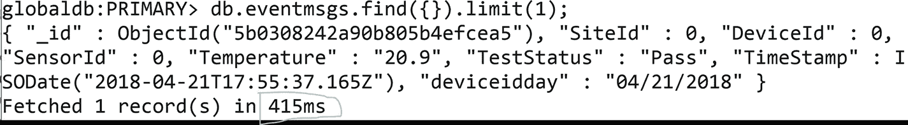

# 八、迁移到 Azure Cosmos DB–MongoDB API

既然我已经介绍了 Azure Cosmos DB–MongoDB API 的大部分内容，在本章中，我们将深入研究将整个应用程序迁移到 Azure Cosmos DB–MongoDB API 的实际逻辑。

## 迁移策略

有许多策略可以将 NoSQL 数据从一种数据库迁移到另一种类型的数据库。开发人员在从一种技术迁移到另一种技术时主要担心的是确保目标和源之间的兼容性。有了协议支持，Azure Cosmos DB with Mongo API 试图解决兼容性问题。理想情况下，您应该只更改连接字符串，它主要在配置文件中提供，并且您可以很容易地替换它。但是在某些情况下，您必须更改代码，因为这里不支持某些命令，例如，`$text`、`$pull` with condition 等。您可以在 [`https://aka.ms/mongodb-feature-support`](https://aka.ms/mongodb-feature-support) 访问 MongoDB API 支持页面，获取最新的命令支持列表。

下一个最重要的考虑因素是如何在最短或没有停机时间的情况下迁移数据。如果 Azure Cosmos DB 可以附加到现有的 MongoDB 集群上，并且所有的数据都可以同步，那么这就很容易了。但是不要担心，有其他方法可以简化迁移。我将在下面讨论这些。参考清单[8-1](#Par5)–[8-12](#Par21)。

### mongoexport 和 mongoimport

MongoDB 有两个工具`mongoexport`和`mongoimport`来简化迁移。顾名思义，它们通常用于将现有数据导出到 JSON 中，并导入到 MongoDB 实例中。您可以通过 Azure Cosmos DB 使用这两种工具，如下所示:从 SSH 或 RDP 连接到 Mongo 服务器或能够访问服务器的客户端，执行特定于操作系统的命令，这些命令将在下面的章节中单独讨论。

#### 对于 Linux

```js
mongoexport --db <name of database> --collection <name of collection> --out <name of json file to export data in>

Listing 8-1mongoexport Command Template

```

```js
mongoexport --db test --collection sample --out sample.json

Listing 8-2Exporting Data Using the mongoexport Command

```

现在，让我们使用`mongoimport`在 Azure Cosmos DB 上执行导入到导入数据。

```js
mongoimport --host <Azure Cosmos DB URI>:10255 -u <Name of Azure Cosmos DB account> -p <primary or secondary key> --db <name of the database> --collection <name of collection> --ssl --sslAllowInvalidCertificates --type json --file <path of json file>

Listing 8-3mongoimport Command Template

```

```js
mongoimport --host testmongo.documents.azure.com:10255 -u testmongo -p jsF6xFsNXz6lZ3tGVjx7bErkQCzoJUzyI2lj8MAqCD --db test --collection sample --ssl --sslAllowInvalidCertificates --type json --file sample.json

Listing 8-4mongoimport Sample Command

```

### 对于 Windows mongodump/mongorestore

`mongodump`是一个以二进制格式导出数据的 MongoDB 实用程序。它还可以压缩导出的数据，便于移动。`mongorestore`从转储中恢复数据，并将其推回到非二进制格式。

以下是命令的详细信息:

#### 对于 Linux

```js
mongodump --host <hostname> --port <port> --collection <name of collection> --username <username> --password <password> --out <nameof file> --gzip

Listing 8-5mongodump Command Template

```

```js
mongodump --host mongodbtest.site.net --port 37017 --collection coll --username test --password "test" --out mongodbtestdmp --gzip

Listing 8-6mongorestore Command Template

```

现在，让我们将转储恢复到 Azure Cosmos DB。

```js
mongorestore --host <Azure Cosmos DB account name>.documents.azure.com:10255 -u <Azure Cosmos DB account name> -p <account's primary/secondary key> --db <name of database> --collection <name of collection>--ssl --sslAllowInvalidCertificates mongodbtestdmp --gzip

Listing 8-7mongorestore Command Sample

```

```js
mongorestore --host testmongocosmos.documents.azure.com:10255 -u testmongocosmos -p jsF6xFsNXz6lZ3tGVjx7bErkQCzoJUzyI2lj8MAqC --db test --collection testcoll --ssl --sslAllowInvalidCertificates mongodbtestdmp --gzip

Listing 8-8mongodump Command Template

```

#### 对于 Windows

```js
Mongodump.exe --host <hostname> --port <port> --collection <name of collection> --username <username> --password <password> --out <nameof file> --gzip

Listing 8-9mongodump Command Template

```

```js
Mongodump.exe --host mongodbtest.site.net --port 37017 --collection cooll --username test --password "test" --out mongodbtestdmp --gzip

Listing 8-10mongorestore Command Template

```

现在，让我们将转储恢复到 Azure Cosmos DB。

```js
mongorestore.exe --host <Azure Cosmos DB account name>.documents.azure.com:10255 -u <Azure Cosmos DB account name> -p <account's primary/secondary key> --db <name of database> --collection <name of collection>--ssl --sslAllowInvalidCertificates mongodbtestdmp --gzip

Listing 8-11mongorestore Command Sample

```

```js
mongorestore.exe --host testmongocosmos.documents.azure.com:10255 -u testmongocosmos -p jsF6xFsNXz6lZ3tGVjx7bErkQCzoJUzyI2lj8MAqC --db test --collection testcoll --ssl --sslAllowInvalidCertificates mongodbtestdmp --gzip

Listing 8-12mongodump Command Template

```

#### 批量遗嘱执行人

这个工具是最近添加到 Azure Cosmos DB 中的，可以在几分钟内上传数百万个文档。这是一个基于 AIMD 式拥塞控制机制设计的客户端库。这将有助于创建基于键范围的多线程，并以并行方式访问所有分区。正如我们在第 [7](7.html) 章中所解释的，每个分区将具有相同的 ru，因此将所有分区放在一起会将吞吐量消耗增加到 100%。它可以消耗超过 500 K RU/s 的数据，并在一小时内推送数 TB 的数据。API 详情请参考清单 [8-13](#Par500) 和 [8-14](#Par501) 。

```js
BulkImportResponse bulkImportResponse = await bulkExecutor.BulkImportAsync(
  documents: documentsToImportInBatch,
  enableUpsert: true,
  disableAutomaticIdGeneration: true,  maxConcurrencyPerPartitionKeyRange: null,
  maxInMemorySortingBatchSize: null,
  cancellationToken: token);

Listing 8-13Usage of BulkImport API to create the data

```

```js
BulkUpdateResponse bulkUpdateResponse = await bulkExecutor.BulkUpdateAsync(
  updateItems: updateItems,
  maxConcurrencyPerPartitionKeyRange: null,
  maxInMemorySortingBatchSize: null,
  cancellationToken: token);

Listing 8-14Usage of BulkImport API to which will update the document if exists

```

## 应用开关

现在，是时候改变应用程序了，通过切换连接字符串并将其连接到 Azure Cosmos DB–MongoDB API(见图 [8-1](#Fig1) 和 [8-2](#Fig2) )。


图 8-1

Copying the connection string from the portal (either primary or secondary)

从门户复制连接字符串(主要的或次要的)，然后用现有的连接字符串替换它(在您的应用程序的`app.config or web.config`中)。


图 8-2

Replacing the connection string in the application’s `config` file

彻底测试应用程序，执行功能和负载测试，以确保应用程序的正确结果。

Note

测试是至关重要的，因为它将让您了解运行应用程序或处理峰值负载所需的 ru，您可以随时更改这些 ru。这也将利用你在整本书中学到的知识。

## 最佳化

以下是优化过程:

1.  In Azure Cosmos DB, increase the RUs for the duration of the import/restore and keep an eye on the throttling at Azure Metrics. If an error occurs, increase the RUs further. (See Figure [8-3](#Fig3).)

    

    图 8-3

    Monitoring throughput metrics for throttling errors  
2.  确保在查询字符串级别启用 SSL，因为 Azure Cosmos DB 不允许不安全的连接。
3.  尝试在配置 Azure Cosmos DB 的同一地区使用 Azure 中的虚拟机。否则，网络延迟会增加恢复/导入时间。
4.  It is possible to determine network latency from the client machine. Execute `setVerboseShell(true)` in the MongoDB shell (see Figure [8-4](#Fig4)). Next, execute the following command:

    

    图 8-4

    Identifying the latency from the MongoDB shell

    ```js
    db.coll.find().limit(1)

    ```

5.  对于`mongoimport`，按如下方式配置`batchSize`和`numInsertionWorkers`:
    1.  `batchSize` =单个单据消耗的总供应 ru/ru。如果计算出的`batchSize` < = 24，则将其作为`batchSize`值；否则，使用 24。
    2.  `numInsertionWorkers` =(调配的吞吐量*延迟(秒)/(批处理大小*单次写入消耗的 ru)。 

下面是一个例子:

```js
batchSize= 24
RUs provisioned=10000
Latency=0.100 s
RU charged for 1 doc write=10 RUs
numInsertionWorkers= (10000 RUs x 0.1 s) / (24 x 10 RUs) = 4.1666

```

最后的命令将是

```js
mongoimport --host testmongocosmos.documents.azure.com:10255 -u testmongocosmosd -p jsF6xFsNXz6lZ3tGVjx7bErkQCzoJUzyI2lj8 --db test --collection coll --ssl --sslAllowInvalidCertificates --type json --file sample.json --numInsertionWorkers 4 --batchSize 24
Code: Finished mongoimport command

```

Note

除了上文描述的工具，你还可以使用其他工具，比如`mongomirror`和`mongochef`，将你的数据从`mongodb`迁移到 Azure Cosmos DB。

## 结论

从 Mongo DB 迁移到 Azure Cosmos DB - Mongo DB API 是非常有意义的，因为没有管理开销、高可伸缩性、高弹性、最低延迟、最高可用性，并且所有这些都包含在 SLA 中。现在，接下来的迁移非常具有挑战性，Azure Cosmos DB 的迁移非常简单，因为其强大的 MongoDB 协议支持，只需要很少或不需要任何更改。对于数据，协议再次支持投入，并提供使用 MongoDB 现有工具的可能性。您可以使用 MongoDB 的 shell 命令导入/导出、恢复或他们的 OOTB 工具，如 mongomirror、mongochef 等。最近，推出了 BulkExecutor 工具，它将使数据推送并行化，并将推送数据的时间减少 40 - 50 倍。

下一章，我们将探讨高级功能，如 Spark、聚合管道等。