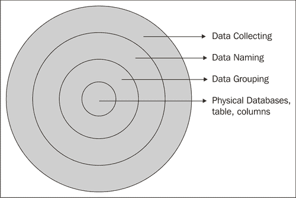
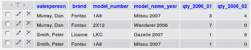
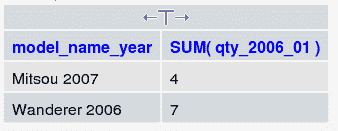

# 第一章介绍 MySQL 设计

数据设计是应用程序开发周期的重要组成部分。通过类比，构建应用程序就像构建房子一样。拥有正确的工具很重要，但我们需要一个坚实的基础：数据结构。然而，产生一个好的数据结构可能是一个艰巨的挑战；寻求一个完美的数据结构可以引导我们到新的领域，那里有许多方法可用。哪一个是最好的？我们怎样才能在不浪费时间的情况下将注意力集中在要实现的目标上？

MySQL 数据库的数据设计既是一门科学也是一门艺术，必须在方法的科学性和经验性方面保持良好的平衡。科学方面指的是信息技术（IT）原理，而经验方面主要基于直觉和经验。

本书主要面向 MySQL 数据库。它教授如何规划数据结构，以及如何使用 MySQL 模型物理地实现它。规划部分有时被称为*逻辑设计*，但最好将逻辑/物理过程视为一个整体。

# MySQL 的知名度和影响力

MySQL（[www.MySQL.com](http://www.mysql.com)）于 1995 年推出，现已成为最受欢迎的开源数据库系统。实际上，所有 web 提供商都将 MySQL 作为其托管计划的一部分，通常在无处不在的 LAMP（Linux、Apache、MySQL、PHP）平台上。MySQL 流行的另一个根本原因是 phpMyAdmin（www.phpMyAdmin.net）的持续成功，这是一个成熟的 MySQL 基于 web 的界面。因此，许多网站使用 MySQL 作为其后端数据存储库。

## MySQL 设计的必要性

总的来说，MySQL 的流行吸引了许多 web 开发人员，其中一些人以前没有 IT 经验。当面临将静态网站转换为动态/事务性网站，或将公司数据集成到网站中的任务时，开发人员有时倾向于临时创建数据结构。这种结构（或缺乏结构）可能会工作一段时间，但后来由于缺乏深度而失败。也许这个系统一开始可以工作是因为它一开始很小，只规划和实现了一些功能，但当用户要求更多时，它就会崩溃。设计糟糕的数据结构只能在一定程度上修补。当初始测试仅使用几行数据完成时，它还可能存在缩放问题。

使用这些工具的明显便利性可能掩盖了这样一个事实，即数据库设计取决于基本原则。避免这些错误会使应用程序的维护成本增加，因为在应用程序编码开始后纠正数据结构错误非常耗时。

## “我下一步该怎么办？”

下面是 MySQL 对非 IT 人员影响的一个例子。我曾经在一个 phpMyAdmin 讨论论坛上看到过这个问题，我从记忆中引用了这个问题：“我已经安装了 MySQL 和 phpMyAdmin，现在我需要说明：下一步该怎么做？”我回答“也许你可以创建一个表，然后在其中插入一些数据。接下来你可以浏览你的数据。”

显然，这个人认为这些工具很有趣，但我只想知道，在这次论坛对话之后，出现了什么样的表格结构。

## 数据设计步骤

我们可以将数据设计视为一系列步骤，其目标是生成支持应用程序所需的物理 MySQL 数据库、表和列。



从外壳开始，我们首先需要通过收集数据来了解我们的数据。然后，我们开始通过适当命名来组织这些数据元素。然后，考虑到所需的键，将数据元素重新组合到表中。虽然前面的步骤只能在纸面上完成，但最后一步是在 MySQL 结构中实现该模型。

所有这些步骤都包含在本书的不同章节中。

# 作为资源的数据

在研究可用于设计的各种技术之前，让我们先考虑一下数据本身的概念。

组织和企业使用许多资产，例如建筑物、家具、大脑，但也许最有价值的资产是信息或数据。我们注意到，数据记录了企业的流程，并将人们绑定到一个持续的信息交换中，称为信息流。计算机有助于将这些数据形式化，但我们必须记住，这些数据是独立存在的。

## 但这是我的数据！

在构建数据设计时，我们必须满足用户并了解企业的数据流。在理想情况下，每个部门（包括 IT 部门）和每个用户都会进行协作，以帮助数据在部门之间轻松流动。然而，有时我们会看到两种态度阻碍了企业中正常的数据流。第一个问题是，一些负责数据驻留的计算机的 IT 部门开始认为数据是他们的。这可以保持一定程度的保密性，从而隐藏数据并阻止数据设计过程。第二个是第一个的变体，这一次是由一个用户引起的，数据来源于这个用户，他倾向于不共享数据。

作为后一种态度的一个例子，让我们考虑会计数据。在 PC 时代之前，会计系统存在于大型机或小型计算机中，IT 部门管理包括会计数据在内的所有数据。由于微型计算机和电子表格应用的出现，会计人员可以管理大量数据，生成高质量的数据报告。然而，这些数据通常驻留在他的计算机上；他进入该网站，制作报告，并因此获得了老板的赞誉。所以这些数据属于会计职员，对吗？这种思维方式阻碍了个人和部门之间的数据流，并有可能导致整个组织中出现冗余、不相交的数据。

在数据设计过程之后，在用户或部门创建的这些孤立的数据孤岛之间建立起桥梁，以便数据能够惠及整个企业。也可能存在更少的孤岛，并消除冗余数据。

# 数据建模

数据通常被组织成一个信息系统。这个系统可以比作活页夹这样简单的东西，但是这本书描述了基于计算机的信息系统或数据库环境中的数据设计过程。此外，数据库遵循一个设计模型，我们将使用最流行的**关系模型**。

企业的完整数据收集比我们的模型所包含的要大。


我们将建立一个仅代表数据谱子集的模型。问题是哪个子集？我们将在[第 2 章](3.html "Chapter 2. Data Collecting")中看到，我们必须为分析系统的数据范围设置边界。

为了建立持久的信息系统，必须驯服和塑造数据，以正确地表示现实。*正确*这里的意思是：

*   遵循组织的需求，包括系统的边界
*   符合所选的数据设计模型（这里是关系模型）
*   具有高度的适应能力，能够适应不断变化的环境

## 关系模型概述

Edgar F.Codd 博士在其 1970 年的论文*大型共享数据库的数据关系模型*（[中提出了关系模型的概念 http://www.acm.org/classics/nov95/toc.html](http://www.acm.org/classics/nov95/toc.html) ）。Codd 博士后来通过定义一组规则来解释他的模型，即所谓的 Codd 的十二条规则（[http://en.wikipedia.org/wiki/Codd%27s_12_rules](http://en.wikipedia.org/wiki/Codd%27s_12_rules) ）。一个理想的数据库管理系统（DBMS）可以实现所有这些规则，但很少有人能够实现。但这在实践中并不是一个问题，因为即使在没有应用所有规则的产品中，关系模型的好处也是可以实现的。我们完全有能力使用当前可用的数据库产品（如 MySQL）构建高效的关系数据设计。

在处理数据设计时，我认为最重要的规则是 1 号和 2 号。下面是这两条 Codd 规则的总结。

### 规则 1

此规则说明数据包含在**表**中。表格从逻辑上重新组合有关特定主题的信息，例如汽车。表格格式的行和列是这里的重要思想。行描述单个项目的信息，例如特定的汽车，而列描述每个项目的单个特征（或属性），例如其颜色。我们将在[第 3 章](4.html "Chapter 3. Data Naming")中看到，将数据分解为经过良好调整的列对于具有灵活且有用的结构非常重要。

行和列的交集包含单个项的特定属性的值。我们有时将此交叉点称为包含数据的单元格，这与电子表格中的想法相同。

### 规则 2

物理位置未检索或引用数据-*在此文件*中查找第三条记录。取而代之的是，必须通过引用一个表、一个唯一的键**主键**和一个或多个列名来获取数据。例如，在`cars`表中，我们使用汽车序列号来检索这辆汽车的颜色。

该规则将在[第 4 章](5.html "Chapter 4. Data Grouping")中进行研究，我们将在其中描述数据分组和选择键的概念。正确的按键选择至关重要。

## 简化设计技术

许多年前，我开始使用关系模型详细阐述数据结构。我使用的方法可以用这句话来概括：“确定数据在结构中最适合的位置”。然后我学习了向 IT 专家传授的设计技术，这些技术是从关系模型演变而来的。

这项技术经常被教授，包括建立一个**实体关系图**。在这种图中，我们表示名词，例如汽车、客户、使用实体，它们之间的关系用动词表示。绑定两个实体的关系的一个例子是“客户买车”。完成图表后，必须使用一种称为**规范化**的技术将其转换为一个由表和列组成的模型，该技术使用许多步骤将模型细化为有效的数据结构。

这些技术生成报告、图表，并最终生成可在 DBMS 中物理实现的理论数据设计。

当我熟悉这些传统技术时，我认为至少对我来说，它们是在浪费时间。这些方法提供了一种方法，但最终目标是更直接地实现一个可工作的关系数据库和相关文档。此外，这些技术还存在一个问题：它们不能被蒙住眼睛和机械地应用。开发人员总是要**考虑**数据命名、数据分组和选择键，同时试图平衡用户的需求和以下方面施加的约束：

*   硬件
*   数据库管理系统的选择
*   计划增长
*   时间
*   预算

我意识到传统技术到处都在教授，我尊敬教授这些技术的老师。但请相信我，当需要交付应用程序时，不管界面本身如何，都要避免浪费时间去处理中间的副产品，直接使用工作原型。在数据设计阶段使用更直接的方法可以腾出更多的时间来优化接口，捕捉不可预见的需求并解决它们。

这本书的目标是教一个人为了建立一个有效的数据结构必须应用的最低原则。

# 案例研究

通过两个案例研究，可以非常实用地解释数据设计的各个步骤。一个案例研究是最好的方法来解释没有真实例子可能变得过于抽象的想法。第 1 章至第 5 章基于单个案例研究：“汽车经销商”。[第 6 章](7.html "Chapter 6. Supplemental Case Study")包括另一个案例研究，该案例研究概括了前几章中看到的所有概念。

## 我们的汽车经销商

假设有一位汽车经销商联系我们，他想将他的部分业务电脑化。让我们描述一下这项业务。在[第 2 章](3.html "Chapter 2. Data Collecting")中，我们将更正式地检查我们系统的数据收集阶段。

这家汽车经销商只有一个地址。他们雇佣了九名销售人员，他们尽职尽责地欢迎潜在客户，并向他们展示地板上的车型。此外，两名店员负责处理车辆移动，一名办公室职员记录客户的预约。Fontax 和独角兽是该经销商提供的两个虚构品牌。每个品牌都有许多型号，例如 Mitsou、Loverter 和 Gazelle。

## 系统的目标

我们想保留有关汽车库存和销售的信息。以下是一些示例问题，说明了我们的系统必须处理的信息类型：

*   我们有多少辆 Fontax Mitsou 2007 的汽车库存？
*   去年有多少游客试驾了流浪者？
*   在一段时间内，我们卖出了多少辆流浪车？
*   2007 年，谁是我们在 Mitsou、Loverter 或总体上最好的销售人员？
*   购买者主要是男性还是女性（每种车型）？

以下是该汽车经销商需要的一些报告的标题：

*   每月详细销售额：销售人员、汽车数量、收入
*   每位销售人员的年销售额
*   库存效率：车辆交付给经销商或客户的平均延迟
*   访客报告：尝试汽车的访客百分比；导致销售的道路测试百分比
*   销售人员的客户满意度
*   销售合同

除此之外，必须构建屏幕应用程序来支持库存和销售活动。例如，能够查阅和更新预约时间表；查阅下周的车辆交付时间表。

建立此数据模型后，应用程序开发周期的其余阶段（如屏幕和报告设计）将为该汽车经销商提供报告和在线应用程序，以更好地管理汽车库存和销售。

# 桌子太宽的故事

这本书主要介绍用 MySQL 表示数据。MySQL 和其他产品中的表容器是数据库。一个数据库中只有一个表是很有可能的，因此避免了完全应用关系模型概念，即表通过公共值相互关联；但是，我们将以正常的方式使用该模型：拥有许多表并在它们之间创建关系。

### 注

本节描述了一个将数据塞进一个大表的示例，也被称为*太宽表*，因为它由太多列组成。这个*太宽的表*基本上是*非关系*。

有时需要检查或评估数据结构，因为它可能基于数据命名约定、键选择和表数量方面的错误决策。可能最常见的问题是，整个数据都放在一个大而宽的表中。

这种常见结构（或缺少结构）的原因是，许多开发人员从结果甚至打印结果的角度来考虑。也许他们知道如何构建电子表格，并尝试将电子表格原理应用于数据库。假设建立数据库的主要目标是生成此销售报告，该报告显示每个销售人员每月售出的汽车数量，描述品牌名称、汽车型号和名称。

<colgroup><col style="text-align: left"> <col style="text-align: left"> <col style="text-align: left"> <col style="text-align: left"> <col style="text-align: left"> <col style="text-align: left"></colgroup> 
| 

销售员

 | 

时期

 | 

品牌名称

 | 

汽车型号

 | 

车型名称和年份

 | 

销售量

 |
| --- | --- | --- | --- | --- | --- |
| 默里，丹 | 2006-01 | 丰塔克斯 | 1A8 | Mitsou 2007 | 3. |
| 默里，丹 | 2006-01 | 丰塔克斯 | 2X12 | 流浪者 2006 | 7. |
| 默里，丹 | 2006-02 | 丰塔克斯 | 1A8 | Mitsou 2007 | 4. |
| 史密斯，彼得 | 2006-01 | 丰塔克斯 | 1A8 | Mitsou 2007 | 1. |
| 史密斯，彼得 | 2006-01 | 利科尔内 | LKC | 瞪羚 2007 | 1. |
| 史密斯，彼得 | 2006-02 | 利科尔内 | LKC | 瞪羚 2007 | 6. |

如果不考虑这个结构的含义，我们可以只构建一个表，`sales:`

<colgroup><col style="text-align: left"> <col style="text-align: left"> <col style="text-align: left"> <col style="text-align: left"> <col style="text-align: left"> <col style="text-align: left"></colgroup> 
| 

销售员

 | 

品牌

 | 

型号

 | 

型号名称年份

 | 

数量(2006)01

 | 

数量(2006)02

 |
| --- | --- | --- | --- | --- | --- |
| 默里，丹 | 丰塔克斯 | 1A8 | Mitsou 2007 | 3. | 4. |
| 默里，丹 | 丰塔克斯 | 2X12 | 流浪者 2006 | 7. |   |
| 史密斯，彼得 | 丰塔克斯 | 1A8 | Mitsou 2007 | 1. |   |
| 史密斯，彼得 | 利科尔内 | LKC | 瞪羚 2007 | 1. | 6. |

乍一看，我们已将报告所需的所有信息制成表格。

### 注

可以使用`mysql`命令行实用程序或 phpMyAdmin（更直观的 web 界面）复制本书的示例。您可以参考 Packt Publishing（ISBN 1-904811-60-6）中的*Mastering phpMyAdmin 2.8 了解有效的 MySQL 管理*一书。在 phpMyAdmin 中，可以使用 SQL 查询窗口键入确切的命令，也可以从菜单和图形对话框中获益。这两种方式都将贯穿全书。

下面是我们将使用`mysql`命令行实用程序创建`sales`表的语句：

```sql
CREATE TABLE sales (
salesperson char(40) NOT NULL,
brand char(40) NOT NULL,
model_number char(40) NOT NULL,
model_name_year char(40) NOT NULL,
qty_2006_01 int(11) NOT NULL,
qty_2006_02 int(11) NOT NULL
) ENGINE=MyISAM DEFAULT CHARSET=latin1;

```

在前面的语句中，`char(40)`表示包含 40 个字符的列，`int(11)`表示 MySQL 中显示宽度为 11 的整数。

使用 phpMyAdmin web 界面，我们将获得：


在此，我们已将样本数据输入我们的`sales`表：

```sql
INSERT INTO sales VALUES ('Murray, Dan', 'Fontax', '1A8', 'Mitsou 2007', 3, 4);
INSERT INTO sales VALUES ('Murray, Dan', 'Fontax', '2X12', 'Wanderer 2006', 7, 0);
INSERT INTO sales VALUES ('Smith, Peter', 'Licorne', 'LKC', 'Gazelle 2007', 1, 6);
INSERT INTO sales VALUES ('Smith, Peter', 'Fontax', '1A8', 'Mitsou 2007', 1, 0);

```



然而，这种结构存在许多维护问题。例如，2006 年 3 月的数据存储在哪里？为了发现其他一些问题，让我们检查一下可以在此表上查询特定问题的示例 SQL 语句，然后是这些语句的结果：

```sql
/* displays the maximum number of cars of a single model sold by each vendor in January 2006 */
SELECT salesperson, max(qty_2006_01)
FROM sales
GROUP BY salesperson

```


```sql
/* finds the average number of cars sold by our sales force taken as a whole, in February 2006 */
SELECT avg(qty_2006_02)
FROM sales
WHERE qty_2006_02 > 0

```


```sql
/* finds for which model more than three cars were sold in January */
SELECT model_name_year, SUM(qty_2006_01)
FROM sales
GROUP BY model_name_year
HAVING SUM(qty_2006_01) > 3

```



我们注意到，尽管我们得到了我们想要的答案，但是对于上面的 SQL 查询，我们必须修改查询中的列名以获得其他月份的结果。此外，如果我们想知道哪个月的销售额超过了年平均值，这就变得很棘手，因为我们可能需要处理 12 个列名。另一个问题是，当试图为不同的年份进行报告，或将一年与另一年进行比较时，会出现。

此外，需要一份新的报告，这可能表明这一结构状况不佳。过于紧密地基于单个报表而不是基于数据元素之间的内在关系的结构不能很好地扩展，也不能适应未来的需要。

[第四章](5.html "Chapter 4. Data Grouping")将揭示这些问题。

# 总结

我们看到 MySQL 的流行为许多用户的桌面提供了一个强大的工具；他们中的一些人对设计技术不太满意。数据是一种重要的资源，我们必须从整体上考虑组织的数据。强大的关系模型可以帮助我们构建活动。这本书避免了关于关系模型的专门的学术词汇，而是着重于重要的原则和产生良好结构所需的最低任务。然后，我们看到了我们的主要案例研究，我们注意到，不幸的是，很容易构建宽而低效的表。