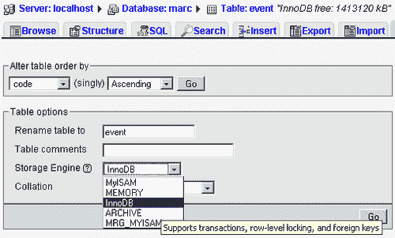
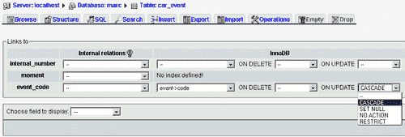
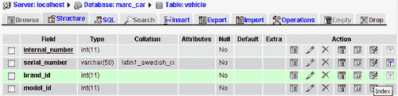
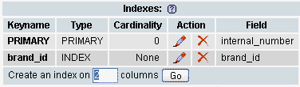
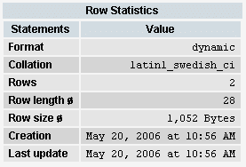
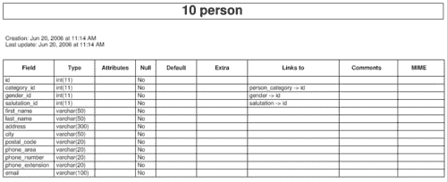
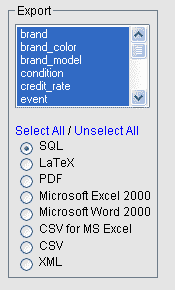

# 第五章数据结构调整

本章介绍了在安全性、性能和文档方面改进数据结构的各种技术。然后，我们给出了汽车经销商案例研究的最终数据结构。

# 数据访问策略

我们在[第 1 章](2.html "Chapter 1. Introducing MySQL Design")中看到，数据是一种重要的资源，因此对该资源的访问必须加以控制并明确记录。由于每一条数据都是源数据，因此必须明确确定数据输入的责任。数据进入数据库后，必须制定相应的策略来控制对数据的访问，这些策略通过 MySQL 的权限和使用**视图**来实现。

## 责任

我们应该根据人名或函数名来确定企业中谁负责每个数据元素。然后应该将其记录下来，这样做的好地方是直接在数据库结构中。另一种方法是将数据责任记录在纸面上，但纸面上的信息很容易丢失，并且有很快过时的趋势。

在某些情况下，将有一个主要来源和一个认可级别来源。两者都应记录在案，这有助于

*   应用程序设计，当屏幕必须反映数据输入的权限链时
*   特权管理，如果直接 MySQL 数据访问被授予最终用户

phpMyAdmin 允许我们通过添加注释来描述每一列。如果当前 MySQL 版本支持本机注释，则使用本机注释；否则，必须配置 phpMyAdmin 的链接表基础结构，以支持将列注释存储为元数据。我们将在相应的专栏评论中说明本专栏的责任详情。为了进入允许我们在 phpMyAdmin 中输入注释的页面，我们使用左侧导航面板打开数据库（此处为`marc`，然后打开表（此处为`car_event`。然后点击**结构**并点击铅笔图标选择编辑字段结构（此处为`event_code`。


然后，我们可以从**结构**页面使用 phpMyAdmin 的**打印视图**来获取带有注释的表列表。


## 安全和特权

有两种方法可以考虑数据的安全性。第一个也是最常见的实现是在应用程序级别。通常，应用程序应该请求凭据：用户名、密码，并使用这些凭据生成反映此用户所允许任务的网页或桌面屏幕。请注意，底层应用程序仍然使用开发人员帐户的所有权限连接到 MySQL，但是，当然，根据用户的权限，只显示适当的数据。

另一个要考虑的问题是，当用户直接访问 MySQL 时，要么使用命令行实用程序，要么像 PHPMyAdmin 这样的接口。这可能是因为最终用户应用程序仅开发到某一点，不允许维护代码表。在这种情况下，应该创建只具有所需权限的特殊 MySQL 用户。MySQL 支持基于数据库、表、列和视图权限的访问矩阵。这样，我们可以向所有未经授权的人隐藏特定列，如销售价格。

## 观点

自 MySQL 5.0 以来，我们可以构建视图，这些视图看起来像表，但基于查询。这些视图可用于：

*   隐藏一些列
*   根据表列及其表达式的使用生成修改后的信息
*   通过连接多个表以使它们显示为一个表，获取数据访问的快捷方式

由于我们可以将特权与这些视图相关联，而无需访问底层表，因此视图可以方便地让用户直接访问 MySQL 并同时控制他们的操作。

下面是一个显示汽车事件及其描述的视图示例，我们想隐藏`event_code`列：

```sql
create view explained_events as
select car_event.internal_number, car_event.moment, event.description
from car_event
left join event on car_event.event_code = event.code

```

在 phpMyAdmin 中浏览此视图将显示以下报告：


要求用户使用视图并不意味着该用户只能读取这些数据。在许多情况下，可以更新视图。例如，允许使用以下语句：

```sql
UPDATE `explained_events`
SET `moment` = '2006-05-27 09:58:38'
WHERE `explained_events`.`internal_number` = 412;

```

# 存储引擎

MySQL 的内部结构使得存储和管理数据的底层任务由**可插拔存储引擎架构**实现。MySQL AB 和其他公司积极参与 R&D，以改进存储引擎领域的产品。有关架构本身的更多信息，请参阅[http://dev.mysql.com/tech-resources/articles/mysql_5.0_psea1.html](http://dev.mysql.com/tech-resources/articles/mysql_5.0_psea1.html) 。

每次我们创建一个表时，即使我们没有注意到它，我们也会要求 MySQL 服务器（隐式或显式）使用一个可用的存储引擎来物理存储数据。

默认的传统存储引擎名为`MyISAM`。*MySQL 参考手册*（[中的整整一章 http://dev.mysql.com/doc/refman/5.0/en/storage-engines.html](http://dev.mysql.com/doc/refman/5.0/en/storage-engines.html) 描述了可用的发动机。我们对存储引擎的选择因桌而异。没有完美的存储引擎；我们必须根据需要选择最好的。以下是一些选择时需要考虑的问题：

*   `MyISAM`支持`FULLTEXT`索引和压缩只读存储，对于等量数据使用的磁盘空间比`InnoDB`少约三倍
*   `InnoDB`提供外键约束，支持`ROLLBACK`的多对账单交易；此外，由于其锁定机制，它支持的并发`SELECT`查询比`MyISAM`多
*   `MEMORY`当然非常快，但是内容（数据）不是永久存储在磁盘上，而表定义本身在磁盘上
*   `NDB`（网络数据库），也称为`MySQL Cluster`，提供服务器间的同步复制，建议集群中最少有 4 台服务器；因此，在这样的集群中不存在单点故障

简而言之，这里有一个通用的指导原则：如果应用程序需要多语句事务和外键约束，我们应该选择`InnoDB`；否则，建议使用默认存储引擎`MyISAM`。

## 外键约束

`InnoDB`存储引擎[http://www.innodb.com MySQL 中包含的](http://www.innodb.com)）提供了一种工具来描述表结构中的外键。**外键**是指向表中键的列（或列组）。通常，指向的键位于另一个表中，并且是该另一个表的主键。外键通常用作查找表。在结构中直接描述这些关系有很多好处：

*   表的引用完整性由引擎维护。如果`event`表中没有相应的代码，我们无法将事件代码添加到`car_event`表中；如果`car_event`表中的一行仍然引用了`event`表中的代码，我们无法从`event`表中删除代码
*   我们可以编程 MySQL 将在对某些事件作出反应时完成的操作；例如，如果引用的代码被更新，引用表中会发生什么

让我们将我们的`car_event`示例转换为`InnoDB`。我们首先创建并填充引用的表`event`——注意`ENGINE=InnoDB`子句：

```sql
CREATE TABLE `event` (
`code` int(11) NOT NULL,
`description` char(40) NOT NULL,
PRIMARY KEY (`code`)
) ENGINE=InnoDB DEFAULT CHARSET=latin1;
INSERT INTO `event` VALUES (1, 'washed');
INSERT INTO `event` VALUES (2, 'arrived');

```

接下来，参考表`car_event:`

```sql
CREATE TABLE `car_event` (
`internal_number` int(11) NOT NULL COMMENT 'Resp.:Office clerk',
`moment` datetime NOT NULL COMMENT 'Resp.: store assistant',
`event_code` int(11) NOT NULL COMMENT 'Resp.: store assistant',
PRIMARY KEY (`internal_number`),
KEY `event_code` (`event_code`)
) ENGINE=InnoDB DEFAULT CHARSET=latin1;
INSERT INTO `car_event` VALUES (412, '2006-05-27 09:58:38', 2);
INSERT INTO `car_event` VALUES (500, '2006-05-29 16:37:46', 1);
INSERT INTO `car_event` VALUES (600, '2006-05-30 16:38:51', 2);
INSERT INTO `car_event` VALUES (700, '2006-05-31 16:39:21', 2);

```

我们必须在`event_code`列上有一个索引，才能在`InnoDB`外键约束中使用它，定义如下：

```sql
ALTER TABLE `car_event`
ADD CONSTRAINT `car_event_ibfk_1` FOREIGN KEY (`event_code`) 
REFERENCES `event` (`code`) ON UPDATE CASCADE;

```

### 注

`car_event`中的外键也可以在初始`CREATE TABLE`语句中定义。上一个示例是使用`ALTER TABLE`完成的，以表明以后可以添加外键。

所有这些操作都可以通过 phpMyAdmin 以更直观的方式处理。**操作**子页面允许我们将引擎切换到**InnoDB**：



另外，当表在`InnoDB`存储引擎下时，phpMyAdmin 的**关系视图**允许我们定义和修改外键及相关动作：



定义了这个`ON UPDATE CASCADE`子句之后，让我们看看当我们修改`event`表中的代码值时会发生什么。我们决定**清洗**的代码应该是**10**而不是**1**：


我们现在浏览`car_event`表；果然，**清洗**的代码已自动更改为值 10：


# 性能

如果我们想在访问速度或使用的磁盘空间方面提高结构的效率，必须检查许多要点。

## 指标

在`WHERE`子句中使用的列上添加索引是加快查询速度的常用方法。假设我们打算查找特定品牌的所有车辆。`vehicle`表有一个`brand_id`列，我们想在此列上创建一个索引。在这种情况下，该指数不会是唯一的，因为每个品牌都由许多车辆代表。

使用 phpMyAdmin，有两种方法可以创建索引。首先，如果索引应用于单个列，我们可以打开表的**结构**页面，点击与`brand_id`列相同行的索引（flash）图标：



这将生成以下语句：

```sql
ALTER TABLE `vehicle` ADD INDEX(`brand_id`)

```

我们还可以在复合键上创建索引，例如`model_id`加上`year`。为此，我们在**结构**页面上输入索引的列数（2），然后点击**Go**。



接下来，在索引管理页面上，我们选择哪些列将成为索引的一部分；然后我们为这个索引发明了一个名称（这里是**车型年**，点击**Go**创建它。


此操作的相关 SQL 命令为

```sql
ALTER TABLE `vehicle` ADD INDEX `model-year` (`model_id`,`year`)

```

为了确定在特定查询上使用了哪些索引，我们可以在这个查询前面加上 EXPLAIN 关键字。例如，我们在 phpMyAdmin 的查询框中发出以下命令：

```sql
explain select * from vehicle where brand_id = 1

```

结果告诉我们，`brand_id`列上的索引可能是检索的键：


### 帮助查询优化器：分析表

当我们向 MySQL 服务器发送查询时，它使用其查询优化器找到检索行的最佳方式。我们可以通过在表中加载数据，然后在表上执行`ANALYZE TABLE`语句来帮助查询优化器获得更好的结果。此语句要求 MySQL 存储表的键分布，这意味着它计算每个索引的键数，并存储此信息以供以后重用。例如，在`vehicle`表上的`ANALYZE TABLE`之后，MySQL 可能会注意到有 12 个不同的品牌、1000 辆不同的车辆和 100 个不同的车型年。如果我们使用这些索引之一发送查询，则稍后将使用此信息。因此，`ANALYZE TABLE`应该定期执行；确切的频率取决于此表的更新次数。

## 访问复制从服务器

MySQL 支持在**主服务器**和一个或多个**从服务器**之间进行单向异步数据复制的方案。由于通常情况下，发送到 MySQL 的大多数请求都是`SELECT`查询，因此我们可以通过将这些读取请求发送到从属服务器来提高响应时间。这会获得负载平衡效果。必须注意向主机发送写类型语句，如`INSERT, UPDATE`和`DELETE`。

在当前的 MySQL 版本（5.0.26）中，我们必须在应用层选择合适的服务器来实现这种平衡；然而，MySQL 计划提供一项功能，自动将`SELECT`查询发送到从属服务器。

### 注

复制是 MySQL 的高级功能，应该由经验丰富的 MySQL 管理员设置。

## 速度和数据类型

创建列时，必须为其指定数据类型。字符数据类型（`CHAR, VARCHAR`）非常常用。对于`CHAR`，我们表示列的长度（0 到 255），该列占用固定的空间。对于`VARCHAR`，每个值只占用表中所需的空间；指示的长度是自此版本以来 MySQL 5.0.3 和 65532 之前的最大长度 255。像`INT, FLOAT`、`DECIMAL`这样的数字类型是固定长度的。

总而言之，这里有一些数据类型和关于如何存储它们的信息：

<colgroup><col style="text-align: left"> <col style="text-align: left"></colgroup> 
| 

数据类型

 | 

存储方法

 |
| --- | --- |
| 烧焦 | 固定的 |
| 国际的 | 固定的 |
| 浮动 | 固定的 |
| 十进制的 | 固定的 |
| 瓦尔查尔 | 变量 |

我们应该知道，MySQL 可以默默地决定将一种数据类型转换为另一种数据类型。原因在 MySQL 手册中解释：[http://dev.mysql.com/doc/refman/5.0/en/silent-column-changes.html](http://dev.mysql.com/doc/refman/5.0/en/silent-column-changes.html) 。这就是为什么在创建表之后，我们应该重新检查它的结构，以验证是否发生了静默转换。

似乎我们应该总是选择`VARCHAR`作为字符字段，因为通过使用此数据类型，较短的值占用的空间较小，但仍有理由使用`CHAR:`速度。

在表中，当所有字段都使用非变量数据类型时，`MyISAM`存储引擎使用**固定的**表格式。在这种格式中，MySQL 可以预测每一行的大小，因此可以很容易地找到从一个`first_name`列到下一行`first_name`列的距离。这意味着对非索引列的查询执行速度相对较快。相反，当一个表中甚至有一个`VARCHAR`列时，这就不可能了，因为在这种情况下`MyISAM`使用**动态**表格式。因此，必须在数据检索速度和使用固定长度列的空间开销之间做出决定。

在 phpMyAdmin 中，当查看表的结构时，**行统计信息**部分通知我们固定或动态格式：



还有一点赞成使用固定格式。删除行时，表中这些孔之前占用的空间将可用于将来的插入，因此表不会在物理上变得支离破碎。

`BLOB`和`TEXT`数据类型的长度也是可变的。`BLOB`通常用于存储二进制数据，如汽车或客户的照片。MySQL 在内部注意将这些列与表的其余数据分开存储，因此将它们放在表中的影响不大。

## 工作台尺寸缩小

在压缩数据时，可以使用实用程序`myisampack`将`MyISAM`表转换为只读表。在某些情况下，表的物理大小可以减少 70%。只有当我们可以访问此命令行实用程序，并且没有可以发送以实现此结果的 SQL 查询时，此技术才可用。

# 列内数据编码

我将要描述的情况发生在我正在为书目数据开发搜索引擎时，但我正在将其转换为汽车经销商的系统。

当我们必须将数据从预先存在的系统迁移到新生成的数据结构中时，我们可能会遇到以特殊方式格式化的数据。例如，汽车模型的可能颜色列表可以表示为一系列颜色代码，用分号分隔：

```sql
1A6;1A7;2B7;2T1A65

```

现有系统的用户对这种以这种格式输入数据的方法很满意，在我所经历的例子中，用户拒绝放弃这种输入数据的方式，他们可以直接访问 MySQL 表。然而，从开发人员的角度来看，这种格式使得查询生成的任务更加复杂。查找`1A6`颜色需要拆分数据元素，并避免使用`2T1A65`数据元素，该数据元素也包含`1A6`字符串。

对于这种情况，适当的结构意味着完全摆脱基于分号的格式，只以表格式存储纯数据：

<colgroup><col style="text-align: left"> <col style="text-align: left"> <col style="text-align: left"></colgroup> 
| 

表：车型颜色

 | 

列名

 | 

样本值

 |
| --- | --- | --- |
|   | *模型 | 1. |
|   | 色码 | 1A6 |

在另一种情况下，使用查询查找一致数据更为复杂，即分隔符之间有多个元素，例如名称列表：

```sql
Murray Dan; Smith Peter; Black Paul

```

在搜索`Murray, Paul`时，必须特别注意避免匹配此名称列表，因为`Murray`和`Paul`在完整字符串中。这个例子只是加强了我们远离这种格式的理由，或者至少如果我们因为政治问题必须保持这种格式来构建一个中间表，这个中间表将用于搜索。在这种情况下，只要主表的内容发生更改，就必须同步特殊表。

# 案例研究的最终结构

在本节中，我们将检查案例研究的最终数据结构。有许多方法可以呈现这种结构。首先，我们将看到所有相互关联的表几乎所有的表都是相关的，然后我们将检查一组相关表及其列。

以下模式由 phpMyAdmin 的 PDF 页面功能生成。为了访问此功能，我们打开一个数据库并访问**操作**子页面。然后点击**编辑 PDF 页面**。


在生成 PDF 模式时，我们还可以要求 phpMyAdmin 生成数据字典。为此，我们在**显示 PDF 模式**对话框中点击**数据字典**复选框。以下是本词典中描述`person`表的页面：



这种组合数据字典/模式提供了一个值得注意的特性：我们可以单击模式中的表名来访问字典中的表描述，反之亦然。

以下`CREATE TABLE`命令直接来自 phpMyAdmin 的**导出**功能。要访问此功能，只需打开一个数据库并选择**导出**菜单，然后选择所有表，点击**SQL**复选框并点击**Go**。



这些命令已被分组到更小的相关表块中，即使这些组的表之间最终存在关系。您会注意到，phpMyAdmin 以注释的形式在导出文件中添加了有关与其他表的关系的信息。另一点需要注意的是：大多数表的主键是`id`，一个整数。因此，指向表`brand`的`id`列的列被命名为`brand_id`。

## 车辆

```sql
--
-- Table structure for table `brand`
--
CREATE TABLE `brand` (
id` int(11) NOT NULL,
`description` varchar(40) NOT NULL,
PRIMARY KEY (`id`)
) ENGINE=MyISAM DEFAULT CHARSET=latin1;
-- --------------------------------------------------------
--
-- Table structure for table `brand_color`
--
CREATE TABLE `brand_color` (
`brand_id` int(11) NOT NULL,
`id` int(11) NOT NULL,
`description` varchar(40) NOT NULL,
PRIMARY KEY (`brand_id`,`id`)
) ENGINE=MyISAM DEFAULT CHARSET=latin1;
--
-- RELATIONS FOR TABLE `brand_color`:
-- `brand_id`
-- `brand` -> `id`
--
-- --------------------------------------------------------
--
-- Table structure for table `brand_model`
--
CREATE TABLE `brand_model` (
`brand_id` int(11) NOT NULL,
`id` int(11) NOT NULL,
`description` varchar(40) NOT NULL,
PRIMARY KEY (`brand_id`,`id`)
) ENGINE=MyISAM DEFAULT CHARSET=latin1;
--
-- RELATIONS FOR TABLE `brand_model`:
-- `brand_id`
-- `brand` -> `id`
--
-- --------------------------------------------------------
--
-- Table structure for table `event`
--
CREATE TABLE `event` (
`id` int(11) NOT NULL,
`description` varchar(40) NOT NULL,
PRIMARY KEY (`id`)
) ENGINE=MyISAM DEFAULT CHARSET=latin1;
-- --------------------------------------------------------
--
-- Table structure for table `vehicle`
--
CREATE TABLE `vehicle` (
`internal_number` int(11) NOT NULL,
`serial_number` varchar(50) NOT NULL,
`brand_id` int(11) NOT NULL,
`model_id` int(11) NOT NULL,
`year` year(4) NOT NULL,
`physical_key_id` int(11) NOT NULL,
`color_id` int(11) NOT NULL,
`category_id` int(11) NOT NULL,
PRIMARY KEY (`internal_number`)
) ENGINE=MyISAM DEFAULT CHARSET=latin1;
--
-- RELATIONS FOR TABLE `vehicle`:
-- `brand_id`
-- `brand` -> `id`
-- `category_id`
-- `vehicle_category` -> `id`
-- `color_id`
-- `brand_color` -> `id`
-- `model_id`
-- `brand_model` -> `id`
--
-- --------------------------------------------------------
table structure vehicle table--
-- Table structure for table `vehicle_category`
--
CREATE TABLE `vehicle_category` (
`id` int(11) NOT NULL,
`description` varchar(40) NOT NULL,
PRIMARY KEY (`id`)
) ENGINE=MyISAM DEFAULT CHARSET=latin1;
-- --------------------------------------------------------
--
-- Table structure for table `vehicle_event`
--
CREATE TABLE `vehicle_event` (
`internal_number` int(11) NOT NULL,
`moment` date NOT NULL,
`event_id` int(11) NOT NULL,
`person_id` int(11) NOT NULL,
PRIMARY KEY (`internal_number`,`moment`)
) ENGINE=MyISAM DEFAULT CHARSET=latin1;
--
-- RELATIONS FOR TABLE `vehicle_event`:
-- `event_id`
-- `event` -> `id`
-- `internal_number`
-- `vehicle` -> `internal_number`
-- `person_id`
-- `person` -> `id`
--

```

## 人

```sql
--
-- Table structure for table `gender`
--
CREATE TABLE `gender` (
`id` TINYINT(4) NOT NULL,
`description` varchar(40) NOT NULL,
PRIMARY KEY (`id`)
) ENGINE=MyISAM DEFAULT CHARSET=latin1;
-- --------------------------------------------------------
--
-- Table structure for table `person`
--
CREATE TABLE `person` (
`id` int(11) NOT NULL,
`category_id` int(11) NOT NULL,
`gender_id` TINYINT(4) NOT NULL,
`salutation_id` TINYINT(4) NOT NULL,
`first_name` varchar(50) NOT NULL,
`last_name` varchar(50) NOT NULL,
`address` varchar(300) NOT NULL,
`city` varchar(50) NOT NULL,
`postal_code` varchar(20) NOT NULL,
`phone_area` varchar(20) NOT NULL,
`phone_number` varchar(20) NOT NULL,
`phone_extension` varchar(20) NOT NULL,
`email` varchar(100) NOT NULL,
PRIMARY KEY (`id`)
) ENGINE=MyISAM DEFAULT CHARSET=latin1;
--
-- RELATIONS FOR TABLE `person`:
-- `category_id`
-- `person_category` -> `id`
-- `gender_id`
-- `gender` -> `id`
-- `salutation_id`
-- `salutation` -> `id`
--
-- --------------------------------------------------------
--
-- Table structure for table `person_category`
--
CREATE TABLE `person_category` (
`id` int(11) NOT NULL,
`description` varchar(40) NOT NULL,
PRIMARY KEY (`id`)
) ENGINE=MyISAM DEFAULT CHARSET=latin1;
-- --------------------------------------------------------
--
-- Table structure for table `salutation`
--
CREATE TABLE `salutation` (
`id` TINYINT(4) NOT NULL,
`description` varchar(40) NOT NULL,
PRIMARY KEY (`id`)
) ENGINE=MyISAM DEFAULT CHARSET=latin1;
-- --------------------------------------------------------

```

## 销售

```sql
--
-- Table structure for table `condition`
--
CREATE TABLE `condition` (
`id` int(11) NOT NULL,
`description` char(15) NOT NULL,
PRIMARY KEY (`id`)
) ENGINE=MyISAM DEFAULT CHARSET=latin1;
-- --------------------------------------------------------
--
-- Table structure for table `credit_rate`
--
CREATE TABLE `credit_rate` (
`id` int(11) NOT NULL,
`description` char(30) NOT NULL,
PRIMARY KEY (`id`)
) ENGINE=MyISAM DEFAULT CHARSET=latin1;
-- --------------------------------------------------------
--
-- Table structure for table `sale`
--
CREATE TABLE `sale` (
`internal_number` int(11) NOT NULL,
`date_sold` date NOT NULL,
`condition_id` int(11) NOT NULL,
`customer_id` int(11) NOT NULL,
`salesperson_id` int(11) NOT NULL,
`base_price` decimal(9,2) NOT NULL,
`insurance_id` int(11) NOT NULL,
`insurance_policy_number` varchar(40) NOT NULL,
`preparation_cost` decimal(9,2) NOT NULL,
`exchange_vehicle_id` int(11) NOT NULL,
`exchange_price` decimal(9,2) NOT NULL,
`down_payment` decimal(9,2) NOT NULL,
PRIMARY KEY (`internal_number`,`date_sold`)
) ENGINE=MyISAM DEFAULT CHARSET=latin1;
--
-- RELATIONS FOR TABLE `sale`:
-- `condition_id`
-- `condition` -> `id`
-- `customer_id`
-- `person` -> `id`
-- `exchange_vehicle_id`
-- `vehicle` -> `internal_number`
-- `insurance_id`
-- `organization` -> `id`
-- `internal_number`
-- `vehicle` -> `internal_number`
-- `salesperson_id`
-- `person` -> `id`
--
-- --------------------------------------------------------
--
-- Table structure for table `sale_financing`
--
CREATE TABLE `sale_financing` (
`internal_number` int(11) NOT NULL auto_increment,
`date_sold` date NOT NULL,
`financial_id` int(11) NOT NULL,
`interest_rate` decimal(9,4) NOT NULL,
`credit_rate_id` int(11) NOT NULL,
`first_payment_date` date NOT NULL,
`term_years` int(11) NOT NULL,
PRIMARY KEY (`internal_number`)
) ENGINE=MyISAM DEFAULT CHARSET=latin1 AUTO_INCREMENT=1 ;
--
-- RELATIONS FOR TABLE `sale_financing`:
-- `credit_rate_id`
-- `credit_rate` -> `id`
-- `financial_id`
-- `organization` -> `id`
-- `internal_number`
-- `vehicle` -> `internal_number`
--
-- --------------------------------------------------------
--
-- Table structure for table `tax_rate`
--
CREATE TABLE `tax_rate` (
`start_date` date NOT NULL,
`end_date` date NOT NULL,
`rate` decimal(9,4) NOT NULL,
PRIMARY KEY (`start_date`,`end_date`)
) ENGINE=MyISAM DEFAULT CHARSET=latin1;
-- --------------------------------------------------------

```

## 其他表格

```sql
--
-- Table structure for table `parameters`
--
CREATE TABLE `parameters` (
`dealer_number` varchar(30) NOT NULL
) ENGINE=MyISAM DEFAULT CHARSET=latin1;
-- --------------------------------------------------------
--
-- Table structure for table `organization`
--
CREATE TABLE `organization` (
`id` int(11) NOT NULL,
`category_id` int(11) NOT NULL,
`name` varchar(50) NOT NULL,
`address` varchar(300) NOT NULL,
`city` varchar(50) NOT NULL,
`postal_code` varchar(20) NOT NULL,
`phone_area` varchar(20) NOT NULL,
`phone_number` varchar(20) NOT NULL,
`phone_extension` varchar(20) NOT NULL,
`email` varchar(100) NOT NULL,
PRIMARY KEY (`id`)
) ENGINE=MyISAM DEFAULT CHARSET=latin1;
--
-- RELATIONS FOR TABLE `organization`:
-- `category_id`
-- `organization_category` -> `id`
--
-- --------------------------------------------------------
table structure organization table--
-- Table structure for table `organization_category`
--
CREATE TABLE `organization_category` (
`id` int(11) NOT NULL,
`description` varchar(40) NOT NULL,
PRIMARY KEY (`id`)
) ENGINE=MyISAM DEFAULT CHARSET=latin1;
-- --------------------------------------------------------
--
-- Table structure for table `road_test`
--
CREATE TABLE `road_test` (
`internal_number` int(11) NOT NULL,
`date` date NOT NULL,
`customer_id` int(11) NOT NULL,
`salesperson_id` int(11) NOT NULL,
`customer_comments` varchar(255) NOT NULL,
PRIMARY KEY (`internal_number`,`date`,`customer_id`)
) ENGINE=MyISAM DEFAULT CHARSET=latin1;
--
-- RELATIONS FOR TABLE `road_test`:
-- `customer_id`
-- `person` -> `id`
-- `internal_number`
-- `vehicle` -> `internal_number`
-- `salesperson_id`
-- `person` -> `id`
--
-- --------------------------------------------------------
--
-- Table structure for table `survey`
--
CREATE TABLE `survey` (
`id` int(11) NOT NULL,
`date` date NOT NULL,
`customer_id` int(11) NOT NULL,
`salesperson_id` int(11) NOT NULL,
PRIMARY KEY (`id`)
) ENGINE=MyISAM DEFAULT CHARSET=latin1;
--
-- RELATIONS FOR TABLE `survey`:
-- `customer_id`
-- `person` -> `id`
-- `salesperson_id`
-- `person` -> `id`
--
-- --------------------------------------------------------
table structure survey table--
-- Table structure for table `survey_answer`
--
CREATE TABLE `survey_answer` (
`survey_id` int(11) NOT NULL,
`question_id` int(11) NOT NULL,
`answer` varchar(30) NOT NULL,
PRIMARY KEY (`survey_id`,`question_id`)
) ENGINE=MyISAM DEFAULT CHARSET=latin1;
--
-- RELATIONS FOR TABLE `survey_answer`:
-- `question_id`
-- `survey_question` -> `id`
-- `survey_id`
-- `survey` -> `id`
--
-- --------------------------------------------------------
--
-- Table structure for table `survey_question`
--
CREATE TABLE `survey_question` (
`id` int(11) NOT NULL,
`description` varchar(40) NOT NULL,
PRIMARY KEY (`id`)
) ENGINE=MyISAM DEFAULT CHARSET=latin1;
-- --------------------------------------------------------

```

# 总结

我们通过评估每个数据元素的负责人并将这些信息存储到列注释中，改进了数据结构的实现。然后，我们了解了如何使用特权和视图来提高安全性，如何为每个表选择最佳的存储引擎，以及如何从外键约束中获益。考虑了性能问题，然后向我们介绍了汽车经销商案例研究的最终模型。