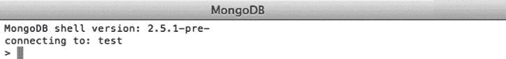
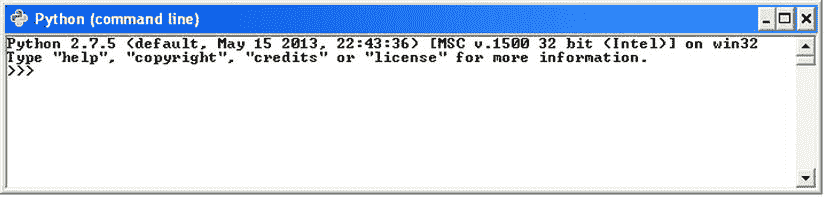

# 二、安装 MongoDB

Abstract

在第 1 章中，您体验了 MongoDB 可以为您做什么。在本章中，您将学习如何安装和扩展 MongoDB 以做更多的事情，使您能够将它与您喜欢的编程语言结合使用。

在第 1 章中，您体验了 MongoDB 能为您做什么。在本章中，您将学习如何安装和扩展 MongoDB 以做更多的事情，使您能够将它与您喜欢的编程语言结合使用。

MongoDB 是一个跨平台的数据库，您可以从 MongoDB 网站( [`www.mongodb.org`](http://www.mongodb.org/) )找到一个重要的可用包列表进行下载。大量的可用版本可能会让你很难决定哪个版本最适合你。对您来说，正确的选择可能取决于您的服务器使用的操作系统、您的服务器中的处理器种类，以及您是喜欢稳定的版本还是喜欢深入了解仍在开发中但提供令人兴奋的新功能的版本。也许您希望安装数据库的一个稳定版本和一个前瞻性版本。也有可能你还不完全确定应该选择哪个版本。无论如何，请继续读下去！

## 选择您的版本

当您查看 MongoDB 网站上的下载部分时，您会看到可供下载的包的一个相当简单的概述。您需要注意的第一件事是您将要运行 MongoDB 软件的操作系统。目前，有预编译的包可用于 Windows、各种版本的 Linux 操作系统、Mac OS 和 Solaris。

Note

这里需要记住的一件重要事情是该产品的 32 位版本和 64 位版本之间的区别。32 位和 64 位版本的数据库目前具有相同的功能，只有一个例外:32 位版本的数据库被限制为每台服务器大约 2GB 的总数据集大小。但是，64 位版本没有这种限制，所以对于生产环境，它通常比 32 位版本更受欢迎。此外，这些版本之间的差异可能会发生变化。

您还需要注意 MongoDB 软件本身的版本:有生产版本、以前的版本和开发版本。生产版本表明这是可用的最新稳定版本。当一个更新的、普遍改进或增强的版本发布时，先前的最新稳定版本将作为先前版本提供。这意味着这个版本是稳定和可靠的，但它通常有较少的可用功能。最后，是开发版。这个版本通常被称为不稳定版本。这个版本仍在开发中，它将包括许多变化，包括重要的新功能。尽管它还没有完全开发和测试，MongoDB 的开发者已经让公众可以测试或试用它。

### 了解版本号

MongoDB 使用“开发版本的奇数版本”方法。换句话说，您可以通过查看版本号的第二部分(也称为发布号)来判断一个版本是开发版还是稳定版。如果第二个数字是偶数，那么它是一个稳定的版本。如果第二个数字是奇数，那么它是一个不稳定的，或发展中的版本。

让我们仔细看看版本号的三个部分 A、B 和 C 中包含的三个数字:

*   a，第一个(或最左边的)数字:代表主要版本，只有在有完整版本升级时才会改变。
*   b，第二个(或中间)数字:代表发布号，表示一个版本是开发版还是稳定版。如果数量为偶数，则版本稳定；如果数量为奇数，则版本不稳定，被视为开发版本。
*   c，第三个(或最右边的)数字:代表修订号；这是用于 bug 和安全问题的。

例如，在撰写本文时，可以从 MongoDB 网站获得以下版本:

*   2.4.3(生产发布)
*   2.2.4(先前版本)
*   2.5.0(开发版本)

## 在您的系统上安装 MongoDB

到目前为止，您已经了解了 MongoDB 的可用版本，并且——希望——能够选择一个。现在您已经准备好仔细研究如何在您的特定系统上安装 MongoDB。目前服务器的两个主要操作系统是基于 Linux 和 Microsoft Windows 的，所以本章将从 Linux 开始向您介绍如何在这两个操作系统上安装 MongoDB。

### 在 Linux 下安装 MongoDB

目前，基于 Unix 的操作系统是托管服务非常流行的选择，包括 web 服务、邮件服务，当然还有数据库服务。在这一章中，我们将带你了解如何让 MongoDB 在一个流行的 Linux 发行版 Ubuntu 上运行。

根据您的需要，您有两种方式在 Ubuntu 下安装 MongoDB:您可以通过所谓的存储库自动安装软件包，也可以手动安装。接下来的两节将向您介绍这两个选项。

#### 通过存储库安装 MongoDB

储存库基本上是装满软件的在线目录。每个软件包都包含关于版本号、先决条件和可能的不兼容性的信息。当您需要安装需要先安装另一个软件的软件包时，此信息非常有用，因为可以同时安装必备软件。

Ubuntu(和其他基于 Debian 的发行版)中的默认库包含 MongoDB，但它们可能是该软件的过时版本。因此，让我们告诉`apt-get`(您用来从存储库中安装软件的软件)查看一个自定义存储库。为此，您需要将下面一行添加到您的存储库列表中(`/etc/apt/sources.list`):

`deb`[`http://downloads-distro.mongodb.org/repo/ubuntu-upstart`](http://downloads-distro.mongodb.org/repo/ubuntu-upstart)T2】

接下来，您需要导入 10gen 的公共 GPG 密钥，用于对包进行签名，确保它们的一致性；您可以通过使用`apt-key`命令来完成:

`$ sudo apt-key adv --keyserver`[`keyserver.ubuntu.com`](http://keyserver.ubuntu.com/)T2】

完成后，您需要告诉 apt-get 它包含新的存储库；您可以使用 apt-get 的`update`命令来实现:

`$ sudo apt-get update`

这一行让 aptitude 知道您手动添加的存储库。这意味着您现在可以告诉 apt-get 自己安装软件。要做到这一点，可以在 shell 中键入以下命令:

`$ sudo apt-get install mongodb-10gen`

这一行安装来自 MongoDB 的当前稳定(生产)版本。如果您希望从 MongoDB 安装任何其他版本，您需要指定版本号。例如，要从 MongoDB 安装当前不稳定的(开发)版本，请键入以下命令:

`$ sudo apt-get install mongodb-10gen=2.5.0`

这就是全部了。至此，MongoDB 已经安装完毕，并且(几乎)可以使用了！

Note

在运行旧版本 MongoDB 的系统上运行`apt-get update`会将软件升级到可用的最新稳定版本。您可以通过运行以下命令来防止这种情况发生:

`echo "mongodb-10gen hold" | sudo dpkg --set-selections`

#### 手动安装 MongoDB

接下来，我们将介绍如何手动安装 MongoDB。考虑到用 aptitude 自动安装 MongoDB 是多么容易，您可能想知道为什么要手动安装该软件。首先，并不是所有的 Linux 发行版都使用 apt-get。当然，他们中的许多人会这样做(主要包括基于 Debian Linux 的那些)，但有些人不会。此外，打包仍然是一项进行中的工作，因此可能会出现这样的情况，即有些版本还不能通过存储库获得。也有可能您想要使用的 MongoDB 版本没有包含在存储库中。手动安装软件还可以让您同时运行多个版本的 MongoDB。

你已经决定使用哪个版本的 MongoDB，你已经从他们的网站 [`http://mongodb.org/downloads`](http://mongodb.org/downloads) 下载到你的主目录。接下来，您需要使用以下命令提取包:

`$ tar xzf mongodb-linux-x86_64-latest.tgz`

该命令将包的全部内容提取到一个名为`mongodb-linux-x86_64-xxxx-yy-zz`的新目录中；该目录位于您的当前目录下。这个目录将包含许多子目录和文件。包含可执行文件的目录称为`bin`目录。我们将很快介绍哪些应用执行哪些任务。

但是，您不需要做任何进一步的工作来安装应用。事实上，手动安装 MongoDB 并不会花费太多时间——根据您需要安装的其他内容，它甚至可能会更快。然而，手动安装 MongoDB 也有一些缺点。例如，默认情况下，您刚刚提取并在`bin`目录中找到的可执行文件不能从除了`bin`目录之外的任何地方执行。因此，如果您想要运行`mongod`服务，您将需要直接从前面提到的`bin`目录中这样做。这个缺点突出了通过存储库安装 MongoDB 的好处之一。

### 在 Windows 下安装 MongoDB

微软的 Windows 也是服务器软件的热门选择，包括基于互联网的服务。

Windows 没有像 apt-get 这样的存储库应用，所以您需要从 MongoDB 网站下载并解压缩该软件来运行它。是的，前面的信息是正确的。您不需要完成任何设置过程；安装软件是一件简单的事情，只需下载软件包、解压缩并运行应用本身。

例如，假设您已经决定为您的 64 位 Windows 2008 服务器下载 MongoDB 的最新稳定版本。首先将包(`mongodb-win32–x86_64-x.y.x.zip`)解压到您的`C:\`驱动器的根目录。此时，您需要做的就是打开一个命令提示符(开始➤运行➤ `cmd` ➤ OK)并浏览到您提取内容的目录:

`> cd C:\mongodb-win32–x86_64-x.y.z\`

`> cd bin\`

这样做会将您带到包含 MongoDB 可执行文件的目录。这就是全部内容:正如我前面提到的，不需要安装。

## 运行 MongoDB

终于，你准备好动手了。您已经了解了从哪里获得最适合您的需求和硬件的 MongoDB 版本，并且还了解了如何安装软件。现在终于到了研究运行和使用 MongoDB 的时候了。

### 先决条件

在启动 MongoDB 服务之前，您需要为 MongoDB 创建一个数据目录来存储它的文件。默认情况下，MongoDB 将数据存储在基于 Unix 的系统(比如 Linux 和 OS X)的`/data/db`目录中，以及 Windows 的`C:\data\db`目录中。

Note

MongoDB 不会为你创建这些数据目录，所以需要你手动创建；否则，MongoDB 将无法运行并抛出错误消息。此外，确保正确设置权限:MongoDB 必须具有读、写和目录创建权限才能正常工作。

如果您希望使用除了`/data/db`或`C:\data\db`之外的目录，那么您可以在执行服务时通过使用`--dbpath`标志来告诉 MongoDB 查看所需的目录。

一旦创建了所需的目录并分配了适当的权限，就可以通过执行 mongod 应用来启动 MongoDB 核心数据库服务。您可以分别从 Windows 和 Linux 中的命令提示符或 shell 中完成此操作。

### 测量安装布局

在成功安装或解压 MongoDB 之后，您将在`bin`目录中获得表 [2-1](#Fig1) 中所示的应用(在 Linux 和 Windows 中)。

表 2-1。

The Included MongoDB Applications

<colgroup><col> <col></colgroup> 
| 应用 | 功能 |
| --- | --- |
| `-- bsondump` | 读取 BSON 格式的回滚文件的内容。 |
| `-- mongo` | 数据库Shell。 |
| `-- mongod` | 核心数据库服务器。 |
| `-- mongodump` | 数据库备份实用程序。 |
| `-- mongoexport` | 导出实用程序(JSON、CSV、TSV)，对于备份不可靠。 |
| `-- mongofiles` | 操作 GridFS 对象中的文件。 |
| `-- mongoimport` | 导入实用程序(JSON、CSV、TSV)，对于恢复不可靠。 |
| `-- mongooplog` | 从另一个`mongod`实例中提取操作日志条目。 |
| `-- mongoperf` | 检查磁盘 I/O 性能。 |
| `--mongorestore` | 数据库备份恢复实用程序。 |
| `--mongos` | Mongodb 分片过程。 |
| `--mongosniff` | 实时嗅探/跟踪 MongoDB 数据库活动，仅限于类 Unix 系统。 |
| `--mongostat` | 返回数据库操作的计数器。 |
| `--mongotop` | 跟踪/报告 MongoDB 读/写活动。 |
| `-- mongorestore` | 恢复/导入实用程序。 |

Note: All applications are within the --bin directory.

安装的软件包括 15 个应用(在 Microsoft Windows 下是 14 个),它们将与您的 MongoDB 数据库一起使用。两个“最重要”的应用是`mongo`和`mongod`应用。`mongo`应用允许您使用数据库Shell；这个 shell 使您能够用 MongoDB 完成几乎任何您想做的事情。

`mongod`应用启动服务或守护程序，也就是所谓的守护程序。在启动 MongoDB 应用时，还可以设置许多标志。例如，该服务让您指定数据库所在的路径(`--dbpath`)，显示版本信息(`--version`，甚至打印一些诊断系统信息(带有`--sysinfo`标志)！启动服务时，您可以通过包含`--help`标志来查看选项的完整列表。现在，您可以使用默认设置，通过在 shell 或命令提示符下键入`mongod`来启动服务。

### 使用 MongoDB Shell

一旦创建了数据库目录并成功启动了 mongod 数据库应用，您就可以启动 shell 并体验 MongoDB 的强大功能了。

启动你的 shell (Unix)或命令提示符(Windows)；当您这样做时，请确保您处于正确的位置，以便可以找到 mongo 可执行文件。您可以通过在命令`prompt`处键入`mongo`并按回车键来启动 shell。你将立即看到一个空白窗口和一个闪烁的光标(见图 [2-1](#Fig1) )。女士们先生们，欢迎来到 MongoDB！

如果您使用默认参数启动 MongoDB 服务，并使用默认设置启动 shell，您将连接到本地主机上运行的默认`test`数据库。这个数据库是在您连接到它时自动创建的。这是 MongoDB 最强大的特性之一:如果你试图连接一个不存在的数据库，MongoDB 会自动为你创建一个。这可能是好的也可能是坏的，取决于你如何处理你的键盘。

Tip

MongoDB 网站上有一个在线演示 shell，您可以在这里试用列出的任何命令。

图 2-1。

The MongoDB shell

在采取任何进一步的步骤之前，比如实现任何使您能够使用您最喜欢的编程语言的额外驱动程序，您可能会发现快速浏览一下 MongoDB shell 中一些更有用的命令是有帮助的(参见表 [2-2](#Tab2) )。

表 2-2。

Basic Commands within the MongoDB Shell

<colgroup><col> <col></colgroup> 
| 命令 | 功能 |
| --- | --- |
| `show dbs` | 显示可用数据库的名称。 |
| `show collections` | 显示当前数据库中的集合。 |
| `show users` | 显示当前数据库中的用户。 |
| `use <db name>` | 将当前数据库设置为`<db name>`。 |

Tip

您可以通过在 MongoDB shell 中键入`help`命令来获得完整的命令列表。

## 安装附加驱动程序

您可能认为既然已经设置了 MongoDB 并知道如何使用它的 shell，就已经准备好面对这个世界了。这部分是对的；但是，在查询或操作 MongoDB 数据库时，您可能希望使用自己喜欢的编程语言，而不是 shell。10gen 提供了多种官方驱动程序，社区中还提供了更多的驱动程序，让您可以准确地做到这一点。例如，可以在 MongoDB 网站上找到以下编程语言的驱动程序:

*   C
*   C++
*   C#
*   占线小时
*   爪哇
*   Java Script 语言
*   Node.js
*   Perl 语言
*   服务器端编程语言（Professional Hypertext Preprocessor 的缩写）
*   计算机编程语言
*   红宝石
*   斯卡拉

在这一节中，您将学习如何实现对目前使用的两种更流行的编程语言的 MongoDB 支持:PHP 和 Python。

Tip

有许多社区驱动的 MongoDB 驱动程序可用。在 MongoDB 网站上可以找到一长串的名单， [`www.mongodb.org`](http://www.mongodb.org/) 。

### 安装 PHP 驱动程序

PHP 是当今最流行的编程语言之一。这种语言专门针对 web 开发，可以很容易地集成到 HTML 中。这个事实使得这种语言成为设计 web 应用的完美候选语言，比如博客、留言簿，甚至是名片数据库。接下来的几节将介绍安装和使用 MongoDB PHP 驱动程序的选项。

#### 为 PHP 获取 MongoDB

和 MongoDB 一样，PHP 也是一个跨平台的开发工具，在 PHP 中设置 MongoDB 所需的步骤根据目标平台的不同而不同。之前，本章向您展示了如何在 Ubuntu 和 Windows 上安装 MongoDB 这里我们将采用相同的方法，演示如何在 Ubuntu 和 Windows 上安装 PHP 驱动程序。

首先为你的操作系统下载 PHP 驱动程序。打开浏览器，导航至 [`www.mongodb.org`](http://www.mongodb.org/) 即可。在撰写本文时，该网站包括一个名为“驱动程序”的单独菜单选项。点击该选项，调出当前可用语言驱动列表(见图 [2-2](#Fig2) )。

接下来，从语言列表中选择 PHP，并按照链接下载最新(稳定)版本的驱动程序。不同的操作系统需要不同的方法来自动安装 PHP 的 MongoDB 扩展。没错；正如您能够在 Ubuntu 上自动安装 MongoDB 一样，您也可以对 PHP 驱动程序进行同样的操作。而且就像在 Ubuntu 下安装 MongoDB 的时候，也可以选择手动安装 PHP 语言驱动。让我们看看你有两个选择。

图 2-2。

A short list of currently available language drivers for MongoDB

#### 在基于 Unix 的平台上自动安装 PHP 驱动程序

PHP 开发者提出了一个很棒的解决方案，允许你用其他流行的扩展来扩展你的 PHP 安装:PECL。PECL 是一个专门为 PHP 设计的库；它提供了一个包含所有已知扩展的目录，可以用来下载、安装甚至开发 PHP 扩展。如果你已经熟悉了名为 aptitude 的包管理系统(你以前用它来安装 MongoDB)，那么你会对 PECL 的界面与 aptitude 中的界面如此相似而感到高兴。

假设您的系统上安装了 PECL，打开一个控制台并输入以下命令来安装 MongoDB 扩展:

`$ sudo pecl install mongo`

输入这个命令会导致 PECL 自动下载并安装 PHP 的 MongoDB 扩展。换句话说，PECL 将下载你的 PHP 版本的扩展，并把它放在 PHP 扩展目录中。只有一个问题:PECL 不会自动将扩展添加到加载的扩展列表中；您需要手动执行此步骤。为此，打开一个文本编辑器(vim、nano 或您喜欢的任何文本编辑器)并修改名为`php.ini`的文件，这是 PHP 用来控制其行为的主要配置文件，包括它应该加载的扩展。

接下来，打开`php.ini`文件，向下滚动到 extensions 部分，添加下面一行来告诉 PHP 加载 MongoDB 驱动程序:

`extension=mongo.so`

Note

前面的步骤是强制性的；如果不这样做，PHP 中的 MongoDB 命令将无法运行。要在您的系统上找到`php.ini`文件，您可以在您的 shell 中使用`grep`命令:`php –i | grep Configuration`。

本章后面的“确认您的 PHP 安装工作正常”一节将介绍如何确认一个扩展已经成功加载。

就这些了，伙计们！您已经为 PHP 安装安装了 MongoDB 扩展，现在可以使用它了。接下来，您将学习如何手动安装驱动程序。

#### 在基于 Unix 的平台上手动安装 PHP 驱动程序

如果您更喜欢自己编译驱动程序，或者由于某种原因无法使用前面描述的 PECL 应用(例如，您的主机提供商可能不支持此选项)，那么您也可以选择下载源驱动程序并手动编译。

要下载驱动程序，请访问 github 网站( [`http://github.com`](http://github.com/) )。这个网站提供了 PHP 驱动程序的最新源码包。下载后，您需要解压缩该包，并通过运行以下命令集来创建驱动程序:

`$ tar zxvf mongodb-mongdb-php-driver-<commit_id>.tar.gz`

`$ cd mongodb-mongodb-php-driver-<commit_id>`

`$ phpize`

`$ ./configure`

`$ sudo make install`

这个过程可能需要一段时间，具体取决于系统的速度。一旦这个过程完成，您的 MongoDB PHP 驱动程序就安装好了，可以使用了！在您执行命令之后，您将看到驱动程序被放置的位置；通常，输出如下所示:

`Installing '/ usr/lib/php/extensions/no-debug-zts-20060613/mongo.so'`

您确实需要确认这个目录是 PHP 默认存储其扩展的同一个目录。您可以使用以下命令来确认 PHP 存储其扩展的位置:

`$ php -i | grep extension_dir`

这一行输出应该放置所有 PHP 扩展的目录。如果这个目录与放置`mongo.so`驱动程序的目录不匹配，那么您必须将`mongo.so`驱动程序移动到正确的目录，这样 PHP 就知道在哪里可以找到它。

和以前一样，您需要告诉 PHP 新创建的扩展已经放在它的扩展目录中，并且它应该加载这个扩展。您可以通过修改`php.ini`文件的扩展名部分来指定这一点；将下面一行添加到该部分:

`extension=mongo.so`

最后，需要重新启动您的 web 服务。当使用 Apache HTTPd 服务时，您可以使用以下服务命令来完成此操作:

`sudo /etc/init.d/apache2 restart`

就这样！这个过程比使用 PECL 的自动化方法稍长一些；但是，如果您无法使用 PECL，或者如果您是一名驱动程序开发者，并且对错误修复感兴趣，那么您可能希望使用手动方法。

#### 在 Windows 上安装 PHP 驱动程序

您之前已经了解了如何在 Windows 操作系统上安装 MongoDB。现在让我们看看如何在 Windows 上实现 PHP 的 MongoDB 驱动程序。

对于 Windows，MongoDB 的 PHP 驱动程序的每个版本都有预编译的二进制文件。你可以从前面提到的 github 网站( [`http://github.com`](http://github.com/) )获得这些二进制文件。这种情况下最大的挑战是为您的 PHP 版本选择正确的安装包(有各种各样的包可供选择)。如果您不确定您需要哪个包版本，您可以在 PHP 页面中使用`<? phpinfo(); ?>`命令来确切地了解哪个适合您的特定环境。在下一节中，我们将仔细看看`phpinfo()`命令。

下载正确的包并提取其内容后，你需要做的就是将驱动文件(名为`php_mongo.dll`)复制到你的 PHP 的扩展目录下；这使得 PHP 能够获得它。

根据您的 PHP 版本，扩展目录可能被称为`Ext`或`Extensions`。如果您不确定应该是哪个目录，您可以查看系统上安装的 PHP 版本附带的 PHP 文档。

一旦将驱动程序 DLL 放入 PHP 扩展目录，您仍然需要告诉 PHP 加载驱动程序。通过修改`php.ini`文件并在扩展部分添加以下行来实现这一点:

`extension=php_mongo.dll`

完成后，重启系统上的 HTTP 服务，现在就可以在 PHP 中使用 MongoDB 驱动程序了。然而，在开始将 MongoDB 的魔力用于 PHP 之前，您需要确认扩展被正确加载。

### 确认您的 PHP 安装工作正常

到目前为止，您已经成功地在 PHP 中安装了 MongoDB 和 MongoDB 驱动程序。现在是时候做一个快速检查来确认驱动程序是否被 PHP 正确加载了。PHP 为您提供了一个简单明了的方法来完成这个任务:`phpinfo()`命令。这个命令显示了所有加载的模块的扩展概述，包括版本号、编译选项、服务器信息、操作系统信息等等。

要使用`phpinfo()`命令，打开一个文本或 HTML 编辑器并键入以下内容:

`<? phpinfo(); ?>`

接下来，将文档保存在 web 服务器的`www`目录中，并随意命名。例如，你可以称它为`test.php`或`phpinfo.php`。现在打开浏览器，转到您的本地主机或外部服务器(也就是说，转到您正在使用的任何服务器)，查看您刚刚创建的页面。您将看到所有 PHP 组件和各种其他相关信息的概述。这里需要关注的是显示 MongoDB 信息的部分。该部分将列出版本号、端口号、主机名等(见图 [2-3](#Fig3) )。

一旦您确认安装成功并且驱动程序加载成功，您就可以编写一些 PHP 代码并浏览一个利用 PHP 的 MongoDB 示例了。

图 2-3。

Displaying your MongoDB information in PHP

#### 连接和断开 PHP 驱动程序

您已经确认 MongoDB PHP 驱动程序已经正确加载，所以是时候开始编写一些 PHP 代码了！让我们来看看使用 MongoDB 的两个简单而基本的选项:启动 MongoDB 和 PHP 之间的连接，然后切断该连接。

您使用`Mongo`类来启动 MongoDB 和 PHP 之间的连接；这个类还允许您使用数据库服务器命令。一个简单而典型的连接命令如下所示:

`$connection = new Mongo();`

如果使用这个命令而不提供任何参数，它将连接到本地主机上默认 MongoDB 端口(27017)上的 MongoDB 服务。如果您的 MongoDB 服务正在其他地方运行，那么您只需指定想要连接的远程主机的主机名:

`$connection = new Mongo("`[`example.com`](http://example.com/)T2】

这一行为您的 MongoDB 服务实例化了一个新的连接，该服务运行在服务器上并监听`example.com`域名(注意，它仍将连接到默认端口:27017)。但是，如果您想要连接到不同的端口号(例如，如果您不想使用默认端口，或者您已经在该端口上运行了另一个 MongoDB 服务会话)，您可以通过指定端口号和主机名来实现:

`$connection = new Mongo("`[`example.com:12345`](http://example.com:12345/)T2】

此示例创建了一个到数据库服务的连接。接下来，您将学习如何断开与服务的连接。假设您使用刚才描述的方法连接到数据库，您可以再次调用`$connection`来传递`close()`命令以终止连接，如下例所示:

`$connection->close();`

除非在特殊情况下，否则不需要结束。原因是一旦`Mongo`对象超出范围，PHP 驱动程序就会关闭与数据库的连接。尽管如此，建议您在 PHP 代码的末尾调用`close()`;这有助于您避免让旧连接徘徊不前，直到它们最终超时。它还可以帮助您确保任何现有的连接都已关闭，从而允许新的连接发生，如下例所示:

`$connection = new Mongo();`

`$connection->close();`

`$connection->connect();`

下面的代码片段显示了它在 PHP 中的样子:

`<?php`

`// Establish the database connection`

`$connection = new Mongo()`

`// Close the database connection`

`$connection->close();`

`?>`

### 安装 Python 驱动程序

Python 是一种通用且易读的编程语言。

这些品质使 Python 成为您初学编程和脚本时的一种好的入门语言。如果您熟悉编程，并且您正在寻找一种允许多种编程风格(面向对象编程、结构化编程等)的多范式编程语言，那么它也是一种很好的语言。在接下来的小节中，您将学习如何安装 Python 并启用对该语言的 MongoDB 支持。

#### 在 Linux 下安装 PyMongo

Python 为 MongoDB 支持提供了一个名为 PyMongo 的特定包。这个包允许您与 MongoDB 数据库进行交互，但是在使用这个强大的组合之前，您需要启动并运行这个驱动程序。与安装 PHP 驱动程序一样，有两种方法可以用来安装 PyMongo:一种是依赖 setuptools 的自动化方法，另一种是下载项目源代码的手动方法。下面几节将向您展示如何使用这两种方法安装 PyMongo。

##### 自动安装 PyMongo

与`python-pip`包捆绑在一起的`pip`应用允许您自动下载、构建、安装和管理 Python 包。这非常方便，使您能够扩展 Python 模块的安装，即使它为您做了所有的工作。

Note

您必须安装 setuptools 才能使用`pip`应用。这将在安装 python-pip 包时自动完成。

要安装`pip`，你需要做的就是告诉`apt-get`下载并安装它，就像这样:

`$ sudo apt-get install python-pip`

当这一行执行时，`pip`将检测当前运行的 Python 版本，并将其自身安装到系统上。这就是全部了。现在您已经准备好使用`pip`命令来下载、制作和安装 MongoDB 模块，如下例所示:

`$ sudo pip install pymongo`

再说一遍，这就是全部了！PyMongo 现在已经安装完毕，可以使用了。

Tip

您也可以使用`pip install pymongo=` `x.y.z`命令用 pip 安装 PyMongo 模块的以前版本。这里，`x.y.z`表示模块的版本。

##### 手动安装 PyMongo

也可以选择手动安装 PyMongo。首先转到托管 PyMongo 插件的站点的下载部分( [`http://pypi.python.org/pypi/pymongo`](http://pypi.python.org/pypi/pymongo) )。接下来，下载 tarball 并提取它。在您的控制台中，典型的下载和提取过程可能如下所示:

`$ wget`[`http://pypi.python.org/packages/source/p/pymongo/pymongo-2.5.1.tar.gz`T3】](http://pypi.python.org/packages/source/p/pymongo/pymongo-2.5.1.tar.gz)

`$ tar xzf pymongo-2.5.1.tar.gz`

一旦您成功下载并提取了这个文件，就可以进入提取的内容目录，并通过使用 Python 运行`install.py`命令来调用 PyMongo 的安装:

`$ cd pymongo-2.5.1`

`$ sudo python setup.py install`

前面的代码片段输出了 PyMongo 模块的整个创建和安装过程。最终，这个过程会将您带回到提示符处，这时您就可以开始使用 PyMongo 了。

#### 在 Windows 下安装 PyMongo

在 Windows 下安装 PyMongo 是一个简单的过程。和在 Linux 下安装 PyMongo 一样，Easy Install 也可以简化在 Windows 下安装 PyMongo。如果你还没有安装 setuptools(这个包包括`easy_install`命令)，那么去 Python 包索引网站( [`http://pypi.python.org`](http://pypi.python.org/) )定位 setuptools 安装程序。

Caution

您下载的 setuptools 版本必须与您系统上安装的 Python 版本相匹配。

例如，假设您的系统上安装了 Python 版本 2.7.5。您将需要下载 2.7.x 版的 setuptools 包，好消息是您不需要编译这些；相反，您可以简单地下载适当的软件包，然后双击可执行文件在您的系统上安装 setuptools！就这么简单。

Caution

如果您之前已经安装了旧版本的 setuptools，那么在安装新版本之前，您需要使用系统的“添加/删除程序”功能卸载该版本。

一旦安装完成，您将在 Python 的脚本子目录中找到`easy_install.exe`文件。至此，您已经准备好在 Windows 上安装 PyMongo 了。

一旦你成功安装了 setuptools，你就可以打开一个命令提示符并进入 Python 的脚本目录。默认设置为`C:\Python` `xy` `\Scripts\`，其中 xy 代表您的版本号。导航到此位置后，您可以使用前面显示的相同语法来安装 Unix 变体:

`C:\Python27\Scripts> easy_install PyMongo`

与在 Linux 机器上安装该程序时得到的输出不同，这里的输出相当简短，仅表示已经下载并安装了扩展(参见图 [2-4](#Fig4) )。也就是说，在这种情况下，这些信息足以满足您的目的。

图 2-4。

Installing PyMongo under Windows

### 确认您的 PyMongo 安装可以工作

要确认 PyMongo 安装是否成功完成，可以打开 Python shell。在 Linux 中，你可以通过打开一个控制台并输入`python`来实现。在 Windows 中，您可以通过单击开始➤程序➤ Python xy ➤ Python(命令行)来完成此操作。此时，你将被欢迎进入 Python 的世界(见图 [2-5](#Fig5) )。

图 2-5。

The Python shell

您可以使用`import`命令告诉 Python 开始使用新安装的扩展:

`>>> import pymongo`

`>>>`

Note

每次想要使用 PyMongo 时，都必须使用`import pymongo`命令。

如果一切顺利，您将什么也看不到，并且可以开始使用一些奇特的 MongoDB 命令。但是，如果您收到一条错误消息，那么一定是出错了，您可能需要回顾刚刚采取的步骤，以发现错误发生在哪里。

## 摘要

在本章中，我们研究了如何获得 MongoDB 软件，包括如何为您的环境选择正确的版本。我们还讨论了版本号、如何安装和运行 MongoDB，以及如何安装和运行它的先决条件。接下来，我们讲述了如何通过 shell、PHP 和 Python 的组合建立到数据库的连接。

我们还探讨了如何扩展 MongoDB，以便它可以与您喜欢的编程语言一起工作，以及如何确认特定于语言的驱动程序是否已经正确安装。

在下一章中，我们将探讨如何正确地设计和构造 MongoDB 数据库和数据。在这个过程中，您将学习如何索引信息以加快查询速度，如何引用数据，以及如何利用一个称为地理空间索引的奇特新功能。