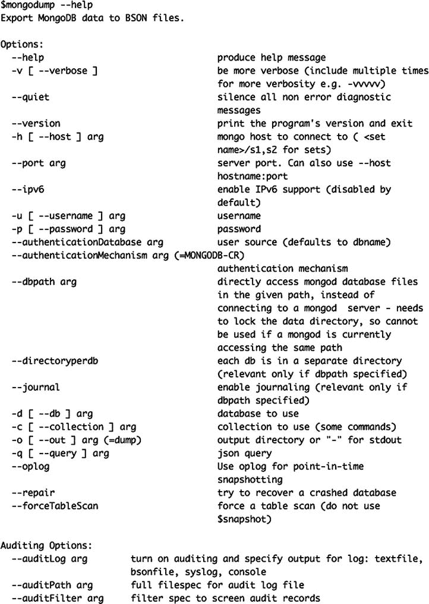
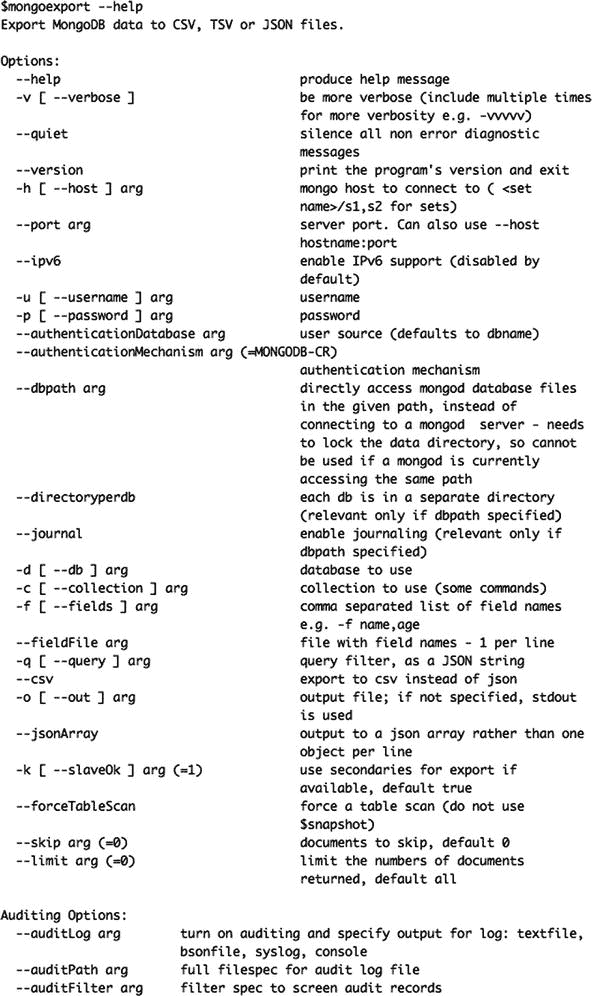
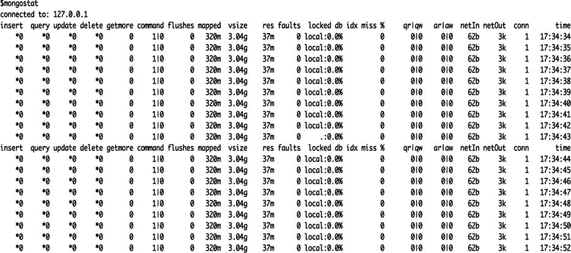
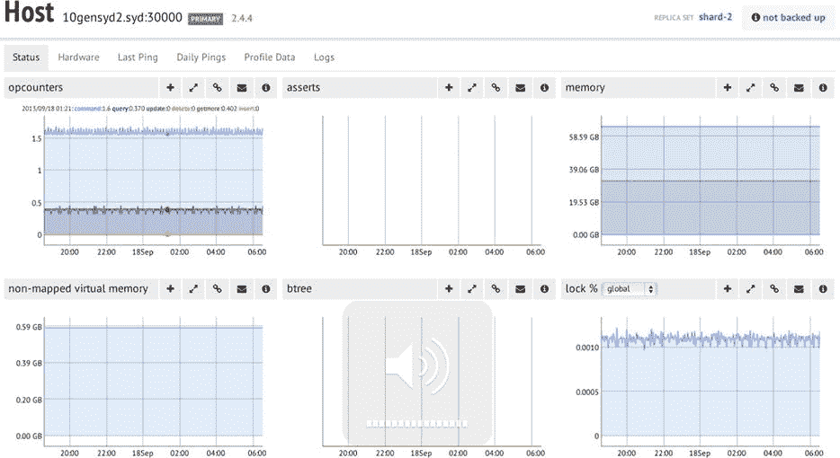

# 九、数据库管理

Abstract

在本章中，我们将带您了解一些可以在 MongoDB 服务器上执行的基本管理操作。我们还将展示如何自动化其中的一些活动，比如备份您的服务器。

在本章中，我们将带您了解一些可以在 MongoDB 服务器上执行的基本管理操作。我们还将展示如何自动化其中的一些活动，比如备份您的服务器。

因为 MongoDB 是一个非关系数据库系统，所以不需要数据库管理员执行的许多更传统的功能。例如，没有必要在服务器上创建新的数据库、集合或字段，因为 MongoDB 会在您访问它们时动态创建这些元素。因此，在绝大多数情况下，您不需要管理数据库和模式。

然而，这种不必预定义一切的自由可能会导致无意中创建元素，比如文档中无关的集合和字段。管理员和开发者偶尔需要从数据库中清除未使用的数据元素，尤其是在项目的开发阶段，此时变化通常很快。在最终确定解决方案和清理数据库之前，他们可能必须尝试许多方法。MongoDB 的易用性鼓励了这种探索性的开发模式；但是，这也可能导致数据存储中的混乱，因为创建数据结构所需的工作量几乎为零。

造成这种混乱的一个因素，也是 MongoDB 和 SQL 数据库之间的一个更重要的区别，是 MongoDB 中的所有对象和元素名称在所有平台上都是区分大小写的。因此，`foo`和`Foo`集合名称指的是两个完全不同的集合。因此，您需要小心使用数据库和集合命名，以避免意外创建多个仅在名称大小写上不同的数据库。(然而，从 MongoDB 2.4 开始，有一个例外:您不能再创建名称只有大小写不同的数据库，因为这样做会产生错误。)

这些数据库的不同版本将会填满您的磁盘，并且由于允许开发者和系统的最终用户连接到不完整的或非预期的数据集，它们可能会给开发者和系统的最终用户带来许多困惑。

在本章中，您将学习如何执行以下所有任务:

*   备份并恢复您的 MongoDB 系统。
*   使用提供的`MongoDB` shell(通过`mongo`命令调用)执行常见任务。
*   通过身份验证控制对服务器的访问。
*   监控您的数据库实例。

然而，在深入研究这些任务之前，我们先来看看用来执行其中许多任务的工具。

## 使用管理工具

管理员需要适合于执行保持服务器平稳运行的日常任务的工具。MongoDB 包中有一些非常好的工具，以及一个不断发展的有用的第三方工具集合。以下部分涵盖了一些最重要的可用工具，以及如何使用它们。

### 蒙戈，蒙戈布控制台

作为管理员，您将使用的主要工具是`mongo`，MongoDB 控制台工具。`mongo`是一个基于 JavaScript 的命令行控制台实用程序。它类似于主流关系数据库提供的许多查询工具。然而，`mongo`有一个独特的锦囊妙计:它可以运行用 JavaScript 编写的程序，直接与 MongoDB 数据库交互。

这个控制台允许您用 JavaScript 编写与 MongoDB 的所有交互，然后将这些脚本存储在`.js`文件中，在需要时运行。事实上，`mongo`控制台中的许多内置命令本身就是用 JavaScript 编写的。

您可以将任何要在命令 shell 中输入的命令放入一个扩展名为`.js`的文件中，并在启动 shell 或在 shell 中使用`load()`函数时，通过简单地将文件名添加到命令行中来运行它们。shell 将执行文件的内容，然后退出。这对于运行重复命令列表很有用。

在本章中，我们将使用`mongo`控制台来演示您可以在 MongoDB 服务器上执行的许多管理任务，因为它是随 MongoDB 服务器一起分发的，所以我们可以保证它会在那里。

### 使用第三方管理工具

MongoDB 提供了几个第三方管理工具。MongoDB，Inc .在 MongoDB 网站上维护了一个页面，其中列出了当前可用的第三方工具。你可以在 [`http://docs.mongodb.org/ecosystem/tools/administration-interfaces/`](http://docs.mongodb.org/ecosystem/tools/administration-interfaces/) 找到这个名单。

这些工具中有许多是基于 web 的，原则上类似于 phpMyAdmin for MySQL，但有些也是成熟的桌面 ui。

## 备份 MongoDB 服务器

新的 MongoDB 管理员应该学习的第一个技能是如何备份和恢复 MongoDB 服务器。用这些知识武装自己会让你在探索一些更高级的管理功能时感觉更舒服，因为你知道你的宝贵数据被安全地存储在某个地方。

### 创建备份 101

让我们从执行一个简单的备份开始，然后恢复它。在这个过程中，您将确保备份完好无损，并且您将看到一些说明备份和恢复功能如何工作的实际例子。一旦您对如何使用这些特性有了坚实的理解，您将能够继续探索 MongoDB 更高级的管理特性。

在这个简单的备份示例中，我们假设如下:

*   您的 MongoDB 服务器运行在您当前登录的同一台机器上。
*   您有足够的磁盘空间来存放转储文件，这些文件的大小最多与您的数据库相同。
*   您的备份将在您的主目录中进行。这意味着您不必处理任何与权限相关的问题。

MongoDB 备份实用程序名为`mongodump`；该实用程序作为标准发行版的一部分提供。以下示例将正在运行的 MongoDB 服务器简单备份到指定的磁盘目录:

`$> cd ∼`

`$> mkdir testmongobackup`

`$> cd testmongobackup`

`$> mongodump`

当`mongodump`运行时，您应该看到它输出如下所示的内容:

`$ mongodump`

`connected to: 127.0.0.1`

`Tue May 21 20:52:58.639 all dbs`

`Tue May 21 20:52:58.640 DATABASE: blog to dump/blog`

`Tue May 21 20:52:58.640 blog.system.indexes to dump/blog/system.indexes.bson`

`Tue May 21 20:52:58.641 4 objects`

`Tue May 21 20:52:58.641 blog.system.profile to dump/blog/system.profile.bson`

`Tue May 21 20:52:58.645 3688 objects`

`Tue May 21 20:52:58.645 Metadata for blog.system.profile to dump/blog/system.profile.metadata.json`

`Tue May 21 20:52:58.645 blog.authors to dump/blog/authors.bson`

`Tue May 21 20:52:58.646 1 objects`

`Tue May 21 20:52:58.646 Metadata for blog.authors to dump/blog/authors.metadata.json`

`Tue May 21 20:52:58.646 blog.posts to dump/blog/posts.bson`

`Tue May 21 20:52:58.686 29997 objects`

`Tue May 21 20:52:58.709 Metadata for blog.posts to dump/blog/posts.metadata.json`

`Tue May 21 20:52:58.710 blog.tagcloud to dump/blog/tagcloud.bson`

`Tue May 21 20:52:58.710 1 objects`

`Tue May 21 20:52:58.710 Metadata for blog.tagcloud to dump/blog/tagcloud.metadata.json`

如果您的输出看起来与此不太相似，那么您应该仔细检查您的环境是否与前面陈述的假设相匹配。

如果您确实看到了正确的输出，那么您的数据库已经备份到了`testmongobackup/dump`目录。以下代码片段将数据库还原到执行备份时的状态:

`$> cd ∼/testmongobackup`

`$> mongorestore --drop`

`connected to: 127.0.0.1`

`Tue May 21 20:53:46.337 dump/blog/authors.bson`

`Tue May 21 20:53:46.337 going into namespace [blog.authors]`

`Tue May 21 20:53:46.337 dropping`

`1 objects found`

`Tue May 21 20:53:46.338 Creating index: { key: { _id: 1 }, ns: "blog.authors", name: "_id_" }`

`Tue May 21 20:53:46.339 dump/blog/posts.bson`

`Tue May 21 20:53:46.339 going into namespace [blog.posts]`

`Tue May 21 20:53:46.339 dropping`

`29997 objects found`

`Tue May 21 20:53:47.284 Creating index: { key: { _id: 1 }, ns: "blog.posts", name: "_id_" }`

`Tue May 21 20:53:47.375 Creating index: { key: { Tags: 1 }, ns: "blog.posts", name: "Tags_1" }`

`Tue May 21 20:53:47.804 dump/blog/system.profile.bson`

`Tue May 21 20:53:47.804 skipping`

`Tue May 21 20:53:47.804 dump/blog/tagcloud.bson`

`Tue May 21 20:53:47.804 going into namespace [blog.tagcloud]`

`Tue May 21 20:53:47.804 dropping`

`1 objects found`

`Tue May 21 20:53:47.821 Creating index: { key: { _id: 1 }, ns: "blog.tagcloud", name: "_id_" }`

`--drop`选项告诉`mongorestore`实用程序在恢复之前丢弃数据库中的每个集合。因此，备份的数据会替换数据库中当前的数据。如果您选择不使用`--drop`选项，恢复的数据将被附加到每个集合的末尾，这将导致重复的项目。

让我们更仔细地检查一下这个例子中发生了什么。

默认情况下，`mongodump`实用程序使用默认端口连接到本地数据库，提取与每个数据库和集合相关的所有数据，并将它们存储在预定义的文件夹结构中。

由`mongodump`创建的默认文件夹结构采用以下形式:

`./dump/[databasename]/[collectionname].bson`

示例中使用的数据库系统由一个名为`blog`的数据库组成。`blog`数据库包含三个集合:`authors`、`posts`和`tagcloud`。

`mongodump`将从数据库服务器获取的数据保存在`.bson`文件中，这些文件是 MongoDB 内部用来存储文档的内部 BSON 格式的副本。在前面的示例中，您还可以看到正在还原的每个集合的索引。MongoDB 服务器维护索引，它记录每个集合的索引定义，这些定义存储在`metadata.json`文件中。正是这些元数据文件允许您在从备份恢复时重建索引。

转储数据库后，您可以将文件夹存档并存储在任何在线或离线媒体上，如 CD、USB 驱动器、磁带或 S3 格式。

Note

在将备份文件写入目录之前，`mongodump`实用程序不会清空`output`目录的内容。如果您在此目录中有现有内容，它们不会被删除，除非它们与`mongodump`被指示备份的文件(`collectionname` `.bson`)的名称相匹配。如果您希望将多个集合转储添加到同一个转储目录，这很好；但是，如果每次备份数据时都使用同一个转储目录，但不清除它，这可能会导致问题。例如，假设您有一个定期备份的数据库，并且在某个时候您决定从该数据库中删除一个集合。除非您清除正在执行备份的目录，或者手动删除与已删除的集合相关联的文件，否则下次还原数据时，已删除的集合将会重新出现。除非您想在备份中覆盖数据，否则您应该确保在使用`mongodump`之前清空目标目录。

### 备份单个数据库

当您在同一台服务器上运行多个应用时，您通常会发现自己想要单独备份每个数据库，而不是像前面的示例那样一次备份所有数据库。

使用`mongodump`，您可以通过在命令行中添加`-d` `database_name`选项来实现这一点。这导致`mongodump`创建`./dump`文件夹；但是，该文件夹将只包含单个数据库的备份文件。

### 备份单个集合

假设您有一个博客站点，其中的`authors`集合的内容变化不大。相反，博客站点快速变化的内容包含在`posts`和`tagcloud`集合中。您可能一天只备份一次整个数据库，但希望每小时备份一次这两个集合。幸运的是，使用 mongodump，您可以通过使用`-c`选项来指定您希望备份的集合，从而轻松地做到这一点。

`mongodump`实用程序不会清除其目标目录。这意味着，对于您想要备份的每个集合，您可以连续调用`mongodump`来将一个给定的集合添加到您的备份中，如下例所示:

`$mkdir ∼/backuptemp`

`$cd ∼/backuptemp`

`$mongodump -d blog -c posts`

`$mongodump -d blog -c tagcloud`

`...`

`archive the dump folder ∼/backuptemp away as a tar file`

`...`

`$ cd ∼`

`$ rm -rf backuptemp`

## 深入了解备份

至此，您已经知道如何执行备份和随后恢复数据的基本任务。现在，您已经准备好查看一些强大的选项，这些选项允许您定制 MongoDB 的备份和恢复功能，以满足您的特定需求。

`mongodump`实用程序包括图 [9-1](#Fig1) 中所示的选项，通过在 MongoDB 2.5.3 中运行`help`来捕获。

图 9-1。

The mongodump utility help display showing its options

此处列出的大多数选项都是不言自明的，但以下选项除外:

*   `--dbpath` `arg`:如果您有大量的数据需要备份，并且您不关心索引的备份，那么最好通过将 MongoDB 服务器使用的数据文件直接复制到备份介质来备份数据库。该选项允许您直接从服务器的数据文件进行备份，但它只能在服务器脱机或被写保护的情况下使用(有关详细信息，请参阅本章后面的“备份大型数据库”一节)。
*   `--directoryperdb`:将这个命令行选项与`--dbpath`选项结合使用，指定正在备份的 MongoDB 服务器被配置为将其每个数据库的数据文件放在一个单独的目录中。默认情况下，MongoDB 将其所有数据文件放在一个目录中。仅当您已将服务器配置为在此模式下运行时，才应使用此选项。
*   - `o [ --out ]` `arg`:使用该选项可以指定数据库转储的存放目录。默认情况下，`mongodump`实用程序在当前目录下创建一个名为`/dump`的文件夹，并将转储文件写入其中。您可以使用`-o/--out`选项来选择放置输出转储的替代路径。
*   `--authenticationDatabase` `arg`:指定保存用户凭证的数据库。`Mongodump`将默认使用没有该选项的`–db`指定的数据库。
*   `--authenticationMechanism` `arg`:默认为 MongoDB 的挑战/响应(用户名/密码)机制。这个命令用于切换到 MongoDB Enterprise edition 的 Kerberos 身份验证。

## 还原单个数据库或集合

您已经看到了`mongodump`实用程序如何备份单个数据库或集合；`mongorestore`实用程序具有同样的灵活性。如果从中恢复的转储目录中有所需集合或数据库的备份文件，您可以使用`mongorestore`来恢复项目；您不需要恢复备份中存在的所有项目。如果您愿意，可以单独还原它们。

让我们从查看`mongorestore`中可用的选项开始，如图 [9-2](#Fig2) 所示。

图 9-2。

The mongorestore help display showing its options

你可能从对`mongodump`的讨论中认识到这些选项中的大部分；但是，以下两个选项值得特别一提:

*   `--drop`:该选项指示`mongorestore`在恢复之前删除现有集合。这有助于确保没有重复。如果不使用此选项，还原的数据将被追加(插入)到目标集合中。
*   `--noobjcheck`:该选项指示`mongorestore`在将对象插入到`destination`集合之前忽略验证对象的步骤。

### 还原单个数据库

您可以使用`mongorestore`实用程序的`-d`选项来恢复单个数据库。和以前一样，如果数据库已经存在于您的 MongoDB 服务器中，不要忘记使用`--drop`选项:

`$cd ∼/testmongobackup`

`$mongorestore -d blog --drop`

### 还原单个集合

使用类似的语法将单个集合还原到数据库；不同之处在于，您还可以使用`-c`选项指定集合名称，如下例所示:

`$cd ∼/testmongobackup`

`$mongorestore -d blog -c posts --drop`

## 自动化备份

对于小型安装或开发者设置，运行`mongodump`实用程序并保存结果的简单操作是执行临时备份的一种非常合适的方法。例如，Mac OS X 工作站上的常见做法是让 Time Machine(Mac 备份实用程序)存储备份。

对于任何类型的生产设置，您都希望自动备份服务器；如果您遇到任何问题，定期备份可以帮助您避免麻烦或从麻烦中恢复。这不仅适用于您的安装(例如，如果您有损坏的数据库)，而且适用于您的用户无意中损坏或破坏数据的情况。

让我们来看一些简单的脚本，您可以使用它们来自动化您的备份。

### 使用本地数据存储

如果您的系统连接了大型备份驱动器，或者您可以通过 NFS 或 SMB 挂载外部文件系统，那么一个在指定目录中创建归档文件的简单备份脚本就足够了。以下备份脚本易于设置；只需编辑脚本顶部的变量，以匹配本地系统的变量:

`#!/bin/bash`

`##########################################`

`# Edit these to define source and destinations`

`MONGO_DBS=""`

`BACKUP_TMP=∼/tmp`

`BACKUP_DEST=∼/backups`

`MONGODUMP_BIN=/usr/bin/mongodump`

`TAR_BIN=/usr/bin/tar`

`##########################################`

`BACKUPFILE_DATE=`date +%Y%m%d-%H%M``

`# _do_store_archive <Database> <Dump_dir> <Dest_Dir> <Dest_file>`

`function _do_store_archive {`

`mkdir -p $3`

`cd $2`

`tar -cvzf $3/$4 dump`

`}`

`# _do_backup <Database name>`

`function _do_backup {`

`UNIQ_DIR="$BACKUP_TMP/$1"`date "+%s"``

`mkdir -p $UNIQ_DIR/dump`

`echo "dumping Mongo Database $1"`

`if [ "all" = "$1" ]; then`

`$MONGODUMP_BIN -o $UNIQ_DIR/dump`

`else`

`$MONGODUMP_BIN -d $1 -o $UNIQ_DIR/dump`

`fi`

`KEY="database-$BACKUPFILE_DATE.tgz"`

`echo "Archiving Mongo database to $BACKUP_DEST/$1/$KEY"`

`DEST_DIR=$BACKUP_DEST/$1`

`_do_store_archive $1 $UNIQ_DIR $DEST_DIR $KEY`

`rm -rf $UNIQ_DIR`

`}`

`# check to see if individual databases have been specified, otherwise backup the whole server`

`# to "all"`

`if [ "" = "$MONGO_DBS" ]; then`

`MONGO_DB="all"`

`_do_backup $MONGO_DB`

`else`

`for MONGO_DB in $MONGO_DBS; do`

`_do_backup $MONGO_DB`

`done`

`fi`

表 [9-1](#Tab1) 列出了您必须更改的变量，以使这个简单的备份脚本适用于您的系统。

表 9-1。

The Variables Used in the Local Datastore Backup Script

<colgroup><col> <col></colgroup> 
| 可变的 | 描述 |
| --- | --- |
| `MONGO_DBS` | 将此变量留空("")可备份本地服务器上的所有数据库。或者您可以将数据库列表放入其中，以备份选定的数据库(`"db1 db2 db3"`)。 |
| `BACKUP_TMP` | 将此变量设置为适合保存备份转储文件的临时目录。创建归档文件后，该目录中使用的临时数据将被删除。请务必选择一个与使用您的脚本相关的合适目录。例如，如果您使用脚本在本地帐户中创建备份，请使用`∼/tmp`；如果您将它用作在系统帐户下运行的系统 cronjob，请使用`/tmp`。在 Amazon EC2 实例上，您可能应该使用`/mnt/tmp`，这样文件夹就不会创建在系统根分区上，这个分区非常小。 |
| `BACKUP_DEST` | 此变量保存备份的目标文件夹，并将在此文件夹下创建单独的文件夹。同样，将该目录放在与您使用备份脚本的方式相关的位置。 |
| `MONGODUMP_BIN` | 因为您的备份脚本可能在没有设置完整路径集的帐户下运行，所以使用该变量指定该二进制文件的完整路径是明智的。您可以通过在终端窗口中键入`which mongodump`来确定系统上的适当路径。 |
| `TAR_BIN` | 使用这个变量来设置 tar 二进制文件的完整路径；在终端窗口中使用`which tar`来确定该路径。 |

您现在可以使用此脚本来备份您的数据库；这样做将在指定的`BACKUP_DEST directory`创建一组归档备份。创建的文件遵循以下命名格式:

`Database Name``/``database-YYYYMMDD-HHMM`T3】

例如，以下代码片段显示了本章测试数据库的备份名称:

`Backups:$ tree`

`.`

`|-- blog`

`| |-- database-20100611-1144.tgz`

`| `-- database-20100611-1145.tgz`

``-- all`

`|-- database-20100611-1210.tgz`

`|-- database-20100611-1221.tgz`

`|-- database-20100611-1222.tgz`

`|-- database-20100611-1224.tgz`

``-- database-20100611-1233.tgz`

当然，你还需要安装脚本。如果您想每天运行这个脚本，只需将它放入`/etc/cron.daily`并重启`cron`服务以激活它。这种方法适用于大多数 Linux 发行版，比如 Ubuntu、Fedora、CentOS 和 RedHat。如果您想要不太频繁的备份，只需将脚本移动到`/etc/cron.weekly`或`/etc/cron.monthly`。对于更频繁的备份，您可以使用`/etc/cron.hourly`。

### 使用远程(基于云的)数据存储

上一节描述的脚本有一个创建和存储归档文件的独立函数。这使得修改脚本变得相对容易，以便它使用外部数据存储来存储备份归档。表 [9-2](#Tab2) 提供了几个例子，但是更多的其他机制也是可能的。

表 9-2。

Remote (Cloud-Based) Backup Storage Options

<colgroup><col> <col></colgroup> 
| 方法 | 描述 |
| --- | --- |
| rsync/ftp/tftp 或 scp 到另一台服务器 | 您可以使用 rsync 将归档文件移动到备份存储机器上。 |
| s3 存储 | 如果你在 EC2 上运行你的系统，S3 存储是一个放置备份的好地方，因为存储成本很低，而且亚马逊会制作冗余副本。 |

我们将检查存储备份的 S3 方法；然而，同样的原则适用于任何其他机制。

这个例子使用了 [`http://s3tools.org`](http://s3tools.org/) 中的`s3cmd`实用程序(用 python 编写)。在 Ubuntu 上，你可以使用`sudo apt-get install s3cmd`命令安装这个脚本；在 Mac OSX 上，这个脚本可以从`MacPorts`集合中获得。在 Fedora、CentOS、RedHat 上，可以从 [`http://s3tools.org`](http://s3tools.org/) 获取`yum`包，然后使用`yum`安装。

一旦你安装了这个包，运行`s3cmd –configure`来设置你的亚马逊 S3 凭证。注意，你只需要提供两个键:`AWS_ACCESS_KEY`和`AWS_SECRET_ACCESS_KEY`。`s3cmd`实用程序将创建一个配置文件，该文件包含您需要的信息:`∼/.s3cfg`。

以下是您需要对备份脚本进行的更改，以便与 S3 一起使用:

`# _do_store_archive <Database> <Dump_dir> <Dest_Dir> <Dest_file>`

`BACKUP_S3_CONFIG=∼/.s3cfg`

`BACKUP_S3_BUCKET=somecompany.somebucket`

`S3CMD_BIN=/usr/bin/s3cmd`

`function _do_store_archive {`

`UNIQ_FILE="aws"`date "+%s"``

`cd $2`

`tar -cvzf $BACKUP_TMP/$UNIQ_FILE dump`

`$S3CMD_BIN --config $BACKUP_S3_CONFIG put $BACKUP_TMP/$UNIQ_FILE \`

`s3://$BACKUP_S3_BUCKET/$1/$4`

`rm -f $BACKUP_TMP/$UNIQ_FILE`

`}`

表 [9-3](#Tab3) 列出了您需要配置的一些变量，以使这个改编的脚本工作。

表 9-3。

Configuring the Variables of Your Adapted Backup Script

<colgroup><col> <col></colgroup> 
| 可变的 | 描述 |
| --- | --- |
| `BACKUP_S3_CONFIG` | 运行`s3cmd –configure`以保存您的 S3 帐户详细信息时创建的`s3cmd`配置文件的路径。 |
| `BACKUP_S3_BUCKET` | 希望脚本存储备份的存储桶的名称。 |
| `S3CMD_BIN` | 到`s3cmd`可执行程序的路径，再次使用`which s3cmd`在您的系统上找到它。 |

## 备份大型数据库

使用大型数据库系统时，创建有效的备份解决方案可能会成为一个问题。通常，制作数据库副本所花费的时间很长；甚至可能需要几个小时才能完成。在此期间，您必须将数据库保持在一致的状态，这样备份就不会包含在不同时间点复制的文件。数据库备份系统的圣杯是时间点快照，它可以很快完成。快照完成得越快，数据库服务器必须冻结的时间窗口就越小。

### 使用隐藏的辅助服务器进行备份

用于执行大型备份的一种技术是从隐藏的辅助节点进行备份，该辅助节点可以在备份时被冻结。备份完成后，该辅助服务器将重新启动以跟上应用。

MongoDB 使用 MongoDB 的复制机制，使得设置隐藏的辅助服务器并让它跟踪主服务器变得非常简单。这也相对容易配置(关于如何设置隐藏的二级设备的更多细节，参见第 11 章)。

### 使用日志文件系统创建快照

许多现代卷管理器能够创建驱动器在任何特定时间点的状态快照。使用文件系统快照是创建 MongoDB 实例备份的最快、最有效的方法之一。虽然设置这些系统超出了本书的范围，但是我们可以向您展示如何将 MongoDB 服务器置于这样一种状态，即它的所有数据在磁盘上都处于一致的状态。我们还向您展示了如何阻止写入，以便进一步的更改不会写入磁盘，而是缓冲在内存中。

快照允许您准确读取拍摄快照时的驱动器。系统的卷或文件系统管理器确保在拍摄快照后磁盘上发生更改的任何数据块不会被写回到驱动器上的同一位置；这将保留磁盘上所有要读取的数据。通常，使用快照的过程是这样的:

Create a snapshot.   Copy data from the snapshot or restore the snapshot to another volume, depending on your volume manager.   Release the snapshot; doing so releases all preserved disk blocks that are no longer needed back into the free space chain on the drive.   Back up the data from the copied data while the server is still running.  

刚才描述的方法的优点是，在拍摄快照时，对数据的读取可以不受阻碍地继续。

具有此功能的一些卷管理器包括:

*   Linux 和 LVM 卷管理系统
*   Sun ZFS
*   亚马逊 EBS 卷
*   使用卷影副本的 Windows Server

这些卷管理器中的大多数都能够在非常短的时间内(通常只有几秒钟)执行快照，即使数据量非常大也是如此。此时，卷管理器实际上并不复制数据；相反，它们实际上是在驱动器上插入一个书签，这样您就可以读取拍摄快照时驱动器的状态。

一旦备份系统从快照中读取了驱动器，那么随后被改变的旧块可以被释放回驱动器的自由空间链(或者文件系统用来标记自由空间的任何机制)。

为了使这成为创建备份的有效方法，我们必须让 MongoDB 日志文件存在于同一设备上，或者让 MongoDB 将所有未完成的磁盘写入刷新到磁盘，以便我们可以拍摄快照。强制 MongoDB 进行这种刷新的特性称为 fsync 阻止进一步写入的功能称为锁。MongoDB 能够同时执行这两种操作，因此在 fsync 之后，在释放锁之前，不会对磁盘进行进一步的写操作。通过将日志放在同一个设备上或执行 fsync 和 lock，我们可以使数据库在磁盘上的映像保持一致，并确保它在我们完成快照之前保持一致。

使用以下命令使 MongoDB 进入 fsync 和锁定状态:

`$mongo`

`>use admin`

`>db.fsyncLock()`

`{`

`"info" : "now locked against writes"`，

`"ok" : 1`

`}`

您可以使用以下命令来检查锁的当前状态:

`$mongo`

`>use admin`

`>db.currentOp()`

`{`

`"inprog" : [`

`]`，

`"fsyncLock" : 1`

`}`

`"fsyncLock": 1`状态表示 MongoDB 的 fsync 进程(负责将更改写入磁盘)当前被阻止执行写操作。

此时，您可以发出任何命令，让您的卷管理器创建 MongoDB 存储其数据文件的文件夹的快照。快照完成后，您可以使用以下命令来释放锁定:

`$mongo`

`>db.fsyncUnlock();`

`{ "ok" : 1, "info" : "unlock requested" }`

请注意，在释放锁之前可能会有一个小的延迟；但是，您可以使用`db.currentOp()`功能来检查结果。

当锁最终被清除时，`db.currentOp()`将返回以下内容:

`$mongo`

`>use admin`

`>db.currentOp()`

`{ "inprog" : [] }`

`{ "inprog" : [] }`行意味着锁已经被释放，MongoDB 可以再次开始写入磁盘。

现在您已经插入了快照书签，您可以使用与卷管理器相关的实用程序将快照的内容复制到合适的位置，以便存储备份。备份完成后，不要忘记释放快照。

有关快照的更多信息，请访问以下链接:

*   [T2`http://docs.mongodb.org/manual/tutorial/backup-databases-with-filesystem-snapshots/`](http://docs.mongodb.org/manual/tutorial/backup-databases-with-filesystem-snapshots/)
*   [T2`http://tldp.org/HOWTO/LVM-HOWTO/snapshots_backup.html`](http://tldp.org/HOWTO/LVM-HOWTO/snapshots_backup.html)
*   [T2`http://docs.huihoo.com/opensolaris/solaris-zfs-administration-guide/html/ch06.html`](http://docs.huihoo.com/opensolaris/solaris-zfs-administration-guide/html/ch06.html)
*   [T2`http://support.rightscale.com/09–Clouds/AWS/02-Amazon_EC2/EBS/Create_an_EBS_Snapshot`](http://support.rightscale.com/09-Clouds/AWS/02-Amazon_EC2/EBS/Create_an_EBS_Snapshot)

### 用于卷管理器的磁盘布局

一些卷管理器可以对一个分区上的子目录进行快照，但大多数不能，所以最好将计划用来存储 MongoDB 数据的卷挂载到文件系统上的一个合适的位置(例如，`/mnt/mongodb`)，并使用服务器配置选项将数据目录、配置文件和任何其他与 MongoDB 相关的文件(例如，journal)单独放在这个挂载上。

这意味着当您拍摄卷的快照时，您捕获了服务器的完整状态，包括其配置。将服务器发行版的二进制文件直接放在该卷上可能是个好主意，这样您的备份就包含了一组完全协调的组件。

## 将数据导入 MongoDB

有时，您需要将大量数据加载到 MongoDB 中，作为参考数据使用。这些数据可能包括邮政编码表、ip 地理位置表、零件目录等。

MongoDB 包括一个批量“加载器”`mongoimport`，用于将数据直接导入服务器上的特定集合；这与`mongorestore`不同，后者设计用于从备份中恢复 MongoDB 二进制文件。

`mongoimport`实用程序可以从三种文件格式中的任何一种加载数据:

CSV: In this file format, each line represents a document, and fields are separated by commas.   TSV: This file format is similar to CSV; however, it uses a tab character as the delimiter. This format is popular because it does not require the escaping of any text characters other than those for new lines.   JSON: This format contains one block of JSON per line that represents a document. Unlike the other formats, JSON can support documents with variable schemas.  

这个工具的使用相当直观。对于输入，它接受三种格式之一的文件、一个字符串或一个带有一组列标题名的文件(它们构成了 MongoDB 文档中的元素名)，以及几个用于控制数据解释方式的选项。图 [9-3](#Fig3) 显示了如何使用`mongoimport`实用程序。

图 9-3。

The mongoimport help display showing its options

以下选项值得进一步解释:

*   `--headerline`:使用文件的第一行作为字段名列表。请注意，这仅适用于 CSV 和 TSV 格式。
*   `--ignoreblanks`:不导入空字段。如果字段为空，则不会在文档中为该行创建相应的元素；如果不调用这个选项，那么就会创建一个列名为的空元素。
*   `--drop`:删除一个集合，然后仅使用此次导入的数据重新创建它；否则，数据将被追加到集合中。

当使用`mongoimport`通过`-d`和`-c`选项导入数据时，还必须指定数据库名称和集合名称，如下例所示:

`$mongoimport -d blog -c tagcloud --type csv --headerline < csvimportfile.csv`

## 从 MongoDB 导出数据

`mongoexport`实用程序类似于`mongoimport`，但是`mongoexport`，顾名思义，从现有的 MongoDB 集合创建导出文件。这是从 MongoDB 实例中以其他数据库或电子表格应用可以读取的格式提取数据的最佳方式之一。图 [9-4](#Fig4) 显示了如何使用`mongoexport`实用程序。

图 9-4。

The mongoexport help display showing its options

`mongoexport`实用程序中值得注意的选项包括:

*   `-q`:指定用于定位要输出的记录的查询。这个查询可以是任何 JSON 查询字符串(但不是 JavaScript 查询字符串，因为它通常不像预期的那样工作),您可以使用它和`db.collection.find()`函数来选择记录的子集。如果您没有指定这个选项或者您将它设置为`{}`，那么`mongoexport`实用程序将输出所有记录。
*   - `f`:列出要导出的数据库元素名称。

以下示例说明了如何使用`mongoexport`实用程序的选项:

`$mongoexport -d blog -c posts -q {} -f _id,Title,Message,Author --csv >blogposts.csv`

`connected to: 127.0.0.1`

`exported 1 records`

## 通过限制对 MongoDB 服务器的访问来保护数据

在某些情况下，您的应用可能会处理敏感数据，例如社交网络中的用户记录或电子商务应用中的支付细节。在许多情况下，有规则要求您必须确保对数据库系统中敏感数据的受限访问。

MongoDB 支持一个简单的基于角色的认证系统，该系统允许您控制谁有权访问每个数据库，以及他们被授予的访问级别。

在 MongoDB 服务器上，大多数更改数据配置或对其结构进行重大修改的命令都被限制为只能在每次新安装 MongoDB 时自动创建的特殊的`admin`数据库中运行。

在发出这些命令之前，您必须使用`use admin`命令切换到`admin`数据库。接下来的章节将会提到任何只允许管理员使用的命令，所以在你使用它之前，你总是知道你什么时候需要在`admin`数据库中。本章假设您可以选择数据库，并在必要时对其进行验证。

默认情况下，MongoDB 不使用任何身份验证方法。任何能够访问网络连接的人都可以连接到服务器并向其发出命令。但是，您可以向任何数据库添加用户，并且 MongoDB 可以配置为要求连接和控制台身份验证来访问相关的数据库。这是限制访问管理功能的推荐机制。

## 通过身份验证保护您的服务器

MongoDB 支持一个简单的身份验证模型，该模型允许管理员在每个用户的基础上限制对数据库的访问。

MongoDB 支持每个数据库上的单独访问控制记录；这些记录存储在一个特殊的`system.users`集合中。对于能够访问两个数据库(例如，`db1`和`db2`)的普通用户，他们的凭证和权限必须添加到这两个数据库中。

如果您为同一用户在不同的数据库上创建单独的登录和访问权限，则这些记录之间不会同步。换句话说，更改一个数据库上的用户密码不会更改任何其他数据库上的密码。然而，MongoDB 团队在 2.4 版本中引入了一种新的机制来允许委托凭证。以这种方式使用这些凭证，您可以创建一个带有密码的主用户。然后在其他数据库上创建用户，并指定该用户已经存在于 master 数据库中，并且应该使用其凭据进行身份验证。

这条规则还有一个最后的(也是关键的)例外:任何添加到特殊的`admin`数据库的用户将对所有数据库拥有相同的访问权限；您不需要为这些用户单独分配权限。

Note

如果您在添加 admin 用户之前启用了身份验证，那么您将只能通过 localhost 访问您的数据库，这意味着从托管 MongoDB 实例的机器建立连接。这是一项安全功能，旨在允许管理员在启用身份验证后创建用户。

### 添加管理员用户

添加`admin`用户就像切换到`admin`数据库并使用`addUser()`函数一样简单:

`$mongo`

`> use admin`

`> db.addUser({user : "admin", pwd: "pass", roles: [ "readWrite", "dbAdmin" ] })`

`{`

`"user" : "admin"`，

`"pwd" : "e4e538f5dcb52537cad02bbf8491693c"`，

`"roles" : [`

`"readWrite"`，

`"dbAdmin"`

`]`，

`"_id" : ObjectId("5239915b1ce3dc1efebb3c84")`

`}`

此时，您只需要添加一个`admin`用户；一旦定义了该用户，就可以使用它将其他的`admin`用户添加到`admin`数据库中，或者将普通用户添加到任何其他数据库中。

### 启用身份验证

现在，您需要更改服务器的配置来启用身份验证。为此，请停止您的服务器，并将`--auth`添加到启动参数中。

如果你用打包的安装程序安装了 MongoDB，比如`yum`或者 Aptitude，那么通常你可以编辑`/etc/mongodb.conf`来启用`auth=true`。接下来，您可以使用以下命令重新启动服务器并启用身份验证:

`$sudo service mongodb restart`

除了`auth`之外，您还可以使用 keyfile，这是一个包含某种描述的预共享密钥的文件，用于确认 MongoDB 节点之间的通信。要创建密钥文件，只需创建一个简单的文件，其中包含要使用的短语或字符串。然后像处理`auth`一样添加选项`keyfile=/path/to/keyfile`。你甚至可以删除旧的`auth=true`选项，因为用`keyfile`运行意味着`auth`。

### 在 mongo 控制台中验证

在运行`admin`数据库中的受限命令之前，您需要被认证为`admin`用户，如下例所示:

`$mongo`

`> use admin`

`switched to db admin`

`>show collections`

`Sun May 26 17:22:26.132 JavaScript execution failed: error: {`

`"$err" : "not authorized for query on admin.system.namespaces"`，

`"code" : 16550`

`} at src/mongo/shell/query.js:L131 }`

`>db.auth("admin", "pass");`

`1`

此时，`mongo`控制台会打印出`1`(认证成功)或`0`(认证失败):

`1`

`>show collections`

`system.indexes`

`system.users`

如果您的身份验证成功，您将能够根据您的用户权限执行任何可用的操作。

如果您的身份验证不成功，那么您需要检查您的用户名/密码是否正确，以及`admin`用户是否已正确添加到`admin`数据库中。重置您的服务器，使其没有身份验证，然后使用以下命令列出`admin`数据库中`system.users`集合的内容:

`$mongo`

`>use admin`

`> db.system.users.find()`

`{ "_id" : ObjectId("5239915b1ce3dc1efebb3c84"), "user" : "admin", "pwd" : "e4e538f5dcb52537cad02bbf8491693c", "roles" : [ "readWrite", "dbAdmin" ] }`

Note

如果您使用一个`admin`凭证来访问除了`admin`之外的数据库，那么您必须首先通过`admin`数据库的认证。否则，您将无法访问系统中的任何其他数据库。

`mongo`控制台显示`user`集合的内容，使您能够看到什么是`userid`，而密码显示为您提供的原始密码的 MD5 散列:

`$ mongo`

`> use blog`

`switched to db blog`

`> show collections`

`Wed Sep 18 21:42:51.855 JavaScript execution failed: error: {`

`"$err" : "not authorized for query on blog.system.namespaces"`，

`"code" : 13`

`} at src/mongo/shell/query.js:L128`

`> db.auth("admin","pass")`

`Error: 18 { code: 18, ok: 0.0, errmsg: "auth fails" }`

`0`

`> use admin`

`switched to db admin`

`> db.auth("admin","pass")`

`1`

`> use blog`

`switched to db blog`

`> show collections`

`system.indexes`

`system.users`

`authors`

`posts`

`tagcloud`

### MongoDB 用户角色

目前，MongoDB 支持用户在其权限框架内可以拥有的以下角色:

*   读取—允许用户从给定的数据库中读取。
*   readWrite 授予用户对给定数据库的读写权限。
*   db admin—允许用户在给定的数据库中执行管理功能，例如创建或删除索引、查看统计数据或访问`system.profile`集合。
*   user admin—允许用户写入`system.users`集合。有了该权限，您可以创建、删除和管理该数据库的用户。
*   cluster admin—仅在`admin`数据库中可用。授予对所有与分片和副本集相关的功能的完全管理权限。
*   readany database—仅在`admin`数据库中可用。授予对所有数据库的读取权限。
*   readWriteAnyDatabase—仅在`admin`数据库中可用。授予对所有数据库的读写权限。
*   useradminany database—仅在`admin`数据库中可用。授予 userAdmin 对所有数据库的权限。
*   dbAdminAnyDatabase—仅在`admin`数据库中可用。授予 [dbAdmin](http://docs.mongodb.org/manual/reference/user-privileges/#dbAdmin%23dbAdmin) 对所有数据库的权限。

### 委派凭据

如前所述，从 MongoDB 2.4 版本开始，可以拥有一个主用户，然后创建后续用户，这些用户使用主用户的凭证进行身份验证，这一特性称为创建委托凭证。假设我们在我们的`foo`数据库上创建用户`tes` t，如下所示:

`> use foo`

`> db.addUser(user : "test", pwd: "password", roles: ["readWrite" ])`

现在，假设我们想要在`bar`数据库上创建相同的测试用户。我们可以运行下面的命令(当然，作为一个拥有该数据库的用户管理员权限的用户)来创建我们的`test`用户，该用户将使用 foo 数据库的定义作为其密码:

`>use bar`

`> db.system.users.insert{ user: "test", roles: ["read"], userSource: "foo"}`

请注意，该用户仅被授予只读权限“read”这是因为授予 bar 上的测试用户的访问权限仍然基于这个 bar 用户的凭证。我们只是从`foo`数据库中获取我们需要的其余细节(即密码)。通过使用委派凭据，您可以创建一个单一位置来更新所有用户的用户名和密码。

### 更改用户的凭据

更改用户的访问权限或密码很容易。通过再次执行`addUser()`函数可以做到这一点，这将导致 MongoDB 更新现有的用户记录。从技术上讲，您可以使用任何普通的数据操作命令来更改用户的记录；但是，只有`addUser()`函数可以创建密码字段。

无论如何，您可以通过列出其内容来了解`addUser()`是如何工作的:

`$mongo`

`>use admin`

`> db.addUser`

`function () {`

`if (arguments.length == 0) {`

`throw Error("No arguments provided to addUser");`

`}`

`if (typeof arguments[0] == "object") {`

`this._addUser.apply(this, arguments);`

`} else {`

`this._addUserV22.apply(this, arguments);`

`}`

`}`

`addUser()`只是 JavaScript 中定义的一个函数。如果您想创建一个允许您向数据库添加用户的 web 表单，或者想从另一个凭证源将用户全部导入到系统中，了解密码的构造方式是非常有用的。

大多数`mongo`控制台功能可以以这种方式列出，使您能够检查它们如何工作的细节。

### 添加只读用户

`addUser()`函数包括一个附加参数，允许您创建一个只有只读权限的用户。如果作为新创建的用户进行身份验证的进程试图做任何会导致数据库内容发生变化的事情，MongoDB 客户端将抛出异常。以下示例为用户提供了对数据库的访问权限，以便进行状态监控或报告:

`$mongo`

`>use admin`

`switched to db admin`

`>db.addUser(user : "admin", pwd: "pass", roles: [ "read" ])`

`1`

`>use blog`

`switched to db blog`

`>db.addUser("shadycharacter","shadypassword", true)`

### 删除用户

要从数据库中删除用户，只需对集合使用普通的`remove()`函数。以下示例删除刚刚添加的用户；请注意，在删除用户之前，您必须针对`admin`数据库进行身份验证:

`$mongo`

`>use admin`

`switched to db admin`

`> db.auth("admin","pass")`

`1`

`>use blog`

`switched to db blog`

`>db.removeUser("shadycharacter")`

### 在 PHP 应用中使用认证连接

在第 4 章中，您看到了如何用 PHP 创建到 MongoDB 服务器的连接。一旦在服务器上启用了身份验证，PHP 应用也必须提供凭证，然后才能对服务器执行命令。以下简单示例显示了如何打开到数据库的已验证连接:

`<?php`

`// Establish the database connection`

`$connection = new Mongo();`

`$db = $connection->selectDB(“admin”);`

`$result = $db->authenticate(“admin”, “pass”);`

`if(!$result[‘ok’]){`

`// Your Error handling here`

`die(“Authentication Error: {$result[‘errmsg’]}”);`

`}`

`// Your code here`

`// Close the database connection`

`$connection->close();`

`?>`

## 管理服务器

作为管理员，您必须确保 MongoDB 服务器平稳可靠地运行。

您必须定期调整服务器以获得最佳性能，或者重新配置它们以更好地适应您的操作环境。为此，您需要熟悉一些使您能够管理和控制服务器的过程。

### 启动服务器

大多数现代 Linux 发行版现在都包括一组用于管理服务的`/etc/init.d`脚本。如果您使用 MongoDB 站点上的一个分发包安装了您的 MongoDB 服务器(参见[第 2 章](02.html)中关于这些包的更多信息)，那么用于管理您的服务器的`init.d`脚本已经安装好了。

您可以在 Ubuntu、Fedora、CentOS 和 RedHat 上使用`service`命令来启动、停止和重启服务器，如下例所示:

`$sudo service mongodb start`

`mongodb start/running, process 3474`

`$sudo service mongodb stop`

`mongodb stop/waiting`

`$sudo service mongodb restart`

`mongodb start/running, process 3474`

如果没有可用的初始化脚本，可以通过打开终端窗口，然后键入以下命令来手动启动 MongoDB 服务器:

`$ mongod`

`Fri May 24 15:06:20.475 [initandlisten] MongoDB starting : pid=97163 port=27017 dbpath=/var/lib/mongodb 64-bit host=Pixl.local`

`Fri May 24 15:06:20.475 [initandlisten] db version v2.5.1-pre`

`Fri May 24 15:06:20.475 [initandlisten] git version: 704dc4fdf5248077c53271f249260478d6c56cd3`

`Fri May 24 15:06:20.475 [initandlisten] build info: Darwin bs-osx-106-x86-64-1.local 10.8.0 Darwin Kernel Version 10.8.0: Tue Jun 7 16:33:36 PDT 2011; root:xnu-1504.15.3∼1/RELEASE_I386 i386 BOOST_LIB_VERSION=1_49`

`Fri May 24 15:06:20.475 [initandlisten] allocator: system`

`Fri May 24 15:06:20.475 [initandlisten] options: {}`

`Fri May 24 15:06:20.479 [initandlisten] journal dir=/data/db/journal`

`Fri May 24 15:06:20.479 [initandlisten] recover : no journal files present, no recovery needed`

`Fri May 24 15:06:20.547 [websvr] admin web console waiting for connections on port 28017`

服务器将显示所有正在进行的连接，以及其他可以用来监控服务器工作情况的信息。

要以手动模式终止服务器，只需键入`^C`；这将导致服务器彻底关闭。

如果您不提供配置文件，那么 MongoDB 将使用默认数据库路径`/data/db`启动，并使用默认端口 27017 (mongodb)和 28017(管理界面)绑定到所有网络 IP，如下例所示:

`$ mkdir -p /data/db`

`$ mongod`

`mongod --help for help and startup options`

`...`

`Sun Jun 13 13:38:00 waiting for connections on port 27017`

`Sun Jun 13 13:38:00 web admin interface listening on port 28017`

`^C`

`Sun Jun 13 13:40:26 got kill or ctrl c signal 2 (Interrupt), will terminate after current cmd ends`

`...`

`Sun Jun 13 13:40:26 dbexit: really exiting now`

### 重新配置服务器

MongoDB 提供了三种配置服务器的主要方法。首先，您可以将命令行选项与`mongod`服务器守护进程结合使用。其次，您可以通过加载配置文件来实现。第三，您可以使用`setParameter`命令更改大多数设置。例如，我们可以用下面的命令将`logLevel`改回默认值 0:

`> db.adminCommand( {setParameter:1, logLevel:0 } )`

大多数预打包的 MongoDB 安装程序使用后一种方法，使用通常存储在 Unix/Linux 系统上的`/etc/mongodb.conf`中的文件。

您可以通过编辑该文件并重新启动服务器来更改服务器的配置。该文件的内容如下所示:

`# mongodb.conf`

`dbpath=/var/lib/mongodb`

`logpath=/var/log/mongodb/mongodb.log`

`logappend=true`

`auth = false`

`#enable the rest interface`

`rest =true`

您可以通过删除选项前面的`#`代码并根据需要设置其值来启用选项，因为任何以#开头的行都被认为是“注释”,因此会被忽略。

在配置文件中放置以下任何选项值都等同于指定

`--<optionname> <optionvalue>`

启动 MongoDB 时在命令行上:

*   `dbpath`:表示 MongoDB 将存储您的数据的位置；您应该确保它位于足够大的快速存储卷上，以支持您的数据库大小。
*   `logpath`:表示 MongoDB 将在其中存储日志的文件。放这个的标准地方是`/var/logs/mongodb/mongodb.log`；你需要使用`logrotate`来旋转这个日志文件，防止它填满你的服务器驱动器。
*   `logappend`:将该选项设置为`false`会导致每次启动 MongoDB 时清除日志文件。将此选项设置为`true`会将所有日志条目附加到任何现有日志文件的末尾。
*   `auth`:启用或禁用 MongoDB 服务器上的认证模式；有关身份验证的更多信息，请参见本章前面的讨论。
*   `rest`:启用或禁用 MongoDB 的`rest`接口。如果您想使用基于 web 的状态显示中的链接来显示附加信息，那么您必须启用这个接口，但是不建议生产服务器使用这个接口，因为所有这些信息都应该可以通过 Mongo shell 获得。

### 获取服务器的版本

你可以用数据库。`version()`获取服务器内部版本和版本信息的函数。此信息对于确定是否需要升级或向支持论坛报告问题非常有用。以下代码片段显示了如何使用该命令:

`$mongo`

`> use admin`

`switched to db admin`

`> db.version()`

`version: 2.5.1-pre-`

### 获取服务器的状态

MongoDB 提供了一种简单的方法来确定服务器的状态。

Note

请记住，如果您正在使用`auth`，您的用户将需要权限来运行这些命令。

以下示例显示了返回的信息，包括服务器正常运行时间、最大连接数等信息:

`$mongo`

`> db.serverStatus()`

`{`

`"host" : "Pixl.local"`，

`"version" : "2.5.1-pre-"`，

`"process" : "mongod"`，

`"pid" : 3737`，

`"uptime" : 44`，

`"uptimeMillis" : NumberLong(43035)`，

`"uptimeEstimate" : 39`，

`"localTime" : ISODate("2013-05-25T12:38:34.015Z")`，

`"asserts" : {`

`"regular" : 0`，

`"warning" : 0`，

`"msg" : 0`，

`"user" : 1`，

`"rollovers" : 0`

`}`，

`"connections" : {`

`"current" : 1`，

`"available" : 2047`，

`"totalCreated" : NumberLong(1)`

`}`，

`"cursors" : {`

`"totalOpen" : 0`，

`"clientCursors_size" : 0`，

`"timedOut" : 0`

`}`，

`"globalLock" : {`

`"totalTime" : NumberLong(43035000)`，

`"lockTime" : NumberLong(48184)`，

`"currentQueue" : {`

`"total" : 0`，

`"readers" : 0`，

`"writers" : 0`

`}`，

`}`，

`"locks" : {`

`"admin" : {`

`"timeLockedMicros" : {`

`"r" : NumberLong(54)`，

`"w" : NumberLong(0)`

`}`，

`"timeAcquiringMicros" : {`

`"r" : NumberLong(2190)`，

`"w" : NumberLong(0)`

`}`

`}`，

`"local" : {`

`"timeLockedMicros" : {`

`"r" : NumberLong(45)`，

`"w" : NumberLong(6)`

`}`，

`"timeAcquiringMicros" : {`

`"r" : NumberLong(7)`，

`"w" : NumberLong(1)`

`}`

`}`，

`...`

`}`，

`"network" : {`

`"bytesIn" : 437`，

`"bytesOut" : 6850`，

`"numRequests" : 7`

`}`，

`"opcounters" : {`

`"insert" : 1`，

`"query" : 6`，

`"update" : 0`，

`"delete" : 0`，

`"getmore" : 0`，

`"command" : 7`

`}`，

`...`

`"mem" : {`

`"bits" : 64`，

`"resident" : 37`，

`"virtual" : 3109`，

`"supported" : true`，

`"mapped" : 320`，

`"mappedWithJournal" : 640`

`}`，

`"ttl" : {`

`"deletedDocuments" : NumberLong(0)`，

`"passes" : NumberLong(0)`

`}`

`}`，

`"ok" : 1`

`}`

正如你所看到的，`serverStatus`输出了相当多的细节，上面是被截断的！您可以在`opcounters`和`asserts`部分找到该函数返回的信息中最重要的两个部分。

`opcounters`部分显示了针对数据库服务器执行的每种操作的数量。对于您的特定应用，您应该很清楚这些计数器的正常余额是由什么组成的。如果这些计数器开始超出正常比率，那么这可能是您的应用有问题的早期警告。

例如，所示的概要文件具有极高的插入/读取比率。这对于日志记录应用来说是正常的；然而，对于一个博客应用，它可能表明要么是一个垃圾邮件正在点击您的“评论”部分，要么是一个导致数据库写入的 URL 模式正在被搜索引擎蜘蛛重复抓取。在这种情况下，是时候在你的评论表单上放一个验证码，或者在你的`robots.tx file`中屏蔽特定的 URL 模式了。

`asserts`部分显示了已经抛出的服务器和客户机异常或警告的数量。如果这样的异常或警告开始迅速增加，那么是时候好好检查一下服务器的日志文件，看看问题是否正在发展。大量的断言也可能表明数据库中的数据有问题，您应该检查 MongoDB 实例的日志文件，以确认这些断言的性质，以及它们是否表明正常的“用户断言”，这表示类似重复键违规或更紧迫的问题。

### 关闭服务器

如果您已经从一个包中安装了 MongoDB 服务器，那么您可以使用操作系统的服务管理脚本来关闭服务器。例如，Ubuntu、Fedora、CentOS 和 RedHat 允许您通过发出以下命令来关闭服务器:

`$sudo service mongod stop`

您也可以从`mongo`控制台关闭服务器:

`$mongo`

`>use admin`

`>db.shutdownServer()`

您可以使用 Posix 进程管理命令来终止服务器，或者使用`SIG_TERM(-15) or SIG_INT(-2)`信号来关闭服务器。

如果且仅当服务器无法响应这两种方法时，您可以使用以下命令:

`$sudo killall -15 mongod`

Warning

您不能使用`SIG_KILL(-9)`信号来终止服务器，因为这可能会导致数据库损坏，并且您可能需要修复服务器。

这可能是因为您有一个特别活跃的服务器，它有很多写入活动，并且您已经重新配置了该服务器，因此它有很大的同步延迟。如果是这种情况，那么服务器可能不会立即响应终止请求，因为它正在将所有内存中的更改写到磁盘上。一点点耐心在这里大有帮助。

## 使用 MongoDB 日志文件

默认情况下，MongoDB 将其整个日志输出写入`stdout`；但是，您可以使用前面描述的`logpath`选项将日志输出重定向到一个文件。

您可以使用日志文件的内容来发现问题，例如来自单个计算机的过多连接以及其他可能表明应用逻辑或数据有问题的错误消息。

## 验证和修复您的数据

如果您的服务器意外重启或者您的 MongoDB 服务器由于任何原因崩溃，您的数据可能会处于损坏或不完整的状态。

以下是一些表明您的数据已经受损的迹象:

*   您的数据库服务器拒绝启动，声称数据文件已损坏。
*   您开始在服务器日志文件中看到断言，或者在使用`db.serverStatus()`命令时看到高断言计数。
*   您从查询中得到奇怪或意想不到的结果。
*   收藏数量的记录与你的期望不符。

这些迹象中的任何一个都可能表明您的应用有问题，或者更令人担忧的是，您的数据损坏或不一致。

幸运的是，MongoDB 附带了帮助您修复或恢复数据库服务器的工具。尽管如此，您仍然可能会丢失一些数据，所以请记住黄金法则，确保您有一个良好的数据备份或一个复制从属。

### 修复服务器

在您启动服务器修复过程之前，您必须意识到运行`repair`命令是一项成本高昂的操作，可能会花费大量时间，并且它需要的空间是 MongoDB 数据文件所占用空间的两倍，因为所有数据都被克隆到新文件中并完全重新创建，这实际上是所有数据文件的重建。这是使用副本集的最佳论据之一:如果您必须让一台机器脱机进行修复，您不必完全停止副本集为您的客户机提供服务。

要启动修复过程，只需使用手动服务器启动过程(如本章前面所述)。但是，这一次您需要将`--repair`选项添加到命令的末尾，如下例所示:

`$ mongod --dbpath /data/db --repair`

`Wed Sep 18 21:21:21.364 [initandlisten] MongoDB starting : pid=5973 port=27017 dbpath=/data/db 64-bit host=Pixl.local`

`Wed Sep 18 21:21:21.364 [initandlisten]`

`Wed Sep 18 21:21:21.364 [initandlisten] ** WARNING: soft rlimits too low. Number of files is 256, should be at least 1000`

`Wed Sep 18 21:21:21.364 [initandlisten] db version 2.5.1-pre-`

`Wed Sep 18 21:21:21.364 [initandlisten] git version: 704dc4fdf5248077c53271f249260478d6c56cd3`

`Wed Sep 18 21:21:21.364 [initandlisten] build info: Darwin bs-osx-106-x86-64-2.10gen.cc 10.8.0 Darwin Kernel Version 10.8.0: Tue Jun 7 16:32:41 PDT 2011; root:xnu-1504.15.3∼1/RELEASE_X86_64 x86_64 BOOST_LIB_VERSION=1_49`

`Wed Sep 18 21:21:21.364 [initandlisten] allocator: system`

`Wed Sep 18 21:21:21.364 [initandlisten] options: { dbpath: "/data/db", repair: true }`

`Wed Sep 18 21:21:21.367 [initandlisten] build index test.system.users { user: 1, userSource: 1 }`

`Wed Sep 18 21:21:21.368 [initandlisten] build index done. scanned 1 total records. 0.001 secs`

`Wed Sep 18 21:21:21.368 [initandlisten] ****`

`Wed Sep 18 21:21:21.368 [initandlisten] ****`

`Wed Sep 18 21:21:21.368 [initandlisten] need to upgrade database test with pdfile version 4.5, new version: 4.5`

`Wed Sep 18 21:21:21.368 [initandlisten] starting upgrade`

`Wed Sep 18 21:21:21.368 [initandlisten] test repairDatabase test`

`Wed Sep 18 21:21:21.369 [FileAllocator] allocating new datafile /data/db/_tmp_repairDatabase_0/test.ns, filling with zeroes...`

`Wed Sep 18 21:21:21.369 [FileAllocator] creating directory /data/db/_tmp_repairDatabase_0/_tmp`

`Wed Sep 18 21:21:21.389 [FileAllocator] done allocating datafile /data/db/_tmp_repairDatabase_0/test.ns, size: 16MB, took 0.02 secs`

`Wed Sep 18 21:21:21.389 [FileAllocator] allocating new datafile /data/db/_tmp_repairDatabase_0/test.0, filling with zeroes...`

`Wed Sep 18 21:21:21.583 [FileAllocator] done allocating datafile /data/db/_tmp_repairDatabase_0/test.0, size: 64MB, took 0.193 secs`

`Wed Sep 18 21:21:21.583 [FileAllocator] allocating new datafile /data/db/_tmp_repairDatabase_0/test.1, filling with zeroes...`

`Wed Sep 18 21:21:21.586 [initandlisten] build index test.foo { _id: 1 }`

`Wed Sep 18 21:21:21.661 [initandlisten] fastBuildIndex dupsToDrop:0`

`Wed Sep 18 21:21:21.661 [initandlisten] build index done. scanned 1 total records. 0.074 secs`

`Wed Sep 18 21:21:21.661 [initandlisten] build index test.system.users { user: 1, userSource: 1 }`

`Wed Sep 18 21:21:21.662 [initandlisten] fastBuildIndex dupsToDrop:0`

`Wed Sep 18 21:21:21.662 [initandlisten] build index done. scanned 0 total records. 0 secs`

`Wed Sep 18 21:21:21.662 [initandlisten] build index test.system.users { _id: 1 }`

`Wed Sep 18 21:21:21.663 [initandlisten] fastBuildIndex dupsToDrop:0`

`Wed Sep 18 21:21:21.663 [initandlisten] build index done. scanned 1 total records. 0 secs`

`Wed Sep 18 21:21:22.002 [FileAllocator] done allocating datafile /data/db/_tmp_repairDatabase_0/test.1, size: 128MB, took 0.418 secs`

`Wed Sep 18 21:21:22.018 [initandlisten] finished checking dbs`

`Wed Sep 18 21:21:22.018 dbexit:`

`Wed Sep 18 21:21:22.018 [initandlisten] shutdown: going to close listening sockets...`

`Wed Sep 18 21:21:22.018 [initandlisten] shutdown: going to flush diaglog...`

`Wed Sep 18 21:21:22.018 [initandlisten] shutdown: going to close sockets...`

`Wed Sep 18 21:21:22.018 [initandlisten] shutdown: waiting for fs preallocator...`

`Wed Sep 18 21:21:22.018 [initandlisten] shutdown: closing all files...`

`Wed Sep 18 21:21:22.018 [initandlisten] closeAllFiles() finished`

`Wed Sep 18 21:21:22.018 [initandlisten] shutdown: removing fs lock...`

`Wed Sep 18 21:21:22.018 dbexit: really exiting now`

在本例中，`repair`检测到`admin`数据库可能是在旧版本的 MongoDB 下创建的，它需要升级其存储格式以匹配当前运行的服务器。

Note

运行带有`--repair`选项的`mongod`实用程序后，服务器退出是正常的；要使它重新联机，只需再次启动它，无需指定`--repair`选项。

修复过程完成后，您应该能够照常启动服务器，然后从备份中还原任何丢失的数据。

如果您试图修复一个大型数据库，您可能会发现您的驱动器耗尽了磁盘空间，因为 MongoDB 可能需要在与数据相同的驱动器上创建一个数据库文件的临时副本(参见前面示例中的`.../$tmp_repairDatabase_0/..`目录)。

为了克服这个潜在的问题，MongoDB 修复实用程序支持一个名为`--repairpath`的附加命令行参数。您可以使用此参数指定一个驱动器，该驱动器具有足够的空间来保存它在重建过程中创建的临时文件，如下例所示:

`$ mongod -f /etc/mongodb.conf --repair --repairpath /mnt/bigdrive/tempdir`

### 验证单个集合

有时，您可能会怀疑正在运行的服务器上的数据有问题。在这种情况下，您可以使用 MongoDB 附带的一些工具来帮助您确定有问题的服务器是否已经损坏。

您可以使用`validate`选项来验证数据库中集合的内容。下一个例子展示了如何对包含一百万条记录的集合运行`validate`选项:

`$mongo`

`> use blog`

`switched to db blog`

`>db.posts.ensureIndex({Author:1})`

`> db.posts.validate()`

`{`

`"ns" : "blog.posts"`，

`"firstExtent" : "0:f000 ns:blog.posts"`，

`"lastExtent" : "0:2b9000 ns:blog.posts"`，

`"extentCount" : 6`，

`"datasize" : 6717520`，

`"nrecords" : 29997`，

`"lastExtentSize" : 8388608`，

`"padding" : 1`，

`"firstExtentDetails" : {`

`"loc" : "0:f000"`，

`"xnext" : "0:11000"`，

`"xprev" : "null"`，

`"nsdiag" : "blog.posts"`，

`"size" : 8192`，

`"firstRecord" : "0:f0b0"`，

`"lastRecord" : "0:10e50"`

`}`，

`"lastExtentDetails" : {`

`"loc" : "0:2b9000"`，

`"xnext" : "null"`，

`"xprev" : "0:b9000"`，

`"nsdiag" : "blog.posts"`，

`"size" : 8388608`，

`"firstRecord" : "0:2b90b0"`，

`"lastRecord" : "0:6ec830"`

`}`，

`"deletedCount" : 4`，

`"deletedSize" : 3983552`，

`"nIndexes" : 2`，

`"keysPerIndex" : {`

`"blog.posts.$_id_" : 29997`，

`"blog.posts.$Author_1" : 29997`

`}`，

`"valid" : true`，

`"errors" : [ ]`，

`"warning" : "Some checks omitted for speed. use {full:true} option to do more thorough scan."`，

`"ok" : 1`

`}`

前面的示例大约需要 30 秒钟才能完成。默认情况下，`validate`选项检查数据文件和索引，并在收集完成时提供一些关于收集的统计信息。该选项会告诉您数据文件或索引是否有任何问题，但不会检查每个文档的正确性。如果检查每个文档是您想要的，那么您可以运行(如输出中所建议的)带有`{full: true}`选项的`validate`，这是通过向函数调用添加`true`参数来调用的，如下所示:`db.posts.validate(true)`。

如果您有一个非常大的数据库，并且您只想验证索引，那么您也可以使用`validate`选项。在当前版本(2.6.0)中，没有用于此的 shell helper 命令。但是这并不是一个障碍，因为您可以使用`runCommand`选项轻松完成这个索引验证:

`$mongo`

`>use blog`

`>db.runCommand({validate:"posts", scandata:false})`

在这种情况下，服务器不会扫描数据文件；相反，它仅仅报告存储的关于集合的信息。

### 修复集合验证错误

如果在您的集合上运行验证发现了一个错误，这将在 validate 文档的`errors`部分中记录，您有几个选项来修复数据。同样，拥有良好备份的重要性怎么强调都不为过。在直接开始恢复您的备份之前，您应该查看 MongoDB 实例的日志，看看是否有关于错误性质的任何附加信息；如果是这样，这应该会告诉你下一步该怎么做。

#### 修复集合的索引

如果验证过程显示索引被损坏，使用`reIndex()`函数重新索引受影响的集合。在下面的例子中，您使用`reIndex()`函数来重新索引博客的`posts`集合，之前您已经向该集合添加了`author`索引:

`$mongo`

`>use blog`

`> db.posts.reIndex()`

`{`

`"nIndexesWas" : 2`，

`"msg" : "indexes dropped for collection"`，

`"nIndexes" : 2`，

`"indexes" : [`

`{`

`"key" : {`

`"_id" : 1`

`}`，

`"ns" : "blog.posts"`，

`"name" : "_id_"`

`}`，

`{`

`"key" : {`

`"Author" : 1`

`}`，

`"ns" : "blog.posts"`，

`"name" : "Author_1"`

`}`

`]`，

`"ok" : 1`

`}`

MongoDB 服务器将删除集合上的所有当前索引并重新构建它们；但是，如果您使用 database `repair`选项，它还会对数据库中的所有集合运行`reIndex()`函数。

### 修复集合的数据文件

修复数据库中所有数据文件的最佳——也是最危险的——方法是使用服务器的`--repair`选项或 db。`repairDatabase()`shell 中的命令。后者修复单个数据库中的所有集合文件，然后重新索引所有已定义的索引。然而，`repairDatabase()`并不是一个适合在实时服务器上运行的函数，因为它会在重建数据文件时阻止对数据的任何请求。这导致在数据库修复完成时阻止所有读取和写入。下面的代码片段显示了使用`repairDatabase()`函数的语法:

`$mongo`

`>use blog`

`>db.repairDatabase()`

`{ "ok" : 1 }`

Warning

MongoDB 的修复是一个蛮力选项。它试图修复和重建您的数据结构和索引。它通过尝试从磁盘读取并重建整个数据结构来实现这一点。如果可能，您应该尝试从备份中恢复；`repairDatabase()`只应作为最后手段使用。

### 压缩集合的数据文件

由于 MongoDB 在内部分配数据文件的方式，您可能会遇到俗称的“瑞士奶酪”，这意味着在磁盘数据结构中留下了数据存储空间的一小部分空白。这可能是一个问题，因为这意味着您的数据文件有很大一部分未被使用。虽然修复以重建整个数据结构可能会有所帮助，但可能会有其他意想不到的后果。`compact`命令将对现有数据文件中给定集合的数据结构进行分片整理和重组，但它不会恢复磁盘空间。

`$mongo`

`>use blog`

`>` `db.runCommand({compact:"posts"})`

`{ "ok" : 1 }`

## 升级 MongoDB

有时，新版本的 MongoDB 会要求您升级数据库文件的格式。MongoDB，Inc .的团队意识到了在正在运行的生产服务上运行升级所带来的影响(包括导致的停机时间);但是，有时为了支持大量需求的新功能，需要进行升级。

Warning

在尝试任何升级过程之前，对您的数据进行完整备份是非常重要的。除此之外，您应该经常查看发行说明，这些说明可从 [`http://docs.mongodb.org/manual/release-notes/`](http://docs.mongodb.org/manual/release-notes/) 获得。

MongoDB 的开发者试图预测升级过程中可能出现的每一个问题；然而，你也必须采取措施保护自己。升级通常会以新的格式重写系统中的每一条数据，这意味着即使是过程中最轻微的问题也会带来灾难性的后果。

以下列表指导您完成升级数据库服务器所需的正确步骤:

Back up your data and make sure that the backup is viable. If possible, restore the backup to another server and verify that it’s OK.   Stop your application or divert it to another server.   Stop your MongoDB server.   Upgrade the code of your MongoDB server to the desired version.   Use the shell to perform initial sanity checks on the data.   If anything looks suspicious, use the validation tools to check the data.   Re-enable your application when you are satisfied that everything looks OK.   Test your application carefully before reopening the service or diverting traffic back to this server.  

## MongoDB 的滚动升级

拥有副本集的一个重要特性是它可以用于执行滚动升级。这种方法旨在最大限度地减少像这样的大型变更所带来的潜在停机时间和影响。除了遵循下面概述的流程之外，您应该始终进行备份，并在您的非生产环境中进行测试。完成尽职调查以确保系统可恢复后，您可以遵循以下流程:

Stop and perform an upgrade for each secondary one at a time.   Run the `rs.stepDown()` command on the primary. One of the upgraded secondaries will step into place as primary.   Upgrade the primary.  

## 监控 MongoDB

MongoDB 发行版包含一个名为`mongostat`的简单状态监控工具。该工具主要用于提供服务器上发生的事情的简单概述(见图 [9-5](#Fig5) )。

图 9–5。

Monitoring the status of MongoDB with the mongostat utility

这个工具产生的统计数据并不广泛，但是它们确实提供了 MongoDB 安装中正在发生的事情的一个很好的概述。例如，这个显示可以让您看到数据库操作的执行频率、索引命中率，以及应用在等待释放数据库锁时被阻塞的时间。

感兴趣的主要列是前六列，它们显示了`mongod`服务器处理某些操作(例如，插入或查询)的速度。在诊断安装问题时，值得关注的其他列包括:

*   `Pagefaults:`表示当您的 MongoDB 实例需要从磁盘读取数据以完成查询时。这通常是次优性能的一个指标，日常操作通常需要的所有数据都无法保存在 MongoDB 可用的 RAM 中。您应该检查是否有任何可能扫描所有文档而不使用索引的查询，或者您可能需要转移到具有更多可用 RAM 的服务器。
*   `queues`:表示排队等待执行的操作数。由于 MongoDB 允许一个写者(插入、更新和删除)和许多读者(发现)，这可能导致读查询被性能差的写阻塞的情况。更糟糕的是，您可能会遇到这样的情况:一个性能不佳的写操作阻塞了多个读写操作。检查哪些查询可能会阻止其他查询的执行。
*   `% locked`:显示给定集合的写锁被解除的时间百分比。此处非常高的数字表示您正在执行一个或多个几乎在整个时间窗口内运行的写操作。高的`% locked`可能会影响所有查询的性能。检查您的写入性能是否很差，或者您的系统是否存在页面错误，这可能表明需要更多的 RAM。这也可能与模式问题有关，比如文档中非常大的数组，请记住，在 MongoDB 2.2 之前，锁定是在每个实例级别上进行的，因此升级可能有助于通过最近的并发性改进来降低该值。

ROLLING YOUR OWN STAT MONITORING TOOL

由`mongostat`提供的许多信息与您可以从`db.serverStatus()`呼叫中获得的信息相同。创建一个使用这个 API 每隔几秒钟轮询一次服务器，然后将结果放入 MongoDB 集合的服务并不是一件难事。

一些索引、一些精心制作的查询和一个图形包的应用将使您能够使用这样一个简单的实时监控器来生成历史日志。

MongoDB 还提供了许多第三方适配器，允许您使用常见的开源或商业监控系统，包括 Nagios、Ganglia 和 Cacti 等工具。如前所述，MongoDB 手册在其网站上包括一个页面，该页面分享了 MongoDB 可用的监控接口的最新信息(有关该主题的更多信息，请参见 [`http://docs.mongodb.org/manual/administration/monitoring/`](http://docs.mongodb.org/manual/administration/monitoring/) )。

## 使用 MongoDB 管理服务(MMS)

到目前为止讨论的大多数统计信息也可以通过 MongoDB 管理服务(也称为 MMS)获得。MMS 是 MongoDB，Inc .提供的一种监控服务，它提供了一个可以安装在本地机器上的代理。安装后，您可以通过 MMS 网页添加您的服务器，以便指示代理监控它们。一旦监控开始，您就可以深入到特定的主机，查看 MongoDB 实例的性能统计图表。您可以监控从单个 MongoDB 实例到副本集，直到完整的分片集群，包括配置服务器和 MongoS。MMS 还具有查看这些组的所有单个成员或查看每个组的汇总统计数据的功能。然后，您可以根据您的特定性能需求或 MongoDB 实例中发生的事件来配置发送给您的警报。您可以注册彩信`at mms.mongodb.com`，我们强烈建议您这样做。没有什么比深入了解每个 MongoDB 节点的性能更强大的了(参见图 [9-6](#Fig6) 中的例子)。

图 9–6。

Viewing statistics via MMS

## 摘要

保持 MongoDB 安装平稳运行通常只需要很少的努力。在这一章中，您已经看到了如何使用 MongoDB 发行版提供的工具来管理和维护您的系统，以及掌握任何可能出现的问题。

通过学习本章，您现在应该掌握了备份、恢复、升级和监控 MongoDB 实例的技能。您应该熟悉诸如 mongodump 和 mongorestore 之类的工具，知道如何只从某些集合中导入和导出数据，并且熟悉许多可以用来从 MongoDB 实例中导出性能和使用统计数据的管理命令。

最后，必须强调的是(从前面所说的一切中，您可能已经领会到了这一点),从本章中吸取的最重要的教训是:作为数据库系统的管理员，您的首要责任是确保为您的数据提供一个可靠的备份和恢复方案。