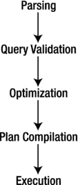

第二章


数据库系统的剖析

虽然您可能知道关系数据库管理系统(RDBMS)的基础知识，并且是管理该系统的专家，但是您可能从未探索过数据库系统的内部工作方式。我们中的大多数人都接受过管理数据库系统的培训，并拥有这方面的经验，但是无论是学术培训还是专业培训都没有包括太多关于数据库系统构建方式的内容。数据库专业人员可能永远不需要这些知识，但是了解系统如何工作是有好处的，这样您就可以了解如何最好地优化您的服务器，甚至如何最好地利用它的特性。

虽然理解 RDBMS 的内部工作方式对于托管数据库甚至维护服务器或开发使用该系统的应用程序来说都不是必需的，但是了解系统的组织方式对于修改和扩展其功能来说是必不可少的。掌握最流行的数据库系统的基本原理以理解这些系统与 RDBMS 相比如何也是很重要的。

本章涵盖了 RDBMSs 包含的子系统的基础知识以及它们是如何构造的。我使用 MySQL 系统的剖析来说明现代 RDBMSs 的关键组件。那些已经研究过这种系统的内部工作原理，并希望了解 MySQL 架构的人可以跳到“MySQL 数据库系统”

数据库系统的类型

大多数数据库专业人员使用 RDBMSs，但是其他几种类型的数据库系统也越来越流行。下面几节简要概述了三种最流行的数据库系统:面向对象的、对象关系的和关系的。了解这些系统的体系结构和一般特性非常重要，这样才能充分认识到 Oracle 通过将 MySQL 开发为开源软件并向所有人公开系统的源代码所提供的机会。这允许我向你们展示盒子里发生了什么。

面向对象的数据库系统

面向对象数据库系统(OODBSs)是一种存储和检索机制，它通过将数据作为对象直接操作来支持面向对象编程(OOP)范例。它们包含真正的面向对象(OO)类型的系统，允许对象在应用程序和使用中持久化。然而，大多数缺乏标准的查询语言 [<sup>1</sup>](#Fn1) (对数据的访问通常是通过编程接口)，因此不是真正的数据库管理系统。

OODBSs 是 RDBMS 的一个有吸引力的替代方案，特别是在 RDBMS 的建模能力或性能不足以将数据作为对象存储在表中的应用领域。这些应用程序维护大量从不删除的数据，从而管理单个对象的历史。OODBSs 最不寻常的特性是，它通过指定可以通过 OOP 接口应用于这些对象的结构和操作来提供对复杂对象的支持。

OODBSs 特别适合于尽可能接近真实世界的建模，而不会在实体之间和实体内部强加不自然的关系。面向对象的哲学提供了一个整体的以及面向建模的真实世界的视图。这些视图对于处理难以捉摸的主题是必要的，例如建模时间变化，特别是在向结构化数据添加 OO 特性时。尽管有许多开放源码的面向对象数据库，但大多数都部分基于支持查询语言接口的关系系统，因此不是真正的面向对象数据库；相反，它们更像具有面向对象接口的关系数据库。真正的面向对象数据库需要通过编程接口进行访问。

面向对象数据库系统的应用领域包括地理信息系统、科学和统计数据库、多媒体系统、图像存档和通信系统、语义网解决方案和 XML 仓库。

OODBS 最大的适应性是对数据(或对象)及其行为(或方法)的裁剪。大多数 OODBS 系统集成商依赖 OO 方法来描述数据，并在设计中用这种表达能力来构建他们的解决方案。因此，面向对象的数据库系统是用特定的实现来构建的，而不是通用的或一般化的，具有像 RDBMSs 那样的语句-响应类型的接口。

对象关系数据库系统

对象关系数据库管理系统是面向对象理论在关系数据库管理系统中的应用。ORDBMSs 提供了一种机制，允许数据库设计者实现面向对象数据的结构化存储和检索机制。ORDBMSs 提供了关系模型的基础——含义、完整性、关系等——同时扩展了模型，以一种以对象为中心的方式存储和检索数据。在许多情况下，实现纯粹是概念性的，因为 OO 概念到关系概念的映射充其量只是尝试性的。对关系技术的修改或扩展包括对 SQL 的修改，允许表示对象类型、标识、操作封装和继承。这些通常作为复杂类型松散地映射到关系理论。尽管很有表现力，但 SQL 扩展并不允许真正的对象操作和对 OODBSs 的控制。一个流行的 ORDBMS 是 ESRI 的 ArcGIS 地理数据库环境。其他例子包括 Illustra、PostgreSQL 和 Informix。

关系数据库管理系统中使用的技术通常基于关系模型。大多数关系数据库管理系统是使用现有的商业关系数据库管理系统(RDBMSs)如 Microsoft SQL Server 实现的。因为这些系统是基于关系模型的，所以它们受到将 OO 概念转换成关系机制的问题的困扰。在面向对象的应用程序中使用关系数据库的许多问题包括:

*   OO 概念模型不容易映射到数据表。
*   复杂的映射意味着复杂的程序和查询。
*   复杂的程序意味着维护问题。
*   复杂的程序意味着可靠性问题。
*   复杂的查询可能无法优化，可能会导致性能下降。
*   对象概念到复杂类型 [<sup>2</sup>](#Fn2) 的映射比关系系统更容易受到模式变化的影响。
*   全选的 OO 性能...WHERE 查询速度较慢，因为它涉及多次连接和查找。

尽管这些问题看起来很严重，但是通过在底层关系数据库和面向对象应用程序之间进行通信的面向对象应用层的应用，它们很容易被减轻。这些应用层允许将对象转换成结构化的(或持久的)数据存储。有趣的是，这种做法违反了 ORDBMS 的概念，因为您现在使用面向对象的访问机制来访问数据，这并不是创建 ORDBMS 的原因。创建它们是为了通过提供查询语言的扩展来允许在 RDBMS 中存储和检索对象。

虽然 ORDBMSs 和 oodbs 很相似，但是 oodbs 在哲学上有很大的不同。OODBSs 试图通过编程接口和平台向 OO 编程语言添加数据库功能。相比之下，ORDBMSss 试图使用传统的查询语言和扩展向 RDBMS 添加丰富的数据类型。OODBSs 试图实现与 OOP 语言的无缝集成。ORDBMS 不尝试这种级别的集成，通常需要一个中间应用层来将信息从面向对象应用程序翻译到 ORDBMS 甚至主机 RDBMS。类似地，面向对象数据库的目标是以面向对象观点作为其核心工程观点的应用程序。ORDBMSs 针对支持大量数据的大型数据存储和基于对象的系统(如 GIS 应用程序)进行了优化。最后，OODBSs 的查询机制以使用专门的 OO 查询语言的对象操作为中心。ORDBMS 查询机制适合于使用 SQL 标准的扩展来快速检索大量数据。与具有优化查询机制的真正面向对象数据库不同，如对象描述语言(ODL)和对象查询语言(OQL)，ORDBMSs 使用的查询机制是 SQL 查询语言的扩展。

GIS 应用程序的 ESRI 产品套件包含一个名为 Geodatabase(地理数据库的简称)的产品，它支持地理数据元素的存储和管理。地理数据库是一种支持空间数据的对象关系数据库。这是作为 ORDBMS 实现的空间数据库的一个例子。

 **注**空间数据库系统不需要在 ORDBMSs 甚至 OODBSs 中实现。ESRI 已经选择将地理数据库作为一个 ORDBMS 来实现。更重要的是，GIS 数据可以存储在 RDBMS 中，RDBMS 已经扩展为支持空间数据。看哪！这正是 MySQL 发生的事情。Oracle 向 MySQL RDBMS 添加了一个空间数据引擎。

尽管 ORDBMSs 是基于关系数据库平台的，但它们也提供了一些数据封装和行为层。大多数关系数据库管理系统是关系数据库管理系统的特殊形式。那些提供 ORDBMSs 的数据库供应商通常通过修改 SQL 来包含对象描述符和空间查询机制，从而构建对语句响应接口的扩展。这些系统通常是为特定的应用而构建的，并且像 OODBSs 一样，它们的一般用途是有限的。

关系数据库系统

RDBMS 是一种基于数据关系模型的数据存储和检索服务，由 E. F. Codd 于 1970 年提出。这些系统是结构化数据的标准存储机制。大量的研究致力于改进 Codd 提出的基本模型，正如 C. J. Date 在*数据库关系模型:回顾和分析中所讨论的。* [<sup>3</sup>](#Fn3) 这种理论和实践的演变最好地记录在*第三个宣言中。*[](#Fn4)

关系模型是存储库(数据库)的直观概念，可以通过使用一种称为查询语言的机制来检索、更新和插入数据，从而方便地查询存储库。关系模型已经被许多厂商实现，因为它具有完善的系统理论、坚实的数学基础和简单的结构。最常用的查询机制是结构化查询语言(SQL)，它类似于自然语言。虽然关系模型中不包含 SQL，但是 SQL 提供了关系模型在 RDBMSs 中实际应用的一个组成部分。

数据被表示为关于某个实体的相关信息(属性)。属性的值集被形成为一个*元组*(有时被称为*记录*)。然后将元组存储在包含具有相同属性集的元组的表中。然后，表可以通过对域、键、属性和元组的约束与其他表相关联。

**记录还是元组:有区别吗？**

许多人错误地认为记录是元组的通俗说法。一个重要的区别是元组是一组有序的元素，而记录是没有顺序感的相关项目的集合。但是，列的顺序在记录的概念中很重要。有趣的是，在 SQL 中，查询的结果可以是一条记录，而在关系理论中，每个结果都是一个元组。许多文本交替使用这些术语，给许多人造成了混淆。

在探索 MySQL 架构和源代码时，我们会遇到专门用来描述结果集中的一行或数据更新的一行的术语 record。虽然 MySQL 中的记录数据结构是有序的，但与元组的相似之处仅此而已。

大多数实现选择的查询语言是结构化查询语言(SQL)。SQL 是在 20 世纪 80 年代作为一种标准提出的，目前是一种行业标准。不幸的是，许多人似乎认为 SQL 是基于关系理论的，因此是一个合理的理论概念。这种误解可能是由工业带来的一种现象助长的。几乎所有的 RDBMSs 都实现某种形式的 SQL。这种流行错误地忽略了 SQL 的许多缺点，包括:

*   SQL 不支持关系模型所描述的域。
*   在 SQL 中，表可以有重复的行。
*   结果(表)可以包含未命名的列和重复的列。
*   主机数据库系统对空值(缺失值)的实现已经被证明是不一致和不完整的。因此，许多人错误地将空值的错误处理与 SQL 联系起来，而事实上，SQL 只是返回数据库系统提供的结果。 [<sup>5</sup>](#Fn5)

RDBMSs 中使用的技术多种多样。一些系统被设计来优化关系模型的一些部分或者模型对数据的一些应用。RDBMSs 的应用范围从简单的数据存储和检索到具有复杂数据、过程和工作流的复杂应用程序套件。这可以是简单的存储光盘或 DVD 收藏的数据库，或者是设计用来管理酒店预订系统的数据库，甚至是设计用来管理网上信息的复杂的分布式系统。正如我在[第 1 章](01.html)中提到的，许多网络和社交媒体应用程序实现了 LAMP 堆栈，MySQL 由此成为存储托管数据的数据库。

关系数据库系统提供了最健壮的数据独立性和数据抽象。通过使用关系的概念，RDBMS 提供了一种真正通用的数据存储和检索机制。当然，缺点是这些系统非常复杂，需要大量的专业知识来构建和修改。

在下一节中，我将介绍一个典型的 RDBMS 体系结构，并研究该体系结构的每个组件。稍后，我将研究一个 RDBMS (MySQL)的特定实现。

**MYSQL 是关系数据库系统吗？**

许多数据库理论家会告诉你，世界上真正的 RDBMSs 非常少。他们还会指出，什么是关系型，什么不是关系型，很大程度上取决于您对数据库系统所支持的特性的定义，而不是系统符合 Codd 的关系型模型的程度。

从纯营销的角度来看，MySQL 提供了许多被认为是 RDBMSs 所必需的特性。这些包括但不限于使用外键将表相互关联的能力、关系代数查询机制的实现以及索引和缓冲机制的使用。显然，MySQL 提供了所有这些特性，甚至更多。

那么 MySQL 是 RDBMS 吗？这取决于你对关系的定义。如果你考虑 MySQL 的特性和演变，你应该得出结论，它确实是一个 RDBMS。然而，如果您坚持 Codd 关系模型的严格定义，您将会得出结论，MySQL 缺少模型中表示的一些特性。但是话说回来，许多其他 RDBMSs 也是如此。

关系数据库系统体系结构

RDBMS 是一个复杂的系统，由专门的机制组成，用于处理存储和检索信息所需的所有功能。RDBMS 的体系结构经常被比作操作系统的体系结构。如果你考虑 RDBMS 的使用，特别是作为一个客户机主机的服务器，你会发现它们与操作系统有许多共同之处。例如，拥有多个客户机意味着系统必须支持许多请求，这些请求可能会也可能不会读写相同的数据或来自相同位置的数据(比如一个表)。因此，RDBMSs 必须有效地处理并发性。类似地，RDBMSs 必须为每个客户机提供对数据的快速访问。这通常是通过使用文件缓冲技术来实现的，该技术将最近或最常用的数据保存在内存中，以便更快地访问。并发性要求内存管理技术类似于操作系统中的虚拟内存系统。与操作系统的其他相似之处包括网络通信支持和优化算法，旨在最大限度地提高查询执行的性能。

我将从用户的角度开始我们对体系结构的探索，从发出查询到检索数据。下面几节写的是让你可以跳过你熟悉的，读你感兴趣的。但是，我鼓励您阅读所有章节，因为它们详细介绍了典型的 RDBMS 是如何构建的。

客户端应用程序

大多数 RDBMS 客户机应用程序都是作为独立的可执行程序开发的，这些程序通过通信路径(例如，诸如套接字或管道之类的网络协议)连接到数据库。有些通过编程接口直接连接到数据库系统，其中数据库系统成为客户机应用程序的一部分。在这种情况下，我们称数据库为*嵌入式*系统。有关嵌入式数据库系统的更多信息，请参见[第 6 章](06.html)。

大多数通过通信路径连接到数据库的系统都是通过一组称为*数据库连接器*的协议来实现的。数据库连接器最常基于开放式数据库连接(ODBC) [<sup>6</sup>](#Fn6) 模型。MySQL 还支持 Java (JDBC)、PhP、Python 和微软的连接器。NET(参见“MySQL 连接器”).大多数 ODBC 连接器的实现也支持网络协议上的通信。

ODBC 是应用程序编程接口(API)的规范。ODBC 设计用于将 SQL 命令传输到数据库服务器，检索信息，并将其提供给调用应用程序。ODBC 实现包括一个设计为使用 API 的应用程序，它充当 ODBC 库的中介，一个支持 API 的核心 ODBC 库，以及一个为特定数据库系统设计的数据库驱动程序。我们通常将客户端访问、API 和驱动程序的集合称为*连接器*。因此，ODBC 连接器充当客户机应用程序和数据库服务器之间的“解释器”。ODBC 已经成为几乎所有关系(和大多数对象关系)数据库系统的标准。数百个连接器和驱动程序可用于各种各样的客户机和数据库系统。

当我们考虑客户机应用程序时，我们通常会考虑向数据库服务器发送信息和从数据库服务器检索信息的程序。甚至我们用来配置和维护数据库服务器的应用程序也是客户端应用程序。大多数这些实用程序通过与数据库应用程序相同的网络路径连接到服务器。有些使用 ODBC 连接器或类似 Java 数据库连接(JDBC) 的变体。少数使用专门的协议来管理服务器，以达到特定的管理目的。其他的，比如 phpMyAdmin，使用端口或套接字。

不管它们的实现如何，客户机应用程序都向数据库系统发出命令，并检索这些命令的结果，解释和处理这些结果，然后将它们呈现给用户。标准的命令语言是 SQL。客户端通过 ODBC 连接器向服务器发出 SQL 命令，ODBC 连接器使用驱动程序指定的网络协议将命令传输到数据库服务器。该过程的图形描述如图 2-1 中的[所示。](#Fig1)


[图 2-1。](#_Fig1)客户端应用程序/数据库服务器通信

**MYSQL 连接器**

Oracle 为开发人员提供了几个数据库连接器，使应用程序能够与 MySQL 进行交互。这些连接器可以用于与行业标准兼容的应用程序和工具，包括 ODBC 和 JDBC。这意味着任何使用 ODBC 或 JDBC 的应用程序都可以使用 MySQL 连接器。适用于 Oracle 的 MySQL 连接器有:

*   连接器/ODBC–用于 Windows、Linux、Mac OS X 和 Unix 平台的标准 ODBC 连接器。
*   connector/J[ava]–用于 Java 平台和开发。
*   连接器/网络–窗户。Net 应用程序开发。
*   连接器/MXJ–用于在 Java 应用程序中嵌入 MySQL 服务器的 MBean。
*   连接器/c++–c++开发。
*   connector/C(libmysql)–C 应用程序开发。
*   连接器/Python–Python 应用程序开发。

您可以在 http://www.mysql.com/downloads/connector/的[查看和下载连接器](http://www.mysql.com/downloads/connector/)

查询界面

诸如 SQL 的查询语言是一种可以表示向数据库系统提出的问题的语言(它具有语法和语义)。事实上，在数据库系统中使用 SQL 被认为是它们成功的主要原因之一。SQL 提供了几个语言组，形成了使用数据库系统的全面基础。数据库专业人员使用数据定义语言 (DDL) 来创建和管理数据库。任务包括创建和修改表、定义索引和管理约束。*数据操作语言* (DML) 被数据库专业人员用来查询和更新数据库中的数据。任务包括添加和更新数据以及查询数据。这两种语言组构成了数据库系统支持的大多数命令。

SQL 命令是使用专门的语法形成的。下面给出了 SQL 中的一个 *SELECT* 命令的语法。符号用斜体表示用户定义的变量，用方括号([])表示可选参数。

```sql
SELECT [DISTINCT] listofcolumns
FROM listoftables
[WHERE expression (predicates in CNF)]
[GROUP BY listofcolumns]
[HAVING expression]
[ORDER BY listof columns];
```

该命令的语义是: [<sup>7</sup>](#Fn7)

1.  形成来自子句的*中的表的笛卡尔积，从而仅形成那些出现在其他子句中的引用的投影。*
2.  如果存在一个 *WHERE* 子句，则应用引用的给定表的所有表达式。
3.  如果存在一个 *GROUP BY* 子句，则在指定属性的结果中形成组。
4.  如果存在具有子句的*，则为组应用过滤器。*
5.  如果存在一个 *ORDER BY* 子句，则以指定的方式对结果进行排序。
6.  如果存在 *DISTINCT* 关键字，则从结果中删除重复的行。

前面的代码示例代表了大多数 SQL 命令；所有这样的命令都有必需的部分，大多数还有可选的部分以及基于关键字的修饰符。

一旦查询语句通过网络协议(称为*运输*T2】传输到客户端，数据库服务器就必须解释并执行命令。从这一点开始，查询语句被简称为查询，因为它表示数据库系统必须提供答案的问题。此外，在接下来的部分中，我假设查询属于 *SELECT* 类型，其中用户已经发出了一个数据请求。然而，所有的查询，无论是数据操作还是数据定义，在系统中都遵循相同的路径。也正是在这一点上，我们考虑在数据库服务器本身中执行的操作。这个过程的第一步是解读客户的要求——也就是说，查询必须被解析并分解成可以执行的元素。

查询处理

在以客户机/服务器模式运行的数据库系统的环境中，数据库服务器负责处理客户机提出的查询并相应地返回结果。这被称为*查询传送* ，其中查询被传送到服务器并返回有效负载(数据)。查询传送的好处是减少了查询的通信时间，并且能够利用服务器资源，而不是使用更有限的客户端资源来执行查询。该模型还允许将数据在服务器上的存储和检索方式与数据在客户机上的使用方式分开。换句话说，客户机/服务器模型支持数据独立性。

数据独立性是 Codd 在 1970 年引入的关系模型的主要优点之一:将*物理实现*与*逻辑模型*分离。按 Codd， [<sup>8</sup>](#Fn8)

必须保护大型数据库的用户，使他们不必知道数据在机器中是如何组织的。。。当数据的内部表示改变时，终端用户的活动和大多数应用程序应该保持不受影响。

这种分离允许开发一组强大的逻辑语义，独立于特定的物理实现。数据独立(Elmasri 和 Navathe [<sup>9</sup>](#Fn9) 称之为物理数据独立)的目标是每个逻辑元素独立于所有物理元素(见[表 2-1](#Tab1) )。例如，数据与由元组(行)排列的属性(字段)的关系(表)的逻辑布局完全独立于数据在存储介质上的存储方式。

[表 2-1](#_Tab1) 。数据库设计的逻辑和物理模型

| 逻辑模型 | 物理模型 |
| --- | --- |
| 查询语言 | 排序算法 |
| 关系代数 | 存储机制 |
| 关系演算 | 索引机制 |
| 雷尔瓦斯 | 数据表示法 |

数据独立性的一个挑战是数据库编程变成了一个两部分的过程。首先，编写逻辑查询——描述查询应该做什么。其次，是物理计划的编写，它向*展示了*如何实现逻辑查询。

逻辑查询通常可以以许多不同的形式编写，例如 SQL 之类的高级语言或代数查询树。 [<sup>10</sup>](#Fn10) 例如，在传统的关系模型中，一个逻辑查询可以用关系演算或关系代数来描述。关系演算在关注*需要计算什么*方面更好。关系代数更接近于提供一种算法，让您找到您正在查询的内容，但是仍然省略了查询评估中涉及的许多细节。

*物理计划*是一个查询树，其实现方式可以被数据库系统的查询执行引擎理解和处理。*查询树* 是一种树形结构，其中每个节点包含一个查询操作符，并且有多个子节点，这些子节点对应于操作中涉及的表的数量。查询树可以通过优化器转换成执行计划。这个计划可以看作是查询执行引擎可以执行的程序。

查询语句在执行之前要经过几个阶段；解析、验证、优化、计划生成/编译和执行。图 2-2 描述了一个典型的数据库系统会采用的查询处理步骤。对每个查询语句进行有效性分析，并检查语法是否正确以及查询操作的标识。然后，解析器以中间形式输出查询，以允许优化器形成高效的查询执行计划。然后，执行引擎执行查询，并将结果返回给客户端。这个过程在[图 2-2](#Fig2) 中显示，一旦解析完成，查询将被验证错误，然后被优化；选择并编制计划；最后执行查询。



[图 2-2。](#_Fig2)查询处理步骤

这个过程的第一步是将逻辑查询从 SQL 转换成关系代数中的查询树。这一步由解析器完成，通常包括将 SQL 语句分成几个部分，然后从那里构建查询树。下一步是将逻辑代数中的查询树翻译成物理计划。通常，许多计划都可以实现查询树。寻找最佳执行计划的过程称为*查询优化* 。也就是说，对于某些查询执行性能度量(例如，执行时间)，我们希望找到具有最佳执行性能的计划。在优化器的搜索空间内，计划应该是最优的或接近最优的。优化器首先将关系代数查询树复制到它的搜索空间中。然后，优化器通过形成备选执行计划(到有限迭代)来扩展搜索空间，然后搜索最佳计划(执行最快的计划)。

在这个通用级别上，优化器可以被视为 SQL 语言查询编译器的代码生成部分。事实上，在一些数据库系统中，编译步骤将查询翻译成可执行程序。然而，大多数数据库系统将查询翻译成可以使用内部执行步骤库执行的形式。这种情况下的代码编译会生成由查询执行引擎解释的代码，只是优化器的重点是生成“非常高效”的代码。例如，优化器使用数据库系统的目录来获得关于查询所引用的存储关系的信息(例如，元组的数量)，这是传统编程语言编译器通常不做的。最后，优化器将最佳物理计划从其内存结构中复制出来，并发送给查询执行引擎，查询执行引擎使用存储的数据库中的关系作为输入来执行计划，并生成与查询条件匹配的行的表。

所有这些活动都需要额外的处理时间，并通过迫使数据库实施者将查询优化器和执行引擎的性能作为其整体效率的一个因素来考虑，从而给该过程带来了更大的负担。这种优化的成本很高，因为有许多备选执行计划使用不同的访问方法(读取数据的方式)和不同的执行顺序。因此，可以为一个查询生成无限数量的计划。然而，数据库系统通常将问题局限于少数已知的最佳实践。

大量查询计划的一个主要原因是，许多重要运行时参数的不同值都需要优化，这些参数的实际值在优化时是未知的。数据库系统对数据库内容(例如，关系属性中的值分布)、物理模式(例如，索引类型)、系统参数的值(例如，可用缓冲区的数量)以及查询常量的值做出某些假设。

查询优化器

有些人错误地认为查询优化器执行了查询执行阶段的所有步骤。正如您将看到的，查询优化只是查询执行过程中的一个步骤。以下段落详细描述了查询优化器，并说明了优化器在查询执行过程中的作用。

查询优化是查询编译过程的一部分，它将高级非过程语言(如 SQL)中的数据操作语句翻译成更详细的过程操作符序列，称为*查询计划*。查询优化器通常通过估计许多备选计划的成本来选择一个计划，然后选择其中最便宜的(执行速度最快的)。

使用基于计划的方法进行查询优化的数据库系统假定可以使用许多计划来产生任何给定的查询。虽然这是真的，但不是所有的计划在执行查询所需的资源数量(或成本)上都是相等的，也不是所有的计划都在相同的时间内执行。那么，目标就是找到成本最低和/或运行时间最少的计划。当设计用于嵌入式集成或在小平台上运行的系统(资源可用性低)与对更高吞吐量(或时间)的需求相比时，资源使用或成本使用的区别是经常遇到的权衡。

[图 2-3](#Fig3) 描述了一个基于计划的查询处理策略，其中查询沿着箭头的路径进行。SQL 命令被传递给查询解析器，在那里被解析和验证，然后被转换成内部表示，通常基于关系代数表达式或查询树，如前所述。然后将查询传递给查询优化器，查询优化器检查所有等价的代数表达式，为每个组合生成不同的计划。然后，优化器选择成本最低的计划，并将查询传递给代码生成器，代码生成器将查询转换为可执行的形式，可以是直接可执行的，也可以是解释性代码。然后，查询处理器执行查询，并在结果集中一次返回一行。

这种常见的实现方案是大多数数据库系统的典型特征。然而，随着时间的推移，运行数据库系统的机器已经有所改进。查询计划不再有不同的执行成本。事实上，大多数查询计划的执行成本大致相同。这种认识导致一些数据库系统实现者采用一种查询优化器，这种查询优化器使用一些众所周知的最佳实践或规则(称为*试探法*)来优化查询。一些数据库系统使用基于一种形式的混合优化技术，同时在执行过程中保持其他技术的某些方面。


[图 2-3。](#_Fig3)基于计划的查询处理

执行查询优化的四种主要方法是

*   基于成本的优化
*   试探优化
*   语义优化
*   参数优化

虽然没有任何优化技术可以保证最佳的执行计划，但是所有这些方法的目标都是为查询生成一个有效的执行，保证正确的结果。

基于成本的优化器通过使用等价规则从给定的查询生成一系列查询评估计划，并根据收集的关于执行查询所需的关系和操作的度量(或统计)选择成本最低的计划。对于一个复杂的查询，许多等价的计划是可能的。基于成本的优化的目标是利用从过去的查询中收集的索引和统计信息来安排查询执行和表访问。Microsoft SQL Server 和 Oracle 等系统使用基于成本的优化器。

启发式优化器在选择替代实现之前，使用关于如何将查询塑造成最佳形式的规则。试探法或规则的应用可以消除可能低效的查询。使用试探法来形成查询计划可以确保查询计划在评估之前最有可能(但不总是)得到优化。启发式优化的目标是应用确保查询执行“良好”实践的规则。使用启发式优化器的系统包括 Ingres 和各种学术变体。这些系统通常使用启发式优化来避免真正糟糕的计划，而不是作为优化的主要手段。

语义优化的目标是形成查询执行计划，该计划使用数据库的语义或拓扑以及其中的关系和索引来形成查询，以确保在给定数据库中执行查询的最佳实践。虽然还没有在商业数据库系统中作为主要的优化技术来实现，但是语义优化目前是大量研究的焦点。语义优化的前提是优化器对实际的数据库模式有基本的了解。当提交一个查询时，优化器使用它对系统约束的了解来简化或忽略一个特定的查询，如果它保证返回一个空的结果集的话。这项技术很有希望在未来的 RDBMSs 中进一步提高查询处理效率。

参数查询优化将启发式方法的应用与基于成本的优化相结合。所得到的查询优化器提供了一种生成较小的有效查询计划集的方法，可以根据这些计划来估计成本，从而可以执行该计划集中成本最低的计划。

使用混合优化器的数据库系统的一个例子是 MySQL。MySQL 中的查询优化器是围绕 select-project-join 策略设计的，该策略结合了基于成本的优化器和使用已知优化机制的启发式优化器，从而减少了基于成本的优化可以选择的最小执行路径。这种策略确保了一个整体“好”的执行计划，但是它不一定产生最好的计划。这种策略已经被证明对于在不同环境中运行的各种各样的查询非常有效。MySQL 的内部表示已经表现得足够好，可以与最大的生产数据库系统的执行速度相媲美。

使用基于成本的优化器的数据库系统的一个例子是微软的 SQL Server。SQL Server 中的查询优化器是围绕经典的基于成本的优化器设计的，该优化器将查询语句转换为可以高效执行并返回所需结果的过程。优化器使用从过去的查询中记录的值和数据库中数据的特征收集的信息或统计数据来创建表示相同查询的替代过程。统计数据应用于每个过程，以预测哪个过程可以更有效地执行。一旦确定了最有效的过程，就开始执行并将结果返回给客户机。

通过使用未绑定的参数，例如用户谓词，查询的优化可能会变得复杂。例如，当执行存储过程时，如果存储过程中的查询接受来自用户的参数，则创建未绑定参数。在这种情况下，查询优化可能是不可能的，或者它可能不会产生最低的成本，除非在执行之前获得了谓词的一些知识。如果很少有记录满足谓词，那么即使是基本索引也远远优于文件扫描。如果许多记录都符合条件，则情况正好相反。如果在执行优化时因为谓词未绑定而导致选择性未知，那么在这些备选计划中的选择应该推迟到执行时进行。

选择性问题可以通过构建优化器来解决，这些优化器可以采用谓词作为开放变量，并通过基于历史查询执行生成所有可能发生的查询计划，以及利用基于成本的优化器的统计信息(包括谓词属性的频率分布)来执行查询计划规划。

查询的内部表示

在数据库系统中，可以使用几种不同形式的原始 SQL 命令来表示查询。这些替代形式的存在是由于 SQL 中的冗余、特定约束下的子查询和连接的等价性，以及可以从 *WHERE* 子句中的谓词得出的逻辑推理。拥有替代形式的查询给数据库实现者带来了一个问题，因为查询优化器必须为查询选择最佳的访问计划，而不管用户最初是如何形成查询的。

一旦查询优化器形成了有效的执行计划(启发式和混合优化器)或者选择了最有效的计划(基于成本的优化器)，查询就被传递到流程的下一个阶段:执行。

查询执行

数据库系统可以使用几种方法来执行查询。大多数使用*迭代*或*解释*执行策略。

迭代方法提供了产生可用于处理离散操作(连接、项目等)的调用序列的方法。)，但它们的设计并不包含内部表示的功能。将查询转换成迭代方法使用了函数式编程和程序转换技术。一些可用的算法从基于代数的查询规范生成迭代程序。例如，一些算法将查询规范翻译成递归程序，在算法生成执行计划之前，递归程序通过转换规则集进行简化。另一种算法使用两级翻译。第一级使用一组较小的转换规则来简化内部表示，第二级在生成执行计划之前应用功能转换。

这种机制的实现创建了一组使用高级语言形成的已定义的编译功能原语，然后通过调用堆栈或过程调用序列将它们链接在一起。当创建并选择执行查询执行计划时，编译器(通常与创建数据库系统的编译器相同)用于将过程调用编译成二进制可执行文件。由于迭代方法的高成本，编译后的执行计划通常会被存储起来，以供类似或相同的查询重用。

另一方面，解释方法使用基本操作的现有编译抽象来形成查询执行。所选择的查询执行计划被重新构造为一个方法调用队列，每个方法调用都从队列中取出并进行处理。然后将结果存储在内存中，供下一次或后续调用使用。这种策略的实现通常被称为*懒惰评估*，因为可用的编译方法集并没有针对最佳性能进行优化；相反，这些方法是为通用性而优化的。大多数数据库系统使用查询执行的解释方法。

一个经常混淆的领域是编译的概念。一些数据库专家认为编译后的查询是迭代查询执行计划的实际编译，但是在 Date 的工作中，编译后的查询只是一个已经优化并存储以供将来执行的查询。我不会使用单词 *compiled，*，因为 MySQL 查询优化器和执行引擎不会存储查询执行计划以备后用(MySQL 查询缓存是一个例外)。我不认为我们可以在这里比较或提及查询缓存。对已执行查询的评估甚至与计划无关，而是与接收的 SQL 和存储的 SQL 之间的文献比较有关，直接与一组已检索的信息相关，查询执行也不需要任何编译或汇编工作。有趣的是，存储过程的概念符合第二个类别；它被编译(或优化)以便以后执行，并且可以对满足其输入参数的数据运行多次。

查询执行评估查询树(或由内部结构表示的查询)的每个部分，并为每个部分执行方法。支持的方法反映了在关系代数、投影、限制、联合、交集等中定义的那些操作。对于这些操作中的每一项，查询执行引擎都会执行一个方法来评估传入的数据，并将处理后的数据传递给下一步。例如，在项目操作中只返回数据的某些属性(或列)。在这种情况下，查询执行引擎将剥离不符合限制规范的属性的数据，并将剩余的数据传递给树(或结构)中的下一个操作。[表 2-2](#Tab2) 列出了支持的最常见操作，并简要描述了每种操作。

[表 2-2。](#_Tab2)查询操作

| 操作 | 描述 |
| --- | --- |
| 限制 | 返回与 WHERE 子句的条件(谓词)匹配的元组(某些系统以相同或相似的方式处理 HAVING 子句)。这个操作通常被定义为 SELECT。 |
| 项目 | 返回在计算的元组的列列表中指定的属性。 |
| 加入 | 返回与称为*连接条件*(或*连接谓词*)的特殊条件相匹配的元组。联接有多种形式。请参阅“连接”了解每个连接的描述。 |

**加入**

连接操作可以采取多种形式。这些经常被数据库专业人员所混淆，在某些情况下要不惜一切代价避免。SQL 的表达能力允许将许多连接写成 WHERE 子句中的简单表达式。虽然大多数数据库系统能够正确地将这些查询转换成连接，但这被认为是一种懒惰的形式。下面列出了在 RDBMS 中可能遇到的联接类型，并对每种类型进行了描述。连接操作可以有连接条件(theta 连接)、要比较的属性值的匹配(equijoins)或没有条件(笛卡尔乘积)。连接操作细分为:

*   *Inner:* 两个关系的连接，返回匹配的元组。
*   *Outer (left，right，full):* 返回 from 子句中提到的至少一个表或视图中的所有行，只要这些行满足任何 WHERE 搜索条件。所有行都是从用左外部联接引用的左表中检索的；右表中的所有行都在右外部联接中被引用。两个表中的所有行都在完全外部联接中返回。不匹配行的属性值作为空值返回。
*   *右外:*两个关系的连接，返回匹配的元组，加上右边指定的关系中的所有元组，留下另一个关系中指定的不匹配属性为空(null)。
*   *Full outer:* 两个关系的连接返回两个关系中的所有元组，将另一个关系中指定的不匹配属性保留为空(null)。
*   *叉积:*两个关系的连接，将第一个关系中的每个元组映射到另一个关系中的所有元组。
*   *Union:* 集合运算，其中只返回来自两个具有相同模式的关系的匹配。
*   *Intersect:* 集合运算，其中仅返回来自具有相同模式的两个关系的不匹配。

决定如何执行查询(或选择的查询计划)只是事情的一半。另一件要考虑的事情是如何访问数据。有许多方法可以从磁盘(文件)中读取和写入数据，但是选择最佳的方法取决于查询试图做什么。创建文件访问机制是为了最小化从磁盘访问数据的成本，并最大化查询执行的性能。

文件存取

文件访问机制，也称为物理数据库设计，在数据库系统开发的早期就很重要。然而，由于操作系统支持的通用文件系统的有效性和简单性，文件访问的重要性已经降低。今天，文件访问仅仅是文件存储和索引最佳实践的应用，例如将索引文件从数据文件中分离出来，并分别放在单独的磁盘输入/输出(I/O)系统上以提高性能。一些数据库系统使用不同的文件组织技术来使数据库适应特定的应用需求。在这方面，MySQL 可能是最独特的，因为它支持许多文件访问机制(称为存储引擎)。

必须满足明确的目标，以最小化数据库系统中的 I/O 成本。这些包括利用允许通过有效的访问路径仅有效检索相关数据的磁盘数据结构，以及组织磁盘上的数据，使得检索相关数据的 I/O 成本最小化。因此，最重要的性能目标是最小化磁盘访问(或磁盘 I/o)的数量。

有许多处理数据库设计的技术可用。可用于文件访问机制(数据文件的实际物理实现)的更少。此外，许多研究人员同意，最佳的数据库设计(从物理角度来看)通常是不可实现的，而且也不应该追求。优化是不可实现的，主要是因为现代磁盘子系统的效率大大提高了。相反，正是这些技术和研究的知识允许数据库实现者以尽可能好的方式实现数据库系统，以满足那些将使用该系统的人的需求。

要创建一个性能良好的结构，您必须考虑许多因素。早期的研究人员考虑根据数据的内容或上下文将数据分割成子集。例如，包含相同部门编号的所有数据将被分组在一起，并与相关数据的引用一起存储。这个过程可以永久化，因为集合可以被分组在一起以形成超集，从而形成分层的文件组织。

在这种配置中访问数据涉及在最高级别扫描集合，以便只访问和扫描那些对于获得所需信息是必要的集合。这个过程大大减少了要扫描的元素数量。将要扫描的数据项放在一起可以最大限度地减少搜索时间。将磁盘上的数据整理成结构化文件称为*文件组织* 。我们的目标是设计一种访问方法，它提供了一种逐个立即处理事务的方式，从而允许我们保存真实世界情况的最新存储图片。

随着操作系统的发展，对文件组织技术进行了修订，以确保更高的存储和检索效率。现代数据库系统带来了新的挑战，目前公认的方法可能不足以应对这些挑战。对于在磁盘速度更快、数据吞吐量更高的硬件上执行的系统来说尤其如此。此外，理解数据库设计方法，不仅在教科书中描述，而且在实践中，将增加对数据库系统的要求，从而增加进一步研究的动力。例如，最近工业上对冗余和分布式系统的采用引发了这些领域中的额外研究，以利用新的硬件和/或增加数据可用性、安全性和恢复的需求。

由于从磁盘访问数据的成本很高，因此使用缓存机制，有时也称为*缓冲区* ，可以显著提高从磁盘读取数据的性能，从而降低存储和检索数据的成本。这个概念包括复制部分数据，或者是为了下次磁盘读取，或者是基于一种算法，该算法旨在将最常用的数据保留在内存中。有效地处理磁盘和主存之间的差异是高质量数据库系统的核心。应该理解数据库系统使用磁盘还是使用主存之间的权衡。请参见[表 2-3](#Tab3) 以了解物理存储(磁盘)和辅助存储(内存)之间的性能权衡。

[表 2-3](#_Tab3) 。性能权衡

| 问题 | 主内存与磁盘 |
| --- | --- |
| 速度 | 主存至少比磁盘快 1000 倍。 |
| 储存空间 | 同样的成本，磁盘可以容纳比内存多几百倍的信息。 |
| 坚持 | 当电源关闭时，磁盘保存数据，主内存会忘记一切。 |
| 存取时间 | 主存开始发送数据需要纳秒，而磁盘需要毫秒。 |
| 块大小 | 主存储器可以一次访问一个字，磁盘可以一次访问一个块。 |

数据库物理存储的进步已经见证了许多关于存储策略和缓冲机制的相同改进，但是在探索性地研究物理存储的基本元素方面几乎没有发生。一些人从硬件层面探讨了这个话题，而另一些人则从更实用的层面探讨了我们到底需要存储什么。持久存储的主题在很大程度上被遗忘了，因为主机操作系统中提供了强大而高效的机制。

文件访问机制用于存储和检索数据库系统包含的数据。大多数文件访问机制都有附加的功能层，允许更快地定位文件中的数据。这些层被称为*索引机制* 。索引机制提供了访问路径(数据将被搜索和检索的方式)，旨在基于称为*键*的数据子部分来定位特定数据。索引机制的复杂程度不一，从简单的关键字列表到旨在最大化关键字搜索的复杂数据结构。

目标是快速有效地找到我们想要的数据，而不必请求和读取非绝对必要的更多磁盘块。这可以通过保存标识数据(或键)的值和记录在磁盘上的位置来实现，以形成数据的索引。此外，读取索引数据比读取所有数据更快。使用索引的主要好处是，它允许我们有效地搜索大量数据，而不必检查，或者在许多情况下阅读每一项，直到找到我们要搜索的内容。因此，索引与搜索包含存储在磁盘上的数据的大文件的方法有关。这些方法被设计用于数据的快速随机存取以及数据的顺序存取。

大多数(但不是全部)索引机制涉及一个存储键和磁盘块地址的树形结构。例子包括 B 树、B +树和散列树。这些结构通常由一个或多个算法遍历，这些算法被设计成最小化在结构中搜索关键字所花费的时间。大多数数据库系统在其索引机制中使用这种或那种形式的 B 树。这些树算法提供了非常快的搜索速度，而不需要很大的存储空间。

在查询执行期间，解释查询执行方法访问分配的索引机制，并通过指定的访问方法请求数据。然后，执行方法读取数据，通常一次读取一条记录；通过评估表达式来分析查询与谓词的匹配；然后通过任何转换传递数据，最后传递到服务器的传输部分，将数据发送回客户端。

查询结果

一旦处理了查询中引用的表中的所有元组，就沿着相同的或者有时是替代的通信路径将元组返回给客户端。然后，元组被传递到 ODBC 连接器，以便封装并呈现给客户端应用程序。

关系数据库体系结构概述

在这一节中，我详细介绍了通过典型的关系数据库系统架构查询数据的步骤。正如您将看到的，查询从客户端发出的 SQL 命令开始；然后，使用通信路径(网络)通过 ODBC 连接器将其传递给数据库系统。查询被解析、转换成内部结构、优化和执行，结果返回给客户机。

现在，我已经向您简要介绍了处理查询所涉及的所有步骤，并且您已经看到了数据库系统子组件的复杂性，现在是时候来看一个真实的例子了。在下一节中，我将深入介绍 MySQL 数据库系统架构。

MySQL 数据库系统

MySQL 源代码是高度组织化的，使用许多结构化的类构建(有些是复杂的数据结构，有些是对象，但大多数是结构)。虽然通过添加插件使系统更加模块化的努力正在进行中，但源代码还不是真正的模块化架构，但现在随着新的插件机制的出现，已经非常接近了。当您探索架构时，理解这一点很重要，更重要的是，当您以后探索源代码时。这意味着您有时会发现源代码中没有清晰的架构元素划分。关于 MySQL 源代码的更多信息，包括如何获得它，参见第三章。

虽然有些人可能会将 MySQL 架构描述为一个由一组模块化子组件构建的基于组件的系统，但事实是，尽管它高度组织化，但它既不是基于组件的，也不是模块化的。源代码是使用 C 和 C++混合构建的，并且在系统的许多功能中使用了许多对象。该系统不是真正意义上的面向对象编程中的面向对象。相反，该系统是建立在函数库和数据结构的基础上的，这些函数库和数据结构被设计成围绕体系结构优化源代码的组织，其中一些部分是使用对象编写的。

然而，MySQL 架构是高度组织化的子系统的智能设计，这些子系统和谐地工作以形成有效且高度可靠的数据库系统。我在本章前面描述的所有技术都存在于系统中。实现这些技术的子系统设计良好，并使用整个系统中相同精度的源代码来实现。有趣的是，许多有成就的 C 和 C++程序员评论源代码的优雅和简洁。我经常发现自己惊叹于代码的宁静复杂和优雅。事实上，甚至代码作者自己也承认，他们的代码有一种天才的直觉，这种直觉通常只有在彻底分析后才能被完全理解或欣赏。你也会惊奇地发现，一旦你弄明白了，一些源代码是多么的有效，多么的简单。

 **注意**事实证明，MySQL 系统对一些人来说很难学习，当出现问题时，诊断起来也很麻烦。然而，很明显，一旦掌握了 MySQL 体系结构和源代码的复杂性，这个系统就非常容易适应，并且有希望成为实验数据库工作的第一个也是最好的平台。

这意味着 MySQL 架构和源代码对于 C++程序员新手来说通常是具有挑战性的。如果你发现自己开始重新考虑接手源代码，请继续阅读；我将是你导航源代码的向导。但是让我们先来看看这个系统是如何构成的。

MySQL 系统架构

MySQL 架构最好被描述为子系统的分层系统。虽然源代码不是作为单独的组件或模块编译的，但是子系统的源代码是以分层的方式组织的，这种方式允许子系统被分离(封装)在源代码中。大多数子系统依赖基础库来实现低级功能(例如，线程控制、内存分配、网络、日志和事件处理以及访问控制)。基本库、基于这些库构建的子系统、甚至是基于其他子系统构建的子系统共同构成了抽象的 API，即 C 客户端 API。这个强大的 API 允许 MySQL 系统在更大的应用程序中作为独立的服务器或嵌入式数据库系统使用。

该架构为 SQL 接口、查询解析、查询优化和执行、缓存和缓冲以及可插拔存储引擎提供了封装。[图 2-4](#Fig4) 描绘了 MySQL 架构及其子系统。在图的顶部是提供对客户机应用程序的访问的数据库连接器。正如您所看到的，几乎任何您想要的编程环境的连接器都存在。在绘图的左侧，辅助工具按管理和企业服务分组列出。关于管理和企业服务工具的完整讨论，请参见迈克尔·克鲁肯伯格和杰伊·皮普斯的*Pro MySQL*[<sup>12</sup>](#Fn12)这是一篇关于 MySQL 所有管理事务的极好参考。

体系结构中从连接器往下的下一层是连接池层。这一层处理客户端连接的所有用户访问、线程处理、内存和进程缓存需求。该层之下是数据库系统的核心。这里是解析和优化查询以及管理文件访问的地方。下一层是可插拔存储引擎层。在这一层，MySQL 体系结构的部分优点大放异彩。可插拔存储引擎层允许构建系统来处理各种不同的数据或文件存储和检索机制。这种灵活性是 MySQL 独有的。目前没有其他数据库系统能够通过提供几种数据存储机制来提供数据库调优能力。

 **注意**可插拔存储引擎功能从版本 5.1 开始提供。

可插拔存储引擎下面是系统的最低层，即文件访问层。在这一层，存储机制读写数据，系统读写日志和事件信息。这一层与线程、进程和内存控制最接近操作系统。

让我们从系统中从客户端应用程序到数据的流程开始讨论 MySQL 架构。第一层遇到了曾经的客户端连接器(ODBC，。NET、JDBC、C API 等。)已经将 SQL 语句传送到服务器的是 SQL 接口。


[图 2-4。](#_Fig4) MySQL 服务器架构(版权 Oracle。经许可转载。)

SQL 接口

SQL 接口提供了接收命令和向用户传输结果的机制。MySQL SQL 接口是根据 ANSI SQL 标准构建的，接受与大多数 ANSI 兼容的数据库服务器相同的基本 SQL 语句。尽管 MySQL 中支持的许多 SQL 命令都有非 ANSI 标准的选项，但 MySQL 开发人员已经非常接近 ANSI SQL 标准。

从网络通信路径接收到数据库服务器的连接，并为每个连接创建一个线程。线程化进程是 MySQL 服务器中可执行路径的核心。MySQL 是作为真正的多线程应用程序构建的，每个线程独立于其他线程执行(除了某些助手线程)。传入的 SQL 命令存储在类结构中，通过将结果写出到网络通信协议，将结果传输到客户端。一旦创建了一个线程，MySQL 服务器就会尝试解析 SQL 命令，并将各个部分存储在内部数据结构中。

解析器

当客户机发出查询时，会创建一个新线程，并将 SQL 语句转发给解析器进行语法验证(或因错误而拒绝)。MySQL 解析器是使用一个用 Bison 编译的大型 Lex-YACC 脚本实现的。解析器构建一个查询结构，用于将内存中的查询语句(SQL)表示为可用于执行查询的*树结构*(也称为抽象语法树)。

 **提示**sql _ yacc . YY、sql_lex.h 和 lex.h 文件是您开始在 MySQL 中构建自己的 SQL 命令或数据类型的地方。这些文件将在第 7 章的[中详细讨论。](07.html)

被许多人认为是 MySQL 源代码中最复杂和最优雅的部分，解析器是使用 lex 和 YACC 实现的，它们最初是为编译器构造而构建的。这些工具用于构建词法分析器，该分析器读取 SQL 语句并将语句分解成多个部分，将命令部分、选项和参数分配给变量和列表结构。这个结构(被形象地命名为 Lex)是 SQL 查询的内部表示。因此，查询过程中的每个其他步骤都会使用该结构。Lex 结构包含正在使用的表的列表、引用的字段名、连接条件、表达式以及存储在单独空间中的查询的所有部分。

解析器的工作方式是读取 SQL 语句，并将表达式(由标记和符号组成)与源代码中定义的规则进行比较。这些规则用 Lex 和 YACC 构建到代码中，然后用 Bison 编译形成词法分析器。如果您检查 C 形式的解析器(一个名为/sql/sql_yacc.cc 的文件)，您可能会被 switch 语句的简洁和庞大所淹没。 [<sup>13</sup>](#Fn13) 检查解析器的一个更好的方法是在编译之前查看 Lex 和 YACC 格式(一个名为/sql/sql_yacc.yy 的文件)。这个文件包含了为 YACC 写的规则，更容易破译。解析器的构造说明了 Oracle 的开源哲学在起作用:为什么要创建自己的语言处理程序，而 Lex、YACC 和 Bison 等特殊的编译器构造工具就是为做这件事而设计的呢？

一旦解析器识别出一个正则表达式并将查询语句分成几个部分，它就将适当的命令类型分配给线程结构，并将控制返回给命令处理器(它有时被认为是解析器的一部分，但更准确地说是主代码的一部分)。命令处理器被实现为一个大的 switch 语句，支持每个命令的用例。查询解析器只检查 SQL 语句的正确性。它不验证所引用的表或属性(字段)是否存在，也不检查语义错误，例如没有使用 *GROUP BY* 子句的聚合函数。相反，验证工作留给了优化器。因此，来自解析器的查询结构被传递给查询处理器。从那里，控制切换到查询优化器。

**莱克斯和 YACC**

Lex 代表“词法分析器生成器”，被用作解析器来识别语言的标记和文字以及语法。YACC 代表“又一个编译器编译器”，用于识别和处理语言的语义定义。这些工具与 Bison(一个 YACC 编译器)一起使用，为创建能够解析和处理语言命令的子系统提供了丰富的机制。事实上，这正是 MySQL 使用这些技术的方式。

查询优化器

一些人认为 MySQL 查询优化器子系统命名不当。所使用的优化器是一个选择-项目-连接策略,它试图通过首先执行任何限制(选择)来缩小要处理的元组的数量，然后执行投影来减少结果元组中的属性(字段)的数量，最后评估任何连接条件来重新构造查询。虽然不被认为是极其复杂的查询优化器类别中的一员，但是 SELECT-PROJECT-JOIN 策略属于启发式优化器类别。在这种情况下，试探法(规则)很简单:

*   通过计算 WHERE (HAVING)子句中的表达式来消除多余的数据。
*   通过将数据限制为属性列表中指定的属性来消除额外的数据。例外情况是在连接子句中使用的属性的存储可能不会保留在最终查询中。
*   评估连接表达式。

这就产生了一种策略，可以确保已知良好的访问方法以高效的方式检索数据。尽管有批评性的评论，SELECT-PROJECT-JOIN 策略在执行事务处理中的典型查询时被证明是有效的。[图 2-5](#Fig5) 描绘了一个描述 MySQL 查询处理方法的框图。


[图 2-5。](#_Fig5) MySQL 查询处理方法

优化器的第一步是检查表的存在和用户的访问控制。如果有错误，将返回相应的错误消息，并将控制权返回给线程管理器或侦听器。一旦确定了正确的表，就打开它们，并为并发控制应用适当的锁。

一旦所有维护和设置任务完成，优化器就使用内部查询结构(Lex)并评估查询的 *WHERE* 条件(限制操作)。结果作为临时表返回，为下一步做准备。如果存在 *UNION* 操作符，优化器会在继续之前执行循环中所有语句的 *SELECT* 部分。

优化器的下一步是执行预测。它们的执行方式与限制部分类似，同样将中间结果存储为临时表，并且只保存那些在 *SELECT* 语句的列规范中指定的属性。最后，针对使用 JOIN 类构建的任何 *JOIN* 条件来分析该结构，然后调用 *join::optimize()* 方法。在这个阶段，通过评估表达式并消除任何导致死分支或始终为真或始终为假的条件(以及许多其他类似的优化)来优化查询。优化器试图在执行连接之前消除查询中任何已知的不良条件。这样做是因为连接是所有关系运算符中最昂贵和耗时的。请注意，连接优化步骤是为所有具有 *WHERE* 或 *HAVING* 子句的查询执行的，不管是否有任何连接条件。这使得开发人员能够将所有的表达式求值代码集中在一个地方。一旦连接优化完成，优化器就使用一系列条件语句将查询路由到适当的库方法来执行。

查询优化器和执行引擎可能是第二难理解的领域，因为它的 SELECT-PROJECT-JOIN 优化器方法。使事情变得复杂的是，服务器的这一部分是 C 和 C++代码的混合，其中典型的 select 执行被写成 C 方法，而 join 操作被写成 C++对象。在第 13 章中，我将向你展示如何编写你自己的查询优化器，并使用它来代替 MySQL 优化器。

查询执行

查询的执行由一组旨在实现特定查询的库方法来处理。例如， *mysql_insert()* 方法就是为了插入数据而设计的。同样，还有一个 *mysql_select()* 方法，用于查找并返回与 *WHERE* 子句匹配的数据。这个执行方法库位于多个具有相似名称的文件下的源代码文件中(例如， *sql_insert.cc* 或 *sql_select.cc* )。所有这些方法都有一个 thread 对象作为参数，该对象允许方法访问内部查询结构并简化执行。使用网络通信路径库返回每种执行方法的结果。查询执行库方法显然是使用查询执行的解释模型实现的。

查询缓存

虽然不是它自己的子系统，查询缓存应该被认为是查询优化和执行子系统的重要部分。查询缓存是一项了不起的发明，它不仅缓存查询结构，还缓存查询结果本身。这使系统能够检查经常使用的查询，并简化整个查询优化和执行阶段。这是 MySQL 独有的另一项技术。其他数据库系统会缓存查询，但不会缓存实际结果。如您所知，查询缓存还必须考虑到结果“脏”的情况，即自上次运行查询以来发生了一些变化(例如，对基表运行了 *INSERT* 、 *UPDATE* 或 *DELETE* )，缓存的查询可能需要偶尔清除。

 **提示**查询缓存默认开启。如果要关闭特定 SQL 语句的查询缓存，使用 *SQL_NO_CACHE SELECT* 选项: *SELECT SQL_NO_CACHE id，lname FROM myCustomer*。否则，可以使用服务器变量(query_cache_type、query_cache_size 也释放缓冲区)全局禁用它。

如果您不熟悉这项技术，请尝试一下。找到一个有足够数量元组的表，并执行一个复杂的查询，比如一个*连接*或复杂的 *WHERE* 子句。记录执行所用的时间，然后再次执行相同的查询。注意时差。这是运行中的查询缓存。

清单 2-1 展示了使用 SHOW 命令显示与查询缓存相关的系统变量的练习。请注意多次运行查询是如何将查询添加到缓存中的，随后的调用是如何从缓存中读取查询的。还要注意，SQL_NO_CACHE 选项不影响查询缓存变量(因为它不使用查询缓存)。

***[清单 2-1。](#_list1)***MySQL 查询缓存在行动

```sql
mysql> CREATE DATABASE test_cache;
Query OK, 1 row affected (0.00 sec)

mysql> CREATE TABLE test_cache.tbl1 (a int);
Query OK, 0 rows affected (0.01 sec)

mysql> INSERT INTO test_cache.tbl1 VALUES (100), (200), (300);
Query OK, 3 rows affected (0.00 sec)
Records: 3  Duplicates: 0  Warnings: 0

mysql> USE test_cache;
Database changed

mysql> SELECT * FROM tbl1;
+------+
| a    |
+------+
|  100 |
|  200 |
|  300 |
+------+
3 rows in set (0.00 sec)

mysql> show status like "Qcache_hits";
+---------------+-------+
| Variable_name | Value |
+---------------+-------+
| Qcache_hits   | 0     |
+---------------+-------+
1 row in set (0.00 sec)

mysql> select length(now()) from tbl1;
+---------------+
| length(now()) |
+---------------+
|            19 |
|            19 |
|            19 |
+---------------+
3 rows in set (0.00 sec)

mysql> show status like "Qcache_hits";
+---------------+-------+
| Variable_name | Value |
+---------------+-------+
| Qcache_hits   | 0     |
+---------------+-------+
1 row in set (0.01 sec)

mysql> show status like "Qcache_inserts";
+----------------+-------+
| Variable_name  | Value |
+----------------+-------+
| Qcache_inserts | 1     |
+----------------+-------+
1 row in set (0.00 sec)

mysql> show status like "Qcache_queries_in_cache";
+-------------------------+-------+
| Variable_name           | Value |
+-------------------------+-------+
| Qcache_queries_in_cache | 1     |
+-------------------------+-------+
1 row in set (0.00 sec)

mysql> SELECT * FROM tbl1;
+------+
| a    |
+------+
|  100 |
|  200 |
|  300 |
+------+
3 rows in set (0.00 sec)

mysql> show status like "Qcache_hits";
+---------------+-------+
| Variable_name | Value |
+---------------+-------+
| Qcache_hits   | 1     |
+---------------+-------+
1 row in set (0.00 sec)

mysql> SELECT SQL_NO_CACHE * FROM tbl1;
+------+
| a    |
+------+
|  100 |
|  200 |
|  300 |
+------+
3 rows in set (0.00 sec)

mysql> show status like "Qcache_hits";
+---------------+-------+
| Variable_name | Value |
+---------------+-------+
| Qcache_hits   | 1     |
+---------------+-------+
1 row in set (0.00 sec)

mysql> SELECT * FROM tbl1;
+------+
| a    |
+------+
|  100 |
|  200 |
|  300 |
+------+
3 rows in set (0.00 sec)

mysql> show status like "Qcache_hits";
+---------------+-------+
| Variable_name | Value |
+---------------+-------+
| Qcache_hits   | 2     |
+---------------+-------+
1 r
mysql>
```

缓存和缓冲区

缓存和缓冲子系统负责确保最常用的数据(或结构，正如您将看到的)以最有效的方式可用。换句话说，数据必须是常驻的，或者随时可以读取。缓存大大增加了对数据请求的响应时间，因为数据在内存中，因此检索数据不需要额外的磁盘访问。创建缓存子系统是为了将所有的缓存和缓冲封装到一组松散耦合的库函数中。尽管您会发现缓存是在几个不同的源代码文件中实现的，但它们被认为是同一个子系统的一部分。

在这个子系统中实现了许多缓存。大多数缓存机制使用相同或相似的概念，将数据存储为链表中的结构。缓存在代码的不同部分中实现，以根据缓存的数据类型定制实现。让我们来看看每个缓存。

表格缓存

创建表缓存是为了最小化打开、读取和关闭表的开销。磁盘上的 FRM 文件)。因此，它被设计为在内存中存储关于表的元数据。这是通过利用一种叫做 Unireg 的数据分块机制来实现的。Unireg 是 MySQL 的创始人创建的一种格式，曾经用于编写 TTY 应用程序。它将数据存储在称为屏幕的数据段中，这些数据段最初是为在监视器上显示数据而设计的。Unireq 使存储数据和显示(屏幕)更容易，从而加快了数据刷新。您可能已经猜到，这是一项过时的技术，它显示了 MySQL 源代码的时代。好消息是，正在计划重新设计表缓存，并最终替换或删除 Unireg 机制。

**关于 FRM 档案的一句话**

如果您检查 MySQL 安装的数据目录，您将看到一个名为 *data* 的文件夹，其中包含为每个创建的数据库命名的子文件夹。在这些文件夹中，您会看到以表格名称命名的文件，文件扩展名为*。frm* 。许多 MySQL 开发人员称这些文件为“FRM 文件”。因此，database1 中名为 table1 的表有一个名为*/data/database 1/table 1 . frm*的 FRM 文件。

当您试图打开这些文件时，您会看到它们是二进制文件，无法通过正常方式读取。事实上，这些文件的格式多年来一直是个谜。因为 FRM 文件包含表的元数据，所以所有的列定义和表选项(包括索引定义)都存储在该文件中。这意味着应该可以从 FRM 文件中提取重建 *CREATE TABLE* 语句所需的数据。不幸的是，考虑到 Unireg 的接口和唯一性，要解析这些文件中的信息并不容易。幸运的是，有人正在努力通过 Python 工具解密 FRM 文件，该工具是 MySQL Workbench 的 MySQL 工具插件的一部分。如果您需要读取一个 FRM 文件来恢复一个表，请参阅在线 MySQL 实用程序文档了解更多细节:【http://dev.mysql.com/doc/workbench/en/mysql-utilities.html

这使得线程可以更快地读取表的模式，而不必每次都重新打开文件。每个线程都有自己的表缓存结构列表。这允许线程维护它们自己的表视图，这样，如果一个线程正在改变一个表的模式(但是还没有提交改变)，另一个线程可以使用具有原始模式的那个表。使用的结构很简单，包含了一个表的所有元数据信息。这些结构存储在内存中的链表中，并与每个线程相关联。

缓冲池

缓冲池是 InnoDB 存储引擎使用的特殊缓存。它缓存表和索引数据，允许从内存中读取最常用的数据和索引，而不是从磁盘中重新读取。缓冲池显著提高了性能。根据您的访问模式，您可以调整缓冲池来分配更多的物理内存。这是用于调整 InnoDB 存储引擎性能的关键参数之一。

InnoDB 使用其他几种缓存。如果您需要 InnoDB 安装的额外性能，请参考在线参考手册中的“InnoDB 性能调优和故障排除”一节，了解 InnoDB 调优最佳实践。

记录缓存

创建记录缓存是为了增强存储引擎的顺序读取。因此，记录缓存通常只在表扫描期间使用。它的工作方式类似于预读缓冲区，一次检索一个数据块，从而减少扫描期间的磁盘访问。较少的磁盘访问通常等同于性能的提高。有趣的是，记录缓存也用于顺序写入数据，首先将新的(或更改的)数据写入缓存，然后在缓存满时写入磁盘。这样，写入性能也得到提高。这种顺序行为(称为引用局部性)是记录缓存最常与 MyISAM 存储引擎一起使用的主要原因，尽管它不限于 MyISAM。记录缓存以不可知的方式实现，不会干扰用于访问存储引擎 API 的代码。开发人员不需要做任何事情来利用记录缓存，因为它是在 API 的层中实现的。

密钥缓存

键缓存是常用索引数据的缓冲区。在这种情况下，它是索引文件(B 树)的一个数据块，专门用于 MyISAM 表。磁盘上的 MYI 文件)。索引本身作为链表存储在键缓存结构中。第一次打开 MyISAM 表时，会创建一个键缓存。每次索引读取时都会访问键缓存。如果在缓存中找到一个索引，就从那里读取它；否则，必须从磁盘中读取新的索引块，并将其放入缓存中。缓存大小有限，可通过更改 *key_cache_block_size* 配置变量进行调整。因此，并非索引文件的所有块都适合内存。那么，系统如何跟踪哪些块已经被使用了呢？

缓存实现了一个监控系统来跟踪索引块的使用频率。已经实现了键缓存来跟踪索引块有多“热”。在这种情况下，Warm 指的是一段时间内索引块被访问的次数。暖值包括*块 _ 冷*、*块 _ 暖*和*块 _ 热*。随着块冷却，新块变热，冷块被清除，热块被添加。这种策略是最近最少使用的(LRU)页面替换策略，与操作系统中用于虚拟内存管理和磁盘缓冲的算法相同，即使面对复杂得多的页面替换算法，这种策略也被证明是非常有效的。以类似的方式，键缓存跟踪已经改变的索引块(称为“变脏”)。清除脏块时，其数据会在被替换之前写回磁盘上的索引文件。相反，当清除干净的块时，数据只是从内存中删除。

 **注**实践表明，LRU 算法的表现在最佳算法的 80%以内。在这个时间宝贵、简单确保可靠的世界里，80%的解决方案是双赢的。

特权缓存

特权缓存用于存储用户帐户上的授权数据。这些数据以与访问控制列表(ACL)相同的方式存储，ACL 列出了用户对系统中某个对象拥有的所有权限。特权高速缓存被实现为存储在先进后出(FILO)哈希表中的结构。在用户身份验证和初始化期间，当读取授权表时，收集高速缓存的数据。将这些数据存储在内存中很重要，因为这样可以节省大量读取授权表的时间。

主机名缓存

主机名缓存是另一个助手缓存，类似于特权缓存。它也是作为结构的堆栈来实现的。它包含到服务器的所有连接的主机名。这似乎令人惊讶，但这种数据经常被请求，因此需求量很大，是专用缓存的候选对象。

多方面的

MySQL 源代码中还实现了许多其他小型缓存机制。一个是连接缓冲区缓存，在复杂的连接操作中使用。例如，一些连接操作需要将一个元组与第二个表中的所有元组进行比较。在这种情况下，缓存可以存储读取的元组，以便可以实现连接，而不必多次将第二个表重新读取到内存中。

通过可插拔存储引擎访问文件

MySQL 最好的特性之一是支持不同存储引擎或文件类型的能力。这允许数据库专业人员通过选择最能满足其应用需求的存储引擎来调整其数据库性能。示例包括使用存储引擎为需要事务处理的高度活跃的数据库提供事务控制，或者每当表被多次读取但很少被更新时使用内存存储引擎(例如，查找表)。

Oracle 在 5.1 版中添加了新的体系结构设计，使添加新的存储类型变得更加容易。这种新机制被称为 MySQL 可插拔存储引擎。Oracle 通过可插拔存储引擎努力使服务器具有可扩展性。可插拔存储引擎是作为文件访问层的抽象而创建的，并作为一个 API 而构建，Oracle(或任何人)可以使用它来构建称为存储引擎的专用文件访问机制。API 提供了一组用于读写数据的方法和访问实用程序。这些方法结合起来形成了一个标准化的模块化体系结构，允许存储引擎对每个存储引擎使用相同的方法(这就是为什么它被称为可插拔的本质，所有存储引擎都使用相同的 API 插入到服务器中)。它还支持使用存储引擎插件。

**可插拔 VS 插件**

可插拔是指一个公共接口可能有几种不同的实现，允许实现的交换，而系统的其他部分保持不变。插件是模块(编译模块)的二进制形式，它实现了可插入的接口。因此，插件是可以在运行时改变的东西。InnoDB 存储引擎也是一个插件，MySQL 中的几个模块也是如此，它们计划将服务器的其他部分变成插件。

要启用插件存储引擎，使用*安装插件*命令。例如，要加载示例插件存储引擎，发出以下命令(示例适用于 Linux 操作系统):

mysql >安装插件示例 SONAME ' ha _ example.so

同样，要拔出存储引擎，请使用卸载插件命令:

mysql >卸载插件示例；

或者，您可以使用 mysql_plugin 客户端工具来启用和禁用存储引擎插件。

也许最有趣的是数据库实现者(您！)可以为给定数据库中的每个表分配不同的存储引擎，甚至可以在创建表后更改存储引擎。这种灵活性和模块化允许您根据需要创建新的存储引擎。要更改表的存储引擎，请发出如下命令:

```sql
ALTER TABLE MyTable
ENGINE = InnoDB;
```

可插拔存储引擎可能是 MySQL 最不寻常的特性。对于该体系结构的文件访问层，没有任何其他数据库系统能够达到这种级别的灵活性和可扩展性。以下部分描述了服务器中可用的所有存储引擎，并简要概述了如何创建自己的存储引擎。我将在第 10 章中向你展示如何创建你自己的存储引擎。

存储引擎的优势和劣势多种多样。例如，MySQL 中提供的一些存储引擎支持并发。从版本 5.6 开始，MySQL 的默认存储引擎是 InnoDB。InnoDB 表支持用于并发控制的记录锁定(有时称为行级锁定);当更新正在进行时，在操作完成之前，任何其他进程都不能访问表中的该行。因此，InnoDB 表类型为在预期有许多并发更新的情况下使用提供了优势。但是，这些存储引擎中的任何一个都可以在只读环境中很好地运行。例如 web 服务器或 kiosk 应用程序。

 **提示**您可以通过设置 STORAGE_ENGINE 配置服务器变量来更改默认存储引擎。

MySQL 的早期版本默认使用 MyISAM 存储引擎。MyISAM 支持用于并发控制的表级锁定。也就是说，当更新正在进行时，在操作完成之前，任何其他进程都不能访问同一表中的任何数据。由于使用索引顺序访问方法(ISAM)原则进行了优化，MyISAM 存储引擎也是最快的可用类型。Berkeley Database (BDB) 表支持页级锁定进行并发控制；当更新正在进行时，在操作完成之前，任何其他进程都不能从与被修改的数据相同的页面访问任何数据。

我们讨论过的并发操作是在数据库系统中使用专门的命令实现的，这些命令构成了一个事务子系统。目前，列出的存储引擎中只有三个支持事务:InnoDB 和 NDB。事务提供了一种机制，允许一组操作作为单个原子操作执行。例如，如果为一个银行机构建立一个数据库，将资金从一个账户转移到另一个账户的宏操作将优选地被完整地执行(资金从一个账户转移到另一个账户),而不会中断。事务允许将这些操作封装在一个原子操作中，如果在所有操作完成之前发生错误，该原子操作将取消任何更改，从而避免数据从一个表中删除，并且永远不会进入下一个表。包含在事务命令中的 SQL 语句形式的一组示例操作是:

```sql
START TRANSACTION;
UPDATE SavingsAccount SET Balance = Balance – 100
WHERE AccountNum = 123;
UPDATE CheckingAccount SET Balance = Balance + 100
WHERE AccountNum = 345;
COMMIT;
```

实际上，如果需要更快的访问速度，大多数数据库专业人员会指定 MyISAM 表类型，如果需要事务支持，则指定 InnoDB。幸运的是，MySQL 提供了为数据库中的每个表指定表类型的工具。事实上，数据库中的表不必是同一类型。这种多样的存储引擎允许为各种应用程序调整数据库。

有趣的是，您可以通过编写自己的表处理程序来扩展这个存储引擎列表。MySQL 提供了示例和代码存根，使系统开发人员可以访问这个特性。扩展存储引擎列表的能力使得 MySQL 支持复杂的专有数据格式和访问层成为可能。

innodbt1 版

InnoDB 是一个 Oracle 存储引擎，早于 Oracle 通过收购 Sun MicroSystems 收购 MySQL 。InnoDB 最初是由 inno base([www.innodb.com](http://www.innodb.com))授权的第三方存储引擎，并在 GNU 公共许可(GPL)协议下发布。Innobase 被 Oracle 收购，在收购 MySQL 之前，它被授权给 MySQL 使用。因此，现在 Oracle 同时拥有 MySQL 和 InnoDB，它消除了任何许可限制，并使两个产品开发团队能够协调开发。从这种关系中获得的好处最近在 MySQL 的最新版本中得到了显著的性能改进。

当您需要使用事务时，最常使用 InnoDB。InnoDB 支持传统的 ACID 事务(参见附带的侧栏)和外键约束。InnoDB 中的所有索引都是 B 树，索引记录存储在树的叶页面中。InnoDB 通过提供行级锁定改进了 MyISAM 的并发控制。InnoDB 是高可靠性和事务处理环境的首选存储引擎。

**酸是什么？**

酸代表原子性、一致性、隔离性和持久性。也许是数据库理论中最重要的概念之一，它定义了数据库系统必须表现出的行为，才能被认为是可靠的事务处理。

*   原子性意味着对于包含多个命令的事务，数据库必须允许在“全有或全无”的基础上修改数据。也就是说，每个事务都是原子的。如果命令失败，则整个事务失败，并且事务中到该点为止的所有更改都将被丢弃。这对于在高交易环境(如金融市场)中运行的系统尤其重要。考虑一下资金转移的后果。通常，借记一个账户和贷记另一个账户需要多个步骤。如果在借记步骤后交易失败，并且没有将钱贷记回第一个帐户，该帐户的所有者将会非常生气。在这种情况下，从借方到贷方的整个交易必须成功，否则都不会成功。
*   一致性意味着只有有效的数据才会存储在数据库中。也就是说，如果事务中的命令违反了一致性规则之一，则整个事务将被丢弃，数据将返回到事务开始之前的状态。相反，如果事务成功完成，它将以遵守数据库一致性规则的方式更改数据。
*   隔离意味着同时执行的多个事务不会相互干扰。这是并发性的真正挑战最明显的地方。数据库系统必须处理事务不能违反数据的情况(更改、删除等)。)正在另一个事务中使用。有很多方法可以解决这个问题。大多数系统使用一种叫做*锁定*的机制，在第一个事务完成之前防止数据被另一个事务使用。尽管隔离属性没有规定先执行哪个事务，但它确实确保了它们不会相互干扰。
*   持久性意味着事务不会导致数据丢失，也不会丢失事务期间创建或更改的任何数据。耐用性通常由强大的备份和恢复维护功能提供。一些数据库系统使用日志记录来确保任何未提交的数据可以在重启时恢复。

我的天啊

大多数 LAMP 堆栈、数据仓库、电子商务和企业应用程序都使用 MyISAM 存储引擎。MyISAM 文件是 ISAM 的扩展，通过额外的优化构建，如高级缓存和索引机制。这些表是使用压缩特性和索引优化来提高速度的。此外，MyISAM 存储引擎通过提供表级锁定来支持并发操作。MyISAM 存储机制为各种应用程序提供可靠的存储，同时提供快速的数据检索。当考虑读取性能时，MyISAM 是首选的存储引擎。

**ISAM**

ISAM 文件访问方法已经存在很长时间了。ISAM 最初由 IBM 创建，后来用于 System R，IBM 的实验性 RDBMS，被许多人认为是开创性的工作，是今天所有 RDBMS 的祖先。(有些人引用 Ingres 作为原始 RDBMS。)

ISAM 文件通过将数据组织成固定长度属性的元组来存储数据。元组以给定的顺序存储。这样做是为了加快从磁带访问的速度。是的，在过去，这是数据库实现者唯一的存储选择，当然，穿孔卡除外！(通常就是在这一点上，我会通过显示我的年龄来让自己尴尬。如果你也记得打孔卡，那么你和我可能会有一个很少有人会再次经历的经历——扔掉一副没有编号或打印的卡片(在卡片顶部打印数据过去需要很长时间，并且经常被跳过)。

ISAM 文件还有一个外部索引机制，通常实现为包含指针(磁带块数和计数)的哈希表，允许您将磁带快进到所需位置。这允许快速访问存储在磁带上的数据，就像磁带驱动器快进一样快。

虽然 ISAM 机制是为磁带创建的，但它也可以(而且经常)用于磁盘文件系统。ISAM 机制的最大优点是索引通常非常小，并且可以快速搜索，因为可以使用内存中的搜索机制来搜索它。一些较新版本的 ISAM 机制允许创建替代索引，从而允许通过多种搜索机制访问文件(表)。这种外部索引机制已经成为所有现代数据库存储引擎的标准。

MySQL 包含了一个 ISAM 存储引擎(当时称为表类型)，但是 ISAM 存储引擎已经被 MyISAM 存储引擎所取代。未来的计划包括用更现代的事务存储引擎替换 MyISAM 存储引擎。

 **注意**MySQL 的旧版本支持 ISAM 存储引擎。随着 MyISAM 的推出，Oracle 不再支持 ISAM 存储引擎。

存储器

内存存储引擎(有时称为堆表)是一个内存中的表，它使用哈希机制来快速检索经常使用的数据。因此，这些表比那些从磁盘存储和引用的表要快得多。它们的访问方式与其他存储引擎相同，但是数据存储在内存中，并且仅在 MySQL 会话期间有效。数据在关机(或崩溃)时被刷新和删除。内存存储引擎通常用于静态数据被频繁访问且很少被更改的情况。这种情况的例子包括邮政编码、州、县、类别和其他查找表。堆表也可以用于利用快照技术进行分布式或历史数据访问的数据库中。

 **提示**您可以使用- init-file = file 启动选项自动创建基于内存的表。在这种情况下，指定的文件应该包含重新创建表的 SQL 语句。由于表是一次性创建的，所以可以省略 CREATE 语句，因为在系统重新启动时不会删除表定义。

合并

合并存储引擎是使用一组具有相同结构(元组布局或模式)的 MyISAM 表构建的，这些表可以作为单个表引用。因此，表是根据各个表的位置进行分区的，但是没有使用额外的分区机制。所有表必须驻留在同一台机器上(由同一台服务器访问)。使用单一操作或语句访问数据，例如*选择*、*更新*、*插入*、*删除*。幸运的是，当在合并表上发出 *DROP* 时，只有合并规范被删除。原始表格没有改变。

这种表类型最大的好处就是速度。可以将一个大表分割成不同磁盘上的几个小表，使用合并表规范将它们组合起来，并同时访问它们。搜索和排序将执行得更快，因为每个表中需要操作的数据更少。例如，如果按谓词划分数据，则可以只搜索包含要搜索的类别的特定部分。同样，对表的修复更有效，因为修复几个较小的单个文件比修复单个大表更快更容易。据推测，大多数错误将局限于一个或两个文件内的区域，因此不需要重建和修复所有数据。不幸的是，这种配置有几个缺点:

*   您只能使用相同的 MyISAM 表或架构来形成一个合并表。这限制了合并存储引擎在 MyISAM 表中的应用。如果合并存储引擎接受任何存储引擎，合并存储引擎将更加通用。
*   不允许替换操作。
*   已经证明索引访问比单个表的效率低。
*   合并存储机制最适合用在超大型数据库(VLDB)应用程序中，例如数据驻留在一个或多个数据库的多个表中的数据仓库。

存档

档案存储引擎设计用于以压缩格式存储大量数据。存档存储机制最适合用于存储和检索大量很少访问的存档或历史数据。这种数据包括安全访问数据日志。虽然这不是您想要搜索甚至日常使用的东西，但是如果发生安全事故，关心安全的数据库专业人员会希望拥有它。

没有为归档存储机制提供索引，唯一的访问方法是通过表扫描。因此，归档存储引擎不应用于正常的数据库存储和检索。

联盟

联邦存储引擎被设计为从多个数据库系统创建单个表引用。因此，联邦存储引擎的工作方式类似于合并存储引擎，但是它允许您跨数据库服务器将数据(表)链接在一起。这种机制在目的上类似于其他数据库系统中可用的链接数据表。联邦存储机制最适合在分布式或数据集市环境中使用。

联邦存储引擎最有趣的方面是它不移动数据，也不要求远程表是同一个存储引擎。这说明了可插拔存储引擎层的真正威力。数据在存储和检索过程中被转换。

集群/NDB

集群存储引擎(称为 NDB，以区别于集群产品 [<sup>14</sup>](#Fn14) )被创建来处理 MySQL 的集群服务器功能。当在高可用性和高性能环境中集群多个 MySQL 服务器时，几乎只使用集群存储机制。群集存储引擎不存储任何数据。相反，它将数据的存储和检索委托给集群中数据库使用的存储引擎。它管理跨集群分发数据的控制，从而提供冗余和性能增强。NDB 存储引擎还提供了用于创建可扩展集群解决方案的 API。

CSV〔t0〕

CSV 存储引擎被设计为以表格形式创建、读取和写入逗号分隔值(CSV)文件。虽然 CSV 存储引擎不会将数据复制为另一种格式，但图纸布局或元数据会与服务器上指定的文件名一起存储在数据库文件夹中。这允许数据库专业人员快速导出存储在电子表格中的结构化业务数据。CSV 存储引擎不提供任何索引机制。

由于 CSV 存储引擎的简单性，其源代码为想要或需要开发自己的存储引擎的开发人员提供了一个极好的起点。您可以在源代码树的/storage/csv/ha_tina.h 和/storage/csv/ha_tina.cc 文件中找到 CSV 存储引擎的源代码。

蒂娜是谁？

关于 CSV 存储引擎的源代码，一个有趣的事实是，它是以原作者的一个朋友的名字命名的，旨在成为一个特殊的，而不是通用的解决方案。幸运的是，存储引擎已被证明对更广泛的受众有用。不幸的是，一旦源文件被引入，就没有任何改变文件名的动机。

黑洞〔t0〕

黑洞存储引擎，一个有着惊人效用的有趣特性，被设计成允许系统写数据，但是数据永远不会被保存。如果启用了二进制日志记录，则 SQL 语句将被写入日志。这允许数据库专业人员通过切换表类型来临时禁用数据库中的数据接收。在您想要测试应用程序以确保它正在写入您不想存储的数据的情况下，这可能会很方便，例如在出于过滤复制的目的而创建中继从属时。

自定义

自定义存储引擎代表您为增强数据库服务器而创建的任何存储引擎。例如，您可能希望创建一个读取 XML 文件的存储引擎。虽然您可以将 XML 文件转换成表格，但是如果您需要访问大量文件，您可能不希望这样做。下面是如何创建这样一个引擎的概述。

如果您考虑使用 XML 存储引擎来读取一组特定的相似 XML 文件，那么您要做的第一件事就是分析 XML 文件的格式或模式，并确定您希望如何解析 XML 文件的自描述性质。假设所有文件都包含相同的基本数据类型，但是具有不同的标签和标签顺序。在这种情况下，您决定使用样式表将文件转换成一致的格式。

一旦决定了格式，就可以开始开发新的存储引擎，方法是检查 MySQL 源代码中包含的示例存储引擎，该示例存储引擎位于名为*的文件夹中。主源代码树上的\storage\example* 。您会发现一个 makefile 和两个源代码文件( *ha_example.h* ，ha_example.cc)，其中包含一组允许引擎工作的代码，但这些代码并不真正有趣，因为它不做任何事情。但是，您可以阅读程序员留下的注释，这些注释描述了您需要为自己的存储引擎实现的特性。比如打开文件的方法叫做 *ha_example::open* 。当您检查示例存储引擎文件时，可以在 ha_example.cpp 文件中找到此方法。清单 2-2 显示了一个打开方法的例子。

*[清单 2-2。](#_list2)* 开表法

```sql
/**
  @brief
  Used for opening tables. The name will be the name of the file.

  @details
  A table is opened when it needs to be opened; e.g. when a request comes in
  for a SELECT on the table (tables are not open and closed for each request,
  they are cached).

  Called from handler.cc by handler::ha_open(). The server opens all tables by
  calling ha_open() which then calls the handler specific open().

  @see
  handler::ha_open() in handler.cc
*/
int ha_example::open(const char *name, int mode, uint test_if_locked)
{
  DBUG_ENTER("ha_example::open");

  if (!(share = get_share()))
    DBUG_RETURN(1);
  thr_lock_data_init(&share->lock,&lock,NULL);

  DBUG_RETURN(0);
}
```

 **提示**您也可以在 Microsoft Windows 环境中创建存储引擎。在这种情况下，文件位于 Visual Studio 项目中。

清单 2-2 中的例子解释了 ha_example::open 方法是做什么的，并让你知道它是如何被调用的以及预期的返回。虽然源代码现在对你来说可能看起来很陌生，但是越读越清楚，对 MySQL 编码风格越熟悉。

 **注意**MySQL 的早期版本(5.1 版之前)允许创建定制的存储引擎，但需要您重新编译服务器可执行文件才能获得更改。借助新的 5.1 版可插拔架构，模块化 API 允许存储引擎具有不同的实现和特性，并允许它们独立于 MySQL 系统代码进行构建。因此，您不需要直接修改 MySQL 源代码。您的新存储引擎项目允许您创建自己的定制引擎，然后编译并将其与现有的运行服务器相链接。

一旦熟悉了示例存储引擎及其工作方式，就可以复制文件并将其重命名为更适合新引擎的名称，然后开始修改文件以从 XML 文件中读取。像所有优秀的程序员一样，你从一次实现一个方法开始，测试你的代码，直到你满意它能正常工作。一旦您拥有了想要的所有功能，并且编译了存储引擎并将其链接到生产服务器，您的新存储引擎就可供任何人使用了。

虽然这听起来像是一个困难的任务，但实际上并不是，这是开始学习 MySQL 源代码的一个好方法。在第 7 章的[中，我将返回创建一个定制存储引擎的详细步骤说明。](07.html)

摘要

在这一章中，我介绍了典型的 RDBMS 的体系结构。虽然这不是一堂完整的数据库理论课，但本章让您了解了关系数据库体系结构的内部，现在您应该对机器内部发生的事情有所了解。我还研究了 MySQL 服务器架构，并解释了构成 MySQL 服务器架构的所有部分在源代码中的位置。

RDBMS 如何工作的知识和 MySQL 服务器体系结构的研究将为您扩展 MySQL 数据库系统的密集旅程做好准备。有了 MySQL 架构的知识，你现在就武装起来了(但不是很危险)。

在下一章中，我将带领您浏览 MySQL 源代码，这将使您能够开始扩展 MySQL 系统以满足您自己的需求。所以卷起你的袖子，带上你的极客； [<sup>15</sup>](#Fn15) 我们要进入源代码了！

[<sup>1</sup>](#_Fn1) 有一些值得注意的例外，但这是普遍的事实。

[<sup>2</sup>](#_Fn2) 当在填充的数据存储中修改对象类型时尤其如此。根据所做的更改，对象的行为可能已经改变，因此可能不具有相同的含义。尽管这可能是一种有意的改变，但这种改变的影响可能比典型的关系系统更严重。

[<sup>3</sup>](#_Fn3) C. J. Date，《数据库关系模型:回顾与分析》(雷丁，马:Addison-Wesley，2001)。

[<sup>4</sup>](#_Fn4) C. J. Date 和 H. Darwen，《未来数据库系统的基础:第三宣言》(雷丁，马:艾迪生-卫斯理，2000 年)。

数据库系统处理空值的一些方式从荒谬到不直观。

[<sup>6</sup>](#_Fn6) 有时定义为对象数据库连通性或在线数据库连通性，但公认的定义是开放数据库连通性。

[<sup>7</sup>](#_Fn7) M. Stonebraker 和 J. L. Hellerstein，*数据库系统中的读数，*第 3 版。，由迈克尔·斯通布雷克编辑(摩根·考夫曼出版社，1998)。

[<sup>8</sup>](#_Fn8) C. J. Date，《数据库关系模型:回顾与分析》(雷丁，马:Addison-Wesley，2001)。

[<sup>9</sup>](#_Fn9) R. Elmasri 和 S. B. Navathe，*数据库系统基础*，第 4 版。(波士顿:艾迪森-韦斯利出版社，2003 年)。

[<sup>10</sup>](#_Fn10) A. B .塔克，*计算机科学手册*，第二版。(佛罗里达州博卡拉顿:CRC 出版社，2004 年)。

[<sup>11</sup>](#_Fn11) 统计在数据库中的使用源于最早的基于成本的优化器。事实上，商业数据库中的许多实用程序允许数据库专业人员检查和生成这些统计数据，以调整他们的数据库，从而更有效地优化查询。

[<sup>12</sup>](#_Fn12) M .克鲁肯伯格和 j .皮波斯。 *Pro MySQL* 。(加州伯克利:阿普莱斯出版社，2005 年)。

13 克鲁肯伯格和派普斯把这种体验比作心灵的融化。撇开轻浮不谈，对任何不熟悉 YACC 的人来说，这都是一个挑战。

[<sup>14</sup>](#_Fn14) 关于 NDB API 的更多信息，参见 http://dev.mysql.com/doc/ndbapi/en/overview-ndb-api.html.

众所周知，我们中的许多人在编写代码时，会摆出斜躺在电脑椅上、喝着含咖啡因的现成饮料、听着震耳欲聋的音乐、手按键盘的姿势。