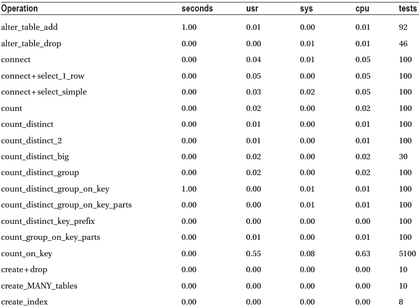
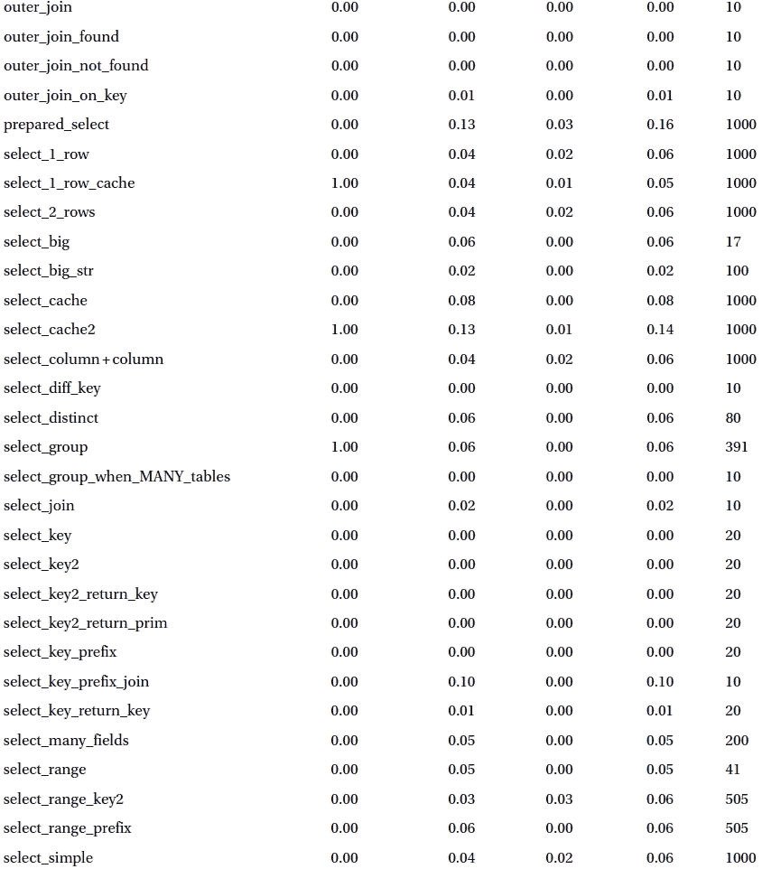

第四章


测试驱动的 MySQL 开发

系统集成商必须克服他们正在集成的系统的局限性，但有时系统缺少集成所需的某些功能或命令。Oracle 认识到了这一点，并在 MySQL 服务器中包含了添加新功能和命令的灵活选项。本章介绍了为 MySQL 系统生成高质量扩展的一个关键要素。我讨论了软件测试，并解释了测试大型系统的一些常见实践，使用具体的例子来说明测试 MySQL 系统的公认实践。

背景

为什么在书中这么早就包含一章关于测试的内容呢？您需要了解可用的测试功能，以便您可以通过首先计划如何测试它们来计划您自己的修改。这是测试驱动开发的前提:从需求出发开发并实现测试，编写代码，然后立即执行测试。对于不熟悉这个概念的人来说，这听起来可能有点违反直觉——毕竟，如何为尚未编写的代码编写测试呢？

在接下来的部分中，我将通过提供一些关于这个越来越流行的概念的背景信息来澄清。

为什么要测试？

当我讲授软件质量问题时，我经常被问到，“为什么要测试？”一些学生想知道多少测试是足够的。我给那些觉得测试在很大程度上是浪费时间的学生，或者觉得测试被高估的学生，提供了一个机会，让他们使用最少测试或者不测试的策略来完成他们的课堂项目 [<sup>1</sup>](#Fn1) 。结果通常很有趣，也很有启发性。[2<sup>2</sup>T7】](#Fn2)

这些学生经常讨论他们如何编写他们的模块和类，以及他们如何小心地使用好的建模实践。许多人使用统一建模语言(UML)图表来帮助他们的软件开发。虽然这些都是好的实践，但是测试不仅仅是确保你的源代码与你的模型相匹配。那些坚持认为他们的高度磨练的编码技能已经足够的学生经常产生具有特性和功能问题的项目可交付物。

尽管这些项目中的大部分不会遭受致命的错误或崩溃(这在开发过程中经常发现)，但是它们经常在集成和软件如何工作方面存在问题。也就是说，学生们无法确保他们的软件按照客户期望的方式工作。

如果这发生在你身上，你现在知道软件测试的价值了。当时，选择*哪种*技术使用*是软件测试科学的真正本质。*

 **提示**专业软件测试人员(有时被称为质量控制工程师或质量保证工程师)对软件有着非常不同的看法。如果你曾经和一个专业的软件测试人员一起工作，花时间学习理解他们如何进行软件测试。他们通常对软件如何工作有着难以置信的洞察力——很少有开发人员能够成功地磨练这种洞察力。如果他们破坏了你的代码，不要感到尴尬——那是他们的工作，大多数人都很擅长！

测试与调试

虽然他们通常有相同的目标——识别缺陷，但是调试和测试并不相同。调试是一个交互式过程，旨在通过揭示源代码的内部工作方式来定位源代码逻辑中的缺陷。另一方面，测试在不检查源代码内部工作的情况下识别源代码执行中的缺陷。

测试驱动开发

测试驱动开发通常与敏捷编程联系在一起，并且经常被采用极限编程(XP)方法的组织所使用。这听起来可能很可怕，但是这里有一个关于 XP 的秘密:你不必采用 XP 来使用敏捷实践！

我经常遇到这样的开发人员，他们对采用敏捷实践深感忧虑，因为不知情的人抛出了所有负面的宣传。那些认为传统的软件工程过程一成不变的人认为敏捷实践是为了用更少的资源做更多的事情而设计的，因此，他们是劣等的。其他人认为敏捷实践“剔除了需求分析和设计的混乱”，从而“专注于代码”这些都不是真的。

敏捷实践旨在简化软件开发，重新吸引客户，只生产*需要的*和需要的*，并专注于手头的工作(客户想要的)。敏捷方法的焦点是客户，而不是过程。显然，重点是在分析和设计上。*

此外，敏捷实践被设计成既可以作为一个集合使用，也可以有选择地在应用程序中使用。也就是说，组织被鼓励采用他们认为合适的敏捷实践，而不是双脚跳进去，把他们工程师的世界颠倒过来。这是负面炒作背后的一个原因——以及那些试图在太短时间内做太多事情的组织所报告的失败。 [<sup>3</sup>](#Fn3) 如果你想了解更多关于敏捷方法与传统方法之争的信息，请浏览敏捷联盟网站，`http://www.agilealliance.org`。

一个非常有用的敏捷实践是测试驱动开发。测试驱动开发的哲学很简单:从解决方案的基本模型开始，编写测试，运行测试(这将失败)，编码解决方案，并用测试验证它(当未更改的测试通过时)。虽然这听起来很直观，但它的复杂程度令人惊讶。在代码听起来倒退之前创建测试。你怎么能测试一个不存在的东西？这有什么帮助？

首先开发测试可以让你专注于软件的设计，而不是代码。我将解释一个典型的测试驱动的敏捷开发过程，以便您可以看到测试驱动的开发是如何补充设计并实际驱动源代码的。这听起来很奇怪，但给它一个机会，它会有意义。

测试驱动开发从一个简单的系统模型开始，通常是系统中基本类的简单类图。类图只设置了空的类块，只标注了类的*建议的*名称。我说*提议*是因为这通常是习惯于传统方法的开发人员被难住的地方。在敏捷实践中，没有什么是一成不变的，任何事情都可能是变化的候选(这种实践被称为*重构*)——它只是必须有意义，并推进生产客户想要的软件的最终目标。

什么是重构？

重构是一个批判性分析的过程，它会问:“如何才能做得更好？”例如，当检查代码的缺陷修复或添加新特性时，实践重构的开发人员会寻找更好的方法来重新组织代码，以使其更高效、更易于维护。因此，重构的目标是改进软件的非功能方面。

虽然重构通常与源代码相关联，但前提适用于软件开发的所有领域，从精炼源代码到精炼测试以获得更大的覆盖范围。

一旦一个初始的类图被创建，它就被复制、搁置，并被称为*域模型*，因为它描述了你的类的初始布局。从那里，用例图和补充的用例场景(用例的文本描述和可选的执行顺序)被创建。每一个用例都被一个序列图所扩充，这个序列图描绘了被引用的类所需要的功能。

随着每个类开始成形，您开始编写测试。即使这些类不存在，您仍然必须编写测试——它们形成了集成、系统和接口测试的混合体(都是白盒技术),其中每个测试测试领域模型中的一个类。

 **注意** *白盒*测试是在不知道系统如何构造的情况下进行的测试。*黑盒*测试是在已知系统内部结构的情况下测试系统的行为。

对于大多数敏捷实践来说，在这一点上，从这个序列的第一次迭代中获得的经验被合并到设计的适当部分(用例，序列图，等等)。)并进行适当的更改。

 **注意**一些敏捷实践者通过使用健壮性图在流程中增加了另一个建模步骤。这种适应非常类似于 ICONIX 过程。关于 ICONIX 流程的更多信息，请参见“*使用 ICONIX 流程的敏捷开发*” [<sup>4</sup>](#Fn4) 

有时这些变化包括新类的发现、现有类的重组，甚至是类的方法和属性的制定。换句话说，在编写代码之前编写测试有助于验证设计。这真的很酷，因为一旦您完成了您想要的迭代设计级别，并开始编写源代码，您的测试就完成了！您可以简单地运行它们，并证明您的代码按设计运行。当然，如果你需要改变测试，从而改变设计——这就是敏捷开发的美妙之处。

标杆

*基准测试* 旨在建立软件的性能特征。您可以使用基准测试来建立一个已知的性能水平(称为*基线*，然后在软件执行的环境发生变化后再次运行基准测试，以确定这些变化的影响。这是基准测试最常见的用途。其他包括识别负载下的性能限制，管理系统或环境的变化，以及识别可能导致性能问题的条件。

通过运行一组测试系统的测试来执行基准测试，并存储性能计数器的结果，称为基准测试。它们通常被存储或存档，并用系统环境的描述进行注释。例如，精明的数据库专业人员经常在他们的档案中包括系统配置和环境的基准和转储。这允许他们将系统过去的表现与当前的表现进行比较，并识别系统或其环境的任何变化。

测试通常是功能性的，目标是测试系统的特定特性或功能。基准测试工具包括广泛的测试，这些测试在轻、中和重负载下检查系统的一切，从普通到最复杂的操作。

尽管大多数开发人员只在发生一些奇怪的事情时才考虑运行基准测试，但是以固定的时间间隔或者甚至在重大事件(比如系统或环境的变化)之前和之后运行基准测试是非常有用的。记得在第一次创建基线时运行您的基准。在没有基线的情况下，在事件之后进行的基准测试不会有很大帮助。

良好基准的指导方针

许多良好的实践都与基准测试相关联。在这一节中，我将带您了解一些我发现的有助于从基准测试中获得最大收益的方法。

首先，始终考虑前后快照的概念。不要等到对服务器进行了更改之后才看它与六个月前的基线相比如何——六个月内会发生很多事情。相反，在改变之前测量系统，进行改变，然后再次测量系统。这将为您提供三个指标来进行比较:系统的预期性能、变更前的性能以及变更后的性能。你可能会发现发生了一些事情，使你的变化或多或少的重要。例如，假设您的基准包括一个查询时间指标。六个月前为给定的测试查询建立的基线被设置为 4.25 秒。您决定修改正在测试的表的索引。运行 before 基准测试得到的值是 15.50，after 基准测试得到的值是 4.5 秒。如果你没有拍下之前的照片，你不会知道你的改变极大地提高了性能。相反，您可能会得出结论，该更改导致查询执行速度稍慢，这可能会导致您撤消该更改，从而导致返回到较慢的查询。

这个例子暴露了我想警告你的几个方面。如果您正在对预计存储的数据量会增长的系统进行数据检索性能基准测试，那么您需要更频繁地运行基准测试，以便您可以将数据增长的影响与系统性能对应起来。在前面的示例中，您可能认为 before 值对于系统条件(如数据负载)来说是“正常”的。

此外，要小心确保你的测试对你所测量的是有效的。如果您正在对一个表的查询性能进行基准测试，那么您的基准测试是针对应用程序级别的，对于预测一般意义上的系统性能没有用处。将应用程序级别的基准与更一般的指标分开，以避免得出错误的结论。

与前后概念相关的另一个好的实践是，在一段受限的活动期间(在一致的负载下)运行几次基准，以确保它们不会受到局部活动的影响，例如流氓流程或资源密集型任务。我发现运行基准测试多达几十次允许我确定结果的平均值。您可以使用许多技术来创建这些聚合。例如，您可以使用统计软件包来创建基本的统计数据，或者使用您最喜欢的统计友好的电子表格应用程序。 [<sup>5</sup>](#Fn5)

 **注意**一些基准测试工具为你提供了这个特性。唉，MySQL 基准套件没有。

也许最有用的实践是一次改变一件事。不要对你的服务器进行大范围的修改，并期望从结果中得出任何有意义的结论。在这种情况下经常发生的是，六个左右的变化中的一个会对其他几个变化的增益产生负面影响，而其余的变化对性能的影响很小或没有影响。除非你一次做一个改变，否则你不知道哪个改变对系统有负面、正面或中性的影响。

尽可能使用真实数据。有时制造的数据包含恰好落入指定字段范围的数据，因此从不测试系统的某些特性(域和范围检查等)。).如果您的数据经常变化，您可能希望在某个时候对数据进行快照，并且每次都使用相同的数据集来构建您的测试。虽然这将确保您使用真实数据测试性能，但是，它可能无法测试性能随时间的增长而下降的情况。

最后，当解释你的基准结果和管理你的期望时，设定现实的目标。如果你试图在某些条件下提高系统的性能，在你设定目标之前，要牢牢把握已知的后果。例如，如果您正在检查将网络接口从千兆位连接切换到执行网络通信速度快 100 倍的接口的效果，您的服务器将不会以快 100 倍的速度执行其数据传输。在这种情况下以及类似的情况下，硬件增加的价值应该与硬件的成本以及使用新硬件的预期收益进行权衡。换句话说，您的服务器应该执行得更快一些，从而为您省钱(或增加收入)。

如果您估计您需要将网络性能提高 10%才能达到季度支出和收入目标，从而实现节约，请将该值作为您的目标。如果你的基准显示你已经达到了预期的改进(或者，更好的是，超过了预期)，向你的老板要求加薪。如果基准测试显示绩效指标没有达到目标，告诉你的老板你可以通过退回硬件来帮他省钱(然后要求加薪)。无论哪种方式，你都可以用经验数据来支持你的观点:你的基准！

基准数据库系统

您可能同意基准测试是您的武器库中非常强大的工具，但是基准测试与数据库服务器到底有什么关系呢？答案是——很多。了解数据库服务器何时性能最佳，可以让您在繁重的查询处理负载期间设置一个衡量性能下降的标准。更确切地说，您如何判断资源密集型查询是性能问题的原因还是结果？

您可以在许多级别上对数据库服务器进行基准测试。最值得注意的是对数据库模式的基准更改。您可能不会为单个表创建测试(尽管您可以这样做)，但是您更可能对数据库模式的更改如何影响性能感兴趣。

对于新的应用程序和数据库来说尤其如此。您可以创建几个模式，用数据填充它们，并编写旨在模拟提议的系统的基准测试。(又是那个测试驱动的东西。)通过创建备选模式并对它们进行基准测试，甚至可能进行多次迭代的更改，您可以快速确定哪个模式最适合您正在设计的应用程序。

您还可以针对特殊用途对数据库系统进行基准测试。例如，您可能希望检查数据库系统在各种负载或环境下的性能。要确定新的 RAID 设备是否会提高性能，还有什么比运行前后基准测试更好的方法，可以知道环境的变化会产生多大的影响呢？是的，it *是关于成本的*，基准测试将有助于管理您的数据库系统成本。

剖析

有时，除非系统处于负载之下，否则缺陷不会显现出来。在这些情况下，系统可能会变慢，但不会产生任何错误。你如何发现这些类型的问题？您需要一种在系统运行时检查系统的方法。这个过程被称为*剖析*。一些作者将分析和调试放在一起，但是分析不仅仅是一个调试工具。概要分析允许您在基准测试中检测到性能瓶颈和潜在问题之前就识别它们。分析通常是在检测到问题之后进行的，有时也是确定问题根源的一种手段。使用性能分析，您可以发现或监控内存和磁盘消耗、CPU 使用、I/O 使用、系统响应时间以及许多其他系统参数。

术语*剖析图*(或*剖析图*)有时与执行目标系统参数的测量相混淆。性能指标的识别被称为*诊断操作*或*技术* (或有时称为*跟踪* )。管理这些诊断操作并允许您对系统运行这些操作的系统称为 profiler。因此，分析是使用探查器的诊断操作的应用。

分析器通常会生成报告，其中包括在固定时间段内系统的机器可读记录。这些类型的性能测量通常被称为轨迹，因为它们随着时间的推移跟踪系统的路径。其他分析器被设计用来产生人类可读的打印输出，详细说明系统的哪个部分执行时间最长，或者更常见的是，系统在哪里花费了大部分时间。这种类型的探查器通常用于监视 I/O、内存、CPU 和线程或进程等资源。例如，您可以发现您的线程和进程正在执行什么命令或功能。如果您的系统在线程或进程头中记录了额外的元数据，您可能还会发现线程或进程阻塞和死锁的性能问题。

 **注意**死锁的一个例子是当一个进程拥有对一个资源的锁(独占访问),并且正在等待另一个资源，该资源又被另一个正在等待第一个资源的进程锁定。死锁检测是精心设计的数据库系统的一个关键属性。

您还可以使用分析来确定哪些查询的性能最差，甚至哪些线程或进程的执行时间最长。在这些情况下，您可能还会发现某个线程或进程正在消耗大量资源(如 CPU 或内存)，因此会采取措施纠正问题。在有大量用户访问中央资源的环境中，这种情况并不少见。

有时，系统的某些请求会导致一个用户的行为(合法的或不合法的——让我们希望是合法的)可能会影响到其他用户。在这种情况下，您可以正确地识别出有问题的线程或进程及其所有者，并采取措施来纠正问题。

在开发系统时，概要分析也是一个强大的诊断工具，因此倾向于称之为调试工具。您可以获得的关于您的系统的报告类型可能会导致您的源代码中出现各种意想不到的低效率。但是，注意不要过度。您可能会花费大量的时间来分析一段需要很长时间执行的源代码，这样您可能永远也不会完全满足识别瓶颈的期望。记住，有些事情需要一段时间来执行。磁盘 I/O 或网络延迟就是这种情况。通常，除了重新设计你的架构，减少对慢速资源的依赖，你不能做太多。当然，如果你正在设计一个嵌入式实时系统，这可能确实是一个有效的努力，但是通常不值得努力去改进你不能控制的东西。

然而，您应该始终努力使您的代码尽可能高效地运行。如果您发现可以使用概要分析来改进您的代码，那么尽一切办法去做。只是不要忘乎所以地试图识别或跟踪这些小事情。先买大件商品。

基准测试还是侧写？

基准测试和剖析之间的区别有时会被混淆。*标杆管理*建立绩效评级或衡量标准。概要分析根据系统的性能来识别系统的行为。

基准测试用于在给定的配置下建立已知的性能特征，而分析用于识别系统在哪里花费了大部分的执行时间。因此，基准测试用于确保系统的性能达到或优于给定的标准(基线)，而概要分析用于确定性能瓶颈。

软件测试简介

软件测试对我们的行业越来越重要，因为很久以来就很清楚，软件系统失败的一个重要原因是缺乏足够的测试或进行测试的时间。

然而，测试进行的方式和测试本身的目标有时会引起争论。例如，一个设计良好的测试的目标是检测缺陷的存在。听起来很对，不是吗？想一想——这意味着成功的测试是发现了缺陷的测试。那么，如果测试没有发现任何缺陷会怎么样呢？测试失败是因为写得不正确，还是没有产生任何错误？这些争论(以及其他许多争论)是软件测试研究人员感兴趣的话题。

一些软件测试人员(让我们简称他们为测试人员)认为一个测试如果没有发现任何缺陷就是成功的，这并不等同于说一个成功的测试就是发现了缺陷。如果你站在这些测试人员的角度来看，一个系统有可能通过测试(所有测试都是成功的)，但仍然有缺陷。在这种情况下，重点是测试而不是软件。此外，如果在测试后发现缺陷，很少会被认为是测试失败。

然而，如果你认为成功的测试就是发现缺陷，那么只有当软件没有缺陷时，你的测试才会失败。因此，当没有发现缺陷时，目标就变成了使测试更加健壮，这样他们就可以发现更多的缺陷。

功能测试与缺陷测试

测试人员通常关注于确保系统按照规范(也称为需求文档)的方式执行。他们经常进行测试来验证规范的功能，因此并不试图寻找缺陷。这种类型的测试被称为*功能测试*，有时也被称为*系统测试*。测试是在不了解系统内部工作原理的情况下创建的(称为*黑盒测试*),通常被写成以用户为中心的软件功能的逐步练习。例如，如果系统包括打印功能，可以编写功能测试来使用首选和备选执行场景执行打印功能。在这种情况下，成功的测试将表明打印功能正常工作，并给出正确的输出。功能测试只是众多测试类型中的一种，软件工程师和测试人员可以使用它来确保他们生产出高质量的产品。

第一个观点，*缺陷测试，是*给定一组有效和无效的输入数据，导致系统失败的有目的的意图。这些测试通常是用软件内部工作的知识编写的(通常被称为*白盒测试*)。构建缺陷测试是为了在测试软件的所有门和阈值条件的同时，对软件的特定组件的源代码执行所有可能的执行场景(或路径)。例如，如果您要为打印功能示例编写缺陷测试，您将编写不仅测试该功能的正确操作，而且测试每个已知的错误处理程序和异常触发器的测试。也就是说，您将编写测试来有目的地尝试破坏代码。在这种情况下，在没有识别缺陷的情况下完成的缺陷测试可以被认为是一个失败的测试(或者简单的否定——“失败”给人一种有问题的印象，但是实际上没有；简单来说，这种情况下没有发现错误)。[6<sup>6</sup>T7】](#Fn6)

出于本书的目的，我提出了功能和缺陷测试观点的结合。也就是说，我向您展示了如何进行具有检测缺陷的内置特性的功能测试。我们将使用的测试机制允许您使用执行 SQL 语句的测试对 MySQL 服务器进行功能测试。虽然您可以构建简单测试功能的测试，但是您也可以构建识别缺陷的测试。事实上，我建议您编写所有的测试来测试错误处理程序和异常。如果您的测试未能识别缺陷，或者稍后向您报告了一个 bug，您可以创建一个测试或者修改一个现有的测试来测试该 bug 的存在。这样，您可以在修复之前重复错误，然后显示错误已被修复。

软件测试的类型

软件测试通常在一个受约束的过程中进行，这个过程从分析系统需求和设计开始。然后使用需求和设计来创建测试，以确保质量(正确性、健壮性、可用性等)。)的软件。正如我前面提到的，一些测试是为了识别缺陷而进行的，而另一些测试是用来验证功能而没有错误的(这并不等同于没有缺陷)。一些测试技术的目标是建立对软件的评价或评估。这些测试通常侧重于定性因素，而不是定量结果。

测试是一个更大的软件工程咒语的一部分，它确保软件满足它的需求并交付期望的功能。这个过程有时被称为*验证和确认* 。这些很容易混淆。验证仅仅意味着你要确保软件是按照它的规格来构建的。验证仅仅意味着您遵循了正确的流程和方法来创建它。换句话说，验证会问，“我们构建了正确的产品吗？”验证会问，“我们是否正确地构建了产品？”

虽然许多软件开发过程包括验证和确认活动，但是大多数开发人员将过程中确认满足规范的部分称为*软件测试*。此外，验证过程通常与测试系统的功能和功能中不存在缺陷而不是软件的正确性相关联。

你可以进行许多类型的软件测试。事实上，在早期的项目计划中，经常会有关于什么类型的测试应该或者不应该被要求的热烈讨论。幸运的是，大多数开发人员都认为测试是软件开发的重要组成部分。然而，根据我的经验，很少有人理解不同类型的软件测试的作用。只有你可以选择什么是适合你的项目。我的目标是解释一些比较流行的软件测试类型，这样你就可以应用那些对你的需求最有意义的测试。

下面的章节描述了流行的软件测试技术，它们的目标和应用，以及它们与持续测试驱动开发的关系。正如您将看到的，测试的传统阶段是持续测试工作中的里程碑。

集成测试

集成测试是在系统由基本构件组装而成时进行的。测试通常首先测试单个组件，然后是这个组件和另一个组件，依此类推，直到整个系统被集成。这种形式的测试最常用于使用半独立组件构建的大型开发项目。

组件测试

组件测试是在独立的测试运行中，在系统的半独立部分(或组件)上进行的。也就是说，组件是通过调用它的所有方法和查询它的所有属性来实现的。组件测试通常以测试工具的形式构建，提供测试组件所需的所有外部通信。这包括任何依赖组件，这些组件是使用代码脚手架模拟的(有时称为模拟或存根组件)。这些代码支架提供了所有必要的输入和输出来交流和测试被测试的组件。

接口测试

接口测试是在组件本身的接口上进行的，而不是在组件上。目的是表明该接口提供了所有需要的功能。这种类型的测试通常与组件测试一起完成。

回归测试

回归测试确保软件的任何添加或修正不会影响到软件的其他部分。在这种情况下，将再次运行过去运行过的测试，并将结果与上一次运行的结果进行比较。如果结果是相同的，那么变更不会影响功能(在测试编写的范围内)。这种类型的测试通常使用自动化测试软件，允许开发人员(或测试人员)在无人值守的情况下运行测试。在大部分测试完成后，对结果进行比较。自动化测试是敏捷开发哲学中的一个流行概念。

路径测试

路径测试确保所有可能的执行路径都得到执行。测试是在完全了解源代码的情况下编写的(白盒测试)，通常不关心是否符合规范，而是关心系统准确遍历所有条件路径的能力。然而，很多时候，这些测试是在考虑功能的情况下进行的。

阿尔法阶段测试

传统上，一旦稳定的开发质量系统准备好了，alpha 阶段测试就开始了。这通常发生在生产软件的早期阶段。这个阶段的测试有时是为了确保系统已经达到了可以使用大部分功能的稳定性水平(可能有小的缺陷)。这可能包括运行部分测试，以验证系统在保护条件下工作。被认为是 alpha 的系统通常是完整的，可能包括一些已知的缺陷问题，范围从轻微到中等。通常，通过 alpha 测试就结束了 alpha 阶段，项目进入 beta 阶段。

在这一点上，系统是足够完整的，因此所有测试都是针对实际代码运行的，并且不需要搭建(存根类)。当测试结果满足被认为是测试版的项目参数时，项目进入测试阶段。

测试阶段测试

一个项目通常被认为是一个稳定的产品质量系统，当它拥有一套完整的功能，但可能包括一些尚未变得有效的特性，或者可能需要额外的健壮性工作(硬化)。在这个阶段运行的测试通常是针对所交付的特性的一整套测试。如果发现缺陷，它们通常是轻微的。这种类型的测试可以包括由目标受众和客户进行的测试。这些小组在他们的测试方法上不太科学，但是他们给开发人员提供了一个机会来和客户一起检查他们的系统，并做一些小的修正来改进他们的产品。通过 beta 测试意味着软件已经准备好最终发布。

在测试驱动的开发环境中，beta 测试是持续测试工作中的另一个里程碑。测试驱动开发下的测试版通常是大多数特性相对于测试结果表现良好的点。系统的稳定性水平通常被判断为产生很少的缺陷。

发布、功能和验收测试

发布测试通常是功能测试，通过它来验证系统是否满足其规格，并且该测试在系统交付给客户之前进行。与测试阶段一样，一些组织选择让客户参与这个测试阶段。在这种情况下，测试方法通常被称为*验收测试，*因为是客户决定软件是否满足他们的规格。测试驱动的开发环境会将这些里程碑视为测试的完成。

可用性测试

可用性测试在系统完成后或接近完成时进行，有时与功能和发布测试并行进行。可用性测试的目标是确定用户与系统的交互有多好。通常没有通过或失败的结果，而是一个喜欢和不喜欢的列表。虽然可用性测试非常主观，并且仅仅基于用户的偏好，但是它有助于创建能够赢得用户忠诚度的软件。

可用性测试最好在实验室里完成，这个实验室被设计用来记录用户的反应和建议，以备日后查阅。这使得用户可以专注于软件而不会分心。然而，大多数可用性测试都是在非正式的环境下进行的，开发者观察用户使用系统的情况，或者给用户一段时间使用软件，然后她的评论被作为调查或采访的一部分。

可靠性测试

可靠性测试通常旨在改变系统上的负载，并用复杂的数据和不同数量的负载(数据)来挑战系统，进行可靠性测试是为了确定系统在一段时间内的持续运行情况。可靠性通常以系统持续运行的小时数和每小时或每次测试的缺陷数来衡量。

性能测试

执行性能测试是为了建立性能行为(基准测试)或确保系统在已建立的指导方针内运行。被检查的系统的方面有时包括可靠性以及性能。极端负载下的性能(称为压力测试)有时会在这种测试中进行检查。

 **注意**可用性、可靠性和性能测试是可以在传统测试或测试驱动的开发环境中进行的测试形式。

测试设计

既然您已经简要介绍了软件测试以及您可以在自己的项目中进行的测试类型，那么让我们将注意力转向测试是如何构造的。所有不同的构建测试的哲学最终都是为了锻炼、确认或验证软件或其过程的某个方面。让我们看看三个最突出的基本哲学。

基于规范的测试

基于规格的测试(有时称为*功能测试* )测试软件需求和设计。重点是验证软件是否符合其规格。这些测试通常是基于一个给定的需求或者一组需求而构建的。测试被组织成功能集(有时被称为*测试套件*)。当一个系统被构建时，测试集可以在需求完成时或者在过程的任何时候运行，以验证对需求的持续符合性(也称为*回归测试* )。

分区测试

分区测试关注系统的输入和输出数据特征。它们测试被测输入或输出数据的外部、边缘和平均值范围。例如，假设系统被设计为接受 1 到 10 范围内的正整数值的输入。您可以通过测试值{0，1，5，10，11}来形成这些数据的分区(称为等价分区或域)。有些可能更进一步，包括负值，如 1。这个想法是，如果系统执行范围检查，边界条件比有效的，甚至是完全无效的数据更有可能出现缺陷。

在我们前面的例子中，没有必要测试大于 11 的值，除非您想测试内部数据收集代码(系统中读取和解释输入的部分)。大多数现代系统使用系统级调用来管理数据输入，这些调用本质上是非常可靠的(例如，Microsoft Windows Forms)。最有趣的是，您还可以为输出数据形成分区。在这种情况下，测试旨在测试系统如何接受已知数据(好的或坏的)并产生结果(好的或坏的)。在这种情况下，测试试图验证输入数据处理的鲁棒性和准确性。分区测试有助于证明系统满足性能和健壮性方面的要求。

结构测试

结构测试(有时称为*架构测试* )确保系统是根据指定的布局(或架构)构建的——也就是说，验证系统符合规定的结构。这种性质的测试旨在确保某些接口可用并正常工作，并且组件能够正常工作。这些测试类别包括所有形式的白盒测试，其目标是测试系统中的每一条路径(被称为*路径测试* )。这些测试可以被认为是验证的一种，因为它们确定了架构是否被正确构建，以及它是否遵循了规定的过程。

MySQL 测试

你可以用很多方法测试 MySQL 系统。您可以使用 mysqlshow 命令测试服务器连接和基本功能，使用客户端工具手动运行测试，使用基准测试工具建立性能特征，甚至在服务器上进行分析。大多数数据库专业人员选择的工具是 MySQL 测试套件和 MySQL 基准测试工具。以下部分描述了这些工具和技术。

使用 MySQL 测试套件

Oracle 提供了一个强大的测试工具，名为 MySQL Test Suite，一个名为 mysqltest 的可执行文件，以及一组 Perl 模块和脚本，旨在测试系统并比较结果。[表 4-1](#Tab1) 列出了一些相关的目录及其内容。测试套件附带了 Unix/Linux 二进制和源代码发行版，尽管它包含在一些 Mac 和 Windows 发行版中。

[表 4-1](#_Tab1) 。mysql-test 目录下的目录

| 目录 | 内容 |
| --- | --- |
| /收藏 | 在集成和发布测试期间执行的测试组 |
| /r | 结果文件的主套件 |
| /std_data | 测试套件的测试数据 |
| /套件 | 也称为“suites”，包含特定功能测试的子文件夹，例如 binlog、(存储)引擎和复制 |
| /t | 主套件测试 |

 **注意**MySQL 测试套件目前不能在 Windows 环境下运行。如果您想通过 MySQL 代码贡献计划为 MySQL 的开发做出贡献，这将是一个很好的项目。如果建立了 Perl 环境并且安装了 Perl DBI 模块，它可以在 Cygwin 环境中运行。有关更多详细信息，请参见 MySQL 参考手册中的“Perl 安装说明”。

安装 MySQL 后，您会在安装目录下的 mysql-test 目录中找到 mysql-test-run.pl Perl 脚本。最重要的是，测试套件是可扩展的。您可以编写自己的测试，并针对您的特定应用程序或需求进行测试。这些测试被设计为回归测试，从这个意义上说，这些测试旨在确保所有功能都像过去一样工作。

这些测试位于 mysql-test 目录下的一个名为 simply /t 的目录中。该目录包含近 740 个测试以及所有套件中的 3400 多个测试。虽然这听起来可能很全面，但是 MySQL 文档指出测试套件并没有涵盖系统的所有特性或细微差别。当前的测试集旨在检测大多数 SQL 命令、操作系统和库交互以及集群和复制功能中的错误。Oracle 希望最终积累足够的测试，为整个系统提供测试覆盖。目标是建立一组测试，测试 MySQL 系统的所有特性。如果您创建的附加测试覆盖了 mysql-test/t 目录中的某个测试尚未覆盖的特性，请随时将您的测试提交给 Oracle。

 **提示**您可以通过访问 MySQL Internals 邮件列表找到关于 MySQL 测试套件的更多信息(参见`http://lists.mysql.com/`了解更多细节并查看可用列表)。您也可以通过向列表发送电子邮件来提交要包含的测试。如果您决定将您的测试发送到 Oracle 以包含在测试套件中，请确保您使用的数据是您可以向世界展示的。每个人都可以参加考试。例如，我确信你的朋友和亲戚不希望他们的电话号码出现在 MySQL 的每个安装中！

对于每个测试，相应的结果文件存储在 mysql-test/r 目录中。结果文件包含测试运行的输出，用于比较(使用 diff 命令)测试运行时的结果。在许多方面，结果文件是测试输出的基准。这使您能够创建测试并保存预期的结果，然后稍后运行测试并确保系统产生相同的输出。

你必须小心使用这个前提。可以使用本质上在两次执行之间会发生变化的数据值，但是它们需要额外的命令来正确处理。不幸的是，这样的数据值会被测试套件忽略，而不是直接比较。因此，如果在测试中使用，时间和日期字段是可能导致一些问题的数据类型。稍后我将详细讨论这个主题和其他命令。

运行测试

使用测试套件运行测试很容易。只需导航到 mysql-test 目录并执行命令。这将启动测试可执行文件，连接到服务器，并运行/t 目录中的所有测试。因为运行所有测试可能需要一些时间，所以 Oracle 编写了测试套件，允许您按顺序执行几个测试。例如，以下命令将只运行名为 t1、t2 和 t3 的测试:

```sql
% > ./mysql-test-run.pl t1 t2 t3
```

测试套件将按顺序运行每个测试，但如果有任何测试失败，就会停止运行。要覆盖此行为，请使用- force 命令行参数来强制测试套件继续进行。

测试套件被设计为执行它自己的 mysqld 可执行文件实例。这可能与您计算机上运行的另一个服务器实例冲突。在运行测试套件之前，您可能需要关闭 MySQL 服务器的其他实例。如果您从源目录使用测试套件，您可以通过编译源代码来创建 mysqld 可执行文件。如果您想测试您在服务器中已经更改的内容，但是不想或者不能关闭现有的服务器来这样做，这将非常方便。

 **注意**只要服务器没有使用 13000 及以上的端口，您就可以在现有服务器旁边运行测试套件。如果是，测试套件可能无法正确运行，您可能需要停止服务器或将其更改为使用其他端口。

如果您想要连接到一个特定的服务器实例，您可以使用- extern 命令行参数来告诉测试套件连接到服务器。如果您有额外的启动命令或想要使用特定用户连接到服务器，您也可以添加这些命令。有关 mysql-test-run 脚本的可用命令行参数的更多信息，请输入命令% >。/mysql-test-run.pl - help

请访问`http://dev.mysql.com/doc/mysql/en/mysql-test-suite.html`了解更多详情。

 **注意**使用- extern 命令行参数需要包含您想要执行的测试的名称。一些测试需要服务器的本地实例来执行。例如，以下命令连接到正在运行的服务器，并执行别名和分析测试:perl MySQL-test-run . pl-extern alias analyze。

创建新测试

要创建您自己的测试，请使用标准文本编辑器在/t 目录下名为 mytestname.test 的文件中创建测试。

[***清单 4-1。***](#_list1) 样本测试

```sql
#
# Sample test to demonstrate MySQL Test Suite
#
--disable_warnings
SHOW DATABASES;
--enable_warnings
CREATE TABLE characters (ID INTEGER PRIMARY KEY,
                      LastName varchar(40),
                      FirstName varchar(20),
                      Gender varchar(2)) ENGINE = MYISAM;
EXPLAIN characters;
#
INSERT INTO characters (ID, LastName, FirstName, Gender)
             VALUES (3, 'Flintstone', 'Fred', 'M');
INSERT INTO characters (ID, LastName, FirstName, Gender)
             VALUES (5, 'Rubble', 'Barney', 'M');
INSERT INTO characters (ID, LastName, FirstName, Gender)
             VALUES (7, 'Flintstone', 'Wilma', 'F');
INSERT INTO characters (ID, LastName, FirstName, Gender)
             VALUES (9, 'Flintstone', 'Dino', 'M');
INSERT INTO characters (ID, LastName, FirstName, Gender)
             VALUES (4, 'Flintstone', 'Pebbles', 'F');
INSERT INTO characters (ID, LastName, FirstName, Gender)
             VALUES (1, 'Rubble', 'Betty', 'F');
INSERT INTO characters (ID, LastName, FirstName, Gender)
             VALUES (6, 'Rubble', 'Bam-Bam', 'M');
INSERT INTO characters (ID, LastName, FirstName, Gender)
             VALUES (8, 'Jetson', 'George', 'M');
#
SELECT * FROM characters;
#
EXPLAIN (SELECT DISTINCT LASTNAME from characters);
#
SELECT DISTINCT LASTNAME from characters;
#
# Cleanup
#
DROP TABLE characters;
# . . .and we're done.
```

注意，测试的内容只是创建一个表、插入一些数据，然后进行一些简单的选择的 SQL 命令。大多数测试比这要复杂一点，但是你会明白的。您创建您的测试来练习一些命令集(或数据处理)。注意前六行。前三行是注释行，它们以#符号开始。总是在文件的顶部用最简单的解释来记录你的测试，以表明测试在做什么。在测试体中使用注释来解释任何不容易理解的命令(例如，复杂的连接或用户定义的函数)。第四行和第六行很有趣，因为它们向测试套件发出命令。测试套件命令总是从前面有-的行开始。这些行指示测试套件暂时禁用然后启用来自服务器的任何警告消息。如果表格(字符)不存在，这是必要的。如果我让警告处于启用状态，在这种情况下测试将会失败，因为:

*   服务器会发出警告，或者
*   输出将与预期结果不符。

测试的一般布局应该在开始时包括一个清理部分，以删除由于测试失败而可能存在的任何表或视图。测试的主体应该包括完成测试所需的所有语句，测试的结尾应该包括清除测试中创建的任何表或视图的语句。

 **提示**在编写自己的测试时，Oracle 要求您使用 T1、T2、t3 等表名。和视图名称，如 v1、v2 或 v3 等。，以便您的测试表不会与现有的测试表冲突。

运行新测试

一旦创建了测试，您需要执行测试并创建预期结果的基线。执行以下命令，从 mysql-test 目录运行新创建的名为 cab.test 的测试:

```sql
% > touch r/cab.result
% > ./mysql-test-run.pl cab
% > cp r/cab.reject r/cab.result
% > ./mysql-test-run.pl cab
```

第一个命令创建一个空的结果文件。这确保了测试套件有可以比较的东西。下一个命令第一次运行测试。清单 4-2 描述了一个典型的首次运行测试结果。注意，测试套件表明测试失败并生成了一个差异报告。这是因为没有可比较的结果。为了简洁起见，我省略了一些更普通的语句。

[***清单 4-2。***](#_list2) 第一次运行新测试

```sql
Logging: ./mysql-test-run.pl  cab.test
120620  9:48:44 [Note] Plugin 'FEDERATED' is disabled.
120620  9:48:44 [Note] Binlog end
120620  9:48:44 [Note] Shutting down plugin 'CSV'
120620  9:48:44 [Note] Shutting down plugin 'MyISAM'
MySQL Version 5.6.6
Checking supported features. . .
 - skipping ndbcluster
 - SSL connections supported
 - binaries are debug compiled
Collecting tests. . .
Checking leftover processes. . .
Removing old var directory. . .
Creating var directory '/source/mysql-5.6/mysql-test/var'. . .
Installing system database. . .
Using server port 49261

==============================================================================

TEST                                      RESULT   TIME (ms) or COMMENT
--------------------------------------------------------------------------

main.cab                                 [ fail ]
        Test ended at 2012-06-20 09:48:49

CURRENT_TEST: main.cab
--- /source/mysql-5.6/mysql-test/r/cab.result       2012-06-20 16:48:40.000000000 +0300
+++ /source/mysql-5.6/mysql-test/r/cab.reject       2012-06-20 16:48:49.000000000 +0300
@@ -0,0 +1,52 @@
+SHOW DATABASES;
+Database
+information_schema

[. . .]

+DROP TABLE characters;

mysqltest: Result length mismatch

 - saving '/source/mysql-5.6/mysql-test/var/log/main.cab/' to '/source/mysql-5.6/mysql-test/var/log/main.cab/'
--------------------------------------------------------------------------
The servers were restarted 0 times
Spent 0.000 of 5 seconds executing testcases

Completed: Failed 1/1 tests, 0.00 % were successful.

Failing test(s): main.cab

The log files in var/log may give you some hint of what went wrong.

If you want to report this error, please read first the documentation
at http://dev.mysql.com/doc/mysql/en/mysql-test-suite.html

mysql-test-run: *** ERROR: there were failing test cases
```

差异报告显示了整个测试结果，因为我们的结果文件是空的。如果我们运行一个被修改的测试，差异报告将只显示那些不同的部分。这是一个非常强大的工具，每当开发人员对代码进行更改时，他们就用它来运行回归测试。它向他们展示了他们的代码是如何影响系统操作的已知结果的。

下一个命令将 cab.reject 文件中的最新结果复制到 cab.result 文件中。只有当您确定测试正确运行并且没有意外错误时，才执行这一步。确保这一点的一种方法是手动运行测试语句，并验证它们是否正常工作。只有这样，您才能将剔除文件复制到结果文件中。清单 4-3 描述了新测试的结果文件。请注意，输出正是您期望从手动执行中看到的，减去了通常漂亮的打印输出和列间距。

[***清单 4-3。***](#_list3) 结果文件

```sql
SHOW DATABASES;
Database
information_schema
mtr
mysql
performance_schema
test
CREATE TABLE characters (ID INTEGER PRIMARY KEY,
LastName varchar(40),
FirstName varchar(20),
Gender varchar(2)) ENGINE = MYISAM;
EXPLAIN characters;
Field       Type         Null             Key       Default       Extra
ID          int(11)      NO               PRI       NULL
LastName                 varchar(40)      YES       NULL
FirstName                varchar(20)      YES       NULL
Gender                   varchar(2)       YES       NULL
INSERT INTO characters (ID, LastName, FirstName, Gender)
VALUES (3, 'Flintstone', 'Fred', 'M');
INSERT INTO characters (ID, LastName, FirstName, Gender)
VALUES (5, 'Rubble', 'Barney', 'M');
INSERT INTO characters (ID, LastName, FirstName, Gender)
VALUES (7, 'Flintstone', 'Wilma', 'F');
INSERT INTO characters (ID, LastName, FirstName, Gender)
VALUES (9, 'Flintstone', 'Dino', 'M');
INSERT INTO characters (ID, LastName, FirstName, Gender)
VALUES (4, 'Flintstone', 'Pebbles', 'F');
INSERT INTO characters (ID, LastName, FirstName, Gender)
VALUES (1, 'Rubble', 'Betty', 'F');
INSERT INTO characters (ID, LastName, FirstName, Gender)
VALUES (6, 'Rubble', 'Bam-Bam', 'M');
INSERT INTO characters (ID, LastName, FirstName, Gender)
VALUES (8, 'Jetson', 'George', 'M');
SELECT * FROM characters;
ID      LastName       FirstName       Gender
3       Flintstone     Fred             M
5       Rubble         Barney           M
7       Flintstone     Wilma            F
9       Flintstone     Dino             M
4       Flintstone     Pebbles          F
1       Rubble         Betty            F
6       Rubble         Bam-Bam          M
8       Jetson         George           M
EXPLAIN (SELECT DISTINCT LASTNAME from characters);
id       select_type       table       type       possible_keys       key       key_len       ref       rows       Extra
1       SIMPLE       characters       ALL       NULL       NULL       NULL       NULL       8       Using temporary
SELECT DISTINCT LASTNAME from characters;
LASTNAME
Flintstone
Rubble
Jetson
DROP TABLE characters;
```

最后，我们使用预期的结果重新运行测试，测试套件报告测试通过了。清单 4-4 描述了一个典型的测试结果。

[***清单 4-4。***](#_list4) 试运行成功

```sql
Logging: ./mysql-test-run.pl  cab.test
120620  9:53:19 [Note] Plugin 'FEDERATED' is disabled.
120620  9:53:19 [Note] Binlog end
120620  9:53:19 [Note] Shutting down plugin 'CSV'
120620  9:53:19 [Note] Shutting down plugin 'MyISAM'
MySQL Version 5.6.6
Checking supported features. . .
 - skipping ndbcluster
 - SSL connections supported
 - binaries are debug compiled
Collecting tests. . .
Checking leftover processes. . .
Removing old var directory. . .
Creating var directory '/source/mysql-5.6/mysql-test/var'. . .
Installing system database. . .
Using server port 49273

==============================================================================

TEST                                      RESULT   TIME (ms) or COMMENT
--------------------------------------------------------------------------
main.cab                                 [ pass ]     28
--------------------------------------------------------------------------
The servers were restarted 0 times
Spent 0.028 of 7 seconds executing testcases

Completed: All 1 tests were successful.
```

创建自己的测试并运行它们很容易。你可以重复我刚才描述的过程，想做多少次测试就做多少次。这个过程遵循测试驱动开发的精神，首先创建测试，在没有结果证明的情况下运行它，创建解决方案(预期的结果)，然后执行测试并验证成功的测试完成。我鼓励您在创建自己的 MySQL 应用程序时，尤其是在扩展 MySQL 服务器时，采用同样的理念。

例如，假设您想要创建一个新的 SHOW 命令。在这种情况下，您应该创建一个新的测试来执行新命令，运行它，并建立测试结果。自然，测试每次都会失败，直到您实际创建新命令。好处是它允许您在实际编写代码之前关注命令的结果以及命令语法应该如何。如果您在所有的开发中采用这种实践，您将不会后悔，并且会看到代码质量的提高。一旦您实现了命令，并且通过再次运行测试并检查拒绝文件(或者手动运行命令)验证了它的工作，您就可以将拒绝文件复制到结果文件中，测试套件将在以后的测试运行中使用该结果文件进行验证(通过/失败)。

高级测试

MySQL 测试套件提供了一组丰富的命令，可以用来创建强大的测试。本节介绍一些更流行和有用的命令。不幸的是，没有全面的文档解释所有可用的命令。以下是我通过研究提供的测试和在线帖子找到的。

 **提示**如果您使用高级测试套件命令，您可以使用- record 命令 -line 参数来创建结果文件，以记录正确的结果。例如，您可以运行命令。/mysql-test-run.pl - record cab 记录 cab 测试文件的结果。

如果您期望某个错误发生(假设您正在测试错误的存在，而不是没有检测到它们)，您可以使用- error num 命令。这个命令告诉测试套件，您预期会出现指定的错误，并且当该错误出现时，它不应该使测试失败。该命令设计在产生错误的命令之前。您还可以指定附加的错误号，用逗号分隔。例如，- error 1550、1530 表示这些(虚构的)错误对于后面的命令是允许的。

您也可以在测试中使用控制代码流。例如，您可以使用一个循环来执行某件事情固定的次数。以下代码执行一个命令 100 次:

```sql
let $1 = 100;
while ($1)
{
  # Insert your commands here
  dec($1)
}
```

另一个有用的命令是睡眠。休眠命令将执行下一个命令前暂停的秒数作为参数。例如，- real_sleep 3.5 告诉测试套件在执行下一个命令之前暂停 3.5 秒。如果网络中存在意外的延迟，或者如果由于流量过大而导致测试失败，此命令会有所帮助。使用 sleep 命令将允许您减慢测试速度，从而减少由于外部因素导致的不良性能造成的任何干扰。

然而，使用 sleeps 通过克服服务器代码中的计时问题来使测试具有确定性是一种不良的实践。例如，插入休眠来测试从多个连接运行的查询是一个坏主意。鉴于多线程执行的性质，仅使用休眠来协调结果是不够的，尽管使用休眠可以使测试在一台机器上具有确定性(在这种情况下，连接 1 在连接 2 之前返回结果)，但它可能无法在另一台机器上工作。

如果您有兴趣查看关于命令的附加信息，请使用- enable_metadata 命令。这将生成并显示内部元数据，这些元数据可以帮助您调试复杂测试的命令。同样，如果您想禁止记录输出，请使用- disable_result_log 关闭记录，使用- enable_result_log 重新打开记录。

如果您的命令会导致数据在运行之间发生变化(比如日期或时间字段)，那么告诉测试套件忽略这些值，方法是使用- replace_column 列字符串命令替换另一个字符串。例如，如果您的输出在第二列中产生当前时间(列计数从 1 开始，而不是 0)，您可以使用命令- replace_column 2 CURTIME。这告诉测试套件，下一个命令的输出是用字符串“CURTIME”替换列 2。虽然这确实抑制了输出中的实际值，但它提供了一种忽略那些无法预测的值的方法，因为它们在测试运行之间会发生变化。

最后，如果您需要在测试中包含额外的测试命令，您可以使用-source include/filetoinclude . Inc 来包含 mysql-test/include 目录中的文件。这种做法在用一组常用命令组成测试套件的测试中很典型。

报告错误

您可能会在运行某个测试或创建自己的测试时发现一个 bug。Oracle 欢迎对测试套件的反馈，并提供了报告错误的方法。然而，在你发送电子邮件并撰写一份详细的失败报告之前，一定要彻底确认这个错误。

Oracle 要求您自行运行测试，并找出失败背后的确切命令和错误代码。首先确定这些错误是否是您的环境造成的(请参阅 MySQL 参考手册中的“操作系统特定说明”以了解潜在问题；请访问`http://dev.mysql.com/doc/refman/5.6/en/` `installing.html`了解更多详情)通过在全新安装或另一个已知良好的安装上运行测试。您还应该手动运行测试中的命令来确认错误和错误代码。有时，手动运行命令会揭示您无法通过其他方式获得的附加信息。在调试模式下运行服务器也可能有所帮助。最后，如果测试和错误条件可以重复，那么在提交错误报告时，将测试文件、测试结果、测试拒绝文件和任何测试数据都包含到 MySQL 中。

MySQL 基准测试

Oracle 提供了一个强大的基准测试工具，称为 MySQL 基准测试套件。这是 Perl 模块和脚本的集合，旨在测试系统保存性能指标的能力。基准测试套件附带了大多数二进制和源代码发行版，可以在 Windows 上运行。 [<sup>7</sup>](#Fn7) 当 MySQL 安装好后，你会在安装目录下的 sql-bench 目录中找到 run-all-tests 脚本。这些测试是在回归测试的意义上设计的，因为它们旨在记录系统在当前条件下的性能。基准测试套件也可以从 MySQL 开发者网站(`http://dev.mysql.com`)上单独下载，用于大多数操作系统。

 **注意**您需要安装 dbi 和 DBD::mysql 模块来使用基准测试工具。你可以从 MySQL 下载页面`http://dev.mysql.com/downloads/dbi.html`下载这些。

像大多数基准测试工具一样，MySQL 基准测试套件最适合用于确定系统和环境变化的影响。基准测试套件与测试套件有些不同，因为基准测试套件能够针对其他系统运行基准测试——您可以使用基准测试套件针对 MySQL、Oracle 和 Microsoft SQL Server 安装运行相同的基准测试。可以想象，这样做可以帮助您确定 MySQL 在您的环境中的性能比您现有的数据库系统好多少。要针对其他服务器运行基准，请使用- server = 'server '命令行开关。该参数的值包括 MySQL、Oracle、Informix 和 MS-SQL。

许多命令行参数控制着基准测试套件。[表 4-2](#Tab2) 列出了几个流行的，并解释了每一个。有关命令行参数的更多信息，请参见 sql-bench 目录中的自述文件。

[表 4-2](#_Tab2) 。MySQL 基准测试套件的命令行参数

| 命令行参数 | 说明 |
| --- | --- |
| 同-LOGUE | 将基准测试的结果保存到文件中。与- dir 选项一起使用，指定存储结果的目录。使用 Unix 命令 uname–a 的相同输出来命名结果文件。 |
| -用户 | 指定登录到服务器的用户。 |
| -密码 | 指定用户登录服务器的密码。 |
| 主持人 | 指定服务器的主机名。 |
| -小型测试 | 指定运行最小基准测试。省略这个参数会执行整个基准测试套件。对于大多数用途，小型测试足以确定更常见的性能指标。 |

要运行基准测试套件，只需导航到您的安装下的 sql-bench 目录并运行命令 run-all-tests。注意基准测试套件的一个重要特征:所有测试都是连续运行的。因此，测试是一次运行一个。要测试多个进程或线程的性能，请使用第三方基准测试套件，如 Sysbench 和 DBT2。

基准测试套件的另一个限制是它目前不可扩展。也就是说，没有为自己的应用程序创建自己的测试的工具。然而，源代码是免费分发的，所以精通 Perl 的人可以看一看。如果您创建了自己的测试，请确保与全球开发人员社区共享它们。您永远不知道—有人可能需要您创建的测试。

SYSBENCH 和 DBT2

SysBench 和 DBT2 是基准测试套件，用于在负载下测试系统。它们在`http://sourceforge.net/projects/sysbench/`和`http://osdldbt.sourceforge.net/#dbt2`可用。

 **提示**为了获得最佳结果，在运行基准测试之前禁用 MySQL 查询缓存。发出命令 SET GLOBALS query_cache_size = 0，关闭查询缓存；在 MySQL 客户端界面中。这将允许您的基准记录查询的实际时间，而不是系统从缓存中检索查询所需的时间。您将获得更准确的系统性能读数。

如果基本的基准集是您所需要的，那么您可以运行命令 run-all-tests - small-test 并为基本的测试集生成结果。虽然运行所有的测试可以确保对性能进行更彻底的测量，但也可能需要很长时间才能完成。另一方面，如果您确定了您想要测量的系统的特定部分，您可以通过独立地执行测试来运行单独的测试。例如，要测试与服务器的连接，可以运行 test-connect 命令。表 4-3 列出了一些可用的独立测试。

[表 4-3](#_Tab3) 。基准测试的部分列表

| 试验 | 描述 |
| --- | --- |
| test-ATIS.sh | 创建多个表格并对其进行若干选择 |
| test-connect.sh | 测试与服务器的连接速度 |
| test-create.sh | 测试创建表的速度 |
| test-insert.sh | 测试表的创建和填充操作 |
| test-wisconsin.sh | 运行该基准的 PostgreSQL 版本的一个端口 |

 **注意**基准测试套件在单线程中运行测试。Oracle 计划在未来将多线程测试添加到基准测试套件中。

有关 MySQL 的其他基准测试形式的更多信息，请参见 Michael Kruckenberg 和 Jay Pipes 的 *Pro MySQL* 。 [<sup>8</sup>](#Fn8) 它是 MySQL 所有东西的绝佳参考。

运行小型测试

让我们来看看在您的系统上运行基准测试工具时，您可以期待什么。在这个例子中，我在我的 Linux 系统上使用小测试运行了基准测试套件。[清单 4-5](#list5) 显示了生成的输出文件的顶部。

[***清单 4-5。***](#_list5) 小测试基准摘录

```sql
$ ./run-all-tests --small-test --password = XXX --user = root
Benchmark DBD suite: 2.15
Date of test:        2012-06-20 10:39:38
Running tests on:    Linux 2.6.38-15-generic x86_64
Arguments:           --small-test
Comments:
Limits from:
Server version:      MySQL 5.1.63 0ubuntu0.11.04.1
Optimization:        None
Hardware:

alter-table: Total time:  1 wallclock secs ( 0.02 usr  0.01 sys +  0.00 cusr  0.00 csys =  0.03 CPU)
ATIS: Total time:  2 wallclock secs ( 0.75 usr  0.23 sys +  0.00 cusr  0.00 csys =  0.98 CPU)
big-tables: Total time:  0 wallclock secs ( 0.06 usr  0.01 sys +  0.00 cusr  0.00 csys =  0.07 CPU)
connect: Total time:  1 wallclock secs ( 0.39 usr  0.14 sys +  0.00 cusr  0.00 csys =  0.53 CPU)
create: Total time:  1 wallclock secs ( 0.02 usr  0.01 sys +  0.00 cusr  0.00 csys =  0.03 CPU)
insert: Total time:  3 wallclock secs ( 1.22 usr  0.24 sys +  0.00 cusr  0.00 csys =  1.46 CPU)
select: Total time:  3 wallclock secs ( 1.27 usr  0.21 sys +  0.00 cusr  0.00 csys =  1.48 CPU)
transactions: Test skipped because the database doesn't support transactions
wisconsin: Total time:  4 wallclock secs ( 1.40 usr  0.49 sys +  0.00 cusr  0.00 csys =  1.89 CPU)

All 9 test executed successfully
```

在清单的顶部，基准测试套件给出了描述测试运行的元数据，包括测试运行的日期、操作系统的版本、服务器的版本以及任何特殊的优化或安装的硬件(在本例中，没有)。看看元数据后面是什么。您可以看到每个测试运行的结果报告了挂钟运行的秒数。括号中显示的时间是在执行基准测试套件本身的过程中记录的时间，应该从实际的挂钟秒数中扣除，以获得准确的时间。不要太在意这一点，因为这一部分主要是用来简要查看分组测试的。下一部分是所有部分中最有趣的，因为它包含了每次测试中收集的实际数据。示例基准测试的结果如[表 4-4](#Tab4) 所示。注意有许多操作正在被测试。

[表 4-4](#_Tab4) 。小型测试运行的具体测试结果数据(每次操作的总数)




T6】

在执行基准测试时，我喜欢将清单的后半部分转换成电子表格，这样我就可以对结果进行统计分析。这也允许我使用预期、之前和之后的结果来执行计算。[表 4-4](#Tab4) 显示了每次操作花费的总秒数、在基准测试工具(usr、sys、cpu)中花费的时间，以及每次操作运行的测试次数。

注意，在[表 4-4](#Tab4) 的底部，各列相加，给出了执行基准测试所花费的总时间。这些信息，加上[清单 4-1](#list1) 中的信息，形成了我的 Windows 系统当前的性能基线。我鼓励您为您的数据库服务器创建并归档您自己的基准。

运行单个测试

假设您对运行创建表的基准感兴趣。如[表 4-3](#Tab3) 所示，该测试被命名为 test-create。为了运行这个命令，我导航到 sql-bench 目录并输入命令 perl test-create。[清单 4-6](#list6) 显示了在我的 Windows 系统上运行这个命令的结果。

[***清单 4-6。***](#_list6) 测试输出—创建基准测试

```sql
$ ./test-create --user = root --password = XXXX
Testing server 'MySQL 5.1.63 0ubuntu0.11.04.1' at 2012-06-20 10:40:59

Testing the speed of creating and dropping tables
Testing with 10000 tables and 10000 loop count

Testing create of tables
Time for create_MANY_tables (10000): 85 wallclock secs ( 0.87 usr  0.18 sys +  0.00 cusr  0.00 csys =  1.05 CPU)

Accessing tables
Time to select_group_when_MANY_tables (10000):  2 wallclock secs ( 0.22 usr  0.12 sys +  0.00 cusr  0.00 csys =  0.34 CPU)

Testing drop
Time for drop_table_when_MANY_tables (10000):  1 wallclock secs ( 0.18 usr  0.09 sys +  0.00 cusr  0.00 csys =  0.27 CPU)

Testing create + drop
Time for create + drop (10000): 83 wallclock secs ( 1.18 usr  0.50 sys +  0.00 cusr  0.00 csys =  1.68 CPU)
Time for create_key + drop (10000): 86 wallclock secs ( 1.45 usr  0.43 sys +  0.00 cusr  0.00 csys =  1.88 CPU)
Total time: 257 wallclock secs ( 3.90 usr  1.32 sys +  0.00 cusr  0.00 csys =  5.22 CPU)
```

在[清单 4-6](#list6) 中，您可以看到每次测试运行所捕获的典型参数。请注意，该测试被设计为运行同一个测试的多次迭代。这是必要的，以确保计时不依赖于任何单个事件，并且在作为一个集合使用时有更多的意义。

我选择这个例子是为了让您可以考虑基准测试的另一种用途。假设您想要创建一个新的 *CREATE SQL* 命令。在这种情况下，您可以修改测试创建脚本来包含新命令的测试。然后，运行基准测试来建立新命令的基准性能。这是一个用于 MySQL 系统扩展的强大工具。如果您对您的扩展有任何性能甚至可伸缩性需求或顾虑，我鼓励您探索这个选项。

应用基准测试

在继续之前，我回到这个话题，因为理解和欣赏基准测试的好处是很重要的。基准测试对你有用的唯一方式是你将结果存档。我发现最好的解决方案是将结果保存在以基准测试日期命名的单独目录中。我建议将输出文件(来自- log 参数)以及系统和环境的当前配置的简短描述(使用您最喜欢的系统检查软件来完成)放入每组基准测试的单独目录中。

如果我需要将系统的性能与一个已知的状态进行比较——例如，每当我更改一个服务器变量并希望看到它对性能的影响时——我可以在更改前后运行基准测试工具。然后，我可以回顾基准测试的历史，并将这些结果与最稳定的状态进行比较。这种方法还允许我跟踪系统性能随时间的变化。

以这种方式使用的基准测试将使您能够在很少人能够达到的水平上管理您的系统。

MySQL 评测

尽管 MySQL server 工具套件(或源代码发行版)中没有包含正式的分析工具或套件，但是许多可用的诊断实用程序可以用作一组简单的分析技术。例如，您可以检查线程执行的状态，检查服务器日志，甚至检查优化器将如何执行查询。

要查看当前线程的列表，请使用 MySQL SHOW FULL PROCESSLIST 命令。该命令显示所有正在运行的当前进程或线程。运行它们的用户；发出连接的主机；正在使用的数据库；当前命令；执行时间；状态参数；和线程提供的附加信息。例如，如果我在我的系统上运行该命令，结果将类似于清单 4-7 中所示的内容。

[***清单 4-7。***](#_list7) 显示完整进程列表命令的输出

```sql
mysql > SHOW FULL PROCESSLIST \G
*************************** 1\. row ***************************
     Id: 7
   User: root
   Host: localhost:1175
     db: test
Command: Query
   Time: 0
  State: NULL
   Info: SHOW FULL PROCESSLIST
1 row in set (0.00 sec)
```

该示例显示我是唯一从本地主机连接并运行的用户。该示例显示连接执行了一个执行时间为 0 的查询。该示例还显示了发出的命令。这个命令的缺点是它是一个即时快照，必须运行多次才能检测到性能瓶颈的模式。幸运的是，您可以使用一个名为 mytop 的工具，该工具反复调用该命令并显示几个有用的数据视图。欲了解更多信息或下载 mytop，请访问杰里米·扎沃德尼的网站(`http://jeremy.zawodny.com/mysql/mytop`)。

 **注意**my top 应用在 Windows 平台上的成功有限。

显示服务器信息的另一个有用的命令是 SHOW STATUS。该命令显示所有服务器和状态变量。你可以想象，这是一个很长的列表。幸运的是，您可以通过向命令传递 LIKE 子句来限制显示。例如，要查看线程信息，请输入命令 SHOW STATUS，如“thread% ”;。清单 4-8 显示了这个命令的结果。

[***清单 4-8。***](#_list8) 显示状态命令

```sql
mysql > SHOW STATUS LIKE "threads%";
+−−----------------- + −−-----+
| Variable_name     | Value |
+−−----------------- + −−-----+
| Threads_cached    | 0     |
| Threads_connected | 1     |
| Threads_created     | 6     |
| Threads_running     | 1     |
+−−----------------- + −−-----+
4 rows in set (0.00 sec)
```

要检查慢速查询日志，可以设置 log-slow-queries 变量，并使用 long-query-time 变量设置查询超时。长查询超时的典型值各不相同，但是应该根据您自己对长查询的理解来设置。要显示慢速查询，请使用 mysqldumpslow 命令来显示慢速查询。该命令根据相似性对慢速查询进行分组(也称为*桶* s)。提供的其他元数据包括关于锁、预期的行和实际生成的行以及计时数据的信息。

可以使用 MySQL Workbench 软件检查一般的查询日志。如果您本地连接到服务器，则可以查看所有日志。如果你从未使用过 MySQLAdminstrator 软件，请从`http://dev.mysql.com/downloads`下载并尝试一下。

 **提示**你可以使用 MySQL Workbench 软件来控制服务器的几乎每个方面，包括启动设置、日志记录和变量。

还可以使用 SHOW PROFILES 命令检查会话期间使用的资源。要使用此命令，必须打开性能分析，并使用性能分析会话变量进行控制。若要打开分析，请发出 SET PROFILING = ON 命令。

 **注意**某些平台仅部分支持评测。不支持 getrusage()方法的平台返回 NULL。此外，分析是针对每个进程的，可能会受到其他线程上的活动的影响。

一旦启动了性能分析，发出 SHOW PROFILES 命令将显示当前会话中最近发出的 15 个查询的列表。您可以通过修改 profiling_history_size 变量的值来更改列表的大小。该列表将显示查询 id(顺序)、持续时间和命令。

要查看特定查询的细节，请使用 SHOW PROFILE FOR QUERY N 命令。这将显示查询执行时的状态和持续时间。您可以添加诸如块 IO、上下文切换、CPU 等选项。或全部显示更多细节。有关 SHOW PROFILE FOR QUERY N 命令选项的完整列表，请参见在线 MySQL 参考手册`http://dev.mysql.com/doc/refman/5.6/en/show-profiles.html`中的语法。清单 4-9 中显示了这些命令的使用示例。

[***清单 4-9。***](#_list9) 显示轮廓和显示轮廓命令

```sql
mysql> SHOW VARIABLES LIKE 'profiling';
+−−------------- + −−-----+
| Variable_name | Value |
+−−------------- + −−-----+
| profiling     | OFF   |
+−−------------- + −−-----+
1 row in set (0.00 sec)

mysql> SET profiling = ON;
Query OK, 0 rows affected (0.00 sec)

mysql> SHOW VARIABLES LIKE 'profiling';
+−−------------- + −−-----+
| Variable_name | Value |
+−−------------- + −−-----+
| profiling     | ON    |
+−−------------- + −−-----+
1 row in set (0.00 sec)

mysql> use sakila;
Reading table information for completion of table and column names
You can turn off this feature to get a quicker startup with -A

Database changed
mysql> show full tables;
+−−-------------------------- + −−----------+
| Tables_in_sakila           | Table_type |
+−−-------------------------- + −−----------+
| actor                      | BASE TABLE |
| actor_info                 | VIEW       |
| address                    | BASE TABLE |
| category                   | BASE TABLE |
| city                       | BASE TABLE |
| country                    | BASE TABLE |
| customer                   | BASE TABLE |
| customer_list              | VIEW       |
| film                       | BASE TABLE |
| film_actor                 | BASE TABLE |
| film_category              | BASE TABLE |
| film_list                  | VIEW       |
| film_text                  | BASE TABLE |
| inventory                  | BASE TABLE |
| language                   | BASE TABLE |
| nicer_but_slower_film_list | VIEW       |
| payment                    | BASE TABLE |
| rental                     | BASE TABLE |
| sales_by_film_category     | VIEW       |
| sales_by_store             | VIEW       |
| staff                      | BASE TABLE |
| staff_list                 | VIEW       |
| store                      | BASE TABLE |
+−−-------------------------- + −−----------+
23 rows in set (0.00 sec)

mysql> select * from sales_by_store;
+−−------------------- + −−------------ + −−-----------+
| store               | manager      | total_sales |
+−−------------------- + −−------------ + −−-----------+
| Woodridge,Australia | Jon Stephens |    33726.77 |
| Lethbridge,Canada   | Mike Hillyer |    33679.79 |
+−−------------------- + −−------------ + −−-----------+
2 rows in set (0.05 sec)

mysql> show profiles;
+−−-------- + −−---------- + −−-------------------------------+
| Query_ID  | Duration    | Query                            |
+−−-------- + −−---------- + −−-------------------------------+
|        1  | 0.00039000  | SHOW VARIABLES LIKE 'profiling'  |
|        2  | 0.00008800  | SELECT DATABASE()                |
|        3  | 0.00023600  | show databases                   |
|        4  | 0.00020100  | show tables                      |
|        5  | 0.00078500  | show full tables                 |
|        6  | 0.04890200  | select * from sales_by_store     |
+−−-------- + −−---------- + −−-------------------------------+
6 rows in set (0.00 sec)

mysql> show profile for query 6;
+−−-------------------- + −−--------+
| Status               | Duration  |
+−−-------------------- + −−--------+
| starting             | 0.000034  |
| checking permissions | 0.000006  |
| Opening tables       | 0.000200  |
| checking permissions | 0.000004  |
| checking permissions | 0.000002  |
| checking permissions | 0.000001  |
| checking permissions | 0.000002  |
| checking permissions | 0.000001  |
| checking permissions | 0.000002  |
| checking permissions | 0.000001  |
| checking permissions | 0.000047  |
| init                 | 0.000011  |
| System lock          | 0.000010  |
| optimizing           | 0.000003  |
| optimizing           | 0.000016  |
| statistics           | 0.000064  |
| preparing            | 0.000020  |
| Creating tmp table   | 0.000013  |
| Sorting for group    | 0.000006  |
| Sorting result       | 0.000003  |
| statistics           | 0.000004  |
| preparing            | 0.000004  |
| executing            | 0.000007  |
| Sending data         | 0.000006  |
| executing            | 0.000002  |
| Sending data         | 0.048299  |
| Creating sort index  | 0.000033  |
| removing tmp table   | 0.000006  |
| Creating sort index  | 0.000010  |
| end                  | 0.000003  |
| query end            | 0.000006  |
| closing tables       | 0.000002  |
| removing tmp table   | 0.000003  |
| closing tables       | 0.000018  |
| freeing items        | 0.000038  |
| cleaning up          | 0.000015  |
+−−-------------------- + −−--------+
36 rows in set (0.00 sec)

mysql> show profile CPU for query 6;
+−−-------------------- + −−-------- + −−-------- + −−----------+
| Status               | Duration | CPU_user | CPU_system |
+−−-------------------- + −−-------- + −−-------- + −−----------+
| starting             | 0.000034 | 0.000030 |   0.000004 |
| checking permissions | 0.000006 | 0.000005 |   0.000001 |
| Opening tables       | 0.000200 | 0.000150 |   0.000050 |
| checking permissions | 0.000004 | 0.000001 |   0.000003 |
| checking permissions | 0.000002  | 0.000001  |   0.000000  |
| checking permissions | 0.000001  | 0.000001  |   0.000001  |
| checking permissions | 0.000002  | 0.000001  |   0.000001  |
| checking permissions | 0.000001  | 0.000001  |   0.000000  |
| checking permissions | 0.000002  | 0.000001  |   0.000001  |
| checking permissions | 0.000001  | 0.000000  |   0.000001  |
| checking permissions | 0.000047  | 0.000047  |   0.000001  |
| init                 | 0.000011  | 0.000009  |   0.000001  |
| System lock          | 0.000010  | 0.000010  |   0.000001  |
| optimizing           | 0.000003  | 0.000001  |   0.000001  |
| optimizing           | 0.000016  | 0.000015  |   0.000000  |
| statistics           | 0.000064  | 0.000059  |   0.000006  |
| preparing            | 0.000020  | 0.000018  |   0.000002  |
| Creating tmp table   | 0.000013  | 0.000012  |   0.000001  |
| Sorting for group    | 0.000006  | 0.000005  |   0.000001  |
| Sorting result       | 0.000003  | 0.000002  |   0.000001  |
| statistics           | 0.000004  | 0.000004  |   0.000001  |
| preparing            | 0.000004  | 0.000003  |   0.000000  |
| executing            | 0.000007  | 0.000006  |   0.000001  |
| Sending data         | 0.000006  | 0.000005  |   0.000001  |
| executing            | 0.000002  | 0.000001  |   0.000001  |
| Sending data         | 0.048299  | 0.048286  |   0.000025  |
| Creating sort index  | 0.000033  | 0.000027  |   0.000006  |
| removing tmp table   | 0.000006  | 0.000005  |   0.000001  |
| Creating sort index  | 0.000010  | 0.000010  |   0.000000  |
| end                  | 0.000003  | 0.000002  |   0.000001  |
| query end            | 0.000006  | 0.000005  |   0.000001  |
| closing tables       | 0.000002  | 0.000001  |   0.000000  |
| removing tmp table   | 0.000003  | 0.000003  |   0.000001  |
| closing tables       | 0.000018  | 0.000018  |   0.000001  |
| freeing items        | 0.000038  | 0.000012  |   0.000025     |
| cleaning up          | 0.000015  | 0.000013  |   0.000001  |
+−−-------------------- + −−-------- + −−-------- + −−----------+
36 rows in set (0.00 sec)

mysql>
```

MySQL 系统中包含的最后一项分析技术是检查优化器如何执行查询的能力。虽然严格来说它不是一个性能测量设备，但它可以用来诊断慢速查询日志中出现的棘手查询。举个简单的例子，让我们看看优化器对以下查询将如何执行的预测:

```sql
select * from customer where phone like "%575 %"
```

这个查询不是很有趣，使用 LIKE 子句并在值周围使用%s 效率不高，而且几乎肯定会导致无索引的访问方法。如果您运行前面带有 EXPLAIN 关键字的命令，您将看到建议的查询优化的结果。清单 4-10 显示了使用解释命令的结果。

[***清单 4-10。***](#_list10) 输出解释命令

```sql
mysql> explain select * from customer where email like "%575 %" \G
*************************** 1\. row ***************************
           id: 1
  select_type: SIMPLE
        table: customer
         type: ALL
possible_keys: NULL
          key: NULL
      key_len: NULL
          ref: NULL
         rows: 541
        Extra: Using where
1 row in set (0.00 sec)
```

输出显示该命令是对 customer 表的简单选择，没有可能使用的键，表中有 541 行，并且优化器正在使用 WHERE 子句。在这种情况下，它告诉我们执行将是一个没有索引的简单的表扫描——可能是最慢的 select 语句之一。

摘要

在这一章中，我介绍了一些软件测试技术和策略。您了解了软件测试的好处，以及如何在您的软件项目中利用测试驱动开发。我还展示了您可以用来测试 MySQL 的测试工具。我向您展示了 MySQL 测试和基准测试套件，并向您介绍了 MySQL 的分析脚本。

这些测试设施的知识将使你做好准备，以确保你对 MySQL 源代码的修改是最高质量的。有了这些知识，您现在就可以开始创建 MySQL 系统的扩展和增强，以满足 Oracle 所坚持的高质量标准。现在你已经有了这些信息，你可以开始设计你的解决方案，并在设计的早期就进行测试。

下一章是本书第二部分的开始，它将向您介绍开发人员工具箱中最重要的工具:调试！

[<sup>1</sup>](#_Fn1) 通常包括从需求获取开始的大型团队项目。

尤其是当我宣布下一个项目时，团队会将他们的项目交给其他团队进行软件测试。令人惊讶的是，他们在其他学生的代码中发现了许多缺陷，却坚持认为自己的代码更好。

[<sup>3</sup>](#_Fn3) 是的，这有点二分法，考虑敏捷实践是为了减少不必要的工作。

[<sup>4</sup>](#_Fn4) D .罗森伯格，m .斯蒂芬斯，m .科林斯-柯普。*使用 ICONIX 过程的敏捷开发*(加州伯克利:Apress，2005)。

一些统计学家认为微软 Excel 中的统计引擎不准确。但是，对于您可能看到的值，不准确不是问题。

[<sup>6</sup>](#_Fn6) 关于软件测试的更多信息，参见`http://en.wikipedia.org/wiki/Software_testing`。

[<sup>7</sup>](#_Fn7) 需要 ActivePerl，Windows 的官方 Perl 发行版。请参见`http://www.activestate.org`了解详细信息并下载最新版本。

[<sup>8</sup>](#_Fn8) M .克鲁肯伯格和 j .皮波斯。 *Pro MySQL* (加州柏克莱:Apress，2005)。

除此之外，他们为什么会创造并向您提供测试、基准测试和剖析工具呢？