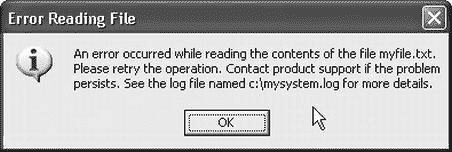
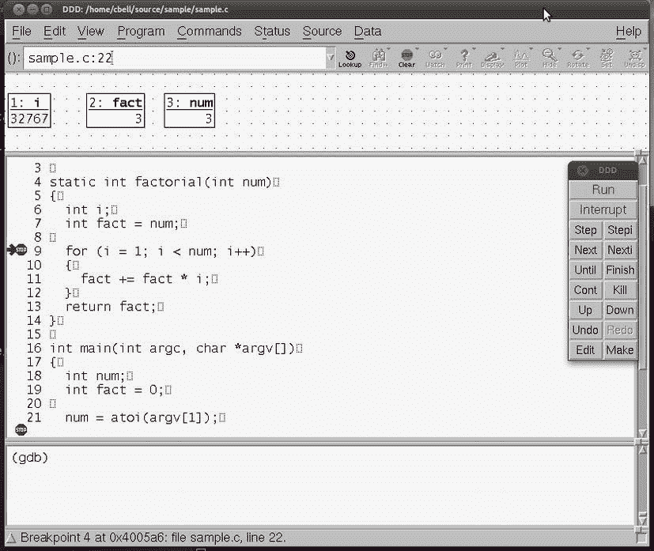
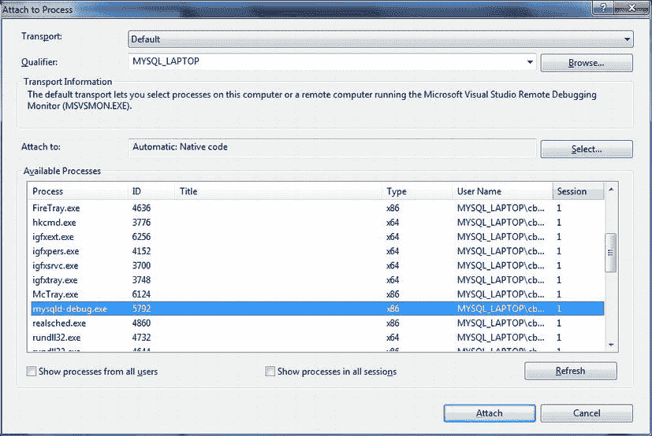
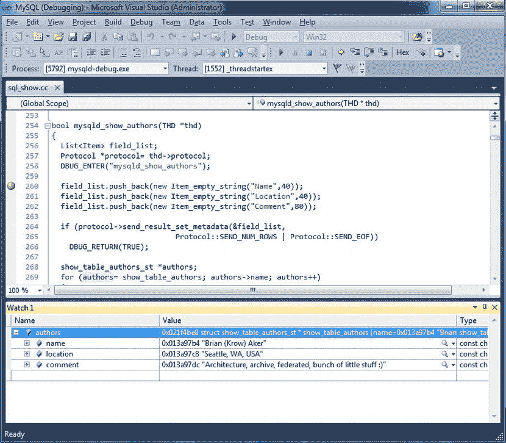

# 五、排除故障

本章讨论了开发者可以使用的最强大的工具之一:调试。良好的调试技能有助于确保您的软件项目易于开发并且不容易失败。我还将探索调试 MySQL 系统的最常见技术。如果您已经掌握了扎实的调试技能，请随意浏览以下章节，然后继续阅读“调试 MySQL”一节

调试说明

任何一个写过比“Hello world”程序更充实的东西的人都会在他的软件中遇到缺陷(bug)。虽然大多数缺陷很容易被发现，但是其他的缺陷可能很难定位和纠正。

如果你想向一个开发新手解释调试的概念，你可能会告诉她这很大程度上是一个故障排除的过程，以努力发现哪里出错了。您可能还注意到，开发良好的调试技能来自于掌握适当的调试技术和工具。虽然这可能是一个足够的介绍性定义，但请花时间更好地理解调试的细微差别。

对于初学者来说，恰当地确定您试图定位和纠正的缺陷类型是很重要的。缺陷有两种基本类型:*语法错误* 和*逻辑错误* 。在代码编译过程中自然会发现语法错误，尽管它们也可能很难纠正，但我们必须纠正它们来构建软件。逻辑错误是那些在编译期间没有发现的错误类型，因此，它们通常在软件执行期间表现为缺陷。因此，调试是在你的程序中发现并修复错误的行为。

 **注意**可以在编译时(或更早)运行的可用工具有助于最小化逻辑错误的风险。从检测死代码的简单流控制分析器到更复杂的范围和类型检查器，检查您的代码以定位可能的数据不匹配。其他工具使用代码强化的最佳实践来检查错误处理是否正确。

当发现一个逻辑错误时，系统通常会做一些奇怪的事情或者产生错误的数据。在更极端的情况下，系统可能会崩溃。包含代码强化最佳实践的结构良好的系统往往比其他系统更健壮，因为它们被设计为在错误发生时捕获和处理错误。即使这样，一些错误也非常严重，以至于系统崩溃(或者操作系统终止它)以保护数据和系统状态。

调试软件的艺术在于快速定位错误的能力，要么通过观察系统的状态变化，要么通过直接检查代码和数据。我们把用来调试*系统的工具叫做* 。在接下来的小节中，我将研究一些常见的调试技术和相关的调试器。

调试的起源

毫无疑问，你已经听说过关于“电脑虫”这个术语是如何产生的故事，我想讲一个我最喜欢的故事。我很高兴能在少将·格蕾丝·赫柏发现第一个电脑病毒的地方附近工作。传说 1945 年，霍普正在使用一台叫做马克 2 号·艾肯接力计算器的大型计算计算机。今天称它为大型计算机有点夸张，但当时它只有半挂车那么大。当一个棘手的电子问题被追溯到一个故障继电器，其中有一只蛾子被困在里面时，Hopper 指出错误的来源是一个“错误”，系统已经被“调试”过，现在可以运行了。直到今天，我们还把去除有缺陷的代码称为*调试。*

调试技术

几乎有多少开发者，就有多少调试技术。似乎每个人调试代码的方式都略有不同。然而，这些方法通常可以分为几类。

这些方法中最基本的都包含在源代码中，成为可执行文件的一部分。这些包括内联调试语句(在执行期间打印消息或变量值的语句(例如`printf("Code is at line 199\. my_var = %d\n", my_var);`)和错误处理程序。大多数开发者要么将这些技术作为最后的手段(当缺陷不容易被发现时)，要么在开发阶段(在编写代码时测试代码)使用这些技术。虽然您可能认为错误处理程序与健壮性和强化性的关系比与调试的关系更大，但是它们也可以是强大的调试工具。因为这种方法将调试代码嵌入到程序中，所以在调试完成时，您可以使用条件编译指令来省略代码。大多数开发者将调试语句留在代码中，因此，它们成为程序的一部分。当使用这种技术时，注意确保添加的调试代码不会对程序产生负面影响。

大多数人最熟悉的调试技术是使用外部调试器。*外部调试器* 是设计用于实时监控系统或允许您观察代码执行情况的工具，您可以随时停止和启动代码。这些技术将在下面的章节中详细描述。不过，首先让我们看看调试的基本过程。

基本过程

每个调试会话都是独特的，但是这个过程应该总是遵循相同的基本步骤。在调试过程中保持一致有助于使体验更有效、更有价值。在追逐了几个小时之后，没有比碾碎一只特别讨厌的虫子更好的感觉了。虽然您可能早就建立了一个首选的调试方法，但它很可能至少包含以下步骤:

1.  识别缺陷(错误报告，测试)。
2.  重现缺陷。
3.  创建一个测试来确认缺陷。
4.  隔离缺陷的原因。
5.  创建一个修正补丁并应用它。
6.  运行测试以确认缺陷已修复:是—继续，否—返回 4。
7.  运行回归测试以确认该修补程序不会影响系统的其他部分。

识别缺陷有时会很困难。当面对缺陷报告时，无论是官方的 bug 报告还是失败的系统测试，您可能会认为缺陷是伪造的，尤其是当缺陷不明显的时候。那些导致系统崩溃或损坏数据的缺陷自然会马上引起你的注意。但是那些偶尔发生或者只在特定条件下发生的呢？对于这些，你必须首先假设缺陷存在。

如果您足够幸运地拥有一份完整的 bug 报告，其中包含了如何重新创建缺陷的描述，那么您可以从缺陷中创建一个测试，并运行它来确认缺陷的存在。如果你没有一个完整的关于如何重现缺陷的描述，这可能需要一些努力。

一旦您能够重现缺陷，创建一个包含重现问题的所有步骤的测试。当您需要确认您已经解决了问题时，这个测试将非常重要。

下一步是真正调试的开始:隔离缺陷。此时，您必须使用本章中讨论的一种或多种技术来隔离和诊断缺陷的原因。这是调试软件最重要也是最具挑战性的方面。

为缺陷创建一个*补丁*(有时称为*差异*或*修复*)通常是一个迭代过程，很像编码本身。你应该一步一步地应用你的修正。一次做一个改变，并测试它对缺陷和系统其余部分的影响。当您认为您有一个可行的补丁时，重新运行您的缺陷测试来确认它。如果您已经更正了问题，测试将会失败。提醒一下，一个旨在发现缺陷的测试如果没有发现缺陷，将被认为是一个失败的测试——但这正是您想要的！如果测试通过，返回到检查和修复，重复迭代直到您的缺陷测试失败。

创建和使用修补程序

一种鲜为人知的软件开发技术被称为补丁。补丁只是一个包含原始文件及其修改形式之间差异的文件。当您创建一个补丁时，您运行一个名为`diff`的 GNU 程序，并将输出保存到一个文件中。(你可以在`www.gnu.org/software/diffutils/diffutils.html`找到`diff`。不幸的是，该代码仅适用于 Linux 和 Unix，但可以在使用 Cygwin 的 Windows 上运行。)例如，如果您正在修改`mysqld`文件，并添加了一行代码来更改版本号，您可以通过运行命令`diff -Naur mysqld.cc.old mysqld.cc > mysqld.patch`为代码更改创建一个补丁。这将创建一个如下所示的文件:

```sql
--- mysqld.cc.old  2006-08-19 15:41:09.000000000 -0400
+++ mysqld.cc  2006-08-19 15:41:30.000000000 -0400
@@ -7906,6 +7906,11 @@
#endif
   if (opt_log || opt_update_log || opt_slow_log || opt_bin_log)
     strmov(end, "-log");                        // This may slow down system
+/* BEGIN DBXP MODIFICATION */
+/* Reason for Modification: */
+/* This section adds the DBXP version number to the MySQL version number. */
+  strmov(end, "-DBXP 1.0");
+/* END DBXP MODIFICATION */
}
```

当您想要为整个文件列表或整个目录创建一个差异文件时，您也可以使用`diff`。然后，您可以使用生成的文件在其他地方修补文件的另一个安装。

当你使用补丁的时候，你使用的是名为`patch`的 GNU 程序。(你可以在`www.gnu.org/software/patch/`找到`patch`。不幸的是，代码仍然只适用于 Linux 和 Unix，但是可以在使用 Cygwin 的 Windows 上运行。)程序`patch`从`diff`程序中读取补丁文件，并将其应用于补丁顶部指定的文件。例如，要修补一个没有您用`diff`创建的更改的`mysqld.cc`文件，您可以运行命令`patch < mysqld.patch`。`patch`程序将更改应用到`mysqld.cc`文件，并将更改合并到文件中。

创建和应用补丁是向文件分发小更改的一种便捷方式——例如在修复缺陷时遇到的那些。每当您修复一个 bug 时，您可以创建一个补丁，并使用它来跟踪和应用相同的更改到旧文件。

许多开源项目使用补丁概念来传达变更。事实上，补丁是全球开发者社区对 MySQL 源代码进行修改的主要方式。开发者可以向 Oracle 发送一个补丁，而不是上传整个文件。从那里，Oracle 可以检查补丁的正确性，或者接受更改(并应用补丁)或者拒绝更改。如果您从未使用过`diff`和`patch`程序，请随意下载它们，并在您完成示例时试用它们。

最后，当缺陷被修复后，您应该执行一个回归测试步骤来确认没有其他缺陷被引入。如果您有幸工作在一个使用组件或模块化架构构建的系统上，并且该系统有很好的文档记录，那么您可以通过检查需求矩阵轻松地识别相关的组件或模块。一个*需求矩阵*跟踪来自用例、类和序列图的需求，并识别为每个需求创建的测试。因此，当一个类(模块)的一部分发生变化时，您可以很容易地找到您需要为您的回归测试运行的测试集。如果您没有需求矩阵，您可以使用一个简单的文档或电子表格来创建一个，或者用它们所满足的需求来注释源代码文件。

调试方法

您可以采用各种方法进行调试。这些包括简单地显示或打印感兴趣的值，或者使用交互式调试器跟踪可疑的代码部分。您甚至可以提前在代码中添加特殊的命令，以便于以后的调试——这种做法被称为*插装*。

内联调试语句

大多数开发新手开始在代码中放置 print 语句。这是测试变量的一种常见形式，允许他们学习编程的艺术。你可能认为任何使用内联调试语句的调试技术都是初级的或者麻烦的，你可能部分正确。内联调试语句很麻烦，但却是一个强大的工具。内联调试语句是用于记录或呈现系统在某个时间点的数据或状态的任何代码。

在我给出一个内联调试语句的例子之前，让我们考虑一下使用它们的影响。首先想到的是调试语句是代码！因此，如果调试语句除了写入标准错误流(窗口)之外还做了其他事情，可能会导致进一步的意外后果。还应该注意，在构建系统之前，内联调试语句通常被去除或忽略(使用条件编译)。如果你是一个可靠的确认和验证支持者，你会认为这个过程引入了额外的不必要的风险。也就是说，为使用而编译的系统不同于用于调试的系统。

然而，内联调试语句在无法使用外部调试器或者缺陷似乎以随机间隔出现的情况下会很有帮助。例如，在实时系统、多进程和多线程系统以及处理大量数据的大型系统中，可能会出现这些情况。

使用仪器

许多开发者认为内联调试语句是一种插装的形式。这包括旨在跟踪性能、数据、用户、客户端和执行指标的代码。插装通常通过在代码中放置语句来显示数据值、警告、错误等来实现，但也可以使用在类似沙箱的环境中监控执行的包装代码来实现。软件工具套件一个例子是由英特尔公司生产的。有关软件工具和引脚的更多信息，参见`http://www.pintool.org/`。

有两种类型的内联调试语句。第一个与检验有关。添加代码行来表示内存的状态或变量的值。这种类型的调试语句在开发过程中使用，通常使用条件编译注释掉或忽略。第二个问题是在系统执行时跟踪它的路径。这种类型的调试语句可以在任何时候使用，通常在运行时由开关启用或禁用。由于大多数开发者都熟悉第一种类型(我们大多数人都是这样学习调试的)，所以我将用一个例子来讨论第二种类型。

假设您有一个运行在多线程模型中的大型系统，并且您试图确定是什么导致了缺陷。使用表示内存和变量值的内联调试语句可能会有所帮助，但缺陷很难被轻易发现。在这种情况下，您可能需要发现导致缺陷的系统状态。如果您的系统中有这样的代码，每当它进入一个函数时只写一个日志条目，当它离开时写另一个日志条目(可能带有一些关于数据的附加信息)，那么您可以通过检查日志来确定系统处于什么状态。[清单 5-1](#list1) 描述了 MySQL 源代码 的摘录，其中包括内联调试语句。我用粗体突出显示了调试代码。在这种情况下，每个内联调试语句都会在跟踪文件中写入一个条目，在系统执行(或崩溃)后可以对其进行检查。

[***清单 5-1。***](#_list1) 内联调试语句示例

```sql
/***************************************************************************
** List all Authors.
** If you can update it, you get to be in it :)
***************************************************************************/

bool mysqld_show_authors(THD *thd)
{
  List<Item> field_list;
  Protocol *protocol= thd->protocol;

  DBUG_ENTER("mysqld_show_authors");

  field_list.push_back(new Item_empty_string("Name",40));
  field_list.push_back(new Item_empty_string("Location",40));
  field_list.push_back(new Item_empty_string("Comment",80));

  if (protocol->send_result_set_metadata(&field_list,
                            Protocol::SEND_NUM_ROWS | Protocol::SEND_EOF))
    DBUG_RETURN(TRUE);

  show_table_authors_st *authors;
  for (authors= show_table_authors; authors->name; authors++)
  {
    protocol->prepare_for_resend();
    protocol->store(authors->name, system_charset_info);
    protocol->store(authors->location, system_charset_info);
    protocol->store(authors->comment, system_charset_info);
    if (protocol->write())

     DBUG_RETURN(TRUE);
  }
  my_eof(thd);

  DBUG_RETURN(FALSE);
}
```

注意在[清单 5-1](#list1) 中，第一个内联调试语句代码通过指出函数的名字来记录系统到达这个函数或它的状态。还要注意，函数的每个退出点都与函数的返回值一起被记录下来。运行`SHOW AUTHORS`命令的跟踪文件摘录如[清单 5-2](#list2) 所示。为了向您展示跟踪文件如何成功执行`SHOW AUTHORS`命令，我省略了清单中的一大部分。

[***清单 5-2。***](#_list2) 样本痕迹文件

```sql
T@3    : | | | | >mysqld_show_authors

...

T@3    : | | | | | >send_result_set_metadata
T@3    : | | | | | | packet_header: Memory: 0x7f889025c610  Bytes: (4)
01 00 00 01
T@3    : | | | | | | >alloc_root
T@3    : | | | | | | | enter: root: 0x270af88
T@3    : | | | | | | | exit: ptr: 0x287f9c0
T@3    : | | | | | | <alloc_root 247
T@3    : | | | | | | >Protocol::write
T@3    : | | | | | | <Protocol::write 820
T@3    : | | | | | | packet_header: Memory: 0x7f889025c5c0  Bytes: (4)
1A 00 00 02
T@3    : | | | | | | >Protocol::write
T@3    : | | | | | | <Protocol::write 820
T@3    : | | | | | | packet_header: Memory: 0x7f889025c5c0  Bytes: (4)
1E 00 00 03
T@3    : | | | | | | >Protocol::write
T@3    : | | | | | | <Protocol::write 820
T@3    : | | | | | | packet_header: Memory: 0x7f889025c5c0  Bytes: (4)
1D 00 00 04
T@3    : | | | | | | packet_header: Memory: 0x7f889025c5b0  Bytes: (4)
05 00 00 05
T@3    : | | | | | <send_result_set_metadata 807
T@3    : | | | | | info: Protocol_text::store field 0 (3): Brian (Krow) Aker
T@3    : | | | | | info: Protocol_text::store field 1 (3): Seattle, WA, USA
T@3    : | | | | | info: Protocol_text::store field 2 (3): Architecture, archive, federated, bunch of little stuff :)
T@3    : | | | | | >Protocol::write
T@3    : | | | | | <Protocol::write 820
T@3    : | | | | | packet_header: Memory: 0x7f889025ca70  Bytes: (4)
5E 00 00 06
T@3    : | | | | | info: Protocol_text::store field 0 (3): Marc Alff
T@3    : | | | | | info: Protocol_text::store field 1 (3): Denver, CO, USA
T@3    : | | | | | info: Protocol_text::store field 2 (3): Signal, Resignal, Performance schema
T@3    : | | | | | >Protocol::write

...

47 00 00 55
T@3    : | | | | | info: Protocol_text::store field 0 (3): Peter Zaitsev
T@3    : | | | | | info: Protocol_text::store field 1 (3): Tacoma, WA, USA
T@3    : | | | | | info: Protocol_text::store field 2 (3): SHA1(), AES_ENCRYPT(), AES_DECRYPT(), bug fixing
T@3    : | | | | | >Protocol::write
T@3    : | | | | | <Protocol::write 820
T@3    : | | | | | packet_header: Memory: 0x7f889025ca70  Bytes: (4)
4F 00 00 56
T@3    : | | | | | >set_eof_status
T@3    : | | | | | <set_eof_status 483
T@3    : | | | | <mysqld_show_authors 279
```

 **注意**这些内联调试语句默认是关闭的。您可以通过使用`debug`编译服务器并使用- `debug`命令行开关在调试模式下运行服务器来打开它们。这将创建一个包含所有调试语句的跟踪文件。在 Linux 上，跟踪文件存储在`/tmp/mysqld.trace`中，在 Windows 上，文件存储在`c:\mysqld.trace`中。这些文件可能会变得很大，因为 MySQL 中的所有函数都是使用内联调试语句编写的。

这种技术虽然简单，但却是一种多用途的工具。当您通过检查跟踪文件来检查系统的流程时，您可以很容易地发现进一步调查的起点。有时候，仅仅知道去哪里找可能是最大的挑战。

错误处理程序

您在使用软件时遇到过错误信息吗？无论您使用的是太平洋西北地区开发的东西还是全球开发者社区开发的东西，您都有可能看到错误处理程序的最终结果。

您可能想知道为什么我会将错误处理程序作为一种调试技术。这是因为一个好的错误处理程序会给出问题的原因以及任何可能的纠正选项。好的错误处理程序为开发者提供了足够的信息，让他们了解哪里出错了，以及如何解决问题，在某些情况下，它们还包括可以帮助开发者诊断问题的附加信息。最后一点有时会走得太远。我们很多人都见过包含简洁错误信息的对话框，带有令人困惑的解决方案选项，例如图 5-1 所示的对话框。


[图 5-1。](#_Fig1)糟糕的错误处理程序示例

尽管这个例子很幽默，但是用户每天都会看到类似的消息。像这样写错误消息的开发者没有把自己说清楚。系统开发者完全可以理解的语句对用户来说可能是胡言乱语。最好的策略是创建错误消息，解释哪里出错了，并为用户提供一个解决方案(如果有的话)，或者至少提供一种报告问题的方法。提供一种方法来记录开发者诊断问题所需的信息也是一个好主意。这可以通过日志记录、系统状态转储或自动生成的报告来完成。图 5-2 描述了如何向用户显示错误的一个更好的例子。



[图 5-2。](#_Fig2)更好的错误处理器示例

错误处理程序不仅仅用于报告错误。还有另一种构造也称为错误处理程序。这个构造只是用来捕获和处理(处理)错误的代码。也许你熟悉 C++ `try...catch`块。这是错误处理程序的一个很好的例子，因为该语言已经被修改为在其语法中包含该构造。[清单 5-3](#list3) 描述了一个典型的`try...catch`程序块。该示例显示了 C++错误处理程序(也称为异常处理程序)的基本语法。

[***清单 5-3。***](#_list3) 示例 C++错误处理程序 try。。。捕捉块

```sql
try
{
  //attempt file operation here
}
catch (CFileException* e)
{
  //handle the exception here
}
```

虽然[清单 5-3](#list3) 没有 C++构造复杂，但是您可以用任何支持条件语句的语言创建错误处理程序。例如，[清单 5-4](#list4) 展示了一个来自 C 语言的例子。在这里，我们看到返回代码被检查，根据失败情况，代码处理问题。从头开始创建错误处理程序时要小心。您希望确保涵盖所有可能的情况，以便能够成功地恢复或至少以不影响系统性能和(更重要的)数据丢失或损坏的方式处理错误。

[***清单 5-4。***](#_list4) 例子 C 错误处理程序

```sql
if (!(azopen(&frm_stream, az_file, O_RDONLY|O_BINARY)))
{
  if (errno == EROFS || errno == EACCES)
    DBUG_RETURN(my_errno= errno);
  DBUG_RETURN(HA_ERR_CRASHED_ON_USAGE);
}
```

错误处理程序不仅仅是报告错误。它们也是调试的第一道防线。编写好的错误处理程序不仅可以捕获和处理错误，还可以存储或显示诊断信息。

再看一下清单 5-4 中的。这段代码取自 MySQL 源代码的`ha_archive.cc`文件。请注意突出显示的代码行。这一行是整个代码中众多内联调试语句中的一个，但是它在这个错误处理程序中的使用说明了如何记录对系统的这一部分进行故障排除所必需的诊断信息。如果我正在调试关于此代码的会话，我可以在调试模式下运行服务器，并查看跟踪文件以读取此错误处理程序记录的诊断信息。

我鼓励您考虑以这种方式编写所有的错误处理代码。您可以始终向用户显示适当的错误消息，但也应该始终捕获错误代码(返回值)并记录它们以及任何其他相关的诊断信息。以这种方式使用错误处理程序将大大提高您的调试技能，并使您的系统更容易诊断。我发现有时我甚至根本不需要运行调试器。对包含诊断信息的跟踪文件的研究足以让我直接找到问题的根源。

外部调试器

调试器是一种软件工具，用于分析一组正在执行的代码，并跟踪系统执行时的流程。大多数我们认为是调试器的工具实际上是与被调试的软件一起执行的，因此得名*外部调试器*。为了简洁和一致，我将把本节中讨论的所有工具简称为调试器。

有几种类型的调试器，但大多数适合三个类别之一。您可能最熟悉的调试器是那些作为独立工具运行的调试器，您可以将它们附加到正在运行的进程并用来控制系统。还有一些调试器被设计成作为一个交互过程运行，将控制和检查功能结合起来。其他包括专门的调试器，提供更高级的系统控制。我将在接下来的小节中研究每一种类型。

独立的调试器

最常见的调试器是独立调试器。它们作为一个单独的进程运行，并允许您附加到一个已经编译为包含适当调试信息的系统(用于映射到源代码，尤其是链接到代码中的符号)。除非您正在调试包含源文件的代码(比如某些形式的解释语言)，否则您通常必须拥有可用的源代码文件,并使用它们来完成与正在运行的进程的连接。

一旦您连接到想要调试的系统(或进程),独立调试器允许您停止、启动和逐步执行。单步执行涉及三个基本操作:

1.  执行当前代码行并进入下一行代码。
2.  跳过下一行代码(执行函数调用并返回到下一行)。
3.  执行，直到特定的代码行成为焦点。

最后一个操作通常是指被标记为要停止的代码行(称为*断点*)或当前突出显示的代码行(称为运行到光标处)。

独立调试器提供了检查内存、调用堆栈甚至有时检查堆的工具。检查变量的能力可能是调试器所能提供的最重要的诊断工具。毕竟，几乎所有您想要检查的东西都存储在某个地方。

 **注** A *堆*是一种以树形结构存储可用内存地址的结构，用于内存块的快速分配和解除分配。一个*栈*是一个允许开发者以先进后出的方式将项目放在栈上的结构(很像自助餐的一堆盘子)。

独立调试器通常不与开发环境集成。也就是说，它们不是编译器工具套件的一部分。因此，许多在开发环境之外运行。使用独立调试器的优势在于有很多调试器可供选择，每一个都有稍微不同的特性集。这允许您选择最符合您需求的独立调试器。

这种调试器的一个流行例子是 GNU 调试器 ( `gdb`)。(欲了解更多信息，请访问`www.gnu.org/software/gdb/documentation`。)Linux 上的`gdb`调试器提供了一种方法来控制和检查在调试模式下编译的系统。[清单 5-5](#list5) 显示了我编写的计算阶乘的示例程序。眼尖的人会发现这个逻辑错误，但是让我们假设程序是按照编写的那样运行的。当我输入值 3 时，我应该得到返回值 6。相反，我得到 18。

[***清单 5-5***](#_list5) 。示例程序(sample.c)

```sql
#include <stdio.h>
#include <stdlib.h>

static int factorial(int num)
{
  int i;
  int fact = num;

  for (i = 1; i < num; i++)
  {
    fact += fact * i;
  }
  return fact;
}

int main(int argc, char *argv[])
{
  int num;
  int fact = 0;

  num = atoi(argv[1]);
  fact = factorial(num);
  printf("%d! = %d\n", num, fact);
  return 0;
}
```

如果我想使用`gdb`调试这个程序，我首先必须在调试模式下使用以下命令编译程序:

```sql
gcc -g -o sample sample.c
```

一旦程序被编译，我使用命令启动`gdb`:

```sql
gdb sample
```

当`gdb`调试器发出它的命令提示符时，我使用`break`命令发出断点(为断点提供源文件和行号)并运行程序，提供必要的数据。我也可以使用`print`命令打印出任何变量。如果我想继续执行，我可以发出`continue`命令。最后，完成后，我可以用`quit`命令退出`gdb`。清单 5-6 显示了使用这些命令的调试会话示例。

[***清单 5-6。***](#_list6) 样本广发会话

```sql
cbell@ubuntu:∼/source/sample$ gcc -g -o sample sample.c
cbell@ubuntu:∼/source/sample$ gdb sample
GNU gdb (Ubuntu/Linaro 7.2-1ubuntu11) 7.2
Copyright (C) 2010 Free Software Foundation, Inc.
License GPLv3+: GNU GPL version 3 or later < http://gnu.org/licenses/gpl.html >
This is free software: you are free to change and redistribute it.
There is NO WARRANTY, to the extent permitted by law.  Type "show copying"
and "show warranty" for details.
This GDB was configured as "x86_64-linux-gnu".
For bug reporting instructions, please see:
< http://www.gnu.org/software/gdb/bugs/ >...
Reading symbols from /home/cbell/source/sample/sample...done.
(gdb) break sample.c:10
Breakpoint 1 at 0x40055a: file sample.c, line 10.
(gdb) run 3
Starting program: /home/cbell/source/sample/sample 3

Breakpoint 1, factorial (num=3) at sample.c:11
11           fact += fact * i;
(gdb) print i
$1 = 1
(gdb) print num
$2 = 3
(gdb) print fact
$3 = 3
(gdb) continue
Continuing.

Breakpoint 1, factorial (num=3) at sample.c:11
11           fact += fact * i;
(gdb) continue
Continuing.
3! = 18

Program exited normally.
(gdb) quit
cbell@ubuntu:
```

你看到逻辑错误了吗？我给你一个提示。计算数字 3 的阶乘时，第一个值应该是什么？看看`factorial`方法的变量声明。那个`int fact = num;`声明有点味道。

 **注意**有些人可能想调用调试器，如`gdb`交互式调试器，因为它们在系统运行时与系统交互，从而允许用户观察执行过程。虽然这是真的，但请记住`gdb`是在外部控制系统，除了通过非常简单的方法(例如，列表命令`list`，列出源代码)，您无法看到源代码或与源代码进行交互。如果`gdb`提供一个图形用户界面来呈现源代码，并允许您查看数据和与源代码交互，它将是一个交互式调试器。但是等等，这就是`ddd`调试器所做的。

交互式 调试器

这些调试器是开发环境的一部分，或者作为编译-链接-运行工具的一部分，或者作为交互式开发环境的一个集成部分。与独立调试器不同，交互式调试器使用与开发工具相同或非常相似的接口。集成良好的交互式调试器的一个很好的例子是 Microsoft Visual Studio 中的调试工具。网。在 Visual Studio 中，交互式调试器只是快速应用开发过程的一种不同模式。您修饰一个表单，编写一些代码，然后在调试模式下运行它。

图 5-3 描述了一个 Visual Studio 的例子。NET 2005 调试会话，使用前面显示的示例程序的 Windows 变体。


[图 5-3。](#_Fig3)Visual Studio 调试示例(sample.c)

交互式调试器具有与独立调试器相同的所有功能。您可以停止、开始、步入、跳过和运行到断点或光标处。当您发现缺陷的原因时，交互式调试器是最有用的；您可以停止执行，进行任何必要的更改，然后再次运行系统。[表 5-1](#Tab1) 提供了这些命令的简要描述。虽然大多数调试器都有所有这些命令，但有些使用不同的名称。有关命令的准确名称，请参考调试器的文档。

[表 5-1](#_Tab1) 。基本调试器控制命令

| 命令 | 描述 |
| --- | --- |
| 开始(运行) | 执行系统。 |
| 停止(中断) | 暂时停止代码的执行。 |
| 进入 | 运行下一条代码语句，将焦点转移到下面的语句。如果正在执行的语句是一个函数，该命令会将焦点转移到正在调用的函数中的第一个可执行语句。 |
| 跨过 | 运行下一条代码语句，将焦点转移到下面的语句。如果正在执行的语句是一个函数，该命令将执行该函数，并将焦点转移到函数调用后的下一个可执行语句。 |
| 断点 | 当代码执行到发出断点的语句时，调试器停止。许多调试器允许使用条件断点，您可以根据表达式设置断点。 |
| 运行到光标处 | 调试器继续执行，但在控制到达光标所在的代码语句时停止执行。这是一次性断点的一种形式。 |

这个场景中的编译和链接发生在后台；它通常只需要一会儿就能完成，并且您又回到了调试器中。正如你所想象的，交互式调试器是实时的拯救者。如果您从未使用过独立调试器，您可能会对独立调试器与源代码项目明显缺乏集成感到沮丧。看似“老派”的东西实际上是大多数发展的状态。只是通过相对较新的快速应用开发工具的发展，交互式调试器才成为调试的首选工具。

GNU 数据显示调试器

交互式调试器的另一个例子是 GNU 数据显示调试器(`ddd`)，可在`http://www.gnu.org/software/ddd`获得。`ddd`调试器允许你运行你的程序，并在程序运行时查看代码。它在概念上类似于快速应用开发调试器，如 Visual Studio。[图 5-4](#Fig4) 显示了我们在`ddd`中运行的示例程序。



[图 5-4。](#_Fig4)示例 ddd 会话调试“sample.c”

请注意，相同的变量显示在窗口的上部。使用`ddd`，我可以通过指向并点击代码行来设置代码断点，而不必记住文件中我想要中断的行号。我还可以通过双击变量来查看任何变量的内容。我甚至可以用类似的方式改变值。这允许我试验代码在不同的值下会如何执行。这是一个强大的特性，可以发现“差一个”的错误(例如，从 1 而不是 0 开始列表迭代器索引)。

 **注意**有些人会称`ddd`工具为独立调试器，因为它本质上是以独立模式运行的。然而，由于其复杂的用户界面和类似开发的布局，我认为`ddd`工具是一个混合体，比大多数独立调试器更好地匹配了交互类型。此外，它确实把`gdb`提升了一个档次！

双向 调试器

尽管今天的调试器已经提供了所有的能力，但是使调试更加有效的工作仍在进行中。最有趣的是，研究人员正在研究执行和撤销操作的方法，以观察每个操作影响了什么。这给了进行调试的人回滚执行以发现缺陷来源的能力。这被推广它的研究人员称为*逆向推理*。他们认为，确定哪里出错的最有效的方法是观察代码执行的能力，并且能够在发现缺陷时倒带事件，并重放它们以查看发生了什么变化。实现这种技术的工具被称为*双向调试器*。

一种商业产品，Undo 有限公司的 Undo db。(`http://undo-software.com`)可用于 Linux 平台，价格适中。Undo 提供评估下载，允许您评估其产品。UndoDB 是一个使用`gdb`信息的独立调试器。与`gdb`不同，它的命令允许你反向执行，返回并撤销上一条语句。[清单 5-7](#list7) 显示了在我们的示例程序中使用 UndoDB 的一个示例调试会话。

[***清单 5-7。***](#_list7) 示例 UndoDB 会话调试(sample.c)

```sql
cbell@ubuntu:∼/source/sample$ ∼/undodb-3.5.205/undodb-gdb sample
undodb-gdb: Reversible debugging system.  Copyright 2006, 2007, 2008, 2009, 2010, 2011, 2012 Undo Ltd.
undodb-gdb: undodb-3.5.205
undodb-gdb: By running this software you agree to the terms in:
undodb-gdb:     /home/cbell/undodb-3.5.205/demo_license.html
undodb-gdb: starting gdb
GNU gdb (Ubuntu/Linaro 7.2-1ubuntu11) 7.2
Copyright (C) 2010 Free Software Foundation, Inc.
License GPLv3+: GNU GPL version 3 or later < http://gnu.org/licenses/gpl.html >
This is free software: you are free to change and redistribute it.
There is NO WARRANTY, to the extent permitted by law.  Type "show copying"
and "show warranty" for details.
This GDB was configured as "x86_64-linux-gnu".
For bug reporting instructions, please see:
< http://www.gnu.org/software/gdb/bugs/ >...
Reading symbols from /home/cbell/source/sample/sample...done.
(undodb-gdb) break sample.c:9
Breakpoint 1 at 0x400551: file sample.c, line 9.
(undodb-gdb) run 3
undodb-gdb: debug-server pid 2561, port 35605
Starting program: /home/cbell/source/sample/sample 3
undodb: license type: UndoDB version 3.5, demo, user: Charles Bell

Breakpoint 1, factorial (num=3) at sample.c:9
9         for (i = 1; i < num; i++)
(undodb-gdb) next
11           fact += fact * i;
(undodb-gdb) bnext

Breakpoint 1, factorial (num=3) at sample.c:9
9         for (i = 1; i < num; i++)
(undodb-gdb) next
undodb-gdb: Have switched to record mode.
11           fact += fact * i;
(undodb-gdb) break sample.c:13
Breakpoint 2 at 0x400575: file sample.c, line 13.
(undodb-gdb) continue
Continuing.

Breakpoint 2, factorial (num=3) at sample.c:13
13         return fact;
(undodb-gdb) print fact
$1 = 18
(undodb-gdb) bnext
9         for (i = 1; i < num; i++)
(undodb-gdb) print fact
$2 = 18
(undodb-gdb) bnext
11           fact += fact * i;
(undodb-gdb) print fact
$3 = 6
(undodb-gdb) print i
$4 = 2
(undodb-gdb) next
9         for (i = 1; i < num; i++)
(undodb-gdb) print i
$5 = 2
(undodb-gdb) print fact
$6 = 18
(undodb-gdb) print num
$7 = 3
(undodb-gdb) next
undodb-gdb: Have switched to record mode.

Breakpoint 2, factorial (num=3) at sample.c:13
13         return fact;
(undodb-gdb) continue
Continuing.
3! = 18

(undodb-gdb) quit
A debugging session is active.

      Inferior 1 [Remote target] will be killed.

Quit anyway? (y or n) y
cbell@ubuntu:∼/source/sample$
```

注意清单 5-7 中[的命令`bnext`。`bnext`命令是唯一的 UndoDB 命令之一，它允许执行的回溯(双向)。所有的 UndoDB 回溯命令](#list7)都是`gdb`命令的镜像。这使得这个调试器对使用`gdb`的开发者非常友好。它最强大的功能是能够回滚语句以重新运行部分代码，而无需重新开始。

没有错误的方法

您可能想知道为什么我包含了一些调试方法，有些人可能认为这些方法是“老派”的，而不是最新的交互开发趋势。我认为，在某些情况下，甚至在一般情况下，有可能认为一种调试方法比另一种好。然而，这里介绍的任何方法，以及潜在的许多其他方法，都可以带来成功的结果。组织不应该强迫开发者遵循“这样做”的特定模式(这不仅仅适用于调试)，因为适用于一个实例或个人的方法可能不适用于其他人。我的建议是采用您认为最符合您的需求和项目的调试工具或方法。如果这意味着使用类似跟踪的方法或交互式方法，那没关系，只要你能有效地调试你的项目。如果您掌握了良好的故障排除技能，并且能够获得发现问题所需的信息，那么如何找到问题并不重要。

调试 MySQL

在调试自己的应用时，您可能拥有出色的调试技能，其中一些应用可能确实非常大。然而，很少有人有机会尝试调试像 MySQL 这样的大型系统。虽然这并不难，但我在处理源代码的过程中发现了许多挑战。我希望下面的部分能给你我通过多次试验获得的知识。我鼓励你至少通读一遍这一部分，然后在有时间的时候按照我的例子来做。

我将通过一个使用内联调试语句调试 MySQL 的例子来研究调试会话。然后，我将继续讨论一个错误处理程序示例，然后深入研究如何在 Linux 和 Windows 上调试 MySQL。如果您一直在等待机会接触 MySQL 源代码，这一部分就是为您准备的。卷起袖子，拿一些你最喜欢的富含咖啡因的饮料，因为我们要进去了！

内联调试语句

Oracle 为他们的客户提供了一个健壮的内联调试语句调试工具，该工具基于最初由 Fred Fish 创建的调试器，后来由 MySQL 的创始人之一 Michael "Monty" Widenius 为线程安全进行了修改。这个工具实际上是一个名为 DBUG 的 C 宏集合。

使用 DBUG 很容易，因为提供的宏允许您简单地将一个代码语句放在您想要记录的地方。Oracle 开发者在代码中有很多很好的例子。它们记录了服务器执行的许多方面。各个宏被称为调试标记(在 MySQL 文档中称为 DBUG 标记)。MySQL 源代码中目前使用的标签包括:

*   `DBUG_ENTER`:使用函数说明识别函数入口。
*   `DBUG_EXIT`:记录函数返回的结果。
*   `DBUG_INFO`:记录诊断信息。
*   `DBUG_WARNING`:记录异常事件或意外事件。
*   `DBUG_ERROR`:记录错误代码(主要用于错误处理程序)。
*   `DBUG_LOOP`:记录循环的进入或退出。
*   `DBUG_TRANS`:记录事务信息。
*   `DBUG_QUIT`:记录导致系统过早关闭的故障。
*   `DBUG_QUERY`:记录查询语句。
*   `DBUG_ASSERT`:记录表达式测试失败的错误。

[清单 5-8](#list8) 展示了这些标签是如何在`mysqld_show_privileges()`函数中使用的。突出显示的代码语句是一些更常用的 DBUG 标记。

[***清单 5-8。***](#_list8) 示例 DBUG 标签

```sql
bool mysqld_show_privileges(THD *thd)
{
  List<Item> field_list;
  Protocol *protocol= thd->protocol;

  DBUG_ENTER("mysqld_show_privileges");

  field_list.push_back(new Item_empty_string("Privilege",10));
  field_list.push_back(new Item_empty_string("Context",15));
  field_list.push_back(new Item_empty_string("Comment",NAME_CHAR_LEN));

  if (protocol->send_result_set_metadata(&field_list,
                            Protocol::SEND_NUM_ROWS | Protocol::SEND_EOF))
    DBUG_RETURN(TRUE);

  show_privileges_st *privilege= sys_privileges;
  for (privilege= sys_privileges; privilege->privilege ; privilege++)
  {
    protocol->prepare_for_resend();
    protocol->store(privilege->privilege, system_charset_info);
    protocol->store(privilege->context, system_charset_info);
    protocol->store(privilege->comment, system_charset_info);
    if (protocol->write())

       DBUG_RETURN(TRUE);
  }
  my_eof(thd);
  DBUG_RETURN(FALSE);
}
```

调试标签列表非常全面。`DBUG_ENTER`和`DBUG_RETURN`标签是最有用的，因为它们允许您记录系统在所有被调用的函数中的执行轨迹。特别需要指出的是，MySQL 源代码中的所有函数都分别在入口和出口包含这些标记。如果你要添加你自己的函数，做同样的事情，并记录你的函数的入口和出口。这些标签被写入一个跟踪文件，该文件存储在 Linux 上的`/tmp/mysqld.trace`和 Windows 上的`c:\mysqld.trace`中。

创建的跟踪文件可能会变得非常大。幸运的是，您可以通过在命令行上提供标记来控制将哪些标记写入跟踪文件。例如，要限制跟踪文件显示更有趣的调试标记，可以使用如下命令。开关的一般格式是`a:b:c`用于打开开关 a、b 和 c。任何带参数的开关都用逗号分隔。

```sql
mysqld-debug --debug=d,info,error,query,general,where:t:L:g:O,
/tmp/mysqd.trace -u root
```

前面的命令运行编译时启用了`debug`(`mysqld-debug`)的 MySQL 服务器。命令行参数`--debug=d,info,error,query,general, where:t:L:g:O,/tmp/mysqd.trace`指示 DBUG 系统启用`DBUG_INFO`、`DBUG_ERROR`、`DBUG_QUERY`和`DBUG_WHERE`宏的输出，打开函数进入/退出的跟踪行，包括调试语句的源代码行号，启用概要分析，并将文件写入`/tmp/mysqld.trace`。`-u root`参数将用户名`root`传递给服务器执行。更多的选择是可用的；一些常用选项如[表 5-2](#Tab2) 所示。 [<sup>2</sup>](#Fn2)

[表 5-2](#_Tab2) 。常用 DBUG 开关列表

| 转换 | 描述 |
| --- | --- |
| d | 打开参数中指定的 DBUG 标签的输出。空列表会导致所有标签的输出。 |
| D | 每次输出后执行延迟。参数指定要延迟的秒数。比如 D，40 会造成 4 秒的延迟。 |
| f | 将调试、跟踪和分析的记录限制在用 d。 |
| F | 为记录的每一行调试或跟踪输出源文件的名称。 |
| 我 | 为记录的每一行调试或跟踪输出进程 ID 或线程 ID。 |
| g | 打开分析。这些参数指定要分析的那些项目的关键字。空列表意味着所有关键字都被分析。 |
| L | 输出记录的每一行的源代码行号。 |
| n | 设置每行输出的嵌套深度。这有助于提高输出的可读性。 |
| 普通 | 在记录的每一行上放置连续的数字。 |
| o | 将输出保存到参数中指定的文件。默认值被写入 stderr。 |
| O | 将输出保存到参数中指定的文件。默认值被写入 stderr。在每次写入之间刷新文件。 |
| P | 输出记录的每一行的当前过程名称。 |
| t | 打开函数调用/退出跟踪线(用竖线表示)。 |

[清单 5-9](#list9) 显示了执行`show authors;`命令时的跟踪运行摘录。您可以看到系统在运行命令和返回数据时的完整轨迹(我省略了许多行，因为这个列表是用默认的调试开关生成的)。我已经标出了最有趣的线条。还要注意输出行下面的跟踪行。这允许您更容易地跟踪执行流程。

如果您在 MySQL 中编写自己的函数，可以使用 DBUG 标记将您自己的信息记录到跟踪文件中。如果您的代码导致不可预测或意外的行为，该文件会很有帮助。

[***清单 5-9。***](#_list9) 显示特权命令的示例痕迹

```sql
T@3    : | | | | >mysqld_show_privileges
T@3    : | | | | | >alloc_root
T@3    : | | | | | | enter: root: 0x2264f88
T@3    : | | | | | | exit: ptr: 0x23d97b0
T@3    : | | | | | <alloc_root 247
T@3    : | | | | | >alloc_root
T@3    : | | | | | | enter: root: 0x2264f88
T@3    : | | | | | | exit: ptr: 0x23d9850
T@3    : | | | | | <alloc_root 247
T@3    : | | | | | >alloc_root
T@3    : | | | | | | enter: root: 0x2264f88
T@3    : | | | | | | exit: ptr: 0x23d9860
T@3    : | | | | | <alloc_root 247
T@3    : | | | | | >alloc_root
T@3    : | | | | | | enter: root: 0x2264f88
T@3    : | | | | | | exit: ptr: 0x23d9900
T@3    : | | | | | <alloc_root 247
T@3    : | | | | | >alloc_root
T@3    : | | | | | | enter: root: 0x2264f88
T@3    : | | | | | | exit: ptr: 0x23d9910
T@3    : | | | | | <alloc_root 247
T@3    : | | | | | >alloc_root
T@3    : | | | | | | enter: root: 0x2264f88
T@3    : | | | | | | exit: ptr: 0x23d99b0
T@3    : | | | | | <alloc_root 247
T@3    : | | | | | >send_result_set_metadata
T@3    : | | | | | | packet_header: Memory: 0x7f61f196f610  Bytes: (4)
01 00 00 01
T@3    : | | | | | | >alloc_root
T@3    : | | | | | | | enter: root: 0x2264f88
T@3    : | | | | | | | exit: ptr: 0x23d99c0
T@3    : | | | | | | <alloc_root 247
T@3    : | | | | | | >Protocol::write
T@3    : | | | | | | <Protocol::write 820
T@3    : | | | | | | packet_header: Memory: 0x7f61f196f5c0  Bytes: (4)
1F 00 00 02
T@3    : | | | | | | >Protocol::write
T@3    : | | | | | | <Protocol::write 820
T@3    : | | | | | | packet_header: Memory: 0x7f61f196f5c0  Bytes: (4)
1D 00 00 03
T@3    : | | | | | | >Protocol::write
T@3    : | | | | | | <Protocol::write 820
T@3    : | | | | | | packet_header: Memory: 0x7f61f196f5c0  Bytes: (4)
1D 00 00 04
T@3    : | | | | | | packet_header: Memory: 0x7f61f196f5b0  Bytes: (4)
05 00 00 05
T@3    : | | | | | <send_result_set_metadata 807
T@3    : | | | | | info: Protocol_text::store field 0 (3): Alter
T@3    : | | | | | info: Protocol_text::store field 1 (3): Tables
T@3    : | | | | | info: Protocol_text::store field 2 (3): To alter the table
T@3    : | | | | | >Protocol::write
T@3    : | | | | | <Protocol::write 820
T@3    : | | | | | packet_header: Memory: 0x7f61f196fa70  Bytes: (4)
20 00 00 06
T@3    : | | | | | info: Protocol_text::store field 0 (3): Alter routine
T@3    : | | | | | info: Protocol_text::store field 1 (3): Functions,Procedures
T@3    : | | | | | info: Protocol_text::store field 2 (3): To alter or drop stored functions/procedures
T@3    : | | | | | >Protocol::write
T@3    : | | | | | <Protocol::write 820
T@3    : | | | | | packet_header: Memory: 0x7f61f196fa70  Bytes: (4)
50 00 00 07
T@3    : | | | | | info: Protocol_text::store field 0 (3): Create
T@3    : | | | | | info: Protocol_text::store field 1 (3): Databases,Tables,Indexes
T@3    : | | | | | info: Protocol_text::store field 2 (3): To create new databases and tables
T@3    : | | | | | >Protocol::write
T@3    : | | | | | <Protocol::write 820
T@3    : | | | | | packet_header: Memory: 0x7f61f196fa70  Bytes: (4)
43 00 00 08
T@3    : | | | | | info: Protocol_text::store field 0 (3): Create routine
T@3    : | | | | | info: Protocol_text::store field 1 (3): Databases
T@3    : | | | | | info: Protocol_text::store field 2 (3): To use CREATE FUNCTION/PROCEDURE
T@3    : | | | | | >Protocol::write
T@3    : | | | | | <Protocol::write 820
T@3    : | | | | | packet_header: Memory: 0x7f61f196fa70  Bytes: (4)
3A 00 00 09
T@3    : | | | | | info: Protocol_text::store field 0 (3): Create temporary tables
T@3    : | | | | | info: Protocol_text::store field 1 (3): Databases
T@3    : | | | | | info: Protocol_text::store field 2 (3): To use CREATE TEMPORARY TABLE
T@3    : | | | | | >Protocol::write
T@3    : | | | | | <Protocol::write 820
T@3    : | | | | | packet_header: Memory: 0x7f61f196fa70  Bytes: (4)
40 00 00 0A
T@3    : | | | | | info: Protocol_text::store field 0 (3): Create view
T@3    : | | | | | info: Protocol_text::store field 1 (3): Tables
T@3    : | | | | | info: Protocol_text::store field 2 (3): To create new views
T@3    : | | | | | >Protocol::write
T@3    : | | | | | <Protocol::write 820
T@3    : | | | | | packet_header: Memory: 0x7f61f196fa70  Bytes: (4)
27 00 00 0B
T@3    : | | | | | info: Protocol_text::store field 0 (3): Create user
T@3    : | | | | | info: Protocol_text::store field 1 (3): Server Admin
T@3    : | | | | | info: Protocol_text::store field 2 (3): To create new users
T@3    : | | | | | >Protocol::write
T@3    : | | | | | <Protocol::write 820
T@3    : | | | | | packet_header: Memory: 0x7f61f196fa70  Bytes: (4)
2D 00 00 0C
T@3    : | | | | | info: Protocol_text::store field 0 (3): Delete
T@3    : | | | | | info: Protocol_text::store field 1 (3): Tables
T@3    : | | | | | info: Protocol_text::store field 2 (3): To delete existing rows
T@3    : | | | | | >Protocol::write
T@3    : | | | | | <Protocol::write 820
T@3    : | | | | | packet_header: Memory: 0x7f61f196fa70  Bytes: (4)
26 00 00 0D
T@3    : | | | | | info: Protocol_text::store field 0 (3): Drop
T@3    : | | | | | info: Protocol_text::store field 1 (3): Databases,Tables
T@3    : | | | | | info: Protocol_text::store field 2 (3): To drop databases, tables, and views
T@3    : | | | | | >Protocol::write
T@3    : | | | | | <Protocol::write 820
T@3    : | | | | | packet_header: Memory: 0x7f61f196fa70  Bytes: (4)
3B 00 00 0E
T@3    : | | | | | info: Protocol_text::store field 0 (3): Event
T@3    : | | | | | info: Protocol_text::store field 1 (3): Server Admin
T@3    : | | | | | info: Protocol_text::store field 2 (3): To create, alter, drop and execute events
T@3    : | | | | | >Protocol::write
T@3    : | | | | | <Protocol::write 820
T@3    : | | | | | packet_header: Memory: 0x7f61f196fa70  Bytes: (4)
3D 00 00 0F
T@3    : | | | | | info: Protocol_text::store field 0 (3): Execute
T@3    : | | | | | info: Protocol_text::store field 1 (3): Functions,Procedures
T@3    : | | | | | info: Protocol_text::store field 2 (3): To execute stored routines
T@3    : | | | | | >Protocol::write
T@3    : | | | | | <Protocol::write 820
T@3    : | | | | | packet_header: Memory: 0x7f61f196fa70  Bytes: (4)
38 00 00 10
T@3    : | | | | | info: Protocol_text::store field 0 (3): File
T@3    : | | | | | info: Protocol_text::store field 1 (3): File access on server
T@3    : | | | | | info: Protocol_text::store field 2 (3): To read and write files on the server
T@3    : | | | | | >Protocol::write
T@3    : | | | | | <Protocol::write 820
T@3    : | | | | | packet_header: Memory: 0x7f61f196fa70  Bytes: (4)
41 00 00 11
T@3    : | | | | | info: Protocol_text::store field 0 (3): Grant option
T@3    : | | | | | info: Protocol_text::store field 1 (3): Databases,Tables,Functions,Procedures
T@3    : | | | | | info: Protocol_text::store field 2 (3): To give to other users those privileges you possess
T@3    : | | | | | >Protocol::write
T@3    : | | | | | <Protocol::write 820
T@3    : | | | | | packet_header: Memory: 0x7f61f196fa70  Bytes: (4)
67 00 00 12
T@3    : | | | | | info: Protocol_text::store field 0 (3): Index
T@3    : | | | | | info: Protocol_text::store field 1 (3): Tables
T@3    : | | | | | info: Protocol_text::store field 2 (3): To create or drop indexes
T@3    : | | | | | >Protocol::write
T@3    : | | | | | <Protocol::write 820
T@3    : | | | | | packet_header: Memory: 0x7f61f196fa70  Bytes: (4)
27 00 00 13
T@3    : | | | | | info: Protocol_text::store field 0 (3): Insert
T@3    : | | | | | info: Protocol_text::store field 1 (3): Tables
T@3    : | | | | | info: Protocol_text::store field 2 (3): To insert data into tables
T@3    : | | | | | >Protocol::write
T@3    : | | | | | <Protocol::write 820
T@3    : | | | | | packet_header: Memory: 0x7f61f196fa70  Bytes: (4)
29 00 00 14
T@3    : | | | | | info: Protocol_text::store field 0 (3): Lock tables
T@3    : | | | | | info: Protocol_text::store field 1 (3): Databases
T@3    : | | | | | info: Protocol_text::store field 2 (3): To use LOCK TABLES (together with SELECT privilege)
T@3    : | | | | | >Protocol::write
T@3    : | | | | | <Protocol::write 820
T@3    : | | | | | packet_header: Memory: 0x7f61f196fa70  Bytes: (4)
4A 00 00 15
T@3    : | | | | | info: Protocol_text::store field 0 (3): Process
T@3    : | | | | | info: Protocol_text::store field 1 (3): Server Admin
T@3    : | | | | | info: Protocol_text::store field 2 (3): To view the plain text of currently executing queries
T@3    : | | | | | >Protocol::write
T@3    : | | | | | <Protocol::write 820
T@3    : | | | | | packet_header: Memory: 0x7f61f196fa70  Bytes: (4)
4B 00 00 16
T@3    : | | | | | info: Protocol_text::store field 0 (3): Proxy
T@3    : | | | | | info: Protocol_text::store field 1 (3): Server Admin
T@3    : | | | | | info: Protocol_text::store field 2 (3): To make proxy user possible
T@3    : | | | | | >Protocol::write
T@3    : | | | | | <Protocol::write 820
T@3    : | | | | | packet_header: Memory: 0x7f61f196fa70  Bytes: (4)
2F 00 00 17
T@3    : | | | | | info: Protocol_text::store field 0 (3): References
T@3    : | | | | | info: Protocol_text::store field 1 (3): Databases,Tables
T@3    : | | | | | info: Protocol_text::store field 2 (3): To have references on tables
T@3    : | | | | | >Protocol::write
T@3    : | | | | | <Protocol::write 820
T@3    : | | | | | packet_header: Memory: 0x7f61f196fa70  Bytes: (4)
39 00 00 18
T@3    : | | | | | info: Protocol_text::store field 0 (3): Reload
T@3    : | | | | | info: Protocol_text::store field 1 (3): Server Admin
T@3    : | | | | | info: Protocol_text::store field 2 (3): To reload or refresh tables, logs and privileges
T@3    : | | | | | >Protocol::write
T@3    : | | | | | <Protocol::write 820
T@3    : | | | | | packet_header: Memory: 0x7f61f196fa70  Bytes: (4)
45 00 00 19
T@3    : | | | | | info: Protocol_text::store field 0 (3): Replication client
T@3    : | | | | | info: Protocol_text::store field 1 (3): Server Admin
T@3    : | | | | | info: Protocol_text::store field 2 (3): To ask where the slave or master servers are
T@3    : | | | | | >Protocol::write
T@3    : | | | | | <Protocol::write 820
T@3    : | | | | | packet_header: Memory: 0x7f61f196fa70  Bytes: (4)
4D 00 00 1A
T@3    : | | | | | info: Protocol_text::store field 0 (3): Replication slave
T@3    : | | | | | info: Protocol_text::store field 1 (3): Server Admin
T@3    : | | | | | info: Protocol_text::store field 2 (3): To read binary log events from the master
T@3    : | | | | | >Protocol::write
T@3    : | | | | | <Protocol::write 820
T@3    : | | | | | packet_header: Memory: 0x7f61f196fa70  Bytes: (4)
49 00 00 1B
T@3    : | | | | | info: Protocol_text::store field 0 (3): Select
T@3    : | | | | | info: Protocol_text::store field 1 (3): Tables
T@3    : | | | | | info: Protocol_text::store field 2 (3): To retrieve rows from table
T@3    : | | | | | >Protocol::write
T@3    : | | | | | <Protocol::write 820
T@3    : | | | | | packet_header: Memory: 0x7f61f196fa70  Bytes: (4)
2A 00 00 1C
T@3    : | | | | | info: Protocol_text::store field 0 (3): Show databases
T@3    : | | | | | info: Protocol_text::store field 1 (3): Server Admin
T@3    : | | | | | info: Protocol_text::store field 2 (3): To see all databases with SHOW DATABASES
T@3    : | | | | | >Protocol::write
T@3    : | | | | | <Protocol::write 820
T@3    : | | | | | packet_header: Memory: 0x7f61f196fa70  Bytes: (4)
45 00 00 1D
T@3    : | | | | | info: Protocol_text::store field 0 (3): Show view
T@3    : | | | | | info: Protocol_text::store field 1 (3): Tables
T@3    : | | | | | info: Protocol_text::store field 2 (3): To see views with SHOW CREATE VIEW
T@3    : | | | | | >Protocol::write
T@3    : | | | | | <Protocol::write 820
T@3    : | | | | | packet_header: Memory: 0x7f61f196fa70  Bytes: (4)
34 00 00 1E
T@3    : | | | | | info: Protocol_text::store field 0 (3): Shutdown
T@3    : | | | | | info: Protocol_text::store field 1 (3): Server Admin
T@3    : | | | | | info: Protocol_text::store field 2 (3): To shut down the server
T@3    : | | | | | >Protocol::write
T@3    : | | | | | <Protocol::write 820
T@3    : | | | | | packet_header: Memory: 0x7f61f196fa70  Bytes: (4)
2E 00 00 1F
T@3    : | | | | | info: Protocol_text::store field 0 (3): Super
T@3    : | | | | | info: Protocol_text::store field 1 (3): Server Admin
T@3    : | | | | | info: Protocol_text::store field 2 (3): To use KILL thread, SET GLOBAL, CHANGE MASTER, etc.
T@3    : | | | | | >Protocol::write
T@3    : | | | | | <Protocol::write 820
T@3    : | | | | | packet_header: Memory: 0x7f61f196fa70  Bytes: (4)
47 00 00 20
T@3    : | | | | | info: Protocol_text::store field 0 (3): Trigger
T@3    : | | | | | info: Protocol_text::store field 1 (3): Tables
T@3    : | | | | | info: Protocol_text::store field 2 (3): To use triggers
T@3    : | | | | | >Protocol::write
T@3    : | | | | | <Protocol::write 820
T@3    : | | | | | packet_header: Memory: 0x7f61f196fa70  Bytes: (4)
1F 00 00 21
T@3    : | | | | | info: Protocol_text::store field 0 (3): Create tablespace
T@3    : | | | | | info: Protocol_text::store field 1 (3): Server Admin
T@3    : | | | | | info: Protocol_text::store field 2 (3): To create/alter/drop tablespaces
T@3    : | | | | | >Protocol::write
T@3    : | | | | | <Protocol::write 820
T@3    : | | | | | packet_header: Memory: 0x7f61f196fa70  Bytes: (4)
40 00 00 22
T@3    : | | | | | info: Protocol_text::store field 0 (3): Update
T@3    : | | | | | info: Protocol_text::store field 1 (3): Tables
T@3    : | | | | | info: Protocol_text::store field 2 (3): To update existing rows
T@3    : | | | | | >Protocol::write
T@3    : | | | | | <Protocol::write 820
T@3    : | | | | | packet_header: Memory: 0x7f61f196fa70  Bytes: (4)
26 00 00 23
T@3    : | | | | | info: Protocol_text::store field 0 (3): Usage
T@3    : | | | | | info: Protocol_text::store field 1 (3): Server Admin
T@3    : | | | | | info: Protocol_text::store field 2 (3): No privileges - allow connect only
T@3    : | | | | | >Protocol::write
T@3    : | | | | | <Protocol::write 820
T@3    : | | | | | packet_header: Memory: 0x7f61f196fa70  Bytes: (4)
36 00 00 24
T@3    : | | | | | >set_eof_status
T@3    : | | | | | <set_eof_status 483
T@3    : | | | | <mysqld_show_privileges 390
```

错误处理程序

关于 MySQL 中的错误处理程序，没有具体的工具可以演示。您应该努力生成处理所有可能错误的代码。向您展示如何做到这一点的最佳方式是使用一个错误处理程序的示例，该错误处理程序来自一个较旧的、不受支持的 MySQL 版本，它不能正确地管理错误。[清单 5-10](#list10) 显示了一段摘录自 MySQL 源代码的内容，该源代码有一个特殊类型的错误。

[***清单 5-10。***](#_list10)MySQL 中错误处理程序示例

```sql
int my_delete(const char *name, myf MyFlags)
{
  int err;
  DBUG_ENTER("my_delete");
  DBUG_PRINT("my",("name %s MyFlags %d", name, MyFlags));

  if ((err = unlink(name)) == −1)
  {
    my_errno=errno;
    if (MyFlags & (MY_FAE+MY_WME))
      my_error(EE_DELETE,MYF(ME_BELL+ME_WAITTANG+(MyFlags & ME_NOINPUT)),
         name,errno);
  }
  DBUG_RETURN(err);
} /* my_delete */
```

你能看出缺陷吗？我给你一个提示。Windows 中`unlink()`函数的返回值有几个重要的值需要检查。在[清单 5-10](#list10) 中显示的错误处理程序中缺少了其中的一个。该缺陷导致`optimize()`函数在运行过程中错误地复制了一个中间文件。好在前段时间修复了这个缺陷。[清单 5-11](#list11) 显示了这个函数的修正形式。

[***清单 5-11。***](#_list11)MySQL 中错误处理程序示例

```sql
int my_delete(const char *name, myf MyFlags)
{
  int err;
  DBUG_ENTER("my_delete");
  DBUG_PRINT("my",("name %s MyFlags %d", name, MyFlags));

  if ((err = unlink(name)) == −1)
  {
    my_errno=errno;
    if (MyFlags & (MY_FAE+MY_WME))
    {
      char errbuf[MYSYS_STRERROR_SIZE];
      my_error(EE_DELETE, MYF(ME_BELL+ME_WAITTANG+(MyFlags & ME_NOINPUT)),
               name, errno, my_strerror(errbuf, sizeof(errbuf), errno));
    }
  }
  else if ((MyFlags & MY_SYNC_DIR) &&
           my_sync_dir_by_file(name, MyFlags))
    err= −1;
  DBUG_RETURN(err);
} /* my_delete */
```

Oracle 提供了一个设计良好的错误消息机制，可以使您的错误处理程序更加健壮。要添加您自己的错误消息，请将它们添加到`sql/share/errmsg-utf8.txt`文件中。有关添加自己的错误消息的更多详细信息，请参见 dev.mysql.com 的内部文档。

形成错误处理程序来处理所有可能的错误，并采取适当的措施来纠正和报告错误，这一点我怎么强调都不为过。添加 DBUG 宏来跟踪和记录错误消息将确保您的所有调试会话更加高效。

Linux 中的调试

Linux 在其高级开发工具(主要是 GNU 工具)的质量方面表现出色。这些工具包括优秀的调试器，不仅能够处理单线程系统，还能够处理多线程系统。

许多调试器可用于 Linux。最受欢迎的是`gdb`和`ddd`。接下来的部分展示了调试 MySQL 系统的每个工具的例子。这些例子的场景是检查当发出`SHOW AUTHORS`命令时发生了什么。我将从`gdb`调试器开始，然后使用`ddd`向您展示相同的场景。

使用 gdb

让我们从重新检查`show_authors()`函数开始。回头参考清单 5-1 中该函数的完整代码。我需要做的第一件事是确保我已经在打开调试器的情况下构建了服务器。为此，请从源文件夹的根目录发出以下命令:

```sql
cmake . -DWITH_DEBUG=ON
make
```

这些命令将使用适当的调试信息编译系统，以便我可以使用调试器。我现在可以使用命令`mysqld-debug`在调试模式下启动服务器。清单 5-12 显示了服务器启动时出现的启动语句。

 **注意**确保在调试模式下启动服务器之前，MySQL 服务器的所有安装都已关闭。虽然并非绝对必要，但这应该允许您避免尝试调试错误的进程。

[***清单 5-12。***](#_list12) 以调试模式启动 MySQL 服务器

```sql
cbell@ubuntu:∼/source/mysql-5.6/mysql-test$ ./mysql-test-run.pl --start-and-exit --debug
Logging: ./mysql-test-run.pl  --start-and-exit --debug
120707 18:10:11 [Note] Plugin 'FEDERATED' is disabled.
120707 18:10:11 [Note] Binlog end
120707 18:10:11 [Note] Shutting down plugin 'CSV'
120707 18:10:11 [Note] Shutting down plugin 'MyISAM'
MySQL Version 5.6.6
Checking supported features...
 - skipping ndbcluster
 - SSL connections supported
 - binaries are debug compiled
Using suites: main,sys_vars,binlog,federated,rpl,innodb,innodb_fts,perfschema,funcs_1,opt_trace
Collecting tests...
Checking leftover processes...
 - found old pid 7375 in 'mysqld.1.pid', killing it...
   process did not exist!
Removing old var directory...
Creating var directory '/home/cbell/source/mysql-5.6/mysql-test/var'...
Installing system database...
Using server port 49434

==============================================================================

TEST                                      RESULT   TIME (ms) or COMMENT
------------------------------------------------------------------------------

worker[1] Using MTR_BUILD_THREAD 300, with reserved ports 13000..13009
worker[1]
Started [mysqld.1 - pid: 7506, winpid: 7506]
worker[1] Using config for test main.1st
worker[1] Port and socket path for server(s):
worker[1] mysqld.1  13000  /home/cbell/source/mysql-5.6/mysql-test/var/tmp/mysqld.1.sock
worker[1] Server(s) started, not waiting for them to finish
```

注意，在这种情况下，我使用的是指定为`/var/lib/mysql/mysql.sock`的套接字。这允许我在调试模式下运行服务器的副本，而不影响正在运行的服务器。然而，我需要告诉客户端使用同一个套接字。不过，首先，我需要确定我的服务器的进程 ID。我可以通过发出`ps -A`命令列出所有正在运行的进程来做到这一点。或者，我可以发出命令`ps -A| grep mysql`并获取名称中包含`mysql`的所有进程的进程 id。下面演示了该命令:

```sql
7506 pts/2    00:00:00 mysqld
```

现在我有了自己的进程 ID，我可以启动`gdb`并使用`attach 10592`命令连接到正确的进程。我还想在`show_authors()`函数中设置一个断点。对源文件的检查显示，我感兴趣的第一行是第 260 行。我发出命令 break/home/cbell/source/bzr/MySQL-5.6/SQL/SQL _ show . cc`:260`。该命令的格式为`file:line#`。现在我有了一个断点，我发出命令`continue`告诉进程执行，当遇到断点时`gdb`将暂停程序。清单 5-13 显示了完整的调试过程。

[***清单 5-13。***](#_list13) 运行广发

```sql
cbell@ubuntu:∼/source/bzr/mysql-5.6/mysql-test$ gdb
GNU gdb (Ubuntu/Linaro 7.2-1ubuntu11) 7.2
Copyright (C) 2010 Free Software Foundation, Inc.
License GPLv3+: GNU GPL version 3 or later < http://gnu.org/licenses/gpl.html >
This is free software: you are free to change and redistribute it.
There is NO WARRANTY, to the extent permitted by law.  Type "show copying"
and "show warranty" for details.
This GDB was configured as "x86_64-linux-gnu".
For bug reporting instructions, please see:
< http://www.gnu.org/software/gdb/bugs/ >.
(gdb) attach 7506
Attaching to process 7506
Reading symbols from /home/cbell/source/bzr/mysql-5.6/sql/mysqld...done.
Reading symbols from /lib/x86_64-linux-gnu/libpthread.so.0...(no debugging symbols found)...done.
[Thread debugging using libthread_db enabled]
[New Thread 0x7f7ba8e57700 (LWP 7524)]
[New Thread 0x7f7ba4a26700 (LWP 7523)]
[New Thread 0x7f7ba5227700 (LWP 7522)]
[New Thread 0x7f7ba5a28700 (LWP 7521)]
[New Thread 0x7f7ba6229700 (LWP 7520)]
[New Thread 0x7f7ba6a2a700 (LWP 7519)]
[New Thread 0x7f7ba722b700 (LWP 7518)]
[New Thread 0x7f7ba7a2c700 (LWP 7517)]
[New Thread 0x7f7ba822d700 (LWP 7516)]
[New Thread 0x7f7ba8a2e700 (LWP 7515)]
[New Thread 0x7f7ba9658700 (LWP 7513)]
[New Thread 0x7f7ba9e59700 (LWP 7512)]
[New Thread 0x7f7baa65a700 (LWP 7511)]
[New Thread 0x7f7baae5b700 (LWP 7510)]
[New Thread 0x7f7bab65c700 (LWP 7509)]
[New Thread 0x7f7bb085f700 (LWP 7508)]
Loaded symbols for /lib/x86_64-linux-gnu/libpthread.so.0
Reading symbols from /lib/x86_64-linux-gnu/librt.so.1...(no debugging symbols found)...done.
Loaded symbols for /lib/x86_64-linux-gnu/librt.so.1
Reading symbols from /lib/x86_64-linux-gnu/libcrypt.so.1...(no debugging symbols found)...done.
Loaded symbols for /lib/x86_64-linux-gnu/libcrypt.so.1
Reading symbols from /lib/x86_64-linux-gnu/libdl.so.2...(no debugging symbols found)...done.
Loaded symbols for /lib/x86_64-linux-gnu/libdl.so.2
Reading symbols from /usr/lib/x86_64-linux-gnu/libstdc++.so.6...(no debugging symbols found)...done.
Loaded symbols for /usr/lib/x86_64-linux-gnu/libstdc++.so.6
Reading symbols from /lib/x86_64-linux-gnu/libm.so.6...(no debugging symbols found)...done.
Loaded symbols for /lib/x86_64-linux-gnu/libm.so.6
Reading symbols from /lib/x86_64-linux-gnu/libgcc_s.so.1...(no debugging symbols found)...done.
Loaded symbols for /lib/x86_64-linux-gnu/libgcc_s.so.1
Reading symbols from /lib/x86_64-linux-gnu/libc.so.6...(no debugging symbols found)...done.
Loaded symbols for /lib/x86_64-linux-gnu/libc.so.6
Reading symbols from /lib64/ld-linux-x86-64.so.2...(no debugging symbols found)...done.
Loaded symbols for /lib64/ld-linux-x86-64.so.2
0x00007f7bb0939ae3 in poll () from /lib/x86_64-linux-gnu/libc.so.6
(gdb) break /home/cbell/source/bzr/mysql-5.6/sql/sql_show.cc:260
Breakpoint 1 at 0x7cee94: file /home/cbell/source/bzr/mysql-5.6/sql/sql_show.cc, line 260.
(gdb) continue
Continuing.

Note: Here, you can run the mysql client and issue the SHOW AUTHORS command.

[New Thread 0x7f7ba8e16700 (LWP 7536)]
[Switching to Thread 0x7f7ba8e16700 (LWP 7536)]

Breakpoint 1, mysqld_show_authors (thd=0x3a62ca0) at /home/cbell/source/bzr/mysql-5.6/sql/sql_show.cc:260
260         field_list.push_back(new Item_empty_string("Name",40));
(gdb) next
261         field_list.push_back(new Item_empty_string("Location",40));
(gdb) next
262         field_list.push_back(new Item_empty_string("Comment",80));
(gdb) next
265                                   Protocol::SEND_NUM_ROWS | Protocol::SEND_EOF))
(gdb) next
264         if (protocol->send_result_set_metadata(&field_list,
(gdb) next
269         for (authors= show_table_authors; authors->name; authors++)
(gdb) next
271           protocol->prepare_for_resend();
(gdb) print authors->name
$1 = 0xec70c2 "Brian (Krow) Aker"
(gdb) quit
A debugging session is active.

 Inferior 1 [process 7506] will be detached.

Quit anyway? (y or n) y
Detaching from program: /home/cbell/source/bzr/mysql-5.6/sql/mysqld, process 7506
```

清单 5-14 显示了在命令行上指定所需套接字的客户端初始化。然后，我启动 SHOW AUTHORS 命令。

[***清单 5-14。***](#_list14) 启动 MySQL 客户端连接服务器

```sql
cbell@ubuntu:∼$ mysql -uroot -h 127.0.0.1 --port=13000
Welcome to the MySQL monitor.  Commands end with ; or \g.
Your MySQL connection id is 1
Server version: 5.6.6-m9-debug-CAB MODIFICATION Source distribution

Copyright (c) 2000, 2011, Oracle and/or its affiliates. All rights reserved.

Oracle is a registered trademark of Oracle Corporation and/or its
affiliates. Other names may be trademarks of their respective
owners.

Type 'help;' or '\h' for help. Type '\c' to clear the current input statement.

mysql> show authors;
```

当我输入命令时，我注意到的第一件事是客户机停止了。原因是`gdb`调试器遇到了断点并暂停了执行。当我切换回调试器时，我可以使用`next`命令发出命令来逐步执行。我也可以使用`print`命令显示变量的值。([清单 5-13](#list13) 展示了这些命令的运行。)一旦我完成了调试会话，我就可以关闭服务器并退出调试器。

调试器是一个强大的工具，但是它缺乏大多数集成开发环境(ide)中调试器的复杂性。`ddd`调试器通过提供一个健壮的图形环境弥补了这个限制。

使用 ddd

GNU `ddd`调试器是集成调试器的一个很好的例子。虽然不是专门围绕 IDE 构建的，但是`ddd`调试器提供了类似的体验。您可以启动想要调试的程序并查看源代码。使用集成的工具，您可以设置断点，停止和启动正在调试的程序，设置对变量的监控，查看堆栈跟踪，甚至编辑变量值。

几个窗口与调试器相关联。*数据窗口*显示您已设置手表的所有数据项。*源代码窗口*(主显示区)显示正在调试的程序的当前源代码。*调试器控制台*显示主机调试器(`gdb`)输出。这个窗口对于使用`gdb`的开发者来说很方便，因为它允许你输入自己的`gdb`命令。因此，您可以使用菜单系统来控制程序，也可以使用调试器控制台来直接向调试器发出命令。

`ddd`调试器实际上是 GNU `gdb`独立调试器的包装器。在典型的开源方式中，`ddd`的开发者重用了已经构建好的东西(`gdb`)，而不是重新发明轮子(符号调试器代码)，他们用一组新的功能来扩充它。此外，`ddd`可以支持几个独立的调试器，这使得它非常通用。事实上，它可以支持其宿主调试器所能支持的任何语言。在许多方面，`ddd`展示了集成调试器应该是什么样的。它拥有你调试任何用多种语言编写的程序所需的所有工具。

我发现`ddd`调试器最吸引人的特性之一是保存调试会话并在以后调用它的能力。这给了您不必重新创建一个场景来演示或重复一个缺陷的优势。我建议，为了最有效地使用它，您调试您的程序直到缺陷发现点(比如在有问题的函数的开始处)，设置您所有的监控和断点，然后保存会话。这将允许您在以后需要追溯您的步骤时重新启动调试会话。虽然不如双向调试器高效，但保存调试会话可以节省大量时间。

您可以使用`ddd`调试器来检查核心转储。这允许您检查核心转储中的数据，以确定程序的状态以及崩溃前的最后几次操作。如果导致崩溃的缺陷也导致调试器崩溃，这就非常方便了。 [<sup>3</sup>](#Fn3) 还支持远程调试和直接检查内存。这允许您调试在另一台计算机(通常是服务器)上运行的系统，并在您的开发工作站上操作调试器。关于`ddd`调试器的更多信息，请参见`www.gnu.org/software/ddd/ddd.html#Doc`T3 的优秀文档

使用`ddd`调试 MySQL 可以通过以下步骤完成:

1.  停止任何正在运行的 MySQL 服务器。使用命令`mysqladmin -uroot -p shutdown`并输入您的 root 密码。
2.  转到包含源代码的目录。如果您正在调试服务器(mysqld)，您希望切换到`sql`目录。
3.  使用命令`ddd mysqld-debug`启动`ddd`调试器。
4.  打开要调试的源代码文件。在下面的例子中，我使用了`sql_show.cc`。
5.  设置希望代码停止的任何断点。在下面的例子中，我在`show_authors()`函数的第 207 行设置了一个断点。
6.  使用程序运行菜单运行服务器，通过在对话框中提供参数`u root`指定服务器以 root 用户身份运行。
7.  启动您的 MySQL 客户端。在下面的例子中，我使用普通的 MySQL 命令行客户端。
8.  在客户端发出您的命令。调试器将暂时停止执行，并在定义的任何断点处停止。从这里，您可以开始调试。
9.  当您完成调试后，使用命令`mysqladmin -uroot -p shutdown`退出客户端并关闭服务器，然后输入您的 root 密码。

 **提示**您可能需要延长测试 MySQL 客户端的超时时间。如果您正在单步执行一系列断点或者正在检查大量变量，调试可能会花费一些时间。当你调试的时候，系统实际上处于僵死状态。这可能会导致服务器和客户端停止通信。一些客户端被设计为在一段时间后无法与服务器通信时终止。如果您使用的是 MySQL 命令行客户端，则需要延长超时时间。您可以通过使用`--connection-timeout=600`在命令行上指定值来实现这一点。在客户端断开连接之前，这给了您大约 10 分钟的时间来使用调试器。

清单 5-15 展示了如何使用`ddd`调试器来调试 MySQL 服务器。我选择了之前的同一个函数，在`sql_show.cc`源文件中的`show_authors()`函数。在这个场景中，我对服务器如何处理向客户机发送信息很感兴趣。你可能还记得在第 3 章中，我提到过一个向客户端返回数据的例子。

[***清单 5-15。***](#_list15)【show _ authors】功能带高光

```sql
/***************************************************************************
** List all Authors.
** If you can update it, you get to be in it :)
***************************************************************************/

bool mysqld_show_authors(THD *thd)
{
  List<Item> field_list;
  Protocol *protocol= thd->protocol;
  DBUG_ENTER("mysqld_show_authors");

  field_list.push_back(new Item_empty_string("Name",40));
  field_list.push_back(new Item_empty_string("Location",40));
  field_list.push_back(new Item_empty_string("Comment",40));

  if (protocol->send_result_set_metadata(&field_list,
                            Protocol::SEND_NUM_ROWS | Protocol::SEND_EOF))
      DBUG_RETURN(TRUE);

  show_table_authors_st *authors;
  for (authors= show_table_authors; authors->name; authors++)
  {
    protocol->prepare_for_resend();
    protocol->store(authors->name, system_charset_info);
    protocol->store(authors->location, system_charset_info);
    protocol->store(authors->comment, system_charset_info);
    if (protocol->write())
      DBUG_RETURN(TRUE);
  }
  my_eof(thd);
  DBUG_RETURN(FALSE);
}
```

粗体的语句是用于将数据发送回客户端的方法。`show_authors()`函数非常适合演示这个过程，因为它是最简单的实现(没有复杂的操作——只是发送数据)。第一个突出显示的语句显示了指向现有 threads 协议类的指针声明。protocol 类封装了所有底层通信方法(如网络和套接字控制)。下一组语句构建了一个字段列表。你总是先给客户发送一个字段列表。一旦构建了字段列表，就可以用`protocol->send_fields()`方法将它发送给客户机。在循环中，代码遍历在`show_table_authors_st`的链表中定义的作者列表。在这个循环中，有三个主要的方法用于向客户端发送数据。第一个是`protocol->prepare_for_resend()`，为发送数据清除合适的缓冲区和变量。下一个是`protocol->store()`，它将信息放在发送缓冲区中。您应该将每个字段作为对此方法的单独调用发送。`protocol->write()`方法发出适当的动作将数据发送给客户机。最后，`send_eof()`方法指示通信机制发送文件结束标记来标记数据的结束。此时，客户端显示数据。

让我们使用`ddd`调试器来看看这个函数是如何工作的。我通过发出以下命令，使用调试开关构建了我的服务器:

```sql
cmake . -DWITH_DEBUG=ON
make
```

这些命令将使用调试信息编译系统，以便我可以使用调试器。一旦我确认没有其他服务器在运行，我就启动`ddd`调试器，加载我的源文件(`sql_show.cc`，在第 207 行的`show_authors()`函数中设置一个断点，然后运行程序。此时，我启动我的 MySQL 客户端程序，将连接超时设置为 10 分钟，并发出`SHOW AUTHORS`命令。回头参考[清单 5-13](#list13) 查看服务器启动序列；[清单 5-16](#list16) 显示了客户端启动序列。

[***清单 5-16。***](#_list16) 启动 MySQL 客户端与 ddd 调试器一起使用

```sql
cbell@ubuntu:∼$ mysql -uroot -h 127.0.0.1 --port=13000
Welcome to the MySQL monitor.  Commands end with ; or \g.
Your MySQL connection id is 1
Server version: 5.6.6-m9-debug-CAB MODIFICATION Source distribution

Copyright (c) 2000, 2011, Oracle and/or its affiliates. All rights reserved.

Oracle is a registered trademark of Oracle Corporation and/or its
affiliates. Other names may be trademarks of their respective
owners.

Type 'help;' or '\h' for help. Type '\c' to clear the current input statement.

mysql> show authors;
```

当执行到达调试器中的断点时，服务器将停止，`ddd`调试器将显示代码，并带有一个指向断点的箭头。您还会注意到客户端已经停止。如果调试时间过长，客户端可能会超时。这就是我使用连接超时覆盖的原因。

一旦调试器停止执行，您就可以开始研究代码并检查任何变量、堆栈或内存的值。我已经设置了调试器来检查作者的结构，以便在数据写入客户端时查看数据。[图 5-5](#Fig5) 描述了`ddd`调试器，其作者结构显示在数据窗口中。


[图 5-5。](#_Fig5) ddd 调试 show_authors()函数

我还可以展开作者的结构并查看当前的内容。[图 5-6](#Fig6) 显示了数据窗口中显示的作者结构的内容。


[图 5-6。](#_Fig6)作者在 ddd 调试器中构建数据

请注意，值和地址显示在数据窗口中。`ddd`调试器还允许你修改内存的内容。假设我正在调试这个方法，我想更改 authors 结构中的值。我只需右键单击 authors 结构中的每一项，从右键菜单中选择 Set Value，然后更改值。[图 5-7](#Fig7) 显示我已经改变了作者结构的内容。


[图 5-7。](#_Fig7)作者结构数据发生变化

你可能想知道这是否真的有用。的确如此。清单 5-17 显示了客户端的输出(为了清楚起见，我省略了许多行)。请注意，我更改的数据确实被发送到了客户端。

[***清单 5-17。***](#_list17) 由数据修改产生的输出

```sql
mysql> show authors;
+−−-------------+−−------------+−−-------------------------------------+
| Name          | Location     | Comment                               |
+−−-------------+−−------------+−−-------------------------------------+
| Chuck Bell    | Anytown, USA | Replication, Backup, MySQL Utilities  |
...
+−−-------------+−−------------+−−-------------------------------------+
80 rows in set (48.35 sec)

mysql>
```

一旦我完成了我的调试会话，我发出命令关闭服务器，然后退出`ddd`:

```sql
mysqladmin -uroot -p shutdown
```

从这个简单的例子中可以看出，用`ddd`进行调试是一种有益的体验，它允许您在代码执行时查看代码。能够看到与当前执行相关的数据的能力是发现和纠正缺陷的有效手段。我鼓励您尝试这个例子，并尝试使用`ddd`,直到您能够熟练使用为止。

在窗口中调试

在 Windows 中调试的主要方法是使用 Microsoft Visual Studio .NET。一些开发者已经成功使用其他工具，如外部调试器，但大多数人将使用与 Visual Studio 集成的调试器。网。使用集成调试器很方便，因为您可以从同一个界面编译和调试。

我将使用与前面的`ddd`示例相同的场景。虽然步骤相似，但您会看到一些不同之处。具体来说，我通过启动 Visual Studio 并打开源代码目录根目录中的`mysql.sln`解决方案文件来开始我的调试会话。我确保我的会话被设置为在`debug`为`win32`平台编译程序。这将确保正确的调试信息被编译到可执行文件中。一旦 Visual Studio 启动并设置了正确的编译模式，我就可以设置我的断点(同样，在第 207 行的`show_authors()`函数中)。[图 5-8](#Fig8) 显示了正确配置了断点设置的 Visual Studio。


[图 5-8。](#_Fig8) Visual Studio 调试器安装

为了调试服务器，我必须在调试模式下启动服务器。在 Windows 上，使用开关独立运行服务器，使其不作为服务运行。虽然这不是绝对必要的，但它允许您在命令窗口中看到来自服务器的任何消息，否则这些消息会被隐藏。您可以发出以下命令来实现这一点:

```sql
mysqld-debug --debug –standalone
```

 **注**我把`mysqld.exe`服务器改名为`mysqld-debug.exe`以便在 Windows 任务管理器中更容易找到。

一旦服务器运行，我就可以使用 Debug  Attach to Process 菜单选项从 Visual Studio 附加到进程。[图 5-9](#Fig9) 显示了附加到进程对话框。我选择运行并附加到`mysqld-debug`进程，这样我也可以在调试会话期间生成一个跟踪文件。



[图 5-9。](#_Fig9)附加到 Visual Studio 中的进程。网

我需要做的下一件事是启动客户端。我再次使用`connect-timeout`参数将超时设置为更长的延迟。我用来从命令窗口启动客户端的命令是:

```sql
mysql -uroot -p --connect-timeout=600
```

在客户端运行的情况下，我可以发出`show authors;`命令，Visual Studio 将在遇到断点时拦截该命令。然后，我可以使用“单步执行”( F10)和“单步执行”( F11)命令来单步执行代码。我停止了循环中发送数据的代码，并检查了作者的结构。[图 5-10](#Fig10) 显示了我进入循环后调试器的状态。



[图 5-10。](#_Fig10)在 Visual Studio 中显示变量值。网

与`ddd`一样，您也可以更改变量值。然而，在 Visual Studio 中这样做有点复杂。虽然可能有其他选项，但在 Visual Studio 中更改值的最佳方式是在“监控”窗口中编辑值。但是，如果"监控"窗口中的值是指向内存位置的指针，则必须更改内存位置。为此，请打开“内存调试”窗口，并使用“监控”窗口来定位内存位置并就地编辑它。[图 5-11](#Fig11) 显示记忆窗口打开，数值被编辑。


[图 5-11。](#_Fig11)使用 Visual Studio 编辑内存中的值。网

在内存中的值被编辑后，我可以继续执行并在客户端窗口中看到结果。清单 5-18 显示了样本输出的摘录。

[***清单 5-18。***](#_list18) 调试会话的输出

```sql
mysql> show authors;
+−−-----------+−−----------------+−−-----------------------+

| Name        | Location         | Comment                 |

+−−-----------+−−----------------+−−-----------------------+

| Aker, Brian | Seattle, WA, USA | bunch of little stuff :)|

| JonJon      | Hometown, USA    | Companion, Best Friend  |

...

+−−-----------+−−----------------+−−-----------------------+

80 rows in set (1 min 55.64 sec)

mysql>
```

为了停止调试会话，我在命令窗口中发出`shutdown`命令，然后使用 Visual Studio 中的 Debug  Detach All 菜单选项从进程中分离。

```sql
mysqladmin -uroot -p shutdown
```

既然您已经看到了如何在 Windows 上使用 Visual Studio 调试 MySQL 系统，我鼓励您再次通读这个示例，并在您自己的 Windows 开发机器上进行尝试。

摘要

在本章中，我解释了调试，向您展示了一些基本的调试技术，并提供了如何使用它们的示例。这些技术包括内联调试语句、错误处理和外部调试器。

您了解了如何使用 Oracle 提供的内联调试语句 DBUG 工具来创建系统执行的跟踪文件、写出相关数据以及记录错误和警告。您还了解了如何使用`gdb`、`ddd`和 Visual Studio .NET 在 Linux 和 Windows 中进行调试。

培养良好的调试技能对于成为一名优秀的软件开发者至关重要。希望这一章已经为你完善自己的调试技巧提供了基础。

在下一章中，我将研究系统集成商对 MySQL 系统的一种流行使用:嵌入式 MySQL。这允许 MySQL 系统成为另一个系统的一部分。可以想象，这个过程可能需要一些认真的调试，以找出在嵌入的哪一层出了什么问题。

[<sup>1</sup>](#_Fn1) 我个人不相信随机区间。在计算机能够独立思考之前，它们只是执行人类指令的机器。

[<sup>2</sup>](#_Fn2)

这是一种最令人讨厌的情况，很难克服。在这些情况下，我通常求助于内联调试语句和核心转储进行调试。