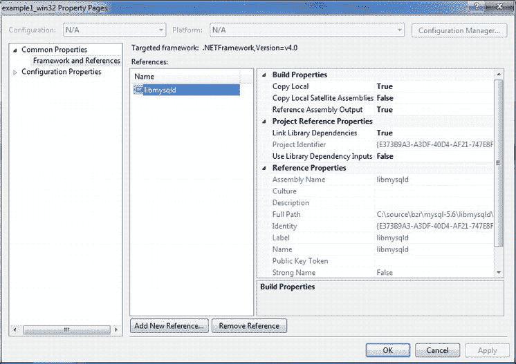
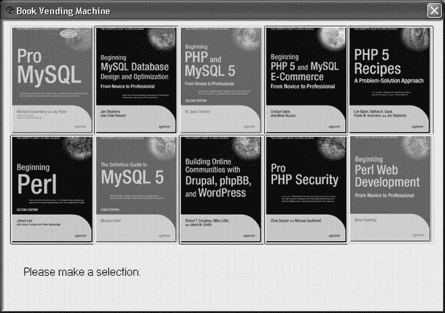
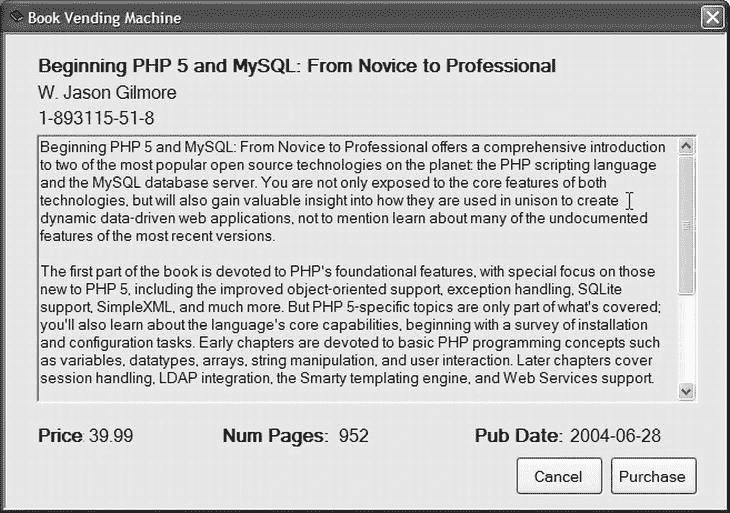
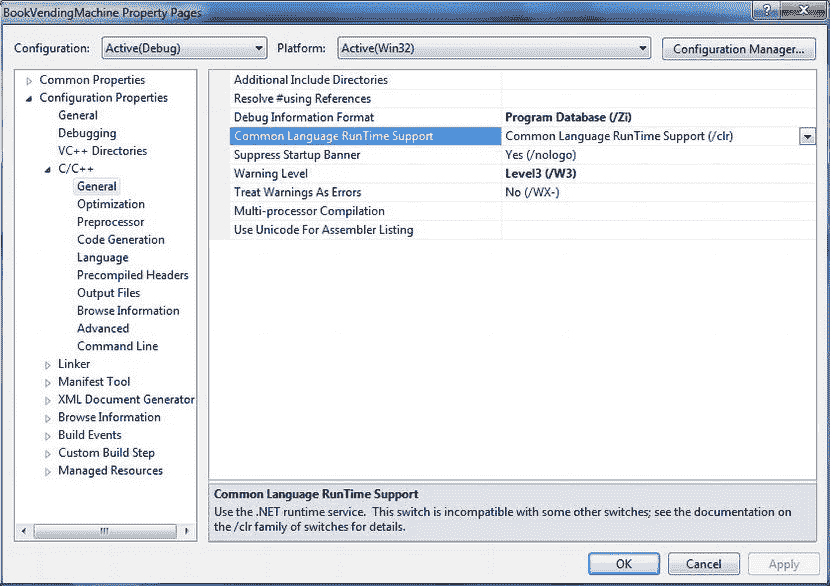
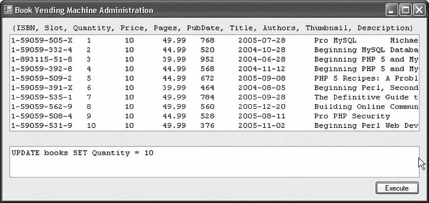
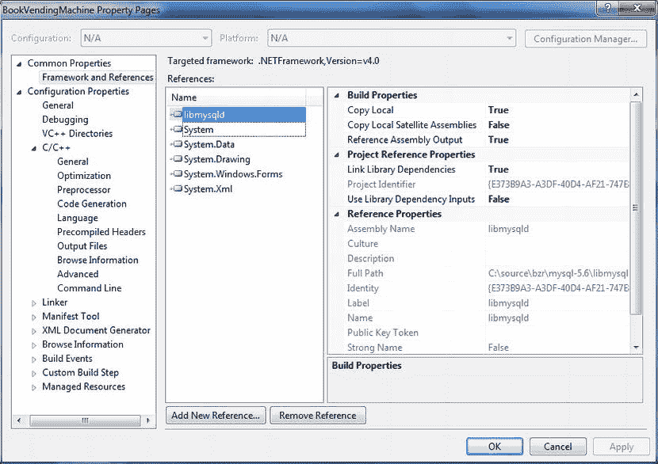

# 六、嵌入式 MySQL

MySQL 服务器以其轻量级和高性能特性而闻名，但是您知道它也可以用作企业应用程序的嵌入式数据库吗？本章解释了嵌入式应用程序的概念，以及如何使用 MySQL C API 来创建自己的嵌入式 MySQL 应用程序。我将向您介绍编译嵌入式服务器和为 Linux 和 Windows 编写应用程序的技术。

构建嵌入式应用

已经使用轻量级数据库系统作为内部数据存储构建了许多应用程序。如果您使用 Microsoft Windows 作为主要的桌面操作系统，那么您很可能已经见过或使用过至少一个使用 Microsoft Access 数据库引擎的应用程序。即使应用程序没有宣传 Access 的使用，通常只要粗略地看一下安装目录就可以知道。

一些嵌入式应用程序使用主机上现有的数据库系统(如 Access)，而另一些则使用大型数据库系统的专用安装。不太明显的是那些将数据库系统编译进软件本身的应用程序。

什么是嵌入式 系统？

一个*嵌入式系统*是包含在另一个系统 中的系统。简单来说，嵌入式系统是主机系统的从机。嵌入式系统的目的是提供主机系统需要的一些功能。这可能是通信机制、数据存储和检索，甚至是图形用户显示。

嵌入式系统传统上被认为是专用的硬件或电子设备。例如，自动柜员机(ATM)是包含专用硬件的嵌入式系统。今天，嵌入式系统不仅包括专用硬件，还包括专用软件系统。与难以或不可能修改的嵌入式硬件不同，嵌入式软件经常被修改以在特定环境中工作。嵌入式硬件和软件都具有独立的特性，并为主机系统提供一些服务。

嵌入式软件系统通常与您日常看到和使用的应用程序不同。有些，比如那些使用嵌入式 MySQL 库的，是对现有功能的改编，是为了在另一个软件系统中更有效地工作。然而，与其独立的服务器版本不同，嵌入式 MySQL 服务器被设计为在编程级别上运行。也就是说，对服务器的调用是通过编程语言完成的，而不是作为特别的查询。方法在嵌入式服务器中公开，以将特定查询作为参数，并启动服务器来执行它们。

这意味着嵌入式 MySQL 服务器只能通过另一个应用程序来访问。正如您将在接下来的几节中看到的，嵌入式软件可以存在于许多应用程序中，其集成级别从封闭的仅编程访问到被宿主应用程序“隐藏”的全功能系统不等。让我们先来看看最常见的嵌入式系统类型。

嵌入式系统的类型

由于嵌入式系统使用的独特性，很难对其进行分类。它们通常属于以下一个(或多个)类别:

*实时*:在要求主机系统在给定阈值内做出响应和动作的设施中使用的系统。这套系统最常见的特征是计时。每个命令过程的执行时间必须最小化以实现系统的目标。通常，这些系统需要在外部发生的事件内执行，而不是以任何内部处理速度执行。路由器或电信交换机就是实时系统的一个例子。

*反应型*:只对外部事件做出反应的系统。这些事件在本质上倾向于重复发生和循环，但它们也可能以用户输入的形式出现(交互系统是反应式系统)。反应系统被设计成总是可操作的。定时通常是次要的，只受循环操作频率的限制。反应式系统的一个例子是安全监控系统，该系统被设计成当某些事件或阈值发生时寻呼或警告服务人员。

*过程控制*:用于控制其他系统的系统。这些往往是那些旨在监测和控制硬件设备，如机器人和加工机械。这些系统通常被编程为重复一系列动作，并且通常不会偏离其预期的编程或响应外部事件或状态变量或条件的阈值。过程控制系统的一个例子是在装配汽车特定部件的汽车装配线上使用的机器人。

*关键*:用于具有高成本因素的设施中的系统，例如安全、医疗或航空。这些系统被设计成不会失败(或者永远不会失败)。这些系统通常包括前面描述的嵌入式系统的变体。关键系统的例子包括医疗系统，如呼吸器或人工循环系统。

嵌入式数据库系统

一个*嵌入式数据库* *系统*是一个为主机应用或环境提供数据的系统。这些数据通常是在进程中被请求的，因此数据库必须响应请求并毫不延迟地返回任何信息。嵌入式数据库系统被认为对主机应用程序和整个系统至关重要。因此，嵌入式数据库系统也必须满足用户的时间要求。这些需求意味着嵌入式数据库系统通常被归类为反应式系统。

除了最普通的应用程序，个人和企业使用的所有应用程序都生产、消费和存储数据。许多应用程序的数据结构良好，对客户具有内在价值。事实上，在许多情况下，数据是自动持久化的，客户希望在需要的时候数据是可用的。此类应用程序的子系统要么具有访问方法，要么连接到外部文件或数据处理系统，如数据库服务器。

使用文件访问数据的嵌入式系统面临着许多问题，尤其是数据是否可以在主机应用程序之外访问。在这种情况下，访问限制可能必须从头开始创建，或者作为系统中的另一层添加。文件系统通常具有非常好的性能，并提供更快的访问时间，但它们不如数据库系统灵活。数据库系统在存储数据的形式上提供了更多的灵活性(作为表格而不是结构化文件)，但通常会导致访问速度较慢。

虽然保护数据的原因可能多种多样，但最基本的要求是以最有效的方式存储和检索数据，而不将数据暴露给其他人。很多时候这仅仅是对数据库系统的需要。例如，Adobe Bridge 之类的应用程序管理着 Adobe 生产工具套件中使用的大量文件、项目、照片等数据。这些文件需要以一种易于搜索和检索的方式进行组织。Adobe 使用嵌入式数据库(MySQL)来管理 Adobe Bridge 存储的文件的元数据。在这种情况下，应用程序使用数据库系统来处理更困难的工作，即存储、搜索和检索关于它所管理的对象的元数据。

由于数据必须受到保护，使用外部数据库系统的选择变得有限，因为完全保护(或隐藏)数据并不总是容易或可能的。嵌入式数据库系统允许应用程序使用数据库系统的全部功能，同时对外部来源隐藏机制和数据。

嵌入 MySQL

MySQL 工程师在 MySQL 开发的早期就认识到，它的许多客户都是系统集成商，需要一个健壮、高效、可编程访问的数据库系统。他们不仅提供了一个嵌入式库，还提供了一个全功能的客户端库。客户端库允许您创建自己的 MySQL 客户端。例如，您可以创建自己版本的 MySQL 命令行客户端。客户端库被命名为`libmysql`。如果您想了解典型的 MySQL 客户端如何使用这个库，请查看`mysql`项目源文件。

MySQL 嵌入式库以服务器可执行文件的名称命名为`libmysqld`。您可能会看到这个库被称为嵌入式服务器，或者简称为 C API。本章专门介绍嵌入式库(`libmysqld`)，但是，客户端和嵌入式服务器库之间的大部分访问和连接是相似的。

嵌入式库提供了许多通过应用编程接口(API)访问数据库系统的功能。API 提供了许多允许系统利用 MySQL 服务器的特性(通过编程)。这些特性包括:

*   连接并建立服务器实例
*   断开与服务器的连接
*   使用受控(安全)机制关闭服务器
*   操作服务器启动选项
*   处理错误
*   生成 DBUG 跟踪文件
*   发出查询并检索结果
*   管理数据
*   访问 MySQL 服务器的(几乎)全部特性集

最后一点是独立服务器和嵌入式服务器之间最重要的区别之一。嵌入式服务器不使用完整的身份验证机制，默认情况下是禁用的。这是嵌入式 MySQL 系统难以保护的原因之一(更多细节请参见后面的“安全性问题”)。但是，您可以使用配置选项`--with-embedded-privilege-control`打开认证，并重新编译嵌入式服务器。除此之外，在特性和功能方面，服务器的行为与独立服务器几乎相同。

真正酷的是，由于嵌入式库使用与独立服务器相同的访问方法，所以您使用独立服务器创建的所有数据库和表都可以与嵌入式服务器一起使用。这允许您创建表并使用独立的服务器测试它们，然后将它们移动到嵌入式系统中。尽管可以让两台服务器访问同一个数据目录，但这是绝对不鼓励的，因为这可能会导致数据丢失和不可预测的行为(永远不要在 MySQL 服务器实例之间“共享”数据目录)。

这是否意味着您可以将独立服务器作为嵌入式服务器在同一台机器上运行？不仅是可以，您想要多少台嵌入式服务器？只要嵌入式服务器实例没有使用同一个数据目录，就可以同时运行几个。每个人管理的数据与其他人管理的数据是分开的，没有数据共享。我在自己的系统上试了一下，效果不错。我有一个 5.6.9 嵌入式应用程序，与我的 5.1(正式上市)GA 独立服务器一起运行。在撰写本文时，MySQL 5.5 是最新的 GA 版本。我不必停止甚至中断单机来与嵌入式服务器交互。多酷啊。

嵌入 MySQL 的方法

有许多类型的嵌入式应用程序。嵌入式数据库应用程序通常分为三类。它们要么部分隐藏在另一个接口后面(捆绑嵌入)，要么隐藏在一个包装或包含数据库服务器的系统后面(深度嵌入)。下面几节描述了与嵌入 MySQL 系统相关的每一种类型。

捆绑服务器嵌入

捆绑服务器嵌入是一个独立安装 MySQL 服务器构建的系统。服务器级嵌入式系统通过关闭外部(网络)访问来隐藏 MySQL 服务器，而不是让系统或网络上的任何人都可以使用 MySQL。因此，这种形式的嵌入式 MySQL 系统只是一个关闭了网络访问(TCP/IP)的独立服务器。

这种类型的嵌入式 MySQL 系统的优势在于，可以使用本地安装的(并正确配置的)客户端应用程序来维护服务器。因此，系统集成商、管理员和开发人员可以使用常规的管理和开发工具来维护嵌入式 MySQL 服务器，而不必使用外部应用程序加载数据。

服务器级嵌入式 MySQL 系统的一个例子是 LeapTrack 软件，由 LeapFrog ( `www.leapfrogschoolhouse.com/do/findsolution?detailPage=overview&name=ReadingPro`)生产。MySQL 报告称，LeapFrog 选择 MySQL 是因为其跨平台支持，允许 LeapFrog 在各种平台上提供其产品，而不改变核心数据库功能。在那之前，LeapFrog 一直为其各种平台使用不同的专有数据库解决方案。

深度嵌入 (libmysqld)

深度嵌入甚至比捆绑嵌入更具限制性。这种类型的嵌入式系统使用 MySQL 系统作为一个完整的组件。这意味着 MySQL 系统不仅不能从网络访问，而且也不能从普通的客户端应用程序访问。相反，该系统是使用 Oracle 提供的名为`libmysqld`的特殊嵌入式库构建的。大多数嵌入式 MySQL 系统都属于这一类。

因为这种类型的嵌入式系统仍然使用 MySQL 机制进行数据访问，所以它提供了相同的数据库功能，只有一些限制(我将稍后讨论)。开发人员能够通过各种开发语言在各种平台上使用深度嵌入的 MySQL 系统(正如我前面解释的)。此外，它为开发人员提供了一个代码级的解决方案，这是很少关系数据库系统能够提供的。

使用深度嵌入的 MySQL 系统的最大优势是，它提供了一个几乎完全隔离的 MySQL 系统，单独服务于嵌入式应用程序的目的。

深度嵌入的 MySQL 应用程序的一个例子是 Adobe 公司的 Adobe Bridge(`www.adobe.com/products/bridge.html`)。Adobe Bridge 是更大的 Adobe Creative Suite 的一部分，用于管理 Creative Suite 支持的数据的各个方面，而最终用户并不知道他们正在运行一个专用的 MySQL 系统。 [<sup>1</sup>](#Fn1) 大多数深度嵌入式系统都是用户安装在本地计算机上的桌面应用程序。

资源需求

运行嵌入式服务器的要求取决于嵌入的类型。如果使用捆绑嵌入，要求与独立安装的要求相同。然而，一个深度嵌入的 MySQL 系统是不同的。除了应用程序的需求之外，深度嵌入式系统还需要大约 2MB 的内存来运行。编译后的嵌入式服务器为可执行内存增加了相当多的空间，但并不繁重或难以管理。

磁盘空间是要考虑的最不可预测的资源。这是真的，因为它确实取决于嵌入式系统使用了多少数据。对于高吞吐量系统或处理大量数据更改的系统，磁盘空间和时间也是需要考虑的问题。处理对数据的大量更改对响应时间的影响往往大于对所用空间的影响。在这些情况下，数据库的维护可能需要对服务器的特殊访问或特殊接口，以允许管理员访问数据。这是一个很好的例子，在这个例子中，以捆绑的嵌入形式访问数据库服务器比使用深度嵌入更容易。

安全问题

安全性是另一个依赖于嵌入类型的领域。如果系统是使用服务器嵌入构建的，解决安全问题可能会非常具有挑战性。这是真的，因为 MySQL 系统仍然可以从本地服务器使用正常的工具集进行访问。完全锁定这种类型的嵌入式系统可能非常困难。

捆绑嵌入要容易得多，因为嵌入式独立 MySQL 系统只能通过嵌入式应用程序访问。除非嵌入式应用程序开发人员有一个失调的道德指南针，否则他们会采取措施来确保正确的凭证是访问管理功能所必需的。

深度嵌入式系统是保护数据最困难的情况。嵌入式 MySQL 系统可能没有为其设置任何密码(它们通常没有)，因为与捆绑嵌入一样，它们要求用户使用提供的接口来访问数据。不幸的是，事情没那么简单。在许多情况下，数据放在用户可以访问的目录中。事实上，数据需要用户可以访问；否则，她怎么能读取数据呢？

这就是问题所在。数据文件不受保护，可以使用另一个 MySQL 安装进行复制和访问。这不仅限于嵌入式服务器；这也是单机服务器的一个问题。这令人震惊吗？如果你的组织在开源软件的使用上有严格控制的限制，这是可能的。想象一下当你的信息保证官发现时他脸上的表情。好吧，所以你最好委婉地告诉他。因此，可能需要在嵌入式应用程序中包含额外的安全特性，以适当地保护嵌入式 MySQL 系统及其数据。

MySQL 嵌入的优势

MySQL 嵌入式 API 使开发人员能够在另一个应用程序中使用全功能的 MySQL 服务器。最重要的好处是提高了数据访问的速度(因为服务器要么是应用程序的一部分，要么与应用程序运行在同一硬件上)，内置的数据库管理工具，以及非常灵活的存储和检索机制。这些好处使开发人员有机会整合使用 MySQL 的所有好处，同时对用户隐藏其实现。这意味着开发人员可以通过利用 MySQL 的特性来增加他们自己产品的功能。

MySQL 嵌入的局限性

使用嵌入式 MySQL 服务器有一些限制。幸运的是，这是一个简短的列表。大多数限制是合理的，通常对系统集成商来说不是问题。[表 6-1](#Tab1) 列出了使用嵌入式 MySQL 系统的已知限制。每个都包括一个简短的描述。

[表 6-1。](#_Tab1)使用嵌入式 MySQL 的局限性

| 限制 | 描述 |
| --- | --- |
| 安全 | 默认情况下，访问控制是关闭的。特权系统处于非活动状态。 |
| 分身术 | 没有复制或记录功能。 |
| 从外部接近 | 不允许外部网络通信(除非您自己构建)。 |
| 装置 | 深度嵌入的应用程序(如`libmysqld`)可能需要额外的库来部署。 |
| 事件 | 事件计划程序不可用。 |
| 数据 | 嵌入式服务器像独立服务器一样存储数据，为每个数据库使用一个文件夹，为每个表使用一组文件。 |
| 版本 | 嵌入式服务器不支持 MySQL 5.1 的某些版本。 |
| 南非民主统一战线(United Democratic Front) | 不允许使用用户定义的函数。 |
| 调试/跟踪 | 核心转储不会生成堆栈跟踪。 |
| 连通性 | 您不能通过网络协议连接到嵌入式服务器。请注意，您可以通过嵌入式应用程序提供这种外部访问。 |
| 资源 | 如果使用捆绑嵌入并支持大量数据和/或许多同时连接，可能会很繁重。 |

MySQL C API

乍一看 MySQL C API 文档(MySQL 参考手册中题为“API 和库”的一章)可能会令人生畏。嗯，确实是。C API 旨在封装独立服务器的所有功能。这不是一项简单或容易的任务。幸运的是，Oracle 在`http://dev.mysql.com/doc`提供了对 MySQL 文档的在线访问。查找在线参考手册的“libmysqld，嵌入式 MySQL 服务器库”小节。

 **注意**在线文档通常是最新版本。如果为了方便起见，您已经下载了一个副本，您可能希望定期检查联机文档。通过重新检查在线文档，我找到了几个绊脚石的答案。

具有讽刺意味的是，也许 C API 最令人生畏的方面是文档本身。简单地说，它有点简洁，需要通读几遍，概念才会变得清晰。我的目标是以一个简短的教程和几个例子的形式向您介绍 C API，以帮助您快速启动嵌入式应用程序项目。

入门指南

我给想学习如何构建嵌入式应用程序的开发人员的第一个建议是阅读文档。尽管有目前的文本和章节，在开始使用 API 之前通读产品文档总是一个好主意，即使你没有马上接受这些信息。我经常在 MySQL 文档中发现一些表面上看起来无关紧要的信息，但后来证明这些信息是成功编译和令人沮丧地寻找错误来源之间的关键。

我还建议登录 MySQL 网站，浏览论坛(在`http://forums.mysql.com`有一个专门的嵌入式论坛)和邮件列表(`http://lists.mysql.com`)存储库。您不必阅读所有内容，但是您的一些问题可能可以通过阅读这些存储库中的条目得到解答。我有时也会看看 MySQL 博客(`www.planetmysql.org`)。许多作者已经发布了关于嵌入式服务器和许多其他感兴趣的项目的信息。有如此多有趣的信息，有时我发现自己一次要读一个多小时。许多 MySQL 专家认为这种策略是成为 MySQL 大师的关键。信息就是力量。

在线文档、各种列表和博客绝对是 MySQL 最新信息的最佳来源。你应该做的最重要的阅读包含在以下章节中。我将介绍主要的 C API 函数，并通过一个简单的嵌入式应用程序示例进行演示。稍后，我将演示一个更复杂的嵌入式应用程序，用一个抽象的数据访问类完成，并用. NET 编写。

学习如何创建嵌入式应用程序的最好方法是自己编写一个。请随意打开您最喜欢的源代码编辑器，跟着我演示几个例子。我首先按照需要调用的顺序遍历每个需要调用的函数。然后，在后面的部分中，我将向您展示如何构建这个库并编写您的第一个嵌入式服务器应用程序。

最常用的功能

快速浏览一下文档就会发现 C API 支持超过 65 个函数。其中一些已经被否决了，但是 Oracle 非常擅长在文档中指出这一点(这是阅读它的另一个好理由)。只有少数功能是经常使用的。

库中的大多数函数都提供了连接和服务器操作函数。一些专用于收集关于服务器和数据的信息，而另一些用于提供执行查询和其他数据操作的调用。还有检索错误信息的函数。

[表 6-2](#Tab2) 列出了最常用的功能。包括函数的名称、简短描述和定义函数的源文件。这些函数大致按照在一个简单的嵌入式服务器示例中被调用的顺序列出。

[表 6-2](#_Tab2) 。最常用的功能

| 功能 | 描述 | 来源 |
| --- | --- | --- |
| mysql_server_init() | 初始化嵌入式服务器库。 | libmysql.c |
| mysql_init（） | 启动服务器。 | 客户端. c |
| mysql_options() | 允许您更改或设置服务器选项。 | 客户端. c |
| mysql_debug() | 打开调试跟踪文件(DBUG)。 | libmysql.c |
| mysql_real_connect() | 建立与嵌入式服务器的连接。 | 客户端. c |
| mysql_query() | 发出查询语句(SQL)。语句作为空终止字符串传递。 | libmysql.c |
| mysql 存储结果() | 检索上次查询的结果。 | 客户端. c |
| mysql_fetch_row() | 从结果集中返回一行。 | 客户端. c |
| mysql_num_fields() | 返回结果集中的字段数。 | 客户端. c |
| mysql_num_rows() | 返回结果集中的行数(记录数)。 | 客户端. c |
| mysql_error（） | 返回描述上一个错误的格式化错误消息(字符串)。 | 客户端. c |
| mysql_errno（） | 返回上一个错误的错误号。 | 客户端. c |
| mysql 自由结果() | 释放分配给结果集的内存。注意:不要忘记经常使用这个功能。对空结果集调用此方法不会生成错误。 | 客户端. c |
| mysql_close() | 关闭与服务器的连接。 | 客户端. c |
| mysql 服务器端() | 完成嵌入式服务器库并关闭服务器。 | libmysql.c |

 **注**我鼓励你在通读完本章并理解示例之后，花些时间通读 MySQL 参考手册 C API 部分的函数列表。您可能会发现一些满足您特殊数据库需求的有趣函数。

有关这些函数的完整描述，包括返回值和用法，请参见 MySQL 参考手册。

创建嵌入式服务器

在初始化函数调用期间，嵌入式服务器被建立为实例。大多数函数需要一个指向服务器实例的指针作为必需的参数。当您创建一个嵌入式 MySQL 应用程序时，您需要创建一个指向`MYSQL`对象的指针。您还需要为结果集和结果集中的一行(称为记录)创建实例。幸运的是，服务器的定义和主要结构都在 MySQL 头文件中定义。您需要使用的头文件(对于大多数应用程序)是:

```sql
#include <stdio.h>
#include <stdlib.h>
#include <stdarg.h>
#include <mysql.h>
```

使用以下语句可以创建指向嵌入式服务器、结果集和记录结构的指针变量:

```sql
MYSQL *mysql;                         // the embedded server class
MYSQL_RES *results;                   // stores results from queries
MYSQL_ROW record;                     // a single row in a result set
```

这些语句允许您访问嵌入式服务器(`MYSQL`)、结果结构(`MYSQL_RES`)和记录(`MYSQL_ROW`)。您可以使用全局变量来定义这些指针。你们中的一些人可能不喜欢使用全局变量，也没有理由一定要使用。结果集和记录可以随意创建和销毁。只要确保在整个应用程序中保持`MYSQL`指针变量是同一个实例。

我们还没完成设置。我们仍然需要建立一些字符串，以便在连接过程中使用。我见过许多不同的方法来实现这一点，但最流行的方法是创建一个字符串数组。至少，您需要为`my.cnf`(在 Windows 中为`my.ini`)文件的位置和数据的位置创建字符串。一组典型的初始化字符串是:

```sql
static char *server_options[] = {"mysql_test",
  "--defaults-file=c:\\mysql_embedded\\my.ini",
  "--datadir=c:\\mysql_embedded\\data", NULL };
```

本章中的示例描述了 Windows 编译的服务器选项。如果您使用 Linux，您将需要使用适当的路径并将`my.ini`更改为`my.cnf`。在这个例子中，我使用了标签`"mysql_test"`(被`mysql_server_init()`忽略)，`my.cnf (my.ini)`文件的位置到普通安装目录，数据目录到普通 MySQL 安装。如果要建立独立服务器和嵌入式服务器，应该为每台服务器使用不同的数据位置。为了保持整洁，您可能还想使用不同的配置文件。

为了帮助将错误降到最低，我还使用了一个整数变量来标识字符串数组中元素的数量(我稍后将讨论这一点)。这允许我编写边界检查代码，而不必记住允许多少个元素。我可以允许元素的数量在运行时改变，从而允许边界检查代码在必要时适应变化。

```sql
int num_elements=(sizeof(server_options) / sizeof(char *)) - 1;
```

最后一个设置步骤是创建另一个字符串数组，它标识包含我的配置文件(`my.cnf`)中任何附加服务器选项的服务器组。这定义了服务器启动时将要读取的部分。

```sql
static char *server_groups[] = {"libmysqld_server", "libmysqld_client", NULL };
```

正在初始化服务器

在连接到嵌入式服务器之前，必须对其进行初始化或启动。这通常涉及两个初始化调用，然后是任意数量的设置附加选项的调用。启动嵌入式服务器需要调用的第一个初始化函数是`mysql_server_init()` [<sup>2</sup>](#Fn2) 。该功能定义为:

```sql
int mysql_server_init(int argc, char **argv, char **groups)
```

在调用任何其他函数之前，该函数只被调用一次。它将参数`argc`和`argv,`作为程序的普通参数(与 main 函数相同)。此外，来自配置的组标签被传递以允许服务器读取运行时服务器选项。返回值要么是 0 表示成功，要么是 1 表示失败。这允许您在条件语句中调用函数，并在出现故障时采取行动。下面是使用启动部分的声明调用该函数的示例:

```sql
mysql_server_init(num_elements, server_options, server_groups);
```

 **注意**为了让示例简短易懂，我避免在示例源代码中使用错误处理。我将在后面的例子中再次讨论错误处理。

你需要调用的第二个初始化函数是`mysql_init()`。这个函数在连接到服务器时为您分配`MYSQL`对象。该函数定义为:

```sql
MYSQL *mysql_init(MYSQL *mysql)
```

下面是使用前面定义的全局变量调用此函数的示例:

```sql
mysql = mysql_init(NULL);
```

注意，我使用了`NULL`来传递给函数。这是因为这是请求一个新的`MYSQL`对象实例的函数的第一次调用。在这种情况下，一个新的对象被分配和初始化。如果您调用了传入该对象的现有实例的函数，则该函数只初始化该对象。

如果有错误，函数返回`NULL`,如果成功，函数返回对象的地址。这意味着您可以将这个调用放在条件语句中，以便在失败时处理错误，或者简单地询问`MYSQL`指针变量来检测`NULL`。

 **提示**几乎所有的`mysql_XXX`函数成功返回 0，失败返回非零。只有那些返回指针的才返回非零表示成功，返回 0 ( `NULL`)表示失败。

设置选项

嵌入式服务器允许您在连接到服务器之前设置其他连接选项。用于设置连接选项的函数定义如下:

```sql
int mysql_options(MYSQL *mysql, enum mysql_option, const char *arg)
```

第一个参数是嵌入式服务器对象的实例。第二个参数是可能选项的枚举值，最后一个参数用于为使用可选字符串选择的选项传递参数值。选项列表有一个很长的可能值列表。一些更常用的选项及其值如[表 6-3](#Tab3) 所示。MySQL 参考手册中列出了完整的选项集。

[表 6-3](#_Tab3) 。连接选项的部分列表

| [计]选项 | 价值 | 描述 |
| --- | --- | --- |
| MYSQL _ OPT _ USE _ REMOTE _ CONNECTION | 不适用的 | 强制连接使用远程服务器进行连接 |
| MYSQL _ OPT _ USE _ EMBEDDED _ CONNECTION | 不适用的 | 强制连接到嵌入式服务器 |
| MYSQL_READ_DEFAULT_GROUP | 组 | 指示服务器从配置文件中的指定组读取服务器配置选项 |
| MYSQL _ SET _ 客户端 _IP | 国际电脑互联网地址 | 为配置为使用身份验证的嵌入式服务器提供 IP 地址 |

以下对此函数的示例调用指示服务器从配置文件的`[libmysqld_client]`部分读取配置选项，并告诉服务器使用嵌入式连接:

```sql
mysql_options(mysql, MYSQL_READ_DEFAULT_GROUP, "libmysqld_client");
mysql_options(mysql, MYSQL_OPT_USE_EMBEDDED_CONNECTION, NULL);
```

对于成功，返回值为 0；对于任何无效或具有无效值的选项，返回值为非零。

连接到服务器

现在服务器已经初始化，所有选项都已设置，您可以连接到服务器了。你用来做这件事的函数叫做`mysql_real_connect()`。它有大量允许微调连接的参数。该函数被声明为；

```sql
MYSQL *mysql_real_connect(MYSQL *mysql, const char *host, const char *user, const
char *passwd, const char *db, unsigned int port, const char *unix_socket,
unsigned long client_flag)
```

此功能必须正确完成。如果失败(实际上，如果前面的任何功能失败)，您将无法使用服务器，应该重新尝试连接到服务器或正常中止操作。

该函数的参数包括`MYSQL`实例、定义主机名(IP 地址或完全限定名)的字符串、用户名、密码、要使用的初始数据库的名称、要使用的端口号、要使用的 Unix 套接字，最后是启用特殊客户端行为的标志。有关客户端标志的更多详细信息，请参见 MySQL 参考手册。任何被指定为`NULL`的参数值将通知函数使用该参数的默认值。以下是对此函数的调用示例，它使用除数据库之外的所有默认值进行连接:

```sql
mysql_real_connect(mysql, NULL, NULL, NULL, "information_schema", 0, NULL, 0);
```

如果成功，该函数返回一个连接句柄，如果失败，则返回`NULL`。大多数应用程序不会捕获连接句柄。相反，它们检查`NULL`的返回值。请注意，我没有使用任何身份验证参数。这是因为默认情况下身份验证是关闭的。如果我在打开身份验证开关的情况下编译嵌入式服务器，就必须提供这些参数。最后，第四个参数是您想要连接的默认数据库的名称。该数据库必须存在，否则您可能会遇到错误。

至此，您应该拥有了设置变量以调用嵌入式服务器、初始化、设置选项和连接到嵌入式服务器所需的所有代码。下面显示了由前面的代码示例表示的这些操作:

```sql
#include <stdio.h>
#include <stdlib.h>
#include <stdarg.h>
#include "mysql.h"

MYSQL *mysql;                         //the embedded server class
MYSQL_RES *results;                   //stores results from queries
MYSQL_ROW record;                     //a single row in a result set

static char *server_options[] = {"mysql_test",
  "--defaults-file=c:\\mysql_embedded\\my.ini",
  "--datadir=c:\\mysql_embedded\\data", NULL };
int num_elements = (sizeof(server_options) / sizeof(char *)) - 1;
static char *server_groups[] = {"libmysqld_server", "libmysqld_client", NULL };

int main(void)
{
  mysql_server_init(num_elements, server_options, server_groups);
  mysql = mysql_init(NULL);
  mysql_options(mysql, MYSQL_READ_DEFAULT_GROUP, "libmysqld_client");
  mysql_options(mysql, MYSQL_OPT_USE_EMBEDDED_CONNECTION, NULL);
  mysql_real_connect(mysql, NULL, NULL, NULL, "INFORMATION_SCHEMA",
    0, NULL, 0);

...

  return 0;
}
```

运行查询

最后，我们谈到了好东西——使数据库系统成为数据库系统的核心:对特定查询的处理。允许您发出查询的函数是`mysql_query()`函数。该函数被声明为；

```sql
int mysql_query(MYSQL *mysql, const char *query)
```

该函数的参数是`MYSQL`对象实例和一个包含 SQL 语句的字符串(null 终止)。SQL 语句可以是任何有效的查询，包括数据操作语句(`SELECT`、`INSERT`、`UPDATE`、`DELETE`、`DROP`等)。).如果查询产生结果，可以使用方法`mysql_store_result()`和`mysql_fetch_row()`将结果绑定到一个指针变量进行访问。如果没有返回结果，结果集将是`NULL`。

调用此函数来检索服务器上的数据库列表的示例如下:

```sql
mysql_query(mysql, " SELECT SCHEMA_NAME FROM INFORMATION_SCHEMA.SCHEMATA;")
```

如果成功，该函数的返回值为 0，如果失败，返回值为非零。

检索结果

发出查询后，接下来的步骤是获取结果集，并在结果指针变量中存储对结果集的引用。然后，您可以获取下一行(记录)并将其存储在记录结构(恰好是一个命名数组)中。完成这个过程的函数是`mysql_store_result()`和`mysql_fetch_row()`，定义为；

```sql
MYSQL_RES *mysql_store_result(MYSQL *mysql)
MYSQL_ROW mysql_fetch_row(MYSQL_RES *result)
```

`mysql_store_result()`函数接受`MYSQL`对象作为其参数，并返回最近运行的查询的结果集的实例。如果出现错误或者上一次查询没有返回任何结果，该函数将返回`NULL`。此时，您必须注意通过调用`mysql_errno()`函数来检查错误。如果有错误，您必须调用错误函数，并将结果与已知错误列表进行比较。该函数生成的已知错误值有`CR_OUT_OF_MEMORY`(没有存储结果的可用内存)、`CR_SERVER_GONE_ERROR`或`CR_SERVER_LOST`(与服务器的连接丢失)，以及`CR_UNKNOWN_ERR`(一个指示服务器处于不可预测状态的总括错误)。

 **注意**使用`mysql_store_result()`功能有许多可能的情况。这里描述了最常见的用法。要更详细地了解该函数的用法，或者如果您在诊断使用该函数的问题时遇到问题，请参阅 MySQL 参考手册了解更多详细信息。

`mysql_fetch_row()`函数接受结果集作为唯一的参数。如果结果集中没有更多的行，函数返回`NULL`。这很方便，因为它允许您在循环或迭代器中使用这个特性。如果该函数失败，仍然设置`NULL`的返回值。由您来检查`mysql_errno()`功能，看看是否发生了任何已定义的错误。这些错误包括指示连接失败的`CR_SERVER_LOST`，以及无处不在的“出错”错误指示器`CR_UNKOWN_ERROR`。

这些调用一起用于查询表并将结果打印到控制台的示例有:

```sql
mysql_query(mysql, "SELECT ItemNum, Description FROM tblTest");
results = mysql_store_result(mysql);
while(record=mysql_fetch_row(results))
{
  printf("%s\t%s\n", record[0], record[1]);
}
```

注意，在查询运行之后，我调用了`mysql_store_result()`函数来获得结果；然后，我将`mysql_fetch_row()`函数放在我的循环评估中。由于`mysql_fetch_row()`在没有更多行可用时返回`NULL`(在记录集的末尾)，循环将在该点终止。当有行时，我使用数组下标(从 0 开始)访问行中的每一列。

这个例子演示了对嵌入式服务器的所有查询的基本结构。您可以包装这个过程，并将其包含在一个类或一组抽象的函数中。我在第二个嵌入式应用示例中演示了这一点。

清除

从查询返回并放入结果集中的数据需要分配资源。因为我们是优秀的程序员，所以我们努力释放不再需要的内存以避免内存泄漏。 [<sup>3</sup>](#Fn3) Oracle 提供了 `mysql_free_result()`函数来帮助释放那些资源。该功能定义为:

```sql
void mysql_free_result(MYSQL_RES *result)
```

这个函数是调用安全的，这意味着您可以使用已经释放的结果集调用它，而不会产生错误。这只是以防你高兴起来，开始到处扔“自由”代码。别笑——我见过“免费”电话比“新”电话多的程序。大多数情况下这不是问题，但是如果免费调用使用不当，过多的免费调用可能会释放一些您不想释放的东西。与新操作一样，您应该谨慎使用 free 操作。

以下是调用此函数释放结果集的示例:

```sql
mysql_free_result(results);
```

断开与服务器的连接并完成服务器

当您使用完嵌入式服务器后，您需要断开并关闭它。这可以通过使用 `mysql_close()`和 `mysql_server_end()` [<sup>4</sup>](#Fn4) 函数来实现。close 函数关闭连接，另一个函数终结服务器并释放内存。这些功能定义如下:

```sql
void mysql_close(MYSQL *mysql);
void mysql_server_end();
```

这些函数的调用示例如下所示。请注意，这些是您需要进行的最后一次函数调用，通常在关闭应用程序时调用。

```sql
mysql_close(mysql);
mysql_server_end();
```

把这一切放在一起

现在，让我们一起来看看这些代码。清单 6-1 显示了一个完整的嵌入式服务器，它列出了可以从给定的数据目录访问的数据库。我将在后面的小节中介绍构建和运行这个示例的过程。

 **注**下面的例子是为 Windows 写的。一个 Linux 示例将在后面的章节中讨论。

***[清单 6-1](#_list1) 。*** 嵌入式服务器应用实例

```sql
#include <stdio.h>
#include <stdlib.h>
#include <stdarg.h>
#include "mysql.h"

MYSQL *mysql;                         //the embedded server class
MYSQL_RES *results;                   //stores results from queries
MYSQL_ROW record;                     //a single row in a result set

static char *server_options[] = {"mysql_test",
  "--defaults-file=c:\\mysql_embedded\\my.ini",
  "--datadir=c:\\mysql_embedded\\data", NULL };
int num_elements = (sizeof(server_options) / sizeof(char *)) - 1;
static char *server_groups[] = {"libmysqld_server", "libmysqld_client", NULL };

int main(void)
{
  mysql_server_init(num_elements, server_options, server_groups);
  mysql = mysql_init(NULL);
  mysql_options(mysql, MYSQL_READ_DEFAULT_GROUP, "libmysqld_client");
  mysql_options(mysql, MYSQL_OPT_USE_EMBEDDED_CONNECTION, NULL);
  mysql_real_connect(mysql, NULL, NULL, NULL, "information_schema",
    0, NULL, 0);
  mysql_query(mysql, "SHOW DATABASES");                  // issue query
  results = mysql_store_result(mysql);                    // get results
  printf("The following are the databases supported:\n");
  while(record=mysql_fetch_row(results))                  // fetch row
  {
    printf("%s\n", record[0]);                            // process row
  }
  mysql_query(mysql, "CREATE DATABASE testdb1;");
  mysql_query(mysql, "SHOW DATABASES;");                  // issue query
  results = mysql_store_result(mysql);                    // get results
  printf("The following are the databases supported:\n");
  while(record=mysql_fetch_row(results))                  // fetch row
  {
    printf("%s\n", record[0]);                            // process row
  }
  mysql_free_result(results);
  mysql_query(mysql, "DROP DATABASE testdb1;");           // issue query
  mysql_close(mysql);
  mysql_server_end();
  return 0;
}
```

错误处理

您可能想知道在前一章中读到的所有错误处理都发生了什么。这些工具在 C API 中。Oracle 提供了两个函数来处理错误。第一个是`msyql_errno()`，从最近的错误中检索错误号。第二个是`mysql_error()`，检索最近错误的相关错误消息。这些功能定义如下:

```sql
unsigned int mysql_errno(MYSQL *mysql)
const char *mysql_error(MYSQL *mysql)
```

为这两个函数传递的参数是`MYSQL`对象。因为这些方法是错误处理程序，所以它们不会失败。然而，如果在没有错误发生时调用它们，`mysql_errno()`返回 0，`mysql_error()`返回一个空字符串。

以下是对这些函数的一些调用示例:

```sql
if(somethinggoeshinkyhere)
{
  printf("There was an error! Error number : %d = $s\n",
    mysql_errno(&mysql), mysql_error(&mysql));
}
```

咻！这就是全部了。我希望我的解释能澄清参考手册中的迷雾。我写这一节主要是因为我觉得没有任何像样的例子可以帮助您学习如何使用嵌入式服务器——至少没有一个例子能在短短的几页中说明需要什么。

构建嵌入式 MySQL 应用程序

前几节向您介绍了嵌入式 MySQL 应用程序中使用的基本函数。本节将向您展示如何实际构建一个。我首先向您展示如何编译应用程序，然后讨论构建嵌入式库调用的方法。我还提供了两个示例应用程序，供您在自己的系统中进行实验。

我还简要介绍了对核心 MySQL 源代码的修改。是的，我知道这可能有点吓人，但我会一步一步地告诉你所有的细节。幸运的是，这是一个简单的修改，只需要更改两个文件。

我鼓励你阅读我包含的源代码。我知道有很多，但我已经把它精简到我认为可以控制的范围。通过阅读 MySQL 源代码，我学到了很多有趣的东西。我的目标是，通过研究这些示例的源代码，您可以获得构建自己的嵌入式 MySQL 应用程序的更多见解。

编译库(libmysqld )

在使用嵌入式库(`libmysqld`)之前，您需要编译它。MySQL 二进制文件的一些发行版可能不包括预编译的嵌入式库。嵌入式库包含在大多数源代码发行版中，可以在源代码树根下的`/libmysqld`目录中找到。该库通常是在没有调试信息的情况下构建的。您将希望有一个支持调试的版本用于您的开发。

在 Linux 上编译 libmysqld

要在 Linux 下编译这个库，使用`configure`脚本设置配置，然后执行一个普通的`make`和`make install`步骤。您将需要的配置参数是`--with-debug`和`--with-embedded-server`。下面显示了完整的过程。从源代码目录的根目录运行。编译过程可能需要一段时间，所以您可以在继续阅读的同时开始编译。编译可能需要几分钟到大约一个小时的时间，这取决于机器的速度以及之前是否用调试信息构建了系统。

 **注意**以下命令构建服务器并将其安装到默认位置。这些操作需要 root 权限。

```sql
cmake . -DWITH_EMBEDDED_SERVER=ON -DWITH_DEBUG=ON
make
sudo make install
```

 **提示**您也可以使用图形界面中的`cmake-gui .`命令来设置参数。一旦设置好选项，点击`Configure and`，然后点击`Generate`。

在 Windows 上编译 libmysqld

要在 Windows 下编译库，请启动 Visual Studio 并打开根源代码目录中的主解决方案文件(`mysql.sln`)。打开调试只是选择`libmysqld`项目并将构建配置设置为`Debug Win32`。您可以用通常的方式编译这个库，首先在当前项目中点击选择它，然后选择 Build  Build 或者构建完整的解决方案。任何依赖项目都将根据需要构建。编译过程可能需要一段时间，所以您可以在继续阅读的同时开始编译。根据机器的速度以及之前是否已经使用调试信息构建了系统，编译可能需要几分钟到半小时的时间。

调试呢？

您可能想知道在嵌入式库中调试是否和在独立服务器中一样。的确如此。事实上，您可以使用相同的调试方法。在运行时调试嵌入式服务器有点困难，但是因为服务器应该是嵌入式的，所以不太可能需要调试到那个级别。为了帮助调试应用程序，您可能需要创建一个跟踪文件。

我在上一章解释了几种调试技术。DBUG 包是最强大和最容易使用的包之一。虽然嵌入式服务器已经连接了所有的管道，并且确实遵循了标记所有函数入口和出口的相同调试实践，但是 DBUG 包并没有通过嵌入式库公开。

您可以创建自己的 DBUG 包实例，并使用它来编写自己的跟踪文件。对于使用嵌入式服务器的大型应用程序，您可以选择这样做。大多数应用程序都很小，所以增加的工作没有什么帮助。在这种情况下，如果嵌入式库提供了调试选项，那就太酷了。

DBUG 包既可以通过配置文件打开，也可以通过直接调用嵌入式库打开。当然，这假设您的嵌入式库是在启用调试的情况下编译的。

在运行时打开跟踪文件需要调用嵌入式库。方法是`mysql_debug(),`，它采用一个指定调试选项的字符串参数。下面的示例在运行时打开跟踪文件，指定更常用的选项并指示库将跟踪文件写入根目录。应该在连接到服务器之前调用此方法。

```sql
mysql_debug("debug=d:t:i:O,\\mysqld_embedded.trace");
```

 **提示**为你的嵌入式服务器跟踪使用不同的文件名。这将有助于将嵌入式服务器跟踪与您可能运行的任何其他独立服务器区分开来。

您也可以使用配置文件打开调试。只需将前一个例子中的字符串放入您的源代码在启动时指定的`my.cnf (my.ini)`文件中(稍后会详细介绍)。

如果您想从嵌入式应用程序中使用 DBUG 包，但不想在自己的代码中包含 DBUG 包，该怎么办？你只是运气不好吗？嵌入式库没有公开 DBUG 方法，但是它可以！以下段落解释了修改嵌入式服务器以包含简单 DBUG 方法的过程。我用一个简单的例子，因为我还不想让你陷入困境。

你需要做的第一件事是备份原始源代码。如果你下载了一个焦油或压缩文件，你没事。如果您发现自己在添加了一些代码后还在努力让服务器编译，那么回到最初的副本会对您的压力水平(和理智)产生深远的影响。如果您已经删除了更改，但仍然无法编译，这一点尤其正确！

添加一个新方法真的很简单。编辑`/include`目录中的`mysql.h`文件并添加定义。我选择创建一个公开`DBUG_PRINT`函数的方法。我把它简单地命名为`mysql_dbug_print()`。[清单 6-2](#list2) 显示了这个方法的函数定义。请注意，该函数接受单个字符指针。我用它来传入我在嵌入式应用程序中定义的字符串。这允许我向跟踪文件中写入一个字符串，作为我的嵌入式应用程序与来自嵌入式服务器的跟踪同步的某种标记。

***[清单 6-2](#_list2) 。**T5】对 mysql.h 的修改*

```sql
/* BEGIN CAB MODIFICATION */
/* Reason for Modification: */
/* Adds a method to permit embedded applications to call DBUG_PRINT */
void STDCALL mysql_dbug_print(const char *a);
/* END CAB MODIFICATION */
```

要创建函数，编辑`/libmysqld/libmysqld.c`并将函数添加到源代码的其余部分。位置并不重要，只要它在源代码主体的某个地方。我选择将它放在其他公开的库函数附近(第 89 行附近)。[清单 6-3](#list3) 显示了这个方法的代码。注意，代码只是将字符串回显到了`DBUG_PRINT`方法中。请注意，我还在传递的字符串末尾添加了一个字符串。这有助于我定位来自我的应用程序的所有跟踪行，而不管我传递什么来打印。

***[清单 6-3](#_list3) 。*** 对 libmysqld.c 的修改

```sql
/* BEGIN CAB MODIFICATION */
/* Reason for Modification: */
/* Adds a method to permit embedded applications to call DBUG_PRINT */
void STDCALL mysql_dbug_print(const char *a)
{
  DBUG_PRINT(a, (" -- Embedded application."));
}
/* END CAB MODIFICATION */
```

要将方法添加到 Windows 中的嵌入式库中，您还必须修改`libmysqld_exports.def`文件以包含新方法。[清单 6-4](#list4) 显示了一个简化的清单作为例子。这里，我已经将`mysql_dbug_print()`语句添加到文件中。请注意，该文件是按字母顺序维护的。

***[清单 6-4](#_list4) 。*** 对 libmysqld_exports.def 的修改

```sql
LIBRARY    LIBMYSQLD
DESCRIPTION  'MySQL 5.6 Embedded Server Library'
VERSION    5.6
EXPORTS
  _dig_vec_upper
  _dig_vec_lower
...
  mysql_dbug_print
  mysql_debug
  mysql_dump_debug_info
  mysql_eof
...
```

就这样！现在只需重新编译嵌入式服务器，您的新方法就可以在应用程序中使用了。我已经对我的嵌入式服务器安装完成了这一步。下面的示例使用此方法将字符串写入跟踪文件。这极大地帮助了我在跟踪文件中找到与我的源代码同步的点。

 **提示**在前面的清单中，我使用了我在[第 3 章](03.html)中介绍的相同的注释策略。这将有助于您在需要迁移到新版本时识别与源代码的任何差异。

那的数据呢？

在开始创建和运行您的第一个嵌入式 MySQL 应用程序之前，请考虑您想要使用的数据。如果您计划创建一个嵌入式应用程序，该应用程序提供一个管理界面，允许您创建表格并填充它们，那么您就万事俱备了。如果您还没有计划这样的接口或类似的设施，那么您将需要使用其他工具来配置数据库。

幸运的是，只要使用较简单的表类型(比如 MyISAM)，就可以使用独立的服务器和您喜欢的实用程序来创建数据库和表并填充它们。如果您使用 InnoDB，您应该使用`--innodb_file_per_table`选项启动服务器，或者创建 MySQL 的全新安装，添加您的数据，然后将数据目录和 InnoDB 文件复制到新位置。创建数据后，您可以将目录从单机服务器安装的数据目录复制到另一个位置。请记住，将嵌入式服务器数据位置与独立服务器数据位置分开非常重要。记下您放置数据的位置，因为您的嵌入式应用程序将需要这些数据。

我在我所有的例子和我自己的嵌入式应用程序中使用了这种技术。它让我能够形成和填充我想首先使用的数据，而不必担心创建管理界面。大多数嵌入式 MySQL 应用程序都是这样构建的。

创建一个基本的嵌入式服务器

前面几节向您展示了使用嵌入式库所需的所有必要功能。我向您展示了一个简单的例子，它使用了我描述的所有函数。我包含了一个 Linux 和 Windows 的例子。虽然它们几乎完全相同，但在源代码中还是有一些细微的差别。最大的区别在于程序是如何编译的。本章中的示例假设您正在使用一个已经编译了调试信息的嵌入式库。

示例程序读取嵌入式服务器的数据目录中的数据库列表，将列表打印到控制台，创建名为`testdb1`的新数据库，再次读取数据库列表，将列表打印到控制台，最后删除数据库`testdb1`。虽然不太复杂，但所有示例函数调用都得到了练习。我还包含了打开跟踪文件(DBUG)的调用，以及使用嵌入式库中新的`mysql_dbug_print()`函数将信息打印到跟踪文件的调用。

Linux 示例

您需要创建的第一个文件是配置文件(`my.cnf`)。您可以使用现有的配置文件，但是我建议将它复制到您的嵌入式服务器的位置。例如，如果您创建了一个名为`/var/lib/mysql_embedded`的目录，您将把配置文件放在那里，并将所有数据目录(数据库文件和文件夹)也复制到那个目录中。那些是唯一需要在那个目录中的文件。唯一的例外是，如果您想为您的嵌入式服务器使用不同的语言。在这种情况下，我建议将适当的文件从独立安装复制到您的嵌入式服务器目录中，并从配置文件中引用它们。清单 6-5 显示了示例程序的配置文件。

***[清单 6-5](#_list5) 。***Linux 版 my.cnf 文件示例

```sql
[libmysqld_server]
basedir=/var/lib/mysql_embedded
datadir=/var/lib/mysql_embedded
#slow query log#=
#tmpdir#=
#port=3306
#set-variable=key_buffer=16M

[libmysqld_client]
#debug=d:t:i:O,\\mysqld_embedded.trace
```

注意，我已经禁用了大多数选项(通过使用行首的``符号)。我通常这样做，以便在需要的时候可以轻松快速地打开它们。调试是关闭的，这样我可以向您展示如何通过编程方式打开它。

您需要创建的下一个文件是应用程序的源代码。如果您已经按照前面的 C API 教程进行了学习，它应该看起来非常熟悉。清单 6-6 显示了一个简单的嵌入式 MySQL 应用程序的完整源代码。

***[清单 6-6](#_list6) 。*** 嵌入示例 1 (Linux: example1_linux.c)

```sql
#include <stdio.h>
#include <stdlib.h>
#include <stdarg.h>
#include "mysql.h"

MYSQL *mysql;                         //the embedded server class
MYSQL_RES *results;                   //stores results from queries
MYSQL_ROW record;                     //a single row in a result set

/*
  These variables set the location of the ini file and data stores.
*/
static char *server_options[] = {"mysql_test",
  "--defaults-file=/var/lib/mysql_embedded/my.cnf",
  "--datadir=/var/lib/mysql_embedded", NULL };
int num_elements = (sizeof(server_options) / sizeof(char *)) - 1;
static char *server_groups[] = {"libmysqld_server", "libmysqld_client", NULL };

int main(void)
{
  /*
    This section initializes the server and sets server options.
  */
  mysql_server_init(num_elements, server_options, server_groups);
  mysql = mysql_init(NULL);
  mysql_options(mysql, MYSQL_READ_DEFAULT_GROUP, "libmysqld_client");
  mysql_options(mysql, MYSQL_OPT_USE_EMBEDDED_CONNECTION, NULL);
  /*
    The following call turns debugging on programmatically.
    Comment out to turn off debugging.
  */
  //mysql_debug("d:t:i:O,\\mysqld_embedded.trace");
  /*
    Connect to embedded server.
  */
  mysql_real_connect(mysql, NULL, NULL, NULL, "information_schema",
    0, NULL, 0);
  /*
    This section executes the following commands and demonstrates
    how to retrieve results from a query.

    SHOW DATABASES;
    CREATE DATABASE testdb1;
    SHOW DATABASES;
    DROP DATABASE testdb1;
  */
  mysql_dbug_print("Showing databases.");                 //record trace
  mysql_query(mysql, "SHOW DATABASES;");                  //issue query
  results = mysql_store_result(mysql);                    //get results
  printf("The following are the databases supported:\n");
  while(record=mysql_fetch_row(results))                  //fetch row
  {
    printf("%s\n", record[0]);                            //process row
  }
  mysql_dbug_print("Creating the database testdb1.");     //record trace
  mysql_query(mysql, "CREATE DATABASE testdb1;");
  mysql_dbug_print("Showing databases.");
  mysql_query(mysql, "SHOW DATABASES;");                  //issue query
  results = mysql_store_result(mysql);                    //get results
  printf("The following are the databases supported:\n");
  while(record=mysql_fetch_row(results))                  //fetch row
  {
    printf("%s\n", record[0]);                            //process row
  }
  mysql_free_result(results);
  mysql_dbug_print("Dropping database testdb1.");         //record trace
  mysql_query(mysql, "DROP DATABASE testdb1;");           //issue query
  /*
    Now close the server connection and tell server we're done (shutdown).
  */
  mysql_close(mysql);
  mysql_server_end();

  return 0;
}
```

我添加了一些注释(有些人会说是多余的)来帮助您理解代码。我做的第一件事是创建全局变量并设置初始化数组。然后，我用数组选项初始化服务器，再设置几个选项，并连接到服务器。示例应用程序的主体从数据库中读取数据并打印出来。该示例的最后一部分关闭并终结服务器。

在编译这个例子时，您可以使用`mysql_config`脚本来标识库的位置。该脚本向命令行返回传递给它的每个选项的实际路径。您也可以从命令行运行该脚本，并查看所有选项及其值。编译该示例的示例命令是:

```sql
gcc example1_linux.c -g -o example1_linux -lstdc++ -I./include -L./lib -lmysqld -lpthread -ldl -lcrypt -lm -lrt
```

这个命令应该适用于大多数 Linux 系统，但是在某些情况下，这可能是一个问题。如果您的 MySQL 安装在另一个位置，您可能需要用`mysql_config`脚本修改这个短语。如果您的系统上安装了多个 MySQL，或者您在另一个位置安装了嵌入式库，您可能无法使用`mysql_config`脚本，因为它将返回错误的库路径。对于安装了多个版本的 MySQL 源代码的情况也是如此。您当然希望避免使用一个版本的服务器的包含文件来编译另一个版本的嵌入式库。如果你没有早期的`glibc`库，你也会遇到问题。

 **注意**如果您正在从源代码树编译嵌入式服务器，并且您正在使用 mysql_config，那么您必须设置 cmake 选项-DCMAKE_INSTALL_PREFIX=ON。

要纠正这些问题，首先从命令行运行`mysql_config`脚本，并记下库的路径。您还应该找到要使用的库和头文件的正确路径。下面是我如何克服这些问题的一个例子(我在我的 SUSE 机器上遇到了所有这些情况):

```sql
g++ example1_linux.c -g -o example1_linux -lz -I/usr/include/mysql
-L/usr/lib/mysql -lmysqld -lz -lpthread -lcrypt -lnsl -lm -lpthread -lc
-lnss_files -lnss_dns -lresolv -lc -lnss_files -lnss_dns -lresolv -lrt
```

注意，我使用了更新的`g++`编译器，而不是普通的`gcc`。这是因为我的系统有最新的 GNU 库，没有旧的。当然，我可以加载旧的库并修复这个问题，但是输入`g++`要容易得多。好吧，所以我们程序员很懒。

清单 6-7 显示了在 MySQL 的典型安装下运行这个例子的输出示例。在本例中，我将独立服务器目录中的所有数据复制到我的嵌入式服务器目录中。

***[清单 6-7](#_list7) 。*** 样本输出

```sql
linux:/home/Chuck/source/Embedded # ./example1_linux
The following are the databases supported:
information_schema
mysql
test
The following are the databases supported:
information_schema
mysql
test
testdb1
linux:/home/Chuck/source/Embedded #
```

请花一些时间在您自己的机器上研究这个示例应用程序。我建议您对应用程序的主体进行试验，并运行一些自己的查询，以获得如何编写自己的嵌入式 MySQL 应用程序的感觉。如果您在嵌入式库中实现了`mysql_dbug_print()`函数，那么通过删除对`mysql_debug()`函数调用的注释或者删除配置文件中对`debug`选项的注释，在示例中尝试一下。

下一个例子将向您展示如何封装嵌入的库调用；它展示了它们在更现实的应用中的用途。

Windows 示例

您需要创建的第一个文件是配置文件(`my.ini`)。您可以使用现有的配置文件，但是我建议将它复制到您的嵌入式服务器的位置。例如，如果您创建了一个名为`c:/mysql_embedded`的目录，那么您应该将配置文件放在那里，并将所有数据目录也复制到该目录中。那些是唯一需要在那个目录中的文件。唯一的例外是，如果您想为您的嵌入式服务器使用不同的语言。在这种情况下，我建议将适当的文件从独立安装复制到您的嵌入式服务器目录中，并从配置文件中引用它们。[清单 6-8](#list8) 显示了示例程序的配置文件。包括最常用的选项以及它们在文件中的指定位置。

***[清单 6-8](#_list8) 。***Windows 版示例 my.ini 文件

```sql
[mysqld]
basedir=C:/mysql_embedded
datadir=C:/mysql_embedded/data
language=C:/mysql_embedded/share/english

[libmysqld_client]
#debug=d:t:i:O,\\mysqld_embedded.trace
```

创建项目文件有点复杂。为了充分利用 Visual Studio，我建议从源代码目录的根目录打开主解决方案文件(mysql.sln ),并将您的新应用程序作为新项目添加到该解决方案中。您不必将源代码存储在同一个源代码树中，但是您应该以这样一种方式存储它，以便知道它适用于哪个版本的源代码。

您可以使用项目向导创建项目。应该选择 C++  Win32 控制台项目模板(Visual Studio 2012 中的 TemplatesVisual c++Win32)并给项目命名。这将在向导中指定的文件夹的根目录下创建一个与项目同名的新文件夹。您应该创建一个空项目并添加您自己的源文件。

创建一个项目文件作为解决方案的子项目会给你带来一些非常棒的优势。利用自动化构建过程(没有生成文件——耶！)，将`libmysqld`项目添加到项目依赖项中。你可以从项目的项目依赖菜单中打开项目依赖工具。使用解决方案的配置下拉框将生成配置设置为活动(调试)，并使用标准工具栏上的解决方案的平台下拉框将平台设置为活动(Win32)。

您还需要在项目属性中设置一些开关。通过选择项目属性或右键单击项目并选择属性`.`打开项目-属性对话框。您要检查的第一项是运行时库生成。通过展开树中的 C/C++标签，单击树中的代码生成标签，并从运行时库下拉列表中选择它，将此开关设置为多线程调试 DLL (/MDd)。此选项使您的应用程序使用特定于调试多线程和 DLL 的运行时库版本。[图 6-1](#Fig1) 显示了项目属性对话框和该选项的位置。


[图 6-1。](#_Fig1)项目属性对话框，显示代码生成页面

接下来，将 MySQL include 目录添加到项目属性中。最简单的方法是展开 C/C++标签并单击命令行标签。这将显示命令行参数。要添加新参数，请在附加选项文本框中键入它。在这种情况下，您需要添加一个选项，例如:

`/I ../include`。

如果您的项目不在 MySQL 源代码树下，您可能需要相应地修改参数。[图 6-2](#Fig2) 显示了项目属性对话框和该选项的位置。


[图 6-2。](#_Fig2)项目属性对话框:命令行页面

如果不想(或不需要)使用预编译头，也可以移除预编译头选项。此选项位于“项目属性”对话框中的“C/C++预编译头”页上。

使用项目添加引用菜单选项将 libmysqld 项目添加到 example1_win32 项目。将打开一个对话框(如图 [`6-3`](#Fig3) 所示)，允许您在解决方案中选择一个项目作为参考。选择 libmysqld 项目。[图 6-4](#Fig4) 显示了添加了 libmysqld 项目引用的项目属性对话框。不执行这一步将导致编译时出现大量未定义的符号错误。


[图 6-3。](#_Fig3)选择一个项目参考



[图 6-4。](#_Fig4)项目属性对话框:参照

现在您已经正确配置了项目，如果您在创建项目时选择了创建基本项目文件，请添加您的源文件或粘贴示例代码。清单 6-9 显示了完整的 Windows 版本。

***[清单 6-9。](#_list9)*** `Embedded Example 1 (Windows: example1_win32.cpp)`

```sql
#include <stdio.h>
#include <stdlib.h>
#include <stdarg.h>
#include "mysql.h"

MYSQL *mysql;                         //the embedded server class
MYSQL_RES *results;                   //stores results from queries
MYSQL_ROW record;                     //a single row in a result set

/*
  These variables set the location of the ini file and data stores.
*/
static char *server_options[] = {"mysql_test",
  "--defaults-file=c:\\mysql_embedded\\my.ini",
  "--datadir=c:\\mysql_embedded\\data", NULL };
int num_elements = (sizeof(server_options) / sizeof(char *)) - 1;
static char *server_groups[] = {"libmysqld_server", "libmysqld_client", NULL };

int main(void)
{
  /*
    This section initializes the server and sets server options.
  */
  mysql_server_init(num_elements, server_options, server_groups);
  mysql = mysql_init(NULL);
  mysql_options(mysql, MYSQL_READ_DEFAULT_GROUP, "libmysqld_client");
  mysql_options(mysql, MYSQL_OPT_USE_EMBEDDED_CONNECTION, NULL);
  /*
    The following call turns debugging on programmatically.
    Comment out to turn off debugging.
  */
  mysql_debug("d:t:i:O,\\mysqld_embedded.trace");
  /*
    Connect to embedded server.
  */
  mysql_real_connect(mysql, NULL, NULL, NULL, "information_schema",
    0, NULL, 0);
  /*
    This section executes the following commands and demonstrates
    how to retrieve results from a query.

    SHOW DATABASES;
    CREATE DATABASE testdb1;
    SHOW DATABASES;
    DROP DATABASE testdb1;
  */
  mysql_dbug_print("Showing databases.");                 //record trace
  mysql_query(mysql, "SHOW DATABASES;");                  //issue query
  results = mysql_store_result(mysql);                    //get results
  printf("The following are the databases supported:\n");
  while(record=mysql_fetch_row(results))                  //fetch row
  {
    printf("%s\n", record[0]);                            //process row
  }
  mysql_dbug_print("Creating the database testdb1.");     //record trace
  mysql_query(mysql, "CREATE DATABASE testdb1;");
  mysql_dbug_print("Showing databases.");
  mysql_query(mysql, "SHOW DATABASES;");                  //issue query
  results = mysql_store_result(mysql);                    //get results
  printf("The following are the databases supported:\n");
  while(record=mysql_fetch_row(results))                  //fetch row
  {
    printf("%s\n", record[0]);                            //process row
  }
  mysql_free_result(results);
  mysql_dbug_print("Dropping database testdb1.");         //record trace
  mysql_query(mysql, "DROP DATABASE testdb1;");           //issue query
  /*
    Now close the server connection and tell server we’re done (shutdown).
  */
  mysql_close(mysql);
  mysql_server_end();

  return 0;
}
```

我添加了一些注释(有些人会说是多余的)来帮助您理解代码。我做的第一件事是创建全局变量并设置初始化数组。然后，我用数组选项初始化服务器，如果需要，再设置几个选项，并连接到服务器。示例应用程序的主体从数据库中读取数据并打印出来。该示例的最后一部分关闭并终结服务器。

编译这个例子非常简单。只需选择项目，然后选择项目构建，或者右键单击项目并选择构建。如果你已经编译了`libmysqld`项目，你应该看到的只是例子的编译。如果出于某种原因，目标文件对于`libmysqld`或它的任何依赖项来说都是过期的，Visual Studio 也会编译这些文件。

 **注意**你可能会在`mysql_com.h`或者类似的头文件中遇到一些非常奇怪的错误。最有可能的原因是优化策略。微软自动将`#define WIN32_LEAN_AND_MEAN`语句包含在`stdafx.h`文件中。如果你打开了它，它会告诉编译器忽略一些不需要的包含和链接(正常情况下)。您可能希望将这一行完全删除(或者将其注释掉)。你的程序现在应该编译没有错误。如果您选择不使用`stdafx`文件，您应该不会遇到这个问题。

编译完成后，您可以从“调试”菜单命令运行程序，或者打开命令窗口并从命令行运行程序。如果这是您第一次使用，您应该会看到如下错误消息:

```sql
This application has failed to start because LIBMYSQLD.dll was not found. 
Re-installing the application may fix this problem.
```

这个错误的原因与错误消息中的第二句话无关。这意味着嵌入库不在搜索路径中。如果你曾经和。NET 或 COM 应用程序，并且从未使用过 C 库，您可能从未遇到过该错误。不像。NET 和 COM、C 库没有在全局程序集缓存(GAC)或注册表中注册。这些库(dll)应该与调用它们的应用程序放在一起，或者至少放在一个执行路径上。大多数开发人员将 DLL 的副本放在执行目录中。

要解决这个问题，请将`libmysqld.dll`文件从`lib_debug`目录复制到`example1_win32.exe`文件所在的目录(或将`lib_debug`添加到执行路径)。一旦你越过了这个障碍，你应该会看到类似于[清单 6-10](#list10) 所示的输出。

***[清单 6-10。](#_list10)*** 示例输出

```sql
c:\source\mysql-5.6\example1_win32\Debug>example1_win32
The following are the databases supported:
information_schema
cluster
mysql
test
The following are the databases supported:
information_schema
cluster
mysql
test
testdb1
```

请花一些时间在您自己的机器上研究这个示例应用程序。我建议您对应用程序的主体进行实验，并运行一些自己的查询，以获得如何编写自己的嵌入式 MySQL 应用程序的感觉。如果您在嵌入式库中实现了`mysql_dbug_print()`函数，那么通过删除对`mysql_debug()`函数调用的注释或者删除配置文件中对`debug`选项的注释，在示例中尝试一下。

错误处理呢？

你们中的一些人可能想知道错误处理。具体来说，如何检测嵌入式服务器的问题并妥善处理它们？许多嵌入式库调用都有错误代码，您可以对其进行查询和操作。前面几节描述了我将使用的函数的返回值。虽然我在第一个嵌入式 MySQL 示例中没有包括太多的错误处理，但我会在下一个示例中介绍。请注意我是如何捕获错误并处理向客户端发送错误的。

嵌入式服务器应用

前面的例子展示了如何创建一个基本的嵌入式 MySQL 应用程序。虽然这些示例展示了如何连接和读取专用 MySQL 安装中的数据，但它们并不是构建您自己的嵌入式应用程序的好模型，因为除了最琐碎的需求之外，它们没有足够的覆盖面。哦，他们没有任何错误处理！这一章中的例子虽然是虚构的，但都是为了给你提供构建一个真正的嵌入式应用所需的工具。

这个应用程序被称为 售书机(BVM)，是一个嵌入式系统，旨在运行在基于微软 Windows 的专用 PC 上，带有触摸屏。该系统及其其他输入设备安装在专门用于分发书籍的机械售货机中。BVM 背后的想法是允许出版商以半移动包的形式提供他们最受欢迎的图书，供应商可以根据需要进行配置和补充。BVM 将允许出版商在空间有限的地方安装他们的自动售货机，如贸易展览、机场和购物中心。这些地区通常有大量对购买印刷书籍感兴趣的顾客。BVM 减少了对店面和员工的需求，从而为出版商节省了资金。

注我经常发现自己怀疑这个想法是否被考虑过。我读过几篇预测按需印刷持续增长的文章，但我很少看到任何关于售书机如何工作的文章。我知道一些出版商已经安装了一些原型，但是这些试验并没有产生太多的热情。我选择用这个例子来增加一些真实性。我也阅读技术书籍，并经常发现自己对不切实际或琐碎的例子感到厌烦。这里有一个例子，我希望你同意至少是可信的。

界面

该应用程序需要一个双 接口；一个用于正常的自动售货机活动，另一个允许供应商重新进货自动售货机，根据需要调整信息。自动售货机界面旨在为客户提供一组按钮，这些按钮为自动售货机中的特定插槽提供图书缩略图。由于大多数现代自动售货机使用产品按钮，当产品可用时，按钮被照亮，当产品耗尽时，按钮变暗或关闭，BVM 界面在该槽中的产品可用时启用按钮，当产品耗尽时禁用按钮。

当顾客点击一个产品按钮时，屏幕变成一个简短、详细的显示，描述这本书并给出它的价格。如果顾客想购买这本书，她可以点击购买，并提示付款。这个应用程序就是用来模拟这些活动的。一个真正的实现将调用适当的硬件控制库来接收付款，验证付款，并使用自动售货机的机械部分来从指定的插槽分发产品。[图 6-5](#Fig5) 显示了售书机的主界面。[图 6-6](#Fig6) 显示了一些书籍的低数量的影响。


[图 6-5。](#_Fig5)售书机客户界面



[图 6-6。](#_Fig6)产生客户界面的“产品耗尽”视图

[图 6-7](#Fig7) 显示了其中一本书的细节示例。



[图 6-7。](#_Fig7)图书详情界面

如果没有任何补充产品的方法，自动售货机就不会很有用。BVM 通过管理界面提供这种功能。当供应商需要补充书籍或更改细节以匹配不同的书籍集时，供应商打开机器并关闭嵌入式应用程序(该功能必须添加到示例中)。然后，供应商将重启应用程序，在命令行上提供管理员开关，如下所示:

```sql
C:\>Books BookVendingMachine -admin
```

管理界面允许供应商输入特定查询并执行它。[图 6-8](#Fig8) 显示了管理界面。该示例显示了重置产品数量的典型更新操作。该接口允许供应商输入她需要的任何查询来为嵌入式应用程序重置数据。


[图 6-8。](#_Fig8)管理界面

数据和数据库

本例中的 数据是在独立的 MySQL 服务器上创建的，并被复制到嵌入式 MySQL 目录中。当我创建这个应用程序时，我首先设计了数据结构和数据库来保存数据。这总是一个好主意。

 **注意**有些开发人员可能不同意，他们认为最好从用户界面设计开始，让数据需求不断发展。这两种做法都不比另一种好。重要的一点是，数据必须是设计的重点。

您的大多数项目都将带有对现有存储库中的数据或实际数据的需求。对于新的应用程序，比如这个例子，总是通过设计表来设计数据库，以表示项目和它们之间的关系。这通常是小型项目中的一个步骤，但也可能是一个迭代过程，在这个过程中，您使用初始表和关系作为输入，使用 UML 绘图和建模技术来设计和规划用户界面。对数据库(数据的组织)的更改通常是在后面的步骤中发现的，然后您可以将这些更改用作再次经历该过程的起点。

本例中的数据由一个简短的列表组成，该列表是关于机器中书籍的描述性字段。这包括标题、作者、价格和描述。我添加了 ISBN 作为表的键(因为它在定义上是唯一的，并且被出版业用作标识图书的主要方式)。我还添加了一些其他领域，我想看看，然后再决定购买一本书。这些包括出版日期和页数。我还需要存储一个缩略图。(我选择了外部方法，将路径和文件名存储到文件中，并从文件系统中读取它。我本来可以使用二进制大对象(BLOB)来存储缩略图，但是这样更容易——尽管不可否认容易出错。)最后，我计划了运行用户界面所需的内容，并决定添加一个字段来记录图书所在和分发的位置编号，以及一个字段来测量现有数量。我将该表命名为`books`，并将其放在名为`bvm`的数据库中。这里显示了该表的`CREATE` SQL 语句。[清单 6-11](#list11) 显示了使用`EXPLAIN`命令的表格布局。

```sql
CREATE DATABASE BVM;
CREATE TABLE Books (
  ISBN varchar(15) NOT NULL,
  Title varchar(125) NOT NULL,   
  Authors varchar(100) NOT NULL,
  Price float NOT NULL,   
  Pages int NOT NULL,   
  PubDate date NOT NULL,
  Quantity int DEFAULT 0,   
  Slot int NOT NULL,   
  Thumbnail varchar(100) NOT NULL,
  Description text NOT NULL
);
```

***[清单 6-11。](#_list11)*** 表结构

```sql
mysql> USE bvm
mysql> explain Books;
+-----------------+------------------+--------+-----+--- -----+--------+
| Field           | Type             | Null   | Key | Default | Extra  |
+-----------------+------------------+--------+-----+---------+--------+
| ISBN            | varchar(15)      | NO     |     |         |        |
| Title           | varchar(125)     | NO     |     |         |        |
| Authors         | varchar(100)     | NO     |     |         |        |
| Price           | float            | NO     |     |         |        |
| Pages           | int(11)          | NO     |     |         |        |
| PubDate         | date             | NO     |     |         |        |
| Quantity        | int(11)          | YES    |     | 0       |        |
| Slot            | int(11)          | NO     |     |         |        |
| Thumbnail       | varchar(100)     | NO     |     |         |        |
| Description     | text             | NO     |     |         |        |
+-----------------+------------------+--------+-----+---------+--------+
10 rows in set (0.08 sec)
```

为了管理缩略图，我将缩略图文件名存储在缩略图字段中，并对路径使用系统级选项。一种方法是创建一个命令行开关。另一种方法是将它放在 MySQL 配置文件中并从那里读取。也可以从数据库中读取。我使用了一个名为`settings`的数据库表，它只包含两个字段:`FieldName`，存储选项的名称(例如`"ImagePath"`)，以及`Value`，存储它的值(例如`"c:\images\mypic.tif"`)。这个方法允许我创建任意数量的系统选项，并从外部控制它们。此处显示了用于`settings`表的`CREATE` SQL 命令，后面是一个示例`INSERT`命令，用于设置示例应用程序的`ImagePath`选项:

```sql
CREATE TABLE settings (FieldName varchar(20), Value varchar(255));
INSERT INTO settings VALUES ("ImagePath", "c:\\mysql_embedded\\images\\");
```

创建项目

创建项目的最佳方式是使用向导创建新的 Windows 项目。我建议从源代码目录的根目录打开主解决方案文件，并将您的新应用程序作为新项目添加到该解决方案中。您不必将您的源代码存储在同一个源代码树中，但是您应该以这样一种方式存储它，以便知道它适用于哪个版本的源代码。

您可以使用项目向导创建项目。选择 CLR Windows 窗体应用程序项目模板，并将项目命名为。这将在向导中指定的文件夹的根目录下创建一个与项目同名的新文件夹。

创建一个项目文件作为解决方案的子项目会给你带来一些非常棒的优势。利用自动化的构建过程(不用生成文件——好极了！)，您需要将`libmysqld`项目添加到项目的依赖项中。您可以从项目项目依赖菜单中打开项目依赖工具。使用解决方案的配置下拉框将生成配置设置为活动(调试)，并使用标准工具栏上的解决方案的平台下拉框将平台设置为活动(Win32)。

您还需要在项目属性中设置一些开关。打开“项目属性”对话框。`首先要检查的是运行时库生成。通过展开树中的 C/C++标签，单击树中的代码生成标签，并从运行时库下拉列表中选择它，将此开关设置为多线程调试 DLL (/MDd)。[本章前面的图 6-1](#Fig1) 显示了项目属性对话框和这个选项的位置。`

 `然后，将 MySQL include 目录添加到项目属性中。最简单的方法是展开 C/C++标签并单击命令行标签。这将显示命令行参数。要添加新参数，请在附加选项文本框中键入它。在这种情况下，你需要添加类似`/I ../include`的东西。如果您的项目不在 MySQL 源代码树下，您可能需要相应地修改参数。[图 6-2](#Fig2) 本章前面显示了项目属性对话框和这个选项的位置。

如果不想(或不需要)使用预编译头，也可以移除预编译头选项。此选项位于“项目属性”对话框中的“C/C++预编译头”页上。

和前面的例子一样，您还需要使用 Project->Add Reference 菜单项添加 libmysqld 项目作为引用。图 [`6-3`](#Fig3) 和 [6-4](#Fig4) 描述了该操作的对话框。

最后，将公共语言运行时设置设为`/clr`。您可以在“项目属性”对话框中进行设置，方法是在树中单击“常规”，然后从“公共语言运行时支持”选项中选择“公共语言运行时支持(/clr)”。[图 6-9](#Fig9) 显示了项目对话框和该选项的位置。



[图 6-9。](#_Fig9)项目属性对话框:常规页面

设计

我必须满足两个重要的需求来设计应用程序。我不仅需要设计一个易于使用且没有错误的用户界面，还需要能够从. NET 应用程序中调用 C API。如果你在 MySQL 论坛和列表中做一些搜索，你会看到一些可怜的人在努力让它工作。如果你跟随我的例子，你应该不会遇到那些问题。问题的主要原因似乎是无法调用嵌入式库中的 C API 函数。我通过使用托管 C++代码用 C++编写我的应用程序来解决这个问题。您不能在托管应用程序中使用 C API 调用，但是 C++允许您通过使用`#pragma unmanaged`和`#pragma managed`指令暂时关闭和重新打开它。

调用非托管代码的需求也是封装库调用的一个巨大动力。非托管代码使开发人员能够编写一个可以在不是用. NET 编写的程序中使用的 DLL。对于这个例子，我使用一个 C++类来封装包装在`#pragma unmanaged`指令中的 C API 调用。这允许我向您展示一个直接调用嵌入式库 C API 的. NET 应用程序的示例。酷吧。

我还想让用户界面完全独立于任何与嵌入式库有关的东西。我想这样做，这样我就可以为您提供一个封装的数据库访问类，您可以重用它作为您自己的应用程序的基础。它还允许我向您展示一个真实应用程序的例子(Windows ),而不需要您通读长长的源代码列表。因此，本例的数据访问设计是一个单一的非托管 C++类，它封装了嵌入式库 C API 调用。该设计还包括两个表单:每个用户界面对应一个表单(`Customer`和`Administrator`)。

托管与非托管代码

托管代码是。在公共语言运行库(CLR)控制下运行的. NET 应用程序。这些应用程序可以利用 CLR 的所有功能，特别是垃圾回收和更好的程序执行控制。非托管代码是不在 CLR 下运行的 Windows 应用程序，因此不能从。净增强。

数据库引擎类

我开始设计数据库引擎类时只使用了纸和笔。我本来可以使用 UML 绘图应用程序，但是因为这个类很小，所以我只列出了我需要的方法。例如，我需要初始化、连接和关闭嵌入式 MySQL 服务器的方法。这些方法很容易封装，因为它们不需要表单中的任何参数。

我遇到的第一个挑战是错误处理。我如何在不要求客户端了解任何关于嵌入库的信息的情况下将错误传达给客户端表单？可能有许多方法可以做到这一点，但是我选择实现一个错误检查方法，它允许客户端在一个操作之后检查是否存在错误，然后使用另一个方法来检索错误消息。这允许我再次将数据库访问与表单分开。

与发出查询和检索结果有关的类方法是从选择的实现中设计出来的。我选择实现一个访问迭代器，它允许客户机发出查询，然后遍历结果。我还需要一种方法来告诉数据库一本书已经售出，这样数据库就可以减少这本书的现有量。

数据检索是使用三种方法完成的，它们返回一个字符串、一个整数或一个大的文本字段。我还添加了 helper 方法，用于从`settings`表中获取设置，从数据库中获取字段(用于管理员界面)，以及检索现有数量的快速方法。

清单 6-12 显示了数据库类头的完整源代码。我给这个班取名为`DBEngine`。[表 6-4](#Tab4) 包含了对类中每个方法的描述和使用。

***[清单 6-12](#_list12)*** 。数据库引擎类头(DBEngine.h)

```sql
#pragma once
#pragma unmanaged
#include <stdio.h>

class DBEngine
{
private:
  bool mysqlError;
public:
  DBEngine(void);
  const char *GetError();
  bool Error();

  void Initialize();
  void Shutdown();
  char *GetSetting(char *Field);
  char *GetBookFieldStr(int Slot, char *Field);
  char *GetBookFieldText(int Slot, char *Field);
  int GetBookFieldInt(int Slot, char *Field);
  int GetQty(int Slot);
  void VendBook(char *ISBN);
  void StartQuery(char *QueryStatement);
  void RunQuery(char *QueryStatement);
  int GetNext();
  char *GetField(int fldNum);
  ∼DBEngine(void);
};
#pragma managed
```

[表 6-4](#_Tab4) 。数据库引擎类方法

| 方法 | 返回 | 描述 |
| --- | --- | --- |
| GetError() | 字符* | 返回生成的最后一个错误的错误消息。 |
| 错误() | （同 Internationalorganizations）国际组织 | 如果服务器检测到错误情况，则返回 1。 |
| 初始化() | 空的 | 封装嵌入式服务器初始化和连接操作。 |
| 关机() | 空的 | 封装嵌入式服务器终止和关闭操作。 |
| GetSetting（） | 字符* | 返回名为的设置的值。在设置表中查找信息。 |
| GetBookFieldStr() | 字符* | 从 books 表中为指定槽中传递的字段返回一个字符串值。 |
| GetBookFieldText() | 字符* | 从 books 表中为指定槽中传递的字段返回一个字符串值。 |
| GetBookFieldInt() | （同 Internationalorganizations）国际组织 | 从 books 表中为在指定槽中传递的字段返回一个整数值。 |
| 获取数量() | （同 Internationalorganizations）国际组织 | 返回指定槽中图书的现有数量。 |
| VendBook() | 空的 | 减少指定插槽中图书的现有数量。 |
| 开始查询() | 空的 | 通过执行查询并检索结果集来初始化查询迭代器。 |
| RunQuery（） | 空的 | 一种帮助器方法，用于运行不返回结果的查询。 |
| 下一步() | （同 Internationalorganizations）国际组织 | 检索结果集中的下一条记录。如果结果集中没有更多记录，则返回 0；如果成功，则返回非零值。 |
| 盖菲尔德 | 字符* | 返回传递的字段编号的字段名。 |

定义类是容易的部分。完成所有这些方法的代码有点困难。我没有从头开始，而是使用了第一个示例中的代码，并将其更改为数据库类的源代码。清单 6-13 显示了数据库类的完整源代码。请注意，我在初始化和启动选项中使用了相同的全局(对这个源代码来说是本地)变量和字符数组。这部分你应该很熟悉。花些时间通读这段代码。当你完成后，我会解释一些更具体的细节。

***[清单 6-13。](#_list13)*** 数据库引擎类(DBEngine.cpp)

```sql
#pragma unmanaged

#include "DBEngine.h"
#include <stdio.h>
#include <stdlib.h>
#include <stdarg.h>
#include "mysql.h"

MYSQL *mysql;                         //the embedded server class
MYSQL_RES *results;                   //stores results from queries
MYSQL_ROW record;                     //a single row in a result set
bool IteratorStarted;                 //used to control iterator
MYSQL_RES *ExecQuery(char *Query);

/*
  These variables set the location of the ini file and data stores.
*/
static char *server_options[] = {"mysql_test",
  "--defaults-file=c:\\mysql_embedded\\my.ini",
  "--datadir=c:\\mysql_embedded\\data", NULL };
int num_elements = (sizeof(server_options) / sizeof(char *)) - 1;
static char *server_groups[] = {"libmysqld_server", "libmysqld_client", NULL };

DBEngine::DBEngine(void)
{
  mysqlError = false;
}

DBEngine::∼DBEngine(void)
{
}

const char *DBEngine::GetError()
{
  return (mysql_error(mysql));
  mysqlError = false;
}

bool DBEngine::Error()
{
  return(mysqlError);
}

char *DBEngine::GetBookFieldStr(int Slot, char *Field)
{
  char *istr = new char[10];
  char *str = new char[128];

  _itoa_s(Slot, istr, 10, 10);
  strcpy_s(str, 128, "SELECT ");
  strcat_s(str, 128, Field);
  strcat_s(str, 128, " FROM books WHERE Slot = ");
  strcat_s(str, 128, istr);
  mysqlError = false;
  results=ExecQuery(str);
  strcpy_s(str, 128, "");
  if (results)
  {
    mysqlError = false;
    record=mysql_fetch_row(results);
    if(record)
    {
      strcpy_s(str, 128, record[0]);
    }
    else
    {
      mysqlError = true;
    }
  }
  return (str);
}

char *DBEngine::GetBookFieldText(int Slot, char *Field)
{
  char *istr = new char[10];
  char *str = new char[128];

  _itoa_s(Slot, istr, 10, 10);
  strcpy_s(str, 128, "SELECT ");
  strcat_s(str, 128, Field);
  strcat_s(str, 128, " FROM books WHERE Slot = ");
  strcat_s(str, 128, istr);
  mysqlError = false;
  results=ExecQuery(str);
  delete str;
  if (results)
  {
    mysqlError = false;
    record=mysql_fetch_row(results);
    if(record)
    {
      return (record[0]);
    }
    else
    {
      mysqlError = true;
    }
  }
  return ("");
}

int DBEngine::GetBookFieldInt(int Slot, char *Field)
{
  char *istr = new char[10];
  char *str = new char[128];
  int qty = 0;

  _itoa_s(Slot, istr, 10, 10);
  strcpy_s(str, 128, "SELECT ");
  strcat_s(str, 128, Field);
  strcat_s(str, 128, " FROM books WHERE Slot = ");
  strcat_s(str, 128, istr);
  results=ExecQuery(str);
  if (results)
  {
    record=mysql_fetch_row(results);
    if(record)
    {
      qty = atoi(record[0]);
    }
    else
    {
      mysqlError = true;
    }
  }
  delete str;
  return (qty);
}

void DBEngine::VendBook(char *ISBN)
{
  char *str = new char[128];
  char *istr = new char[10];
  int qty = 0;

  strcpy_s(str, 128, "SELECT Quantity FROM books WHERE ISBN = '");
  strcat_s(str, 128, ISBN);
  strcat_s(str, 128, "'");
  results=ExecQuery(str);
  record=mysql_fetch_row(results);
  if (record)
  {
    qty = atoi(record[0]);
    if (qty >= 1)
    {
      _itoa_s(qty - 1, istr, 10, 10);
      strcpy_s(str, 128, "UPDATE books SET Quantity = ");
      strcat_s(str, 128, istr);
      strcat_s(str, 128, " WHERE ISBN = '");
      strcat_s(str, 128, ISBN);
      strcat_s(str, 128, "'");
      results=ExecQuery(str);
    }
  }
  else
  {
    mysqlError = true;
  }
}

void DBEngine::Initialize()
{
  /*
    This section initializes the server and sets server options.
  */
  mysql_server_init(num_elements, server_options, server_groups);
  mysql = mysql_init(NULL);
  if (mysql)
  {
    mysql_options(mysql, MYSQL_READ_DEFAULT_GROUP, "libmysqld_client");
    mysql_options(mysql, MYSQL_OPT_USE_EMBEDDED_CONNECTION, NULL);
    /*
      The following call turns debugging on programmatically.
      Comment out to turn off debugging.
    */
    //mysql_debug("d:t:i:O,\\mysqld_embedded.trace");
    /*
      Connect to embedded server.
    */
    if(mysql_real_connect(mysql, NULL, NULL, NULL, "INFORMATION_SCHEMA",
       0, NULL, 0) == NULL)
    {
      mysqlError = true;
    }
    else
    {
      mysql_query(mysql, "use bvm");
    }
  }
  else
  {
    mysqlError = true;
  }
  IteratorStarted = false;
}

void DBEngine::Shutdown()
{
  /*
    Now close the server connection and tell server we're done (shutdown).
  */
  mysql_close(mysql);
  mysql_server_end();
}

char *DBEngine::GetSetting(char *Field)
{
  char *str = new char[128];
  strcpy_s(str, 128, "SELECT * FROM settings WHERE FieldName = '");
  strcat_s(str, 128, Field);
  strcat_s(str, 128, "'");
  results=ExecQuery(str);
  strcpy_s(str, 128, "");
  if (results)
  {
    record=mysql_fetch_row(results);
    if (record)
    {
      strcpy_s(str, 128, record[1]);
    }
  }
  else
  {
    mysqlError = true;
  }
  return (str);
}

void DBEngine::StartQuery(char *QueryStatement)
{
  if (!IteratorStarted)
  {
    results=ExecQuery(QueryStatement);
    if (results)
    {
      record=mysql_fetch_row(results);
    }
  }
  IteratorStarted=true;
}

void DBEngine::RunQuery(char *QueryStatement)
{
  results=ExecQuery(QueryStatement);
  if (results)
  {
    record=mysql_fetch_row(results);
    if(!record)
    {
      mysqlError = true;
    }
  }
}

int DBEngine::GetNext()
{
  //if EOF then no more records
  IteratorStarted=false;
  record=mysql_fetch_row(results);
  if (record)
  {
    return (1);
  }
  else
  {
    return (0);
  }
}

char *DBEngine::GetField(int fldNum)
{
  if (record)
  {
    return (record[fldNum]);
  }
  else
  {
    return ("");
  }
}
MYSQL_RES *ExecQuery(char *Query)
{
  mysql_dbug_print("ExecQuery.");
  mysql_free_result(results);
  mysql_query(mysql, Query);
  return (mysql_store_result(mysql));
}
#pragma managed
```

关于这段代码，您应该注意到的一点是，我添加了所有的错误处理，以使代码更加健壮，或者说更加坚固。虽然我没有实现所有可能的错误处理程序，但最重要的是。

get 方法都是使用相同的过程实现的。我首先生成适当的查询(从而对客户机隐藏 SQL 语句)，执行查询，检索结果集，然后从查询中检索记录，并返回值。

一个有趣的方法是`VendBook()`。花点时间再看一遍。您将看到，我使用了类似的方法生成查询，但是这次我没有得到结果，因为没有任何结果。实际上，有一个结果—它是受影响的记录的数量。如果您想在应用程序中进行一些额外的过程或规则检查，这可能会很方便。

其余的方法对您来说应该很熟悉，因为它们都是我向您展示的原始示例的副本，只是这次它们包含了错误处理。现在，让我们看看用户界面代码如何调用数据库类。

客户界面(主表单)

客户界面的源代码非常大。这是因为微软将自动生成的代码放在了`form.h`文件中。我只包括我写的那些部分。我包含了这一部分，向您展示如何编写自己的程序。NET(或其他)用户界面。除了按钮事件中的代码，我只使用了完成用户界面所需的四个附加方法。第一种方法`DisplayError()`定义为:

```sql
void DisplayError()
```

我使用这个函数来检测数据库类中的错误，并向用户显示错误消息。该方法的实现是对`MessageBox::Show()`函数的典型调用。

第二个方法是一个辅助方法，它完成所选书籍的详细视图。这个函数被命名为`LoadDetails()`。我抽象了这个方法，因为我意识到我将为所有十个按钮重复代码。以这种方式抽象可以最大限度地减少代码并允许更容易的调试。该方法定义为:

```sql
void LoadDetails(int Slot)
```

该方法将插槽号(对应于按钮号)作为参数。它使用数据库类方法查询数据库，并填充细节界面元素。这是与数据库引擎类通信的大部分繁重工作发生的地方。

 **注意**你可能想知道字符串周围那些错综复杂的代码是什么。事实证明。NET 字符串类与 C 样式的字符串不兼容。我包含的额外代码旨在在这些格式之间封送字符串。

第三个方法是名为`Delay()`的帮助器方法，定义为:

```sql
void Delay(int secs)
```

该函数导致处理延迟，延迟时间为作为参数传递的秒数。虽然这不是您希望包含在自己的应用程序中的东西，但我还是添加了它来模拟售货过程。这是一个很好的例子，说明如何使用存根功能来演示应用程序。这在构建新界面的原型时尤其有用。

第四种方法`CheckAvailability()`，用于根据是否有足够数量的产品可用来打开或关闭界面上的按钮。该方法定义为:

```sql
void CheckAvailability()
```

该函数对数据库引擎进行一系列调用，以检查每个插槽的数量。如果插槽是空的(`quantity == 0`)，按钮被禁用。

[清单 6-14](#list14) 显示了客户界面源代码的摘录。我省略了大量自动生成的代码(表示为`. . .`)。注意，在文件的顶部，我使用了`#include "DBEngine.h"`指令来引用数据库引擎头。还要注意，我定义了一个`DBEngine`类型的变量。我在整个代码中使用这个对象。因为它是表单的局部变量，所以我可以在任何事件或方法中使用它。我使用`. . .`来表示清单中省略的自动生成代码和注释部分。

***[清单 6-14。](#_list14)*** 主窗体源代码(MainForm.h)

```sql
#include <stdio.h>
#include <stdlib.h>
#include <string>
#include "vcclr.h"
#include <time.h>
#include "DBEngine.h"

namespace BookVendingMachine {

  const char GREETING[] = "Please make a selection.";

  DBEngine  *Database = new DBEngine();

. . .

#pragma endregion
  void DisplayError()
  {
    String ^str = gcnew String("There was an error with the database system.\n" \
                               "Please contact product support.\nError = ");
    str = str + gcnew String(Database->GetError());
    MessageBox::Show(str, "Internal System Error", MessageBoxButtons::OK,
                     MessageBoxIcon::Information);
  }

  void LoadDetails(int Slot)
  {
    int Qty = Database->GetBookFieldInt(Slot, "Quantity");
    if (Database->Error()) DisplayError();
    pnlButtons->Visible = false;
    pnlDetail->Visible = true;
    lblStatus->Visible = false;
    lblTitle->Text = gcnew String(Database->GetBookFieldStr(Slot, "Title"));
    if (Database->Error()) DisplayError();
    lblAuthors->Text =
      gcnew String(Database->GetBookFieldStr(Slot, "Authors"));
    if (Database->Error()) DisplayError();
    lblISBN->Text = gcnew String(Database->GetBookFieldStr(Slot, "ISBN"));
    if (Database->Error()) DisplayError();
    txtDescription->Text =
      gcnew String(Database->GetBookFieldText(Slot, "Description"));
    if (Database->Error()) DisplayError();
    lblPrice->Text = gcnew String(Database->GetBookFieldStr(Slot, "Price"));
    if (Database->Error()) DisplayError();
    lblNumPages->Text =
      gcnew String(Database->GetBookFieldStr(Slot, "Pages"));
    if (Database->Error()) DisplayError();
    lblPubDate->Text =
      gcnew String(Database->GetBookFieldStr(Slot, "PubDate"));
    if (Database->Error()) DisplayError();
    if(Qty < 1)
    {
      btnPurchase->Enabled = false;
    }
  }
  void CheckAvailability()
  {
    btnBook1->Enabled = (Database->GetBookFieldInt(1, "Quantity") >= 1);
    if (Database->Error()) DisplayError();
    btnBook2->Enabled = (Database->GetBookFieldInt(2, "Quantity") >= 1);
    if (Database->Error()) DisplayError();
    btnBook3->Enabled = (Database->GetBookFieldInt(3, "Quantity") >= 1);
    if (Database->Error()) DisplayError();
    btnBook4->Enabled = (Database->GetBookFieldInt(4, "Quantity") >= 1);
    if (Database->Error()) DisplayError();
    btnBook5->Enabled = (Database->GetBookFieldInt(5, "Quantity") >= 1);
    if (Database->Error()) DisplayError();
    btnBook6->Enabled = (Database->GetBookFieldInt(6, "Quantity") >= 1);
    if (Database->Error()) DisplayError();
    btnBook7->Enabled = (Database->GetBookFieldInt(7, "Quantity") >= 1);
    if (Database->Error()) DisplayError();
    btnBook8->Enabled = (Database->GetBookFieldInt(8, "Quantity") >= 1);
    if (Database->Error()) DisplayError();
    btnBook9->Enabled = (Database->GetBookFieldInt(9, "Quantity") >= 1);
    if (Database->Error()) DisplayError();
    btnBook10->Enabled = (Database->GetBookFieldInt(10, "Quantity") >= 1);
    if (Database->Error()) DisplayError();
  }

  void Delay(int secs)
  {
    time_t start;
    time_t current;

    time(&start);
    do
    {
      time(&current);
    } while(difftime(current,start) < secs);
  }

private: System::Void btnCancel_Click(System::Object^  sender,
                                      System::EventArgs^  e)
  {
    lblStatus->Visible = true;
    pnlDetail->Visible = false;
    pnlButtons->Visible = true;
    btnPurchase->Enabled = true;
    lblStatus->Text = gcnew String(GREETING);
  }

private: System::Void btnPurchase_Click(System::Object^  sender,
                                        System::EventArgs^  e)
  {
    String ^orig = gcnew String(lblISBN->Text->ToString());
    pin_ptr<const wchar_t> wch = PtrToStringChars(orig);

    // Convert to a char*
    size_t origsize = wcslen(wch) + 1;
    const size_t newsize = 100;
    size_t convertedChars = 0;
    char nstring[newsize];
    wcstombs_s(&convertedChars, nstring, origsize, wch, _TRUNCATE);

    lblStatus->Visible = true;
    pnlDetail->Visible = false;
    pnlButtons->Visible = true;
    btnPurchase->Enabled = true;
    Database->VendBook(nstring);
    //
    // Simulate buying the book.
    //
    lblStatus->Text = "Please Insert your credit card.";
    this->Refresh();
    Delay(3);
    lblStatus->Text = "Thank you. Processing card number ending in 4-1234.";
    this->Refresh();
    Delay(3);
    lblStatus->Text = "Vending....";
    this->Refresh();
    Delay(5);
    this->Refresh();
    CheckAvailability();
    lblStatus->Text = gcnew String(GREETING);
  }

private: System::Void MainForm_Load(System::Object^  sender,
                                    System::EventArgs^  e)
  {
    String ^imageName;
    String ^imagePath;

    Database->Initialize();
    if (Database->Error()) DisplayError();
    //
    //For each button, check to see if there are sufficient qty and load
    //the thumbnail for each.
    //
    imagePath = gcnew String(Database->GetSetting("ImagePath"));

    imageName = imagePath +
      gcnew String(Database->GetBookFieldStr(1, "Thumbnail"));
    if (Database->Error()) DisplayError();
    btnBook1->Image = btnBook1->Image->FromFile(imageName);
    imageName = imagePath +
      gcnew String(Database->GetBookFieldStr(2, "Thumbnail"));
    if (Database->Error()) DisplayError();
    btnBook2->Image = btnBook2->Image->FromFile(imageName);
    imageName = imagePath +
      gcnew String(Database->GetBookFieldStr(3, "Thumbnail"));
    if (Database->Error()) DisplayError();
    btnBook3->Image = btnBook3->Image->FromFile(imageName);
    imageName = imagePath +
      gcnew String(Database->GetBookFieldStr(4, "Thumbnail"));
    if (Database->Error()) DisplayError();
    btnBook4->Image = btnBook4->Image->FromFile(imageName);
    imageName = imagePath +
      gcnew String(Database->GetBookFieldStr(5, "Thumbnail"));
    if (Database->Error()) DisplayError();
    btnBook5->Image = btnBook5->Image->FromFile(imageName);
    imageName = imagePath +
      gcnew String(Database->GetBookFieldStr(6, "Thumbnail"));
    if (Database->Error()) DisplayError();
    btnBook6->Image = btnBook6->Image->FromFile(imageName);
    imageName = imagePath +
      gcnew String(Database->GetBookFieldStr(7, "Thumbnail"));
    if (Database->Error()) DisplayError();
    btnBook7->Image = btnBook7->Image->FromFile(imageName);
    imageName = imagePath +
      gcnew String(Database->GetBookFieldStr(8, "Thumbnail"));
    if (Database->Error()) DisplayError();
    btnBook8->Image = btnBook8->Image->FromFile(imageName);
    imageName = imagePath +
      gcnew String(Database->GetBookFieldStr(9, "Thumbnail"));
    if (Database->Error()) DisplayError();
    btnBook9->Image = btnBook9->Image->FromFile(imageName);
    imageName = imagePath +
      gcnew String(Database->GetBookFieldStr(10, "Thumbnail"));
    if (Database->Error()) DisplayError();
    btnBook10->Image = btnBook10->Image->FromFile(imageName);

    CheckAvailability();
  }

private: System::Void btnBook1_Click(System::Object^  sender,
                                     System::EventArgs^  e)
  {
    LoadDetails(1);
  }

private: System::Void btnBook2_Click(System::Object^  sender,
                                     System::EventArgs^  e)
  {
    LoadDetails(2);
  }

private: System::Void btnBook3_Click(System::Object^  sender,
                                     System::EventArgs^  e)
  {
    LoadDetails(3);
  }

private: System::Void btnBook4_Click(System::Object^  sender,
                                     System::EventArgs^  e)
  {
    LoadDetails(4);
  }

private: System::Void btnBook5_Click(System::Object^  sender,
                                     System::EventArgs^  e)
  {
    LoadDetails(5);
  }

private: System::Void btnBook6_Click(System::Object^  sender,
                                     System::EventArgs^  e)
  {
    LoadDetails(6);
  }

private: System::Void btnBook7_Click(System::Object^  sender,
                                     System::EventArgs^  e)
  {
    LoadDetails(7);
  }

private: System::Void btnBook8_Click(System::Object^  sender,
                                     System::EventArgs^  e)
  {
    LoadDetails(8);
  }
private: System::Void btnBook9_Click(System::Object^  sender,
                                     System::EventArgs^  e)
  {
    LoadDetails(9);
  }

private: System::Void btnBook10_Click(System::Object^  sender,
                                      System::EventArgs^  e)
  {
    LoadDetails(10);
  }

private: System::Void MainForm_FormClosing(System::Object^  sender,
  System::Windows::Forms::FormClosingEventArgs^  e)
  {
    Database->Shutdown();
  }

};
}
```

`MainForm_Load()`事件是数据库引擎初始化和按钮加载适当缩略图的地方。我用语句跟踪对数据库的每个调用。

```sql
if (Database->Error()) DisplayError();
```

这个语句允许我检测错误发生的时间并通知用户。虽然我不会在这个事件中对错误采取行动，但我可以在其他事件中对它采取行动。如果这里出现严重的数据库错误，最坏的情况是按钮不会被缩略图填充。我在整个源代码中使用这个概念。

实现`btnBook1_Click()`到`btnBook10_Click()`事件来调用`LoadDetails()`方法，并用适当的数据填充细节接口组件。如您所见，抽象细节的加载为我节省了大量代码！

在界面的细节部分有两个按钮。`btnCancel_Click()`事件将界面返回到初始的自动售货机视图。`btnPurchase_Click()`事件更有趣一点。这是贩卖部分发生的地方。注意，我首先调用了`VendBook()`方法，然后运行自动售货过程的模拟，并将界面返回到自动售货视图。

就这样！客户界面非常简单，就像大多数自动售货机一样。只有一排按钮和一个收钱的机制(在这种情况下，我假设机器接受信用卡支付，但真正的自动售货机可能会采取几种支付形式)。

管理界面(管理表单)

客户界面简单易用。但是如何维护数据呢？供应商如何补充自动售货机的库存，甚至改变提供的图书列表？一种方法是使用独立于客户界面的管理界面。您还可以创建另一个单独的嵌入式应用程序来处理这个问题，或者可能在另一台机器上创建数据并复制到自动售货机。我选择构建一个简单的管理表单，如图 6-10 所示。



[图 6-10。](#_Fig10)示例给药形式

与客户界面一样，我需要创建一个助手函数。函数`LoadList(),`用于填充一个列表，该列表显示了`books`表中的所有数据。这很方便，因为它允许供应商查看数据库包含的内容。

[清单 6-15](#list15) 显示了管理表单源代码的摘录。我省略了自动生成的 Windows 窗体代码(表示为`. . .`)。在源代码的顶部，我将指针变量定义为`AdminDatabase`而不是`Database`。这主要是为了清楚起见，并不意味着分散您对数据库引擎类的使用的注意力。我使用`. . .`来表示清单中省略的自动生成代码和注释部分。

***[清单 6-15。](#_list15)*** 管理表单源代码(AdminForm.h)

```sql
#pragma once
#include "DBEngine.h"

using namespace System;
using namespace System::ComponentModel;
using namespace System::Collections;
using namespace System::Windows::Forms;
using namespace System::Data;
using namespace System::Drawing;

namespace BookVendingMachine {

  DBEngine  *AdminDatabase = new DBEngine();

. . .
#pragma endregion
  void LoadList()
  {
    int i = 0;
    int j = 0;
    String^ str;

    lstData->Items->Clear();
    AdminDatabase->StartQuery("SELECT ISBN, Slot, Quantity, Price," \
      " Pages, PubDate, Title, Authors, Thumbnail," \
      " Description FROM books");
    do
    {
      str = gcnew String("");
      for (i = 0; i < 10; i++)
      {
        if (i != 0)
        {
          str = str + "\t";
        }
        str = str + gcnew String(AdminDatabase->GetField(i));
      }
      lstData->Items->Add(str);
      j++;
    }while(AdminDatabase->GetNext());
  }

private: System::Void btnExecute_Click(System::Object^  sender,
                                       System::EventArgs^  e)
  {
    String ^orig = gcnew String(txtQuery->Text->ToString());
    pin_ptr<const wchar_t> wch = PtrToStringChars(orig);

    // Convert to a char*
    size_t origsize = wcslen(wch) + 1;
    const size_t newsize = 100;
    size_t convertedChars = 0;
    char nstring[newsize];
    wcstombs_s(&convertedChars, nstring, origsize, wch, _TRUNCATE);
    AdminDatabase->RunQuery(nstring);
    LoadList();
  }

private: System::Void Admin_Load(System::Object^  sender,
                                 System::EventArgs^  e)
  {
    AdminDatabase->Initialize();
    LoadList();
  }

private: System::Void AdminForm_FormClosing(System::Object^  sender,
  System::Windows::Forms::FormClosingEventArgs^  e)
  {
    AdminDatabase->Shutdown();
  }
};
}
```

我在表单 load 和 closing 事件中包含了对数据库引擎的初始化和关闭方法调用。

这个接口被设计成接受一个特别的查询，并在点击`Execute`按钮时执行它。因此，`btnExecute_Click()`是这个源代码中唯一的其他方法。该方法调用数据库引擎并请求运行查询，但不检查任何结果。那是因为这个界面是用来调整数据库中的东西，而不是选择数据。这个方法中的最后一个调用是`LoadList()`助手方法，它重新填充列表。

检测接口请求

您可能想知道我打算如何检测要执行哪个接口。答案是，我使用命令行参数来告诉代码运行哪个接口。该开关在`BookVendingMachine.cpp`源文件中的`main()`函数中实现。处理命令行参数的源代码是不言自明的。[清单 6-16](#list16) 包含嵌入式应用的`main()`函数的完整源代码。

***[清单 6-16。](#_list16)***bookvending machine 主要功能(BookVendingMachine.cpp)

```sql
// BookVendingMachine.cpp : main project file.

#include "MainForm.h"
#include "AdminForm.h"

using namespace BookVendingMachine;

[STAThreadAttribute]
int main(array<System::String ^> ^args)
{
  // Enabling Windows XP visual effects before any controls are created
  Application::EnableVisualStyles();
  Application::SetCompatibleTextRenderingDefault(false);

  // Create the main window and run it
  if ((args->Length == 1) && (args[0] == "-admin"))
  {
    Application::Run(gcnew AdminForm());
  }
  else
  {
    Application::Run(gcnew MainForm());
  }
  return 0;
}
```

现在，您应该能够从本文或从图书网站下载信息来重新创建这个示例。我鼓励您熟悉客户机源代码(表单)，这样您就可以看到并理解数据库引擎是如何使用的。当你准备好了，你可以编译并运行这个例子。

编译和运行

编译这个例子只需要点击 BuildBuild bookvending machine。如果你已经编译了`libmysqld`项目，你应该看到的只是例子的编译。如果出于某种原因，目标文件对于`libmysqld`或它的任何依赖项来说都是过期的，Visual Studio 也会编译这些文件。

 **注**下面的例子我用的是 Visual Studio 2010。较新版本的 Visual Studio 可能会更改某些菜单命令的位置。所有描述的变化都可以在新版本中设置。

编译完成后，您可以从调试菜单命令运行程序，或者打开一个命令窗口，通过从项目目录输入命令`debug\BookVendingMachine`从命令行运行程序。如果这是您第一次使用，您应该会看到如下错误消息:

此应用程序未能启动，因为找不到 LIBMYSQLD.dll。

重新安装应用程序可能会解决这个问题。

这个错误的原因与错误消息中的第二句话无关。这意味着嵌入库不在搜索路径中。如果你曾经和。NET 或 COM 应用程序，并且从未使用过 C 库，您可能从未遇到过该错误。不像。NET 和 COM，C 库没有在 GAC 或注册表中注册。这些库(dll)应该与调用它们的应用程序放在一起，或者至少在一个执行路径上。大多数开发人员将 DLL 的副本放在执行目录中。

要解决这个问题，请将`libmysqld.dll`文件从`lib_debug`目录复制到`bookvendingmachine.exe`文件所在的目录(或将`lib_debug`添加到执行路径)。一旦将库复制到执行目录，您应该看到应用程序如图 [`6-3`](#Fig3) 、 [6-4](#Fig4) 和 [6-5](#Fig5) 所示运行。

花些时间，摆弄一下界面。如果时间延迟太烦人，您可以减少延迟的秒数，或者注释掉延迟方法调用。

如果您想访问管理界面，请使用`-admin`命令行开关运行程序。如果从命令行运行该示例，可以输入命令:

```sql
BookVendingMarchine -admin
```

如果希望使用调试器从 Visual Studio 运行该示例，请在项目属性中设置命令行开关。通过选择项目项目属性打开对话框，并点击树中的调试标签。通过将命令行参数键入 Command Arguments 选项，可以添加任意数量的命令行参数。[图 6-11](#Fig11) 显示了该选项在项目属性中的位置。



[图 6-11。](#_Fig11)从 Visual Studio 设置命令行参数

我鼓励你尝试这个例子。如果您没有运行 Windows，您仍然可以使用数据库引擎类，并为应用程序提供自己的接口。这应该不难，因为您已经看到了该接口如何与抽象的`libmysqld`系统调用一起工作的一个例子。如果您发现自己正在使用嵌入式 MySQL 系统构建独特的自动售货机，请给我发一张照片！

摘要

在本章中，您学习了如何创建嵌入式 MySQL 应用程序。MySQL embedded library 经常被忽视，但是它非常成功地允许系统集成商向他们的企业应用程序和产品添加强大的数据管理工具。

也许这一章最吸引人的地方是你对 MySQL 嵌入式库 C API 的引导之旅。我希望通过学习本章中的例子，您能够体会到嵌入式 MySQL 应用程序的强大功能。我还希望，如果你在编译源代码时遇到了问题，你不会沮丧地扔掉这本书。一个优秀的开源开发人员的主要素质是她系统地诊断和调整环境以适应当前项目需求的能力。如果你遇到问题，不要绝望。解决问题是学习周期的自然组成部分。

您还探索了为嵌入式应用程序打开调试跟踪的概念。我还带您进行了一次简短的旅程，通过嵌入式库公开一个 DBUG 方法来修改 MySQL 服务器源代码，该方法允许您向 DBUG 跟踪输出添加自己的字符串。您看到了一些有趣的错误处理情况以及如何处理它们。最后，我向您展示了一个封装的数据库访问类，您可以在自己的嵌入式应用程序中使用它。

在下一章，我将研究 MySQL 系统的一个更流行的扩展。这包括添加您自己的用户定义函数(UDF)，扩展现有的 SQL 命令，以及向服务器添加您自己的 SQL 命令。这些技术允许 MySQL 系统进一步发展，以满足您的环境的特定需求。

[<sup>1</sup>](#_Fn1) 嗯，直到现在看来。

[<sup>2</sup>](#_Fn2) 此功能可改为`mysql_library_init()`。在撰写本文时，这两种功能都得到支持。

[<sup>3</sup>](#_Fn3) 它实际上泄漏的并不多，因为它不再被引用，而是仍然被分配，使得那部分内存不可用。

[<sup>4</sup>](#_Fn4) 这在 MySQL 以后的版本中可能会改为`mysql_library_end()`。在撰写本文时，这两种功能都得到支持。

我发现 Visual Basic 只有一个特性很酷:控件数组。唉，它们都是过去式了。`