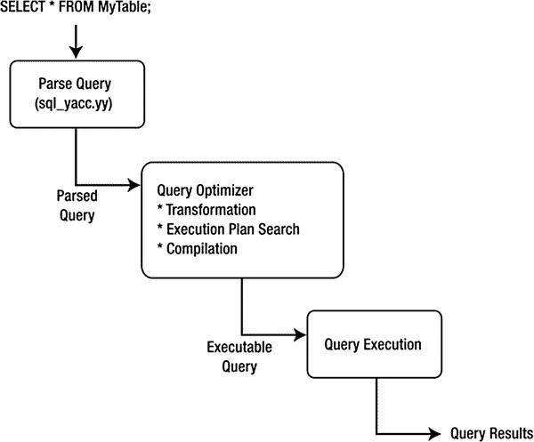
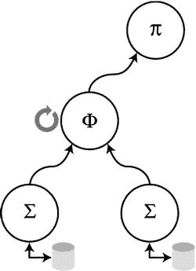

第十一章


数据库系统内部

本章介绍了一些数据库系统内部的概念，为更深入地研究数据库系统内部做准备。我将更深入地介绍查询在服务器内部是如何表示的，以及查询是如何执行的。我从一个更一般的角度来探讨这些主题，然后以讨论如何使用 MySQL 系统来进行自己的 MySQL 系统内部实验来结束这一章。最后，我将介绍数据库系统的内部实验项目。

查询执行

大多数数据库系统使用迭代或解释执行策略。*迭代*方法 提供了产生可用于处理离散操作(例如，连接、项目等)的调用序列的方法。)，但其设计并不包含内部表示的特征。将查询转换成迭代方法使用了函数式编程和程序转换技术。一些算法从基于关系代数的查询规范生成迭代程序。

查询执行机制的实现创建了一组使用高级语言形成的已定义的已编译功能原语，然后通过调用堆栈或过程调用序列将它们链接在一起。当创建并选择执行查询执行计划时，编译器(通常与创建数据库系统的编译器相同)用于将过程调用编译成二进制可执行文件。由于迭代方法的高成本，编译后的执行计划通常会被存储起来，以供类似或相同的查询重用。

*解释性*方法 另一方面，使用基本操作的现有编译抽象来执行查询执行。所选择的查询执行计划被重新构造为一个方法调用队列，每个方法调用都从队列中取出并进行处理；然后将结果存储在内存中，供下一次或后续调用使用。这种策略的实现通常被称为*惰性评估、*，因为可用的编译方法没有针对最佳性能进行优化；相反，它们是为通用性而优化的。

MySQL 查询执行 再探

MySQL 中的查询处理和执行是解释性的。它是使用线程架构实现的，每个查询都有自己的执行线程。图 [**11-1**](#Fig1) 描绘了一个描述 MySQL 查询处理方法的框图。



[图 11-1。](#_Fig1) MySQL 查询执行

当客户机发出查询时，会创建一个新线程，并将 SQL 语句转发给解析器进行语法验证(或因错误而拒绝)。正如您在前一章中看到的，MySQL 解析器是使用一个用 Bison 编译的大型莱克斯-YACC 脚本实现的。解析器构造了一个用来保存查询的数据结构。这种数据结构或查询结构可用于执行查询。一旦创建了查询结构，控制就传递给查询处理器，查询处理器执行诸如验证表完整性和安全访问之类的检查。一旦授予了所需的访问权限并打开了表(如果查询是更新，则表被锁定)，控制权就传递给执行基本查询操作的各个方法，如 select、restrict 和 project。通过对表和操作的列表进行排序来对数据结构进行优化，以形成基于常见实践的更有效的查询。这种形式的优化被称为选择项目连接查询处理器。使用已建立的通信协议和访问方法将查询操作的结果返回给客户端。

什么是编译查询 ？

理解“编译”的意思时，一个经常混淆的领域。编译查询是迭代查询执行计划的实际编译，但一些研究人员(如 C. J. Date)认为编译查询是经过优化并存储以供将来执行的查询。因此，在考虑使用编译后的查询时，您必须小心。在这项工作中，避免使用单词 *compiled* ，因为查询优化器和执行引擎不存储查询执行计划供以后重用，查询执行也不需要任何编译或汇编工作。

 **注意**存储过程的概念是一个保存的计划——它被编译或优化，以便以后执行，并且可以对满足其输入参数的数据运行多次。

探索 MySQL 内部

你怎样才能教一个人优化器是如何工作的，而不允许他参与项目呢？此外，在没有实际看到数据库系统的内部情况下，您怎么能期望了解它们呢？在本节中，我将通过讨论如何将 MySQL 用作专业人士和学者的实验平台来回答这些问题。

开始使用 MySQL 进行实验

使用 MySQL 进行实验有几种方法。例如，您可以使用交互式调试器来研究内部组件，或者您可以使用 MySQL 系统作为您自己的内部数据库技术实现的宿主。查看服务器内部行为的另一个有用的方法是打开跟踪，并读取使用调试打开时编译的服务器生成的跟踪。关于调试跟踪的更多细节，参见第 5 章。

如果您要进行实验，请使用专用服务器进行实验。如果您计划使用 MySQL 开发自己的扩展，这一点很重要。你不想冒实验污染你的开发服务器的风险。

试用 MySQL 源代码

实验 MySQL 最具侵入性的方法是修改源代码。这包括在系统运行时观察它，然后通过用另一个算法或代码段替换另一个算法或代码段来设计改变部分的实验，然后观察行为的变化。虽然这种方法将使您能够研究 MySQL 的内部工作方式，但是以这种方式对源代码进行更改可能会导致服务器变得太不稳定而无法使用——特别是如果您突破了算法和数据结构的极限，或者更糟的是，违反了内存引用。然而，学习源代码最好的方法就是观察它的运行。以这种方式进行的测试可以用来为其他形式的实验收集数据。

使用 MySQL 作为实验技术的主机

使用 MySQL 进行实验的一种侵入性较小的方法是使用 MySQL 作为自己实验代码的宿主。这使您可以专注于优化器和执行引擎，而不用担心系统的其他部分。数据库系统有许多部分。仅举几个例子，MySQL 中有用于网络通信、数据输入和访问控制的子组件，甚至还有用于使用和管理文件和内存的实用程序。您可以在自己的代码中使用 MySQL 的资源，而不是创建自己的子组件。

我已经用这种方法实现了本书中描述的实验项目。我将向您展示如何连接到 MySQL 解析器，并使用 MySQL 解析器来读取、测试和接受有效命令，并将代码重定向到实验项目优化器和执行例程。

解析器和词法分析器 识别已经在解析器或词法散列中定义的字母数字字符串(也称为记号)。解析器用位置信息(在流中出现的顺序)标记所有的标记，并使用识别非标记字符串的特定模式的逻辑来识别文字和数字。一旦解析器完成，控制返回到词法分析器。MySQL 中的词法分析器被设计用来识别标记和非标记的特定模式。一旦有效命令被识别，控制就被传递给每个命令的执行代码。MySQL 解析器和词法分析器可以进行修改，以包括新的令牌或关键字，用于实验。关于如何修改解析器和词法分析器的更多细节，参见[第 7 章](07.html)。这些命令可以设计成模拟 SQL 的命令，代表典型的数据操作命令，如 select、update、insert 和 delete，以及典型的数据定义命令，如 create 和 drop。

一旦控制传递给实验优化/执行引擎，就可以使用 MySQL 内部查询表示结构运行实验，或者转换成另一种结构。从那里，可以运行查询优化和执行的实验实现，并使用 MySQL 系统将结果返回给客户机。这允许您在实现自己的内部数据库组件时使用网络通信和解析子组件。

运行多个 MySQL 实例

关于 MySQL 服务器的一个鲜为人知的事实是，可以在一台机器上运行服务器的多个实例。这允许您在与开发安装相同的机器上运行修改后的 MySQL 系统。如果您的资源有限，或者为了进行比较，您希望将修改后的服务器作为另一个安装在同一台计算机上运行，那么您可能需要这样做。运行多个 MySQL 实例需要在命令行或配置文件中指定某些参数。

虚拟机拯救世界

您还可以利用虚拟机来进一步隔离您的实验。为了充分利用这个选项，您可以用一个基本的 MySQL 服务器安装配置一个虚拟机 ，然后克隆这个虚拟机。这允许您运行 MySQL 的一个实例，就像它在一台单独的机器上一样。一些虚拟机环境还允许您在机器运行时拍摄快照，这允许您在拍摄快照时重新启动会话。这可以节省您设置测试环境的大量时间。当面对复杂或冗长的测试环境设置时，我经常选择这种方法。

有许多虚拟环境可供选择。开源的 Oracle VirtualBox 是学者和希望省钱的人的绝佳选择。VirtualBox 可以在大多数平台上运行，并提供设置虚拟 MySQL 服务器主机所需的所有功能。VMWare 的软件很贵，但是它提供了更多的功能。如果您运行 Mac OS X，VMWare 的 Fusion 和 Parallel Desktop 都是出色的低成本替代产品。

至少，您需要为服务器通信指定不同的 TCP 端口或套接字，并为数据库文件指定不同的目录。在 Windows 上启动第二个 MySQL 实例的一个例子是:

```sql
mysqld-debug.exe --port=3307 --datadir="c:/mysql/test_data" --console
```

在这个例子中，我告诉服务器使用 TCP 端口 3307 (默认为 3306)，并使用不同的数据目录，作为控制台应用程序运行。为了连接到服务器的第二个实例，我必须告诉客户机使用与服务器相同的端口。例如，为了连接到我的第二个实例，我将启动 MySQL 客户端实用程序，它具有:

```sql
mysql.exe -uroot --port=3307
```

`--port`参数也可以与`mysqladmin`实用程序一起使用。例如，要关闭在端口 3307 上运行的第二个实例，请发出以下命令:

```sql
mysqladmin.exe -uroot --port=3307 shutdown
```

这项技术存在潜在的问题。很容易忘记您连接的是哪台服务器。防止混淆或避免向错误的服务器发出查询(如`DELETE`或`DROP`)的一种方法是更改 MySQL 客户端实用程序上的提示，以指示您所连接的服务器。

例如，发出命令`prompt DBXP->`为连接到实验服务器的 MySQL 客户机设置提示符，为连接到开发服务器的 MySQL 客户机设置提示符`prompt Development->`。这种技术使您一眼就能看出您将要向哪个服务器发出命令。在 MySQL 客户端使用`prompt`命令的例子如清单 11-1 所示。

***清单 11-1。*** *实验服务器改变 MySQL 客户端提示的例子*

```sql
mysql> prompt DBXP->
PROMPT set to 'DBXP->'
DBXP->show databases;
+−−------------------+
| Database           |
+−−------------------+
| information_schema |
| mysql              |
| test               |
+−−------------------+
3 rows in set (0.01 sec)

DBXP->
```

 **提示**您也可以使用`\d`选项在提示中设置当前数据库。例如，要在连接到实验服务器的客户机中设置提示符，发出命令`prompt DBXP:\d->`。这将设置提示，指示您连接到实验服务器和当前数据库(由最后一个`use`命令指定)，用冒号(例如`DBXP:TEST->`)隔开。

您可以使用这种技术来限制对修改后的服务器的访问。如果更改端口号或套接字，只有知道正确参数的人才能连接到服务器。这将使您能够将修改暴露给用户群的风险降至最低。如果您的开发环境是多样化的，有许多共享相同资源的实验和研究项目(这在学术界是常见的)，您可能还想采取这些步骤来保护您自己的实验免受其他项目的污染。这通常不是问题，但它有助于采取预防措施。

 **注意**如果使用二进制、查询或慢速查询日志，还必须为 MySQL 服务器的每个实例指定日志文件的备用位置。否则可能会导致日志文件和/或数据损坏。

局限性和关注点

也许使用 MySQL 进行实验最具挑战性的方面是修改解析器来识别 SQL 命令的新关键字(见第 7 章)。虽然不完全是一种复杂或新的实现语言，但修改 YACC 文件需要仔细关注最初开发人员的意图。解决方案包括在每个解析器命令定义的顶部放置新命令的 SQL 语法定义的副本。这允许您拦截解析器的流，以便重定向查询执行。

最常见也是最重要的挑战是跟上 MySQL 代码库的不断变化。不幸的是，升级的频率是不可预测的。如果您想跟上特性变化的步伐，实验性技术的集成需要在每次发布源代码时重新插入对 MySQL 源文件的修改。对于任何想尝试 MySQL 的人来说，这可能不是一个问题。如果您发现自己因为正在编写的扩展而想要跟上变化，您可能应该使用源代码管理工具或构建第二个服务器进行实验，并在原始服务器上进行开发。

 **提示**您最有可能遇到的挑战是检查 MySQL 代码库，并发现各种内部数据表示的含义、布局和用途。克服这一点的唯一方法是通过熟悉。我鼓励您访问和阅读文档(在线 MySQL 参考手册)以及 MySQL 网站、博客和消息论坛上的文章。它们是丰富的信息。虽然有些很难理解，但是每读一遍，这些概念就会变得更加清晰。抵制对文档感到沮丧的诱惑。休息一会儿，然后回头再看一遍。每当我(重读)阅读技术资料时，我都能找到有用的信息。

数据库系统内部实验

我构建了数据库实验项目(DBXP ) 来让您探索 MySQL 的内部，并让您探索一些替代数据库系统的内部实现。您可以通过这个实验了解更多关于数据库系统是如何构建的，以及它们是如何工作的。

为什么是实验？

DBXP 是一个实验而不是一个解决方案，因为它是不完整的。也就是说，这些技术以最小的错误处理、有限的特征集和低鲁棒性来实现。

这并不意味着 DBXP 技术不能被修改来替代 MySQL 系统的内部组件；更确切地说，DBXP 是为探索而设计的，而不是为生产而设计的。

实验项目概述

DBXP 项目是一系列实现内部查询表示、查询优化、查询执行和文件访问的替代算法和机制的类。这不仅让您有机会探索查询优化理论 的高级实现，而且还使 DBXP 技术的核心能够在不修改 MySQL 内部操作的情况下执行。这提供了额外的安全性，本地 MySQL 核心可执行代码不会受到 DBXP 技术的影响。这个额外的好处可以帮助减轻修改现有系统的一些风险。

MySQL 解析器(见`sql_parse.cc`)的实现通过调用为每个 SQL 命令实现的函数，将控制指向执行子进程的特定实例。例如，`SHOW`命令被重定向到在`sql_show.cc`文件中实现的函数。需要修改`sql_parse.cc`中的 MySQL 解析器代码，将处理重定向到 DBXP 查询处理器。

DBXP 查询处理器的第一步是将 MySQL 内部查询表示转换成实验性的内部表示。选择的内部表示被称为*查询树*，其中每个节点包含一个原子关系操作(选择、投影、连接等)。)和链接代表数据流。图 [**11-2**](#Fig2) 显示了一个查询树的概念示例。在示例中，我使用了符号:投影/选择(π)、限制(σ)和连接(φ)。箭头表示数据如何从表流向根。一个连接操作被表示为一个有两个子节点的节点。当数据从每个子节点呈现时，join 操作能够处理该数据并将结果传递给树中的下一个节点(其父节点)。每个节点可以有零个、一个或两个子节点，并且只有一个父节点。



[图 11-2。](#_Fig2)查询树概念

选择查询树是因为它允许 DBXP 查询优化器使用树操作算法。也就是说，优化使用树结构和树操作算法来以更有效的执行顺序排列树中的节点。此外，优化查询的执行是通过将树遍历到叶节点，执行由节点指定的操作，并将信息传递回链接来完成的。这种技术也使得以流水线方式执行成为可能，数据从叶节点传递到根节点，一次一个数据项。

将树向下遍历到一个数据项的叶子，并将其返回到树上(这个过程称为*脉冲*)允许每个节点处理一个数据项，在结果集中一次返回一行。树的这种脉动或轮询允许流水线的执行。结果是查询结果的更快的初始返回和感觉到的查询结果到客户端的更快的传输时间。见证查询结果更快地返回——尽管不是一下子全部返回——给用户一种查询更快的感觉。

使用 MySQL 托管 DBXP 实现始于 MySQL 解析器，其中 DBXP 代码接管查询的优化和执行，然后使用 MySQL 网络通信实用程序将结果一次一行地返回给客户机。

实验项目的组成部分

实验项目旨在向您介绍数据库系统内部实现的替代方案，并允许您通过向项目添加自己的修改来探索实现。DBXP 是使用一组简单的 C++类实现的，这些类表示数据库系统中的对象。

有用于元组、关系、索引和查询树的类。添加了额外的类来管理多用户对表的访问。图 [**11-3**](#Fig3) 显示了一个 DBXP 的高层架构的例子。

项目主要类别的完整列表见表 [11-1](#Tab1) 。这些类以与类相同的名称存储在源文件中(例如，`Attribute`类分别在名为`attribute.h`和`attribute.cc`的文件中定义和实现)。

[表 11-1。](#_Tab1)数据库内部实验项目类

| *类* | 描述 |
| --- | --- |
| *查询 _ 树* | 提供查询的内部表示形式。还包含查询优化器。 |
| `Expression` | 提供了一个表达式评估机制。 |
| `Attribute` | 存储和操作元组(行)的属性(列)的操作。 |

这些类代表了数据库系统的基本构件。第 12 章到第 14 章包含了对查询树、启发式优化器和流水线执行算法的完整解释。这些章节还包括该实用程序的概述。我将向您展示 DBXP 实现的某些部分(最复杂的部分)的实现细节，剩下的部分留给您作为练习来实现。


[图 11-3。](#_Fig3)实验项目的高层图

本书的引言部分介绍了如何在课堂环境中使用实验项目的建议。

进行实验

运行实验需要为新项目修改 cmake 文件,并用 MySQL 服务器编译它们。没有一个项目文件需要任何特殊的编译或库。对 MySQL 配置和 cmake 文件的修改细节将在下一章中讨论，在这一章中，我将向您展示如何在实验中删除 SQL 命令。

如果您没有尝试过前几章的示例程序，我在下面包含了构建和运行 DBXP 实验项目的基本过程。

1.  修改/sql 文件夹中的`CMakeLists.txt file`。
2.  运行'`cmake.’ from the root of the source tree.`
3.  运行'`make’ from the root of the source tree`。
4.  停止服务器，将可执行文件复制到二进制目录中。
5.  重新启动服务器并通过 MySQL 客户端连接以运行 DBXP SQL 命令。

摘要

在这一章中，我介绍了一些更复杂的数据库内部技术。您了解了查询在服务器内部是如何表示的以及如何执行的。更重要的是，您发现了如何使用 MySQL 来进行自己的数据库内部实验。这些技术的知识应该让您更好地理解 MySQL 系统是如何构建的，以及它是如何执行的。

在下一章中，我将通过一个查询树结构的示例实现向您展示更多关于内部查询表示的内容。下一章是一系列章节的开始，旨在为您实现自己的查询优化器和执行引擎提供基础。如果你想知道构建一个数据库系统需要什么，接下来的章节将向你展示如何开始使用你自己的查询引擎。