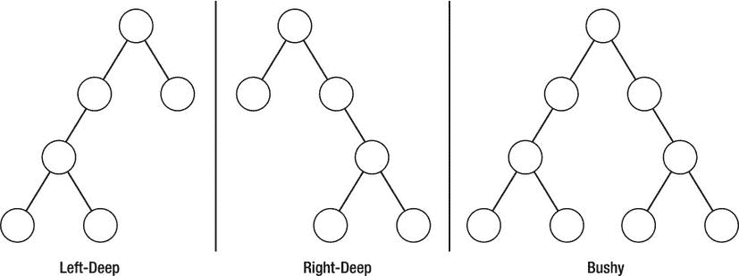

第十四章


查询执行

第 12 章中显示的查询树类和第 13 章中显示的启发式优化器构成了 DBXP 查询执行引擎的三个组件中的前两个。在本章中，我将向您展示如何扩展查询树类来处理投影、限制和连接操作。这将让您一瞥数据库查询执行的世界。我首先简要解释查询执行算法的基本原理，然后开始编写代码。因为某些方法的代码相当长，所以本章中显示的代码示例并不都包含完整的源代码。如果您正在编写示例代码，请考虑加载本章的源代码并使用它，而不是从头开始键入代码。

重新审视查询执行

查询执行过程是各种关系理论操作的实现。这些操作包括投影、限制、连接、叉积、并集和交集。很少有数据库系统实现并集和交集。

 **注意** Union 和 intersect 与 SQL 中的`UNION`运算符不同。union 和 intersect 关系操作是集合操作，而 SQL 中的`UNION`操作符只是组合两个或多个具有兼容结果列的`SELECT`语句的结果。

编写实现这些操作的算法非常简单，在关系理论和数据库系统的教科书中经常被忽略。不幸的是，算法被省略了，因为连接操作并不简单。以下部分描述了关系运算的基本算法。

项目

在项目(或投影)操作中，结果集包含原始关系(表)中属性(列)的子集。 [<sup>1</sup>](#Fn1) 因此，结果集可以包含比原始关系更少的属性。用户在 SQL `SELECT`命令中指定投影，方法是在列列表中紧随`SELECT`关键字列出所需的列。例如，这个命令从`staff`表中投影出`first_name`和`last_name`列:

```sql
SELECT first_name, last_name FROM staff
```

实现该操作的项目算法 如[清单 14-1](#list1) 所示。

[***清单 14-1。***](#_list1) 项目算法

```sql
begin
  do
    get next tuple from relation
    for each attribute in tuple
      if attribute.name found in column_list
        write attribute data to client
      fi
  while not end_of_relation
end
```

从清单中可以看出，实现该算法的代码将发送给客户机的数据限制为列列表中指定的数据。

限制

在限制(或约束)操作中，结果集包含原始关系(表)中元组(行)的子集。因此，结果集可以包含比原始关系更少的元组。用户通过在紧随`FROM`子句之后的`WHERE`子句中列出期望的条件，在 SQL `SELECT`命令中指定限制。例如，下面的命令将来自`staff`表的结果集限制为年收入超过$65，000.00 的雇员。

```sql
SELECT first_name, last_name FROM staff WHERE salary > 65000.00
```

实现该操作的限制算法 如[清单 14-2](#list2) 所示。

[***清单 14-2。***](#_list2) 限制算法

```sql
begin
  do
    get next tuple from relation
    if tuple attribute values match conditions
      write attribute data to client
    fi
  while not end_of_relation
end
```

从清单中可以看出，实现该算法的代码是元组中的数据值与`WHERE`子句中的条件相匹配的地方。该算法通常通过额外的优化步骤来实现，以将表达式减少到最小集合(例如，忽略总是为真的条件)。

加入

连接操作是这样一种操作，其中结果集包含与两个关系(表)的指定组合相匹配的元组(行)。使用`n-1`连接来连接三个或更多的表，其中`n`是表的数量。在连接三个表(A、B、C)的情况下，连接是两个表的组合，并且该连接的结果与剩余的表连接。连接方式的组合——作为左深或右深的树或者甚至作为浓密的树——是中间连接的执行顺序之一。[图 14-1](#Fig1) 中显示了这些类型的采油树布置的示例。



[图 14-1。](#_Fig1)树形排列示例

联接最常用于主/从关系中，在这种关系中，一个表(基表或主表)引用一个或多个子表(从表)，其中基表中的一条记录与从表中的一条或多条记录相匹配。例如，您可以创建一个包含客户信息的`customer`表和一个包含客户订单数据的`orders`表。`customer`表是基表，`orders`表是子表。

```sql
SELECT customer.name, orders.number
FROM customer JOIN orders on customer.id = orders.customerid
```

用户通过在`FROM`子句中列出所需的表和连接条件，在 SQL `SELECT`命令中指定连接。例如，下面的命令将`customer`表中的记录与`orders`表中的记录连接起来。注意，在这种情况下，连接条件是一个简单的等式关系，表共享一个公共列。

连接操作的算法不像前面描述的那样简单。这是因为连接操作可以用几种形式表示。您可以选择使用一个简单的`column from table A = column from table B`表达式进行连接，就像前面的例子一样，或者您可以选择通过只包含左、右或两个表中的匹配行(内部)、匹配和不匹配行(外部)来控制输出。因此，连接操作包括内连接(有时称为自然连接或等价连接 [<sup>2</sup>](#Fn2) )、左外连接、右外连接、全外连接、叉积、并集和交集。以下各节详细描述了这些操作。

 **注意**一些数据库文本将叉积、并集和交集视为离散操作。我认为它们是连接操作的特殊形式。

内部连接

inner-join 操作是这样一种操作，其中结果集包含原始关系(表)中元组(行)的一个子集，其中有一个连接条件匹配。之所以称为内部联接，是因为只有第一个关系中联接条件值与第二个关系中某行的联接条件值相匹配的那些行才会包含在结果集中。

用户通过在`FROM`子句中列出所需的条件，在 SQL `SELECT`命令中指定内部连接。例如，下面的命令将结果集从`staff`表连接到`directorate`表，返回一个结果集，该结果集包含所有分配了董事会的雇员(一个雇员没有分配董事会)。

```sql
SELECT staff.last_name, staff.dept_name
FROM staff JOIN directorate on staff.dept_id = directorate.id
```

 **注意**对于大多数数据库系统来说，关键字`INNER`通常是可选的，因为默认的连接操作是内部连接。

实现该操作的内部连接算法如清单 14-3 中的[所示。该算法只是几种形式的连接算法之一。所示的算法是合并-连接的一种变体。因此，可以使用另一个同等能力的连接算法来实现该算法，例如嵌套循环连接算法。](#list3)

[***清单 14-3。***](#_list3) 加入算法

```sql
begin
  sort relation a as rel_a on join column(s)
  sort relation b as rel_b on join column(s)
  do
    get next tuple from rel_a
    get next tuple from rel_b
    if join column values match join conditions
      write attribute data to client
    fi
    check rewind conditions
  while not end_of_rel_a and not end_of_rel_b
end
```

用户还可以通过在`WHERE`子句中包含连接条件来指定内部连接，如下所示。一些数据库专业人员不鼓励这种变体，因为它可能会被误认为是普通的`SELECT`命令。大多数人认为这种变体在功能上是等价的，大多数数据库优化器都是为了适应它而编写的。

```sql

SELECT staff.last_name, directorate.dept_name
FROM staff, directorate WHERE staff.dept_id = directorate.id
```

从清单中可以看出，实现该算法的代码需要使用排序。需要进行排序来对表中连接列上的行进行排序，这样，如果行中有任何重复的条件值，算法就可以正确地识别所有匹配项。为了说明这一点，考虑清单 14-4 中的表格。

[***清单 14-4。***](#_list4) 示例连接表(无序)

```sql
staff table
+-----------+------------+----------+------------+------+--------+-----------+
| id        | first_name | mid_name | last_name  | sex  | salary | mgr_id    |
+-----------+------------+----------+------------+------+--------+-----------+
| 333445555 | John       | Q        | Smith      | M    |  30000 | 333444444 |
| 123763153 | William    | E        | Walters    | M    |  25000 | 123654321 |
| 333444444 | Alicia     | F        | St.Cruz    | F    |  25000 | None      |
| 921312388 | Goy        | X        | Hong       | F    |  40000 | 123654321 |
| 800122337 | Rajesh     | G        | Kardakarna | M    |  38000 | 333445555 |
| 820123637 | Monty      | C        | Smythe     | M    |  38000 | 333445555 |
| 830132335 | Richard    | E        | Jones      | M    |  38000 | 333445555 |
| 333445665 | Edward     | E        | Engles     | M    |  25000 | 333445555 |
| 123654321 | Beware     | D        | Borg       | F    |  55000 | 333444444 |
| 123456789 | Wilma      | N        | Maxima     | F    |  43000 | 333445555 |
+-----------+------------+----------+------------+------+--------+-----------+

directorate table
+----------+-----------------+-------------+
| dir_code | dir_name        | dir_head_id |
+----------+-----------------+-------------+
| N41      | Development     | 333445555   |
| N01      | Human Resources | 123654321   |
| M00      | Management      | 333444444   |
+----------+-----------------+-------------+
```

 **注意**一些数据库系统(如 MySQL)以原始的无序顺序返回行。为了突出重点，按照内部排序的顺序列出了所示的示例。

请注意，这些表没有排序。如果要在不对行排序的情况下运行使用该算法显示的示例连接，则必须从一个表中读取每行的所有行，从另一个表中读取。例如，如果按所示顺序读取`staff`表，您将从`directorate`表中读取一行用于第一次连接，从`directorate`表中读取两行用于从`staff`开始的下一行，然后是两行、一行、一行、一行、四行、两行，总共从`directorate`表中读取 14 次来完成操作。然而，如果表按照清单 14-5 中的[排序，你可以避免从`directorate`表中重新读取行。](#list5)

[***清单 14-5。***](#_list5) 示例连接表(按连接列排序)

```sql
staff table
+-----------+------------+----------+------------+------+--------+-----------+
| id        | first_name | mid_name | last_name  | sex  | salary | mgr_id    |
+-----------+------------+----------+------------+------+--------+-----------+
| 123763153 | William    | E        | Walters    | M    |  25000 | 123654321 |
| 921312388 | Goy        | X        | Hong       | F    |  40000 | 123654321 |
| 333445555 | John       | Q        | Smith      | M    |  30000 | 333444444 |
| 123654321 | Beware     | D        | Borg       | F    |  55000 | 333444444 |
| 333445665 | Edward     | E        | Engles     | M    |  25000 | 333445555 |
| 830132335 | Richard    | E        | Jones      | M    |  38000 | 333445555 |
| 820123637 | Monty      | C        | Smythe     | M    |  38000 | 333445555 |
| 800122337 | Rajesh     | G        | Kardakarna | M    |  38000 | 333445555 |
| 123456789 | Wilma      | N        | Maxima     | F    |  43000 | 333445555 |
| 333444444 | Alicia     | F        | St.Cruz    | F    |  25000 | None      |
+-----------+------------+----------+------------+------+--------+-----------+

directorate table
+----------+-----------------+-------------+
| dir_code | dir_name        | dir_head_id |
+----------+-----------------+-------------+
| N01      | Human Resources | 123654321   |
| M00      | Management      | 333444444   |
| N41      | Development     | 333445555   |
+----------+-----------------+-------------+
```

然而，这产生了另一个问题。您如何知道不从任何一个表中读取另一行呢？请注意内部连接算法的最后一步。这就是实现变得有点棘手的地方。这里您需要做的是能够重用已经被读取的行，以便您可以将一个表中的一行与另一个表中的多行进行比较。当您考虑到可能必须从任一表前进(前进一行)或后退(后退一行)时，这就变得很棘手了。

如果您使用 staff . mgr _ id = directorate . dir _ head _ id 作为连接条件(首先从`staff`表中读取为`rel_a`)手动执行排序示例表的算法，您将会看到该算法需要两次“重用”dir_head_ `id`为 333444444 的 directive 行和 dir_head_ `id`为 333445555 的行。行的缓存有时被称为“倒回”表读指针。这个例子的结果集如[清单 14-6](#list6) 所示。

[***清单 14-6。***](#_list6) 示例内部连接结果集

```sql
+------------+-----------------+
| last_name  | dir_name        |
+------------+-----------------+
| Smith      | Management      |
| Walters    | Human Resources |
| Hong       | Human Resources |
| Kardakarna | Development     |
| Smythe     | Development     |
| Jones      | Development     |
| Engles     | Development     |
| Borg       | Management      |
| Maxima     | Development     |
+------------+-----------------+
```

清单 14-6 只产生 9 行，而不是 10 行。这是因为在董事表中有一行没有经理标识，因为她是老板。因此，在董事表中没有与 mgr_id = dir_head_id 匹配的相应行。

外部连接

外部连接类似于内部连接，但是在这种情况下，我们感兴趣的是从左表、右表或两个表中获取所有的行。也就是说，无论另一个表中是否有匹配的行，我们都包括指定表中的行(左、右或左、右——也称为全表)。这些操作中的每一个都可以用一般外连接算法的微小变化来表示。

用户通过在`FROM`子句中列出所需的条件并调用其中一个选项(`left`、`right`、`full`)，在 SQL `SELECT`命令中指定外部连接。如果省略选项，一些数据库系统默认使用`left`。例如，以下命令将结果集从`staff`表连接到`directorate`表，返回所有雇员和董事会的结果集:

```sql
SELECT staff.last_name, directorate.dir_name
FROM staff LEFT OUTER JOIN directorate on staff.mgr_id = directorate.dir_head_id;
```

请注意，这不同于内部连接，因为左侧表中的行没有被省略。清单 14-7 显示了基本的外连接算法。以下部分描述了该算法如何实现三种类型的外部联接。

[***清单 14-7。***](#_list7) 外连接算法

```sql
begin
  sort relation a as rel_a on join column(s)
  sort relation b as rel_b on join column(s)
  do
    get next tuple from rel_a
    get next tuple from rel_b
    if type is FULL
      if join column values match join conditions
        write attribute data from both tuples to client
      else
        if rel_a has data
          write NULLS for rel_b
        else if rel_b has data
          write NULLS for rel_a
        fi
    else if type is LEFT
      if join column values match join conditions
        write attribute data from rel_a to client
      else
        if rel_a has data
          write NULLS for rel_b
      fi
    else if type is RIGHT
      if join column values match join conditions
        write attribute data from rel_b to client
      else
        if rel_b has data
          write NULLS for rel_a
      fi
    fi
    check rewind conditions
  while not end_of_rel_a and not end_of_rel_b
end
```

接下来，我们讨论每种类型的外部连接的例子。

左外部连接

左外连接 包括左表中的所有行和右表中的行。对于那些不符合连接条件的行，将为右表中的列返回 null 值。

```sql
SELECT staff.last_name, directorate.dir_name
FROM staff LEFT OUTER JOIN directorate on staff.mgr_id = directorate.dir_head_id;
```

清单 14-8 显示了样本表的左外部连接的结果集。

[***清单 14-8。***](#_list8) 示例左外连接结果集

```sql
+------------+-----------------+
| last_name  | dir_name        |
+------------+-----------------+
| Smith      | Management      |
| Walters    | Human Resources |
| St.Cruz    | NULL            |
| Hong       | Human Resources |
| Kardakarna | Development     |
| Smythe     | Development     |
| Jones      | Development     |
| Engles     | Development     |
| Borg       | Management      |
| Maxima     | Development     |
+------------+-----------------+
```

请注意，现在我们看到包含 staff 表中的行的行在 directorate 表中没有匹配的行。这是因为我们告诉优化器使用 staff 表中的所有行(连接规范左边的行)并匹配右边的表。因此，我们看到了外部连接的许多用途之一——它们可以用来识别任何不匹配。 [<sup>3</sup>](#Fn3)

右外部联接

右外连接 包括右表中的所有行和左表中的行。对于那些不符合连接条件的行，将为左表中的列返回 null 值。

```sql
SELECT staff.last_name, directorate.dir_name
FROM staff RIGHT OUTER JOIN directorate on staff.mgr_id = directorate.dir_head_id;
```

清单 14-9 显示了样本表的左外部连接的结果集。

[***清单 14-9。***](#_list9) 例子右外连接结果集

```sql
+------------+-----------------+
| last_name  | dir_name        |
+------------+-----------------+
| Kardakarna | Development     |
| Smythe     | Development     |
| Jones      | Development     |
| Engles     | Development     |
| Maxima     | Development     |
| Walters    | Human Resources |
| Hong       | Human Resources |
| Smith      | Management      |
| Borg       | Management      |
+------------+-----------------+
```

现在我们回到九排。这是因为我们指示优化器使用右表中与左表匹配的所有行，并且由于董事表(连接规范右侧的行)中没有与 staff 表中的行不匹配的行，所以左表中不匹配的行被省略。

完全外部连接

完全外部连接包括两个表中连接在一起的所有行。对于那些不匹配连接条件的行，将不匹配表中的列返回 null 值。

```sql
SELECT staff.last_name, directorate.dir_name
FROM staff FULL OUTER JOIN directorate on staff.mgr_id = directorate.dir_head_id;
```

清单 14-10 显示了样本表的完全外部连接的结果集。

[***清单 14-10。***](#_list10) 示例完整的外连接结果集

```sql
+------------+-----------------+
| last_name  | dir_name        |
+------------+-----------------+
| Smith      | Management      |
| Walters    | Human Resources |
| St.Cruz    | NULL            |
| Hong       | Human Resources |
| Kardakarna | Development     |
| Smythe     | Development     |
| Jones      | Development     |
| Engles     | Development     |
| Borg       | Management      |
| Maxima     | Development     |
+------------+-----------------+
```

虽然 MySQL 不支持完整的外部连接，但上面的输出是有代表性的。现在考虑一下，如果董事表包含一个没有 dir_head_id 的行，输出会是什么。我把这作为一个练习留给你去思考。

交叉积

叉积运算是结果集包含左表的每一行和右表的每一行的运算。因此，结果集包含`n x m`行，其中`n`表示左表中的行数，`m`表示右表中的行数。虽然概念简单，但并不是所有的数据库系统都支持跨产品操作。

 **注意**在大多数数据库系统中，可以使用像`SELECT * FROM table1, table2`这样的查询来表示叉积查询。在这种情况下，没有连接条件，所以来自`table1`的所有行都与来自`table2`的所有行匹配。在 MySQL 上亲自尝试一下。您将看到 MySQL 使用这种方法支持跨产品操作。

用户通过在`FROM`子句中包含关键字`CROSS`代替`JOIN`来指定叉积运算。您可能认为这个操作的适用性有限，但是您会对它的有用性感到惊讶。假设你正在为人工智能算法的可能结果建模。您可能有存储可能的下一步行动(结果)的表和存储刺激的其他表。如果你想找到所有可能的组合，给定从一个表中选择的刺激列表和从另一个表中选择的对移动的可能影响，你可以产生一个显示所有组合的结果集。[清单 14-11](#list11) 展示了这样一个场景的例子。

[***清单 14-11。***](#_list11) 示例跨产品场景

```sql
CREATE TABLE next_stim
SELECT source, stimuli_id FROM stimuli WHERE likelihood >= 0.75
+------------+------------+
| source     | stimuli_id |
+------------+------------+
| obstacle   | 13         |
| other_bot  | 14         |
| projectile | 15         |
| chasm      | 23         |
+------------+------------+

CREATE TABLE next_moves
SELECT move_name, next_move_id, likelihood FROM moves WHERE likelihood >= 0.90
+------------+--------------+------------+
| move_name  | next_move_id | likelihood |
+------------+--------------+------------+
| turn left  | 21           | 0.25       |
| reverse    | 18           | 0.40       |
| turn right | 22           | 0.45       |
+------------+--------------+------------+

SELECT * FROM next_stim CROSS next_moves
+------------+------------+------------+--------------+------------+
| source     | stimuli_id | move_name  | next_move_id | likelihood |
+------------+------------+------------+--------------+------------+
| obstacle   | 13         | turn left  | 21           | 0.25       |
| obstacle   | 13         | reverse    | 18           | 0.40       |
| obstacle   | 13         | turn right | 22           | 0.45       |
| other_bot  | 14         | turn left  | 21           | 0.25       |
| other_bot  | 14         | reverse    | 18           | 0.40       |
| other_bot  | 14         | turn right | 22           | 0.45       |
| projectile | 15         | turn left  | 21           | 0.25       |
| projectile | 15         | reverse    | 18           | 0.40       |
| projectile | 15         | turn right | 22           | 0.45       |
| chasm      | 23         | turn left  | 21           | 0.25       |
| chasm      | 23         | reverse    | 18           | 0.40       |
| chasm      | 23         | turn right | 22           | 0.45       |
+------------+------------+------------+--------------+------------+
```

清单 14-12 显示了叉积算法。请注意，这个示例是使用两个步骤编写的:一个步骤是合并行，另一个步骤是删除重复的行。

[***清单 14-12。***](#_list12) 叉积算法

```sql
begin
  do
    get next tuple from rel_a
    do
      get next tuple from rel_b
      write tuple from rel_a concat tuple from rel_b to client
    while not end_of_rel_b
  while not end_of_rel_a
  remove duplicates from temp_table
  return data from temp_table to client
end
```

从清单中可以看出，实现该算法的代码实际上是两个循环中的一个，其中左表中的行与右表中的行连接在一起(即嵌套循环算法)。

联盟

union 运算与同名的 set 运算相同。在这种情况下，联接是两个表中所有行的联合，其中删除了重复的行。当然，为了使该操作能够进行，这些表必须具有相同的设计。这不同于 SQL union，因为 SQL union 包括来自所有`SELECT`命令的行(具有兼容的列列表),而不考虑重复。与其他连接不同，union 操作的实现有时分两步实现:一步是合并表，另一步是删除重复的表。

用户通过在`FROM`子句中包含关键字`UNION`代替`JOIN`来指定 union 命令。假设您想合并两个雇员表(一个包括在美国工作的所有雇员，另一个包括在加拿大工作的雇员)，并确保您得到的结果集只列出所有雇员一次。您可以使用如下命令将两者结合起来:

```sql
SELECT * from us_employees UNION ca_employees
```

让我们再仔细看看这个。清单 14-13 展示了提到的表格的例子。快速浏览一下就会发现有两个雇员同时在美国和加拿大工作。如果您使用 SQL `UNION`命令，您将获得两个表的内容，这两个雇员被计数两次。[清单 14-14](#list14) 展示了使用样本表进行联合运算的结果。

[***清单 14-13。***](#_list13) 样本员工表

```sql
US employees table
+------------+-----------+-----------+---------+
| first_name | last_name | id        | dept_id |
+------------+-----------+-----------+---------+
| Chad       | Borg      | 990441234 | 1       |
| Alicia     | Wallace   | 330506781 | 4       |
| Howard     | Bell      | 333445555 | 5       |
| Tamra      | English   | 453453453 | 5       |
| Bill       | Smith     | 123456789 | 5       |
+------------+-----------+-----------+---------+

Canada employees table
+------------+-----------+-----------+---------+
| first_name | last_name | id        | dept_id |
+------------+-----------+-----------+---------+
| William    | Wallace   | 220059009 | <null>  |
| Aaron      | Hill      | 987987987 | 4       |
| Lillian    | Wallace   | 987654321 | 4       |
| Howard     | Bell      | 333445555 | 5       |
| Bill       | Smith     | 123456789 | 5       |
+------------+-----------+-----------+---------+
```

[***清单 14-14。***](#_list14) 示例联合结果集

```sql
+------------+-----------+-----------+---------+
| first_name | last_name | id        | dept_id |
+------------+-----------+-----------+---------+
| Chad       | Borg      | 990441234 | 1       |
| Alicia     | Wallace   | 330506781 | 4       |
| Howard     | Bell      | 333445555 | 5       |
| Tamra      | English   | 453453453 | 5       |
| Bill       | Smith     | 123456789 | 5       |
| William    | Wallace   | 220059009 | <null>  |
| Aaron      | Hill      | 987987987 | 4       |
| Lillian    | Wallace   | 987654321 | 4       |
+------------+-----------+-----------+---------+
```

清单 14-15 显示了联合算法。请注意，该示例使用两个步骤来合并和删除重复项。

Not**e** In MySQL, you can use the ALL option for the UNION clause to skip removal of duplicates.

[***清单 14-15。***](#_list15) 联邦算法

```sql
begin
  do
    get next tuple from rel_a
    write tuple from rel_a to temp_table
    get next tuple from rel_b
    write tuple from rel_b to temp_table
  while not (end_of_rel_a or end_of_rel_b)
  remove duplicates from temp_table
  return data from temp_table to client
end
```

横断

交集运算与同名集合运算相同。在这种情况下，联接是两个表中的行的交集，删除了重复的行。当然，为了使该操作能够进行，这些表必须具有相同的设计。

用户通过在`FROM`子句中包含关键字`INTERSECT`代替`JOIN`来指定交集操作。假设您想要合并两个雇员表(一个包含所有在美国工作的雇员，另一个包含在加拿大工作的雇员)，并确保您得到的结果集包含所有在美国和加拿大工作的雇员。您可以使用如下命令将两者相交:

```sql
SELECT * from us_employees INTERSECT ca_employees
```

让我们更仔细地看看这个。使用[清单 14-13](#list13) 中的示例表，您会看到有两名雇员同时在美国和加拿大工作。[清单 14-16](#list16) 显示了使用样本表进行交集运算的结果。[清单 14-17](#list17) 显示了交集算法。

[***清单 14-16。***](#_list16) 示例相交结果集

```sql
+------------+-----------+-----------+---------+
| first_name | last_name | id        | dept_id |
+------------+-----------+-----------+---------+
| Howard     | Bell      | 333445555 | 5       |
| Bill       | Smith     | 123456789 | 5       |
+------------+-----------+-----------+---------+
```

[***清单 14-17。***](#_list17) 相交算法

```sql
begin
  do
    get next tuple from rel_a
    get next tuple from rel_b
    if join column values match intersection conditions
      write tuple from rel_a to client
  while not (end_of_rel_a or end_of_rel_b)
end
```

DBXP 查询执行

DBXP 中的查询执行是使用优化的查询树 完成的。树结构本身被用作处理查询的管道。当执行查询时，在根节点的每个子节点上发出一个`get_next()`方法 。另一个`get_next()`方法调用是对它们的每个子节点进行的。当树被遍历到包含对单个表的引用的树的最低层时，该过程继续。考虑以下查询:

```sql
SELECT col1, col2 FROM table_a JOIN
(SELECT col2, col8 FROM table_b WHERE col6 = 7)
ON col8 WHERE table_a.col7 > 14
```

该查询正在从`table_a`中检索与`table_b`中的数据子集相匹配的数据。注意，我将子集写成了一个子查询。查询树执行很容易适应子查询机制，其中子查询将被表示为一个子树。[图 14-2](#Fig2) 显示了该概念的高级视图。


[图 14-2。](#_Fig2)查询树执行

对关系中的一行执行每个节点的操作。完成后，该操作的结果将传递给树中的下一个操作。如果没有产生任何结果，控制将保留在当前节点中，直到产生一个结果或者没有更多结果要处理。当树被爬回到根节点时，结果被依次传递给每个父节点，直到到达根节点。一旦根节点中的操作完成，产生的元组被传递给客户机。以这种方式，查询的执行看起来产生结果更快，因为数据(结果)被显示给客户机比在任何结果被给予客户机之前对整个操作集执行查询要早得多。

`Query_tree`类 被设计成包括执行查询所必需的操作。包括投影、限制和连接操作。在查询执行开始时调用一个`prepare()`方法。`prepare()`方法遍历查询树，初始化所有要执行的节点。执行是通过使用一个`while`循环完成的，该循环遍历结果集，从根节点开始向树发出一个脉冲。脉冲是对`get_next()`方法的调用，它沿着树向下传播。每个被脉冲化的节点向它的每个子节点发出一个脉冲，从左边的子节点开始。为以下每个操作提供了单独的参数化方法:`do_restrict()` ，`do_project()`， 和`do_join()``.`[<sup>4</sup>](#Fn4)这些方法使用一个或两个元组作为输入进行操作，并返回 null 或元组。空返回指示一个或多个元组不满足当前操作。例如，接受元组的`do_restrict()`操作使用 expression 类来计算元组中的值。如果表达式的计算结果为 false，则返回 null 结果。如果表达式的计算结果为 true，则返回相同的元组。 [<sup>5</sup>](#Fn5)

这个过程在整个树中重复，将单个元组沿树向上传递到根。来自根的结果元组然后由外部的`while`循环处理，并通过现有的 MySQL 客户端通信协议呈现给客户端。由于遍历节点的方式，这种执行形式被称为管道，通过树传递单个节点，从而通过查询中的所有操作。

设计测试

为查询执行创建全面的测试需要编写涵盖优化器中所有可能路径的 SQL 语句。本质上，您需要创建一个测试来测试所有可能的查询，包括有效的和无效的。然而，DBXP 的执行是不完整的。尽管 project 和 restrict 操作已经完全实现，但是在`do_join()`方法中只实现了内部连接。这允许您在稳定的 DBXP 环境中为剩余的连接操作创建自己的实现。

记住这一点，让我们设计几个测试执行引擎的基本查询，看看 DBXP 引擎是如何处理查询的。清单 14-18 显示了一个测试查询优化器的例子。您可以随意添加自己的查询来测试 DBXP 引擎的局限性。

[***清单 14-18。***](#_list18) 示例 DBXP 查询-执行测试(Ch14.test)

```sql
#
# Sample test to test the DBXP_SELECT execution
#

# Test 1:
DBXP_SELECT first_name, last_name, sex, id FROM staff;

# Test 2:
DBXP_SELECT id FROM staff;

# Test 3:
DBXP_SELECT dir_name FROM directorate;

# Test 4a:
DBXP_SELECT id, dir_name FROM staff
JOIN directorate ON staff.mgr_id = directorate.dir_head_id;

# Test 4b:
DBXP_SELECT id, dir_name FROM staff, directorate
WHERE staff.mgr_id = directorate.dir_head_id;

# Test 5:
DBXP_SELECT * FROM staff WHERE staff.id = '123456789';

# Test 6:
DBXP_SELECT first_name, last_name FROM staff join directorate ON staff.mgr_id = directorate.dir_head_id
WHERE directorate.dir_code = 'N41';

# Test 7:
DBXP_SELECT * FROM directorate JOIN building ON directorate.dir_code = building.dir_code;

# Test 8:
DBXP_SELECT directorate.dir_code, dir_name, building, dir_head_id
FROM directorate JOIN building ON directorate.dir_code = building.dir_code;
```

注意，测试用例 4 有两个查询。这两个不同的查询会显示什么？我为什么要包括他们？我包含它们是因为它们实际上是相同的查询(它们生成相同的结果集)。由于 SQL 命令结构 [<sup>6</sup>](#Fn6) 的灵活性，可以使用几种语法形式编写一个查询。在这种情况下，它们应该产生相同的连接，从而产生相同的输出。这也是对优化器和执行引擎的一个很好的测试。

 **提示**这些例子中使用的数据库包含在附录中。

关于如何使用 MySQL 测试套件在[清单 14-18](#list18) 中创建和运行测试的更多细节，请参考[第 4 章](04.html)。

更新 DBXP 选择命令

既然我们现在有了执行查询的方法，我们可以用运行`SELECT`命令的代码替换`DBXP_select_command()`方法中的代码。这个方法将检查表访问、打开和锁定表、执行查询、将结果发送到客户机，以及解锁表。[清单 14-19](#list19) 显示了完成的`DBXP_select_command()`。

[***清单 14-19。***](#_list19) 完成 DBXP 选择命令

```sql
/*
  Perform Select Command

  SYNOPSIS
    DBXP_select_command()
    THD *thd            IN the current thread

  DESCRIPTION
    This method executes the SELECT command using the query tree and optimizer.

  RETURN VALUE
    Success = 0
    Failed = 1
*/
int DBXP_select_command(THD *thd)
{
  bool res;
  READ_RECORD *record;
  select_result *result = thd->lex->result;

  DBUG_ENTER("DBXP_select_command");

  /* Prepare the tables (check access, locks) */
  res = check_table_access(thd, SELECT_ACL, thd->lex->query_tables, 0, 1, 1);
  if (res)
    DBUG_RETURN(1);
  res = open_and_lock_tables(thd, thd->lex->query_tables, 0,
                             MYSQL_LOCK_IGNORE_TIMEOUT);
  if (res)
    DBUG_RETURN(1);

  /* Create the query tree and optimize it */
  Query_tree *qt = build_query_tree(thd, thd->lex,
                     (TABLE_LIST*) thd->lex->select_lex.table_list.first);
  qt->heuristic_optimization();
  qt->cost_optimization();
  qt->prepare(qt->root);
  if (!(result= new select_send()))
    DBUG_RETURN(1);

  /* use the protocol class to communicate to client */
  Protocol *protocol= thd->protocol;

  /* write the field list for returning the query results */
  if (protocol->send_result_set_metadata(&qt->result_fields,
                            Protocol::SEND_NUM_ROWS | Protocol::SEND_EOF))
    DBUG_RETURN(1);

  /* pulse the execution engine to get a row from the result set */
  while (!qt->Eof(qt->root))
  {
    record = qt->get_next(qt->root);
    if (record != NULL)
    {
      /* send the data to the client */
      send_data(protocol, qt->result_fields, thd);
    }
  }
  my_eof(thd);

  /* unlock tables and cleanup memory */
  qt->cleanup(qt->root);
  mysql_unlock_read_tables(thd, thd->lock);
  delete qt;
  DBUG_RETURN(0);
}
```

这个实现现在拥有了执行查询所需的所有元素。它从检查表访问和打开表开始。假设这些步骤成功完成，接下来是 DBXP 查询引擎调用，首先构建查询树，然后优化，最后循环执行查询。

注意，这个循环是一个简单的`while not end of file`循环，它调用根节点上的`get_next()`方法。如果返回一个元组(记录)，代码将该行写入客户端；否则，它调用`get_next()`方法，直到检测到文件的结尾。处理完所有元组后，代码释放所有使用的内存并解锁表。

因为我将向客户机发送数据的代码放在了查询树方法之外的一个地方，所以所有关系操作的实现都简化了一些。正如您将在下一节中看到的，查询树方法类似于那些理论算法。

DBXP 算法

现在操作 DBXP 查询引擎的代码已经完成，让我们将注意力转向 DBXP `Query_tree`类如何实现关系操作。

项目

DBXP 项目操作 在`Query_tree`类的一个名为`do_project()`的方法中实现。这种方法很容易实现，因为 MySQL 基类提供了一种快速的方法来进行投影。我们可以使用 MySQL 基类将数据发送给客户机，而不是遍历行中的属性。

`do_project()`方法可以简化为只将当前行存储在缓冲区中，并将该行返回到树中的下一个节点。当控制返回到`DBXP_select_command()`方法时，一个名为`send_data()`的助手方法被用来将数据发送到客户端。[清单 14-20](#list20) 显示了`do_project()`方法的代码。

[***清单 14-20。***](#_list20) DBXP 项目方法

```sql
/*
  Perform project operation.

  SYNOPSIS
    do_project()
    query_node *qn IN the operational node in the query tree.
    READ_RECORD *t -- the tuple to apply the operation to.

  DESCRIPTION
    This method performs the relational model operation entitled "project".
    This operation is a narrowing of the result set vertically by
    restricting the set of attributes in the output tuple.

  NOTES
    Returns 0 (null) if no tuple satisfies child operation (does NOT indicate
    the end of the file or end of query operation. Use Eof() to verify.

  RETURN VALUE
    Success = new tuple with correct attributes
    Failed = NULL
*/
READ_RECORD *Query_tree::do_project(query_node *qn, READ_RECORD *t)
{
  DBUG_ENTER("do_project");
  if (t != NULL)
  {
    if (qn == root)

      /*
         If the left table isn't NULL, copy the record buffer from
         the table into the record buffer of the relations class.
         This completes the read from the storage engine and now
         provides the data for the projection (which is accomplished
         in send_data().
      */
      if (qn->relations[0] != NULL)
        memcpy((uchar *)qn->relations[0]->table->record[0],
          (uchar *)t->rec_buf,
          qn->relations[0]->table->s->rec_buff_length);
  }
  DBUG_RETURN(t);
}
```

注意，在这段代码中，所要做的就是将从存储引擎读取的数据复制到表对象的记录缓冲区中。我通过将从存储引擎读取的`READ_RECORD`中的内存复制到表的第一个`READ_RECORD` 缓冲区来实现这一点，复制的字节数在表的`rec_buff_length`属性中指定。

限制

DBXP 限制操作 在`Query_tree`类的一个名为`do_restrict()`的方法中实现。代码使用了包含`Expression`助手类实例化的`Query_tree`类的`where_expr`成员变量。因此，restrict 操作的实现被简化为调用`Expression`类的`evaluate()`方法。[清单 14-21](#list21) 显示了`do_restrict()`方法的代码。

[***清单 14-21。***](#_list21) DBXP 限制方法

```sql
/*
  Perform restrict operation.

  SYNOPSIS
    do_restrict()
    query_node *qn IN the operational node in the query tree.
    READ_RECORD *t -- the tuple to apply the operation to.

  DESCRIPTION
    This method performs the relational model operation entitled "restrict".
    This operation is a narrowing of the result set horizontally by
    satisfying the expressions listed in the where clause of the SQL
    statement being executed.

  RETURN VALUE
    Success = true
    Failed = false
*/
bool Query_tree::do_restrict(query_node *qn, READ_RECORD *t)
{
  bool found = false;

  DBUG_ENTER("do_restrict");
  if (qn != NULL)
  {
    /*
       If the left table isn't NULL, copy the record buffer from
       the table into the record buffer of the relations class.
       This completes the read from the storage engine and now
       provides the data for the projection (which is accomplished
       in send_data().

       Lastly, evaluate the where clause. If the where clause
       evaluates to true, we keep the record else we discard it.
    */
    if (qn->relations[0] != NULL)
      memcpy((uchar *)qn->relations[0]->table->record[0], (uchar *)t->rec_buf,
        qn->relations[0]->table->s->rec_buff_length);
    if (qn->where_expr != NULL)
      found = qn->where_expr->evaluate(qn->relations[0]->table);
  }
  DBUG_RETURN(found);
}
```

当发现匹配时，数据被复制到表的记录缓冲区。这将当前记录缓冲区中的数据与表相关联。它还允许使用许多 MySQL 方法来操作字段和向客户端发送数据。

加入

DBXP join 操作 在`Query_tree`类的一个名为`do_join()`的方法中实现。代码使用了包含`Expression`助手类实例化的`Query_tree`类的`join_expr`成员变量。连接条件评估的实现因此被简化为调用`Expression`类的`evaluate()`方法。

这个方法是所有 DBXP 代码中最复杂的。之所以如此复杂，部分原因在于必须对连接进行评估的许多条件。前面描述的理论上的连接算法和显示的例子说明了复杂性。我将在这里详细阐述一下，为您检查`do_join()`源代码做准备。[清单 14-22](#list22) 给出了`do_join()`方法的简化伪代码。

[***清单 14-22。***](#_list22)DBXP 加入算法

```sql
begin
  if preempt_pipeline
    do
      if no left child
        get next tuple from left relation
      else
        get next tuple from left child
      fi
      insert tuple in left buffer in order by join column for left relation
    until eof
    do
      if no right child
        get next tuple from right relation
      else
        get next tuple from right child
      fi
      insert tuple in right buffer in order by join column for right relation
    until eof
  fi
  if left record pointer is NULL
    get next tuple from left buffer
  fi
  if right record pointer is NULL
    get next tuple from right buffer
  fi
  if there are tuples to process
    write attribute data of both tuples to table record buffers
    if join column values match join conditions
      check rewind conditions
      clear record pointers
      check for end of file
      set return record to left record pointer (indicates a match)
 else if left join value < right tuple join value
      set return record to NULL (no match)
      set left record pointer to NULL
    else if left join value > right tuple join value
      set return record to NULL (no match)
      set right record pointer to NULL
    fi
  else
    set return record to NULL (no match)
  fi
end
```

由于 join 方法是从`get_next()`方法中反复调用的，因此算法被修改为使用来自`query_node`的`preempt_pipeline`成员变量。在执行查询树之前的`prepare()`方法期间，该变量被设置为`TRUE`。这允许 join 方法检测何时进行第一次调用，以便可以创建临时缓冲区。这样，树的遍历被抢先，直到第一个匹配的连接操作完成(或者如果没有匹配，则文件结束)。

请注意，该算法使用两个缓冲区来存储来自传入表的有序行。这些缓冲区用于读取连接操作的记录，并且使用每个缓冲区的记录指针来表示它们。如果发现匹配，两个记录指针都被设置为`NULL`，这迫使代码读取下一个记录。如果连接条件的评估表明来自左表的连接值小于右表的值，则左记录指针被设置为`NULL`，以便在下一次调用`do_join()`方法时，从左记录缓冲区读取下一条记录。类似地，如果左连接值大于右连接值，则右记录指针被设置为`NULL`，并且在下一次调用时，从右记录缓冲区读取新记录。

既然已经解释了`do_join()`方法的基础知识，那么看一下源代码。[清单 14-23](#list23) 显示了`do_join()`方法的代码。

 **注意**我选择不使用助手函数来为连接操作的第一步创建临时缓冲区，这样我可以将代码放在一起以便于调试。因此，这个决定纯粹是为了方便。如果您愿意，可以通过将这部分代码设置为帮助函数来节省一点代码。

[***清单 14-23。***](#_list23) DBXP 加入方法

```sql
/*
  Perform join operation.

  SYNOPSIS
    do_join()
    query_node *qn IN the operational node in the query tree.
    READ_RECORD *t -- the tuple to apply the operation to.

  DESCRIPTION
    This method performs the relational model operation entitled
    "join". This operation is the combination of two relations to
    form a composite view. This algorithm implements ALL variants
    of the join operation.

  NOTES
    Returns 0 (null) if no tuple satisfies child operation (does
    NOT indicate the end of the file or end of query operation.
    Use Eof() to verify.

  RETURN VALUE
    Success = new tuple with correct attributes
    Failed = NULL
*/
READ_RECORD *Query_tree::do_join(query_node *qn)
{
  READ_RECORD *next_tup=0;
  int i;
  TABLE *ltable = NULL;
  TABLE *rtable = NULL;
  Field *fright = NULL;
  Field *fleft = NULL;
  record_buff *lprev=0;
  record_buff *rprev=0;
  expr_node *expr;

  DBUG_ENTER("do_join");
  if (qn == NULL)
    DBUG_RETURN(NULL);

  /* check join type because some joins require other processing */
  switch (qn->join_type)
  {
    case (jnUNKNOWN) :
      break;
    case (jnINNER) :
    case (jnLEFTOUTER) :
    case (jnRIGHTOUTER) :
    case (jnFULLOUTER) :
    {

      /*
        preempt_pipeline == true means we need to stop the pipeline
        and sort the incoming rows. We do that by making an in-memory
        copy of the record buffers stored in left_record_buff and
        right_record_buff
      */
      if (qn->preempt_pipeline)
      {
        left_record_buff = NULL;
        right_record_buff = NULL;
        next_tup = NULL;

        /* Build buffer for tuples from left child. */
        do
        {
          /* if left child exists, get row from it */
          if (qn->left != NULL)
            lbuff = get_next(qn->left);

          /* else, read the row from the table (the storage handler) */
          else
          {
            /*
               Create space for the record buffer and
               store pointer in lbuff
            */
            lbuff = (READ_RECORD *) my_malloc(sizeof(READ_RECORD),
                                      MYF(MY_ZEROFILL | MY_WME));
            lbuff->rec_buf =
              (uchar *) my_malloc(qn->relations[0]->table->s->rec_buff_length,
                                      MYF(MY_ZEROFILL | MY_WME));

            /* check for end of file. Store result in eof array */
            qn->eof[0] =
              qn->relations[0]->table->file->ha_rnd_next(lbuff->rec_buf);
            if (qn->eof[0] != HA_ERR_END_OF_FILE)
              qn->eof[0] = false;
            else
            {
              lbuff = NULL;
              qn->eof[0] = true;
            }
          }
          /* if the left buffer is not null, get a new row from table */
          if (lbuff != NULL)
          {
            /* we need the table information for processing fields */
            if (qn->left == NULL)
              ltable = qn->relations[0]->table;
            else
              ltable = get_table(qn->left);
            if (ltable != NULL)
              memcpy((uchar *)ltable->record[0], (uchar *)lbuff->rec_buf,
                ltable->s->rec_buff_length);

            /* get the join expression */
            expr = qn->join_expr->get_expression(0);
            for (Field **field = ltable->field; *field; field++)
              if (strcasecmp((*field)->field_name, ((Field *)expr->left_op)->field_name)==0)
                fleft = (*field);

            /*
               If field was found, add the row to the in-memory buffer
               ordered by the join column.
            */
            if ((fleft != NULL) && (!fleft->is_null()))
              insertion_sort(true, fleft, lbuff);
          }
        } while (lbuff != NULL);
        /* Build buffer for tuples from right child. */
        do
        {
          /* if right child exists, get row from it */
          if (qn->right != NULL)
            rbuff = get_next(qn->right);

          /* else, read the row from the table (the storage handler) */
          else
          {
            /*
               Create space for the record buffer and
               store pointer in rbuff
            */
            rbuff = (READ_RECORD *) my_malloc(sizeof(READ_RECORD),
                                      MYF(MY_ZEROFILL | MY_WME));
            rbuff->rec_buf =
              (uchar *) my_malloc(qn->relations[0]->table->s->rec_buff_length,
                                      MYF(MY_ZEROFILL | MY_WME));

            /* check for end of file. Store result in eof array */
            qn->eof[1] =
              qn->relations[1]->table->file->ha_rnd_next(rbuff->rec_buf);
            if (qn->eof[1] != HA_ERR_END_OF_FILE)
              qn->eof[1] = false;
            else
            {
              rbuff = NULL;
              qn->eof[1] = true;
            }
          }
          /* if the right buffer is not null, get a new row from table */
          if (rbuff != NULL)
          {
            /* we need the table information for processing fields */
            if (qn->right == NULL)
              rtable = qn->relations[1]->table;
            else
              rtable = get_table(qn->right);
            if (rtable != NULL)
              memcpy((uchar *)rtable->record[0], (uchar *)rbuff->rec_buf,
                rtable->s->rec_buff_length);

            /* get the join expression */
            expr = qn->join_expr->get_expression(0);
            for (Field **field = rtable->field; *field; field++)
              if (strcasecmp((*field)->field_name, ((Field *)expr->right_op)->field_name)==0)
                fright = (*field);

            /*
               If field was found, add the row to the in-memory buffer
               ordered by the join column.
            */
            if ((fright != NULL) && (!fright->is_null()))
              insertion_sort(false, fright, rbuff);
          }
        } while (rbuff != NULL);
        left_record_buffer_ptr = left_record_buff;
        right_record_buffer_ptr = right_record_buff;
        qn->preempt_pipeline = false;
      }
      /*
        This is where the actual join code begins.
        We get a tuple from each table and start the compare.
      */

      /*
         if lbuff is null and the left record buffer has data
         get the row from the buffer
      */
      if ((lbuff == NULL) && (left_record_buffer_ptr != NULL))
      {
        lbuff = left_record_buffer_ptr->record;
        lprev = left_record_buffer_ptr;
        left_record_buffer_ptr = left_record_buffer_ptr->next;
      }

      /*
         if rbuff is null and the right record buffer has data
         get the row from the buffer
      */
      if ((rbuff == NULL) && (right_record_buffer_ptr != NULL))
      {
        rbuff = right_record_buffer_ptr->record;
        rprev = right_record_buffer_ptr;
        right_record_buffer_ptr = right_record_buffer_ptr->next;
      }

      /*
        if the left buffer was null, check to see if a row is
        available from left child.
      */
      if (ltable == NULL)
      {
        if (qn->left == NULL)
          ltable = qn->relations[0]->table;
        else
          ltable = get_table(qn->left);
      }
      /*
        if the right buffer was null, check to see if a row is
        available from right child.
      */
      if (rtable == NULL)
      {
        if (qn->right == NULL)
          rtable = qn->relations[1]->table;
        else
          rtable = get_table(qn->right);
      }
      /*
        If there are two rows to compare, copy the record buffers
        to the table record buffers. This transfers the data
        from the internal buffer to the record buffer. It enables
        us to reuse the MySQL code for manipulating fields.
      */
      if ((lbuff != NULL) && (rbuff != NULL))
      {
        memcpy((uchar *)ltable->record[0], (uchar *)lbuff->rec_buf,
          ltable->s->rec_buff_length);
        memcpy((uchar *)rtable->record[0], (uchar *)rbuff->rec_buf,
          rtable->s->rec_buff_length);

        /* evaluate the join condition */
        i = qn->join_expr->compare_join(qn->join_expr->get_expression(0),
          ltable, rtable);

        /* if there is a match...*/
        if (i == 0)
        {
          /* return the row in the next_tup pointer */
          next_tup = lbuff;

          /* store next rows from buffer (already advanced 1 row) */
          record_buff *left = left_record_buffer_ptr;
          record_buff *right = right_record_buffer_ptr;

          /*
             Check to see if either buffer needs to be rewound to
             allow us to process many rows on one side to one row
             on the other
          */
          check_rewind(left_record_buffer_ptr, lprev,
            right_record_buffer_ptr, rprev);

          /* set poointer to null to force read on next loop */
          lbuff = NULL;
          rbuff = NULL;

          /*
            If the left buffer has been changed and if the
            buffer is not at the end, set the buffer to the next row.
          */
          if (left != left_record_buffer_ptr)
          {
            if (left_record_buffer_ptr != NULL)
            {
              lbuff = left_record_buffer_ptr->record;
            }
          }

          /*
            If the right buffer has been changed and if the
            buffer is not at the end, set the buffer to the next row.
          */
          if (right != right_record_buffer_ptr)
          {
            if (right_record_buffer_ptr != NULL)
            {
              rbuff = right_record_buffer_ptr->record;
            }
          }

          /* Now check for end of file and save results in eof array */
          if (left_record_buffer_ptr == NULL)
            qn->eof[2] = true;
          else
            qn->eof[2] = false;
          if (right_record_buffer_ptr == NULL)
            qn->eof[3] = true;
          else
            qn->eof[3] = false;
        }

        /* if the rows didn't match...*/
        else
        {
          /* get next rows from buffers (already advanced) */
          record_buff *left = left_record_buffer_ptr;
          record_buff *right = right_record_buffer_ptr;

          /*
             Check to see if either buffer needs to be rewound to
             allow us to process many rows on one side to one row
             on the other. The results of this rewind must be
             saved because there was no match and we may have to
             reuse one or more of the rows.
          */
          check_rewind(left_record_buffer_ptr, lprev,
            right_record_buffer_ptr, rprev);

          /*
            If the left buffer has been changed and if the
            buffer is not at the end, set the buffer to the next row
            and copy the data into the record buffer/
          */
          if (left != left_record_buffer_ptr)
          {
            if (left_record_buffer_ptr != NULL)
            {
              memcpy((uchar *)ltable->record[0],
                (uchar *)left_record_buffer_ptr->record->rec_buf,
                ltable->s->rec_buff_length);
              lbuff = left_record_buffer_ptr->record;
            }
          }

          /*
            If the right buffer has been changed and if the
            buffer is not at the end, set the buffer to the next row
            and copy the data into the record buffer/
          */
          if (right_record_buffer_ptr != NULL)
            if ((right_record_buffer_ptr->next == NULL) &&
               (right_record_buffer_ptr->prev == NULL))
               lbuff = NULL;
          if (right != right_record_buffer_ptr)
          {
            if (right_record_buffer_ptr != NULL)
            {
              memcpy((uchar *)rtable->record[0],
                (uchar *)right_record_buffer_ptr->record->rec_buf,
                rtable->s->rec_buff_length);
              rbuff = right_record_buffer_ptr->record;
            }
          }

          /* Now check for end of file and save results in eof array */
          if (left_record_buffer_ptr == NULL)
            qn->eof[2] = true;
          else
            qn->eof[2] = false;
          if (right_record_buffer_ptr == NULL)
            qn->eof[3] = true;
          else
            qn->eof[3] = false;
          next_tup = NULL;
        }
      }
      else
      {
        next_tup = NULL; /* at end, return null */
      }
      break;
    }

    /* placeholder for exercise... */
    case (jnCROSSPRODUCT) :
    {
      break;
    }
    /*
      placeholder for exercises...
      Union and intersect are mirrors of each other -- same code will
      work for both except the dupe elimination/inclusion part (see below)
    */
    case (jnUNION) :
    case (jnINTERSECT) :
    {
      break;
    }
  }
  DBUG_RETURN(next_tup);
}
```

请注意，在代码中，在匹配之外的任何条件下，从代码返回的记录都被设置为`NULL`。这允许`get_next()`方法中的循环重复调用`do_join()`方法，直到返回一个匹配。这类似于进行`do_restrict()`方法调用的方式。

我还没有实现任何其他连接操作的代码。主要原因是它允许你试验代码(见本章末尾的练习)。幸运的是，您应该发现可以通过一些简单的修改来修改代码，以允许处理外部连接。为叉积、并集和交集运算添加代码可以通过实现本章第一部分描述的理论算法来完成。

在研究了该方法的伪代码之后，您会发现阅读代码变得更容易了。这段代码最复杂的部分是`check_rewind()`方法。这是作为类中的一个函数实现的，目的是使代码不那么复杂，更易于阅读。下一节将更详细地描述其他几个助手方法。

其他方法

几个 helper 方法组成了 DBXP 执行引擎 。[表 14-1](#Tab1) 列出了新方法及其用途。更复杂的方法将在下文中详细描述。

[表 14-1](#_Tab1) 。DBXP 执行引擎助手方法

| Class::方法 | 描述 |
| --- | --- |
| Query_tree::get_next() | 从子节点中检索下一个元组。 |
| 查询树::插入排序() | 创建 READ_RECORD 指针的有序缓冲区。在连接操作中用于对传入的元组进行排序。 |
| Query_tree::eof() | 检查存储引擎或临时缓冲区的文件结束条件。 |
| Query_tree::check_rewind() | 检查记录缓冲区是否需要调整，以便为多个匹配重新读取元组。 |
| send_data() | 向客户端发送数据。请参见 sql_dbxp_parse.cc。 |
| Expression::evaluate() | 计算限制操作的 WHERE 子句。 |
| 表达式::compare_join() | 计算连接操作的连接条件。 |
| Handler::rnd_init() | 初始化从存储引擎的读取(参见第 10 章[)。](10.html) |
| Handler::rnd_next() | 从存储引擎读取下一个元组(参见第 10 章[)。](10.html) |

get_next()方法

`get_next()`方法是 DBXP 中查询执行流程的核心。它负责调用实现查询操作的`do_...`方法。它在`DBXP_select_command()`方法的`while`循环中被调用一次。一旦该方法第一次被启动，它就对当前节点执行操作，调用子节点来获取它们的结果。以递归方式重复该过程，直到当前节点中的所有子节点都返回了单个元组。清单 14-24 显示了`get_next()`方法的代码。

[***清单 14-24。***](#_list24)get _ next()方法

```sql
/*
  Get the next tuple (row) in the result set.

  SYNOPSIS
    Eof()
    query_node *qn IN the operational node in the query tree.

  DESCRIPTION
    This method is used to get the next READ_RECORD from the pipeline.
    The idea is to call prepare() after you've validated the query then call
    get_next to get the first tuple in the pipeline.

  RETURN VALUE
    Success = next tuple in the result set
    Failed = NULL
*/
READ_RECORD *Query_tree::get_next(query_node *qn)
{
  READ_RECORD *next_tup = NULL;
  DBUG_ENTER("get_next");

  /*
    For each of the possible node types, perform the query operation
    by calling the method for the operation. These implement a very
    high-level abstraction of the operation. The real work is left
    to the methods.
  */
  switch (qn->node_type)
  {
    /* placeholder for exercises... */
    case Query_tree::qntDistinct :
      break;

    /* placeholder for exercises... */
    case Query_tree::qntUndefined :
      break;

    /* placeholder for exercises... */
    case Query_tree::qntSort :
      if (qn->preempt_pipeline)
        qn->preempt_pipeline = false;
      break;

    /*
      For restrict, get a row (tuple) from the table and
      call the do_restrict method looping until a row is returned
      (data matches conditions), then return result to main loop
      in DBXP_select_command.
    */
    case Query_tree::qntRestrict :
      do
      {
        /* if there is a child, get row from child */
        if (qn->left != NULL)
          next_tup = get_next(qn->left);

        /* else get the row from the table stored in this node */
        else
        {
          /* create space for the record buffer */
          if (next_tup == NULL)
            next_tup = (READ_RECORD *) my_malloc(sizeof(READ_RECORD),
                                              MYF(MY_ZEROFILL | MY_WME));
          next_tup->rec_buf = (uchar *) my_malloc(qn->relations[0]->table->s->rec_buff_length,
                                            MYF(MY_ZEROFILL | MY_WME));

          /* read row from table (storage handler */
          qn->eof[0] = qn->relations[0]->table->file->ha_rnd_next(next_tup->rec_buf);

          /* check for end of file */
          if (qn->eof[0] != HA_ERR_END_OF_FILE)
            qn->eof[0] = false;
          else
          {
            qn->eof[0] = true;
            next_tup = NULL;
          }
        }

        /* if there is a row, call the do_restrict method */
        if (next_tup)
          if(!do_restrict(qn, next_tup))
          {
            /* if no row to return, free memory used */
            my_free(next_tup->rec_buf);
            my_free(next_tup);
            next_tup = NULL;
          }
      } while ((next_tup == NULL) && !Eof(qn));
      break;

    /*
      For project, get a row (tuple) from the table and
      call the do_project method. If successful,
      return result to main loop in DBXP_select_command.
    */
    case Query_tree::qntProject :
      /* if there is a child, get row from child */
      if (qn->left != NULL)
      {
        next_tup = get_next(qn->left);
        if (next_tup)
          if (!do_project(qn, next_tup))
          {
            /* if no row to return, free memory used */
            my_free(next_tup->rec_buf);
            my_free(next_tup);
            next_tup = NULL;
          }
      }

      /* else get the row from the table stored in this node */
      else
      {
        /* create space for the record buffer */
        if (next_tup == NULL)
          next_tup = (READ_RECORD *) my_malloc(sizeof(READ_RECORD),
                                            MYF(MY_ZEROFILL | MY_WME));
        next_tup->rec_buf = (uchar *) my_malloc(qn->relations[0]->table->s->rec_buff_length + 20,
                                          MYF(MY_ZEROFILL | MY_WME));

        /* read row from table (storage handler) */
        qn->eof[0] = qn->relations[0]->table->file->ha_rnd_next(next_tup->rec_buf);

        /* check for end of file */
        if (qn->eof[0] != HA_ERR_END_OF_FILE)
        {
          qn->eof[0] = false;
        }
        else
        {
          qn->eof[0] = true;
          next_tup = NULL;
        }

        /* if there is a row, call the do_project method */
        if (next_tup)
        {
          if (!do_project(qn, next_tup))
          {
            /* no row to return, free memory used */
            my_free(next_tup->rec_buf);
            my_free(next_tup);
            next_tup = NULL;
          }
        }
      }
      break;

    /*
      For join, loop until either a row is returned from the
      do_join method or we are at end of file for both tables.
      If successful (data matches conditions),
      return result to main loop in DBXP_select_command.
    */
    case Query_tree::qntJoin :
      do
      {
        if (next_tup)
        {
          /* if no row to return, free memory used */
          my_free(next_tup->rec_buf);
          my_free(next_tup);
          next_tup = NULL;
        }
        next_tup = do_join(qn);
      }
      while ((next_tup == NULL) && !Eof(qn));
      break;
  }
  DBUG_RETURN(next_tup);
}
```

send_data()方法

`send_data()`方法 是一个帮助路由器，它使用 MySQL `Protocol`类向客户端写入数据，以处理通信杂务。这个方法是从 MySQL 源代码借鉴来的，并稍微改写了一下，以适应 DBXP 执行引擎的(相对)简单的执行。在这种情况下，`Item`超类用于通过`item->send()`方法将字段值发送给客户端。清单 14-25 显示了`send_data()`方法的代码。

[***清单 14-25。***](#_list25)send _ data()方法

```sql
/*
  Send data

  SYNOPSIS
    send_data()
    Protocol *p        IN the Protocol class
    THD *thd           IN the current thread
    List<Item> *items  IN the list of fields identified in the row

  DESCRIPTION
    This method sends the data to the clien using the protocol class.

  RETURN VALUE
    Success = 0
    Failed = 1
*/
bool send_data(Protocol *protocol, List<Item> &items, THD *thd)
{

  /* use a list iterator to loop through items */
  List_iterator_fast<Item> li(items);

  char buff[MAX_FIELD_WIDTH];
  String buffer(buff, sizeof(buff), &my_charset_bin);
  DBUG_ENTER("send_data");

  /* this call resets the transmission buffers */
  protocol->prepare_for_resend();

  /* for each item in the list (a field), send data to the client */
  Item *item;
  while ((item=li++))
  {
    /*
      Use the MySQL send method for the item class to write to network.
      If unsuccessful, free memory and send error message to client.
    */
    if (item->send(protocol, &buffer))
    {
      protocol->free();        /* Free used buffer */
      my_message(ER_OUT_OF_RESOURCES, ER(ER_OUT_OF_RESOURCES), MYF(0));
      break;
    }
  }
  /* increment row count */
  thd->inc_sent_row_count(1);

  /* if network write was ok, return */
  if (thd->vio_ok())
    DBUG_RETURN(protocol->write());

  DBUG_RETURN(0);
}
```

该方法使用`item`类，调用`send()`方法并传入一个指向`protocol`类实例的指针。这就是将字段项的数据写入客户端的方式。`send_data()`方法是一种处理投影和连接列列表以完成操作的方法。这是 MySQL 源代码中最好的一点。但是，MySQL 类如何知道发送什么列呢？回头看看`build_query_tree()`法。回想一下，在`select_lex`类中有一个列表。DBXP 代码在这里显示的代码行中捕获这些字段。该列表直接来自`SELECT`命令中的列列表，并由解析器代码填充。

```sql
qt->result_fields = lex->select_lex.item_list;
```

这些字段在线程扩展结构中被捕获。MySQL 代码只是写出这个字段列表中的所有数据。

check_rewind()方法

这个方法是数据库文本中最常被忽略的连接算法的一部分。该方法调整来自表的行的缓冲区，以允许算法重用已处理的行。这是必要的，因为一个表中的一行可能与另一个表中的多行匹配。虽然该方法的概念相对简单，但自己编写代码可能是一个挑战。幸运的是，我帮你省了这个麻烦。

该代码通过检查记录缓冲区中的行来工作。它将指向记录缓冲区的指针以及缓冲区中的前一个记录指针作为输入。记录缓冲区被实现为一个双向链表，允许在缓冲区中来回移动。

这段代码必须处理几个条件，以保持数据流向`do_join()`方法。这些条件是在检测到匹配后对连接条件进行评估的结果。失败匹配的结果在`do_join()`方法中处理。

*   如果左缓冲区中的下一条记录与右缓冲区匹配，则倒带右缓冲区，直到右缓冲区的连接条件小于左缓冲区。
*   如果左缓冲区中的下一条记录与右缓冲区不匹配，则将右缓冲区设置为前一条右记录指针。
*   如果左记录缓冲区位于末尾，并且右缓冲区中仍有记录，并且如果前一个左记录指针的联接值与右记录指针匹配，则将左记录指针设置为前一个左记录指针。

该方法在偏向左记录缓冲器的情况下实现。换句话说，代码保持右缓冲区与左缓冲区同步(也称为左深度连接执行)。[清单 14-26](#list26) 显示了`check_rewind()`方法的代码。

[***清单 14-26。***](#_list26)check _ rewind()方法

```sql
/*
  Adjusts pointers to record buffers for join.

  SYNOPSIS
    check_rewind()
    record_buff *cur_left IN the left record buffer
    record_buff *cur_left_prev IN the left record buffer previous
    record_buff *cur_right IN the left record buffer
    record_buff *cur_right_prev IN the left record buffer previous

  DESCRIPTION
    This method is used to push a tuple back into the buffer
    during a join operation that preempts the pipeline.

  NOTES
    Now, here's where we have to check the next tuple in each
    relation to see if they are the same. If one of them is the
    same and the other isn't, push one of them back.

    We need to rewind if one of the following is true:
    1\. The next record in R2 has the same join value as R1
    2\. The next record in R1 has the same join value as R2
    3\. The next record in R1 has the same join value and R2 is
       different (or EOF)
    4\. The next record in R2 has the same join value and R1 is
       different (or EOF)

  RETURN VALUE
    Success = int index number
    Failed = -1
*/
int Query_tree::check_rewind(record_buff *cur_left,
                             record_buff *curr_left_prev,
                             record_buff *cur_right,
                             record_buff *curr_right_prev)
{
  record_buff *left_rcd_ptr = cur_left;
  record_buff *right_rcd_ptr = cur_right;
  int i;
  DBUG_ENTER("check_rewind");

  /*
    If the next tuple in right record is the same as the present tuple
      AND the next tuple in right record is different, rewind until
      it is the same
    else
      Push left record back.
  */

  /* if both buffers are at EOF, return -- nothing to do */
  if ((left_rcd_ptr == NULL) && (right_rcd_ptr == NULL))
    DBUG_RETURN(0);

  /* if the currently processed record is null, get the one before it */
  if (cur_right == NULL)
    right_rcd_ptr = curr_right_prev;

  /*
    if left buffer is not at end, check to see
    if we need to rewind right buffer
  */
  if (left_rcd_ptr != NULL)
  {
    /* compare the join conditions to check order */
    i = memcmp(left_rcd_ptr->field_ptr, right_rcd_ptr->field_ptr,
      left_rcd_ptr->field_length < right_rcd_ptr->field_length ?
      left_rcd_ptr->field_length : right_rcd_ptr->field_length);

    /*
      i == 0 means the rows are the same. In this case, we need to
      check to see if we need to advance or rewind the right buffer.
    */
    if (i == 0)
    {
      /*
        If there is a next row in the right buffer, check to see
        if it matches the left row. If the right row is greater
        than the left row, rewind the right buffer to one previous
        to the current row or until we hit the start.
      */
      if (right_rcd_ptr->next != NULL)
      {
        right_rcd_ptr = right_rcd_ptr->next;
        i = memcmp(left_rcd_ptr->field_ptr, right_rcd_ptr->field_ptr,
          left_rcd_ptr->field_length < right_rcd_ptr->field_length ?
          left_rcd_ptr->field_length : right_rcd_ptr->field_length);
        if (i > 0)
        {
          do
          {
            if (right_rcd_ptr->prev != NULL)
            {
              right_rcd_ptr = right_rcd_ptr->prev;
              i = memcmp(left_rcd_ptr->field_ptr, right_rcd_ptr->field_ptr,
                left_rcd_ptr->field_length < right_rcd_ptr->field_length ?
                left_rcd_ptr->field_length : right_rcd_ptr->field_length);
            }
          }
          while ((i == 0) && (right_rcd_ptr->prev != NULL));

          /* now advance one more to set pointer to correct location */
          if (right_rcd_ptr->next != NULL)
            right_rcd_ptr = right_rcd_ptr->next;
        }
        /* if no next right row, rewind to previous row */
        else
          right_rcd_ptr = right_rcd_ptr->prev;
      }
      /*
        If there is a next row in the left buffer, check to see
        if it matches the right row. If there is a match and the right
        buffer is not at start, rewind the right buffer to one previous
        to the current row.
      */
      else if (left_rcd_ptr->next != NULL)
      {
        if (right_rcd_ptr->prev != NULL)
        {
          i = memcmp(left_rcd_ptr->field_ptr, right_rcd_ptr->prev->field_ptr,
            left_rcd_ptr->field_length < right_rcd_ptr->prev->field_length ?
            left_rcd_ptr->field_length : right_rcd_ptr->prev->field_length);
        }
        if ((i == 0) && (right_rcd_ptr->prev != NULL))
          right_rcd_ptr = right_rcd_ptr->prev;
      }
    }
    /* if the left row is less than right row, rewind right buffer */
    else if (i < 0)
    {
      if (right_rcd_ptr->prev != NULL)
        right_rcd_ptr = right_rcd_ptr->prev;
    }
    /* if the right row is less than the left row, advance right row */
    else
    {
      if (right_rcd_ptr->next != NULL)
        right_rcd_ptr = right_rcd_ptr->next;
    }
  }
  /*
    Rows don't match, so advance the right buffer and check match again.
    if they still match, rewind left buffer.
  */
  else
  {
    if (right_rcd_ptr->next != NULL)
    {
      i = memcmp(curr_left_prev->field_ptr, right_rcd_ptr->field_ptr,
        curr_left_prev->field_length < right_rcd_ptr->field_length ?
        curr_left_prev->field_length : right_rcd_ptr->field_length);
      if (i == 0)
        left_rcd_ptr = curr_left_prev;
    }
  }
  /* set buffer pointers to adjusted rows from buffers */
  left_record_buffer_ptr = left_rcd_ptr;
  right_record_buffer_ptr = right_rcd_ptr;
  DBUG_RETURN(0);
}
```

既然您已经仔细查看了 DBXP 查询执行的源代码，那么是时候编译代码并进行测试了。

编译和测试代码

如果还没有，下载本章的源代码，并将文件放在源代码根目录下的`/sql`目录中。在示例代码中，您还会发现一个差异文件，您可以使用它将更改应用到服务器源代码文件(例如 mysqld.cc sql_cmd.h 等)。).或者你可以使用第 13 章中的修改，因为对服务器代码的修改是一样的。

花一些时间浏览源代码，以便熟悉这些方法。如果您需要调试代码以使用您的配置，或者如果您想要添加其他增强功能或进行练习，现在花时间浏览代码将会有所帮助。

 **提示**见[第 11 章](11.html)关于如何将源文件添加到项目中并编译它们的细节。

一旦安装并编译了新代码，就可以运行服务器并执行测试了。您可以运行之前创建的测试，或者在 MySQL 客户端实用程序中输入命令。清单 14-27 显示了运行测试中列出的命令的预期输出。

[***清单 14-27。***](#_list27) 示例测试运行

```sql
mysql> SELECT DBXP first_name, last_name, sex, id FROM staff;

+------------+------------+------+-----------+
| first_name | last_name  | sex  | id        |
+------------+------------+------+-----------+
| John       | Smith      | M    | 333445555 |
| William    | Walters    | M    | 123763153 |
| Alicia     | St.Cruz    | F    | 333444444 |
| Goy        | Hong       | F    | 921312388 |
| Rajesh     | Kardakarna | M    | 800122337 |
| Monty      | Smythe     | M    | 820123637 |
| Richard    | Jones      | M    | 830132335 |
| Edward     | Engles     | M    | 333445665 |
| Beware     | Borg       | F    | 123654321 |
| Wilma      | Maxima     | F    | 123456789 |
+------------+------------+------+-----------+
10 rows in set (0.01 sec)

mysql> DBXP_SELECT id FROM staff;
+-----------+
| id        |
+-----------+
| 333445555 |
| 123763153 |
| 333444444 |
| 921312388 |
| 800122337 |
| 820123637 |
| 830132335 |
| 333445665 |
| 123654321 |
| 123456789 |
+-----------+
10 rows in set (0.00 sec)

mysql> DBXP_SELECT dir_name FROM directorate;
+-----------------+
| dir_name        |
+-----------------+
| Development     |
| Human Resources |
| Management      |
+-----------------+
3 rows in set (0.00 sec)

mysql> DBXP_SELECT id, dir_name FROM staff
JOIN directorate ON staff.mgr_id = directorate.dir_head_id;
+-----------+-----------------+
| id        | dir_name        |
+-----------+-----------------+
| 123763153 | Human Resources |
| 921312388 | Human Resources |
| 333445555 | Management      |
| 123654321 | Management      |
| 800122337 | Development     |
| 820123637 | Development     |
| 830132335 | Development     |
| 333445665 | Development     |
| 123456789 | Development     |
+-----------+-----------------+
9 rows in set (0.00 sec)

mysql> DBXP_SELECT id, dir_name FROM staff, directorate
WHERE staff.mgr_id = directorate.dir_head_id;
+-----------+-----------------+
| id        | dir_name        |
+-----------+-----------------+
| 123763153 | Human Resources |
| 921312388 | Human Resources |
| 333445555 | Management      |
| 123654321 | Management      |
| 800122337 | Development     |
| 820123637 | Development     |
| 830132335 | Development     |
| 333445665 | Development     |
| 123456789 | Development     |
+-----------+-----------------+
9 rows in set (0.00 sec)

mysql> DBXP_SELECT * FROM staff WHERE staff.id = '123456789';
+-----------+------------+----------+-----------+------+--------+-----------+
| id        | first_name | mid_name | last_name | sex  | salary | mgr_id    |
+-----------+------------+----------+-----------+------+--------+-----------+
| 123456789 | Wilma      | N        | Maxima    | F    |  43000 | 333445555 |
+-----------+------------+----------+-----------+------+--------+-----------+
1 row in set (0.00 sec)

mysql> DBXP_SELECT first_name, last_name FROM staff join directorate ON staff.mgr_id = directorate.dir_head_id WHERE directorate.dir_code = 'N41';
+------------+------------+
| first_name | last_name  |
+------------+------------+
| Rajesh     | Kardakarna |
| Monty      | Smythe     |
| Richard    | Jones      |
| Edward     | Engles     |
| Wilma      | Maxima     |
+------------+------------+
5 rows in set (0.00 sec)

mysql> DBXP_SELECT * FROM directorate JOIN building ON directorate.dir_code = building.dir_code;
+----------+-----------------+-------------+----------+----------+
| dir_code | dir_name        | dir_head_id | dir_code | building |
+----------+-----------------+-------------+----------+----------+
| M00      | Management      | 333444444   | M00      | 1000     |
| N01      | Human Resources | 123654321   | N01      | 1453     |
| N41      | Development     | 333445555   | N41      | 1300     |
| N41      | Development     | 333445555   | N41      | 1301     |
| N41      | Development     | 333445555   | N41      | 1305     |
+----------+-----------------+-------------+----------+----------+
5 rows in set (0.00 sec)

mysql> DBXP_SELECT directorate.dir_code, dir_name, building, dir_head_id
FROM directorate JOIN building ON directorate.dir_code = building.dir_code;
+----------+-----------------+----------+-------------+
| dir_code | dir_name        | building | dir_head_id |
+----------+-----------------+----------+-------------+
| M00      | Management      | 1000     | 333444444   |
| N01      | Human Resources | 1453     | 123654321   |
| N41      | Development     | 1300     | 333445555   |
| N41      | Development     | 1301     | 333445555   |
| N41      | Development     | 1305     | 333445555   |
+----------+-----------------+----------+-------------+
5 rows in set (0.00 sec)

mysql>
```

摘要

我在本章中介绍了内部数据库查询执行操作。您了解了如何扩展查询树的概念，以包含一个在执行过程中使用树结构的查询执行引擎。这些技术的知识应该能够让您更好地理解 DBXP 引擎，以及如何使用它来更深入地研究数据库技术。

你已经读到了这本书的结尾，可能想知道还有什么要做。本书的这一部分为您提供了一个基于 MySQL 的实验引擎，它将允许您探索自己的内部数据库技术的实现。最重要的是，您可以随意调整 DBXP 代码。也许您只是想试验一下，但也可能想实现 union 和 intersect 操作，或者只是扩展 DBXP 引擎来实现 MySQL 中的全套查询功能。无论您选择用从本书的这一部分学到的知识做什么，您总是可以通过实现 MySQL 的替代查询引擎来让您的朋友和同事感到惊讶！

练习

下面列出了几个需要进一步探索的领域。它们代表了您可能希望作为探索关系数据库技术的实验(或课堂作业)来进行的活动类型。

1.  完成`do_join()`方法的代码，以支持 MySQL 中支持的所有连接类型。提示:在开始优化之前，您必须能够识别连接的类型。有关详细信息，请查看解析器。
2.  检查`Query_tree`类中`check_rewind()`方法的代码。将实现更改为使用临时表，以避免在连接大型表时占用大量内存。
3.  评估 DBXP 查询引擎的性能。运行多个测试运行并记录执行时间。将这些结果与使用原生 MySQL 查询引擎的相同查询进行比较。DBXP 引擎与 MySQL 相比如何？
4.  为什么相交操作不需要删除重复项操作？有什么条件是假的吗？如果是，它们是什么？
5.  (高级)MySQL 目前不支持叉积或交集操作(按日期定义)。更改 MySQL 解析器以识别这些新的关键字并处理查询，如`SELECT * FROM A CROSS B and SELECT * FROM A INTERSECT B,`，并将这些函数添加到执行引擎中。提示:参见`do_join()`方法。
6.  (高级)形成一个更完整的测试查询列表，并检查 DBXP 引擎的限制。为了扩展 DBXP 引擎的功能，需要做哪些修改？

[<sup>1</sup>](#_Fn1) 为了简单起见，我交替使用了属性/列、元组/行和关系/表术语。

[<sup>2</sup>](#_Fn2) 自然连接是去掉多余(重复)条件属性值的等价连接。

[<sup>3</sup>](#_Fn3) 原谅我的概括。它们可能不是完全不匹配，因为这取决于存储的数据及其解释。

[<sup>4</sup>](#_Fn4) 集合运算(交集、并集)和排序被实现为连接运算的特殊形式。

[<sup>5</sup>](#_Fn5) 实际上，所有的元组都是通过引用传递的，所以返回的项是同一个指针。

有些人会认为这是一种天生的弱点，我倾向于同意这种观点。