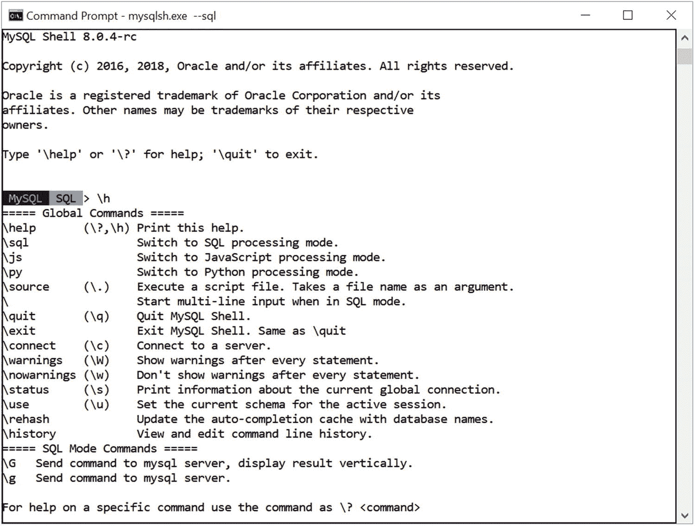
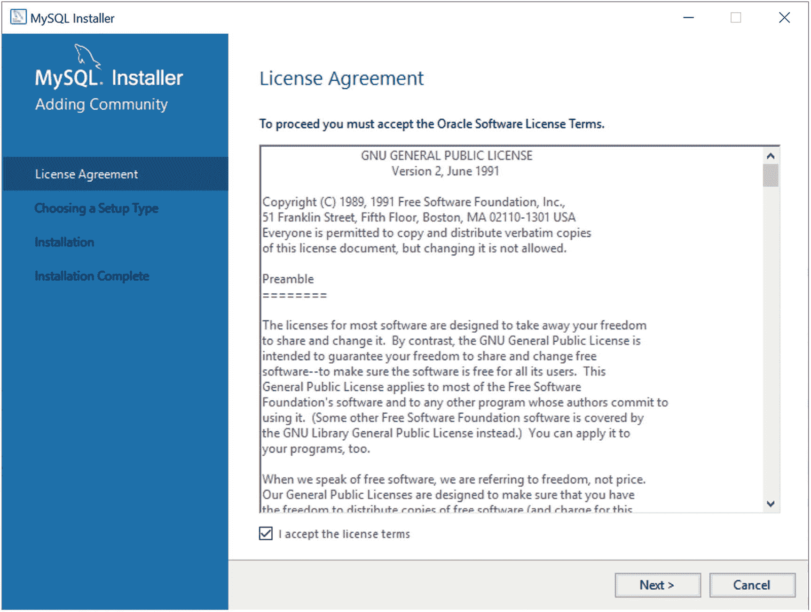
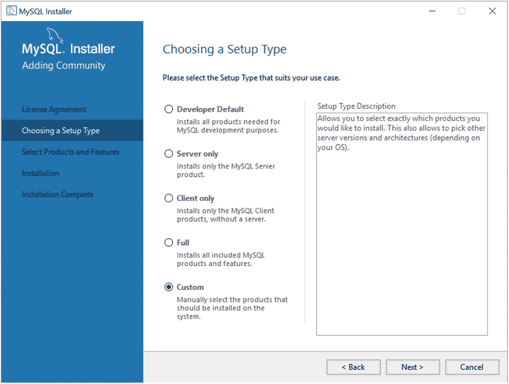
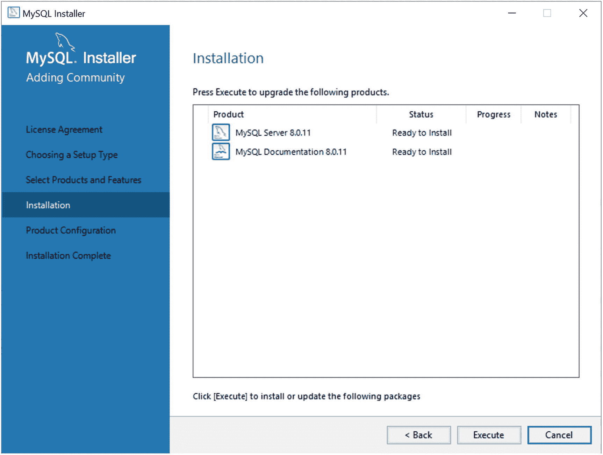
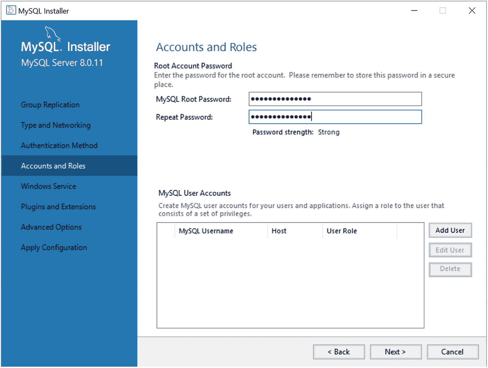
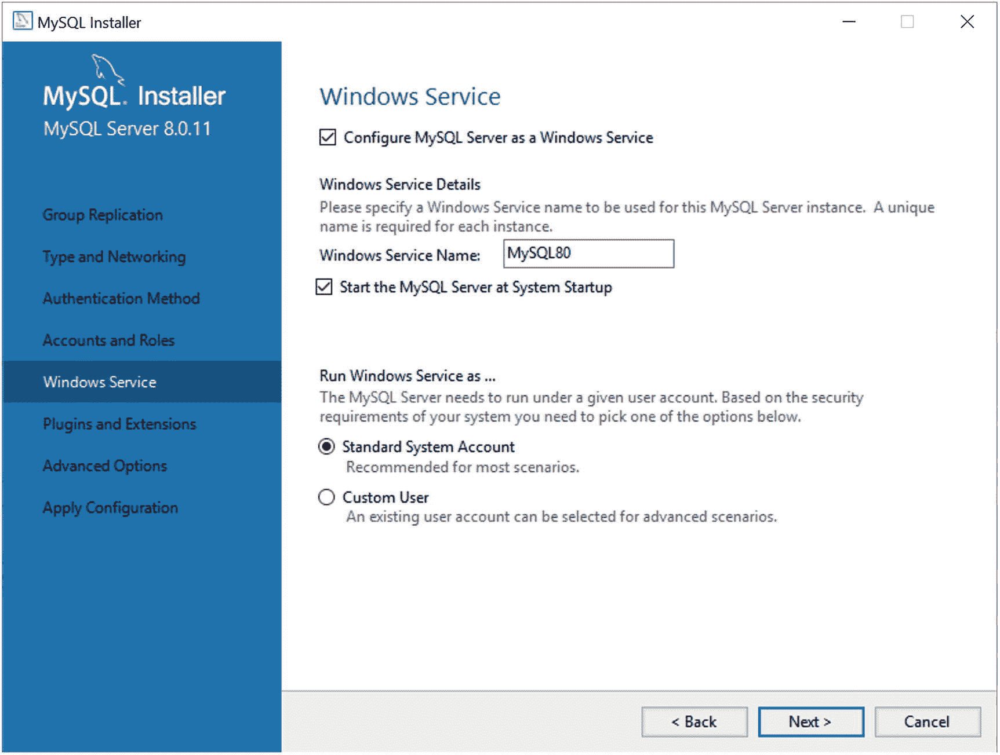
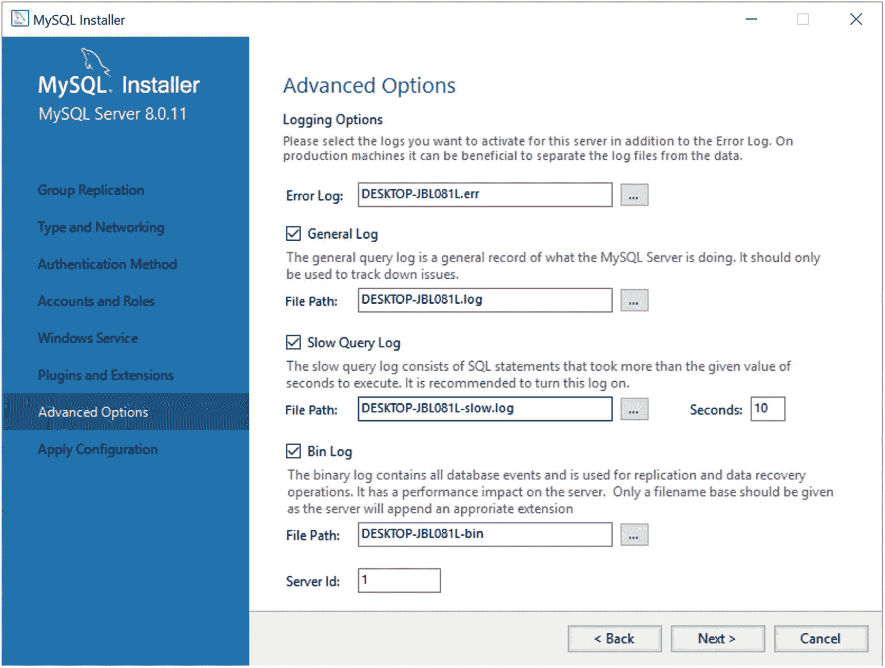

# 二、什么是 MySQL InnoDB 集群？

现在，您已经了解了什么是高可用性以及如何通过 MySQL 复制实现高可用性，让我们看看 MySQL 中高可用性特性的最新发展:InnoDB Cluster。

这是对 Oracle MySQL 工程师(以及 Oracle 本身)奉献精神的证明，MySQL 将继续通过新功能进行改进。MySQL 工程部门的动力是继续为互联网开发颠覆性的数据库技术。甲骨文不仅培养了这种进取精神，还继续兑现其投资和发展 MySQL 业务的承诺。这个最新版本 MySQL 8 最终证明了 Oracle 已经实现了它的承诺，确保 MySQL 仍然是世界上最受欢迎的开源数据库系统。

MySQL 的这个新版本打破了以前版本的许多模式，增加了新的、革命性的功能，改变了一些人使用 MySQL 的方式。事实上，仅版本号就从 5。x 到 8.0，标志着技术复杂性的飞跃，最终脱离了 5 的持续发展。持续了超过 13 年的 x 代码库。

### 8 . 0 . 5–8 . 0 . 10 版本发生了什么变化？

您可能已经注意到 8.0 版本系列不是连续的，并且已经跳过了一些临时编号的版本。这在很大程度上是为了稳定和协调单一产品发布口号，以便用户可以一眼就知道哪些组件的哪些版本可以协同工作。很明显，知道你所有的 MySQL 组件都有 8.0.11 版本，可以确保它们能一起工作。我们需要路线图和夏尔巴人指南来发现哪个组件的哪个版本可以一起工作的日子已经一去不复返了！

最令人兴奋的新特性之一是 InnoDB 集群。这代表了 MySQL 在高可用性方面的巨大飞跃。最重要的是，它是 MySQL 8.0 所有版本的标准配置。让我们看看是什么让 InnoDB 集群成为大大小小的企业的重要功能。

## 概观

InnoDB 集群的核心组件是 InnoDB 存储引擎。自 MySQL 5.6 以来，InnoDB 一直是 MySQL 的旗舰存储引擎(也是默认引擎)。Oracle 已经慢慢地脱离了多存储引擎模型，专注于现代数据库服务器应该做的事情:支持事务存储机制。InnoDB 是满足这一需求的答案。

为了更好地理解我们是如何实现 InnoDB 集群的，让我们简短地浏览一下 MySQL 8.0 和早期版本中的其他存储引擎。

### 什么是存储引擎？

存储引擎是一种以各种方式存储数据的机制。例如，有一种存储引擎允许您与逗号分隔值(文本)文件(CSV)进行交互，另一种为写日志文件(归档)进行了优化，一种只在内存中存储数据(内存)，甚至还有一种根本不存储任何东西(黑洞)。除了 InnoDB，MySQL 服务器还附带了几个存储引擎。以下部分描述了一些更常用的替代存储引擎。请注意，随着 MySQL 的发展，一些存储引擎已经不再受支持，包括 Berkeley Database (BDB)存储引擎。

### 小费

如果您想查看 MySQL 服务器上有哪些可用的存储引擎，可以使用`SHOW ENGINES`命令。请参见( [`https://dev.mysql.com/doc/refman/8.0/en/create-table.html`](https://dev.mysql.com/doc/refman/8.0/en/create-table.html) )了解有关使用`CREATE TABLE`命令指定存储引擎的更多信息。

#### 我的天

MyISAM 存储引擎最初是 MySQL 中的默认引擎，被大多数 LAMP 堆栈、数据仓库、电子商务和企业应用使用。MyISAM 文件是索引顺序访问方法(ISAM)的扩展，具有额外的优化，如高级缓存和索引机制。这些表是使用压缩特性和索引优化来提高速度的。

此外，MyISAM 存储引擎通过提供表级锁定来支持并发操作。MyISAM 存储机制为各种应用提供可靠的存储，同时提供快速的数据检索。当考虑读取性能时，MyISAM 是首选的存储引擎。

#### 记忆

*内存存储引擎*(有时称为*堆表*)是一个内存中的表，它使用哈希机制来快速检索经常使用的数据。这些表比那些从磁盘存储和引用的表要快得多。它们的访问方式与其他存储引擎相同，但是数据存储在内存中，只有在 MySQL 重新启动后才有效。数据在关机(或崩溃)时被刷新和删除。

内存存储引擎通常用于静态数据被频繁访问且很少被更改的情况。这种情况的例子包括邮政编码、州、县、类别和其他查找表。堆表也可以用于利用快照技术进行分布式或历史数据访问的数据库中。

#### 合并

*合并存储引擎*(有时称为`MRG_MYISAM`)是使用一组具有相同结构(元组布局或模式)的 MyISAM 表构建的，这些表可以作为单个表引用。这些表是根据各个表的位置进行分区的，但是没有使用额外的分区机制。所有表必须驻留在同一台机器上(由同一台服务器访问)。使用单个操作或语句来访问数据，例如`SELECT`、`UPDATE`、`INSERT`和`DELETE`。幸运的是，当在合并表上发出一个`DROP`时，只有合并规范被删除。原始表格没有改变。

这种表类型最大的好处就是速度。可以将一个大表分割成不同磁盘上的几个小表，使用合并表规范将它们组合起来，并同时访问它们。搜索和排序将执行得更快，因为每个表中需要操作的数据更少。例如，如果按谓词划分数据，则可以只搜索包含要搜索的类别的特定部分。同样，对表的修复更有效，因为修复几个较小的单个文件比修复单个大表更快更容易。据推测，大多数错误将局限于一个或两个文件内的区域，因此不需要重建和修复所有数据。不幸的是，这种配置有几个缺点:

*   您只能使用相同的 MyISAM 表或架构来形成一个合并表。这限制了合并存储引擎在 MyISAM 表中的应用。如果合并存储引擎接受任何存储引擎，合并存储引擎将更加通用。

*   不允许替换操作。

*   已经证明索引访问比单个表的效率低。

合并存储机制最适用于大型数据库(VLDB)应用，例如数据驻留在一个或多个数据库的多个表中的数据仓库。

#### 档案馆

*档案存储引擎*设计用于以压缩格式存储大量数据。存档存储机制最适合用于存储和检索大量很少访问的存档或历史数据。这些数据包括安全访问数据日志。虽然这不是您想要搜索甚至日常使用的东西，但是如果发生安全事故，关心安全的数据库专业人员会希望拥有它。没有为归档存储机制提供索引，唯一的访问方法是通过表扫描。归档存储引擎不应用于正常的数据库存储和检索。

#### 联邦的

*联邦存储引擎*被设计为从多个 MySQL 数据库系统创建单个表引用。因此，联邦存储引擎的工作方式类似于合并存储引擎，但是它允许您跨数据库服务器将数据(表)链接在一起。这种机制在目的上类似于其他数据库系统中可用的链接数据表。联邦存储机制最适合在分布式或数据集市环境中使用。

联邦存储引擎最有趣的方面是它不移动数据，也不要求远程表是同一个存储引擎。这说明了可插拔存储引擎层的真正威力。数据在存储和检索过程中被转换。

#### 战斗支援车

*CSV 存储引擎*被设计为以表格形式创建、读取和写入逗号分隔值(CSV)文件。虽然 CSV 存储引擎不会将数据复制为另一种格式，但图纸布局或元数据会与服务器上指定的文件名一起存储在数据库文件夹中。这允许数据库专业人员快速导出存储在电子表格中的结构化业务数据。CSV 存储引擎不提供任何索引机制，因此对于大量数据来说不切实际。它旨在用作存储数据和在电子表格应用中可视化数据之间的链接。

#### 黑洞

*黑洞存储引擎*，一个具有惊人效用的有趣特性，被设计成允许系统写入数据，但数据永远不会被保存。但是，如果启用了二进制日志记录，SQL 语句将被写入日志。这允许数据库管理员和开发人员通过切换表类型来临时禁用数据库中的数据接收。当您想要测试一个应用以确保它正在写入您不想存储的数据时，例如当创建一个用于过滤复制的中继从属时，这可能会很方便。

#### InnoDB

*InnoDB* 是一个通用存储引擎，平衡了高可靠性和高性能。InnoDB 成为 MySQL 5.7 中的默认存储引擎，这意味着所有没有使用`ENGINE`子句创建的表都作为 InnoDB 表空间中的 InnoDB 表创建。使用 InnoDB 存储引擎的决定是在多次尝试为 MySQL 构建一个健壮、高性能的存储引擎之后做出的。考虑到 InnoDB 的成熟性和复杂性，使用已经存在的东西更有意义。另外，甲骨文同时拥有 MySQL 和 InnoDB。

### 为什么叫 InnoDB？

在早期，InnoDB 存储引擎是由一家名为芬兰 InfoBase Oy 的独立公司构建和拥有的，该公司将其数据库引擎命名为 InnoDB。这是一个独立的产品，不属于 MySQL，也不归 MySQL AB 所有(MySQL 的原所有者现在完全归 Oracle 所有)。最终，甲骨文在 2005 年拥有了 InnoDB，在 2010 年拥有了 MySQL，将两者结合起来是有意义的，因为它们有相互包容的目标。尽管独立的 InnoDB 工程团队仍然存在，但他们已经与核心服务器开发团队完全集成。

当您需要使用事务时，可以使用 InnoDB 存储引擎。InnoDB 支持传统的 ACID 事务(参见附带的侧栏)和外键约束。InnoDB 中的所有索引都是 B 树，索引记录存储在树的叶页中。InnoDB 是高可靠性和事务处理环境的首选存储引擎。

### 酸是什么？

*酸*代表*原子数*、*稠度*、*隔离度*、*耐久性*。也许是数据库理论中最重要的概念之一，它定义了数据库系统必须表现出的行为，才能被认为是可靠的事务处理。

原子性意味着对于包含多个命令的事务，数据库必须允许在“全有或全无”的基础上修改数据。每个事务都是原子的。如果命令失败，则整个事务失败，并且事务中到该点为止的所有更改都将被丢弃。这对于在高交易环境(如金融市场)中运行的系统尤其重要。考虑一下资金转移的后果。通常，借记一个账户和贷记另一个账户需要多个步骤。如果在借记步骤后交易失败，并且没有将钱贷记回第一个帐户，该帐户的所有者将会生气。在这种情况下，从借方到贷方的整个交易必须成功，否则都不会成功。

一致性意味着只有有效的数据才会存储在数据库中。如果事务中的命令违反了一致性规则之一，则整个事务将被丢弃，数据将返回到事务开始前的状态。相反，如果事务成功完成，它将以遵守数据库一致性规则的方式更改数据。

隔离意味着同时执行的多个事务不会相互干扰。这是并发性的真正挑战最明显的地方。数据库系统必须处理事务不能违反另一个事务正在使用的数据(更改、删除等)的情况。有很多方法可以解决这个问题。大多数系统使用一种叫做*锁定*的机制，在第一个事务完成之前防止数据被另一个事务使用。虽然隔离属性没有规定先执行哪个事务，但它确实确保了它们不会相互干扰。

持久性意味着事务不会导致数据丢失，也不会丢失事务期间创建或更改的任何数据。耐用性通常由强大的备份和恢复维护功能提供。一些数据库系统使用日志记录来确保任何未提交的数据可以在重启时恢复。

与 MySQL 中的旧存储引擎相比，InnoDB 提供了几个关键优势，包括:

*   数据操作语言(DML)操作遵循 ACID 模型，事务具有提交、回滚和崩溃恢复功能来保护用户数据。

*   行级锁定和 Oracle 风格的一致读取提高了多用户并发性和性能。

*   InnoDB 表在磁盘上排列您的数据，以优化基于主键的查询。每个 InnoDB 表都有一个名为*聚簇索引*的主键索引，它组织数据以最小化主键查找的 I/O。

*   为了保持数据的完整性，InnoDB 支持外键约束。使用外键时，会检查插入、更新和删除，以确保它们不会导致不同表之间的不一致。

对 InnoDB 进行了许多改进，包括许多性能增强，甚至支持微调等等。InnoDB 在 MySQL 的每个版本中不断改进，这一点显而易见。事实上，自 5.6 版本以来，改进的列表已经增长了很长时间。虽然大多数改进都很细微，从某种意义上说，你不会注意到它们(除了通过更好的性能和可靠性，这是不可轻视的)，但大多数都显示出致力于使 InnoDB 成为最好的事务存储机制，并通过扩展，MySQL 成为强大的事务数据库系统。

下面列出了 MySQL 8 中对 InnoDB 的一些更有趣的改进。其中一些可能看起来非常深奥，但是那些已经优化或调整了 InnoDB 安装的人在计划迁移到 MySQL 8 时可能需要注意这些。这里没有列出的是几十个小缺陷修复和可靠性、性能的提升。

*   *改进的表空间支持*:包括使用新数据字典、重新定位表空间等增强功能。

*   *新的* `innodb_dedicated_server` *配置选项*:(默认禁用)用于让 InnoDB 根据服务器上检测到的内存量自动配置以下选项。
    *   `innodb_buffer_pool_size`

    *   `innodb_log_file_size`

    *   `innodb_flush_method`

*   *崩溃恢复*:如果索引树损坏，InnoDB 会将损坏标志写入重做日志。这使得损坏标志崩溃安全(它不会在强制重启时丢失)。类似地，InnoDB 还会在每个检查点上写一个内存损坏标志。当启动崩溃恢复时，InnoDB 可以读取这些标志，并使用它们来调整恢复操作。

*   InnoDB memcached 插件:通过允许在单个 memcached 查询中提取多个键/值对而得到改进。

*   *死锁检测*:有几个新选项，但是最有前途的包括一个动态配置死锁检测的选项(`innodb_deadlock_detect`)。这可以为高使用率系统提供额外的调优控制，因为死锁检测会降低系统的性能。

*   `INFORMATION_SCHEMA` *视图*:InnoDB 有新的视图。

*   `AUTO_INCREMENT`:自动递增字段有几处小的改进，包括以下内容:
    *   当前最大自动增量值现在在服务器重新启动后保持不变。

    *   重启不再取消`AUTO_INCREMENT = N`工作台选项的效果。

    *   紧随`ROLLBACK`操作之后的服务器重启不再导致分配给回滚事务的自动增量值的重用。

    *   将一个`AUTO_INCREMENT`列值设置为大于当前最大值的值是持久的，并且以后的新值(比如，在重启之后)以新的、更大的值开始。

*   *临时表*:默认情况下，所有临时表都创建在名为`ibtmp1`的共享临时表空间中。

虽然这个列表似乎只关注一些小的改进，但是其中一些对于寻求帮助来调整和规划数据库服务器安装的系统管理员来说是非常重要的。如果您想了解更多关于这些改进的信息或查看所有最新变化的列表，请参阅在线 MySQL 8.0 参考手册( [`http://downloads.mysql.com/docs/refman-8.0-en.pdf`](http://downloads.mysql.com/docs/refman-8.0-en.pdf) )。

也许 InnoDB 区别于 MySQL 早期存储引擎的最重要的特性是它的可配置性。尽管一些早期的存储引擎是可配置的，但没有一个能达到配置 InnoDB 的规模。您可以使用几十个参数来调整 InnoDB，以满足您独特的存储需求。

### 警告

修改 InnoDB 参数时要小心。有可能会使您的系统降级到损害性能的程度。与任何调优练习一样，总是先查阅文档(和专家)，然后计划针对特定的参数。确保一次调优一个参数，并在继续之前进行测试、确认或恢复。

尽管 InnoDB 使用精心选择的缺省值，开箱即可正常工作，并且对大多数人来说可能不需要太多的调优，但是那些需要调优 MySQL 的人会发现他们需要的一切，甚至更多，以便让他们的数据库系统以最高效率运行。参见 [`https://dev.mysql.com/doc/refman/8.0/en/innodb-introduction.html`](https://dev.mysql.com/doc/refman/8.0/en/innodb-introduction.html) 了解有关 InnoDB 存储引擎的更多信息，包括其众多的配置和调优选项。

### 小费

另一个关于配置 MySQL 和 InnoDB 的技巧和建议的极好来源是 Baron Schwartz 等人的*High Performance MySQL:Optimization，Backups，Replication and More*(O ' Reilly，2012)。

现在，您已经对 InnoDB 的谱系和发展有了更好的了解，让我们来看看 InnoDB Cluster 提供了什么。

### InnoDB 集群简介

MySQL 8.0 [1](#Fn1) 中最令人兴奋的新特性之一是 InnoDB Cluster。它旨在使高可用性更易于设置、使用和维护。InnoDB Cluster 通过 MySQL Shell 和 AdminAPI、组复制和 MySQL 路由与 X DevAPI 一起工作，将高可用性和读取可伸缩性提升到一个新的水平。InnoDB Cluster 将 InnoDB 中用于克隆数据的新功能与组复制和 MySQL 路由相结合，提供了一种设置和管理高可用性的新方法。下面的列表描述了构成 InnoDB 集群的组件。在下一节中，您将了解到关于这些的更多信息，并且在后面的章节中，当您通过教程探索 InnoDB 时，您将看到如何配置和使用这些信息的细节。

*   *组复制*:一种新的复制形式，建立在 MySQL 复制的基础上，增加了一个活动的通信协议(组成员)，允许更高级别的可用性，包括自动故障转移的容错。

*   MySQL Shell :一个新的 MySQL 客户端，允许几种接口模式，包括传统的 SQL 以及 JavaScript 和 Python 脚本语言。

*   *X DevAPI* :一个特殊的应用编程接口，供应用以编程方式与数据进行交互。

*   *AdminAPI* :通过 MySQL Shell 提供的特殊 API，用于配置 InnoDB 集群并与之交互。AdminAPI 具有旨在简化 InnoDB 集群工作的特性。

*   MySQL 路由:轻量级的中间件，在你的应用和后端 MySQL 服务器之间提供透明的路由。

你可能想知道所有的大惊小怪是什么。从表面上看，InnoDB Cluster 是 MySQL 中现有特性的捆绑包。虽然这可能是一个有效的结论，但事实是，该产品不仅仅是简单地用一个新名字将东西捆绑在一起。在这种情况下，Oracle 在 InnoDB Cluster 中添加了专门的管理层和内部特性，以改进这些产品。正如您将看到的，使用 InnoDB Cluster 通常隐藏了单独使用组件的许多细节(和繁琐)。

让我们看一个概念性的配置，以了解组件是如何交互的。图 [2-1](#Fig1) 显示了这些组件如何在概念上排列以形成 InnoDB 集群。

图 2-1

InnoDB 集群的典型配置(由 Oracle 提供)

在这个用例中，一个包含三个服务器的集群设置有一个主服务器(按照标准复制的说法，认为是*主服务器*)，它是所有写入(更新)的目标。多个辅助服务器(从属服务器)维护数据的副本，可以从这些副本中读取数据；这些服务器支持读取数据，而不会加重主服务器的负担，因此支持读取可伸缩性(但所有服务器都参与协商和协调)。组复制的引入意味着集群是容错的，并且组成员是自动管理的。MySQL 路由缓存 InnoDB 集群的元数据，并执行到 MySQL 服务器实例的高可用性路由，从而更容易编写应用来与集群进行交互。

您可能想知道这与标准复制的读取可伸缩性(有时称为*读出可伸缩性*)设置有何不同。从高层次来看，这些解决方案似乎正在解决同一个用例。但是，使用 InnoDB Cluster，您可以从 MySQL Shell 创建、部署和配置集群中的服务器，从而提供一个易于管理的完整的高可用性解决方案。您可以通过 shell 使用 X AdminAPI(也称为 AdminAPI)使用 JavaScript 或 Python 以编程方式创建和管理 InnoDB 集群。

要了解有关 InnoDB 集群的更多信息，包括最新的特性、使用案例等，请参阅位于 [`https://dev.mysql.com/doc/refman/8.0/en/mysql-innodb-cluster-userguide.html`](https://dev.mysql.com/doc/refman/8.0/en/mysql-innodb-cluster-userguide.html) 的在线文档。

#### InnoDB 集群和 MySQL 文档库

如果没有讨论 InnoDB Cluster 如何与 MySQL 的其他新特性很好地协同工作，关于 InnoDB Cluster 的书将是不完整的。MySQL 文档存储就是这样一个特性。MySQL 文档存储是 MySQL 的一个新动态，它允许通过应用编程接口(实际上是 X DevAPI)存储和检索 JSON 数据(称为*文档*)。文档存储允许您创建处理非结构化数据的 NoSQL 应用。

如果您使用过关系数据库系统，那么您肯定熟悉结构化查询语言(SQL ),它使用特殊的语句(命令)与数据进行交互。事实上，大多数数据库系统都有自己的 SQL 版本，包括操作数据的命令(DML)以及定义存储数据的对象的命令(DDL)，甚至还有管理服务器的管理命令。

要在 SQL 接口中检索数据，您必须使用特殊的命令来搜索数据，然后将结果转换为内部编程结构，使数据看起来像是一个辅助组件，而不是解决方案的一个组成部分。NoSQL 接口打破了这种模式，它允许您使用 API 来处理数据。更具体地说，您使用编程接口，而不是基于命令的接口。

### 为什么叫“NoSQL”？

遗憾的是，根据你的观点，NoSQL 可以有几种意思，包括*非 SQL* 、*不仅仅是 SQL* ，或者*非关系*。但是它们都表明你正在使用的机制不是基于命令的接口，这个术语的大多数用法表明你正在使用编程接口。

在 MySQL 8 中，可以使用 X 协议通过 SQL 或 NoSQL 访问 JSON 文档，通过 X 插件访问 X DevAPI。因此，尽管 InnoDB Cluster 将增强为传统 SQL 数据库编写的高可用性应用，但 InnoDB Cluster 也可以与 NoSQL 应用无缝协作。

### 小费

要了解更多关于 MySQL 文档存储的信息，请参阅我的书，*介绍 MySQL 8 文档存储*(2018 年出版)。

#### InnoDB 集群和 NDB 集群

如果您仔细阅读 MySQL 网站，您会发现另一个名称中带有 *cluster* 的产品。它被诱人地命名为 *NDB 集群*。NDB 集群是一个独立于 MySQL 服务器的产品，它采用了一种技术，能够在一个无共享的系统中实现内存数据库的集群。无共享架构使系统能够与廉价的硬件一起工作，并且对硬件或软件的特定要求最小。

NDB 集群的设计不存在任何单点故障。在无共享系统中，每个组件都有自己的内存和磁盘，不建议或不支持使用共享存储机制，如网络共享、网络文件系统和存储区域网络(San)。参见`https:` [`https://dev.mysql.com/doc/refman/5.7/en/mysql-cluster-compared.html`](https://dev.mysql.com/doc/refman/5.7/en/mysql-cluster-compared.html) 了解更多关于 NDB 集群及其与 InnoDB 的关系。

### 小费

要了解更多关于 NDB 集群的信息，请参阅 Jesper Krogh 和 Mikiya Okuno 撰写的优秀的 *Pro MySQL NDB 集群*(a press，2017)。这本书涵盖了 NDB 集群的各个方面，是任何对部署和管理 NDB 集群感兴趣的人的必读之作。

## 成分

现在，您已经对 InnoDB 集群有了更好的了解，包括它是如何发展的以及它对高可用性的好处，让我们了解更多关于组成 InnoDB 集群的组件。以下部分从较高的层面描述了每个组件。同样，在后面的章节中，你会发现更多关于它们的内容。我将只介绍每个组件的基础知识，让您了解它的复杂性和好处。

### 组复制

如果您使用过 MySQL 复制，那么您无疑熟悉如何在构建高可用性解决方案时利用它。事实上，您很可能已经发现了许多使用 MySQL 复制来提高应用可用性的方法。

### 什么是复制，它是如何工作的？

MySQL 复制是一个易于使用的特性，也是 MySQL Server 的一个复杂和主要的组件。本节提供了复制的鸟瞰图，目的是解释它是如何工作的以及如何设置一个简单的复制拓扑。有关复制及其众多特性和命令的更多信息，请参见在线 MySQL 参考手册( [`http://dev.mysql.com/doc/refman/8.0/en/replication.html`](http://dev.mysql.com/doc/refman/8.0/en/replication.html) )。

复制需要两台或更多服务器。必须将一台服务器指定为源服务器或主服务器。主角色意味着对数据的所有数据更改(写入)都发送到主服务器，并且只发送到主服务器。拓扑中的所有其他服务器维护主数据的副本，并且根据设计和要求是只读服务器。因此，当您的应用发送数据进行存储时，它们会将数据发送到主服务器。您编写的使用传感器数据的应用可以从从属服务器读取这些数据。

复制机制通过使用一种称为*二进制日志*的技术来工作，该技术以一种特殊的格式存储更改，从而保留所有更改的记录。然后，这些更改被复制到从属服务器并在那里执行。在从机执行更改(称为*事件*)后，从机拥有数据的精确副本。

主设备维护一个二进制日志，从设备维护该二进制日志的副本，称为*中继日志*。当从设备向主设备请求数据更改时，它从主设备读取事件并将它们写入其中继日志；然后，从属线程中的另一个线程执行中继日志中的那些事件。可以想象，从主服务器上发生更改到从服务器上发生更改之间会有一点延迟。幸运的是，除了在高流量(大量变化)的拓扑中，这种延迟几乎是不明显的。

很可能您的高可用性需求越大，您的解决方案扩展得越多(复杂性增加)，您就越需要采用更好的方法来管理节点丢失、数据完整性和集群的一般维护(复制数据的服务器组—有时称为*副本集*)。事实上，大多数高可用性解决方案已经超越了基本的主-从拓扑结构，演变成由服务器集群组成的层；有些复制一部分数据以获得更快的吞吐量，甚至用于分区存储。

所有这些导致许多人发现他们需要更多的 MySQL 复制。Oracle 通过组复制满足了这些需求以及更多需求。组复制允许您的 MySQL 高可用性解决方案远远超出原始 MySQL 复制功能的限制，从而使 MySQL 8 成为高可用性数据库解决方案的重要组成部分。

组复制于 2016 年 12 月作为 GA 发布(从 5.7.17 版本开始)，以插件的形式与 MySQL 服务器捆绑。因为组复制是作为服务器插件实现的，所以您可以安装插件并开始使用组复制，而不必重新安装服务器，这使得试验新功能变得容易。

组复制也使得同步复制(在属于同一个组的节点之间)成为现实，而现有的 MySQL 复制特性是异步的(或者最多是半同步的)。因此，始终提供了更强的数据一致性(数据在所有成员上都可用，没有因等待副本跟上而导致的延迟)。

这可以通过在分配给一个组的服务器之间进行强协调的分布式状态机来实现。这种通信允许服务器在组内自动协调复制。更具体地说，组维护成员关系，以便服务器之间的数据复制在任何时间点都是一致的。即使从组中删除了服务器，当它们被重新添加时，一致性也会自动启动。此外，对于离线或变得不可达的服务器，还有一个故障检测机制。图 [2-2](#Fig2) 展示了如何在应用中使用组复制来实现高可用性。

图 2-2

对应用使用组复制以实现高可用性(由 Oracle 提供)

请注意，组复制可以与 MySQL 路由一起使用，以允许您的应用拥有一个与集群隔离的层。您将在后面的章节中看到一些关于路由的内容。

组复制和标准复制的另一个重要区别是，组中的所有服务器都可以参与更新数据，并自动解决冲突。是的，您不再需要精心设计您的应用来发送写入(更新)到特定的服务器！但是，您可以配置组复制，只允许一台服务器(称为*主服务器*)进行更新，其他服务器充当辅助服务器或备份服务器(用于故障转移)。

使用组复制中内置的三种特定技术(组成员、故障检测和容错)可以实现以下功能及更多功能:

*   *组成员身份*:管理服务器是否活动(在线)并加入组。此外，还确保组中的每台服务器都有一致的成员集视图。每个服务器都知道组中服务器的完整列表。当服务器添加到组中时，组成员资格服务会自动重新配置成员资格。

*   *故障检测*:一种能够发现并报告哪些服务器离线(不可达)并被认为是死的机制。故障检测器是一种分布式服务，它允许组中的所有服务器测试假定失效服务器的状况，通过这种方式，组决定服务器是否不可达(失效)。这允许该组通过协调排除故障服务器的过程来自动重新配置。

*   *容错*:该服务使用 Paxos 分布式算法的实现来提供服务器之间的分布式协调。简而言之，该算法允许自动提升组内的角色，以确保即使一个(或几个)服务器出现故障或离开组，组也保持一致(数据一致且可用)。像类似的容错机制一样，失败(失败的服务器)的数量是有限的。目前，组复制容错被定义为 n = 2f + 1，其中 n 是容忍 f 个故障所需的服务器数量。例如，如果您希望容忍多达 5 台服务器出现故障，则该组中至少需要 11 台服务器。

有关组复制的更多信息，请参见位于 [`https://dev.mysql.com/doc/refman/8.0/en/replication.html`](https://dev.mysql.com/doc/refman/8.0/en/replication.html) 的在线参考手册中的“组复制”部分。

### MySQL Shell

旧的 MySQL 客户端(名为`mysql`)最大的缺失之一是没有任何形式的脚本功能。但是，可以使用旧客户端处理一批 SQL 命令，并且客户端对编写存储例程(过程和函数)的支持有限。对于那些想要创建和使用脚本来管理他们的数据库(和服务器)的人来说，过去有一些外部工具，比如 MySQL Workbench，但是没有专门用于合并多种脚本语言的工具。

MySQL Workbench 是 Oracle 的一款非常受欢迎的产品。MySQL Workbench 是一个 GUI 工具，设计为基于工作站的管理工具。它提供了许多特性，包括数据库设计和建模工具、SQL 开发、数据库管理、数据库迁移和 Python 脚本支持。有关 MySQL Workbench 的更多信息，请参见 [`https://dev.mysql.com/doc/workbench/en/`](https://dev.mysql.com/doc/workbench/en/) 。

MySQL Shell 是 MySQL 产品组合中令人激动的新成员。MySQL Shell 代表了第一个连接到 MySQL 并与之交互的现代高级客户端。shell 可以用作脚本环境，用于开发处理数据的新工具和应用。尽管它支持 SQL 模式，但它的主要目的是允许用 JavaScript 和 Python 语言访问数据。没错，您可以编写 Python 脚本，并在 shell 中以交互方式或批处理方式执行它们。酷！图 [2-3](#Fig3) 展示了一个启动 MySQL Shell 的例子。请注意显示 MySQL 徽标、连接信息和模式的漂亮提示符。很好！

图 2-3

MySQL 外壳

MySQL Shell 被设计成使用新的 X 协议通过 X 插件与服务器通信。然而，shell 也可以通过使用旧的协议连接到服务器，尽管在脚本模式中功能有限。这意味着，shell 允许您使用关系数据(SQL)、JSON 文档(NoSQL)或两者。

SQL 模式的加入为学习如何使用脚本管理数据提供了一个很好的基础。您可以继续使用您的 SQL 命令(或批处理)，直到您将它们转换为 JavaScript 或 Python。此外，您可以使用这两者来确保您的迁移是完整的。

MySQL Shell 有很多特性，包括支持传统的 SQL 命令处理、脚本原型，甚至支持定制 Shell。大多数特性都可以通过命令行选项或特殊的 shell 命令来控制。在后面的章节中，您将更深入地了解一些更重要的特性。现在，下面列出了 shell 的一些主要特性:

*   *日志*:你可以为你的会话创建一个日志，用于以后的分析或者保存消息的记录。您可以使用`-option`设置详细程度，范围从 1(无记录)到 8(最大调试)。

*   *输出格式*:shell 支持三种格式选项。这些是您在启动 shell 时指定的命令行选项。
    *   *表格* ( `--table`):传统的网格格式，您已经习惯了旧客户端的格式

    *   *制表符*:用制表符分隔显示信息，用于批量执行

    *   JSON ( `--json`):以更易于阅读的方式格式化 JSON 文档

*   *交互*c*ode*e*execution*:使用 shell 的默认模式是交互模式，它的工作方式就像一个传统的客户端:你输入一个命令，得到一个响应。

*   *批处理代码执行*:如果您想在没有交互会话的情况下运行您的脚本，您可以使用 shell 以批处理模式运行脚本。但是，输出仅限于非格式化输出(但可以用`--interactive`选项覆盖)。

*   *脚本语言*:shell 支持 JavaScript 和 Python，尽管你一次只能使用一种。

*   *会话*:会话本质上是到服务器的连接。shell 允许您存储和删除会话。

*   *启动脚本*:您可以定义一个脚本在 shell 启动时执行。您可以用 JavaScript 或 Python 编写脚本。

*   *命令历史*:shell 保存您输入的命令，允许您使用上下箭头键调用它们。

*   *全局变量*:shell 提供了一些在交互模式下可以访问的全局变量。其中包括以下内容。
    *   `session`:全局会话对象，如果已建立

    *   `db`:模式，如果通过连接建立

    *   `dba`:用于使用 InnoDB 集群的 AdminAPI 对象

    *   `shell`:使用外壳的通用功能

    *   `util`:与服务器一起工作的实用功能

*   *自定义提示*:您也可以通过使用特殊格式更新名为`~/.mysqlsh/prompt.json`的配置文件或定义名为`MYSQLSH_PROMPT_THEME`的环境变量来更改默认提示。

*   *自动完成关键字、类和方法*:从 8.0.4 开始，shell 允许用户在 SQL 模式下按 Tab 键自动完成关键字，在 JavaScript 和 Python 模式下自动完成主要的类和方法。shell 还为已知的关键字、API 函数和 SQL 关键字提供代码补全。

### 小费

有关 MySQL Shell 的更多信息，请参见在线 MySQL 参考手册( [`https://dev.mysql.com/doc/refman/8.0/en/mysql-shell.html`](https://dev.mysql.com/doc/refman/8.0/en/mysql-shell.html) )中标题为“MySQL Shell 用户指南”的部分。

### X DevAPI

X Developer application programming interface，简称 X DevAPI，是一个类库和方法库，为 MySQL 实现了一个新的 NoSQL 接口。具体来说，X DevAPI 旨在允许与 JSON 文档和关系数据轻松交互。X DevAPI 有专门支持这两个概念的类，允许开发人员在他们的应用中使用其中一个(或两个)。X DevAPI 与 X 协议、X 插件以及为公开 X DevAPI 而编写的客户端一起构成了 MySQL 8 文档库。X DevAPI 有几个强大的特性，包括:

*   *MySQLX* :一个模块，用于获取 X 协议连接到 MySQL 服务器产生的 session 对象。

*   *会话*:连接到 MySQL 服务器。

*   *集合*:存储 JSON 文档的组织抽象。

*   *文档* : JSON 文档是集合中数据的主要存储机制。

*   *CRUD 操作*:创建、读取、更新和删除操作的简单方法。读操作简单易懂。

*   *关系数据*:实现传统关系数据的 CRUD 操作，包括 SQL 语句执行和结果处理。

*   *表达式*:现代实践和语法风格用于摆脱传统的 SQL 字符串构建，以便在您的集合和文档中查找内容。

*   *并行执行*:非阻塞、异步调用遵循常见的宿主语言模式。

*   *方法链接*:构建 API 是为了让创建或检索(获取)对象的方法返回该对象的实例。这允许我们将几种方法结合在一起(称为*方法链*)。尽管方法链接既不是新概念，也不是 X DevAPI 所独有的，但它是一种强大的机制，使我们的代码更具表现力，更易于阅读。

### 注意

X DevAPI 仅在使用 X 插件时可用。如果没有安装 X 插件，就不能使用 X DevAPI，只能通过支持 X 协议的客户机或数据库连接器。

X DevAPI 只能通过实现 X 协议的一个客户机使用，具体来说，就是下面的任何一个客户机。此外，要使用这些客户端中的任何一个，您还必须在您的服务器上安装和配置 X 插件。

*   *MySQL Shell* : [`https://dev.mysql.com/downloads/shell/`](https://dev.mysql.com/downloads/shell/)

*   *MySQL for Visual Studio*:[`https://dev.mysql.com/downloads/windows/visualstudio/`](https://dev.mysql.com/downloads/windows/visualstudio/)

*   *接头/J* : [`https://dev.mysql.com/downloads/connector/j/`](https://dev.mysql.com/downloads/connector/j/)

*   *连接器/网* : [`https://dev.mysql.com/downloads/connector/net/`](https://dev.mysql.com/downloads/connector/net/)

*   *Connector/node . js*:[`https://dev.mysql.com/downloads/connector/nodejs/`](https://dev.mysql.com/downloads/connector/nodejs/)

*   *连接器/Python* : [`https://dev.mysql.com/downloads/connector/python/`](https://dev.mysql.com/downloads/connector/python/)

*   *连接器/C++* : [`https://dev.mysql.com/downloads/connector/cpp/`](https://dev.mysql.com/downloads/connector/cpp/)

### 小费

有关 X DevAPI 的更多信息，请参见 [`https://dev.mysql.com/doc/x-devapi-userguide/en/`](https://dev.mysql.com/doc/x-devapi-userguide/en/) 。

### AdminAPI

管理应用编程接口(AdminAPI)是一个类库和方法库，为 InnoDB 集群实现了一个新的管理接口。具体来说，AdminAPI 旨在通过使用 MySQL Shell 中的脚本语言来实现与 InnoDB Cluster 的轻松交互。MySQL Shell 包含 AdminAPI，它使您能够部署、配置和管理 InnoDB 集群。AdminAPI 包含两个用于访问 InnoDB 集群功能的类:

*   `dba`:使您能够使用 AdminAPI 管理 InnoDB 集群。`dba`类使您能够管理集群；例如，创建一个新集群，使用沙箱配置(一种在同一台机器上使用几个 MySQL 实例来试验 InnoDB 集群的方法)，以及检查实例和集群的状态。

*   `cluster`:InnoDB 集群的管理句柄。`cluster`类使您能够使用集群来添加实例、删除实例、获取集群的状态(健康)等等。

因为我们将在本书中直接使用 AdminAPI，所以你将在第 [5](05.html) 章中看到关于每个类可用方法的更多细节。

### 小费

参见 [`https://dev.mysql.com/doc/dev/mysqlsh-api-python/8.0/group___admin_a_p_i.html`](https://dev.mysql.com/doc/dev/mysqlsh-api-python/8.0/group___admin_a_p_i.html) 了解更多关于 AdminAPI 的信息。

### 路由

MySQL 路由是 MySQL 中相对较新的组件。它最初是为现已过时的 MySQL Fabric 产品而构建的，经过了显著的改进和修改，可用于 InnoDB Cluster。事实上，它是 InnoDB 集群的重要组成部分。

MySQL 路由是一个轻量级的中间件组件，在应用和 MySQL 服务器之间提供透明的路由。虽然它可以用于各种各样的用例，但它的主要目的是通过有效地将数据库流量路由到适当的 MySQL 服务器来提高高可用性和可伸缩性。

对于处理故障转移的客户端应用，它们需要了解 InnoDB 集群拓扑，并知道哪个 MySQL 实例是主(写)服务器。虽然应用可以实现这种逻辑，但是 MySQL 路由可以为您提供和处理这种功能。

此外，当与 InnoDB Cluster 一起使用时，MySQL Router 充当代理来隐藏网络上的多个 MySQL 实例，并将数据请求映射到集群中的一个实例。如果有足够多的在线副本，并且组件之间的通信完好无损，应用将能够(重新)连接到其中一个副本。MySQL 路由通过简单地重新打印应用来连接到路由而不是直接连接到 MySQL，也使这种情况成为可能。

### 小费

关于 MySQL 路由的更多信息，请参见 [`https://dev.mysql.com/doc/mysql-router/8.0/en/`](https://dev.mysql.com/doc/mysql-router/8.0/en/) `.`

## 安装 InnoDB 集群

回想一下，Oracle 选择将 InnoDB 集群构建到 MySQL 服务器中，并致力于为社区和企业客户提供 InnoDB 集群。当您安装 MySQL 时，您也安装了 InnoDB Cluster 和使其工作所需的所有组件。

在本节中，您将通过使用 MySQL Windows Installer 在 Windows PC 上安装 MySQL。如果你使用的是另一个平台，可以查看在线 MySQL 参考手册了解更多细节( [`https://dev.mysql.com/doc/refman/8.0/en/installing.html`](https://dev.mysql.com/doc/refman/8.0/en/installing.html) )。

MySQL Windows Installer(也称为 *MySQL Installer* )为您的所有 MySQL 软件需求提供了易于使用的、基于向导的安装体验。虽然某些特定于开发人员的组件可能需要额外安装，但安装程序是您安装最新版本 MySQL 产品的一站式站点，包括:

*   MySQL 服务器

*   MySQL 连接器

*   MySQL 工作台和示例模型

*   示例数据库

*   MySQL for Excel

*   MySQL 通告程序

*   面向 Visual Studio 的 MySQL

*   文件

### 小费

在 Windows 上安装时，Windows 可能会要求您批准升级安装。

安装程序允许您选择要安装的产品，并且您可以根据需要多次运行安装程序来更新、添加或删除产品。此外，您可以选择基于 web 的安装程序或独立安装程序。如果您在运行 MySQL 安装程序时有在线连接，并且您不想安装所有 MySQL 产品(从而只下载您需要的产品)，请选择 web 安装程序。如果在运行 MySQL 安装程序时没有联机连接，或者希望现在或将来安装所有产品，请选择独立安装程序。

您可以在 [`https://dev.mysql.com/downloads/installer/`](https://dev.mysql.com/downloads/installer/) 下载 MySQL 安装程序。在该网站上，您将看到最新版本的安装程序，包括安装 32 位或 64 位二进制文件的选项。但是，请注意，安装程序本身是一个 32 位应用。

现在，让我们看一个在 Windows 机器上安装 MySQL 的快速、典型的演练。因为安装程序遵循的脚本会根据您的选择而变化，所以在您的 PC 上安装 MySQL 可能会有所不同。但是，下面显示了从头开始安装 MySQL、安装 InnoDB Cluster 和 MySQL 文档存储所需的所有产品的进度。我们从下载安装程序并启动它开始。图 [2-4](#Fig4) 显示了初始许可协议屏幕。请注意，这是安装程序的社区版(这意味着它只安装 GNUv2 许可下的社区版产品)。

图 2-4

许可协议(MySQL 安装程序)

阅读并同意许可协议后，您可以勾选“我接受许可条款”复选框，然后单击“下一步”以显示选择安装类型面板，如图 [2-5](#Fig5) 所示。该面板为您提供了多种选择，包括以开发人员为中心的安装、仅安装服务器、仅安装客户端、完全安装所有产品，以及允许您选择要安装哪些组件的自定义选项。选择自定义选项，然后单击下一步。

图 2-5

选择安装类型(MySQL 安装程序)

下一个面板允许您选择要安装的产品。图 [2-6](#Fig6) 显示了带有 MySQL 服务器的面板和选择安装的文档。要选择要安装的产品，请展开左侧列表中的类别，然后选择要安装的产品，并单击向右箭头将其移动到右侧列表中。右侧列表中显示的产品将在您继续操作时安装。对于本章，您只需要 MySQL 服务器和文档。您将在后面的章节中添加其他产品。当您要安装的产品列在右边时，单击“下一步”按钮。

图 2-6

选择产品和功能(MySQL 安装程序)

下一个面板是安装摘要，允许您确认是否有正确的产品可供安装。图 [2-7](#Fig7) 所示的面板也显示了状态，以便您可以观察安装进度。当您准备好开始安装所选产品时，请单击执行。

图 2-7

安装对话框–暂存(MySQL 安装程序)

当安装开始时，你会看到每个产品的进度，如图 [2-8](#Fig8) 所示。

图 2-8

安装对话框–安装进度(MySQL 安装程序)

所有产品安装完成后，安装面板将显示所有安装的状态为完成，并将底部的按钮改为显示下一步，如图 [2-9](#Fig9) 所示。准备好后，单击下一步。

图 2-9

安装对话框–安装完成(MySQL 安装程序)

安装的下一步是配置任何具有安装后选项的产品。MySQL Server 就是这样一种产品，它允许您设置几个配置项来完成安装。图 [2-10](#Fig10) 显示了产品配置面板。准备好后，单击“下一步”开始配置。

图 2-10

产品配置(MySQL 安装程序)

MySQL 8.0.11 的 MySQL 安装程序新增了从安装程序设置测试 InnoDB 集群配置的功能。如果您想在测试服务器上安装 MySQL 进行开发或实验，这可以节省大量时间。在第 [6](06.html) 章中，您将采取一种更加谨慎的方式来设置 InnoDB 集群。现在，你可以保留默认选择来安装一个独立的 MySQL 服务器实例，如图 [2-11](#Fig11) 所示。然后单击下一步按钮。

图 2-11

在沙箱中设置组复制或 InnoDB 集群(MySQL 安装程序)

配置服务器时，第一步是设置网络和配置类型。图 [2-12](#Fig12) 显示了允许您选择配置类型(包含所选用例典型设置的基线)和任何您希望选择的连接选项的类型和网络面板。

图 2-12

类型和网络–配置服务器(MySQL 安装程序)

在这种情况下，我们将选择开发机器的配置类型(默认)。我们还将选择在端口 3306 上使用 TCP/IP，并打开 Windows 防火墙以允许与网络之间的通信；为此，我们勾选了每个选项旁边的复选框，如图所示。还建议勾选显示高级选项复选框进行进一步配置。选择选项后，单击“下一步”继续。

回想一下，MySQL 在 8.0.4 版中更改了默认的身份验证插件。因为许多安装仍然使用传统的身份验证方法，所以 Oracle 提供了一个选项，在安装过程中选择旧的方法，以便您的应用可以继续使用最新版本。如果您想使用新的身份验证和强密码加密，请保留默认选择，如图 [2-13](#Fig13) 所示。单击“下一步”按钮继续。

图 2-13

选择验证方法(MySQL 安装程序)

我们需要做的下一件事是为 root 用户帐户选择密码。这是 MySQL 用于所有管理操作的帐户。您应该明智地选择密码，以保护您的服务器免受意外访问。图 [2-14](#Fig14) 显示了账户和角色面板。请注意，此时您还可以设置其他用户帐户，这样可以节省安装后的时间。准备好后，请单击“下一步”按钮继续。

图 2-14

帐户和角色–配置服务器(MySQL 安装程序)

接下来，我们可以选择设置一个 Windows 服务来管理服务器的启动和停止。这是推荐给任何安装服务器的人的，他们希望服务器从启动开始运行。事实上，您可以选择创建服务，但不能将其设置为自动启动。图 [2-15](#Fig15) 显示了为服务器设置 Windows 服务的典型选择。选择所需选项后，单击“下一步”按钮继续。

图 2-15

Windows 服务–配置服务器(MySQL 安装程序)

接下来，我们可以选择通过 X 协议插件来启用和配置 MySQL 文档存储。图 [2-16](#Fig16) 显示了用于启用插件的插件和扩展面板。我们希望启用插件，将端口设置为 33060(默认)，并允许端口通过防火墙。选择选项后，单击下一步。

图 2-16

插件和扩展–配置服务器(MySQL 安装程序)

接下来，因为我们选择了高级配置选项，所以我们可以设置各种日志选项，包括错误、查询和二进制日志。您应该考虑打开(选择)常规日志和查询日志。我们还必须启用二进制日志，以便与 InnoDB 集群一起使用。图 [2-17](#Fig17) 显示了高级选项面板。请注意，您还可以选择命名每个日志并重新定位它们。但是，对于本书，您可以保留默认名称，这些名称基于机器名称。例如，本演练在名为 OPTIPLEX-7010 的计算机上运行，因此文件名具有该前缀。选择选项后，单击下一步。

图 2-17

高级选项(MySQL 安装程序)

此时，安装程序将向您显示要执行的步骤摘要，并允许您开始该过程或返回并进行更改，如图 [2-18](#Fig18) 所示。准备就绪后，单击执行按钮继续。

图 2-18

应用配置-暂存(MySQL 安装程序)

当配置过程运行时，面板将变灰执行和返回按钮，并在每个步骤旁边的点上显示绿色复选标记，如图 [2-19](#Fig19) 所示。如果出现错误，面板将显示一个红色 X，如果错误禁止继续，可能会显示一条错误消息。

图 2-19

应用配置-进行中(MySQL 安装程序)

当产品配置完成时，面板将改变为在所有步骤旁边显示绿点。底部的按钮将变为一个标记为完成的按钮，如图 [2-20](#Fig20) 所示。准备就绪后，单击“完成”按钮继续。

图 2-20

应用配置-完成(MySQL 安装程序)

下一个面板显示了产品配置操作的摘要，如图 [2-21](#Fig21) 所示。

图 2-21

产品配置–摘要(MySQL 安装程序)

确认无误后，点击下一步按钮进入最后一个面板，如图 [2-22](#Fig22) 所示。您可以单击“完成”按钮来完成安装并关闭安装程序。

图 2-22

安装完成(MySQL 安装程序)

第一次在 Windows PC 上安装 MySQL 的演练到此结束。如上所述，您可以再次运行安装程序来安装其他产品。还记得，根据所选的产品，显示的面板顺序会有所不同。

## 摘要

除了添加组复制之外，InnoDB Cluster 可能是那些寻求用 MySQL 构建高可用性解决方案的人最重要的新特性。服务器中从未有过如此多的功能被设计为提供一个健壮、强大、可靠且易于管理的高可用性 MySQL。

在本章中，您了解了有关 InnoDB 存储引擎的更多信息，包括最新的新功能和构成 InnoDB 集群的许多组件，包括组复制、MySQL Shell 和 AdminAPI 以及用于应用连接路由的 MySQL 路由。

在下一章中，您将尝试组复制，并了解更多关于这个奇妙且高度复杂的特性。虽然您将看到 AdminAPI 使配置组复制变得很容易，但是优秀的系统和数据库管理员必须知道组复制是如何工作的，以便他们能够继续改进和扩展他们的高可用性解决方案，并做好排除组复制故障的准备。

<aside class="FootnoteSection" epub:type="footnotes">Footnotes [1](#Fn1_source)

以及 MySQL 5.7 的部分版本。

 </aside>