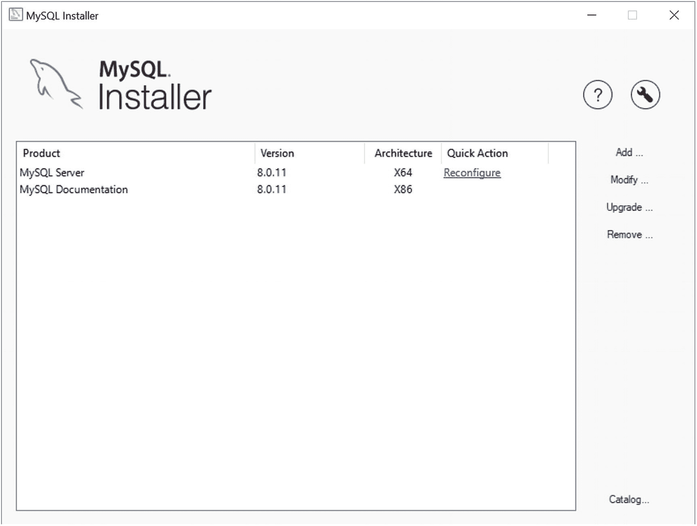
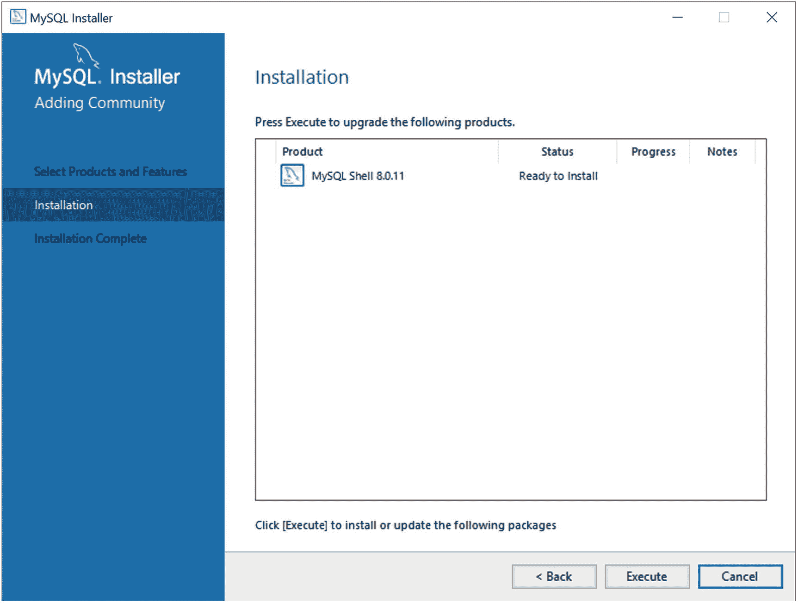
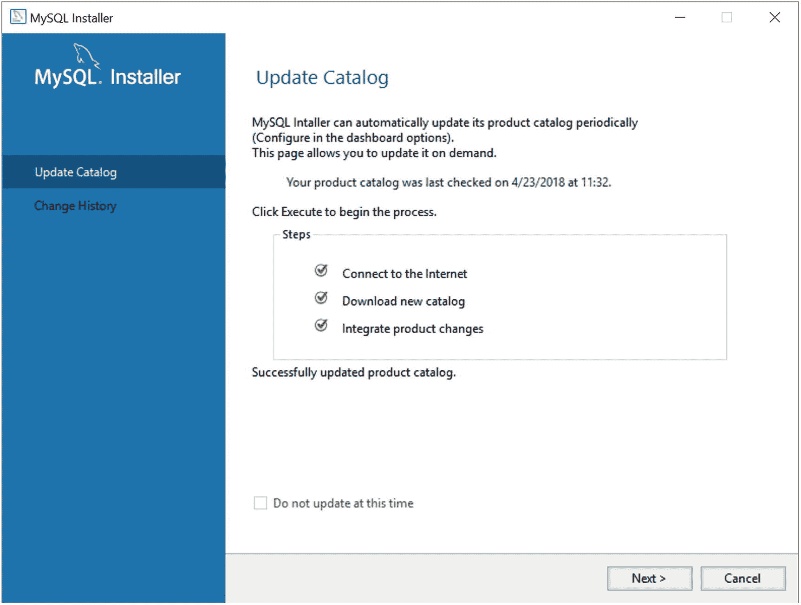

# 四、MySQL Shell

可能有些被忽视的最大特性之一是新的 MySQL Shell。回想一下，MySQL Shell 是一种与 MySQL 服务器交互的新方式。与以前与服务器捆绑在一起的客户机相比，它有许多优势，最强大的是能够直接从 shell 中使用 Python 或 JavaScript。

在这一章中，你将更详细地探索 MySQL Shell。您将了解更多关于它的主要特性和选项，以及如何使用新的 shell 来交互式地执行脚本。正如您将看到的，MySQL Shell 是 MySQL 未来的另一个关键元素。

我建议在自己尝试 MySQL Shell 之前，至少通读一遍本章中的示例部分。所提供的信息将帮助您适应使用新的命令和连接，在您理解这些概念之前，这些命令和连接有时会有点混乱。

### 注意

我使用术语 *shell* 来指代 MySQL Shell 支持的特性或对象。我用 *MySQL Shell* 来指代产品本身。

## 使用 MySQL Shell

MySQL Shell 是 MySQL 产品组合中令人激动的新成员。MySQL Shell 代表了第一个连接到 MySQL 并与之交互的现代高级客户端。shell 可以用作脚本环境，用于开发处理数据的新工具和应用。酷！图 [4-1](#Fig1) 展示了一个启动 MySQL Shell 的例子。请注意显示 MySQL 徽标、连接信息和模式的漂亮提示符。很好！


图 4-1

MySQL 外壳

### 注意

与需要服务器连接才能启动的旧客户端不同，当您在没有指定服务器连接的情况下启动 shell 时，shell 将会运行，但不会连接到服务器。您必须使用`\connect` shell 命令来连接到服务器。

回想一下第 2 章的内容，MySQL Shell 被设计成使用新的 X 协议通过 X 插件与服务器通信。然而，shell 也可以通过使用旧的协议连接到服务器，尽管在脚本模式中功能有限。因此，shell 允许您处理关系文档(SQL)或 JSON 文档(NoSQL)，或者两者都处理。

SQL 模式的加入为学习如何使用脚本管理数据提供了一个很好的基础。您可以继续使用您的 SQL 命令(或批处理)，直到您将它们转换为 JavaScript 或 Python。此外，您可以使用这两者来确保您的迁移是完整的。

以下各节从较高的层面介绍了 shell 的主要特性。有关 MySQL Shell 的更多信息，请参见在线 MySQL 参考手册( [`https://dev.mysql.com/doc/mysql-shell-excerpt/8.0/en/`](https://dev.mysql.com/doc/mysql-shell-excerpt/8.0/en/) )中的“MySQL Shell 用户指南”一节。

### Shell 命令

与最初的 MySQL 客户端一样，一些特殊的命令控制应用本身，而不是与数据交互(通过 SQL 或 X DevAPI)。要执行 shell 命令，请发出带斜线(`\`)的命令。例如，`\help`打印所有 shell 命令的帮助。表 [4-1](#Tab1) 列出了一些更常用的 shell 命令。

表 4-1

Shell 命令

<colgroup><col class="tcol1 align-left"> <col class="tcol2 align-left"> <col class="tcol3 align-left"></colgroup> 
| 

命令

 | 

捷径

 | 

描述

 |
| --- | --- | --- |
| `\` |   | 开始多行输入(仅限 SQL 模式) |
| `\connect` | `(\c)` | 连接到服务器 |
| `\help` | `(\?,\h)` | 打印帮助文本 |
| `\js` |   | 切换到 JavaScript 模式 |
| `\nowarnings` | `(\w)` | 不显示警告 |
| `\py` |   | 切换到 Python 模式 |
| `\quit` | `(\q,\exit)` | 放弃 |
| `\source` | `(\.)` | 执行指定的脚本文件 |
| `\sql` |   | 切换到 SQL 模式 |
| `\status` | `(\s)` | 打印有关连接的信息 |
| `\use` | `(\u)` | 设置会话的模式 |
| `\warnings` | `(\W)` | 在每个语句后显示警告 |

注意，您可以使用`\sql`、`\js`和`\py` shell 命令来动态切换模式。这使得处理 SQL 和 NoSQL 数据更加容易，因为您不必退出应用来切换模式。此外，即使使用了启动选项来设置模式，也可以使用这些 shell 命令。

### 小费

要获得任何 shell 命令的帮助，请使用`\help`命令。例如，要了解更多关于`\connect`命令的信息，请输入`\help connect`。

最后，注意您退出 shell 的方式(`\q`或`\quit`)。如果您像在旧客户端中习惯的那样键入`quit`，shell 将根据您所处的模式做出不同的响应。以下是每种模式下发生的情况的示例:

```sql
MySQL  SQL > quit;
ERROR: You have an error in your SQL syntax; check the manual that corresponds to your MySQL server version for the right syntax to use near 'quit' at line 1
 MySQL  SQL > \js
Switching to JavaScript mode...
 MySQL  JS > quit
ReferenceError: quit is not defined
 MySQL  JS > \py
Switching to Python mode...
 MySQL  Py > quit
Use quit() or Ctrl-D (i.e. EOF) to exit
 MySQL  Py > \q
Bye!

```

如果您习惯了旧的 MySQL 客户端，并且不小心使用了旧的客户端命令，您可能会看到类似的奇怪现象，但是只需要经常使用它就可以提醒您要使用的正确命令。现在，让我们看看 shell 的启动选项。

### 选择

可以使用几个控制模式、连接、行为等的启动选项来启动 shell。表 [4-2](#Tab2) 介绍了一些你可能想要使用的更常用的选项。您将在后面的部分中看到更多关于连接选项的内容。

表 4-2

常见的 MySQL Shell 选项

<colgroup><col class="tcol1 align-left"> <col class="tcol2 align-left"></colgroup> 
| 

[计]选项

 | 

描述

 |
| --- | --- |
| `-f, --file=file` | 用于执行的流程文件。 |
| `-e, --execute=<cmd>` | 执行命令并退出。 |
| `--uri` | 通过统一资源标识符(URI)连接。 |
| `-h, --host=<value>` | 用于连接的主机名。 |
| `-P, --port=#` | 用于连接的端口号。 |
| `-S, --socket=sock` | UNIX 中用于连接的套接字名称或 Windows 中的命名管道名称(仅限经典会话)。 |
| `-u, --dbuser=<value>` | 用于连接的用户。 |
| `--user=<value>` | `dbuser`的别名。 |
| `--dbpassword=<value>` | 连接到服务器时使用的密码。 |
| `--password=<value>` | `dbpassword`的别名。 |
| `-p` | 请求密码提示来设置密码。 |
| `-D --schema=<value>` | 要使用的架构。 |
| `--database=<value>` | `--schema`的别名。 |
| `--sql` | 以 SQL 模式启动。 |
| `--sqlc` | 使用经典会话在 SQL 模式下启动。 |
| `--sqlx` | 使用 X 协议会话在 SQL 模式下启动。 |
| `--js` | 以 JavaScript 模式启动。 |
| `--py` | 以 Python 模式启动。 |
| `--json` | 以 JSON 格式生成输出。 |
| `--table` | 以表格格式生成输出(默认为交互模式)。 |
| `-i, --interactive[=full]` | 为了在批处理模式下使用，它强制模拟交互模式处理。批处理中的每一行都像在交互模式下一样进行处理。 |
| `--log-level=value` | 日志级别。值必须是 1 到 8 之间的整数或[无、内部、错误、警告、信息、调试、调试 2、调试 3]中的任何一个。 |
| `--mx --mysqlx` | 创建一个 X 协议会话(简称为“会话”)。 |
| `--mc --mysql` | 创建经典(旧协议)会话。 |
| `--ma` | 创建一个带有自动协议选择的会话。 |
| `--nw, --no-wizard` | 禁用执行脚本的向导模式(非交互式)。 |
| `--ssl-mode` | 为连接启用 SSL(使用其他标志自动启用)。 |
| `--ssl-key=name` | PEM 格式的 X509 密钥。 |
| `--ssl-cert=name` | PEM 格式的 X509 证书。 |
| `--ssl-ca=name` | PEM 格式的 CA 文件(查看 OpenSSL 文档)。 |
| `--ssl-capath=dir` | CA 目录。 |
| `--ssl-cipher=name` | 要使用的 SSL 密码。 |
| `--ssl-crl=name` | 证书吊销列表。 |
| `--ssl-crlpath=dir` | 证书吊销列表路径。 |
| `--tls-version=version` | 要使用的 TLS 版本。允许值为 TLSv1、TLSv1.1。 |
| `--auth-method=method` | 要使用的身份验证方法。 |
| `--dba=enableXProtocol` | 在连接到的服务器中启用 X 协议。必须和`--mysql`一起使用。 |

请注意，有些选项的别名与原始客户端的用途相同。如果您有启动客户机来执行操作的脚本，这使得切换到 shell 变得更容易一些。还要注意使用安全套接字层(SSL)连接的一组选项。其中大部分都是不言自明的，你以前已经见过几个了。现在让我们看看可用的会话和连接以及如何使用它们。要获得完整的选项列表，请使用`--help`选项执行 shell，如清单 [4-1](#PC2) 所示。

```sql
$ mysqlsh --help
MySQL Shell 8.0.11

Copyright (c) 2016, 2018, Oracle and/or its affiliates. All rights reserved.

Oracle is a registered trademark of Oracle Corporation and/or its
affiliates. Other names may be trademarks of their respective
owners.

Usage: mysqlsh [OPTIONS] [URI]
       mysqlsh [OPTIONS] [URI] -f <path> [script args...]
       mysqlsh [OPTIONS] [URI] --dba [command]
       mysqlsh [OPTIONS] [URI] --cluster

  -?, --help                  Display this help and exit.
  -e, --execute=<cmd>         Execute command and quit.
  -f, --file=file             Process file.
  --uri=value                 Connect to Uniform Resource Identifier. Format:
                              [user[:pass]@]host[:port][/db]
  -h, --host=name             Connect to host.
  -P, --port=#                Port number to use for connection.
  -S, --socket=sock           Socket name to use in UNIX, pipe name to use in
                              Windows (only classic sessions).
  -u, --dbuser=name           User for the connection to the server.
  --user=name                 see above
  -p, --password[=name]       Password to use when connecting to server.
  --dbpassword[=name]         see above
  -p                          Request password prompt to set the password
  -D, --schema=name           Schema to use.
  --database=name             see above
  --recreate-schema           Drop and recreate the specified schema.Schema
                              will be deleted if it exists!
  -mx, --mysqlx               Uses connection data to create Creating an X
                              protocol session

.
  -mc, --mysql                Uses connection data to create a Classic Session.
  -ma                         Uses the connection data to create the session
                              withautomatic protocol detection.
...

Listing 4-1Getting Help for MySQL Shell

```

### 小费

在 Windows 上，MySQL Shell 显示为一个应用，但是您可以将`C:\Program Files\MySQL\MySQL Shell 8.0\bin`添加到您的路径中，并从命令窗口执行它。

### 会话和模式

与最初的客户机以及实际上大多数 MySQL 客户机应用一样，您需要连接到 MySQL 服务器，以便可以运行命令。MySQL Shell 支持多种连接 MySQL 服务器的方式和多种与服务器交互的选项(称为*会话*)。在一个会话中，您可以更改 shell 接受命令的方式(称为*模式*，以包含 SQL、JavaScript 或 Python 命令。

考虑到使用服务器的所有不同的新概念，那些初学使用 shell 的人可能会发现其中的细微差别，甚至有时会感到困惑。事实上，在线参考手册和各种博客及其他报告有时会交替使用*模式*和*会话*，但正如您将看到的，它们是不同的(无论多么微妙)。下面几节阐明了每个主要概念，包括会话、模式和连接，以便您可以更快地适应新方法。我首先用简单的例子介绍概念，然后用详细的例子讨论如何建立联系。让我们从查看可用的会话对象开始。

#### 会话对象

关于会话 s，首先要理解的是,*会话*是到单个服务器的连接。第二件要理解的事情是，每个会话都可以从两个会话对象中的一个开始。会话是到服务器的连接(定义了所有参数)，会话对象是 shell 用来以几种方式之一与服务器交互的对象。更具体地说，MySQL Shell 会话对象定义了您如何与服务器交互，包括支持哪些模式，甚至 Shell 如何与服务器通信。shell 支持如下两个会话对象:

*   *会话*:X 协议会话用于应用开发，支持 JavaScript、Python、SQL 模式。通常用于开发脚本或执行脚本。要使用该选项启动 shell，请使用`--mx` ( `--mysqlx`)选项。

*   *经典会话*:使用旧的服务器通信协议，对 DevAPI 的支持有限。对没有 X 插件或不支持 X 协议的旧服务器使用这种模式。通常用于旧服务器的 SQL 模式。要使用该选项启动 shell，请使用`--mc` ( `--mysqlc`)选项。

### 注意

经典会话仅在 MySQL Shell 中可用。它不是 X DevAPI 的一部分。通过 X DevAPI，只有通过 X 协议的会话连接是可用的。

当您使用`\connect` shell 命令时，您可以通过指定`-mc`用于经典会话、`-mx`用于 X 协议会话或`-ma`用于自动协议选择来指定要使用的会话对象(协议)。下面依次展示了其中的每一个。注意`<URI>`指定了一个统一的资源标识符。

*   `\connect -mx <URI>`:使用 X 协议(会话)。

*   `\connect -mc <URI>`:使用经典协议(经典会话)。

*   `\connect -ma <URI>`:使用自动协议选择。

回想一下，会话在广义上与连接同义。但是，会话不仅仅是一个连接，因为用于建立连接的所有设置(包括会话对象)以及用于与服务器通信的协议都包括在内。因此，我们有时会遇到术语*协议*来描述会话。在后面的部分中，您将看到更多使用会话的示例。

#### 支持的模式

shell 支持三种模式(也称为*语言支持*或简称为*活动语言* ): SQL、JavaScript 和 Python。回想一下，我们可以通过使用 shell 命令来启动这些模式中的任何一种。你可以随时切换模式(语言),每次都不会断线。下面列出了三种模式以及如何切换到每种模式。

*   `\sql`:切换到 SQL 语言。

*   `\js`:切换到 JavaScript 语言(默认模式)。

*   `\py`:切换到 Python 语言。

现在您已经了解了会话、会话对象和模式，接下来您可以看看如何连接 MySQL 服务器。

### 连接

在 shell 中建立连接可能需要一些时间来适应与最初的 MySQL 客户端不同的工作方式，最初的 MySQL 客户端需要在命令行中使用几个选项。您可以使用特殊格式的 URI 字符串，或者通过名称使用单个选项连接到服务器(像旧客户端一样)。也支持 SSL 连接。可以通过启动选项、shell 命令和脚本来建立连接。但是，所有连接都需要使用密码。除非您另外声明，否则如果没有给出密码，shell 将提示您输入密码。

### 注意

如果您想使用没有密码的连接(不推荐)，您必须使用`--password`选项，或者，如果使用 URI，包括一个额外的冒号来代替密码。

下面的部分没有讨论所有可用的连接方式和选项，而是给出了每种连接方式的一个例子。

#### 使用 URI

URI 是使用格式`<dbuser>[:<dbpassword>]@host[:<por>t][/<schema>/]`的特殊字符串，其中`<>`表示各种参数的字符串值。请注意，口令、端口和模式是可选的，但用户和主机是必需的。在这种情况下，模式是您希望在连接时使用的默认模式(数据库)。X 协议的默认端口是 33060。要在启动 shell 时使用命令行上的 URI 连接到服务器，请使用`--uri`选项指定它，如下所示:

```sql
$ mysqlsh --uri root:secret@localhost:33060

```

shell 假定所有连接都需要密码，如果没有提供密码，它将提示输入密码。清单 [4-2](#PC4) 显示了没有密码的相同连接。注意 shell 是如何提示输入密码的。

```sql
$ mysqlsh --uri root@localhost:33060/world_x
Creating a session to 'root@localhost:33060/world_x'
Enter password:
Fetching schema names for autocompletion... Press ^C to stop.
Your MySQL connection id is 13 (X protocol)
Server version: 8.0.11 MySQL Community Server (GPL)
Default schema `world_x` accessible through db.
MySQL Shell 8.0.11

Copyright (c) 2016, 2018, Oracle and/or its affiliates. All rights reserved.

Oracle is a registered trademark of Oracle Corporation and/or its
affiliates. Other names may be trademarks of their respective
owners.

Type '\help' or '\?' for help; '\quit' to exit.

 MySQL  localhost:33060+  world_x  JS >

Listing 4-2Connecting with a URI

```

注意，我们还在 URI 中用`/schema`选项指定了默认模式(`world_x`)。`world_x`数据库是一个示例数据库，您可以从 [`https://dev.mysql.com/doc/index-other.html`](https://dev.mysql.com/doc/index-other.html) 下载。您将在后面的 MySQL Shell 教程中安装这个数据库。

#### 使用单个选项

您还可以通过使用单独的选项在 shell 命令行上指定连接。可用的连接选项如表 [4-1](#Tab1) 所示。为了向后兼容(并使向 MySQL Shell 的过渡更容易)，Shell 还支持用`--user`代替`--dbuser`，用`--password`代替`--dbpassword`，用`--database`代替`--schema`。清单 [4-3](#PC5) 展示了如何使用单独的选项连接到 MySQL 服务器。注意，我用`--py`选项将模式(语言)改为 Python。

```sql
$ mysqlsh --dbuser root --host localhost --port 33060 --schema world_x --py -mx
Creating an X protocol session to 'root@localhost:33060/world_x'
Enter password:
Fetching schema names for autocompletion... Press ^C to stop.
Your MySQL connection id is 14 (X protocol)
Server version: 8.0.11 MySQL Community Server (GPL)
Default schema `world_x` accessible through db.
MySQL Shell 8.0.11

Copyright (c) 2016, 2018, Oracle and/or its affiliates. All rights reserved.

Oracle is a registered trademark of Oracle Corporation and/or its
affiliates. Other names may be trademarks of their respective

owners.

Type '\help' or '\?' for help; '\quit' to exit.

 MySQL  localhost:33060+  world_x  Py >

Listing 4-3Connecting by Using Individual Options

```

#### 在脚本中使用连接

如果您计划使用 shell 来创建脚本或者仅仅作为一个原型工具，那么您还会希望在脚本中使用会话。在这种情况下，我们将创建一个变量来包含提取后的会话。以这种方式创建的会话被称为*全局会话*，因为在它被创建之后，它可用于任何模式。然而，根据我们使用的会话对象(回想一下，这是经典或 X 协议)，我们将使用`mysqlx`对象的不同方法来创建 X 或经典会话。我们对 X 协议会话对象使用`getSession()`方法，对经典会话对象使用`getClassicSession()`方法。

下面演示了在 JavaScript 中获取 X 协议会话对象。请注意，我在 URI 中将密码指定为方法参数:

```sql
 MySQL  JS > var js_session = mysqlx.getSession('root@localhost:33060', 'secret')
 MySQL  JS > print(js_session)
<Session:root@localhost:33060>
The following demonstrates getting a Classic session object in JavaScript.
 MySQL  JS > var js_session = mysql.getClassicSession('root@localhost:3306', 'secret')
 MySQL  JS > print(js_session)
<ClassicSession:root@localhost:3306>

```

#### 使用 SSL 连接

您还可以创建 SSL 连接，以便安全地连接到您的服务器。要使用 SSL，您必须将服务器配置为使用 SSL。要在运行 MySQL 的同一台机器上使用 SSL，可以使用`--ssl-mode=REQUIRED`选项。您也可以指定 SSL 选项，如表 [4-1](#Tab1) 所示。您可以使用命令行选项在命令行上指定它们，或者将其作为`\connect` shell 命令的扩展。下面显示了如何通过 SSL 和命令行选项连接到服务器:

```sql
$ mysqlsh -uroot -h127.0.0.1 --port=33060 --ssl-mode=REQUIRED

```

### 小费

有关加密连接( [`https://dev.mysql.com/doc/refman/8.0/en/encrypted-connections.html`](https://dev.mysql.com/doc/refman/8.0/en/encrypted-connections.html) )的更多详细信息，请参见《MySQL Shell 参考手册》中的“使用加密连接”一节。

现在您已经知道了如何连接到我们的服务器，让我们回顾一下如何设置和安装 shell，更重要的是，如何确保 X 插件设置正确。

### 安装 MySQL Shell

在 MySQL 的当前版本中，MySQL Shell 是作为独立于服务器的产品发布的。在除 Windows 之外的所有平台上，您可以单独安装它。本节演示了在 Windows 上安装 MySQL Shell 所需的步骤。要在其他平台上安装，请访问 [`http://dev.mysql.com/downloads/shell/`](http://dev.mysql.com/downloads/shell/) 并为您的平台选择最新版本和软件包，然后安装 shell。

### 注意

shell 中的服务器配置脚本需要 Python 2.7。如果要在另一个平台上安装 shell，必须确保要在 InnoDB 集群中使用的所有服务器上都安装了 Python 2.7。

使用 MySQL 安装程序安装 MySQL Shell 遵循与安装 MySQL Server 相同的模式。但是，由于安装程序已经在系统中，我们只需再次启动它，并添加我们想要的 MySQL 产品(如 MySQL Shell)。当您启动安装程序时，会出现一个欢迎面板，其中包含已安装产品的列表。图 [4-2](#Fig2) 显示了服务器安装后 MySQL 安装程序的欢迎面板。



图 4-2

安装程序欢迎面板-安装后(MySQL 安装程序)

请注意，我们可以选择添加(*添加…* )新产品，修改(*修改…* )已安装产品的安装或配置，从目录(安装程序)中升级(*升级…* )具有较新版本的已安装产品，或者移除已安装产品(*移除…* )。请注意，还有一个名为 *Catalog…* 的按钮，它允许您更新安装程序中的产品目录。这允许您用新版本更新产品。我们将在后面的步骤中看到如何做到这一点。

对于本教程，我们希望安装 MySQL Shell，因此单击 Add 继续。然后你会看到一个产品选择面板，如图 [4-3](#Fig3) 所示。导航左边的树找到 MySQL Shell，选择它，然后单击绿色箭头将其添加到右边的列表中。添加后，单击“下一步”按钮继续。


图 4-3

选择产品和功能(MySQL 安装程序)

下一个屏幕是一个安装摘要，允许您确认列出的安装产品是否正确。此面板还指示状态，以便您可以观察安装进度。图 [4-4](#Fig4) 为安装面板。当您准备好开始安装所选产品时，请单击执行。



图 4-4

安装对话框–暂存(MySQL 安装程序)

安装开始后，你会看到每个产品的进度，如图 [4-5](#Fig5) 所示。


图 4-5

安装对话框–安装进度(MySQL 安装程序)

所有产品安装完成后，安装面板将显示所有安装的状态为完成，并将底部的按钮改为显示下一步，如图 [4-6](#Fig6) 所示。准备好后，单击下一步。


图 4-6

安装对话框–安装完成(MySQL 安装程序)

确认无误后，点击下一步按钮进入最后一个面板，如图 [4-7](#Fig7) 所示。您可以单击“完成”按钮来完成安装并关闭安装程序。


图 4-7

安装完成(MySQL 安装程序)

MySQL 安装程序提供的一个非常好的附加功能是能够更新要安装的产品目录。如果有更新的包可用，MySQL 安装程序会提供更新它们的选项。回想一下欢迎面板，如果我们愿意，我们可以手动这样做。但是，在安装结束时，安装程序会提示您进行更新，如图 [4-8](#Fig8) 所示。如果要连接到互联网并更新目录，请单击执行。如果没有，您可以勾选此时不更新复选框并继续。让我们看看目录是如何更新的。



图 4-9

更新目录-完成(MySQL 安装程序)


图 4-8

更新目录-初始化(MySQL 安装程序)

安装程序将连接到互联网，下载目录更改，然后将它们集成到安装程序中，以便进行下一次安装操作。请注意，这与升级现有安装不同；它只是更新安装程序目录。更新完成后，单击“下一步”完成升级。


图 4-10

安装程序欢迎面板-安装后(MySQL 安装程序)

当所有操作完成后，安装程序将返回到欢迎面板，显示所有已安装产品的列表，如图 [4-10](#Fig10) 所示。完成后，您可以关闭安装程序，或者添加、修改、升级或移除其他产品。

现在已经安装了 MySQL Shell，我们需要配置 X 插件。

#### 启用 X 插件

如果您在系统上安装了 MySQL，那么您已经安装了 X 插件。如果您有 8.0.11 或更高版本，X 插件已经安装并启用。但是，默认情况下，旧的安装包不会设置或启用 X 插件。因此，您可能需要启用插件来使用 shell 连接到您的服务器。尽管您仍然可以使用 shell 通过经典会话对象进行连接，但是在启用 X 插件之前，您将无法使用 X 协议会话对象。如果需要启用 X 插件，至少可以从其他两种方法中选择:可以使用新的 MySQL Shell，也可以使用旧的客户端。下面演示了每个选项。

### 小费

如果在新安装的 MySQL 上连接到 MySQL 服务器有问题，请确保启用 X 插件，如本节所示。

##### 使用 MySQL Shell 启用 X 插件

要通过 MySQL Shell 启用 X 插件，通过使用用户和主机的单独选项以及指定`--mysql`和`--dba enableXProtocol`选项来启动经典会话，如下所示。我们使用经典的会话对象，因为我们还没有启用 X 协议。

```sql
$ mysqlsh -uroot -hlocalhost --mysql --dba enableXProtocol
Enter password: ****
Fetching schema names for autocompletion... Press ^C to stop.
Your MySQL connection id is 13
Server version: 8.0.11 MySQL Community Server - GPL
No default schema selected; type \use <schema> to set one.
enableXProtocol: Installing plugin mysqlx...
enableXProtocol: done

```

##### 使用 MySQL 客户端启用 X 插件

要通过旧的 MySQL 客户端启用 X 插件，您必须连接到服务器并手动安装插件。没有新的魔法命令选项来打开它。这涉及到使用`INSTALL PLUGIN` SQL 命令，如清单 [4-4](#PC9) 所示。

```sql
$ mysql -uroot -p
Enter password:
Welcome to the MySQL monitor.  Commands end with ; or \g.
Your MySQL connection id is 343
Server version: 8.0.11 MySQL Community Server (GPL)

Copyright (c) 2000, 2018, Oracle and/or its affiliates. All rights reserved.

Oracle is a registered trademark of Oracle Corporation and/or its
affiliates. Other names may be trademarks of their respective
owners.

Type 'help;' or '\h' for help. Type '\c' to clear the current input statement.

mysql> INSTALL PLUGIN mysqlx SONAME 'mysqlx.so';
Query OK, 0 rows affected (0.00 sec)

mysql> SHOW PLUGINS \G
*************************** 1\. row ***************************
   Name: keyring_file
 Status: ACTIVE
   Type: KEYRING
Library: keyring_file.so
License: GPL
...
*************************** 43\. row ***************************
   Name: mysqlx
 Status: ACTIVE
   Type: DAEMON
Library: mysqlx.so
License: GPL
43 rows in set (0.00 sec)

Listing 4-4Enabling the X Plugin Using the MySQL Client

```

注意，我使用了`SHOW PLUGINS` SQL 命令来列出该命令前后安装的插件。为了清楚起见，我省略了一些冗长的输出。

有趣的是，您也可以使用如下的`UNINSTALL PLUGIN` SQL 命令卸载插件。如果您需要通过使用 X 协议来诊断连接，或者想要通过仅使用经典会话对象来测试 MySQL Shell 的脚本，这可能会很有帮助。

```sql
mysql> UNINSTALL PLUGIN mysqlx;
Query OK, 0 rows affected (0.80 sec)

```

现在，让我们通过演示 MySQL Shell 的基本特性来看看它的运行情况。

## 辅导的

以下部分演示了如何使用 MySQL Shell。该示例使用了`world_x`数据库，旨在提供一个概述，而不是深入探讨。在第 [5 章](05.html)中，你会看到 MySQL Shell 与 InnoDB 集群一起使用。如果您对 MySQL 文档存储或 JSON 数据一无所知，不要绝望；本教程旨在演示如何使用 MySQL Shell，因为 Shell 旨在用于 JSON 文档，所以我们将这样做。然而，在第 [5 章](05.html)中，您将看到 AdminAPI 用于配置 InnoDB 集群。

本教程的目标是在`world_x`数据库中插入新数据，然后执行搜索以检索满足包含新数据的标准的行。我将使用一个关系表来说明这些概念，因为这对我们这些熟悉“普通”数据库操作的人来说更容易。

在开始我们的旅程之前，让我们花点时间安装我们将需要的示例数据库，Oracle 的`world_x`示例 MySQL 数据库。

### 安装示例数据库

Oracle 提供了几个示例数据库，供您在测试和开发应用时使用。样本数据库可以从 [`http://dev.mysql.com/doc/index-other.html`](http://dev.mysql.com/doc/index-other.html) 下载。我们想要使用的示例数据库被命名为`world_x`,以表明它包含 JSON 文档，并打算用 X DevAPI、shell 等进行测试。继续前进，导航到该页面并下载数据库。示例数据库包含几个关系表(`country`、`city`和`countrylanguage`)以及一个集合(`countryinfo`)。

下载完文件后，解压缩并记下文件的位置。当您导入它时，您将需要它。接下来，启动 MySQL Shell 并连接到您的服务器。使用`\sql` shell 命令切换到 SQL 模式，然后使用`\source` shell 命令读取`world_x.sql`文件并处理其所有语句。

我们还将使用`SHOW DATABASES`命令列出服务器上的所有数据库(以确保添加了新的数据库)。我们使用`USE`命令选择默认数据库，使用`SHOW TABLES`命令查看`world_x`数据库中的表。最后，我们还将通过使用`EXPLAIN`命令来查看`city`表的模式(布局)。如果您自己运行这些命令，您可能会用`SHOW DATABASES`命令得到一个不同的数据库列表。这没关系，因为您的数据库可能比教程中使用的机器少(或多)。

清单 [4-5](#PC11) 显示了您应该看到的命令和响应的摘录。我在输出中突出显示了命令和一行，以表明这个 world 数据库确实允许在一个表中存储 JSON 文档。

```sql
 MySQL  JS > \connect root@localhost:33060
Creating a session to 'root@localhost:33060'
Enter password:
Your MySQL connection id is 9 (X protocol)
Server version: 8.0.11 MySQL Community Server (GPL)
No default schema selected; type \use <schema> to set one.
 MySQL  localhost:33060+ ssl  JS > \sql
Switching to SQL mode... Commands end with ;
 MySQL  localhost:33060+ ssl  SQL > \source /Users/cbell/Downloads/world_x-db/world_x.sql
...
Query OK, 0 rows affected (0.00 sec)

MySQL  localhost:33060+ ssl  SQL > SHOW DATABASES;

+--------------------+
| Database           |
+--------------------+
| animals            |
| information_schema |
| mysql              |
| performance_schema |
| sys                |
| test               |
| world_x            |
+--------------------+
7 rows in set (0.00 sec)
 MySQL  localhost:33060+ ssl  SQL > USE world_x;
Query OK, 0 rows affected (0.00 sec)
 MySQL  localhost:33060+ ssl  SQL > SHOW TABLES;
+-------------------+
| Tables_in_world_x |
+-------------------+
| city              |
| country           |
| countryinfo       |
| countrylanguage   |
+-------------------+
4 rows in set (0.00 sec)

MySQL  localhost:33060+ ssl  SQL > EXPLAIN city;

+-------------+----------+------+-----+---------+----------------+
| Field       | Type     | Null | Key | Default | Extra          |
+-------------+----------+------+-----+---------+----------------+
| ID          | int(11)  | NO   | PRI | NULL    | auto_increment |
| Name        | char(35) | NO   |     |         |                |
| CountryCode | char(3)  | NO   |     |         |                |
| District    | char(20) | NO   |     |         |                |
| Info        | json     | YES  |     | NULL    |                |
+-------------+----------+------+-----+---------+----------------+
5 rows in set (0.00 sec)

Listing 4-5Installing the world_x Database (SQL Mode)

```

注意,`\source` shell 命令是一种加载文件并批量执行命令的方式。这是一种重放常用命令序列的流行方法，它也适用于 JavaScript 和 Python 命令。

### 小费

如果文件的路径中有空格，应该用双引号将路径括起来。

您还可以使用命令行上的`--recreate-schema`选项来安装示例数据库，如下所示。请注意，如果数据库已经存在，这将删除并重新创建数据库。这是批处理运行 SQL 命令的另一个例子。

```sql
$ mysqlsh -uroot -hlocalhost --sql --recreate-schema --schema=world_x < ~/Downloads/world_x-db/world_x.sql
Enter password:
Recreating schema world_x...

```

当然，您可以使用 similar source 命令在旧客户机上安装 sample 数据库，但是这有什么意思呢？

现在，让我们看看如何插入数据。

### 插入数据

我们希望通过在每一行中添加一个 JSON 文档来将两行插入到`city`表中，然后只从表中读取那些有额外数据的行。更具体地说，我们将向表中添加一个名胜古迹列表，以便我们稍后可以询问哪些城市有名胜古迹。你可以把它当作一种方式，来添加你自己对那些你觉得有趣并会推荐给他人的城市中你去过的地方的评论。

因为本练习是一个示例，所以您还将看到如何删除我们添加的数据，以便我们将数据库恢复到其原始状态。如果您计划按照这些示例进行操作，以便完成一个示例不会影响下一个示例的尝试，那么这样做也是有帮助的。

接下来，我们插入一些数据。我们将在表中插入两行:我最近去过的每个城市一行(北卡罗来纳州的夏洛特和佛罗里达州的代托纳)。在这一步中，我们将使用`INSERT` SQL 命令来插入数据。回想一下前面的内容，我们需要仔细格式化 JSON 文档，这样我们就不会遇到错误。具体来说，我们希望添加包括姓名、国家代码和地区的结构化数据，但是我们还希望添加一个 JSON 文档，其中包含人口和名胜古迹的列表(数组)。下面显示了我们将用来插入行的每个命令:

```sql
INSERT INTO world_x.city (Name, CountryCode, District, Info) VALUES ('Charlotte', 'USA', 'North Carolina', '{"Population": 792862, "Places_of_interest": [{"name": "NASCAR Hall of Fame"}, {"name": "Charlotte Motor Speedway"}]}');

INSERT INTO world_x.city (Name, CountryCode, District, Info) VALUES ('Daytona', 'USA', 'Florida', '{"Population": 590280, "Places_of_interest": [{"name": "Daytona Beach"}, {"name": "Motorsports Hall of Fame of America"}, {"name": "Daytona Motor Speedway"}]}');

```

### 警告

不要在 JSON 文档的键名中使用空格。SQL 函数无法正确识别包含空格的键。

尽管这看起来有点混乱(确实如此)，但是如果您仔细阅读这些语句，您会看到 JSON 文档被编码为一个字符串。例如，第一次插入的 JSON 文档的格式良好的版本如下所示。很明显，这更容易阅读。您可以使用如下格式输入语句，但是显示的结果没有额外的格式。

注意，我们保留了表中其他行的 population 键(选择一些并查看)，我们还添加了一个名为`Places_of_interest`的数组来列出我们可能想去的地方。

```sql
{
  "Population": 792862,
  "Places_of_interest": [
    {
      "name": "NASCAR Hall of Fame"
    },
    {
      "name": "Charlotte Motor Speedway"
    }
  ]
}

```

注意，为了简洁起见，我从示例中截断了表格格式行(虚线)。

### 选择数据

现在，让我们看看如果使用一个`SELECT` SQL 语句，数据会是什么样子。在这种情况下，我们将只按城市名选择两行，因为它们在表中是唯一的。以下是调查结果的摘录:

```sql
MySQL  localhost:33060+ ssl  SQL > SELECT * FROM city WHERE Name in ('Charlotte', 'Daytona') \G
*************************** 1\. row ***************************
         ID: 3818
       Name: Charlotte
CountryCode: USA
   District: North Carolina
       Info: {"Population": 540828}
*************************** 2\. row ***************************
         ID: 4080
       Name: Charlotte
CountryCode: USA
   District: North Carolina
       Info: {"Population": 792862, "Places_of_interest": [{"name": "NASCAR Hall of Fame"}, {"name": "Charlotte Motor Speedway"}]}
*************************** 3\. row ***************************
         ID: 4081
       Name: Daytona
CountryCode: USA
   District: Florida
       Info: {"Population": 590280, "Places_of_interest": [{"name": "Daytona Beach"}, {"name": "Motorsports Hall of Fame of America"}, {"name": "Daytona Motor Speedway"}]}

```

很有意思，但是没有回答我们想问的问题:哪些城市有名胜古迹？为此，我们需要使用一些为 JSON 数据类型设计的特殊函数。所有函数都以名称`JSON_*`开头。让我们依次来看每一个，从在 JSON 文档中搜索具有特定键的行开始。在这种情况下，我们选择有兴趣地点的行的所有数据。

为了确定 JSON 文档是否有特定的键，我们使用了`JSON_CONTAINS_PATH()`函数。回想一下，路径是文档中键的解析。在这种情况下，我们想知道 JSON 文档是否包含`Places_of_interest`的路径。因为函数在没有匹配时返回 0，在至少有一个匹配时返回 1，所以我们检查它是否等于 1。你可以省略等式，但是在试验新的特性和命令时最好是学究式的。我们还使用`all`选项告诉函数返回所有匹配(值),而`one`只返回第一个匹配。你也可以使用稍微正确一点的`IS NOT NULL`比较。

```sql
MySQL  localhost:33060+ ssl  SQL > SELECT * FROM city WHERE JSON_CONTAINS_PATH(info, 'all', '$.Places_of_interest') = 1 \G
*************************** 1\. row ***************************
         ID: 4080
       Name: Charlotte
CountryCode: USA
   District: North Carolina
       Info: {"Population": 792862, "Places_of_interest": [{"name": "NASCAR Hall of Fame"}, {"name": "Charlotte Motor Speedway"}]}
*************************** 2\. row ***************************
         ID: 4081
       Name: Daytona
CountryCode: USA
   District: Florida
       Info: {"Population": 590280, "Places_of_interest": [{"name": "Daytona Beach"}, {"name": "Motorsports Hall of Fame of America"}, {"name": "Daytona Motor Speedway"}]}
2 rows in set (0.00 sec)

```

现在，假设我们只想查看那些感兴趣的地方，而不是整个 JSON 文档。在这种情况下，我们需要使用`JSON_EXTRACT()`函数从文档中提取值。具体来说，我们希望在 info 列中搜索数组`Places_of_interest`中的所有值。尽管这看起来很复杂，但还不算太糟，正如你在这里看到的:

```sql
MySQL  localhost:33060+ ssl  SQL > SELECT Name, District, JSON_EXTRACT(info, '$.Places_of_interest') as Sights FROM city WHERE JSON_EXTRACT(info, '$.Places_of_interest') IS NOT NULL \G
*************************** 1\. row ***************************
    Name: Charlotte
District: North Carolina
  Sights: [{"name": "NASCAR Hall of Fame"}, {"name": "Charlotte Motor Speedway"}]
*************************** 2\. row ***************************
    Name: Daytona
District: Florida
  Sights: [{"name": "Daytona Beach"}, {"name": "Motorsports Hall of Fame of America"}, {"name": "Daytona Motor Speedway"}]
2 rows in set (0.00 sec)

```

现在，如果我们只想检索`Places_of_interest`数组的值呢？在这种情况下，我们可以使用特殊格式的 JSON access 从数组中获取这些值。下面演示了这种技术。请注意以粗体突出显示的部分:

```sql
MySQL  localhost:33060+ ssl  SQL > SELECT Name, District, JSON_EXTRACT(info, '$.Places_of_interest[*].name') as Sights FROM city WHERE JSON_EXTRACT(info, '$.Places_of_interest') IS NOT NULL \G
*************************** 1\. row ***************************
    Name: Charlotte
District: North Carolina
  Sights: ["NASCAR Hall of Fame", "Charlotte Motor Speedway"]
*************************** 2\. row ***************************
    Name: Daytona
District: Florida
  Sights: ["Daytona Beach", "Motorsports Hall of Fame of America", "Daytona Motor Speedway"]
2 rows in set (0.00 sec)

```

好了，现在看起来容易多了，不是吗？这也是一个混乱的 SQL 命令。如果这一切看起来有点痛苦，你是对的，的确如此。在 SQL 中处理 JSON 数据需要借助 JSON 函数，但是这需要一个额外的步骤，并且可能会使用令人困惑的语法。关于每个`JSON_*`函数的完整解释，请参见在线 MySQL 参考手册。

如果您经常使用旧的 MySQL 客户端来查询具有宽行的数据，那么您可能已经使用了`\G`选项来以垂直格式显示结果，这使得读取数据更加容易。有了 shell，我们可以通过使用`--json`选项来显示数据。虽然这个选项更容易阅读，但是它有点冗长。清单 [4-6](#PC19) 展示了使用`--json`选项的 shell 查询。

```sql
$ mysqlsh root:root@localhost --json --sql
mysqlsh: [Warning] Using a password on the command line interface can be insecure.
{
    "info": "Creating a session to 'root@localhost'"
}
{
    "info": "Fetching schema names for autocompletion... Press ^C to stop."
}
{
    "info": "Your MySQL connection id is 17 (X protocol) Server version: 8.0.11 MySQL Community Server - GPL No default schema selected; type \\use <schema> to set one."
}
{
    "info": "MySQL Shell 8.0.11 Copyright (c) 2016, 2018, Oracle and/or its affiliates. All rights reserved. Oracle is a registered trademark of Oracle Corporation and/or its affiliates. Other names may be trademarks of their respective owners

."
}

{
    "info": "Type '\\help' or '\\?' for help; '\\quit' to exit."
}

MySQL  localhost:33060+ ssl  SQL > SELECT * FROM world_x.city WHERE Name in ('Charlotte', 'Daytona');
{
    "executionTime": "0.0060 sec",
    "warningCount": 0,
    "warnings": [],
    "rows": [
        {
            "ID": 3818,
            "Name": "Charlotte",
            "CountryCode": "USA",
            "District": "North Carolina",
            "Info": "{\"Population\": 540828}"
        },
        {
            "ID": 4080,
            "Name": "Charlotte",
            "CountryCode": "USA",
            "District": "North Carolina",
            "Info": "{\"Population\": 792862, \"Places_of_interest\": [{\"name\": \"NASCAR Hall of Fame\"}, {\"name\": \"Charlotte Motor Speedway\"}]}"
        },
        {
            "ID": 4081,
            "Name": "Daytona",
            "CountryCode": "USA",
            "District": "Florida",
            "Info": "{\"Population\": 590280, \"Places_of_interest\": [{\"name\": \"Daytona Beach\"}, {\"name\": \"Motorsports Hall of Fame of America\"}, {\"name\": \"Daytona Motor Speedway\"}]}"
        }
    ],
    "hasData": true,
    "affectedRowCount": 0,
    "autoIncrementValue": 0
}

 MySQL  localhost:33060+ ssl  SQL > \q
Bye!

Listing 4-6Using the JSON Option (MySQL Shell)

```

请注意，输出更加详细，甚至来自 shell 的消息也是 JSON 格式的，但是它确实有助于更好地读取 JSON 数据。

最后，我们可以用`DELETE` SQL 命令删除这些行:

```sql
MySQL  localhost:33060+ ssl  SQL > DELETE FROM city WHERE Name in ('Charlotte', 'Daytona');
Query OK, 3 rows affected (0.00 sec)

```

## 摘要

MySQL Shell 对于 MySQL 客户端来说是一个巨大的技术飞跃。它不仅设计为以更智能的方式使用 MySQL 中的 SQL，还支持 JavaScript 和 Python 的原型。您可以使用任何您想要的语言，并在它们之间轻松切换，而不必重新启动应用或断开连接。多酷啊。

如果这还不够的话，X DevAPI 和内置对象的额外好处是允许使用 shell 作为文档存储的前端，因此您不必编写单独的应用来管理您的数据。您只需选择适合您需求的模式(语言)，切换到该语言，然后执行任务。正如您在第 [1](01.html) 章中所了解到的，shell 还构成了最新特性的前端，包括 InnoDB Cluster，为您提供了满足所有 MySQL 管理、编程和高可用性需求的一站式客户端。

在本章中，您学习了如何使用 MySQL Shell。您回顾了启动选项、shell 命令、连接、会话，甚至学习了如何使用 interactive SQL。虽然这一章没有提供 MySQL Shell 所有特性的详尽介绍，但它提供了一个广泛的教程，说明如何使用它来完成最常见的任务。

在下一章中，您将探索通过使用 MySQL Shell 和 AdminAPI 建立一个实验性 InnoDB 集群的概述。