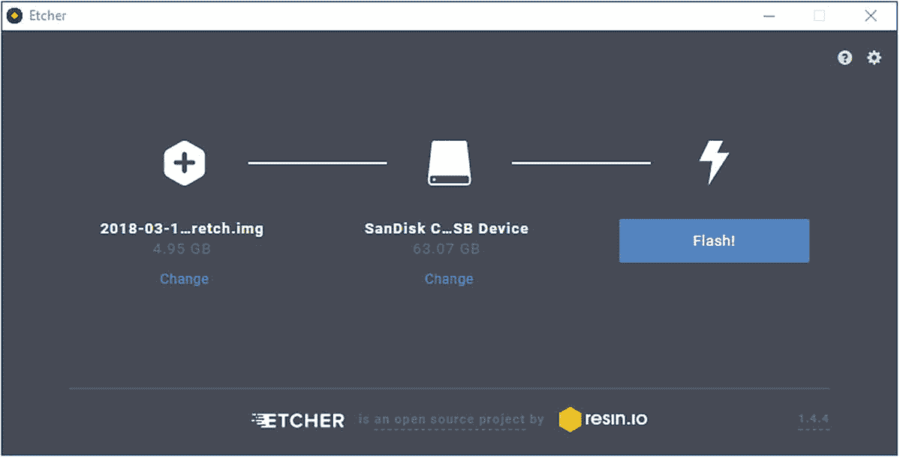
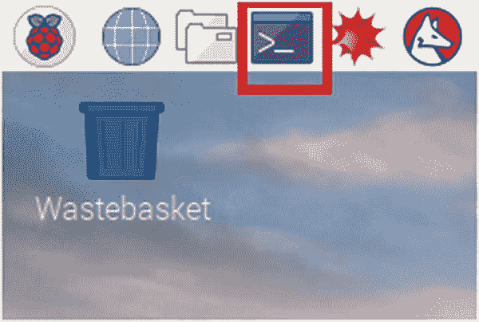
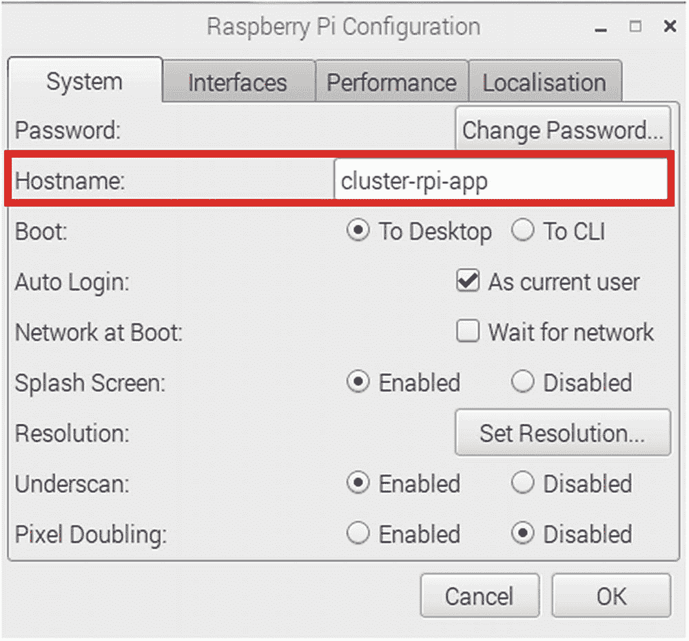
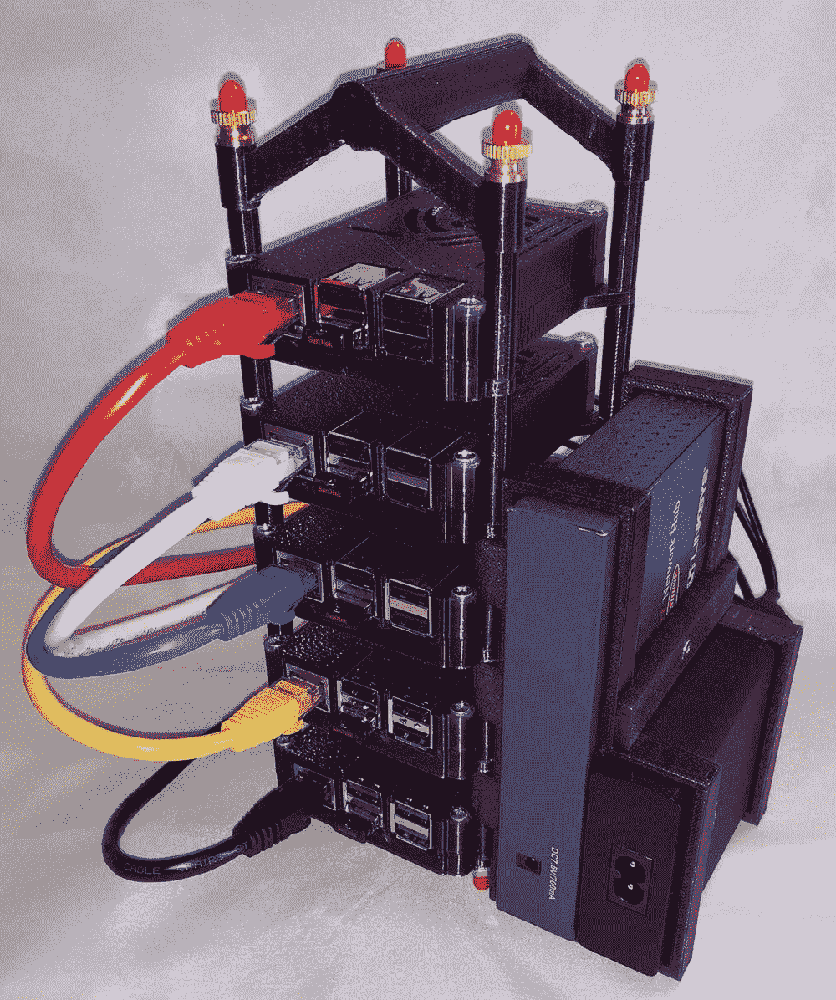
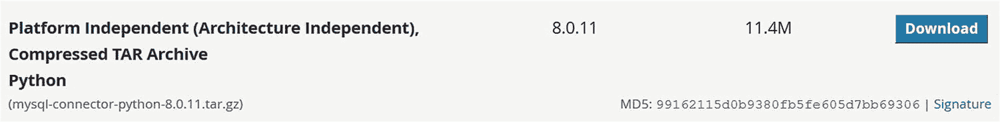

# 7.MySQL 高可用性部署示例

到目前为止，进入 InnoDB 集群的旅程一直是探索和实验的过程。为了使 InnoDB Cluster 对您的基础设施真正有用和有意义，我们必须使用真实的数据将它部署到真实的机器上。尽管对一个正在运行的生产系统进行演练可能是有益的，但对于那些第一次探索 InnoDB Cluster 和 MySQL 高可用性的人来说，这可能太超前了。我们无法从沙盒等模拟环境进入产品部署。没有管理员会这么做。我们必须从可以用来试验和测试我们的应用程序的开发部署开始。只有经过仔细的测试，我们才能将其推广到我们的生产环境中。

在本章中，我们将探索一个使用独立服务器的开发环境，以展示 MySQL 的通用高可用性部署。 <sup>[1](#Fn1)</sup> 我们将在几台机器上安装 MySQL，在其中建立一个 InnoDB 集群，部署一台应用服务器，通过 MySQL 路由器托管一个简单的应用。我们将使用 MySQL Shell 来完成这一切。我们开始吧！

## 建立服务器

本节概述了如何建立模拟小型 InnoDB 集群部署所需的服务器。我们必须做的第一件事是设置和配置几台服务器。只要 MySQL 支持，你可以使用任何你想要的操作系统和硬件。Oracle 花费了很长时间努力让 MySQL 运行在几乎所有的现代平台和最新版本上。假设您使用其中的一个，安装 MySQL 应该没有任何问题。但是，如果您想完成这个演练，我们将建立五台服务器，在每台服务器上安装 MySQL 产品。所有服务器还需要安装 MySQL Shell。我们将使用以下内容:

*   MySQL 服务器:我们需要四台运行 MySQL 8.0.11 或更高版本的服务器。

*   *应用服务器*:我们需要一台运行我们的示例应用程序和 MySQL Router 8.0.11 或更高版本的服务器。

另一件要考虑的事情是您要在这次演示中使用的硬件。您可以使用典型的商用硬件，或者选择一种不太传统但更经济的替代方案，使用 Raspberry Pi 计算机。我们将在这一部分简要讨论每个选项，但是演练使用的是 Raspberry Pi。

Raspberry Pi 计算机体积小，价格便宜，但考虑到处理器速度较慢和内存有限，它们运行得相对较好。您不太可能将整个生产基础架构建立在 Raspberry Pi 计算机上。但是使用 Raspberry Pi 计算机有助于试验新技术、开发安装和类似的非关键任务实现。

### 为什么是树莓派？

如果你想知道为什么有人会选择在开发环境中使用 Raspberry Pi 计算机，现在考虑一下成本。一杯典型的 3B(或 3B+)树莓酒大约要 50 美元。即使添加所需的大容量存储设备和机箱，您也可以轻松组装一台运行 MySQL 8.0.11 的相当快速和稳定的 Raspberry Pi 计算机，价格不到 100 美元。

另外，你不需要为每一个树莓派配备键盘、鼠标和显示器。配置好之后，您可以通过远程访问(`ssh`、`scp`、`mysqlsh`)来无头重启它(没有键盘、鼠标和显示器)。事实上，在所有的服务器都配置好之后，您就不需要键盘、鼠标和显示器了。您可以简单地从另一个系统或您的备件中借用它们。 <sup>[2](#Fn2)</sup>

也许更有趣的是，树莓派非常小，超便携。事实上，您可以在比典型的微型塔式服务器更少的空间内建立一个完整的 Raspberry Pi 机器集群。最后，Raspberry Pi 易于使用，因为它运行 Linux 的一个变体，这使得它为许多开发人员和管理员所熟悉。

### 在商用硬件上安装 MySQL

如果您选择使用更传统的 PC 或服务器硬件，您可以这样做，但建议(但不是必须)您对所有服务器使用相同的硬件。这种常见的做法使维修更容易，允许您切换机器，而不必适应或修改硬件差异。

同样，建议您对每台服务器使用相同的操作系统。同样，这不是一个要求，但它使事情变得更容易。也就是说，对 MySQL 服务器使用一个平台，对应用服务器使用另一个平台是常见的做法。例如，您可以将 Ubuntu 用于 MySQL 服务器，将 Windows 用于应用服务器。

无论如何，如果您想使用任何可用的机器自己运行这个演练，这是没问题的。用一组平台和操作系统不同的机器进行实验是很常见的。例如，如果你有几台运行 Ubuntu 和 Windows 的台式电脑，以及一台或两台运行 macOS 的笔记本电脑，你仍然可以使用所有这些，因为 MySQL 运行在所有这些平台上。

混合使用旧硬件的唯一问题可能是您的一个平台使用了不同的字节顺序。 <sup>[3](#Fn3)</sup> *字节序*是指字节在内存或通信中的顺序。虽然这不是大多数人关心的问题，但是如果您使用任何旧的 Oracle Sun 服务器或类似的平台，您可能希望忽略它们。这并不意味着它们不起作用——恰恰相反——但它们可能会增加你可能不想(或不需要)经历的复杂程度。

下面总结了在商用硬件上安装 MySQL 以便与 InnoDB Cluster 一起使用的必要步骤。因为您已经看到了如何安装 MySQL、MySQL Shell 和其他产品，所以我们将安装的细节推迟到前面的章节。以下是基本步骤:

1.  安装操作系统。

2.  将操作系统配置为用作服务器(网络、用户帐户等)。

3.  安装 MySQL 服务器。

如果你有设置桌面或服务器硬件的经验，这个列表应该不会令人惊讶。您也可能有一些通常用于安装新计算机的替代过程。在设置服务器和安装 MySQL 时，请随意使用您自己的判断。

在每台服务器上安装 MySQL Shell 也是一个好主意。如果您以前没有下载和安装过 MySQL，请参考前面章节中的安装和一般配置示例。

### 小费

请参阅在线参考手册( [`https://dev.mysql.com/doc/refman/8.0/en/installing.html`](https://dev.mysql.com/doc/refman/8.0/en/installing.html) )中的“安装和升级 MySQL”一节，了解有关在特定平台上安装 MySQL 的更多信息。

### 在 Raspberry Pi 上安装 MySQL

在本章中，我们将使用 Raspberry Pi 计算机，而不是更昂贵的主流服务器硬件。如果您想继续学习并使用更传统的服务器硬件，请随意浏览详细介绍 Raspberry Pi 设置和编译 MySQL 的部分。然而，Raspberry Pi 上使用的命令与您在典型的基于 Linux 的平台上使用的命令相同或相似。

唯一可能让那些不知道如何使用 Raspberry Pi 的人犹豫的是 MySQL 8.0.11 缺少 Raspberry Pi 安装包。更具体地说，没有 32 位 ARM 二进制文件。尽管对基于 ARM 的企业操作系统的 64 位二进制文件有一些需求，但对 32 位 Raspberry Pi 操作系统的商业需求很少。因此，尽管我们可能会看到对基于 ARM 的平台的一些支持(目前通过第三方来源)，但找到 32 位二进制文件更具挑战性。幸运的是，因为 MySQL 是开源的，我们可以自己下载源代码、编译和安装。事实上，我们将在本演练中做到这一点。以下是准备用于 InnoDB 集群的 Raspberry Pi 计算机的必要步骤:

1.  下载拉斯扁图像(或 NOOBS)。

2.  准备好 USB 驱动器(或 SD 卡)。

3.  配置 Raspbian(网络、用户帐户等)。

4.  构建 MySQL。

5.  手动安装 MySQL。

6.  配置 MySQL。

7.  构建 MySQL Shell。

8.  安装 MySQL Shell。

### 注意

我们将在所有机器上构建和安装 MySQL Shell，并在应用服务器上安装 MySQL 路由器。

### ARM64 怎么样？

如果您正在使用 64 位平台，并且希望在 Raspberry Pi 上使用 64 位操作系统，您可以这样做。Oracle 最近宣布支持用于 Oracle Enterprise Linux 7.5 的 Raspberry Pi 3([`https://blogs.oracle.com/linux/announcing-the-general-availability-of-oracle-linux-7-for-arm`](https://blogs.oracle.com/linux/announcing-the-general-availability-of-oracle-linux-7-for-arm))。更重要的是，Oracle 还包括一个 yum 存储库，其中包含 MySQL Server 8.0.11 及其组件。因此，如果您想使用 64 位操作系统，或者您更熟悉 Oracle Linux、Red Hat 或 Fedora，那么您会想要查看用于 Raspberry Pi 3 的 Oracle Enterprise Linux 的定制版本。

我写了一篇完整的教程，介绍如何使用 Oracle Enterprise Linux 在 Raspberry Pi 3 上设置 InnoDB 集群。参见我的博客“MySQL 8.0 InnoDB Cluster on arm 64 with Oracle Linux and the Raspberry Pi 3B”([`http://drcharlesbell.blogspot.com/2018/06/mysql-80-innodb-cluster-on-arm64-with.html`](http://drcharlesbell.blogspot.com/2018/06/mysql-80-innodb-cluster-on-arm64-with.html))了解详细的演练。与本章一样，本教程将向您展示如何为集群实例构建映像，以及如何设置应用服务器。

那些更熟悉 Raspbian 或不熟悉 Raspberry Pi 的人可能想先学习本章的教程，然后再学习 ARM64 的教程。正如您将看到的，步骤是相似的，但命令和设置过程有所不同。

这个列表类似于您在商用硬件上设置 MySQL 的过程，但是构建和配置步骤是使 MySQL 在 Raspbian 上工作所必需的。值得注意的是，这些额外的步骤并不是 Raspbian 独有的。事实上，从源代码构建、安装和配置 MySQL 是使用安装包的可行替代方案。在 Raspbian(和其他平台)上之所以有必要，是因为没有 Raspbian 的安装包。您可以在在线参考手册( [`https://dev.mysql.com/doc/refman/8.0/en/source-installation.html`](https://dev.mysql.com/doc/refman/8.0/en/source-installation.html) )的“从源代码安装 MySQL”一节中找到为各种平台构建 MySQL 的说明。

如果您选择使用 Raspberry Pi，以下部分将演示如何设置每台计算机运行最新版本的 Raspberry Pi 默认操作系统。我们从一个关于设置 Raspberry Pi 的简短教程开始，它包含了这个过程的前三个步骤。

### Raspberry Pi 设置教程

Raspberry Pi 是一台拥有惊人的功能和通用性的个人电脑。您可能会认为它是一个玩具或一个严重受限的平台，但这与事实相差甚远。通过添加 USB、以太网和 HDMI 视频等板载外围设备，Raspberry Pi 具备了轻型台式计算机所需的一切。如果您考虑添加通用输入输出(GPIO)头，Raspberry Pi 就不仅仅是一台简单的桌面计算机，它还是一个旨在促进硬件实验的计算系统。

以下部分提供了一个简短的教程，介绍如何开始使用新的 Raspberry Pi，从裸板到完全可操作的平台。

### 注意

一些优秀的作品更详细地讨论了这个主题。如果你发现自己被困住了，或者想知道更多关于开始使用 Raspberry Pi 和 Raspbian 操作系统的信息，请参阅 Peter Membrey 和 David Hows 的*Learn Raspberry Pi with Linux*(a press，2012)。如果您想了解更多关于在硬件项目中使用 Raspberry Pi 的信息，一个很好的资源是 Brendan Horan 的*实用 Raspberry Pi*(a press，2013)。

### 入门指南

树莓电脑没有任何配件。对于本演练，您至少需要一个至少 16GB 的 USB 驱动器(或 SD 卡)、一个额定电流为 700mA 或更高的 USB 电源(带有一个公微型 USB 连接器)、一个键盘、一个鼠标和一个 HDMI 显示器或一个带有 HDMI 适配器的 DVI 显示器。然而，在您将这些东西插入您的 Raspberry Pi 并享受它的光辉之前，您需要为您的 USB 驱动器创建一个引导映像。幸运的是，大多数人都有备用的键盘、鼠标和显示器，除了输入设备的 USB 接口，显示器需要正常大小的 HDMI 电缆。

此外，建议您使用 USB 驱动器，如小型 SanDisk Cruzer Fit，这是一种相对快速且便宜的小型驱动器(参见 [`www.sandisk.com/home/usb-flash/cruzer-fit`](http://www.sandisk.com/home/usb-flash/cruzer-fit) )。SD 卡更脆弱，更容易损坏，因此不太适合密集使用，就像我们在 InnoDB Cluster 中看到的那样。但是，你仍然可以使用 SD 卡。请务必正确关闭您的设备，并小心处理 SD 卡。

### 小费

为了获得最佳效果，请使用 USB 拇指驱动器来存储操作系统和文件。

#### 安装启动映像包

安装启动映像的过程包括选择映像、下载映像，然后将其复制到 USB 驱动器(或 SD 卡)中。对于这个演练，我们将使用来自 [`raspberrypi.org`](http://raspberrypi.org) 的 Raspbian 图像。我们将下载这个文件，提取它(如果压缩)，并将图像复制到 USB 驱动器。有多种方法可以做到这一点，但是我们将使用 Etcher 应用程序，它适用于大多数平台。我们开始吧！

我们将构建一台服务器，安装 MySQL 并对其进行配置，而不是为所有服务器安装相同的基础映像。然后，我们将克隆该驱动器，并在其他服务器上重新创建它。正如您将看到的，这将为您节省大量时间。唯一的问题是，我们必须对每个克隆的服务器做一些小的修改来完成设置，但是大部分繁重的工作已经完成了。

通过访问 [`www.raspberrypi.org/downloads/raspbian/`](http://www.raspberrypi.org/downloads/raspbian/) 开始图像创建过程，并下载带有桌面图像的 Raspbian Stretch。尽管我们通常不会在生产服务器上为操作系统使用图形用户界面，但它使使用 Raspberry Pi 变得更加容易(并且为一些人所熟悉)。下载`.zip`文件(例如`2018-04-18-raspbian-stretch.zip`，下载完成后解压。这将产生一个镜像文件(例如，`2018-04-18-raspbian-stretch.img`)，我们将使用 Etcher 将其写入 USB 驱动器。

### 小费

如果您想了解树莓派可用的其他操作系统，请参见 [`www.raspberrypi.org/downloads/`](http://www.raspberrypi.org/downloads/) 。

当我们下载完图像后，我们需要将它复制到 USB 驱动器(或 SD 卡)中。为此，我们将使用 Etcher，它是在 Linux、macOS 和 Windows 上工作的格式化程序。如果你访问 Etcher 网站， [`https://etcher.io`](https://etcher.io) `/`，你可以选择平台并下载其安装程序。然后，您可以在您的系统上安装 Etcher，遵循您的平台的正常安装过程。

当你准备好了，把你的 u 盘插入你的电脑，启动 Etcher。用户界面很直观。我们需要做三件事:选择我们想要写入的映像，选择要写入的驱动器，并开始映像传输。因此，对于这一步，我们选择之前下载的 Raspbian 的映像，然后选择我们想要使用的 USB 驱动器。图 [7-1](#Fig1) 显示了完成这两个步骤的示例。



图 7-1

使用蚀刻机安装 Raspbian (USB 驱动器)

当您检查以确保您选择了正确的映像和驱动器时，您可以单击闪存！开始图像复制。复制完成后，Etcher 将验证图像。如果一切正常，Etcher 会给你一个信息，告诉你过程成功了。完成后，您可以关闭 Etcher 并移除 USB 驱动器/SD 卡。现在，它已经可以用在你的树莓派中了。

### 注意

如果您使用 Windows，您的系统可能会告诉您，它已检测到一个需要在复制后格式化的驱动器。忽略那些消息！不要格式化驱动器，否则会覆盖图像。

#### 初始服务器配置

下一步是在 Raspberry Pi 中插入 USB 驱动器，打开它，并配置它与 MySQL 一起使用。这是需要键盘、鼠标和显示器的地方。将它们连接到 Raspberry Pi，插入 USB 驱动器，并连接电源。电源通常是 USB 5V 电源，如平板电脑或手机的充电器。只要保证至少 700 毫安就行了。树莓皮没有电源开关，所以当你插上电源，树莓皮就会启动。

大约一分钟后，您应该会在屏幕上看到一系列树莓标志，后面是一长串启动消息。这些都很正常。最终，系统将自动登录并启动到图形用户界面，这是很好的，简单易用。第一次启动可能会慢一点，但后续启动会快一点。

### 我的树莓派无法从 USB 启动！

如果您的 Raspberry Pi 无法从 USB 驱动器启动，您必须在固件中设置一个特殊的一次性写入位。大多数较新的 Raspberry Pi 3 电脑将从 USB 驱动器自动启动。 [`www.raspberrypi.org/documentation/hardware/raspberrypi/bootmodes/msd.md`见](http://www.raspberrypi.org/documentation/hardware/raspberrypi/bootmodes/msd.md)。如果你的 Raspberry Pi 不能从 USB 启动。

简而言之，我们必须准备一个 SD 卡映像，并修改它以允许从 USB 启动，然后用这个命令启用 USB 启动模式

`echo program_usb_boot_mode=1 | sudo tee -a /boot/config.txt.`

这会将`program_usb_boot_mode=1`添加到`/boot/config.txt`的末尾。完成后，用 SD 卡重启 Raspberry Pi，然后关机。取出 SD 卡并插入 USB 驱动器。打开 Raspberry Pi，它应该从 USB 驱动器启动。

要配置机器用于本演练，必须执行以下任务。请记住，我们对一个映像执行此操作，稍后会将其复制到其他服务器:

1.  更改 root 密码。

2.  启用 SSH。

3.  设置键盘区域/语言。

4.  配置网络。

以下部分描述了如何执行这些任务。

##### 更改 Root 密码

root 用户帐户被命名为`pi`，密码为`raspberry`。改变这一点，这样窥探的眼睛就不会进入你的电脑，无意中改变事情。对于从未用过树莓的人来说，尤其是使用 Linux 的人来说，玩树莓是多么诱人，你会感到惊讶。选择一个您容易记住的密码。因为我们正在克隆该驱动器以供其他服务器使用，所以在此处更改密码可以确保所有系统使用相同的密码。酷。

Raspbian 提供了一个很好的工具来修改系统，包括修改 root 用户密码，称为 Raspberry Pi 配置工具。您可以通过单击左上角的 Raspberry Pi 徽标，选择首选项，然后单击 Raspberry Pi 配置来访问它。图 [7-2](#Fig2) 显示了该工具的示例。


图 7-2

Raspberry Pi 配置工具

要更改密码，请点按“更改密码”并输入您的新密码。还强烈建议您通过取消选中作为当前用户复选框来关闭自动登录。但是先不要关闭工具。我们需要用这个工具做两件事。

##### 启用 SSH

当使用 Raspberry Pi 作为服务器(与大多数服务器一样)时，管理员发现从他们的工作站远程登录到服务器更容易，而不是沿着长长的走廊走到满是人的安全房间，或者闪烁的灯光在无尽的服务器机架中搜索，只找到一个哑终端，连接它，然后登录。你明白了——远程登录要容易得多。

幸运的是，我们可以用拉斯扁做到这一点。要将 Raspbian 配置为允许通过安全套接字连接和安全 Shell (SSH)进行远程登录，我们需要在 Raspberry Pi 配置工具中单击 Interfaces 选项卡，并在 SSH 行上选中 Enabled 复选框。图 [7-3](#Fig3) 显示了打开 SSH 连接后的界面。


图 7-3

启用 SSH 连接

##### 设置键盘布局/区域

我们需要用配置工具再做一件事:设置默认的键盘布局。Raspbian 自带的键盘布局设置为英国英语(Raspberry Pi 内置于此)。如果你住在世界上的其他地方，不使用这种键盘布局，你需要改变它。

要更改键盘布局，单击实用程序中的本地化选项卡，然后单击设置键盘按钮，如图 [7-4](#Fig4) 所示。


图 7-4

tab 位置

按照对话框选择您的国家和键盘布局。完成后，您可以关闭该实用程序并重启您的 Raspberry Pi。重新启动后，确保您的所有设置都是正确的——尤其是键盘！

您也可以更改键盘布局:单击首选项➤鼠标和键盘设置，然后单击键盘布局选项卡，最后单击键盘布局按钮。

##### 配置网络

设置 Raspberry Pi 操作系统的最后一项任务是启用网络。你有两个选择。树莓 Pi 3 配有 Wi-Fi 和以太网连接。建议您使用以太网连接，并使用集线器连接群集中的所有计算机。虽然如果您决定使用 Wi-Fi，则不需要集线器，但使用具有以太网连接的集线器象征着大多数集群安装的做法——将它们安装在隔离的子网中，以确保不会因竞争或网络负载而丢失流量。对于这个演练来说，这并不重要，但是一个集线器会使连接变得更容易一些。

### 注意

虽然本节详细描述了如何为一个 MySQL 服务器设置网络，但是在我们克隆了基本服务器之后，我们将不得不对其他服务器做一些小的更改。例如，我们需要为每台服务器编辑特定的 IP 和主机名，这比在每台机器上执行同样长的步骤更容易。

无论您选择哪个接口，我们都必须设置我们的服务器来使用静态 IP 地址。检查家庭(或工作)网络上的动态主机配置协议(DHCP) <sup>[4](#Fn4)</sup> 服务器，并从可用范围中选择五个 IP 地址。大多数家用路由器都运行 DHCP 服务。或者，最好保留一个 IP 地址范围以供使用。如果你不确定这是什么意思，没关系。您可以从该范围的顶部(较大的数字)选择五个 IP 地址，您应该是安全的。

例如，如果您的 DHCP 服务器使用的范围是 192 . 168 . 1 . 2–192 . 168 . 1 . 254，那么您可以选择 192 . 168 . 1 . 240–192 . 168 . 1 . 244，应该没问题。但是，如果您遇到其他机器抱怨 IP 地址重复的问题，您可能需要更改您使用的范围。

### 注意

如果您不是 DHCP 服务器的所有者(例如，您正在使用别人的网络)，您可能需要联系系统管理员并请求 IP 地址。

在本次演示中，我们将 Raspberry Pi 计算机的 IP 地址更改为使用 192 . 168 . 42 . 240–192 . 168 . 42 . 244，如下所示:

*   192.168.42.240:应用服务器

*   192 . 168 . 42 . 241:InnoDB 集群中的第一台服务器

*   192 . 168 . 42 . 242:InnoDB 集群中的第二台服务器

*   192 . 168 . 42 . 243:InnoDB 集群中的第三台服务器

*   192 . 168 . 42 . 244:InnoDB 集群中的第四台服务器

您还需要知道路由器 IP 地址和至少一个名称服务器 IP 地址。您可以在您的路由器(通常是运行 DHCP 服务的同一台机器)上找到此信息。例如，路由器 IP 地址可能是子网地址和范围内的第一个数字。例如，192.168.42.XXX 网络使用 192.168.42.1 作为路由器 IP 地址。

同样，同一网络上的域名服务器(DNS)也是 192.168.42.1 地址。如果您在同一网络上有其他机器，您也可以通过检查网络设置来找到此信息。比如，你可以在 Linux 和 macOS 机器上运行`ifconfig`来查看所有的网络接口。在 Windows 上，您可以使用`ipconfig /all`来查看网络接口及其设置。

要设置静态 IP 地址，我们必须编辑`dhcpcd.conf`文件。您可以在终端窗口中使用以下命令。该命令通过超级用户(`sudo`)命令和 Nano 编辑器使用提升的权限来编辑文件:

```
$ sudo nano /etc/dhcpcd.conf

```

点击工具栏左上方的小终端图标，可以打开一个终端，如图 [7-5](#Fig5) (用方框标注表示)。



图 7-5

定位终端应用程序

打开文件后，向下滚动到文件的底部(end ),添加以下行，替换您的网络的基本 IP 范围。例如，如果您的网络使用 10.0.1.XXX，请使用 10.0.1 而不是 192.168.42.XXX。在这种情况下，我们将第一台 MySQL 服务器的静态 IP 地址设置为 192.168.42.241。使用检查路由器时遇到的路由器 IP 和名称服务器 IP 地址。

```
# Example static IP configuration:
interface eth0
static ip_address=192.168.42.241/24
static routers=192.168.42.1
static domain_name_servers=192.168.42.1

```

添加完这些行之后，通过按 Ctrl+X 和 Y 来保存文件。保存后，您可以重新启动机器。当机器重新启动时，您可以在终端窗口中使用以下命令来检查设置:

```
$ ip a

```

检查输出，确保 eth0 接口显示正确的 IP 地址，如下所示。请注意，报告显示的 IP 地址是 192.168.42.241:

```
...
2: eth0: <BROADCAST,MULTICAST,UP,LOWER_UP> mtu 1500 qdisc pfifo_fast state UP group default qlen 1000
    link/ether b8:27:eb:5e:7f:71 brd ff:ff:ff:ff:ff:ff
    inet 192.168.42.241/24 brd 192.168.42.255 scope global eth0
       valid_lft forever preferred_lft forever
    inet6 2001:5b0:4eca:9f28:cc4e:31cb:ecb0:226a/64 scope global mngtmpaddr noprefixroute dynamic
       valid_lft 1175sec preferred_lft 1175sec
    inet6 fe80::a38:d8b:653b:81c/64 scope link
       valid_lft forever preferred_lft forever
...

```

接下来，测试网络连接以确保其正常工作。如果您可以连接到互联网或网络上的其他计算机，您就完成了。如果不能，请返回并检查您的设置，如果有必要，通过在您添加到文件的每一行之前放置一个`#`来恢复更改，然后重新启动。

### 小费

关于如何在 Raspberry Pi 上为以太网或 Wi-Fi 连接设置静态 IP 地址的完整讨论，请参见 [`www.raspberrypi.org/learning/networking-lessons/rpi-static-ip-address/`](http://www.raspberrypi.org/learning/networking-lessons/rpi-static-ip-address/) 。

好了，我们还没有完成网络配置。我们还需要为每台服务器设置一个唯一的主机名。我们可以使用 Raspberry Pi 配置工具来设置主机名。在本演示中，我们将使用主机名`cluster-rpi[1-4]`。例如，第三个服务器设置的主机名是`cluster-rpi3`。我们将使用主机名`cluster-rpi-app`作为应用服务器。要更改主机名，请打开 Raspberry Pi 配置工具，找到第一个选项卡上的主机名行，并将文本框中的文本更改到右侧。图 [7-6](#Fig6) 显示了为应用服务器设置主机名的示例。



图 7-6

设置主机名

完成更改后，您需要重新启动服务器，但是我们还需要做一项更改。我们还必须编辑`/etc/hosts`文件，为您的集群添加新的 IP 地址和主机名。这允许我们使用集群，而不必向我们的 DNS 服务器注册主机名。如果您的家庭网络有自己的 DNS，这是可能的，但这不太可能。您需要添加的行是文件底部的行(以粗体显示):

```
127.0.0.1       localhost
::1             localhost ip6-localhost ip6-loopback

ff02::1         ip6-allnodes
ff02::2         ip6-allrouters

192.168.42.240  cluster-rpi-app

192.168.42.241  cluster-rpi1

192.168.42.242  cluster-rpi2

192.168.42.243  cluster-rpi3

192.168.42.244  cluster-rpi4

```

您现在可以重新启动服务器。我们现在准备在 Raspbian 上构建、安装和配置 MySQL。强烈建议您使用另一台机器来执行此任务(例如应用服务器)。

### 小费

如果你想听从建议在一台单独的 Raspberry Pi 计算机上构建 MySQL，你应该为另一个 USB 驱动器和机器执行前面的步骤。例如，您可以构建应用服务器，并使用该机器构建 MySQL。

### 构建 MySQL 服务器、Shell 和路由器

请记住，没有适用于 MySQL 或其产品的 Raspbian 二进制发行版。我们必须构建 MySQL 服务器、Shell 和路由器，然后在我们的 Raspberry Pi 计算机上手动安装它们。幸运的是，这个过程很简单，包括一些准备我们系统的次要系统配置项目和两个命令:`cmake`和`make`。这一节将通过大量的例子和每一步的文档来引导你完成所有这些步骤。

从源代码构建 MySQL 的任务对于那些从来没有编程过的人或者已经有一段时间没有编写过程序的人来说可能会令人望而生畏，但是不要绝望。在 Raspberry Pi 上编译 MySQL 最困难的部分是等待过程完成。汇编所有内容可能需要几个小时。但是，对于能够使用 Raspberry Pi 计算机来试验 InnoDB 集群来说，这是一个很小的代价。

然而，在我们开始修改系统以构建代码之前，让我们讨论一个部署计划。

#### 部署计划

制定部署高可用性解决方案的计划总是一个好主意。我们已经讨论了一般的计划:在集群中有一个应用服务器和四个服务器。现在让我们讨论如何最好地构建和部署 MySQL 产品。

我们将使用一台机器来构建 MySQL 服务器、Shell 和路由器。但是，我们不需要在集群中的每台机器上安装所有三个组件。相反，我们需要在将成为集群成员的四台机器上安装 MySQL Server 和 MySQL Shell。应用服务器只需要安装 MySQL Shell 和路由器。

方法是使用应用服务器作为构建机器来构建所有三个产品。然后，您可以将安装文件(以 TAR 文件的形式，它代表*磁带归档*)复制到您在前面几节中准备的基础机器上。

我们将在应用服务器上构建所有三个产品，但是只在那台机器上安装 MySQL Shell 和 Router。MySQL 服务器和 Shell 安装在我们之前讨论过的基本 MySQL 服务器映像上。我们将克隆该映像以形成集群中的机器。

让我们开始在 Raspbian 上编译 MySQL，从先决条件开始。

#### 先决条件

要准备您的 Raspberry Pi 来编译 MySQL 产品，您需要采取几个步骤。首先要考虑的是，是否要在以后要克隆的同一台服务器上构建 MySQL。如果您在我们刚刚花时间配置为与 InnoDB Cluster 一起使用的同一台服务器上构建 MySQL，您将需要将所有开发代码和应用程序复制到每台机器上，这是不必要的。

因此，第一个先决条件是设置一台新机器作为我们的构建机器。如上所述，这可以是您的应用服务器。此外，如果您有一个额外的至少 8GB 的 USB 驱动器(不要为构建机器使用 SD 卡——它会太慢),通过复制您先前下载的 Raspbian 映像来准备它(参见前面的“安装引导映像”一节中关于使用 Etcher 的内容)。如果您没有额外的 USB 驱动器，您可以使用为应用服务器指定的驱动器，因为我们不会克隆该系统。如果您只有一个键盘、鼠标和显示器，那么您需要在启动第一个 MySQL 服务器之前关闭应用服务器。

在您至少按照前面“Raspberry Pi 设置教程”一节中的步骤准备好应用服务器之后(确保使用正确的 IP 地址和主机名—192.168.42.240，`cluster-rpi-app`)，我们将安装以下软件:

*   *诅咒 5* ( `libncurses5-dev`):终端输出库

*   Bison:一个语言处理器

*   OpenSSL ( `libssl-dev` ): SSL 库

*   *CMake* :制作配置工具

要同时安装所有这些库，请在终端窗口中使用以下命令:

```
$ sudo apt-get install libncurses5-dev bison libssl-dev cmake

```

这将下载并安装必要的文件。请注意，我们必须使用提升的权限来安装库。

### Sudo 是什么？

在大多数 Linux 平台上，您必须使用提升的权限来安装软件和修改系统文件。`sudo`命令(对于*超级用户 do* ，参见 [`https://linuxacademy.com/blog/linux/linux-commands-for-beginners-sudo/`](https://linuxacademy.com/blog/linux/linux-commands-for-beginners-sudo/) )允许你暂时获得普通用户账户的那些权限。在配置 Raspbian 和类似的 Linux 系统时，您会经常看到这种情况。

我们必须再做一件事。我们必须增加交换文件的大小。这对于让系统有足够的内存来编译和链接一些较大的源代码文件是必要的。建议将交换文件大小设置为 2048。为此，请打开终端窗口并输入以下命令来编辑交换文件配置文件:

```
$ sudo nano /etc/dphys-swapfile

```

在文件中找到以下行，并将值更改为 2048。文件中没有其他行需要更改:

```
CONF_SWAPSIZE=2048

```

要启用新的交换空间大小，请重新启动计算机或输入以下命令:

```
$ sudo /etc/init.d/dphys-swapfile stop
$ sudo /etc/init.d/dphys-swapfile start

```

这些方法通过停止系统进程并重新启动它，将交换文件重置为新的大小。现在我们准备构建 MySQL 服务器、Shell 和路由器。

#### 构建 MySQL 服务器

好了，这是在 MySQL 8.0.11 上使用树莓 Pi 最棘手的地方。因为没有我们可以下载使用的 Oracle 二进制文件(有些第三方可能最终会构建一些)，所以我们必须自己编译 MySQL。这是可能的，因为 MySQL 是开源的，正如您在上一节中看到的，我们可以下载源代码。酷。

在 Raspberry Pi 上构建 MySQL 只需要三个步骤。我们首先运行名为 CMake 的预处理器，然后用`make`构建代码，最后用`make package`命令构建安装包。让我们看看每个步骤的细节，从 CMake 开始。

CMake ( [`cmake.org`](http://cmake.org) )是另一个用于构建、测试和打包软件的开源产品。回想一下，我们在上一节安装了 CMake。您可以使用许多不同的选项来构建软件，其中许多也适用于 MySQL。事实上，您可以花费大量时间定制 CMake 命令选项，以便为几乎任何平台进行构建。因为我们下载了带有 Boost 库的普通 Linux 的 MySQL 源代码，所以我们拥有了我们需要的一切。

我们需要与 CMake 一起使用的命令选项很少，包括以下内容:

*   您应该设置`-DWITH_UNIT_TESTS=OFF`来节省编译时间(不需要单元测试)。

*   你应该把`PREFIX`设置到安装路径，这样便于安装。

*   我们必须用发布代码来构建(debug 对于 Raspberry Pi 来说需要太多内存)。

*   我们必须添加额外的编译和构建标志，以确保代码在 ARM32 上正确构建。

每一个都将被更详细地解释，但是让我们从下载源代码开始吧。

##### 准备源代码

现在我们已经设置好了构建 MySQL 的机器，唯一的先决条件是我们必须下载 MySQL 服务器源代码。前往 [`https://dev.mysql.com/downloads/mysql/`](https://dev.mysql.com/downloads/mysql/) 。从选择操作系统下拉框中，选择源代码。然后点击通用 Linux(架构独立)，压缩后的 TAR 存档列表底部包含 Boost Headers 下载链接，如图 [7-7](#Fig7) 所示。这个文件包含我们需要的另一个库(Boost)以及服务器源代码。这是最容易开始构建的下载。


图 7-7

下载 MySQL 服务器源代码

##### 运行 CMake(准备编译)

我们要做的第一件事是提取我们下载的 TAR 文件。您可以使用以下命令来完成此操作:

```
$ cd /home/pi
$ mkdir source
$ cd source
$ cp ~/Downloads/mysql- boost-8.0.11.tar.gz .
$ tar -xvf mysql-boost-8.0.11.tar.gz

```

这将创建一个名为`mysql-8.0.11`的文件夹。建议您将此文件解压缩到 root 用户主文件夹中的一个文件夹中，例如`/home/pi/source`。解包过程需要几分钟，因为它包含大量代码。

### 小费

如果您想节省启动驱动器上的空间，您可以格式化并使用第二个 USB 驱动器来下载和编译代码。只要确保用 ext4 文件系统格式化驱动器。

接下来，我们将使用以下命令创建一个目录来存储所有编译后的代码。这有助于防止编译时发生意外，并保留源代码:

```
$ cd mysql-8.0.11
$ mkdir build
$ cd build

```

现在我们可以运行 CMake 命令了。清单 [7-1](#PC12) 显示了您需要在构建文件夹中使用的完整命令。请注意，该命令指定了许多选项，包括(按外观顺序)、使用 UNIX makefiles、将构建设置为发布代码(而不是调试)、忽略一体化(AIO)检查、设置 Boost 文件夹(包含在我们下载的 TAR 文件中)、关闭单元测试，以及设置一些用于在 ARM32 上编译的神秘选项。

```
$ cmake -G "Unix Makefiles" -DCMAKE_BUILD_TYPE=release -DBUILD_CONFIG=mysql_release -DDEBUG_EXTNAME=OFF -DIGNORE_AIO_CHECK=1 -DWITH_BOOST=/home/pi/source/mysql-8.0.11/boost -DWITH_UNIT_TESTS=OFF -DCMAKE_C_LINK_FLAGS="-Wl,--no-keep-memory,--icf=safe" -DCMAKE_CXX_LINK_FLAGS="-Wl,--no-keep-memory,--icf=safe" -DCMAKE_C_FLAGS_RELEASE="-fPIC" -DCMAKE_CXX_FLAGS_RELEASE="-fPIC" -DCMAKE_INSTALL_PREFIX="/usr/local/mysql" ..

-- Running cmake version 3.7.2
-- Found Git: /usr/bin/git (found version "2.11.0")
-- Configuring with MAX_INDEXES = 64U
-- The C compiler identification is GNU 6.3.0
-- The CXX compiler identification is GNU 6.3.0
-- Check for working C compiler: /usr/bin/cc
...
-- COMPILE_DEFINITIONS: _GNU_SOURCE;_FILE_OFFSET_BITS=64;BOOST_GEOMETRY_SQRT_CHECK_FINITENESS;HAVE_CONFIG_H;RAPIDJSON_NO_SIZETYPEDEFINE;__STDC_LIMIT_MACROS;__STDC_FORMAT_MACROS;_USE_MATH_DEFINES;HAVE_LIBEVENT1;UNISTR_FROM_STRING_EXPLICIT=explicit;UNISTR_FROM_CHAR_EXPLICIT=explicit
-- CMAKE_C_FLAGS:  -Wall -Wextra -Wformat-security -Wvla -Wundef -Wwrite-strings
-- CMAKE_CXX_FLAGS:  -Wall -Wextra -Wformat-security -Wvla -Wundef -Woverloaded-virtual -Wno-missing-field-initializers -Wlogical-op

-- CMAKE_C_LINK_FLAGS: -Wl,--no-keep-memory,--icf=safe -fuse-ld=gold -Wl,--gc-sections

-- CMAKE_CXX_LINK_FLAGS: -Wl,--no-keep-memory,--icf=safe -fuse-ld=gold -Wl,--gc-sections

-- CMAKE_C_FLAGS_RELEASE: -fPIC  -DDBUG_OFF
-- CMAKE_CXX_FLAGS_RELEASE: -fPIC -std=c++11  -DDBUG_OFF
-- Configuring done
-- Generating done
-- Build files have been written to: /home/pi/source/mysql-8.0.11/build

Listing 7-1Running the CMake Command (ARM32)

```

如果这个命令看起来很奇怪，也不用担心。您不需要理解我们在编译和链接阶段使用的所有特殊设置。但是，如果您确实想了解更多关于这些选项的信息，您可以查看关于 GNU 编译器( [`http://gcc.gnu.org/onlinedocs/gcc/Option-Summary.html`](http://gcc.gnu.org/onlinedocs/gcc/Option-Summary.html) )和链接器( [`https://gcc.gnu.org/onlinedocs/gcc/Link-Options.html`](https://gcc.gnu.org/onlinedocs/gcc/Link-Options.html) )选项的文档。

运行该命令可能需要几分钟时间。确保没有错误，并且最后几行表明构建文件已经被写入到`build`文件夹中。请特别注意结尾的`LINK_FLAGS`消息。CMake 命令中的选项不包括空格。如果您不小心添加了空格，逗号分隔的列表将在 CMake 输出中显示它们。确保没有空格。如果有空格，您可能会得到一个错误，指出`--icf=safe`(或其他)选项无效。如果发生这种情况，请再次运行不带空格的命令。

如果你已经走了这么远而没有错误，你几乎可以放松了。下一步，编译代码，很容易，但可能需要一段时间运行在树莓 Pi 3B+(至少两到三个小时)。

##### 运行 make(编译)

下一步是编译代码。这可以简单地用`make`命令来完成。这个命令允许我们指定想要使用的并行线程的数量。对于树莓 Pi 3，总共四个 CPU 核心，使用三个核心进行编译是安全的。如果您有一个正在运行的 CPU 使用监视器，您将会看到这三个，有时可能是所有四个内核都在 100%运行。如果你的树莓派 3B 安装在一个箱子里，确保你有足够的通风或风扇吹过电路板。这对于树莓派 3B+(最新的主板)来说不是绝对必要的，但也不会有什么坏处。

清单 [7-2](#PC13) 展示了使用命令`make -j3`编译 MySQL 服务器代码的步骤。该清单是您可能会看到的消息的摘录(将有数千行)，但需要注意的是最后几行。这些确保代码编译无误。

### 小费

在代码编译时，您可能会看到轻微的警告，您可以忽略这些警告。但是，您应该看不到任何编译错误。如果是这样，请返回检查 CMake 命令，并在必要时重新运行它。如果所有这些都失败了，删除`build`目录并重新开始。

```
$ make -j3
[  0%] Built target INFO_SRC
[  0%] Built target INFO_BIN
[  0%] Building C object extra/zlib/CMakeFiles/zlib.dir/adler32.o
[  0%] Generating common.h
[  0%] Generating help.c
[  0%] Generating help.h
[  0%] Generating vi.h
[  0%] Generating emacs.h
[  0%] Building C object extra/zlib/CMakeFiles/zlib.dir/compress.o
[  0%] Generating fcns.c
[  0%] Generating fcns.h
...
...
[100%] Linking CXX static library ../archive_output_directory/libsql_main.a
[100%] Built target sql_main
Scanning dependencies of target mysqld
[100%] Building CXX object sql/CMakeFiles/mysqld.dir/main.cc.o
[100%] Linking CXX executable ../runtime_output_directory/mysqld
[100%] Built target mysqld

Listing 7-2Compiling MySQL Server

```

编译完成后，下一步是构建一个包(TAR 文件),我们可以用它在我们的服务器上安装 MySQL。

##### 制作包装

我们需要做的最后一件事是构建安装包。在这种情况下，我们将构建一个压缩的 TAR 文件，我们可以将它复制到我们的初始服务器并进行安装。我们用`make package`命令来做这件事，如清单 [7-3](#PC14) 所示。

```
$ make package
[  0%] Built target abi_check
[  0%] Built target INFO_SRC
[  0%] Built target INFO_BIN
[  0%] Built target zlib
[  1%] Built target edit
[  8%] Built target icuuc
[ 16%] Built target icui18n
[ 16%] Built target icustubdata
...
Run CPack packaging tool...
CPack: Create package using TGZ
CPack: Install projects
CPack: - Run preinstall target for: MySQL
CPack: - Install project: MySQL
CPack: Create package
CPack: - package: /home/pi/source/mysql-8.0.11/build/mysql-8.0.11-linux-armv7l.tar.gz generated.

Listing 7-3Building the TAR Package

```

就这样！我们在 Raspberry Pi 上构建了 MySQL！还不算太糟，是吧？现在让我们看看如何在我们的服务器上安装和测试 MySQL。

#### 安装 MySQL 服务器

回想一下，我们在应用服务器上构建了 MySQL。因此，我们需要将 TAR 文件复制到一个可移动驱动器上，并启动我们之前构建的第一个 MySQL 服务器。如果您只有一个键盘、鼠标和显示器，那么您需要在启动第一个 MySQL 服务器之前关闭应用服务器。复制完文件后，现在就开始做吧。

服务器启动后，登录并转到`/usr/local`目录，创建一个名为`mysql`的新文件夹。然后，切换到新文件夹，并将 TAR 文件复制到该文件夹。最后，使用以下命令解压文件。有很多文件，所以解压缩可能需要几分钟时间。

```
$ cd /usr/local/
$ mkdir mysql
$ cd mysql
$ sudo cp ~/source/mysql-8.0.11/build/mysql-8.0.11-linux-armv7l.tar.gz .
$ sudo tar -xvf mysql-8.0.11-linux-armv7l.tar.gz --strip-components=1

```

请注意，最后一个命令使用一个选项从提取的文件目录中删除一个组件(第一个文件夹— `mysql-8.0.11-linux-armv7l`)。这确保了 MySQL 文件被复制到`/usr/local/mysql`。

但是，我们需要再运行一个命令。因为我们很节省空间，所以我们不需要 MySQL 测试文件，所以我们可以用下面的命令删除它们。当我们处理完 TAR 文件后，我们也可以删除它，如下所示:

```
$ sudo rm -rf mysql-test

$ sudo rm mysql-8.0.11-linux-armv7l.tar.gz

```

从 TAR 文件安装比从典型的特定于平台的包安装需要更多的步骤。这是因为安装包通常会处理几个必需的配置步骤——所有这些都在在线参考手册的“使用通用二进制文件在 Unix/Linux 上安装 MySQL”([`https://dev.mysql.com/doc/refman/8.0/en/binary-installation.html`](https://dev.mysql.com/doc/refman/8.0/en/binary-installation.html))一节中有详细介绍。

#### 配置 MySQL 服务器

现在我们已经复制了文件，我们可以完成设置。这个过程并不繁琐，但确实涉及到从终端运行几个命令，所以需要耐心确保所有命令都输入正确。

我们首先创建一个名为`mysql`的新组，添加一个名为`mysql`的用户，创建一个供 MySQL 使用的文件夹，并授予`mysql`用户对该文件夹的访问权限。下面显示了所需的命令；从终端运行这些命令(这些命令没有输出):

```
$ sudo groupadd mysql
$ sudo useradd -r -g mysql -s /bin/false mysql
$ cd /usr/local/mysql
$ sudo mkdir mysql-files
$ sudo chown mysql:mysql mysql-files
$ sudo chmod 750 mysql-files

```

第一次启动服务器之前的下一步是使用`mysql_ssl_rsa_setup`工具建立安全连接，并确保`mysql`用户可以访问所有数据文件。最后，我们还需要准备数据目录。下面显示了所需的命令；在终端窗口的`/usr/local/mysql`文件夹中运行这些:

```
$ sudo ./bin/mysql_ssl_rsa_setup --datadir=data
$ sudo chown mysql:mysql data
$ sudo chmod 750 data

```

我们可以使用`--initialize`选项轻松初始化数据目录，如下一行代码所示。注意，我们使用提升的权限运行命令，并指定要使用的用户(`mysql`)。下面显示了一个输出示例，成功的消息以粗体突出显示。如果您看到错误，请参考在线参考手册来解决它们。请注意，输出包含初始 root 用户密码。下一步您将需要它。

```
$ sudo bin/mysqld --initialize --user=mysql
...
2018-05-23T18:37:53.120312Z 0 [System] [MY-013169] [Server] /usr/local/mysql/bin/mysqld (mysqld 8.0.11) initializing of server in progress as process 15340

2018-05-23T18:38:26.383044Z 5 [Note] [MY-010454] [Server] A temporary password is generated for root@localhost: pPX4Ll8/grR2
2018-05-23T18:38:52.713071Z 0 [System] [MY-013170] [Server] /usr/local/mysql/bin/mysqld (mysqld 8.0.11) initializing of server has completed

```

好了，我们现在准备好第一次启动 MySQL 了。使用`mysqld_safe`命令从命令行启动 MySQL。我们使用这个命令代替`/etc/init.d/mysql` start 命令，这样我们可以检查输出中的错误。如果没有错误，您应该会看到如下输出:

```
$ sudo ./bin/mysqld_safe --user=mysql &
$ Logging to '/usr/local/mysql/data/raspberrypi.err'.
2018-05-23T18:42:34.968096Z mysqld_safe Starting mysqld daemon with databases from /usr/local/mysql/data

```

现在我们可以用旧客户端测试我们的 MySQL 服务器。确保使用初始化数据目录时显示的密码。清单 [7-4](#PC21) 展示了第一次使用`mysql`客户端连接到服务器的例子。我们将首先显示版本，然后更改 root 用户密码。请注意，我们还使用`shutdown` SQL 命令关闭了服务器。

```
$ ./bin/mysql -uroot -p
Enter password:
Welcome to the MySQL monitor.  Commands end with ; or \g.
Your MySQL connection id is 8
Server version: 8.0.11

Copyright (c) 2000, 2018, Oracle and/or its affiliates. All rights reserved.

Oracle is a registered trademark of Oracle Corporation and/or its
affiliates. Other names may be trademarks of their respective
owners.

Type 'help;' or '\h' for help. Type '\c' to clear the current input statement.

mysql> SET PASSWORD = 'root';
Query OK, 0 rows affected (0.06 sec)

mysql> SELECT @@version;
+-----------+
| @@version |
+-----------+
| 8.0.11    |
+-----------+
1 row in set (0.00 sec)

mysql> shutdown;
Query OK, 0 rows affected (0.00 sec)

mysql> \q

Listing 7-4Connecting to MySQL for the First Time

```

接下来，我们必须添加 MySQL 二进制文件的路径。我们可以通过用命令`nano ~/.bashrc`编辑我们的 Bash 资源文件很容易地做到这一点。当文件打开时，将下面一行添加到文件底部:

```
export PATH=${PATH}:/usr/local/mysql/bin

```

下次打开终端时，无需指定路径就可以执行 MySQL 应用程序和工具。

还需要最后一步:我们必须复制启动和关闭脚本(服务)以允许我们在引导时自动启动 MySQL。为此，从构建的`support-files`文件夹中复制`mysql.server`文件到`/etc/init.d/mysql`文件，如下所示。我们还将再次测试服务器连接，然后用`/etc/init.d/mysql`脚本关闭它。请注意，使用此脚本时，可能会提示您输入密码。

```
$ /etc/init.d/mysql start
[ ok ] Starting mysql (via systemctl): mysql.service.
$ mysql -uroot -p -e "select @@version"
Enter password:
+-----------+
| @@version |
+-----------+
| 8.0.11    |
+-----------+
$ /etc/init.d/mysql stop
[ ok ] Stopping mysql (via systemctl): mysql.service.

```

就这样！我们已经安装了 MySQL 服务器，并测试了它的工作情况。在每台服务器上安装 MySQL Shell 也是一个好主意。

#### 构建 MySQL Shell

在 Raspberry Pi 上构建 MySQL Shell 就像构建 MySQL 服务器一样，只是前提条件有点不同，需要下载并编译 Protobuf 库。安装稍微容易一些，因为不需要安装后配置。在这一节中，您将探索如何在 Raspberry Pi 上构建和安装 MySQL Shell。

##### 准备源代码

我们需要做的第一件事是下载 MySQL Shell 源代码。前往 [`https://dev.mysql.com/downloads/shell/`](https://dev.mysql.com/downloads/shell/) 。在选择操作系统下拉框中，选择源代码。然后点击列表底部的通用 Linux(架构独立)，压缩 TAR 存档下载链接，如图 [7-8](#Fig8) 所示。您可以暂时保留该文件，因为我们将在下一部分用到它。


图 7-8

下载 MySQL Shell 源代码

接下来，我们还需要下载 Protobuf 2.6.1 源代码。我们将需要下载源代码，编译它，并安装它来使用 MySQL Shell。进入 [`https://github.com/google/protobuf/releases/tag/v2.6.1`](https://github.com/google/protobuf/releases/tag/v2.6.1) ，点击下载`protobuf-2.6.1.tar.gz`文件。将它复制或放置在您的`/home/pi/source`文件夹中，并使用以下命令将其解压缩:

```
$ cd /home/source
$ cp ~/Downloads/protobuf-2.6.1.tar.gz .
$ tar -xvf protobuf-2.6.1.tar.gz

```

接下来，切换到我们解压缩的文件夹并运行`configure`命令:。

```
$ cd protobuf-2.6.1
$ ./configure
checking whether to enable maintainer-specific portions of Makefiles... yes
checking build system type... armv7l-unknown-linux-gnueabihf
...
config.status: creating build-aux/config.h
config.status: executing depfiles commands
config.status: executing libtool commands

```

这确保了代码是为 Raspberry Pi 平台配置的(就像 CMake 为服务器代码所做的那样)。

接下来，我们使用提升的权限运行`make`命令，如下所示。下面是典型输出的摘录。可能会生成数百行，但最后不会有“完成”或“完成”消息。如果看不到任何错误，则代码编译正确。

```
$ make
make  all-recursive
make[1]: Entering directory '/home/pi/source/protobuf-2.6.1'
Making all in .
make[2]: Entering directory '/home/pi/source/protobuf-2.6.1'
make[2]: Leaving directory '/home/pi/source/protobuf-2.6.1'
Making all in src
...

```

最后，我们用特权提升的`make install`命令安装这个库，如下所示。下面是典型输出的摘录。可能会生成数百行，但最后不会有“完成”或“完成”消息。如果您没有看到任何错误，则代码安装正确。

```
$ sudo make install

Making install in .
make[1]: Entering directory '/home/pi/source/protobuf-2.6.1'
make[2]: Entering directory '/home/pi/source/protobuf-2.6.1'
...

```

还有最后一步:我们需要告诉库加载器我们安装了一个新的库。如果您现在尝试编译 MySQL Shell，您可能会遇到一个错误，指出 Protobuf 库不存在。确实如此；只是还没有加载到缓存中。以下命令确保库已加载:

```
$ sudo ldconfig

```

现在我们准备构建 MySQL Shell。

### 注意

您必须在具有已编译的 MySQL 服务器源代码树的系统上构建 MySQL Shell。

##### 运行 CMake(准备编译)

我们要做的第一件事是提取我们下载的 TAR 文件。您可以使用以下命令来完成此操作:

```
$ cd /home/pi/source
$ cp ~/Downloads/mysql-shell-8.0.11-src.tar.gz .
$ tar -xvf mysql-shell-8.0.11-src.tar.gz

```

这将创建一个名为`mysql-shell-8.0.11-src`的文件夹。建议您将该文件解压到 root 用户主文件夹中的一个文件夹中，例如`/home/pi/source`。解压缩过程需要几分钟，因为该文件包含大量代码。

### 注意

与服务器(和路由器)源代码不同，我们将从源代码树的根构建 MySQL Shell。

接下来，我们可以运行 CMake 命令。与 MySQL 服务器代码一样，我们需要指定一些选项。我们需要引用服务器源代码目录、服务器源代码构建目录和 Protobuf 源代码的位置。最后，我们将指定我们希望使用 Python 进行构建，并设置安装前缀。清单 [7-5](#PC30) 显示了 CMake 命令，后跟一个输出示例。请注意用粗体标记的行。

```
$ cmake -DMYSQL_SOURCE_DIR=/home/pi/source/mysql-8.0.11 -DMYSQL_BUILD_DIR=/home/pi/source/mysql-8.0.11/build -DWITH_PROTOBUF=/home/pi/source/ -DHAVE_PYTHON=1 -DCMAKE_INSTALL_PREFIX=/usr/local/mysql .
DHAVE_PYTHON=1 .
-- MySQL Shell 8.0.11

CMake Warning at CMakeLists.txt:110 (message):

  V8 is unavailable: building without JavaScript support.

-- Python 2.7.13

-- PYTHON_INCLUDE_DIR: /usr/include/python2.7
-- PYTHON_LIRARIES: /usr/lib/arm-linux-gnueabihf/libpython2.7.so
PROTOBUF_INCLUDE_DIRS: /usr/local/include
PROTOBUF_LIBRARIES: /usr/local/lib/libprotobuf.so;-lpthread
-- /home/pi/source/mysql-8.0.11/build/scripts/mysql_config --libs: -L/usr/local/mysql/lib -lmysqlclient -lpthread -lm -lrt -lssl -lcrypto -ldl

-- /home/pi/source/mysql-8.0.11/build/archive_output_directory/libmysqlclient.a
-- Found MySQL client Libraries
...
-- Performing Test HAVE_IMPLICIT_DEPENDENT_NAME_TYPING
-- Performing Test HAVE_IMPLICIT_DEPENDENT_NAME_TYPING - Failed
-- Library mysqlshdk-static depends on OSLIBS -lpthread
-- Configuring done
-- Generating done
-- Build files have been written to: /home/pi/source/mysql-shell-8.0.11-src

Listing 7-5Running CMake for MySQL Shell

```

请注意我们在没有 JavaScript 支持的情况下构建的警告。这是因为 V8 库丢失了。编译和安装这些库需要在 Raspbian 上做一些工作，并且对于本演示来说不是绝对必要的，所以我们将构建仅支持 SQL 和 Python 的 MySQL Shell。

##### 运行 make(编译)

下一步是编译代码。与服务器代码一样，我们将使用`make -j3`命令来编译。您可能会看到一些警告，但是对于服务器代码，除非有错误，否则您可以忽略这些警告。下面显示了编译 shell 代码的简短摘录:

```
$ make -j3
Scanning dependencies of target utils
Scanning dependencies of target db
Scanning dependencies of target shellcore
...
 [ 98%] Linking CXX executable ../bin/mysqlsh
[ 99%] Linking CXX executable ../bin/mysqlshrec
[100%] Built target mysqlsh

```

##### 制作包装

我们需要做的最后一件事是构建安装包。在这种情况下，我们将构建一个压缩的 TAR 文件，我们可以将它复制到我们的初始服务器并进行安装。我们将使用与服务器代码相同的`make package`命令。下面显示了为 shell 构建包的简短摘录:

```
$ make package
[  0%] Creating mysqlprovision.zip
[  0%] Built target mysqlprovision
[ 10%] Built target shellcore
...
CPack: - package: /home/pi/source/mysql-shell-8.0.11-src/mysql-shell-8.0.11-.tar.gz generated.
CPack: Create package using DEB
CPack: Install projects
CPack: - Run preinstall target for: mysqlsh
CPack: - Install project: mysqlsh
CPack: Create package
CPack: - package: /home/pi/source/mysql-shell-8.0.11-src/mysql-shell-8.0.11-.deb generated.

```

该命令构建一个 Debian 安装程序(DEB)文件和一个 TAR 文件。为了保持一致，我们将使用 TAR 文件。此外，安装外壳是微不足道的。

#### 安装 MySQL Shell

安装带有 TAR 文件的 MySQL Shell 很简单，只需将 TAR 文件复制到`/usr/local/mysql`文件夹中，然后解压缩即可。您应该在集群中的所有机器上安装 MySQL Shell 这意味着在应用服务器和我们之前构建的基础 MySQL 服务器上安装它。下面显示了安装 shell 所需的命令。最后一个命令删除了 TAR 文件，因为在安装之后我们不再需要它了:

```
$ cd /usr/local/mysql
$ sudo cp /home/pi/source/mysql-shell-8.0.11-src/mysql-shell-8.0.11-.tar.gz .
$ sudo tar -xvf mysql-shell-8.0.11-.tar.gz --strip-components=3
$ sudo rm mysql-shell-8.0.11-.tar.gz

```

好了，现在我们可以测试 MySQL Shell 的安装了。如果我们还没有这样做，我们要做的第一件事就是使用以下命令启动服务器:

```
$ /etc/init.d/mysql start

```

如果已经设置了路径，就可以用`mysqlsh`命令启动 shell。清单 7-6 展示了一个使用 shell 连接到我们的服务器并运行一个简单命令然后退出的例子。我们还可以在会话结束时关闭服务器。

```
$ mysqlsh
MySQL Shell 8.0.11
...
 MySQL  Py > \connect root@localhost:3306
Creating a session to 'root@localhost:3306'
Enter password: ****
Fetching schema names for autocompletion... Press ^C to stop.
Your MySQL connection id is 9
Server version: 8.0.11 MySQL Community Server (GPL)
No default schema selected; type \use <schema> to set one.

 MySQL  localhost:3306 ssl  Py > \sql
Switching to SQL mode... Commands end with ;

 MySQL  localhost:3306 ssl  SQL > SELECT @@version;
+-----------+
| @@version |
+-----------+
| 8.0.11    |
+-----------+
1 row in set (0.0012 sec)

 MySQL  localhost:3306 ssl  SQL > SHUTDOWN;

 MySQL  localhost:3306 ssl  SQL > \q
Bye!

Listing 7-6Testing the MySQL Shell on Raspberry Pi

```

如果您在启动 shell 时遇到一个错误，显示为`/usr/local/mysql/bin/mysqlsh: error while loading shared libraries: libprotobuf.so.9: cannot open shared object file: No such file or directory`，请确保首先运行以下命令:

```
$ sudo ldconfig

This will fix the error by ensuring that the Protobuf library is loaded in the cache.

```

#### 构建 MySQL 路由器

在 Raspberry Pi 上构建 MySQL 路由器也像构建 MySQL 服务器一样，但前提条件只是简单地下载源代码。安装稍微容易一些，因为我们将使用自动化的基本安装脚本。在本节中，您将探索如何在 Raspberry Pi 上构建和安装 MySQL 路由器。

### 注意

您只需要在应用服务器上安装 MySQL 路由器。如果您一直使用不同的服务器来构建服务器和 shell，请确保只在应用服务器上安装路由器。

##### 准备源代码

我们需要做的第一件事是下载 MySQL 路由器源代码。前往 [`https://dev.mysql.com/downloads/router/`](https://dev.mysql.com/downloads/router/) 。从选择操作系统下拉框中，选择源代码。然后点击列表底部的通用 Linux(架构独立)，压缩 TAR 存档下载链接，如图 [7-9](#Fig9) 所示。您可以暂时保留该文件，因为我们将在下一部分用到它。


图 7-9

下载 MySQL 路由器源代码

##### 运行 CMake(准备编译)

我们要做的第一件事是提取我们下载的 TAR 文件。您可以使用以下命令来完成此操作:

```
$ cd /home/pi/source
$ cp ~/Downloads/mysql-router-8.0.11.tar.gz .
$ tar -xvf mysql-router-8.0.11.tar.gz

```

这将创建一个名为`mysql-router-8.0.11`的文件夹。建议您将此文件解压缩到 root 用户主文件夹中的一个文件夹中，例如`/home/pi/source`。解压缩过程需要几分钟，因为该文件包含大量代码。

接下来，我们可以运行 CMake 命令。与 MySQL 服务器代码一样，我们将从构建目录运行该命令。与服务器不同，我们不需要指定 CMake 选项。清单 [7-7](#PC38) 显示了为路由器运行 CMake 的命令和示例输出的摘录。如你所见，它遵循一个熟悉的模式。

```
$ cd /home/pi/source/mysql-router-8.0.11
$ mkdir build
$ cd build

$ cmake ..

-- The C compiler identification is GNU 6.3.0
-- The CXX compiler identification is GNU 6.3.0
-- Check for working C compiler: /usr/bin/cc
-- Check for working C compiler: /usr/bin/cc -- works
-- Detecting C compiler ABI info
-- Detecting C compiler ABI info - done
-- Detecting C compile features
-- Detecting C compile features - done
...
-- Loading module 'x_protocol'
-- Performing Test CXX_HAVE_SIGN_COMPARE
-- Performing Test CXX_HAVE_SIGN_COMPARE - Success
-- Performing Test CXX_HAVE_PEDANTIC
-- Performing Test CXX_HAVE_PEDANTIC - Success
-- Performing Test CXX_HAVE_CONVERSION
-- Performing Test CXX_HAVE_CONVERSION - Success
-- Configuring done
-- Generating done
-- Build files have been written to: /home/pi/source/mysql-router-8.0.11/build

Listing 7-7Running CMake for MySQL Router

```

##### 运行 make(编译)

下一步是编译代码。与服务器代码一样，我们将使用`make -j3`命令来编译代码。您可能会看到一些警告，但是与服务器代码一样，除非有错误，否则您可以忽略这些警告。下面是编译路由器代码的简短摘录。编译路由器可能需要一段时间，因为它使用的 Protobuf 版本较新，已经是源代码树的一部分。

```
$ make -j3
Scanning dependencies of target router_taocrypt
Scanning dependencies of target libprotobuf-lite
Scanning dependencies of target libprotobuf_3_0
[  0%] Building CXX object ext/yassl/CMakeFiles/router_yassl.dir/src/handshake.cpp.o
...
[100%] Linking CXX shared library ../../stage/lib/mysqlrouter/routing.so
[100%] Built target routing

```

##### 制作包装

我们需要做的最后一件事是构建安装包。在这种情况下，我们将构建一个压缩的 TAR 文件，我们可以将它复制到我们的初始服务器并进行安装。我们将使用与服务器代码相同的`make package`命令。清单 [7-8](#PC40) 显示了为路由器构建包的简要摘录。

```
$ make package
...
Run CPack packaging tool...
CPack: Create package using STGZ
CPack: Install projects
CPack: - Run preinstall target for: MySQLRouter
CPack: - Install project: MySQLRouter
CPack: Create package

CPack: - package: /home/pi/source/mysql-router-8.0.11/build/mysql-router-8.0.11-Linux.sh generated.

CPack: Create package using TGZ
CPack: Install projects
CPack: - Run preinstall target for: MySQLRouter
CPack: - Install project: MySQLRouter
CPack: Create package

CPack: - package: /home/pi/source/mysql-router-8.0.11/build/mysql-router-8.0.11-Linux.tar.gz generated.

CPack: Create package using TZ
CPack: Install projects
CPack: - Run preinstall target for: MySQLRouter
CPack: - Install project: MySQLRouter
CPack: Create package
CPack: - package: /home/pi/source/mysql-router-8.0.11/build/mysql-router-8.0.11-Linux.tar.Z generated.

Listing 7-8Building the Package for MySQL Router

```

这个包构建了一个名为`mysql-router-8.0.11-Linux.sh`的特殊文件，我们将使用它在应用服务器上安装 MySQL 路由器。

#### 安装 MySQL 路由器

路由器在三个 MySQL 产品中是独一无二的，因为它有一个特殊的设置脚本，让机器准备好以默认设置运行路由器。更具体地说，路由器配置将使用端口 6446、6447 使用传统客户端协议进行读/写和只读，使用端口 64460、64470 使用 X 协议进行读/写和只读。

您可以使用我们对服务器和 shell 使用的熟悉的复制和解包方法。但是，安装会为我们完成所有这些工作，所以我们不必手动完成。如果您更愿意使用复制和解包方法，以下是步骤:

```
$ cd /usr/local/mysql
$ sudo cp /home/pi/source/mysql-router-8.0.11/build/mysql-router-8.0.11-Linux.tar.gz .
$ sudo tar -xvf mysql-router-8.0.11-Linux.tar.gz --strip-component=1
$ sudo rm mysql-router-8.0.11-Linux.tar.gz

```

让我们看看如何使用安装脚本。回想一下，我们只在应用服务器上安装路由器。因此，如果您使用了该服务器和构建机器，那么您可以在构建完包之后安装它。您可以直接从源构建文件夹运行脚本，但是您必须使用提升的权限。以下是您可以用来启动脚本的命令:

```
$ sudo ./mysql-router-8.0.11-Linux.sh --prefix=/usr/local/mysql

```

当脚本启动时，它将生成敷衍的问候和许可数据，这是您应该阅读的。您可以通过重复按空格键跳过这些数据，或者通过按 Q 键来简化该过程。 <sup>[5](#Fn5)</sup> 脚本会询问你是否接受许可(按 Y)以及你想把路由器安装在哪里(回复按 N 把目标改为`/usr/local/mysql`)。清单 [7-9](#PC43) 显示了运行安装程序的脚本。

```
Licensing Information User Manual
MySQL Router 8.0
...

Do you accept the license? [yN]:

y

By default the mysql-router will be installed in:
  "/usr/local/mysql/mysql-router-8.0.11-Linux"

Do you want to include the subdirectory mysql-router-8.0.11-Linux?

Saying no will install in: "/usr/local/mysql" [Yn]:

n

Using target directory: /usr/local/mysql
Extracting, please wait...

Unpacking finished successfully

Listing 7-9Installing MySQL Router via the Install Script

```

路由器已经安装，但是在设置和配置 InnoDB 集群之前，我们无法对其进行配置和测试。

### 注意

如果您在没有 MySQL 的情况下手动安装路由器，或者在应用服务器之外的机器上构建 MySQL，您可能需要`libmysqlclient.so`库。从构建机器上复制该文件，并将其放在应用服务器上的`/usr/local/mysql/lib`文件夹中。

在我们开始之前，让我们克隆基本的 MySQL 服务器驱动器并制作副本，这样我们就有了四个实例。

### 克隆 MySQL 服务器映像

在这一步中，我们将使用我们用来安装 MySQL 服务器和 Shell 的 USB 驱动器，并将其复制(克隆)到其他三个 USB 驱动器。有多种方法可以做到这一点，包括少量适用于 Windows 的工具(其中很少是免费/开源的)。然而，因为我们有一个运行 Linux 的完美的应用服务器，我们将使用它。本节演示如何在 Raspberry Pi 上克隆 USB 驱动器。您可以在其他形式的 Linux 和 macOS 上使用相同的技术！

第一步是确保我们已经用正确的映像启动了应用服务器。如果你有一堆 USB 驱动器，尤其是你没有标记它们，这很快就会变得很混乱！在应用服务器的 USB 驱动器上做一个标记可能是一个好主意，这样您就可以知道它是哪一个。

接下来，我们需要确定设备的系统路径。如果您使用 Linux 或 macOS 的桌面发行版，检测驱动器很容易:只需右键单击驱动器并查看属性。或者，正如我们必须对 Raspberry Pi 所做的那样，我们使用 fdisk 实用程序来列出驱动器。

### 小费

在插入要克隆的 USB 驱动器之前，运行`sudo fdisk -l`。然后插入 USB 驱动器并再次运行该命令。第二遍显示的是您的目标驱动器。

要列出设备，使用命令`sudo fdisk -l`。您将看到所有驱动器及其统计信息的列表。如果在插入要克隆的驱动器之前运行此命令，然后在插入驱动器之后再次运行此命令，则可以确定要克隆哪个驱动器，因为第二遍将包含一个新驱动器。下面显示了在 Raspberry Pi 上运行该命令的摘录。在这里，我发现新设备在`/dev/sdc`上:

```
$ sudo fdisk -l
[sudo] password for cbell:
...
Device     Boot Start       End   Sectors  Size Id Type
/dev/sdc1        8192     93802     85611 41.8M  c W95 FAT32 (LBA)
/dev/sdc2       98304 123174911 123076608 58.7G 83 Linux

```

找到设备后，使用以下命令创建映像。请注意，这可能需要一段时间，具体取决于驱动器的大小。我们使用压缩来保持文件最小。

```
$ sudo dd if=/dev/sdc | bzip2 > idc_clone_rpi.bz2

```

遗憾的是，在操作过程中，您将得不到任何反馈。但是，您可以通过如下列出文件的大小来粗略地检查进度。尽管您无法获得一个准确的完成百分比，但是后续对该文件大小的检查将确保该命令仍在运行。抱歉——这是我们在 Linux 上使用内置工具所能做到的最好的了。其他工具也适用于 Linux，但是如果您打算在 Raspberry Pi 上克隆 USB，这些命令将会起作用。

```
$ ls -lsa idc_clone_rpi.bz2
1993436 -rw-rw-r-- 1 cbell cbell 2041274368 May  9 10:00 idc_clone_rpi.bz2

```

以下是图像创建和压缩后的输出:

```
$ sudo dd if=/dev/sdc | bzip2 > idc_clone_rpi.bz2
123174912+0 records in
123174912+0 records out
63065554944 bytes (63 GB, 59 GiB) copied, 3478.5 s, 18.1 MB/s

```

创建映像后，您可以移除它并插入下一个驱动器，然后使用以下命令将映像复制到新的 USB 驱动器。一定要先检查设备列表！

```
$ bzcat idc_clone_rpi.bz2 | sudo dd of=/dev/sdc

```

同样，在操作过程中您不会得到任何反馈，但是当您完成操作时，您可以移除驱动器并将其放入您的 Raspberry Pi 中，然后启动它来验证映像。

您还可以使用我们之前使用的 Etcher 应用程序在创建映像后克隆它。只需将`idb_clone_rpi.bz2`镜像复制到你的桌面，然后使用 Etcher 将其复制到其他驱动器。

创建或克隆所有 USB 驱动器后，您需要对每个驱动器(映像)做一些小的更改。让我们现在做那件事。

### MySQL 服务器实例的最终配置

现在我们有了四个相同的 MySQL 服务器副本，我们需要使每个副本都是独一无二的。因此，我们需要依次连接键盘、鼠标和显示器来启动每台机器，并进行更改。我们需要在每台机器上更改一些东西，包括以下内容。幸运的是，我们之前安装和配置基本 MySQL 服务器的过程为我们节省了大量时间，所以这些变化很小。但是请记住，您必须在每个 MySQL 服务器驱动器/映像上运行这四个步骤:

*   报告了唯一的`server_id`和主机名

*   独特的 UUID

*   静态 IP 地址

*   唯一主机名

为了确保服务器有一个惟一的`server_id`，您现在应该编辑每台机器上的配置文件，并选择一个惟一的服务器 ID ( `server_id`)。例如，本演示使用范围 1–4。用`sudo nano /etc/my.cnf`命令编辑配置文件，并设置如下所示的值..文件可能不存在，也没关系；只需输入以下几行:

```
[mysqld]
server-id=1
report-host=cluster-rpi1

```

这里有两个项目。首先是我们讨论过的服务器 ID。第二个由组复制用来向 InnoDB 集群报告主机名。这可以确保服务器在集群中拥有唯一的主机名。您也应该包括这一行，以便在我们配置集群时更容易通过主机名来引用服务器。

接下来，我们必须使用唯一的 UUIDs。UUID 存储在名为`auto.conf`的文件中，由服务器用来在服务器中唯一标识它(作为组复制的一部分)。但是，因为我们克隆了映像，所以所有服务器都有相同的 UUID，这是克隆映像的一个缺陷。如果您单独构建每台机器，这是可以的，因为在每次安装时都会生成`auto.cnf`。我们可以通过删除`auto.conf`文件来强制服务器重新生成 UUID。下面显示了显示文件内容、删除文件、启动服务器，然后显示新内容的脚本。如您所见，这将很好地完成这个任务:

```
$ sudo more /usr/local/mysql/data/auto.cnf
[auto]
server-uuid=4127c169-520f-11e8-a834-b827ebcb9200
$ sudo rm /usr/local/mysql/data/auto.cnf
$ sudo /etc/init.d/mysql restart

[ ok ] Restarting mysql.server (via systemctl): mysql.server.service.
$ sudo more /usr/local/mysql/data/auto.cnf
[auto]
server-uuid=bb1e15c5-53d1-11e8-982c-b827eb6ea7ce

```

接下来，我们必须确保每台机器都有自己唯一的静态 IP 地址。回想一下，在示例中，我们为 MySQL 服务器使用了 192 . 168 . 42 . 241–192 . 168 . 42 . 244 范围内的 IP 地址。要设置正确的 IP 地址，我们必须再次编辑`dhcpcd.conf`文件并设置 IP 地址。下面显示了为第一个 MySQL 服务器添加的代码行示例:

```
# Example static IP configuration:
interface eth0
static ip_address=192.168.42.241/24
static routers=192.168.42.1
static domain_name_servers=192.168.42.1

```

最后，我们必须设置唯一的主机名。我们通过使用 Raspberry Pi 配置工具来实现这一点，正如我们在前面的部分中所做的那样。为了方便起见，这里重复了这些说明。

回想一下，我们将使用主机名`cluster-rpi[1-4]`。例如，第三个服务器设置的主机名是`cluster-rpi3`。我们将使用主机名`cluster-rpi-app`作为应用服务器。要更改主机名，请打开 Raspberry Pi 配置工具，找到第一个选项卡上的主机名行，然后将文本框中的文本更改到右边。图 [7-10](#Fig10) 显示了为应用服务器设置主机名的示例。


图 7-10

设置主机名

请记住，您必须在所有四台机器上执行这些步骤。如果不自定义这三项，您可能会在启动群集时遇到问题。

您可能需要执行一个可选步骤。您可能想让服务器在没有桌面(命令行界面)的情况下启动，并且不自动登录。您可以通过使用 Raspberry Pi 配置工具来实现这一点。只需打开工具，找到引导和自动登录线，如图 [7-11](#Fig11) 所示。要关闭桌面，请选择 To CLI 单选按钮。要关闭自动登录，请取消选中作为当前用户复选框。


图 7-11

关闭桌面和自动登录

现在我们已经有了配置了操作系统的基本服务器，应用程序和路由器也准备好了，让我们看看如何配置我们的集群。

## 设置集群

现在，我们可以开始在我们的小型 Raspberry Pi 计算机上设置 InnoDB 集群了。您可能要考虑的第一件事是您的测试系统的物理布局。回想一下，每台计算机都不需要键盘、鼠标和显示器。在我们打开它们的电源并等待它们启动后，我们可以远程访问它们。但我们仍然会在自己的箱子里放五台小树莓电脑， <sup>[6](#Fn6)</sup> 每台都连接到自己的电源和以太网集线器，这可能会造成电线的混乱。

建议您将 Raspberry Pi 电脑、电源和以太网集线器放置在便于使用的位置。例如，你可以把电线捆起来，这样它们就不会像意大利面条一样到处乱放，然后用带子把它们绑起来。或者你可以找到一种方法，将 Raspberry Pi 外壳、电源和以太网集线器安装到电路板或其他东西上，使其更容易携带。例如，您可以投资构建一个 Pi 堆栈。

### 有 Pi 栈吗？

如果您想让您的 Raspberry Pi 服务器集具有可移植性，您可以为自己构建一个 Pi 堆栈。有几种方法可以做到这一点，包括使用可堆叠的丙烯酸安装板。我没有使用这些，而是选择使用现有的 3D 打印的 Raspberry Pi 外壳，并添加我自己的堆叠硬件。

我的 Pi 堆栈将所有五台计算机一台接一台地放在一个堆栈中，并带有用于安装以太网集线器和电源模块的支架。下面是我用半透明紫色打印的 Pi 堆栈。



如果你有自己的 3D 打印机或者可以使用，你可以在 Thingiverse 的 [`www.thingiverse.com/thing:2893284`](http://www.thingiverse.com/thing:2893284) 找到我的组件。

确保所有服务器都已启动并准备就绪。对于 Raspberry Pi 电脑，如果您没有使用监视器来观察启动顺序，您应该给它们大约 3-5 分钟的启动时间。

放置好您的 Raspberry Pi 计算机和外围设备后，您应该执行一个关键的准备步骤来设置集群。您可能还记得第 5 章[中的内容，我们可以使用一个命令来准备在集群中使用的机器。该命令对于沙盒安装是唯一的；然而，我们在`dba`类中有另一个方法，可以用来准备远程机器。这个方法被命名为`dba.configure_local_instance()`，它将本地机器的连接作为一个参数。是的，这意味着我们必须在本地机器上运行 MySQL Shell。这就是我们在所有机器上安装外壳的原因。](05.html)

首先打开所有 MySQL 服务器的电源(您可以暂时关闭应用服务器的电源)。然后，从一台桌面计算机(或应用服务器，如果您使用键盘、鼠标和监视器打开它)打开一个终端并输入以下命令:

```
$ ssh pi@192.168.42.241

```

这将建立到第一个 MySQL 服务器的远程连接。如果您在连接到机器时遇到问题，请确保您的台式计算机连接到相同的网络，并且 MySQL 服务器上的静态 IP 地址和主机文件已设置，并且机器可以访问网络。

连接机器后，使用 MySQL Shell 运行配置本地实例。我们将使用 localhost 作为主机名和端口 3306 来引用服务器。在我们发出配置本地实例的方法后，系统会提示我们提供 root 用户的密码。接下来，我们将被要求选择如何创建用于管理集群的用户。为了便于使用集群，建议选择选项(1)，该选项使用相同的 root 用户，对其进行修改以正确访问集群。有关其他选项的更多信息，请参见在线参考手册([https://dev . MySQL . com/doc/dev/mysqlsh-API-python/8.0/classmysqlsh _ 1 _ 1 DBA _ 1 _ 1 _ cluster . html](https://dev.mysql.com/doc/dev/mysqlsh-api-python/8.0/classmysqlsh_1_1dba_1_1_cluster.html))。

接下来，系统会提示我们提供用户帐户(root)登录时使用的主机。在本演示中，我们将再次使用通配符(`%`)，以便于使用集群。但是，对于生产部署，您可能希望指定一个用户/主机组合来进一步保护访问。

然后，该方法将检查服务器以查看是否需要修复任何东西，如果需要，将询问您是否希望自动修复它们(我们希望，因为这是该方法的优点之一)。

最后，当操作完成时，我们可以选择重新启动实例，以使更改生效。请务必对提示回答“是”。

哇，这种方法有很多优点。但是，这也是通过 AdminAPI 将 shell 与 InnoDB Cluster 结合使用的好处——它节省了我们处理小细节的大量时间，而我们想要的只是让它“正常工作”清单 [7-10](#PC53) 显示了在一个服务器上运行该方法的脚本。

```
$ mysqlsh
MySQL Shell 8.0.11

Copyright (c) 2016, 2018, Oracle and/or its affiliates. All rights reserved.

Oracle is a registered trademark of Oracle Corporation and/or its
affiliates. Other names may be trademarks of their respective
owners.

Type '\help' or '\?' for help; '\quit' to exit.

MySQL  Py > dba.configure_local_instance('localhost:3306')
Please provide the password for 'root@localhost:3306': ****
Configuring local MySQL instance listening at port 3306 for use in an InnoDB cluster...

This instance reports its own address as cluster-rpi3

WARNING: User 'root' can only connect from localhost.
If you need to manage this instance while connected from other hosts, new account(s) with the proper source address specification must be created.

1) Create remotely usable account for 'root' with same grants and password
2) Create a new admin account for InnoDB cluster with minimal required grants
3) Ignore and continue
4) Cancel

Please select an option [1]: 1
Please provide a source address filter for the account (e.g: 192.168.% or % etc) or leave empty and press Enter to cancel.
Account Host: %

Some configuration options need to be fixed:
+--------------------------+---------------+----------+---------------------+
| Variable                 | Current Value | Required | Note                |                                              Value
+--------------------------+---------------+----------+---------------------+
| binlog_checksum          | CRC32         | NONE     | Update the                                                         server variable     |
| enforce_gtid_consistency | OFF           | ON       | Update read-only                                                         variable and restart the server  |
| gtid_mode                | OFF           | ON       | Update read-only                                                         variable and restart the server  |
+--------------------------+---------------+----------+---------------------+

Do you want to perform the required configuration changes? [y/n]: y
Do you want to restart the instance after configuring it? [y/n]: y

Cluster admin user 'root'@'%' created.
Configuring instance...
The instance 'localhost:3306' was configured for cluster usage.
Restarting MySQL...
MySQL server at localhost:3306 was restarted.

Listing 7-10Configuring the Local Instance for Use with InnoDB Cluster

```

现在，该服务器的所有设置都已正确。确保在其他三台服务器上执行相同的步骤。如果您不确定操作是否成功或者您忘记了您已经完成了哪个服务器，您可以使用`dba.check_instance_configuration()`方法来测试服务器的正确设置。如果您看到状态`ok`，您就完成了，服务器准备好了。清单 [7-11](#PC54) 展示了一个使用这种方法的例子。

```
 MySQL  Py > dba.check_instance_configuration('root@localhost:3306')
Please provide the password for 'root@localhost:3306': ****
Validating local MySQL instance listening at port 3306 for use in an InnoDB cluster...

This instance reports its own address as cluster-rpi1

Checking whether existing tables comply with Group Replication requirements...
No incompatible tables detected

Checking instance configuration...
Instance configuration is compatible with InnoDB cluster

The instance 'localhost:3306' is valid for InnoDB cluster usage.
{
    "status": "ok"
}

Listing 7-11Checking the Instance Configuration

```

一旦我们在所有服务器上运行了该命令，我们就可以配置集群了。

## 配置集群

现在我们已经准备好配置我们的服务器了。如果您还没有启动应用程序服务器，现在是这样做的好时机。确保连接键盘、鼠标和显示器。这将允许您使用应用服务器远程连接到集群中的其他机器。

使用远程机器配置集群的过程与第 [5](05.html) 章中的沙盒示例相同。也就是说，我们将在一台机器上创建服务器，然后将其他机器添加到集群中。我们完成了在应用服务器上配置路由器。

### 注意

确保所有服务器都已启动并准备就绪。对于 Raspberry Pi 电脑，如果您没有使用监视器来观察启动顺序，您应该给它们大约 3-5 分钟的启动时间。

让我们首先打开到第一个服务器的远程连接(`cluster-rpi1`)。回想一下，我们使用 SSH 连接到远程机器。只需打开一个终端，输入以下命令之一。第一个命令可以在应用服务器上使用。如果您没有在应用服务器上运行该命令，您可能需要使用第二个命令。唯一的区别是第一个使用主机名，第二个使用 IP 地址。出现提示时，输入`pi`用户的密码。

```
$ ssh pi@cluster-rpi1
$ ssh pi@192.168.42.241

```

首先，我们使用 shell 连接并创建集群。使用名称`RPI_Cluster`作为集群的名称。因为我们使用的是自己分配并放在 hosts 文件中的主机名，所以我们不必使用 IP 地址来确保我们可以连接。回想一下，当我们启动 shell 并使用`dba.create_cluster(<name>)`方法创建集群时，我们可以使用`--uri`选项连接到服务器。清单 7-12 展示了一个使用 MySQL Shell 创建集群的例子。

```
$ mysqlsh --uri root@cluster-rpi1:3306
Creating a session to 'root@ cluster-rpi1:3306'
Enter password: ****
Fetching schema names for autocompletion... Press ^C to stop.
Your MySQL connection id is 19
Server version: 8.0.11 MySQL Community Server (GPL)
No default schema selected; type \use <schema> to set one.
MySQL Shell 8.0.11

Copyright (c) 2016, 2018, Oracle and/or its affiliates. All rights reserved.

Oracle is a registered trademark of Oracle Corporation and/or its
affiliates. Other names may be trademarks of their respective
owners.

Type '\help' or '\?' for help; '\quit' to exit.

 MySQL  cluster-rpi1:3306 ssl  Py > cluster = dba.create_cluster('RPI_Cluster')
A new InnoDB cluster will be created on instance 'root@cluster-rpi1:3306'.

Validating instance at cluster-rpi1:3306...

This instance reports its own address as cluster-rpi1

Instance configuration is suitable.
Creating InnoDB cluster 'RPI_Cluster' on 'root@cluster-rpi1:3306'...
Adding Seed Instance...

Cluster successfully created. Use Cluster.add_instance() to add MySQL instances.
At least 3 instances are needed for the cluster to be able to withstand up to
one server failure.

Listing 7-12Creating the Cluster

```

接下来，我们添加从`cluster-rpi2` (192.168.42.242)开始的实例。但是首先，让我们检查集群状态。清单 [7-13](#PC57) 展示了我们运行`cluster.status()`方法时的预期输出示例。回想一下，如果您已经退出了 shell，那么您必须使用命令`cluster = dba.get_cluster()`来检索集群。

```
MySQL  cluster-rpi1:33060+ ssl  Py > cluster.status()
{
    "clusterName": "RPI_Cluster",
    "defaultReplicaSet": {
        "name": "default",
        "primary": "cluster-rpi1:3306",
        "ssl": "REQUIRED",
        "status": "OK_NO_TOLERANCE",
        "statusText": "Cluster is NOT tolerant to any failures.",
        "topology": {
            "cluster-rpi1:3306": {
                "address": "cluster-rpi1:3306",
                "mode": "R/W",
                "readReplicas": {},
                "role": "HA",
                "status": "ONLINE"
            }
        }
    },
    "groupInformationSourceMember": "mysql://root@cluster-rpi1:3306"
}

Listing 7-13Checking the Status of the Cluster

```

接下来，让我们从`cluster-rpi2`开始添加每个服务器实例。清单 [7-14](#PC58) 显示了将实例添加到集群的命令。请注意，我们可以在登录到`cluster-rpi1`机器时远程执行此操作。

```
 MySQL  cluster-rpi1:33060+ ssl  Py > cluster.add_instance('root@cluster-rpi2:3306')
A new instance will be added to the InnoDB cluster. Depending on the amount
of data on the cluster this might take from a few seconds to several hours.

Please provide the password for 'root@cluster-rpi2:3306': ****
Adding instance to the cluster ...

Validating instance at cluster-rpi2:3306...

This instance reports its own address as cluster-rpi2

Instance configuration is suitable.
The instance 'root@cluster-rpi2:3306' was successfully added to the cluster.

Listing 7-14Adding an Instance to the Cluster

```

如果我们再次检查状态，我们将看到新实例被添加，但是我们可能会在一段时间内看到状态为`RECOVERING`。这是因为组复制正在与新的主节点协商。清单 [7-15](#PC59) 显示了添加第一个实例后的状态。

```
 MySQL  cluster-rpi1:33060+ ssl  Py > cluster.status()
{
    "clusterName": "RPI_Cluster",
    "defaultReplicaSet": {
        "name": "default",
        "primary": "cluster-rpi1:3306",
        "ssl": "REQUIRED",
        "status": "OK_NO_TOLERANCE",
        "statusText": "Cluster is NOT tolerant to any failures. 1 member is not active",
        "topology": {

            "cluster-rpi1:3306": {
                "address": "cluster-rpi1:3306",
                "mode": "R/W",
                "readReplicas": {},
                "role": "HA",
                "status": "ONLINE"

            },
            "cluster-rpi2:3306": {
                "address": "cluster-rpi2:3306",
                "mode": "R/O",
                "readReplicas": {},
                "role": "HA",
                "status": "RECOVERING"
            }
        }
    },
    "groupInformationSourceMember": "mysql://root@cluster-rpi1:3306"
}

Listing 7-15Cluster Status After the First Instance Is Added

```

注意，新服务器的状态是`RECOVERING`。这很正常。在 Raspberry Pi 上，这个过程可能需要一段时间，但最终您会看到状态更改为`ONLINE`，如清单 [7-16](#PC60) 所示。

```
 MySQL  cluster-rpi1:33060+ ssl  Py > cluster.status()
{
    "clusterName": "RPI_Cluster",
    "defaultReplicaSet": {
        "name": "default",
        "primary": "cluster-rpi1:3306",
        "ssl": "REQUIRED",
        "status": "OK_NO_TOLERANCE",
        "statusText": "Cluster is NOT tolerant to any failures.",
        "topology": {
            "cluster-rpi1:3306": {
                "address": "cluster-rpi1:3306",
                "mode": "R/W",
                "readReplicas": {},
                "role": "HA",
                "status": "ONLINE"

            },
            "cluster-rpi2:3306": {
                "address": "cluster-rpi2:3306",
                "mode": "R/O",
                "readReplicas": {},
                "role": "HA",
                "status": "ONLINE"
            }
        }
    }, 

    "groupInformationSourceMember": "mysql://root@cluster-rpi1:3306"
}

Listing 7-16Cluster Status After the First Instance Is Reconciled

```

现在，让我们添加另外两个实例。清单 [7-17](#PC61) 显示了添加`cluster-rpi3`和`cluster-rpi4`的命令。

```
 MySQL  cluster-rpi1:33060+ ssl  Py > cluster.add_instance('root@cluster-rpi3:3306')
A new instance will be added to the InnoDB cluster. Depending on the amount
of data on the cluster this might take from a few seconds to several hours.

Please provide the password for 'root@cluster-rpi3:3306': ****
Adding instance to the cluster ...

Validating instance at cluster-rpi3:3306...

This instance reports its own address as cluster-rpi3

Instance configuration is suitable.
The instance 'root@cluster-rpi3:3306' was successfully added to the cluster.

 MySQL  cluster-rpi1:33060+ ssl  Py > cluster.add_instance('root@cluster-rpi4:3306')
A new instance will be added to the InnoDB cluster. Depending on the amount of
data on the cluster this might take from a few seconds to several hours.

Please provide the password for 'root@cluster-rpi4:3306': ****
Adding instance to the cluster ...

Validating instance at cluster-rpi4:3306...

This instance reports its own address as cluster-rpi4

Instance configuration is suitable.
The instance 'root@cluster-rpi4:3306' was successfully added to the cluster.

Listing 7-17Adding the Remaining Instances to the Cluster

```

过一会儿，我们应该会看到状态全部清除，集群的状态为`ONLINE`和就绪，如清单 [7-18](#PC62) 所示。

```
 MySQL  cluster-rpi1:33060+ ssl  Py > cluster.status()
{
    "clusterName": "RPI_Cluster",
    "defaultReplicaSet": {
        "name": "default",
        "primary": "cluster-rpi1:3306",
        "ssl": "REQUIRED",
        "status": "OK_PARTIAL",
        "statusText": "Cluster is ONLINE and can tolerate up to ONE failure. 1 member is not active",
        "topology": {
            "cluster-rpi1:3306": {
                "address": "cluster-rpi1:3306",
                "mode": "R/W",
                "readReplicas": {},
                "role": "HA",
                "status": "ONLINE"

            },
            "cluster-rpi2:3306": {
                "address": "cluster-rpi2:3306",
                "mode": "R/O",
                "readReplicas": {},
                "role": "HA",
                "status": "ONLINE"
            },
            "cluster-rpi3:3306": {
                "address": "cluster-rpi3:3306",
                "mode": "R/O",
                "readReplicas": {},
                "role": "HA",
                "status": "RECOVERING"
            },
            "cluster-rpi4:3306": {
                "address": "cluster-rpi4:3306",
                "mode": "R/O",
                "readReplicas": {},
                "role": "HA",
                "status": "ONLINE"
            }
        }
    },
    "groupInformationSourceMember": "mysql://root@cluster-rpi1:3306"
}

Listing 7-18Cluster Status After All Instances Are Added and Reconciled

```

现在，我们准备启动路由器。

### 引导路由器

虽然严格来说这不是配置集群的一部分，但是该过程的下一步是引导(配置)MySQL 路由器，以便用于访问集群的应用程序。如果您还没有登录到应用程序服务器，您应该现在就登录。

回想一下，引导路由器需要提供`--boostrap`选项、使用- `-user`选项的用户帐户以及连接到集群中一个服务器的 URL。清单 [7-19](#PC63) 显示了在应用服务器上引导路由器的命令以及一个执行脚本的例子。

```
$ sudo /usr/local/mysql/bin/mysqlrouter --bootstrap root@cluster-rpi4:3306 --user=pi
Please enter MySQL password for root:

Bootstrapping system MySQL Router instance...

Module “ not registered with logger - logging the following message as 'main' instead
MySQL Router  has now been configured for the InnoDB cluster 'RPI_Cluster'.

The following connection information can be used to connect to the cluster.

Classic MySQL protocol connections to cluster 'RPI_Cluster':
- Read/Write Connections: localhost:6446
- Read/Only Connections: localhost:6447
X protocol connections to cluster 'RPI_Cluster':
- Read/Write Connections: localhost:64460
- Read/Only Connections: localhost:64470

Listing 7-19Bootstrapping MySQL Router on the Application Server

```

下面是引导操作为创建配置文件所做的工作。这几乎是我们所需要的；如果您手动安装了路由器，我们可能需要添加`plugin_folder`路径，如清单 [7-20](#PC64) 所示。

```
$ sudo more /usr/local/mysql/lib/mysql-router/mysqlrouter.conf
# File automatically generated during MySQL Router bootstrap
[DEFAULT]
user=pi

plugin_folder=/usr/local/mysql/lib/mysqlrouter

logging_folder=/usr/local/mysql/lib/mysql-router/log
runtime_folder=/usr/local/mysql/lib/mysql-router/run
data_folder=/usr/local/mysql/lib/mysql-router/data
keyring_path=/usr/local/mysql/lib/mysql-router/data/keyring
master_key_path=/usr/local/mysql/lib/mysql-router/mysqlrouter.key
connect_timeout=30
read_timeout=30

[logger]
level = INFO

[metadata_cache:RPI_Cluster]
router_id=2
bootstrap_server_addresses=mysql://cluster-rpi1:3306,mysql://cluster-rpi2:3306,mysql://cluster-rpi4:3306,mysql://cluster-rpi3:3306
user=mysql_router2_ty03b9q0tzzg
metadata_cluster=RPI_Cluster
ttl=5

[routing:RPI_Cluster_default_rw]
bind_address=0.0.0.0
bind_port=6446
destinations=metadata-cache://RPI_Cluster/default?role=PRIMARY
routing_strategy=round-robin
protocol=classic

[routing:RPI_Cluster_default_ro]
bind_address=0.0.0.0
bind_port=6447
destinations=metadata-cache://RPI_Cluster/default?role=SECONDARY
routing_strategy=round-robin
protocol=classic

[routing:RPI_Cluster_default_x_rw]
bind_address=0.0.0.0
bind_port=64460
destinations=metadata-cache://RPI_Cluster/default?role=PRIMARY
routing_strategy=round-robin
protocol=x

[routing:RPI_Cluster_default_x_ro]
bind_address=0.0.0.0
bind_port=64470
destinations=metadata-cache://RPI_Cluster/default?role=SECONDARY
routing_strategy=round-robin
protocol=x

Listing 7-20Example MySQL Router Configuration File

```

现在，我们使用以下命令运行路由器:

```
$ sudo /usr/local/mysql/bin/mysqlrouter -c /usr/local/mysql/lib/mysql-router/mysqlrouter.conf --user=pi &

```

如果你想看日志，你可以在这里找到它:

```
$ sudo more /usr/local/mysql/lib/mysql-router/log/mysqlrouter.log

```

就这样！我们的集群已经配置好，可以使用了。虽然我们没有测试集群的应用程序(但是您将在下一章中看到)，但是我们可以使用一个简单的 Python 应用程序通过路由器来测试集群。

### 测试集群

要测试集群，您可以使用以下命令通过路由器手动连接到其中一个服务器。在这种情况下，我们可以通过端口 6446 登录，然后执行查询以返回变量`report_host`，这将显示我们连接到的主机。下面显示了在批处理模式下通过 MySQL Shell 运行时的情况:

```
$ mysqlsh root@cluster-rpi-app:6446 --sql -e "SHOW VARIABLES LIKE 'report_host'"
Enter password: ****
+---------------+-------------+
| Variable_name | Value       |
+---------------+-------------+
| report_host   | cluster-rp1 |
+---------------+-------------+

```

这向我们展示了路由器正在将我们的请求转发到集群中的一个服务器(读/写服务器，因为我们使用了端口 6446)，但是这有什么意思呢？

让我们使用 Python 来测试集群。在下一章中，您将看到一个用 Python 编写的高可用性应用程序示例。为了运行该应用程序——更好的是，为了测试路由器——我们需要在应用服务器上下载并安装连接器/Python 数据库连接器。

要下载 Connector/Python，请访问 [`https://dev.mysql.com/downloads/connector/python/From`](https://dev.mysql.com/downloads/connector/python/From) 选择操作系统下拉框，选择平台无关，然后选择名为平台无关(架构无关)的压缩 TAR 存档文件，如图 [7-12](#Fig12) 所示。



图 7-12

下载 MySQL 连接器/Python

文件下载完成后，可以解压包，然后运行这里显示的 Python setup 命令；请注意，该命令需要提升权限:

```
$ tar -xvf mysql-connector-python-8.0.11.tar.gz
...
$ sudo python3 ./setup.py install
running install
Not Installing MySQL C Extension

running build
running build_py
creating build/lib
creating build/lib/mysql
copying lib/mysql/__init__.py -> build/lib/mysql
creating build/lib/mysql/connector
...
Copying lib/mysql_connector_python.egg-info to /usr/local/lib/python3.5/dist-packages/mysql_connector_python-8.0.11.egg-info

```

现在我们已经安装了 Connector/Python，我们可以运行测试了。我们将从应用服务器运行它，因为我们将在那里运行我们的测试应用程序。清单 [7-21](#PC69) 显示了一个简单的 Python 脚本，它通过路由器连接到应用服务器并运行一个简单的 SQL 语句。

```
import mysql.connector
conn_dict = {
'user':'root',
'passwd':'root',
'port':6446,
'host':'cluster-rpi-app',
}
conn = mysql.connector.connect(**conn_dict)
cur = conn.cursor()
res = cur.execute("SHOW DATABASES")
for row in cur:
  print(row)
cur.close()
conn.close()

Listing 7-21Simple Python Script for Testing the Cluster

```

您可以创建一个文件，将脚本命令放在文件中，并通过 MySQL Shell 执行它，也可以使用 Python 控制台。清单 [7-22](#PC70) 展示了一个使用 Python 控制台的例子。我们只需从终端使用命令`python`来启动 Python 控制台。您可以在任何想要的机器上运行这个脚本(例如，应用服务器)，但是最好从您的桌面计算机上运行它。在这种情况下，一定要使用清单中所示的应用服务器的 IP 地址。

```
C:\Users\cbell> python
Python 3.4.4 (v3.4.4:737efcadf5a6, Dec 20 2015, 20:20:57) [MSC v.1600 64 bit (AMD64)] on win32
Type "help", "copyright", "credits" or "license" for more information.
>>> import mysql.connector
>>> conn_dict = {
... 'user':'root',
... 'passwd':'root',
... 'port':3306,
... 'host':'localhost',
... }
>>> conn = mysql.connector.connect(**conn_dict)
>>> cur = conn.cursor()
>>> res = cur.execute("SHOW DATABASES")
>>> for row in cur:
...   print(row)
...
('information_schema',)
('mysql',)
('performance_schema',)
('sys',)
('world_x',)
>>> cur.close()
True
>>> conn.close()
>>> quit()

Listing 7-22Testing the Cluster via the Python Console

```

好了，现在我们知道集群工作正常，路由器配置正确。我们可以继续看如何开发一个小型的、高可用性的应用程序来使用集群。

### 关闭和重新启动集群

通常，InnoDB 集群(或任何高可用性系统)永远不会完全关闭。事实上，保持系统运行是我们的目标。然而，对于运行在一组 Raspberry Pi 计算机上的开发集群，我们可能不想让机器长时间运行。我们不仅希望关闭集群，还可能希望稍后再打开它。本节介绍一种安全关闭集群电源然后再打开电源的方法。

#### 正在关闭集群

简而言之，InnoDB 集群的设计不是为了随意打开和关闭电源。相反，关闭所有服务器将导致集群完全失去集群连续性。尽管这对于生产系统、我们的开发集群(或者任何类似的集群)来说是非常糟糕的，但是我们可能确实希望在不使用它的时候关闭它。

你是做什么的？AdminAPI 在`dba`模块中包含从完全丢失中恢复集群的方法。但是，只有在对集群中的服务器执行受控关闭时，这种方法才有效。下面概述了可以用来关闭集群电源的过程:

1.  获取集群状态并记下读/写服务器。

2.  连接到每个只读服务器并关闭它们。

3.  关闭读/写服务器。

回想一下，我们可以连接到集群中的任何机器，获取集群，并使用`status()`方法找到读/写服务器。应该通过 MySQL Shell 或 MySQL 客户端发出 shutdown SQL 命令来连接到只读服务器并关闭它们:

```
$ mysqlsh --uri root@192.168.42.242:3306 --sql -e "SHUTDOWN"

```

对其他只读服务器重复此命令，然后对读/写服务器重复此命令。记下哪个服务器是读/写服务器。此时，您可以使用以下命令关闭每台 Raspberry Pi 计算机:

```
$ sudo shutdown -h now

```

#### 重新启动集群

您可能希望集群通过重新启动集群中的所有服务器来重新建立自身，但事实并非如此。当从头开始重新启动集群时，我们必须在 AdminAPI 中使用一种特殊的方法。这种方法适用于没有出现任何错误的集群，即那些已经成功关闭的集群。这被称为*从完全中断中恢复*集群。然而，这只有在所有服务器都已重启、MySQL 已在所有服务器上启动并且它们可以访问网络(以及相互访问)的情况下才有效。

### 警告

在尝试重新启动集群之前，请确保所有服务器都已开机，并且 MySQL 正在运行并且可以通过网络访问。

下面演示了如何从完全中断中恢复集群。具体来说，所有服务器都已重新启动(关闭电源并重新启动)，您需要从最后一个已知正常的位置重新启动集群。我们将使用`dba.reboot_cluster_from_complete_outage()`方法重启集群。首先，按照关闭服务器时的提示登录到读/写服务器，并运行如下所示的命令:

```
 MySQL  localhost:33060+ ssl  Py > cluster = dba.reboot_cluster_from_complete_outage('RPI_Cluster')
Reconfiguring the cluster 'RPI_Cluster' from complete outage...

The instance '192.168.42.244:3306' was part of the cluster configuration.
Would you like to rejoin it to the cluster? [y/N]: y

The instance '192.168.42.243:3306' was part of the cluster configuration.
Would you like to rejoin it to the cluster? [y/N]: y

The instance '192.168.42.242:3306' was part of the cluster configuration.
Would you like to rejoin it to the cluster? [y/N]: y

The cluster was successfully rebooted.

```

该命令读取集群元数据，并尝试重新连接(重新加入)所有服务器。如果成功，您将会看到指示集群已重新启动的消息。如果遇到错误，请确保所有服务器都在运行并且可以访问网络，更正任何问题，然后重试该命令。如果仍然不起作用，请参见第 [9](09.html) 章中的“最后手段”一节，了解如何重置集群。

## 摘要

随着 MySQL 8.0.11 版本的发布，构建高可用性 MySQL 解决方案变得更加容易。许多可用的工具和资源使得安装和配置 InnoDB Cluster 及其组件变得非常简单。回想一下前面的章节，这一切都是在抑制组复制的复杂性的同时发生的。显然，MySQL 已经从一个简单的互联网后端数据库存储走了很长的路。

本章介绍了使用几台独立的 MySQL 机器的开发部署。我们使用 Raspberry Pi 计算机来降低成本，并帮助几乎无成本地犯任何错误或意外配置。毕竟，谁想告诉 IT 经理他们必须重新构建开发人员数据库服务器，因为我们正在测试一些东西呢？也许有些人会侥幸逃脱，但我们中很少有人有足够的勇气去冒险(并接受后果)。

正如您所看到的，将 InnoDB 集群部署到一组服务器并不比使用沙箱方法困难多少。这仅仅意味着我们需要进行一些远程连接和一些次要的设置，以确保我们的服务器能够正常通信。

此外，现在我们已经有了一个开发环境，可以用来测试我们希望构建到高可用性 MySQL 解决方案中的应用程序，我们可以看看帮助我们计划将 InnoDB Cluster 部署到生产环境中所需的其余知识。

在下一章中，您将看到如何构建一个使用路由器并将数据存储在集群中的基本高可用性应用程序。

<aside class="FootnoteSection" epub:type="footnotes">Footnotes [1](#Fn1_source)

经验表明，高可用性 MySQL 的每次安装都倾向于针对特定的环境、目标和应用程序需求。这里展示的是一个通用安装的示例，您可以在此基础上进行构建。

  [2](#Fn2_source)

我还没有遇到过太多经验丰富的开发人员和管理员，他们不能在短时间内掌握其中的几个项目。

  [3](#Fn3_source)

维基百科提供了更多关于字节序的信息； [`https://en.wikipedia.org/wiki/Endianness`见](https://en.wikipedia.org/wiki/Endianness)。

  [4](#Fn4_source)

DHCP 是 TCP/IP 网络上用于管理 IP 地址的网络管理协议。 [`https://en.wikipedia.org/wiki/Dynamic_Host_Configuration_Protocol`见](https://en.wikipedia.org/wiki/Dynamic_Host_Configuration_Protocol)。

  [5](#Fn5_source)

我想我们应该阻止那件事，嗯？一定要看执照！

  [6](#Fn6_source)

你用的是箱子，对吧？使用没有外壳的树莓派是不安全的，因为任何导电的东西都可能落在板上，可能会造成损坏。强烈推荐每个树莓 Pi 都有自己的案例。

 </aside>