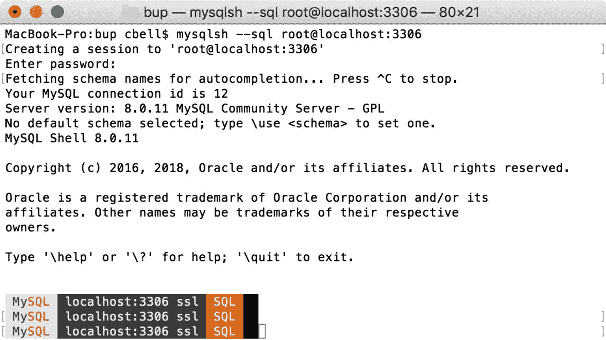
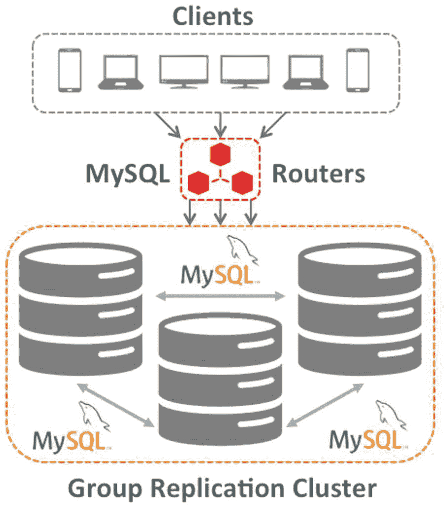

# 1.介绍 MySQL 8——一个新的开始

这是对 Oracle MySQL 工程师(以及 Oracle 本身)奉献精神的证明，MySQL 将继续通过新功能进行改进。MySQL 工程部门的动力是继续为互联网开发颠覆性的数据库技术。甲骨文不仅培养了这种进取精神，而且继续兑现其投资和扩展 MySQL 业务的承诺。最新版本 MySQL 8 最终证明了 Oracle 已经兑现了承诺，确保 MySQL 仍然是世界上最受欢迎的开源数据库系统。

自 MySQL 5.0 [<sup>1</sup>](#Fn1) 以来，MySQL 的早期版本增加了一些新的有趣的功能，使 MySQL 成为一个更好的产品。尽管这些特性已经被广泛接受并被用来解决很多问题，但这些变化在很大程度上是渐进的改进，而不是革命性的变化。

这种趋势不是 MySQL 独有的，在一个稳定、成熟的产品中也不罕见。这并不意味着进化发展是不好的——事实并非如此。然而，考虑到一些有竞争力的技术已经出现，MySQL 的工程师们意识到，如果他们想继续统治这个行业，他们必须达到更高和更远的目标。

因此，MySQL 的这个新版本打破了以前版本的许多模式，增加了新的、革命性的功能，改变了一些人使用 MySQL 的方式。事实上，仅版本号一项就从 5.x 跃升至 8.0 [<sup>2</sup>](#Fn2) ，这标志着技术复杂性的飞跃，也标志着持续了 13 年的 5.x 代码库开发的中断。

MySQL 8.0 的变化包括对现有功能的更改以及一些改变游戏规则的新功能。这本书研究了最重要和最新的特性之一:MySQL 文档存储。然而，还有其他同样重要的特性，如组复制和 InnoDB 集群。虽然我主要关注文档存储，但我也将看到如何利用这些其他特性来将您的 MySQL 安装带入未来。

MySQL—What Does it Mean?

MySQL 这个名字是一个专有名称和一个缩写的组合。SQL 是结构化查询语言。“我的部分”不是所有格形式——它是一个名称。在这种情况下，My 是创始人女儿的名字。至于发音，MySQL 专家发音为“My-S-Q-L”——而不是“我的续集”。

在这一章中，我将研究 MySQL 8 的一些新特性，包括对以前版本中的一些新兴技术的简短介绍，MySQL 8 独有的新特性，以及那些使 MySQL 8 成为迄今为止最伟大的 MySQL 版本的革命性特性。

Note

这本书基于 MySQL 8.0.11 版本，重点是文档存储。除了本章列出的功能之外，还有许多新功能。请务必查阅最新的 MySQL online MySQL 参考手册( [`https://dev.mysql.com/doc/refman/8.0/en/`](https://dev.mysql.com/doc/refman/8.0/en/) )以获得新增、更新和删除特性的完整列表。 [<sup>3</sup>](#Fn3)

这些新功能非常复杂。正如您将看到的，一些功能设计为协同工作，而其他功能设计为附加功能。下面几节不是解释每一个细节或列出特性和优点，而是介绍 MySQL 8 中目前可用的各种特性的基础，这样您就可以对可用特性有所了解。您还将看到新版本已经超越了传统的 MySQL 存储和检索机制。

让我们先来看看一些特性，这些特性是早期版本的一部分，但是现在已经过改进，并且更加全面地集成到了服务器中。

## 旧功能再创新

第一类特性包括 MySQL 5.7 中正在开发的特性，或者作为一个单独的实验性开发项目；一个插件；或者作为以后稳定版本的计划功能。因此，这些特性已经以某种有限的形式发布了。大多数被认为是“开发版本”,并附有免责声明，强烈建议不要在生产环境中使用。有些已经包含在服务器的最新发布候选(RC)版本中。

更确切地说，Oracle 将这些特性作为早期版本发布，以便系统和数据库管理员、信息技术架构师和其他规划者可以试用这些特性并提供反馈以帮助特性成熟。它还允许客户在开发环境的早期调整技术，以防功能需要对基础设施或应用进行更改。

What is a Plugin?

插件是向服务器添加功能的手段，而不必编译和重建服务器本身来合并新功能。插件技术已经存在很长时间了。事实上，MySQL 最初支持可插拔存储引擎，允许您动态添加和删除存储引擎选项。从那时起，MySQL 插件技术不断发展，但概念是相同的。只要插件与服务器版本兼容，就可以从 Oracle 下载 MySQL 插件并安装到您的服务器上立即使用。

插件也是 Oracle 将新特性发布到现有稳定版本中的一种便捷方式。例如，组复制等新功能已经作为插件引入(但包含在最新版本中)。即使一个插件是作为一个开发版本发布的(想想早期的测试版)，你仍然可以在服务器的兼容 GA 版本中使用它。这使得 Oracle 能够比必须将它们与主要的服务器版本捆绑在一起更快地产生特性。在组复制和类似技术的情况下，通过在接近创纪录的时间内向用户提供这些功能，节省了 Oracle 多年的开发工作。

MySQL 5.7 代码库中发展了几个特性。以下是我在本书中探索的一些关键特征。其中包括 JSON 数据类型和 MySQL Shell。

### JSON 数据类型

从 MySQL version 5.7.8 开始，MySQL 支持一种原生 JSON 数据类型，这种数据类型支持高效地访问表行中 JSON 文档中的数据。因此，您的表中可以有 JSON 数据类型的列。JSON 代表 JavaScript 对象符号。 [<sup>4</sup>](#Fn4) 新的 JSON 数据类型是使用 MySQL 作为文档存储的关键组件。简而言之，JSON 是一种用于交换数据的标记语言。它不仅可读，还可以直接在应用中使用，在其他应用、服务器甚至 MySQL 之间存储和检索数据。

Note

在这一节中，我将简要概述 JSON 数据类型和 JSON 文档。我在第三章中对 JSON 进行了深入的分析。

事实上，程序员对 JSON 很熟悉，因为它类似于其他标记方案。JSON 也非常简单，因为它只支持两种类型的结构:1)包含对(名称、值)的集合，以及 2)有序列表(或数组)。当然，您也可以混合和匹配一个对象中的结构。当我们创建一个 JSON 对象时，我们称之为 JSON 文档。

与 MySQL 中的普通数据类型不同，JSON 数据类型允许您将 JSON 格式的对象(文档)存储在一行的一列中。在一个表中可以有多个 JSON 列(字段)。虽然您可以用文本或 BLOB 字段来实现这一点(很多人都这样做)，但是 MySQL 中没有内置与文本和 BLOB 字段中的数据进行交互的功能。因此，数据的操作在很大程度上取决于应用。此外，数据的结构通常是每行都有相同的列“格式”。在文本和 BLOB 字段中存储数据并不新鲜，已经存在多年了。

这可以通过使用单个字符串甚至数据的二进制表示并将其存储在文本或 BLOB 字段中来实现。如果数据足够小，可以将它存储在 VARCHAR 和类似的 string 列中。为了以这种方式存储和检索数据，您必须编码然后解码数据——这可能很繁琐——尤其是如果您试图从其他人那里获取数据。

使用 JSON 数据类型，您不必编写专门的代码来存储和检索数据。这是因为 JSON 文档很好理解，并且许多编程环境和脚本语言本身就支持它。可以把 JSON 看作是 XML 文档的派生或扩展。也就是说，它们提供了一种灵活的方式来存储可能因应用而异的数据。JSON 允许你存储当时的数据。与典型的数据库表不同，您不必担心默认值(它们是不允许的)，也不必担心您是否有足够的列，甚至是主/从关系来将所有数据规范化并存储在一个漂亮、整洁、结构化的包中。

让我们来看一个可以存储在 MySQL 中的简单 JSON 文档。假设我们有一个联系人列表，其中每个联系人可能有也可能没有存档的地址，可能有也可能没有电子邮件、多个电话号码等等。如果您要创建一个典型的数据库表来存储这些信息，那么您可能会为只有一个姓名和一个电话号码的条目存储大量的空列。

事实上，我们可以随时添加新的数据项，而不必改变底层的表结构。例如，如果您发现以后需要在某些记录中添加一个 Skype Id，您可以在代码中添加您想要的条目的密钥，而不必返回并更改任何现有数据。唯一的问题是，读取数据的代码必须在访问它之前进行修改，以测试这个键是否存在。我在第 8 章[和第 9 章](08.html)[中给出了一个例子。](09.html)

让我们考虑一个示例联系人列表，它包含住在我的区域内为我提供服务的几个人。我需要存储的只是他们的姓名和电话号码。有时候，我只知道(或关心存储)他们的名字。我不需要他们的地址，因为我从来没有给他们寄过任何东西，毕竟他们就在这条街上。清单 [1-1](#Par28) 展示了一些条目可能的样子。我选择通过使用 SQL `INSERT`语句来演示 JSON 是什么样子，这样您就可以看到将非结构化数据插入数据库的一种方式。

```sql
INSERT INTO rolodex.contacts (contact_info) VALUES ('
{
  "name": "Allen",
  "phones": [
    {
      "work": "212-555-1212"
    }
  ]
}
');

INSERT INTO rolodex.contacts (contact_info) VALUES ('
{ "name": {
    "first": "Joe",
    "last": "Wheelerton"
  },
  "phones": [
    {
      "work": "212-555-1213"
    },
    {
      "home": "212-555-1253"
    }
  ],
  "address": {
      "street": "123 main",
      "city": "oxnard",
      "state": "ca",
      "zip": "90125"
  },
  "notes": "Excellent car detailer. Referrals get $20 off next detail!"
}
');

Listing 1-1Example of JSON Documents

```

请注意，我使用了一些带有换行符和空格的格式来使 JSON 更容易阅读。然而，这不是必须的。事实上，如果我们用 JSON 数据查询一个表，如清单 [1-1](#Par28) 中的行，我们会看到数据显示会有一点不同。清单 [1-2](#Par30) 显示了典型选择查询的输出。

```sql
mysql> SELECT * FROM rolodex.contacts \G
*************************** 1\. row ***************************
          id: 1
contact_info: {"name": "Allen", "phones": [{"work": "212-555-1212"}]}
*************************** 2\. row ***************************
          id: 2
contact_info: {"name": {"last": "Wheelerton", "first": "Joe"}, "notes": "Excellent car detailer. Referrals get $20 off next detail!", "phones": [{"work": "212-555-1213"}, {"home": "212-555-1253"}], "address": {"zip": "90125", "city": "oxnard", "state": "ca", "street": "123 main"}}
2 rows in set (0.00 sec)
Listing 1-2SELECT with JSON Columns

```

这不是很容易读懂，是吗？不要担心，因为您的应用可以很容易地接收这些数据(那些支持 JSON 的语言),所以没什么大不了的。

如果您想试验这个例子，您将需要创建结构和数据。在这种情况下，您将需要一个模式(想想数据库)和集合(想想表)。以下是创建模式和集合所需的 SQL 语句。但是，您通常不会对文档存储使用 SQL 语句，但是您可以使用，因为 MySQL 中集合的底层存储是一个特殊形式的表，如下所示。

```sql
CREATE DATABASE `rolodex`;
CREATE TABLE `rolodex`.`contacts` (
   `id` INT NOT NULL AUTO_INCREMENT,
   `contact_info` json DEFAULT NULL,
 PRIMARY KEY (`id`)
) ENGINE=InnoDB DEFAULT CHARSET=utf8mb4;

```

JSON 数据类型使您能够通过 MySQL 内置的对 JSON 文档的支持，以及通过 MySQL Shell、X 插件和 X 协议实现与 JSON 交互的附加工具，为您的数据存储增加灵活性。让我们看看 MySQL 外壳。

### MySQL Shell

MySQL Shell 是 MySQL 5.7 期间添加的另一个特性。在这种情况下，它是一种新的、独立的产品。MySQL Shell 是 MySQL 的下一代命令行客户端。您不仅可以执行传统的 SQL 命令，还可以使用包括 Python 和 JavaScript 在内的几种编程语言之一与服务器进行交互。此外，如果您还安装了 X 插件，那么您可以使用 MySQL Shell 来处理传统的关系数据以及 JSON 文档。这有多酷？

Tip

可以从 [`http://dev.mysql.com/downloads/shell/`](http://dev.mysql.com/downloads/shell/) 下载 MySQL Shell。

如果你在想，“是时候了！”Oracle 开发了新的 MySQL 客户端，你并不孤单。MySQL Shell 代表了一种大胆的与 MySQL 交互的新方式。有许多选项，甚至有不同的方式来配置和使用 shell。虽然我们将在第 4 章中看到更多关于 shell 的内容，但是让我们看看如何使用 shell 来执行前面显示的查询。图 [1-1](#Fig1) 显示了新 MySQL 外壳的快照。请注意，它提供了一个非常熟悉的界面，尽管更现代、更强大。



图 1-1

The MySQL Shell

清单 [1-3](#Par39) 展示了如何启动 shell 并执行显示结果的`SELECT`语句。请注意用于启动 shell 的命令。在这种情况下，我们指定希望以类似于 SQL 模式下旧客户端的方式使用 shell(`--sql`)。

```sql
$ mysqlsh -uroot --sql
Creating a session to 'root@localhost'
Enter password:
Your MySQL connection id is 281 (X protocol)
Server version: 8.0.11 MySQL Community Server (GPL)
No default schema selected; type \use <schema> to set one.
MySQL Shell 8.0.11

Copyright (c) 2016, 2018, Oracle and/or its affiliates. All rights reserved.

Oracle is a registered trademark of Oracle Corporation and/or its
affiliates. Other names may be trademarks of their respective
owners.

Type '\help' or '\?' for help; '\quit' to exit.

 MySQL  localhost:33060+ ssl  SQL > SELECT * FROM rolodex.contacts \G
*************************** 1\. row ***************************
doc: {"_id": "9801A79DE093991311E7FFCB243C3451", "name": {"first": "Allen"}, "phones": [{"work": "212-555-1212"}]}
_id: 9801A79DE093991311E7FFCB243C3451
*************************** 2\. row ***************************
doc: {"_id": "9801A79DE0939E0411E7FFCB243DCDE3", "name": {"last": "Wheelerton", "first": "Joe"}, "notes": "Excellent car detailer. Referrals get $20 off next detail!", "phones": [{"work": "212-555-1213"}, {"home": "212-555-1253"}], "address": {"zip": "90125", "city": "oxnard", "state": "ca", "street": "123 main"}}
_id: 9801A79DE0939E0411E7FFCB243DCDE3
2 rows in set (0.00 sec)
 MySQL  localhost:33060+ ssl  SQL > \exit
Bye!

Listing 1-3Querying JSON data in the MySQL Shell

```

Note

这些例子是在安装并启用了 X 插件的服务器上执行的。第 2 章演示了如何做到这一点。

虽然这确实很好，但它与旧客户端并没有太大的不同。让 shell 真正强大的是，您可以使用脚本语言来处理数据。清单 [1-4](#Par42) 展示了如何以 Python 模式(`--python`)启动 shell 并执行 Python 代码来检索相同的结果集。我还演示了一个很好的选项，它允许我们改进 JSON 输出格式(`--json=pretty).`啊哈，所以现在我们看到了在结果中查看 JSON 的一种更好的方式！这个选项确实有点冗长。为了清楚起见，我取消了一些更详细的输出。

```sql
$ mysqlsh -uroot --python --json=pretty
...
 MySQL  localhost:33060+ ssl  Py > \use rolodex
 MySQL  localhost:33060+ ssl  rolodex  Py > contacts = db.get_collection("contacts")
 MySQL  localhost:33060+ ssl  rolodex  Py > contacts.find()
{
    "documents": [
        {
            "_id": "9801A79DE093991311E7FFCB243C3451",
            "name": {
                "first": "Allen"
            },
            "phones": [
                {
                    "work": "212-555-1212"
                }
            ]
        },
        {
            "_id": "9801A79DE0939E0411E7FFCB243DCDE3",
            "address": {
                "city": "oxnard",
                "state": "ca",
                "street": "123 main",
                "zip": "90125"
            },
            "name": {
                "first": "Joe",
                "last": "Wheelerton"
            },
            "notes": "Excellent car detailer. Referrals get $20 off next detail!",
            "phones": [
                {
                    "work": "212-555-1213"
                },
                {
                    "home": "212-555-1253"
                }
            ]
        }
    ],
    "executionTime": "0.00 sec",
    "warningCount": 0,
    "warnings": []
}
 MySQL  localhost:33060+ ssl  rolodex  Py > \exit
Bye!
Listing 1-4Using the MySQL Shell with Python

```

好了，现在我们开始看到 shell 在多大程度上改变了我们的 MySQL 体验。请注意，输出被格式化，以便更好地阅读，我们使用的命令与之前的 SQL 命令有很大不同。如果您认为这看起来像应用代码，那么您的思路是正确的！我们将在第 4 章中看到更多关于 MySQL Shell 的内容。现在让我们通过研究新的 X 插件和 X 协议来发现是什么让 shell 变得强大。

### X 插件、X 协议和 X DevAPI

MySQL 引入了新的协议和 API 来处理 JSON 文档。除了支持 JSON 数据类型，我们还有三种以简单名称“X”为前缀的技术:X 插件、X 协议和 X DevAPI。X 插件是一个启用 X 协议的插件。X 协议被设计成使用 X DevAPI 与服务器通信。X DevAPI 是一个应用编程接口，它允许你为 MySQL 开发 NoSQL 解决方案，并把 MySQL 作为一个文档库。

I Know SQL, But What Is NoSQL?

如果您曾经使用过关系数据库系统，那么您无疑非常熟悉 SQL(结构化查询语言)，在 SQL 中，我们使用特殊的语句(命令)来与数据进行交互。事实上，大多数数据库系统都有自己的 SQL 版本，其中包括操作数据的命令(DML 数据操作语言)以及定义存储数据的对象(DDL 数据定义语言)甚至管理服务器的管理命令。 [<sup>5</sup>](#Fn5)

也就是说，您得到的结果集必须使用命令来搜索数据，然后将结果转换为内部编程结构，使数据看起来像是一个辅助组件，而不是解决方案的一个组成部分。NoSQL 接口打破了这种模式，它允许您使用 API(应用编程接口)来处理数据。更具体地说，你使用编程接口而不是基于命令的接口。

不幸的是，根据你的观点，NoSQL 可能意味着很多事情，包括“非 SQL”、“不仅仅是 SQL”或者“非关系”但是它们都是指这样一个事实，即你所使用的机制不是基于命令的接口，这个术语的大多数用法都表明你在使用编程接口。对于 MySQL 8，可以通过 SQL 或 NoSQL 使用 X 协议访问 JSON 文档，通过 X 插件访问 X DevAPI。

X 插件是 Oracle 如何利用插件技术来实现新特性的一个很好的例子。在这种情况下，X 插件是服务器内部的一个网关，允许使用 X 协议进行通信。MySQL X 插件是服务器自带的，默认情况下是启用的。如果您有一个旧版本的 MySQL Server，您可以使用 MySQL Shell 通过以下命令来启用插件。

```sql
$ mysqlsh -u root -h localhost --mysql --dba enableXProtocol
Creating a Classic session to 'root@localhost'
Enter password:
Your MySQL connection id is 527
Server version: 8.0.11 MySQL Community Server (GPL)
No default schema selected; type \use <schema> to set one.
enableXProtocol: X Protocol plugin is already enabled and listening for connections on port 33060

```

任何支持 X 协议的客户机(不仅仅是 MySQL Shell)都可以使用相关的 X DevAPI 将 MySQL 用作文档存储。事实上，X 协议旨在将 MySQL 的 ACID(原子性、一致性、隔离性和持久性)兼容存储能力作为文档存储来公开，使您能够对 JSON 文档执行创建、读取、更新和删除(CRUD)操作。X 协议还支持 MySQL 的普通 SQL 接口，因此您可以构建使用 SQL 和 NoSQL 接口的应用！

您可能想知道 shell 和插件是如何与服务器交互的。图 [1-2](#Fig2) 展示了组件是如何“堆叠”的


图 1-2

X Protocol stack

注意，shell 允许使用 X DevAPI，它通过 X 插件与服务器进行通信。因此，X Plugin 是一种由 X Protocol 和 X DevAPI 组成的真正的使能技术。

现在我们已经了解了将 MySQL 用作文档存储的技术，让我们看看 InnoDB 存储引擎在最近的版本中有什么变化。

### InnoDB 改进

自 MySQL 5.6 以来，InnoDB 一直是 MySQL 的旗舰存储引擎(也是默认引擎)。Oracle 已经慢慢脱离了多存储引擎模型，该模型专注于现代数据库服务器应该做的事情—支持事务性存储机制。InnoDB 是满足这一需求的答案。

What is a Storage Engine?

存储引擎是一种以各种方式存储数据的机制。例如，有一个存储引擎允许您与逗号分隔值(文本)文件(CSV)进行交互，另一个为写日志文件(归档)进行了优化，一个只在内存中存储数据(内存)，甚至还有一个根本不存储任何东西(黑洞)。您可以通过使用`ENGINE=`表格选项将它们用于您的表格。除了 InnoDB，MySQL 服务器还附带了 Archive、Blackhole、CSV、Memory 和 MyISAM 存储引擎。InnoDB 存储引擎是唯一支持事务的引擎。有关其他存储引擎的更多信息，包括每个引擎的功能以及如何使用它们，请参见在线 MySQL 参考手册中的“备选存储引擎”一节。

在早期，InnoDB 是一家独立的公司，因此是一款独立的产品，既不是 MySQL 的一部分，也不属于 MySQL AB(MySQL 的最初所有者，现在完全归 Oracle 所有)。最终，Oracle 同时拥有了 InnoDB 和 MySQL，因此将两者结合起来是有意义的，因为它们具有相互包容的目标。尽管仍然有一个独立的 InnoDB 工程团队，但他们已经与核心服务器开发团队完全集成。

这种紧密集成带来了 InnoDB 的许多改进，包括大量性能增强。这在 InnoDB 如何随着这些改进而继续发展的过程中显而易见。

自 5.6 版本以来，改进的列表不断增加，尽管大多数改进相当细微，从某种意义上说，您不会注意到它们(除了通过更好的性能和可靠性，这是不可轻视的)，但大多数都显示出致力于使 InnoDB 成为最佳的事务存储机制，并通过扩展 MySQL 成为强大的事务数据库系统。下面列出了 MySQL 8 中对 InnoDB 的一些更有趣的改进。其中一些可能看起来非常深奥，但是那些已经优化或调整了 InnoDB 安装的人在计划迁移到 MySQL 8 时可能需要注意这些。这里没有列出的是可靠性和性能方面的几十个小改进。

*   崩溃恢复:如果索引树损坏，InnoDB 会将损坏标志写入重做日志。这使得损坏标志崩溃安全(它不会在强制重启时丢失)。同样，InnoDB 还会在每个检查点上写一个内存损坏标志。当启动崩溃恢复时，InnoDB 可以读取这些标志，并使用它们来调整恢复操作。
*   InnoDB memcached 插件:通过允许在单个 memcached 查询中提取多个(键，值)对得到了改进。
*   死锁检测:有几个新的选项，但是最有前途的包括一个动态配置死锁检测的选项(`innodb_deadlock_detect`)。这可以为高使用率系统提供额外的调优控制，在这些系统中，死锁检测会降低性能。
*   新的 INFORMATION_SCHEMA 视图:InnoDB 有新的视图，包括:
    *   `INNODB_CACHED_INDEXES`用于发现每个索引在 InnoDB 缓冲池中缓存的索引页数。
    *   `INNODB_TABLESPACES_BRIEF`用于查看表空间的空间、名称、路径、标志和空间类型。
*   `AUTO_INCREMENT`:自动递增字段有几处小的改进，包括以下内容:
    *   当前最大自动增量值现在在服务器重新启动后保持不变。
    *   重启不再取消`AUTO_INCREMENT =` `N`工作台选项的效果。
    *   紧随`ROLLBACK`操作之后的服务器重启不再导致分配给回滚事务的自动增量值的重用。
    *   将一个`AUTO_INCREMENT`列值设置为大于当前最大值的值是持久的，以后的新值(比如重启后)以新的更大的值开始。
*   临时表:所有临时表现在都在名为`ibtmp1`的共享临时表空间中创建。

虽然这个列表似乎只关注一些小的改进，但是其中一些对于寻求帮助来调整和规划数据库服务器安装的系统管理员来说非常重要。如果您想了解更多关于这些改进的信息，或者查看所有最新变化的列表，请参阅在线 MySQL 参考手册。 [<sup>6</sup>](#Fn6)

我还应该注意到，随着 MySQL 8 的成熟和新特性的增加，这个列表很可能会增加。事实上，InnoDB 集群就是我们在“InnoDB 集群”一节中讨论的一个新特性

下一节将描述 MySQL 8 新增的和独有的特性。

## 新功能

除了那些在 5.7 服务器版本中开发的特性之外，还有一些 MySQL 8 独有的特性。也就是说，它们目前还没有(甚至没有可能被合并到)旧版本中。这部分是因为服务器代码库为了适应新特性而做了大量的修改。MySQL 8.0 中的新特性包括新的数据字典和新的账户管理系统。

Note

有些功能可以作为插件单独下载，您可以安装，并可能以不同于服务器的评级单独发布。有些，比如组复制，也可以和 MySQL 5.7 一起使用。

### 数据字典

如果你曾经使用 MySQL 试图获得数据库中包含的对象的信息；无论是发现哪些对象在那里，搜索具有特定名称前缀的对象，还是试图发现存在哪些索引，您都有可能不得不访问`mysql`数据库中的大量表，或者不得不浏览`INFORMATION_SCHEMA`中的视图。

尽管这是多年来的默认设置，但这种机制存在许多问题。最值得注意的是，找东西没有简单的方法(你必须“学习”东西在哪里，然后如何搜索它们)。更重要的是，因为数据是在非事务性的表(和元数据文件)中，所以这些机制不是事务性的，并且，通过扩展，不是崩溃安全的。

事实上，许多 MySQL 数据库管理员通过恢复`mysql`数据库中的数据、修复损坏或丢失的`.frm`文件，以及许多其他可以访问大型 MySQL 安装的小问题来获得薪水。令人高兴的是，随着数据字典的加入，那些日子一去不复返了！

What’s An Frm File?

如果您检查 MySQL 版和更低版本安装的数据目录，您将看到一个名为 data 的文件夹，其中包含为每个创建的数据库命名的子文件夹。在这些文件夹中，您将看到以表名和文件扩展名`.frm`命名的文件。许多 MySQL 开发人员称这些文件为“FRM 文件”该文件是一个特殊格式的二进制文件，描述了表的格式(定义)。因此，`database1`中一个名为`table1`的表有一个名为`/data/database1/table1.frm`的 FRM 文件。

遗憾的是，因为 FRM 文件是二进制文件，它们无法通过正常方式读取。事实上，格式多年来一直是个谜(它使用了一种叫做 Unireg 的布局)。因为 FRM 文件包含表的元数据，所以所有列定义和表选项(包括索引定义)都存储在该文件中。这意味着应该可以从 FRM 文件中提取重建 CREATE TABLE 语句所需的数据。不幸的是，考虑到 Unireg 的接口和唯一性，要解析这些文件中的信息并不容易。

幸运的是，您可以通过 MySQL Utilities 产品中的 Python 工具解密 FRM 文件。如果您需要读取一个 FRM 文件来恢复一个表，请参阅在线 MySQL 实用程序文档了解更多详细信息: [`http://dev.mysql.com/doc/mysql-utilities/1.6/en/utils-task-get-structure.html`](http://dev.mysql.com/doc/mysql-utilities/1.6/en/utils-task-get-structure.html) `.`

您可能会觉得奇怪甚至有点奇怪的是，数据字典的实现是隐藏的，而且非常隐蔽。也就是说，数据字典表是不可见的，不能直接访问。您不会很容易找到数据字典表(尽管如果您足够努力的话是有可能的)。这样做主要是为了使数据字典崩溃安全，并且您不必进行管理。幸运的是，您可以通过`INFORMATION_SCHEMA`数据库甚至是`SHOW`命令来访问存储在数据字典中的信息。`mysql`数据库仍然存在，但它主要包含额外的信息，如时区、帮助和类似的非重要信息。

Tip

当您计划从 MySQL 的旧版本升级时，数据字典是您必须了解的关键因素之一。我在第 10 章中研究了这些问题。

有关数据字典的更多信息，请参见在线 MySQL 参考手册中的“MySQL 数据字典”一节。

添加数据字典最终使得许多人一段时间以来一直想实现的许多特性成为可能。最新的变化之一是账户管理的变化。

### 账户管理

如果您曾经管理过一个 MySQL 数据库服务器(或许多服务器)，那么您可能会遇到这样的情况:您需要为一组用户分配相同的权限。例如，您的服务器可能支持多个应用或数据库，这些应用或数据库具有对数据库对象具有特定权限的用户组。在大多数情况下，精明的数据库管理员(DBA)会复制一份用户权限(通常以`GRANT`语句的形式),以便在需要创建另一个具有相同权限的用户时可以重用它们。

虽然 MySQL Utilities 产品有一个 Python 实用程序来帮助管理这种单调乏味的工作(参见 [`http://dev.mysql.com/doc/mysql-utilities/1.6/en/`](http://dev.mysql.com/doc/mysql-utilities/1.6/en/) 中的`mysqluserclone`)，但是必须创建几十个不同“类型”的用户可能是一个相当大的挑战。真正需要的是一种创建角色并为角色定制权限，然后将角色授予用户的方法。幸运的是，随着数据字典的出现，MySQL 中的支持角色在 MySQL 8 中已经成为现实！

可以创建、删除角色，授予或撤销权限。我们还可以向用户授予角色或从用户处撤销角色。角色最终使得管理 MySQL 上的用户账户变得更加简单。有关角色的更多信息，请参见在线 MySQL 参考手册中的使用角色。

服务器中的 SSL(安全套接字层)支持也发生了变化。

## 删除了选项、变量和功能

关于 MySQL 8，您可能注意到的第一件事是启动选项、变量等的许多小变化。幸运的是，其中大部分都与支持最新功能和删除旧的和过时的设置有关。此外，许多在 MySQL 5.7(及更早版本)中被标记为不推荐使用的选项、变量和特性在 MySQL 8 中被正式删除。MySQL 8 中移除的一些更熟悉的项目包括。

*   `--bootstrap`:用于控制服务器如何启动，通常用于创建 MySQL 权限表，而无需启动完整的 MySQL 服务器。
*   `--innodb_file_format_*`:用于配置 InnoDB 存储引擎的文件格式。
*   `--partition`和- `skip partition`:用于控制 MySQL 服务器中的用户自定义分区支持。

新数据字典的结果之一是不再需要`.frm`文件(FRM)。因为数据字典包含关于所有数据库中每个对象的所有信息，这些数据库以可靠的、可恢复的存储机制托管，所以不再需要将这样的信息存储在单独的文件中。对于我们这些经常与 FRM 文件丢失或损坏的服务器进行斗争或试图修复该服务器时遇到独特挫折的人来说，删除 FRM 文件是一个早就应该做的事情，也是最受欢迎的遗漏。

对于使用 SSL 的人来说，一个可能需要关注的地方是删除了一些 SSL 选项，并引入了一个新的身份验证插件(`caching_sha2_password`)来提高安全连接。8.0.4 版中引入了新的身份验证插件。如果需要的话，大多数安装包会让您选择旧的身份验证方法，但是强烈建议您使用新的身份验证插件。

错误代码是您将看到一些变化的另一个方面。在最新版本中，许多错误代码都进行了更改，包括删除了几十个鲜为人知的错误代码。如果您的应用使用 MySQL 服务器错误代码，您应该检查文档以确保错误代码没有被更改或删除。

还有许多小项目被删除，包括 mysql_plugin 实用程序、 [<sup>7</sup>](#Fn7) 嵌入式服务器(`libmysqld`)、通用分区引擎(InnoDB 现在有原生分区)、脚本`mysql_install_db`(这已被替换为`--initialize`选项)等等。

正如我在前面几节中提到的，随着更多特性的成熟和添加，MySQL 8 中删除的特性列表可能会增加。如果您已经定义了调优过程、存储过程、DevOps、 [<sup>8</sup>](#Fn8) 或其他使用选项和变量或与之交互的机制，您应该仔细检查 MySQL 8 文档中的条目，以确保您可以修改您的工具。

Tip

参见 [`http://dev.mysql.com/doc/refman/8.0/en/added-removed-variables-options.html`](http://dev.mysql.com/doc/refman/8.0/en/added-removed-variables-options.html) 获取 MySQL 8 中要删除的特性的完整列表。

## 范式转变特征

当 MySQL 工程师和产品管理团队决定开发突破性的高可用性功能和存储非结构化数据的新方法时，他们知道他们正在做的事情将极大地改变 MySQL 世界。

在这一节中，我们将看到两个高可用性特性，它们将以一种全新的、引人注目的方式改变 MySQL 的高可用性。我们还将看到新的结构化存储机制将如何改变您可以存储的内容，以及您如何与 MySQL 进行交互，以便为数据可能发生变化的应用存储数据，从而使您的应用无需重新构建存储层即可适应变化。

让我们从高可用性解决方案开始。

### 组复制

如果您使用过 MySQL 复制，那么您无疑非常熟悉如何在构建高可用性解决方案时利用它。事实上，您很可能已经发现了许多使用 MySQL 复制来提高应用可用性的方法。

What Is Replication? And How Does it Work?

MySQL 复制是一个易于使用的特性，也是 MySQL 服务器的一个复杂和主要的组件。本节提供了复制的鸟瞰图，目的是解释它是如何工作的以及如何设置一个简单的复制拓扑。有关复制及其众多特性和命令的更多信息，请参见在线 MySQL 参考手册( [`http://dev.mysql.com/doc/refman/8.0/en/replication.htm` l](http://dev.mysql.com/doc/refman/8.0/en/replication.html) )。

复制需要两台或更多服务器。必须将一台服务器指定为源服务器或主服务器。主角色意味着对数据的所有数据更改(写入)都发送到主服务器，并且只发送到主服务器。拓扑中的所有其他服务器维护主数据的副本，并且根据设计和要求是只读服务器。因此，当您的传感器发送数据进行存储时，它们会将数据发送给主设备。您编写的使用传感器数据的应用可以从从属服务器读取这些数据。

复制机制使用一种称为二进制日志的技术，该技术以一种特殊的格式存储更改，从而保留所有更改的记录。这些变化然后被运送到从设备并在那里执行。因此，一旦从机执行了更改(称为事件)，从机就拥有了数据的精确副本。

主服务器维护更改的二进制日志，从服务器维护该二进制日志的副本，称为中继日志。当从设备向主设备请求数据更改时，它从主设备读取事件并将它们写入其中继日志；然后，从属线程中的另一个线程执行中继日志中的那些事件。可以想象，从主服务器上发生更改到从服务器上发生更改会有一点延迟。幸运的是，除了在高流量(大量变化)的拓扑中，这种延迟几乎是不明显的。

此外，显而易见的是，您的高可用性需求和解决方案扩展得越多(复杂性越大)，您就越需要采用更好的方法来管理节点丢失、数据完整性和集群的一般维护(复制数据的服务器组—有时称为副本集)。事实上，大多数高可用性解决方案已经超越了基本的主服务器和从服务器拓扑，发展成为由服务器集群组成的层。有些公司复制了一部分数据，以提高吞吐量和实现分区存储。所有这些导致许多人发现他们需要更多的 MySQL 复制。Oracle 通过组复制满足了这些需求以及更多需求。

组复制于 2016 年 12 月作为 GA 发布，以插件的形式与服务器捆绑在一起。虽然它是一个 GA 版本，但我在这里将它列为一个范式转换特性，因为它提供了允许 MySQL 高可用性远远超出原始 MySQL 复制特性范围的承诺，从而使 MySQL 8 成为高可用性数据库解决方案中的一个重要组件。

Note

我只涉及组复制的最基本的内容，以便让您了解它的复杂性和好处。对使用组复制及其实现的深入探究超出了本书的范围。

组复制使拓扑最终同步复制(在属于同一组的节点之间)成为现实，而现有的 MySQL 复制特性是异步的(或至多是半同步的)。因此，可以提供更好的高可用性保证，因为事务以相同的顺序交付给所有成员(尽管在被接受后在每个成员中以自己的速度应用)。

组复制是通过分布式状态机来实现的，在分配给组的服务器之间有很强的协调性。这种通信允许服务器在组内自动协调复制。更具体地说，组维护成员关系，以便服务器之间的数据复制在任何时间点都是一致的。即使从组中删除了服务器，当添加它们时，一致性也会自动启动。此外，对于离线或变得不可达的服务器，还有一个故障检测机制。图 [1-3](#Fig3) 显示了您将如何在我们的应用中使用组复制来实现高可用性。



图 1-3

Using Group Replication with applications for high availability (Courtesy of Oracle)

请注意，组复制可以与 MySQL 路由器一起使用，以允许您的应用拥有一个与集群隔离的层。当我们研究 InnoDB 集群时，我们将会对路由器有所了解。

组复制和标准复制的另一个重要区别是，组中的所有服务器都可以参与更新数据，并自动解决冲突。是的，您不再需要精心设计您的应用来发送写入(更新)到特定的服务器！但是，您可以将组复制配置为只允许一台服务器(称为主服务器)进行更新，其他服务器充当辅助服务器或备份服务器(用于故障转移)。

所有这些功能以及更多功能都是通过组复制中内置的三种特定技术实现的:组成员资格、故障检测和容错。 [<sup>9</sup>](#Fn9)

*   组成员资格:这管理服务器是否是活动的(在线的)以及是否加入到组中。此外，确保组中的每台服务器都有一致的成员集视图。也就是说，每个服务器都知道组中服务器的完整列表。当服务器添加到组中时，组成员资格服务会自动重新配置成员资格。
*   故障检测:一种机制，能够发现并报告哪些服务器离线(不可达)并被认为是死的。故障检测器是一种分布式服务，它允许组中的所有服务器测试假定失效服务器的状况，这样，组就可以确定服务器是否不可达(失效)。这允许该组通过协调排除故障服务器的过程来自动重新配置。
*   容错:该服务使用 Paxos [<sup>10</sup>](#Fn10) 分布式算法的实现来提供服务器之间的分布式协调。简而言之，该算法允许在组内自动提升角色，以确保组保持一致(数据一致且可用)，即使一个(或几个)服务器出现故障或离开组。与类似的容错机制一样，失败(失败的服务器)的数量是有限的。目前，组复制容错被定义为 n = 2f + 1，其中 n 是容忍 f 个故障所需的服务器数量。例如，如果您希望容忍多达 5 台服务器出现故障，则该组中至少需要 11 台服务器。

虽然组复制是一个插件，但它现在与 MySQL 5.7(从 5.7.17 版本开始)和 MySQL 8 的服务器安装捆绑在一起。 [<sup>11</sup>](#Fn11)

Tip

要了解有关内部机制、设计、实现以及如何设置和使用组复制的更多信息，请参见位于 [`http://mysqlhighavailability.com/mysqlha/gr/doc/index.html`](http://mysqlhighavailability.com/mysqlha/gr/doc/index.html) 的开发人员文档。

与其单独演示组复制，不如在下一节研究另一个名为 InnoDB Cluster 的新特性时，让我们看看这个特性有多强大。正如您将在 InnoDB Cluster 的演示中看到的，组复制易于使用，并且当作为 InnoDB Cluster 的一部分时，这两种技术以最显著的方式改变了我们使用 MySQL 复制的方式。

### InnoDB 集群

另一个新出现的特性叫做 InnoDB 集群。它旨在使高可用性更易于设置、使用和维护。InnoDB Cluster 通过 MySQL Shell 和管理 API、组复制以及 MySQL 路由器 [<sup>12</sup>](#Fn12) 与 X AdminAPI 协同工作，将高可用性和读取可扩展性提升到一个新的水平。也就是说，它将 InnoDB 中用于克隆数据的新功能与组复制、MySQL Shell 和 MySQL 路由器相结合，提供了一种设置和管理高可用性的新方法。

Note

AdminAPI 是一个特殊的 API，可通过 MySQL Shell 进行配置并与 InnoDB 集群交互。因此，Admin API 具有旨在使使用 InnoDB Cluster 更容易的特性。

在此使用案例中，群集设置有一个主节点(在标准复制术语中称为主节点)，它是所有写入(更新)的目标。多个辅助服务器(从属服务器)维护数据的副本，这些副本可以被读取，因此能够在不给主服务器增加负担的情况下读取数据，从而实现读取可伸缩性(但是所有服务器都参与协商和协调)。组复制的引入意味着集群是容错的，并且组成员是自动管理的。MySQL 路由器缓存 InnoDB 集群的元数据，并执行到 MySQL 服务器实例的高可用性路由，从而更容易编写应用来与集群进行交互。

您可能想知道这与标准复制的读出可伸缩性设置有何不同。从高层次来看，这些解决方案似乎正在解决同一个用例。但是，使用 InnoDB Cluster，您可以从 MySQL Shell 创建、部署和配置集群中的服务器，从而提供一个易于管理的完整的高可用性解决方案。也就是说，您可以通过 shell 使用 InnoDB Cluster AdminAPI，使用 JavaScript 或 Python 以编程方式创建和管理 InnoDB 集群。

现在让我们来看看这些新技术的应用。接下来是部署三台服务器的演示，在新的 MySQL Shell 中使用 JavaScript 命令通过组复制将它们配置为一个集群。虽然这听起来很费力，但实际上并不困难，而且非常容易。

Note

以下命令是在安装了 MySQL 8.0.11、InnoDB Cluster 和 MySQL 路由器的系统上使用 InnoDB Cluster 运行的。

让我们从启动 shell 并使用 AdminAPI 部署三台服务器开始。在这种情况下，我们将使用`dba`对象中的`deploySandboxInstance()`方法为每个服务器创建新的实例。所有这些都将在我们的本地主机上运行。清单 [1-5](#Par139) 展示了如何部署三台服务器。我突出显示了用于帮助从消息中识别命令的命令。

```sql
$ mysqlsh
MySQL Shell 8.0.11

Copyright (c) 2016, 2018, Oracle and/or its affiliates. All rights reserved.

Oracle is a registered trademark of Oracle Corporation and/or its
affiliates. Other names may be trademarks of their respective
owners.

Type '\help' or '\?' for help; '\quit' to exit.

 MySQL  JS > dba.deploySandboxInstance(3307)
A new MySQL sandbox instance will be created on this host in
/Users/cbell/mysql-sandboxes/3307

Please enter a MySQL root password for the new instance:
Deploying new MySQL instance...

Instance localhost:3307 successfully deployed and started.
Use shell.connect('root@localhost:3307'); to connect to the instance.

 MySQL  JS > dba.deploySandboxInstance(3308)
A new MySQL sandbox instance will be created on this host in
/Users/cbell/mysql-sandboxes/3308

Please enter a MySQL root password for the new instance:
Deploying new MySQL instance...

Instance localhost:3308 successfully deployed and started.
Use shell.connect('root@localhost:3308'); to connect to the instance.

 MySQL  JS > dba.deploySandboxInstance(3309)
A new MySQL sandbox instance will be created on this host in
/Users/cbell/mysql-sandboxes/3309

Please enter a MySQL root password for the new instance:
Deploying new MySQL instance...

Instance localhost:3309 successfully deployed and started.
Use shell.connect('root@localhost:3309'); to connect to the instance.

 MySQL  JS >

Listing 1-5Creating Local Server Instances

```

请注意，本文解释了我们正在使用沙箱，这个术语适用于在本地主机上的一个特殊目录中运行服务器:用户主目录中的 mysql-sandboxes 文件夹。特别是在这种情况下，我们使用`/Users/cbell/mysql-sandboxes`。请注意，我们现在有三台服务器运行在端口 3307、3308 和 3309 上。还要注意，shell 将提示您输入新密码。

Tip

JavaScript 是区分大小写的，所以要确保对变量、对象和方法使用正确的拼写。也就是说，名为`abc`的变量与名为`Abc`的变量不同。

我们需要做的下一件事是设置一个新的集群。我们用`dba`对象中的`createCluster()`方法来实现这一点。但是首先，我们必须连接到我们希望作为主服务器的服务器。清单 [1-6](#Par143) 展示了如何创建集群。请注意，这是我们的 shell 会话的延续，演示了如何创建新的集群。

```sql
MySQL  JS > \connect root@localhost:3307
Creating a session to 'root@localhost:3307'
Enter password:
Your MySQL connection id is 12
Server version: 8.0.11 MySQL Community Server (GPL)
No default schema selected; type \use <schema> to set one.
 MySQL  localhost:3307 ssl  JS > my_cluster = dba.createCluster('my_cluster')
A new InnoDB cluster will be created on instance 'root@localhost:3307'.

Creating InnoDB cluster 'my_cluster' on 'root@localhost:3307'...
Adding Seed Instance...

Cluster successfully created. Use Cluster.addInstance() to add MySQL instances.
At least 3 instances are needed for the cluster to be able to withstand up to
one server failure.

<Cluster:my_cluster>

Listing 1-6Creating a Cluster in InnoDB Cluster

```

注意，我们将集群命名为`my_cluster`，并使用同名的变量来存储从`createCluster()`方法返回的对象。请注意，我们连接的第一台服务器已经成为主服务器。

接下来，我们使用新的`my_cluster`对象的`addInstance()`添加另外两个服务器实例来完成集群。这些服务器自动成为组中的辅助服务器(从属服务器)。清单 [1-7](#Par146) 展示了如何将实例添加到集群中。

```sql
MySQL  localhost:3307 ssl  JS > my_cluster = dba.getCluster('my_cluster')
<Cluster:my_cluster>
MySQL  localhost:3307 ssl  JS > my_cluster.addInstance('root@localhost:3308')
A new instance will be added to the InnoDB cluster. Depending on the amount of data on the cluster this might take from a few seconds to several hours.

Please provide the password for 'root@localhost:3308':
Adding instance to the cluster ...

The instance 'root@localhost:3308' was successfully added to the cluster.

 MySQL  localhost:3307 ssl  JS > my_cluster.addInstance('root@localhost:3309')
A new instance will be added to the InnoDB cluster. Depending on the amount of data on the cluster this might take from a few seconds to several hours.

Please provide the password for 'root@localhost:3309':
Adding instance to the cluster ...

The instance 'root@localhost:3309' was successfully added to the cluster.

Listing 1-7Adding Instances to the Cluster

```

一旦创建了集群并添加了实例，我们就可以使用我们的`my_cluster`对象的`status()`方法来获取集群的状态，如清单 [1-8](#Par148) 所示。

```sql
MySQL  localhost:3307 ssl  JS > my_cluster.status()
{
    "clusterName": "my_cluster",
    "defaultReplicaSet": {
        "name": "default",
        "primary": "localhost:3307",
        "ssl": "REQUIRED",
        "status": "OK",
        "statusText": "Cluster is ONLINE and can tolerate up to ONE failure.",
        "topology": {
            "localhost:3307": {
                "address": "localhost:3307",
                "mode": "R/W",
                "readReplicas": {},
                "role": "HA",
                "status": "ONLINE"
            },
            "localhost:3308": {
                "address": "localhost:3308",
                "mode": "R/O",
                "readReplicas": {},
                "role": "HA",
                "status": "ONLINE"
            },
            "localhost:3309": {
                "address": "localhost:3309",
                "mode": "R/O",
                "readReplicas": {},
                "role": "HA",
                "status": "ONLINE"
            }
        }
    }
}
 MySQL  localhost:3307 ssl  JS > \exit
Bye!
Listing 1-8Getting the Status of the Cluster

```

至此，我们已经了解了 InnoDB Cluster 如何设置服务器并将它们添加到组中。您在幕后看不到的是所有的组复制机制—您可以免费获得它们！这有多酷？

现在我们有了一个集群，我们还需要做一件事来使应用能够使用组复制的容错功能。也就是说，即使其中一个服务器出现故障，我们也需要能够连接到集群并与 MySQL 交互。请注意，因为我们只有三台服务器，所以只能容忍一个故障。例如，求解组复制容忍的故障数量中的`f`，我们得到`3 = 2` `f` `+ 1`或`f` `= 1`。

我们现在必须使用 MySQL 路由器来管理应用的连接。虽然我们没有一个应用来演示，但是我们可以使用 shell 来看到这一点。现在让我们看看设置路由器有多简单。清单 [1-9](#Par152) 显示了如何在引导模式下启动路由器。请注意，通过连接到集群，路由器会自动获取该组的成员。回想一下上一节，这是通过成员服务进行组复制的原则之一。

```sql
& mysqlrouter --bootstrap localhost:3307 --user=cbell
Please enter MySQL password for root:

Bootstrapping system MySQL Router instance...
MySQL Router  has now been configured for the InnoDB cluster 'my_cluster'.

The following connection information can be used to connect to the cluster.

Classic MySQL protocol connections to cluster 'my_cluster':

- Read/Write Connections: localhost:6446

- Read/Only Connections: localhost:6447

X protocol connections to cluster 'my_cluster':

- Read/Write Connections: localhost:64460

- Read/Only Connections: localhost:64470

& mysqlrouter &

Listing 1-9Setting Up the MySQL Router

```

好了，现在路由器开始运行了。如果集群中的某个服务器发生问题，我们的应用可以使用路由器的特性来自动重新路由我们的应用连接。

让我们来看一个这个特性的简短演示。在这种情况下，我们将使用 shell 通过端口 6446 上的路由器连接到集群，如清单 [1-9](#Par152) 所示。我们使用此端口是因为路由器用于自动转发连接。也就是说，如果我们连接的服务器出现故障，例如端口 3307 上的服务器，我们不必重新启动应用来重新连接到另一个端口上的服务器。因此，路由器为我们路由通信。让我们来看看实际情况。

清单 [1-10](#Par156) 演示了如何通过路由器连接到集群。我们在 shell 中切换到 SQL 模式，并使用 SQL 命令查看我们所连接的服务器端口。然后我们切换回 JavaScript 并使用 AdminAPI 来终止实例。然后，我们再次尝试发出 SQL 命令，现在注意到，一旦 shell 自动重新连接，我们现在就连接到了另一个服务器。酷！

```sql
$ mysqlsh --uri root@localhost:6446 --sql
Creating a session to 'root@localhost:6446'
Enter password:
Your MySQL connection id is 47
Server version: 8.0.11 MySQL Community Server (GPL)
No default schema selected; type \use <schema> to set one.
MySQL Shell 8.0.11

Copyright (c) 2016, 2018, Oracle and/or its affiliates. All rights reserved.

Oracle is a registered trademark of Oracle Corporation and/or its
affiliates. Other names may be trademarks of their respective
owners.

Type '\help' or '\?' for help; '\quit' to exit.

 MySQL  localhost:6446 ssl  SQL > SELECT @@port;
+--------+
| @@port |
+--------+
|   3307 |
+--------+
1 row in set (0.00 sec)
 MySQL  localhost:6446 ssl  SQL > \js
Switching to JavaScript mode...
 MySQL  localhost:6446 ssl  JS > dba.killSandboxInstance(3307)
The MySQL sandbox instance on this host in
/Users/cbell/mysql-sandboxes/3307 will be killed

Killing MySQL instance...

Instance localhost:3307 successfully killed.

 MySQL  localhost:6446 ssl  JS > \sql
Switching to SQL mode... Commands end with ;
 MySQL  localhost:6446 ssl  SQL > SELECT @@port;
ERROR: 2006 (HY000): MySQL server has gone away
The global session got disconnected.
Attempting to reconnect to 'root@localhost:6446'..
The global session was successfully reconnected.
 MySQL  localhost:6446 ssl  SQL > SELECT @@port;
+--------+
| @@port |
+--------+
|   3308 |
+--------+
1 row in set (0.00 sec)
 MySQL  localhost:6446 ssl  SQL > \quit
Bye!

Listing 1-10
Fault Tolerance Demonstration

```

请注意，尽管 shell 丢失了连接，但它会自动重新连接，以便我们可以重试该命令。非常好。

最后，让我们看看如何将失败的实例重新投入使用。在这种情况下，我们模拟恢复关闭的服务器，将其添加回集群，在集群中，组复制通过应用任何丢失的事务来确保新服务器变得一致。清单 [1-11](#Par159) 显示了可以用来恢复服务器的命令。

```sql
$ mysqlsh --uri root@localhost:6446
 MySQL  localhost:6446 ssl  JS > dba.startSandboxInstance(3307)
The MySQL sandbox instance on this host in
/Users/cbell/mysql-sandboxes/3307 will be started

Starting MySQL instance...

Instance localhost:3307 successfully started.

 MySQL  localhost:6446 ssl  JS > my_cluster = dba.getCluster('my_cluster')
<Cluster:my_cluster>
MySQL  localhost:6446 ssl  JS > my_cluster.rejoinInstance('root@localhost:3307')
Rejoining the instance to the InnoDB cluster. Depending on the original
problem that made the instance unavailable, the rejoin operation might not be
successful and further manual steps will be needed to fix the underlying
problem.

Please monitor the output of the rejoin operation and take necessary action if the instance cannot rejoin.

Please provide the password for 'root@localhost:3307':
Rejoining instance to the cluster ...

The instance 'root@localhost:3307' was successfully rejoined on the cluster.

The instance 'localhost:3307' was successfully added to the MySQL Cluster.
 MySQL  localhost:6446 ssl  JS > \q
Bye!

Listing 1-11Recovering a Lost Server

```

很明显，使用 shell 来设置和管理集群要比设置和管理标准的组复制设置容易得多。特别是，您不必手动配置复制！更好的是，如果服务器出现故障，您不必担心重新配置您的应用或拓扑来确保解决方案保持可行——InnoDB Cluster 会自动为您完成这一任务。

要了解有关 InnoDB 集群的更多信息，请参阅位于 [`https://dev.mysql.com/doc/mysql-innodb-cluster/en/`](https://dev.mysql.com/doc/mysql-innodb-cluster/en/) 的在线文档。

## 摘要

自从开发人员下载代码、修改代码并在他们快速开发的平台上投入使用以来，MySQL 已经走过了漫长的道路。作为一个目睹并参与其发展的人，我带着一些自豪回顾过去糟糕的日子，看看 MySQL 已经走了多远。

这段旅程并不容易。仅工程团队就经受住了连续两次收购(Sun Microsystems 和 Oracle ),以及一系列较小的团队开发和较小的人员变动。通过这一切，工程团队继续改进功能和添加新技术，致力于使 MySQL 成为最好的解决方案。

用户在使用 MySQL 的方式上也有所增长，从独立的单个数据库服务器安装到大规模的高可用性服务器群。通过所有这些，MySQL 产品已经为更好的东西做好了准备。现在，随着 MySQL 8.0 的发布，Oracle 已经展示了它的实力，它装载了顶级的技术。事实上，MySQL 世界已经准备好发现新的方法来利用 MySQL。我确信当你读到这本书时，你会对如何改进 MySQL 有自己的想法。

在本章中，我们探讨了新的 MySQL 服务器 8.0 版的一些亮点。我们发现了那些最初在早期版本中引入的功能，这些功能已经适应了 8.0 版的新模式，新功能，以及那些真正具有革命性的新功能，如文档存储、组复制和 InnoDB 集群。

在第 2 章中，我简短地介绍了安装和使用 MySQL 的入门知识。如果你以前没有使用过 MySQL 或任何形式的关系数据库系统，第 [2](02.html) 章将帮助你了解 MySQL 如何通过 SQL 命令以更传统的方式工作。如果您一直在使用 MySQL 的旧版本，您可能仍然希望浏览该章节，以了解如何安装和配置 MySQL 8 以用于文档存储。我会在第 4 章[和第 10 章](04.html)讨论更多关于 MySQL Shell 和升级到 MySQL 8 的内容。

Footnotes [1](#Fn1_source)

MySQL 5.0 于 2003 年 12 月首次发布(alpha)。

  [2](#Fn2_source)

有些人会说版本号的变化不仅受欢迎，而且早就应该出现了。

  [3](#Fn3_source)

在线 MySQL 参考手册指的是 MySQL 服务器的参考手册。对其他此类手册的引用以产品名称开头。

  [4](#Fn4_source)

[T2`http://www.json.org/`](http://www.json.org/)

  [5](#Fn5_source)

如 Oracle 数据库中的: [`https://docs.oracle.com/cd/B14117_01/server.101/b10759/statements_1001.htm`](https://docs.oracle.com/cd/B14117_01/server.101/b10759/statements_1001.htm)

  [6](#Fn6_source)

[T0](http://downloads.mysql.com/docs/refman-8.0-en.pdf)T1】

  [7](#Fn7_source)

我是这个实用程序的最初设计者和实现者。服务器中插件处理的改进使得这个工具变得没有必要。

  [8](#Fn8_source)

[T2`https://en.wikipedia.org/wiki/DevOps`](https://en.wikipedia.org/wiki/DevOps)

  [9](#Fn9_source)

成功的高可用性解决方案需要故障检测和容错。

  [10](#Fn10_source)

见 [`https://en.wikipedia.org/wiki/Paxos_(computer_science`](https://en.wikipedia.org/wiki/Paxos_(computer_science) `)`。

  [11](#Fn11_source)

有关下载服务器的更多信息，请参见 [`http://www.mysql.com/downloads/`](http://www.mysql.com/downloads/) 。有关组复制的更多信息，请参见在线 MySQL 参考手册 [`http://dev.mysql.com/doc`](http://dev.mysql.com/doc) 中的“组复制”部分或访问 [`http://dev.mysql.com/doc/refman/8.0/en/group-replication.html`](http://dev.mysql.com/doc/refman/8.0/en/group-replication.html) 。

  [12](#Fn12_source)

[T2`http://dev.mysql.com/doc/mysql-router/en/`](http://dev.mysql.com/doc/mysql-router/en/)