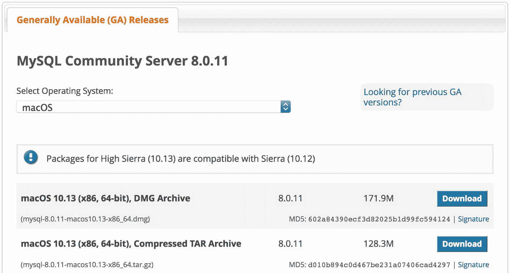
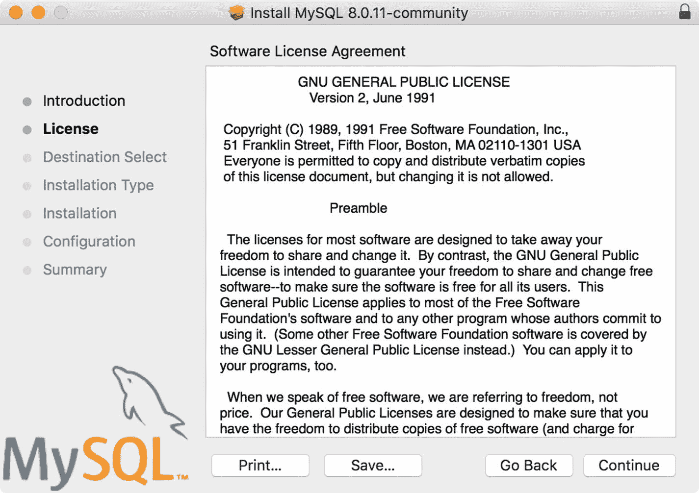
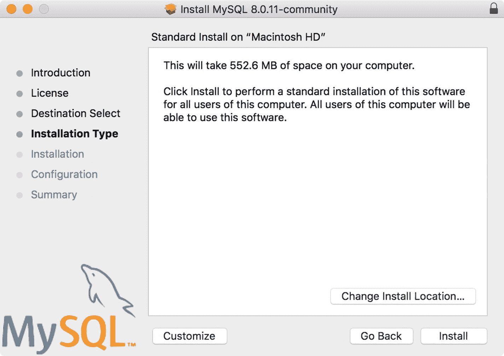
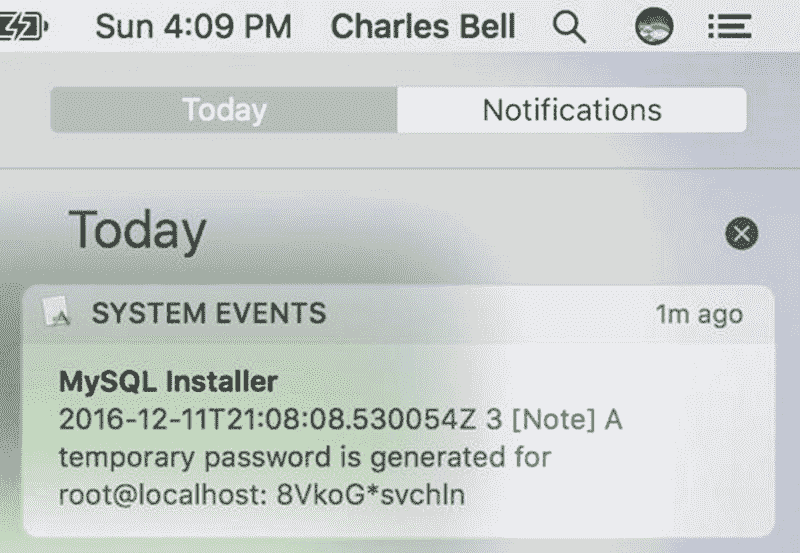

# 2.MySQL 入门

也许您以前从未使用过数据库系统，或者您作为用户使用过一个数据库系统，但从未需要从头开始建立一个。或者，您可能已经决定发现数据库系统有什么大惊小怪的。或者也许你只是作为一名开发人员使用 MySQL，从未见过如何设置和配置服务器。

在这一章中，我将从一般的 SQL 接口角度(传统的 MySQL)对 MySQL 做一个简短的介绍。您不仅会看到 MySQL 8 是如何设置的，还会了解 SQL 接口的一些基础知识，这是完全管理 MySQL 服务器所必需的。也就是说，新的 shell、X 协议、X DevAPI，以及构建在其上的特性，但不提供管理服务器的完整机制；您将需要继续使用 SQL 命令来完成这些任务。

因此，尽管 MySQL 8 为应用程序和交互式会话提供了出色的 NoSQL 接口，但您仍然需要知道如何使用 SQL 接口。幸运的是，我在一篇关于如何使用 MySQL 的简短入门中介绍了基础知识。让我们先简单了解一下 MySQL 是什么，它能为我们做什么。

## 了解 MySQL

MySQL 是世界上最受欢迎的开源数据库系统，原因有很多。首先，它是开源的，这意味着任何人都可以免费使用它来完成各种各样的任务。最重要的是，MySQL 包含在许多平台库中，这使得它很容易获得和安装。如果您的平台在资源库中没有包含 MySQL(比如 aptitude)，您可以从 MySQL 网站( [`http://dev.mysql.com`](http://dev.mysql.com) )下载。

甲骨文公司拥有 MySQL。Oracle 通过收购 Sun Microsystems 获得了 MySQL，Sun Microsystems 从其原始所有者 MySQL AB 获得了 MySQL。尽管担心会出现相反的情况，但 Oracle 通过继续投资于新功能的演进和开发以及忠实地维护其开源遗产，表现出了对 MySQL 的出色管理。尽管 Oracle 也提供 MySQL 的商业许可——就像它以前的所有者过去做的那样——MySQL 仍然是开源的，每个人都可以使用。

Is Open Source Really Free?

开源软件是从对公司财产心态的有意识抵制中成长起来的。理查德·斯托尔曼被认为是自由软件运动之父，他开创了一种许可机制来帮助保护软件的所有权，同时让所有人都可以免费使用该软件及其修订版。我们的目标是重建一个开发者社区，他们按照一个命令合作:保证自由而不是限制自由。

这最终导致了一些措辞巧妙的(具有法律约束力的)许可协议的发明，这些协议允许代码被无限制地复制和修改，声明衍生作品(修改后的副本)必须在与原始版本相同的许可下分发，而没有任何附加限制。一种这样的许可证(由 Stallman 创建)被称为 GNU 公共许可证(GPL)。这是 Oracle 用来许可 MySQL 的许可证，因此任何人都可以免费使用。

然而，GPL 和类似的许可证旨在保证使用、修改和发布的自由；大多数人从未想过“免费”意味着“没有成本”或“免费拥有一个好家庭”为了消除这种误解，开放源码倡议(OSI)成立了，后来采用并推广了“开放源码”一词来描述 GPL 许可证所保证的自由。更多关于开源软件和 GPL 的信息，请访问 [`www.opensource.org`](http://www.opensource.org) 。

MySQL 在您的系统上作为后台进程运行(或者作为前台进程，如果您从命令行启动它)。和大多数数据库系统一样，MySQL 支持结构化查询语言(SQL)。您可以使用 SQL 创建数据库和对象(使用数据定义语言；DDL)、写入或更改数据(使用数据操作语言；DML)，并执行各种命令来管理服务器。

### 我如何连接到 MySQL？

我们已经简要了解了用于连接和使用 MySQL 服务器的新 MySQL Shell、用于配置 InnoDB 集群的 AdminAPI 以及用于访问数据的 X DevAPI。然而，MySQL 中还有一个已经存在了几十年的客户端。它是一个名为`mysql`的应用程序，使您能够连接到服务器并在其上运行 SQL 命令。有趣的是，这个 MySQL 客户端最初被命名为 MySQL monitor，但长期以来一直被简单地称为“MySQL 客户端”、“终端监视器”，甚至是 MySQL 命令窗口。

New Default Authentication

在 MySQL 8 . 0 . 4 版之前，默认的身份验证机制使用一个名为 mysql_native_password 插件的身份验证插件，该插件使用 SHA1 算法。这种机制速度很快，不需要加密连接。然而，由于国家标准和技术研究所(NIST)建议他们应该停止使用 SHA1 算法；Oracle 已将 MySQL 8 . 0 . 4 版中的默认身份验证插件更改为 cachin_sha2_password 插件。

对于安装 MySQL 8.0.4 的任何组织来说，这种变化的后果应该不是问题，但对于那些升级到 8.0.4 或安装了较旧版本 MySQL 的组织来说，这可能是一个问题。最大的问题是较旧的客户端实用程序，如 5.7 版的 mysql 客户端，可能无法连接到 MySQL 8.0.4 或更高版本的新安装。

虽然您可以更改 MySQL 8.0.4 以使用旧的身份验证机制，但不建议这样做，您应该将所有客户端工具升级到 8.0.4 或更高版本，以便使用最新版本的 MySQL。

如果您想了解更多关于这些变化的信息，包括甲骨文做出这些变化的原因以及给用户带来的好处，请参见 [`https://mysqlserverteam.com/mysql-8-0-4-newdefault-authentication-plugin-caching_sha2_password` /](https://mysqlserverteam.com/mysql-8-0-4-newdefault-authentication-plugin-caching_sha2_password) 。

要使用 MySQL 客户端(`mysql`)连接到服务器，您必须指定一个用户帐户和您想要连接的服务器。如果连接到同一台计算机上的服务器，可以省略服务器信息(主机和端口),因为它们默认为本地主机的端口 3306。使用- user(或`-u`)选项指定用户。您可以在命令中为用户指定密码，但更安全的做法是指定`--password`(或`-p`)，客户端会提示您输入密码。如果您确实在命令行上指定了密码，您将会得到一个警告提示，鼓励您不要这样做。

在没有`--host`(或`-h`)和`--port`选项的同一台机器上使用 mysql 客户端不使用网络连接。如果您想要使用网络连接进行连接，或者想要使用不同的端口进行连接，则必须使用环回地址。例如，要连接到同一台机器上端口 3307 上运行的服务器，使用命令`mysql -uroot -p –h127.0.0.1 --port=3307`。清单 [2-1](#Par18) 展示了几个使用 mysql 客户端的 SQL 命令的例子。

Tip

要查看客户端中可用命令的列表，请键入 help。并在提示符下按 Enter 键。

```sql
$ mysql -uroot -proot -h 127.0.0.1 --port=3307
mysql: [Warning] Using a password on the command line interface can be insecure.
Welcome to the MySQL monitor.  Commands end with ; or \g.
Your MySQL connection id is 14
Server version: 8.0.11 MySQL Community Server (GPL)

Copyright (c) 2000, 2018, Oracle and/or its affiliates. All rights reserved.

Oracle is a registered trademark of Oracle Corporation and/or its
affiliates. Other names may be trademarks of their respective
owners.

Type 'help;' or '\h' for help. Type '\c' to clear the current input statement.

mysql> CREATE DATABASE greenhouse;

Query OK, 1 row affected (0.00 sec) 

mysql> CREATE TABLE greenhouse.plants (plant_name char(50), sensor_value int, sensor_event timestamp);

Query OK, 0 rows affected (0.01 sec)

mysql> INSERT INTO greenhouse.plants VALUES ('living room', 23, NULL);

Query OK, 1 row affected (0.01 sec)

mysql> SELECT * FROM greenhouse.plants;

+-------------+--------------+--------------+
| plant_name  | sensor_value | sensor_event |
+-------------+--------------+--------------+
| living room |           23 | NULL         |
+-------------+--------------+--------------+
1 row in set (0.00 sec)

mysql> SET @@global.server_id = 106;

Query OK, 0 rows affected (0.00 sec)

mysql> quit
Bye

Listing 2-1Commands Using the mysql Client

```

在本例中，您将看到以 CREATE DATABASE 和 CREATE TABLE 语句形式出现的 DDL，以 INSERT 和 SELECT 语句形式出现的 DML，以及一个用于设置全局服务器变量的简单管理命令。接下来，您将看到创建一个数据库和一个表来存储数据，在表中添加一行，最后检索表中的数据。注意我是如何用大写字母表示 SQL 命令关键字的。这是一种常见的做法，有助于使 SQL 命令更容易阅读，更容易找到用户提供的选项或数据。

Tip

您可以通过键入命令 quit 退出 MySQL 客户端。在 Linux 和 Unix 系统上，您可以按 Ctrl+D 退出客户端。

MySQL 中有很多可用的命令。幸运的是，你只需要掌握几个比较常见的。以下是您最常使用的命令。<>中包含的部分表示用户提供的命令组件，而[…]表示需要额外的选项。

*   `CREATE DATABASE <database_name>`:创建数据库
*   `USE <database>`:设置默认数据库(不是 SQL 命令)
*   `CREATE TABLE <table_name> [...]`:创建一个表格或结构来存储数据
*   `INSERT INTO <table_name> [...]`:向表格中添加数据
*   `UPDATE [...]`:更改特定行的一个或多个值
*   `DELETE FROM <table_name> [...]`:从表格中删除数据
*   `SELECT [...]`:从表格中检索数据(行)
*   `SHOW [...]`:显示对象列表

Note

您必须用分号(；)或者\G。

虽然这个列表只是一个简短的介绍，并不是一个完整的语法指南，但是有一个很好的在线 MySQL 参考手册，它更详细地解释了每个命令(以及更多)。当你对 MySQL 有任何疑问时，你应该参考在线的 MySQL 参考手册。你可以在 [`http://dev.mysql.com/doc/`](http://dev.mysql.com/doc/) 找到它。

显示的一个更有趣的命令允许您查看对象列表。例如，您可以看到带有`SHOW DATABASES`的数据库，带有`SHOW TABLES`的表列表(一旦您更改为数据库)，甚至带有`SHOW GRANTS`的用户权限。我发现自己经常使用这些命令。

如果你认为 MySQL 不仅仅是几个简单的命令，那你就错了。尽管 MySQL 易于使用且启动时间快，但它是一个成熟的关系数据库管理系统(RDBMS)。比你在这里看到的要多得多。有关 MySQL 的更多信息，包括所有高级特性，请参阅在线 MySQL 参考手册。

### 如何获取和安装 MySQL

MySQL 服务器可用于多种平台，包括大多数 Linux 和 Unix 平台、Mac OS X 和 Windows。在撰写本文时，MySQL 8 还没有正式发布，因此只作为开发里程碑版本(DMR)提供。dmr 是您在正式发布之前尝试新版本和新特性的绝佳方式。一般来说，非 GA 版本被认为是开发版，或者是早期候选版本，如 MySQL 8.0.4，是候选版本。因此，您不应该在您的生产机器上安装和使用 DMR 版本。

要下载 MySQL 8 的 GA 版本，请访问 [`http://dev.mysql.com/downloads/`](http://dev.mysql.com/downloads/) 并点击社区，然后点击 MySQL 社区。您也可以点击下载页面底部附近名为 Community (GPL) Downloads 的链接，然后点击 MySQL Community Server。这是 MySQL 的 GPLv2 许可证。该页面将自动检测您的操作系统。如果您想为另一个平台下载，可以从下拉列表中选择。

下载页面将列出几个可供下载的文件。根据您的平台，您可能会看到几个选项，包括压缩文件、源代码和安装包。大多数人会选择在笔记本电脑或台式电脑上安装安装包。图 [2-1](#Fig1) 显示了 macOS 平台各种下载选项的示例。



图 2-1

Download page for macOS

最受欢迎的平台之一是微软视窗系统。Oracle 为 Windows 提供了一个名为 Windows Installer 的特殊安装包。这个包包含了社区许可下所有可用的 MySQL 产品，包括 MySQL 服务器、工作台、实用程序和所有可用的连接器(用于连接 MySQL 的程序库)。这使得在 Windows 上安装成为一站式、一次安装的事情。图 [2-2](#Fig2) 显示了 Windows installer 的下载页面。


图 2-2

Download page for Windows Installer

但是，您应该注意，Windows Installer 中可能不包括一些更高级的功能和一些处于开发者里程碑发布(DMR)状态的插件。因此，您应该考虑使用服务器软件包进行安装。我们在图 [2-2](#Fig2) 中的 Windows Installer 下载链接下面看到了这些。您可以选择 Windows Installer 32 位或 64 位安装。注意，这个包可能只不过是一个包含服务器代码的`.zip`文件。在这种情况下，您可能需要从解压缩的文件夹中运行服务器，或者进行本地手动安装。

幸运的是，随着 MySQL 8 的成熟，更多的打包选项将变得可用，允许您使用半自动安装机制。让我们来看看其中的一个。在这个场景中，我们将在 macOS Sierra 机器上安装 MySQL 8。在这种情况下，我已经下载了文件`mysql-8.0.11-macos10.13-x86_64.dmg`，这是一个压缩文件，包含一个名为`mysql-8.0.11` - `macos10.13-x86_64.pkg`的 macOS 软件包安装程序。一旦我启动安装程序，第一步是同意许可。图 [2-3](#Fig3) 显示安装对话框的许可协议面板。



图 2-3

License agreement

显示的许可证是社区版的 GPLv2 许可证。您可以阅读许可证，准备好后，点按“继续”。您将看到一个接受对话框打开，这将为您提供另一个阅读许可的机会。 [<sup>1</sup>](#Fn1) 当您准备好接受许可证时，单击接受。图 [2-4](#Fig4) 显示许可接受对话框。


图 2-4

Accept license

下一个面板显示设置或安装类型。像这个版本这样的早期版本可能不会显示任何可供选择的安装类型。如果运行 Windows Installer，您会看到几个选项。对于大多数平台，缺省安装类型是您开始所需的全部。图 [2-5](#Fig5) 为安装型面板。准备好后，点击`Install`。



图 2-5

Installation type

安装程序可能会要求您授权安装，一旦授权完成，就会很快将 MySQL 安装到`/usr/local/mysql`文件夹中(例如 Sierra)。

如果这是你第一次安装 MySQL 8，你会看到一个对话框，显示根帐户的默认密码。这是 MySQL 5.7 中的一个变化，它消除了匿名帐户，使服务器安装更加安全。您应该记下这个密码，因为它是一个您无法猜测的字符和符号的一般随机集合。图 [2-6](#Fig6) 显示了一个这样的示例对话框。


图 2-6

Root password notice

图 [2-7](#Fig7) 展示了如何从通知中心恢复 macOS 上的这个对话框，如果你和我一样，倾向于不完整阅读就关闭对话框。 [<sup>2</sup>](#Fn2)



图 2-7

Root password notice in macOS notification center

完成后，您将看到一个完成对话框，您可以放心地关闭它。最后，会询问您是要保留安装文件(`.dmg`)还是删除它。如果你正在使用 MySQL 8 或者想把它安装在其他地方，不要删除这个文件。

Tip

如果还没有设置的话，将路径`/usr/local/mysql/bin`添加到默认路径变量中可能是个好主意。这使得启动 MySQL 客户端工具变得更加容易。

正如您可能已经猜到的，您需要在安装后的第一个操作中更改 root 密码。这样做很容易。只需打开 mysql 客户端(MySQL)并发出以下 SQL 语句。因为我们在默认位置安装了服务器，所以我们可以像这样只使用用户和密码提示来启动客户机:`mysql -uroot -p`。客户端将提示您输入密码。

```sql
SET PASSWORD="NEW_PASSWORD_GOES_HERE";

```

如果您收到无法连接到服务器的消息，这可能意味着服务器尚未启动。您可以使用以下命令在 macOS 上启动服务器。

```sql
sudo launchctl load -F /Library/LaunchDaemons/com.oracle.oss.mysql.mysqld.plist

```

Note

在 Windows 上安装 MySQL 8 时，确保在安装过程中选中标记为“Enable X Protocol/MySQL as a Document Store”的框，以确保启用 X 插件和 X 协议。

好了，现在我们已经安装了 MySQL 8 服务器，我们可以开始配置服务器了。您可以在此时安装 MySQL Shell，但是我们将在第 [4](04.html) 章更详细地探讨如何安装 MySQL Shell。

### 配置和管理对 MySQL 的访问

现在您已经知道了如何安装 MySQL，让我们简单地讨论一下如何配置 MySQL，如何授予其他人访问服务器(和数据库)的权限，以及如何设置 X 插件(启用文档存储的关键组件)。我们首先看一下用于定义 MySQL 中的行为和配置选项的配置文件。

#### 配置文件

在 MySQL 中配置启动选项和变量的主要方法是使用一个名为`my.cnf`(或 Windows 上的`my.ini`)的文本文件。这个文件通常位于 Posix 系统的`/etc`文件夹中。比如在 macOS 上，文件被命名为`/etc/my.cnf`。清单 [2-2](#Par57) 显示了典型 MySQL 配置文件的前几十行。

```sql
# Example MySQL config file for small systems.
#
# This is for a system with little memory (<= 64M) where MySQL is only used
# from time to time and it's important that the mysqld daemon
# doesn't use much resources.
#
# MySQL programs look for option files in a set of
# locations which depend on the deployment platform.
# You can copy this option file to one of those
# locations. For information about these locations, see:
# http://dev.mysql.com/doc/mysql/en/option-files.html
#
# In this file, you can use all long options that a program supports.
# If you want to know which options a program supports, run the program
# with the "--help" option.

# The following options will be passed to all MySQL clients
[client]
port            = 3306
socket          = /tmp/mysql.sock

# Here follows entries for some specific programs

# The MySQL server
[mysqld]
port            = 3306
socket          = /tmp/mysql.sock
skip-external-locking
key_buffer_size = 16K
max_allowed_packet = 1M
table_open_cache = 4
sort_buffer_size = 64K
read_buffer_size = 256K
read_rnd_buffer_size = 256K
net_buffer_length = 2K
thread_stack = 1024K
...
innodb_log_file_size = 5M
innodb_log_buffer_size = 8M
innodb_flush_log_at_trx_commit = 1
innodb_lock_wait_timeout = 50
innodb_log_files_in_group = 2
slow-query-log
general-log
...

Listing 2-2MySQL Configuration File Excerpt

```

请注意，我们使用方括号`[]`定义了按部分分组的设置。例如，我们看到一个名为`[client]`的部分，它用于为任何读取配置文件的 MySQL 客户端定义选项。同样，我们看到一个名为`[mysqld]`的部分，它适用于服务器进程(因为可执行文件名为`mysqld`)。请注意，我们还可以看到端口、套接字等基本选项的设置。但是，我们也可以使用配置文件来设置 InnoDB、复制等选项。

我建议您找到并浏览安装的配置文件，以便查看选项及其值。如果您遇到需要更改某个选项的情况——比方说测试效果或者进行实验——您可以使用`SET`命令来更改值，作为全局设置(影响所有连接)或者会话设置(仅适用于当前连接)。

但是，如果您更改了配置文件中的全局设置，该值(状态)将仅保留到服务器重新启动为止。因此，如果您想要保留全局更改，您应该考虑将它们放在配置文件中。

另一方面，在会话级别设置一个值可能在有限的时间内是有益的，或者您可能只希望为特定的任务做一些事情。例如，以下代码关闭二进制日志，执行一个 SQL 命令，然后重新打开二进制日志。下面是一个简单而深刻的示例，说明如何在参与复制的服务器上执行操作，而不会影响其他服务器。 [<sup>3</sup>](#Fn3)

```sql
SET sql_log_bin=0;
CREATE USER 'hvac_user1'@'%' IDENTIFIED BY 'secret';
SET sql_log_bin=1;

```

有关配置文件以及如何使用它来配置 MySQL 8 的更多信息，包括使用多个选项文件以及这些文件在每个平台上的位置，请参见在线 MySQL 参考手册( [`http://dev.mysql.com/doc/refman/8.0/en/`](http://dev.mysql.com/doc/refman/8.0/en/) )中的“使用选项文件”一节。

#### 创建用户和授予访问权限

在使用 MySQL 之前，您需要了解另外两个管理操作:创建用户帐户和授予数据库访问权限。MySQL 可以用`GRANT`语句来执行这两项操作，如果用户不存在，它会自动创建一个用户。但是更迂腐的方法是首先发出一个`CREATE USER`命令，然后是一个或多个`GRANT`命令。例如，下面显示了名为 hvac_user1 的用户的创建，并授予该用户对数据库`room_temp`的访问权限:

```sql
CREATE USER 'hvac_user1'@'%' IDENTIFIED BY 'secret';
GRANT SELECT, INSERT, UPDATE ON room_temp.* TO 'hvac_user1'@'%';

```

第一个命令创建名为`hvac_user1`的用户，但是该名称也有一个@后跟另一个字符串。第二个字符串是与用户相关联的机器的主机名。也就是说，MySQL 中的每个用户都有一个用户名和一个主机名，以`user@host`的形式来惟一地标识他们。这意味着用户和主机`hvac_user1@10.0.1.16`和用户和主机`hvac_user1@10.0.1.17`是不同的。但是，`%`符号可以用作通配符，将用户与任何主机关联起来。`IDENTIFIED BY`子句为用户设置密码。

A Note About Security

为您的应用程序创建一个对 MySQL 系统没有完全访问权限的用户总是一个好主意。这是为了最大限度地减少任何意外更改，也是为了防止被利用。例如，建议您创建一个只能访问存储(或检索)数据的数据库的用户。

对于主机使用通配符%也要小心。虽然创建单个用户并让用户从任何主机访问数据库服务器变得更加容易，但这也使得恶意用户更容易访问您的服务器(一旦他们发现了密码)。

第二个命令允许访问数据库。您可以授予用户许多权限。该示例显示了您最有可能向传感器网络数据库用户提供的集合:读取(`SELECT`)、添加数据(`INSERT`)和更改数据(`UPDATE`)。有关安全性和帐户访问权限的更多信息，请参见在线 MySQL 参考手册。

该命令还指定要授予特权的数据库和对象。因此，可以给用户一些表的读(`SELECT`)权限，给另一些表的写(`INSERT`、`UPDATE`)权限。这个例子让用户可以访问`room_temp`数据库中的所有对象(表、视图等等)。

如上所述，您可以将这两个命令合并成一个命令。你可能会在文献中更经常地看到这种形式。下面显示了组合语法。在这种情况下，您需要做的就是将`IDENTIFIED BY`子句添加到`GRANT`语句中。酷！

```sql
GRANT SELECT, INSERT, UPDATE ON room_temp.* TO 'hvac_user1'@'%' IDENTIFIED BY 'secret';

```

接下来，让我们看看如何配置服务器以用于文档存储；更具体地说，通过安装 X 插件。

#### 配置文档存储

在探索 MySQL 文档库之前，您要做的最后一件事是确保安装了 X 插件。如果您在 Windows 上安装了 MySQL，并且选择启用 Enable X Protocol/MySQL 作为文档存储，则可以跳过这一步。但是，其他平台可能需要配置服务器以用于文档存储。

为了在旧的 MySQL 服务器上启用 X 协议，我们需要安装 X 插件。X 插件名为 MySQLX，可以通过下面的命令轻松安装。`INSTALL PLUGIN`命令接受插件(mysqlx)的名称和共享库的名称。按照惯例，共享库被命名为与带有`.so`后缀的插件相同(Windows 机器使用`.dll`)。

```sql
INSTALL PLUGIN mysqlx SONAME 'mysqlx.so';

```

Note

MySQL 8 . 0 . 11 版及更高版本默认启用 X 插件。

您可以使用下面的命令检查哪些插件被启用。您将看到所有已安装的插件及其当前状态。请注意，我们看到列表中的 X 插件处于启用状态。

```sql
mysql> SHOW PLUGINS \G
*************************** 1\. row ***************************
   Name: keyring_file
 Status: ACTIVE
   Type: KEYRING
Library: keyring_file.so
License: GPL
*************************** 2\. row ***************************
   Name: binlog
 Status: ACTIVE
   Type: STORAGE ENGINE
Library: NULL
License: GPL
...
*************************** 43\. row ***************************
   Name: mysqlx
 Status: ACTIVE
   Type: DAEMON
Library: mysqlx.so
License: GPL
43 rows in set (0.00 sec)

```

么事儿啦在那里。一旦启用，您的服务器将使用 X 协议与 MySQL Shell 或任何其他使用 X 协议的系统、服务或应用程序进行通信。

如果需要卸载 X 插件，可以使用以下命令:

```sql
UNINSTALL PLUGIN mysqlx;

```

在下一节中，我将对 MySQL 服务器进行更长时间的浏览，以展示如何使用基本的 SQL 命令。在后面的章节中会有更多关于文档存储的内容。

## MySQL 第一

如果您从未使用过数据库系统，那么学习和掌握该系统需要培训、经验和极大的毅力。精通所需的主要知识是如何使用常见的 SQL 命令和概念。本节将介绍最常见的 MySQL 命令和概念，作为学习如何使用文档存储的基础，从而完成 MySQL 入门。

Note

本节介绍了更高层次的命令和概念，而不是重复在线 MySQL 参考手册。如果您决定使用任何命令或概念，请参考在线 MySQL 参考手册，了解更多详细信息、完整的命令语法和其他示例。

本节回顾了最常见的 SQL 和 MySQL 特有的命令，您需要了解这些命令才能充分利用 MySQL 服务器数据库。虽然您已经看到了其中一些工具的实际应用，但是本节提供了一些额外的信息来帮助您使用它们。

需要理解的一个重要规则是，用户提供的变量名区分大小写，并且服从主机平台的大小写区分。例如，解析`last_name`和`Last_Name`在不同平台上是不一致的。也就是说，Windows 上的区分大小写行为不同于 macOS。查看适用于您平台的在线 MySQL 参考手册，了解区分大小写如何影响用户提供的变量。

### 创建数据库和表

您需要学习和掌握的最基本的命令是`CREATE DATABASE`和`CREATE TABLE`命令。回想一下，MySQL 之类的数据库服务器允许您创建任意数量的数据库，您可以用逻辑方式添加表和存储数据。

要创建一个数据库，使用`CREATE DATABASE`后跟一个数据库名称。如果您正在使用 MySQL 客户端，您必须使用`USE`命令切换到特定的数据库。客户端焦点是在启动时(在命令行上)或通过`USE`命令指定的最新数据库。

您可以通过首先引用数据库名称来覆盖它。例如，`SELECT * FROM db1.table1`将执行，而不管默认的数据库设置。但是，省略数据库名称会导致 mysql 客户端使用默认数据库。下面显示了创建和更改数据库焦点的两个命令:

```sql
mysql> CREATE DATABASE greenhouse;
mysql> USE greenhouse;

```

Tip

如果您想查看服务器上的所有数据库，请使用 SHOW DATABASES 命令。

创建表格需要 yes，`CREATE TABLE`命令。该命令有许多选项，不仅允许您指定列及其数据类型，还允许您指定附加选项，如索引、外键等。还可以使用`CREATE INDEX`命令创建一个索引(参见下面的代码)。下面的代码显示了如何创建一个简单的表来存储植物传感器数据，例如用于监控个人温室的数据。 [<sup>4</sup>](#Fn4)

```sql
CREATE TABLE `greenhouse`.`plants` (
  `plant_name` char(30) NOT NULL,
  `sensor_value` float DEFAULT NULL,
  `sensor_event` timestamp NOT NULL DEFAULT CURRENT_TIMESTAMP ON UPDATE CURRENT_TIMESTAMP,
  `sensor_level` char(5) DEFAULT NULL,
  PRIMARY KEY `plant_name` (`plant_name`)
) ENGINE=InnoDB DEFAULT CHARSET=latin1;

```

注意这里我指定了表名(植物)和四列(`plant_name`、`sensor_value`、`sensor_event`和`sensor_level`)。我使用了几种数据类型。对于`plant_name`，我使用了一个最多 30 个字符的字符字段，一个浮点数据类型用于`sensor_value`，一个时间戳值用于`sensor_event`，另一个字符字段用于 5 个字符的`sensor_level`。

当您想要记录事件或动作的日期和时间时，`TIMESTAMP`数据类型特别有用。例如，知道何时读取传感器值通常是有帮助的。通过向表中添加一个`TIMESTAMP`列，您不需要计算、读取或格式化传感器甚至聚合节点上的日期和时间。

还要注意，我指定将`plant_name`列定义为一个键，这将创建一个索引。在这种情况下，它也是主键。`PRIMARY KEY`短语告诉服务器确保表中存在且只有一行匹配列的值。通过重复关键字，可以指定几个要在主键中使用的列。注意，所有主键列都不允许空值(`NOT NULL`)。

如果您不能确定唯一标识一行的一组列(并且您想要这样的行为——有些人喜欢没有这种限制的表，但是一个好的 DBA 不会),那么您可以为 integer 字段使用一个称为`AUTO INCREMENT`的人工数据类型选项。当用于列(这必须是第一列)时，服务器会为插入的每一行自动增加该值。这样，它就创建了一个默认主键。有关自动递增列的更多信息，请参见在线 MySQL 参考手册。

Tip

最佳实践表明，在某些情况下，在字符字段上使用主键并不是最佳选择，例如表中的每一列都有很大的值或者有许多唯一值。这可能会降低搜索和索引的速度。在这种情况下，您可以使用 auto increment 字段来人工添加一个更小的主键(但有点神秘)。

可用的数据类型比上一个示例中显示的多得多。您应该查看在线 MySQL 参考手册，以获得数据类型的完整列表。请参见“数据类型”一节如果你想知道一个表格的布局或“模式”,使用`SHOW CREATE TABLE`命令。

Tip

像数据库一样，您也可以使用`SHOW TABLES`命令获得数据库中所有表的列表。

### 搜索数据

您需要知道的最常用的基本命令是从表中返回数据的命令(也称为结果集或行)。为此，您可以使用`SELECT`语句。这个 SQL 语句是数据库系统的核心。所有对数据的查询都将使用该命令执行。因此，我们将从列列表开始，多花一点时间看看可以使用的各种子句(部分)。

Note

虽然我们首先检查 SELECT 语句，但是如果您想在您的系统上尝试这些语句，请确保首先运行 INSERT 语句。

`SELECT`语句允许您指定想要从数据中选择哪些列。该列表作为语句的第一部分出现。第二部分是`FROM`子句，它指定了要从中检索行的表。

Note

`FROM`子句可以用来用`JOIN`操作符连接表。

指定列的顺序决定了结果集中的显示顺序。如果你想要所有的列，使用星号(`*`)代替。清单 [2-3](#Par109) 展示了生成相同结果集的三条语句。也就是说，在每个的输出中将显示相同的行。事实上，为了简单起见，我使用了一个只有四行的表。

```sql
mysql> SELECT plant_name, sensor_value, sensor_event, sensor_level FROM greenhouse.plants;
+------------------------+--------------+---------------------+--------------+
| plant_name             | sensor_value | sensor_event        | sensor_level |
+------------------------+--------------+---------------------+--------------+
| fern in den            |       0.2319 | 2015-09-23 21:04:35 | NULL         |
| fern on deck           |         0.43 | 2015-09-23 21:11:45 | NULL         |
| flowers in bedroom1    |        0.301 | 2015-09-23 21:11:45 | NULL         |
| weird plant in kitchen |        0.677 | 2015-09-23 21:11:45 | NULL         |
+------------------------+--------------+---------------------+--------------+
4 rows in set (0.00 sec) 

mysql> SELECT * FROM greenhouse.plants;
+------------------------+--------------+---------------------+--------------+
| plant_name             | sensor_value | sensor_event        | sensor_level |
+------------------------+--------------+---------------------+--------------+
| fern in den            |       0.2319 | 2015-09-23 21:04:35 | NULL         |
| fern on deck           |         0.43 | 2015-09-23 21:11:45 | NULL         |
| flowers in bedroom1    |        0.301 | 2015-09-23 21:11:45 | NULL         |
| weird plant in kitchen |        0.677 | 2015-09-23 21:11:45 | NULL         |
+------------------------+--------------+---------------------+--------------+
4 rows in set (0.00 sec)

mysql> SELECT sensor_value, plant_name, sensor_level, sensor_event FROM greenhouse.plants;
+--------------+------------------------+--------------+---------------------+
| sensor_value | plant_name             | sensor_level | sensor_event        |
+--------------+------------------------+--------------+---------------------+
|       0.2319 | fern in den            | NULL         | 2015-09-23 21:04:35 |
|         0.43 | fern on deck           | NULL         | 2015-09-23 21:11:45 |
|        0.301 | flowers in bedroom1    | NULL         | 2015-09-23 21:11:45 |
|        0.677 | weird plant in kitchen | NULL         | 2015-09-23 21:11:45 |
+--------------+------------------------+--------------+---------------------+
4 rows in set (0.00 sec)

Listing 2-3Example SELECT Statements

```

注意，前两条语句以相同的顺序产生相同的行和相同的列。但是，第三条语句虽然生成相同的行，但以不同的顺序显示列。

您还可以使用列列表中的函数来执行计算和类似操作。一个特殊的例子是使用`COUNT()`函数来确定结果集中的行数，如下所示。关于 MySQL 提供的函数的更多例子，请参阅在线 MySQL 参考手册。

```sql
SELECT COUNT(*) FROM greenhouse.plants;

```

`SELECT`语句中的下一个子句是`WHERE`子句。您可以在这里指定用于限制结果集中行数的条件。也就是说，只有那些符合条件的行。这些条件基于列，可能相当复杂。也就是说，您可以基于计算、连接结果等来指定条件。但是大多数条件将是一个或多个列上的简单等式或不等式来回答一个问题。例如，假设您想查看传感器读数小于`0.40`的植物？在这种情况下，我们发出以下查询并接收结果。注意，我只指定了两列:工厂名称和从传感器读取的值。

```sql
mysql> SELECT plant_name, sensor_value FROM greenhouse.plants WHERE sensor_value < 0.40;
+---------------------+--------------+
| plant_name          | sensor_value |
+---------------------+--------------+
| fern in den         |       0.2319 |
| flowers in bedroom1 |        0.301 |
+---------------------+--------------+
2 rows in set (0.01 sec)

```

您还可以使用其他子句，包括用于对行进行分组以进行聚合或计数的`GROUP BY`子句，以及用于对结果集进行排序的`ORDER BY`子句。让我们从聚合开始，快速地看一下每一个。

假设您想要计算每个传感器在表中读取的传感器值的平均值。在这种情况下，我们有一个包含各种传感器随时间变化的传感器读数的表。尽管这个例子只包含四行(因此可能没有统计信息)，但是这个例子非常清楚地展示了聚合的概念，如清单 [2-4](#Par117) 所示。请注意，我们收到的只是四个传感器读数的平均值。

```sql
mysql> SELECT plant_name, sensor_value FROM greenhouse.plants WHERE plant_name = 'fern on deck';
+--------------+--------------+
| plant_name   | sensor_value |
+--------------+--------------+
| fern on deck |         0.43 |
| fern on deck |         0.51 |
| fern on deck |        0.477 |
| fern on deck |         0.73 |
+--------------+--------------+
4 rows in set (0.00 sec)

mysql> SELECT plant_name, AVG(sensor_value) AS avg_value FROM greenhouse.plants WHERE plant_name = 'fern on deck' GROUP BY plant_name;
+--------------+-------------------+
| plant_name   | avg_value         |
+--------------+-------------------+
| fern on deck | 0.536750003695488 |
+--------------+-------------------+
1 row in set (0.00 sec)

Listing 2-4GROUP BY Example

```

注意，我在列列表中指定了 average 函数`AVG()`，并传入了我想要平均的列的名称。MySQL 中有许多这样的函数可以用来执行一些强大的计算。显然，这是数据库服务器中存在多少功率的另一个示例，这将需要网络中典型的轻量级传感器或聚合器节点上的更多资源。

还要注意，我使用关键字`AS`重命名了具有平均值的列。您可以使用它来重命名任何指定的列，这将更改结果集中的名称，如清单所示。

子句的另一个用途是计数。在本例中，我们用`COUNT(`替换了`AVG()`，得到了与`WHERE`子句匹配的行数。更具体地说，我们想知道每个工厂存储了多少传感器值。

```sql
mysql> SELECT plant_name, COUNT(sensor_value) as num_values FROM greenhouse.plants GROUP BY plant_name;
+------------------------+------------+
| plant_name             | num_values |
+------------------------+------------+
| fern in den            |          1 |
| fern on deck           |          4 |
| flowers in bedroom1    |          1 |
| weird plant in kitchen |          1 |
+------------------------+------------+
4 rows in set (0.00 sec)

```

现在，假设我们想要查看按传感器值排序的结果集的结果。我们使用为面板上的蕨类植物选择行的相同查询，但是我们使用`ORDER BY`子句按照传感器值以升序和降序对行进行排序。清单 [2-5](#Par123) 显示了每个选项的结果。

```sql
mysql> SELECT plant_name, sensor_value FROM greenhouse.plants WHERE plant_name = 'fern on deck' ORDER BY sensor_value ASC;
+--------------+--------------+
| plant_name   | sensor_value |
+--------------+--------------+
| fern on deck |         0.43 |
| fern on deck |        0.477 |
| fern on deck |         0.51 |
| fern on deck |         0.73 |
+--------------+--------------+
4 rows in set (0.00 sec)

mysql> SELECT plant_name, sensor_value FROM greenhouse.plants WHERE plant_name = 'fern on deck' ORDER BY sensor_value DESC;
+--------------+--------------+
| plant_name   | sensor_value |
+--------------+--------------+
| fern on deck |         0.73 |
| fern on deck |         0.51 |
| fern on deck |        0.477 |
| fern on deck |         0.43 |
+--------------+--------------+
4 rows in set (0.00 sec)

Listing 2-5ORDER BY Examples

```

正如我所提到的，SELECT 语句的内容比这里所展示的要多得多，但是我们所看到的将会让您受益匪浅，尤其是在处理大多数中小型数据库解决方案的典型数据时。

### 创建数据

现在您已经创建了一个数据库和表，您将希望向表中加载或插入数据。您可以使用`INSERT INTO`语句来实现。这里我们指定表格和行的数据。下面是一个简单的例子:

```sql
INSERT INTO greenhouse.plants (plant_name, sensor_value) VALUES ('fern in den', 0.2319);

```

在这个例子中，我通过指定名称和值为我的一个工厂插入数据。你想知道其他的柱子呢？在这种情况下，其他列包括一个时间戳列，它将由数据库服务器填充。所有其他列(只有一列)将被设置为`NULL`，这意味着没有值可用、值缺失、值不为零或值为空。

请注意，我在该行的数据之前指定了列。当您希望插入的列数少于表中包含的列数时，这是必要的。更具体地说，关闭列列表意味着您必须为表中的所有列提供数据(或`NULL`)。此外，列出的列的顺序可以不同于它们在表中的定义顺序。关闭列列表将导致根据列数据在表中的显示方式对其进行排序。

您也可以使用逗号分隔的行值列表，使用相同的命令插入几行，如下所示:

```sql
INSERT INTO greenhouse.plants (plant_name, sensor_value) VALUES ('flowers in bedroom1', 0.301), ('weird plant in kitchen', 0.677), ('fern on deck', 0.430);

```

这里我用相同的命令插入了几行。请注意，这只是一种简化机制，除了自动提交之外，与发出单独的命令没有什么不同。

### 更新数据

有时，您需要更改或更新数据。您可能需要更改一列或多列的值，替换多行的值，或者更正数字数据的格式甚至比例。为了更新数据，我们使用`UPDATE`命令。您可以更新特定的列、更新一组列、对一列或多列执行计算等等。

更有可能的是，您或您的用户想要重命名数据库中的对象。例如，假设我们确定甲板上的植物实际上不是蕨类植物，而是一种外来开花植物。在本例中，我们希望将所有植物名称为“fern on deck”的行改为“flowers on deck”以下命令执行更改:

```sql
UPDATE greenhouse.plants SET plant_name = 'flowers on deck' WHERE plant_name = 'fern on deck';

```

注意，这里的关键操作符是`SET`操作符。这告诉数据库为指定的列分配一个新值。您可以在命令中列出多个 set 操作。

注意，我在这里使用了一个`WHERE`子句将`UPDATE`限制在一组特定的行中。这就是你在`SELECT`语句中看到的同一个`WHERE`子句，它做同样的事情；它允许您指定限制受影响的行的条件。如果不使用`WHERE`子句，更新将应用于所有行。

Caution

别忘了`WHERE`条款！发出不带`WHERE`子句的`UPDATE`命令将影响表中的所有行！

### 删除数据

有时，您最终会得到需要删除的表中的数据。也许您使用了测试数据，并想去掉虚假的行。也许您想要压缩或清除表，或者想要删除不再适用的行。要删除行，使用`DELETE FROM`命令。

让我们看一个例子。假设您有一个正在开发的工厂监控解决方案，您发现您的一个传感器或传感器节点由于编码、布线或校准错误而读取的值过低。在这种情况下，我们希望删除传感器值小于 0.20 的所有行。以下命令可以做到这一点:

```sql
DELETE FROM plants WHERE sensor_value < 0.20;

```

Caution

别忘了`WHERE`条款！发出不带`WHERE`子句的`DELETE FROM`命令将永久删除表中的所有行！

注意，我在这里使用了一个`WHERE`子句。也就是说，一个条件语句来限制被操作的行数。您可以使用您想要的任何列或条件；只要确保你有正确的！我喜欢在`SELECT`语句中首先使用相同的`WHERE`子句。例如，我将首先发出下面的命令来检查我是否要删除我想要的行，并且只删除那些行。注意是同一个`WHERE`子句。

```sql
SELECT * FROM plants WHERE sensor_value < 0.20;

```

### 使用索引

创建表时不使用任何排序；也就是说，它们是无序的。虽然 MySQL 每次都会以相同的顺序返回数据，但除非创建索引，否则没有隐含的(或可靠的)顺序。我这里所指的排序并不是你在排序时所想的那样(在`SELECT`语句中的`ORDER BY`子句是可能的)。

相反，索引是服务器在执行查询时用来读取数据的映射。例如，如果一个表上没有索引，并且希望选择某列中值大于某个值的所有行，则服务器必须读取所有行来查找所有匹配项。但是，如果我们在该列上添加了一个索引，服务器将只能读取那些符合标准的行。

我应该注意到有几种形式的索引。这里我指的是一个聚集索引，索引中列的值存储在索引中，允许服务器只读取索引，而不读取行来测试标准。

要创建索引，可以在 CREATE TABLE 语句中指定索引，或者发出一个`CREATE INDEX`命令。下面是一个简单的例子:

```sql
CREATE INDEX plant_name ON plants (plant_name);

```

该命令在`plant_name`列上添加一个索引。观察这对表格的影响。

```sql
CREATE TABLE `plants` (
  `plant_name` char(30) NOT NULL,
  `sensor_value` float DEFAULT NULL,
  `sensor_event` timestamp NOT NULL DEFAULT CURRENT_TIMESTAMP ON UPDATE CURRENT_TIMESTAMP,
  `sensor_level` char(5) DEFAULT NULL,
  PRIMARY KEY (`plant_name`),
  KEY `plant_name` (`plant_name`)
) ENGINE=InnoDB DEFAULT CHARSET=latin1

```

像这样创建的索引不会影响表中行的唯一性。换句话说，确保存在且只有一行可以被特定列的特定值访问。我所指的是主键(或主索引)的概念，这是在创建表时使用的一个特殊选项，如前所述。

### 视图

视图是一个或多个表的结果的逻辑映射。它们可以像查询中的表一样被引用，这使它们成为创建数据子集的强大工具。您用`CREATE VIEW`创建一个视图，并给它起一个类似于表格的名字。下面显示了一个简单的例子，其中我们创建了一个测试视图来从表中读取值。在这种情况下，我们限制了视图的大小(行数)，但是您可以为视图使用各种各样的条件，包括组合来自不同表的数据。

```sql
CREATE VIEW test_plants AS SELECT * FROM plants LIMIT 5;

```

在中小型数据库解决方案中通常不会遇到视图，但是我将它们包括在内是为了在您决定进行额外的分析并希望将数据组织成更小的组以便于阅读时让您了解它们。

### 扳机

另一个高级概念(以及相关的 SQL 命令)是使用事件驱动的机制，当数据发生变化时会“触发”该机制。也就是说，您可以创建一组简短的 SQL 命令(过程),这些命令将在插入或更改数据时执行。

触发器将在几种事件或条件下执行。您可以在更新、插入或删除操作之前或之后设置触发器。触发器与单个表相关联，其主体是一个特殊的构造，允许您对受影响的行进行操作。下面是一个简单的例子:

```sql
DELIMITER //
CREATE TRIGGER set_level BEFORE INSERT ON plants FOR EACH ROW
BEGIN
  IF NEW.sensor_value < 0.40 THEN
    SET NEW.sensor_level = 'LOW';
  ELSEIF NEW.sensor_value < 0.70 THEN
    SET NEW.sensor_level = 'OK';
  ELSE
    SET NEW.sensor_level = 'HIGH';
  END IF;
END //
DELIMITER ;

```

该触发器将在每次插入表之前执行。在复合语句(`BEGIN`)中可以看到。。。`END`)，我们根据 sensor_value 的值将名为`sensor_level`的列设置为`LOW`、`OK`或`HIGH`。要了解这一点，请考虑下面的命令。`FOR EACH ROW`语法允许触发器作用于事务中的所有行。

```sql
INSERT INTO plants (plant_name, sensor_value) VALUES ('plant1', 0.5544);

```

因为我们提供的值小于中间值(0.70)，所以我们期望触发器为我们填充`sensor_level`列。下面显示了触发器触发时发生的情况:

```sql
+------------+--------------+---------------------+--------------+
| plant_name | sensor_value | sensor_event        | sensor_level |
+------------+--------------+---------------------+--------------+
| plant1     |       0.5544 | 2015-09-23 20:00:15 | OK           |
+------------+--------------+---------------------+--------------+
1 row in set (0.00 sec)

```

这展示了一种有趣而强大的方法，可以利用数据库服务器的能力创建派生列，并节省应用程序的处理能力和代码。我鼓励您考虑这个以及类似的强大概念，以利用数据库服务器的强大功能。

### 简单连接

数据库系统最强大的概念之一是在数据之间建立关系的能力(因此得名关系型)。也就是说，一个表中的数据可以引用另一个(或多个)表中的数据。最简单的形式称为主从关系，其中一个表中的一行引用或关联到另一个表中的一行或多行。

一个常见的(也是经典的)主从关系的例子来自订单跟踪系统，其中一个表包含订单的数据，另一个表包含订单的行项目。因此，我们只存储一次订单信息，如客户号和发货信息，并在检索订单时合并或“连接”这些表。

让我们看一个来自名为 world 的示例数据库的例子。你可以在 MySQL 网站上找到这个数据库( [`http://dev.mysql.com/doc/index-other.html`](http://dev.mysql.com/doc/index-other.html) )。请随意下载它和任何其他示例数据库。它们都展示了数据库系统的各种设计。您还会发现练习查询数据很方便，因为它包含了许多简单的行。

Note

如果要运行以下示例，需要安装示例文档中描述的世界数据库( [`http://dev.mysql.com/doc/world-setup/en/world-setup-installation.html`](http://dev.mysql.com/doc/world-setup/en/world-setup-installation.html) )。

清单 2-6 展示了一个简单连接的例子。这里发生了很多事情，所以花点时间检查一下`SELECT`语句的各个部分，尤其是我是如何指定`JOIN`子句的。您可以忽略`LIMIT`选项，因为它只是限制了结果集中的行数。

```sql
mysql> USE world;
mysql> SELECT Name, Continent, Language FROM Country JOIN CountryLanguage ON Country.Code = CountryLanguage.CountryCode LIMIT 10;
+-------------+---------------+------------+
| Name        | Continent     | Language   |
+-------------+---------------+------------+
| Aruba       | North America | Dutch      |
| Aruba       | North America | English    |
| Aruba       | North America | Papiamento |
| Aruba       | North America | Spanish    |
| Afghanistan | Asia          | Balochi    |
| Afghanistan | Asia          | Dari       |
| Afghanistan | Asia          | Pashto     |
| Afghanistan | Asia          | Turkmenia  |
| Afghanistan | Asia          | Uzbek      |
| Angola      | Africa        | Ambo       |
+-------------+---------------+------------+
10 rows in set (0.00 sec)
Listing 2-6Simple JOIN Example

```

这里我使用了一个`JOIN`子句，它接受两个指定的表，这样第一个表使用特定的列及其值连接到第二个表(`ON`指定匹配)。数据库服务器所做的是从表中读取每一行，并只返回那些列中的值指定匹配的行。一个表中不在另一个表中的任何行都不会被返回。

Tip

您可以检索那些具有不同联接的行。请参阅在线 MySQL 参考手册中关于内部和外部连接的更多细节。

请注意，我只包括了几个专栏。在本例中，我从`Country`表中指定了国家名称和大陆，从`CountryLanguage`表中指定了`language`列。如果列名不是惟一的(相同的列出现在每个表中)，我就必须用表名来指定它们，比如`Country.Name`。事实上，总是以这种方式限定列被认为是一种好的做法。

这个例子中有一个有趣的异常，我觉得有必要指出来。事实上，有些人会认为这是一个设计缺陷。注意在`JOIN`子句中，我为每个表指定了表和列。这是正常且正确的，但是请注意，两个表中的列名并不匹配。虽然这真的没关系，并且只需要一点额外的输入，但是一些 DBA 会认为这是错误的，并且希望在两个表中使用相同的公共列名。

连接的另一个用途是检索公共数据、存档数据或查找数据。例如，假设您有一个表，其中存储了不变(或很少变)的事物的详细信息，如与邮政编码相关联的城市或与标识号相关联的名称(例如，SSN)。您可以将这些信息存储在一个单独的表中，并在需要时将数据连接到一个公共列(和值)上。在这种情况下，公共列可以用作外键，这是另一个高级概念。

外键用于维护数据完整性(即，如果一个表中的数据与另一个表相关，但这种关系需要保持一致)。例如，如果您想确保在删除主行时所有的细节行也被删除，您可以在主表中声明一个外键，指向细节表的一列(或多列)。有关外键的更多信息，请参见在线 MySQL 参考手册。

关于连接的讨论只涉及最基本的内容。事实上，连接可以说是数据库系统中最困难和最容易混淆的领域之一。如果您发现您想要使用联接来组合几个表或扩展数据，以便从几个表提供数据(外部联接)，您应该花一些时间来深入研究数据库概念，如 Clare Churcher 的书《数据库设计入门》(Apress，2012)。

### 存储例程

MySQL 中还有更多可用的概念和命令，但有两个可能会引起人们的兴趣，那就是`PROCEDURE`和`FUNCTION`，它们有时被称为存储例程。我在这里介绍这些概念，以便如果您想探索它们，您可以理解它们是如何在高层次上使用的。

假设您需要运行几个命令来更改数据。也就是你需要在计算的基础上做一些复杂的改变。对于这些类型的操作，MySQL 提供了存储过程的概念。存储过程允许您在调用该过程时执行复合语句(一系列 SQL 命令)。存储过程有时被认为是一种主要用于定期维护的高级技术，但它们在更简单的情况下也很方便。

例如，假设您想要开发自己的使用 SQL 的数据库应用程序，但是因为您正在开发它，所以您需要定期重新开始，并且想要首先清除所有数据。如果只有一个表，存储过程不会有太大帮助，但是假设有几个表分布在几个数据库中(对于较大的数据库来说，这种情况并不少见)。在这种情况下，存储过程可能会有所帮助。

Tip

在 MySQL 客户端中输入带有复合语句的命令时，您需要临时更改分隔符(分号),以便行尾的分号不会终止命令条目。例如，在用复合语句编写命令之前使用`DELIMITER //`，使用`//`结束命令，用`DELIMITER ;`将分隔符改回来。这仅在使用客户端时。

因为存储过程可能相当复杂，如果您决定使用它们，在尝试开发自己的存储过程之前，请阅读在线 MySQL 参考手册的“`CREATE PROCEDURE`和`CREATE FUNCTION`语法”一节。创建存储过程的内容远不止这一部分。

现在假设您想执行一个复合语句并返回一个结果—您想将它用作一个函数。您可以使用函数通过执行计算、数据转换或简单的翻译来填充数据。因此，函数可用于提供值来填充列值、提供聚合、提供日期操作等等。

您已经看到了几个函数(`COUNT`、`AVG`)。这些被认为是内置函数，在线 MySQL 参考手册中有一整节专门介绍它们。但是，您也可以创建自己的函数。例如，您可能希望创建一个函数来对您的数据执行数据规范化。更具体地说，假设您有一个传感器，它产生一个特定范围内的值，但是根据该值和来自不同传感器或查找表的另一个值，您想要对该值进行加、减、平均等操作来校正它。您可以编写一个函数来实现这一点，并调用它作为触发器来填充计算列的值。

Tip

对计算值使用新列，以便保留原始值。

What About Changing Objects?

当您需要修改表、过程、触发器等时，您可能想知道该怎么做。放心吧，你不必从头开始！MySQL 为每个对象提供了一个`ALTER`命令。也就是说，有一个`ALTER TABLE`、`ALTER PROCEDURE`等等。有关每个`ALTER`命令的更多信息，请参见在线 MySQL 参考手册“数据定义语句”一节。

## 摘要

MySQL 数据库服务器是一个强大的工具。鉴于 MySQL 作为互联网数据库服务器在市场上的独特地位，web 开发人员(以及许多初创公司和类似的互联网公司)选择 MySQL 作为他们的解决方案也就不足为奇了。该服务器不仅功能强大且易于使用，还可以作为免费的社区许可证获得，您可以使用它来将您的初始投资控制在预算之内。

在这一章中，您发现了使用 MySQL 数据库服务器在传统角色中使用 SQL 接口的一些威力；如何发出创建数据库和存储数据的表的命令以及检索数据的命令。虽然这一章只介绍了 MySQL 的初级知识，但是您已经学会了如何开始安装 MySQL。

在第 3 章中，我们来看看 MySQL 的 NoSQL 接口。特别是，我们将 MySQL 用作文档存储。

Footnotes [1](#Fn1_source)

你真的应该至少看一遍许可证。

  [2](#Fn2_source)

是的，我知道。这是可耻的行为，我必须为此忏悔。承认吧。你也这么做，不是吗？

  [3](#Fn3_source)

或者更糟，引入错误的交易。 [`https://dev.mysql.com/doc/mysql-utilities/1.6/en/utils-task-slavetrx.html`见](https://dev.mysql.com/doc/mysql-utilities/1.6/en/utils-task-slavetrx.html)。

  [4](#Fn4_source)

我称之为温室，但它本质上是我们的阳光门廊。夏天只有几株植物，但到了冬天，它就变成了一个小温室。