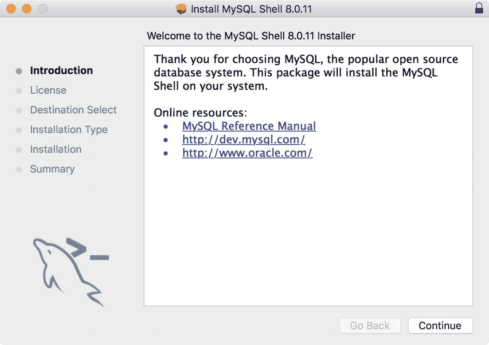
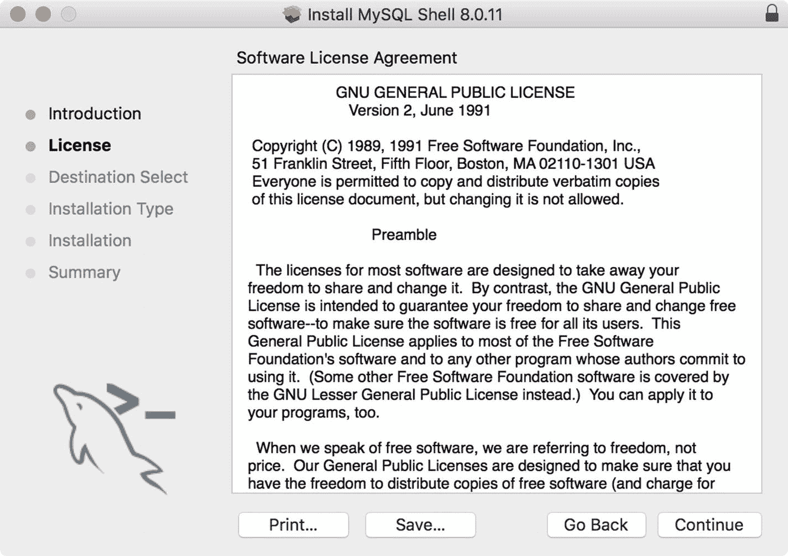

# 四、MySQL Shell

旧的 mysql 客户端(MySQL)最大的缺失之一是没有任何形式的脚本功能。但是，可以使用旧客户端处理一批 SQL 命令，并且客户端对编写存储例程(过程和函数)的支持有限。对于那些想要创建和使用脚本来管理他们的数据库(和服务器)的人来说，到目前为止已经有了外部工具选项，包括 MySQL Workbench 和 MySQL Utilities，但是没有专门用于合并多种脚本语言的工具。

MySQL Workbench 是 Oracle 的一款非常受欢迎的产品。MySQL Workbench 是一个 GUI 工具，设计为基于工作站的管理工具。它提供了许多功能，包括数据库设计和建模工具、SQL 开发、数据库管理、数据库迁移和 Python 脚本支持。有关 MySQL Workbench 的更多信息，请参见 [`http://dev.mysql.com/doc/workbench/en/`](http://dev.mysql.com/doc/workbench/en/) 。

另一方面，MySQL Utilities 是一组 Python 工具，用于帮助维护和管理 MySQL 服务器，只需一个命令就可以完成许多步骤或复杂的脚本编写。有用于管理服务器、使用复制等的工具。对于那些想要编写自己的 Python 脚本的人，包含了一个 Python 类库。有关 MySQL 实用程序的更多信息，请参见 [`https://dev.mysql.com/doc/mysql-utilities/1.6/en/`](https://dev.mysql.com/doc/mysql-utilities/1.6/en/) 。

Note

MySQL 实用程序目前仅限用于 MySQL 5.7。没有适用于 MySQL 8.0 或文档存储的版本。

除了这些产品之外，向 MySQL 客户端添加脚本语言的请求还没有得到回应。也就是说，直到现在。然而，Oracle 并没有重组现有的(并且相当长寿的)MySQL 客户端工具，而是发布了一个名为 MySQL Shell 的新客户端，它支持脚本语言、X DevAPI 以及 SQL 命令等等。但是新的 Shell 远不止这些。

在这一章中，我们将更详细地探讨 MySQL Shell。我们在第 3 章[中看到了 shell 的运行，但在这一章中，我们将了解更多关于它的主要特性和选项，以及如何使用新的 shell 来交互式地执行脚本。正如您将看到的，MySQL Shell 是 MySQL 未来的另一个关键元素。](03.html)

我建议在自己尝试 MySQL Shell 之前，至少通读一遍本章中的示例部分。所提供的信息将帮助您适应使用新的命令和连接，在您理解这些概念之前，这些命令和连接有时会有点混乱。

Note

我使用术语 shell 来指代 MySQL Shell 支持的特性或对象。我用 MySQL Shell 来指代产品本身。

## 入门指南

MySQL Shell 是 MySQL 产品组合中令人激动的新成员。MySQL Shell 代表了第一个连接到 MySQL 并与之交互的现代高级客户端。shell 可以用作脚本环境，用于开发处理数据的新工具和应用。尽管它支持 SQL 模式，但它的主要目的是允许用 JavaScript 和 Python 语言访问数据。没错；您可以编写 Python 脚本，并在 shell 中以交互方式或批处理方式执行它们。酷！

回想一下第 [1](01.html) 章，MySQL Shell 被设计成使用新的 X 协议通过 X 插件与服务器通信。然而，shell 也可以使用旧的协议连接到服务器，尽管在脚本模式下功能有限。这意味着，shell 允许您使用关系型(SQL)和/或 JSON 文档(NoSQL)。

SQL 模式的加入为学习如何使用脚本管理数据提供了一个很好的跳板。也就是说，您可以继续使用您的 SQL 命令(或批处理)，直到您将它们转换成 JavaScript 或 Python。此外，您可以使用这两者来确保您的迁移是完整的。图 [4-1](#Fig1) 展示了一个启动 MySQL Shell 的例子。请注意显示 MySQL 徽标、连接信息和模式的漂亮提示符。很好！


图 4-1

The MySQL Shell

以下各节从较高的层面介绍了 shell 的主要特性。我们不会探究每个特性或选项的每个细节，相反，本章提供了一个广泛的概述，以便您可以快速入门，更重要的是，了解关于 shell 的足够信息，以便您可以按照本书中的示例进行操作。

有关 MySQL Shell 的更多信息，请参见在线 MySQL 参考手册中标题为“MySQL Shell 用户指南”的部分。

### 特征

MySQL Shell 有许多特性，包括支持传统的 SQL 命令处理、脚本原型，甚至支持定制 Shell。下面我列出了 shell 的一些主要特性。大多数功能都可以通过命令行选项或特殊的 shell 命令来控制。在后面的章节中，我将深入探讨一些更重要的特性。

*   日志记录:您可以创建一个会话日志，供以后分析或保存消息记录。您可以使用`--log-level`选项设置详细程度，范围从 1(无记录)到 8(最大调试)。
*   输出格式:shell 支持三种格式选项:table ( `--table`)，这是您从旧客户端习惯的传统网格格式；选项卡式，使用制表符分隔显示信息，用于批处理执行；以及 JSON ( `--json`)，它以更易于阅读的方式格式化 JSON 文档。这些是您在启动 shell 时指定的命令行选项。
*   交互式代码执行:使用 shell 的默认模式是交互式模式，它像传统的客户机一样工作，在这里输入命令并获得响应。
*   批处理代码执行:如果您想在没有交互式会话的情况下运行脚本，您可以使用 shell 以批处理模式运行脚本。但是，输出仅限于非格式化输出(但可以用`--interactive`选项覆盖)。
*   脚本语言:shell 支持 JavaScript 和 Python，尽管您一次只能使用一种。
*   会话:会话本质上是到服务器的连接。shell 允许您存储和删除会话。我们将在后面的章节中看到更多关于会话的内容。
*   启动脚本:您可以定义一个在 shell 启动时执行的脚本。您可以用 JavaScript 或 Python 编写脚本。
*   命令历史和命令完成:shell 保存您输入的命令，允许您使用上下箭头键调用它们。shell 还为已知的关键字、API 函数和 SQL 关键字提供代码补全。
*   全局变量:shell 提供了一些在交互模式下可以访问的全局变量。其中包括以下内容:
    *   `session`:全局会话对象(如果已建立)
    *   `db`:通过连接建立的模式
    *   `dba`:用于使用 InnoDB 集群的 AdminAPI 对象
    *   `shell`:使用 Shell 的通用功能
    *   `util`:与服务器一起工作的实用功能
*   定制提示:您还可以通过使用特殊格式更新名为`~/.mysqlsh/prompt.json`的配置文件或者定义名为`MYSQLSH_PROMPT_THEME`的环境变量来更改默认提示。请参阅 MySQL Shell 参考手册，了解有关更改提示符的更多详细信息。
*   自动完成:从 8.0.4 开始，shell 允许用户在 SQL 模式下按 TAB 键自动完成关键字，在 JavaScript 和 Python 模式下自动完成主要的类和方法。

### Shell 命令

与最初的 MySQL 客户端一样，有一些特殊的命令控制应用本身，而不是与数据交互(通过 SQL 或 X DevAPI)。要执行 shell 命令，请发出带斜杠(\)的命令。例如，`\help`打印所有 shell 命令的帮助。表 [4-1](#Tab1) 列出了一些更常用的 shell 命令。

表 4-1

Shell Commands

<colgroup><col align="left"> <col align="left"> <col align="left"></colgroup> 
| 命令 | 捷径 | 描述 |
| :-- | :-- | :-- |
| `\` |   | 开始多行输入(仅限 SQL 模式) |
| `\connect` | (`\c`) | 连接到服务器 |
| `\help` | (`\?`，`\h`) | 打印帮助文本 |
| `\js` |   | 切换到 JavaScript 模式 |
| `\nowarnings` | (`\w`) | 不显示警告 |
| `\py` |   | 切换到 Python 模式 |
| `\quit` | (`\q`，`\exit`) | 放弃 |
| `\source` | (`\.`) | 执行指定的脚本文件 |
| `\sql` |   | 切换到 SQL 模式 |
| `\status` | (`\s`) | 打印有关连接的信息 |
| `\use` | (`\u`) | 设置会话的模式 |
| `\warnings` | (`\W`) | 在每个语句后显示警告 |

注意，您可以使用`\sql`、`\js`和`\py` shell 命令来动态切换模式。这使得处理 SQL 和 NoSQL 数据更加容易，因为您不必退出应用来切换模式。此外，即使使用了启动选项来设置模式，也可以使用这些 shell 命令。

Tip

要获得任何 shell 命令的帮助，请使用`\help`命令。例如，要了解更多关于`\connect`命令的信息，请输入`\help connect`。

最后，注意您退出 shell 的方式(`\q`或`\quit`)。如果您像以前一样在旧客户端中键入 quit，shell 将根据您所处的模式做出不同的响应。以下是每种模式下发生的情况的示例。

```sql
MySQL  SQL > quit;
ERROR: You have an error in your SQL syntax; check the manual that corresponds to your MySQL server version for the right syntax to use near 'quit' at line 1
 MySQL  SQL > \js
Switching to JavaScript mode...
 MySQL  JS > quit
ReferenceError: quit is not defined
 MySQL  JS > \py
Switching to Python mode...
 MySQL  Py > quit
Use quit() or Ctrl-D (i.e. EOF) to exit
 MySQL  Py > \q
Bye!

```

如果您习惯了旧的 MySQL 客户端，并且不小心使用了旧的客户端命令，您可能会看到类似的奇怪现象，但是只需要经常使用它就可以提醒您要使用的正确命令。现在，让我们看看 shell 的启动选项。

Note

与需要服务器连接才能启动的旧客户端不同，当您在没有指定服务器连接的情况下启动 shell 时，shell 将会运行，但它没有连接到服务器。您必须使用`\connect` shell 命令来连接到服务器。

### 选择

可以使用几个控制模式、连接、行为等的启动选项来启动 shell。本节介绍一些您可能想要使用的更常用的选项。我们将在后面的章节中看到更多关于连接选项的内容。表 [4-2](#Tab2) 显示了常见 Shell 选项的列表。

表 4-2

Common MySQL Shell Options

<colgroup><col align="left"> <col align="left"></colgroup> 
| [计]选项 | 描述 |
| :-- | :-- |
| `-f, --file=file` | 处理要执行的文件 |
| `-e, --execute=<cmd>` | 执行命令并退出 |
| `--uri` | 通过统一资源标识符(URI)连接 |
| `-h, --host=name` | 用于连接的主机名 |
| `-P, --port=#` | 用于连接的端口号 |
| `-S, --socket=sock` | UNIX 中用于连接的套接字名称或 Windows 中的命名管道名称(仅限经典会话) |
| `-u, --dbuser=name` | 用于连接的用户 |
| `--user=name` | dbuser 的别名 |
| `--dbpassword=name` | 连接到服务器时使用的密码 |
| `--password=name` | dbpassword 的别名 |
| `-p` | 请求密码提示以设置密码 |
| `-D --schema=name` | 要使用的架构 |
| `--database=name` | `--schema`的别名 |
| `--sql` | 以 SQL 模式启动 |
| `--sqlc` | 使用经典会话在 SQL 模式下启动 |
| `--sqlx` | 使用创建 X 协议会话在 SQL 模式下启动 |
| `--js` | 以 JavaScript 模式启动 |
| `--py` | 以 Python 模式启动 |
| `--json` | 以 JSON 格式生成输出 |
| `--table` | 以表格格式生成输出(默认为交互模式) |
| `-i, --interactive[=full]` | 为了在批处理模式下使用，它强制模拟交互模式处理。批处理中的每一行都像在交互模式下一样进行处理。 |
| `--log-level=value` | 日志级别；值必须是 1 到 8 之间的整数或[`none`、`internal`、`error`、`warning`、`info`、`debug`、`debug2`、`debug3`中的任意一个] |
| `--mx --mysqlx` | 创建一个 X 协议会话(简称为会话) |
| `--mc --mysql` | 创建经典(旧协议)会话 |
| `--ma` | 使用自动协议选择创建会话 |
| `--nw, --no-wizard` | 禁用执行脚本的向导模式(非交互式)。 |
| `--ssl-mode` | 为连接启用 SSL(使用其他标志自动启用) |
| `--ssl-key=name` | PEM 格式的 X509 密钥 |
| `--ssl-cert=name` | PEM 格式的 X509 证书 |
| `--ssl-ca=name` | PEM 格式的 CA 文件(查看 OpenSSL 文档) |
| `--ssl-capath=dir` | CA 目录。 |
| `--ssl-cipher=name` | 要使用的 SSL 密码。 |
| `--ssl-crl=name` | 证书吊销列表。 |
| `--ssl-crlpath=dir` | 证书吊销列表路径。 |
| `--tls-version=version` | 要使用的 TLS 版本，允许的值为:TLSv1，TLSv1.1。 |
| `--auth-method=method` | 要使用的身份验证方法。 |
| `--dba=enableXProtocol` | 在连接到的服务器中启用 X 协议。必须和`--mysql`一起使用。 |

请注意，有些选项的别名与原始客户端的用途相同。如果您有启动客户机来执行操作的脚本，这使得切换到 shell 变得更容易一些。请注意，还有一组使用安全套接字层(SSL)连接的选项。

其中大部分都是不言自明的，我们以前也见过一些。现在让我们看看可用的会话和连接以及如何使用它们。

要获得选项的完整列表，请使用- help 选项执行 shell，如下所示。

```sql
$ mysqlsh --help
MySQL Shell 8.0.11

Copyright (c) 2016, 2018, Oracle and/or its affiliates. All rights reserved.

Oracle is a registered trademark of Oracle Corporation and/or its affiliates. Other names may be trademarks of their respective owners.

Usage: mysqlsh [OPTIONS] [URI]
       mysqlsh [OPTIONS] [URI] -f <path> [script args...]
       mysqlsh [OPTIONS] [URI] --dba [command]
       mysqlsh [OPTIONS] [URI] --cluster

  -?, --help                  Display this help and exit.
  -e, --execute=<cmd>         Execute command and quit.
  -f, --file=file             Process file.
  --uri=value                 Connect to Uniform Resource Identifier. Format:
                              [user[:pass]@]host[:port][/db]
  -h, --host=name             Connect to host.
  -P, --port=#                Port number to use for connection.
  -S, --socket=sock           Socket name to use in UNIX, pipe name to use in
                              Windows (only classic sessions).
  -u, --dbuser=name           User for the connection to the server.
  --user=name                 see above
  -p, --password[=name]       Password to use when connecting to server.
  --dbpassword[=name]         see above
  -p                          Request password prompt to set the password
  -D, --schema=name           Schema to use.
  --database=name             see above
  --recreate-schema           Drop and recreate the specified schema.Schema
                              will be deleted if it exists!
  -mx, --mysqlx               Uses connection data to create Creating an X
                              protocol session.
  -mc, --mysql                Uses connection data to create a Classic Session.
  -ma                         Uses the connection data to create the session
                              withautomatic protocol detection.
...

```

### 会话和模式

与最初的客户机以及实际上大多数 MySQL 客户机应用一样，您需要连接到 MySQL 服务器，以便可以运行命令。MySQL Shell 支持多种连接 MySQL 服务器的方式和多种与服务器交互的选项(称为会话)。在会话中，您可以更改 shell 接受命令的方式(称为模式),以包括 SQL、JavaScript 或 Python 命令。

考虑到使用服务器的所有不同的新概念，那些初学使用 shell 的人可能会发现其中的细微差别，甚至有时会感到困惑。事实上，在线 MySQL Shell 参考手册和各种博客及其他报告有时会互换使用模式和会话，但正如您将看到的，它们是不同的(无论多么微妙)。下面几节阐明了每个主要概念，包括会话、模式和连接，以便您可以更快地适应新方法。我首先用一些简单的例子介绍概念，然后用例子详细讨论如何建立连接。让我们从查看可用的会话对象开始。

#### 会话对象

关于会话，首先要理解的是，会话是到单个服务器的连接。第二件要理解的事情是，每个会话可以使用两个会话对象中的一个来启动，这两个会话对象公开了一个特定的对象，用于使用特定的通信协议与 MySQL 服务器一起工作。也就是说，会话是到服务器的连接(定义了所有参数)，会话对象是 shell 用来以几种方式之一与服务器进行交互的对象。更具体地说，MySQL Shell 会话对象简单地定义了如何与服务器交互，包括支持什么模式，甚至 Shell 如何与服务器通信。shell 支持如下两个会话对象:

*   会话:X 协议会话用于应用开发，支持 JavaScript、Python 和 SQL 模式。通常用于开发脚本或执行脚本。要使用该选项启动 shell，请使用`--mx` ( `--mysqlx`)选项。
*   经典会话:使用旧的服务器通信协议，对 DevAPI 的支持非常有限。对没有 X 插件或不支持 X 协议的旧服务器使用这种模式。通常用于旧服务器的 SQL 模式。要使用该选项启动 shell，请使用`--mc` ( `--mysqlc`)选项。

Note

经典会话仅在 MySQL Shell 中可用。它不是 X DevAPI 的一部分。通过 X DevAPI，只有通过 X 协议的会话连接是可用的。

当您使用`\connect` shell 命令时，您可以通过指定`-mc`用于经典会话、`-mx`用于 X 协议会话或`-ma`用于自动协议选择来指定要使用的会话对象(协议)。下面依次展示了其中的每一个。注意<uri>指定了一个统一的资源标识符。</uri>

*   `\connect -mx <URI>`:使用 X 协议(会话)
*   `\connect -mc <URI>`:使用经典协议(经典会话)
*   `\connect -ma <URI>`:使用自动协议选择

召回会话大致等同于连接。但是，会话不仅仅是一个连接，因为它包含了用于建立连接的所有设置(包括会话对象)以及服务器使用的通信协议。因此，我们有时会遇到描述会话的术语“协议”。我们将在后面的章节中看到更多使用会话的例子。

Wait, What Session Was That???

您可能会看到使用多个名称描述的会话。特别地，正常的、默认的会话被称为会话，X 协议会话，或者更少见的，X 会话。这些是指通过 X 协议与 MySQL 通信的会话对象(连接)。较旧的服务器通信协议在称为经典会话的会话中受支持，经典，或更罕见地，旧协议。这些是指通过旧协议与 MySQL 服务器通信的会话对象(连接)。可悲的是，这些多重名字会使阅读不同的文本成为一种挑战。每当使用这些替代术语时，您应该努力阅读会话和经典会话。

有关以编程方式使用会话的更多信息，请参见在线 MySQL Shell 参考手册。

#### 支持的模式

shell 支持三种模式(也称为语言支持或简称为活动语言)；SQL、JavaScript 和 Python。回想一下，我们可以通过使用 shell 命令来启动这些模式中的任何一种。你可以随时切换模式(语言),每次都不会断线。下面列出了三种模式以及如何切换到每种模式。

*   `\sql`:切换到 SQL 语言
*   `\js`:切换到 JavaScript 语言(默认模式)
*   `\py`:切换到 Python 语言

现在我们已经了解了会话、会话对象、模式，我们可以看看如何连接 MySQL 服务器。

### 连接

在 shell 中建立连接可能需要一些时间来适应与最初的 MySQL 客户端不同的做法。 [<sup>1</sup>](#Fn1) 你可以使用一个特殊格式的 URI 字符串或者通过名字使用单独的选项连接到一个服务器(像旧的客户端)。也支持 SSL 连接。可以通过启动选项、shell 命令和脚本来建立连接。但是，所有连接都需要使用密码。因此，除非您另外声明，否则如果没有给出密码，shell 将提示您输入密码。

Note

如果您想使用没有密码的连接(不推荐)，您必须使用`--password`选项，或者，如果使用 URI，包括一个额外的冒号来代替密码。

下面不是讨论所有可用的连接方式和选项，而是在下面的部分中给出每种连接方式的一个示例。

#### 使用 URI

在 MySQL Shell 连接的情况下，URI 是使用以下格式编码的特殊字符串:`<dbuser>[:<dbpassword>]@host[:port][/schema/]`其中< >表示各种参数的字符串值。请注意，密码、端口和模式是可选的，但用户和主机是必需的。在这种情况下，Schema 是连接时要使用的默认模式(数据库)。

Note

X 协议的默认端口是 33060。

要在启动 shell 时使用命令行上的 URI 连接到服务器，请使用如下的`--uri`选项指定它。

```sql
$ mysqlsh --uri root:secret@localhost:33060

```

shell 假定所有连接都需要密码，如果没有提供密码，它将提示输入密码。 [<sup>2</sup>](#Fn2) 清单 [4-1](#Par72) 显示了先前在没有密码的情况下进行的相同连接。注意 shell 是如何提示输入密码的。

Tip

world_x 数据库是一个示例数据库，您可以从 [`https://dev.mysql.com/doc/index-other.html`](https://dev.mysql.com/doc/index-other.html) 下载。

```sql
$ mysqlsh --uri root@localhost:33060/world_x
Creating a session to 'root@localhost:33060/world_x'
Enter password:
Fetching schema names for autocompletion... Press ^C to stop.
Your MySQL connection id is 13 (X protocol)
Server version: 8.0.11 MySQL Community Server (GPL)
Default schema `world_x` accessible through db.
MySQL Shell 8.0.11

Copyright (c) 2016, 2018, Oracle and/or its affiliates. All rights reserved.

Oracle is a registered trademark of Oracle Corporation and/or its
affiliates. Other names may be trademarks of their respective
owners.

Type '\help' or '\?' for help; '\quit' to exit.

 MySQL  localhost:33060+  world_x  JS >

Listing 4-1Connecting with a URI

```

注意，我还在 URI 中用`/schema`选项指定了默认模式(`world_x`)。

#### 使用单个选项

您还可以使用单独的选项在 shell 命令行上指定连接。可用的连接选项如表 [4-1](#Tab1) 所示。为了向后兼容(并使向 MySQL Shell 的过渡更容易)，Shell 还支持用`--user`代替`--dbuser`，用`--password`代替`--dbpassword`，用`--database`代替`--schema`。清单 [4-2](#Par75) 展示了如何使用单独的选项连接到 MySQL 服务器。

```sql
$ mysqlsh --dbuser root --host localhost --port 33060 --schema world_x --py -mx
Creating an X protocol session to 'root@localhost:33060/world_x'
Enter password:
Fetching schema names for autocompletion... Press ^C to stop.
Your MySQL connection id is 14 (X protocol)
Server version: 8.0.11 MySQL Community Server (GPL)
Default schema `world_x` accessible through db.
MySQL Shell 8.0.11

Copyright (c) 2016, 2018, Oracle and/or its affiliates. All rights reserved.

Oracle is a registered trademark of Oracle Corporation and/or its
affiliates. Other names may be trademarks of their respective
owners.

Type '\help' or '\?' for help; '\quit' to exit.

 MySQL  localhost:33060+  world_x  Py >

Listing 4-2Connecting Using Individual Options

```

注意，我用`--py`选项将模式(语言)改为 Python。

#### 在脚本中使用连接

如果您计划使用 shell 来创建脚本或者仅仅作为一个原型工具，那么您也将希望在脚本中使用会话。在这种情况下，我们将创建一个变量来包含获取的会话。以这种方式创建的会话称为全局会话，因为一旦创建，它就可用于任何模式。

然而，根据我们使用的会话对象(回想一下这是经典或 X 协议)，我们将使用不同的方法创建一个 X 或经典会话。我们对 X 协议会话对象使用`getSession()`方法，对经典会话对象使用`getClassicSession()`方法。

Tip

如果你想知道更多关于 MySQL Shell 的内部信息，包括更多关于`mysql`和`mysqlx`模块的信息，请看 [`http://dev.mysql.com/doc/dev/mysqlsh-devapi/`](http://dev.mysql.com/doc/dev/mysqlsh-devapi/) 。

下面演示了在 JavaScript 中获取 X 协议会话对象。注意，我在 URI 中将密码指定为方法参数。

```sql
 MySQL  JS > var js_session = mysqlx.getSession('root@localhost:33060', 'secret')
 MySQL  JS > print(js_session)
<Session:root@localhost:33060>

```

下面演示了如何在 JavaScript 中获取经典会话对象。

```sql
 MySQL  JS > var js_session = mysql.getClassicSession('root@localhost:3306', 'secret')
 MySQL  JS > print(js_session)
<ClassicSession:root@localhost:3306>

```

What Happened To Port 3306?

如果您一直关注本节中的示例，您可能已经注意到我们使用的端口是 33060。这不是印刷错误。默认情况下，X 插件监听端口 33060，而不是服务器原来默认的端口 3306。事实上，端口 3306 仍然是旧协议的默认端口，您可以使用端口 3306 连接到服务器，但是您必须使用经典会话(mysqlsh-classic-ur oot-hlocalhost-port = 3306)。虽然这表明您可以使用旧的协议连接到服务器，但是回想一下，它确实限制了您可以做的事情，因为 DevAPI 在经典会话对象中并不完全受支持。

#### 使用 SSL 连接

您还可以创建 SSL 连接，以便安全地连接到您的服务器。要使用 SSL，您必须将服务器配置为使用 SSL。要在运行 MySQL 的同一台机器上使用 SSL，可以使用`--ssl-mode=REQUIRED`选项。您也可以指定 SSL 选项，如表 [4-1](#Tab1) 所示。您可以使用命令行选项在命令行上指定它们，或者将其作为`\connect` shell 命令的扩展。下面显示了如何使用 SSL 和命令行选项连接到服务器。

```sql
$ mysqlsh -uroot -h127.0.0.1 --port=33060 --ssl-mode=REQUIRED

```

Tip

有关加密连接的更多详细信息，请参见在线 MySQL Shell 参考手册中的“使用加密连接”一节。

现在我们知道了如何连接到我们的服务器，让我们回顾一下如何设置和安装 shell，更重要的是，确保 X 插件设置正确。

## 设置和安装

回想一下第 [2](02.html) 章，我们需要将 MySQL Shell 作为独立于服务器的产品进行安装。我们还必须在服务器中启用 X 插件。以下部分演示了安装 MySQL Shell 所需的步骤，以及如何配置 X 插件以供使用。虽然我们在第二章[中看到了一个关于如何安装 X 插件的简短例子，但是这一节将会更详细地介绍如何使用 MySQL Shell 自动安装 X 插件。](02.html)

Caution

如果您正在安装 MySQL Shell 8 . 0 . 4 版或更高版本，以便与 MySQL Server 8 . 0 . 4 版或更高版本一起使用，您将使用新的`caching_sha2_password`身份验证插件来使用 SSL 连接。默认情况下，这通常在安装过程中完成，但是如果您安装的服务器没有自动安装，或者您使用的是旧版本的服务器，则可能需要将服务器配置为使用 SSL 连接。更多信息请参见在线 MySQL 参考手册，或者更多关于认证默认值变更的信息，请阅读 [`https://mysqlserverteam.com/mysql-8-0-4-new-default-authentication-plugin-caching_sha2_password`](https://mysqlserverteam.com/mysql-8-0-4-new-default-authentication-plugin-caching_sha2_password) 的工程博客。

### 安装 MySQL Shell

安装 MySQL Shell 遵循与安装 MySQL 服务器相同的模式。也就是说，您可以简单地下载适用于您的平台的安装程序，并通过单击对话框面板来安装它。然而，有一个例外。在撰写本文时，MySQL Shell 的最新版本不是 MySQL Windows Installer 的一部分。

你可以在 [`http://dev.mysql.com/downloads/shell/`](http://dev.mysql.com/downloads/shell/) 上找到安装包。只需为您的平台选择最新的版本和包(在本例中是 macOS)并安装 shell。

当您启动`installer (.pkg or .dmg)`时，会出现一个欢迎对话框，其中包含您要安装的产品的名称和版本。图 [4-2](#Fig2) 显示了 MySQL Shell 安装程序的欢迎面板。



图 4-2

Installer welcome panel

请注意，在图 [4-2](#Fig2) 中，我正在安装 MySQL Shell 的发布候选版本，即版本 8.0.11。您应该安装适用于您的平台的最新版本的 shell，以确保您拥有最新的特性。

准备好后，点按“继续”。然后，您将看到如图 [4-3](#Fig3) 所示的最终用户许可协议。



图 4-3

License panel

阅读完许可证后， [<sup>3</sup>](#Fn3) 点击继续。您将被要求接受如图 [4-4](#Fig4) 所示的许可。单击同意继续。


图 4-4

Destination folder panel

一旦您接受了许可，并同意安装在默认位置(对于 macOS 来说，这总是一个好主意)，请点按“继续”。将要求您批准安装，如图 [4-5](#Fig5) 所示。准备好开始安装时，单击安装。

Tip

在 Windows 上安装时，Windows 可能会要求您批准升级安装。


图 4-5

Installation panel

这将开始将文件以及系统上的设置复制到目标位置，以确保您可以正确启动应用。根据您系统的速度，最多只需要 2 到 3 分钟就可以完成。

一旦安装完成，您将看到一个如图 [4-6](#Fig6) 所示的完成对话框。准备就绪后，单击关闭以完成安装。如果您选择启动 shell，您将看到一个新的命令窗口打开，shell 将启动。

回想一下，您可以在不指定服务器的情况下启动 shell，shell 将会运行，但它不会连接到任何 MySQL 服务器。如果您没有在命令行上指定服务器连接(URI 或单个选项)，您必须使用`\connect` shell 命令来连接到服务器。


图 4-6

Installation complete

现在 MySQL Shell 已经安装好了，我们需要配置 X 插件。

### 安装 X 插件

如果您在系统上安装了 MySQL 8.0.11 或更高版本，那么您已经安装并启用了 X 插件。然而，默认情况下，一些较旧的安装不会设置或启用 X 插件。因此，您可能需要启用插件来使用 shell 连接到您的服务器。尽管您仍然可以使用 shell 通过经典会话对象进行连接，但是在启用 X 插件之前，您将无法使用 X 协议会话对象。

此外，如果您使用 Windows Installer 在 Windows 上安装了服务器，则可以在安装过程中通过选中启用 X 协议/MySQL 作为文档存储复选框来启用 X 插件。如果你没有这样做或者安装在不同的平台上，至少有两种方法可以启用 X 插件；您可以使用新的 MySQL Shell，也可以使用旧的客户端。下面演示了每个选项。

Tip

如果在新安装的 MySQL 上连接到 MySQL 服务器有问题，请确保启用 X 插件，如本节所示。

#### 使用 MySQL Shell 启用 X 插件

要使用 MySQL Shell 启用 X 插件，使用用户和主机的单独选项启动一个经典会话，并指定如下所示的`--mysql`和`--dba enableXProtocol`选项。我们使用经典的会话对象，因为我们还没有启用 X 协议。

```sql
$ mysqlsh -uroot -hlocalhost --mysql --dba enableXProtocol
Creating a Classic session to 'root@localhost'
Enter password:
Fetching schema names for autocompletion... Press ^C to stop.
Your MySQL connection id is 285
Server version: 8.0.11 MySQL Community Server (GPL)
No default schema selected; type \use <schema> to set one.
enableXProtocol: Installing plugin mysqlx...
enableXProtocol: done

```

#### 使用 MySQL 客户端启用 X 插件

要使用旧的 MySQL 客户端启用 X 插件，您必须连接到服务器并手动安装插件。也就是没有新的魔法命令选项为你开启。这包括使用清单 [4-3](#Par110) 中所示的`INSTALL PLUGIN` SQL 命令。

```sql
$ mysql -uroot -p
Enter password:
Welcome to the MySQL monitor.  Commands end with ; or \g.
Your MySQL connection id is 343
Server version: 8.0.11 MySQL Community Server (GPL)

Copyright (c) 2000, 2018, Oracle and/or its affiliates. All rights reserved.

Oracle is a registered trademark of Oracle Corporation and/or its
affiliates. Other names may be trademarks of their respective
owners.

Type 'help;' or '\h' for help. Type '\c' to clear the current input statement.

mysql> INSTALL PLUGIN mysqlx SONAME 'mysqlx.so';
Query OK, 0 rows affected (0.00 sec)

mysql> SHOW PLUGINS \G
*************************** 1\. row ***************************
   Name: keyring_file
 Status: ACTIVE
   Type: KEYRING
Library: keyring_file.so
License: GPL

...

*************************** 43\. row ***************************
   Name: mysqlx
 Status: ACTIVE
   Type: DAEMON
Library: mysqlx.so
License: GPL
43 rows in set (0.00 sec)

Listing 4-3Enabling the X Plugin Using the MySQL Client

```

注意，我使用了`SHOW PLUGINS` SQL 命令来列出该命令前后安装的插件。为了清楚起见，我省略了一些冗长的输出。

Tip

您可以使用经典会话对象在 shell 中执行这些操作。对于习惯使用旧客户机的读者，我展示了使用旧客户机的命令。

有趣的是，您也可以使用如下的`UNINSTALL PLUGIN` SQL 命令卸载插件。如果您需要使用 X 协议来诊断连接，或者想要使用 MySQL Shell 仅使用经典会话对象来测试脚本，这可能会很有帮助。

```sql
mysql> UNINSTALL PLUGIN mysqlx;
Query OK, 0 rows affected (0.80 sec)

```

现在，让我们通过在三种模式(SQL、JavaScript 和 Python)下执行一个简单任务的演示来看看 MySQL Shell 的运行情况。

## 教程:MySQL Shell 示例

下面几节演示了如何在这三种模式下使用 MySQL shell。这个例子是在`world_x`数据库中插入新数据。将简要概述通过 shell 内置的 X DevAPI 对象，以及如何开始安装示例数据库。

本教程旨在提供一个完整的示例，展示如何使用 MySQL Shell 在所有支持的模式(语言)下解决一个任务。因此，我们将看到使用 SQL、JavaScript 和 Python 命令执行相同的任务。

任务是在数据库中插入新数据，然后进行搜索以检索满足包含新数据的条件的行。我使用关系表来说明这些概念，因为这对我们这些熟悉“普通”数据库操作的人来说更容易。然而，我们将在后面的章节中看到如何在文档存储中处理纯文档(集合)。

每个讲座都以一个示例开始，介绍如何连接到服务器，了解服务器支持什么(存在什么数据库)，如何插入新数据，以及如何查询数据。正如您将看到的，有些命令非常不同，但它们都产生相同的结果。虽然所示的 SQL 命令对大多数读者来说都很熟悉，但是我在这里包含它们是为了说明如何将这些命令与您选择的脚本语言等同起来。

Note

回想一下从第 [3](03.html) 章开始，在 shell 中开始写脚本并不是需要成为一个 JavaScript 高手甚至是一个 python ista[T3】4T5。事实上，你需要做的大部分事情都可以通过本书和在线 MySQL Shell 参考手册中的例子找到。](#Fn4)

我们将看到 JavaScript 和 Python 的操作与关系表上的 CRUD 操作一起工作。因此，我们不使用集合；相反，我们使用一个包含 JSON 数据类型列的关系表。我们将看到插入数据(创建)、选择数据(读取)、更新数据(更新)和删除数据(删除)的示例。

在开始我们的旅程之前，让我们花点时间安装我们将需要的示例数据库，Oracle 的`world_x`示例 MySQL 数据库。

### 安装示例数据库

Oracle 提供了几个示例数据库，供您在测试和开发应用时使用。样本数据库可以从 [`http://dev.mysql.com/doc/index-other.html`](http://dev.mysql.com/doc/index-other.html) 下载。我们想要使用的示例数据库被命名为`world_x`,以表明它包含 JSON 文档，并打算用 X DevAPI、shell 等进行测试。继续前进，导航到该页面并下载数据库。

示例数据库包含几个关系表(`country`、`city`和`countrylanguage`)以及一个集合(`countryinfo`)。在本章中我们将只使用关系表，但是在后面的章节中将会看到更多使用集合的例子。

下载完文件后，解压缩并记下文件的位置。我们进口的时候你会需要的。接下来，启动 MySQL Shell 并连接到您的服务器。使用`\sql` shell 命令切换到 SQL 模式，然后使用`\source` shell 命令读取`world_x.sql`文件并处理其所有语句。

清单 [4-4](#Par128) 显示了您应该看到的命令和响应的摘录。我在输出中突出显示了命令和一行，以表明这个 world 数据库确实允许在一个表中存储 JSON 文档。

```sql
 MySQL  JS > \connect root@localhost:33060
Creating a session to 'root@localhost:33060'
Enter password:
Your MySQL connection id is 9 (X protocol)
Server version: 8.0.11 MySQL Community Server (GPL)
No default schema selected; type \use <schema> to set one.
 MySQL  localhost:33060+ ssl  JS > \sql
Switching to SQL mode... Commands end with ;
 MySQL  localhost:33060+ ssl  SQL > \source /Users/cbell/Downloads/world_x-db/world_x.sql

...

Query OK, 0 rows affected (0.00 sec)

MySQL  localhost:33060+ ssl  SQL > SHOW DATABASES;
+--------------------+
| Database           |
+--------------------+
| animals            |
| contact_list1      |
| contact_list2      |
| contact_list3      |
| greenhouse         |
| information_schema |
| library_v1         |
| library_v2         |
| library_v3         |
| mysql              |
| performance_schema |
| rolodex            |
| sys                |
| test               |
| world_x            |
+--------------------+
15 rows in set (0.00 sec)
 MySQL  localhost:33060+ ssl  SQL > USE world_x;
Query OK, 0 rows affected (0.00 sec)
 MySQL  localhost:33060+ ssl  SQL > SHOW TABLES;
+-------------------+
| Tables_in_world_x |
+-------------------+
| city              |
| country           |
| countryinfo       |
| countrylanguage   |
+-------------------+
4 rows in set (0.00 sec)
MySQL  localhost:33060+ ssl  SQL > EXPLAIN city;
+-------------+----------+------+-----+---------+----------------+
| Field       | Type     | Null | Key | Default | Extra          |
+-------------+----------+------+-----+---------+----------------+
| ID          | int(11)  | NO   | PRI | NULL    | auto_increment |
| Name        | char(35) | NO   |     |         |                |
| CountryCode | char(3)  | NO   |     |         |                |
| District    | char(20) | NO   |     |         |                |
| Info        | json     | YES  |     | NULL    |                |
+-------------+----------+------+-----+---------+----------------+
5 rows in set (0.00 sec)

Listing 4-4Installing the world_x Database in SQL Mode

```

注意,`\source` shell 命令是一种加载文件并批量执行命令的方式。这是一种非常流行的重放常用命令序列的方法，它也适用于 JavaScript 和 Python 命令。

Tip

如果文件的路径中有空格，应该用双引号将路径括起来。

还可以在命令行上使用- recreate-schema 选项安装示例数据库，如下所示。请注意，如果数据库已经存在，这将删除并重新创建数据库。这是批处理运行 SQL 命令的另一个例子。

```sql
$ mysqlsh -uroot -hlocalhost --sql --recreate-schema --schema=world_x < ~/Downloads/world_x-db/world_x.sql
Enter password:
Recreating schema world_x...

```

当然，您可以使用 similar source 命令在旧客户机上安装 sample 数据库，但是这有什么意思呢？

现在，让我们看看 SQL 模式下的示例任务。

### 结构化查询语言

我们要做的任务是在 city 表中插入两行，在每一行中添加一个 JSON 文档，然后从表中读取数据，只读取那些有额外数据的行。更具体地说，我们将向表中添加一个名胜古迹列表，以便我们稍后可以询问哪些城市有名胜古迹。你可以把它当作一种方式，来添加你自己对那些你觉得有趣并会推荐给他人的城市中你去过的地方的评论。

因为本练习是一个示例，所以我们还将看到如何删除我们添加的数据，以便将数据库恢复到其原始状态。如果您计划按照这些示例进行操作，以便完成一个示例不会影响下一个示例的尝试，那么这样做也是有帮助的。

让我们首先列出服务器上的数据库，然后列出`world_x`数据库中的表。清单 [4-5](#Par138) 显示了完成这些步骤的熟悉的 SQL 命令的副本。为了简洁起见，我省略了一些消息。请注意，我使用命令选项在 SQL 模式下启动了 shell。

```sql
$ mysqlsh -uroot -hlocalhost --sql
Creating a session to 'root@localhost'
Enter password:
Your MySQL connection id is 13 (X protocol)
Server version: 8.0.11 MySQL Community Server (GPL)
No default schema selected; type \use <schema> to set one.
MySQL Shell 8.0.11

Copyright (c) 2016, 2018, Oracle and/or its affiliates. All rights reserved.

Oracle is a registered trademark of Oracle Corporation and/or its
affiliates. Other names may be trademarks of their respective
owners.

Type '\help' or '\?' for help; '\quit' to exit.

 MySQL  localhost:33060+ ssl  SQL > SHOW DATABASES;
+--------------------+
| Database           |
+--------------------+
| animals            |
| contact_list1      |
| contact_list2      |
| contact_list3      |
| greenhouse         |
| information_schema |
| library_v1         |
| library_v2         |
| library_v3         |
| mysql              |
| performance_schema |
| rolodex            |
| sys                |
| test               |
| world_x            |
+--------------------+
15 rows in set (0.00 sec)
 MySQL  localhost:33060+ ssl  SQL > USE world_x;
Query OK, 0 rows affected (0.00 sec) 

 MySQL  localhost:33060+ ssl  SQL > SHOW TABLES;
+-------------------+
| Tables_in_world_x |
+-------------------+
| city              |
| country           |
| countryinfo       |
| countrylanguage   |
+-------------------+
4 rows in set (0.00 sec)                                ... ;
Query OK, 0 rows affected (0.00 sec)
 MySQL  localhost:33060+ ssl  SQL > SHOW TABLES;
+-------------------+
| Tables_in_rolodex |
+-------------------+
| contacts          |
+-------------------+
1 row in set (0.00 sec)

Listing 4-5Listing and Using Databases—SQL Mode

```

接下来，我们插入一些数据。我们将在表中插入两行；我最近去过的每个城市都有一个(北卡罗来纳州的夏洛特和佛罗里达州的代托纳)。在这一步中，我们将使用`INSERT` SQL 命令来插入数据。回想一下前面的内容，我们需要仔细格式化 JSON 文档，这样我们就不会遇到错误。特别是，我们希望添加包括姓名、国家代码和地区的结构化数据，但是我们还希望添加一个 JSON 文档，其中包含人口和名胜古迹的列表(数组)。回想一下第 [1](01.html) 章，我们可以在`INSERT`语句中通过内联创建 JSON 文档来做到这一点。下面显示了我们用来插入行的每个命令。

```sql
INSERT INTO world_x.city (Name, CountryCode, District, Info) VALUES ('Charlotte', 'USA', 'North Carolina', '{"Population": 792862, "Places_of_interest": [{"name": "NASCAR Hall of Fame"}, {"name": "Charlotte Motor Speedway"}]}');

INSERT INTO world_x.city (Name, CountryCode, District, Info) VALUES ('Daytona', 'USA', 'Florida', '{"Population": 590280, "Places_of_interest": [{"name": "Daytona Beach"}, {"name": "Motorsports Hall of Fame of America"}, {"name": "Daytona Motor Speedway"}]}');

```

Caution

不要在 JSON 文档的键名中使用空格。SQL 函数无法正确识别包含空格的键。

尽管这看起来有点混乱(确实如此)，但是如果您仔细阅读这些语句，您会看到 JSON 文档被编码为一个字符串。例如，第一次插入的 JSON 文档的格式良好的版本如下所示。很明显，这更容易阅读。您可以使用这样的格式输入语句，但是显示的结果没有额外的格式。

注意，我们保留了表中其他行的 population 键(选择一些并查看),我们还添加了一个名为`Places_of_interest`的数组来列出我们可能想去的地方。

```sql
{
  "Population": 792862,
  "Places_of_interest": [
    {
      "name": "NASCAR Hall of Fame"
    },
    {
      "name": "Charlotte Motor Speedway"
    }
  ]
}

```

Note

为了简洁起见，我从示例中截断了表格格式行(虚线)。

现在，让我们看看如果使用一个`SELECT` SQL 语句，数据会是什么样子。在这种情况下，我们将只按城市名选择两行，因为它们在表中是唯一的。以下是结果摘录。

```sql
MySQL  localhost:33060+ ssl  SQL > SELECT * FROM city WHERE Name in ('Charlotte', 'Daytona') \G
*************************** 1\. row ***************************
         ID: 3818
       Name: Charlotte
CountryCode: USA
   District: North Carolina
       Info: {"Population": 540828}
*************************** 2\. row ***************************
         ID: 4080
       Name: Charlotte
CountryCode: USA
   District: North Carolina
       Info: {"Population": 792862, "Places_of_interest": [{"name": "NASCAR Hall of Fame"}, {"name": "Charlotte Motor Speedway"}]}
*************************** 3\. row ***************************
         ID: 4081
       Name: Daytona
CountryCode: USA
   District: Florida
       Info: {"Population": 590280, "Places_of_interest": [{"name": "Daytona Beach"}, {"name": "Motorsports Hall of Fame of America"}, {"name": "Daytona Motor Speedway"}]}

```

很有意思，但是没有回答我们想问的问题。也就是哪些城市有名胜古迹？为此，我们需要使用许多为 JSON 数据类型设计的特殊函数。所有函数都以名称`JSON_*`开始。让我们依次来看看这三种方法，首先是如何在 JSON 文档中搜索具有特定键的行。在这种情况下，我们选择有兴趣地点的行的所有数据。

为了确定 JSON 文档是否有特定的键，我们使用了`JSON_CONTAINS_PATH()`函数。回忆路径只是对文档中的键的解析。在这种情况下，我们想知道 JSON 文档是否包含`Places_of_interest`的路径。因为函数在没有匹配时返回 0，在至少有一个匹配时返回 1，所以我们检查它是否等于 1。你可以省略等式，但是在试验新的特性和命令时最好是学究式的。我们还使用`‘all’`选项告诉函数返回所有的匹配(值)，而`‘one’`只返回第一个匹配。你也可以使用稍微正确一点的`IS NOT NULL`比较。

```sql
MySQL  localhost:33060+ ssl  SQL > SELECT * FROM city WHERE JSON_CONTAINS_PATH(info, 'all', '$.Places_of_interest') = 1 \G
*************************** 1\. row ***************************
         ID: 4080
       Name: Charlotte
CountryCode: USA
   District: North Carolina
       Info: {"Population": 792862, "Places_of_interest": [{"name": "NASCAR Hall of Fame"}, {"name": "Charlotte Motor Speedway"}]}
*************************** 2\. row ***************************
         ID: 4081
       Name: Daytona
CountryCode: USA
   District: Florida
       Info: {"Population": 590280, "Places_of_interest": [{"name": "Daytona Beach"}, {"name": "Motorsports Hall of Fame of America"}, {"name": "Daytona Motor Speedway"}]}
2 rows in set (0.00 sec)

```

现在，假设我们只想查看那些感兴趣的地方，而不是整个 JSON 文档。在这种情况下，我们需要使用`JSON_EXTRACT()`函数从文档中提取值。特别是，我们希望在`info`列中搜索数组`Places_of_interest`中的所有值。尽管这看起来很复杂，但正如你在下面看到的，这并不太糟糕。

```sql
MySQL  localhost:33060+ ssl  SQL > SELECT Name, District, JSON_EXTRACT(info, '$.Places_of_interest') as Sights FROM city WHERE JSON_EXTRACT(info, '$.Places_of_interest') IS NOT NULL \G
*************************** 1\. row ***************************
    Name: Charlotte
District: North Carolina
  Sights: [{"name": "NASCAR Hall of Fame"}, {"name": "Charlotte Motor Speedway"}]
*************************** 2\. row ***************************
    Name: Daytona
District: Florida
  Sights: [{"name": "Daytona Beach"}, {"name": "Motorsports Hall of Fame of America"}, {"name": "Daytona Motor Speedway"}]
2 rows in set (0.00 sec)

```

现在，如果我们只想检索`Places_of_interest`数组的值呢？在这种情况下，我们可以使用特殊格式的 JSON access 从数组中获取这些值。下面演示了这种技术。请注意以粗体突出显示的部分。

```sql
MySQL  localhost:33060+ ssl  SQL > SELECT Name, District, JSON_EXTRACT(info, '$.Places_of_interest[*].name') as Sights FROM city WHERE JSON_EXTRACT(info, '$.Places_of_interest') IS NOT NULL \G
*************************** 1\. row ***************************
    Name: Charlotte
District: North Carolina
  Sights: ["NASCAR Hall of Fame", "Charlotte Motor Speedway"]
*************************** 2\. row ***************************
    Name: Daytona
District: Florida
  Sights: ["Daytona Beach", "Motorsports Hall of Fame of America", "Daytona Motor Speedway"]
2 rows in set (0.00 sec)

```

好了，现在看起来容易多了，不是吗？这也是一个有点乱的 SQL 命令。如果这一切看起来有点痛苦，你是对的，的确如此。在 SQL 中处理 JSON 数据需要借助 JSON 函数，但是这是一个额外的步骤，在语法上可能有点混乱。有关每个 JSON_*函数的完整解释，请参阅在线 MySQL 参考手册。

如果您经常使用旧的 MySQL 客户端来查询具有宽行的数据，那么您可能已经使用了`\G`选项来以垂直格式显示结果，这使得读取数据更加容易。对于 shell，我们没有这个选项，但是我们可以使用`--json`选项来显示数据。虽然这个选项更容易阅读，但是它有点冗长。我们将在 Python 部分看到这一点。

最后，我们可以使用如下所示的`DELETE` SQL 命令删除这些行。

```sql
MySQL  localhost:33060+ ssl  SQL > DELETE FROM city WHERE Name in ('Charlotte', 'Daytona');
Query OK, 3 rows affected (0.00 sec)

```

现在，让我们看看使用 JavaScript 执行的相同操作。

### Java Script 语言

为了在 JavaScript 中执行示例任务，我们将使用 X 协议会话对象启动 shell，并传入`world_x`模式来演示如何保存一个步骤。然后，我们将使用全局`db`对象(有时称为变量)的`getTables()`方法来获取`world_x`数据库中的表列表。清单 [4-6](#Par161) 演示了这些命令。

```sql
$ mysqlsh -uroot -hlocalhost -mx --schema=world_x
Creating an X protocol session to 'root@localhost/world_x'
Enter password:
Your MySQL connection id is 15 (X protocol)
Server version: 8.0.11 MySQL Community Server (GPL)
Default schema `world_x` accessible through db.
MySQL Shell 8.0.11

Copyright (c) 2016, 2018, Oracle and/or its affiliates. All rights reserved.

Oracle is a registered trademark of Oracle Corporation and/or its
affiliates. Other names may be trademarks of their respective
owners.

Type '\help' or '\?' for help; '\quit' to exit.

 MySQL  localhost:33060+ ssl  world_x  JS > db
<Schema:world_x>
 MySQL  localhost:33060+ ssl  world_x  JS > db.getTables();
[
    <Table:city>,
    <Table:country>,
    <Table:countrylanguage>
]

Listing 4-6Listing and Using Databases—JavaScript Mode

```

现在，让我们插入数据。注意，在清单 [4-6](#Par163) 中，`db.getTables()`方法的结果显示了三个表。我们可以使用表名通过名称来引用表对象。例如，要访问城市表，我们使用`db.city`。为了插入数据，我们将使用如下所示的`db.city.insert()`方法。

```sql
 MySQL  localhost:33060+ ssl  world_x  JS > db.city.insert("Name", "CountryCode", "District", "Info").values('Charlotte', 'USA', 'North Carolina', '{"Population": 792862, "Places_of_interest": [{"name": "NASCAR Hall of Fame"}, {"name": "Charlotte Motor Speedway"}]}');
Query OK, 1 item affected (0.00 sec)

 MySQL  localhost:33060+ ssl  world_x  JS > db.city.insert("Name", "CountryCode", "District", "Info").values('Daytona', 'USA', 'Florida', '{"Population": 590280, "Places_of_interest": [{"name": "Daytona Beach"}, {"name": "Motorsports Hall of Fame of America"}, {"name": "Daytona Motor Speedway"}]}');
Query OK, 1 item affected (0.00 sec)

```

Note

当以交互方式运行代码时，您可以省略大多数创建、读取、更新和删除操作的`execute()`函数调用，因为 MySQL Shell 以交互方式显式执行这些语句。例如，`insert()`函数通常需要链接 execute()函数来完成操作，但是您可以在交互模式下省略它。

现在我们有了数据，让我们用下面的代码选择行。这里我们对`TableSelect`对象(从`db.city.select`返回的对象)使用了`db.city.select()`方法和`where()`方法。请注意，我们指定了方括号内引用和列出的列的列表。在这个列表中，我们可以使用列名和特殊的`->`操作符来提取一个键，从而在 JSON 文档中指定数据。在这种情况下，我们希望文档中的`Places_of_interest`键(path)存储在 Info 列中。

```sql
MySQL  localhost:33060+ ssl  world_x  JS > db.city.select(["Name", "District", "Info->'$.Places_of_interest'"]).where("Info->'$.Places_of_interest' IS NOT NULL");
+-----------+----------------+--------------------------------------------+
| Name      | District       | JSON_EXTRACT(`Info`,'$.Places_of_interest')|
+-----------+----------------+--------------------------------------------+
| Charlotte | North Carolina | [{"name": "NASCAR Hall of Fame"}, {"name": "Charlotte Motor Speedway"}]               |
| Daytona   | Florida        | [{"name": "Daytona Beach"}, {"name": "Motorsports Hall of Fame of America"}, {"name": "Daytona Motor Speedway"}]        |
+-----------+----------------+--------------------------------------------+
2 rows in set (0.00 sec)

```

注意结果中的列类型。是 JSON 函数！这意味着我们可以在代码中使用一个 JSON 函数，将结果列数据缩小到仅包含`Places_of_interest`数组的值，就像我们在 SQL 示例中所做的那样，如下所示。多酷啊。

```sql
MySQL  localhost:33060+ ssl  world_x  JS > db.city.select(["Name", "District", "JSON_EXTRACT(info, '$.Places_of_interest[*].name')"]).where("Info->'$.Places_of_interest' IS NOT NULL");
+-----------+----------------+--------------------------------------------+
| Name      | District       | JSON_EXTRACT(`info`,'$.Places_of_interest[*].name')                         |
+-----------+----------------+--------------------------------------------+
| Charlotte | North Carolina | ["NASCAR Hall of Fame", "Charlotte Motor Speedway"]                                 |
| Daytona   | Florida        | ["Daytona Beach", "Motorsports Hall of Fame of America", "Daytona Motor Speedway"]     |
+-----------+----------------+--------------------------------------------+
2 rows in set (0.00 sec)

```

现在，让我们删除为恢复数据而添加的行。

```sql
MySQL  localhost:33060+ ssl  world_x  JS > db.city.delete().where("Name in ('Charlotte', 'Daytona')");
Query OK, 2 items affected (0.00 sec)

```

好吧，没那么糟。如果您认为它似乎比 SQL 更具编程性，甚至可能更直观一点，那么您就对了。如果看起来有点奇怪，不要担心。在 shell 中使用脚本越多，就会变得越容易、越自然。这也是很好的实践，因为使用 MySQL 的未来是 MySQL Shell 和脚本语言！

现在，让我们看看与 Python 执行的相同脚本。

### 计算机编程语言

因为我们已经看到该任务演示了两次，所以我跳过了每个步骤的执行细节，并向您展示了我的 Python 会话的脚本。

您马上会注意到的一件事是，一旦我们从 db 对象获得了表，代码就与 JavaScript 示例相同，只是函数的名称拼写有点不同。这是故意的。因为 db 对象实际上是 shell 中的一个特殊变量，所以它在两种语言中具有相同的语法。当您开始使用 X DevAPI 对象时，您只会看到不同之处，我们将在第 [5](05.html) 章中看到更多细节。

Note

一般规则是，当函数由多个名称组成时，JavaScript 使用 camelCase，Python 使用下划线分隔的名称。比如分别是`createCluster()`和`create_cluster()`。在功能是单个单词的情况下，名称是相同的，即，“`select`”、“`insert`”、“`delete`”。

清单 [4-7](#Par177) 展示了使用 Python 运行任务的完整脚本。请注意，唯一的区别是获取表的调用。在这种情况下，我们使用 Python 中的`db.get_tables()`方法。它是具有相同功能的相同方法，只是根据典型的 Python 命名约定进行了不同的命名。

```sql
$ mysqlsh -uroot -hlocalhost -mx --py --schema=world_x
Creating an X protocol session to 'root@localhost/world_x'
Enter password:
Your MySQL connection id is 19 (X protocol)
Server version: 8.0.11 MySQL Community Server (GPL)
Default schema `world_x` accessible through db.
MySQL Shell 8.0.11

Copyright (c) 2016, 2018, Oracle and/or its affiliates. All rights reserved.

Oracle is a registered trademark of Oracle Corporation and/or its
affiliates. Other names may be trademarks of their respective
owners.

Type '\help' or '\?' for help; '\quit' to exit.

 MySQL  localhost:33060+ ssl  world_x  Py > db
<Schema:world_x>
 MySQL  localhost:33060+ ssl  world_x  Py > db.get_tables()
[
    <Table:city>,
    <Table:country>,
    <Table:countrylanguage>
]
 MySQL  localhost:33060+ ssl  world_x  Py > db.city.insert("Name", "CountryCode", "District", "Info").values ('Charlotte', 'USA', 'North Carolina', '{"Population": 792862, "Places_of_interest": [{"name": "NASCAR Hall of Fame"}, {"name": "Charlotte Motor Speedway"}]}')
Query OK, 1 item affected (0.00 sec)
 MySQL  localhost:33060+ ssl  world_x  Py > db.city.insert("Name", "CountryCode", "District", "Info").values('Daytona', 'USA', 'Florida', '{"Population": 590280, "Places_of_interest": [{"name": "Daytona Beach"}, {"name": "Motorsports Hall of Fame of America"}, {"name": "Daytona Motor Speedway"}]}')
Query OK, 1 item affected (0.00 sec)
 MySQL  localhost:33060+ ssl  world_x  Py > db.city.select(["Name", "District", "JSON_EXTRACT(info, '$.Places_of_interest[*].name')"]).where("Info->'$.Places_of_interest' IS NOT NULL")
+-----------+----------------+--------------------------------------------+
| Name      | District       | JSON_EXTRACT(`info`,'$.Places_of_interest[*].name')                         |
+-----------+----------------+--------------------------------------------+
| Charlotte | North Carolina | ["NASCAR Hall of Fame", "Charlotte Motor Speedway"]                                 |
| Daytona   | Florida        | ["Daytona Beach", "Motorsports Hall of Fame of America", "Daytona Motor Speedway"]     |
+-----------+----------------+--------------------------------------------+
2 rows in set (0.00 sec)
 MySQL  localhost:33060+ ssl  world_x  Py > db.city.delete().where("Name in ('Charlotte', 'Daytona')")
Query OK, 2 items affected (0.00 sec)

Listing 4-7Listing, Inserting, Selecting, and Deleting in Databases—Python Mode

```

请注意代码与 JavaScript 版本的相似之处。这使得学习 X DevAPI 更容易，因为你可以使用你最喜欢的语言，甚至当你必须使用另一种语言时，一切都很熟悉。酷。

What About Other Languages?

虽然 shell 目前只支持 JavaScript 和 Python，但是 X DevAPI 并不局限于这些语言。其实也可以用 Java，。Net，以及 C++通过适当的连接器与 X DevAPI 一起工作。参见 [`http://dev.mysql.com/doc/`](http://dev.mysql.com/doc/) 上 X DevAPI 标题下的链接，了解更多关于使用各自的连接器用 X DevAPI 编写应用的信息。

## 摘要

对于 MySQL 客户端来说，MySQL Shell 是技术上的一次巨大飞跃。它不仅被设计成以更智能的方式与 MySQL 中的 SQL 一起工作；它还被设计成支持 JavaScript 和 Python 的原型。您可以使用任何您想要的语言，并在它们之间轻松切换，而不必重新启动应用或断开连接。这有多酷？

如果这还不够的话，X DevAPI 和内置对象的额外好处使得使用 shell 作为文档存储的前端意味着您不必编写单独的应用来管理您的数据。您只需选择适合您需求的模式(语言)，切换到该语言，然后执行任务。正如我们在第 [1](01.html) 章中所了解到的，shell 还构成了最新特性的前端，包括 InnoDB 集群，为您提供了满足所有 MySQL 管理、编程和高可用性需求的一站式客户端。

在本章中，我们学习了如何使用 MySQL Shell，包括启动选项、Shell 命令、连接、会话，我们甚至学习了如何用 JavaScript 和 Python 编写一些交互式脚本。因此，本章是学习如何开始使用 MySQL Shell 以及使用 JSON 和关系数据的关键章节。虽然这一章并没有详尽地介绍 MySQL Shell 的所有特性，但是它提供了一个广泛的教程，介绍了如何使用它来完成最常见的任务。

在第 [5](05.html) 章中，我将更详细地探索 X DevAPI，包括更仔细地观察可用于编写应用和脚本的对象和工具。我讨论了用 JavaScript 和 Python 访问文档存储的完整脚本。

Footnotes [1](#Fn1_source)

然而，如果您使用过 MySQL Fabric 或实用程序，使用 URI 进行连接会看起来非常熟悉。

  [2](#Fn2_source)

尽管您可以在 URI 中指定密码，但这是一种糟糕的安全做法。

  [3](#Fn3_source)

不，真的。你应该读一下。

  [4](#Fn4_source)

Python 大师经常以这种方式称呼自己。不要和说“你”的骑士混淆。——[`https://en.wikipedia.org/wiki/Knights_who_say_Ni`](https://en.wikipedia.org/wiki/Knights_who_say_Ni)