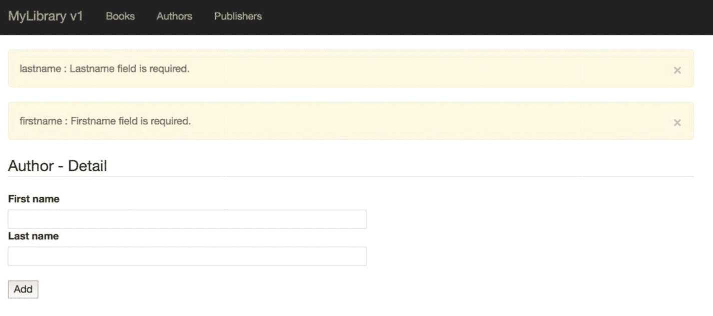
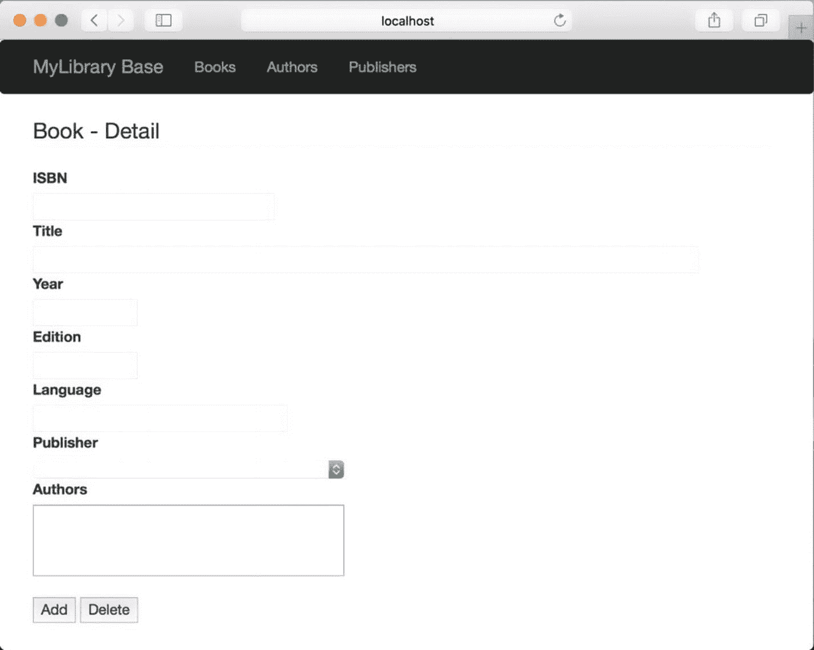
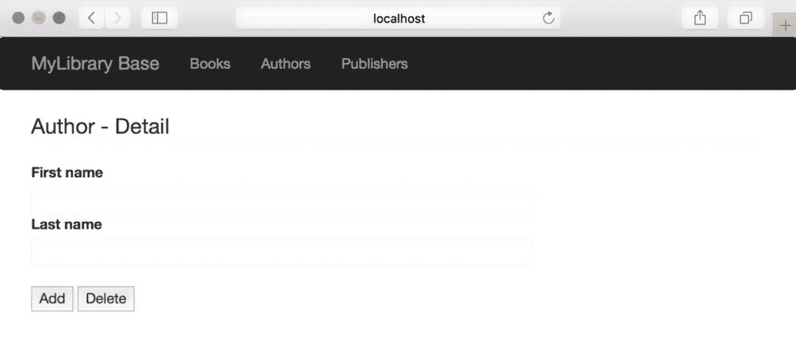
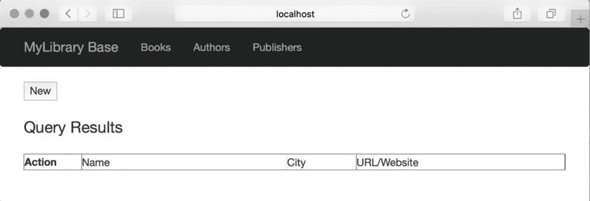

# 8.库应用程序:用户界面

现在我们已经了解了什么是 MySQL 文档存储以及如何通过 MySQL Shell 使用它，我们可以探索一个更复杂的示例，演示所描述的三种形式的数据存储:一个纯关系数据库解决方案，一个混合解决方案，其中我们使用 X DevAPI 的 SQL 特性来使用一个或多个 JSON 字段，以及一个纯文档存储解决方案，它专门使用 X DevAPI(NoSQL 解决方案)。因此，我们将看到应用程序在三个独立的实现中实现。

但是，我们必须首先了解示例应用程序是如何设计的，以及它是如何工作的。毕竟，最好的例子应该是读者可以在自己的环境中使用的。因此，这个例子必须足够复杂和完整才有意义。

为了延续前面章节中代码的可理解性，我们将在应用程序中使用 Python，因为 Python 非常容易学习，代码阅读起来比其他语言更清晰。但是如果你喜欢另一种语言，也不用担心。您可以很容易地将本章中的代码改写成支持 X DevAPI 的连接器的任何语言。

另一方面，用户界面使事情变得有点复杂。我们可以通过使用熟悉的用户界面设计来缓解这一问题。为此，我们将使用一个 web 应用程序。不幸的是，用纯 Python 编写一个 web 应用程序是单调乏味的，并且需要更多关于 web 应用程序如何工作的知识，这超出了人们对这种规模的工作的期望。

为了克服这个挑战，我们将使用一个流行的 Python web 应用程序框架。在这种情况下，我们将使用 Flask，包括入门、教程和用户界面代码的演练。正如您将看到的，Flask 也很容易学习，只需要学习少量的细微差别和概念。Flask 最初是由阿明·罗纳彻开发的，已经被证明是 Python 最简单、最稳定的 web 平台之一。

在第 [9](09.html) 章中，我们将添加前面描述的数据库访问方法来完成应用程序。

## 入门指南

如果您想继续并实现示例项目，您需要在您的计算机上安装一些东西。本节将帮助您为计算机准备所需的工具:您需要安装什么以及如何配置您的环境。我们还将看到一个关于用户界面工具的简短介绍。让我们从更详细的应用程序描述开始。

### 图书馆应用

本章中的示例应用程序是一个相当简单的应用程序，旨在演示概念。它是完整的，因为它支持对数据的创建、读取、更新和删除(CRUD)操作。错误处理和用户界面组件不太复杂，以便将重点放在与数据的交互上。也就是说，我们将看到如何使用 Flask 在 Python 中实现一个健壮且美观的 web 界面。

应用程序的数据是一个简单的图书数据库。我们将存储书籍的基本信息，如 ISBN、书名、出版商等等。我们还会有一个笔记区，这样我们可以在书上做笔记。我在我的许多研究论文甚至一些更高级的项目中使用了类似的东西。操作的概念是记录每本书的书目信息以及关于内容的注释，以便以后可以使用它来创建参考文献列表。例如，如果一本书包含了与论文中某个主题相关的信息，我会添加一个注释，指明主题，列出页码和其他重要信息。笔记中的信息因我记录的内容而异，所以只需要在一个简单的文本字段中进行搜索。

与我用于研究的允许存储书籍、杂志、文章、博客等信息的应用程序不同，这一章的应用程序被简化为只存储书籍。这使得项目足够小，可以在没有不必要的细节的情况下进行讨论。本章的重点是研究迁移到文档存储的好处，而不是如何最好地实现媒体参考应用程序。

因此，基本操作将是存储和检索关于书籍、作者和出版商的信息。用户界面被设计为呈现数据库中所有书籍的列表，并具有编辑列表中任何书籍的选项。默认视图是 books，但是该应用程序的第一个版本(1 和 2)将允许您查看作者和出版商的列表。用户还可以创建新书(作者和出版商)，编辑和删除书籍。

当我们看到改变数据存储和检索方式对应用程序设计的影响时，应用程序的每个版本的行为都会稍有不同。每个项目的更详细的解释包含在后面讨论项目版本的章节中。

现在，让我们看看如何设置我们的计算机来运行示例应用程序项目。

### 设置您的环境

对你的环境的改变并不困难，也不漫长。我们将安装 Flask 和一些扩展，这是应用程序用户界面所需要的。Flask 是可以与 Python 一起使用的几个 web 库之一。这些 web 库使得用 Python 开发 web 应用程序比使用原始的 HTML 代码并为请求编写自己的处理程序和代码要容易得多。另外，Flask 并不难学。

我们需要安装的库如表 [8-1](#Tab1) 所示。该表列出了库/扩展的名称、简短描述以及产品文档的 URL。

表 8-1

List of Libraries Required

<colgroup><col align="left"> <col align="left"> <col align="left"></colgroup> 
| 图书馆 | 描述 | 文件 |
| :-- | :-- | :-- |
| 瓶 | Python Web API | [T2`http://flask.pocoo.org/docs/0.12/installation/`](http://flask.pocoo.org/docs/0.12/installation/) |
| 烧瓶脚本 | Flask 的脚本支持 | [T2`https://flask-script.readthedocs.io/en/latest/`](https://flask-script.readthedocs.io/en/latest/) |
| 烧瓶自举 | 用户界面的改进和增强 | [T2`https://pythonhosted.org/Flask-Bootstrap/`](https://pythonhosted.org/Flask-Bootstrap/) |
| 烧瓶-WTF | WTForms 集成 | [T2`https://flask-wtf.readthedocs.io/en/latest/`](https://flask-wtf.readthedocs.io/en/latest/) |
| WTForms | 表单验证和呈现 | [T2`https://wtforms.readthedocs.io/en/latest/`](https://wtforms.readthedocs.io/en/latest/) |

Note

根据您的系统配置，您可能会看到为本节安装的组件安装了更多或更少的组件。

当然，您应该已经在系统上安装了 Python。如果没有，请务必下载并安装最新版本的 2。x 或 3。x 版。本章中的示例代码是用 Python 2.7.10 和 Python 3.6.0 测试的。

要安装这些库，我们可以使用 Python 包管理器`pip`，从命令行安装这些库。大多数 Python 发行版中都包含了`pip`实用程序，但是如果您需要安装它，可以在 [`https://pip.pypa.io/en/latest/installing/`](https://pip.pypa.io/en/latest/installing/) 查看安装文档。

如果需要在 Windows 上安装 pip，需要下载一个安装程序，`get-pip.py` ( [`https://pip.pypa.io/en/stable/installing/#installing-with-get-pip-py`](https://pip.pypa.io/en/stable/installing/#installing-with-get-pip-py) )，然后将安装目录的路径添加到`PATH`环境变量中。有几篇文章更详细地记录了这个过程。你可以谷歌一下“在 Windows 10 上安装 pip”，找到包括 [`https://matthewhorne.me/how-to-install-python-and-pip-on-windows-10/`](https://matthewhorne.me/how-to-install-python-and-pip-on-windows-10/) 在内的几个，都是最准确的。

Note

如果您的系统上安装了多个版本的 Python，那么`pip`命令将安装到默认的 Python 版本环境中。要使用`pip`安装到特定版本，请使用`pipN`，其中`N`是版本。例如，`pip3`在 Python 3 环境中安装包。

`pip`命令非常方便，因为它使得安装注册的 Python 包——那些在 Python 包索引中注册的包，缩写为 PyPI[<sup>1</sup>](#Fn1)([`https://pypi.python.org/pypi`)——非常容易。`pip`命令将使用一个命令下载、解压和安装。让我们来看看如何安装我们需要的每个包。](https://pypi.python.org/pypi)

Caution

一些系统可能需要使用提升的权限运行 pip，例如`sudo` (Linux、macOS)，或者在命令窗口中以管理员用户身份运行(Windows 10)。如果安装由于权限问题而无法复制文件，您将知道是否需要提升权限。

#### 安装烧瓶

清单 [8-1](#Par25) 演示了如何使用命令`pip install flask`安装 Flask。请注意，该命令下载必要的组件，提取它们，然后运行每个组件的安装程序。在这种情况下，我们看到 Flask 由几个组件组成，包括 Werkzeug、MarkupSafe 和 Jinja2。我们将在“烧瓶初级读本”一节中了解更多。

```sql
$ pip3 install flask
Collecting flask
  Using cached Flask-0.12.2-py2.py3-none-any.whl
Collecting Werkzeug>=0.7 (from flask)
  Downloading Werkzeug-0.14.1-py2.py3-none-any.whl (322kB)
    100% |████████████████████████████████| 327kB 442kB/s
Collecting Jinja2>=2.4 (from flask)
  Using cached Jinja2-2.10-py2.py3-none-any.whl
Collecting itsdangerous>=0.21 (from flask)
  Using cached itsdangerous-0.24.tar.gz
Collecting click>=2.0 (from flask)
  Downloading click-6.7-py2.py3-none-any.whl (71kB)
    100% |████████████████████████████████| 71kB 9.4MB/s
Collecting MarkupSafe>=0.23 (from Jinja2>=2.4->flask)
  Using cached MarkupSafe-1.0.tar.gz
Installing collected packages: Werkzeug, MarkupSafe, Jinja2, itsdangerous, click, flask
  Running setup.py install for MarkupSafe ... done
  Running setup.py install for itsdangerous ... done
Successfully installed Jinja2-2.10 MarkupSafe-1.0 Werkzeug-0.14.1 click-6.7 flask-0.12.2 itsdangerous-0.24
Listing 8-1Installing Flask

```

#### 安装烧瓶-脚本

清单 [8-2](#Par27) 展示了如何使用命令`pip install flask-script`安装 Flask-Script。请注意，在这种情况下，我们看到安装检查先决条件及其版本。

```sql
$ pip3 install flask-script
Collecting flask-script
  Using cached Flask-Script-2.0.6.tar.gz
Requirement already satisfied: Flask in /Library/Frameworks/Python.framework/Versions/3.6/lib/python3.6/site-packages (from flask-script)
Requirement already satisfied: click>=2.0 in /Library/Frameworks/Python.framework/Versions/3.6/lib/python3.6/site-packages (from Flask->flask-script)
Requirement already satisfied: Jinja2>=2.4 in /Library/Frameworks/Python.framework/Versions/3.6/lib/python3.6/site-packages (from Flask->flask-script)
Requirement already satisfied: Werkzeug>=0.7 in /Library/Frameworks/Python.framework/Versions/3.6/lib/python3.6/site-packages (from Flask->flask-script)
Requirement already satisfied: itsdangerous>=0.21 in /Library/Frameworks/Python.framework/Versions/3.6/lib/python3.6/site-packages (from Flask->flask-script)
Requirement already satisfied: MarkupSafe>=0.23 in /Library/Frameworks/Python.framework/Versions/3.6/lib/python3.6/site-packages (from Jinja2>=2.4->Flask->flask-script)
Installing collected packages: flask-script
  Running setup.py install for flask-script ... done
Successfully installed flask-script-2.0.6
Listing 8-2Installing Flask-Script

```

#### 安装烧瓶-引导程序

清单 [8-3](#Par29) 展示了如何使用命令`pip install flask-bootstrap`安装 Flask-Bootstrap。我们再次看到安装检查先决条件及其版本，以及依赖组件的安装。

```sql
$ pip3 install flask-bootstrap
Collecting flask-bootstrap
  Downloading Flask-Bootstrap-3.3.7.1.tar.gz (456kB)
    100% |████████████████████████████████| 460kB 267kB/s
Requirement already satisfied: Flask>=0.8 in /Library/Frameworks/Python.framework/Versions/3.6/lib/python3.6/site-packages (from flask-bootstrap)
Collecting dominate (from flask-bootstrap)
  Downloading dominate-2.3.1.tar.gz
Collecting visitor (from flask-bootstrap)
  Downloading visitor-0.1.3.tar.gz
Requirement already satisfied: click>=2.0 in /Library/Frameworks/Python.framework/Versions/3.6/lib/python3.6/site-packages (from Flask>=0.8->flask-bootstrap)
Requirement already satisfied: Jinja2>=2.4 in /Library/Frameworks/Python.framework/Versions/3.6/lib/python3.6/site-packages (from Flask>=0.8->flask-bootstrap)
Requirement already satisfied: Werkzeug>=0.7 in /Library/Frameworks/Python.framework/Versions/3.6/lib/python3.6/site-packages (from Flask>=0.8->flask-bootstrap)
Requirement already satisfied: itsdangerous>=0.21 in /Library/Frameworks/Python.framework/Versions/3.6/lib/python3.6/site-packages (from Flask>=0.8->flask-bootstrap)
Requirement already satisfied: MarkupSafe>=0.23 in /Library/Frameworks/Python.framework/Versions/3.6/lib/python3.6/site-packages (from Jinja2>=2.4->Flask>=0.8->flask-bootstrap)
Installing collected packages: dominate, visitor, flask-bootstrap
  Running setup.py install for dominate ... done
  Running setup.py install for visitor ... done
  Running setup.py install for flask-bootstrap ... done
Successfully installed dominate-2.3.1 flask-bootstrap-3.3.7.1 visitor-0.1.3
Listing 8-3Installing Flask-Bootstrap

```

#### 安装烧瓶-WTF

清单 [8-4](#Par31) 展示了如何使用命令`pip install flask-wtf`安装 Flask-WTF。

```sql
$ pip3 install flask-wtf
Collecting flask-wtf
  Downloading Flask_WTF-0.14.2-py2.py3-none-any.whl
Requirement already satisfied: WTForms in /Library/Frameworks/Python.framework/Versions/3.6/lib/python3.6/site-packages (from flask-wtf)
Requirement already satisfied: Flask in /Library/Frameworks/Python.framework/Versions/3.6/lib/python3.6/site-packages (from flask-wtf)
Requirement already satisfied: Jinja2>=2.4 in /Library/Frameworks/Python.framework/Versions/3.6/lib/python3.6/site-packages (from Flask->flask-wtf)
Requirement already satisfied: click>=2.0 in /Library/Frameworks/Python.framework/Versions/3.6/lib/python3.6/site-packages (from Flask->flask-wtf)
Requirement already satisfied: Werkzeug>=0.7 in /Library/Frameworks/Python.framework/Versions/3.6/lib/python3.6/site-packages (from Flask->flask-wtf)
Requirement already satisfied: itsdangerous>=0.21 in /Library/Frameworks/Python.framework/Versions/3.6/lib/python3.6/site-packages (from Flask->flask-wtf)
Requirement already satisfied: MarkupSafe>=0.23 in /Library/Frameworks/Python.framework/Versions/3.6/lib/python3.6/site-packages (from Jinja2>=2.4->Flask->flask-wtf)
Installing collected packages: flask-wtf
Successfully installed flask-wtf-0.14.2
Listing 8-4Installing Flask-WTF

```

#### 安装 WTForms

下面演示了如何使用命令`pip install WTforms`安装 WTForms。在这种情况下，安装很简单，因为我们只需要一个包。

```sql
$ pip3 install wtforms
Collecting wtforms
  Using cached WTForms-2.1.zip
Installing collected packages: wtforms
  Running setup.py install for wtforms ... done
Successfully installed wtforms-2.1

```

Using Python Virtual Environments

使用 Python 的一个好处是，你可以使用虚拟环境来尝试一些东西。虚拟环境是 Python 的本地(认为是私有的)安装，您可以安装软件包并对 Python 环境进行更改，而不会影响系统上的全局 Python 安装。因此，例如，如果您使用虚拟环境安装 Flask，它只对该虚拟环境可用，不会影响任何其他虚拟环境或全局 Python 安装。

要使用虚拟环境，您必须安装`virtualenv`应用程序。不是所有的系统都有这个功能，事实上也不是所有的平台都支持这个功能(但是很多平台都支持)。要在 Linux 上安装虚拟环境，可以使用命令`sudo apt-get install python-virtualenv`。要在 macOS 上安装虚拟环境，请使用命令`sudo easy_install virtualenv`。要在 Windows 10 上安装虚拟环境，必须从 [`https://github.com/pypa/setuptools`](https://github.com/pypa/setuptools) 下载`ez_setup.py`(`setuptools`的一部分)。下载完成后，使用管理权限打开命令窗口，然后输入命令`python ez_setup.py`安装`easy_install`，然后输入命令`easy_install virtualenv`安装虚拟环境。

要创建和使用虚拟环境，发出命令`virtualenv project1`。这会创建一个名为`project1`的文件夹，其中包含虚拟环境文件，这些文件会跟踪在该环境中所做的所有更改。要激活环境，使用`source`命令。请注意，我们正在新的虚拟环境文件夹中调用一个脚本。这将改变您的提示，以表明您正在使用虚拟环境。要停用环境，在虚拟环境激活时使用`deactivate`命令。这将使您的 Python 环境返回到全局默认值。下面演示了 macOS 上的这些命令。

```sql
$ mkdir virtual_environments
$ cd virtual_environments
$ virtualenv project1
New python executable in /virtual_environments/project1/bin/python
Installing setuptools, pip, wheel...done.
$ source ./project1/bin/activate
[Do something Python related here. Changes apply only to the active virtual environment.]
(project1) $ deactivate

```

删除虚拟环境只需删除环境文件夹(在停用它之后):

```sql
$ deactivate
$ rm -r /virtual_environments/project1

```

有些人建议在尝试 Python 中的新事物时总是使用虚拟环境，对于一些东西，比如不受信任或未经尝试的库或者与现有安装的库冲突的库，这是一个好的实践。然而，对于主流项目，如 Flask 及其支持库，并不需要它。如果你想在进行的项目中使用虚拟环境，请随意。只需记住在发出任何 Python 命令之前激活它，并在完成后停用它。

要了解更多关于虚拟环境的信息，请参见 [`https://virtualenv.pypa.io/en/stable/`](https://virtualenv.pypa.io/en/stable/) 。

您还应该安装 MySQL 连接器/Python 8.0.5 或更高版本的数据库连接器。如果没有，从 [`https://dev.mysql.com/downloads/connector/python/`](https://dev.mysql.com/downloads/connector/python/) 下载并安装。如果您安装了多个版本的 Python，请确保将其安装在您想要使用的所有 Python 环境中。否则，在启动代码时，您可能会看到如下错误。

```sql
$ python3 ./mylibrary_v1.py runserver -p 5001
Traceback (most recent call last):
  File "./mylibrary_v1.py", line 18, in <module>
    from database.library_v1 import Library, Author, Publisher, Book
  File ".../Ch08/version1/database/library_v1.py", line 15, in <module>
    import mysql.connector
ModuleNotFoundError: No module named 'mysql'

```

Pip 也可以用来安装 MySQL 连接器/Python。下面显示了如何使用 PIP 安装连接器。

```sql
$ pip3 install mysql-connector-python
Collecting mysql-connector-python
  Downloading mysql_connector_python-8.0.6-cp36-cp36m-macosx_10_12_x86_64.whl (3.2MB)
    100% |████████████████████████████████| 3.2MB 16.9MB/s
Installing collected packages: mysql-connector-python
Successfully installed mysql-connector-python-8.0.6

```

如果您手动或从源代码安装了 MySQL Connector/Python，您可能还需要安装 Protobuf。你可以使用`pip`来安装它，如下图所示。

```sql
$ pip3 install protobuf
Collecting protobuf
  Downloading protobuf-3.5.1-py2.py3-none-any.whl (388kB)
    100% |████████████████████████████████| 389kB 414kB/s
Requirement already satisfied: setuptools in /Library/Frameworks/Python.framework/Versions/3.6/lib/python3.6/site-packages (from protobuf)
Requirement already satisfied: six>=1.9 in /Library/Frameworks/Python.framework/Versions/3.6/lib/python3.6/site-packages/six-1.10.0-py3.6.egg (from protobuf)
Installing collected packages: protobuf
Successfully installed protobuf-3.5.1

```

现在我们的计算机已经安装好了，让我们上一堂关于 Flask 及其相关扩展的速成课。

## 弗拉斯克第一

Flask 是与 Python 一起使用的几个 web 应用程序库(有时称为框架或应用程序编程接口——API)之一。Flask 在众多选择中是独一无二的，因为它很小，一旦你熟悉了它的工作原理，就很容易使用。也就是说，一旦编写了初始化代码，使用 Flask 的大部分工作将局限于创建网页、重定向响应和编写功能代码。

Flask 被认为是一个微型框架，因为它体积小、重量轻，而且它不会强迫你进入一个专门编写代码来与框架交互的盒子中。它提供了您需要的一切，让您自己选择在代码中使用什么。

Flask 由提供基本功能的两个主要组件组成:一个 Web 服务器网关接口(WSGI ),处理托管网页的所有工作；以及一个模板库，用于简化 web 页面开发，减少了学习 HTML 的需要，删除了重复的结构，并为 HTML 代码提供了脚本功能。WSGI 组件被命名为 Werkzeug，它是从德语中大致翻译过来的意思，“工作的东西”( [`http://werkzeug.pocoo.org/`](http://werkzeug.pocoo.org/) )。模板组件被命名为 Jinja2，并模仿 Django ( [`http://jinja.pocoo.org/docs/2.10/`](http://jinja.pocoo.org/docs/2.10/) )。两者都是由 Flask 的创始人开发和维护的。最后，当您安装 Flask 时，这两个组件都会被安装。

Flask 也是一个可扩展的库，允许其他开发人员创建基本库的附件(扩展)来添加功能。在上一节中，我们看到了如何安装 Flask 可用的一些扩展。我们将在本章中使用脚本、引导和 WTForms 扩展。能够挑选您想要的扩展意味着您可以保持您的应用程序尽可能小，只添加您需要的。

您可能认为 flask“缺少”的组件之一是与其他服务(如数据库系统)交互的能力。这是一个有目的的设计，像这样的功能可以通过扩展来实现。事实上，Flask 有几个可用的数据库扩展，包括那些允许您使用 MySQL 的扩展。但是，因为我们想要使用 X DevAPI，所以我们必须使用 Oracle 提供的连接器 MySQL Connector/Python。这不仅是可能的，也说明了你在使用 Flask 时的自由度；我们不局限于数据库服务器访问这样的特定功能，我们可以使用我们想要或需要的任何其他 Python 库。 [<sup>2</sup>](#Fn2)

Tip

如果你对 MySQL 对 Flask 的支持很好奇，请看 [`http://flask-mysql.readthedocs.io/en/latest/`](http://flask-mysql.readthedocs.io/en/latest/) 。

Flask 和前面描述的扩展一起，提供了用 Python 制作 Web 应用程序所需的所有连接和管道。它消除了编写 web 应用程序所需的几乎所有负担，例如解释客户机响应包、路由、HTML 表单处理等等。如果您曾经用 Python 编写过 web 应用程序，您将会体会到创建健壮的 web 页面的能力，而无需编写 HTML 和样式表的复杂性。一旦你熟悉如何使用 Flask，它将允许你专注于你的应用程序的代码，而不是花大量的时间编写用户界面。

现在，让我们开始学习 Flask！如果您不着急，尝试一下示例应用程序，您的第一个 Flask 应用程序将在第一次尝试时就能工作。学习 Flask 最难的部分已经过去了——安装 Flask 及其扩展。剩下的就是学习在 Flask 中编写应用程序的概念。在此之前，让我们了解一下 Flask 中的术语，以及如何设置我们将用来初始化本章中使用的应用程序实例的基本代码。

Tip

如果你想进一步了解 Flask，你应该考虑阅读在线文档、用户指南和 [`http://flask.pocoo.org/docs/0.12/`](http://flask.pocoo.org/docs/0.12/) 的例子。

### 术语

Flask 旨在简化编写 web 应用程序的繁琐过程。按照 Flask 的说法，使用代码的两个部分来呈现一个 web 页面:一个视图，它是在 HTML 文件中定义的；一个路由，它处理来自客户端的请求。回想一下，我们可以看到两个请求中的一个:一个是请求加载网页的`GET`请求(从客户端的角度读取)，另一个是从客户端通过网页向服务器发送数据的`POST`请求(从客户端的角度写入)。这两个请求都在 Flask 中使用您定义的函数进行处理。

然后，这些函数呈现网页，并将其发送回客户端以满足请求。Flask 调用函数视图函数(或简称视图)。Flask 知道调用哪个方法的方式是使用识别 URL 路径(在 Flask 中称为路由)的装饰器。你可以用一条或多条路线来装饰一个功能，这样就可以提供多种到达视图的方式。用的装饰师是`@app.route(<path>)`。以下显示了查看功能的多条路线的示例。

```sql
@app.route('/book', methods=['GET', 'POST'])
@app.route('/book/<string:isbn_selected>', methods=['GET', 'POST'])
def book(isbn_selected=None):
    notes = None
    form = BookForm()
    form.publisher.choices = []
    form.authors.choices = []
    new_note = ""
    if request.method == 'POST':
        pass
    return render_template("book.html", form=form, notes=notes)

```

注意这里有多个装饰者。第一个是 book，它允许我们使用一个 URL，比如`localhost:5000/book`，这使得 Flask 将执行路由到`book()`函数。第二个是`book/<isbn_selected>`，演示了如何使用变量向视图传递信息。在这种情况下，如果用户(应用程序)使用 URL `localhost:5000/book/978-1-4842-1294-3`，Flask 将值`978-1-4842-1294-3`放在`isbn_selected`变量中。这样，我们可以动态地将信息传递给我们的视图。

还要注意，路由指定了每条路由允许的方法。在这个应用程序中，我们可以为任何一个路由设置一个`GET`或`POST`。如果你离开装饰器，默认是`GET`只让网页只读。

最后，请注意，在函数的末尾，我们返回了对`render_template()`函数的调用(从 flask 模块导入),该函数告诉 flask 返回(刷新)带有我们获取或分配的数据的网页。网页，book.html，虽然视图的一部分在 Flask 中被称为表单。我们将使用这个概念从数据库中检索信息并将其发送给用户。我们可以返回一个简单的 HTML 字符串(或整个文件)或所谓的表单。因为我们使用 Flask-WTF 和 WTForms 扩展，所以我们可以返回一个呈现为表单类的模板。我们将在后面的章节中讨论表单、表单类以及章节项目的其他路径和视图。正如您将看到的，模板是另一个强大的功能，它使创建网页变得很容易。

What’s a Decorator?

在 Python 中，我们可以通过使用 decorators 来指定特殊的处理参数。装饰器只是改变函数行为的一种方式。例如，您可以使用 decorators 来添加更强的类型检查、定义宏以及在执行前后调用函数。Flask for routing 中的 decorator 是正确使用 decorator 的一些最好的例子。要了解更多关于装饰者的信息，请参见 [`https://www.python.org/dev/peps/pep-0318`](https://www.python.org/dev/peps/pep-0318) 。

Flask 构建了一个应用程序中所有路径的列表，使得应用程序在被请求时可以很容易地将执行路由到正确的函数。但是，如果请求了一条路由，但它不在应用程序中，会发生什么情况呢？默认情况下，您将得到一个类似于“`Not Found. The requested URL was not found on the server.`”的一般错误消息。我们将在后面的小节中看到如何添加我们自己的自定义错误处理路线。

现在我们已经了解了 Flask 中使用的术语以及它是如何与网页一起工作的，让我们来看看一个典型的 Flask 应用程序是如何构造的，它带有我们需要的扩展。

### 初始化和应用程序实例

Flask 及其扩展为您的 web 应用程序提供了入口点。Flask 会为您完成这些工作，而不是自己编写所有繁重的代码！我们将在本章使用的 Flask 扩展包括 Flask-Script、Flask-Bootstrap、Flask-WTF 和 WTForms。以下各节简要介绍了每一种方法。

#### 烧瓶脚本

Flask-Script 通过添加命令行解析器(显示为`manager`)来启用 Flask 应用程序中的脚本，您可以使用该解析器链接到您编写的函数。这可以通过用`@manager.command`修饰函数来实现。理解这为我们做了什么的最好方法是通过一个例子。

下面是一个基本的原始 Flask 应用程序，它什么也不做。它甚至不是一个“hello，world”示例，因为没有显示任何内容，也没有托管任何网页——它只是一个原始的 Flask 应用程序。

```sql
from flask import Flask      # import the Flask framework
app = Flask(__name__)        # initialize the application
if __name__ == "__main__":   # guard for running the code
    app.run()                # launch the application

```

注意这个`app.run()`调用。这称为服务器启动，在我们使用 Python 解释器加载脚本时执行。当我们运行这段代码时，我们看到的只是来自 Flask 的默认消息，如下所示。请注意，我们无法查看帮助，因为没有这样的选项。我们还看到代码使用 web 服务器的缺省值启动(如果需要，我们可以在代码中更改)。例如，我们可以改变服务器监听的端口。

```sql
$ python ./flask-ex.py --help
 * Running on http://127.0.0.1:5000/ (Press CTRL+C to quit)

```

使用 Flask-Script，我们不仅添加了帮助选项，还添加了控制服务器的选项。下面的代码显示了添加语句来启用 Flask-Script 是多么容易。新语句以粗体突出显示。

```sql
from flask import Flask          # import the Flask framework

from flask_script import Manager # import the flask script manager class

app = Flask(__name__)            # initialize the application

manager = Manager(app)           # initialize the script manager class

# Sample method linked as a command-line option

@manager.command

def hello_world():

    """Print 'Hello, world!'"""
    print("Hello, world!")

if __name__ == "__main__":       # guard for running the code
    manager.run()                # launch the application via manager class

```

当运行这段代码时，我们可以看到还有其他选项可用。请注意，文档字符串(紧跟在方法定义之后)显示为所添加命令的帮助文本。

```sql
$ python ./flask-script-ex.py --help
usage: flask-script-ex.py [-?] {hello_world,shell,runserver} ...

positional arguments:
  {hello_world,shell,runserver}
    hello_world         Print 'Hello, world!'
    shell               Runs a Python shell inside Flask application context.
    runserver           Runs the Flask development server i.e. app.run()

optional arguments:
  -?, --help            show this help message and exit

```

注意，我们看到了我们添加的命令行参数(命令)，`hello_world`，但是我们也看到了 Flask-Script 提供的两个新参数；外壳和`runserver`。启动服务器时，您必须选择其中一个命令。shell 命令允许您在 Python 解释器或类似工具中使用代码，而`runserver`执行代码来启动 web 服务器。

我们不仅可以获得关于命令和选项的帮助，Flask-Script 还提供了从命令行对服务器的更多控制。事实上，我们可以通过添加如下所示的`--help`选项来查看每个命令的所有选项。

```sql
$ python ./flask-script-ex.py runserver --help
usage: flask-script-ex.py runserver [-?] [-h HOST] [-p PORT] [--threaded]
                                    [--processes PROCESSES]
                                    [--passthrough-errors] [-d] [-D] [-r] [-R]
                                    [--ssl-crt SSL_CRT] [--ssl-key SSL_KEY]

Runs the Flask development server i.e. app.run()

optional arguments:
  -?, --help            show this help message and exit
  -h HOST, --host HOST
  -p PORT, --port PORT
  --threaded
  --processes PROCESSES
  --passthrough-errors
  -d, --debug           enable the Werkzeug debugger (DO NOT use in production
                        code)
  -D, --no-debug        disable the Werkzeug debugger
  -r, --reload          monitor Python files for changes (not 100% safe for
                        production use)
  -R, --no-reload       do not monitor Python files for changes
  --ssl-crt SSL_CRT     Path to ssl certificate
  --ssl-key SSL_KEY     Path to ssl key

```

请注意，我们可以控制服务器的所有方面，包括端口、主机，甚至它是如何执行的。

最后，我们可以执行我们修饰为命令行选项的方法，如下所示。

```sql
$ python ./flask-script-ex.py hello_world
Hello, world!

```

因此，Flask-Script 仅用几行代码就提供了一些非常强大的功能。你一定会喜欢的！

#### 烧瓶自举

Flask-Bootstrap 最初由 Twitter 开发，用于制作统一、美观的 web 客户端。幸运的是，他们已经把它扩展成了一个 Flask，这样每个人都可以利用它的特性。Flask-Bootstrap 是一个独立的框架，它提供了更多的命令行控制和用户界面组件，以获得干净、漂亮的网页。它也兼容最新的网络浏览器。

该框架在幕后发挥了神奇的作用，它是一个级联样式表(CSS)和脚本的客户端库，这些样式表和脚本是从 Flask 中的 HTML 模板(通常称为 HTML 文件或模板文件)调用的。我们将在后面的章节中学习更多关于模板的知识。因为是客户端，所以在主应用中初始化我们不会看到太多。不管怎样，下面显示了如何将 Flask-bootstrap 添加到我们的应用程序代码中。这里，我们看到我们有一个框架，其中初始化并配置了 Flask-Script 和 Flask-Bootstrap。

```sql
from flask import Flask          # import the Flask framework
from flask_script import Manager # import the flask script manager class
from flask_bootstrap import Bootstrap  # import the flask bootstrap extension

app = Flask(__name__)            # initialize the application
manager = Manager(app)           # initialize the script manager class
bootstrap = Bootstrap(app)       # initialize the bootstrap extension

if __name__ == "__main__":       # guard for running the code
    manager.run()                # launch the application via manager class

```

#### WTForms

WTForms 是我们需要用来支持 Flask-WTF 扩展的一个组件。它提供了 Flask-WTF 组件所提供的大部分功能(因为 Flask-WTF 组件是 WTForms 的 Flask 特定包装器)。因此，我们只需要安装它作为 Flask-WTF 的先决条件，我们将在 Flask-WTF 的上下文中讨论它。

Note

Flask-WTF 的一些包装装置可以包括 WTForms。

#### 烧瓶-WTF

Flask-WTF 扩展是一个有趣的组件，提供了几个非常有用的附加功能:最值得注意的是与 WTForms(一个框架不可知组件)的集成，它允许创建表单类，并以跨站点请求伪造(CSRF)保护的形式提供了额外的 web 安全性。这两个特性允许您将 web 应用程序提升到更高的复杂程度。

##### 表单类

表单类提供了一个类的层次结构，使得定义网页更加符合逻辑。使用 Flask-WTF，您可以使用两段代码定义表单；一个从 FormForm 类(从 Flask framework 导入)派生的特殊类，用于使用一个或多个提供对数据的编程访问的附加类以及一个用于呈现网页的 HTML 文件(或模板)来定义字段。这样，我们在 HTML 文件上看到了一个抽象层(表单类)。我们将在下一节看到更多关于 HTML 文件的内容。

使用 form 类，您可以定义一个或多个字段，例如 TextField 表示文本，StringField 表示字符串，等等。更好的是，您可以定义允许您以编程方式描述数据的验证器。例如，您可以为文本字段定义最小和最大字符数。如果提交的字符数超出范围，将生成一条错误消息。是的，你可以定义一个错误信息！下面列出了一些可用的验证器。查看 [`http://wtforms.readthedocs.io/en/latest/validators.html`](http://wtforms.readthedocs.io/en/latest/validators.html) 查看验证器的完整列表。

*   `DataRequired`:确定输入栏是否为空
*   `Email`:确保该字段遵循电子邮件 ID 约定
*   `IPAddress`:验证 IP 地址
*   `Length`:确保文本长度在给定范围内
*   `NumberRange`:确保文本是数字，并且在给定的范围内
*   `URL`:验证 URL

为了形成类，我们必须导入类和任何我们想在应用程序的序言中使用的字段类。下面显示了一个导入表单类和表单域类的示例。在这个例子中，我们还导入了一些验证器，用于自动验证数据。

```sql
from flask_wtf import FlaskForm
from wtforms import (HiddenField, TextField, TextAreaField, SelectField,
                     SelectMultipleField, IntegerField, SubmitField)
from wtforms.validators import Required, Length

```

要定义一个表单类，我们必须从`FlaskForm`派生一个新类。从那里，我们可以构造我们想要的类，但是它允许您定义字段。`FlaskForm`父类包括 Flask 需要实例化和使用 form 类的所有必要代码。

让我们看一个简单的例子。下面显示了作者网页的 form 类。作者表包含三个字段，我们将通过 view 函数将它链接到这段代码；自动递增字段(`authorid`)、作者的名(`firstname`)和作者的姓(`lastname`)。因为用户不需要看到 author id 字段，所以我们将该字段设置为隐藏字段，其他字段是`TextField()`类的派生字段。请注意这些是如何在清单中用名称(标签)作为第一个参数来定义的。

```sql
class AuthorForm(FlaskForm):
    authorid = HiddenField('AuthorId')
    firstname = TextField('First name', validators=[
            Required(message=REQUIRED.format("Firstname")),
            Length(min=1, max=64, message=RANGE.format("Firstname", 1, 64))
        ])
    lastname = TextField( 'Last name', validators=[
            Required(message=REQUIRED.format("Lastname")),
            Length(min=1, max=64, message=RANGE.format("Lastname", 1, 64))
        ])
    create_button = SubmitField('Add')
    del_button = SubmitField('Delete')

```

还要注意，我们以从 WTForms 组件为字段导入的函数调用的形式定义了一个验证器数组。在每种情况下，我们都为消息使用字符串，以使代码更容易阅读，更统一。这些字符串包括以下内容。

```sql
REQUIRED = "{0} field is required."
RANGE = "{0} range is {1} to {2} characters."

```

我们使用`Required()`验证器来指示字段必须有一个值。我们用字段的名称增加了默认的错误消息，使用户更容易理解。我们还使用了一个`Length()`验证函数，它定义了字段数据的最小和最大长度。我们再次增加了默认的错误消息。验证器只应用于`POST`操作(当提交事件发生时)。

接下来，我们看到有两个`SubmitField()`实例:一个用于创建(添加)按钮，另一个用于删除按钮。正如您可能猜测的那样，按照 HTML 的说法，这些字段被呈现为类型为“`submit`”的`<input>`字段。

最后，为了使用一个表单类，我们在一个视图函数中实例化这个类。下面显示了作者视图函数的存根。注意，我们实例化了名为`AuthorForm()`的表单类，并将其分配给名为 form 的变量，该变量被传递给`render_template()`函数。

```sql
@app.route('/author', methods=['GET', 'POST'])
@app.route('/author/<int:author_id>', methods=['GET', 'POST'])
def author(author_id=None):
    form = AuthorForm()
    if request.method == 'POST':
        pass
    return render_template("author.html", form=form)

```

有几个字段类可供使用。表 [8-2](#Tab2) 显示了最常用的字段类(也称为 HTML 字段)的示例。您还可以从这些字段派生来创建自定义字段类，并为可以显示在字段旁边的标签提供文本(例如，作为按钮文本)。我们将在后面的章节中看到一个这样的例子。

表 8-2

WTForms Field Classes

<colgroup><col align="left"> <col align="left"></colgroup> 
| 字段类 | 描述 |
| :-- | :-- |
| `BooleanField` | 具有真值和假值的复选框 |
| `DateField` | 接受日期值 |
| `DateTimeField` | 接受日期时间值 |
| `DecimalField` | 接受十进制值 |
| `FileField` | 文件上传字段 |
| `FloatField` | 接受浮点值 |
| `HiddenField` | 隐藏文本字段 |
| `IntegerField` | 接受整数值 |
| `PasswordField` | 密码(屏蔽)文本字段 |
| `RadioField` | 单选按钮列表 |
| `SelectField` | 下拉列表(选择一个) |
| `SelectMultipleField` | 选项下拉列表(选择一项或多项) |
| `StringField` | 接受简单文本 |
| `SubmitField` | 表单提交按钮 |
| `TextAreaField` | 多行文本字段 |

##### CSRF 保护

CSRF 保护是一种允许开发者用加密密钥签署网页的技术，这使得黑客更难欺骗`GET`或`POST`请求。这是通过首先在应用程序代码中放置一个特殊的键，然后在每个 HTML 文件中引用这个键来实现的。下面显示了一个应用程序序言的示例。注意，我们需要做的就是用一个短语给`app.config`数组的`SECRET_KEY`索引赋值。这应该是一个不容易猜到的短语。

```sql
from flask import Flask          # import the Flask framework
from flask_script import Manager # import the flask script manager class
from flask_bootstrap import Bootstrap  # import the flask bootstrap extension

app = Flask(__name__)            # initialize the application

app.config['SECRET_KEY'] = "He says, he's already got one!"

manager = Manager(app)           # initialize the script manager class
bootstrap = Bootstrap(app)       # initialize the bootstrap extension

if __name__ == "__main__":       # guard for running the code
    manager.run()                # launch the application via manager class

```

要激活网页中的 CSRF，我们只需将`form.csrf_token`添加到 HTML 文件中。这是一个特殊的隐藏字段，Flask 使用它来验证请求。我们将在后面的部分中看到更多关于在哪里放置它的信息。但首先，我们来看看 Flask 的一个很酷的功能，叫做 flash。

#### 信息闪烁

Flask 有很多很酷的功能。Flask 扩展的创建者似乎已经考虑到了一切——甚至是错误消息。考虑一个典型的 web 应用程序。你如何向用户传达错误？你是否重定向到一个新页面，[<sup>【3】</sup>](#Fn3)弹出， [<sup>4</sup>](#Fn4) 或者在页面上显示错误？Flask 有一个解决方案，叫做消息闪烁。

消息闪烁是使用 Flask 框架中的 flash()方法完成的。我们只需将它导入到代码的序言中，然后当我们想要显示一条消息时，我们调用 flash()函数传入我们想要看到的错误消息。Flask 将在表单顶部的一个格式良好的框中显示错误。它没有取代表单，也不是弹出窗口，但是它允许用户关闭消息。您可以使用 flash messaging 向用户传达错误、警告甚至状态更改。图 [8-1](#Fig1) 显示了一个闪光信息的例子。在本例中，我们看到两条 flash 消息，表明您可以同时显示多条消息。请注意用于消除图像的消息右侧的小 X。



图 8-1

Example flash message

在下一节中，我们将看到一种将 flash 消息传递构建到所有网页中的机制。

### HTML 文件和模板

让我们回顾一下到目前为止的旅程。我们发现了如何用各种组件初始化应用程序，了解了 Flask 如何通过 decorators 使用路由来为应用程序创建一组 URL，这些路由被定向到一个视图函数，该函数实例化了 form 类。下一个难题是如何将 HTML 网页链接到 form 类。

回想一下，这是通过`render_template()`函数完成的，在这里我们传入一个 HTML 文件的名称进行处理。template 出现在名称中的原因是因为我们可以使用 Jinja2 模板组件来简化 web 页面的编写。更具体地说，HTML 文件包含 HTML 标记和 Jinja2 模板构造。

Note

所有 HTML 文件(模板)必须存储在与主应用程序代码相同的位置的`templates`文件夹中。例如，如果你的代码在一个名为`my-flask-app.py`的文件中，那么在与`my-flask-app.py`相同的文件夹中应该有一个`templates`文件夹。如果你把它们放在其他地方，Flask 将找不到 HTML 文件。

模板和表单类是设计用户界面的地方。简而言之，模板用于包含表示逻辑，HTML 文件用于包含表示数据。这些主题可能是一些人需要花一些时间来尝试如何使用它们的领域。下面几节将通过工作示例的演示，向您简要介绍 Jinja2 模板以及如何在我们的 HTML 文件中使用它们。有关更多详细信息，请参见在线烧瓶文档。

#### Jinja2 模板概述

Jinja2 模板(或称模板)用于包含任何表示逻辑，如遍历数据数组、决定显示什么，甚至格式化和表示设置。如果您熟悉其他 web 开发环境，您可能已经看到过这种封装在脚本中或通过嵌入式脚本(如 JavaScript)实现的功能。

回想一下，我们在主代码中呈现了网页。这个函数告诉 Flask 读取指定的文件，并将模板结构转换(渲染)成 HTML。也就是说，Flask 会将模板结构扩展并编译成 web 服务器可以呈现给客户机的 HTML。

有几种模板结构可以用来控制执行流、循环甚至注释。每当你想使用一个模板结构(想想脚本语言)，你用前缀和后缀``把它括起来。这使得 Flask 框架能够将该构造识别为模板操作，而不是 HTML。

然而，看到模板结构与 HTML 标记混杂在一起并不罕见，也很正常。事实上，这正是你应该做的。毕竟，您将创建的文件被命名为. html。它们只是碰巧包含模板构造。这是否意味着在使用 Flask 时只能使用模板？不，当然不是。如果你愿意，你可以渲染一个纯 HTML 文件！

起初，查看模板可能会令人望而生畏。但也没那么难。只需查看所有将``作为“代码”部分的行。 [<sup>5</sup>](#Fn5) 你也可以看到以`{# #}`前缀和后缀形式出现的评论。

Caution

所有模板构造都要求在``之前有一个空格。

如果你看看模板，你会看到构造和标签，并使用两个空格缩进格式化。在标签和构造之外，缩进和空白通常无关紧要。然而，大多数开发人员会使用某种形式的缩进来使文件更容易阅读。事实上，大多数编码指南都要求缩进。

模板除了构造(想想代码)之外的一个很酷的特性是创建模板层次结构的能力。这允许您创建一个其他模板可以使用的“基础”模板。例如，您可以创建一个模板构造和 HTML 标记的样板文件，这样您的所有网页看起来都一样。

回想一下 Flask-Bootstrap，Bootstrap 提供了几个很好的格式化特性。其中一个功能是创建一个外观漂亮的导航栏。很自然，我们希望它出现在我们所有的网页上。我们可以通过在基本模板中定义它并在我们的其他模板(HTML)文件中扩展它来做到这一点。让我们看一下图书馆应用程序的基本模板。清单 [8-5](#Par133) 显示了库应用程序的基本模板。为了便于讨论，添加了行号。

```sql
01 
02 MyLibrary
03 
04 <div class="navbar navbar-inverse" role="navigation">
05     <div class="container">
06         <div class="navbar-header">
07             <button type="button" class="navbar-toggle" data-toggle="collapse" data-target=".navbar-collapse">
08                 <span class="sr-only">Toggle navigation</span>
09                 <span class="icon-bar"></span>
10                 <span class="icon-bar"></span>
11                 <span class="icon-bar"></span>
12             </button>
13             <a class="navbar-brand" href="/">MyLibrary Base</a>
14         </div>
15         <div class="navbar-collapse collapse">
16             <ul class="nav navbar-nav">
17                 <li><a href="/list/book">Books</a></li>
18             </ul>
19             <ul class="nav navbar-nav">
20                 <li><a href="/list/author">Authors</a></li>
21             </ul>
22             <ul class="nav navbar-nav">
23                 <li><a href="/list/publisher">Publishers</a></li>
24             </ul>
25         </div>
26     </div>
27 </div>
28 
29
30 
31 <div class="container">
32     
33     <div class="alert alert-warning">
34         <button type="button" class="close" data-dismiss="alert">&times;</button>
35         {{ message }}
36     </div>
37     
38     
39 </div>
40 
Listing 8-5Sample Base Template

```

哇，这里发生了很多事情！注意第一行。这告诉我们，我们正在继承(扩展)另一个名为`bootstrap/base.html` template 的模板。这是在你安装 Flask-Bootstrap 时免费提供给你的，正是这个模板包含了对 Bootstrap 导航栏特性的支持。这是为 Flask 应用程序构建一组 HTML 文件的一种非常常见的方法，我们将在本节的后面看到。

让我们从鸟瞰图开始我们的旅行。请注意，有两个“块”用{ `% block <> %}`和``表示(第 2、3、28、30、38 和 40 行)。这些是逻辑部分，我们可以在其中对块内的标记和构造应用格式。用编码术语来说，这就像一个代码块。第一个块定义页面的标题。在本例中是 MyLibrary，这是库应用程序的可执行名称。

第二块定义了应用程序的导航栏(思考菜单)。请注意，第 5–27 行定义了简单的 HTML `<div>`标签，这些标签构成了导航栏上的项目。值得注意的是第 13 行，它指定了用作应用程序名称的文本，该文本出现在导航栏的左侧，类似于“home”链接。第 15–24 行定义了三个网页(表单)的导航栏项目(提交按钮)。另请注意 collapse 关键字。这表明可以折叠导航栏。那么，导航栏是什么样子的呢？图 [8-2](#Fig2) 显示了正常、折叠和展开模式下的库应用程序的导航栏。当无法显示导航项目标签时，正常和折叠模式基于折叠的浏览器窗口的大小进行操作。当用户在折叠模式下点击右边的按钮时，展开模式开始工作。酷吧。


图 8-2

Bootstrap navigation bar demonstration

第 30–39 行的最后一个块定义了模板结构和 flash 消息的 HTML 标签。让我们更深入地看看这段代码(为了方便起见，这里重复了一遍)。

```sql
30 
31 <div class="container">
32     
33     <div class="alert alert-warning">
34         <button type="button" class="close" data-dismiss="alert">&times;</button>
35         {{ message }}
36     </div>
37     
38     
39 </div>
40 

```

这里，我们看到另一个包含按钮的标签。这是我们用来关闭简讯的按钮。注意，这个标签被放在一个用``指定的 for 循环中，并以``结束。在本例中，我们循环从`get_flashed_messages()`函数返回的消息，这些消息是由应用程序代码中的`flash()`函数收集的。这告诉我们几件事:我们可以在我们的模板中使用循环，模板允许显示多个图像(我们前面看到过)，模板可以调用函数！这是模板威力的一个例子。

Note

模板不需要以任何方式格式化。也就是说，空白在 HTML 标记或模板构造之外不做任何事情。

最后，注意我们在第 32 行的 for 循环中定义的变量。这个变量 message 被定义在它所在的块的本地(在本例中是 for 循环)，并且可以在任何时候通过将它包含在`{{ }}`中来引用。例如，我们在第 35 行看到，我们在`<div>`标签中使用了`{{ message }}`，这意味着这个文本将出现在客户机上，由 Flask 就地呈现。当我们讨论如何用模板构建用户界面时，变量的使用将变得更加重要。

#### 模板语言结构

Jinja2 模板有很多特性，对所有特性的完整讨论超出了本书的范围。然而，快速参考 Jinja2 的主要结构是很方便的。下面给出了一些常用的构造，包括我们在上一节中发现的一些(为了完整性)。每一个都有一个简短的例子，说明这个构造在模板中是如何出现的。在本章后面探索库应用程序或编写自己的 Flask 应用程序时，请随意参考本节。

##### 评论

您可以在模板中嵌入自己的注释。您可能希望这样做，以确保您充分解释您正在做什么，并作为一个提醒，以防您以后重用代码。 [<sup>6</sup>](#Fn6) 下面是一个在模板中使用注释的例子。回想一下，注释以`{#`开始，以`#}`结束，可以跨多行。

```sql
{# This is a line comment written by Dr. Charles Bell on Dec. 12, 2017\. #}

{#
  Introducing the MySQL 8 Document Store

  This template defines the base template used for all of the HTML forms and
  responses in the MyLibrary application. It also defines the menu for the
  basic operations.

  Dr. Charles Bell, 2017
#}

```

##### 包括

如果您的模板文件增长了，并且您发现有些部分是可重用的，比如一个`<div>`标签，您可以将标签和模板构造保存在一个单独的文件中，并使用``构造将它包含在其他模板中。``构造将您想要包含的文件的名称作为参数。与模板一样，它们必须位于 templates 文件夹中。这样，我们避免了重复和维护重复代码的麻烦和容易出错的任务。

```sql
{# Include the utilities common tags for a list. #}


```

##### 宏指令

减少重复代码的另一种形式是创建一个在模板中使用的宏(想想函数)。在这种情况下，我们使用``和``构造来定义一个宏，稍后我们可以在代码中调用(使用)它。下面显示了一个定义简单宏并在循环中使用它的示例。请注意我们是如何将变量传递给宏来操作数据的。

```sql
{# Macro definition #}

    <b>{{ data }}</b>


{# Invoke the macro #}

    {{ bold_me(value) }}


```

##### 导入

使用宏的最好方法之一是将它们放在一个单独的代码文件中，从而进一步增强可重用性。为了使用单独文件中的宏，我们使用构造来提供要导入的文件的名称。下面显示了一个在单独的文件中导入先前定义的宏的示例。与 include 一样，该文件必须位于 templates 文件夹中。注意，我们可以使用别名，并使用点符号来引用宏。

```sql

...
{{ utils.bold_me(value) }}

```

##### 扩展(继承)

我们可以通过继承(扩展)模板来使用模板的层次结构。我们在前面检查基本模板时看到了这一点。在这种情况下，我们使用构造来提供我们想要扩展的模板的名称。下面显示了先前基本模板中的一个示例。

```sql


```

##### 阻碍

块用于隔离执行和范围(对于变量)。每当我们想要隔离一组模板构造时，我们就使用块(想象一个代码块)。``构造与``构造一起用于定义块。这些构件允许您命名块。下面显示了一个示例。

```sql

...


```

##### 环

循环是多次执行同一个块的一种方式。我们用``构造来做这件事。在这种情况下，循环将迭代数组，用数组的每个索引中的值替换`<variable>`中的值。这种结构非常适合遍历数组来创建表格、显示数据列表以及类似的演示活动。下面显示了在构造表时使用的 for 循环。注意，我们使用了两个 for 循环:一个循环遍历名为 columns 的数组中的列，另一个循环遍历名为 rows 的数组中的行。

```sql
<table border="1" cellpadding="1" cellspacing="1">
  <tr>
    <td style="width:80px"><b>Action</b></td>
    
      {{ col|safe }}
    
  </tr>
  
    <tr>
      <td><a href="{{ '/%s/%s'%(kind,row[0]) }}">Modify</a></td>
      
        <td> {{ col }} </td>
      
    </tr>
  
</table>

```

此时，您可能想知道列和行中的数据是如何到达模板的。调用`render_template(`功能。如果想要将数据传递给模板，只需在呈现模板时将数据列在参数中。在这种情况下，我们将按如下方式传递列和行。在这种情况下，`row_data`和`col_data`是在视图函数中定义的变量，并通过赋值传递给模板中的`rows`和`columns`变量。酷吧。

```sql
render_template("list.html", form=form, rows=row_data, columns=col_data)

```

##### 条件式

条件或“if”语句(在 Jinja2 文档中称为测试)允许您在模板中做出决定。我们使用``构造，它以构造结束。如果你想要一个“else ”,你可以使用``结构。更进一步，你可以用``。您通常在条件中使用变量或表单元素，并且可以使用通用比较器(有关测试列表，请参见 [`http://jinja.pocoo.org/docs/2.10/templates/#builtin-tests`](http://jinja.pocoo.org/docs/2.10/templates/#builtin-tests) )。

例如，您可能希望根据某个事件更改提交字段的标签。您可能希望定义一个提交按钮来添加或更新数据。也就是说，当网页用于添加新的数据项时，文本应该显示为“add ”,但是当您使用相同的网页更新数据时，我们希望文本显示为“update”。这是为`GET`和`POST`请求(读和写)重用模板的关键之一。下面显示了以这种方式使用的条件的一个示例。

```sql

  {{ form.new_note.label }}
  {{ form.new_note(rows='2',cols='100') }}



  {{ form.del_button }}


```

在这个例子中有两个条件。第一个示例演示如何检查窗体上标签的文本。注意，这里我们用`form.create_button`引用表单上的元素，这是我们在表单类中定义的字段类的名称，它在呈现模板之前被实例化(我们将在后面的部分中看到如何做到这一点)。表单变量在`render_template("book.html", form=form)`调用中被传递给模板。在这种情况下，如果按钮文本被设置为“更新”，我们只显示`new_note`字段及其标签

第二个例子显示了一个简单的测试，如果表单上的`delete_button`是活动的(没有隐藏或删除)，我们就显示它。这是一个如何显示可选提交字段的例子。

##### 变量和变量过滤器

变量是保存数据值供以后处理的一种方式。变量最常见的用途是引用从视图函数传递到模板的数据(通过`render_template()`函数)。我们还可以在模板中使用变量来保存数据，比如计数器、循环数据值等等。回想一下，我们通过用花括号`{{ variable }}`将变量括起来来引用它，或者在 for 循环的情况下，在 for 循环结构中定义它。请注意，当在 HTML 标记中引用时，构造中的空格将被忽略。

您还可以在模板中使用过滤器来更改变量中的值。变量筛选器是一种以编程方式更改值的方法，以便在表示逻辑中使用。您可以更改大小写，删除空白，甚至去掉 HTML 标签或直接使用原始文本。在最后一种情况下，我们使用安全过滤器，它告诉模板使用文本，即使它有 HTML 标签。这有点棘手，因为它可能会为攻击打开方便之门，但是如果您使用 WTForms 的特殊安全特性(见下一节)，通常可以这样做，但是要谨慎。表 [8-3](#Tab3) 显示了常用的可变滤波器。

表 8-3

Variable Filters

<colgroup><col align="left"> <col align="left"></colgroup> 
| 过滤器 | 描述 |
| :-- | :-- |
| `Capitalize` | 将文本的第一个字符转换为大写 |
| `Lower` | 将文本转换为小写字符 |
| `Safe` | 呈现文本，不转义特殊字符 |
| `Striptags` | 从文本中删除 HTML 标签 |
| `Title` | 将字符串中的每个单词大写 |
| `Trim` | 删除前导和尾随空白 |
| `Upper` | 将文本转换为大写 |

Tip

要更深入地了解 Jinja2 模板构造，请参见 [`http://jinja.pocoo.org/`](http://jinja.pocoo.org/) 。

现在我们已经对模板的工作原理有了一个大致的了解，并且已经为库应用程序定义了一个基本模板，让我们看看如何使用这个基本模板来为我们的 web 页面形成 HTML 文件。正如您将看到的，它涉及到我们一直在讨论的三个概念，并将把讨论引向 Flask 在构建网页并将它们发送给客户端时如何工作的结论。我们将在后面的小节中研究如何从客户端获取数据。

#### 使用模板的 HTML 文件

现在，我们准备看看如何体现我们在表单类中定义的字段类。让我们从如何在库应用程序中显示发布者数据的演练开始讨论。我们从定义给视图函数的表单类和字段类开始，视图函数呈现模板，最后是模板本身。

回想一下，表单类是我们定义一个或多个表单字段的地方。我们将使用这些字段类实例来访问视图函数和模板中的数据。清单 [8-6](#Par171) 显示了表单类(没有数据库访问)。

```sql
class PublisherForm(FlaskForm):
    publisherid = HiddenField('PublisherId')
    name = TextField('Name', validators=[
            Required(message=REQUIRED.format("Name")),
            Length(min=1, max=128, message=RANGE.format("Name", 1, 128))
        ])
    city = TextField('City', validators=[
            Required(message=REQUIRED.format("City")),
            Length(min=1, max=32, message=RANGE.format("City", 1, 32))
        ])
    url = TextField('URL/Website')
    create_button = SubmitField('Add')
    del_button = SubmitField('Delete')
Listing 8-6Publisher Form Class (No Database Code)

```

请注意，form 类创建了三个字段:一个用于发布者姓名(`name`)，一个用于发布者所在的城市(`city`)，另一个用于发布者 URL ( `url`)。我们还看到两个提交字段(按钮):一个用于创建新的发布者数据(`create_button`，另一个用于删除发布者数据(`del_button`)。我们还有一个隐藏的发布者 id 字段。

在视图函数中实例化表单数据之后，当呈现表单数据时，我们将表单数据传递给模板。清单 [8-7](#Par174) 显示了发布者数据的查看功能。这里，我们首先实例化 publisher form 类，然后将其传递给模板。

```sql
#
# Publisher
#
# This page allows creating and editing publisher records.
#
@app.route('/publisher', methods=['GET', 'POST'])
@app.route('/publisher/<int:publisher_id>', methods=['GET', 'POST'])
def publisher(publisher_id=None):
    form = PublisherForm()
    if request.method == 'POST':
            pass
    return render_template("publisher.html", form=form)
Listing 8-7
Publisher View Function

```

请注意，这里我们看到了为视图定义的路线。还要注意，我们已经为请求设置了包含`GET`和`POST`的方法。我们可以检查这个请求是否是一个`POST`(提交数据)。在这种情况下，我们可以从 form 类实例中检索数据，并将其保存到数据库中。当我们添加数据库功能时，我们会更深入地了解这一点。

最后，请注意，我们实例化了 publisher form 类(form)的一个实例，然后将其作为参数传递给`render_template("publisher.html", form=form)`调用。在这种情况下，我们现在渲染存储在`templates`文件夹中的`publisher.html`模板。

好了，现在我们有了表单类和视图函数。现在的焦点是当我们呈现 HTML 模板文件时会发生什么。清单 [8-8](#Par178) 显示了发布者数据的 HTML 文件(模板)。

```sql
{#
  Introducing the MySQL 8 Document Store

  This template defines the publisher template for use in the MyLibrary application
  using the base template.

  Dr. Charles Bell, 2017
#}

MyLibrary Search

  <form method=post> {{ form.csrf_token }}
    <fieldset>
      <legend>Publisher - Detail</legend>
      {{ form.hidden_tag() }}
      <div style=font-size:20pz; font-weight:bold; margin-left:150px;s>
        {{ form.name.label }} <br>
        {{ form.name(size=64) }} <br>
        {{ form.city.label }} <br>
        {{ form.city(size=48) }} <br>
        {{ form.url.label }} <br>
        {{ form.url(size=75) }} <br><br>
        {{ form.create_button }}
        
          {{ form.del_button }}
        
      </div>
    </fieldset>
  </form>
  

Listing 8-8
Publisher HTML File

```

注意，模板从扩展(继承)我们之前讨论过的`base.html`模板文件开始。我们看到一个块定义了标题，另一个块定义了页面内容。在这个块中，我们看到了如何从表单类实例(`form`)中引用字段类实例来定义页面上的字段。实际上，请注意，我们引用了字段的标签和数据。当您声明字段类和数据是存储值的位置时，就定义了标签。当我们想要填充表单(`GET`)时，我们将数据元素设置为值，当我们想要读取数据(`POST`)时，我们引用数据元素。

注意，为了安全起见，我们还添加了 CSRF 令牌，用`form.hidden_tag()`函数呈现隐藏字段，并通过包含删除提交字段(`del_button`)来有条件地包含提交字段。

咻！这就是 Flask 呈现网页的方式。一旦您习惯了，这是一种很好的方式来分离几层功能，并使从用户那里获取数据或呈现给用户变得容易。

现在，让我们看看如何在我们的应用程序中构建定制的错误处理程序，以及稍后如何将应用程序中的控制重定向到正确的视图函数。

### 错误处理程序

回想一下，我提到过可以为应用程序中的错误创建自己的错误处理机制。您应该考虑建立两种这样的错误机制:一种用于 404(未找到)错误，另一种用于 500(应用程序错误)。为了定义每一个，我们首先创建一个用`@app.errorhandler(num)`修饰的视图函数、一个视图函数和一个 HTML 文件。让我们看看每个例子。

#### 未找到(404)错误

为了处理 404(未找到)错误，我们创建了一个带有特殊错误处理程序路由函数的视图函数，该函数呈现 HTML 文件。Flask 会自动将所有未找到的错误条件定向到此视图。下面显示了 404 未找到错误处理程序的视图函数。如你所见，这很简单。

```sql
@app.errorhandler(404)
def page_not_found(e):
    return render_template('404.html'), 404

```

相关的错误处理程序 HTML 代码位于名为 404.html 的文件中，如下所示。请注意，我们从 base.html 文件中继承了它，因此生成的 web 页面看起来与应用程序中的任何其他页面一样，都包含来自引导组件的菜单。注意，我们还可以定义错误消息的文本和标题。随意修饰你自己的错误处理程序，让你的用户更感兴趣。 [<sup>7</sup>](#Fn7)

```sql

MyLibrary ERROR: Page Not Found

<div class="page-header">
    <h1>Page not found.</h1>
</div>


```

#### 应用程序(500)错误

要处理 500 个(应用程序)错误，请遵循与前面相同的模式。下面是应用程序错误的错误处理程序。

```sql
@app.errorhandler(500)
def internal_server_error(e):
    return render_template('500.html'), 500

```

相关的错误处理程序 HTML 代码在名为`500.html`的文件中，如下所示。请注意，我们从`base.html`文件中继承了它，因此生成的网页看起来与应用程序中的任何其他网页一样，都包含来自 bootstrap 组件的菜单。

```sql

MyLibrary ERROR

<div class="page-header">
    <h1>OOPS! Application error.</h1>
</div>


```

强烈建议所有 Flask 应用程序创建这些基本的错误处理程序。在开发应用程序时，您可能会发现应用程序错误处理程序非常有用。您甚至可以扩充代码，以提供要在网页中显示的调试信息。

### 重新寄送

此时，您可能想知道 Flask 应用程序如何以编程方式将执行从一个视图定向到另一个视图。答案是 Flask 中的另一个简单构造:重定向。我们使用带有 URL 的`redirect()`函数(从 flask 模块导入)将控制重定向到另一个视图。例如，假设您有一个列表表单，根据用户单击的按钮(通过 POST 提交表单)，您希望显示不同的 web 页面。下面演示了如何使用`redirect()`函数来实现这一点。

```sql
if kind == 'book' or not kind:
    if request.method == 'POST':
        return redirect('book')
    return render_template("list.html", form=form, rows=rows,
                           columns=columns, kind=kind)
elif kind == 'author':
    if request.method == 'POST':
        return redirect('author')
    return render_template("list.html", form=form, rows=rows,
                           columns=columns, kind=kind)
elif kind == 'publisher':
    if request.method == 'POST':
        return redirect('publisher')
    return render_template("list.html", form=form, rows=rows,
                           columns=columns, kind=kind)

```

这里，我们看到在一个`POST`请求之后有三个重定向。在每种情况下，我们都使用应用程序中定义的一个路由来告诉 Flask 调用相关的视图函数。这样，我们可以创建一个菜单或一系列提交字段，允许用户从一个页面移动到另一个页面。

`redirect()`函数需要一个有效的路径，在大多数情况下，它只是您在装饰器中提供的文本。但是，如果需要形成一个复杂的 URL 路径，可以在重定向之前使用`url_for()`函数来验证路由。如果您重组或更改路线，该功能还有助于避免断开链接。例如，您可以使用`redirect(url_for(“author”))`来验证路线并为其形成一个 URL。

### 附加功能

除了我们在这个速成班中所看到的，Flask 还有更多的内容。您可能有兴趣进一步了解一些未讨论的内容，包括以下内容(这只是其中的一部分)。如果您对这些感兴趣，可以考虑在在线文档中查找它们。

*   应用程序和请求上下文:有一些变量可以用来捕获应用程序上下文，比如会话、全局、请求等等。更多信息请参见 [`http://flask.pocoo.org/docs/0.12/appcontext/`](http://flask.pocoo.org/docs/0.12/appcontext/) 。
*   Cookies:如果你需要，你可以使用 cookies。更多信息请参见 [`http://flask.pocoo.org/docs/0.12/quickstart/#cookies`](http://flask.pocoo.org/docs/0.12/quickstart/#cookies) 。
*   Flask-Moment—日期和时间的本地化:如果需要进行日期和时间的本地化，请参见 [`https://github.com/miguelgrinberg/Flask-Moment`](https://github.com/miguelgrinberg/Flask-Moment) 中的 Flask-Moment 扩展。

### 烧瓶审查:样品应用

现在我们已经对 Flask 有了一个简单的了解，让我们看看所有这些是如何工作的。在这一节中，我们将回顾我们所学的典型 Flask web 应用程序的基本布局。在本章的后面，我们将把它作为编写库应用程序的指南。不要太担心执行这段代码，因为它并没有做太多事情，只是作为章节项目的一个开始。然而，它确实演示了如何将我们所学的所有部分组合在一起，使 Flask web 应用程序在没有定义表单的情况下运行。

清单 [8-9](#Par204) 显示了库应用程序的样例应用程序布局。花点时间通读一遍。您应该可以找到我们到目前为止讨论过的所有主题，包括字段类、表单类和视图函数的占位符。

```sql
#
# Introducing the MySQL 8 Document Store - Template
#
# This file contains a template for building Flask applications. No form
# classes, routes, or view functions are defined but placeholders for each
# are defined in the comments.
#
# Dr. Charles Bell, 2017
#
from flask import Flask, render_template, request, redirect, flash
from flask_script import Manager
from flask_bootstrap import Bootstrap
from flask_wtf import FlaskForm
from wtforms import (HiddenField, TextField, TextAreaField, SelectField,
                     SelectMultipleField, IntegerField, SubmitField)
from wtforms.validators import Required, Length

#
# Setup Flask, Bootstrap, and security.
#
app = Flask(__name__)
app.config['SECRET_KEY'] = "He says, he's already got one!"
manager = Manager(app)
bootstrap = Bootstrap(app)

#
# Utility functions
#
def flash_errors(form):
    for error in form.errors:
        flash("{0} : {1}".format(error, ",".join(form.errors[error])))

#
# Customized fields for skipping prevalidation
#
<custom field classes go here>

#
# Form classes - the forms for the application
#
<form classes go here>

#
# Routing functions - the following defines the routing functions for the
# menu including the index or "home", book, author, and publisher.
#
<routing functions (view functions) go here>

#
# Error handling routes
#
@app.errorhandler(404)
def page_not_found(e):
    return render_template('404.html'), 404

@app.errorhandler(500)
def internal_server_error(e):
    return render_template('500.html'), 500

#
# Main entry
#
if __name__ == '__main__':
    manager.run()

Listing 8-9Sample Flask Application Template

```

注意，在这个模板中有一件事我们还没有谈到——效用函数。这些是你自己的函数来支持你的应用。您可能想考虑在所有 Flask 应用程序中包含的一个函数是循环遍历表单上的错误并在 flash 消息中显示它们的函数。召回简讯在网页上显示为弹出框。为了清楚起见，下面给出了效用函数。注意，我们使用 for 循环来遍历显示每条消息的表单实例的 errors 数组。这允许您在网页上显示多条消息。

```sql
def flash_errors(form):
    for error in form.errors:
        flash("{0} : {1}".format(error, ",".join(form.errors[error])))

```

创建自己的 Flask 应用程序时，可以随意使用这个模板。我们还将在下一节中使用它来定义库应用程序的用户界面。

Tip

关于 Flask 以及如何使用它和它的相关包的更多信息，下面的书是关于这个主题的很好的参考:Flask Web Development:用 Python 开发 Web 应用程序第 2 版。，米格尔·格林伯格，(奥莱利传媒，2018)。

既然我们已经设置了 Flask 环境并发现了 Flask 及其扩展，那么让我们来看一下这个应用程序的三个版本共有的用户界面。

## 图书馆应用程序用户界面设计

现在，我们对 Flask 以及如何构建 Flask 应用程序有了更多的了解，让我们看看库应用程序的用户界面。正如您可能猜测的那样，我们将数据库访问构建为一组独立的类，但是用户界面几乎完全可以在没有它的情况下构建。将用户界面与数据库访问机制分开研究，可以更容易地关注每个部分。我们将在下一节讨论数据库访问机制。

库应用程序的用户界面对于应用程序的所有三个版本都是相同的代码，只是对代码进行了一些修改以适应不同的数据库机制。特别是，我们在版本 1(关系数据库)中提供了完整的界面，在版本 2 中提供了简化的用户界面(混合:带有 JSON 的关系数据库)，版本 3 将更加简洁(文档存储)。因此，我们将为用户界面中托管的所有网页编写表单类、视图函数和模板。

然而，在我们开始为应用程序编写表单类、视图函数和模板之前，我们需要创建几个目录。

### 准备目录结构

在我们开始实现库应用程序的三个版本之前，我们需要创建几个文件夹(目录)。回想一下 Flask Primer，我们需要文件夹来包含`.html`文件(表单模板)。我们还将与 MySQL 交互的代码放在一个名为 database 的文件夹中。最后，我们需要为应用程序的每个版本创建一个单独的文件夹。清单 [8-10](#Par214) 显示了你需要的文件夹结构。您可以随意命名版本文件夹，但数据库和模板文件夹必须按如下所示命名。注意，我们还有一个名为“base”的文件夹，它包含基本的用户界面设计，但没有数据库文件夹，这将在下一节讨论。

```sql
root folder
  |
  +- base
  |        |
  |        +-- templates
  |
  +- version1
  |        |
  |        +-- database
  |        |
  |        +-- templates
  |
  +- version2
  |        |
  |        +-- database
  |        |
  |        +-- templates
  |
  +- version3
           |
           +-- database
           |
           +-- templates
Listing 8-10
Directory Structure

```

### 用户界面功能

library 应用程序将托管三种类型的数据:书籍、作者和出版商，将它们链接起来形成一个图书馆。该应用程序的默认视图将是一个图书列表，它以简短书目的形式显示所有的图书。还会有所有作者和所有出版商的视图。用户还可以查看特定书籍、作者或出版商的数据，允许他们更新或删除数据项。因此，库应用程序演示了数据的基本创建、读取、更新和删除(CRUD)操作。

回想一下，我们将使用 bootstrap 导航栏，它为每个视图都提供了菜单项:图书、作者和出版商。让我们来看看默认视图——图书列表。图 [8-3](#Fig3) 显示了默认视图(无数据)。请注意，导航栏和每个视图的选项。还记得我们指定默认视图(通过单击 MyLibrary Base 到达)是书籍的相同视图。换句话说，它是典型的`index.html`或其他网络应用程序的大本营。


图 8-3

MyLibrary application book list (default view)

虽然这个例子中没有数据，但是我们将编写代码为列表中的每个项目创建一个链接，用户可以单击该链接来编辑行中的数据。您将在后面的小节中看到这是如何实现的。还要注意`New`按钮。用户可以用它来创建一个如图 [8-4](#Fig4) 所示的新视图。这使用相同的表单类、视图函数和模板来查看和编辑数据。还记得我们将在视图上放置一个删除按钮，允许用户在编辑数据时选择删除数据。这个额外的步骤——首先编辑，然后删除——是避免“你确定吗？”大多数验证删除操作的应用程序的常见问题。这种方式允许用户在删除数据之前对其进行编辑和查看。你来判断它是否比“你确定吗？”提示。



图 8-4

Book detail view

请注意，表单上有一个选择(下拉)字段。该字段由数据库中发布者的名称填充。同样，还有一个多选字段，允许用户在数据库中选择一个或多个作者。正如您将在我们讨论数据库设计时看到的，当使用关系数据时，这种布局在某种程度上是强加给我们的。我们将在视图函数中填充这些列表。请注意，我们还可以看到`Add`和`Delete`提交字段(按钮)。回想一下，我们将禁用模板中的`Delete`按钮——在添加新数据项时，它通常不会被启用。

接下来是作者观点。与 books 视图一样，这里是数据库中的作者列表，包括用于编辑行的链接和用于创建新作者的新按钮。图 [8-5](#Fig5) 显示了作者视图。


图 8-5

Author list view

当用户单击 New(或稍后，列表中的 edit 链接)时，将显示 author detail 视图。图 [8-6](#Fig6) 显示了作者详细视图。



图 8-6

Author detail view

注意表格很短。它只显示了两个字段以及 Add 和`Delete`按钮，它们将在模板中被控制。

最后，我们有 publisher 视图，它显示了数据库中所有发布者的列表。图 [8-7](#Fig7) 显示了发布者视图。



图 8-7

Publisher view

最后，当用户点击列表中的新建或编辑链接时，将显示发布者详细视图，如图 [8-8](#Fig8) 所示。注意，这里有三个发布者数据字段以及添加和删除按钮。


图 8-8

Publisher detail view

现在我们已经了解了基本的用户界面，让我们看看如何为详细视图的三个表单类和一个用于显示列表的表单类构建表单类，它使用继承和一些模板构造在所有三个列表视图之间共享表单类和模板。酷吧。

### 表单类

library 应用程序的表单类需要三个表单类。作者、出版商和图书视图各有一个，可重用列表视图有一个表单类。让我们从最简单的表单类(author)开始，然后向更复杂的(book)前进。

#### 作者表单类

author 表单非常简单，只需要三个字段:一个使用`HiddenField`字段类存储行的主键，一个存储名，一个存储姓。两个名称字段都使用一个`TextField`字段类。name 字段的验证设置为 required(提示:它们在数据库表中被定义为`NOT NULL`)以及最小和最大长度检查。我们还需要两个`SubmitField`字段类:一个用于`Add`，另一个用于`Delete`。回想一下，我们将以编程方式控制模板中的删除按钮。清单 [8-11](#Par227) 显示了`AuthorForm`表单类。

```sql
class AuthorForm(FlaskForm):
    authorid = HiddenField('AuthorId')
    firstname = TextField('First name', validators=[
            Required(message=REQUIRED.format("Firstname")),
            Length(min=1, max=64, message=RANGE.format("Firstname", 1, 64))
        ])
    lastname = TextField( 'Last name', validators=[
            Required(message=REQUIRED.format("Lastname")),
            Length(min=1, max=64, message=RANGE.format("Lastname", 1, 64))
        ])
    create_button = SubmitField('Add')
    del_button = SubmitField('Delete')

Listing 8-11AuthorForm Class

```

#### Publisher 表单类

publisher 表单也非常简单，只需要四个字段:一个使用`HiddenField`字段类存储行的主键，一个存储出版商名称，一个存储出版商的原籍城市，另一个存储出版商的 URL。所有三个可见字段都使用一个`TextField`字段类。name 和 city 字段的验证都设置为 required(提示:它们在数据库表中被定义为`NOT NULL`)以及最小和最大长度检查。URL 字段没有验证器，因为它是数据的可选字段(它可以是数据库表中的`NULL`)。我们还看到了用于`Add`和`Delete`按钮的两个`SubmitFields()`。清单 [8-12](#Par229) 显示了`PublisherForm`表单类。

```sql
class PublisherForm(FlaskForm):
    publisherid = HiddenField('PublisherId')
    name = TextField('Name', validators=[
            Required(message=REQUIRED.format("Name")),
            Length(min=1, max=128, message=RANGE.format("Name", 1, 128))
        ])
    city = TextField('City', validators=[
            Required(message=REQUIRED.format("City")),
            Length(min=1, max=32, message=RANGE.format("City", 1, 32))
        ])
    url = TextField('URL/Website')
    create_button = SubmitField('Add')
    del_button = SubmitField('Delete')
Listing 8-12PublisherForm Class

```

#### 图书表单类

book 表单稍微复杂一点，有许多数据字段。实际上有 10 个字段。表 [8-4](#Tab4) 列出了 book form 类所需的字段。包括字段名称、使用的字段类和有效性选项。

表 8-4

Field Classes for the Book Form Class

<colgroup><col align="left"> <col align="left"> <col align="left"></colgroup> 
| 字段名 | 字段类 | 确认 |
| :-- | :-- | :-- |
| `ISBN` | `TextField()` | `Required()`，`Length()` |
| `Title` | `TextField()` | `Required()` |
| `Year` | `IntegerField()` | `Required()` |
| `Edition` | `IntegerField()` | 没有人 |
| `Language` | `TextField()` | `Required()`，`Length()` |
| `Publisher` | `NewSelectField()` | `Required()` |
| `Authors` | `NewSelectMultipleField()` | `Required()` |
| `create_button` | `SubmitField()` | 不适用的 |
| `del_button` | `SubmitField()` | 不适用的 |
| `new_note` | `TextAreaField()` | 没有人 |

在我们讨论图书细节视图的表单类之前，有一个小问题需要解决。使用`SelectField()`和`SelectMultipleField()`字段类时有一个众所周知的问题。如果没有选择默认值或者您以编程方式设置了默认值，预验证代码在验证时可能会出现一些不寻常的结果。为了克服这些限制，我们可以创建自己的派生字段类并覆盖预验证代码。清单 [8-13](#Par232) 显示了用于创建这些字段类的定制版本以克服限制的代码。如果要使用这些字段类中的任何一个，就需要将它们放在代码中。

```sql
class NewSelectMultipleField(SelectMultipleField):
    def pre_validate(self, form):
        # Prevent "not a valid choice" error
        pass

    def process_formdata(self, valuelist):
        if valuelist:
            self.data = ",".join(valuelist)
        else:
            self.data = ""

class NewSelectField(SelectField):
    def pre_validate(self, form):
        # Prevent "not a valid choice" error
        pass

    def process_formdata(self, valuelist):
        if valuelist:
            self.data = ",".join(valuelist)
        else:
            self.data = ""

Listing 8-13Creating Custom Field Classes

```

请注意，在每种情况下，我们都覆盖了`pre_validate()`和`process_formdata()`方法，从而允许我们忽略预先验证，并使更新值变得更容易。现在让我们看看 book form 类的代码。清单 [8-14](#Par234) 显示了`BookForm`表单类的代码。注意，我们为 authors 和 publisher 字段使用了新的字段类。我们还看到两个`SubmitFields()`用于`Add`和`Delete`按钮。

```sql
class BookForm(FlaskForm):
    isbn = TextField('ISBN ', validators=[
            Required(message=REQUIRED.format("ISBN")),
            Length(min=1, max=32, message=RANGE.format("ISBN", 1, 32))
        ])
    title = TextField('Title ',
                      validators=[Required(message=REQUIRED.format("Title"))])
    year = IntegerField('Year ',
                        validators=[Required(message=REQUIRED.format("Year"))])
    edition = IntegerField('Edition ')
    language = TextField('Language ', validators=[
            Required(message=REQUIRED.format("Language")),
            Length(min=1, max=24, message=RANGE.format("Language", 1, 24))
        ])
    publisher = NewSelectField('Publisher ',
                    validators=[Required(message=REQUIRED.format("Publisher"))])
    authors = NewSelectMultipleField('Authors ',
                    validators=[Required(message=REQUIRED.format("Author"))])
    create_button = SubmitField('Add')
    del_button = SubmitField('Delete')
    new_note = TextAreaField('Add Note')
Listing 8-14BookForm Class

```

#### 列表表单类

为了节省重复的代码，我们将创建一个简单的 form 类，用于以 HTML 表格的形式创建一个简单的行列表。这样做的代码非常简单，因为所有的表示代码都在模板文件中。下面是`ListForm`表单类的代码。

```sql
class ListForm(FlaskForm):
    submit = SubmitField('New')

```

既然我们已经看到了库应用程序的所有表单类，现在我们来研究相关的视图函数。

### 查看功能

视图函数是 Flask 应用程序指导执行的地方和方式。加上我们定义的路由，我们可以构建没有循环或轮询的应用程序。让我们从最简单的视图函数开始。我们将看到定义了路由的视图函数(通过 decorators)。作者、出版商和图书视图功能的基本代码是相同的，不需要额外讨论。唯一的区别是图书视图功能中的路径和人口或选择和多选字段。每个函数分别显示在清单 [8-15](#Par239) (名为`author`)、清单 [8-16](#Par240) (名为`publisher`)和清单 [8-17](#Par241) (名为`book`)中。

```sql
@app.route('/author', methods=['GET', 'POST'])
@app.route('/author/<int:author_id>', methods=['GET', 'POST'])
def author(author_id=None):
    form = AuthorForm()
    if request.method == 'POST':
        pass
    return render_template("author.html", form=form)
Listing 8-15
Author View Function

```

```sql
@app.route('/publisher', methods=['GET', 'POST'])
@app.route('/publisher/<int:publisher_id>', methods=['GET', 'POST'])
def publisher(publisher_id=None):
    form = PublisherForm()
    if request.method == 'POST':
            pass
    return render_template("publisher.html", form=form)
Listing 8-16Publisher View Function

```

```sql
@app.route('/book', methods=['GET', 'POST'])
@app.route('/book/<string:isbn_selected>', methods=['GET', 'POST'])
def book(isbn_selected=None):
    notes = None
    form = BookForm()
    form.publisher.choices = []
    form.authors.choices = []
    new_note = ""
    if request.method == 'POST':
        pass
    return render_template("book.html", form=form, notes=notes)
Listing 8-17Book View Function

```

列表视图功能更复杂。回想一下，我们想要创建一个可以重用的列表。因此，我们需要能够创建一个 HTML 表，其中包含我们想要显示的列名和行。我们可以使用`render_template()`函数中的参数传递列和行。我们还想定义列的大小。我们可以通过向模板传递 HTML 代码来做到这一点。在这种情况下，我们将它们定义为列名的 HTML 标记，并在模板中使用安全过滤器显示它而不进行翻译。

我们还想为每一行创建一个包含该行主键的链接，我们将把它作为每一行的第一个数据项来传递。对于作者和出版商，它是自动增量主键。对于书籍，它是 ISBN。因此，ISBN 将在该行中列出两次。为了确定我们需要哪些数据，我们在 list route 中使用了一个变量。例如，如果我们想要书，我们的 URL 应该是 localhost:5000/list/book。酷。

最后，因为这个视图函数是默认视图，所以路径很简单:默认(索引)和列表。清单 [8-18](#Par245) 显示了名为`simple_list`的列表视图函数的完整代码。花些时间通读一下，这样你就能理解代码了。

```sql
@app.route('/', methods=['GET', 'POST'])
@app.route('/list/<kind>', methods=['GET', 'POST'])
def simple_list(kind=None):
    rows = []
    columns = []
    form = ListForm()
    if kind == 'book' or not kind:
        if request.method == 'POST':
            return redirect('book')
        columns = (
            '<td style="width:200px">ISBN</td>',
            '<td style="width:400px">Title</td>',
            '<td style="width:200px">Publisher</td>',
            '<td style="width:80px">Year</td>',
            '<td style="width:300px">Authors</td>',
        )
        kind = 'book'
        # Here, we get all books in the database
        return render_template("list.html", form=form, rows=rows,
                               columns=columns, kind=kind)
    elif kind == 'author':
        if request.method == 'POST':
            return redirect('author')
        # Just list the authors
        columns = (
            '<td style="width:100px">Lastname</td>',
            '<td style="width:200px">Firstname</td>',
        )
        kind = 'author'
        # Here, we get all authors in the database
        return render_template("list.html", form=form, rows=rows,
                               columns=columns, kind=kind)
    elif kind == 'publisher':
        if request.method == 'POST':
            return redirect('publisher')
        columns = (
            '<td style="width:300px">Name</td>',
            '<td style="width:100px">City</td>',
            '<td style="width:300px">URL/Website</td>',
        )
        kind = 'publisher'
        # Here, we get all publishers in the database
        return render_template("list.html", form=form, rows=rows,
                               columns=columns, kind=kind)
    else:
        flash("Something is wrong!")

        return
Listing 8-18
List View Function

```

现在我们已经看到了表单类和视图函数的代码，让我们来看看这个难题的剩余部分:模板。

### 模板

模板是我们放置用于构建网页的所有 HTML 和模板构造的地方(在数据库应用程序、数据视图或简单的视图 [<sup>8</sup>](#Fn8) )的上下文中。这些模板提供了简短的描述，供您参考，以便您可以一起查看所有部分。因为我们有四个视图函数，所以我们将创建四个模板文件，它们都将使用前面解释的基本模板。回想一下，基本模板定义了引导导航栏和 for 循环，用于显示 flash 消息的数组。

Note

记住，模板文件在`templates`文件夹中，按照惯例命名为`XXX.html`。

#### 作者模板

作者模板创建用于查看、编辑和创建作者数据的表单。因此，我们给页面一个图例，托管隐藏字段(用于自动增量主键)，并将标签和表单字段放在每个字段的表单上。我们通过垂直列出字段来保持简单(但是您可以使用您想要的任何格式)。我们还使用表单字段默认函数来设置字段的大小。例如，要将名字字段的大小设置为 75 个字符，我们使用`form.firstname(size=75)`。最后，我们看到了打开 delete 按钮的逻辑(如果它被定义的话)(我们将在后面看到如何禁用它)。清单 [8-19](#Par251) 显示了作者数据的完整模板(名为`author.html`)。

```sql

MyLibrary Search

  <form method=post> {{ form.csrf_token }}
    <fieldset>
      <legend>Author - Detail</legend>
      {{ form.hidden_tag() }}
      <div style=font-size:20pz; font-weight:bold; margin-left:150px;s>
        {{ form.firstname.label }} <br>
        {{ form.firstname(size=75) }} <br>
        {{ form.lastname.label }} <br>
        {{ form.lastname(size=75) }} <br><br>
        {{ form.create_button }}
        
          {{ form.del_button }}
        
      </div>
    </fieldset>
  </form>
 

Listing 8-19Author Template (author.html)

```

#### 发布者模板

publisher 模板创建用于查看、编辑和创建 publisher 数据的表单。因此，我们给页面一个图例，托管隐藏字段(用于自动增量主键)，并将标签和表单字段放在每个字段的表单上。我们通过垂直列出字段来保持简单(但是您可以使用您想要的任何格式)。我们还设置了字段的大小。最后，我们看到了打开 delete 按钮的逻辑(如果它被定义的话)(我们将在后面看到如何禁用它)。清单 [8-20](#Par253) 显示了发布者数据(名为`publisher.html`)的完整模板。

```sql

MyLibrary Search

  <form method=post> {{ form.csrf_token }}
    <fieldset>
      <legend>Publisher - Detail</legend>
      {{ form.hidden_tag() }}
      <div style=font-size:20pz; font-weight:bold; margin-left:150px;s>
        {{ form.name.label }} <br>
        {{ form.name(size=64) }} <br>
        {{ form.city.label }} <br>
        {{ form.city(size=48) }} <br>
        {{ form.url.label }} <br>
        {{ form.url(size=75) }} <br><br>
        {{ form.create_button }}
        
          {{ form.del_button }}
        
      </div>
    </fieldset>
  </form>

Listing 8-20Publisher Template (publisher.html)

```

#### 书籍模板

图书模板稍微复杂一点。我们从图例和隐藏标签开始，它存储当前数据的 ISBN，然后构建列出标签和字段的表单，并在过程中垂直设置字段的大小。到目前为止，这与我们构建作者和发布者模板的方式类似。

当我们试图为选择字段设置字段大小时，事情变得更有趣了。在这种情况下，我们需要使用以像素为单位传入`width`参数的`style`参数。这是 Flask 模板为数不多的细微差别之一，可能有点棘手，因为`size`参数不适用于选择字段(但现在您知道如何绕过它)。与前面的模板一样，如果定义了 delete 按钮，我们可以看到打开它的逻辑(稍后我们将看到如何禁用它)。

之后，我们会看到一些处理笔记的附加逻辑。笔记功能允许用户在图书创建后添加笔记。因此，我们既需要显示任何现有的注释，也需要提供添加新注释的方法，但只有在页面用于更新操作时才需要。您可以在文件的底部看到这是如何完成的。

清单 [8-21](#Par258) 显示了发布者数据(名为`book.html`)的完整模板。花一些时间通读文件，直到你确信你理解它是如何工作的。

```sql

MyLibrary Search

  <form method=post> {{ form.csrf_token }}
    <fieldset>
      <legend>Book - Detail</legend>
      {{ form.hidden_tag() }}
      <div style=font-size:20pz; font-weight:bold; margin-left:150px;>
        {{ form.isbn.label }} <br>
        {{ form.isbn(size=32) }} <br>
        {{ form.title.label }} <br>
        {{ form.title(size=100) }} <br>
        {{ form.year.label }} <br>
        {{ form.year(size=10) }} <br>
        {{ form.edition.label }} <br>
        {{ form.edition(size=10) }} <br>
        {{ form.language.label }} <br>
        {{ form.language(size=34) }} <br>
        {{ form.publisher.label }} <br>
        {{ form.publisher(style="width: 300px;") }} <br>
        {{ form.authors.label }} <br>
        {{ form.authors(style="width: 300px;") }}
        {# Show the new note text field if this is an update. #}
        
          <br>{{ form.new_note.label }} <br>
          {{ form.new_note(rows='2',cols='100') }}
        
        <br><br>
        {{ form.create_button }}
        
          {{ form.del_button }}
        
        <br><br>
      </div>
      {# Show the list of existing notes if there is a list. #}
      
        <div>
          <table border="1" cellpadding="1" cellspacing="1">
            <tr><td><b>Notes</b></td></tr>
            
              <tr><td style="width:600px"> {{ note }} </td></tr>
            
          </table>
          <br>
        </div>
      
    </fieldset>
  </form>
  

Listing 8-21Book Template (book.html)

```

#### 列表模板

尽管列表特性的视图功能相当复杂，但是列表视图的模板相当简单。我们只需在顶部添加新按钮(submit field ),提供一个图例，然后使用 view 函数中的 columns 数组格式化表格。然后，我们使用视图函数提供的行构建 HTML 表。列表 [8-22](#Par260) 显示了列表数据的完整模板(名为`list.html`)。

```sql

MyLibrary Query Results

  <form method=post> {{ form.csrf_token }}
    <fieldset>
      {{ form.submit }} <br><br>
    </fieldset>
  </form>
  <legend>Query Results</legend>
  <table border="1" cellpadding="1" cellspacing="1">
    <tr>
      <td style="width:80px"><b>Action</b></td>
      
        {{ col|safe }}
      
    </tr>
    
      <tr>
        <td><a href="{{ '/%s/%s'%(kind,row[0]) }}">Modify</a></td>
        
          <td> {{ col }} </td>
        
      </tr>
    
  </table>


Listing 8-22List Template (list.html)

```

#### 其他模板

回想一下，还有三个我们之前见过的模板，我们将使用它们:404 和 500 错误处理程序(`404.html`，`500.html`)，如“错误处理程序”一节中所述，以及基本模板(`base.html`)，如清单 [8-5](#Par133) 所示。

### 应用代码

现在，让我们将这些概念放在应用程序代码中，完成前面介绍的基本布局。清单 [8-23](#Par264) 显示了图书馆应用程序的应用程序代码。因为这是库应用程序的基础版本，我们将该文件命名为`mylibrary_base.py`。我们可以将它作为三个版本的库应用程序(名为`mylibrary_v1.py`、`mylibrary_v2.py`和`mylibrary_v3.py`)的基础。

该列表是为了完整性，没有额外的讨论。前面讨论的代码部分用`[...]`占位符标记，以避免重复。更确切地说，该清单是为后面讨论这三个版本的部分提供的参考。请随意通读代码，以确保您理解代码的所有部分，并在阅读不同版本的部分时参考它。

```sql
#
# Introducing the MySQL 8 Document Store - Base
#
# This file contains the sample Python + Flask application for demonstrating
# how to build a simple relational database application. Thus, it relies on
# a database class that encapsulates the CRUD operations for a MySQL database
# of relational tables.
#
# Dr. Charles Bell, 2017
#
from flask import Flask, render_template, request, redirect, flash
from flask_script import Manager
from flask_bootstrap import Bootstrap
from flask_wtf import FlaskForm
from wtforms import (HiddenField, TextField, TextAreaField, SelectField,
                     SelectMultipleField, IntegerField, SubmitField)
from wtforms.validators import Required, Length

#
# Strings
#
REQUIRED = "{0} field is required."
RANGE = "{0} range is {1} to {2} characters."

#
# Setup Flask, Bootstrap, and security.
#
app = Flask(__name__)
app.config['SECRET_KEY'] = "He says, he's already got one!"
manager = Manager(app)
bootstrap = Bootstrap(app)

#
# Utility functions
#
def flash_errors(form):
[...]

#
# Customized fields for skipping prevalidation
#
class NewSelectMultipleField(SelectMultipleField):
[...]

class NewSelectField(SelectField):
[...]

#
# Form classes - the forms for the application
#
class ListForm(FlaskForm):
[...]

class PublisherForm(FlaskForm):
[...]

class AuthorForm(FlaskForm):
[...]

class BookForm(FlaskForm):
[...]

#
# Routing functions - the following defines the routing functions for the
# menu including the index or "home", book, author, and publisher.
#

#
# Simple List
#
# This is the default page for "home" and listing objects. It reuses a
# single template "list.html" to show a list of rows from the database.
# Built into each row is a special edit link for editing any of the rows,
# which redirects to the appropriate route (form).
#
@app.route('/', methods=['GET', 'POST'])
@app.route('/list/<kind>', methods=['GET', 'POST'])
def simple_list(kind=None):
[...]

#
# Author
#
# This page allows creating and editing author records.
#
@app.route('/author', methods=['GET', 'POST'])
@app.route('/author/<int:author_id>', methods=['GET', 'POST'])
def author(author_id=None):
[...]

#
# Publisher
#
# This page allows creating and editing publisher records.
#
@app.route('/publisher', methods=['GET', 'POST'])
@app.route('/publisher/<int:publisher_id>', methods=['GET', 'POST'])
def publisher(publisher_id=None):
[...]

#
# Book
#
# This page allows creating and editing book records.
#
@app.route('/book', methods=['GET', 'POST'])
@app.route('/book/<string:isbn_selected>', methods=['GET', 'POST'])
def book(isbn_selected=None):
[...]

#
# Error handling routes
#
@app.errorhandler(404)
def page_not_found(e):
[...]

@app.errorhandler(500)
def internal_server_error(e):
[...]

#
# Main entry
#
if __name__ == '__main__':
    manager.run()

Listing 8-23Base MyLibrary Application Code

```

既然我们已经有了 Flask 的坚实基础以及用户界面的设计方式，我们就可以开始为应用程序的每个版本编写代码了，从关系数据库版本开始。

## 摘要

使用一个好的框架来构建 MySQL 应用程序不仅是为了数据库访问，更重要的是为了用户界面。决定使用哪种语言和平台有时会变成一个科学项目，甚至是一次学术活动，或者是一项不可逾越的命令。用示例表示概念(如文档存储)可能会更加复杂，因为您必须选择一种易于使用和理解的语言和框架。也许更具挑战性的是，选择一个以有意义的方式阐释概念的应用程序。 [<sup>9</sup>](#Fn9)

在本书中，这些技术的选择是 Python、Flask 框架，当然还有 MySQL 连接器/Python 数据库连接器和 X DevAPI。Python 易于阅读，任何人——甚至那些没有写很多代码的人——都能理解它。另外，它是一种非常强大的语言。然而，Python 中的用户界面仅限于命令行(终端)输出，除非您使用用户界面框架。再次，选择一个可能是一个挑战。然而，web 应用程序的框架只是帮助构建一个看起来不错的示例的入场券，读者可以使用它作为自己的实验和应用程序的基础。

在这一章中，我们学习了一个名为 Flask 的新的 Python web 应用程序库。我们还看到了 Flask 是如何作为一个可扩展的框架构建的，该框架可以很容易地用组件进行扩充，从而使您的应用程序更加健壮。我们还介绍了基于我们对 Flask 的了解而构建的图书馆应用程序的用户界面。

在下一章中，我将介绍应用程序的三个版本:使用旧协议的纯关系数据库解决方案、使用 X DevAPI 和 SQL 语句的 JSON(混合)关系数据库，以及纯文档存储版本。每个版本都提供了如何使用不同的数据库访问机制构建应用程序的基础。正如你将看到的，从旧的到新的有一个深刻的转变。

Footnotes [1](#Fn1_source)

也叫奶酪店，参考了巨蟒剧团《飞行马戏团》( [`https://en.wikipedia.org/wiki/Cheese_Shop_sketch`](https://en.wikipedia.org/wiki/Cheese_Shop_sketch) )中的奶酪店小品。

  [2](#Fn2_source)

如果您使用了足够多的框架，您最终会遇到那些不可扩展的框架，并迫使您使用它们的数据库功能，这些功能通常过于有限，可能无法满足您的需求。发现了一个新的框架，却发现无法访问数据，或者必须重构数据库才能在框架中使用数据，这是多么可悲啊。

  [3](#Fn3_source)

我发现这在输入数据时特别烦人，因为当你返回页面时数据经常会丢失。请不要用这种方法。

  [4](#Fn4_source)

如果你为了更好的安全锁定了你的浏览器，允许弹出窗口可能会有问题。

  [5](#Fn5_source)

很少有人会用这个词来描述模板构造，尽管不准确，但如果它有助于学习如何使用 Jinja2 模板，那么可以将其视为类似代码的组件。

  [6](#Fn6_source)

随着年龄的增长，你越来越经常地阅读代码并问:“这是谁写的？”可悲的是，往往是你自己的代码！这里或那里的一些评论将有助于记住你在做什么(以及为什么)。

  [7](#Fn7_source)

Github 上有一个很好的定制错误处理程序的例子。他们有一个自定义的背景和样式表，让其他网站无聊的 404 错误相形见绌。

  [8](#Fn8_source)

这很不幸，因为它很容易与 Flask view 函数混淆。

  [9](#Fn9_source)

遗憾的是，大多数文档丰富的教程很少有可以实际使用的例子。“你好，世界！”例子终究只能到此为止。