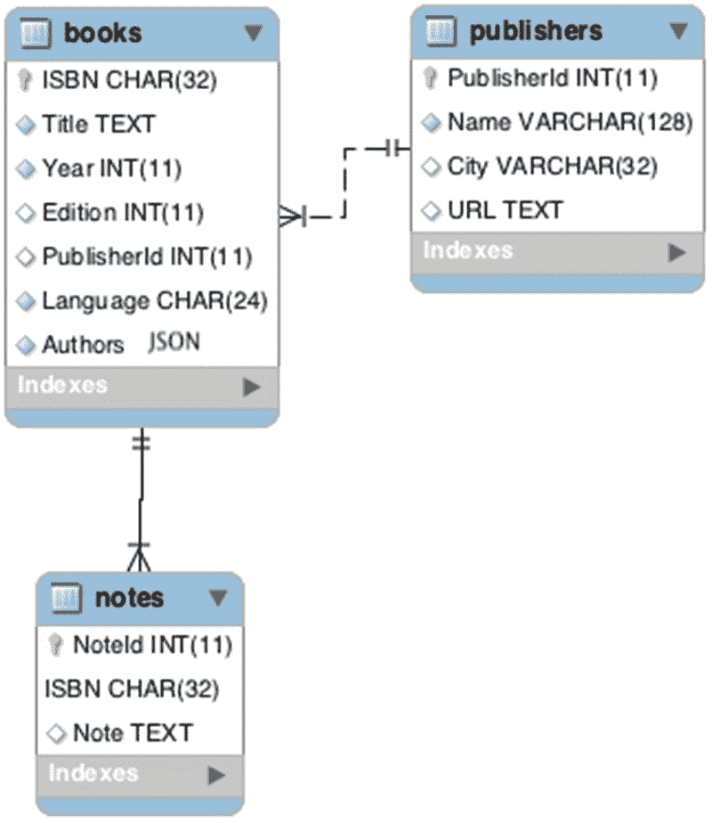
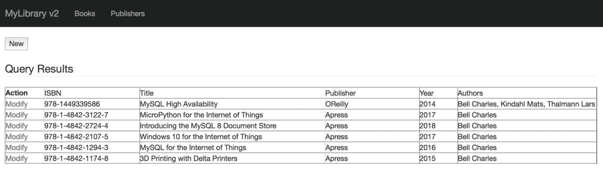

# 9.图书馆应用:数据库实现

既然我们已经有了 Flask 的坚实基础以及用户界面的设计方式，我们就可以开始为应用程序的每个版本编写代码了，从关系数据库版本开始。

正如您将看到的，应用程序从纯关系模型到文档模型的演变演示了我们如何避免使用关系数据的一些混乱方面——即使是在混合示例中。可能会让您感到惊讶的一个因素是，文档存储版本的代码长度和复杂性要短得多，也更容易理解。还有什么更好的理由来考虑使用 MySQL 文档库编写未来的应用程序呢！

以下部分描述了库应用程序的三个版本。因为它们都使用相同的用户界面代码，所以为了简洁起见，我们省略了对用户界面的讨论，并且仅在适当的地方呈现应用程序执行的快照来说明差异。以下简要概述了这些版本。每个版本都实现了不同形式的数据存储。

*   版本 1—关系数据库:仅使用非文档存储特性实现传统的关系数据库模型。
*   版本 2——关系数据库+ JSON 字段(混合):实现一个用 JSON 字段扩充的关系数据库模型。
*   版本 3—文档存储:实现一个纯文档存储(NoSQL)解决方案。

以下部分介绍了每个版本的数据库组件的完整代码，以及对用户界面的适当更改。每个版本的完整代码都是为了清晰和完整而呈现的，而不是呈现可能与上下文无关的代码片段。因此，这一章有点长。

Note

回想一下第 8 章中，我们使用了目录结构来组织代码。例如，对于应用程序的每个版本，我们都有名为`version1`、`version2`和`version3`的文件夹。如果您正在进行，请确保将讨论的文件放在适当的文件夹中。

## 版本 1:关系数据库

这个版本实现了一个传统的关系数据库解决方案，其中我们基于视图或数据项对数据进行建模。出于演示的目的，我们将在一个代码模块中实现数据库代码，我们可以将该代码模块导入到应用程序代码中。这个代码模块将使用旧的 MySQL 连接器/Python 协议和 API。也就是说，我们将不使用 X DevAPI，而是依赖 SQL 语句来处理数据。

让我们从数据库设计的简要概述开始。因为对 MySQL 文档存储感兴趣的大多数读者都熟悉关系数据库，所以我们将跳过任何冗长的讨论，通过简单介绍和查看 SQL `CREATE`语句来展示数据库。

### 数据库设计

这个版本的数据库名为 library_v1。本着良好的关系数据库设计的精神，我们将创建一个表来存储作者、出版商和书籍的离散表中的数据。我们还将创建一个单独的表来存储注释，因为这些数据很少被引用，并且可能是很长的字符串。我们将使用外键来确保这三个表之间的一致性。因为每本书可以有多个作者，所以我们需要创建一个连接表来管理书和作者之间的多对多关系。因此，我们将总共创建五个表。图 [9-1](#Fig1) 显示了带有索引和外键的 library_v1 数据库的实体关系图(ERD)。


图 9-1

ERD diagram—library database (version 1)

我们还需要一种方法，通过`ISBN`列从 authors 表中检索给定书籍的主键。当我们在数据库中查询给定书籍的数据时，会使用这些数据。为了便于维护，我们将创建一个存储例程(函数)来检索 authors 表中以逗号分隔的列`AuthorId`的列表。我们用它来填充图书模板中的`SelectMultipleField`。最后，我们需要另一个存储例程(函数),通过`ISBN`列检索给定书籍的作者姓名。然后，我们将使用这些数据来填充 books 表的列表视图。

清单 [9-1](#Par14) 显示了所有七个对象的`CREATE`语句。如果您想在阅读时继续构建这个版本的应用程序，那么您应该创建一个名为`library_v1.sql`的文件，以便在以后需要时可以重新创建数据库。数据库只使用表和存储的例程来保持讨论简短。

```sql
CREATE DATABASE `library_v1`;
CREATE TABLE `library_v1`.`authors` (
    `AuthorId` int(11) NOT NULL AUTO_INCREMENT,
    `FirstName` varchar(64) DEFAULT NULL,
    `LastName` varchar(64) DEFAULT NULL,
    PRIMARY KEY (`AuthorId`)
) ENGINE=InnoDB;

CREATE TABLE `library_v1`.`publishers` (
  `PublisherId` int(11) NOT NULL AUTO_INCREMENT,
  `Name` varchar(128) NOT NULL,
  `City` varchar(32) DEFAULT NULL,
  `URL` text,
  PRIMARY KEY (`PublisherId`)
) ENGINE=InnoDB;

CREATE TABLE `library_v1`.`books` (
  `ISBN` char(32) NOT NULL,
  `Title` text NOT NULL,
  `Year` int(11) NOT NULL DEFAULT '2017',
  `Edition` int(11) DEFAULT '1',
  `PublisherId` int(11) DEFAULT NULL,
  `Language` char(24) NOT NULL DEFAULT 'English',
  PRIMARY KEY (`ISBN`),
  KEY `pub_id` (`PublisherId`),
  CONSTRAINT `books_ibfk_1` FOREIGN KEY (`PublisherId`)
    REFERENCES `library_v1`.`publishers` (`publisherid`)
) ENGINE=InnoDB;

CREATE TABLE `library_v1`.`notes` (

  `NoteId` int(11) NOT NULL AUTO_INCREMENT,
  `ISBN` char(32) NOT NULL,
  `Note` text,
  PRIMARY KEY (`NoteId`,`ISBN`),
  KEY `ISBN` (`ISBN`),
  CONSTRAINT `notes_fk_1` FOREIGN KEY (`ISBN`)
    REFERENCES `library_v1`.`books` (`isbn`)
) ENGINE=InnoDB;

CREATE TABLE `library_v1`.`books_authors` (
  `ISBN` char(32) NOT NULL,
  `AuthorId` int(11) DEFAULT NULL,
  KEY `auth_id` (`AuthorId`),
  KEY `isbn_id` (`ISBN`),
  CONSTRAINT `books_authors_fk_1` FOREIGN KEY (`ISBN`)
    REFERENCES `library_v1`.`books` (`isbn`),
  CONSTRAINT `books_authors_fk_2` FOREIGN KEY (`AuthorId`)
    REFERENCES `library_v1`.`authors` (`authorid`)
) ENGINE=InnoDB;

DELIMITER //
CREATE FUNCTION `library_v1`.`get_author_ids`(isbn_lookup char(32))
  RETURNS varchar(128) DETERMINISTIC
  RETURN (
    SELECT GROUP_CONCAT(library_v1.authors.AuthorId SEPARATOR ', ') AS author_ids
      FROM library_v1.books_authors JOIN library_v1.authors
        ON books_authors.AuthorId = authors.AuthorId
      WHERE ISBN = isbn_lookup GROUP BY library_v1.books_authors.ISBN
)//

CREATE FUNCTION `library_v1`.`get_author_names`(isbn_lookup char(32))
  RETURNS varchar(128) DETERMINISTIC
    RETURN (
      SELECT GROUP_CONCAT(library_v1.authors.LastName SEPARATOR ', ') AS author_names
        FROM library_v1.books_authors JOIN library_v1.authors
          ON books_authors.AuthorId = authors.AuthorId
      WHERE ISBN = isbn_lookup GROUP BY library_v1.books_authors.ISBN
)//
DELIMITER ;

Listing 9-1Library Version 1 Database Create Script (library_v1.sql)

```

既然已经创建了数据库，让我们看看数据库类的代码。

Tip

在本书的示例代码中，每个版本都有一个数据库创建脚本。请访问 Apress 网站下载这本书的源代码。

### 数据库代码

处理数据库的代码放在名为`library_v1.py`的文件中，该文件位于`version1`文件夹下的`database`文件夹中，如第 [8](08.html) 章“准备目录结构”一节中所述因为大部分代码是使用 MySQL 连接器/Python 连接器的旧 Python 应用程序所共有的，所以我们只讨论代码每一部分的要点。

也就是说，代码实现了四个类:每个数据视图(作者、出版商、图书)一个类，另一个类用于与服务器接口。这些等级分别被命名为`Author`、`Publisher`、`Book`和`Library,`。

Note

要使用位于`database`文件夹中的库，您必须在`database`文件夹中创建一个名为`__init__.py`的空文件。

#### sql 字符串

为了使代码更易于维护，并在需要对 SQL 语句进行任何更改时对其进行修改，我们将这些语句作为字符串放在代码模块的序言中，以便在代码中引用。这样做还有助于缩短代码行的长度。清单 [9-2](#Par21) 显示了`library_v1.py`代码模块的序言。注意，它从导入 MySQL 连接器/Python 库开始。

```sql
import mysql.connector

ALL_BOOKS = """
    SELECT DISTINCT book.ISBN, book.ISBN, Title, publisher.Name as Publisher,
                    Year, library_v1.get_author_names(book.ISBN) as Authors
    FROM library_v1.books As book
        INNER JOIN library_v1.publishers as publisher ON
                   book.PublisherId=publisher.PublisherId
        INNER JOIN library_v1.books_authors as book_author ON
                   book.ISBN = book_author.ISBN
        INNER JOIN library_v1.authors as a ON book_author.AuthorId = a.AuthorId
    ORDER BY book.ISBN DESC
"""

GET_LASTID = "SELECT @@last_insert_id"

#
# Author SQL Statements
#
INSERT_AUTHOR = """
    INSERT INTO library_v1.authors (LastName, FirstName) VALUES ('{0}','{1}')
"""

GET_AUTHORS = "SELECT AuthorId, LastName, FirstName FROM library_v1.authors {0}"
UPDATE_AUTHOR = """
    UPDATE library_v1.authors SET LastName = '{0}',
    FirstName='{1}' WHERE AuthorId = {2}
"""

DELETE_AUTHOR = """
    DELETE FROM library_v1.authors WHERE AuthorId = {0}
"""

#
# Publisher SQL Statements
#
INSERT_PUBLISHER = """
    INSERT INTO library_v1.publishers (Name, City, URL) VALUES ('{0}','{1}','{2}')
"""

GET_PUBLISHERS = "SELECT * FROM library_v1.publishers {0}"
UPDATE_PUBLISHER = "UPDATE library_v1.publishers SET Name = '{0}'"
DELETE_PUBLISHER = "DELETE FROM library_v1.publishers WHERE PublisherId = {0}"

#
# Book SQL Statements
#
INSERT_BOOK = """
    INSERT INTO library_v1.books (ISBN, Title, Year, PublisherId, Edition,
    Language) VALUES ('{0}','{1}','{2}','{3}',{4},'{5}')
"""

INSERT_BOOK_AUTHOR = """
    INSERT INTO library_v1.books_authors (ISBN, AuthorId) VALUES ('{0}', {1})
"""

INSERT_NOTE = "INSERT INTO library_v1.notes (ISBN, Note) VALUES ('{0}','{1}')"
GET_BOOKS = "SELECT * FROM library_v1.books {0}"
GET_NOTES = "SELECT * FROM library_v1.notes WHERE ISBN = '{0}'"
GET_AUTHOR_IDS = "SELECT library_v1.get_author_ids('{0}')"
UPDATE_BOOK = "UPDATE library_v1.books SET ISBN = '{0}'"
DELETE_BOOK = "DELETE FROM library_v1.books WHERE ISBN = '{0}'"
DELETE_BOOK_AUTHOR = "DELETE FROM library_v1.books_authors WHERE ISBN = '{0}'"
DELETE_NOTES = "DELETE FROM library_v1.notes WHERE ISBN = '{0}'"

Listing 9-2Initialization and SQL Statements (library_v1.py)

```

这是一个很大的 SQL，不是吗？如果这看起来令人望而生畏，请考虑大多数关系数据库应用程序都有一组类似的 SQL 语句。还要考虑到这个示例应用程序是故意小而有限的。考虑到这些，想象一下一个更大的应用程序的 SQL 语句的数量和复杂性。哇哦。

接下来，我们来看看`Author`类。

#### 作者类别

`Author`类是最不复杂的，它为其他数据类的构造提供了一个模型。特别是，我们通过构造函数保存了一个`Library`类的实例，并在执行查询时引用这个实例(或者使用`Library`类中的任何方法)。然后我们构建四个函数——创建、读取、更新和删除各一个。清单 [9-3](#Par26) 显示了`Author`类代码。如果主键作为参数传递，read 操作将返回一行，如果没有提供参数，则返回所有行。

注意，我们使用库函数`sql()`来执行查询。例如，`self.library.sql(“COMMIT”)`执行`COMMIT` SQL 命令。我们使用之前使用`format()`函数创建的字符串来填充可选参数。我们将在本节的后面更详细地了解这个函数。花一些时间通读代码，以确保你理解它。

```sql
class Author(object):
    """Author class

    This class encapsulates the authors table permitting CRUD operations
    on the data.
    """
    def __init__(self, library):
        self.library = library

    def create(self, LastName, FirstName):
        assert LastName, "You must supply a LastName for a new author."
        assert FirstName, "You must supply a FirstName for a new author."
        query_str = INSERT_AUTHOR
        last_id = None
        try:
            self.library.sql(query_str.format(LastName, FirstName))
            last_id = self.library.sql(GET_LASTID)
            self.library.sql("COMMIT")
        except Exception as err:
            print("ERROR: Cannot add author: {0}".format(err))
        return last_id

    def read(self, AuthorId=None):
        query_str = GET_AUTHORS
        if not AuthorId:
            # return all authors
            query_str = query_str.format("")
        else:
            # return specific author
            query_str = query_str.format("WHERE AuthorId = '{0}'".format(AuthorId))
        return self.library.sql(query_str)

    def update(self, AuthorId, LastName, FirstName):
        assert AuthorId, "You must supply an AuthorId to update the author."
        assert LastName, "You must supply a LastName for the author."
        assert FirstName, "You must supply a FirstName for the author."
        query_str = UPDATE_AUTHOR
        try:
            self.library.sql(query_str.format(LastName, FirstName, AuthorId))
            self.library.sql("COMMIT")
        except Exception as err:
            print("ERROR: Cannot update author: {0}".format(err))

    def delete(self, AuthorId):
        assert AuthorId, "You must supply an AuthorId to delete the author."
        query_str = DELETE_AUTHOR.format(AuthorId)
        try:
            self.library.sql(query_str)
            self.library.sql("COMMIT")
        except Exception as err:
            print("ERROR: Cannot delete author: {0}".format(err))

Listing 9-3Author Class (library_v1.py)

```

接下来，我们来看看`Publisher`类。

#### 发布者类别

`Publisher`类与`Author`类非常相似，并且以相同的方式实现。唯一的区别在于使用的 SQL 语句。为了完整起见，清单 [9-4](#Par29) 显示了`Publisher`类的完整代码。

```sql
class Publisher(object):
    """Publisher class

    This class encapsulates the publishers table permitting CRUD operations
    on the data.
    """
    def __init__(self, library):
        self.library = library

    def create(self, Name, City=None, URL=None):
        assert Name, "You must supply a Name for a new publisher."
        query_str = INSERT_PUBLISHER
        last_id = None
        try:
            self.library.sql(query_str.format(Name, City, URL))
            last_id = self.library.sql(GET_LASTID)
            self.library.sql("COMMIT")
        except Exception as err:
            print("ERROR: Cannot add publisher: {0}".format(err))
        return last_id

    def read(self, PublisherId=None):
        query_str = GET_PUBLISHERS
        if not PublisherId:
            # return all authors
            query_str = query_str.format("")
        else:
            # return specific author
            query_str = query_str.format(
                "WHERE PublisherId = '{0}'".format(PublisherId))
        return self.library.sql(query_str)

    def update(self, PublisherId, Name, City=None, URL=None):
        assert PublisherId, "You must supply a publisher to update the author."
        query_str = UPDATE_PUBLISHER.format(Name)
        if City:
            query_str = query_str + ", City = '{0}'".format(City)
        if URL:
            query_str = query_str + ", URL = '{0}'".format(URL)
        query_str = query_str + " WHERE PublisherId = {0}".format(PublisherId)
        try:
            self.library.sql(query_str)
            self.library.sql("COMMIT")
        except Exception as err:
            print("ERROR: Cannot update publisher: {0}".format(err))

    def delete(self, PublisherId):
        assert PublisherId, "You must supply a publisher to delete the publisher."
        query_str = DELETE_PUBLISHER.format(PublisherId)
        try:
            self.library.sql(query_str)
            self.library.sql("COMMIT")
        except Exception as err:
            print("ERROR: Cannot delete publisher: {0}".format(err))

Listing 9-4Publisher Class (library_v1.py)

```

接下来，看一下图书类。

#### 图书类

Book 类具有与后两个类相同的方法，但是创建、更新和删除的代码稍微复杂一些。这是因为我们必须执行多个语句来处理数据。因此，我们在 try 块中隐式启动一个事务，如果任何查询失败，我们将回滚该事务。这在关系数据库解决方案中很常见。清单 [9-5](#Par32) 显示了`Book`类的完整代码。花点时间通读代码，了解它是如何构造的。

```sql
class Book(object):
    """Book class

    This class encapsulates the books table permitting CRUD operations
    on the data.
    """
    def __init__(self, library):
        self.library = library

    def create(self, ISBN, Title, Year, PublisherId, Authors=[], Edition=1,
               Language='English'):
        assert ISBN, "You must supply an ISBN for a new book."
        assert Title, "You must supply Title for a new book."
        assert Year, "You must supply a Year for a new book."
        assert PublisherId, "You must supply a PublisherId for a new book."
        assert Authors, "You must supply at least one AuthorId for a new book."
        last_id = ISBN
        #
        # We must do this as a transaction to ensure all tables are updated.
        #
        try:
            self.library.sql("START TRANSACTION")
            query_str = INSERT_BOOK.format(ISBN, Title, Year, PublisherId,
                                           Edition, Language)
            self.library.sql(query_str)
            query_str = INSERT_BOOK_AUTHOR
            for AuthorId in Authors.split(","):
                self.library.sql(query_str.format(ISBN, AuthorId))
            self.library.sql("COMMIT")
        except Exception as err:
            print("ERROR: Cannot add book: {0}".format(err))
            self.library.sql("ROLLBACK")
        return last_id

    def read(self, ISBN=None):
        query_str = GET_BOOKS
        if not ISBN:
            # return all authors
            query_str = query_str.format("")
        else:
            # return specific author
            query_str = query_str.format("WHERE ISBN = '{0}'".format(ISBN))
        return self.library.sql(query_str)

    def read_notes(self, ISBN):
        assert ISBN, "You must supply an ISBN to get the notes."
        query_str = GET_NOTES.format(ISBN)
        return self.library.sql(query_str)

    def read_author_ids(self, ISBN):
        assert ISBN, "You must supply an ISBN to get the list of author ids."
        query_str = GET_AUTHOR_IDS.format(ISBN)
        return self.library.sql(query_str)

    def update(self, old_isbn, ISBN, Title=None, Year=None, PublisherId=None,
               Authors=None, Edition=None, Language=None, Note=None):
        assert ISBN, "You must supply an ISBN to update the book."
        last_id = None
        #
        # Build the book update query
        #
        book_query_str = UPDATE_BOOK.format(ISBN)
        if Title:
            book_query_str += ", Title = '{0}'".format(Title)
        if Year:
            book_query_str += ", Year = {0}".format(Year)
        if PublisherId:
            book_query_str += ", PublisherId = {0}".format(PublisherId)
        if Edition:
            book_query_str += ", Edition = {0}".format(Edition)
        book_query_str += " WHERE ISBN = '{0}'".format(old_isbn)
        #
        # We must do this as a transaction to ensure all tables are updated.
        #
        try:
            self.library.sql("START TRANSACTION")
            #
            # If the ISBN changes, we must remove the author ids first to
            # avoid the foreign key constraint error.
            #
            if old_isbn != ISBN:
                self.library.sql(DELETE_BOOK_AUTHOR.format(old_isbn))
            self.library.sql(book_query_str)
            last_id = self.library.sql(GET_LASTID)
            if Authors:
                # First, clear the author list.
                self.library.sql(DELETE_BOOK_AUTHOR.format(ISBN))
                query_str = INSERT_BOOK_AUTHOR
                for AuthorId in Authors:
                    self.library.sql(query_str.format(ISBN,AuthorId))
            if Note:
                self.add_note(ISBN, Note)
            self.library.sql("COMMIT")
        except Exception as err:
            print("ERROR: Cannot update book: {0}".format(err))
            self.library.sql("ROLLBACK")
        return last_id

    def delete(self, ISBN):
        assert ISBN, "You must supply a ISBN to delete the book."
        #
        # Here, we must cascade delete the notes when we delete a book.
        # We must do this as a transaction to ensure all tables are updated.
        #
        try:
            self.library.sql("START TRANSACTION")
            query_str = DELETE_NOTES.format(ISBN)
            self.library.sql(query_str)
            query_str = DELETE_BOOK_AUTHOR.format(ISBN)
            self.library.sql(query_str)
            query_str = DELETE_BOOK.format(ISBN)
            self.library.sql(query_str)
            self.library.sql("COMMIT")
        except Exception as err:
            print("ERROR: Cannot delete book: {0}".format(err))
            self.library.sql("ROLLBACK")

    def add_note(self, ISBN, Note):
        assert ISBN, "You must supply a ISBN to add a note for the book."
        assert Note, "You must supply text (Note) to add a note for the book."
        query_str = INSERT_NOTE.format(ISBN, Note)
        try:
            self.library.sql(query_str)
            self.library.sql("COMMIT")
        except Exception as err:
            print("ERROR: Cannot add publisher: {0}".format(err))

Listing 9-5Book Class (library_v1.py)

```

最后，我们看看图书馆类。

#### 图书馆类

回想一下，Library 类用于封装 MySQL 服务器的工作。因此，我们创建了处理连接的函数(`connect`、`disconnect`、`is_connected`)。我们还创建了一个可以用来执行查询的函数。这主要是为了方便，一般不需要。该函数名为 sql()，根据需要处理返回的结果集或错误。最后一个函数用于返回数据库中图书的缩略数据集，该数据集用于填充图书列表页面。清单 9-6 显示了库类的代码。正如您将看到的，它也非常简单。

```sql
class Library(object):
    """Library master class

    Use this class to interface with the library database. It includes
    utility functions for connections to the server as well as running
    queries.
    """
    def __init__(self):
        self.db_conn = None

    def connect(self, username, passwd, host, port, db=None):
        config = {
            'user': username,
            'password': passwd,
            'host': host,
            'port': port,
            'database': db,
        }
        try:
            self.db_conn = mysql.connector.connect(**config)
        except mysql.connector.Error as err:
            print("CONNECTION ERROR:", err)
            self.db_conn = None
            raise

    #
    # Return the connection for use in other classes
    #
    def get_connection(self):
        return self.db_conn

    #
    # Check to see if connected to the server
    #
    def is_connected(self):
        return (self.db_conn and (self.db_conn.is_connected()))

    #
    # Disconnect from the server
    #
    def disconnect(self):
        try:
            self.db_conn.disconnect()
        except:
            pass

    #
    # Execute a query and return any results
    #
    # query_str[in]      The query to execute
    # fetch          Execute the fetch as part of the operation and
    #                use a buffered cursor (default is True)
    # buffered       If True, use a buffered raw cursor (default is False)
    #
    # Returns result set or cursor
    #
    def sql(self, query_str, fetch=True, buffered=False):
        # If we are fetching all, we need to use a buffered
        if fetch:
            cur = self.db_conn.cursor(buffered=True)
        else:
            cur = self.db_conn.cursor(raw=True)

        try:
            cur.execute(query_str)
        except Exception as err:
            cur.close()
            print("Query error. Command: {0}:{1}".format(query_str, err))
            raise

        # Fetch rows (only if available or fetch = True).
        if cur.with_rows:
            if fetch:
                try:
                    results = cur.fetchall()
                except mysql.connector.Error as err:
                    print("Error fetching all query data: {0}".format(err))
                    raise
                finally:
                    cur.close()
                return results
            else:
                # Return cursor to fetch rows elsewhere (fetch = false).
                return cur
        else:
            return cur

    #
    # Get list of books
    #
    def get_books(self):
        try:
            results = self.sql(ALL_BOOKS)
        except Exception as err:
            print("ERROR: {0}".format(err))
            raise
        return results

Listing 9-6Library Class (library_v1.py)

```

现在我们有了数据库代码模块，让我们看看应用程序代码。

### 应用代码

在我们之前看到的基础代码中，应用程序代码中只有几个地方需要添加更多的代码。这包括为数据库代码模块添加 import 语句，设置`Librar` y 类实例，以及向 author、publisher 和 book view 函数添加代码以使用数据库代码模块中的类。幸运的是，我们在用户界面讨论中创建的模板文件无需修改即可使用。

要构建这个版本的应用程序，您应该将`base/mylibrary_base.py`文件复制到 v `ersion1/mylibrary_v1.py`中，然后输入下面的代码或者从 Apress book 网站上检索。

尽管代码看起来很长，但并不复杂。此外，除了图书视图功能之外，作者和出版商视图的逻辑是相同的。图书视图有更多的逻辑来启用添加注释功能。以下部分讨论了每个领域所需的更改。回想一下，我们需要在前面章节中看到的`mylibrary_base.py`代码。

#### 设置和初始化

设置和初始化`Library`类的代码很简单。我们只需要从代码模块导入类，然后创建一个`Library`类的实例并调用`connect()`函数，如下所示。import 语句位于其他 import 语句的末尾，库设置代码可以位于其后的任何地方。在示例代码中，此代码放在第一个 form 类函数之前。

```sql
from database.library_v1 import Library, Author, Publisher, Book
[...]
#
# Setup the library database class
#
library = Library()
# Provide your user credentials here
library.connect(<user>, <password>, 'localhost', 3306)

```

Note

确保修改`<user>`和`<password>`条目以匹配您的 MySQL 配置。这些是用户帐户和密码的占位符。

#### 列表视图功能

列表视图功能只需要一些修改。我们将使用`Library`类实例(名为 l `ibrary`)从数据库中获取数据，并显示在页面的列表中。对于书籍，这只是简单地调用`library.get_books()`函数。对于作者，我们实例化了`Author`和`Publisher`类的一个实例，然后不带任何参数调用`read()`函数。回想一下前面的部分，这会导致读取表中的所有行。清单 [9-7](#Par44) 显示了`simple_list()`视图功能所需的更改。新的代码行以粗体显示。如您所见，我们只添加了五行代码。简单！

```sql
def simple_list(kind=None):
    rows = []
    columns = []
    form = ListForm()
    if kind == 'book' or not kind:
        if request.method == 'POST':
            return redirect('book')
        columns = (
            '<td style="width:200px">ISBN</td>',
            '<td style="width:400px">Title</td>',
            '<td style="width:200px">Publisher</td>',
            '<td style="width:80px">Year</td>',
            '<td style="width:300px">Authors</td>',
        )
        kind = 'book'
        # Here, we get all books in the database
        rows = library.get_books()
        return render_template("list.html", form=form, rows=rows,
                               columns=columns, kind=kind)
    elif kind == 'author':
        if request.method == 'POST':
            return redirect('author')
        # Just list the authors
        columns = (
            '<td style="width:100px">Lastname</td>',
            '<td style="width:200px">Firstname</td>',
        )
        kind = 'author'
        # Here, we get all authors in the database
        author = Author(library)
        rows = author.read()
        return render_template("list.html", form=form, rows=rows,
                               columns=columns, kind=kind)
    elif kind == 'publisher':
        if request.method == 'POST':
            return redirect('publisher')
        columns = (
            '<td style="width:300px">Name</td>',
            '<td style="width:100px">City</td>',
            '<td style="width:300px">URL/Website</td>',
        )
        kind = 'publisher'
        # Here, we get all publishers in the database
        publisher = Publisher(library)
        rows = publisher.read()
        return render_template("list.html", form=form, rows=rows,
                               columns=columns, kind=kind)
    else:
        flash("Something is wrong!")
        return
Listing 9-7List View Function (Version 1)

```

#### 作者视图功能

作者视图功能的变化稍微复杂一些。因为 author、publisher 和 book view 函数遵循相同的模式，所以我们将首先讨论一般的模式，然后查看 view each 函数的代码。因为`GET`和`POST`操作的概念对您来说可能是新的，所以我们将花一点时间来讨论它们的区别。

我们希望对`GET`和`POST`操作都使用这个视图函数。特别是，当用户单击列表中的作者时，我们希望在表中显示该行的数据。或者，如果用户单击 New 按钮，我们希望呈现一个空的 HTML 表单供用户完成。到目前为止，这些都是`GET`行动。如果用户点击提交字段(或者是`Add`、`Update`或者是`Delete`)，我们希望从用户那里获取数据，或者创建、更新或者删除数据。这些是`POST`操作。这在视图函数中是如何工作的并不明显。但是，一旦习惯了就有道理了。让我们浏览一下调用视图函数的条件。表 [9-1](#Tab1) 列出了不同的条件(或模式)。

表 9-1

Operations (Modes) for View Functions

<colgroup><col align="left"> <col align="left"> <col align="left"></colgroup> 
| 操作 | 类型 | 行动 |
| :-- | :-- | :-- |
| 增加 | 得到 | 显示一个空表单，并提供一个名为 Add 的提交字段 |
| 创造 | 邮政 | 将一个数据项的数据保存到数据库 |
| 阅读 | 得到 | 显示一个数据项的数据库中的数据，并提供名为 Update 和 Delete 的提交字段 |
| 更新 | 邮政 | 将现有数据项的更新数据保存到数据库 |
| 删除 | 邮政 | 从数据库中删除数据项 |

注意，有两个`GET`操作和三个`POST`操作。`GET`操作要么呈现一个空表单，要么从表中的一行读取。`POST`操作是当用户点击一个提交字段时发生的事件，导致创建、更新或删除。

返回到作者视图函数，我们需要为上面列出的操作添加代码。清单 [9-8](#Par49) 展示了作者视图函数的完整代码，而不是详细讨论代码然后再展示。添加了行号，以便更容易看到所讨论的代码行。清单后面包含了对数据库代码的详细讨论。

```sql
01    def author(author_id=None):

02        author = Author(library)

03        form = AuthorForm()
04        # Get data from the form if present

05        form_authorid = form.authorid.data

06        firstname = form.firstname.data

07        lastname = form.lastname.data

08        # If the route with the variable is called, change the create button to update
09        # then populate the form with the data from the row in the table. Otherwise,
10        # remove the delete button because this will be a new data item.

11        if author_id:

12            form.create_button.label.text = "Update"

13            # Here, we get the data and populate the form

14            data = author.read(author_id)

15            if data == []:

16                flash("Author not found!")

17            form.authorid.data = data[0][0]

18            form.firstname.data = data[0][1]

19            form.lastname.data = data[0][2]

20        else:

21            del form.del_button

22        if request.method == 'POST':
23            # First, determine if we must create, update, or delete when form posts.
24            operation = "Create"
25            if form.create_button.data:
26                if form.create_button.label.text == "Update":
27                    operation = "Update"
28            if form.del_button and form.del_button.data:
29                operation = "Delete"
30            if form.validate_on_submit():
31                # Get the data from the form here
32                if operation == "Create":

33                    try:

34                        author.create(LastName=lastname, FirstName=firstname)

35                        flash("Added.")

36                        return redirect('/list/author')

37                    except Exception as err:

38                        flash(err)

39                elif operation == "Update":

40                    try:

41                        author.update(AuthorId=form_authorid, LastName=lastname,

42                                      FirstName=firstname)

43                        flash("Updated.")

44                        return redirect('/list/author')

45                    except Exception as err:

46                        flash(err)

47                else:

48                    try:

49                        author.delete(form_authorid)

50                        flash("Deleted.")

51                        return redirect('/list/author')

52                    except Exception as err:

53                        flash(err)

54            else:
55                flash_errors(form)
56        return render_template("author.html", form=form)
Listing 9-8Author View Function (Version 1)

```

我们做的第一件事是添加 Author 类的实例，并将其传递给 Library 类实例，如第 2 行所示。接下来，为了涵盖需要表单数据的操作，我们将代码放在视图函数的顶部，将数据从表单复制到局部变量，如第 4–7 行所示。这确保了如果再次调用视图函数进行`POST`操作，我们可以捕获用户输入的任何数据。如果我们没有这样做，我们就不能对新的和现有的数据使用视图功能。

接下来，我们必须覆盖我们传入主键的路线(在本例中是`author_id`)。如果`author_id`存在，我们将其中一个提交字段(add)的标签更改为`Update`。我们还知道我们必须从数据库中读取数据，这是通过第 14 行的`author.read(author_id)`调用来完成的，如果我们检索到的行没有错误，我们就将表中的数据放入第 17-19 行的字段中。如果`author_id`变量不存在，我们删除第 21 行的删除提交字段。

至此，我们已经介绍了表 [9-1](#Tab1) 中所示的添加和读取操作。只有当请求是一个`POST`时，才执行创建、更新和删除操作。为了确定这一点，我们检查第 22 行的`request.method`属性的值。如果是`POST`，那么我们必须决定哪个行动是有效的。我们可以通过检查提交字段的文本来做到这一点。我们使用默认值 create，但根据单击的提交字段将其更改为 update 或 delete。您可以在第 24–29 行看到这些操作。

特别是，如果在`POST`上点击一个提交字段，那么`data`属性将是`True`。因此，我们可以根据单击了哪个按钮来查看需要执行哪个操作。对于 create 按钮，我们知道它是 create，除非标签被更改为 update，在这种情况下，操作与 update 匹配。另一方面，如果删除按钮没有被删除而是被点击了，那么操作就是删除。这是一种在多个操作中重用视图函数的方法。

既然我们知道哪个操作是活动的，我们就执行这个操作。但是，只有当所有字段都通过了验证检查时，我们才会这样做。如果所有字段都被验证，第 30 行的代码将返回`True`。因此，只有当表单域被验证时，我们才执行活动操作。

第 33–38 行显示了创建操作。注意，我们使用 try 块来检测错误。要创建一个新作者，我们只需用表单中的数据调用`author.create()`函数。同样，更新操作如第 40–45 行所示。我们再次使用一个`try`块来检测错误。为了更新现有的作者，我们用表单中的数据调用`author.update()`函数。最后，删除操作如第 46–53 行所示。同样，我们使用一个`try`块来检测错误。要删除一个现有的作者，我们从表单中调用带有`author_id`的`author.delete()`函数。

现在，让我们看一下 publisher view 函数，它非常类似。

#### 发布者视图功能

因为 publisher view 函数与 author view 函数非常相似(是相同的设计或模式)，所以我只总结了详细描述数据库操作的代码。清单 [9-9](#Par58) 显示了发布者视图函数的完整代码。添加了行号，以便更容易看到讨论的代码行。清单后面包含了对数据库代码的详细讨论。

```sql
01    def publisher(publisher_id=None):
02        publisher = Publisher(library)
03        form = PublisherForm()
04        # Get data from the form if present
05        form_publisherid = form.publisherid.data
06        name = form.name.data
07        city = form.city.data
08        url = form.url.data
09        # If the route with the variable is called, change the create button to update then populate the form with the data from the
10        # row in the table. Otherwise, remove the delete button because
11        # this will be a new data item.
12        if publisher_id:
13            # Here, we get the data and populate the form
14            form.create_button.label.text = "Update"
15            # Here, we get the data and populate the form
16            data = publisher.read(publisher_id)
17            if data == []:
18                flash("Publisher not found!")
19            form.publisherid.data = data[0][0]
20            form.name.data = data[0][1]
21            form.city.data = data[0][2]
22            form.url.data = data[0][3]
23        else:
24            del form.del_button
25        if request.method == 'POST':
26            # First, determine if we must create, update, or delete when form posts.
27            operation = "Create"
28            if form.create_button.data:
29                if form.create_button.label.text == "Update":
30                    operation = "Update"
31            if form.del_button and form.del_button.data:
32                operation = "Delete"
33            if form.validate_on_submit():
34                # Get the data from the form here
35                if operation == "Create":

36                    try:

37                        publisher.create(Name=name, City=city, URL=url)

38                        flash("Added.")

39                        return redirect('/list/publisher')

40                    except Exception as err:

41                        flash(err)

42                elif operation == "Update":

43                    try:

44                        publisher.update(PublisherId=form_publisherid, Name=name,

45                                         City=city, URL=url)

46                        flash("Updated.")

47                        return redirect('/list/publisher')

48                    except Exception as err:

49                        flash(err)

50                else:

51                    try:

52                        publisher.delete(form_publisherid)

53                        flash("Deleted.")

54                        return redirect('/list/publisher')

55                    except Exception as err:

56                        flash(err)

57            else:
58                flash_errors(form)
59        return render_template("publisher.html", form=form)
Listing 9-9Publisher View Function (Version 1)

```

使用 author view 函数，第 2 行实例化了一个`Publisher`类的实例，第 4–8 行从表单中获取数据供以后使用。第 12 行开始从数据库读取数据，第 14 行将 add submit 按钮的标签更改为 update，第 16–22 行将数据存储在表单中。最后，第 27–32 行确定了一个`POST`请求的活动操作，第 33 行确保在我们执行数据库操作之前表单字段被验证。

第 36–41 行显示了创建操作。要创建一个新的发布者，我们只需用表单中的数据调用`publisher.create()`函数。同样，更新操作如第 43–49 行所示。为了更新现有的发布者，我们使用表单中的数据调用`publisher.update()`函数。最后，删除操作如第 51–56 行所示。要删除一个现有的发布者，我们从表单中调用带有`publisher_id`的`publisher.delete()`函数。

Pop Quiz

您是否注意到我们处理 publisher_id 的方式有所不同？我们从表单的隐藏字段中获取发布者 id，而不是使用 route 中的变量。这样做是为了展示将数据保存到表单的另一种方法。

但是有一个很好的理由来使用这种技术，即使它复制了一小部分数据。例如，用户可能想要更改 ISBN。因为 ISBN 是表的主键，所以如果我们使用 GET 请求中的 ISBN (/ book/978-1-4842-2724-4 路径),数据库操作将无法定位该行，因为表单上的 ISBN 已被更改。

这也演示了代理主键(如自动增量字段)如何帮助您避免这种潜在的数据地雷。

现在，让我们看看 book view 函数，它遵循相同的模式，但是需要更多的逻辑。

#### 图书视图功能

图书视图功能比作者或出版商视图功能更复杂，原因有三:1)它有更多的字段，2)有需要填充的选择字段，以及 3)有一个用于更新操作的附加功能，以便向图书的数据库添加注释。

但是，代码遵循与前面的视图函数相同的模式。清单 [9-10](#Par67) 显示了完整的图书视图功能代码。再次添加了行号以增强可读性，代码的讨论在清单后面。

```sql
01    def book(isbn_selected=None):
02        notes = None
03        book = Book(library)
04        form = BookForm()
05        # Get data from the form if present
06        isbn = form.isbn.data
07        title = form.title.data
08        year = form.year.data
09        authorids = form.authors.data
10        publisherid = form.publisher.data
11        edition = form.edition.data
12        language = form.language.data

13        #

14        # Here, we get the choices for the select lists

15        #

16        publisher = Publisher(library)

17        publishers = publisher.read()

18        publisher_list = []

19        for pub in publishers:

20            publisher_list.append((pub[0], '{0}'.format(pub[1])))

21        form.publisher.choices = publisher_list

22        author = Author(library)

23        authors = author.read()

24        author_list = []

25        for author in authors:

26            author_list.append((author[0],'{0}, {1}'.format(author[2], author[1])))

27        form.authors.choices = author_list

28        new_note = form.new_note.data
29        # If the route with the variable is called, change the create button to update then populate the form with the data from
30        # the row in the table. Otherwise, remove the delete button
31        # because this will be a new data item.
32        if isbn_selected:
33            # Here, we get the data and populate the form
34            data = book.read(isbn_selected)
35            if data == []:
36                flash("Book not found!")
37
38            #
39            # Here, we populate the data
40            #
41            form.isbn.data = data[0][0]
42            form.title.data = data[0][1]
43            form.year.data = data[0][2]
44            form.edition.data = data[0][3]
45            form.publisher.process_data(data[0][4])
46            form.language.data = data[0][5]
47            #
48            # Here, we get the author_ids for the authors
49            #
50            author_ids = book.read_author_ids(isbn_selected)[0][0]
51            form.authors.data = set(author_ids)
52
53            # We also must retrieve the notes for the book.

54            all_notes = book.read_notes(isbn_selected)

55            notes = []

56            for note in all_notes:

57                notes.append(note[2])

58            form.create_button.label.text = "Update"
59        else:
60            del form.del_button
61        if request.method == 'POST':
62            # First, determine if we must create, update, or delete when form posts.
63            operation = "Create"
64            if form.create_button.data:
65                if form.create_button.label.text == "Update":
66                    operation = "Update"
67            if form.del_button and form.del_button.data:
68                operation = "Delete"
69            if form.validate_on_submit():
70                # Get the data from the form here
71                if operation == "Create":

72                    try:

73                        book.create(ISBN=isbn, Title=title, Year=year,

74                                    PublisherId=publisherid, Authors=authorids,

75                                    Edition=edition, Language=language)

76                        flash("Added.")

77                        return redirect('/list/book')

78                    except Exception as err:

79                        flash(err)

80                elif operation == "Update":
81                    try:

82                        book.update(isbn_selected, ISBN=isbn, Title=title, Year=year,

83                                    PublisherId=publisherid, Authors=authorids,

84                                    Edition=edition, Language=language,

85                                    Note=new_note)

86                        flash("Updated.")

87                        return redirect('/list/book')

88                    except Exception as err:

89                        flash(err)

90                else:

91                    try:

92                        book.delete(isbn)

93                        flash("Deleted.")

94                        return redirect('/list/book')

95                    except Exception as err:

96                        flash(err)

97            else:
98                flash_errors(form)
99        return render_template("book.html", form=form, notes=notes)
Listing 9-10Book View Function (Version 1)

```

首先，您可能会注意到我们有一个名为 notes 的新变量，它被设置为 None。我们在这里这样做是因为我们将使用这个变量来包含从数据库中读取的该书的所有注释。稍后会详细介绍。

与 author 和 publisher 视图函数一样，第 3 行实例化了 Book 类的一个实例，第 6–12 行从表单中获取数据供以后使用。接下来是用数据库中的值填充选择字段的代码。我们这样做是因为 book 表依赖于`authors`(技术上是通过`books_authors`连接表和`publishers`表。因此，我们需要从两个表中提取行来填充下拉列表和多个选择列表。

第 16–21 行是发布者数据。这里，我们首先实例化一个`Publisher`类的实例，然后从表中检索所有数据。接下来，我们遍历这些行，将发布者 id 和名称添加到一个列表中，然后将该列表分配给选择字段选择属性的数据属性(`form.publisher.choices`)。为什么我们包括发行者 id？因为出版商 id 只存储在 book 表中。

同样，第 22–27 行对 author 数据做了同样的事情，创建了一个 Author 类的实例，检索所有行，然后遍历数据添加作者 id，并连接姓和名。与 select 字段一样，我们用新数组填充字段数据。此时，我们已经填充了两个选择字段。接下来是如何设置值以匹配行，以及从数据库中检索数据。

第 32 行开始从数据库读取数据。第 34–57 行从数据库中检索数据并填充表单。对于选择字段，设置数据属性可确保选择值。对于发布者，我们设置选择字段数据，默认情况下匹配的项目被选中。在选择多个字段的情况下，我们传递一个逗号分隔的列表，如第 50–51 行所示，在这里我们从数据库中检索作者 id 的列表。接下来，我们检索这本书的注释并填充一个数组，我们在模板中使用该数组来填充 HTML 表。

哇哦！那是许多工作，不是吗？所有的工作就是为添加和读取操作设置表单。幸运的是，创建、更新和删除设置与其他视图功能相同。您可以在第 63–9 行看到这一点。

令人欣慰的是，数据库操作是熟悉的。第 72–79 行显示了创建操作。要创建一本新书，我们只需用表单中的数据调用`book.create()`函数。同样，更新操作如第 81–89 行所示。为了更新现有的书籍，我们使用表单中的数据调用`book.update()`函数。最后，删除操作如第 91–96 行所示。要删除现有的书，我们从表单中调用带有`isbn`的`book.delete()`函数。

### 模板

基本版本的模板文件没有任何变化。你所需要做的就是创建一个新的文件夹，并从基础文件夹中复制文件。特别是将`base/templates/*`复制到`version1/templates/`。

您需要做的唯一更改是将 base.html 文件中的“base”文本更改为“V1 ”,如下面的差异示例所示，其中删除了带“-”的行，添加了带“+”的行。

```sql
-            <a class="navbar-brand" href="/">MyLibrary Base</a>
+            <a class="navbar-brand" href="/">MyLibrary v1</a>

```

现在我们已经更新了代码，让我们看看它是如何工作的！

### 执行代码

现在代码写好了，我们来试驾一下。确保首先创建数据库和任何必要的表。如果您将前面的 SQL 语句保存在名为 library_v1.sql 的文件中，您可以在 mysql 客户端中使用`SOURCE`命令，如下所示。

```sql
mysql> SOURCE <path>/version1/library_v1.sql;

```

要执行应用程序，可以用 Python 解释器指定`runserver`命令来启动它。下面显示了一个执行应用程序的示例。注意，我们使用了 port 选项来指定端口。您应该从`version1`文件夹中输入这个命令。注意，我们将端口指定为 5001。我们将对版本 2 使用 5002，对版本 3 使用 5003。这将允许您同时运行所有三个版本。

```sql
$ cd version1
$ python ./mylibrary_v1.py runserver -p 5001
 * Running on http://127.0.0.1:5001/ (Press CTRL+C to quit)

```

应用程序将启动并运行，但是数据库中还没有任何数据。你应该从拿几本你喜欢的书开始，首先输入作者和出版商，然后输入图书数据。现在还不要担心音符。一旦你添加了几本书，你应该在默认视图中看到它们(通过点击导航栏中的`MyLibrary v1`或`Books`)。图 [9-2](#Fig2) 显示了一个你应该看到的例子。其他视图是相似的，留给读者去探索。


图 9-2

Library application book list (version 1)

接下来，尝试一下 notes 特性。单击图书列表中某本图书的修改链接，然后添加注释并单击更新。当您下一次通过单击修改链接来查看数据时，您将看到注释出现。图 [9-3](#Fig3) 显示了一本书的注释列表摘录。


图 9-3

Notes list example (version 1)

在我们继续讨论版本 2 之前，让我们花点时间来讨论一下关于这个版本的应用程序的一些观察结果。

### 观察

以下是对该应用程序版本的一些观察。有些是数据库设计的结果，有些是代码的结果，还有一些是我们为了让应用程序变得更好而想要改变的。观察结果以无序列表的形式呈现。如果您想试验这个版本的应用程序，您可以考虑其中一些对改进应用程序的挑战。否则，可以考虑在下一个版本中使用这个列表。

*   冗长的代码:应用程序的代码相当长(超过 400 行)。
*   冗长的数据库代码模块:数据库代码模块的代码也很长(超过 400 行)。
*   过度设计的表:多对多表是不必要的复杂，这使得使用 SQL 更加困难。
*   数据库设计可以改进:精明的数据库管理员无疑会发现数据库设计中可以改进的地方。例如，视图的使用可以代替在`Library`类的`get_books()`函数中使用的查询。
*   过度分析的数据:关系数据库设计的一个障碍是在可用性面前过度使用范式。在这种情况下，用户不太可能关心作者列表，因为没有其他有意义的信息——只有作者的名和姓。
*   简单读取:查看数据的默认机制是一个列表。虽然这对于作者和出版商来说很好，但对于书籍来说是有限制的，因为你必须点击`Modify`链接才能看到这本书的注释。这可以通过简单的只读模式而不是更新来改善。
*   旧协议:没有 X DevAPI 集成。

现在，让我们看看应用程序的下一个版本。

## 版本 2:关系数据库+ JSON 字段(混合)

这个版本实现了一个增加了 JSON 字段的关系数据库。我们基于视图或数据项对数据建模，但是使用 JSON 字段来消除传统关系数据库解决方案的一个问题:多对多连接。出于演示的目的，我们将在一个代码模块中实现数据库代码，我们可以将该代码模块导入到应用程序代码中。尽管我们将像在版本 1 中一样使用 MySQL Connector/Python，但是我们将使用 X DevAPI 使用 SQL 语句来处理数据。目标是演示如何迁移到使用 X DevAPI 但保留 SQL 接口。因此，这个版本提供了一个混合解决方案。

版本 1 数据库中的多对多关系使得我们可以将一本书链接到一个或多个作者，并且我们可能有同一作者的多本书。然而，像大多数应用程序一样，数据库设计揭示了一个我们拥有比所需更多的复杂性的情况。特别是，我们有一个作者表，但发现我们只存储(或关心)名和姓。此外，应用程序的使用表明，除了将作者数据与图书一起列出之外，我们没有查询作者数据的用例。

因此，我们可以消除在 JSON 字段中存储作者姓名列表的多对多关系。这导致了其他一些小的变化，比如存储的例程和其他的添加。

让我们从变更后的数据库设计的简要概述开始。因为该数据库与版本 1 相同，只是稍有改动，所以我们将只针对不同之处进行简要概述。

### 数据库设计

该版本的数据库名为 library_v2。因为目标是移除多对多关系，所以我们移除了`books_authors`连接表，代之以 books 表中的 JSON 字段，并移除了`authors`表。因此，我们将数据库从五个表减少到三个。图 [9-4](#Fig4) 显示了带有索引和外键的 library_v2 数据库的 ERD。



图 9-4

ERD diagram—library database (version 2)

通过消除多对多关系，我们可以删除图书视图中作者的选择多个字段。我们可以用一个简单的逗号分隔的列表来代替，这个列表很容易转换成 JSON。因此，我们需要一种方法从 JSON 字段中检索名称，返回逗号分隔的列表。我们可以用一个存储的例程(函数)来做这件事。

清单 [9-11](#Par102) 显示了所有对象的`CREATE`语句。如果您想在阅读的时候继续构建这个版本的应用程序，那么您应该创建一个名为`library_v2.sql`的文件，以便以后可以重新创建数据库。

```sql
CREATE DATABASE `library_v2`;
CREATE TABLE `library_v2`.`publishers` (
  `PublisherId` int(11) NOT NULL AUTO_INCREMENT,
  `Name` varchar(128) NOT NULL,
  `City` varchar(32) DEFAULT NULL,
  `URL` text,
  PRIMARY KEY (`PublisherId`)
) ENGINE=InnoDB;

CREATE TABLE `library_v2`.`books` (
  `ISBN` char(32) NOT NULL,
  `Title` text NOT NULL,
  `Year` int(11) NOT NULL DEFAULT '2017',
  `Edition` int(11) DEFAULT '1',
  `PublisherId` int(11) DEFAULT NULL,
  `Language` char(24) NOT NULL DEFAULT 'English',
  `Authors` JSON NOT NULL,
  PRIMARY KEY (`ISBN`),
  KEY `Pub_id` (`PublisherId`),
  CONSTRAINT `books_fk_1` FOREIGN KEY (`PublisherId`)
    REFERENCES `library_v2`.`publishers` (`publisherid`)
) ENGINE=InnoDB;

CREATE TABLE `library_v2`.`notes` (
  `NoteId` int(11) NOT NULL AUTO_INCREMENT,
  `ISBN` char(32) NOT NULL,
  `Note` text,
  PRIMARY KEY (`NoteId`,`ISBN`),
  KEY `ISBN` (`ISBN`),
  CONSTRAINT `notes_fk_1` FOREIGN KEY (`ISBN`)
    REFERENCES `library_v2`.`books` (`isbn`)
) ENGINE=InnoDB;

DELIMITER //
CREATE FUNCTION `library_v2`.`get_author_names`(isbn_lookup char(32))
  RETURNS text DETERMINISTIC
BEGIN
  DECLARE j_array varchar(255);
  DECLARE num_items int;
  DECLARE i int;
  DECLARE last char(20);
  DECLARE first char(20);
  DECLARE csv varchar(255);
  SET j_array = (SELECT JSON_EXTRACT(Authors,'$.authors')
                 FROM library_v2.books WHERE ISBN = isbn_lookup);
  SET num_items = JSON_LENGTH(j_array);
  SET csv = "";
  SET i = 0;
  author_loop: LOOP
    IF i < num_items THEN
      SET last = CONCAT('$[',i,'].LastName');
      SET first = CONCAT('$[',i,'].FirstName');
      IF i > 0 THEN
        SET csv = CONCAT(csv,", ",JSON_UNQUOTE(JSON_EXTRACT(j_array,last)),' ',
                         JSON_UNQUOTE(JSON_EXTRACT(j_array,first)));
      ELSE
        SET csv = CONCAT(JSON_UNQUOTE(JSON_EXTRACT(j_array,last)),' ',
                         JSON_UNQUOTE(JSON_EXTRACT(j_array,first)));
      END IF;
      SET i = i + 1;
    ELSE
      LEAVE author_loop;
    END IF;
  END LOOP;
  RETURN csv;
END//
DELIMITER ;

Listing 9-11Library Version 2 Database Create Script (library_v2.sql) 

```

请注意名为`get_author_names()`的新函数。该函数从与 ISBN 匹配的行中检索 JSON 文档，并创建一个逗号分隔的作者列表。这用于呈现作者数据，使用户更容易查看。

现在我们已经创建了数据库，让我们看看数据库类的代码。

### 数据库代码

处理数据库的代码放在名为`library_v2.py`的文件中，该文件位于`version2`文件夹下的`database`文件夹中，如第 [8](08.html) 章“准备目录结构”一节中所述代码基于版本 1，转换为使用 X DevAPI，不再需要 authors 表的类。也就是说，代码实现了三个类:一个用于数据视图——publisher 和 book——另一个用于与服务器接口的类。这些等级分别被命名为`Publisher`、`Book`和`Library`。

然而，因为代码是基于版本 1 的，所以我讨论的是变化，而不是另一个关于类和它们如何工作的冗长讨论。下面总结了这些变化。

*   `ALL_BOOKS`查询要短得多，也更容易维护。
*   添加了一个新的`GET_PUBLISHER_NAME`查询来填充图书列表。
*   `INSERT_BOOK`查询需要为作者的 JSON 文档增加一列。
*   对 authors 表的所有查询都被删除。
*   我们将`GET_AUTHOR_IDS`改为`GET_AUTHOR_NAMES`,因为我们只处理 JSON 文档中的名字。
*   数据库名称从`library_v1`变为`library_v2`。

要创建文件，只需将文件从`version1/database/library_v1.py`复制到`version2/database/library_v2.py`。

#### 代码已删除

首先删除 author 表的`Authors`类和 SQL 语句。他们将不被需要。

#### sql 字符串

因为这个版本也使用 SQL 语句，所以将这些语句作为字符串放在代码模块的序言中，以便稍后在代码中引用。清单 [9-12](#Par116) 显示了`library_v2.py`代码模块的序言，它取代了第一个版本中使用的代码。注意，它从导入 MySQL 连接器/Python X DevAPI 库开始。前面列出的更改(除了版本 1 到 2 的重命名)在清单中以粗体显示。

```sql
import mysqlx

ALL_BOOKS = """
    SELECT DISTINCT book.ISBN, book.ISBN, Title, PublisherId, Year,
                    library_v2.get_author_names(book.ISBN) as Authors
    FROM library_v2.books As book
    ORDER BY book.ISBN DESC
"""

GET_PUBLISHER_NAME = """
    SELECT Name
    FROM library_v2.publishers
    WHERE PublisherId = {0}
"""

GET_LASTID = "SELECT @@last_insert_id"

INSERT_PUBLISHER = """
    INSERT INTO library_v2.publishers (Name, City, URL) VALUES ('{0}','{1}','{2}')
"""

GET_PUBLISHERS = "SELECT * FROM library_v2.publishers {0}"
UPDATE_PUBLISHER = "UPDATE library_v2.publishers SET Name = '{0}'"
DELETE_PUBLISHER = "DELETE FROM library_v2.publishers WHERE PublisherId = {0}"

INSERT_BOOK = """
    INSERT INTO library_v2.books (ISBN, Title, Year, PublisherId, Edition,
    Language, Authors) VALUES ('{0}','{1}','{2}','{3}',{4},'{5}','{6}')
"""

INSERT_NOTE = "INSERT INTO library_v2.notes (ISBN, Note) VALUES ('{0}','{1}')"
GET_BOOKS = "SELECT * FROM library_v2.books {0}"
GET_NOTES = "SELECT * FROM library_v2.notes WHERE ISBN = '{0}'"
GET_AUTHOR_NAMES = "SELECT library_v2.get_author_names('{0}')"
UPDATE_BOOK = "UPDATE library_v2.books SET ISBN = '{0}'"
DELETE_NOTES = "DELETE FROM library_v2.notes WHERE ISBN = '{0}'"
DELETE_BOOK = "DELETE FROM library_v2.books WHERE ISBN = '{0}'"

Listing 9-12Initialization and SQL Statements (library_v2.py)

```

如果您还记得版本 1 中相同代码的长度，请注意我们已经大大减少了字符串的数量。这主要是因为删除了 authors 表和多对多关系。所以，添加一个 JSON 字段产生了巨大的影响！

在我们讨论对`Publisher`和`Book`类的更改之前，让我们讨论一下对`Library`类的更改。

#### 图书馆类

library 类基于版本 1，但是因为我们使用的是 X DevAPI，所以工作方式会有很大不同。特别是，我们将打开一个会话，在端口 33060(X 协议的默认端口)上连接到 MySQL 服务器，并且我们将使用一个 S `QLStatement`对象来执行 SQL 语句。下面总结了对`Library`类的更改。

下面列出了 Library 类的更改摘要。

*   我们使用会话对象而不是连接对象。
*   将`connect()`函数改为从`mysql_x`库中检索一个会话。
*   `sql()`函数被大大简化，只返回来自`session.sql()`—`SQLStatment`对象的结果。
*   我们添加了一个`make_rows()`函数，将来自`SQLStatement`对象的行结果转换成一个数组。
*   `get_books()`函数调用链接`SQLStatement execute()`函数的`make_rows()`函数(作为参数传递)。

Note

对`Library`类的更改旨在演示如何从旧协议迁移到使用 X DevAPI。正如您将看到的，通过使用相同的方法，但使用不同的数据库访问方法，可以最小化对现有数据库库和相关代码的更改。

清单 9-13 显示了修改后的库类。版本 1 中的变化以粗体显示。请注意，我们使用了与第一个版本相同的方法，但是我们没有使用连接对象，而是使用会话对象和重命名的函数来获取和检查会话。这些都是很好的函数，因为在开发更高级的特性时，您可能会需要它们。

```sql
class Library(object):
    """Library master class

    Use this class to interface with the library database. It includes
    utility functions for connections to the server and returning a
    SQLStatement object.
    """
    def __init__(self):
        self.session = None

    #
    # Connect to a MySQL server at host, port
    #
    # Attempts to connect to the server as specified by the connection
    # parameters.
    #
    def connect(self, username, passwd, host, port):
        config = {
            'user': username,
            'password': passwd,
            'host': host,
            'port': port,
        }
        try:
            self.session = mysqlx.get_session(**config)
        except Exception as err:
            print("CONNECTION ERROR:", err)
            self.session = None
            raise

    #
    # Return the session for use in other classes
    #
    def get_session(self):
        return self.session

    #
    # Check to see if connected to the server
    #
    def is_connected(self):
        return (self.session and (self.session.is_open()))

    #
    # Disconnect from the server
    #
    def disconnect(self):
        try:
            self.session.close()
        except:
            pass

    #
    # Get an SQLStatement object
    #
    def sql(self, query_str):
        return self.session.sql(query_str)

    #
    #  Build row array
    #
    #  Here, we cheat a bit and give an option to substitute the publisher name
    #  for publisher Id column.
    #
    def make_rows(self, sql_res, get_publisher=False):
        cols = []
        for col in sql_res.columns:
            cols.append(col.get_column_name())
        rows = []
        for row in sql_res.fetch_all():
            row_item = []
            for col in cols:
                if get_publisher and (col == 'PublisherId'):
                    query_str = GET_PUBLISHER_NAME.format(row.get_string(col))
                    name = self.session.sql(query_str).execute().fetch_one()[0]
                    row_item.append("{0}".format(name))
                else:
                    row_item.append("{0}".format(row.get_string(col)))
            rows.append(row_item)
        return rows

    #
    # Get list of books
    #
    def get_books(self):
        try:
            sql_stmt = self.sql(ALL_BOOKS)
            results = self.make_rows(sql_stmt.execute(), True)
        except Exception as err:
            print("ERROR: {0}".format(err))
            raise
        return results

Listing 9-13Library Class (library_v2.py)

```

请注意`sql()`函数与版本 1 相比缩短了多少。回想一下，版本 1 中的`sql()`函数有 30 行长。使用`SQLStatement`对象实例为我们节省了大量编码！我们将看到这个主题在版本 3 中继续。其实我们看到的`get_books()`功能也短了一点。不错。

如前所述，有一个新功能。函数`make_rows()`获取结果对象，获取所有的行，并将其转换为一个列表。可能有更有效的方法来做到这一点，但是这演示了您可能需要做的一些事情来转换您的现有代码以使用 X DevAPI。

接下来，我们来看看`Publisher`类。

#### 发布者类别

`Publisher`类与版本 1 的代码几乎相同，除了我们将它修改为与 X DevAPI 一起使用。特别是，因为我们正在获取从`Library`类中的`sql()`函数返回的`SQLStatement`对象，所以我们可以将它与`SQLStatement`实例的`execute()`函数链接起来并获得结果。我们还利用`Library`类的`make_rows()`函数为结果中的行创建一个数组。清单 [9-14](#Par133) 显示了`Publisher`类的完整代码，为清晰起见，更改以粗体显示。

```sql
class Publisher(object):
    """Publisher class

    This class encapsulates the publishers table permitting CRUD operations
    on the data.
    """
    def __init__(self, library):
        self.library = library

    def create(self, Name, City=None, URL=None):
        assert Name, "You must supply a Name for a new publisher."
        query_str = INSERT_PUBLISHER
        last_id = None
        try:
            self.library.sql(query_str.format(Name, City, URL)).execute()
            last_id = self.library.make_rows(
                self.library.sql(GET_LASTID).execute())[0][0]
            self.library.sql("COMMIT").execute()
        except Exception as err:
            print("ERROR: Cannot add publisher: {0}".format(err))
        return last_id

    def read(self, PublisherId=None):
        query_str = GET_PUBLISHERS
        if not PublisherId:
            # return all authors
            query_str = query_str.format("")
        else:
            # return specific author
            query_str = query_str.format(
                "WHERE PublisherId = '{0}'".format(PublisherId))
        sql_stmt = self.library.sql(query_str)
        return self.library.make_rows(sql_stmt.execute())

    def update(self, PublisherId, Name, City=None, URL=None):
        assert PublisherId, "You must supply a publisher to update the author."
        query_str = UPDATE_PUBLISHER.format(Name)
        if City:
            query_str = query_str + ", City = '{0}'".format(City)
        if URL:
            query_str = query_str + ", URL = '{0}'".format(URL)
        query_str = query_str + " WHERE PublisherId = {0}".format(PublisherId)
        try:
            self.library.sql(query_str).execute()
            self.library.sql("COMMIT").execute()
        except Exception as err:
            print("ERROR: Cannot update publisher: {0}".format(err))

    def delete(self, PublisherId):
        assert PublisherId, "You must supply a publisher to delete the publisher."
        query_str = DELETE_PUBLISHER.format(PublisherId)
        try:
            self.library.sql(query_str).execute()
            self.library.sql("COMMIT").execute()
        except Exception as err:
            print("ERROR: Cannot delete publisher: {0}".format(err))

Listing 9-14Publisher Class (library_v2.py)

```

正如您所看到的，变化很小，再次证明了将代码移植到新的 X DevAPI 是多么容易。

现在让我们看一下`Book`类，它有一个类似的简短变化列表。

#### 图书类

Book 类和`Publisher`类一样，与版本 1 的代码相比几乎没有什么变化。我们对使用 X DevAPI 进行了同样的修改，但是我们还需要处理将逗号分隔的作者列表转换成 JSON 文档。为此，我们将使用一个助手函数。我们还通过删除连接表来降低代码的复杂性。下面总结了这个版本的`Book`类的变化。

*   我们使用库类的`sql()`函数链接`execute()`函数来执行 SQL 语句。
*   在调用库类的`make_rows()`函数之前，我们准备好了`SQLStatement`对象实例。
*   我们添加了一个函数`make_authors_json()`来将逗号分隔的作者姓名列表转换成 JSON 文档。
*   我们删除了使用`books_authors`表的代码。

清单 [9-15](#Par142) 显示了`Book`类的完整代码，为了清晰起见，更改以粗体显示。正如您将看到的，尽管添加了更多用于处理 JSON 文档的代码行，但代码还是比前一版本短了一些。

```sql
class Book(object):
    """Book class

    This class encapsulates the books table permitting CRUD operations
    on the data.
    """
    def __init__(self, library):
        self.library = library

    def make_authors_json(self, author_list=None):
        from json import JSONEncoder

        if not author_list:
            return None
        author_dict = {"authors":[]}
        authors = author_list.split(",")
        for author in authors:
            try:
                last, first = author.strip(' ').split(' ')
            except Exception as err:
                last = author.strip(' ')
                first = ''
            author_dict["authors"].append({"LastName":last,"FirstName":first})
        author_json = JSONEncoder().encode(author_dict)
        return author_json

    def create(self, ISBN, Title, Year, PublisherId, Authors=[], Edition=1,
               Language='English'):
        assert ISBN, "You must supply an ISBN for a new book."
        assert Title, "You must supply Title for a new book."
        assert Year, "You must supply a Year for a new book."
        assert PublisherId, "You must supply a publisher for a new book."
        assert Authors, "You must supply at least one Author for a new book."
        query_str = INSERT_BOOK
        last_id = ISBN
        try:
            author_json = self.make_authors_json(Authors)
            self.library.sql(query_str.format(ISBN, Title, Year, PublisherId,
                                              Edition, Language,
                                              author_json)).execute()
            self.library.sql("COMMIT").execute()
        except Exception as err:
            print("ERROR: Cannot add book: {0}".format(err))
            self.library.sql("ROLLBACK").execute()
        return last_id

    def read(self, ISBN=None):
        query_str = GET_BOOKS
        if not ISBN:
            # return all authors
            query_str = query_str.format("")
        else:
            # return specific author
            query_str = query_str.format("WHERE ISBN = '{0}'".format(ISBN))
        sql_stmt = self.library.sql(query_str)
        return self.library.make_rows(sql_stmt.execute())

    #
    # Get the notes for this book
    #
    def read_notes(self, ISBN):
        assert ISBN, "You must supply an ISBN to get the notes."
        query_str = GET_NOTES.format(ISBN)
        sql_stmt = self.library.sql(query_str)
        return self.library.make_rows(sql_stmt.execute())

    #
    # Get the authors for this book
    #
    def read_authors(self, ISBN):
        assert ISBN, "You must supply an ISBN to get the list of author ids."
        query_str = GET_AUTHOR_NAMES.format(ISBN)
        sql_stmt = self.library.sql(query_str)
        return self.library.make_rows(sql_stmt.execute())

    def update(self, old_isbn, ISBN, Title=None, Year=None, PublisherId=None,
               Authors=None, Edition=None, Language=None, Note=None):
        assert ISBN, "You must supply an ISBN to update the book."
        last_id = None
        #
        # Build the book update query
        #
        book_query_str = UPDATE_BOOK.format(ISBN)
        if Title:
            book_query_str += ", Title = '{0}'".format(Title)
        if Year:
            book_query_str += ", Year = {0}".format(Year)
        if PublisherId:
            book_query_str += ", PublisherId = {0}".format(PublisherId)
        if Edition:
            book_query_str += ", Edition = {0}".format(Edition)
        if Authors:
            author_json = self.make_authors_json(Authors)
            book_query_str += ", Authors = '{0}'".format(author_json)
        book_query_str += " WHERE ISBN = '{0}'".format(old_isbn)
        #
        # We must do this as a transaction to ensure all tables are updated.
        #
        try:
            self.library.sql("START TRANSACTION").execute()
            self.library.sql(book_query_str).execute()
            if Note:
                self.add_note(ISBN, Note)
            self.library.sql("COMMIT").execute()
        except Exception as err:
            print("ERROR: Cannot update book: {0}".format(err))
            self.library.sql("ROLLBACK").execute()
        return last_id

    def delete(self, ISBN):
        assert ISBN, "You must supply a ISBN to delete the book."
        #
        # Here, we must cascade delete the notes when we delete a book.
        # We must do this as a transaction to ensure all tables are updated.
        #
        try:
            self.library.sql("START TRANSACTION").execute()
            query_str = DELETE_NOTES.format(ISBN)
            self.library.sql(query_str).execute()
            query_str = DELETE_BOOK.format(ISBN)
            self.library.sql(query_str).execute()
            self.library.sql("COMMIT").execute()
        except Exception as err:
            print("ERROR: Cannot delete book: {0}".format(err))
            self.library.sql("ROLLBACK").execute()

    #
    # Add a note for this book
    #
    def add_note(self, ISBN, Note):
        assert ISBN, "You must supply a ISBN to add a note for the book."
        assert Note, "You must supply text (Note) to add a note for the book."
        query_str = INSERT_NOTE.format(ISBN, Note)
        try:
            self.library.sql(query_str).execute()
            self.library.sql("COMMIT").execute()
        except Exception as err:
            print("ERROR: Cannot add note: {0}".format(err))

Listing 9-15Book Class (library_v2.py)

```

请注意新的函数 make_author_json()，它演示了如何构建 json 文档。在本例中，这是一个使用 Python JSON 编码器构建的简单 JSON 数组。我们还可以在 update()函数中看到如何将 JSON 文档合并到我们的 UPDATE SQL 语句中。太好了。

那还不算太糟，是吗？现在，让我们看看应用程序代码的变化。

### 应用代码

与我们之前看到的版本 1 代码相比，应用程序代码有一些小的变化。这包括修改用户界面以删除 authors 视图并将 authors 列表添加到 book 视图表单中。幸运的是，版本 1 中的大部分代码无需修改就可以使用。

要构建这个版本的应用程序，您应该将`version1/mylibrary_v1.py`文件复制到`version2/mylibrary_v2.py`中，然后输入下面的代码或者从 Apress book 网站上检索。下面列出了应用程序代码的更改。虽然这看起来像一个很长的列表，但大多数都是微不足道的变化。以下部分将更详细地描述这些变化。

*   从 import 语句中删除`Author`类。
*   将端口从 3306 更改为 33060。
*   移除`NewSelectMultipleField`类，因为不再需要它了(它在图书视图表单中用于显示可供选择的作者列表)。
*   删除作者视图功能和模板。
*   将工作簿详细信息页面上的多选字段替换为文本字段。
*   从列表视图功能中删除作者列表。
*   更改代码以读取作者姓名列表，而不是 id。
*   添加作者列表来创建和更新对`Book`类的调用。
*   将新文本字段中的作者姓名列表传递给图书视图函数中的`render_template()`函数。
*   发布者视图功能、表单类或模板不需要任何更改。
*   列表表单类或模板不需要任何更改。
*   基本模板已更改，以指示应用程序的版本 2。

我们从设置和初始化的变化开始看变化。

#### 设置和初始化

对设置和初始化的改变是微不足道的。我们只需要从导入中删除 Author 类，将`library_v1`改为`library_v2`，并在`connect()`函数中更改默认端口，如下所示。

```sql
from database.library_v2 import Library, Publisher, Book
...
library.connect(<user>, <password>, 'localhost', 33060)

```

#### 表单类

首先，我们可以删除`AuthorForm`和`NewSelectMultipleField`类，因为我们不需要它们。幸运的是，`PublisherForm`类不需要任何改变。甚至`BookForm`类也只有一个微小的变化，将多选字段切换为文本字段。清单 [9-16](#Par163) 用粗体显示了修改后的`BookForm`类代码。正如您将看到的，只需更改一行代码。

```sql
class BookForm(FlaskForm):
    isbn = TextField('ISBN ', validators=[
            Required(message=REQUIRED.format("ISBN")),
            Length(min=1, max=32, message=RANGE.format("ISBN", 1, 32))
        ])
    title = TextField('Title ',
                      validators=[Required(message=REQUIRED.format("Title"))])
    year = IntegerField('Year ',
                        validators=[Required(message=REQUIRED.format("Year"))])
    edition = IntegerField('Edition ')
    language = TextField('Language ', validators=[
            Required(message=REQUIRED.format("Language")),
            Length(min=1, max=24, message=RANGE.format("Language", 1, 24))
        ])
    publisher = NewSelectField('Publisher ',
                    validators=[Required(message=REQUIRED.format("Publisher"))])
    authors = TextField('Authors (comma separated by LastName FirstName)',
                    validators=[Required(message=REQUIRED.format("Author"))])
    create_button = SubmitField('Add')
    del_button = SubmitField('Delete')
    new_note = TextAreaField('Add Note')

Listing 9-16Book Form Class (Version 2)

```

#### 查看功能

首先，我们可以删除`author()`视图功能，因为不再需要它了。幸运的是，发布者视图功能不需要任何更改。

但是，我们需要修改`simple_list()`视图函数来删除作者列表选项。清单 [9-17](#Par166) 显示了修改后的模板，其中代码被删除的区域以粗体显示。

```sql
def simple_list(kind=None):
    rows = []
    columns = []
    form = ListForm()
    if kind == 'book' or not kind:
        if request.method == 'POST':
            return redirect('book')
        columns = (
            '<td style="width:200px">ISBN</td>',
            '<td style="width:400px">Title</td>',
            '<td style="width:200px">Publisher</td>',
            '<td style="width:80px">Year</td>',
            '<td style="width:300px">Authors</td>',
        )
        kind = 'book'
        # Here, we get all books in the database
        rows = library.get_books()
        return render_template("list.html", form=form, rows=rows,
                               columns=columns, kind=kind)
    elif kind == 'publisher':
        if request.method == 'POST':
            return redirect('publisher')
        columns = (
            '<td style="width:300px">Name</td>',
            '<td style="width:100px">City</td>',
            '<td style="width:300px">URL/Website</td>',
        )
        kind = 'publisher'
        # Here, we get all publishers in the database
        publisher = Publisher(library)
        rows = publisher.read()
        return render_template("list.html", form=form, rows=rows,
                               columns=columns, kind=kind)
    else:
        flash("Something is wrong!")
        return
Listing 9-17List View Function (Version 2)

```

我们还需要修改图书视图功能。这一部分还需要更多的修改，因为一本书的作者现在是一个 JSON 文档，我们使用逗号分隔的列表在 book detail 表单中指定他们。下面列出了这段代码所需的更改。

*   我们将 id 的列表`authorids`改为`author_list`以包含逗号分隔的列表。
*   我们删除了`Author()`类代码。
*   我们将获取作者 id 列表改为获取逗号分隔列表。
*   我们不需要模板文件的作者列表。

清单 [9-18](#Par173) 显示了对图书视图功能的更改，更改以粗体显示。

```sql
def book(isbn_selected=None):
    notes = None
    book = Book(library)
    form = BookForm()
    # Get data from the form if present
    isbn = form.isbn.data
    title = form.title.data
    year = form.year.data
    author_list = form.authors.data
    publisherid = form.publisher.data
    edition = form.edition.data
    language = form.language.data
    #
    # Here, we get the choices for the select lists
    #
    publisher = Publisher(library)
    publishers = publisher.read()
    publisher_list = []
    for pub in publishers:
        publisher_list.append((pub[0], '{0}'.format(pub[1])))
    form.publisher.choices = publisher_list
    new_note = form.new_note.data
    # If the route with the variable is called, change the create button to update
    # then populate the form with the data from the row in the table. Otherwise,
    # remove the delete button because this will be a new data item.
    if isbn_selected:
        # Here, we get the data and populate the form
        data = book.read(isbn_selected)
        if data == []:
            flash("Book not found!")

        #
        # Here, we populate the data
        #
        form.isbn.data = data[0][0]
        form.title.data = data[0][1]
        form.year.data = data[0][2]
        form.edition.data = data[0][3]
        form.publisher.process_data(data[0][4])
        form.language.data = data[0][5]
        form.authors.data = book.read_authors(isbn_selected)[0][0]

        # We also must retrieve the notes for the book.
        all_notes = book.read_notes(isbn_selected)
        notes = []
        for note in all_notes:
            notes.append(note[2])
        form.create_button.label.text = "Update"
    else:
        del form.del_button
    if request.method == 'POST':
        # First, determine if we must create, update, or delete when form posts.
        operation = "Create"
        if form.create_button.data:
            if form.create_button.label.text == "Update":
                operation = "Update"
        if form.del_button and form.del_button.data:
            operation = "Delete"
        if form.validate_on_submit():
            # Get the data from the form here
            if operation == "Create":
                try:
                    book.create(ISBN=isbn, Title=title, Year=year,
                                PublisherId=publisherid, Authors=author_list,
                                Edition=edition, Language=language)
                    flash("Added.")
                    return redirect('/list/book')
                except Exception as err:
                    flash(err)
            elif operation == "Update":
                try:
                    book.update(isbn_selected, isbn, Title=title, Year=year,
                                PublisherId=publisherid, Authors=author_list,
                                Edition=edition, Language=language,
                                Note=new_note)
                    flash("Updated.")
                    return redirect('/list/book')
                except Exception as err:
                    flash(err)
            else:
                try:
                    book.delete(isbn)
                    flash("Deleted.")
                    return redirect('/list/book')
                except Exception as err:
                    flash(err)
        else:
            flash_errors(form)
    return render_template("book.html", form=form, notes=notes,
                           authors=author_list)

Listing 9-18Book View Function (Version 2)

```

应用程序代码不需要额外的更改。再说一次，这还不算太糟。我们还没完呢。模板需要做一些小的改动。

### 模板

对模板文件的更改很小。如果您还没有这样做，请将模板从版本 1 复制到版本 2。例如，将所有文件从`version1/templates/*`复制到`version2/templates`。一旦复制，你可以删除`author.html`模板，因为我们不再需要它。

我们还需要对 base.html 文件做两个小的修改，以更改版本号并从导航栏中删除作者列表。清单 [9-19](#Par177) 显示了 base.html 文件的摘录，更改以粗体显示。

```sql
<div class="navbar navbar-inverse" role="navigation">
    <div class="container">
        <div class="navbar-header">
            <button type="button" class="navbar-toggle" data-toggle="collapse" data-target=".navbar-collapse">
                <span class="sr-only">Toggle navigation</span>
                <span class="icon-bar"></span>
                <span class="icon-bar"></span>
                <span class="icon-bar"></span>
            </button>
            <a class="navbar-brand" href="/">MyLibrary v2</a>
        </div>
        <div class="navbar-collapse collapse">
            <ul class="nav navbar-nav">
                <li><a href="/list/book">Books</a></li>
            </ul>
            <ul class="nav navbar-nav">
                <li><a href="/list/publisher">Publishers</a></li>
            </ul>
        </div>
    </div>
</div>
Listing 9-19Base Template (Version 2)

```

我们还必须对`book.html`模板做两个小的修改，以显示一个以逗号分隔的作者列表的文本字段。清单 [9-20](#Par179) 用粗体显示了修改后的模板的摘录。

```sql

MyLibrary Search

  <form method=post> {{ form.csrf_token }}
    <fieldset>
      <legend>Book - Detail</legend>
      {{ form.hidden_tag() }}
      <div style=font-size:20pz; font-weight:bold; margin-left:150px;>
        {{ form.isbn.label }} <br>
        {{ form.isbn(size=32) }} <br>
        {{ form.title.label }} <br>
        {{ form.title(size=100) }} <br>
        {{ form.year.label }} <br>
        {{ form.year(size=10) }} <br>
        {{ form.edition.label }} <br>
        {{ form.edition(size=10) }} <br>
        {{ form.language.label }} <br>
        {{ form.language(size=34) }} <br>
        {{ form.publisher.label }} <br>
        {{ form.publisher(style="width: 300px;") }} <br><br>
        {{ form.authors.label }} <br>
        {{ form.authors(size=100) }} <br>
        {# Show the new note text field if this is an update. #}
        
          <br>{{ form.new_note.label }} <br>
          {{ form.new_note(rows='2',cols='100') }}
        
...
Listing 9-20Book Template (Version 2)

```

好了，这就是我们所做的改动，现在让我们来看看代码的运行情况。

### 执行代码

现在我们已经写好了代码，让我们试一试。要执行应用程序，可以用 Python 解释器指定`runserver`命令来启动它。下面显示了一个执行应用程序的示例。注意，我们使用了 port 选项来指定端口。您应该从`version2`文件夹中输入这个命令。

```sql
$ cd version2
$ python ./mylibrary_v2.py runserver -p 5002
 * Running on http://127.0.0.1:5002/ (Press CTRL+C to quit)

```

应用程序将启动并运行，但是数据库中还没有任何数据。你应该从拿几本你喜欢的书开始，首先输入作者和出版商，然后输入图书数据。现在还不要担心音符。一旦你添加了几本书，你应该在默认视图中看到它们(通过点击导航栏中的`MyLibrary v2`或`Books`)。图 [9-5](#Fig5) 显示了一个你应该看到的例子。其他视图是相似的，留给读者去探索。



图 9-5

Library application book list (version 2)

请注意，我们删除了导航栏中的 author 条目，因为我们不再拥有详细的视图。相反，作者列表存储在书籍的一个 JSON 文档中。图 [9-6](#Fig6) 显示了新的表格。


图 9-6

Book detailed view (version 2)

请注意，作者条目现在是一个文本字段，而不是一个多选列表。有些人可能认为这更直观，而其他人可能觉得多选列表更好。选择逗号分隔的列表是出于演示的目的，但是您可以随意尝试自己的想法，了解如何为一本书收集和显示关于作者的信息。

publisher 视图与版本 1 相比没有变化。

在我们继续讨论版本 3 之前，让我们花点时间来讨论一下关于这个版本的应用程序的一些观察结果。

### 观察

以下是对该应用程序版本的一些观察。有些是数据库设计的结果，有些是代码的结果，还有一些是我们为了让应用程序变得更好而想要改变的。观察结果以无序列表的形式呈现。如果您想试验这个版本的应用程序，您可以考虑其中的一些挑战来改进应用程序。否则，可以考虑在下一个版本中使用这个列表。

*   使用 JSON 进一步简化数据库:notes 表也可以转换成 books 表中的 JSON 字段，因为不需要在没有查看 book 的上下文的情况下查询 notes 表，notes 表中的一行与 books 表中的一行匹配。
*   数据库代码更短:我们在数据库代码模块中需要更少的代码来实现应用程序。
*   应用程序代码更短:我们在应用程序中需要更少的代码。
*   JSON 需要一些转换代码:尽管 Python 提供了一个使用 JSON 的库，并且可以在 Python 中直接使用 JSON 文档作为数据结构，但是我们需要添加代码来将 JSON 转换成更易于阅读的形式。在这种情况下，它使用的是作者姓名列表。
*   作者列表可能需要改进:虽然是为演示目的而设计的，但逗号分隔的列表可能不是新手用户的最佳选择。

现在，让我们看看应用程序的最新版本。

## 版本 3:文档存储

这个版本实现了数据的纯文档存储版本。出于演示的目的，我们将在一个代码模块中实现数据库代码，我们可以将该代码模块导入到应用程序代码中。我们将使用 X DevAPI 管理集合来存储和检索数据。目标是演示如何迁移到使用 JSON 文档而不是 SQL 接口。

为此，我们将把数据库从多个表简化为一个文档集合，更具体地说，是一个图书集合。让我们从数据库设计的简要概述开始。

### 数据库设计

称之为数据库设计有点过时，因为我们不是在逻辑上使用数据库，而是使用 X DevAPI 术语中的模式。从实现的角度来看，它仍然是 MySQL 中的一个数据库，并且将在 SHOW DATABASES 命令中显示，如下面的 MySQL Shell 输出中的(`library_v3`)所示。

```sql
$ mysqlsh root@localhost:33060 -mx --sql
Creating an X protocol session to 'root@localhost:33060'
...
 MySQL  localhost:33060+ ssl  SQL > SHOW DATABASES;
+--------------------+
| Database           |
+--------------------+
| animals            |
| information_schema |

| library_v1         |

| library_v2         |

| library_v3         |

| mysql              |
| performance_schema |
| sys                |
+--------------------+
8 rows in set (0.00 sec)

```

数据库(模式)只包含一个表，该表是作为集合创建的。您可以使用 MySQL Shell 中显示的命令来做到这一点。

```sql
$ mysqlsh root@localhost:33060 -mx --py
Creating an X protocol session to 'root@localhost:33060'
...
 MySQL  localhost:33060+ ssl  Py > import mysqlx
 MySQL  localhost:33060+ ssl  Py > session = mysqlx.get_session('root:password@localhost:33060')
 MySQL  localhost:33060+ ssl  Py > schema = session.create_schema('library_v3')
 MySQL  localhost:33060+ ssl  Py > collection = schema.create_collection('books')

```

注意，我们得到一个会话，然后创建模式，最后创建集合。这个新集合将作为名为`books`的表出现在`library_v3`数据库中，但是它的`CREATE`语句看起来非常不同。下面显示了该表的`CREATE`语句。您应该永远不需要使用这个语句，而应该总是使用 MySQL Shell 和 X DevAPI 来创建模式、集合或 X DevAPI 万神殿中的任何对象。

```sql
MySQL  localhost:33060+ ssl  SQL > SHOW CREATE TABLE library_v3.books \G
*************************** 1\. row ***************************
       Table: books
Create Table: CREATE TABLE `books` (
  `doc` json DEFAULT NULL,
  `_id` varchar(32) GENERATED ALWAYS AS (json_unquote(json_extract(`doc`,_utf8mb4'$._id'))) STORED NOT NULL,
  PRIMARY KEY (`_id`)
) ENGINE=InnoDB DEFAULT CHARSET=utf8mb4
1 row in set (0.00 sec)

```

不要担心`CREATE`语句看起来很奇怪。它应该是这样的。毕竟，它是作为包含文档 id 和 JSON 字段的行表实现的集合。请注意，这里定义了一个主键，这样可以通过 id 快速查找。酷毙了。

现在我们已经创建了模式(数据库)和集合(表)，让我们看看数据库类的代码。

### 数据库代码

这个版本的应用程序对数据库代码的更改比上一个版本稍长。尽管我们在版本 2 中切换到使用 X DevAPI，但我们仍然使用 SQL 接口。这个版本使用纯 X DevAPI 接口。

处理数据库的代码放在名为`library_v3.py`的文件中，该文件位于`version3`文件夹下的`database`文件夹中，如第 [8](08.html) 章“准备目录结构”一节中所述代码基于版本 2，转换为使用 X DevAPI，我们不再需要 publishers 表的类。然而，因为代码是基于版本 2 的，我们将讨论这些变化，而不是另一个关于类和它们如何工作的冗长讨论。下面总结了这些变化。

*   添加`JSONEncoder`导入语句。
*   删除所有 SQL 语句(是！).
*   移除`Publisher`类。
*   将`Book`类重命名为`Books`。
*   将`Books`类更改为使用会话、模式和集合对象实例。
*   移除`make_authors_json()`功能。
*   移除`Library`类，将实用函数移动到`Books`类。
*   数据库名称从`library_v2`变为`library_v3`。

要创建文件，只需将文件从`version2/database/library_v2.py`复制到`version3/database/library_v3.py`。

#### 代码已删除

首先删除`Publishers`类和所有 SQL 语句。我们不需要这些。您还需要删除`Library`类，但我们仍将使用该类中的一些方法。有关更多详细信息，请参见 Books 类一节。

#### 设置和初始化

删除 SQL 语句后，我们需要添加一个导入语句来导入 Python JSON 编码器类。下面的代码应该放在 imports 部分的末尾。

```sql
from json import JSONEncoder as encoder

```

#### 书籍类

这个类是其余代码更改出现的地方。下面几节简要描述了每一项更改，并给出了修改后的类的完整列表。请注意，我们做的第一件事是将类名从 Book 更改为 Books，因为我们建模的是书籍的集合，而不是单本书。

Tip

这是使用集合时必须做出的基本“思考”改变之一。虽然您可以对单个文档进行建模，但是大多数人会自然地倾向于对一组文档(事物)进行建模。

##### 类别声明

下面显示了修改后的类声明。请注意，我们重命名了类和注释，以反映对类模型的更改。注意，我们还在构造函数中声明了另外两个类变量；`book_schema`和`book_col`。类变量`book_schema`用于存储模式对象的实例，变量`book_col`用于存储集合对象的实例。这些将在`connect()`函数中初始化。

```sql
#
# Books collection simple abstraction (document store)
#
class Books(object):
    """Books class

    This class encapsulates the books collection permitting CRUD operations
    on the data.
    """
    def __init__(self):
        self.session = None
        self.book_schema = None
        self.book_col =  None

```

##### 创建功能

接下来，我们更改`create()`函数，以便更好地处理集合。在这种情况下，我们更改参数列表以包含发布者的三段数据；姓名、城市和网址。我们还将使用一个函数来创建 JSON 复杂文档。新功能被命名为`make_book_json()`，将在后面描述。您也可以删除`make_authors_json()`功能。最后，我们修改代码，使用`book_col`类变量将书添加到集合中，然后查找新书的文档 id。回想一下，文档 id 是由服务器分配的，因此以这种方式检索它允许我们使用它来快速定位文档。清单 [9-21](#Par225) 用粗体显示了修改后的 create()语句。

Note

库类中函数的缩进应该缩进 4 个空格。为了可读性，清单中省略了空格。

```sql
def create(self, ISBN, Title, Pub_Year, Pub_Name, Pub_City, Pub_URL,
           Authors=[], Notes=[], Edition=1, Language="English"):
    assert ISBN, "You must supply an ISBN for a new book."
    assert Title, "You must supply Title for a new book."
    assert Pub_Year, "You must supply a Year for a new book."
    assert Pub_Name, "You must supply a Publisher Name for a new book."
    assert Authors, "You must supply at least one Author Name for a new book."
    last_id = None
    try:
        book_json = self.make_book_json(ISBN, Title, Pub_Year, Pub_Name,
                                        Pub_City, Pub_URL, Authors, Notes,
                                        Edition, Language)
        self.book_col.add(book_json).execute()
        last_id = self.book_col.find(
            "ISBN = '{0}'".format(ISBN)).execute().fetch_all()[0]["_id"]
    except Exception as err:
        print("ERROR: Cannot add book: {0}".format(err))
    return last_id
Listing 9-21Create Function (Version 3)

```

##### 读取功能

既然我们使用了集合对象，read()函数就大大简化了。事实上，我们需要做的就是调用 find()函数，传入文档 id，然后获取文档——所有这些都在一行代码中完成！第 2 版中的辅助读取功能被删除，详情请参见后面的“实用功能”部分。

```sql
def read(self, bookid=None):
    return self.book_col.find("_id = '{0}'".format(bookid)).execute().fetch_one()

```

##### 更新功能

更新功能是大量代码被更改的地方。这是由于我们如何形成用于更新集合的`modify()`子句链。更具体地说，代码已经更改，可以检测数据元素何时更改，如果更改了，就调用`modify().set().execute()`链来修改数据。因为我们可能要做不止一组这样的更改，所以我们使用 session 类变量来启动一个事务，然后如果所有语句都成功，就将它提交给集合。如果没有，我们回滚更改。

其他变化与我们如何处理 notes 和 author 数组有关。发布者数据很简单，因为我们将在网页上放置文本框来保存数据。清单 [9-22](#Par230) 显示了修改后的`create()`功能。这段代码的大部分与版本 2 不同。

```sql
def update(self, book_id, book_data, ISBN, Title, Pub_Year, Pub_Name, Pub_City,
           Pub_URL, Authors=[], New_Note=None, Edition=1, Language="English"):
    assert book_id, "You must supply an book id to update the book."
    try:
        bkid = "_id = '{0}'".format(book_id)
        self.session.start_transaction()
        if ISBN != book_data["ISBN"]:
            self.book_col.modify(bkid).set("ISBN", ISBN).execute()
        if Title != book_data["Title"]:
            self.book_col.modify(bkid).set("Title", Title).execute()
        if Pub_Year != book_data["Pub_Year"]:
            self.book_col.modify(bkid).set("Pub_Year", Pub_Year).execute()
        if Pub_Name != book_data["Publisher"]["Name"]:
            self.book_col.modify(bkid).set("$.Publisher.Name", Pub_Name).execute()
        if Pub_City != book_data["Publisher"]["City"]:
            self.book_col.modify(bkid).set("$.Publisher.City", Pub_City).execute()
        if Pub_URL != book_data["Publisher"]["URL"]:
            self.book_col.modify(bkid).set("$.Publisher.URL", Pub_URL).execute()
        if Edition != book_data["Edition"]:
            self.book_col.modify(bkid).set("Edition", Edition).execute()
        if Language != book_data["Language"]:
            self.book_col.modify(bkid).set("Language", Language).execute()
        if New_Note:
            #
            # If this is the first note, we create the array otherwise,
            # we append to it.
            #
            if not "Notes" in book_data.keys():
                mod_book = self.book_col.modify(bkid)
                mod_book.set("Notes", [{"Text":New_Note}]).execute()
            else:
                mod_book =  self.book_col.modify(bkid)
                mod_book.array_append("Notes", {"Text":New_Note}).execute()
        if Authors and (Authors != self.make_authors_str(book_data['Authors'])):
            authors_json = self.make_authors_dict_list(Authors)
            self.book_col.modify(bkid).set("Authors", authors_json).execute()
        self.session.commit()
    except Exception as err:
        print("ERROR: Cannot update book: {0}".format(err))
        self.session.rollback()
Listing 9-22Update Function (Version 3)

```

花些时间通读这段代码，以确保您看到我们是如何从简单地更新整个数据行到检查哪些项目需要更改并设置它们的。X DevAPI 的本质是，它支持(并鼓励)这样的行为，因为我们只想改变已经改变的内容，而不是为了节省处理时间。

##### 删除功能

delete()函数也经历了一些变化，但是比 create()函数少得多。与 read()函数一样，X DevAPI 使我们执行删除操作变得更加容易。我们不需要像在版本 1 和版本 2 中那样执行一系列删除操作，我们只需要使用集合的 remove_one()便利函数，通过文档 id 找到图书并删除它。很好！下面显示了修改后的 delete()函数。

```sql
def delete(self, book_id):
    assert book_id, "You must supply a book id to delete the book."
    try:
        self.book_col.remove_one(book_id).execute()
    except Exception as err:
        print("ERROR: Cannot delete book: {0}".format(err))
        self.session.rollback()

```

##### 效用函数

效用函数也有一些变化。下面总结了所需的更改，后面的段落提供了有关更改的更多详细信息。

*   删除不再需要的功能。
*   将`connect()`和`get_books()`功能从旧的`Library`类移到`Books`类。
*   添加处理 JSON 文档的新函数。

对于一个纯文档存储代码模块来说，有许多额外的函数是不需要的。我们从库类中删除了`make_authors_json()`、`read_notes()`、`add_note()`、`read_authors()`、`get_session()`、`is_connected()`、`disconnect()`、make_rows()和`sql()`函数，因为我们不再需要它们了。因为作者和出版商数据是文档的一部分，所以我们将集合视为对象，而不是数据库服务器的网关。

`connect()`函数需要一些小的改动，以便我们能够使用会话对象。清单 [9-23](#Par240) 用粗体显示了修改后的`connect()`功能。这个函数被移到了`Books`类中。这里，我们尝试使用传递的连接参数获得一个会话(注意没有数据库参数)，然后获得`library_v3`模式的模式对象，最后获得`books`集合的集合对象。

```sql
def connect(self, username, passwd, host, port):
    config = {
        'user': username,
        'password': passwd,
        'host': host,
        'port': port,
    }
    try:
        self.session = mysqlx.get_session(**config)
        if self.session.is_open():
            self.book_schema = self.session.get_schema("library_v3")
            self.book_col = self.book_schema.get_collection("books")
    except Exception as err:
        print("CONNECTION ERROR:", err)
        self.session = None
        raise
Listing 9-23Connect( ) Function (Version 3)

```

get_books()函数在版本 2 中得到了简化，因为我们不用发出 SQL 语句来读取一本书，而是使用集合对象来查找所有的书。我们还使用一个旧函数的重写来返回一个可以在 Python 中使用的文档数组。这个新函数被命名为`make_row_array()`，将在接下来的章节中解释。

```sql
def get_books(self):
    rows = []
    try:
        book_docs = self.book_col.find().sort("ISBN").execute().fetch_all();
        rows = self.make_row_array(book_docs)
    except Exception as err:
        print("ERROR: {0}".format(err))
        raise
    return rows

```

最后，我们需要添加一些新的函数来使 JSON 文档的使用变得更加容易。下面列出并总结了这些新功能。我们把这些代码留到下一节，在那里我们列出了`Books`类的完整代码。正如您将看到的，这些函数的编码方式并不令人惊讶。

*   `make_authors_str(<array>)`:给定一个作者数组，返回一个逗号分隔的名和姓的列表。
*   `make_authors_dict_list(<string>)`:给定一个逗号分隔的作者姓名列表，返回一个包含作者名和姓的字典列表(数组)。
*   `make_book_json(<params>)`:给定 web 页面上字段数据的参数列表，返回一个填充了数据的 JSON 文档。
*   `make_row_array(<array or JSON documents>)`:给定一个 JSON 文档数组，返回一个包含 JSON 文档元素子集的字典数组。注意，这是用来显示集合中的图书列表的。

##### 完整代码

因为对这个版本的数据库代码，特别是对`Books`类有很多必要的修改，所以完整地查看完整的代码是一个好主意。清单 [9-24](#Par249) 显示了`Books`类的完整代码。您可以研究这段代码，看看上面的许多更改是如何实现的。

```sql
class Books(object):
    """Books class

    This class encapsulates the books collection permitting CRUD operations
    on the data.
    """
    def __init__(self):
        self.session = None
        self.book_schema = None
        self.book_col =  None

    def create(self, ISBN, Title, Pub_Year, Pub_Name, Pub_City, Pub_URL,
               Authors=[], Notes=[], Edition=1, Language="English"):
        assert ISBN, "You must supply an ISBN for a new book."
        assert Title, "You must supply Title for a new book."
        assert Pub_Year, "You must supply a Year for a new book."
        assert Pub_Name, "You must supply a Publisher Name for a new book."
        assert Authors, "You must supply at least one Author Name for a new book."
        last_id = None
        try:
            book_json = self.make_book_json(ISBN, Title, Pub_Year, Pub_Name,
                                            Pub_City, Pub_URL, Authors, Notes,
                                            Edition, Language)
            self.book_col.add(book_json).execute()
            last_id = self.book_col.find(
                "ISBN = '{0}'".format(ISBN)).execute().fetch_all()[0]["_id"]
        except Exception as err:
            print("ERROR: Cannot add book: {0}".format(err))
        return last_id

    def read(self, bookid=None):
        return self.book_col.find("_id = '{0}'".format(bookid)).execute().fetch_one()

    def update(self, book_id, book_data, ISBN, Title, Pub_Year, Pub_Name, Pub_City,
               Pub_URL, Authors=[], New_Note=None, Edition=1, Language="English"):
        assert book_id, "You must supply an book id to update the book."
        try:
            bkid = "_id = '{0}'".format(book_id)
            self.session.start_transaction()
            if ISBN != book_data["ISBN"]:
                self.book_col.modify(bkid).set("ISBN", ISBN).execute()
            if Title != book_data["Title"]:
                self.book_col.modify(bkid).set("Title", Title).execute()
            if Pub_Year != book_data["Pub_Year"]:
                self.book_col.modify(bkid).set("Pub_Year", Pub_Year).execute()
            if Pub_Name != book_data["Publisher"]["Name"]:
                self.book_col.modify(bkid).set("$.Publisher.Name", Pub_Name).execute()
            if Pub_City != book_data["Publisher"]["City"]:
                self.book_col.modify(bkid).set("$.Publisher.City", Pub_City).execute()
            if Pub_URL != book_data["Publisher"]["URL"]:
                self.book_col.modify(bkid).set("$.Publisher.URL", Pub_URL).execute()
            if Edition != book_data["Edition"]:
                self.book_col.modify(bkid).set("Edition", Edition).execute()
            if Language != book_data["Language"]:
                self.book_col.modify(bkid).set("Language", Language).execute()
            if New_Note:
                #
                # If this is the first note, we create the array otherwise,
                # we append to it.
                #
                if not "Notes" in book_data.keys():
                    mod_book = self.book_col.modify(bkid)
                    mod_book.set("Notes", [{"Text":New_Note}]).execute()
                else:
                    mod_book =  self.book_col.modify(bkid)
                    mod_book.array_append("Notes", {"Text":New_Note}).execute()
            if Authors and (Authors != self.make_authors_str(book_data['Authors'])):
                authors_json = self.make_authors_dict_list(Authors)
                self.book_col.modify(bkid).set("Authors", authors_json).execute()
            self.session.commit()
        except Exception as err:
            print("ERROR: Cannot update book: {0}".format(err))
            self.session.rollback()

    def delete(self, book_id):
        assert book_id, "You must supply a book id to delete the book."
        try:
            self.book_col.remove_one(book_id).execute()
        except Exception as err:
            print("ERROR: Cannot delete book: {0}".format(err))
            self.session.rollback()

    #
    # Connect to a MySQL server at host, port
    #
    # Attempts to connect to the server as specified by the connection
    # parameters.
    #
    def connect(self, username, passwd, host, port):
        config = {
            'user': username,
            'password': passwd,
            'host': host,
            'port': port,
        }
        try:
            self.session = mysqlx.get_session(**config)
            if self.session.is_open():
                self.book_schema = self.session.get_schema("library_v3")
                self.book_col = self.book_schema.get_collection("books")
        except Exception as err:
            print("CONNECTION ERROR:", err)
            self.session = None
            raise

    def make_authors_str(self, authors):
        author_str = ""
        num = len(authors)
        i = 0
        while (i < num):
            author_str += "{0} {1}".format(authors[i]["LastName"],
                                           authors[i]["FirstName"])
            i += 1
            if (i < num):
                author_str += ", "
        return author_str

    def make_authors_dict_list(self, author_list=None):
        if not author_list:
            return None
        author_dict_list = []
        authors = author_list.split(",")
        for author in authors:
            try:
                last, first = author.strip(' ').split(' ')
            except Exception as err:
                last = author.strip(' ')
                first = ''
            author_dict_list.append({"LastName":last,"FirstName":first})
        return author_dict_list

    def make_book_json(self, ISBN, Title, Pub_Year, Pub_Name, Pub_City, Pub_URL,
                       Authors=[], Notes=[], Edition=1, Language="English"):
        notes_list = []
        for note in Notes:
            notes_list.append({"Text":"{0}".format(note)})
        book_dict = {
            "ISBN": ISBN,
            "Title": Title,
            "Pub_Year": Pub_Year,
            "Edition": Edition,
            "Language": Language,
            "Authors": self.make_authors_dict_list(Authors),
            "Publisher": {
                "Name": Pub_Name,
                "City": Pub_City,
                "URL": Pub_URL,
            },
            "Notes": notes_list,
        }
        return encoder().encode(book_dict)

    #
    #  Build row array
    #
    def make_row_array(self, book_doc_list):
        rows = []
        for book in book_doc_list:
            book_dict = book
            # Now, we build the row for the book list
            row_item = (
                book_dict["_id"],
                book_dict["ISBN"],
                book_dict["Title"],
                book_dict["Publisher"]["Name"],
                book_dict["Pub_Year"],
                self.make_authors_str(book_dict["Authors"]),
            )
            rows.append(row_item)
        return rows

    #
    # Get list of books
    #
    def get_books(self):
        rows = []
        try:
            book_docs = self.book_col.find().sort("ISBN").execute().fetch_all();
            rows = self.make_row_array(book_docs)
        except Exception as err:
            print("ERROR: {0}".format(err))
            raise
        return rows

Listing 9-24Books Class (Version 3)

```

哇，变化真大！这个版本显示了处理集合的代码与混合解决方案有多么不同。现在，让我们看看应用程序代码的变化。

### 应用代码

这个版本的应用程序代码的变化没有数据库代码模块的变化长。本质上，我们删除了出版商列表和细节视图，并将图书视图功能转换为 JSON 文档。还有一些其他的小变化。下面总结了这些变化。后面的部分将更详细地描述这些变化。

*   从`library_v3`模块导入`Books`类。
*   将`Library`类切换到`Books`类，并调用`connect()`函数。
*   移除`NewSelectField()`类。
*   移除`PublisherForm()`类。
*   更改`BookForm`类，将发布者数据作为字段列出。
*   更改`BookForm`类，为文档 id 和 JSON 字符串添加隐藏字段。
*   从`ListForm`模板中删除发布者选项。
*   移除`publisher`查看功能。
*   修改`book`视图函数来处理 JSON 文档。

下面几节详细介绍了三个主要变化领域:设置和初始化、表单类和视图函数。要创建文件，只需将文件从`version1/database/library_v2.py`复制到`version2/database/library_v3.py`。

#### 设置和初始化

对设置和初始化部分的更改很小。我们必须从`library_v3`代码模块导入 Books 类，并修改代码以使用`Books()`对象，而不是版本 2 中的`Library()`对象。下面用粗体显示了这些变化。

```sql
from wtforms import (HiddenField, TextField, TextAreaField,

                     IntegerField, SubmitField)
from wtforms.validators import Required, Length

from database.library_v3 import Books

...
#
# Setup the books document store class
#

books = Books()

# Provide your user credentials here

books.connect(<user>, <password>, 'localhost', 33060)

```

#### 表单类

表单类的变化也很小。首先，我们删除了`NewSelectField()`和`PublisherForm()`类，因为我们不再需要它们了。其次，我们必须修改`BookForm()`表单类，使用发布者数据的文本字段。回想一下，这是姓名、城市和 URL。我们还想添加两个隐藏字段:一个用于文档 id，另一个用于 JSON 文档。

文档 id 对于方便检索或更新 JSON 文档至关重要，存储在表单中的 JSON 文档将允许我们检测数据何时发生了变化。回想一下关于数据库代码模块中的`Books`类的讨论，我们在`update()`函数中正是这样做的。像这样使用隐藏字段来包含数据是很常见的，但是应该谨慎使用这种技术，因为隐藏字段中的数据就像任何其他字段一样，您必须确保更新代码中的数据，否则您可能会处理过时的数据。

清单 [9-25](#Par267) 显示了更新后的`BookForm`类，变化以粗体显示。

```sql
class BookForm(FlaskForm):
    isbn = TextField('ISBN ', validators=[
            Required(message=REQUIRED.format("ISBN")),
            Length(min=1, max=32, message=RANGE.format("ISBN", 1, 32))
        ])
    title = TextField('Title ',
                      validators=[Required(message=REQUIRED.format("Title"))])
    year = IntegerField('Year ',
                        validators=[Required(message=REQUIRED.format("Year"))])
    edition = IntegerField('Edition ')
    language = TextField('Language ', validators=[
            Required(message=REQUIRED.format("Language")),
            Length(min=1, max=24, message=RANGE.format("Language", 1, 24))
        ])
    pub_name = TextField('Publisher Name', validators=[
            Required(message=REQUIRED.format("Name")),
            Length(min=1, max=128, message=RANGE.format("Name", 1, 128))
        ])
    pub_city = TextField('Publisher City', validators=[
            Required(message=REQUIRED.format("City")),
            Length(min=1, max=32, message=RANGE.format("City", 1, 32))
        ])
    pub_url = TextField('Publisher URL/Website')

    authors = TextField('Authors (comma separated by LastName FirstName)',
                        validators=[Required(message=REQUIRED.format("Author"))])
    create_button = SubmitField('Add')
    del_button = SubmitField('Delete')
    new_note = TextAreaField('Add Note')
    # Here, we book id for faster updates
    book_id = HiddenField("BookId")
    # Here, we store the book data structure (document)
    book_dict = HiddenField("BookData")
Listing 9-25Book Form Class (Version 3)

```

#### 图书视图功能

查看功能区域是对应用程序进行大多数更改的地方。这是因为我们必须修改函数来使用 JSON 文档(数据)。幸运的是，JSON 对象很好地转换成代码，允许我们以数组和字典键查找的形式使用路径表达式。酷！下面列出了图书视图功能所需的更改。后面的段落更详细地解释了这些变化。

*   将发布者列表更改为字段。
*   删除填充发布者选择字段。
*   将 ISBN 路径的变量更改为文档 id。
*   使用`books()`实例代替`book()`。
*   当从集合中检索数据时，直接在 Python 中使用 JSON 文档，通过数组索引和字典键访问数据项。
*   检测可选字段何时缺少数据元素。
*   使用修改后的参数列表调用 CRUD 函数，添加发布者字段。

如前所述，book view 函数需要修改，以包含现在表示为字段的出版商数据，因此我们不再需要填充 select 字段，从而稍微简化了代码。

因为数据现在在 JSON 中，所以我们可以使用文档 id 作为键，从而消除用户更改主键(例如 ISBN)的顾虑。事实上，使用 JSON 文档允许用户更改任何字段(或添加新字段)，而不会产生键和索引问题。整洁！

当从图书集合中检索信息时，我们有一个 JSON 文档，我们可以用 Python 访问数据，就像它是一个大字典一样。例如，我们可以通过名称来访问数据项，如`data["ISBN"]`，其中 ISBN 是字典中的关键字。很好！我们在`if id_selected:`条件之后的部分看到了这些变化。对于那些可选的字段，我们可以检查字典(JSON 对象)来查看该键是否存在，如果存在，就检索数据。

我们还可以看到我们添加了任务，将文档 id 和原始 JSON 文档保存到隐藏字段中。最后，我们还必须对调用 CRUD 函数的方式做一点小小的改变，因为我们有发布者数据的额外参数。清单 [9-26](#Par280) 显示了图书视图功能的完整的修改后的代码，修改后的部分以粗体显示。

```sql
def book(id_selected=None):
    notes = []
    form = BookForm()
    # Get data from the form if present
    bookid = form.book_id.data
    isbn = form.isbn.data
    title = form.title.data
    year = form.year.data
    author_list = form.authors.data
    pub_name = form.pub_name.data
    pub_city = form.pub_city.data
    pub_url = form.pub_url.data
    edition = form.edition.data
    language = form.language.data
    new_note = form.new_note.data
    # If the route with the variable is called, change the create button to update
    # then populate the form with the data from the row in the table. Otherwise,
    # remove the delete button because this will be a new data item.
    if id_selected:
        # Here, we get the data and populate the form
        data = books.read(id_selected)
        if data == []:
            flash("Book not found!")

        #
        # Here, we populate the data
        #
        form.book_dict.data = data
        form.book_id.data = data["_id"]
        form.isbn.data = data["ISBN"]
        form.title.data = data["Title"]
        form.year.data = data["Pub_Year"]
        #
        # Since edition is optional, we must check for it first.
        #
        if "Edition" in data.keys():
            form.edition.data = data["Edition"]
        else:
            form.edition.data = '1'
        form.pub_name.data = data["Publisher"]["Name"]
        #
        # Since publisher city is optional, we must check for it first.
        #
        if "City" in data["Publisher"].keys():
            form.pub_city.data = data["Publisher"]["City"]
        else:
            form.pub_city = ""
        #
        # Since publisher URL is optional, we must check for it first.
        #
        if "URL" in data["Publisher"].keys():
            form.pub_url.data = data["Publisher"]["URL"]
        else:
            form.pub_url.data = ""
        #
        # Since language is optional, we must check for it first.
        #
        if "Language" in data.keys():
            form.language.data = data["Language"]
        else:
            form.language.data = "English"
        form.authors.data = books.make_authors_str(data["Authors"])

        # We also must retrieve the notes for the book.
        if "Notes" in data.keys():
            all_notes = data["Notes"]
        else:
            all_notes = []
        notes = []
        for note in all_notes:
            notes.append(note["Text"])
        form.create_button.label.text = "Update"
    else:
        del form.del_button
    if request.method == 'POST':
        # First, determine if we must create, update, or delete when form posts.
        operation = "Create"
        if form.create_button.data:
            if form.create_button.label.text == "Update":
                operation = "Update"
        if form.del_button and form.del_button.data:
            operation = "Delete"
        if form.validate_on_submit():
            # Get the data from the form here
            if operation == "Create":
                try:
                    books.create(ISBN=isbn, Title=title, Pub_Year=year,
                                 Pub_Name=pub_name, Pub_City=pub_city,
                                 Pub_URL=pub_url, Authors=author_list,
                                 Notes=notes, Edition=edition,
                                 Language=language)
                    flash("Added.")
                    return redirect('/list/book')
                except Exception as err:
                    flash(err)
            elif operation == "Update":
                try:
                    books.update(id_selected, form.book_dict.data, ISBN=isbn,
                                 Title=title, Pub_Year=year, Pub_Name=pub_name,
                                 Pub_City=pub_city, Pub_URL=pub_url,
                                 Authors=author_list, Edition=edition,
                                 Language=language, New_Note=new_note)
                    flash("Updated.")
                    return redirect('/list/book')
                except Exception as err:
                    flash(err)
            else:
                try:
                    books.delete(form.book_id.data)
                    flash("Deleted.")
                    return redirect('/list/book')
                except Exception as err:
                    flash(err)
        else:
            flash_errors(form)
    return render_template("book.html", form=form, notes=notes,
                           authors=author_list)

Listing 9-26Book View Function (Version 3)

```

最后，我们可以删除`publisher()`视图函数和`simple_list()`视图中的 publisher 部分，因为我们也不需要它们。

### 模板

对模板文件的更改很小。如果您还没有这样做，请将模板从版本 2 复制到版本 3。例如，将所有文件从`version2/templates/*`复制到`version3/templates`。一旦复制，你可以删除`publisher.html`模板，因为它不再需要。

我们还需要对 base.html 文件做两个小的修改，以更改版本号并从导航栏中删除发行者列表。清单 [9-27](#Par284) 显示了 base.html 文件的摘录，更改以粗体显示。

```sql
<div class="navbar navbar-inverse" role="navigation">
    <div class="container">
        <div class="navbar-header">
            <button type="button" class="navbar-toggle" data-toggle="collapse" data-target=".navbar-collapse">
                <span class="sr-only">Toggle navigation</span>
                <span class="icon-bar"></span>
                <span class="icon-bar"></span>
                <span class="icon-bar"></span>
            </button>
            <a class="navbar-brand" href="/">MyLibrary v3</a>
        </div>
        <div class="navbar-collapse collapse">
            <ul class="nav navbar-nav">
                <li><a href="/list/book">Books</a></li>
            </ul>
        </div>
    </div>
</div>

Listing 9-27Base Template (Version 3)

```

我们还必须对`book.html`模板做一些小的修改，为逗号分隔的作者列表显示一个文本字段。清单 [9-28](#Par286) 用粗体显示了修改后的模板的摘录。

```sql
...

  <form method=post> {{ form.csrf_token }}
    <fieldset>
      <legend>Book - Detail</legend>
      {{ form.hidden_tag() }}
      <div style=font-size:20pz; font-weight:bold; margin-left:150px;>
        {{ form.isbn.label }} <br>
        {{ form.isbn(size=32) }} <br>
        {{ form.title.label }} <br>
        {{ form.title(size=100) }} <br>
        {{ form.year.label }} <br>
        {{ form.year(size=10) }} <br>
        {{ form.edition.label }} <br>
        {{ form.edition(size=10) }} <br>
        {{ form.language.label }} <br>
        {{ form.language(size=34) }} <br>
        {{ form.pub_name.label }} <br>
        {{ form.pub_name(style="width: 300px;") }} <br>
        {{ form.pub_city.label }} <br>
        {{ form.pub_city(style="width: 300px;") }} <br>
        {{ form.pub_url.label }} <br>
        {{ form.pub_url(style="width: 300px;") }} <br><br>
        {{ form.authors.label }} <br>
        {{ form.authors(size=100) }} <br>
...
Listing 9-28Book Template (Version 3)

```

好了，改动到此为止；现在让我们来看看运行中的代码。

### 执行代码

现在我们已经写好了代码，让我们试一试。要执行应用程序，可以用 Python 解释器指定`runserver`命令来启动它。下面显示了一个执行应用程序的示例。注意，我们使用了 port 选项来指定端口。您应该从`version3`文件夹中输入这个命令。

```sql
$ cd version3
$ python ./mylibrary_v3.py runserver -p 5003
 * Running on http://127.0.0.1:5003/ (Press CTRL+C to quit)

```

应用程序将启动并运行，但是数据库中还没有任何数据。你应该从拿几本你最喜欢的书开始，输入图书数据。现在还不要担心音符。一旦你添加了几本书，你应该在默认视图中看到它们(通过点击导航栏中的`MyLibrary v3`或`Books`)。图 [9-7](#Fig7) 显示了一个你应该看到的例子。


图 9-7

Library application book list (version 3)

如果这开始看起来有点熟悉，你是对的，它是。这个版本实现了相同的接口，只是没有发布者和作者视图。与其他版本一样，您可以点击任何图书的修改链接，查看图书的详细信息。图 [9-8](#Fig8) 显示了更新后的图书详细视图。请注意，publisher 条目现在是一组三个文本字段，而不是一个下拉列表。作者列表与版本 2 相比没有变化。


图 9-8

Book detailed view (version 3)

现在，让我们花点时间来讨论一下对这个版本的应用程序的一些观察。

### 观察

以下是对该应用程序版本的一些观察。有些是数据库设计的结果，有些来自代码，还有一些是我们做得更好的。观察结果以无序列表的形式呈现。这个列表比以前的版本更短，因为我们实现了更好的应用！因此，这是一个成功的列表，而不是改进的列表。

*   数据库代码更短:使用 X DevAPI 处理集合和文档时，我们需要的代码更少。
*   更容易理解的数据库代码:使用 JSON 文档是 Python(和其他语言)的自然扩展。
*   应用程序代码显著缩短:我们需要更少的应用程序代码，因为我们简化了用户界面。事实上，代码几乎是版本 1 的 50%。

还有一个观察值得讨论。使用这三个版本的应用程序对用户体验的改变很小。事实上，其中一个目标是将用户界面更改保持在最低限度，以证明从传统的关系数据库模型迁移到混合模型并最终迁移到纯文档存储模型并不意味着必须重新设计整个用户界面！

尽管可能需要进行一些更改来促进数据存储和检索方式的变化，如我们在 authors 和 books_authors 连接表中看到的那样，但这些更改通常有助于解决数据库设计中的问题，或者在这种情况下有助于消除一个错误的前提，即特定作者和出版商的数据在书籍的上下文之外是有意义的。在这个示例应用程序中，情况并非如此。因此，设计单独的表(或文档)来存储信息是不必要的，并且增加了我们不需要的复杂性。这就是围绕 JSON 文档和 MySQL 文档存储引擎设计数据的挑战和回报。

## 挑战

这两个版本的应用程序在功能上都非常简单。如果您发现该应用程序非常适合进行进一步的试验，甚至是作为另一项工作的基础，那么您可能需要考虑在一些方面改进设计和代码。以下是可以改进的地方的简要列表。

*   ISBN 查找服务:添加使用 ISBN 查找服务(如`isbntools` ( [`http://isbntools.readthedocs.io/en/latest/`](http://isbntools.readthedocs.io/en/latest/) )或 SearchUPC ( [`http://www.searchupc.com`](http://www.searchupc.com) )检索图书信息的功能。一些服务需要创建帐户，而其他服务可能是收费服务。
*   独立的库模块:针对版本 1 和版本 2，将库文件分成独立的代码模块(图书、作者、出版商、库)。
*   独立的代码模块:较大的 Flask 应用程序通常将主代码文件中的视图(表单类)分解成独立的代码模块。
*   删除硬编码值:为 MySQL 参数生成用户、密码、主机和端口数据，而不是硬编码值(提示:使用`argparse`)。
*   扩展数据:修改数据库或文档存储来存储其他媒体，如杂志、文章和在线参考资料。

## 摘要

毫无疑问，新的 MySQL 8 版本将是 MySQL 历史上最大、最重要的版本。JSON 数据类型和 X DevAPI 的加入对于 MySQL 应用程序来说简直是开创性的。

在这一章中，我们探讨了关系数据库解决方案和增加了 JSON 字段的关系数据库解决方案之间的区别，最后是一个纯文档存储解决方案。正如我们所发现的，新的 X DevAPI 使得开发 MySQL 解决方案比关系数据库解决方案更容易、更快、代码更少。这给了我们很多理由开始采用文档存储。

在第 [10](10.html) 章中，我总结了我对 MySQL 8 文档库的探索，看看如何准备现有和未来的应用程序计划来整合文档库。这包括关于升级到 MySQL 8 的说明以及如何迁移到文档存储解决方案的提示。