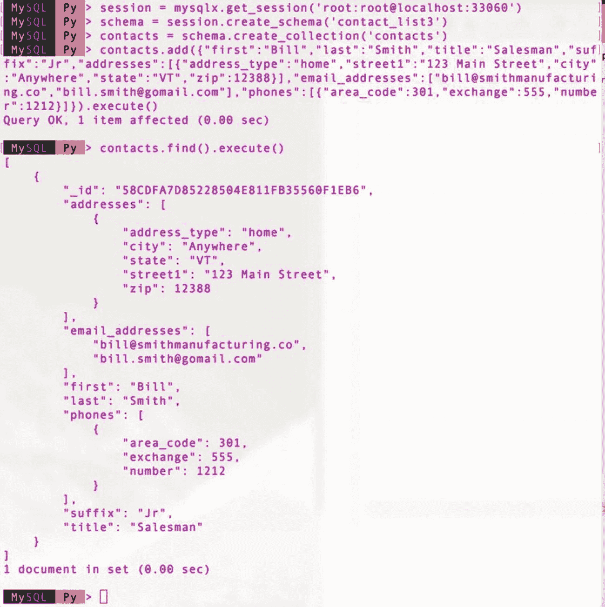

# 10.MySQL 8 和文档存储的规划

这本书涵盖了很多内容，包括 MySQL 8 的一些最新特性的简要概述。我将重点放在 MySQL 文档存储上，包括它的所有组件:X 协议、X DevAPI、MySQL Shell 以及对带有 MySQL X 插件的服务器的更改。不仅如此，我还演示了如何使用 X DevAPI 开发应用程序——从基于 SQL 到混合再到 NoSQL 解决方案。这些技术是对服务器特性的极好的补充，与传统的关系数据库应用程序开发相比，它们有望为您的开发资源带来更多的回报。很明显，MySQL 8 不仅仅是版本编号上的一个新的、活泼的跳跃。

回想一下，我们看到了一些新的高可用性特性，如组复制和 InnoDB 集群。但这并没有结束，不是吗？我们还有新的身份验证机制、新的数据字典和许多小而重要的更新。那么，从哪里开始考虑迁移和升级到 MySQL 8 的影响呢？在这一章中，我将介绍一些迁移到 MySQL 8 的策略，包括迁移应用程序以使用文档存储的注意事项和最佳实践，以及另一个迁移现有数据库应用程序的例子。我探索了一些使用 MySQL 8 的技巧和诀窍。

让我们首先简单讨论一下考虑从 MySQL 5.7 和更早版本升级到 MySQL 8 的一些策略。

## 从 MySQL 5.7 和更早版本升级

虽然这本书不是关于如何升级到 MySQL 8 的教程，但在采用 MySQL 文档存储之前，有一些事情你应该考虑，这将很可能导致升级你现有的 MySQL 服务器。

有几种方法可以学习如何进行升级。最明显和推荐的途径是阅读在线 MySQL 参考手册，其中包含一个关于升级 MySQL 的章节(提供您必须知道的关键信息)。但是，有一些适用于任何形式的升级或迁移的高级或一般实践。本节介绍的升级实践将帮助您避免升级像 MySQL 这样的主要系统时遇到的一些麻烦。

在这一节中，我们将看看 MySQL 的升级类型，然后讨论一些规划和执行升级的一般做法。我们以关于执行升级的原因的简短讨论来结束本节。我们将在最后讨论进行升级的原因，以便您更好地理解其中包含的风险。

让我们先来看看您可能会遇到的升级类型。

### 升级类型

在线 MySQL 参考手册和类似出版物描述了两种基本的升级方法，即如何进行升级的策略和步骤。下面是方法的总结。

*   就地:MySQL 服务器实例通过使用现有数据字典的二进制文件进行升级。这种方法使用各种实用程序和工具来确保平稳过渡到新版本。
*   逻辑:在安装新版本覆盖旧版本之前备份数据，在升级之后恢复数据。

尽管这些描述了升级 MySQL 的两个通用策略，但它们并没有涵盖所有可能的选项。事实上，我们将在后面的章节中看到另一种方法。毕竟，您的安装可能会略有不同——特别是如果您已经使用 MySQL 很长时间了，或者有许多配置了高可用性的 MySQL 服务器，或者在您自己的应用程序中使用第三方应用程序和组件。这些因素会使遵循一个给定的、通用的程序成为问题。

与其尝试扩展升级方法，不如让我们从系统管理员的角度来看一下。特别是我们有 x.y.z 版本，想升级到 a.b.c 怎么办？以下部分描述了基于版本的升级。

Caution

Oracle 仅建议升级 GA 版本。不建议升级其他版本，这可能需要额外的时间进行迁移，并接受潜在的不兼容性。升级非 GA 版本的风险由您自行承担。

MySQL Version Number Terminology

MySQL 使用三位数的版本号，以主要版本号、次要版本号和修订版本号的形式表示(奇怪的是，它在文档中也被称为版本号)。这通常用点符号表示。例如，版本 5.7.20 将主版本定义为 5，次版本定义为 7，修订版定义为 20。通常，版本号后面跟有文本(在文档中称为后缀),表示附加的版本历史、稳定性或一致性，如通用版本(GA)、候选版本(RC)等。关于 MySQL 中版本号的完整解释，参见 [`https://dev.mysql.com/doc/refman/8.0/en/which-version.html`](https://dev.mysql.com/doc/refman/8.0/en/which-version.html) 。

#### 版本升级

最简单的升级形式是在只更改修订版号的情况下进行升级。这通常是指 X.Y.Z 版本号中的 Z，或者简称为“主要.次要版本的版本”例如，5.7.20 版是 5.7 的修订版 20 或版本 20。

在此版本级别升级通常是安全的，尽管不能保证工作完美，但风险很低。但是，您仍然应该在执行升级之前阅读发行说明。如果您正在使用非通用版本(GA ),这一点尤其正确。如果该版本不是 GA 版本，您必须注意在线 MySQL 参考手册中的发行说明和升级部分。虽然这种情况很少发生，但有时您必须计划并克服一些特殊的考虑因素，以实现升级。幸运的是，Oracle 在传达任何必要的步骤和过程方面做得非常好——您只需要阅读文档！

#### 小升级

下一种升级形式是在次要版本号改变时进行升级。这通常是指 X.Y.Z 版本号中的 Y——例如，从 5.6 升级到 5.7。

对于次要版本的个位数增量，升级通常是可接受的并有记录。例如，支持从 5.6 升级到 5.7，但不直接支持从 5.0 升级到 5.7。这是因为版本之间有太多的差异，使得升级不可行(但并非不可能)。

然而，如果您有相应的计划，您可以升级较小的版本变更，风险可控。更多关于管理风险的内容将在后面的章节中介绍。

#### 重大升级

下一种升级形式是在主版本号更改时升级。除了不兼容的版本之外，这个类别是风险最大的类别，也是最有可能需要更多工作的类别。

主版本的版本升级很少发生，只有当 Oracle 发布了对服务器的一组新的、主要的更改(因此得名)时才会发生。MySQL 8 server 在 MySQL 5 的基础上做了许多改进，其中大部分在性能、高级功能和稳定性方面都有显著提高。但是，有一些变化使得旧版本中的一些功能不兼容。

例如，一旦 MySQL 8.0 正式发布，就支持从 MySQL 5.7 升级到 MySQL 8.0，但您可能需要迁移某些功能才能完成升级。

幸运的是，Oracle 已经详细记录了所有问题领域，并提供了如何迁移到新特性的建议。我们甚至看到这种情况扩展到了主要版本之外 MySQL 文档库就是一个很好的例子。

#### 不兼容的升级

正如您可能已经猜到的那样，有些升级不被推荐，要么是因为缺少支持升级的功能，要么是因为主要的不兼容性。比如你不要考虑从 MySQL 5.0 升级到 MySQL 8.0。这仅仅是因为 8.0 不支持一些较老的 5.0 特性。由于这些类型的升级并不常见，我们在下面的列表中总结了一些不兼容的升级。不兼容的原因不是你想升级到的新版本，而是你想升级的旧版本。

*   跳过主要版本:升级主要版本可能会引入不兼容的更改。
*   跳过次要版本:次要版本的某些升级可能会引入不兼容的更改。
*   升级不兼容的硬件:升级一种字节序的硬件可能与另一种不兼容。例如，big-endian 到 little-endian 可能不兼容。
*   更改 InnoDB 格式的版本:在 InnoDB 存储引擎内部发生了一些变化。大多数计划用于兼容的次要版本升级(例如，从 5.7.3 升级到 5.7.12)，但有些需要一些额外的步骤来准备数据。
*   新特性:新特性的引入很少会带来不兼容性。例如，添加数据字典来呈现。FRM 元数据已过时。
*   平台变更:包括变更平台在内的一些升级可能需要额外的工作或引入潜在的不兼容性。例如，从文件系统中不支持区分大小写的平台转移到支持区分大小写的平台。
*   升级非正式发布版本:不建议从非正式发布版本升级到正式发布版本，从正式发布版本升级到非正式发布版本，以及在非正式发布版本之间升级。

毫无疑问，不兼容性取决于某些功能、硬件或内部存储机制。在大多数情况下，在线文档概述了您可以做些什么来确保成功。有时这需要遵循特定的升级路径，例如在升级到目标版本之前先升级到一个版本。

What If I Must Upgrade An Incompatible Version?

如果您发现您的升级策略属于本节列出的不兼容升级，不要绝望。您可能仍然能够执行升级，但它可能更昂贵，需要更多的工作。例如，您可以通过使用带有`mysqldum` p 或`mysqlpump`的 SQL 语句来备份数据，安装新版本，然后使用 SQL 文件来调整它们以消除任何不兼容性，从而执行逻辑升级。尽管这确实带来了相当大的风险，即您仍然可以干净地导入所有数据，但这仍然是可能的。如果您发现自己处于这种情况，一定要花更多的时间使用并行安装和延长测试时间等策略来解决风险。

既然我们已经很好地了解了可能的升级类型，那么让我们来看看执行升级的一些最佳实践。

### 升级实践

在升级任何系统时，都有一些您应该遵守或至少应该用作指南的常规做法。本节描述了升级 MySQL 服务器时应该考虑的一些基本实践。同样，其中一些可能是熟悉的，一些可能不是您在升级 MySQL 时会考虑使用的。此外，其中一些在在线 MySQL 参考手册中没有列出。

正如您将看到的，这些实践不一定是连续的，甚至不一定是下一个实践的先决条件。例如，计划还应该包括测试时间。因此，这里讨论的实践按照重要性的一般顺序排列，但是不应该按照这个顺序来考虑或实现。

#### 检查先决条件

升级 MySQL 时，您应该做的第一件事是查看文档以了解任何先决条件。有时这只是安全地备份您的数据，但也可以包括诸如您需要使用哪些实用程序和工具来迁移某些功能(或数据)之类的内容。确保在升级之前满足所有先决条件。

升级文档还将包括不兼容问题。大多数情况下，这发生在升级主要版本时，但有时也会发生在次要版本上。幸运的是，在线 MySQL 参考手册中概述了这些内容。检查先决条件还可以帮助您提供可用于规划升级的详细信息。

Caution

当出现问题时，在线 MySQL 参考手册中关于升级的部分应该是你的第一站，而不是最后一站。“预先阅读”意味着被预先警告。

一旦通读了文档，作为先决条件，您需要做的一件事就是使用`mysqlcheck`实用程序来检查 MySQL 安装的兼容性。例如，升级到 MySQL 8 的先决条件之一是，根据在线 MySQL 参考手册中题为“MySQL 升级策略”的一节，“不得有使用过时数据类型、过时函数、孤儿的表。frm 文件、使用非本机分区的 InnoDB 表，或者定义器缺失或为空，或者创建上下文无效的触发器。我们可以使用`mysqlcheck`实用程序来识别这些情况，如清单 [10-1](#Par41) 所示。

```
$ mysqlcheck -u root -p --all-databases --check-upgrade
Enter password:
library_v1.authors                                 OK
library_v1.books                                   OK
library_v1.books_authors                           OK
library_v1.notes                                   OK
library_v1.publishers                              OK
library_v2.books                                   OK
library_v2.notes                                   OK
library_v2.publishers                              OK
library_v3.books                                   OK
...
mysql.user                                         OK
sys.sys_config                                     OK
Listing 10-1Using mysqlcheck to Identify Upgrade Issues

```

为了获得最佳效果，您应该使用正在升级的版本中的`mysqlcheck`实用程序。这将确保该实用程序是最新的，并应识别更多的升级问题。

#### 规划升级

一旦您制定了所有的先决条件，并确定了需要特殊处理来解决不兼容问题的任何功能，就应该计划升级服务器了。如果您有数千台服务器，这可能是一件显而易见的事情，但对于只有几台(甚至一台)服务器需要升级的人来说，这就不那么明显了。

您应该抵制简单地运行升级而不计划要做什么的诱惑。回想一下，我们希望通过降低(或消除)风险来确保升级顺利进行。这对于生产环境来说更加重要，但是任何潜在的可用性、性能或数据损失都会导致生产效率的损失。

您可以从文档中获得大部分需要规划的内容，但是文档并不特定于您的安装、服务器、平台等等。因此，您必须填写这些空白处，并根据您自己的安装修改文档中建议的过程。然而，通过阅读“MySQL 8.0 中的新特性”一节，您可以学到很多东西，请注意在线 MySQL 参考手册中标有“升级的后果”的任何小节。在那里你会找到一些提示，可以帮助你避免一些复杂的决定，或者更好地避免复杂的维修。

这还包括确保你手头有合适的人员来进行升级，或者在出现问题时做好准备。 [<sup>1</sup>](#Fn1) 例如，不要忘记你的开发人员、网站管理员和其他关键角色。

计划的形式由你决定；但是，我建议你把你打算做的事情写下来，和别人分享。这样，升级所有权链中的每个人都知道要做什么。你会惊讶地发现，小小的交流可以减少出错的风险。

Caution

如果您正在使用或计划使用支持自动更新的平台，并且这些设施包括监控 MySQL 的存储库，您可能要考虑将 MySQL 排除在自动更新之外。对于生产环境来说尤其如此。您不应该在生产环境中为任何关键任务数据自动更新 MySQL。

#### 考虑并行部署

在升级需要大量工作的系统时，最有帮助的一种做法是与现有版本并行安装新版本。这是软件工程中的一种做法，旨在确保在安装和配置新系统时，现有的数据和应用程序保持不变。新版本(安装)将被视为一个开发平台，通常在完成足够的迁移测试后投入生产。

尽管这本身并不是一次升级(这是一次新的安装)，但是运行一个新的 MySQL 并行版本在如何处理现有数据和应用程序的迁移方面提供了相当大的自由度。毕竟，如果出现问题，您的数据在旧系统上仍然是可操作的。

这种实践还为您提供了另一个好处:您可以更改平台或其他主要硬件，而不必拿现有数据冒险。因此，如果您现有的服务器有要同时更新的硬件，您可以使用并行安装在新硬件上安装 MySQL，从而隔离新硬件带来的风险。

最后，采用并行安装可以确保现有系统完全能够运行，从而有助于安排和规划您的迁移。更好的是，如果在迁移过程中出现问题，您可以随时回到旧系统。

并行部署通常包括让两个系统都运行一段时间。时间的长短可能取决于您愿意承担的风险，也可能取决于完全切换所有应用程序所需的时间。

不幸的是，有些人可能没有资源来考虑并行部署。因为同时安装两个 MySQL 可能会给开发人员、管理员和支持人员带来更大的负担。考虑到并行开发的好处，在短时间内增加额外的资源或接受一些人员的低生产率可能是值得的。

然而，如果你没有进行足够的测试，即使这个安全网也是脆弱的。

#### 测试测试测试！

这种实践和计划一起，经常被忽视或被轻视。有时，这是由于外部因素造成的，例如没有合适的人员可用，或者计划失败，导致没有时间进行广泛的测试。不管借口是什么，未能充分测试您的升级会增加超出大多数人愿意忍受的风险。

测试应包括确保所有数据都已迁移，所有应用程序完全正常工作，以及所有访问(用户帐户、权限等。)都是功能性的。然而，不要就此止步。您还应该确保您的所有操作实践都已针对新版本进行了修改。更具体地说，您的维护脚本、过程和工具都可以在新版本中正常工作。

此外，您的测试应该会决定是否接受升级。如果事情不工作或有太多的问题，您可能需要决定保留或拒绝升级。并行安装实践可以以这种方式提供帮助，因为在确定一切正常之前，您不会破坏现有的数据或安装。确保你把这些标准写进你的计划，以确保成功。

Tip

确保测试所有现有的操作程序，作为验收标准的一部分。

#### 生产部署策略

如果您有一个生产和开发(或测试)环境，您还应该考虑如何将开发或测试部署转移到生产环境中。如果您使用并行安装，可能只是简单地切换应用程序路由器和类似的设备和应用程序。如果您使用就地安装，它可能会更复杂。例如，您可能需要计划一段停机时间来完成迁移。

对于并行安装，计划停机时间可能更精确，并且涉及的时间更短，因为您有更多的时间来测试。但是，对于就地升级，您可能需要留出一段时间来完成迁移。正如所料，您希望通过尽可能多地进行迁移来最大限度地减少停机时间。但在 MySQL 的基地里，这可能无非就是形成一个计划，聚集资源。底线是，不要放弃在你的计划中包括生产部署。

既然我们已经讨论了升级实践，那么让我们花一点时间来讨论一下我们可能想要考虑执行升级的一些原因，这显然是一个非常复杂的过程，具有一定的风险。

### 升级的原因

如果您像大多数平台或系统的狂热用户一样，每当有新版本发布时，您都会希望升级到最新、最好的版本。精明的管理员和规划者知道，在生产数据库环境中，这种行为几乎没有存在的空间。因此，升级的理由将需要一些真正物有所值的东西。也就是说，它必须值得你去做。升级 MySQL 的主要原因包括以下几点。

*   特性:发布了一个可以改进应用程序或数据的新特性，例如文档存储、组复制和 InnoDB 集群
*   性能:新版本提高了性能，使您的应用程序更好。例如，最新的 5.7 版本比以前的版本快很多倍，MySQL 8 承诺会在这方面有所改进。
*   维护:有一些新功能可以帮助您更好地维护系统。示例包括新的数据字典、组复制和 MySQL 企业备份等辅助工具。
*   错误修复:旧版本中可能存在缺陷，需要解决方法或限制。较新的版本可能包含对关键错误的修复，因此您可以删除由缺陷引起的变通办法和限制。
*   合规性:您的平台、标准操作程序或外部实体需要升级以实现合规性。例如，根据合同协议，您可能需要运行特定版本的 MySQL。

底线是你必须回答这个问题，“我为什么要升级？”这个答案一定会给你、你的数据、客户、员工和公司的未来带来一些好处。将资源花费在几乎没有或根本没有好处的升级上是没有意义的，这也是公司经常跳过版本升级的另一个原因。唉，跳过太多升级会让以后的升级更成问题。然而，考虑到 MySQL 8.0 相对于 MySQL 5.7 和更早版本的改进，许多人将会计划升级到 MySQL 8。

Tip

有关迁移到 MySQL 8 的更多详细信息，包括特定平台的步骤，请参见 [`http://dev.mysql.com/doc/refman/8.0/en/upgrading-from-previous-series.html`](http://dev.mysql.com/doc/refman/8.0/en/upgrading-from-previous-series.html) 。

So, Should I Upgrade To MySQL 8 or Not?

本节的讨论可能会对您是否应该升级到 MySQL 8 产生一些疑问。事实并非如此。事实上，这本书应该说服你尽快升级到 MySQL 8，只要你能以一种安全、无风险的方式升级。因此，在本节中，我建议您需要仔细规划和执行升级，以确保成功。

### 升级到 MySQL 8 的注意事项

在线 MySQL 参考手册 MySQL 8.0 中发现了几个兼容性问题。以下是您在计划 MySQL 8.0 升级时应该了解的一些情况。

*   数据字典:新的元数据、事务存储机制是架构中的一个主要变化。如果您有处理`.frm`文件和其他元数据的 DevOps，您可能需要进行更改以迁移到使用数据字典。
*   认证插件:默认认证插件已经改变。这可能会导致使用旧身份验证机制的用户出现连接问题。
*   错误代码:一些错误代码已经改变。如果您想让应用程序使用错误代码，那么您会希望研究这些更改，以避免升级后出现应用程序错误。
*   分区:默认的分区存储引擎支持已被删除。如果你正在使用一个定制的存储引擎(或者一个旧的)，你将需要确保有一个升级的版本用于 MySQL 8。
*   INFORMATION_SCHEMA:对视图的微小更改。如果您的应用程序或开发应用程序使用这些视图，请务必检查您正在使用的视图是否已被删除或更改。
*   SQL 命令:有一些新的和过时的 SQL 命令。请务必检查您的 SQL 语句，看看您是否在使用一些旧的、已删除的命令。
*   默认字符集:默认字符集(charset)已经更改为 utf8mb4。如果您的应用程序支持字符集，您可能需要使用新的默认值进行测试，以确保兼容性。

同样，请务必阅读在线 MySQL 参考手册部分“验证 MySQL 5.7 安装的升级先决条件”和“影响 MySQL 8.0 升级的更改”部分，了解升级到 MySQL 8.0 所需的这些和其他先决条件和迁移任务的最新信息。

另一个很好的资源是 [`https://mysqlserverteam.com/`](https://mysqlserverteam.com/) 的工程博客。这些博客通常会在新功能正式发布之前对其进行讨论，并且是关于该功能如何工作以及工程团队已经确定或正在努力克服的任何升级问题的知识来源。关注博客将会给变化一个很好的预警。

Tip

请访问 [`https://mysqlserverteam.com/`](https://mysqlserverteam.com/) 的工程博客，了解关于新特性以及如何使用它们的早期公告。

既然我们已经讨论了 MySQL 的总体升级和升级到 MySQL 8.0 的一些细节，那么让我们讨论一个非常重要的开发概念，在完全采用 MySQL 文档存储之前，您应该花一些时间来理解这个概念。

## 迁移到无模式文档

无模式是什么意思？这仅仅意味着我们不会将数据存储限制为带有给定类型的特定字段的严格格式。采用无模式思维要记住的关键因素是发挥 JSON 文档的优势:只存储所需数据的能力，包括在需要的地方添加文档元素并将所有有意义的数据放在一起的能力。这也被称为灵活性，是设计无模式文档的基础。

例如，如果开发人员发现必须添加一个新字段，它可以。或者，如果开发人员发现嵌入信息可以产生更快、更简单的代码，那么他们应该权衡应用程序和用户体验的好处，而不是严格的数据存储规则。

灵活性还有另一个角度。关系数据库通常使用相同的规则和工具集来设计。以至于适用于一个数据库的东西会出现在另一个数据库中。在无模式设计中，将数据放入单独的集合或嵌入很大程度上是基于数据的使用方式，因此会因应用程序而异。

然而，你不应该由此得出结论，开发者可以免费搭车，可以随心所欲。相反，您应该将灵活性视为一种工具，在经过适当的过程后，您可以使用它来评估变更。

无模式思维的另一个好处是无需改造即可扩展数据。例如，如果我们的应用程序获得了更多的特性，导致文档中有更多的数据，就没有必要返回并强制将旧文档转换成新的结构。随着应用程序特性的成熟，我们简单地缩放文档。如果我们确实需要返回并向旧文档中添加数据，这只是一件简单的编码工作。

尽管减少不必要的复杂性和模糊性应该是任何数据存储设计的目标，但无模式思维应该更愿意接受权衡的责任，并努力最小化它们的影响，而不是遵守一套固定的规则。

因此，无模式思维应该是灵活性和可伸缩性的思维，在这种思维中，我们强调这些品质而不是数据结构和一致性。请记住，我们努力将数据保存在一起，以减少检索数据的次数。

以下几节指出了在采用无模式思维时，您可能需要考虑的一些方面

### 规范化与反规范化

最基本的思维挑战之一是认识到规范化和反规范化之间的区别。从根本上说，规范化是关系数据库设计者努力减少存储的数据量而又不存在重复或歧义的目标。反规范化是文档存储设计者的一个目标，通过最完整地描述一个实体，尽量使数据局部化，减少对重复的关注。

在无模式的世界中，我们使用反规范化来消除对连接的需求，从而可能提高性能。然而，这并没有结束。目标是让数据模型存储作为一个单元使用的数据。换句话说，文档应该包含所有相关的数据。

在某些情况下，这可能导致在文档中嵌入通常存储在单独的集合(或表)中的数据。因此，对数据进行反规范化可能会引入一些重复。例如，我们在上一章中看到了这一点，我们在 book 文档中存储了作者姓名。在这种情况下，作者的名字确实在有相同作者的书中重复了。然而，数据的使用方式——查看书目信息——意味着实际上不需要搜索或查询作者数据。只需简单地列出作者就可以了。因此，检索规范化作者数据的成本是固定规则的人工应用。

在处理规范化或反规范化问题时，不仅要从数据的组织方式的角度，还要从数据的使用方式的角度来分析数据。有时，您可能会发现隔离数据的原因并不重要。例如，如果不需要子表，并且可以接受一些重复，那么可以将信息嵌入到一个或多个 JSON 字段中，从而应用足够的非规范化来获得将数据放在一个地方的好处(一次检索)。

### 形式规则与启发式规则

另一个需要考虑的领域是如何设计数据存储，或者更恰当地说，使用什么机制来驱动开发。在关系数据库世界中，我们使用一组规则(例如，被称为范式的不妥协且有时不宽容的 [<sup>2</sup>](#Fn2) 规则)来指导设计者实现最少冗余、最准确的检索解决方案。在无模式的世界中，我们在设计数据存储时使用启发法或经验法则，以获得描述我们正在建模的事物的最佳存储，并使数据可访问。

区别不在于数据是如何设计的，而在于数据是如何显示的。在关系数据库世界中，数据存储很大程度上是根据如何存储它来设计的，而在无模式世界中，文档是根据如何使用它以及用户如何查看数据来设计的。

因此，我们可以相当好地预测关系数据库将如何被访问，如何形成查询(通常在应用程序之前)，甚至使用正确的工具预测查询将如何执行。然而，在无模式的解决方案中，我们不能通过检查文档来判断它将如何执行。我们必须用应用程序测试它，以了解如何更有效地访问它。有时，这可能会导致对代码或文档本身进行微小的更改。幸运的是，进行修改的过程比在关系数据库中容易得多。因此，在无模式的世界里，我们必须采取更加友好的态度。

这是将两者区分开来的原因之一。例如，在关系数据库中，当我们需要更改一个表(或一组表)时，我们通常必须提前做好计划，因为更改严格模式通常会迫使应用程序开发人员更改他们的应用程序。另一方面，修改文档不需要长时间的重组工作。事实上，开发人员可以简单地在代码中添加新的数据项，而不会给数据库管理员带来压力。我们来看一个例子。

考虑一个我们存储地址的解决方案。我们都知道它们的样子——街道 1、街道 2、城市、州和邮政编码。但是，如果您必须使您的数据库可用于国际数据，该怎么办呢？现在，我们正在考虑添加一个国家名称的可能性，如果不是为特定国家的地址添加额外的字段的话。毫无疑问，这将需要修改表(以及代码)。现在，考虑一个存储地址的文档。如果我们需要新的字段，我们只需在代码中添加它们，并编写代码来检测新的字段。

#### 将数据视为代码

对于那些使用过关系数据库的人来说，关于无模式设计最难理解的一个概念是，数据(文档)应该(可以)被视为代码。考虑 JSON 结构——它是代码！因此，将数据视为代码的一部分将有助于设计更好的文档。

例如，如果您知道您的文档包含列表元素，并且您需要迭代这些列表中的项目，那么执行此操作的代码通常是某种形式的循环或迭代器机制，例如 for each 或 for X in Y 构造。因此，您可以查看文档中是否有在这些循环结构中使用的数据。是的，这类似于在结果集(行的数组)中思考，但是在这种情况下，我们更接近真正的代码。事实上，由于 JSON 工作方式的独特性，我们可以编写代码来引用文档的元素，而不是我们在结果集处理中看到的抽象层。也就是说，我们通过名称访问字段，而不是要求库给我们“第 n”个字段。这使得代码更易于阅读，并由数据描述(反之亦然)。

### 认为存储是理所当然的

这听起来可能有点奇怪，但是存储机制——将文档放在文档存储中——很大程度上可以被无模式设计人员和代码开发人员忽略。例如，我们不关心表格行、字段等等。模式是灵活的，重点是收集文档。

一般来说，用于文档存储的 API 和 X DevAPI 使得这些操作无处不在，从而使设计人员和开发人员能够专注于如何使用文档，而不是如何存储文档。

正如所料，在有些情况下，我们希望确保不会过度反规范化，在这些情况下，我们需要从逻辑上考虑如何组织集合中的数据，但这也是一个更高的层次，不直接喜欢存储机制。

### 嵌入还是分离？

当你设计更多的无模式文档时，知道何时嵌入数据是你将学到的技能之一。但是，有一些通用规则可以遵循，以帮助回答“嵌入还是不嵌入？”下面列出了一些情况，在这些情况下，您可能需要决定是嵌入还是分离数据。

*   完整性:嵌入数据仅适用于此文档。它不会在其他地方使用，也很少在没有文档的情况下被更改(或查看)。如果它可以在其他文档中使用，并且更改必须应用于所有引用，或者它是一个单独的实体，则不应该嵌入它。
*   有限的增长:嵌入数据的长度不可能增长。例如，如果嵌入的数据是一个数组，数组的大小(项数)将保持较小(或很少)。如果有机会增长超过一个合理的大小，它应该是一个单独的集合。
*   Containership:如果存在一种关系，其中一个文档包含另一个文档，并且这些文档只能作为一个集合被访问，那么您可能希望嵌入。但是，如果文档可以单独访问或更改(这样做是有意义的)，您可能希望考虑不要嵌入文档。
*   编辑频率:如果文档中的数据很少更改，可以嵌入它。但是，如果数据可能从另一个访问点(视图)或应用程序中不使用原始文档的机制频繁更改；您可能需要考虑将数据移动到它自己的集合中。
*   链接:如果您想要嵌入的数据只是偶尔从一个文档中引用，您可以考虑嵌入它。但是，如果它被多个文档引用，并且所有引用的数据必须相同，则应将链接的数据放在它自己的集合中。

### 迁移到文档存储的策略

现在我们对无模式思维有了更好的理解，让我们回顾一下将现有关系数据库迁移到文档存储时可以采用的一些策略。本节使用另一个迁移到文档存储的例子来巩固本书中到目前为止学到的经验。

正如我们在第 [9](09.html) 章中看到的，我们不必一次性迁移所有的数据库和数据——尽管如果您有资源、时间和足够的需求，您可以这样做。然而，大多数人希望缓慢地迁移到文档存储。还有一种情况是，一个纯粹的文档存储可能无法满足您的需求，或者成本太高，这使得迁移成为一个长期目标。

让我们对联系人列表使用一个众所周知的数据库解决方案。在这里，我们存储姓名、地址和电话号码。联系人列表的典型关系数据库解决方案将所有数据分组到一个数据库中，地址、电话号码、电子邮件地址等具有一对多的关系。这是因为我们知道每个联系人都有一个或多个这样的数据项。图 [10-1](#Fig1) 显示了这种关系数据库设计的实体关系图(ERD)。


图 10-1

Contact list (relational database)

首先，注意这个数据库设计不是完全标准化的。例如，联系人列表可能包括两个或更多具有相同工作或家庭地址以及相同电话号码的人。毫无疑问，我们可以建立多对多的关系，但这种关系过于正常化了。更具体地说，我们不会将地址和电话号码与联系数据分开存储，这样使用数据没有任何意义。

其次，请注意，数据库支持为每个联系人存储多个电子邮件、地址和电话号码。也就是说，`contacts`表与`email_addresses`、`addresses`和`phones`表之间存在一对多的关系。我们将使用数据库名称`contact_list1`,这样我们可以将它迁移到其他表单进行比较。

在这个例子中，所有表上都有外键约束和主键。清单 [10-2](#Par120) 显示了数据库中表的 SQL 语句。

```
CREATE DATABASE IF NOT EXISTS `contact_list1`;

CREATE TABLE `contact_list1`.`contacts` (
    `contact_id` int(11) NOT NULL AUTO_INCREMENT,
    `first` char(30) DEFAULT NULL,
    `last` char(30) DEFAULT NULL,
    PRIMARY KEY (`contact_id`),
    KEY `contact_id` (`contact_id`),
    CONSTRAINT `email_addresses_ibfk_1` FOREIGN KEY (`contact_id`) REFERENCES `contacts` (`contact_id`)
) ENGINE=InnoDB;

CREATE TABLE `contact_list1`.`addresses` (
    `addr_id` int(11) NOT NULL AUTO_INCREMENT,
    `contact_id` int(11) NOT NULL,
    `address_type` ENUM('work', 'home', 'other') DEFAULT 'home',
    `street1` char(100) DEFAULT NULL,
    `street2` char(100) DEFAULT NULL,
    `city` char(30) DEFAULT NULL,
    `state` char(30) DEFAULT NULL,
    `zip` char(10) DEFAULT NULL,
    PRIMARY KEY (`addr_id`,`contact_id`),
    KEY `contact_id` (`contact_id`),
    CONSTRAINT `addresses_ibfk_1` FOREIGN KEY (`contact_id`) REFERENCES `contacts` (`contact_id`)
) ENGINE=InnoDB;

CREATE TABLE `contact_list1`.`email_addresses` (
    `email_id` int(11) NOT NULL AUTO_INCREMENT,
    `contact_id` int(11) NOT NULL,
    `email_address` char(64) DEFAULT NULL,
    PRIMARY KEY (`email_id`,`contact_id`)
) ENGINE=InnoDB;

CREATE TABLE `contact_list1`.`phones` (
    `phone_id` int(11) NOT NULL AUTO_INCREMENT,
    `contact_id` int(11) NOT NULL,
    `phone` char(30) DEFAULT NULL,
    PRIMARY KEY (`phone_id`,`contact_id`),
    KEY `contact_id` (`contact_id`),
    CONSTRAINT `phones_ibfk_1` FOREIGN KEY (`contact_id`) REFERENCES `contacts` (`contact_id`)
) ENGINE=InnoDB;

Listing 10-2Contact List Relational Database

```

Note

精明的数据库设计者会注意到电话号码字段被过分非规范化了。你能发现问题吗？ [<sup>3</sup>](#Fn3)

现在我们已经看到了数据库设计，让我们考虑一下文档存储设计者会注意到并希望改变的一些事情。也就是说，让我们以更批判的眼光来看待这个设计。请注意，对于我们想要查看的任何联系人，我们可能有多达三个额外的查询来检索所有数据。这是因为我们将电话、电子邮件和地址分别放在不同的表格中。我们可以发出一个连接查询来获取所有数据，但是这会产生额外的数据(除非您使用外部连接或类似的技巧)。

为了简单起见，让我们坚持每个依赖表一个查询。尽管如此，我们总共要执行四个查询来检索给定联系人的所有数据。清单 [10-3](#Par125) 显示了我们需要执行的查询，以获取名为“比尔·史密斯”的联系人的数据。

```
MySQL  localhost:33060+  SQL > SELECT * FROM contact_list1.contacts WHERE first = 'Bill' AND last = 'Smith';
+------------+-------+-------+
| contact_id | first | last  |
+------------+-------+-------+
|          1 | Bill  | Smith |
+------------+-------+-------+
1 row in set (0.00 sec)

 MySQL  localhost:33060+  SQL > SELECT * FROM contact_list1.addresses WHERE contact_id = 1;
+---------+------------+--------------+-----------------+---------+----------+-------+-------+
| addr_id | contact_id | address_type | street1         | street2 | city      | state | zip   |
+---------+------------+--------------+-----------------+---------+----------+-------+-------+
|       1 |          1 | home         | 123 Main Street | NULL    | Anywhere  | VT    | 12388 |
+---------+------------+--------------+-----------------+---------+----------+-------+-------+
1 row in set (0.00 sec)

 MySQL  localhost:33060+  SQL > SELECT * FROM contact_list1.email_addresses WHERE contact_id = 1;
+----------+------------+----------------------------+
| email_id | contact_id | email_address              |
+----------+------------+----------------------------+
|        1 |          1 | bill@smithmanufacturing.co |
|        2 |          1 | bill.smith@gomail.com      |
+----------+------------+----------------------------+
2 rows in set (0.00 sec)

 MySQL  localhost:33060+  SQL > SELECT * FROM contact_list1.phones WHERE contact_id = 1;
+----------+------------+----------------+
| phone_id | contact_id | phone          |
+----------+------------+----------------+
|        1 |          1 | (301) 555-1212 |
+----------+------------+----------------+
1 row in set (0.00 sec)

Listing 10-3Queries to Retrieve a Contact (Relational Database)

```

如您所见，这涉及到多次访问数据库服务器以获取数据。如果您的应用程序被设计为使用标签或其他用户界面机制来隐藏电话、地址和电子邮件，直到用户点击显示信息，有四个查询可能是好的，可能会节省您的一些努力。然而，几乎每个联系人列表解决方案都包括姓名、地址和电话号码。因此，从数据库往返行程的一般角度来看，我们并没有节省太多。

还要注意，它要求我们跟踪传递给三个相关查询的`contact_id`。一个好的关系数据库设计者会说，“那又怎样？”在这些观察中。然而，无模式思维告诉我们尽量减少连接，并将所有数据放在一起。让我们看看如何应用无模式思维将数据库迁移到混合解决方案，保留基表，但加入 JSON 字段。

Note

我不会深入讨论如何创建、更新和删除操作，因为这些操作在关系数据库系统中非常常见。

#### 迁移到混合解决方案

删除连接是提高数据检索性能的一个好策略。这也符合无模式设计的标准之一；将数据放在一起。这两种策略都属于非规范化数据。上一节中的示例联系人列表数据库被规范化为包含四个表:一个用于联系人姓名，另一个包含所有地址、电话号码和电子邮件地址。

我们的目标并不是让单独的表可以搜索，甚至可以访问，并且可以独立呈现。毕竟，任何人看到一个与所有者没有任何联系的电话号码列表有什么用呢？相反，规范化意味着将相似的数据放在一起并消除重复。

例如，如果你认识几个在同一个地方工作的人，他们的工作地址和电话号码可能是相同的。同样，同一家庭的成员可能有相同的地址和电话号码。 [<sup>4</sup>](#Fn4) 然后规范化产生一个主表，其中有三个一对多关系的依赖表。

但是，如果您认为我们很少需要单独查询电话号码、电子邮件地址或地址表，并且这些表中的数据与一个联系人相关联，并且只有将这些数据作为一个集合来查看才有意义，那么我们可以通过将这些数据嵌入到联系人数据中来对其进行反规范化。

我们可以很容易地做到这一点，只需使用 JSON 字段向 contacts 表添加三个字段来嵌入数据并保持结构不变。回想一下，我们可以在代码中使用 JSON 文档，因此可以使用原始表中的所有字段名。当您这样做时，迁移代码会更容易，因为您将引用相同的数据名称。下面显示了使用混合解决方案对数据库的重新设计。

```
CREATE DATABASE IF NOT EXISTS `contact_list2`;

CREATE TABLE `contact_list2`.`contacts` (
    `contact_id` int(11) NOT NULL AUTO_INCREMENT,
    `first` char(30) DEFAULT NULL,
    `last` char(30) DEFAULT NULL,
    `addresses` json DEFAULT NULL,
    `email_addresses` json DEFAULT NULL,
    `phones` json DEFAULT NULL,
    PRIMARY KEY (`contact_id`)
) ENGINE=InnoDB;

```

这里，我们通过将关系作为 JSON 数组添加来删除这三个表。但是等等，我们如何格式化这些 JSON 文档呢？这难道不是一个问题吗？不，不是真的。要迁移到混合解决方案，您需要将嵌入数据中的字段名作为 JSON 文档中的键。

我们还可以通过添加引用区号、交换机和电话号码的键来改进电话号码的数据。更好的是，如果我们后来发现需要添加国家代码值，我们可以为那些需要它们的联系人添加。请记住，JSON 文档的优点在于它们是可变的，您可以根据需要添加或删除字段。唯一的问题是，您的代码必须编写为预期的遗漏和新字段。因此，没有理由重组您的数据来为新联系人添加国家代码。

下面显示了如何使用上一节中显示的同一个 contact 来完成创建操作。

```
INSERT INTO contact_list2.contacts VALUES(
  NULL, 'Bill', 'Smith',
  '{"addresses":[{“address_type”:”home”, "street1":"123 Main Street","street2":"","city":"Anywhere","state":"VT","zip":12388}]}',
  '{"email_addresses":["bill@smithmanufacturing.co","bill.smith@gomail.com"]}',
  '{"phones":[{"area_code":301,"exchange":555,"number":1212}]}'
);

```

这导致从一个`SELECT`查询返回一个有趣的行。我们在下面看到了结果。

```
MySQL  localhost:33060+  SQL > SELECT * FROM contact_list2.contacts WHERE first = 'Bill' AND last = 'Smith' \G
*************************** 1\. row ***************************
     contact_id: 1
          first: Bill
           last: Smith
      addresses: {"addresses": [{"zip": 12388, "city": "Anywhere", "state": "VT", "street1": "123 Main Street", "street2": "", "address_type": "home"}]}
email_addresses: {"email_addresses": ["bill@smithmanufacturing.co", "bill.smith@gomail.com"]}
         phones: {"phones": [{"number": 1212, "exchange": 555, "area_code": 301}]}
1 row in set (0.00 sec)

```

在这里，可以看到我们使用了与原始表中的字段相同的名称。访问数据变得更加容易，因为我们可以将代码从在行对象中查找列迁移到直接在代码中使用字段名。例如，为了显示嵌入的地址、电话和电子邮件列表，我们可以使用循环。清单 [10-4](#Par143) 展示了一个完成这项工作的示例脚本。

```
import mysqlx
from json import JSONDecoder

GET_BILL = """
SELECT * FROM contact_list2.contacts
WHERE last = 'Smith' AND first = 'Bill'
"""

# Connect to database
session = mysqlx.get_session("root:password@localhost:33060")

# Read the row
row = session.sql(GET_BILL).execute().fetch_one()

# Convert JSON strings to Python dictionaries
addresses = JSONDecoder().decode(row["addresses"])["addresses"]
phones = JSONDecoder().decode(row["phones"])["phones"]
email_addresses = JSONDecoder().decode(row["email_addresses"])["email_addresses"]

# Display the data
print("Contact List (Hybrid)")
print("---------------------")
print("Name: {0} {1}".format(row["first"],row["last"]))
print("\nAddresses:")
for address in addresses:
    print("\t({0})".format(address["address_type"].upper()))
    print("\t{0}".format(address["street1"]))
    if address["street2"]:
        print("\t{0}".format(address["street2"]))
    print("\t{0}, {1} {2}".format(address["city"],
                                  address["state"],
                                  address["zip"]))
print("\nPhones:")
for phone in phones:
    print("\t({0}) {1}-{2}".format(phone["area_code"],
                                   phone["exchange"],
                                   phone["number"]))
print("\neMail Addresses:")
for email in email_addresses:
    print("\t{0}".format(email))

print("")

Listing 10-4Sample Read Operation for Contact List (Hybrid)

```

请注意，代码可读性很好，我们可以确切地看到我们在循环中访问的是哪些数据。然而，在将 JSON 字符串转换成 Python 字典时，会有一些重复。这是因为我们在表中有一个字段，在 JSON 字符串中有一个同名的键。例如，有一个`addresses`字段，JSON 文档中的键是`addresses`。这可能看起来有点奇怪，但这正是您在字段中访问 JSON 文档的方式。有些人可能希望重命名字段或 JSON 键，使其不那么模糊。

下面显示了这段代码的执行过程。请注意，输出确实与您通过阅读代码看到的数据相似。使用制表符(`\t`)有助于将字符串打印到控制台。

```
$ python ./hybrid_read.py
Contact List (Hybrid)
---------------------
Name: Bill Smith

Addresses:
    (HOME)
    123 Main Street
    Anywhere, VT 12388

Phones:
    (301) 555-1212

eMail Addresses:
    bill@smithmanufacturing.co
    bill.smith@gomail.com

```

这个解决方案更好，确实解决了删除连接和将数据保存在一起的问题，但是如果我们需要存储姓氏、后缀、头衔，或者如果联系人有两个以上的名字，该怎么办呢？同样，如果您发现需要找到在某个地区居住或工作的所有联系人，该怎么办？数据是存在的，但是因为电话号码是单个字符串，所以更难搜索数据(但不是不可能)。

我们可以解决这个问题(以及类似的问题),只需修改表格，将数据分成不同的字段。这是可行的，也是大多数开发者会做的。但是，您如何处理任何现有数据呢？你会用自己创造的特殊工具重新格式化吗？你没有任何选择，如果有大量的数据，转换可能是痛苦和耗时的。

遗憾的是，具有关系部分(表、字段)的混合解决方案仍然是固定的，因此混合解决方案不能避免变化。我们需要的是实现可变性——能够在我们需要的任何时候改变结构，而不必重新调整。如果你在想，“肯定有更好的方法”，你是对的——确实有。让我们看看如何通过将数据库转换为纯文档存储来克服这些问题。

#### 转换到文档存储

也许文档存储解决方案的最佳属性是可变性。这一点，再加上“数据即代码”的概念，使得使用文档存储比使用关系数据库容易得多。尽管我们在联系人数据库的混合解决方案中看到了一些改进，但是我们还没有到可以实现可变性的地步。

具体来说，我们在混合解决方案中仍然有固定的字段。如果这些字段是完整的集合(对于所有时间)，我们可能会对混合解决方案感到满意。但是如果你在一个国际化的环境中工作，你会发现存储名字和姓氏太随意了，在某些情况下是不够的。

比如热拉尔多·何塞·米格尔·戈麦斯。你用这样的名字做什么？将名称任意拆分，将部分放在两个字段中？如果这个人用米格尔作为他的名字呢？现在，你的数据库将列出他的名字为“米盖尔”，“热拉尔多·何塞·戈麦斯”，这是不正确的。此外，如果您以这种方式拆分姓名，那么任何关于名字或姓氏的查询都会导致不正确的结果，或者至少会在查询之后进行额外的解析来解决这些异常。

如果我们使用文档存储，我们可以添加任何我们需要的字段。我们只需要保持代码和数据同步。也就是说，当我们添加新字段时，我们也必须在 CRUD 操作中添加代码来进行补偿。例如，向文档中添加昵称字段很容易，但是读取和显示数据的代码必须允许使用昵称。最重要的是，我们可以添加更改，而不必修改任何现有的数据。

这就是我们的目标:让您的数据无模式化，并与代码紧密集成。一旦你接受了这种心态，你会发现正常化的耻辱很容易被抛弃。尽管这并不意味着所有的无模式解决方案都优于它们的关系型解决方案(事实上不太可能)，但这确实意味着您可以让数据为您服务，而不是与您作对。开发者尤其会喜欢这种自由。

正如我们在第 9 章和本书前面所学的，我们可以用代码轻松地创建一个集合。回想一下，这包括连接到服务器、获取模式对象实例和创建集合。然后，我们可以创建、阅读、更新或删除集合中的文档。图 [10-2](#Fig2) 显示了使用 MySQL Shell 为联系人列表创建模式和集合的快照。我们还添加了我们作为示例使用的行。



图 10-2

Creating a document store

在这里，我们看到我们已经将僵化的关系数据库模型迁移到一个可变的 JSON 文档中，其中嵌入了数据，可以将每个联系人的所有数据保存在一起。

现在，让我们看看在文档存储上执行读操作的代码。清单 [10-5](#Par158) 显示了从集合中读取文档并将其打印到控制台的代码。

```
import mysqlx

# Connect to server
session = mysqlx.get_session("root:password@localhost:33060")

# Get the schema
schema = session.get_schema("contact_list3")

# Get the collection
contacts = schema.get_collection("contacts")

# Read the row
row = contacts.find("first = '{0}' and last = '{1}'".format('Bill',
                                                        'Smith')).execute()
contact = row.fetch_one()

addresses = contact["addresses"]
phones = contact["phones"]
email_addresses = contact["email_addresses"]

# Display the data
print("Contact List (DocStore)")
print("-----------------------")
suffix = ""
if "suffix" in contact.keys():
    suffix = ", {0}".format(contact["suffix"])
print("Name: {0} {1}{2}".format(contact["first"],contact["last"],suffix))
if "title" in contact.keys():
    print("Title: {0}".format(contact["title"]))
print("\nAddresses:")
for address in addresses:
    print("\t({0})".format(address["address_type"].upper()))
    print("\t{0}".format(address["street1"]))
    if "street2" in address.keys():
        print("\t{0}".format(address["street2"]))
    print("\t{0}, {1} {2}".format(address["city"],
                                  address["state"],
                                  address["zip"]))
print("\nPhones:")
for phone in phones:
    print("\t({0}) {1}-{2}".format(phone["area_code"],
                                   phone["exchange"],
                                   phone["number"]))
print("\neMail Addresses:")
for email in email_addresses:
    print("\t{0}".format(email))

print("")

Listing 10-5Sample Read Operation for Contact List (Document Store)

```

注意，代码与混合解决方案非常相似。实际上，打印部分是相同的。这种差异在检索数据的早期就能看出来。在这种情况下，我们可以检索文档，然后将地址、电话和电子邮件地址存储为字典，这使得代码更容易阅读。非常好！

下面显示了正在执行的代码。如您所见，输出与混合解决方案相同。

```
$ python ./docstore_read.py
Contact List (DocStore)
-----------------------
Name: Bill Smith, Jr
Title: Salesman

Addresses:
    (HOME)
    123 Main Street
    Anywhere, VT 12388

Phones:
    (301) 555-1212

eMail Addresses:
    bill@smithmanufacturing.co
    bill.smith@gomail.com

```

现在我们已经讨论了什么是无模式思维，让我们回顾一下使用 MySQL 文档库的一些技巧和诀窍。

## 文档存储提示和技巧

下面包含了使用 MySQL Document Store 规划、开发和管理应用程序的一些最佳实践。有些可能看起来很直观，而其他的可能只是提醒你去做那些我们都知道应该做的事情，但有时为了简洁而走捷径。它们以项目符号列表的形式呈现，旨在成为一种资源，您可以在迁移或开发工作开始时定期参考。

*   最小化连接:连接可能很昂贵。减少需要联接数据的位置有助于加快查询速度。移除连接可能会导致某种程度的反规范化，但可以更快地访问数据。
*   可变性计划:无模式设计关注可变性。构建能够根据需要(并在合理的范围内)修改文档的应用程序。
*   消除多对多关系:使用嵌入式数组和列表来存储文档之间的关系。这可以像在文档中嵌入数据或在文档中嵌入文档 id 数组一样简单。在第一种情况下，您一阅读文档就可以获得数据，而在第二种情况下，只需要一个额外的步骤来检索数据。在很少读取(使用)关系的情况下，将数据与一个 id 数组链接会更有效(第一遍读取的数据更少)。
*   避免过度反规范化:反规范化可能走得太远。如果以复制为代价，通过在文档中嵌入内容来使数据非规范化，您可能会在某个时候发现需要更改复制的数据。如果发生这种情况，你已经越界了，现在你的数据更新噩梦开始了。因此，无论何时进行反规范化，都要考虑数据将如何(或是否)更新。如果它可以单独更新(比如只对一个或多个文档进行更新)，并且这些更改不需要存在于其他文档中，那么您的反规范化应该没问题。但是，如果您认为需要更新所有的嵌入数据，那么您必须考虑将数据移动到另一个集合中，并使用嵌入列表按 id 链接文档。
*   了解您的数据:这听起来可能很明显，但是您必须了解您在设计中使用的数据。不仅仅是它可以(或者必须)包含什么，而且是它将如何被使用。通常，关系数据库设计者只关心检索数据任何部分的能力，而忽略了如何使用数据。因此，在关系数据库世界中，我们经常发现自己在应用程序和数据设计好之后优化查询。在无模式的世界中，我们必须从一开始就关注如何使用数据，这样我们就可以将相关的数据一起存储在一个单独的或者有时是链接的文档中。了解您的数据将如何在应用程序中使用会对您形成文档的方式产生影响。它还可以帮助您在开始编写代码之前确定如何编写代码来检索数据。
*   避免大文档:将所有数据存储在一个文档中确实是无模式设计的目标之一，但是这也必须在使用时有一些判断。如果您的文档非常大，那么在尝试检索多个文档(比如一个列表或对一组文档执行操作)时，可能会遇到性能问题。因此，您应该考虑何时使用文档的哪些部分。您可能会发现，您可以将您的文档拆分成几个更小的文档(每个文档位于各自的集合中)。这样，您可以优化大多数操作的检索，只在需要时才检索不常用的数据。
*   使用 JSON 列在表中嵌入数据:如果希望通过减少连接的数量来改进现有的关系数据库，可以使用 JSON 字段来嵌入数据。例如，通过存储指向依赖表的指针(键)数组，使用 JSON 字段折叠多对多连接表。一个明显的候选是具有编码数据的 BLOB 字段的文本。

## 摘要

MySQL 文档存储和服务器的最新化身 MySQL 8 代表了功能性、可靠性和可用性方面的巨大飞跃。最重要的是，MySQL 8 不会强迫你进入一个新的范式。通过 X DevAPI 的 NoSQL 选项完美地补充了 NDB 集群的高级集群和可用性。但是与 NDB 集群不同，您可以使用现有的 MySQL 服务器。 [<sup>5</sup>](#Fn5)

这意味着，您不必学习和完全改造您的基础设施和应用程序，就可以使用最新的功能。我们在本书和第 9 章[的实践中看到，您可以选择使用 MySQL 8 作为传统的关系数据库存储，将您的应用迁移到具有一个或多个 JSON 字段的关系数据的混合体，或者通过迁移到纯文档存储解决方案来彻底重新思考您的数据。](09.html)

事实上，MySQL 使得应用程序的迁移变得很容易，因为 X DevAPI 同时支持 SQL 和 NoSQL 接口。因此，第一步是将所有基于 SQL 接口的应用程序迁移到 X DevAPI，然后您可以选择将这些应用程序迁移到混合或纯文档存储解决方案。

对于 MySQL 用户来说，这是一个激动人心的时刻。Oracle 继续信守承诺，不仅继续开发 MySQL，还投入资源改进和扩展特性集。请密切关注更多优秀的特性以及进一步的改进和更新。MySQL 8 已经发布，现在是时候加入了。在 MySQL 8 上寻找更多的标题！

Footnotes [1](#Fn1_source)

对于数据库或 web 管理员来说，接到电话(通常在半夜)来解决升级中出现的问题总是令人震惊的——尤其是当他们不知道已经计划了这样的升级时！是的，这确实发生了——太频繁了。

  [2](#Fn2_source)

小心正常形态的狂热者！他们的整个世界都围绕着达到第五范式的禅宗般的状态。可悲的是，他们可能会错过反规范化的要点。

  [3](#Fn3_source)

提示:如果您需要查找居住在某个区号内的所有联系人，该怎么办？您将如何编写查询？

  [4](#Fn4_source)

两代或更多代人(或其中的成员)住在同一个家里并不罕见。随着医疗和长期护理成本的上升，这种情况只会变得更加普遍。

  [5](#Fn5_source)

NDB 群集需要几台安装了 NDB 群集服务器的服务器。请参阅在线 MySQL 参考手册中的 NDB 集群部分了解更多详细信息。