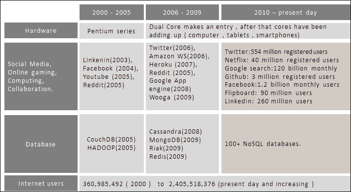
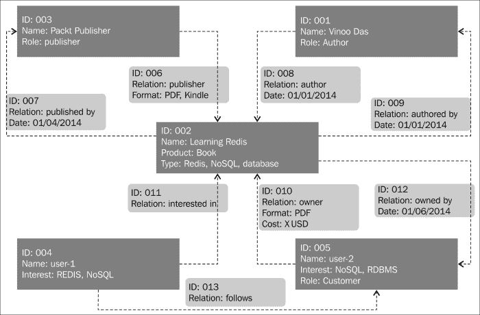
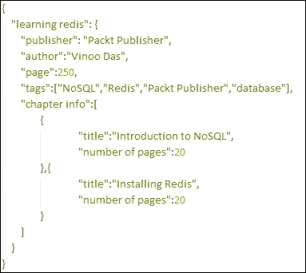
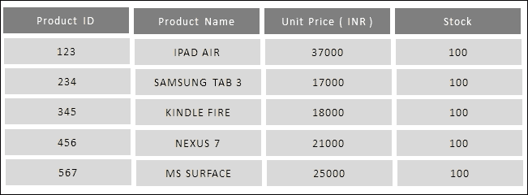
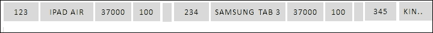

# 一、NoSQL 简介

在本章中，您将了解 NoSQL 的新兴领域，并了解 NoSQL 领域中的各种分类。我们还将了解**Redis**在 NoSQL 域中的位置。我们将介绍以下主题：

*   企业中的数据
*   NoSQL
*   NoSQL 的用例

# 互联网世界

我们生活在一个有趣的时代；在过去的十年中，发生了很多变化，改变了我们体验互联网世界和周围生态系统的方式。在本章中，我们将重点讨论导致进展的一些原因，并讨论数据存储领域的发展。

下图是网络空间中发生的演变过程的大致示意图，其数据是从互联网收集的，并给出了基于互联网的服务增长的大致情况：

进化：社交媒体、处理器和核心、数据库（NoSQL）

前面的图表表明，硬件行业在前十年的中半期发生了范式转变。新一代处理器不是以更高的时钟速度出现，而是具有多个内核，并且在后续版本的处理器中它们的数量增加。拥有大量内存和强大处理器的大型机器可以解决任何问题的时代已经一去不复返了，换句话说，企业依靠垂直扩展来解决性能问题的时代已经一去不复返了。在某种程度上，它表明并行计算是未来的趋势，它将部署在基于商品的机器上。

随着硬件行业标志着并行计算的到来，新一代解决方案必须是分布式和并行的。这意味着它们需要并行执行逻辑，并将数据存储在分布式数据存储中；换句话说，水平缩放是一种方式。此外，随着 Web2.0 的出现，出现了社交媒体、在线游戏、在线购物、协作计算、云计算等。互联网正在成为一个无处不在的平台。

互联网的普及和使用互联网的人数与日俱增，花在互联网上的时间也在增加。另一个需要关注的重要方面是，不同地区的用户正在这个互联网支持的世界中走到一起。原因是多方面的,；首先，网站正在变得智能化，在某种程度上，它比它们的前任更有效地吸引最终用户。另一个使互联网应用更快、更容易的因素是创新的手持设备，如智能手机、平板电脑等。如今，这些手持设备的计算能力可以与计算机相比。在这个动态变化的世界中，基于互联网的软件解决方案和服务正在扩展社交媒体的视野，将人们聚集在一个共同的平台上。这创造了一个新的商业领域，如社交企业媒体，社交媒体与企业之间架起了桥梁。这肯定会对传统的企业解决方案产生影响。

互联网效应使企业解决方案经历了一次蜕变。企业架构的转变从一组细微差别的需求（通常是企业解决方案所期望的需求）转变为采用更新的需求，这是社交媒体解决方案的堡垒。如今，企业解决方案正在与社交媒体网站集成，以了解客户在谈论什么；他们自己也开始创建平台和论坛，让客户可以来分享他们对产品和服务的印象。所有这些数据交换都是实时进行的，需要一个高度并发和可扩展的生态系统。综上所述，企业解决方案希望采用社交媒体解决方案的功能，这与它们的体系结构的非功能性需求有着直接和成比例的关系。故障管理、实时大数据处理、最终一致性、高读写次数、响应能力、横向可扩展性、可管理性、可维护性、敏捷性等特性及其对企业体系结构的影响正重新引起人们的兴趣。社交媒体架构中使用的技术、范例、框架和模式正在研究中，并在企业架构中重新应用。

任何解决方案（社交媒体或企业）的关键层之一是数据层。数据、数据的安排和管理方式以及数据存储的选择构成了数据层。从设计人员的角度来看，任何数据存储中的数据处理都受一致性、可用性和分区容差等角度的控制，或者更好地称为 Eric Brewer 的**CAP**定理。虽然这三种观点都是可取的，但实际上，任何数据层都可以有上述两种观点的组合。这意味着解决方案中的数据可以有许多透视图的组合，例如可用性分区容差（此组合必须放弃数据处理中的一致性）、可用性一致性（此组合必须放弃分区容差，这将影响数据层可以处理的数据量），和一致性分区容差（这种组合必须放弃可用性）。

CAP 定理直接关系到系统的行为、读/写速度、并发性、可维护性、集群模式、容错性、数据负载等。

设计数据模型时最常用的方法是以关系化和规范化的方式对其进行排列。当数据处于事务模式，需要一致性，并且是结构化的，也就是说，它有一个固定的模式时，这种方法非常有效。当数据是半结构化的、具有树状结构的或是无模式的时，这种数据规范化方法显得过于复杂，一致性可以放松。使半结构化数据适合结构化数据模型的最终结果是表的爆炸和存储简单数据的复杂数据模型。

由于缺乏替代方案，解决方案一直公开依赖**RDBMS**来解决数据处理方面的问题。这种方法的问题是 RDBMS，它主要是为了解决数据处理的一致性和可用性问题，也开始存储数据，这涉及到分区容差。最终的结果是使用非常复杂的数据模型构建了臃肿的 RDBMS。在故障管理、性能、可伸缩性、可管理性、可维护性和敏捷性方面，这开始对解决方案的非功能性需求产生负面影响。

另一个值得关注的领域是**数据解释**，这在设计数据层时非常重要。在一个解决方案中，不同的关注群体以不同的方式查看和解释相同的数据。为了给出更好的想法，假设我们有一个销售产品的电子商务网站。在该数据层的设计中，三个基本功能域发挥作用；它们是库存管理、账户管理和客户管理。从核心业务的角度来看，所有的域在其数据管理中都需要**原子性、一致性、隔离性、耐久性**（**ACID**）属性，从CAP 定理的角度来看，它们需要一致性和可用性。但是，如果网站需要实时了解其客户，分析团队需要分析来自库存管理、账户管理和客户管理领域的数据。除了其他数据外，它还可以实时单独收集。分析团队查看相同数据的方式与其他团队查看数据的方式完全不同；对他们来说，一致性不太重要，因为他们更关心总体统计数据，稍微不一致的数据对总体报告没有影响。如果这些领域的分析所需的所有数据都保存在与核心业务相同的数据模型中，那么分析将遇到困难，因为它现在必须为业务运营使用高度规范化和优化的结构化数据。分析团队还希望对数据进行非规范化处理，以实现更快的分析。

现在，在 RDBMS 系统上对这些规范化数据运行实时分析将需要大量的计算资源，这将在工作时间影响核心业务的性能。因此，如果为这些领域创建单独的数据模型（一个用于业务，一个用于分析）对整体业务更好，因为每个领域都有单独的关注点，所以每个领域都单独维护。我们将在后续主题中看到为什么 RDBMS 不适合分析和其他一些用例，以及 NoSQL 如何解决数据爆炸的问题。

# NoSQL 引物

**不仅 SQL**或**NoSQL**（俗称）于 1998 年由卡洛·斯特罗齐（Carlo Strozzi）创造，2009 年由埃里克·埃文斯（Eric Evans）重新引入。这是数据处理中一个令人兴奋的领域，在某种程度上填补了数据处理层中存在的许多空白。在 NoSQL 作为存储数据的替代选择出现之前，面向 SQL 的数据库（RDBMS）是开发人员定位或修改数据的唯一选择。换句话说，RDBMS 是解决所有数据问题的一把锤子。当 NoSQL 及其不同类别开始出现时，不适用于 RDBMS 的数据模型和数据大小开始发现 NoSQL 是一个完美的数据存储。从一致性的角度来看，注意力也发生了转移；从酸性质到碱性质发生了变化。

酸性质表示 CAP 定理的一致性和可用性。这些属性由 RDBMS 展示，代表以下内容：

*   **原子性**：在事务中，所有操作都将完成或不完成（回滚）
*   **一致性**：数据库在事务开始和结束时处于一致状态，不能在这两个状态之间离开
*   **隔离**：并发事务之间不会有干扰
*   **耐久性**：一旦事务提交，即使在服务器重启或失败后也会保持这种状态

NoSQL 展示了**基础**属性；它们表示 CAP 定理的可用性和分区容差。他们基本上放弃了 RDBMS 所显示的强一致性。底座代表以下功能：

*   **基本可用**：此保证即使数据处于陈旧状态，也能响应请求。
*   **软状态**：数据的状态始终处于接受更改的位置，即使没有更改其状态的请求。这意味着，假设有两个节点持有相同的数据状态（数据复制），如果有请求更改其中一个节点的状态，则另一个节点的状态在请求的生命周期内不会更改。另一个节点中的数据将由于数据存储触发的异步进程而改变其状态，从而使状态变软。
*   **Eventually consistent**: Due to the distributed nature of the nodes, the system will eventually become consistent.

    ### 注

    数据写入和读取应该更快、更容易。

另一个有趣的发展发生在软件开发领域。垂直可伸缩性已经达到了极限，解决方案的设计必须具有水平可伸缩性，因此数据层也必须是分布式的和分区容忍的。除了社交媒体解决方案之外，基于在线游戏和博弈论的网站（进行目标营销的网站，即根据用户购买该网站的历史记录奖励用户。此类网站需要实时分析）开始获得关注。社交媒体希望在尽可能短的时间内同步来自不同地区的大量数据，而游戏界对高性能感兴趣。电子商务网站感兴趣的是实时了解其客户和产品，以及在客户意识到其需求之前分析其客户以了解其需求。NoSQL 中基于不同数据模型出现的类别如下：

*   面向图的 NoSQL
*   面向文档的 NoSQL
*   面向键值的 NoSQL
*   面向列的 NoSQL

## 面向图的 NoSQL

图形数据库是一种特殊的 NoSQL 数据库。图形数据库存储的数据模型是图形结构，这与其他数据存储略有不同。图结构由节点、边和属性组成。理解图形数据库的方法是将它们视为具有双向关系的思维导图。这意味着，如果 A 与 B 相关，B 与 C 相关，那么 C 与 A 相关。图形数据库倾向于解决运行时非结构化实体之间形成的关系所产生的问题，这种关系可能是双向的。相比之下，RDBMS 还有一个关系的概念，称为**表连接**，但这些关系是基于结构化数据的，不能是双向的。

此外，这些表联接增加了使用外键的数据模型的复杂性，并且当数据集在一段时间内增长时，会对基于表联接的查询造成性能损失。一些最有前途的图形数据存储是 Neo4i、FlockDB、OrientDB 等。

为了更好地理解这一点，让我们来看看一个示例用例，看看用面向图形的 NoSQL 来解决复杂的基于图形的业务用例变得多么容易。下图是一个示例用例，电子商务网站可能有兴趣解决该用例。该用例用于在网站的微博组件中捕获访问者的购买历史和人们的关系。

图形数据库的示例模块

业务实体，如出版商、作者、客户、产品等在图中表示为节点。关系（如作者、作者、发布者、发布者等）由图中的边表示。有趣的是，一个非业务节点，比如来自博客站点的*用户 1*，可以在图中表示，以及它与另一个节点*用户 2*的关系*跟在*后面。通过将商业实体和非商业实体相结合，网站可以找到产品的目标客户。在图中，节点和边都具有在运行分析时使用的属性。

基于系统中存储的关系，图形数据库可以轻松回答以下问题：

*   Who authored *Learning Redis*?

    回答：维努达斯

*   How are Packt Publishing and *Learning Redis* related?

    答：出版商

*   Who has their own NoSQL book published by Packt Publishing?

    回答：user-2

*   Who is following the customer who has purchased *Learning Redis* and is interested in NoSQL?

    回答：user-1

*   List all the NoSQL books that cost less than X USD and that can be bought by the followers of user-2.

    答：*学习 Redis*

## 面向文档的 NoSQL

面向文档的数据存储旨在以存储文档的理念存储数据。为了简单地理解这一点，这里的数据是以书的形式排列的。一本书可以分为任意数量的章节，其中每一章节可以分为任意数量的主题，每个主题还可以进一步分为子主题等等。

写作

如果数据具有类似的结构，也就是说，它是分层的，没有固定的深度或模式，那么面向文档的数据存储是存储此类数据的最佳选择。**MongoDB**和**CouchDB****Couchbase**是目前备受关注的两个著名的面向文档的数据存储。与书籍一样，这些数据存储库也有存储在内存中的键索引，用于更快的搜索。

面向文档的数据存储以 XML、JSON 和其他格式存储数据。它们可以将标量值、映射、列表和元组作为值保存。与 RDBMS 不同，在 RDBMS 中，数据被视为以表格形式存储的数据行，这里存储的数据是分层树状结构，其中存储在这些数据存储中的每个值始终与一个键关联。另一个独特的特性是面向文档的数据存储是无模式的。下面的屏幕截图显示了一个示例，该示例显示了数据如何存储在面向文档的数据存储中。存储数据的格式是 JSON。面向文档的数据存储的优点之一是，信息可以按照您对数据的看法进行存储。从某种意义上说，这是 RDBMS 的一种范式转变，在 RDBMS 中，数据被分解成各种较小的部分，然后以规范化的方式存储在行和列中。

JASON 格式的样本数据组成

目前使用的两个最著名的面向文档的存储是 MongoDB 和 CouchDB，为了更好地了解它们，将它们相互比较会很有趣。

### MongoDB 和 CouchDB 的显著特征

事实上，MongoDB 和 CouchDB 都是面向文档的，这一点已经确立，但它们在各个方面都有所不同，这将引起希望了解面向文档的数据存储并在项目中采用它们的人们的兴趣。以下是 MongoDB 和 CouchDB 的一些特性：

*   **插入大小数据集**：MongoDB 和 CouchDB 都非常适合插入小数据集。在插入大型数据集方面，MongoDB 比 CouchDB 稍微好一点。总的来说，这两个文档数据存储中的速度一致性都非常好。
*   **随机读取**：MongoDB 和 CouchDB 在读取速度方面都很快。在读取大型数据集方面，MongoDB 稍微好一点。
*   **容错**：MongoDB 和 CouchDB 都有相当好的容错能力。CouchDB 使用**Erlang**/**OTP**作为其实现的底层技术平台。Erlang 是一种语言和平台，其开发目的是使系统具有容错性、可扩展性和高度并发性。Erlang 作为 CouchDB 的主干，这一事实赋予了它非常好的容错能力。MangGDB 使用 C++作为其底层实现的主要语言。MongoDB 在容错领域的业界采用和成熟的记录使其在这一领域有了良好的发展。
*   **分片**：MongoDB具有内置分片功能，而 CouchDB 没有。然而，Couchbase 是在 CouchDB 之上构建的另一个文档数据存储，它具有自动分片功能。
*   **负载平衡**：MongoDB 和 CouchDB 具有良好的负载平衡能力。然而，由于 CouchDB 中的底层技术（即 actor 范式）对负载平衡有很好的规定，因此可以说 CouchDB 中的性能比 MongoDB 中的性能好。
*   **多数据中心支持**：CouchDB 有多数据中心支持，而 MongoDB 在研究本书时没有这种支持。然而，我想在未来，随着 MongoDB 的普及，我们可以期待它。
*   **可扩展性**：CouchDB 和 MongoDB 都是高度可扩展的。
*   **可管理性**：CouchDB 和 MongoDB 都具有良好的可管理性。
*   **客户端**：CouchDB 有用于数据交换的 JSON，而 MongoDB 有属于 MongoDB 专有的 BSON。

## 面向列的 NoSQL

面向列的 NoSQL的设计理念是将数据存储在列而不是行中。这种存储数据的方式与在 RDBMS 中存储数据的方式完全相反，例如在行中。面向列的数据库从一开始就被设计为具有高度可扩展性，因此在本质上是分布式的。他们放弃了一致性来获得如此巨大的可扩展性。

下面的屏幕截图描述了基于我们的感知的智能平板电脑的小库存；在这里，我们的想法是展示如何将数据存储在 RDBMS 中，与存储在柱状数据库中的数据进行比较：

以列和行表示数据

前面的表格数据存储在硬盘的 RDBMS 中，格式如下所示：

序列化为列的数据

前面的截图中的信息来源为[http://en.wikipedia.org/wiki/Column-oriented_DBMS](http://en.wikipedia.org/wiki/Column-oriented_DBMS) 。

列式数据存储中的相同数据将被存储，如下图所示；在此，数据在列中序列化：

序列化为行的数据

在垂直可扩展性已经达到极限，而水平可扩展性是组织存储数据的方式的世界中，柱状数据存储提供了能够以非常经济高效的方式存储 PB 数据的解决方案。谷歌，雅虎！，Facebook 等公司率先以列式方式存储数据，证据就在布丁，也就是说，这些公司存储的数据量是众所周知的事实。HBase 和 Cassandra 是一些知名的产品，它们本质上是柱状的，可以存储大量数据。这两个数据存储的构建都考虑到了最终的一致性。HBase 和 Cassandra 的基础语言是 Java；为了有一个更好的概览，将它们相互对比是很有趣的。

### HBase 和 Cassandra 的显著特征

HBase 是属于面向列的数据存储的一种数据存储。这个数据存储是在 Hadoop 因其 HDFS 文件存储系统而流行之后出现的，其灵感来自于 2003 年发表的*谷歌文件系统*论文。HBase 基于 Hadoop 这一事实使其成为数据仓库和大规模数据处理与分析的最佳选择。HBase 在现有 Hadoop 生态系统上提供了一个 SQL 类型的接口，这与我们在 RDBMS 中查看数据的方式类似，即面向行，但数据在内部以面向列的方式存储。HBase 根据行键存储行数据，并按照行键的顺序进行排序。它有一些组件，比如区域服务器，可以插入 Hadoop 提供的 DataNode。这意味着区域服务器与 DataNode 并置，并充当与 HBase 客户端交互的网关。在幕后，HBase 主机处理 DDL 操作。除此之外，它还管理区域分配和与之相关的其他簿记活动。集群信息和管理（包括状态管理）由 Zookeeper 节点负责。HBase 客户端直接与区域服务器交互以放置和获取数据。Zookeeper（用于协调主节点和从节点）、Name 节点和 HBase 主节点等组件不直接参与 HBase 客户端和区域服务器节点之间的数据交换。

HBASE 节点设置

Cassandra 是一种数据存储，属于面向列的数据存储的范畴，它还显示了键值数据存储的一些特性。Cassandra 最初由 Facebook 创建，但后来转给 Apache 开源社区，最适合实时事务处理和实时分析。

Cassandra 和 HBase 之间的一个关键区别在于，与 HBase 不同，HBase 依赖于 Hadoop 的现有架构，Cassandra 本质上是独立的。Cassandra 的灵感来自亚马逊的 Dynamo 存储数据。简而言之，HBase 的体系结构方法使区域服务器和数据节点依赖于其他组件，如 HBase 主机、名称节点、Zookeeper，而 Cassandra 中的节点在内部管理这些职责，因此不依赖于外部组件。

Cassandra 集群可以看作是一个节点环，其中有一些种子。这些种子与任何节点类似，但负责最新的集群状态数据。如果种子节点发生故障，可以在可用节点中选择新种子。根据行键的散列值，数据均匀分布在环上。在 Cassandra 中，可以根据数据的行键查询数据。卡桑德拉的客户有很多种口味；也就是说，Thrift 是可用于与 Cassandra ring 交互的最原生客户端之一。除此之外，还有一些客户端公开了与 SQL 非常相似的**Cassandra 查询语言**（**CQL**）接口。

Cassandra 节点已设置

*   **插入大小数据集**：HBase 和 Cassandra 都非常擅长插入小数据集。这两个数据存储都使用多个节点在其上分发写操作。它们都先将数据写入基于内存的存储器（如 RAM），这使其插入性能良好。
*   **随机读取**：HBase 和 Cassandra 在读取速度方面都很快。在 HBase 中，一致性是设计体系结构时牢记的关键特性之一。在 Cassandra 中，数据一致性是可调的，但为了获得更高的一致性，必须牺牲速度。
*   **最终一致性**：HBase具有强一致性，Cassandra 具有最终一致性，但有趣的是，Cassandra 中的一致性模型是可调的。它可以调整为具有更好的一致性，但必须放弃读写速度方面的性能。
*   **负载平衡**：HBase 和 Cassandra 内置了负载平衡功能。其思想是让许多节点在商品级节点上执行读写操作。一致散列用于在节点之间分配负载。
*   **分片**：HBase 和 Cassandra 都有分片能力。这是至关重要的，因为两者都声称可以从具有有限磁盘和内存空间的商品级节点获得良好的性能。
*   **多数据中心支持**：其中卡桑德拉支持多数据中心。
*   **可扩展性**：HBase 和 Cassandra 具有很好的可扩展性，这是设计要求之一。
*   **可管理性**：在二者中，卡桑德拉具有更好的可管理性。这是因为在 Cassandra 中，有需要管理的节点，但在 HBase 中，有许多组件需要协同工作，如 Zookeeper、DataNode、Name Node、Region Server 等。
*   **客户端**：HBase 和 Cassandra 都有 Java、Python、Ruby、Node.js 等多种版本的客户端，因此可以轻松地处理异构环境。

## 关键价值导向的 NoSQL

键值数据库可能是最快、最简单的 NoSQL 数据库之一。在它们最简单的形式中，它们可以被理解为一个大的哈希表。从使用角度来看，数据库中存储的每个值都有一个键。该键可用于搜索值，可通过删除该键删除值。关键值数据库中的一些流行选择有 Redis、Riak、Amazon 的 DynamoDB、project voldermort 等。

### 作为键值数据存储，Redis 在一些非功能性需求中表现如何？

Redis 是速度最快的关键价值商店之一，它在整个行业中的应用非常迅速，跨越了许多领域。由于本书的重点是 Redis，所以让我们更简单地了解一下 Redis 在一些非功能性需求中的表现。随着本书的进展，我们将详细讨论这些问题：

*   **数据集插入**：键值数据存储中数据集插入速度非常快，Redis 也不例外。
*   **随机读取**：在键值数据存储中，随机读取速度非常快。在 Redis 中，所有键都存储在内存中。这确保了更快的查找，因此读取速度更高。虽然如果所有的键和值都保存在内存中会很好，但这有一个缺点。这种方法的问题是内存需求非常高。Redis 通过引入一种叫做*虚拟内存*的东西来解决这个问题。虚拟内存将保留内存中的所有键，但会将最近使用最少的值写入磁盘。
*   **容错**：Redis 中的故障处理取决于集群的拓扑结构。Redis 使用主从拓扑进行集群部署。主设备中的所有数据都异步复制到从设备；因此，如果主节点进入故障状态，可以使用 Redis sentinel 将其中一个从节点提升为主节点。
*   **最终一致性**：键值数据存储具有主从拓扑，即一旦主节点更新，所有从节点都会异步更新。这可以在 Redis 中设想，因为客户端以只读模式使用从机；主机可能写入了最新的值，但在从机读取时，客户端可能会得到过时的值，因为主机没有更新从机。因此，这种滞后可能会在短时间内导致不一致。
*   **负载平衡**：Redis 有一种实现负载平衡的简单方法。如前所述，主设备用于写入数据，从设备用于读取数据。因此，客户机应该内置逻辑，让读取请求均匀分布在从属节点上，或者使用第三方代理（如 Twemproxy）来实现。
*   **分片**：数据集可能比可用内存大，这使得跨多个对等节点预硬数据成为一个水平可扩展选项。
*   **多数据中心支持**：在复制一致的情况下，Redis 和 key-value NoSQL 不提供固有的多数据中心支持。然而，我们可以将主节点放在一个数据中心，将从节点放在另一个数据中心，但我们必须保持最终的一致性。
*   **可伸缩性**：当涉及到可伸缩性和数据分区时，Redis 服务器缺乏这样做的逻辑。基本上，跨多个节点划分数据的逻辑应该驻留在客户机中，或者应该使用第三方代理，例如 Twemproxy。
*   **可管理性**：Redis 作为 NoSQL 的一个键值，易于管理。
*   **客户端**：在 Java、Python 和 Node.js 中都有实现**Redis 序列化协议**（**RESP**的 Redis 客户端。

### NoSQL 的用例

首先了解你的业务；这将帮助您了解您的数据。这还将让您深入了解所需的数据层类型。其想法是采用自上而下的设计方法。首先决定持久性机制，然后在该持久性机制中为业务用例拟合数据是一个坏主意（自下而上的设计方法）。因此，首先定义您的业务需求，决定未来的路线图，然后决定数据层。理解业务需求规范时要考虑的另一个重要因素是为每个业务用例考虑非功能需求，我认为这是至关重要的。

如果未能在业务中添加非功能性需求，或者功能性需求在系统进行性能测试时会导致问题，或者在系统上线时会导致问题。如果您觉得数据模型从功能需求的角度需要 NoSQL，那么可以问以下几个问题：

*   数据模型需要什么类型的 NoSQL？
*   数据能增长多大，需要多大的可扩展性？
*   您将如何处理节点故障？它对您的业务用例有什么影响？
*   在数据不断增长的情况下，哪种数据复制或基础架构投资更好？
*   处理读/写负载的策略是什么？计划了多少并发性？
*   业务用例需要什么级别的数据一致性？
*   数据将如何驻留（在单个数据中心或跨地理区域的多个数据中心上）？
*   集群策略和数据同步策略是什么？
*   什么是数据备份策略？
*   您计划使用哪种网络拓扑？网络延迟对性能有什么影响？
*   团队在 polyglot 持久性环境中处理、监视、管理和开发的舒适度如何？

下面是一些 NoSQL 数据库的总结，以及它们是如何按照 CAP 定理放置的。下面的图表并不是详尽无遗的，而是最受欢迎的图表的快照：

按照 CAP 定理放置的 NoSQL 数据库

让我们分析一下公司是如何使用 NoSQL 的，这将为我们提供如何在解决方案中有效使用NoSQL 的想法：

*   **大数据**：这个术语让人联想到成百上千的服务器正在处理数 PB 的数据进行分析。大数据的用例是不言而喻的，使用 NoSQL 数据存储也很简单。列式数据库是 NoSQL 的模式之一，是此类活动的明显选择。由于本质上是分布式的，这些解决方案也没有单点故障、并行计算、写可用性和可伸缩性。以下是公司在其业务中成功使用柱状数据存储的不同类型用例的示例列表：
    *   Spotify 使用 Hadoop 进行数据聚合、报告和分析
    *   Twitter 使用 Hadoop 处理推文和日志文件
    *   Netflix 使用 Cassandra 作为其后端数据存储，以流式传输服务
    *   Zoho 使用 Cassandra 为邮件服务生成收件箱预览
    *   Facebook 使用 Cassandra 进行 Instagram 操作
    *   Facebook 在其消息基础设施中使用 HBase
    *   Su.pr 使用 HBase 进行实时数据存储和分析平台
    *   HP IceWall SSO 使用 HBase 存储用户数据，以验证用户是否使用基于 web 的单点登录解决方案
*   **大量读/写**：这个非功能性需求立即给我们一种社交或游戏网站的印象。对于需要这样做的企业，他们可以从 NoSQL 的选择中获得灵感。
    *   LinkedIn 使用 Volderport（键值数据存储）在几毫秒内满足每天数百万次的读写操作
    *   Wooga（一家社交网络游戏和手机开发商）使用 Redis 作为其游戏平台；有些游戏一天拥有超过一百万的用户
    *   Twitter 每天提供 2 亿条 tweet，使用 NoSQL，如 Cassandra、HBase、Memcached 和 FlockDB，还使用 RDBMS，如 MySQL
    *   Stack overflow 使用 Redis 在一个月内满足 3000 万注册用户的需求
*   **文档库**：Web 2.0 应用的增长和互联网内容的增加正在创建本质上无模式的数据。使用专门设计用于存储此类数据的 NoSQL（面向文档）可以使开发人员的工作更简单，解决方案在本质上更稳定。以下是一些使用不同文档存储的公司的示例：
    *   SourceForge 使用 MongoDB 存储首页、项目页和下载页；SourceForge 上的 Allura 基于 MongoDB
    *   大都会人寿使用 MongoDB 作为客户服务平台*the wall*的数据存储
    *   语义新闻门户使用 CouchDB 存储新闻数据
    *   佛蒙特州公共广播网站的主页使用 CouchDB 存储新闻标题、评论等
    *   AOL 广告使用 Couchbase（CouchDB 的新化身）每月为 1 亿多用户提供数十亿次的印象
*   **实时体验和电子商务平台**：购物车、用户档案管理、投票、用户会话管理、实时页面计数器、实时分析等是公司为最终用户提供的实时体验服务。以下是一些使用实时体验和电子商务平台的公司的示例：
    *   Flickr push 使用 Redis 推送实时更新
    *   Instagram 使用 Redis 根据密钥存储数以亿计的媒体内容，并实时提供服务
    *   Digg 使用 Redis 进行页面浏览和用户点击解决方案
    *   百思买使用Riak 作为其电子商务平台

# 总结

在本章中，您看到了互联网世界如何经历范式转换、NoSQL 世界的演变以及社交媒体如何支持 NoSQL 的采用。您还看到了 NoSQL 世界中的各种替代方案，以及它们之间的等价关系。最后，您看到了 Redis 如何映射到 NoSQL 生态系统中。

在下一章中，我们将深入 Redis 的世界。