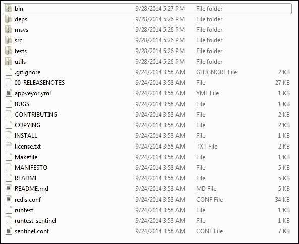
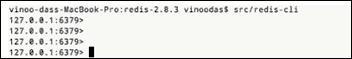
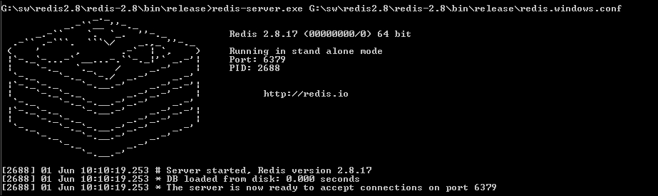
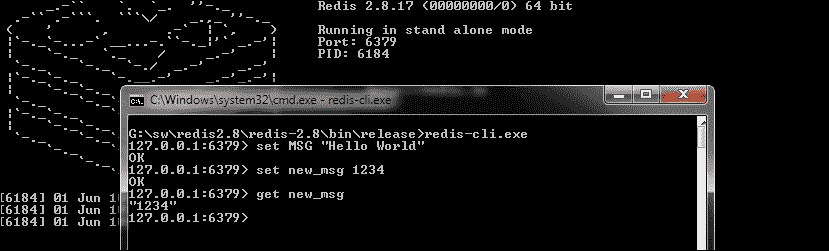
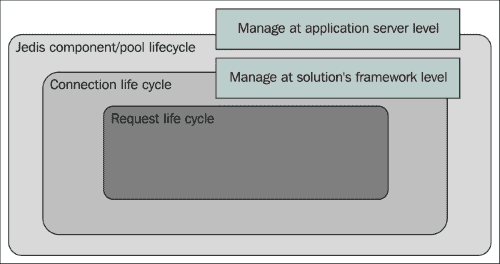
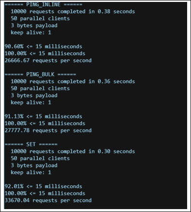

# 二、Redis 入门

Redis是 Salvatore Sanfilippo 于 2009 年推出的基于关键值的 NoSQL 数据存储。Redis 的名称来自**远程字典服务器**。Redis 是 C 语言中的高性能单线程服务器。

Redis 可以安装在所有兼容 POSIX 的 Unix 系统上。虽然没有生产级的 Windows 系统版本，但出于开发目的，它仍然可以安装在 Windows 环境中。在本章中，我们将在 Windows 和 Mac OS 环境中安装 Redis，用 Java 编写程序，并使用发行版附带的内置客户端。

# 在 Windows 上安装 Redis

微软开放技术集团已经移植了 Redis，并为 win32/win64 机器维护它。在 Windows 上安装 Redis 有两种方式可以开始安装，如下所示：

*   使用预构建的二进制文件
*   获取代码并在 Microsoft 环境中编译

对于不耐烦的人来说，下载 Redis2.8 的二进制文件是一个更容易的选择。第一件事首先，我们需要做以下事情才能开始：

1.  前往至[https://github.com/MSOpenTech/redis](https://github.com/MSOpenTech/redis) 并在**桌面克隆**按钮下下载 ZIP 文件。对于本书，我们将下载 Redis 的最新版本，即`redis-2.8.zip`文件。
2.  右键单击链接并将其保存在 Windows 计算机上的适当位置。我已将其保存在`F:\sw2\redis\redis-2.8.zip`。
3.  Right-click and unzip the compressed file to a suitable folder. I have named the folder as `redis-2.8`, and the folder structure after unzipping looks similar to what is shown in the following screenshot:

    

    解压缩压缩文件后的文件夹结构

4.  Get inside the `bin` folder. You will find the `release` folder; when you click on it, you will have a list of the files inside this folder, as shown in the following screenshot:

    

    bin/release 文件夹中的文件夹结构

5.  Open Command Prompt and run `redis-server.exe`. Provide the `redis-server.exe --maxheap 1024mb` heap size and you should see a console window popping up, similar to the following screenshot. In the case of Windows 7, the user might be asked to trust the software to proceed further.

    

    Redis 服务器的默认启动

6.  注意命令提示符上显示的最后一行：**服务器现在准备接受端口 6379**上的连接。
7.  Now, let's start a prebuilt client, which is shipped with the distribution, and connect to the server. The client that we will execute is a command-line interpreter, and when we click on it, the client program will be launched:

    

    Redis 客户端在 Redis 服务器运行时启动

8.  Your simple installation is complete (clustered setup and other management topics will be taken up in later chapters).

    ### 提示

    **下载示例代码**

    您可以从您的账户[下载示例代码文件 http://www.packtpub.com](http://www.packtpub.com) 对于您购买的所有 Packt 出版书籍。如果您在其他地方购买了本书，您可以访问[http://www.packtpub.com/support](http://www.packtpub.com/support) 并注册，将文件直接通过电子邮件发送给您。

# 在 Mac OS 上安装 Redis

在 Mac OS 上安装 Redis 非常简单。按照这些步骤你就可以开始了：

1.  从互联网下载软件包。为此，您可以使用以下命令：`wget http://download.redis.io/releases/redis-2.8.3.tar.gz`
2.  解压压缩的`tar xzf redis-2.8.3.tar.gz`文件。
3.  这将创建一个文件夹；通过发出`cd redis-2.8.3`命令进入文件夹。
4.  Compile the file by issuing the `make` command. This will compile the binaries and create a folder structure, as shown in the following screenshot:

    

    Mac 发行版的文件夹结构

5.  Type the `src/redis-server` command; this will start the server, as shown in the following screenshot:

    

    在 Apple 环境中启动 Redis 服务器

6.  Your Redis server is running and it is ready to accept the requests in port 6379\. Open another terminal and go the same folder form where you installed Redis. Type the command `src/redis-client`; this will start the client shell, as shown in the following screenshot:

    

    Redis 客户端是在 Apple 环境下启动的

7.  您的客户机已经准备好，您也已经为 Hello World 程序做好了准备，但是在继续之前，最好对名为`redis.conf`的配置文件有更多的了解。

## redis.conf 简介

Redis 随附和`redis.windows.conf`文件，该文件位于解压发行版的 ZIP/tar 文件时创建的父文件夹中。服务器启动时所需的任何自定义都可以通过此配置文件完成。如果需要包含`redis.conf`文件，则在服务器启动时提供该文件的路径作为参数。

当您在启动时提供配置文件时，命令提示上将显示以下消息：



在启动过程中使用配置路径启动 Redis 服务器

如前所述，Redis 是一种基于 Unix 的软件，移植到 Windows 环境中。很多配置参数都是针对 Unix 环境的；尽管如此，在迁移到基于 Unix 的环境时，了解对您有益的参数始终是一件好事。这些参数解释如下：

*   **端口 6379**：此数字表示服务器将侦听来自端口 6379 的消息。可以更改此端口号以适应项目设置，服务器将侦听该端口上的消息。这将需要重新启动服务器。
*   **#bind 127.0.0.1**：这是您希望服务器绑定到的 IP 地址。默认情况下，此参数被注释，这意味着服务器将侦听所有接口的消息。
*   **超时 0**：表示当客户端处于空闲状态时服务器不会关闭连接。
*   **tcp keepalive 0**：这是对服务器的命令，用于保持与客户端的连接打开。您可以设置为`SO_KEEPALIVE`，这将指示服务器向客户端发送`ACK`消息。
*   **日志级别通知**：这是您希望服务器具有的日志级别。您可以拥有的日志级别包括调试、详细、通知和警告。
*   **日志文件 stdout**：这是您要向 Windows 中的命令行或基于 Unix 的系统中的终端发送日志消息的通道。
*   **系统日志启用否**：如果更改为*是*，则会将消息发送到系统日志。
*   **目录**：应该设置为用户想要运行 Redis 服务器的工作目录。这反过来会告诉 Redis 服务器创建文件，例如适当的服务器文件。

其余的配置参数可以作为高级参数处理，当需要时，我们将在后续章节中使用其中的大部分参数。

# Redis 的 Hello World

这一部分将使程序员最为兴奋。让我们把手弄脏，输入一些代码。但是，在此之前，我们必须了解 Redis 在客户机-服务器模型上工作，并使用 Redis 协议与服务器通信。为了让客户端连接到服务器，客户端必须知道服务器的位置。在本节中，我将展示使用 redis cli 和 Java 客户端的示例。

## 使用 redis cli 的 Hello World

启动 Redis 客户端命令提示符（确保服务器正在运行）。输入以下命令，如下图截图所示，查看结果：


尝试使用 Redis 客户端执行简单的 Set 和 Get 命令

我们编写的命令有三个部分。其解释如下：

*   `Set`：此命令用于在 Redis 服务器中设置一个值
*   `MSG`：这是将消息存储在 Redis 服务器中的密钥
*   `Hello World`：这是存储在服务器中的`MSG`键的值

因此，这清除了我们在使用 Redis 时必须记住的模式。记住，Redis 是 NoSQL 数据存储的一个关键值。其语法为`COMMAND <space> KEY <space> VALUE`。

继续`Hello world`计划，我们将做更多的事情。我们输入`set MSG Learning Redis`会得到一条错误消息，当我们输入 set MSG“Hello World”时，服务器将返回的值是`OK`：


用新值覆盖密钥

旧值被给定键的新值覆盖。让我们在这个示例中添加另一个维度，即在已经打开的现有客户机命令提示符中打开另一个客户机。在第二个命令提示符中，我们键入命令并按`get MSG`键。它将返回的值再次是`"Hello World"`。这显示在以下屏幕截图中：


在一个客户端中写入，在另一个客户端中读取

在这一点上，人们会想，如果我们把一个数字写成一个值，也许是为了存储一些时间戳，而不是一个字符串，会发生什么。

让我们将新命令的键值设置为`set new_msg 1234`，当我们编写命令键以检索值时，将得到结果`"1234"`。请注意值周围的双引号；这告诉我们有关 Redis 的更多信息以及它存储数据的方式，也就是说，Redis 中存储的每个值都是字符串类型：



以字符串形式获取整数值

redis cli 工具可以方便地调试解决方案并执行命令检查系统和解决方案。

下一个需要回答的问题是如何以编程方式访问 Redis。

## 使用 Java 的 Hello World

在上一节中，您学习了如何在中使用`redis-cli.exe`应用程序以连接到 Redis 服务器。在本节中，我们将介绍一个 Java 客户端 API 来连接到 Redis 服务器并发出一些命令。实际上，要在解决方案中使用 Redis，它需要一个 API 来连接到服务器。API 还需要一些其他属性，而不仅仅是连接到服务器、传递命令和命令参数并返回结果，但我们将在后面的章节中介绍这一点。

选择用于演示本书中示例的 Java 客户端 API 是 Jedis。

在 Java 中运行`"Hello World"`示例有三个步骤。下文各节将对此进行解释。

### 安置绝地并创造环境

**绝地**是用于 Redis 的*Apache License 2.0*Java 客户端。该客户机将用于本书中演示的样本。因此，对于这个客户来说，最重要的是你需要确保你有一个开发环境。对于本书，我们选择 Eclipse作为开发环境（[http://www.eclipse.org/downloads/](http://www.eclipse.org/downloads/) 。如果您没有 Eclipse，您可以获取一个副本并安装它（它是免费的，并且是经过许可的）。本书中的示例将同样适用于其他集成开发环境。现在，执行以下步骤：

1.  Open Eclipse and create a project called `learning redis`, as shown in the following screenshot:

    

    在 Eclipse 中创建项目

2.  If you are using Maven, then add the following dependencies for Jedis:

    

    绝地武士的马文属地

如果您使用的是任何其他构建工具，请按照说明相应地添加绝地依赖项。

### 编写程序

以下Java 程序是用 Redis 作为数据存储编写的：

```java
 package org.learningredis.chapter.two;

import redis.clients.jedis.*;

public class HelloWorld {
  private JedisPool pool = new JedisPool(new JedisPoolConfig(), "localhost");

  private void test() {
    try 
        { 
            Jedis jedis = pool.getResource(); 
            jedis.set("MSG", "Hello World"); 
            String result = jedis.get("MSG"); 
            System.out.println(" MSG : " + result); 
            pool.returnResource(jedis); 

        } 
        catch (Exception e) 
        { 
            System.err.println(e.toString()); 
        }finally{
             pool.destroy(); 
        }

  } 

    public static void main(String args[]) 
    { 
        HelloWorld helloWorld = new HelloWorld();
        helloWorld.test();
    }

}
```

确保您的 Redis 服务器已启动并正在运行。在此示例中，此处使用的端口是默认端口 6379。

让我们一步一步地了解我们在计划中所做的工作：

1.  我们正在建立一个连接池来连接 Redis 服务器。池配置为服务器将绑定到的默认 IP 地址。
2.  我们从池中获取一个资源（包装连接的客户端存根）。
3.  我们在其中设置键值。这将推送要插入 Redis 数据存储的值。
4.  我们根据键请求/获取值。在这种情况下，上一步中针对键插入的值。
5.  我们将资源返回到池中以供重用，并关闭池。

### 正在关闭服务器

与任何服务器一样，优雅地关闭服务器非常重要。在关闭任何 Redis 服务器之前，需要记住以下几点，如下所述：

1.  关闭所有客户端连接。对于我们的 Java 程序，我们通过写入`"pool.destoy();"`来指示客户端关闭所有连接。
2.  我们需要做的下一件事是转到客户机提示符并命令关闭服务器。
3.  如果您打算将 Redis 用作缓存服务器，则不需要保存它所保存的数据。在这种情况下，只需键入`shutdown nosave`。这将清除内存中的所有数据并将其释放。
4.  如果要保存数据以便以后使用，则必须传递`shutdown save`命令。即使没有配置保存点，这也会将数据保存在`RDB`文件中，我们将在后面的章节中介绍。

下图从资源生命周期的角度显示了示例中发生的情况：



管理绝地武士客户端的资源

在生命周期中，我们有三个必须考虑的资源。其解释如下：

*   **绝地连接池**：这是系统/应用程序启动时应创建的池。这将为池分配资源。应用服务器生命周期应该管理池的生命周期。
*   **连接**：在绝地武士中，创建的客户端存根包装了连接并充当 Redis 的客户端。在前面列出的程序中，客户端存根被引用为*Jedis*，该存根在`pool.getResource()`语句中获得。
*   **请求生命周期**：这里是执行命令的地方。因此，这里基本上发生的是，使用 Redis 协议，命令和负载被发送到服务器。有效负载由键（如果是“getter”）或键和值（如果是“setter”）组成。使用服务器的肯定确认来管理生命周期。如果失败，它可以是成功，也可以是例外。在某种程度上，我们不需要对该语句进行明确的生命周期管理。

我们如何管理绝地武士之间的联系，如果我们不管理他们会发生什么？

问题*的答案很简单，如果我们不管理它*会发生什么。池将耗尽连接，客户端应用程序将受到影响。我们在 JDBC 等领域看到了与连接相关的问题，当客户端没有连接到服务器时，应用程序会受到影响。始终是服务器为连接保留内存，关闭连接表示服务器释放内存。

对于问题*我们如何管理绝地*中的连接，答案更有趣，需要一些代码更改。我们将以前面的代码示例为例，对其进行更改，处理连接资源管理。在下面的例子中，我添加了一个包装器，但是在您的应用程序中，您可以使用更多的奇特配方来解决上面提到的问题。也就是说，您可以使用 Spring 注入连接或使用`cglib`动态创建代理，代理将在命令之前设置连接，在命令之后返回连接。

以下代码用于新的 Hello World 程序，该程序现在称为`HelloWorld2`：

```java
package org.learningredis.chapter.two;

public class Helloworld2  {
  JedisWrapper jedisWrapper = null;
  public Helloworld2() {
    jedisWrapper = new JedisWrapper();
  }

  private void test() {
    jedisWrapper.set("MSG", "Hello world 2 ");

    String result = jedisWrapper.get("MSG");
    System.out.println("MSG : " + result);
  }

  public static void main(String[] args) {
    Helloworld2 helloworld2 = new Helloworld2();
    helloworld2.test();
  }
}
```

以下是处理连接的包装器代码：

```java
package org.learningredis.chapter.two;

import redis.clients.jedis.Jedis;
import redis.clients.jedis.JedisPool;

import redis.clients.jedis.JedisPoolConfig;

public class JedisWrapper {
  static JedisPool pool = new JedisPool(new JedisPoolConfig(), "localhost");");");");");

  public void set(String key,String value){
    Jedis jedis = pool.getResource(); 
        jedis.set(key, value); 
        pool.returnResource(jedis);
  }

  public String get(String key){
    Jedis jedis = pool.getResource(); 
        String result = jedis.get("MSG"); ");");");"); 
        pool.returnResource(jedis);
        return result;
  }
}
```

在这种情况下，两件事变得很清楚，如下所述：

*   我们不必管理连接/资源，因为这将由`wrapper`类负责
*   代码行的数量减少了，因为我们不必为资源管理重复代码

## 在 Redis 中加载测试 Hello World 程序

好的，您已经在Java 和命令行中看到了一个示例的`Hello world`程序。但在`Hello World`程序中添加负载测试维度总是好的。Redis 附带了一个名为`redis-benchmark`的工具，可以在发布文件夹中找到。

以下命令将对 Redis 服务器进行 100000 次调用：


helloworld 的负载测试

结果是计算机每秒处理的请求总数。此工具对于负载测试目标环境非常方便。这是我在 Windows 计算机上执行时得到的结果的快照，这将根据您的计算机和操作系统的配置而有所不同：



执行负载测试的工具

这里发生的是`redis-benchmark`打开了到 Redis 服务器的 50 个并行连接，并触发了 10000 个请求。这些请求包含 Redis 命令和 3 字节的有效负载。将近似结果打印出来进行分析；在我的例子中，10000 个`Set`命令总共花费了 0.30 秒，即每秒满足 33670 个请求。

# 总结

Redis 是一个简单的面向键值的 NoSQL，可以用作缓存服务器和持久化服务器。本章展示了在多个环境（包括 Windows）中安装 Redis 是多么简单（Redis 也可用于云环境，如 Amazon EC2）。Windows 安装应仅用于开发和采样目的。

Redis 有一组有趣的数据结构，有时被称为数据结构服务器。下一章将详细介绍数据结构。