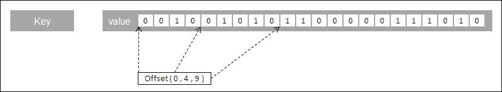
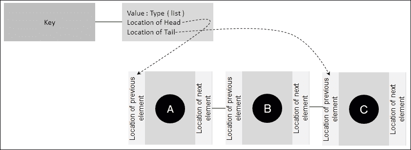
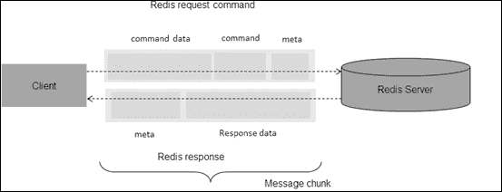

# 第三章 Redis 中的数据结构和通信协议

上一章介绍了 Redis 的安装和运行一些简单的程序。因为 Redis 是一个数据存储，所以通过提供处理和存储数据的数据结构来理解 Redis 如何处理数据是很重要的。同样重要的是 Redis 在与客户机（如通信协议）通信时如何处理数据。

# 数据结构

数据结构，顾名思义，是指存储数据的结构。在计算世界中，数据的组织方式总是对存储数据的程序有意义的。数据结构可以是简单的字符顺序排列，也可以是复杂的映射，其中键不是顺序排列的，而是基于算法。数据结构在本质上通常是复合的，这意味着一个数据结构可以容纳另一个数据结构，即容纳另一个映射的映射。

设计数据结构的关键影响因素是数据结构的性能和内存管理。数据结构的一些常见示例有列表、集合、映射、图形和树、元组等。作为程序员，我们在程序中多次使用数据结构。在面向对象的世界中，简单的*对象*也是一种数据结构，因为它包含数据和访问这些数据的逻辑。每个数据结构都由一个算法控制，该算法决定了它的效率和功能能力。因此，如果可以对算法进行分类，则可以清楚地了解数据结构的性能；当数据被泵入数据结构或读取数据或从数据结构中删除数据时。

大 O 表示法是一种在数据增长时对算法（数据结构）的性能进行分类的方法。从 Redis 的角度来看，我们将根据以下符号对数据结构进行分类：

*   `O (1)`：数据结构上的命令所花费的时间是恒定的，与它包含的数据量无关。
*   `O (N)`：数据结构上的命令所花费的时间根据其包含的数据量线性缩放，其中`N`是元素数。
*   `O (log (N))`：数据结构上的命令所花费的时间本质上是对数的，其中`N`是元素数。显示这一点的算法非常高效，可用于在排序数组中查找元素。这可以解释为随时间相当恒定。
*   `O (log (N) + M)`：命令所花费的时间取决于对数值，其中`M`是已排序集合中的元素总数，`N`是搜索必须查找的范围。这可以解释为相当依赖于`M`的值。随着`M,`值的增加，搜索所需的时间将增加。
*   `O (M log (M))`：该命令所花费的时间本质上是对数线性的。

# Redis 中的数据类型

Redis 是一种数据结构服务器，它有许多内置数据类型，这使得它与生态系统中的其他关键值 NoSQL 数据存储有点不同。与其他 NoSQL 不同，Redis 为用户提供了许多内置数据类型，这些数据类型提供了一种语义方式来排列数据。这样想吧,；在设计解决方案时，我们需要在某种程度上塑造数据层的域对象。在决定域对象之后，我们需要为数据设计结构，这些数据将保存在数据存储中，我们需要一些预定义的数据结构。这样做的好处是，它节省了程序员从外部创建和管理这些数据的时间和精力。例如，假设在我们的程序中需要一个类似集合的数据结构。使用 Java，我们可以很容易地使用内置的数据结构，如 Set。如果我们要把这个数据作为键值，我们必须把整个集合放在一个键上。现在，如果我们要对这个集合进行排序，通常的方法是提取数据并以编程方式对数据进行排序，这可能会很麻烦。如果数据存储本身提供了一种在内部对数据进行排序的机制，那就好了。Redis 内置了以下数据类型用于存储数据：

*   一串
*   散列
*   列表
*   设置
*   排序集

下图表示可以映射到键的数据类型。在 Redis 中，键本身是字符串类型，它可以存储的值可以是任意一个值，如图所示：


键及其可以存储的值的表示形式

## 字符串数据类型

**字符串**类型是Redis 中的基础数据类型。虽然在术语上有误导性，但 Redis 中的字符串可以被视为一个字节数组，其中可以包含字符串、整数、图像、文件和可序列化对象。这些字节数组本质上是二进制安全的，它们可以容纳的最大大小为 512 MB。在 Redis 中，字符串被称为**简单动态字符串**（**SDS**），在 C 语言中被实现为`Char`数组，还有一些其他属性，如`len`和`free`。这些字符串也是二进制安全的。SDS 头文件在`sds.h`文件中定义如下：

```java
struct sdshdr {
            long len;
           long free;
              char buf[];
          };
```

因此，Redis 中的任何字符串、整数、位图、图像文件等都存储在`buf[]`（`Char`数组）中，`len`存储缓冲数组的长度，`free`存储额外的字节以供存储。Redis 有一个内置机制来检测数组中存储的数据类型。有关这方面的更多信息，请参见[http://redis.io/topics/internals-sds](http://redis.io/topics/internals-sds) 。

Redis 中用于字符串的命令可分为以下几部分：

*   **Setters 和 getter 命令**：这些是命令，可用于在 Redis 中设置或获取值。有用于单个键值和多个键值的命令。对于单个 get 和 set，可以使用以下命令：
    *   `Get`键：此键获取键的值。此命令基于时间的性能为`O (1)`。
    *   `Set`键：该键针对一个键设置一个值。此命令基于时间的性能为`O (1)`。
    *   `SETNX`键：如果键不存在，此键将针对键设置一个值-不进行覆盖。此命令基于时间的性能为`O (1)`。
    *   `GETSET`键：此键获取旧值并设置新值。此命令基于时间的性能为`O (1)`。
    *   `MGET key1`键：该键获取所有键对应的值。此命令基于时间的性能为`O (N)`。
    *   `MSET`键：该键设置键的所有对应值。此命令基于时间的性能为`O (N)`，其中`N`是要设置的键数。
    *   `MSETNX`键：如果所有键都不存在，则设置键的所有对应值，即如果存在一个键，则不设置值。此命令基于时间的性能为`O (N)`，其中`N`是要设置的键数。
*   **数据清理命令**：这些是可用于管理值生命周期的命令。默认情况下，键的值没有到期时间。但是，如果您有一个用例，其中值需要有生命周期，则使用以下键：
    *   `SET PX/ EX`：删除值，密钥在到期时间后以毫秒为单位过期。此命令基于时间的性能为`O (1)`。
    *   `SETEX`：删除值，密钥在到期时间（秒）后过期。此命令基于时间的性能为`O (1)`。
*   **实用程序命令**：以下是这些命令中的一些：
    *   `APPEND`：此命令追加现有值，如果不存在则设置。此命令基于时间的性能为`O (1)`。
    *   `STRLEN`：此命令返回存储为字符串的值的长度。此命令基于时间的性能为`O (1).`
    *   `SETRANGE`：此命令覆盖给定偏移量处的字符串。此命令基于时间的性能为`O (1)`，前提是复制新字符串的长度不需要很长时间。
    *   `GETRANGE`：此命令从给定偏移量获取子字符串值。如果新子字符串的长度不太大，则此命令基于时间的性能为`O (1)`。

下面给出了一个示例程序来演示字符串命令的简单用法。自己执行程序并分析结果。

```java
package org.learningredis.chapter.three.datastruct;
import redis.clients.jedis.Jedis;
import redis.clients.jedis.JedisPool;
import redis.clients.jedis.JedisPoolConfig;
public class MyStringTest {
  private JedisPool pool = new JedisPool(new JedisPoolConfig(), "localhost");
  Jedis jedis = null;

  public Jedis getResource() {
    jedis = pool.getResource();
    return jedis;
  }
  public void setResource(Jedis jedis){
    pool.returnResource(jedis);
  }
  public static void main(String[] args) throws InterruptedException {
    MyStringTest myStringTest  = new MyStringTest();
    myStringTest.test();

  }
  private void test() throws InterruptedException {
    Jedis jedis = this.getResource();
    String commonkey = "mykey";
    jedis.set(commonkey, "Hello World");
    System.out.println("1) "+jedis.get("mykey"));
    jedis.append(commonkey, " and this is a bright sunny day ");
    System.out.println("2) "+jedis.get("mykey"));
    String substring=jedis.getrange(commonkey, 0 , 5);
    System.out.println("3) "+"substring value = "+substring);
    String commonkey1 = "mykey1";
    jedis.set(commonkey1, "Let's learn redis");
    for(String value : jedis.mget(commonkey,commonkey1)){
      System.out.println("4) "+" - "+ value);
    }
    jedis.mset("mykey2","let's start with string","mykey3","then we will learn other data types");
    for(String value : jedis.mget(commonkey,commonkey1,"mykey2","mykey3")){
      System.out.println("5) "+"   -- "+ value);
    }
    jedis.msetnx("mykey4","next in line is hashmaps");
    System.out.println("6) "+jedis.get("mykey4"));
    jedis.msetnx("mykey4","next in line is sorted sets");
    System.out.println("7) "+jedis.get("mykey4"));
    jedis.psetex("mykey5", 1000, "this message will self destruct in 1000 milliseconds");
    System.out.println("8) "+jedis.get("mykey5"));
    Thread.currentThread().sleep(1200);
    System.out.println("8) "+jedis.get("mykey5"));
    Long length=jedis.strlen(commonkey);
    System.out.println("9) "+" the length of the string 'mykey' is " + length);
    this.setResource(jedis);
  }
}
```

Redis 中整数和浮点的命令可分为以下几部分：

*   **Setters 和 getter 命令**：命令集与字符串中提到的相同。
*   **数据清理命令**：命令集与前面提到的字符串相同。
*   **实用程序命令**：此处的命令将帮助操作整数值和浮点值。对于整数，此操作仅限于 64 位有符号整数：
    *   **追加**：此将现有整数与新整数连接。此命令基于时间的性能为`O (1)`。
    *   **递减**：这将将该值递减 1。此命令基于时间的性能为`O (1)`。
    *   **递减**：此将按给定值递减该值。此命令基于时间的性能为`O (1)`。
    *   **增量**：此将使值增加 1。此命令基于时间的性能为`O (1)`。
    *   **增量**：这将按给定值递增该值。此命令基于时间的性能为`O (1)`。
    *   **INCRBYFLOAT**：这将按给定的浮点值递增该值。此命令基于时间的性能为`O (1)`。

除了常规数字、字符串等之外，字符串数据类型还可以存储一种特殊类型的数据结构，称为**位集**或**位图。**让我们进一步了解它们，看看它们的用法。

## 位集或位图数据类型

这些是特殊的节省空间的类型的数据结构，用于存储特殊类型的信息。位图专门用于实时分析工作。虽然位图只能以二进制（1 或 0）存储值，但它们占用的空间较少，获取值的性能为`O (1)`，这使得它们对于实时分析非常有吸引力：



位图的表示

密钥可以是任何基于日期的密钥。假设这里的键代表 2014 年 12 月 12 日购买一本书的用户的位图。

例如，`12/12/2014-user_purchased_book_learning_redis`。这里的偏移量表示与用户关联的唯一整数ID。这里我们有与编号 0、1、2…n 等相关联的用户。每当用户进行购买时，我们都会找到该用户对应的唯一 ID，并在该偏移位置将值更改为`1`。

借助此空间优化、高性能位图，可以回答以下问题：

*   How many purchases were made on December 12, 2014?

    回答：数一数位图中的数字 1，即购买的用户数，比如说 9。

*   Did user associated with ID (offset number) 15 make a purchase?

    答：偏移量 15 处的值为 0，因此用户没有购买。

这些位图的集合可以联合使用，以找到更复杂分析的答案。例如，让我们将另一个位图添加到现有示例中，并将其命名为`12/12/2014-user_browsed_book_learning_redis`。使用这两个位图，我们可以找到以下问题的答案：

*   有多少用户浏览了产品（*学习 Redis*页面）？
*   有多少用户购买了该产品（*学习 Redis*页面）？
*   有多少浏览产品页面的用户购买了这本书？
*   有多少没有浏览产品页面的用户购买了这本书？

### 用例场景

Redis 字符串可用于存储对象 ID。例如，会话 ID、XML、JSON 等配置值。Redis 字符串（存储整数）可以用作原子计数器。Redis 字符串（存储位图）可以用作实时分析引擎。

## 散列数据类型

散列是 Redis 版本的映射在 Java 中的作用。Redis 中的散列用于存储属性及其值相对于键的映射。为了更好地理解它，假设我们有一个名为*学习 Redis*的对象；此对象将具有许多属性，例如作者、出版商、ISBN 编号等。为了在存储系统中表示这一点，我们可以根据密钥*Learning Redis*将信息存储为 XML、JSON。如果我们需要某些特定的值，例如，author 存储在*Learning Redis*上，则必须检索整个数据集，并过滤掉所需的值。这样做效率不高，因为大量数据需要通过网络传输，客户端的处理会增加。Redis 提供了可用于存储此类数据的哈希数据结构。下图给出了上述示例的图示：


散列数据类型

散列的存储方式是占用更少的空间，Redis 中的每个散列最多可以存储 2<sup>32</sup>——一个字段值对，即超过 40 亿。

散列中的命令以`H`开头，Redis 中用于散列的命令可分为以下几部分：

*   **Setters 和 getter 命令**：下面的是用于此操作的命令：
    *   `HGET`：此命令获取键的字段值。此命令基于时间的性能为`O (1)`。
    *   `HGETALL`：此命令获取一个键的所有值和字段。此命令基于时间的性能为`O (1)`。
    *   `HSET`：此命令设置键的字段值。此命令基于时间的性能为`O (1)`。
    *   `HMGET`：此命令获取键的字段值。此命令基于时间的性能为`O (N),`，其中`N`为字段数。但是，如果`N`很小，它就是`O (1)`。
    *   `HMSET`：此命令为一个键的各个字段设置多个值。此命令基于时间的性能为`O (N),`，其中`N`为字段数。但是，如果`N`很小，它就是`O (1)`。
    *   `HVALS`：此命令获取密钥哈希中的所有值。此命令基于时间的性能为`O (N),`，其中`N`为字段数。但是，如果 N 很小，则为`O (1)`。
    *   `HSETNX`：此命令针对键的字段设置值，前提是该字段不存在。此命令基于时间的性能为`O (1)`。
    *   `HKEYS`：此命令获取密钥哈希中的所有字段。此命令基于时间的性能为`O (1)`。
*   **数据清理命令**：以下为此命令：
    *   `HDEL`：此命令删除键的字段。此命令基于时间的性能为`O (N),`，其中`N`为字段数。但是，如果`N`很小，它就是`O (1)`。
*   **实用命令**：下面是用于此的命令：
    *   `HEXISTS`：此命令检查是否存在密钥字段。此命令基于时间的性能为`O (1)`。
    *   `HINCRBY`：此命令增加一个键的字段值（前提是该值为整数）。此命令基于时间的性能为`O (1)`。
    *   `HINCRBYFLOAT`：此命令增加键的字段值（前提是该值为浮点值）。此命令基于时间的性能为`O (1)`。
    *   `HLEN`：此命令获取键的字段数。此命令基于时间的性能为`O (1)`。

下面给出了一个示例程序来演示哈希命令的简单用法。自己执行程序并分析结果。

```java
  package org.learningredis.chapter.three.datastruct;
import java.util.HashMap;
import java.util.Map;
import redis.clients.jedis.Jedis;
import redis.clients.jedis.JedisPool;
import redis.clients.jedis.JedisPoolConfig;
public class MyHashesTest {
  private JedisPool pool = new JedisPool(new JedisPoolConfig(), "localhost");
  Jedis jedis = null;

  public Jedis getResource() {
    jedis = pool.getResource();
    return jedis;
  }
  public void setResource(Jedis jedis){
    pool.returnResource(jedis);
  }
  public static void main(String[] args) 
throws InterruptedException  {
    MyHashesTest myHashesTest  = new MyHashesTest();
    myHashesTest.test();    
  }
  private void test() {
    Jedis jedis = this.getResource();
    String commonkey = "learning redis";
    jedis.hset(commonkey, "publisher", "Packt Publisher");
    jedis.hset(commonkey, "author", "Vinoo Das");
    System.out.println(jedis.hgetAll(commonkey));
Map<String,String> attributes = new HashMap<String,String>();
    attributes.put("ISBN", "XX-XX-XX-XX");
    attributes.put("tags", "Redis,NoSQL");
    attributes.put("pages", "250");
    attributes.put("weight", "200.56");
    jedis.hmset(commonkey, attributes);
    System.out.println(jedis.hgetAll(commonkey));
    System.out.println(jedis.hget(commonkey,"publisher"));
    System.out.println(jedis.hmget(commonkey,"publisher","author"));
    System.out.println(jedis.hvals(commonkey));
    System.out.println(jedis.hget(commonkey,"publisher"));
    System.out.println(jedis.hkeys(commonkey));
    System.out.println(jedis.hexists(commonkey, "cost"));
    System.out.println(jedis.hlen(commonkey));
    System.out.println(jedis.hincrBy(commonkey,"pages",10));
    System.out.println(jedis.hincrByFloat(commonkey,"weight",1.1) + " gms");
    System.out.println(jedis.hdel(commonkey,"weight-in-gms"));
    System.out.println(jedis.hgetAll(commonkey));
    this.setResource(jedis);
  }
}
```

### 用例场景

散列提供了一个语义接口，用于在 Redis 服务器中存储简单和复杂的数据对象。例如，用户配置文件、产品目录等。

## 列表数据类型

Redis 列表类似于 Java 中的链表。此 Redis 列表可以在头部或尾部添加元素。这样做的性能是恒定的，或者可以表示为`O (1)`。这意味着，假设您有一个包含 100 个元素的列表，将元素添加到列表中所花费的时间等于将元素添加到包含 10000 个元素的列表中所花费的时间。但另一方面，访问 Redis 列表中的元素会导致扫描整个列表，这意味着如果列表中的项目数量较多，性能会下降。

Redis 列表实现为链表而不是数组列表的优势在于，作为数据类型的 Redis 列表被设计为具有比读取更快的写入速度（所有数据存储都显示了这一特点）。



列表中列出了数据类型

Redis 中用于列表的命令通常以`L`开头。这也可以解释为，所有命令将从*左侧或列表*的开头执行，如果命令从*右侧或列表*的结尾执行，则以 R 开头。这些命令可分为以下几部分：

*   **Setters 和 getter 命令**：以下是此类命令的示例：
    *   `LPUSH`：此命令将值从列表左侧预先添加到列表中。此命令基于时间的性能为`O (1)`。
    *   `RPUSH`：此命令将值从列表右侧预先添加到列表中。此命令基于时间的性能为`O (1)`。
    *   `LPUSHX`：如果键存在，此命令将值从列表左侧预先添加到列表中。此命令基于时间的性能为`O (1)`。
    *   `RPUSHX`：如果键存在，此命令将值从列表右侧预先添加到列表中。此命令基于时间的性能为`O (1)`。
    *   `LINSERT`：此命令在*枢轴*位置后的列表中插入一个值。此枢轴位置是从左侧计算的。此命令基于时间的性能为`O (N)`。
    *   `LSET`：此命令根据所述索引设置列表中元素的值。此命令基于时间的性能为`O (N)`。
    *   `LRANGE`：此命令根据开始索引和结束索引获取元素的子列表。此命令的基于时间的性能为*O（S+N）*。这里*S*是偏移量的开始，*N*是我们在列表中要求的元素数。这意味着，如果偏移距离头部越远且范围的长度越长，则查找元素所需的时间将增加。
*   **数据清理命令**：以下是此类命令的示例：
    *   `LTRIM`：此命令删除指定范围之外的元素。此命令基于时间的性能为`O (N)`。这里`N`是列表的长度。
    *   `RPOP`：此命令删除最后一个元素。此命令基于时间的性能为`O (1)`。
    *   `LREM`：此命令删除指定索引点处的元素。此命令基于时间的性能为`O (N)`。这里`N`是列表的长度。
    *   `LPOP`：此命令删除列表的第一个元素。此命令基于时间的性能为`O (1)`。
*   **实用程序命令**：以下是属于此类型的命令：
    *   `LINDEX`：此命令根据上述索引从列表中获取元素。此命令基于时间的性能为`O (N)`。此处`N`是它必须遍历的元素数，以达到所需索引处的元素。
    *   `LLEN`：此命令获取列表的长度。该命令基于时间的性能为`O (1)`。
*   **高级命令**：以下命令属于此类型：
    *   `BLPOP`：此命令按照所述列表的顺序给出索引中的元素，该元素为非空，或者如果头部中没有值，则阻止调用，直到至少设置了一个值或发生超时。`BLPOP`中的字母`B`提示此调用被阻塞。此命令基于时间的性能为`O (1)`。
    *   `BRPOP`：这个命令给出了 trail 中的元素，该元素在所提到的列表序列中是非空的，或者如果 head 中没有值，则阻止调用，直到至少设置了一个值或出现超时。此命令基于时间的性能为`O (1)`。
    *   `RPOPLPUSH`：此命令对两个列表进行操作。比如说源列表和目标列表，它将获取源列表上的最后一个元素，并将其推送到目标列表的第一个元素。此命令基于时间的性能为`O (1)`。
    *   `BRPOPLPUSH`：此命令是`RPOPLPUSH`命令的*阻塞*变体。在这种情况下，如果源列表为空，则 Redis 将阻止该操作，直到将值推入列表或达到超时。这些命令可用于创建队列。此命令基于时间的性能为`O (1)`。

下面给出了一个示例程序来演示列表命令的简单用法。执行程序并自己分析结果：

```java
package org.learningredis.chapter.three.datastruct;
import redis.clients.jedis.Jedis;
import redis.clients.jedis.JedisPool;
import redis.clients.jedis.JedisPoolConfig;
import redis.clients.jedis.BinaryClient.LIST_POSITION;
public class MyListTest {
  private JedisPool pool = new JedisPool(new JedisPoolConfig(), "localhost");
  Jedis jedis = null;
  public Jedis getResource() {
    jedis = pool.getResource();
    return jedis;
  }
  public void setResource(Jedis jedis){
    pool.returnResource(jedis);
  }
  public static void main(String[] args) throws InterruptedException {
    MyListTest myListTest  = new MyListTest();
    myListTest.test();
  }
  private void test() {
    Jedis jedis = this.getResource();
    System.out.println(jedis.del("mykey4list"));
    String commonkey="mykey4list";
    String commonkey1="mykey4list1";
    for(int index=0;index<3;index++){
      jedis.lpush(commonkey, "Message - " + index);
    }
    System.out.println(jedis.lrange(commonkey, 0, -1));
    for(int index=3;index<6;index++){
      jedis.rpush(commonkey, "Message - " + index);
    }
    System.out.println(jedis.lrange(commonkey, 0, -1));
    System.out.println(jedis.lindex(commonkey, 0));
    System.out.println(jedis.linsert(commonkey,LIST_POSITION.AFTER,"Message - 5", "Message - 7"));
    System.out.println(jedis.lrange(commonkey, 0, -1));
    System.out.println(jedis.linsert(commonkey,LIST_POSITION.BEFORE,"Message - 7", "Message - 6"));
    System.out.println(jedis.lrange(commonkey, 0, -1));
    System.out.println(jedis.llen(commonkey));
    System.out.println(jedis.lpop(commonkey));
    System.out.println(jedis.lrange(commonkey, 0, -1));
    System.out.println(jedis.lpush(commonkey,"Message - 2","Message -1.9"));
    System.out.println(jedis.lrange(commonkey, 0, -1));
    System.out.println(jedis.lpushx(commonkey,"Message - 1.8"));
    System.out.println(jedis.lrange(commonkey, 0, -1));
    System.out.println(jedis.lrem(commonkey,0,"Message - 1.8"));
    System.out.println(jedis.lrange(commonkey, 0, -1));
    System.out.println(jedis.lrem(commonkey,-1,"Message - 7"));
    System.out.println(jedis.lrange(commonkey, 0, -1));
    System.out.println(jedis.lset(commonkey,7,"Message - 7"));
    System.out.println(jedis.lrange(commonkey, 0, -1));
    System.out.println(jedis.ltrim(commonkey,2,-4));
    System.out.println(jedis.lrange(commonkey, 0, -1));
    jedis.rpoplpush(commonkey, commonkey1);
    System.out.println(jedis.lrange(commonkey, 0, -1));
    System.out.println(jedis.lrange(commonkey1, 0, -1));
  }
}
```

### 用例场景

List 提供了一个语义接口，用于在 Redis 服务器中顺序存储数据，*写入*速度比*读取*性能更理想。例如，记录消息。

## 设置数据类型

Redis 集合是数据结构，是SDS 的无序集合。集合中的值是唯一的，不能有重复的值。就 Redis 集合的性能而言，一个有趣的方面是，它们显示添加、删除和检查元素存在性的恒定时间。一个集合中最多可以包含 2^32 个条目，即每个集合 40 亿个条目。这些设定值本质上是无序的。从表面上看，集合可能看起来像列表，但它们有不同的实现，这使它们成为解决集合论问题的完美候选。


设置数据类型

Redis 中用于集合的命令可分为以下几部分：

*   **Setters 和 getter 命令**：此类型包括以下命令：
    *   `SADD`：此命令向集合中添加一个或多个元素。此命令基于时间的性能为`O (N)`。这里`N`是需要添加的元素数。
*   **数据清理命令**：下面的是属于这一类的一些命令：
    *   `SPOP`：此命令从集合中移除并返回一个随机元素。此命令基于时间的性能为`O (1)`。
    *   `SREM`：此命令从集合中删除并返回指定的元素。此命令基于时间的性能为`O (N)`，此处`N`为要删除的元素数。
*   **实用命令**：以下是属于此类型的命令：
    *   `SCARD`：此命令获取集合中元素的数量。此命令基于时间的性能为`O (1)`。
    *   `SDIFF`：此命令从其他提到的集合中减去第一个集合中的元素后，获取第一个集合中的元素列表。此命令基于时间的性能为`O (N)`。这里`N`是所有集合中的元素数。
    *   `SDIFFSTORE`：此命令从其他提到的集合中减去第一个集合中的元素后，获取第一个集合中的元素列表。这一组被推入另一组。此命令基于时间的性能为`O (N)`。这里`N`是所有集合中的元素数。
    *   `SINTER`：此命令获取上述所有集合中的公共元素。此命令基于时间的性能为`O (N * M)`。这里，`N`是最小集合的基数，`M`是集合数。这里的基本情况是，Redis 将取最小的集合，并在该集合和其他集合之间查找公共元素。对于公共元素（如前一个过程），再次比较结果集，直到只剩下一个集具有所需的结果。
    *   `SINTERSTORE`：此命令的工作方式与命令`SINTER`相同，但此处结果存储在所述集合中。此命令基于时间的性能为`O (N * M)`。这里，`N`是最小集合的基数，`M`是集合数。
    *   `SISMEMBER`：此命令查找该值是否为集合的成员。此命令基于时间的性能为`O (1)`。
    *   `SMOVE`：此命令将成员从一个集合移动到另一个集合。此命令基于时间的性能为`O (1)`。
    *   `SRANDMEMBER`：此命令从集合中获取一个或多个随机成员。此命令基于时间的性能为`O (N)`。这里`N`是通过的成员数。
    *   `SUNION`：此命令添加多个集合。此命令基于时间的性能为`O (N)`。这里`N`是所有集合中的元素数。
    *   `SUNIONSTORE`：此命令添加多个集合，并将结果存储在一个集合中。此命令基于时间的性能为`O (N)`。这里`N`是所有集合中的元素数。

下面给出了一个示例程序来演示集合命令的简单用法。执行程序并自己分析结果：

```java
package org.learningredis.chapter.three.datastruct;
import redis.clients.jedis.Jedis;
import redis.clients.jedis.JedisPool;
import redis.clients.jedis.JedisPoolConfig;
public class MySetTest {
  private JedisPool pool = new JedisPool(new JedisPoolConfig(), "localhost");
  Jedis jedis = null;
  public Jedis getResource() {
    jedis = pool.getResource();
    return jedis;
  }
  public void setResource(Jedis jedis){
    pool.returnResource(jedis);
  }
  public static void main(String[] args) {
    MySetTest mySetTest = new MySetTest();
    mySetTest.test();
  }
  private void test() {
    Jedis jedis = this.getResource();
    jedis.sadd("follow:cricket", "vinoo.das@junk-mail.com","vinoo.das1@junk-mail.com","vinoo.das3@junk-mail.com");
    System.out.println(jedis.smembers("follow:cricket"));
    System.out.println(jedis.scard("follow:cricket"));
    jedis.sadd("follow:redis", "vinoo.das1@junk-mail.com","vinoo.das2@junk-mail.com");
    System.out.println(jedis.smembers("follow:redis"));
    System.out.println(jedis.scard("follow:redis"));
    // intersect the above sets to give name who is interested in cricket and redis
    System.out.println(jedis.sinter("Cricket:followers","follow:redis"));
    jedis.sinterstore("follow:redis+cricket","follow:cricket","follow:redis");
    System.out.println(jedis.smembers("follow:redis+cricket"));
    System.out.println(jedis.sismember("follow:redis+cricket", "vinoo.das@junk-mail.com"));
    System.out.println(jedis.sismember("follow:redis+cricket", "vinoo.das1@junk-mail.com"));
    jedis.smove("follow:cricket", "follow:redis", "vinoo.das3@junk-mail.com");
    System.out.println(jedis.smembers("follow:redis"));
    System.out.println(jedis.srandmember("follow:cricket"));
    System.out.println(jedis.spop("follow:cricket"));
    System.out.println(jedis.smembers("follow:cricket"));
    jedis.sadd("follow:cricket","wrong-data@junk-mail.com");
    System.out.println(jedis.smembers("follow:cricket"));
    jedis.srem("follow:cricket","wrong-data@junk-mail.com");
    System.out.println(jedis.smembers("follow:cricket"));
    System.out.println(jedis.sunion("follow:cricket","follow:redis"));
    jedis.sunionstore("follow:cricket-or-redis","follow:cricket","follow:redis");
    System.out.println(jedis.smembers("follow:cricket-or-redis"));
    System.out.println(jedis.sdiff("follow:cricket", "follow:redis"));
  }
}
```

### 用例场景

Sets 提供语义接口，将数据作为集合存储在 Redis server 中。此类数据的用例更多的是用于分析目的，例如有多少人浏览产品页面，有多少人最终购买了产品。

## 排序后的集合数据类型

Redis 排序集与Redis 集非常相似，因为它们不存储重复的值，但它们与 Redis 集的不同之处在于，这些值是根据分数或整数浮点值排序的。这些值是在设置集合中的值时提供的。这些排序集的性能与元素数的对数成正比。数据总是以排序的方式保存。下图以图解方式解释了这一概念：


排序集的概念

Redis 中用于排序集的命令可分为以下几部分：

*   **Setters 和 getter 命令**：以下是属于此类别的命令：
    *   `ZADD`：此命令将一个或多个成员添加或更新到已排序集。此命令基于时间的性能为`O (log (N))`。此处`N`是已排序集合中的元素数。
    *   `ZRANGE`：此命令通过排序集中元素的排名获取指定的范围。此命令基于时间的性能为*O（log（N）+M）*。这里`N`是元素数，`M`是返回的元素数。
    *   `ZRANGEBYSCORE`：此命令根据给定的分数从范围内的已排序集合中获取元素。默认集中的值本质上是递增的。此命令基于时间的性能为`O (log (N) +M)`。这里`N`是元素数，`M`是返回的元素数。
    *   `ZREVRANGEBYSCORE`：此命令从给定分数内的已排序集合中获取元素。此命令基于时间的性能为`O (log (N) +M)`。这里`N`是元素的数量，`M`是移除的元素数量。
    *   `ZREVRANK`：此命令返回成员在排序集中的排名。此命令基于时间的性能为`O (log (N))`。
    *   `ZREVRANGE`：此命令返回排序集中指定的元素范围。此命令基于时间的性能为`O (log (N) + M)`。
*   **数据清理命令**：以下是属于该类别的命令：
    *   `ZREM`：此命令删除排序集中的指定成员。此命令基于时间的性能为`O (M*log (N))`。这里，`M`是移除的元素数，`N`是排序集中的元素数。
    *   `ZREMRANGEBYRANK`：此命令删除给定索引内已排序集合中的成员。此命令基于时间的性能为`O (log (N) * M)`。这里`N`是元素的数量，`M`是移除的元素数量。
    *   `ZREMRANGEBYSCORE`：此命令删除给定分数内排序集中的成员。此命令基于时间的性能为`O (log (N) * M)`。此处`N`是元素的数量，`M`是移除的元素数量。
*   **实用程序命令**：以下是属于该类别的命令：
    *   `ZCARD`：此命令获取排序集中的成员数。此命令基于时间的性能为`O (1))`。
    *   `ZCOUNT`：此命令获取分数边界内已排序集合中的成员数。此命令基于时间的性能为`O (log (N) * M)`。这里`N`是元素的数量，`M`是结果。
    *   `ZINCRBY`：此命令增加排序集中某个元素的得分。此命令基于时间的性能为`O (log (N))`。此处`N`是已排序集合中的元素数。
    *   `ZINTERSTORE`：此命令计算指定键给定的排序集中的公共元素，并将结果存储在目标排序集中。此命令基于时间的性能为`O (N*K) + O (M*log (M))`。这里，`N`是最小的排序集，`K`是输入集的数量，`M`是结果排序集中的元素数量。
    *   `ZRANK`：此命令获取排序集中元素的索引。此命令基于时间的性能为`O (log (N))`。
    *   `ZSCORE`：此命令返回该成员的分数。此命令基于时间的性能为`O (1)`。
    *   `ZUNIONSTORE`：此命令计算给定排序集中键的并集，并将结果存储在结果排序集中。此命令基于时间的性能为`O (N) +O (M log (M))`。这里，`N`是输入排序集的大小之和，`M`是排序集中元素的个数。

下面给出了一个示例程序，用于演示排序集命令的简单用法。执行程序并自己分析结果：

```java
package org.learningredis.chapter.three.datastruct;
import redis.clients.jedis.Jedis;
import redis.clients.jedis.JedisPool;
import redis.clients.jedis.JedisPoolConfig;
public class MySortedSetTest {
  private JedisPool pool = new JedisPool(new JedisPoolConfig(), "localhost");
  Jedis jedis = null;
  public Jedis getResource() {
    jedis = pool.getResource();
    return jedis;
  }
  public void setResource(Jedis jedis){
    pool.returnResource(jedis);
  }
  public static void main(String[] args) {
    MySortedSetTest mySortedSetTest = new MySortedSetTest();
    mySortedSetTest.test();
  }
  private void test() {
    Jedis jedis = this.getResource();
    jedis.zadd("purchase", 0, "learning-redis");
    jedis.zadd("purchase", 0, "cassandra");
    jedis.zadd("purchase", 0, "hadoop");
    System.out.println(jedis.zcard("purchase"));
    // purchase a 4 books on redis
    jedis.zincrby("purchase", 1, "learning-redis");
    jedis.zincrby("purchase", 1, "learning-redis");
    jedis.zincrby("purchase", 1, "learning-redis");
    jedis.zincrby("purchase", 1, "learning-redis");
    // purchase a 2 books on cassandra
    jedis.zincrby("purchase", 1, "cassandra");
    jedis.zincrby("purchase", 1, "cassandra");
    // purchase a 1 book on hadoop
    jedis.zincrby("purchase", 1, "hadoop");
    System.out.println(jedis.zcount("purchase", 3, 4));
    System.out.println(jedis.zrange("purchase", 0, 2));
    System.out.println(jedis.zrangeByScore("purchase", 3, 4));
    System.out.println(jedis.zrank("purchase", "learning-redis"));
    System.out.println(jedis.zrank("purchase", "cassandra"));
    System.out.println(jedis.zrank("purchase", "hadoop"));
    System.out.println(jedis.zrevrank("purchase", "learning-redis"));
    System.out.println(jedis.zrevrank("purchase", "cassandra"));
    System.out.println(jedis.zrevrank("purchase", "hadoop"));
    System.out.println(jedis.zscore("purchase", "learning-redis"));
    System.out.println(jedis.zscore("purchase", "cassandra"));
    System.out.println(jedis.zscore("purchase", "hadoop"));
    jedis.zunionstore("purchase:nosql", "purchase");
    System.out.println("-- " + jedis.zrange("purchase:nosql",0,-1));
    System.out.println("-- " + jedis.zrank("purchase:nosql","learning-redis"));
    jedis.zrem("purchase:nosql", "hadoop");
    System.out.println("-- " + jedis.zrange("purchase:nosql",0,-1));
    jedis.zremrangeByRank("purchase:nosql", 0,0);
    System.out.println("-- " + jedis.zrange("purchase:nosql",0,-1));
    jedis.zremrangeByScore("purchase:nosql", 3,4);
    System.out.println("-- " + jedis.zrange("purchase:nosql",0,-1));
    this.setResource(jedis);
  }
}
```

### 用例场景

排序集提供了一个语义接口，将数据作为排序集存储在 Redis 服务器中。这种数据的使用案例将更多地用于分析目的和游戏世界。例如，有多少人玩一个特定的游戏，并根据他们的得分对他们进行分类。

# 通信协议–RESP

Redis 原则上是在客户机-服务器模型上工作。因此，就像在每个客户机-服务器模型中一样，客户机和服务器需要有一个通信协议。通信协议可以理解为客户机和服务器之间（反之亦然）基于它们之间的某种固定协议或规则进行的消息交换。因此，每种通信协议都必须遵循一定的语法和语义，这是双方（客户机和服务器）都应该遵循的，这样通信才能成功。该通信协议还有另一个维度，即网络层交互，或者更好地称为 TCP/IP 模型。TCP/IP 模型可分为四个部分：

*   应用层
*   传输层
*   互联网层
*   网络接口

由于两个应用程序之间的通信协议位于应用程序层，因此我们打算只关注应用程序层。下图显示了应用层通信协议级别发生的情况：


应用层通信协议的表示

在任何应用程序协议中，我们都有一个头部和主体。标头将包含关于协议的元信息，即协议名称、版本、安全相关详细信息、关于请求的元信息（参数数量、参数类型）等，正文将包含实际数据。任何服务器要做的第一件事就是解析头信息。如果头被成功解析，那么只有正文的其余部分被处理。在某种程度上，服务器和客户端需要有一个类似管道的体系结构来处理头消息。

Redis 使用的协议相当容易理解。本节将重点介绍 Redis 中使用的通信协议。到本节结束时，我们已经了解了协议，并创建了一个连接到 Redis 服务器、发送请求并从服务器获取响应的客户端。与任何其他协议一样，Redis 协议也有一个头部（元信息）和一个主体部分（请求数据）。请求数据部分由命令和命令数据等信息组成。作为响应，它将包含元信息（如果请求成功或失败）和实际响应数据负载等部分。下文解释了这一概念：



元信息和请求数据的表示

Redis 中的任何请求基本上由两部分组成，具体讨论如下：

*   Meta关于请求的信息，比如**参数数**。
*   Body part will further have three more pieces of information:
    *   每个参数的字节数
    *   实际的论点
    *   **回车及换行**（**CRLF**）

    

    请求主体部分的表示

因此，我们将在元信息中保存的信息将是两个，因为这是我们将作为指示性传递的参数的数量，如上图所示。在正文部分，我们将捕获信息，例如我们正在发送的参数的字节数，也就是说，如果参数的名称是`GET`，那么字节数将是`3`。

Redis 中的响应可分为两种类型：

*   对将执行并添加或操作数据的命令的响应（不需要返回值）：
    *   `+`表明请求成功的标志
    *   `-`表明请求失败的标志
*   对将执行并获取数据的命令的响应（应为字符串类型的返回值）：
    *   如果响应为错误，则响应为`$-1`
    *   `$`和响应的大小（如果响应成功），后跟实际字符串数据

作为练习，让我们用 Java 代码制作一个小型测试客户端，并记录我们与Redis 服务器的交互。客户机只是一个关于 Redis 协议的示例，并不打算取代我们将在书中使用的客户机，即绝地。让我们简要概述一下参与小型测试客户机的类。对于初学者，从设计模式的角度来看，我们将使用命令模式进行此示例：

*   `Command`：这个类是抽象类，所有的命令类都是从这个类扩展而来的。
*   `GetCommand`：这个类将获取给定密钥的字符串值，并打印服务器响应和响应值。
*   `SetCommand`：这是为命令设置键和值数据并打印服务器响应的类。
*   `ConnectionProperties`：这是保存主机和端口地址的接口。（这将更像一个属性文件。）
*   `TestClient`：这是将调用所有命令的类。

下面是简单测试客户端应用程序的域图。此处，命令对象正在执行大部分作业：


简单客户端应用程序的域关系图

查看代码将为Redis 的简单测试客户端提供更多的想法和清晰性：

*   `ConnectionProperties.java`：这个类将保存主机和端口的配置值。

    ```java
    package org.learningredis.chapter.three;
    public interface ConnectionProperties {
      public String host="localhost";
      public int   port =6379;
    }
    ```

*   `TestClient.java`：如图所示，是执行设置值和取值命令的客户端。

    ```java
    package org.learningredis.chapter.three;
    public class TestClient {
      public void execute(Command command){
          try{
            /*Connects to server*/
            command.excute();
          }catch(Exception e){
            e.printStackTrace();
          }
        }
      public static void main(String... args) {
        TestClient testclient = new TestClient();
        SetCommand set = new  SetCommand("MSG","Hello world : simple test client");
        testclient.execute(set);

        GetCommand get = new GetCommand("MSG");
        testclient.execute(get);
        }
    }
    ```

如果一切正常，下面是您应该在控制台中看到的消息。请记住，这是一个成功的操作，您的控制台应类似于以下屏幕截图：


在此示例中，我们连续执行了两个命令：

*   `SetCommand`
*   `GetCommand`

`SetCommand`的结果为`+OK`。`+`符号表示服务器已返回成功结果，后面是消息`OK`。

`GetCommand`的结果是多行结果。第一行是字符串`$32`，表示结果的大小为 32 字节长，后面是结果`Hello world : simple test client`。

现在，让我们尝试传递一个`Get`命令中不存在的密钥。代码片段如下所示（传入的键`wrong-key`，该键不存在）：

```java
package org.learningredis.chapter.three;
public class TestClient {
  public void execute(Command command){
      try{
        /*Connects to server*/
        command.excute();
      }catch(Exception e){
        e.printStackTrace();
      }
    }
  public static void main(String... args) {
    TestClient testclient = new TestClient();
    SetCommand set = new  SetCommand("MSG","Hello world : simple test client");
    testclient.execute(set);

    GetCommand get = new GetCommand("Wrong-key");
    testclient.execute(get);
    }
}
```

前面的代码的结果应该类似于`$-1`命令。此处返回的值为空，因为密钥不存在。所以长度是`-1`。接下来，我们将用更具可读性的内容来包装此消息，如`This key does not exist!`下面讨论的一些类：

*   `Command.java`: This is the abstract class to which all the commands would extend to. This class has the responsibility to instantiate a socket for the implementing commands and create a proper payload to be sent to the Redis server. Understanding this will give us a hint of how actually the Redis server accepts requests.

    

    Command.java 的表示

    第一个字符是`*`字符，后跟我们将要传递的**个参数**。这意味着如果我们打算执行一个**Set**命令，即**Set MSG Hello**`,`，那么这里的参数总数是三个。如果我们想要传递一个**Get**命令，比如**Get MSG，**那么参数的数量是两个。后跟参数数量，我们将使用**CRLF**作为分隔符。随后的消息将遵循一种模式，这种模式将被重复。该模式很容易理解，即**$**后跟参数的长度（以字节为单位），然后是**CRLF**后跟参数本身。如果我们有更多的参数，则遵循相同的模式，但它们由 CRLF 分隔符分隔。以下是`Command.java`的代码：

    ```java
    package org.learningredis.chapter.three;
    import java.io.IOException;
    import java.net.Socket;
    import java.util.ArrayList;
    public abstract class Command {
      protected Socket socket;
      public Command() {
        try {
          socket = new Socket(ConnectionProperties.host,
              ConnectionProperties.port);
        } catch (IOException e) {
          e.printStackTrace();
        }
      }
    public String createPayload(ArrayList<String> 
    messageList) 
    {
        int argumentSize = messageList.size();
        StringBuffer payload = new StringBuffer();
        payload.append('*');
        payload.append(argumentSize);
        payload.append("\r\n");
        for (int cursor = 0; cursor < messageList.size(); cursor++) {
          payload.append("$");
          payload.append(messageList.get(cursor).length());
          payload.append("\r\n");
          payload.append(messageList.get(cursor));
          payload.append("\r\n");
        }
        return payload.toString().trim();
      }
      public abstract String createPayload();
      public abstract void execute() throws IOException;
    }
    ```

    代码简单易懂，它负责准备和格式化消息负载。`Command`类有两个抽象的方法，需要通过实现命令来实现。除此之外，`Command`类根据`ConnectionProperties.java`中设置的属性创建一个新套接字。

*   `GetCommand.java`: This is the class that implements the `GET KEY` command. The class extends the `Command.java`. Following is the source code for `GetCommand`:

    ```java
    package org.learningredis.chapter.three;
    import java.io.BufferedReader;
    import java.io.IOException;
    import java.io.InputStreamReader;
    import java.io.PrintWriter;
    import java.util.ArrayList;
    public class GetCommand extends Command{
      private String key;
      public GetCommand(String key) {
        this.key=key;
      }
      @Override
      public String createPayload() {
        ArrayList<String> messageList = new ArrayList<String>();
        messageList.add("GET");
        messageList.add(key);
        return super.createPayload(messageList);
      }
      @Override
      public void excute() throws IOException  {
        PrintWriter out = null;
        BufferedReader in=null;
        try {
        out = new PrintWriter(super.socket.getOutputStream(),true);
        out.println(this.createPayload());
          //Reads from Redis server
    in = new BufferedReader(new 
              InputStreamReader(socket.getInputStream()));
              String msg=in.readLine();
              if (! msg.contains("-1")){
                System.out.println(msg);
                System.out.println(in.readLine());
              }else{
              // This will show the error message since the 
              // server has returned '-1'
              System.out.println("This Key does not exist !");
          }
        } catch (IOException e) {
          e.printStackTrace();
        }finally{
          out.flush();
          out.close();
          in.close();
          socket.close();
        }
      }
    }
    ```

    实现类原则上做两件事。首先，它将带有适当值的参数数组传递给超类按照 Redis 理解的方式对其进行格式化，然后将有效负载发送到 Redis 服务器并打印结果。

*   `SetCommand`: This is similar to the previous command but in this, we will be setting the value. The class will extend the `Command.java` class. Following is the source code for `SetCommand`:

    ```java
    package org.learningredis.chapter.three;
    import java.io.BufferedReader;
    import java.io.IOException;
    import java.io.InputStreamReader;
    import java.io.PrintWriter;
    import java.util.ArrayList;
    public class SetCommand extends Command{
      private String key;
      private String value;
      public SetCommand(String key, String value) {
        this.key=key;
        this.value=value;
      }
      public String createPayload(){
    ArrayList<String> messageList = new 
                      ArrayList<String>();
        messageList.add("SET");
        messageList.add(key);
        messageList.add(value);
        return super.createPayload(messageList);
      }
      @Override
      public void excute() throws IOException  {
        PrintWriter    out = null;
        BufferedReader in = null;
        try {
          out = new
    PrintWriter(super.socket.getOutputStream (), true);
          out.println(this.createPayload());
          //Reads from Redis server
          in = new BufferedReader(new 
          InputStreamReader(socket.getInputStream()));  
          // This is going to be a single line reply..
          System.out.println(in.readLine());
        } catch (IOException e) {
          e.printStackTrace();
        }finally{
          in.close();
          out.flush();
          out.close();
          socket.close();
        }
      }
    }
    ```

    此命令与上一个命令类似，它原则上做两件事。首先，它将带有适当值的参数数组传递给超类，超类按照 Redis 理解的方式对其进行格式化，然后将有效负载传递给 Redis 服务器并打印结果。

享受编写程序并运行它的乐趣；添加更多命令，并将其扩展到以满足您的业务需求。我强烈建议使用绝地，因为绝地是稳定的，它的社区非常活跃，并且它为新版本的 Redis 引入的新命令提供了实现。

# 总结

在本章中，我们介绍了 Redis 提供的各种数据结构或数据类型。我们还编写了一些程序来查看它们的工作情况，并试图了解如何以及在何处使用这些数据类型。最后，我们了解了 Redis 是如何和客户沟通的，反之亦然。

在下一章中，我们将进一步加深对 Redis 服务器的理解，并尝试了解 Redis 服务器及其处理功能。