# 第 7 章商业应用中的 Redis

在[第 6 章](6.html "Chapter 6. Redis in Web Applications")*Redis 在 Web 应用程序中*中，您看到了 Redis 在 Web 应用程序中的作用。Redis 的这种用途可以扩展到业务应用程序。与任何企业一样，外层或边界应用程序通常由 web 应用程序组成，web 应用程序以某种方式封装了核心异构业务应用程序。这些业务应用程序构成了企业的核心骨干。

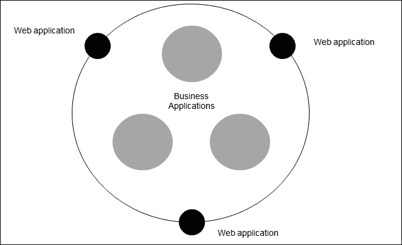

企业生态系统中应用程序的简单表示

正如你们中的许多人多年来在项目和任务中积累的经验一样，这些业务应用程序在其业务功能方面的变化是可以想象的。但是，它们都有一些共同的特性和方面。在本章中，我们将介绍其中的一些功能，并了解 Redis 如何融入业务应用程序领域。首先，任何应用程序中最常见和最简单的功能是**配置管理**。

接下来的主题将考虑配置管理，并将 Redis 作为构建企业级应用程序的核心组件。

# 配置管理

通常，您可能已经看到配置管理不当或缺乏配置管理会在开发和维护生命周期的后期产生问题。另一个问题是，当可伸缩性开始显现，并且添加了更多的软件节点时；然后，在所有节点上维护状态就成了一项挑战。业务应用程序一直依赖于 RDBMS 来存储配置数据。这种方法的问题在于性能；如果设计是基于**拉**的，而基于**拉**的设计的问题是性能惩罚。另一个问题是，如果并发性很高（因为其他业务功能），那么这些 RDBMS 还必须满足这些请求以及对配置数据的请求。

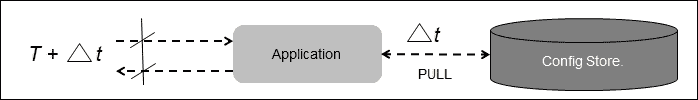

基于 PULL 的配置管理设计

其想法是将设计从基于**拉**转换为基于**推**。这种技术的最大优点是性能。状态或配置数据保持在应用程序附近，并且每当发生更改时，数据都会推送到应用程序的本地缓存。另一个要求是拥有一个计算资源占用率低的系统。


基于 PUSH 的配置管理设计

Redis 具有瑞士刀一样的功能、低资源占用、各种语言的客户端库可用性以及大规模扩展的能力，使其成为满足这一需求的理想选择。我们将在后面的主题中讨论的示例应用程序将强调这一点。此示例应用程序仅用于演示，在生产环境中不提供任何保证。那么，让我们来享受一下开发一个以 Redis 为主干的配置管理服务器的乐趣，我们称之为**八卦服务器**。

## 八卦服务器

gossip 服务器是一个集中式节点，以同步方式管理配置数据和分组服务。**八卦服务器**将保存数据，并由名为**八卦服务器（管理员）**的节点进行管理。**八卦服务器**将依次管理连接到它的所有其他节点。下图描述了 gossip 服务器负责将配置数据推送到与其连接的所有节点：

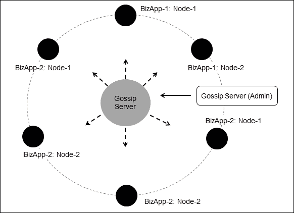

Gossip 服务器设计概述

此 gossip服务器的内部是 Redis 服务器，它提供拟议配置管理系统可能需要的所有功能。节点可以用任何编程语言实现，但与本书中的示例保持一致，我们将在本例中使用 Java 作为实现语言。此 gossip 服务器的主要思想是在下次需要构建或设计企业级解决方案时，保留一个用于配置管理的通用组件，并在这样做时记住 Redis。

在我们进入通用组件的实现和设计规范之前，让我们先对这个八卦服务器的功能达成一致。

以下是八卦服务器的功能：

*   gossip 服务器维护所有信息或配置数据
*   它就像一个集线器，将信息或配置数据分发给所有连接的节点
*   所有节点（包括主节点）都连接到集线器以发送消息
*   主节点负责将数据推送到特定客户机节点或所有客户机节点
*   所有客户端节点都位于层次结构中的相同位置
*   所有客户端节点都可以嵌入到将成为此配置管理一部分的解决方案中
*   节点有一个生命周期，由它们自己管理
*   当节点改变状态时，会通知主节点和其他对等客户端节点
*   如果业务逻辑需要，节点也可以向其他对等节点发送消息

### 节点

八卦服务器中的节点是所有消息在其之间流动的客户端组件。在当前示例中，节点可以分为两种类型，客户机节点和主节点。

客户机节点本质上是指可以插入任何需要配置管理的解决方案中的组件。客户端节点负责存储在 Redis 中的应用程序数据。节点中的数据可以来自插入的应用程序，也可以来自主节点，主节点可以将数据推送到客户端节点。允许主节点将数据推送或更确切地说将数据发布到 gossip 服务器的整个想法是将应用程序配置数据的控制从应用程序本身扩展到另一个源。这样做的好处是从应用程序中卸下配置数据管理的责任，并拥有一个集中的节点，从中可以管理数据。另一个优点是，可以在运行时将新的配置数据引入应用程序，而无需停止应用程序。

下图显示了 gossip 服务器的配置数据推送功能：


通过应用程序或主节点将数据推送到 Gossip 服务器

在我们进一步讨论实现之前，最好先了解客户机节点在其生命周期中可以穿越的各种状态。下图是客户端节点可以采用的各种路径的快照：

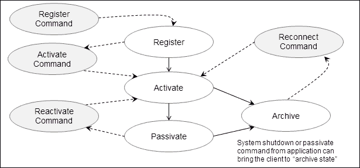

通过应用程序或主节点将数据推送到 Gossip 服务器

客户端节点通过**寄存器**开始其旅程。**注册**后，客户端节点需要**自身激活**。一旦客户端节点被激活，它就可以**自身钝化**或者达到**存档**状态。如果主节点关闭应用程序或发送`Kill`命令，则可以实现**存档**状态。一旦客户端节点处于**被动**状态，就可以通过**重新激活**的中间状态使其**激活**。如果客户端节点处于**存档**状态，则可以通过**重新连接**的中间状态，将客户端节点带入**激活**状态。

客户端节点的命令是围绕上述状态建模的，还有其他用于管理数据和在生态系统中传递数据的命令。在不浪费太多时间的情况下，让我们深入研究系统的设计。

### 分层设计

八卦服务器的设计是最低限度的，并且非常容易遵循，但是需要记住某些注意事项。如前所述，参与 gossip 服务器的节点有两种类型：客户机节点和主节点。每个客户机节点负责自己的生命周期，而主节点对其控制有限。节点可以通过传递消息相互通信。设计包括四个主要层，如下图所示：


Gossip 服务器结构层概述

gossip 服务器中的包对应于前面的图中描述的层，并且包含一些额外的包。让我们简要介绍一下包及其包含的类。以下是软件包及其对应的层的列表：

*   `org.redisch7.gossipserver.shell`：该对应**壳层**
*   `org.redisch7.gossipserver.commands`：该对应**命令层**
*   `org.redisch7.gossipserver.commandhandlers`：此对应**命令处理层**
*   `org.redisch7.gossipserver.datahandler`：该对应**数据处理层**
*   `org.redisch7.gossipserver.util.commandparser`：这是一个实用程序包

#### 外壳

Shell是一个程序，它的作用类似于一个通向八卦服务器的独立网关，同时也是一个希望使用八卦服务器的应用程序的插件。shell 将激活节点，从而为节点准备侦听器和命令库。如前所述，有两种类型的节点：客户端节点和主节点；本章后面部分将详细讨论这些节点。

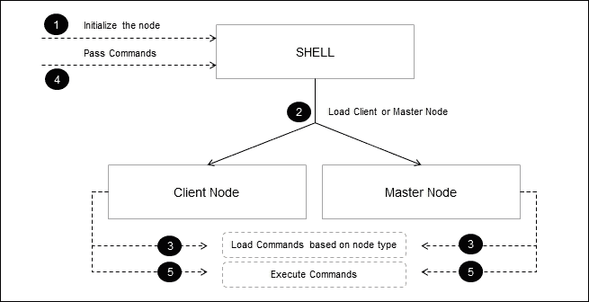

与壳的相互作用

gossip 服务器的代码很简单，基本上命令委托给节点进行处理。在 Shell 作为独立程序的情况下，响应显示在命令提示符中，而在 Shell 作为 API 插件的情况下，结果对象`CheckResult`被传递回调用它的程序。Shell 是作为单例实现的。这是`Shell.java`的代码：

```java
package org.redisch7.gossipserver.shell;
/** omitting the import statements**/
public class Shell {
  private Shell() {}
  private Node      node    = null;
  private static Shell  singleton  = new Shell();
  public static Shell instance() {
    return singleton;
  }
  // : as an shell API mode.
  public Shell asClient(String nodename) {
    if (node != null && nodename != null && nodename.trim().length() != 0) {
      node = new ClientNode(nodename);
      return this;
    } else {
      return null;
    }
  }
  public Shell asMaster() {
    if (node != null) {
      node = new MasterNode();
      return this;
    } else {
      return null;
    }
  }
  public CheckResult execute(String commands) {
    CheckResult checkResult = new CheckResult();
    if (commands != null && commands.trim().length() == 0) {
      checkResult = node.process(commands);
    }
    return checkResult;
  }
  // : as a shell standalone mode.
  public static void main(String[] args) throws IOException {
    Shell shell = Shell.instance();
    shell.startInteracting();
  }
  private void startInteracting() throws IOException {
    System.out.println("Please enter the name of the node..");
    BufferedReader nodenameReader = new BufferedReader(new InputStreamReader(System.in));
    String nodename = nodenameReader.readLine();
    if (nodename.equals("master")) {
      node = new MasterNode();
    } else {
      node = new ClientNode(nodename);
    }
    while (true) {
      BufferedReader commandReader = new BufferedReader(new InputStreamReader(System.in));
      String readline = commandReader.readLine();
      if (readline == null) {
        System.out.println("Ctrl + C ");
        break;
      } else {
        CheckResult checkResult = node.process(readline);
        System.out.println(":->" + checkResult.getResult());
        System.out.println(":->" + checkResult.getReason());
        System.out.println(":->" + checkResult.getValue());
      }
    }
    System.exit(0);
  }
}
```

### 听众

侦听器是由节点生成的并独立于执行 Shell 的线程执行。侦听器的基本工作是不断侦听任何到达节点的消息事件。然后对消息进行相应的分析和执行。其基本思想是为节点之间的交互提供一种机制。在当前的实现中，主节点与客户机节点交互。这提供了通过客户端节点对主机的有限远程控制。如果需要，也就是说，如果客户机节点与主节点交互，那么通信的另一种方式的实现没有完成，并且可以容易地合并。并非所有命令都可以通过这种安排在客户端节点上远程执行。（主节点）可以远程执行的命令有`SET`、`KILL`和`CLONE`。


节点、消息侦听器管理器、消息侦听器和订阅服务器之间的关系

监听器内部有一个订阅者，该订阅者扩展了`JedisPubSub`抽象类，该类是 Jedis 客户端库与 Redis 消息传递功能的挂钩。节点维护侦听器的生命周期。节点在一些命令上激活监听器，例如**激活**、**重新连接**等，在一些命令上禁用监听器，例如`Passivate`、`KILL`等。

以下是客户端侦听器的代码，即`ClientEventMessageListener`.Java：

```java
package org.redisch7.gossipserver.shell;
/** omitting the import statements **/
public class ClientEventMessageListener implements Runnable {
  private Subscriber subscriber = null;
  private Node node;
  private Jedis jedis = ConnectionManager.get();
  private Validator validator = null;
  public ClientEventMessageListener(Node node) {
    this.node = node;
    this.subscriber = new Subscriber(node);
  }
  @Override
  public void run() {
    while (!Thread.currentThread().isInterrupted()) {
      jedis.subscribe(subscriber, node.getNodename());
    }
  }
  public void unsubscribe() {
    subscriber.unsubscribe(node.getNodename());
  }
  public class Subscriber extends JedisPubSub {
    public Subscriber(Node clientNode) {
    }
    @Override
    public void onMessage(String nodename, String readmessage) {
      validator = new Validator();
      validator.configureTemplate().add(new MapListToken());
      validator.setInput(readmessage);
      CheckResult checkResult = validator.validate();
      if (checkResult.getResult()) {
        MapListToken mapListToken = (MapListToken) validator
            .getToken(0);
        if (mapListToken.containsKey("command")) {
          String commandValue = mapListToken.getNValue("command");
          if (commandValue.equals("set")) {
            MapListToken newMapListToken = mapListToken
                .removeElement("command");
            SetCommand command = new SetCommand();
            command.setName(node.getNodename());
            CheckResult result = command.execute(new CommandTokens(
                "set "
                    + newMapListToken
                        .getValueAsSantizedString()));
            System.out.println(result.getResult());
            System.out.println(result.getReason());
          } else if (commandValue.equals("kill")) {
            KillNodeCommand command = new KillNodeCommand();
            command.setName(node.getNodename());
            MapListToken newMapListToken = mapListToken
                .removeElement("command");
            CheckResult result = command.execute(new CommandTokens(
                "kill " + node.getNodename()));
            System.out.println(result.getResult());
            System.out.println(result.getReason());
          } else if (commandValue.equals("clone")) {
            CloneNodeCommand command = new CloneNodeCommand();
            command.setName(node.getNodename());
            MapListToken newMapListToken = mapListToken
                .removeElement("command");
            CheckResult result = command.execute(new CommandTokens(
                "clone "
                    + newMapListToken
                        .getValueAsSantizedString()));
            System.out.println(result.getResult());
            System.out.println(result.getReason());
          } else {
            MessageCommand messageCommand = new MessageCommand();
            messageCommand.setName(nodename);
            CommandTokens commandTokens = new CommandTokens(
                "msg master where msg=illegal_command");
            messageCommand.execute(commandTokens);
          }
        } else {
          System.out
              .println(":->"
                  + checkResult
                      .appendReason("The command sent from publisher does not contain 'command' token"));
        }
      } else {
        System.out.println(":->" + checkResult.getReason());
      }
    }
    @Override
    public void onPMessage(String arg0, String arg1, String arg2) {
      System.out.println(arg1);
      System.out.println(arg2);
    }
    @Override
    public void onPSubscribe(String arg0, int arg1) {
    }
    @Override
    public void onPUnsubscribe(String arg0, int arg1) {
    }
    @Override
    public void onSubscribe(String arg0, int arg1) {
    }
    @Override
    public void onUnsubscribe(String arg0, int arg1) {
    }
  }
}
```

以下是主侦听器的代码，即`MasterEventMessageListener.java`：

```java
package org.redisch7.gossipserver.shell;
/** omitting the import statements **/
public class MasterEventMessageListener implements Runnable {
  private Subscriber  subscriber  = null;
  private Node    node;
  private Jedis    jedis    = ConnectionManager.get();
  private Validator  validator  = new Validator();
  public MasterEventMessageListener(Node node) {
    this.node = node;
    this.subscriber = new Subscriber(node);
    validator.configureTemplate().add(new MapListToken());
  }
  @Override
  public void run() {
    while (!Thread.currentThread().isInterrupted()) {
      jedis.subscribe(subscriber, node.getNodename());
    }
  }
  public void unsubscribe() {
    subscriber.unsubscribe(node.getNodename());
  }
  public class Subscriber extends JedisPubSub {
    public Subscriber(Node node) {
    }
    @Override
    public void onMessage(String nodename, String readmessage) {
      System.out.println("msg: " + readmessage);
      System.out.println("Not processed further in the current implementation");
    }
    @Override
    public void onPMessage(String arg0, String arg1, String arg2) {
      System.out.println(arg1);
      System.out.println(arg2);
    }
    @Override
    public void onPSubscribe(String arg0, int arg1) {}
    @Override
    public void onPUnsubscribe(String arg0, int arg1) {}
    @Override
    public void onSubscribe(String arg0, int arg1) {}
    @Override
    public void onUnsubscribe(String arg0, int arg1) {}
  }
}
```

#### 听众经理

**听众经理**负责维护听众的生命周期。侦听器可以在开始模式或停止模式下存在。八卦服务器采用面向事件的设计；因此，在客户端节点接受的每个事件上，都会执行相应的命令。

在系统中，有两种类型的侦听器管理器，一种用于称为客户端节点侦听器管理器的客户端节点，另一种用于称为主节点侦听器管理器的主节点。

客户端节点侦听器管理器被编程为在诸如`Activate`、`Reactivate`和`Reconnect`等命令上启动侦听器，并在诸如`Passivate`和`Kill`等命令上停止侦听器。

主节点侦听器管理器被编程为在`Start`等命令上启动侦听器，并在`Stop`等命令上停止侦听器。

以下为`ClientNodeListenerManager.java`的代码：

```java
package org.redisch7.gossipserver.shell;
/** omitting the import statements **/
public class ClientNodeListenerManager implements NodeMessageListenerManager {
  private String            nodename;
  private ClientEventMessageListener  privateEventMessageSubscriber;
  private Thread            commonEventThread;
  private Thread            privateEventThread;
  public ClientNodeListenerManager(ClientNode clientNode) {
    this.nodename = clientNode.getNodename();
    privateEventMessageSubscriber = new ClientEventMessageListener(clientNode);
  }
  @Override
  public void start() {
    System.out.println(" start the client node manager .. ");
    privateEventThread = new Thread(privateEventMessageSubscriber);
    commonEventThread.start();
    privateEventThread.start();
  }
  @Override
  public void stop() {
    System.out.println(" stop the client node manager .. ");
    privateEventMessageSubscriber.unsubscribe();
    commonEventThread.interrupt();
    privateEventThread.interrupt();
  }
  @Override
  public void passCommand(AbstractCommand command) {
    if (command instanceof ActivateCommand || command instanceof ReactivateCommand
        || command instanceof ReConnectCommand) {
      this.start();
    } else if (command instanceof PassivateCommand || command instanceof KillNodeCommand) {
      this.stop();
    }
  }
}
```

以下是`MasterNodeListenerManager.java`的代码：

```java
package org.redisch7.gossipserver.shell;
/** omitting the import statements **/
public class MasterNodeListenerManager implements NodeMessageListenerManager {
  private MasterEventMessageListener  masterEventMessageSubscriber;
  private Thread            privateEventThread;
  private MasterNode          masternode;
  public MasterNodeListenerManager(MasterNode masterNode) {
    this.masternode = masterNode;
    masterEventMessageSubscriber = new MasterEventMessageListener(masternode);
  }
  @Override
  public void start() {
    System.out.println(" start the master node manager .. ");
    privateEventThread = new Thread(masterEventMessageSubscriber);
    privateEventThread.start();
  }
  @Override
  public void stop() {
    System.out.println(" stop the master node manager .. ");
    privateEventThread.interrupt();
    masterEventMessageSubscriber.unsubscribe();
  }
  @Override
  public void passCommand(AbstractCommand command) {
    if (command instanceof StartMasterCommand) {
      this.start();
    } else if (command instanceof StopMasterCommand) {
      this.stop();
    }
  }
}
```

### 数据处理层

此层或包的活动非常简单，例如与 Redis 服务器交互。该层负责封装应用程序其余部分的 Redis。


Gossip 服务器结构层概述

以下是用于当前应用程序的数据结构：

*   **注册持有者**：此将在 Redis 数据存储中作为一个集合实现。这将保存将在系统中注册的所有节点。
*   **激活持有者**：此将在 Redis 数据存储中作为一个集合来实现。这将保存所有将处于`Active`状态的节点。
*   **钝化支架**：将作为一套在 Redis 数据存储中实现。这将保持所有将处于**被动**状态的节点。
*   **配置存储**：这是将在 Redis 数据存储中实现为一个映射。这将以名称值格式保存与节点相关的所有配置数据。
*   **归档存储**：将作为客户端节点本地文件系统中的文件存储实现。这将以名称值格式保存与节点相关的所有配置数据，该格式将以 JSON 格式存档。

该层中最重要的类是`JedisUtilImpl`；让我们花些时间来理解这门课。这个类的本质使得这个类非常大，但是很容易理解。

#### JedisUtil.java

这个类是与存储数据进行转换的工具。管理节点的帐户、状态和数据的所有逻辑都在这里进行管理。

### 注

请注意，我们使用`jedis_2.1.0`作为客户端 API 的选择，以便连接到 Redis。在此版本的客户端库中使用`PIPELINE`函数中的`MULTI`时存在一个错误。

```java
Exception in thread "main" java.lang.ClassCastException: [B cannot be cast to java.util.List at redis.clients.jedis.Connection.getBinaryMultiBulkReply(Connection.java:189)
    at redis.clients.jedis.Jedis.hgetAll(Jedis.java:861)
    at com.work.jedisex.JedisFactory.main(JedisFactory.java:59)
```

由于 Redis 是单线程服务器，因此我们在此应用程序中牺牲了`PIPELINE`中的`MULTI`，因为这不会影响 Redis 中数据的神圣性，并且对性能的影响最小。我们已经开始单独发送命令，而不是像`PIPELINE`那样大量发送命令。未来的绝地 API 可能会有一个解决方案，如果您使用的是较新版本的绝地，您可以根据自己的需要更改该类。

其他语言的客户机实现或 Java 中 Redis 的其他客户机实现不会有问题，因为这是特定于 Jedis 的。

现在我们已经了解了`JedisUtil`类，我们在某种程度上了解了八卦服务器的工作原理以及八卦服务器必须提供的功能。因此，让我们重点关注命令及其实现方式。根据经验，数据流可以总结如下图所示：


命令中数据流的顺序

# 客户端节点命令

以下是可从客户端节点触发的命令列表：

*   `register`命令
*   `activate`命令
*   `set`命令
*   `get`命令
*   `status`命令
*   `del`命令
*   `passivate`命令
*   `reacyivate`命令
*   `archive`命令
*   `sync`命令
*   `reconnect`命令

让我们从设计和实现的角度来看每一个命令。

## 寄存器命令

此命令将节点注册到八卦服务器生态系统中。执行此命令的前提条件是节点名称应是唯一的；否则将向**外壳**发送故障响应。节点名称将存储在注册持有者中，该持有者在 Redis 中实现为一个集合数据结构。除此之外，当注册过程发生时，将在节点的本地计算机中创建一个存档文件。

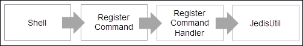

寄存器命令中的数据流顺序

此命令的语法为：`register`。下面的屏幕截图显示了 Shell 控制台中的响应：

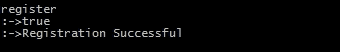

### RegisterCommand 的实现

RegisterCommand的实现如以下代码段所示：

```java
package org.redisch7.gossipserver.commands;
/* OMITTING THE IMPORT STATEMENTS TO SAVE SPACE */
public class RegisterCommand extends AbstractCommand {
  private Validator validator = new Validator();
  public RegisterCommand() {
    validator.configureTemplate().add((new StringToken("register")));
  }
  @Override
  public CheckResult execute(CommandTokens commandTokens) {
    CheckResult checkResult = new CheckResult();
    validator.setInput(commandTokens);
    checkResult = validator.validate();
    if (checkResult.getResult()) {
      List<Token> tokenList = validator.getAllTokens();
      checkResult = new RegisterCommandHandler(this.getName()).process(tokenList);
    }
    if(checkResult.getResult()){
      String path = System.getProperty("user.home") + "\\archive\\";
      File file = new File(path);
      if (!file.exists()) {
        if (file.mkdir()) {
          checkResult.appendReason("Archive folder created!");
        } else {
          checkResult.appendReason("Archive folder exists!");
        }
      }
    }
    return checkResult;
  }
}
```

### RegisterCommandHandler 的实现

RegisterCommandHandler 的实现如以下代码段所示：

```java
package org.redisch7.gossipserver.commandhandlers;
/* OMITTING THE IMPORT STATEMENTS TO SAVE SPACE */
public class RegisterCommandHandler extends AbstractCommandHandler {
  public RegisterCommandHandler(String nodename) {
    super(nodename);
  }
  public CheckResult process(List<Token> tokenList) {
    CheckResult checkResult = new CheckResult();
    JedisUtil jedisUtil = new JedisUtil();
    List<Boolean> result = jedisUtil
        .doesExist(this.getNodename(), Arrays
            .asList(ConstUtil.registerationHolder,
                ConstUtil.activationHolder,
                ConstUtil.passivationHolder, ConstUtil.shutdownHolder));
    if ((result.get(0) == false) && (result.get(1) == false)
        && (result.get(2) == false)&& (result.get(3) == false)) {
      checkResult = jedisUtil.registerNode(this.getNodename());
    } else {
      checkResult
          .setFalse("Activation Validation :")
          .appendReason(
              ConstUtil.registerationHolder + " = "
                  + ((Boolean) result.get(0)))
          .appendReason(
              ConstUtil.activationHolder + " = "
                  + ((Boolean) result.get(1)))
          .appendReason(
              ConstUtil.passivationHolder + " = "
                  + ((Boolean) result.get(2)));
    }
    return checkResult;
  }
}
```

## 激活命令

此命令将激活节点进入八卦服务器生态系统。执行此命令的先决条件是要注册节点。当节点被激活时，一个条目被添加到 ACTIVATION-HOLDER 中，该条目按照 Redis 中的设置实现。除此之外，在激活时，客户机节点将生成监听器，监听器将启动并准备好侦听来自主节点的任何事件。侦听器基本上是在一个单独的线程上侦听事件。


激活命令中的数据流顺序

此命令的语法为：`activate`。以下屏幕截图显示了 shell 控制台中的响应：

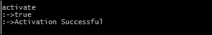

### ActivateCommand 的实现

ActivateCommand 的实现如以下代码段所示：

```java
package org.redisch7.gossipserver.commands;
/* OMITTING THE IMPORT STATEMENTS TO SAVE SPACE */
public class ActivateCommand extends AbstractCommand {
  private Validator validator = new Validator();
  public ActivateCommand() {
    validator.configureTemplate().add((new StringToken("activate")));
  }
  @Override
  public CheckResult execute(CommandTokens commandTokens) {
    CheckResult checkResult = new CheckResult();
    validator.setInput(commandTokens);
    checkResult = validator.validate();
    if (checkResult.getResult()) {
      List<Token> tokenList = validator.getAllTokens();
      checkResult = new ActivateCommandHandler(this.getName()).process(tokenList);
    }
    return checkResult;
  }
}
```

### ActivateCommandHandler 的实现

ActivateCommandHandler 的实现如以下代码段所示：

```java
package org.redisch7.gossipserver.commandhandlers;
/* OMITTING THE IMPORT STATEMENTS TO SAVE SPACE */
public final class ActivateCommandHandler extends AbstractCommandHandler {
  public ActivateCommandHandler(String nodename) {
    super(nodename);
  }
  public CheckResult process(List<Token> tokenList) {
    CheckResult checkResult = new CheckResult();
    JedisUtil jedisUtil = new JedisUtil();
    List<Boolean> result = jedisUtil.doesExist(this.getNodename(), Arrays
        .asList(ConstUtil.registerationHolder,
            ConstUtil.activationHolder,
            ConstUtil.passivationHolder, ConstUtil.shutdownHolder));
    if ((result.get(0) == true) && (result.get(1) == false)
        && (result.get(2) == false) && (result.get(3) == false)) {
      checkResult = jedisUtil.activateNode(this.getNodename());
    } else {
      checkResult
          .setFalse("Activation Failed :")
          .appendReason(
              ConstUtil.registerationHolder + " = "
                  + ((Boolean) result.get(0)))
          .appendReason(
              ConstUtil.activationHolder + " = "
                  + ((Boolean) result.get(1)))
          .appendReason(
              ConstUtil.passivationHolder + " = "
                  + ((Boolean) result.get(2)))
          .appendReason(
              ConstUtil.shutdownHolder + " = "
                  + ((Boolean) result.get(3)));
    }
    return checkResult;
  }
}
```

## set 命令

此命令将设置节点中的数据。执行此命令的前提是节点应处于激活状态。该命令将把名称值插入节点的*配置存储*。*配置存储*在 Redis 中实现为哈希数据结构。显然，可以在*配置存储*中插入多个名称-值对。


Set 命令中数据流的顺序

此命令的语法为：`set <name=value>,<name=value>`。以下屏幕截图显示了 Shell 控制台中的响应：

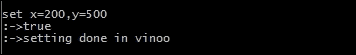

### SET 命令的实现

SetCommand 的实现如以下代码行所示：

```java
package org.redisch7.gossipserver.commands;
/* OMITTING THE IMPORT STATEMENTS TO SAVE SPACE */
import org.redisch7.gossipserver.util.commandparser.Validator;
public class SetCommand extends AbstractCommand {
  Validator validator = new Validator();
  public SetCommand() {
    validator.configureTemplate().add((new StringToken("set"))).add(new MapListToken());
  }
  @Override
  public CheckResult execute(CommandTokens commandTokens) {
    CheckResult checkResult = new CheckResult();
    validator.setInput(commandTokens);
    checkResult = validator.validate();
    if (checkResult.getResult()) {
      List<Token> tokenList = validator.getAllTokens();
      checkResult = new SetCommandHandler(this.getName()).process(tokenList);
    }
    return checkResult;
  }
}
```

### SetCommandHandler 的实现

`set`命令处理程序实现如下：

```java
package org.redisch7.gossipserver.commandhandlers;
/* OMITTING THE IMPORT STATEMENTS TO SAVE SPACE */
public class SetCommandHandler extends AbstractCommandHandler {
  public SetCommandHandler(String nodename) {
    super(nodename);
  }
  public CheckResult process(List<Token> tokenList) {
    CheckResult checkResult = new CheckResult();
    JedisUtil jedisUtil = new JedisUtil();
    List<Boolean> result = jedisUtil
        .doesExist(this.getNodename(), Arrays
            .asList(ConstUtil.registerationHolder,
                ConstUtil.activationHolder,
                ConstUtil.passivationHolder, ConstUtil.shutdownHolder));
    if ((result.get(0) == true) && (result.get(1) == true)
        && (result.get(2) == false)&& (result.get(3) == false)) {
      MapListToken mapListToken = (MapListToken) tokenList.get(1);
      checkResult = jedisUtil.setValuesInNode(this.getNodename(),
          mapListToken.getValueAsMap());
    } else {
      checkResult
          .setFalse("Activation Validation :")
          .appendReason(
              ConstUtil.registerationHolder + " = "
                  + ((Boolean) result.get(0)))
          .appendReason(
              ConstUtil.activationHolder + " = "
                  + ((Boolean) result.get(1)))
          .appendReason(
              ConstUtil.passivationHolder + " = "
                  + ((Boolean) result.get(2)));
    }
    return checkResult;
  }
}
```

## get 命令

此命令将从节点获取数据。执行此命令的前提是节点应处于激活状态。输入将是一个变量列表，需要从配置存储中提取数据。每个节点都有自己的配置存储。

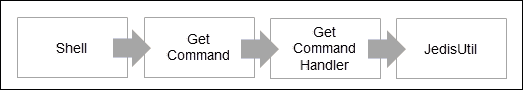

Get 命令中数据流的顺序

此命令的语法为：`get`。以下屏幕截图显示了 shell 控制台中的响应：

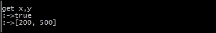

### GetCommand 的实现

GetCommand 的实现如下代码段所示：

```java
package org.redisch7.gossipserver.commands;
/* OMITTING THE IMPORT STATEMENTS TO SAVE SPACE */
public class GetCommand extends AbstractCommand {
  Validator validator = new Validator();
  public GetCommand() {
    validator.configureTemplate().add((new StringToken("get"))).add(new StringListToken());
  }
  @Override
  public CheckResult execute(CommandTokens commandTokens) {
    CheckResult checkResult = new CheckResult();
    validator.setInput(commandTokens);
    checkResult = validator.validate();
    if (checkResult.getResult()) {
      List<Token> tokenList = validator.getAllTokens();
      checkResult = new GetCommandHandler(this.getName()).process(tokenList);
    }
    return checkResult;
  }
}
```

### GetCommandHandler 的实现

`get`命令处理程序实现如下：

```java
package org.redisch7.gossipserver.commandhandlers;
/* OMITTING THE IMPORT STATEMENTS TO SAVE SPACE */
public class GetCommandHandler extends AbstractCommandHandler {
  public GetCommandHandler(String nodename) {
    super(nodename);
  }
  public CheckResult process(List<Token> tokenList) {
    CheckResult checkResult = new CheckResult();
    JedisUtil jedisUtil = new JedisUtil();
    List<Boolean> result = jedisUtil
        .doesExist(this.getNodename(), Arrays
            .asList(ConstUtil.registerationHolder,
                ConstUtil.activationHolder,
                ConstUtil.passivationHolder, ConstUtil.shutdownHolder));
    if ((result.get(0) == true) && (result.get(1) == true)
        && (result.get(2) == false)&& (result.get(3) == false)) {
      StringListToken stringList = (StringListToken) tokenList.get(1);
      checkResult = jedisUtil.getValuesFromNode(this.getNodename(),
          stringList.getValueAsList());
    } else {
      checkResult
          .setFalse("Activation Validation :")
          .appendReason(
              ConstUtil.registerationHolder + " = "
                  + ((Boolean) result.get(0)))
          .appendReason(
              ConstUtil.activationHolder + " = "
                  + ((Boolean) result.get(1)))
          .appendReason(
              ConstUtil.passivationHolder + " = "
                  + ((Boolean) result.get(2)));
    }
    return checkResult;
  }
}
```

## del 命令

此命令将删除节点中的数据。执行这个命令的前提是节点应该被激活。该命令将通过传递需要删除的变量的名称来执行。


Delete 命令中的数据流顺序

此命令的语法为：`del <parameter>`。以下屏幕截图显示了 shell 控制台中的响应：


### 删除命令的实现

DeleteCommand的实现如以下代码段所示：

```java
package org.redisch7.gossipserver.commands;
/* OMITTING THE IMPORT STATEMENTS TO SAVE SPACE */
public class DeleteCommand extends AbstractCommand {
  Validator validator = new Validator();
       public DeleteCommand() {
    validator.configureTemplate().add((new StringToken("del"))).add(new StringListToken());
  }
  @Override
  public CheckResult execute(CommandTokens commandTokens) {
    CheckResult checkResult = new CheckResult();
    validator.setInput(commandTokens);
    checkResult = validator.validate();
    if (checkResult.getResult()) {
      List<Token> tokenList = validator.getAllTokens();
      checkResult = new DeleteCommandHandler(this.getName()).process(tokenList);
    }
    return checkResult;
  }
}
```

### DeleteCommandHandler 的实现

`delete`命令处理程序实现如下：

```java
package org.redisch7.gossipserver.commandhandlers;
/* OMITTING THE IMPORT STATEMENTS TO SAVE SPACE */
public class DeleteCommandHandler extends AbstractCommandHandler {
  public DeleteCommandHandler(String nodename) {
    super(nodename);
  }
  public CheckResult process(List<Token> tokenList) {
    CheckResult checkResult = new CheckResult();
    JedisUtil jedisUtil = new JedisUtil();
    List<Boolean> result = jedisUtil
        .doesExist(this.getNodename(), Arrays
            .asList(ConstUtil.registerationHolder,
                ConstUtil.activationHolder,
                ConstUtil.passivationHolder, ConstUtil.shutdownHolder));
    if ((result.get(0) == true) && (result.get(1) == true)
        && (result.get(2) == false)&& (result.get(3) == false)) {
      StringListToken stringList = (StringListToken) tokenList.get(1);
      checkResult = jedisUtil.deleteValuesFromNode(this.getNodename(),
          stringList.getValueAsList());
    } else {
      checkResult
          .setFalse("Activation Validation :")
          .appendReason(
              ConstUtil.registerationHolder + " = "
                  + ((Boolean) result.get(0)))
          .appendReason(
              ConstUtil.activationHolder + " = "
                  + ((Boolean) result.get(1)))
          .appendReason(
              ConstUtil.passivationHolder + " = "
                  + ((Boolean) result.get(2)));
    }
    return checkResult;
  }
}
```

## 状态命令

此命令用于获取节点的当前状态。执行此命令的前提是节点应该处于某种状态。客户机中的命令关注客户机节点的数据。

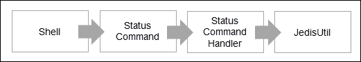

钝化命令中的数据流顺序

此命令的语法为：`status`。下面的屏幕截图显示了 shell 控制台中的响应：


### 状态命令的执行

`status`命令是实现的，如下代码段所示：

```java
package org.redisch7.gossipserver.commands;
/* OMITTING THE IMPORT STATEMENTS TO SAVE SPACE */
public class StatusCommand extends AbstractCommand {
  Validator validator = new Validator();
  public StatusCommand() {
    validator.configureTemplate().add((new StringToken("status")));
  }
  @Override
  public CheckResult execute(CommandTokens commandTokens) {
    CheckResult checkResult = new CheckResult();
    validator.setInput(commandTokens);
    checkResult = validator.validate();
    if (checkResult.getResult()) {
      List<Token> tokenList = validator.getAllTokens();
      checkResult = new StatusCommandHandler(this.getName()).process(tokenList);
    }
    return checkResult;
  }
}
```

### StatusCommandHandler 的实现

`passive`命令处理程序实现如下：

```java
package org.redisch7.gossipserver.commandhandlers;
/* OMITTING THE IMPORT STATEMENTS TO SAVE SPACE */
public class StatusCommandHandler extends AbstractCommandHandler {
  public StatusCommandHandler(String nodename) {
    super(nodename);
  }
  @Override
  public CheckResult process(List<Token> tokenList) {
    CheckResult checkResult = new CheckResult();
    JedisUtil jedisUtil = new JedisUtilImpl();
    if (this.getNodename().equals("master")) {
      List<String> registerednames = jedisUtil.getAllNodesFromRegistrationHolder();
      checkResult.setTrue().appendReason("The following nodes are registered ");
      checkResult.appendReason(registerednames.toString());
      List<String> activenodenames = jedisUtil.getAllNodesFromActivatedHolder();
      checkResult.setTrue().appendReason("The following nodes are activated ");
      checkResult.appendReason(activenodenames.toString());
      List<String> passivenodenames = jedisUtil.getAllNodesFromPassivatedHolder();
      checkResult.setTrue().appendReason("The following nodes are passivated ");
      checkResult.appendReason(passivenodenames.toString());
      List<String> inconsistentState = jedisUtil.getAllNodesInInconsistentState();
      checkResult.setTrue().appendReason("The following nodes are not in consitent state ");
      checkResult.appendReason(inconsistentState.toString());
    } else {
      checkResult = jedisUtil.getStatus(this.getNodename());
    }
    return checkResult;
  }
}
```

## 被动命令

此命令将使节点被动进入八卦服务器生态系统。执行此命令的前提是节点应处于激活状态。在钝化时，客户端的事件侦听器将被关闭，无法从主服务器获取事件。由于节点是被动的，节点的配置存储中的数据将被获取并推送到节点的存档文件中。


钝化命令中的数据流顺序

此命令的语法为：`passivate`。以下屏幕截图显示了 shell 控制台中的响应：

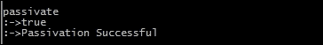

### 被动命令的执行

`passivate`命令的实现如下代码段所示：

```java
package org.redisch7.gossipserver.commands;
/* OMITTING THE IMPORT STATEMENTS TO SAVE SPACE */
public class PassivateCommand extends AbstractCommand {
  Validator validator = new Validator();
  public PassivateCommand() {
    validator.configureTemplate().add((new StringToken("passivate")));
  }
  @Override
  public CheckResult execute(CommandTokens commandTokens) {
    CheckResult checkResult = new CheckResult();
    validator.setInput(commandTokens);
    checkResult = validator.validate();
    if (checkResult.getResult()) {
      List<Token> tokenList = validator.getAllTokens();
      checkResult = new PassivateCommandHandler(this.getName()).process(tokenList);
    }
    return checkResult;
  }
}
```

### 被动 CommandHandler 的实现

`passivate`命令处理程序是实现的，如下代码段所示：

```java
package org.redisch7.gossipserver.commandhandlers;
/* OMITTING THE IMPORT STATEMENTS TO SAVE SPACE */
public class PassivateCommandHandler extends AbstractCommandHandler {
  public PassivateCommandHandler(String nodename) {
    super(nodename);
  }
  public CheckResult process(List<Token> tokenList) {
    CheckResult checkResult = new CheckResult();
    JedisUtil jedisUtil = new JedisUtil();
    List<Boolean> result = jedisUtil.doesExist(this.getNodename(), Arrays
        .asList(ConstUtil.registerationHolder,
            ConstUtil.activationHolder,
            ConstUtil.passivationHolder, ConstUtil.shutdownHolder));
    if ((result.get(0) == true) && (result.get(1) == true)
        && (result.get(2) == false) && (result.get(3) == false)) {
      checkResult = jedisUtil.passivateNode(this.getNodename());
    } else {
      checkResult
          .setFalse("Passivation Validation :")
          .appendReason(
              ConstUtil.registerationHolder + " = "
                  + ((Boolean) result.get(0)))
          .appendReason(
              ConstUtil.activationHolder + " = "
                  + ((Boolean) result.get(1)))
          .appendReason(
              ConstUtil.passivationHolder + " = "
                  + ((Boolean) result.get(2)));
    }
    return checkResult;
  }
}
```

## 重新激活命令

此命令将重新激活节点。执行此命令的前提条件是节点应处于被动模式。重新激活后，将再次生成客户端的事件侦听器。归档文件中的数据将再次抽回节点的配置存储。


重新激活命令中的数据流顺序

此命令的语法为：`reactivate`。以下屏幕截图显示了 shell 控制台中的响应：

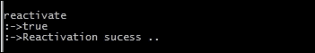

### 重新激活命令的实施

`passivate`命令的实现如下：

```java
package org.redisch7.gossipserver.commands;
/* OMITTING THE IMPORT STATEMENTS TO SAVE SPACE */
public class ReactivateCommand extends AbstractCommand {
  Validator validator = new Validator();
  public ReactivateCommand() {
    validator.configureTemplate().add((new StringToken("reactivate")));
  }
  @Override
  public CheckResult execute(CommandTokens commandTokens) {
    CheckResult checkResult = new CheckResult();
    validator.setInput(commandTokens);
    checkResult = validator.validate();
    if (checkResult.getResult()) {
      List<Token> tokenList = validator.getAllTokens();
      checkResult = new ReactivateCommandHandler(this.getName()).process(tokenList);
    }
    return checkResult;
  }
}
```

### ReactivateCommandHandler 的实现

`reactivate`命令处理程序实现如下：

```java
package org.redisch7.gossipserver.commandhandlers;
/* OMITTING THE IMPORT STATEMENTS TO SAVE SPACE */
public class ReactivateCommandHandler extends AbstractCommandHandler {
  public ReactivateCommandHandler(String nodename) {
    super(nodename);
  }
  public CheckResult process(List<Token> tokenList) {
    CheckResult checkResult = new CheckResult();
    JedisUtil jedisUtil = new JedisUtil();
    List<Boolean> result = jedisUtil.doesExist(this.getNodename(), Arrays
        .asList(ConstUtil.registerationHolder,
            ConstUtil.activationHolder,
            ConstUtil.passivationHolder, ConstUtil.shutdownHolder));
    if ((result.get(0) == true) && (result.get(1) == false)
        && (result.get(2) == true) && (result.get(3) == false)) {
      checkResult = jedisUtil.reactivateNode(this.getNodename());
    } else {
      checkResult
          .setFalse("Passivation Validation :")
          .appendReason(
              ConstUtil.registerationHolder + " = "
                  + ((Boolean) result.get(0)))
          .appendReason(
              ConstUtil.activationHolder + " = "
                  + ((Boolean) result.get(1)))
          .appendReason(
              ConstUtil.passivationHolder + " = "
                  + ((Boolean) result.get(2)));
    }
    return checkResult;
  }
}
```

## 存档命令

此`command`将存档八卦服务器生态系统中节点的数据。执行此命令的前提条件是节点应处于注册模式。当发出此命令时，节点配置存储中的数据将被刷新并放入客户机节点机器文件系统中的存档文件中。


归档命令中数据流的顺序

此命令的语法为：`archive`。以下屏幕截图显示了 shell 控制台中的响应：


### ArchiveCommand 的实现

`archive`命令的实现如下代码段所示：

```java
package org.redisch7.gossipserver.commands;
/* OMITTING THE IMPORT STATEMENTS TO SAVE SPACE */
public class ArchiveCommand extends AbstractCommand {
  private Validator validator = new Validator();
  public ArchiveCommand() {
    validator.configureTemplate().add((new StringToken("archive")));
  }
  @Override
  public CheckResult execute(CommandTokens commandTokens) {
    CheckResult checkResult = new CheckResult();
    validator.setInput(commandTokens);
    checkResult = validator.validate();
    if (checkResult.getResult()) {
      List<Token> tokenList = validator.getAllTokens();
      checkResult = new ArchiveCommandHandler(this.getName()).process(tokenList);
    }
    return checkResult;
  }
}
```

### ArchiveCommandHandler 的实现

`reactive`命令处理程序的实现如以下代码段所示：

```java
package org.redisch7.gossipserver.commandhandlers;
/* OMITTING THE IMPORT STATEMENTS TO SAVE SPACE */
public final class ArchiveCommandHandler extends AbstractCommandHandler {
  public ArchiveCommandHandler(String nodename) {
    super(nodename);
  }
  @Override
  public CheckResult process(List<Token> tokenList) {
    CheckResult checkResult = new CheckResult();
    JedisUtil jedisUtil = new JedisUtil();
    List<Boolean> result = jedisUtil
        .doesExist(this.getNodename(), Arrays
            .asList(ConstUtil.registerationHolder,
                ConstUtil.activationHolder,
                ConstUtil.passivationHolder, ConstUtil.shutdownHolder));
    if ((result.get(0) == true)
        &&  (result.get(3) == false) &&((result.get(1) == true) || (result.get(2) == true))) {
      checkResult = jedisUtil.archiveNode(this.getNodename());
    } else {
      checkResult
          .setFalse("Activation Validation :")
          .appendReason(
              ConstUtil.registerationHolder + " = "
                  + (result.get(0)))
          .appendReason(
              ConstUtil.activationHolder + " = "
                  + (result.get(1)))
          .appendReason(
              ConstUtil.passivationHolder + " = "
                  + (result.get(2)));
    }
    return checkResult;
  }
}
```

## 同步命令

`sync`命令将同步八卦服务器生态系统中某个节点的数据。执行此命令的前提条件是节点应处于注册模式。发出此命令时，归档文件中的数据将被抽回用户的配置存储区。


同步命令中的数据流顺序

此命令的语法为：`sync`。以下屏幕截图显示了 shell 控制台中的响应：

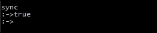

### 同步命令的执行

`sync`命令的实现如下：

```java
package org.redisch7.gossipserver.commands;
/* OMITTING THE IMPORT STATEMENTS TO SAVE SPACE */
public class SynchCommand extends AbstractCommand {
  Validator validator = new Validator();
  public SynchCommand() {
    validator.configureTemplate().add((new StringToken("sync")));
  }
  @Override
  public CheckResult execute(CommandTokens commandTokens) {
    CheckResult checkResult = new CheckResult();
    validator.setInput(commandTokens);
    checkResult = validator.validate();
    if (checkResult.getResult()) {
      List<Token> tokenList = validator.getAllTokens();
      checkResult = new SynchCommandHandler(this.getName()).process(tokenList);
    }
    return checkResult;
  }
}
```

### SyncCommandHandler 的实现

`sync`命令处理程序的实现如以下代码段所示：

```java
package org.redisch7.gossipserver.commandhandlers;
/* OMITTING THE IMPORT STATEMENTS TO SAVE SPACE */
public class SynchCommandHandler extends AbstractCommandHandler {
  public SynchCommandHandler(String nodename) {
    super(nodename);
  }
  public CheckResult process(List<Token> tokenList) {
    CheckResult checkResult = new CheckResult();
    JedisUtil jedisUtil = new JedisUtil();
    List<Boolean> result = jedisUtil
        .doesExist(this.getNodename(), Arrays
            .asList(ConstUtil.registerationHolder,
                ConstUtil.activationHolder,
                ConstUtil.passivationHolder, ConstUtil.shutdownHolder));
    if (result.get(0) && result.get(1) && (result.get(3)==false)) {
      checkResult = jedisUtil.syncNode(this.getNodename());
    } else {
      checkResult.setFalse("Synch Failed ");
    }
    return checkResult;
  }
}
```

## 重新连接命令

`reconnect`命令将重新连接八卦服务器生态系统中的节点。执行此命令的前提条件是节点应处于激活状态，并且节点应已关闭。因此，当该节点在关闭后出现并触发该命令时，客户端节点的侦听器将生成，节点将返回到激活状态。

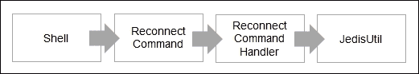

重新连接命令中的数据流顺序

此命令的语法为：`reconnect`。以下屏幕截图显示了 shell 控制台中的响应：


### 执行重联命令

`reconnect`命令实现如下：

```java
package org.redisch7.gossipserver.commands;
/* OMITTING THE IMPORT STATEMENTS TO SAVE SPACE */
public class ReConnectCommand extends AbstractCommand {
  Validator validator = new Validator();
  public ReConnectCommand() {
    validator.configureTemplate().add((new StringToken("reconnect")));
  }
  @Override
  public CheckResult execute(CommandTokens commandTokens) {
    CheckResult checkResult = new CheckResult();
    validator.setInput(commandTokens);
    checkResult = validator.validate();
    if (checkResult.getResult()) {
      List<Token> tokenList = validator.getAllTokens();
      checkResult = new ReConnectCommandHandler(this.getName()).process(tokenList);
    }
    return checkResult;
  }
}
```

### 重新连接 CommandHandler 的实现

`reconnect`命令处理程序的实现如以下代码段所示：

```java
package org.redisch7.gossipserver.commandhandlers;
/* OMITTING THE IMPORT STATEMENTS TO SAVE SPACE */
public class ReConnectCommandHandler extends AbstractCommandHandler {
  public ReConnectCommandHandler(String nodename) {
    super(nodename);
  }
  @Override
  public CheckResult process(List<Token> tokenList) {
    CheckResult checkResult = new CheckResult();
    JedisUtil jedisUtil = new JedisUtil();
    List<Boolean> result = jedisUtil.doesExist(this.getNodename(), Arrays
        .asList(ConstUtil.registerationHolder,
            ConstUtil.activationHolder,
            ConstUtil.passivationHolder, ConstUtil.shutdownHolder));
    if ((result.get(0) == true)
        && ((result.get(1) == false) || (result.get(2) == false))
        && (result.get(3) == true)) {
      checkResult = jedisUtil.reconnectNode(this.getNodename());
    } else {
      checkResult
          .setFalse("Reconnect Failed :")
          .appendReason(
              ConstUtil.registerationHolder + " = "
                  + (result.get(0)))
          .appendReason(
              ConstUtil.activationHolder + " = "
                  + (result.get(1)))
          .appendReason(
              ConstUtil.passivationHolder + " = "
                  + (result.get(2)));
    }
    return checkResult;
  }
}
```

# 主节点命令

以下是可从主节点触发的命令列表：

*   `start`命令
*   `status`命令
*   `get`命令
*   `msg`命令
*   `kill`命令
*   `clone`命令
*   `stop`命令

让我们从设计和实现的角度来看每一个命令。

## 启动命令

`start`命令将启动八卦服务器生态系统中的主节点。执行此命令的前提条件是节点名称应是唯一的。

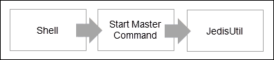

Start 命令中的数据流顺序

此命令的语法为：`start`。下面的屏幕截图显示了shell 控制台中的响应：


### StartMaster 命令的执行

`start`命令的实现如下：

```java
package org.redisch7.gossipserver.commands;
/* OMITTING THE IMPORT STATEMENTS TO SAVE SPACE */
public class StartMasterCommand extends AbstractCommand {
  private Validator validator = new Validator();
  public StartMasterCommand() {
    validator.configureTemplate().add((new StringToken("start")));
  }
  @Override
  public CheckResult execute(CommandTokens commandTokens) {
    CheckResult checkResult = new CheckResult();
    validator.setInput(commandTokens);
    return checkResult.setTrue().appendReason("master started..");
  }
}
```

## 停止命令

`stop`命令将停止八卦服务器生态系统中的主节点。执行此命令的前提条件是节点应处于启动模式。

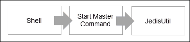

Start 命令中的数据流顺序

此代码的语法为：`stop`。下面的屏幕截图显示了shell 控制台中的响应：


### StopMaster 命令的执行

`stop`命令的实现如下代码段所示：

```java
package org.redisch7.gossipserver.commands;
/* OMITTING THE IMPORT STATEMENTS TO SAVE SPACE */
public class StopMasterCommand extends AbstractCommand {
  private Validator validator = new Validator();
  public StartMasterCommand() {
    validator.configureTemplate().add((new StringToken("stop")));
  }
  @Override
  public CheckResult execute(CommandTokens commandTokens) {
    CheckResult checkResult = new CheckResult();
    validator.setInput(commandTokens);
    return checkResult.setTrue().appendReason("master stoped..");
  }
}
```

## 状态命令

`status`命令将显示八卦服务器生态系统中节点的当前状态。

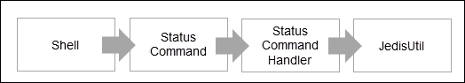

Status 命令中的数据流顺序

此命令的语法为：`status`。以下屏幕截图显示了 shell 控制台中的响应：

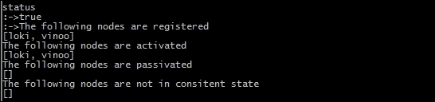

### 状态命令的执行

`status`命令实现如下：

```java
package org.redisch7.gossipserver.commands;
/* OMITTING THE IMPORT STATEMENTS TO SAVE SPACE */
public class StatusCommand extends AbstractCommand {
  Validator validator = new Validator();
  public StatusCommand() {
    validator.configureTemplate().add((new StringToken("status")));
  }
  @Override
  public CheckResult execute(CommandTokens commandTokens) {
    CheckResult checkResult = new CheckResult();
    validator.setInput(commandTokens);
    checkResult = validator.validate();
    if (checkResult.getResult()) {
      List<Token> tokenList = validator.getAllTokens();
      checkResult = new StatusCommandHandler(this.getName()).process(tokenList);
    }
    return checkResult;
  }
}
```

### StatusCommandHandler 的实现

`status`命令处理程序的实现如以下代码段所示：

```java
package org.redisch7.gossipserver.commandhandlers;
/* OMITTING THE IMPORT STATEMENTS TO SAVE SPACE */
public class StatusCommandHandler extends AbstractCommandHandler {
  public StatusCommandHandler(String nodename) {
    super(nodename);
  }
  @Override
  public CheckResult process(List<Token> tokenList) {
    CheckResult checkResult = new CheckResult();
    JedisUtil jedisUtil = new JedisUtil();
    if (this.getNodename().equals("master")) {
      List<String> registerednames = jedisUtil.getAllNodesFromRegistrationHolder();
      checkResult.setTrue().appendReason("The following nodes are registered ");
      checkResult.appendReason(registerednames.toString());
      List<String> activenodenames = jedisUtil.getAllNodesFromActivatedHolder();
      checkResult.setTrue().appendReason("The following nodes are activated ");
      checkResult.appendReason(activenodenames.toString());
      List<String> passivenodenames = jedisUtil.getAllNodesFromPassivatedHolder();
      checkResult.setTrue().appendReason("The following nodes are passivated ");
      checkResult.appendReason(passivenodenames.toString());
      List<String> inconsistentState = jedisUtil.getAllNodesInInconsistentState();
      checkResult.setTrue().appendReason("The following nodes are not in consitent state ");
      checkResult.appendReason(inconsistentState.toString());
    } else {
      checkResult = jedisUtil.getStatus(this.getNodename());
    }
    return checkResult;
  }
}
```

## get 命令

`get`命令将显示在八卦服务器生态系统中注册的所有节点的状态。

此命令的语法为：`get <field1>,<field2> where nodes are <nodename1>,<nodename2>`。

以下屏幕截图显示了 shell 控制台中的响应：


### GetNodeDataCommand 的实现

`get`命令的实现如下代码段所示：

```java
package org.redisch7.gossipserver.commands;
/* OMITTING THE IMPORT STATEMENTS TO SAVE SPACE */
public class GetNodeDataCommand extends AbstractCommand {
  private Validator validator = new Validator();
  public GetNodeDataCommand() {
    validator.configureTemplate().add((new StringToken("get"))).add(new StringListToken()).add(new StringToken("where"))
        .add(new StringToken("nodes")).add(new StringToken("are")).add(new StringListToken());
  }
  @Override
  public CheckResult execute(CommandTokens commandTokens) {
    CheckResult checkResult = new CheckResult();
    validator.setInput(commandTokens);
    checkResult = validator.validate();
    if (checkResult.getResult()) {
      List<Token> tokenList = validator.getAllTokens();
      checkResult = new GetNodeDataCommandHandler(this.getName()).process(tokenList);
    }
    return checkResult;
  }
}
```

### GetNodeDataCommandHandler 的实现

`get`命令处理程序实现如下：

```java
package org.redisch7.gossipserver.commandhandlers;
/* OMITTING THE IMPORT STATEMENTS TO SAVE SPACE */
public class GetNodeDataCommandHandler extends AbstractCommandHandler {
  public GetNodeDataCommandHandler(String nodename) {
    super(nodename);
  }
  @Override
  public CheckResult process(List<Token> tokenList) {
    CheckResult checkResult = new CheckResult();
    StringListToken gettersstringListToken = (StringListToken) tokenList
        .get(1);
    StringListToken nodesstringListToken = (StringListToken) tokenList
        .get(5);
    List<String> nodeList = nodesstringListToken.getValueAsList();
    JedisUtil jedisUtil = new JedisUtil();
    for (String nodename : nodeList) {
      List<Boolean> result = jedisUtil.doesExist(nodename, Arrays.asList(
          ConstUtil.registerationHolder, ConstUtil.activationHolder,
          ConstUtil.passivationHolder, ConstUtil.shutdownHolder));
      if ((result.get(0) == true) && (result.get(1) == true)
          && (result.get(2) == false)&& (result.get(3) == false)) {
        CheckResult chkresult = jedisUtil.getValuesFromNode(nodename,
            gettersstringListToken.getValueAsList());
        checkResult.setTrue()
            .appendReason("The results for " + nodename + " :")
            .appendReason(chkresult.getReason());
      } else {
        checkResult
            .appendReason("The node where the GET didn't work is as follows: ");
        checkResult
            .setFalse(
                "Activation Validation for " + nodename + " :")
            .appendReason(
                ConstUtil.registerationHolder + " = "
                    + (result.get(0)))
            .appendReason(
                ConstUtil.activationHolder + " = "
                    + (result.get(1)))
            .appendReason(
                ConstUtil.passivationHolder + " = "
                    + (result.get(2)));
      }
    }
    return checkResult;
  }
}
```

## msg 命令

`msg`命令用于向八卦服务器生态系统中的节点发送消息。执行此命令的前提条件是主节点应处于启动模式。


消息命令中数据流的顺序


主节点和客户端节点之间的消息传递

此命令的语法为：`mgs <node name> where command = set, field 1, field 2`。

下面的截图显示了主 shell 控制台中的响应：


客户端节点（`vinoo`中的响应如下：


### MessageCommand 的实现

`MessageCommand`的实现如下：

```java
package org.redisch7.gossipserver.commands;
/* OMITTING THE IMPORT STATEMENTS TO SAVE SPACE */
public class MessageCommand extends AbstractCommand {
  Validator validator = new Validator();
  public MessageCommand() {
    validator.configureTemplate().add((new StringToken("msg"))).add(new StringToken()).add(new StringToken("where"))
        .add(new MapListToken());
  }
  @Override
  public CheckResult execute(CommandTokens commandTokens) {
    CheckResult checkResult = new CheckResult();
    validator.setInput(commandTokens);
    checkResult = validator.validate();
    if (checkResult.getResult()) {
      List<Token> tokenList = validator.getAllTokens();
      checkResult = new MessageCommandHandler(this.getName()).process(tokenList);
    }
    return checkResult;
  }
}
```

### MessageCommandHandler 的实现

`messageCommandHandler`是实现的，如下代码段所示：

```java
package org.redisch7.gossipserver.commandhandlers;
/* OMITTING THE IMPORT STATEMENTS TO SAVE SPACE */
public class MessageCommandHandler extends AbstractCommandHandler {
  public MessageCommandHandler(String nodename) {
    super(nodename);
  }
  public CheckResult process(List<Token> tokenList) {
    CheckResult checkResult = new CheckResult();
    JedisUtil jedisUtil = new JedisUtil();
    List<Boolean> result = jedisUtil.doesExist(this.getNodename(), Arrays
        .asList(ConstUtil.registerationHolder,
            ConstUtil.activationHolder,
            ConstUtil.passivationHolder, ConstUtil.shutdownHolder));
    if (this.getNodename().equals("master")
        || ((result.get(0) == true) && (result.get(1) == true) && (result
            .get(2) == false)&& (result.get(3) == false))) {
      StringToken channel = (StringToken) tokenList.get(1);
      MapListToken data = (MapListToken) tokenList.get(3);
      checkResult = jedisUtil.publish(channel.getValue(),
          data.getValueAsMap());
    } else {
      checkResult
          .setFalse("Activation Validation :")
          .appendReason(
              ConstUtil.registerationHolder + " = "
                  + ((Boolean) result.get(0)))
          .appendReason(
              ConstUtil.activationHolder + " = "
                  + ((Boolean) result.get(1)))
          .appendReason(
              ConstUtil.passivationHolder + " = "
                  + ((Boolean) result.get(2)));
    }
    return checkResult;
  }
}
```

## 杀戮命令

`kill`命令用于杀死八卦服务器生态系统中的节点。执行此命令的前提是主节点应处于启动模式。在这里，我们将通过`msg`命令执行此操作。


Kill 命令中的数据流顺序

此命令的语法为：`mgs <node name> where command = kill`

下面的屏幕截图显示了主 shell控制台中的响应：

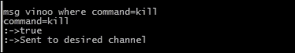

客户端节点（`vinoo`中的响应如下：


### KillNodeCommand 的实现

`kill`命令的实现如下：

```java
package org.redisch7.gossipserver.commands;
/* OMITTING THE IMPORT STATEMENTS TO SAVE SPACE */
public class KillNodeCommand extends AbstractCommand {
  private Validator validator = new Validator();
  public KillNodeCommand() {
    validator.configureTemplate().add((new StringToken("kill")))
        .add(new StringToken());
  }
  @Override
  public CheckResult execute(CommandTokens commandTokens) {
    CheckResult checkResult = new CheckResult();
    validator.setInput(commandTokens);
    checkResult = validator.validate();
    if (checkResult.getResult()) {
      List<Token> tokenList = validator.getAllTokens();
      checkResult = new KillNodeCommandHandler(this.getName())
          .process(tokenList);
      if (checkResult.getResult()) {
        String path = System.getProperty("user.home") + "\\archive\\"
            + this.getName() + ".json";
        File file = new File(path);
        if (file.exists()) {
          if (file.delete()) {
            System.exit(0);
          } else {
            checkResult.appendReason("Archive file for "
                + this.getName()
                + ".json could not get deleted!");
          }
        }
      }
    }
    return checkResult;
  }
}
```

### KillNodeCommandHandler 的实现

`Kill`命令处理程序的实现如以下代码段所示：

```java
package org.redisch7.gossipserver.commandhandlers;
/* OMITTING THE IMPORT STATEMENTS TO SAVE SPACE */
public class KillNodeCommandHandler extends AbstractCommandHandler {
  public KillNodeCommandHandler(String nodename) {
    super(nodename);
  }
  public CheckResult process(List<Token> tokenList) {
    CheckResult checkResult = new CheckResult();
    JedisUtil jedisUtil = new JedisUtil();
    List<Boolean> result = jedisUtil.doesExist(this.getNodename(),
        Arrays.asList(ConstUtil.registerationHolder,ConstUtil.shutdownHolder));
    if ((result.get(0)) && (result.get(1) == false)) {
      checkResult = jedisUtil.killNode(this.getNodename());
    } else {
      checkResult.setFalse("Kill node failed ");
    }
    return checkResult;
  }
}
```

## 克隆命令

`clone`命令用于克隆八卦服务器生态系统中的节点。执行此命令的前提是主节点应处于启动模式，且至少有两个客户端节点应处于激活模式。


Clone 命令中的数据流顺序

此代码的语法为：`mgs <node name> where command = clone, target =<node name>, source=<node name>`。

以下屏幕截图显示了主 shell 控制台中的响应：

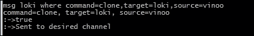

这是客户端节点（`loki`中的响应：


此时，源节点中的所有属性都将复制到目标节点。

### 执行 clonenode 命令

`clone`命令的实现如下：

```java
package org.redisch7.gossipserver.commands;
/* OMITTING THE IMPORT STATEMENTS TO SAVE SPACE */
public class CloneNodeCommand extends AbstractCommand {
       private Validator validator = new Validator();
       public CloneNodeCommand() {
    validator.configureTemplate().add((new StringToken("clone"))).add(new StringToken())
        .add(new StringToken("from")).add(new StringToken());
}
@Override
  public CheckResult execute(CommandTokens commandTokens) {
    CheckResult checkResult = new CheckResult();
    validator.setInput(commandTokens);
    checkResult = validator.validate();
    if (checkResult.getResult()) {
      List<Token> tokenList = validator.getAllTokens();
      checkResult = new CloneNodeCommandHandler(this.getName()).process(tokenList);
    }
    return checkResult;
  }
}
```

### CloneNodeCommandHandler 的实现

`cloneCommandHandler`实现为，如下代码段所示：

```java
package org.redisch7.gossipserver.commandhandlers;
/* OMITTING THE IMPORT STATEMENTS TO SAVE SPACE */
public class CloneNodeCommandHandler extends AbstractCommandHandler {
  public CloneNodeCommandHandler(String nodename) {
    super(nodename);
  }
  public CheckResult process(List<Token> tokenList) {
    CheckResult checkResult = new CheckResult();
    MapListToken maptokens = (MapListToken) tokenList.get(1);
    String target = maptokens.getNValue("target");
    String source = maptokens.getNValue("source");
    JedisUtil jedisUtil = new JedisUtil();
    List<Boolean> target_validity_result = jedisUtil
        .doesExist(target, Arrays
            .asList(ConstUtil.registerationHolder,
                ConstUtil.activationHolder,
                ConstUtil.passivationHolder, ConstUtil.shutdownHolder));
    List<Boolean> source_validity_result = jedisUtil
        .doesExist(source, Arrays
            .asList(ConstUtil.registerationHolder,
                ConstUtil.activationHolder,
                ConstUtil.passivationHolder, ConstUtil.shutdownHolder));
    if ((target_validity_result.get(0) == true)
        && (target_validity_result.get(1) == true)
        && (target_validity_result.get(2) == false)&& (target_validity_result.get(3) == false)) {
      if (((Boolean) source_validity_result.get(0) == true)
          && (source_validity_result.get(1) == true)
          && (source_validity_result.get(2) == false)&& (source_validity_result.get(3) == false)) {
        checkResult = jedisUtil.clone(target, source);
      } else {
        checkResult.setFalse("The source =" + source
            + " is not in a proper state to clone");
      }
    } else {
      checkResult.setFalse("The target =" + target
          + " is not in a proper state to clone");
    }
    return checkResult;
  }}
```

# Redis 配置-数据管理

要在 Redis 中管理数据，了解我们试图构建的应用程序非常重要。由于 gossip 服务器是一个配置服务器，因此读操作将多于写操作。Redis 提供了一些数据持久性机制，我们在前面的章节中已经讨论过了，本节可以作为一个复习。Redis 提供的机制如下：

*   RDB 选项
*   AOF 选项
*   VM 超过提交内存（仅限 LINUX 环境）

## RDB 选项

RDB 选项提供一种定期拍摄数据快照的机制。由于这是一项定期活动，将数据转储到`dump.rdb`文件中，因此进行数据备份是一个不错的选择。对于我们当前的应用程序，RDB 的`redis.conf`文件中的配置可以是以下之一：

*   `save 60 10`：如果更改了 10 个键，则每 1 分钟保存一次数据
*   `save 900 10`：如果更改了 1 个键，则每 15 分钟保存一次数据

## AOF 选项

这适用于所有写操作。默认情况下，AOF 选项将写入数据命令转储到`appendonly.aof`文件。有多种组合可用于向该文件写入命令，但每种策略都附带了性能到数据持久性的附加条款。这意味着 Redis 可以配置为在每次遇到写入命令时写入此文件，但这会使整个过程变慢。将持久性留给底层操作系统以便将缓冲区刷新到此文件可能会使系统失去控制，但这会使应用程序速度非常快。对于 gossip 服务器，配置如下：

*   `appendonly yes`：这将创建一个`appendonly.aof`文件
*   `appendfsync everysec`：每秒调用一次`fsync()`函数

## 虚拟机过度分配内存

这是通过调整 Linux 机箱的`/etc/stsctl.conf`来实现的。此命令将负责在 Linux 机箱中如何进行虚拟内存管理。当调用`BGSAVE`函数，父进程派生子进程时，就会出现问题。按照规则，子进程在共享内存页中的内存将与父进程一样多。因此，如果父进程中的数据发生更改，子进程也需要具有相同的数据集才能刷新到磁盘。如果父级和子级的组合内存需求加起来不等于共享内存，则`BGSAVE`失败。

关于 VM 内存管理的讨论超出了本书的范围。但是，缺少此设置可能会导致 Redis 无法将数据写入磁盘。需要对`/etc/stsctl.conf`进行的更改为：`vm.overcommit_memory=1`。

# 总结

在这个应用程序中，您学习了如何创建配置服务器，也称为 gossip 服务器，它可以存储属性并将信息传递给对等节点。在本章中，我们为客户机节点存储和访问信息以及生命周期做出了规定。此外，我们还提供了一个主节点，它可以控制任何客户端节点。

在接下来的章节中，我们将进一步介绍这一点，并为服务器添加扩展和容错功能。