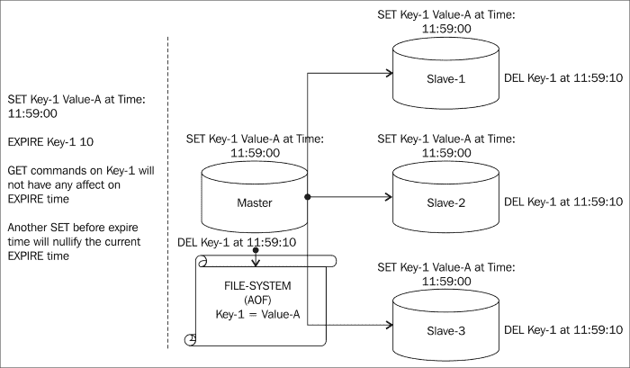
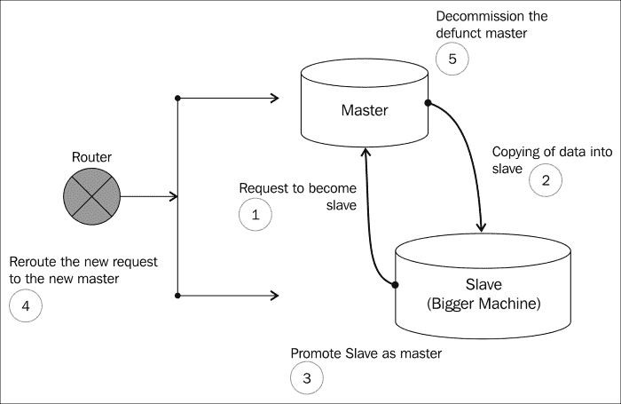
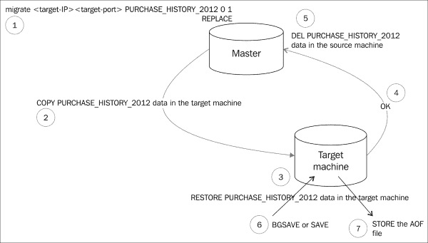

# 第九章维护 Redis

为了维护数据，了解我们将要存储在 Redis 数据存储中的数据非常重要。数据具有各种属性，我们在[第 1 章](1.html "Chapter 1. Introduction to NoSQL")、*NoSQL 简介*中介绍了这些属性，在决定本章数据维护策略时，我们将再次关注其中一个方面。我们将关注的方面是数据的短暂性。

# 维护临时数据

在一定时间段内具有重要意义的数据，本质上是暂时的，可以称为**短暂数据**。这些数据需要在预期的持续时间后从系统中清除，并且必须释放计算机资源，以便为更新的数据集提供可用性。在一些没有内置功能的数据存储中，必须编写脚本和程序来清理它们，或者换句话说，用户有责任清理系统。在我们深入了解 Redis 提供的机制之前，让我们先看看可以称为短暂的数据类型。属于此类别的数据类型如下：

*   **事件数据**：股票行情在一小段时间内具有重要性，然后在所查看的上下文形式中失去其价值。假设一家虚拟公司的科技股在 1300 小时时的价值为 100 美元，对于所有有兴趣计算 1300 小时时科技股的*或*指数的算法而言，该数据非常重要。比如说，1310 小时后，数据的这个值并不重要，因为它是旧数据或日志数据，因此可以被视为临时数据。
*   **瞬时业务数据**：瞬时业务数据，例如促销优惠券折扣是电商业务的重要特征。它们在一段时间内具有重要性，并且在该时间段结束后，这些促销优惠不再存在。同样，这种类型的数据可以归类为临时数据。
*   **会话数据**：每个电子商务都有一个会话处理组件；基本上是维护的数据，用于记录注册用户与门户交互时生成的数据。

处理短暂数据的策略在 Redis 中很容易实现。Redis内置了一个名为**生存时间**（**TTL**的功能，或者另一个选项是 P-TTL，它以毫秒分辨率返回数据，更精确。此功能将数据保留在内存中一段指定的时间，时间结束后，数据将被清除。Redis 有一个内置的进程，该进程持续监视具有指定 TTL 并在循环中移动的数据，在持续时间结束后清理数据。

Redis 中 TTL 进程的图解表示法

如果未指定 TTL/PTTL，另一种清除数据的机制是使用`EXPIRE`或`PEXPIRE`命令。由于数据不稳定，这些命令在按键上设置超时。`PEXPIRE`中发生的一件有趣的事情是，如果一个键被分配了一个值和一个`EXPIRE`时间，并且如果在这个时间过去之前再次设置该值，那么`EXPIRE`时间属性被删除。

对于集群环境中的`PEXPIRE`命令，密钥的 DEL 命令被发送到所有从节点和节点的**只追加文件**（**AOF**）。Redis 确保将其从所有位置删除，无论是在内存中（例如，在从机中）还是在文件系统中（例如，在 AOF 中）。

集群环境中 EXPIRE 命令的图示

TTL 的行为类似于集群环境中的`EXPIRE`命令。

# 维护非物理数据

非参数类型的数据不依赖于时间，并且在系统中始终有用。由于此类数据与时间无关，因此数据可能会在适当的时间内增加。这在 Redis 中可能会有问题，因为数据存储在 Redis 的内存中。处理和维护这些非物理数据对于 Redis 的维护至关重要，因为在我们的头脑深处，我们必须牢记可用内存和数据可用性。

Redis 提供了一些功能来处理前面讨论的场景，即数据存储以惊人的速度增长，因为它可能会超出可用内存。在这种情况下，添加更多的 RAM 可以解决这个问题，或者我们可以使用一种称为分片的编程技术分发数据集。但是，在本章中，我们将讨论一种维护活动应用程序中不需要但需要存储的数据的机制。

让我们看看一些内置的技术或机制来管理 Redis 中的数据，以及它在已发布版本上的发展路线图。

## Redis 2.4

Redis 具有内置的在 RAM 和文件系统（磁盘或 SSD）之间交换数据集的功能（从 2.4 开始就不推荐使用）。Redis 的这种能力被称为**虚拟内存**（**虚拟机**。可通过在配置文件中启用`vm-enabled yes`来配置此功能。

为了理解这个特性，让我们将 Redis 中的整个数据集想象成一个基于上次访问的数据排序的 bucket。这里，last accessed 指的是它最后一次被修改或访问的实例。访问最少的数据集被推送到磁盘。这样就为频繁访问的数据集保留了空间。如果再次访问已推送的数据集，则该数据集将被带回主存，并将访问次数最少的第二个数据推送到磁盘。下图显示了启用 VM 时的幕后活动：

对支持 VM 的系统的数据集处理的一种简单表示

### 注

请注意，推送到磁盘的是值，而不是键。钥匙总是在记忆中。

此 VM 选项适用于包含针对密钥的大型数据集的业务数据。当存在一种使用模式，其中随着时间的推移，某些数据的访问频率会降低时，此选项也很有用。

此 VM 选项也适用于存在大量可能超出内存的键值对的情况。在这种情况下，我们可以将这些键值合并到散列中。例如，假设我们正在维护客户记录，如下所示：

*   *客户 1 作为（关键）和一些客户数据“ABC”作为（价值）*
*   *客户 2 为（键），部分客户数据“XYZ”为（值）*
*   *客户 3 as（键）和部分客户数据“123”as（值）*
*   *客户 4 as（键）和一些客户数据“AQ@”as（值）*

如果我们继续以这种方式存储数据，那么如果客户数据增长，我们就有空间（内存）不足的危险（尽管这对业务有好处，但对支持它的技术团队来说却不太好）。存储此客户数据的更好方法是散列。

客户存储将为`(KEY)`，相应的客户值将为`(HASHES)`类型，并包含以下数据：

*   *客户 3 as（键）和部分客户数据“123”as（值）*
*   *客户 4 as（键）和一些客户数据“AQ@”as（值）*
*   *客户 1 作为（关键）和一些客户数据“ABC”作为（价值）*
*   *客户 2 为（键），部分客户数据“XYZ”为（值）*

如果我们以这种方式存储值，在最坏的情况下，整个值数据集将被推送到磁盘，如果需要的话，可以再次返回内存。

要配置除`vm-enabled yes`之外的 VM 功能，需要研究以下配置：

*   `vm-max-threads`：提供在内存和磁盘之间执行 I/O 活动的最大线程数。将该值设置为`0`将使管理客户机请求的单个线程负担过重，从而暂停整个进程并将数据集加载回主存。
*   `vm-max-memory`：此选项告知 Redis 服务器存储数据集应保留的内存量。一旦达到此阈值，它就开始将数据集从内存交换到磁盘。
*   `vm-swap-file`：此设置提供文件系统中可以转储数据集的位置。
*   `vm-pages`：此设置将提示 Redis 服务器交换文件需要创建的页数。
*   `vm-page-size`：此设置将提示 Redis 服务器分配用于存储值数据集的磁盘存储量。`vm-pages`和`vm-page-size`的组合对于存储和更快地从磁盘检索数据集非常重要。

在以性能为重且存在使用 VM 选项的限制的商业案例场景中，可以通过使用**固态设备**（**SSD**来提高性能。与磁盘相比，这些设备具有更快的读写速度，而磁盘的读写速度受到磁盘读写速度的限制。

### 注

请注意，从 Redis 2.4 开始，VM 选项将被弃用。

## Redis 2.6 至 2.8

与版本 2.4 不同，VM 选项是处理较新版本中大于内存的数据的出路，最好清除数据并将其存储在单独的位置（此处，位置可以是不同的实例或文件系统）。VM 选项中面临的问题在较新版本中得到了解决。

### 转储并恢复

对于 Redis 版本 2.6，机制之一是发出`Dump`key 命令，该命令将返回密钥数据的序列化版本。该数据可以在 Redis 的目标实例中与`Restore`命令一起使用，从中可以转换为可读数据。如前所述，处理大型数据的最佳模式是收集集合中的键值（如哈希），然后对其进行操作以管理数据。

下图是处理数据（不再访问数据，但需要保存在系统中）时可以采取的操作的简单表示：

DUMP 和 RESTORE 命令的图示

将键和值存储在集合（如散列）中的好处是，您可以触发一个命令，该命令将作用于整个集合，然后使用一个命令将其还原回来。当您已经有一袋需要清除的数据时，此技术非常有用。但是，当您想要存储整个数据集时，您必须研究*快照*，这将在后面讨论。

这个机制有一个警告；也就是说，它以序列化的 RDB 版本记录数据，因此此序列化数据不能用于任何其他 Redis 版本。

### 快照

处理大型数据集的内置技术是称为*快照*。如前几章所述，这种技术用于在 AOF 中持久化数据。此进程将按照配置文件中的指定将数据转储到 AOF 中。实现这一点的方法和机制是执行命令，以便在后台（`BGSAVE`或前台（`SAVE`中）将数据转储到文件中。在高度并发的环境中，如果这些活动对系统性能造成压力，解决这个问题的一个聪明方法是使用一台更大的机器。

引入一台更大的机器，并在压力下将其作为节点（主节点）的从属设备，并在适当的时间将提升为主节点。因此，现在整个数据集都在一台拥有更多资源的更大机器中。下图是整个活动的简单表示。在许多生产环境中，由于数据层通常位于路由器后面，因此通常使用路由器进行流量切换，而不是依靠 Sentinel 进行切换。在不存在路由器的环境中，可以使用 Sentinel 来制作交换机，其过程已在前几章中介绍过。

将数据从小型计算机迁移到大型计算机的简单表示

## Redis 3.0

另一种将Redis 数据集限制在可用内存内的机制是清除旧数据。Redis 没有清除数据的内置机制；相反，它具有`MIGRATE`和`RESTORE`数据的组合。让我们详细看看这个过程。

假设我们有一个散列集合，它保存了 2012 年所有客户的购买历史记录；因此，该键通常类似于**PURCHASE_HISTORY_2012】**，并且该值将是数据集的散列，包含客户 ID 作为键，客户购买详细信息作为值。

要迁移的键值数据集的表示形式

同样地，**采购历史记录【2013】**、**采购历史记录【2014】**和**采购历史记录【2015】**将在随后的年份中进行维护。任何显示用户过去 4 年的购买数据的业务需求，比如说**Customer-a**，都将从 2012、2013、2014 和 2015 年的关键数据中选取数据。业务需求将附加这些年的数据，从而形成复合响应。现在，在 2016 年，将创建另一个键，但用于获取**Customer-A**的购买历史记录的相同功能将从键中选择 2013、2014、2015 和 2016 年的数据。在这种情况下，**购买历史记录**将被省略，但出于法律原因，我们不能删除它。然而，它占用了在线系统中的内存空间。在这个场景中，我们可以发出`MIGRATE`命令，它是`DUMP`和`DEL`的组合。当我们在内部发出`MIGRATE`命令时，Redis 会发出`DUMP`键，将数据和 I/O 序列化到目标实例中。一旦目标实例被还原，序列化密钥将向源机器发送一个`OK`命令，源机器可以删除**PURCHASE_HISTORY_2012**密钥。我们现在可以在目标实例中发出一个`SAVE`命令，并生成一个 AOF 文件，如果需要，可以将其存储在文件系统中以供以后参考。

下面的图表示给定密钥的数据迁移：

Redis 中迁移过程的表示

### 注

请注意，`MIGRATE`命令将在 Redis 3.0 版本中工作。

# 总结

在本章中，您看到了在 Redis 中维护数据的各种机制，可以使用 Redis 中的内置功能，也可以使用智能机制来实现。