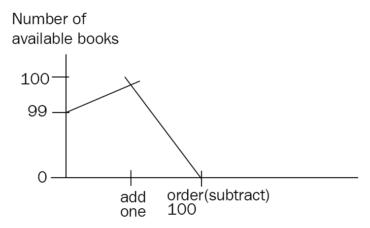

# 三、MongoDB CRUD 操作

在本章中，我们将学习如何使用 MongoShell 进行数据库管理操作。从简单的**创建、****读取、****更新、删除****CRUD**操作开始，我们将从 shell 中掌握脚本。我们还将学习如何从 shell 编写 MapReduce 脚本，并将其与聚合框架进行对比，我们将在[第 6 章](06.html)、*聚合*中深入探讨。最后，我们将探索使用 MongoDB 社区及其付费对应方企业版进行身份验证和授权。

在本章中，我们将介绍以下主题：

# 使用外壳的积垢

mongo shell 相当于关系数据库使用的管理控制台。连接到 mongo shell 非常简单，只需键入以下代码即可：

```js
$ mongo
```

在独立服务器或副本集的命令行中键入此选项。在 shell 中，只需键入以下代码即可查看可用数据库：

```js
$ db
```

然后，您可以通过键入以下代码连接到数据库：

```js
> use <database_name>
```

mongo shell 可用于查询和更新数据库中的数据。在`books`集合中插入此文档的操作如下：

```js
> db.books.insert({title: 'mastering mongoDB', isbn: '101'})
WriteResult({ "nInserted" : 1 })
```

然后，我们可以通过键入以下内容从名为`books`的集合中查找文档：

```js
> db.books.find()
{ "_id" : ObjectId("592033f6141daf984112d07c"), "title" : "mastering mongoDB", "isbn" : "101" }
```

从 MongoDB 返回的结果告诉我们写入成功并在数据库中插入了一个新文档。

删除此文档具有类似的语法，并产生以下代码：

```js
> db.books.remove({isbn: '101'})
WriteResult({ "nRemoved" : 1 })
```

您可以尝试更新此文档，如以下代码块所示：

```js
> db.books.update({isbn:'101'}, {price: 30})
WriteResult({ "nMatched" : 1, "nUpserted" : 0, "nModified" : 1 })
> db.books.find()
{ "_id" : ObjectId("592034c7141daf984112d07d"), "price" : 30 }
```

在这里，我们注意到两件事：

*   `update`命令中类似 JSON 格式的字段是我们搜索要更新的文档的查询
*   `WriteResult`对象通知我们，查询匹配了一个文档并修改了一个文档
*   最重要的是，本文档的内容被第二个类似 JSON 的格式化字段的内容完全替换，但我们已经丢失了关于`title`和`isbn`的信息

默认情况下，MongoDB 中的`update`命令将用我们在第二个参数中指定的文档替换我们文档的内容。如果我们想更新文档并添加新字段，我们需要使用`$set`操作符，如下所示：

```js
> db.books.update({isbn:'101'}, {$set: {price: 30}})
WriteResult({ "nMatched" : 1, "nUpserted" : 0, "nModified" : 1 })
```

现在，我们的文档符合我们的预期：

```js
> db.books.find()
{ "_id" : ObjectId("592035f6141daf984112d07f"), "title" : "mastering mongoDB", "isbn" : "101", "price" : 30 }
```

但是，删除文档有几种方式，最简单的方式是通过其独特的`ObjectId`：

```js
> db.books.remove("592035f6141daf984112d07f")
WriteResult({ "nRemoved" : 1 })
> db.books.find()
>
```

您可以在这里看到，当没有结果时，mongo shell 将不会返回除 shell 提示符本身之外的任何内容：`>`。

# mongo shell 的脚本编写

使用内置命令管理数据库很有帮助，但这不是使用 shell 的主要原因。mongo shell 的真正威力来自于它是一个 JavaScript shell。

我们可以在 shell 中声明和分配变量，如下所示：

```js
> var title = 'MongoDB in a nutshell'
> title
MongoDB in a nutshell
> db.books.insert({title: title, isbn: 102})
WriteResult({ "nInserted" : 1 })
> db.books.find()
{ "_id" : ObjectId("59203874141daf984112d080"), "title" : "MongoDB in a nutshell", "isbn" : 102 }
```

在前面的示例中，我们将一个新的`title`变量声明为`MongoDB in a nutshell`，并使用该变量将一个新文档插入到我们的`books`集合中，如下代码所示。

由于它是一个 JavaScript 外壳，我们可以将其用于从数据库生成复杂结果的函数和脚本：

```js
> queryBooksByIsbn = function(isbn) { return db.books.find({isbn: isbn})}
```

使用这一行程序，我们正在创建一个名为`queryBooksByIsbn`的新函数，它接受一个参数，即`isbn`值。利用我们收藏的数据，我们可以使用我们的新功能，通过`isbn`取书，如下代码所示：

```js
> queryBooksByIsbn("101")
{ "_id" : ObjectId("592035f6141daf984112d07f"), "title" : "mastering mongoDB", "isbn" : "101", "price" : 30 }
```

使用 shell，我们可以编写和测试这些脚本。一旦我们满意，我们可以将它们存储在`.js`文件中，并直接从命令行调用它们：

```js
$ mongo <script_name>.js
```

以下是关于这些脚本的默认行为的一些有用说明：

*   写入操作将使用默认的写入关注点`1`，从当前版本开始，它是 MongoDB 的全局关注点。`1`的写入关注点将请求确认写入操作已传播到副本集中的独立`mongod`服务器或主服务器。
*   为了从脚本返回到标准输出的操作中获得结果，我们必须使用 JavaScript 的内置`print()`函数或 mongo 特有的`printjson()`函数，该函数以 JSON 格式输出结果。

# 为 mongo shell 编写脚本与直接使用它之间的区别

在为 mongo shell 编写脚本时，我们不能使用 shell 帮助程序。MongoDB 的命令，如`use <database_name>`、`show collections`和其他助手都内置在 shell 中，因此在执行脚本的 JavaScript 上下文中无法使用。幸运的是，JavaScript 执行上下文中提供了与之等价的代码，如下表所示：

| **贝壳助手** | **JavaScript 等价物** |
| `show dbs, show databases` | `db.adminCommand('listDatabases')` |
| `use <database_name>` | `db = db.getSiblingDB('<database_name>')` |
| `show collections` | `db.getCollectionNames()` |
| `show users` | `db.getUsers()` |
| `show roles` | `db.getRoles({showBuiltinRoles: true})` |
| `show log <logname>` | `db.adminCommand({ 'getLog' : '<logname>' })` |
| `show logs` | `db.adminCommand({ 'getLog' : '*' })` |
| `it` | `cursor = db.collection.find()`
`if ( cursor.hasNext() ){`
` cursor.next();`
`}` |

在上一个表中，`it`是 mongo shell 在查询时返回的迭代游标，返回的结果太多，无法在一个批中显示。

使用 mongo shell，我们几乎可以从客户机编写任何脚本，这意味着我们拥有一个非常强大的工具，可以对数据进行原型设计和快速洞察。

# 使用 shell 进行批插入

在使用 shell 时，我们会多次希望以编程方式插入大量文档。自从我们有了 JavaScript shell 以来，最直接的实现是迭代一个循环，一路上生成每个文档，并在循环中的每次迭代中执行写操作，如下所示：

```js
> authorMongoFactory = function() {for(loop=0;loop<1000;loop++) {db.books.insert({name: "MongoDB factory book" + loop})}}
function () {for(loop=0;loop<1000;loop++) {db.books.insert({name: "MongoDB factory book" + loop})}}
```

在这个简单的例子中，我们为一位在 MongoDB 上写`1000`书的作者创建了一个`authorMongoFactory()`方法，每个作者的名字略有不同：

```js
> authorMongoFactory()
```

这将导致向数据库发出`1000`写入。虽然从开发的角度来看很简单，但这种方法会给数据库带来压力。

相反，使用`bulk`写入，我们可以使用事先准备好的`1000`文档发出单个数据库`insert`命令，如下所示：

```js
> fastAuthorMongoFactory = function() {
var bulk = db.books.initializeUnorderedBulkOp();
for(loop=0;loop<1000;loop++) {bulk.insert({name: "MongoDB factory book" + loop})}
bulk.execute();
}
```

最终结果与之前相同，在我们的`books`集合中插入的`1000`文档结构如下：

```js
> db.books.find()
{ "_id" : ObjectId("59204251141daf984112d851"), "name" : "MongoDB factory book0" }
{ "_id" : ObjectId("59204251141daf984112d852"), "name" : "MongoDB factory book1" }
{ "_id" : ObjectId("59204251141daf984112d853"), "name" : "MongoDB factory book2" }
…
{ "_id" : ObjectId("59204251141daf984112d853"), "name" : "MongoDB factory book999" }
```

从用户的角度来看，不同之处在于执行速度和减少了数据库的压力。

在前面的示例中，我们使用`initializeUnorderedBulkOp()`进行`bulk`operation builder 设置。我们这样做的原因是，我们不关心插入的顺序是否与我们使用`bulk.insert()`命令将它们添加到`bulk`变量的顺序相同。

当我们能够确保所有操作彼此无关或幂等时，这是有意义的。

如果我们关心相同的插入顺序，我们可以使用`initializeOrderedBulkOp()`；通过更改函数的第二行，我们得到以下代码片段：

```js
var bulk = db.books.initializeOrderedBulkOp();
```

# 使用 mongo shell 的批处理操作

在插入的情况下，我们通常可以预期操作顺序并不重要。

然而，`bulk`可以用于比插入更多的操作。在下面的示例中，我们在`bookOrders`收藏中有一本带有`isbn : 101`和`Mastering MongoDB`的`name`的书，在`available`字段中有可购买的可用拷贝数，其中`99`书可购买：

```js
> db.bookOrders.find()
{ "_id" : ObjectId("59204793141daf984112dc3c"), "isbn" : 101, "name" : "Mastering MongoDB", "available" : 99 }
```

在单个`bulk`操作中进行以下一系列操作后，我们将向库存中添加一本书，然后订购`100`本书，最终总共可获得零本：

```js
> var bulk = db.bookOrders.initializeOrderedBulkOp();
> bulk.find({isbn: 101}).updateOne({$inc: {available : 1}});
> bulk.find({isbn: 101}).updateOne({$inc: {available : -100}});
> bulk.execute();
```

通过代码，我们将获得以下输出：



使用`initializeOrderedBulkOp()`，我们可以确保在订购`100`之前添加一本书，这样我们就不会缺货。相反，如果我们使用`initializeUnorderedBulkOp()`，我们将没有这样的保证，我们可能会在添加新书之前收到 100 本书的订单，导致应用程序错误，因为我们没有那么多的书来完成订单。

当通过有序的操作列表执行时，MongoDB 会将操作拆分为`1000`批，并按操作分组。例如，如果我们有`1002`插入、`998`更新、`1004`删除，最后还有`5`插入，我们将得到以下结果：

```js
[1000 inserts]
[2 inserts]
[998 updates]
[1000 deletes]
[4 deletes]
[5 inserts] 
```

The previous code can be explained as follows:


这不会影响一系列操作，但它隐含地意味着我们的操作将以批处理`1000`的方式离开数据库。这种行为不保证在将来的版本中保持不变。

如果我们想检查`bulk.execute()`命令的执行情况，我们可以在键入`execute()`后立即发出`bulk.getOperations()`。

Since version 3.2, MongoDB has offered an alternative command for bulk writes, `bulkWrite()`.

`bulkWrite`参数是我们要执行的一系列操作。`WriteConcern`（默认值也是`1`），如果写入操作系列应按它们在数组中出现的顺序应用（默认情况下，它们将按顺序排列）：

```js
> db.collection.bulkWrite(
 [ <operation 1>, <operation 2>, ... ],
 {
 writeConcern : <document>,
 ordered : <boolean>
 }
)
```

以下操作与`bulk`支持的操作相同：

*   `insertOne`
*   `updateOne`
*   `updateMany`
*   `deleteOne`
*   `deleteMany`
*   `replaceOne`

`updateOne`、`deleteOne`、`replaceOne`有匹配滤波器；如果它们匹配多个文档，则只对第一个文档进行操作。重要的是要设计这些查询，使它们不匹配多个文档，否则，行为将是未定义的。

# 管理

在大多数情况下，使用 MongoDB 应该对开发人员尽可能透明。因为没有模式，所以不需要迁移，而且通常，开发人员发现自己在数据库世界中的管理任务上花费的时间更少。

也就是说，有经验的 MongoDB 开发人员或架构师可以执行一些任务来保持 MongoDB 的速度和性能。

给药一般分为三个不同的层次，从更一般到更具体：**过程**、**收集**和**索引**。

在流程级别，有`shutDown`命令关闭 MongoDB 服务器。

在数据库级别，我们有以下命令：

*   `dropDatabase`
*   `listCollections`
*   `copyDB`或`clone`本地克隆远程数据库
*   `repairDatabase`当我们的数据库由于不干净的关闭而处于不一致的状态时

相比之下，在集合级别，使用了以下命令：

*   `drop`：放弃收藏
*   `create`：创建集合
*   `renameCollection`：对集合进行重命名
*   `cloneCollection`：将远程集合克隆到本地数据库
*   `cloneCollectionAsCapped`：将集合克隆到新集合中
*   `convertToCapped`：将集合转换为上限集合

在索引级别，我们可以使用以下命令：

*   `createIndexes`
*   `listIndexes`
*   `dropIndexes`
*   `reIndex`

我们还将介绍一些从管理角度来看更重要的其他命令。

# 同步

MongoDB 通常每 60 秒将所有操作写入磁盘。fsync 将强制数据立即同步保存到磁盘。

如果要备份数据库，还需要应用锁。锁定将在 fsync 运行时阻止所有写入和某些读取。

在几乎所有情况下，最好使用日志记录并参考我们的备份和恢复技术，这将在[第 8 章](08.html)*、**监控、备份和安全*中介绍，以获得最大的可用性和性能。

# 契约

MongoDB 文档在磁盘上占用指定数量的空间。如果我们执行的更新增加了文档的大小，则可能会将其无序移动到存储块的末尾，从而在存储中造成漏洞，导致此更新的执行时间增加，并且可能会在运行查询时丢失它。压缩操作将对空间进行碎片整理，从而减少使用的空间。

我们可以通过添加额外的 10 个字节来更新文档，显示如何将其移动到存储块的末尾，并在物理存储中创建一个空白空间：


`compact`还可以接受一个`paddingFactor`参数，如下所示：

```js
> db.runCommand ( { compact: '<collection>', paddingFactor: 2.0 } )
```

`paddingFactor`是每个文档中的预分配空间，范围从`1.0`（即无填充，这是默认值）到`4.0`，用于计算初始插入时所需的每个`100`文档空间的`300`字节的填充。

添加填充有助于缓解更新移动文档的问题，但在创建每个文档时需要更多的磁盘空间。通过填充每个文档，我们为它分配了更多的空间，如果我们更新的文档仍然可以放入预分配的存储空间，则可以防止它移动到存储块的末尾。

# currentOp 和 killOp

`db.currentOp()`将向我们显示数据库中当前正在运行的操作，并尝试终止该操作。我们需要在运行`killOp()`之前运行`use admin`命令。不用说，不建议对内部 MongoDB 操作使用`killOp()`，因为数据库可能最终处于未定义状态。`killOp()`命令可按如下方式使用：

```js
> db.runCommand( { "killOp": 1, "op": <operationId> } )
```

# 科尔莫德

`collMod`用于通过修改基础数据库的行为将标志传递给集合。

自 3.2 版以来，我们可以传递给集合的最有趣的标志集是文档验证。

文档验证可以指定要应用于新更新和插入到集合中的一组规则。这意味着，如果当前文档被修改，将对其进行检查。

如果我们将`validationLevel`设置为`moderate`，我们只能对已经有效的文档进行验证。通过指定`validationAction`，我们可以通过将其设置为`warn`来记录无效的文档，或者通过将其设置为`error`来阻止更新的发生。

例如，在前面的`bookOrders`示例中，我们可以在每次插入或更新时存在的`isbn`和`name`字段上设置`validator`，如下代码所示：

```js
> db.runCommand( { collMod: "bookOrders",
"validator" : {
 "$and" : [
 {
 "isbn" : {
 "$exists" : true
 }
 },
 {
 "name" : {
 "$exists" : true
 }
 }
 ]
 }
})
```

在这里，我们返回以下代码：

```js
{ "ok" : 1 }
```

然后，如果我们尝试插入一个只有`isbn`字段的新文档，我们会得到一个错误：

```js
> db.bookOrders.insert({isbn: 102})
WriteResult({
"nInserted" : 0,
"writeError" : {
"code" : 121,
"errmsg" : "Document failed validation"
}
})
>
```

我们得到一个错误，因为我们的验证失败了。从 shell 管理验证非常有用，因为我们可以编写脚本来管理它，还可以确保一切就绪。

# 触摸

`touch`命令将数据和/或索引数据从存储器加载到存储器。如果我们的脚本随后将使用此数据，这通常非常有用，从而加快执行速度：

```js
> db.runCommand({ touch: "bookOrders", data: true/false, index: true/false })
```

在生产系统中应谨慎使用此命令，因为将数据和索引加载到内存中会替换内存中的现有数据。

# mongo shell 中的 MapReduce

在 MongoDB 的历史上，最有趣的功能之一是使用 shell 编写 MapReduce，这一功能一直没有得到充分的重视，也没有得到广泛的支持。

MapReduce 是一种数据处理方法，用于从大型数据集中获取聚合结果。这种方法的主要优点是，它本身就可以作为 Hadoop 等框架的证据进行并行化。

MapReduce 在用于实现数据管道时非常有用。可以链接多个 MapReduce 命令以产生不同的结果。这方面的一个例子是通过使用不同的报告周期（如小时、天、周、月和年）来聚合数据，其中我们使用每个更精细的报告周期的输出来生成一个更精细的报告。

我们的示例中有一个简单的 MapReduce 示例，我们的输入书籍集合如下所示：

```js
> db.books.find()
{ "_id" : ObjectId("592149c4aabac953a3a1e31e"), "isbn" : "101", "name" : "Mastering MongoDB", "price" : 30 }
{ "_id" : ObjectId("59214bc1aabac954263b24e0"), "isbn" : "102", "name" : "MongoDB in 7 years", "price" : 50 }
{ "_id" : ObjectId("59214bc1aabac954263b24e1"), "isbn" : "103", "name" : "MongoDB for experts", "price" : 40 }
```

我们的 map 和 reduce 函数定义如下：

```js
> var mapper = function() {
 emit(this.id, 1);
 };
```

在此`mapper`中，我们只需输出每个文档的`id`键，值为`1`：

```js
> var reducer = function(id, count) {
 return Array.sum(count);
 };
```

在`reducer`中，我们对所有值求和（其中每个值都有`1`：

```js
> db.books.mapReduce(mapper, reducer, { out:"books_count" });
{
"result" : "books_count",
"timeMillis" : 16613,
"counts" : {
"input" : 3,
"emit" : 3,
"reduce" : 1,
"output" : 1
},
"ok" : 1
}
> db.books_count.find()
{ "_id" : null, "value" : 3 }
>
```

我们的最终输出将是一个没有 ID 的文档，因为我们没有为 ID 输出任何值，而值为 6，因为输入数据集中有六个文档。

使用 MapReduce，MongoDB 将对每个输入文档应用一个映射，并在映射阶段结束时发出键值对。然后，每个 reducer 将获得具有相同键作为输入的键值对，处理所有多个值。减速器的输出将是每个键的单个键值对。

或者，我们可以使用`finalize`函数进一步处理`mapper`和`reducer`的结果。MapReduce 函数使用 JavaScript 并在`mongod`进程中运行。MapReduce 可以内联输出为单个文档，受 16MB 文档大小限制的约束，也可以输出为输出集合中的多个文档。输入和输出集合可以分片。

# MapReduce 并发

MapReduce 操作将放置几个不会影响操作的短期锁。但是，在`reduce`阶段结束时，如果我们将数据输出到现有集合，那么`merge`、`reduce`、`replace`等输出操作将对整个服务器采取独占的全局写锁，阻止对`db`实例的所有其他写操作。如果我们想避免这种情况，那么我们应该以以下方式调用`mapReduce`：

```js
> db.collection.mapReduce(
 mapper,
 reducer,
 {
 out: { merge/reduce: bookOrders, nonAtomic: true  }
 })
```

我们只能将`nonAtomic`应用于`merge`或`reduce`动作。`replace`只会替换`bookOrders`中的文档内容，反正不会花太多时间。

通过`merge`操作，如果输出集合已经存在，则新结果将与现有结果合并。如果现有文档具有与新结果相同的密钥，则它将覆盖现有文档。

通过`reduce`操作，如果输出集合已经存在，则新结果将与现有结果一起处理。如果现有文档与新结果具有相同的密钥，它将对新文档和现有文档应用`reduce`功能，并用结果覆盖现有文档。

尽管 MapReduce 自 MongoDB 的早期版本就已经出现，但它的发展不如数据库的其他部分，这导致它的使用率低于 Hadoop 等专门的 MapReduce 框架，我们将在[第 11 章](11.html)*中了解更多关于它的信息，MongoDB*利用大数据。

# 增量 MapReduce

增量 MapReduce 是一种模式，我们使用 MapReduce 聚合到以前计算的值。这方面的一个例子是，在不同的报告期间（即按小时、天或月）统计集合中的非不同用户，而无需每小时重新计算一次结果。

要为增量 MapReduce 设置数据，我们需要执行以下操作：

*   将 reduce 数据输出到其他集合
*   在每小时结束时，仅查询上一小时进入集合的数据
*   使用 reduce 数据的输出，将结果与前一小时的计算结果合并

继续上一个示例，假设输入数据集的每个文档中都有一个`published`字段，如下代码所示：

```js
> db.books.find()
{ "_id" : ObjectId("592149c4aabac953a3a1e31e"), "isbn" : "101", "name" : "Mastering MongoDB", "price" : 30, "published" : ISODate("2017-06-25T00:00:00Z") }
{ "_id" : ObjectId("59214bc1aabac954263b24e0"), "isbn" : "102", "name" : "MongoDB in 7 years", "price" : 50, "published" : ISODate("2017-06-26T00:00:00Z") }
```

使用前面的盘点账簿示例，我们将得到以下代码：

```js
var mapper = function() {
 emit(this.id, 1);
 };
var reducer = function(id, count) {
 return Array.sum(count);
 };
> db.books.mapReduce(mapper, reducer, { out: "books_count" })
{
"result" : "books_count",
"timeMillis" : 16700,
"counts" : {
"input" : 2,
"emit" : 2,
"reduce" : 1,
"output" : 1
},
"ok" : 1
}
> db.books_count.find()
{ "_id" : null, "value" : 2 }
```

现在我们在`mongo_book`系列中获得了第三本书，其中包含一个文档，如下所示：

```js
{ "_id" : ObjectId("59214bc1aabac954263b24e1"), "isbn" : "103", "name" : "MongoDB for experts", "price" : 40, "published" : ISODate("2017-07-01T00:00:00Z") }
> db.books.mapReduce( mapper, reducer, { query: { published: { $gte: ISODate('2017-07-01 00:00:00') } }, out: { reduce: "books_count" } } )
> db.books_count.find()
{ "_id" : null, "value" : 3 }
```

前面代码中发生的情况是，通过查询 2017 年 7 月的单据，我们只从查询中得到新的单据，然后使用其值将该值与我们的`books_count`单据中已经计算出的`2`值相减，将`1`加到`3`单据的最终和中。

这个例子虽然做作，但它展示了 MapReduce 的一个强大属性：能够重新减少结果，随着时间的推移以增量方式计算聚合。

# MapReduce 疑难解答

多年来，MapReduce 框架的一个主要缺点是与更简单的非分布式模式相比，在故障排除方面存在固有的困难。大多数时候，最有效的工具是使用`log`语句进行调试，以验证输出值是否符合我们的预期值。在 mongo shell 中，这是一个 JavaScript shell，它与使用`console.log()`函数提供输出一样简单。

深入研究 MongoDB 中的 MapReduce，我们可以通过重载输出值在 map 和 reduce 阶段进行调试。

通过调试`mapper`阶段，我们可以重载`emit()`函数来测试输出键值，如下所示：

```js
> var emit = function(key, value) {
 print("debugging mapper's emit");
 print("key: " + key + "  value: " + tojson(value));
}
```

然后，我们可以在单个文档上手动调用它，以验证我们是否返回了预期的键值对：

```js
> var myDoc = db.orders.findOne( { _id: ObjectId("50a8240b927d5d8b5891743c") } );
> mapper.apply(myDoc);
```

`reducer`功能稍微复杂一些。MapReduce`reducer`功能必须满足以下标准：

*   它必须是幂等的
*   它必须是可交换的
*   来自`mapper`函数的值的顺序不应影响减速器的结果
*   `reducer`函数必须返回与`mapper`函数相同类型的结果

我们将剖析以下每个需求，以了解它们的真正含义：

*   **必须是幂等的**：根据设计，MapReduce 可以在`mapper`阶段对同一个键多次调用多个值的`reducer`函数。它也不需要减少密钥的单个实例，因为它只是添加到集合中。无论执行顺序如何，最终值都应相同。这可以通过编写我们自己的`verifier`函数并强制`reducer`重新减少，或者多次执行`reducer`来验证，如下面的代码段所示：

```js
reduce( key, [ reduce(key, valuesArray) ] ) == reduce( key, valuesArray )
```

*   **必须是可交换的**：由于同一`key`可能会多次调用`reducer`函数，如果有多个值，则以下代码应为空：

```js
reduce(key, [ C, reduce(key, [ A, B ]) ] ) == reduce( key, [ C, A, B ] )
```

*   **来自映射器函数的值的顺序应该与减速器的结果**无关：我们可以通过以不同的顺序将文档传递到`mapper`并验证我们得到的结果是否相同，来测试来自`mapper`的值的顺序是否不会改变`reducer`的输出：

```js
reduce( key, [ A, B ] ) == reduce( key, [ B, A ] )
```

*   **reduce 函数必须返回与 mapper 函数**相同类型的结果：`reduce`函数返回的对象类型应与`mapper`函数的输出相同。

# 聚合框架

自 2.2 版以来，MongoDB 提供了一种更好的聚合方式，自那以后，这种方式一直得到支持、采用和定期增强。聚合框架是按照数据处理管道建模的。

在数据处理管道中，有三种主要操作：像查询一样操作的过滤器、过滤文档，以及转换文档以便为下一阶段做好准备的文档转换。

# SQL 到聚合

聚合管道可以替换和增强 shell 中的查询操作。共同的发展模式如下：

*   使用 shell 中的一系列查询来验证是否具有正确的数据结构并快速获得结果
*   使用聚合框架对管道结果进行原型化
*   如果需要，通过 ETL 流程将数据导入专用数据仓库，或者通过更广泛地使用应用程序层来获得我们需要的洞察力，在需要时进行优化和重构

在下表中，我们可以看到 SQL 命令如何映射到聚合框架操作符：

| **SQL** | **聚合框架** |
| `WHERE`/`HAVING` | `$match` |
| `GROUP BY` | `$group` |
| `SELECT` | `$project` |
| `ORDER BY` | `$sort` |
| `LIMIT` | `$limit` |
| `sum()`/`count()` | `$sum` |
| `join` | `$lookup` |

# 聚合与 MapReduce

在 MongoDB 中，我们可以使用三种方法从数据库中获取数据：查询、聚合框架和 MapReduce。它们三者都可以相互链接，很多时候这样做很有用；但是，了解何时应该使用聚合以及何时 MapReduce 可能是更好的选择是很重要的。

We can use both aggregation and MapReduce with sharded databases.

聚合基于管道的概念。因此，通过一系列的转换和处理，能够对从输入到最终输出的数据进行建模非常重要。当我们的中间结果可以单独使用或提供并行管道时，它也非常有用。我们的操作受到 MongoDB 提供的运算符的限制，因此确保我们可以使用可用命令计算所需的所有结果非常重要。

另一方面，MapReduce 可以通过中间集合将一个 MapReduce 作业的输出链接到下一个 MapReduce 作业的输入来构建管道，但这不是它的主要用途。

MapReduce 最常见的用例是定期计算大型数据集的聚合。有了 MongoDB 的查询，我们就可以增量地计算这些聚合，而无需每次扫描整个输入表。此外，它的力量来自于它的灵活性，因为我们可以在 JavaScript 中定义映射器和还原器，在计算中间结果时具有语言的全部灵活性。没有聚合框架提供的操作符，我们必须自己实现它们。

在许多情况下，答案不是非此即彼。我们可以（也应该）使用聚合框架来构建我们的 ETL 管道，并对其尚未充分支持的部分求助于 MapReduce。

[第 6 章](06.html)、*聚合*中提供了一个完整的聚合和 MapReduce 用例。

# 固定外壳

MongoDB 是为方便开发而开发的数据库。因此，数据库级别的安全性从一开始就不存在，要确保 MongoDB 主机不在应用服务器之外访问，这取决于开发人员和管理员。

不幸的是，这意味着早在 2015 年，就有 39890 个数据库对互联网开放，没有配置安全访问。其中许多是生产数据库，其中一个属于法国电信运营商，包含 800 多万条客户记录。

如今，在从本地服务器部署到生产的任何开发阶段，都没有理由让任何 MongoDB 服务器保留默认的身份验证关闭设置。

# 认证和授权

身份验证和授权密切相关，有时会混淆。身份验证是向数据库验证用户的身份。身份验证的一个示例是**安全套接字层**（**SSL**），其中 web 服务器向用户验证其身份，即其声称的身份。

授权是指确定用户可以对资源采取的操作。在下一节中，我们将讨论认证和授权，并牢记这些定义。

# MongoDB 授权

MongoDB 最基本的授权依赖于用户名/密码方法。默认情况下，MongoDB 不会在启用授权的情况下启动。要启用它，我们需要使用`--auth`参数启动服务器：

```js
$ mongod --auth
```

要设置授权，我们需要在没有授权的情况下启动服务器来设置用户。设置管理员用户很简单：

```js
> use admin
> db.createUser(
 {
 user: <adminUser>,
 pwd: <password>,
 roles: [ { role: <adminRole>, db: "admin" } ]
 }
)
```

这里，`<adminUser>`是我们要创建的用户的名称，`<password>`是密码，`<adminRole>`可以是以下任意值，从最强到最弱，如下表所示：

*   `root`
*   `dbAdminAnyDatabase`
*   `userAdminAnyDatabase`
*   ``readWriteAnyDatabase``
*   `readAnyDatabase`
*   `dbOwner`
*   `dbAdmin`
*   `userAdmin`
*   `readWrite`
*   `read`

在这些角色中，`root`是允许访问所有内容的超级用户。除特殊情况外，不建议使用此选项。

所有的`AnyDatabase`角色都提供对所有数据库的访问，其中`dbAdminAnyDatabase`组合了`userAdminAnyDatabase`和`readWriteAnyDatabase`作用域，在所有数据库中再次成为管理员。

通过更改前面`db.createUser()`的角色子文档，在我们希望它们应用的数据库中定义了其余的角色；例如，要为我们的`mongo_book`数据库创建`dbAdmin`，我们将使用以下代码：

```js
> db.createUser(
 {
 user: <adminUser>,
 pwd: <password>,
 roles: [ { role: "dbAdmin", db: "mongo_book" } ]
 }
)
```

集群管理有更多的角色，我们将在[第 12 章](12.html)、*复制*中更深入地介绍。

最后，当我们使用`--auth`标志集重新启动数据库时，我们可以使用命令行或连接字符串（来自任何驱动程序）作为`admin`进行连接，并创建具有预定义或自定义角色的新用户：

```js
mongodb://[username:password@]host1[:port1][,host2[:port2],...[,hostN[:portN]]][/[database][?options]]
```

# MongoDB 的安全提示

常见的软件系统安全预防措施适用于 MongoDB。我们将在这里概述其中一些，并学习如何启用它们。

# 使用 TLS/SSL 加密通信

`mongod`或`mongos`服务器与客户端 mongo shell 或应用程序之间的通信应加密。从 3.0 版开始，大多数 MongoDB 发行版都支持这一点；但是，我们需要注意下载具有 SSL 支持的正确版本。

在此之后，我们需要从受信任的证书颁发机构获得一个签名证书，或者签署我们自己的证书。使用自签名证书对于预生产系统来说是不错的，但在生产中这将意味着 MongoDB 服务器将无法验证我们的身份，使我们容易受到中间人攻击；因此，强烈建议使用适当的证书。

要使用 SSL 启动 MongoDB 服务器，我们需要以下代码：

```js
$ mongod --sslMode requireSSL --sslPEMKeyFile <pem> --sslCAFile <ca>
```

这里，`<pem>`是我们的`.pem`签名证书文件，`<ca>`是来自包含根证书链的证书颁发机构的`.pem`根证书。

这些选项也可以在我们的配置文件`mongod.conf`或`mongos.conf`中以 YAML 文件格式定义，如下所示：

```js
net:
  ssl:
     mode: requireSSL
     PEMKeyFile: /etc/ssl/mongodb.pem
     CAFile: /etc/ssl/ca.pem
     disabledProtocols: TLS1_0,TLS1_1,TLS1_2
```

在这里，我们指定了一个`PEMKeyFile`、一个`CAFile`，并且我们不允许服务器以遵循`TLS1_0`、`TLS1_1`或`TLS1_2`版本的证书启动。这些是目前`disabledProtocols`的可用版本。

# 加密数据

强烈建议使用 WiredTiger 对静态数据进行加密，因为它从 3.2 版开始就支持本机加密。

对于社区版的用户来说，这可以在存储选择上实现自己的选择；例如，在**亚马逊网络服务****AWS**中使用**弹性块存储****EBS**加密存储卷。

This feature is available only for MongoDB Enterprise Edition.

# 限制网络曝光

保护任何服务器的最古老的安全方法是禁止它接受来自未知源的连接。在 MongoDB 中，这是在配置文件中完成的，只需一行代码，如下所示：

```js
net:
  bindIp: <string>
```

这里，`<string>`是一个逗号分隔的 IP 列表，MongoDB 服务器将从中接受连接。

# 防火墙和 VPN

除了限制服务器端的网络暴露外，我们还可以使用防火墙阻止外部互联网访问我们的网络。VPN 还可以在我们的服务器之间提供隧道式流量，但无论如何，它们不应该被用作我们唯一的安全机制。

# 审计

无论任何系统有多安全，我们都需要从审计的角度密切关注该系统，以确保我们检测到可能的违规行为，并尽快予以制止。

This feature is available only for MongoDB Enterprise Edition.

对于 CommunityEdition 版本的用户，我们必须手动设置审核，方法是将文档和集合的更改记录在应用程序层中，可能记录在不同的数据库中。这将在下一章中讨论，该章将介绍使用客户端驱动程序的高级查询。

# 使用安全配置选项

不用说，应该使用相同的配置选项。我们必须使用以下方法之一：

*   地图还原
*   mongo shell 组操作或来自客户端驱动程序的组操作
*   `$where`JavaScript 服务器评估

如果没有，我们应该在启动服务器时使用命令行上的`--noscripting`选项禁用服务器端脚本。

上一个列表中提到的 MongoShell 组操作可能很棘手，因为当我们在驱动程序中发出组命令时，许多驱动程序可能会使用 MongoDB 的`group()`命令。然而，考虑到`group()`在性能和输出文档方面的局限性，我们应该重新考虑使用聚合框架或应用程序端聚合的设计。

还必须通过不使用以下任何命令来禁用 web 界面：

*   `net.http.enabled`
*   `net.http.JSONPEnabled`
*   `net.http.RESTInterfaceEnabled`

相反，`wireObjectCheck`需要保持默认启用状态，并确保`mongod`实例存储的所有文档都是有效的 BSON。

# 使用 MongoDB 进行身份验证

默认情况下，MongoDB 使用 SCRAM-SHA-1 作为默认质询和响应身份验证机制。这是一种基于 SHA-1 用户名/密码的身份验证机制。所有驱动程序和 mongo shell 本身都有支持它的内置方法。

The authentication protocol in MongoDB has changed since version 3.0\. In older versions, the less secure MONGODB-CR was used.

# 企业版

MongoDB 的企业版是一款付费订阅产品，提供更多安全和管理方面的功能。

# Kerberos 认证

MongoDB 企业版还提供 Kerberos 身份验证。Kerberos 以希腊神话中的角色 Kerberos（或 Cerberus）命名，该角色是地狱之神凶猛的三头护卫犬。哈迪斯专注于客户端和服务器之间的相互身份验证，防止窃听和重放攻击。

Kerberos 通过与 Microsoft 的 Active Directory 集成在 Windows 系统中得到广泛应用。要安装 Kerberos，我们需要在未设置 Kerberos 的情况下启动`mongod`，然后连接到`$external`数据库（不是我们通常用于管理员授权的管理员），并创建一个具有 Kerberos 角色和权限的用户：

```js
use $external
db.createUser(
  {
    user: "mongo_book_user@packt.net",
    roles: [ { role: "read", db: "mongo_book" } ]
  }
)
```

在前面的示例中，我们授权`mongo_book_user@packt.net`用户读取我们的`mongo_book`数据库，就像我们对使用管理系统的用户所做的一样。

之后，我们需要通过传入`authenticationMechanisms`参数来启动支持 Kerberos 的服务器，如下所示：

```js
--setParameter authenticationMechanisms=GSSAPI
```

现在，我们可以从服务器或命令行进行连接，如下所示：

```js
$ mongo.exe --host <mongoserver> --authenticationMechanism=GSSAPI --authenticationDatabase='$external' --username mongo_book_user@packt.net
```

# LDAP 身份验证

与 Kerberos 身份验证类似，我们也只能在 MongoDB 企业版中使用**轻型目录访问协议**（**LDAP**）。用户设置需要在`$external`数据库中完成，并且必须与验证 LDAP 名称的名称匹配。名称可能需要经过转换，这可能会导致 LDAP 名称与`$external`数据库中的用户条目不匹配。

设置 LDAP 身份验证已超出了本书的范围，但重要的是，LDAP 服务器中的任何更改都可能需要 MunGDB 服务器中的更改，这不会自动发生。

# 总结

在本章中，我们触及了 CRUD 操作的冰山一角。从 mongo shell 开始，我们学习了如何插入、删除、读取和修改文档。我们还讨论了一次性插入和批量插入在性能方面的差异。

接下来，我们讨论了管理任务以及如何在 mongo shell 中执行这些任务。本章还讨论了 MapReduce 及其后续产品聚合框架，包括它们之间的比较、如何使用它们，以及如何将 SQL 查询转换为聚合框架管道命令。

最后，我们讨论了 MongoDB 的安全性和身份验证。确保我们的数据库安全至关重要；我们将在[第 8 章](08.html)、*监控、备份和安全*中了解更多信息。

在下一章中，我们将使用三种最流行的 web 开发语言深入研究 CRUD：Ruby、Python 和**PHP:超文本预处理器**（**PHP**）。