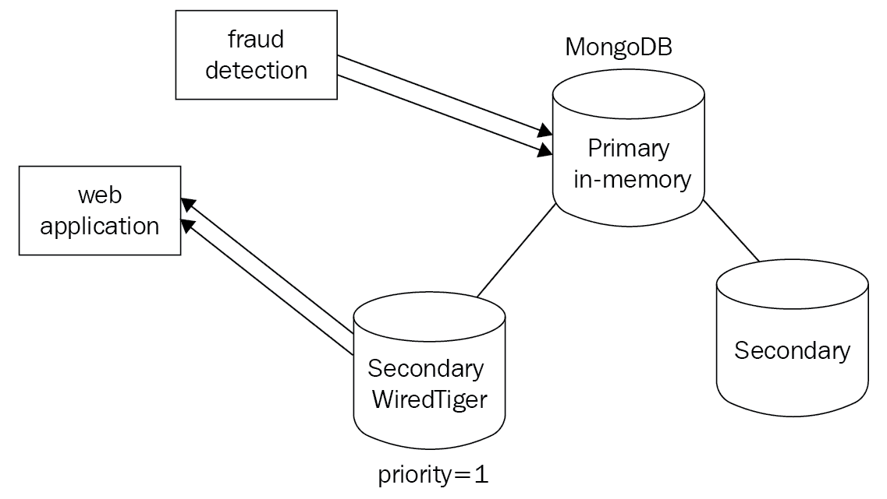
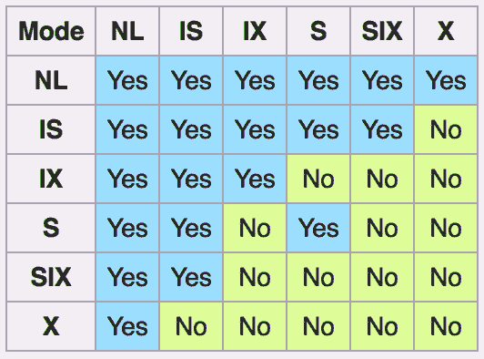

# 存储引擎

MongoDB 在 3.0 版中引入了可插拔存储引擎的概念。收购 WiredTiger 后，它首先引入了可选的存储引擎，然后作为当前版本 MongoDB 的默认存储引擎。在本章中，我们将深入探讨存储引擎的概念、它们的重要性以及如何根据工作负载选择最佳的存储引擎。

我们将讨论以下主题：

*   可插拔存储引擎
*   线规
*   加密的
*   记忆中
*   MMAPv1
*   锁定 MongoDB

# 可插拔存储引擎

随着 MongoDB 从 web 应用程序模式突破到具有不同需求的领域，存储已成为越来越重要的考虑因素。

使用多个存储引擎可以被视为在基础架构堆栈中使用不同存储解决方案和数据库的替代方法。通过这种方式，我们可以减少操作复杂性和上市开发时间，而应用程序层与底层存储层无关。

MongoDB 目前提供了四种不同的存储引擎，我们将在下面的部分中进一步详细研究它们。

# 线规

从 3.2 版开始，WiredTiger 是默认的存储引擎，也是大多数工作负载的最佳选择。通过提供文档级锁定，它克服了早期版本 MongoDB 在高负载下存在锁争用的一个最显著的缺点。

我们将在以下部分探讨 WiredTiger 的一些好处。

# 文档级锁定

锁定非常重要，因此我们将在本节末尾进一步详细解释细粒度锁定的性能含义。与 MMAPv1 集合级锁定相反，文档级锁定可以在许多实际用例中产生巨大的差异，这也是选择 WiredTiger 而不是 MMAPv1 的主要原因之一。

# 快照和检查点

WiredTiger 使用**多版本并发控制**（**MVCC**）。MVCC 基于这样一个概念，即数据库保存一个对象的多个版本，以便读者能够查看在读取过程中不会更改的一致数据。

在一个数据库中，如果有多个读卡器同时访问数据，而写卡器正在修改数据，那么最终可能会出现读卡器查看该数据的不一致视图的情况。解决此问题的最简单和最简单的方法是阻止所有读卡器，直到写入程序修改完数据。

当然，这将导致性能严重下降。MVCC 通过为每个读卡器提供数据库快照来解决这个问题。当读取开始时，保证每个读卡器都能准确地查看读取开始时的数据。写入程序所做的任何更改只有在写入完成后，或者在提交事务后（用数据库术语）读者才能看到。

为了实现这一目标，在写入时，更新的数据将保存在磁盘上的单独位置，MongoDB 将受影响的文档标记为过时。据说 MVCC 提供了时间点一致的视图。这相当于传统 RDBMS 系统中的读提交隔离级别。

对于每项操作，WiredTiger 都会在数据发生的准确时刻快照数据，并为应用程序提供一致的应用程序数据视图。当我们写入数据时，WiredTiger 将每隔 2GB 日志数据或 60 秒创建一个快照，以先到者为准。WiredTiger 依靠其内置日志在出现故障时恢复最新检查点之后的任何数据。

We can disable journaling using WiredTiger, but if the server crashes, we will lose any data after the last checkpoint is written.

# 日记

如*快照和检查点*部分所述，日志记录是 WiredTiger 崩溃恢复保护的基石。

WiredTiger 使用 snappy 压缩算法压缩日志。我们可以使用以下设置来设置不同的压缩算法：

```js
storage.wiredTiger.engineConfig.journalCompressor
```

我们还可以通过将以下设置为`false`来禁用 WiredTiger 的日志记录：

```js
storage.journal.enabled
```

If we use a replica set, we may be able to recover our data from a secondary that will get elected as a primary and start taking writes in the event that our primary fails. It is recommended to always use journaling, unless we understand and can take the risk of suffering through the consequences of not using it.

# 数据压缩

MongoDB 默认使用 snappy 压缩算法压缩数据和索引前缀。索引前缀压缩意味着相同的索引键前缀在每页内存中只存储一次。压缩不仅减少了我们的存储空间，而且还会增加每秒的 I/O 操作，因为需要存储和从磁盘移动的数据更少。如果我们的工作负载受 I/O 限制而不是 CPU 限制，那么使用更积极的压缩可以提高性能。

我们可以通过将以下参数设置为`false`来定义`.zlib`压缩，而不是 snappy 或 no compression：

```js
storage.wiredTiger.collectionConfig.blockCompressor
```

Data compression uses less storage at the expense of CPU. `.zlib` compression achieves better compression at the expense of higher CPU usage, as opposed to the default snappy compression algorithm.

我们可以通过将以下参数设置为`false`来禁用索引前缀压缩：

```js
storage.wiredTiger.indexConfig.prefixCompression
```

我们还可以在创建期间使用以下参数配置每个索引的存储：

```js
{ <storage-engine-name>: <options> }
```

# 内存使用

WiredTiger 在使用 RAM 的方式上与 MMAPv1 有很大不同。MMAPv1 本质上是使用底层操作系统的文件系统缓存将数据从磁盘分页到内存，反之亦然。

相反，WiredTiger 引入了 WiredTiger 内部缓存的新概念。

默认情况下，WiredTiger 内部缓存为以下值中的较大值：

*   内存的 50%减去 1 GB
*   256 MB

这意味着如果我们的服务器有 8 GB RAM，我们将获得以下内容：

*最大（3 GB，256 MB）=WiredTiger 将使用 3 GB RAM*

如果我们的服务器有 2512 MB RAM，我们将得到以下结果：

*最大（256 MB，256 MB）=WiredTiger 将使用 256 MB 的 RAM*

基本上，对于 RAM 小于 2512 MB 的任何服务器，WiredTiger 将使用 256 MB 作为其内部缓存。

我们可以通过设置以下内容来更改 WiredTiger 内部缓存的大小：

```js
storage.wiredTiger.engineConfig.cacheSizeGB
```

我们还可以使用以下命令行执行此操作：

```js
--wiredTigerCacheSizeGB
```

除了未压缩的 WiredTiger 内部缓存以获得更高的性能外，MongoDB 还使用压缩的文件系统缓存，就像 MMAPv1 一样，在大多数情况下都会使用所有可用内存。

WiredTiger 内部缓存可以提供与内存中存储类似的性能。因此，尽可能多地种植它是很重要的。

当将 WiredTiger 与多核处理器结合使用时，我们可以获得更好的性能。与 MMAPv1 相比，这也是一个巨大的胜利，MMAPv1 的规模不太大。

We can, and should, use Docker or other containerization technologies to isolate the `mongod` processes from each other and make sure that we know how much memory each process can, and should, use in a production environment. It is not recommended to increase the WiredTiger internal cache above its default value. The filesystem cache should not be less than 20% of the total RAM.

# 重新关注

WiredTiger 支持多个`readConcern`级别。就像 MongoDB 中每个存储引擎都支持的`writeConcern`一样，通过`readConcern`，我们可以自定义一个副本集中有多少服务器必须确认查询结果才能返回结果集中的文档。

阅读关注的可用选项如下：

*   `local`：默认选项。将从服务器返回最新的数据。数据可能已传播到副本集中的其他服务器，也可能未传播到副本集中的其他服务器，因此我们有回滚的风险。
*   `linearizable`：
    *   仅适用于从主服务器读取
    *   仅适用于返回单个结果的查询
    *   数据返回满足两个条件：
        *   `majority`、``writeConcern``
        *   数据在读取操作开始前已确认

另外，如果我们将`writeConcernMajorityJournalDefault`设置为`true`，我们保证数据不会回滚。

如果我们将`writeConcernMajorityJournalDefault`设置为`false`，MongoDB 在确认写入之前不会等待`majority`写入是持久的。在这种情况下，如果副本集中的成员丢失，我们的数据可能会回滚。在开始读取之前，返回的数据已经从服务器的`majority`传播并确认。

We need to use `maxTimeMS` when using `linearizable` and `majority` read concern levels in case we can't establish `majority writeConcern` to avoid blocking, forever waiting for the response. In this case, the operation will return a timeout error.

MMAPv1 是较旧的存储引擎，在许多方面被认为已被弃用，但许多部署仍在使用它。

`local` and `linearizable` read concerns are available for MMAPv1 as well.

# WiredTiger 集合级别选项

创建新集合时，可以将选项传递给 WiredTiger，如下所示：

```js
> db.createCollection(
 "mongo_books",
 { storageEngine: { wiredTiger: { configString: "<key>=<value>" } } }
)
```

这有助于使用 WiredTiger 通过其 API 公开的可用键值对创建我们的`mongo_books`集合。一些最广泛使用的键值对如下所示：

| **键** | **值** |
| `block_allocation` | 最好还是第一 |
| `allocation_size` | 512 字节至 4KB；默认值为 4KB |
| `block_compressor` | 无、`.lz4`、`.snappy`、`.zlib`、`.zstd`或自定义压缩机标识符字符串，具体取决于配置 |
| `memory_page_max` | 512 字节至 10 TB；默认 5 MB |
| `os_cache_max` | 大于零的整数；默认零 |

这直接取自位于[的 WiredTiger 文件中的定义 http://source.wiredtiger.com/mongodb-3.4/struct_w_t___s_e_s_s_i_o_n.html](http://source.wiredtiger.com/mongodb-3.4/struct_w_t___s_e_s_s_i_o_n.html) ：

```js
int WT_SESSION::create()
```

集合级别选项允许灵活配置存储，但在使用时应格外小心，并在开发/登台环境中经过仔细测试。

Collection-level options will get propagated to secondaries if applied to a primary in a replica set. `block_compressor` can also be configured from the command line globally for the database using the `--wiredTigerCollectionBlockCompressor` option.

# WiredTiger 性能策略

如本章前面所述，WiredTiger 使用内部缓存优化性能。最重要的是，操作系统（和 MMAPv1）总是使用文件系统缓存从磁盘获取数据。

默认情况下，50%的 RAM 专用于文件系统缓存，50%专用于 WiredTiger 内部缓存。

文件系统缓存将在数据存储在磁盘上时对其进行压缩。内部缓存将按如下方式对其进行解压缩：

*   **策略 1**：将 80%或更多分配给内部缓存。其目标是在 WiredTiger 的内部缓存中安装我们的工作集。
*   **策略 2**：将 80%或更多分配给文件系统缓存。我们的目标是尽可能避免使用内部缓存，并依赖文件系统缓存满足我们的需要。
*   **策略 3**：使用 SSD 作为底层存储以实现快速寻道，并将默认值保持在 50-50%的分配。
*   **策略 4**：通过 MongoDB 的配置在我们的存储层实现压缩，以节省存储空间，并通过更小的工作集大小潜在地提高我们的性能。

我们的工作负载将决定我们是否需要从默认策略 1 偏离到其他任何策略。一般来说，我们应该尽可能使用 SSD，通过 MongoDB 的可配置存储，我们甚至可以在某些需要最佳性能的节点上使用 SSD，并保留用于分析工作负载的 HDD。

# WiredTiger B 树与 LSM 索引

B 树是跨不同数据库系统索引的最常见数据结构。WiredTiger 提供了使用**日志结构合并**（**LSM**树）代替 B 树进行索引的选项。

当我们有随机插入的工作负载时，LSM 树可以提供更好的性能，否则会使页面缓存溢出，并开始从磁盘分页数据，以保持索引最新。

可以从命令行中选择 LSM 索引，如下所示：

```js
> mongod --wiredTigerIndexConfigString "type=lsm,block_compressor=zlib"
```

前面的命令选择`lsm`作为`type`，而`mongod`实例中的索引选择`block_compressor`为`zlib`。

# 加密的

加密存储引擎被添加以支持一系列特殊用例，主要围绕金融、零售、医疗保健、教育和政府。

如果我们必须遵守一系列法规，包括以下规定，我们需要对其余数据进行加密：

*   用于处理信用卡信息的 PCI DSS
*   HIPAA 用于医疗保健应用
*   NIST 为政府服务
*   政府财政司司长
*   政府的 STIG

这可以通过多种方式实现，云服务提供商（如 EC2）为 EBS 存储卷提供内置加密。加密存储支持 Intel 配备 AES-NI 的 CPU，以加速加密/解密过程。

支持的加密算法如下所示：

*   AES-256，CBC（默认）
*   AES-256，GCM
*   FIPS，FIPS-140-2

在页面级别支持加密以提高性能。在文档中进行更改时，只修改受影响的页面，而不是重新加密/解密整个基础文件。

加密密钥管理是加密存储安全的一个重要方面。前面提到的大多数规范要求每年至少旋转一次键。

MongoDB 的加密存储使用每个节点的内部数据库密钥。此密钥由外部（主）密钥包装，该密钥必须用于启动节点的`mongod`进程。通过使用底层操作系统的保护机制，如`mlock`或`VirtualLock`，MongoDB 可以保证外部密钥不会因页面错误从内存泄漏到磁盘。

外部（主）密钥可以通过使用**密钥管理互操作协议**（**KMIP**）或通过密钥文件使用本地密钥管理进行管理。

MongoDB 可以通过执行副本集成员的滚动重启来实现密钥轮换。使用 KMIP，MongoDB 只能旋转外部键，而不能旋转底层数据库文件。这提供了显著的性能优势。

Using KMIP is the recommended approach for encrypted data storage. Encrypted storage is based on WiredTiger, so all its advantages can be enjoyed using encryption as well. Encrypted storage is a part of MongoDB Enterprise Edition, the paid offering by MongoDB.

与加密存储卷相比，使用 MongoDB 的加密存储可以提高性能。MongoDB 的加密存储开销约为 15%，而第三方加密存储解决方案的开销为 25%或更多。

在大多数情况下，如果我们需要使用加密存储，我们将在应用程序设计阶段就知道它，并且我们可以针对不同的解决方案执行基准测试，以选择最适合我们用例的解决方案。

# 记忆中

MongoDB 内存存储是一项高风险的任务，回报很高。将数据保存在内存中的速度比磁盘上的持久存储快 100000 倍。

使用内存存储的另一个优点是，我们可以在写入或读取数据时获得可预测的延迟。有些用例规定延迟不会偏离正常值，无论操作是什么。

另一方面，通过将数据保存在内存中，我们会面临断电和应用程序故障，从而丢失所有数据。使用副本集可以防止某些类型的错误，但如果我们存储在数据中而不是存储在磁盘上，我们将始终更容易受到数据丢失的影响。

然而，在一些用例中，我们可能不太关心丢失旧数据。例如，在金融领域，我们可能有以下情况：

*   高频交易/算法交易，高流量情况下更高的延迟可能导致交易无法完成
*   在欺诈检测系统中，我们关心的是实时检测是否尽可能快，并且我们只能安全地将需要进一步调查的案件或肯定是积极的案件存储到持久存储中
*   信用卡授权、交易订单对账和其他需要实时回答的高流量系统

在 web 应用程序生态系统中，我们有以下内容：

*   在入侵检测系统（如欺诈检测）中，我们关注的是尽可能快地检测入侵，而不太关注误报情况。
*   在产品搜索缓存的情况下，丢失数据并不是关键任务，而是从客户的角度来看带来的一点不便。
*   对于实时个性化产品推荐，在数据丢失方面具有低风险操作。即使数据丢失，我们也可以重建索引。

内存存储引擎的一个主要缺点是数据集必须适合内存。这意味着我们必须了解并跟踪我们的数据使用情况，这样我们就不会超过服务器的内存。

总体而言，在某些边缘使用情况下，使用 MongoDB 内存存储引擎可能很有用，但数据库系统中缺乏耐久性可能是采用 MongoDB 的一个阻碍因素。

In-memory storage is part of MongoDB Enterprise Edition, the paid offering by MongoDB.

# MMAPv1

随着 WiredTiger 的引入及其诸多优点，如文档级锁定，许多 MongoDB 用户开始质疑是否值得再讨论 MMAPv1。

实际上，我们应该考虑使用 MMAPv1 代替有线老虎的唯一的情况是：

*   **遗留系统**：如果我们有一个适合我们需要的系统，我们可能会升级到 MongoDB 3.0+，而不是过渡到 WiredTiger。
*   **版本降级**：一旦我们升级到 MongoDB 3.0+并将我们的存储转换为 WiredTiger，我们就不能降级到低于 2.6.8 的版本。如果我们希望以后能够灵活地降级，就应该记住这一点。

如前所示，WiredTiger 是比 MMAPv1 更好的选择，我们应该在有机会时使用它。本书以 WiredTiger 为中心，假设我们能够使用 MongoDB 的最新稳定版本（撰写本文时为 3.4）。

MMAPv1, as of version 3.4, only supports collection-level locking, as opposed to the document-level locking supported by WiredTiger. This can lead to a performance penalty in high contention database loads and is one of the main reasons why we should use WiredTiger whenever possible.

# MMAPv1 存储优化

默认情况下，MongoDB 使用二次幂分配策略。创建文档时，将为其分配大小为 2 的幂。也就是说，`ceiling(document_size)`。

例如，如果我们创建一个 127 字节的文档，MongoDB 将分配 128 字节（*2^7*），而如果我们创建一个 129 字节的文档，MongoDB 将分配 256 字节（*2^8*）。这在更新文档时很有用，因为我们可以更新文档，并且在超出分配的空间之前不会移动磁盘上的基础文档。

如果文档在磁盘上移动（即，在文档数组中添加新的子文档或元素，迫使其大小超过分配的存储），将使用两个分配大小的新幂。

如果操作不影响其大小（即将整数值从 1 更改为 2），文档将保持存储在磁盘上相同的物理位置。这个概念被称为**填充**。我们也可以使用 compact 管理命令配置填充。

当我们在磁盘上移动文档时，会存储非连续的数据块，本质上就是存储中的漏洞。我们可以通过在集合级别设置`paddingFactor`来防止这种情况发生。

`paddingFactor`默认值为`1.0`（无填充），最大值为`4.0`（扩展大小为原始文档大小的三倍）。例如，`1.4`中的`paddingFactor`将允许文档在移动到磁盘上的新位置之前扩展 40%。

例如，对于我们最喜欢的`books`系列，为了获得 40%的空间，我们将执行以下操作：

```js
> db.runCommand ( { compact: 'books', paddingFactor: 1.4 } )
```

我们还可以按每个文档的字节数设置填充。这样，我们从集合中每个文档的初始创建中获得*x*字节填充：

```js
> db.runCommand ( { compact: 'books', paddingBytes: 300 } )
```

这将允许以 200 字节创建的文档增长到 500 字节，而以 4000 字节创建的文档将允许增长到 4300 字节。

我们可以通过运行一个没有参数的`compact`命令来完全消除漏洞，但这意味着每次增加文档大小的更新都必须移动文档，本质上就是在存储中创建新的漏洞。

# 混合使用

当我们有一个以 MongoDB 作为底层数据库的应用程序时，我们可以将其设置为在应用程序级别为不同的操作使用不同的副本集，以满足它们的需求。

例如，在我们的金融应用程序中，我们可以为利用内存节点的欺诈检测模块使用一个连接池，为系统的其余部分使用另一个连接池，如下所示：



此外，MongoDB 中的存储引擎配置适用于每个节点，这允许进行一些有趣的设置。

如前面的体系结构图所示，我们可以在副本集的不同成员中混合使用不同的存储引擎。在本例中，我们在主节点中使用内存引擎以获得最佳性能，而其中一个辅助节点使用 WiredTiger 以确保数据持久性。我们可以在内存中的次节点中使用`priority=1`来确保，如果主节点出现故障，次节点将立即被选中。如果我们不这样做，我们就有可能在系统中有高负载的情况下，主服务器出现故障，而辅助服务器无法跟上主服务器在内存中的写入。

混合存储方法广泛应用于微服务体系结构中。通过分离服务和数据库，并为每个用例使用适当的数据库，我们可以轻松地横向扩展我们的基础设施。

所有存储引擎都支持公共基线功能，例如：

*   质疑
*   索引
*   复制
*   分片
*   Ops 和云管理器支持
*   身份验证和授权语义

# 其他存储引擎

模块化 MongoDB 体系结构允许第三方开发自己的存储引擎。

# RocksDB

RocksDB 是一个用于键值数据的嵌入式数据库。它是`LevelDB`的一个分支，将键值对存储在任意字节数组中。它于 2012 年在 Facebook 上启动，现在作为有趣的名字**CockroachDB**的后端，这是一个受谷歌扳手启发的开源数据库。

MongoRocks 是 Percona 和 Facebook 支持的一个项目，旨在将 RocksDB 后端引入 MongoDB。RocksDB 可以在某些工作负载下实现比 WiredTiger 更高的性能，值得研究。

# 托库姆

另一个广泛使用的存储引擎是 Percona 的 TokuMX。TokuMX 的设计同时考虑了 MySQL 和 MongoDB，但自 2016 年以来，Percona 将精力集中在 MySQL 版本上，而不是切换到**RocksDB**以支持 MongoDB 存储。

# 锁定 MongoDB

文档级和集合级锁定在本章以及本书的其他几章中均有提及。了解锁定是如何工作的以及为什么它很重要，这一点很重要。

数据库系统使用锁的概念来实现 ACID 属性。当有多个读写请求并行出现时，我们需要锁定数据，以便所有读写器都有一致且可预测的结果。

MongoDB 使用多粒度锁定。可用的粒度级别按降序排列如下：

*   全球的
*   数据库
*   收集
*   文件

MongoDB 和其他数据库使用的锁按粒度顺序如下：

*   *是否*：意图共享
*   *IX*：意图独占
*   *S*：共享
*   *X*：独家

如果我们在粒度级别使用带有*S*或*X*锁的锁，那么所有更高级别都需要使用相同类型的意向锁进行锁定。

锁的其他规则如下：

*   单个数据库可以在*IS*和*IX*模式下同时锁定
*   独占（*X*锁）不能与任何其他锁共存
*   共享（*S*锁只能与*IS*锁共存

读写请求锁通常以**先进先出**（**FIFO**的顺序排队。MongoDB 实际要做的唯一优化就是根据队列中要服务的下一个请求重新排序请求。

这意味着，如果我们有一个*is（1）*请求，并且我们当前的队列有以下*is（1）>is（2）>X（3）>S（4）>is（5）*，如下面的屏幕截图所示：


然后 MongoDB 会像这样重新排序请求，*是（1）>是（2）>是（4）>是（5）>X（3）a*S，如下图所示：


如果在维护过程中，*是（1）*请求，新的*是*请求，或者*S*请求进来，假设*是（6）*和*S（7），*按该顺序，它们仍然会被添加到队列的末尾，直到*X（3）*请求完成后才会被考虑。

我们的新队列现在看起来像是*是（2）>S（4）>是（5）>X（3）>是（6）>S（7）*：


这样做是为了防止*X（3）*请求被饿死，因为新的*是*和*S*请求进入，所以该请求将一直被推回到队列中。理解意图锁和锁本身之间的区别很重要。WiredTiger 存储引擎将仅在全局、数据库和收集级别使用意图锁

当收到新请求时，它在更高的级别（即集合、数据库、全局）使用意向锁，并根据以下兼容性矩阵：



MongoDB 将首先在所有祖先中获取意图锁，然后再获取文档本身的锁。这样，当一个新请求进入时，它可以快速确定是否不能基于粒度较小的锁来服务它。

WiredTiger 将在文档级别使用*S*和*X*锁。唯一的例外是涉及多个数据库的通常不频繁和/或短期操作。这些仍然需要全局锁，类似于 MongoDB 在 2.x 之前版本中的行为。

Administrative operations, such as dropping a collection, still require an exclusive database lock.

如前所述，MMAPv1 使用集合级锁。跨越单个集合但可能跨越或不跨越单个文档的操作仍将锁定整个集合。这就是为什么 WiredTiger 是所有新部署的首选存储解决方案的主要原因。

# 锁定报告

我们可以使用以下任何工具和命令检查锁状态：

*   `db.serverStatus()`通过`locks`文件

*   `db.currentOp()`通过`locks`字段

*   `mongotop`

*   `mongostat`

*   MongoDB 云管理器

*   MongoDB 运营经理

锁争用是需要跟踪的一个非常重要的指标，因为如果数据库失控，它会使数据库崩溃。

If we want to terminate an operation, we have to use the `db.killOp()` shell command.

# 锁定产量

带有数据库级锁的数据库在压力下不会真正有用，并且在大多数情况下都会被锁定。MongoDB 早期版本中的一个智能解决方案是让操作在一些启发式的基础上产生锁。

`update()`影响多个文档的命令将产生其*X*锁，以提高并发性。

在早期版本的 MongoDB 中，MMAPv1 的前身将使用这些启发式算法在执行请求的操作之前预测数据是否已经在内存中。如果不是，它将产生锁，直到底层操作系统在内存中分页数据，然后重新获取锁以继续服务请求。

最值得注意的例外是索引扫描，在索引扫描中，操作不会产生锁，只会在等待从磁盘加载数据时阻塞。

由于 WiredTiger 仅在集合级别及更高级别使用意图锁，因此它并不真正需要这些启发式方法，因为意图锁不会阻止其他读写器。

# 常用命令和锁

常用的命令和锁如下所示：

| **命令** | **锁** |
| `find()` | *S* |
| `it() (query cursor)` | *S* |
| `insert()` | *X* |
| `remove()` | *X* |
| `update()` | *X* |
| `mapreduce()` | *S*和*X*都有，视情况而定。一些 MapReduce 块可以并行运行。 |
| `index()` | 

*   **前台索引** ：数据库锁。
*   **后台索引** ：没有锁，除了会返回错误的管理命令。此外，背景索引将花费相当多的时间。

 |
| `aggregate()` | *S* |

# 需要数据库锁的命令

以下命令需要数据库锁。在生产环境中发布之前，我们应提前计划：

*   `db.collection.createIndex()`在（默认）前台模式下
*   `reIndex`
*   `compact`
*   `db.repairDatabase()`
*   `db.createCollection()`如果创建多个 GB 封顶集合
*   `db.collection.validate()`
*   `db.copyDatabase()`，可锁定多个数据库

我们还有一些命令可以在很短的时间内锁定整个数据库：

*   `db.collection.dropIndex()`
*   `db.getLastError()`
*   `db.isMaster()`
*   任何`rs.status()`命令
*   `db.serverStatus()`

*   `db.auth()`
*   `db.addUser()`

这些命令的运行时间不应该超过几毫秒，因此我们不应该担心，除非我们有这些命令的自动脚本，在这种情况下，我们必须注意它们发生的频率。

In a sharded environment, each `mongod` applies its own locks, thus greatly improving concurrency.

在副本集中，主服务器必须执行所有写入操作。为了将它们正确复制到二级数据库，我们必须在锁定主文档/集合/数据库的同时锁定保存操作 oplog 的本地数据库。这通常是一个短暂的锁，我们也不必担心。

副本集中的二级数据库将从主本地数据库的 oplog 获取写操作，应用适当的*X*锁，并在完成*X*锁后应用服务读取。

从前面的解释可以看出，MongoDB 中应该不惜一切代价避免锁定。我们应该设计我们的数据库，以避免尽可能多的*X*锁，当我们需要在一个或多个数据库上使用*X*锁时，请在维护窗口中使用备份计划，以防操作花费比预期更长的时间。

# 进一步阅读

您可以参考以下链接以供进一步参考：

*   [https://docs.mongodb.com/manual/faq/concurrency/](https://docs.mongodb.com/manual/faq/concurrency/)
*   [https://docs.mongodb.com/manual/core/storage-engines/](https://docs.mongodb.com/manual/core/storage-engines/)
*   [https://www.mongodb.com/blog/post/building-applications-with-mongodbs-pluggable-storage-engines-part-1](https://www.mongodb.com/blog/post/building-applications-with-mongodbs-pluggable-storage-engines-part-1)
*   [https://www.mongodb.com/blog/post/building-applications-with-mongodbs-pluggable-storage-engines-part-2](https://www.mongodb.com/blog/post/building-applications-with-mongodbs-pluggable-storage-engines-part-2?jmp=docs&_ga=2.154506616.1736193377.1502822527-355279797.1491859629)
*   [https://docs.mongodb.com/manual/core/wiredtiger/](https://docs.mongodb.com/manual/core/wiredtiger/)
*   [https://docs.mongodb.com/manual/reference/method/db.collection.createIndex/#createindex-选项](https://docs.mongodb.com/manual/reference/method/db.collection.createIndex/#createindex-options)
*   [https://docs.mongodb.com/manual/core/mmapv1/](https://docs.mongodb.com/manual/core/mmapv1/)

*   [https://docs.mongodb.com/manual/reference/method/db.createCollection/#create-收集存储引擎选项](https://docs.mongodb.com/manual/reference/method/db.createCollection/#create-collection-storage-engine-options)
*   [http://source.wiredtiger.com/mongodb-3.4/struct_w_t___s_e_s_s_i_o_n.html](http://source.wiredtiger.com/mongodb-3.4/struct_w_t___s_e_s_s_i_o_n.html)
*   [https://webassets.mongodb.com/microservices_white_paper.pdf?_ga=2.158920114.90404900.1503061618-3552797.1491859629](https://webassets.mongodb.com/microservices_white_paper.pdf?_ga=2.158920114.90404900.1503061618-355279797.1491859629)
*   [https://webassets.mongodb.com/storage_engines_adress_wide_range_of_use_cases.pdf?_ga=2.125749506.90404900.1503061618-3552797.1491859629](https://webassets.mongodb.com/storage_engines_adress_wide_range_of_use_cases.pdf?_ga=2.125749506.90404900.1503061618-355279797.1491859629)
*   [https://docs.mongodb.com/manual/reference/method/db.createCollection/#create-收集存储引擎选项](https://docs.mongodb.com/manual/reference/method/db.createCollection/#create-collection-storage-engine-options)
*   [http://source.wiredtiger.com/mongodb-3.4/struct_w_t___s_e_s_s_i_o_n.html](http://source.wiredtiger.com/mongodb-3.4/struct_w_t___s_e_s_s_i_o_n.html)
*   [https://docs.mongodb.com/manual/reference/read-concern/](https://docs.mongodb.com/manual/reference/read-concern/)
*   [https://www.percona.com/live/17/sessions/comparing-mongorocks-wiredtiger-and-mmapv1-performance-and-efficiency](https://www.percona.com/live/17/sessions/comparing-mongorocks-wiredtiger-and-mmapv1-performance-and-efficiency)
*   [https://www.percona.com/blog/2016/06/01/embracing-mongorocks/](https://www.percona.com/blog/2016/06/01/embracing-mongorocks/)
*   [https://www.percona.com/software/mongo-database/percona-tokumx](https://www.percona.com/software/mongo-database/percona-tokumx)
*   [https://www.slideshare.net/profyclub_ru/4-understanding-and-tuning-wired-tiger-the-new-high-performance-database-engine-in-mongodb-henrik-ingo-mongodb](https://www.slideshare.net/profyclub_ru/4-understanding-and-tuning-wired-tiger-the-new-high-performance-database-engine-in-mongodb-henrik-ingo-mongodb/27)

# 总结

在本章中，我们了解了 MongoDB 中的不同存储引擎。我们确定了每种存储引擎的优缺点以及选择每种存储引擎的用例。

我们了解了如何使用多个存储引擎、如何使用它们以及它们的好处。本章的大部分内容还专门讨论了数据库锁定，它是如何发生的，为什么它不好，以及我们如何避免它。

我们按他们需要的锁来分割我们的业务。这样，当我们设计和实现应用程序时，我们可以确保我们的设计尽可能少地锁定数据库。

在下一章中，我们将学习 MongoDB，以及如何使用它获取和处理大数据。