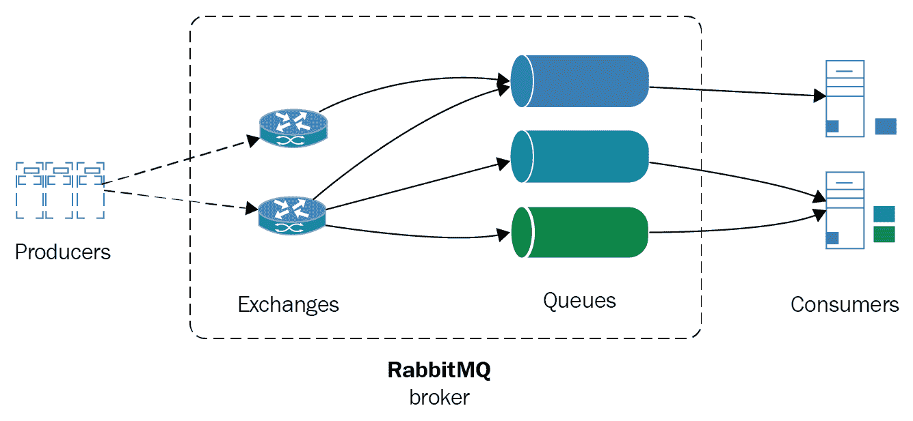
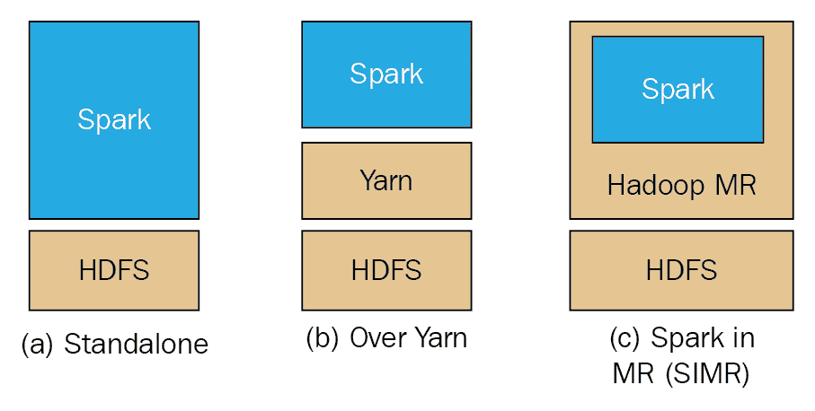

# 十一、MongoDB 和大数据

MongoDB 经常与大数据管道结合使用，因为它的性能、灵活性以及缺乏严格的数据模式。本章将探讨大数据领域，以及 MongoDB 如何与消息队列、数据仓库以及提取、转换和加载管道相适应。

我们将在本章中讨论的主题如下：

*   什么是大数据？
*   消息队列系统
*   数据仓库
*   使用 Kafka、HDFS 上的 Spark 和 MongoDB 的大数据用例

# 什么是大数据？

在过去五年中，访问和使用互联网的人数几乎翻了一番，从略低于 20 亿人增加到约 37 亿人。全球一半的人口现在都在上网。

随着互联网用户数量的增加和网络的发展，每年都有更多的数据被添加到现有的数据集中。2016 年，全球互联网流量为 12 兆字节（12 亿兆字节），预计到 2021 年将增长到 3.3 兆字节。

每年产生的大量数据意味着数据库和数据存储通常必须能够有效地扩展和处理我们的数据。

**大数据**一词最早由约翰·马西（John Mashey）（[于 20 世纪 80 年代提出 http://static.usenix.org/event/usenix99/invited_talks/mashey.pdf](http://static.usenix.org/event/usenix99/invited_talks/mashey.pdf) ），在过去十年中，随着互联网的爆炸性增长，这一概念开始发挥作用。大数据通常指的是太大、太复杂而无法由传统数据处理系统处理的数据集，因此需要某种专门的系统架构来处理。

大数据的定义特征一般如下：

*   体积
*   不同种类
*   速度
*   真实性
*   易变性

多样性和可变性是指我们的数据以不同的形式出现，并且我们的数据集具有内部不一致性。在我们实际处理数据之前，需要通过数据清理和规范化系统来消除这些问题。

准确性是指数据质量的不确定性。数据质量可能会有所不同，一些日期的数据完美，而另一些日期的数据集缺失。这会影响我们的数据管道以及我们可以在数据平台上投资多少，因为即使在今天，三分之一的商业领袖也不完全信任他们用来做出商业决策的信息。

最后，速度可能是大数据最重要的定义特征（而不是明显的体积属性），它指的是大数据集不仅拥有大量数据，而且增长速度也在加快。这使得使用索引等传统存储成为一项困难的任务。

# 大数据格局

大数据已经演变成一个影响经济各个部门的复杂生态系统。从炒作到不切实际的期望，再回到现实，我们现在已经在大多数财富 1000 强公司中实施和部署了大数据系统，这些系统提供了真正的价值。

如果我们按行业对参与大数据领域的公司进行细分，我们可能会得出以下部分：

*   基础设施
*   分析
*   应用企业
*   应用行业
*   跨基础架构分析
*   数据源和 API
*   数据资源
*   开源

从工程的角度来看，我们可能更关心底层技术，而不是它们在不同行业中的应用。

根据我们的业务领域，我们可能会有来自不同来源的数据，如事务数据库、物联网传感器、应用服务器日志、通过 web 服务 API 的其他网站，或者只是简单的网页内容提取：


# 消息队列系统

在前面描述的大多数流程中，我们将数据**提取、转换、加载**（**ETL**）到**企业数据仓库**（**EDW**）中。为了提取和转换这些数据，我们需要一个消息队列系统来处理流量峰值、端点暂时不可用以及可能影响系统这一部分的可用性和可伸缩性的其他问题。

消息队列还提供了消息生产者和消费者之间的解耦。这允许通过将消息划分为不同的主题/队列来实现更好的可伸缩性。

最后，使用消息队列，我们可以提供位置无关的服务，而不关心消息生产者的位置，从而提供不同系统之间的互操作性。

在消息队列世界中，在编写本书时，生产中最流行的系统是 RabbitMQ、ActiveMQ 和 Kafka。在深入我们的用例之前，我们将对它们进行一个小的概述，以将所有它们结合在一起。

# apacheactivemq

ApacheActiveMQ 是一个开源的消息代理，用 Java 编写，还有一个完整的**Java 消息服务**（**JMS**客户端）。

它是我们在这里研究的三种实现中最成熟的实现，并且在成功的生产部署方面有着悠久的历史。包括红帽在内的许多公司都提供商业支持。

这是一个相当简单的排队系统，可以进行设置和管理。它基于 JMS 客户机协议，是 JavaEE 系统的首选工具。

# 兔子

另一方面，RabbitMQ 是用 Erlang 编写的，基于**高级消息队列协议**（**AMQP**协议。AMQP 比 JMS 更强大、更复杂，因为它允许点对点消息传递、请求/应答和发布/订阅模型，用于一对一或一对多消息消费。

RabbitMQ 在过去的 5 年中得到了普及，现在是搜索最多的排队系统。

RabbitMQ 的体系结构概述如下：



RabbitMQ 系统中的扩展通过创建 RabbitMQ 服务器集群来执行。集群共享被复制的数据和状态，但每个节点的消息队列是不同的。为了实现高可用性，我们还可以在不同的节点中复制队列。

# 阿帕奇·卡夫卡

另一方面，卡夫卡是一种排队系统，最初由 LinkedIn 为其内部目的开发。它是用 Scala 编写的，从一开始就为水平可扩展性和最佳性能而设计。

关注性能是 ApacheKafka 的一个关键区别，但这意味着为了实现性能，我们需要牺牲一些东西。Kafka 中的消息不具有唯一的 ID，而是通过日志中的偏移量进行寻址。系统不跟踪 Apache Kafka 消费者；这是应用程序设计的责任。消息排序是在分区级别实现的，使用者有责任确定消息是否已经交付。

语义是在 0.11 版中引入的，是最新 1.0 版本的一部分，因此现在消息可以在分区内严格排序，并且对于每个使用者始终只到达一次：


# 数据仓库

使用消息队列系统只是数据管道设计的第一步。在消息队列的另一端，我们通常会有一个数据仓库来处理到达的大量数据。有许多选择，这不是本书的主要重点去看这些或比较它们。然而，我们将浏览 Apache 软件基金会中使用最广泛的两个选项：Apache Hadoop 和 Apache Spark。

# ApacheHadoop

第一个，可能仍然是使用最广泛的大数据处理框架是 ApacheHadoop。它的基础是“Hadoop 分布式文件系统”（To.T2A.HDFS To.T3）。在雅虎开发！在 21 世纪初，它最初是作为**谷歌文件系统**（**GFS**）的开源替代品，后者是一个分布式文件系统，用于满足谷歌搜索索引的分布式存储需求。

Hadoop 还实现了一个 MapReduce 替代 Google 专有系统 Hadoop MapReduce。它们与 HDF 一起构成了分布式存储和计算的框架。它用 Java 编写，为大多数编程语言和许多提供抽象和简单功能的项目提供绑定，有时基于 SQL 查询，是一个可以可靠地用于存储和处理 TB 甚至 PB 数据的系统。

在后来的版本中，Hadoop 变得更加模块化，引入了**另一个资源协商者**（**纱线**），为在 Hadoop 之上开发的应用程序提供了抽象。这使得一些应用程序可以部署在 Hadoop 之上，例如**Storm**、**Tez**、**OpenMPI**、**Giraph**以及**Apache Spark**，我们将在以下部分中看到。

Hadoop MapReduce 是一个面向批处理的系统，这意味着它依赖于批处理数据，而不是为实时用例而设计的。

# 阿帕奇火花

Apache Skar 是一个集群计算框架，来自加利福尼亚大学，伯克利的 AcPLAB。Spark 不是完整 Hadoop 生态系统的替代品，但主要是 Hadoop 集群的 MapReduce 方面。Hadoop MapReduce 使用磁盘上的批处理操作来处理数据，而 Spark 则同时使用内存和磁盘上的操作。正如预期的那样，使用适合内存的数据集速度更快。这就是为什么它对实时流应用程序更有用的原因，但它也可以轻松地用于不适合内存的数据集。

Apache Spark 可以使用 Thread 或以独立模式在 HDFS 上运行，如下图所示：



这意味着在某些情况下（例如我们将在下面的用例中使用的情况），如果我们的问题确实定义得很好，并且限制在 Spark 的能力范围内，我们可以完全抛弃 Hadoop for Spark。

在内存操作方面，Spark 的速度比 Hadoop MapReduce 快 100 倍。Spark 为 Scala（其本机语言）、Java、Python 和 Spark SQL（SQL92 规范的变体）提供了用户友好的 API。Spark 和 MapReduce 都具有故障恢复能力。Spark 使用分布在整个集群中的 RDD。

正如我们可以从整体 Spark 体系结构中看到的，如下所示，我们可以让 Spark 的几个不同模块针对不同的需求协同工作，从 SQL 查询到流媒体和机器学习库。

# 比较 Spark 与 Hadoop MapReduce

Hadoop MapReduce 框架与 Apache Spark 相比更为常见，后者是一种旨在解决类似问题空间中的问题的新技术。下表总结了它们的一些最重要属性：

|  | **Hadoop MapReduce** | **阿帕奇星火** |
| 写在 | JAVA | 斯卡拉 |
| 编程模型 | 地图还原 | RDD |
| 客户端绑定 | 大多数高级语言 | Java、Scala、Python |
| 易用性 | 中等，具有高级抽象（Pig、Hive 等） | 好的 |
| 表演 | 批量高吞吐量 | 流式和批处理模式下的高吞吐量 |
| 使用 | 磁盘（I/O 绑定） | 内存，如果需要磁盘，会降低性能 |
| 典型节点 | 中等的 | 中大型 |

从前面的比较中我们可以看出，这两种技术都有优点和缺点。Spark 可以说具有更好的性能，特别是在使用较少节点的问题中。另一方面，Hadoop 是一个成熟的框架，上面有优秀的工具，可以覆盖几乎所有的用例。

# 作为数据仓库的 MongoDB

Apache Hadoop 通常被描述为大数据框架中的 800 磅大猩猩。另一方面，ApacheSpark 更像一只 200 磅重的猎豹，因为它的速度、敏捷性和性能特点，使得它能够很好地处理 Hadoop 所要解决的一系列问题。

另一方面，MongoDB 可以被描述为 NoSQL 世界中的 MySQL 等价物，因为它的采用和易用性。MongoDB 还提供了一个聚合框架、MapReduce 功能和使用分片的水平扩展，分片本质上是数据库级别的数据分区。所以很自然，有些人会想，为什么我们不使用 MongoDB 作为数据仓库来简化我们的体系结构。

这是一个非常有说服力的论点，使用 MongoDB 作为数据仓库可能有意义，也可能没有意义。这一决定的好处如下：

*   简单架构
*   减少对消息队列的需求，减少系统中的延迟

缺点如下：

*   MongoDB 的 MapReduce 框架不能替代 Hadoop 的 MapReduce。尽管它们遵循相同的理念，Hadoop 可以扩展以适应更大的工作负载。
*   使用分片扩展 MongoDB 的文档存储将在某个时候遇到困难。而雅虎！据报道，其最大的 Hadoop 集群（最大的 MongoDB 商业部署）使用了 42000 台服务器，达到 50 亿台（Craigslist），相比之下，主宰中国互联网搜索市场的互联网巨头百度拥有 600 个节点和数 PB 的数据。

在标度方面，差异超过一个数量级。

MongoDB 主要设计为基于磁盘上存储的数据的实时查询数据库，而 MapReduce 设计为使用批处理，Spark 设计为使用数据流。

# 大数据用例

将所有这些付诸实施，我们将开发一个完全工作的系统，使用一个数据源、一个 Kafka 消息代理、一个位于 HDFS 之上的 ApacheSpark 集群（提供一个配置单元表）和一个 MongoDB 数据库。我们的 Kafka 消息代理将从 API 接收数据，为 XMR/BTC 货币对传输市场数据。该数据将传递到 HDFS 上的 Apache Spark 算法，以根据以下内容计算下一个股票代码时间戳的价格：

*   已存储在 HDFS 上的历史价格语料库
*   来自 API 的流媒体市场数据

然后，该预测价格将使用 MongoDB 连接器 Hadoop 存储在 MongoDB 中。MongoDB 还将直接从 Kafka 消息代理接收数据，并将其存储在一个特殊集合中，文档过期日期设置为一分钟。该系列将保存最新订单，目标是我们的系统使用 Spark ML 系统发出的信号进行买卖。

例如，如果目前的价格是 10，我们有 9.5 的出价，但我们预计价格会在下一个市场行情下跌，那么系统会等待。如果我们预计价格会在下一个市场行情中上涨，那么系统会将出价提高到 10.01，以与下一个行情中的价格相匹配。

同样，如果价格是 10，我们出价 10.5，但预计价格会下降，我们会将出价调整到 9.99，以确保我们不会出价过高。但是，如果预计价格会上涨，我们会立即买进，在下一个市场行情中获利。

从示意图上看，我们的体系结构如下所示：


通过向名为`xmr_btc`的卡夫卡主题发布 JSON 消息来模拟 API。另一方面，我们有一个 Kafka 消费者将实时数据导入 MongoDB。

我们还有另一个 Kafka 消费者将数据导入 Hadoop，由我们的算法拾取，该算法将推荐数据（信号）发送到配置单元表。最后，我们将数据从配置单元表导出到 MongoDB 中。

# 建立卡夫卡

为我们的大数据用例设置环境的第一步是建立卡夫卡节点。Kafka 本质上是一个 FIFO 队列，因此我们将使用最简单的单节点（代理）设置。卡夫卡使用主题、生产者、消费者和经纪人组织数据。

卡夫卡的重要术语如下：

*   **代理**本质上是一个节点。
*   **生产者**是将数据写入消息队列的进程。
*   **使用者**是从消息队列读取数据的进程。
*   **主题**是我们写入和读取数据的特定队列。

卡夫卡主题进一步细分为多个分区。我们可以将特定主题中的数据拆分为多个代理（节点），既可以写入主题，也可以读取队列另一端的数据。

在本地计算机或我们选择的任何云提供商上安装 Kafka 后（只需搜索即可找到 EC2 的优秀教程），我们可以使用以下命令创建主题：

```js
$ kafka-topics  --create --zookeeper localhost:2181 --replication-factor 1  --partitions 1 --topic xmr-btc
Created topic "xmr-btc".
```

这将创建一个名为`xmr-btc`的新主题。

使用以下命令删除主题与创建主题类似：

```js
$ kafka-topics --delete --zookeeper localhost:2181 --topic xmr-btc
```

然后，我们可以通过发出以下命令获得所有主题的列表：

```js
$ kafka-topics --list --zookeeper localhost:2181
xmr-btc
```

然后，我们可以为主题创建一个命令行生成器，以测试是否可以向队列发送消息，如下所示：

```js
$ kafka-console-producer --broker-list localhost:9092 --topic xmr-btc
```

每一行的数据都会以字符串编码的方式发送给我们的主题，我们可以通过发送一个`SIGINT`信号（通常是*Ctrl*+*C*来结束这个过程。

之后，我们可以通过旋转消费者来查看队列中等待的消息：

```js
$ kafka-console-consumer --zookeeper localhost:2181 --topic xmr-btc --from-beginning
```

该消费者将从历史开始阅读我们`xmr-btc`主题中的所有信息。这对于我们的测试目的很有用，但我们将在实际应用程序中更改此配置。

You will keep seeing `zookeeper`, in addition to `kafka`, mentioned in the commands. Apache Zookeeper comes together with Apache Kafka, and is a centralized service that is used internally by Kafka for maintaining configuration information, naming, providing distributed synchronization, and providing group services.

现在我们已经建立了我们的经纪人，我们可以使用[上的代码 https://github.com/agiamas/mastering-mongodb/tree/master/chapter_9](https://github.com/agiamas/mastering-mongodb/tree/master/chapter_9)开始向队列读取（消费）和写入（产生）消息。出于我们的目的，我们正在使用 Zendesk 开发的`ruby-kafka`gem。

为了简单起见，我们使用一个类来读取存储在磁盘上的文件，并将其写入 Kafka 队列。

我们的`produce`方法将用于向卡夫卡发送信息，如下所示：

```js
def produce
  options = { converters: :numeric, headers: true }
   CSV.foreach('xmr_btc.csv', options) do |row|
    json_line = JSON.generate(row.to_hash)
    @kafka.deliver_message(json_line, topic: 'xmr-btc')
  end
end
```

我们的`consume`方法将读取卡夫卡的消息，如下所示：

```js
def consume
  consumer = @kafka.consumer(group_id: 'xmr-consumers')
  consumer.subscribe('xmr-btc', start_from_beginning: true)
  trap('TERM') { consumer.stop }
  consumer.each_message(automatically_mark_as_processed: false) do |message|
    puts message.value
    if valid_json?(message.value)
      MongoExchangeClient.new.insert(message.value)
      consumer.mark_message_as_processed(message)
    end
  end
  consumer.stop
end
```

Notice that we are using the consumer group API feature (added in Kafka 0.9) to get multiple consumers to access a single topic by assigning each partition to a single consumer. In the event of a consumer failure, its partitions will be reallocated to the remaining members of the group.

下一步是将这些消息写入 MongoDB，如下所示：

1.  首先，我们创建集合，以便文档在一分钟后过期。在`mongo`外壳中输入以下内容：

```js
> use exchange_data
> db.xmr_btc.createIndex( { "createdAt": 1 }, { expireAfterSeconds: 60 })
{
"createdCollectionAutomatically" : true,
"numIndexesBefore" : 1,
"numIndexesAfter" : 2,
"ok" : 1
}
```

这样，我们创建了一个名为`exchange_data`的新数据库，其中包含一个名为`xmr_btc`的新集合，该集合在一分钟后自动过期。为了让 MongoDB 自动使文档过期，我们需要提供一个带有`datetime`值的字段，以将其值与当前服务器时间进行比较。在我们的例子中，这是`createdAt`字段。

2.  对于我们的用例，我们将使用低级 MongoDB Ruby 驱动程序。`MongoExchangeClient`的代码如下：

```js
class MongoExchangeClient
 def initialize
   @collection = Mongo::Client.new([ '127.0.0.1:27017' ], database: :exchange_data).database[:xmr_btc]
 end
 def insert(document)
   document = JSON.parse(document)
   document['createdAt'] = Time.now
   @collection.insert_one(document)
 end
end
```

此客户端连接到我们的本地数据库，设置 TTL 文档过期的`createdAt`字段，并将消息保存到我们的集合中。

通过这种设置，我们可以将消息写入 Kafka，在队列的另一端读取它们，然后将它们写入 MongoDB 集合。

# 设置 Hadoop

我们可以安装 Hadoop，并使用 Apache Hadoop 网站[中的说明为本章中的用例使用单个节点 https://hadoop.apache.org/docs/stable/hadoop-project-dist/hadoop-common/SingleCluster.html](https://hadoop.apache.org/docs/stable/hadoop-project-dist/hadoop-common/SingleCluster.html) 。

完成这些步骤后，我们可以在`http://localhost:50070/explorer.html#/`浏览本地机器中的 HDFS 文件。假设我们的信号数据是在 HDFS 中写入`/user/<username>/signals`目录下的，我们将使用用于 Hadoop 的 MongoDB 连接器将其导出并导入 MongoDB。

MongoDB Connector for Hadoop 是官方支持的库，允许 BSON 中的 MongoDB 数据文件或 MongoDB 备份文件用作 Hadoop MapReduce 任务的源或目标。

这意味着，当我们使用更高级的 Hadoop 生态系统工具，如 Pig（一种过程高级语言）、Hive（一种类似 SQL 的高级语言）和 Spark（一种群集计算框架），我们还可以轻松地将数据导出到 MongoDB，并从 MongoDB 导入数据。

# Hadoop 安装步骤

设置 Hadoop 的不同步骤如下：

1.  从位于[的 Maven 存储库下载 JARhttp://repo1.maven.org/maven2/org/mongodb/mongo-hadoop/mongo-hadoop-core/2.0.2/](http://repo1.maven.org/maven2/org/mongodb/mongo-hadoop/mongo-hadoop-core/2.0.2/) 。

2.  从[下载`mongo-java-driver`https://oss.sonatype.org/content/repositories/releases/org/mongodb/mongodb-driver/3.5.0/](https://oss.sonatype.org/content/repositories/releases/org/mongodb/mongodb-driver/3.5.0/) 。

3.  创建一个目录（在本例中，名为`mongo_lib`），并使用以下命令将这两个 JAR 复制到其中：

```js
export HADOOP_CLASSPATH=$HADOOP_CLASSPATH:<path_to_directory>/mongo_lib/
```

或者，我们可以将这些 JAR 复制到`share/hadoop/common/`目录下。由于这些 JAR 需要在每个节点中都可用，对于集群部署，使用 Hadoop 的`DistributedCache`将 JAR 分发到所有节点更容易。

4.  下一步是从[安装蜂箱 https://hive.apache.org/downloads.html](https://hive.apache.org/downloads.html) 。在本例中，我们使用 MySQL 服务器作为配置单元的元存储数据。这可以是用于开发的本地 MySQL 服务器，但建议您在生产环境中使用远程服务器。

5.  设置好配置单元后，我们只需运行以下命令：

```js
> hive
```

6.  然后，我们添加了前面下载的三个 JAR（`mongo-hadoop-core`、`mongo-hadoop-driver`和`mongo-hadoop-hive`：

```js
hive> add jar /Users/dituser/code/hadoop-2.8.1/mongo-hadoop-core-2.0.2.jar;
Added [/Users/dituser/code/hadoop-2.8.1/mongo-hadoop-core-2.0.2.jar] to class path
Added resources: [/Users/dituser/code/hadoop-2.8.1/mongo-hadoop-core-2.0.2.jar]
hive> add jar /Users/dituser/code/hadoop-2.8.1/mongodb-driver-3.5.0.jar;
Added [/Users/dituser/code/hadoop-2.8.1/mongodb-driver-3.5.0.jar] to class path
Added resources: [/Users/dituser/code/hadoop-2.8.1/mongodb-driver-3.5.0.jar]
hive> add jar /Users/dituser/code/hadoop-2.8.1/mongo-hadoop-hive-2.0.2.jar;
Added [/Users/dituser/code/hadoop-2.8.1/mongo-hadoop-hive-2.0.2.jar] to class path
Added resources: [/Users/dituser/code/hadoop-2.8.1/mongo-hadoop-hive-2.0.2.jar]
hive>
```

然后，假设我们的数据在表中：

| **客户 ID** | **国际** |
| `pair` | `String` |
| `time` | `TIMESTAMP` |
| `recommendation` | `int` |

We can also use Gradle or Maven to download the JARs in our local project. If we only need MapReduce, then we just download the `mongo-hadoop-core` JAR. For Pig, Hive, Streaming, and so on, we must download the appropriate JARs from
[http://repo1.maven.org/maven2/org/mongodb/mongo-hadoop/](http://repo1.maven.org/maven2/org/mongodb/mongo-hadoop/).
Some useful Hive commands include the following: `show databases;` and 
`create table exchanges(customerid int, pair String, time TIMESTAMP, recommendation int);`

7.  现在我们都准备好了，我们可以创建一个由本地配置单元数据支持的 MongoDB 集合：

```js
hive> create external table exchanges_mongo (objectid STRING, customerid INT,pair STRING,time STRING, recommendation INT) STORED BY 'com.mongodb.hadoop.hive.MongoStorageHandler' WITH SERDEPROPERTIES('mongo.columns.mapping'='{"objectid":"_id", "customerid":"customerid","pair":"pair","time":"Timestamp", "recommendation":"recommendation"}') tblproperties('mongo.uri'='mongodb://localhost:27017/exchange_data.xmr_btc');
```

8.  最后，我们可以将`exchanges`Hive 表中的所有数据复制到 MongoDB 中，如下所示：

```js
hive> Insert into table exchanges_mongo select * from exchanges;
```

通过这种方式，我们使用 Hive 在 Hadoop 和 MongoDB 之间建立了一条管道，没有任何外部服务器。

# 使用 Hadoop 到 MongoDB 管道

使用 MongoDB Connector for Hadoop 的另一种方法是使用我们选择的编程语言从 Hadoop 导出数据，然后使用低级驱动程序或 ODM 写入 MongoDB，如前几章所述。

例如，在 Ruby 中，有几个选项：

*   GitHub 上的**WebHDFS**，它使用 WebHDFS 或**HttpFS**Hadoop API 从 HDFS 获取数据
*   系统调用，使用 Hadoop 命令行工具和 Ruby 的`system()`调用

而在 Python 中，我们可以使用以下内容：

*   **HdfsCLI**，使用 WebHDFS 或 HttpFS Hadoop API
*   **libhdfs**，它使用一个基于 JNI 的原生 C 包在 HDFS Java 客户端上

所有这些选项都需要 Hadoop 基础设施和 MongoDB 服务器之间的中间服务器，但另一方面，在导出/导入数据的 ETL 过程中允许更大的灵活性。

# 为 MongoDB 设置 Spark

MongoDB 还提供了直接查询 Spark 集群并将数据导出到 MongoDB 的工具。Spark 是一个集群计算框架，通常在 Hadoop 中作为一个纱线模块运行，但也可以在其他文件系统之上独立运行。

MongoDB Spark Connector 可以使用 Java、Scala、Python 和 R 从 Spark 读取和写入 MongoDB 集合。在为 Spark 支持的数据集创建临时视图后，它还可以使用聚合并对 MongoDB 数据运行 SQL 查询。

使用 Scala，我们还可以使用 Spark Streaming，Spark 框架用于构建在 ApacheSpark 之上的数据流应用程序。

# 进一步阅读

有关更多信息，请参阅以下参考资料：

*   [https://www.cisco.com/c/en/us/solutions/collateral/service-provider/visual-networking-index-vni/vni-hyperconnectivity-wp.html](https://www.cisco.com/c/en/us/solutions/collateral/service-provider/visual-networking-index-vni/vni-hyperconnectivity-wp.html)
*   [http://www.ibmbigdatahub.com/infographic/four-vs-big-data](http://www.ibmbigdatahub.com/infographic/four-vs-big-data)
*   [https://spreadstreet.io/database/](https://spreadstreet.io/database/)
*   [http://mattturck.com/wp-content/uploads/2017/05/Matt-Turck-FirstMark-2017-Big-Data-Landscape.png](http://mattturck.com/wp-content/uploads/2017/05/Matt-Turck-FirstMark-2017-Big-Data-Landscape.png)
*   [http://mattturck.com/bigdata2017/](http://mattturck.com/bigdata2017/)
*   [https://dzone.com/articles/hadoop-t-etl](https://dzone.com/articles/hadoop-t-etl)
*   [https://www.cloudamqp.com/blog/2014-12-03-what-is-message-queuing.html](https://www.cloudamqp.com/blog/2014-12-03-what-is-message-queuing.html)
*   [https://www.linkedin.com/pulse/jms-vs-amqp-eran-shaham](https://www.linkedin.com/pulse/jms-vs-amqp-eran-shaham)
*   [https://www.cloudamqp.com/blog/2017-01-09-apachekafka-vs-rabbitmq.html](https://www.cloudamqp.com/blog/2017-01-09-apachekafka-vs-rabbitmq.html)
*   [https://trends.google.com/trends/explore?date=all &q=ActiveMQ、RabbitMQ、ZeroMQ](https://trends.google.com/trends/explore?date=all&q=ActiveMQ,RabbitMQ,ZeroMQ)
*   [https://thenextweb.com/insider/2017/03/06/the-incredible-growth-of-the-internet-over-the-past-five-years-explained-in-detail/#.tnw_ALaObAUG](https://thenextweb.com/insider/2017/03/06/the-incredible-growth-of-the-internet-over-the-past-five-years-explained-in-detail/#.tnw_ALaObAUG)
*   [https://static.googleusercontent.com/media/research.google.com/en//archive/mapreduce-osdi04.pdf](https://static.googleusercontent.com/media/research.google.com/en//archive/mapreduce-osdi04.pdf)
*   [https://en.wikipedia.org/wiki/Apache_Hadoop#Architecture](https://en.wikipedia.org/wiki/Apache_Hadoop#Architecture)
*   [https://wiki.apache.org/hadoop/PoweredByYarn](https://wiki.apache.org/hadoop/PoweredByYarn)
*   [https://www.slideshare.net/cloudera/introduction-to-yarn-and-mapreduce-2?next_slideshow=1](https://www.slideshare.net/cloudera/introduction-to-yarn-and-mapreduce-2?next_slideshow=1)
*   [https://www.mongodb.com/blog/post/mongodb-live-at-craigslist](https://www.mongodb.com/blog/post/mongodb-live-at-craigslist)
*   [https://www.mongodb.com/blog/post/mongodb-at-baidu-powering-100-apps-across-600-nodes-at-pb-scale](https://www.mongodb.com/blog/post/mongodb-at-baidu-powering-100-apps-across-600-nodes-at-pb-scale)
*   [http://www.datamation.com/data-center/hadoop-vs.-spark-the-new-age-of-big-data.html](http://www.datamation.com/data-center/hadoop-vs.-spark-the-new-age-of-big-data.html)
*   [https://www.mongodb.com/mongodb-data-warehouse-time-series-and-device-history-data-medtronic-transcript](https://www.mongodb.com/mongodb-data-warehouse-time-series-and-device-history-data-medtronic-transcript)
*   [https://www.mongodb.com/blog/post/mongodb-debuts-in-gartner-s-magic-quadrant-for-data-warehouse-and-data-management-solutions-for-analytics](https://www.mongodb.com/blog/post/mongodb-debuts-in-gartner-s-magic-quadrant-for-data-warehouse-and-data-management-solutions-for-analytics)
*   [https://www.infoworld.com/article/3014440/big-data/five-things-you-need-to-know-about-hadoop-v-apache-spark.html](https://www.infoworld.com/article/3014440/big-data/five-things-you-need-to-know-about-hadoop-v-apache-spark.html)
*   [https://www.quora.com/What-is-the-difference-between-Hadoop-and-Spark](https://www.quora.com/What-is-the-difference-between-Hadoop-and-Spark)
*   [https://iamsoftwareengineer.wordpress.com/2015/12/15/hadoop-vs-spark/?iframe=true &主题预览=true](https://iamsoftwareengineer.wordpress.com/2015/12/15/hadoop-vs-spark/?iframe=true&theme_preview=true)
*   [https://www.infoq.com/articles/apache-kafka](https://www.infoq.com/articles/apache-kafka)
*   [https://stackoverflow.com/questions/42151544/is-there-any-reason-to-use-rabbitmq-over-kafka](https://stackoverflow.com/questions/42151544/is-there-any-reason-to-use-rabbitmq-over-kafka)
*   [https://medium.com/@jaykreps/justice-once-support-in-apache-kafka-55e1fdd0a35f](https://medium.com/@jaykreps/exactly-once-support-in-apache-kafka-55e1fdd0a35f)
*   [https://www.slideshare.net/sbaltagi/apache-kafka-vs-rabbitmq-fit-for-purpose-decision-tree](https://www.slideshare.net/sbaltagi/apache-kafka-vs-rabbitmq-fit-for-purpose-decision-tree)
*   [https://techbeacon.com/what-apache-kafka-why-it-so-popular-should-you-use-it](https://techbeacon.com/what-apache-kafka-why-it-so-popular-should-you-use-it)
*   [https://github.com/zendesk/ruby-kafka](https://github.com/zendesk/ruby-kafka#producing-messages-to-kafka)
*   [http://zhongyaonan.com/hadoop-tutorial/setting-up-hadoop-2-6-on-mac-osx-yosemite.html](http://zhongyaonan.com/hadoop-tutorial/setting-up-hadoop-2-6-on-mac-osx-yosemite.html)
*   [https://github.com/mtth/hdfs](https://github.com/mtth/hdfs)
*   [http://wesmckinney.com/blog/outlook-for-2017/](http://wesmckinney.com/blog/outlook-for-2017/)
*   [http://wesmckinney.com/blog/python-hdfs-interfaces/](http://wesmckinney.com/blog/python-hdfs-interfaces/)
*   [https://acadgild.com/blog/how-to-export-data-from-hive-to-mongodb/](https://acadgild.com/blog/how-to-export-data-from-hive-to-mongodb/)
*   [https://sookocheff.com/post/kafka/kafka-in-a-nutshell/](https://sookocheff.com/post/kafka/kafka-in-a-nutshell/)
*   [https://www.codementor.io/jadianes/spark-mllib-logistic-regression-du107neto](https://www.codementor.io/jadianes/spark-mllib-logistic-regression-du107neto)
*   [http://ondra-m.github.io/ruby-spark/](http://ondra-m.github.io/ruby-spark/)
*   [https://amodernstory.com/2015/03/29/installing-hive-on-mac/](https://amodernstory.com/2015/03/29/installing-hive-on-mac/)
*   [https://www.infoq.com/articles/apache-spark-introduction](https://www.infoq.com/articles/apache-spark-introduction)
*   [https://cs.stanford.edu/~matei/papers/2010/hotcloud_spark.pdf](https://cs.stanford.edu/~matei/papers/2010/hotcloud_spark.pdf)

# 总结

在本章中，我们了解了大数据环境，以及 MongoDB 如何与消息队列系统和数据仓库技术进行比较和对比。通过一个大数据用例，我们从实践的角度学习了如何将 MongoDB 与 Kafka 和 Hadoop 集成。

在下一章中，我们将讨论复制和集群操作，并讨论副本集、选择的内部内容以及 MongoDB 集群的设置和管理。